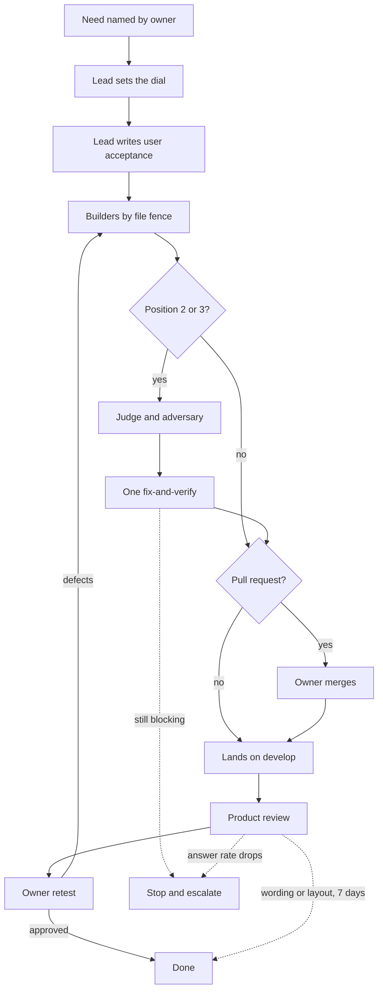

# Bossman mode

Autonomous execution. The plan exists. Execute it without asking questions.

This file and its four reference files are the one home of the build loop. Since 2026-09-25 nothing else describes it: `docs/build/Build_workflow_cadence.md` keeps only the provider mapping, and `docs/build/Phase_6_execution_flow.html` shows the loop as it stood on 2026-09-24. This file carries what is true for every change:

- The dial
- The team
- The flow and the stages
- The budgets
- Where everything is written

It points at the one reference file the current stage needs, so a review round does not pay for the dispatch instructions and a single card does not pay for either.

Redesigned on 2026-09-24 from `docs/build/Bossman_mode_redesign.md`, whose eight decisions the product owner accepted in full ("Accept all eight"). They are the last eight rows of `DECISIONS.md` dated that day. What the old loop did:

- It ran a premise gate on every phase.
- Its cap on review rounds could be authorised away.
- It never looked at the deployed product.

It certified 35 phases, after which the golden questions answered in 13 of 85 runs. The loop below ends every change on the running product.

Merged into one cadence on 2026-09-25. The 2026-09-24 decision scheduled the merge for after the next build phase closed, and three closed on 2026-09-25. The build harness review of that day found a documentation-only phase paying for a judge round while a fix-loop card with runnable behaviour got no engineering review at all. The product owner delegated the review's takeaways to the lead (`DECISIONS.md`, 2026-09-25, "The lead implements both harness reviews' takeaways").

## Table of contents

- [Invocation](#invocation)
- [Set the dial first](#set-the-dial-first)
- [Activation checklist, numbered phase only](#activation-checklist-numbered-phase-only)
- [The team](#the-team)
- [The flow](#the-flow)
- [The stages](#the-stages)
- [Budgets and stop conditions](#budgets-and-stop-conditions)
- [Where everything is written](#where-everything-is-written)
- [What to read, and when](#what-to-read-and-when)
- [Behaviour at every position](#behaviour-at-every-position)
- [Known weak points](#known-weak-points)
- [Status check](#status-check)

## Invocation

```text
/bossman                 # activate; the dial decides what runs
/bossman --phase 8.7     # execute or re-enter a numbered phase (requires an existing plan)
/bossman --ui            # kept as an alias for starting from a card on the board; the dial, not the flag, decides what runs
/bossman --status        # show current progress
/bossman --stop          # exit, return to normal collaboration
```

## Set the dial first

One cadence, three positions. The dial is the product owner's, accepted on 2026-09-24 in these words (`docs/build/Bossman_mode_redesign.md`, Part 2): "A copy or layout fix is builder, clerk and product review. A change to runnable behaviour adds the judge and the adversary. Auth, the graph credential, the event schema or `.claude/` adds a branch and a pull request."

| Position | The change | Who runs, in order | Read |
| --- | --- | --- | --- |
| 1 | A copy or layout fix: text, placement, styling, a document, a script the product never runs | Builder, clerk, product review, the owner's retest | `reference/UI_fix_loop.md`, `reference/Product_review.md` |
| 2 | A change to runnable behaviour: anything that changes what the product does when a question is asked, including every answer-path change | Position 1 plus the judge and the adversary, then one fix-and-verify, all before the change is pushed | `reference/Review_rounds.md` as well |
| 3 | Auth, the graph credential, the event schema or anything under `.claude/` | Position 2 plus a branch and a pull request, which the owner merges | `reference/Phase_execution.md` step 7 as well |

How to read it:

- Per change. For a numbered phase, the highest position any of its tickets needs sets the phase's position.
- Up, when in doubt. A change whose position is argued is at the higher one.
- An answer-path change is position 2 at least, and the golden consistency run blocks it at every position. The delegation of 2026-09-25 keeps this in so many words: an answer-path change still gets its review rounds and the golden run.
- The product reviewer runs before the owner's retest at every position, and the owner's verdict closes at every position, with one exception: a wording or layout card the product reviewer passed at both widths closes by itself seven days after reaching Retest unless the owner objects (the product owner's decision of 2026-09-25 (DECISIONS.md, "A wording or layout card closes by itself seven days after reaching Retest")).

Two shapes of work run through the dial:

- A card alone: one item on `testing/UI_fix_plan.md`, built and pushed alone, one card per push. At positions 1 and 2 it lands on `develop` directly. That is the cadence, not a favour.
- A numbered phase: cards that must land together, or a technical specification Section 25 deliverable, opened with a ledger under `tracker/phase_N.M.md` (`reference/Phase_execution.md`). A numbered phase keeps its branch and pull request at every position. The standing decision of 2026-07-26 that build phases get a branch, reaffirmed on 2026-09-12 and encoded in `.claude/rules/git-workflow.md`, stands beside the dial: the dial says what each kind of change adds and takes nothing away. Inside the phase, the dial says whether the judge and the adversary run.

A defect the product owner hit is not automatically small. Row 10.2 read like a frontend change and needed a schema migration and a data-retention decision, so it escalated rather than being fixed. When a card turns out to need a migration, a locked-document edit or a widened security control, stop and hand it back.

Phase 8.6 opened on 2026-09-25 under the two modes this cadence replaces, and it finishes under them. The dial applies to work opened after it merges. The two-mode text is in this file's history before 2026-09-25.

## Activation checklist, numbered phase only

Verify all three before entering:

1. Plan exists: a written plan with numbered phases, or a set of board cards the owner approved as one phase.
2. Architecture agreed: the user has explicitly approved the approach.
3. Phase scope is clear: the current phase has defined deliverables.

If any is missing, say "We need [missing item] before entering bossman mode. Let's nail that down first."

A card alone needs none of this. Its card on the board is its plan (`reference/UI_fix_loop.md`).

## The team

Six roles. The tier follows one test: spend reasoning where a mistake cascades. Tier names map to models in `docs/build/Build_workflow_cadence.md` under "Provider mapping", the one place a product name appears.

| Role | Tier and effort | Does | Never |
| --- | --- | --- | --- |
| Tech lead, the session itself | Depth, high | Sets the dial, picks the phase, splits the work by file, writes each ticket's acceptance in the user's words, integrates, decides, reports to the owner | Writes the code it will judge |
| Builder | Balance, medium | One ticket, a named file fence, and the tests for that ticket | Dispatches agents, edits outside its fence |
| Clerk | Speed, low | Board rows, counts, the handoff file and doc sync, by copying fields from their source | Restates a fact in its own words |
| Judge | Depth, high | One round on the diff at position 2 and 3: correctness, security, the `production-standards` gates, and "break it, does a test go red" as one checklist line | Closes its own findings, reviews its own fixes |
| Adversary | Depth, high | One round at position 2 and 3, hunting the confident wrong answer and the lying trust signal | Runs a second round, or runs at position 1 |
| Product reviewer | A script captures; depth tier, medium effort, judges | Drives the deployed develop app: every changed screen at 1280 and 390 beside `docs/build/design/design-system/prototype/app.html`, the golden questions with time to answer, then reads answers against the five-line rubric and reports answered and answered well | Closes anything; the owner's verdict closes |

Two roles reappear inside the fix-and-verify round under other names:

- A fix agent is a builder on named findings: balance tier, medium effort, one agent per file (`reference/Review_rounds.md`, Rule 1).
- The fresh verifier is a judge with no prior context: depth tier, high effort. It re-derives the judge's verdicts from the code and tests, so it carries the judge's cost of a miss.

Why these tiers, one line each:

- Lead: a bad split cascades into every worker.
- Builder: bounded work with clear acceptance; build phase 4.4's two builders shipped on this tier.
- Clerk: mechanical, and a sub-agent that restated `PROGRESS.md` in its own words introduced six false sentences (LEARNINGS.md, 2026-09-24).
- Judge: the only role with measured evidence that a weaker review costs whole rounds (build phase 2.1).
- Adversary: it found criticals in nearly every phase it ran, including the UI phases.
- Product reviewer: it does the owner's kind of judgement, so it gets the strong tier; a capture is a script, so the model only judges.

Two notes on the tiers:

- These are build-time capability tiers, assigned to the agents that write System 3 itself. The product's own guard, plan and synth tiers route models per user query at serve time. Both are called tiers and they name different things.
- Delegation has a fixed setup cost and a phase has 8 dispatches. Do not shard a phase into many tiny tasks to parallelise it. Each dispatched agent carries a task worth its overhead.

The product reviewer is an agent, `.claude/agents/product-reviewer.md`, with read-only tools plus Bash for the capture and no Write or Edit. Its procedure and its five-line rubric are in `reference/Product_review.md`. It is a pre-screen: it tells the owner what to look at first, and it never moves a card or a ticket.

No other roles. Research is the lead's job or the builder's own reading, and tests are written by the builder who owns the ticket.

Three halves of verification, and the reason each exists:

- Agents verify the engineering. The judge asks whether it works, whether it is correct and whether it is safe to ship, and must produce cited evidence for every claim. The adversary asks whether it can be made to fail in a way nobody wrote a check for.
- The product reviewer pre-screens the product. It looks at the deployed screens at 1280 and 390 beside the design, asks the golden questions again, and reads the answers against the five-line rubric. It closes nothing.
- The product owner verifies the product. Is this the right thing to have built, does it meet the user need, and does it actually feel right. No agent can answer that last one, and their verdict is the only thing that sets `done`, apart from the seven-day close of a wording or layout card they have not objected to.

The adversary sits on the boundary. It hunts the confident wrong answer, an engineering failure in mechanism and a product failure in consequence. It belongs to the agent half because finding it is mechanical; what it protects is the trust moat, which is a product concern.

### What was measured behind the tiers

Most roles were re-tiered on 2026-08-02 from a prior default of depth and high. Reasoning effort is a dial for how many thinking tokens a model spends before it writes. Those tokens are billed as output and never appear in the response. They are replayed as input on every later turn of a session, so one high rung keeps charging for the rest of the phase. An analogy: a taxi meter running while the driver plans the route, with the meter hidden behind the seat; the trip looks the same to you either way. Treat effort as a latency and cost setting first, and raise a rung only against a cited miss.

The evidence, external:

- Dropping reasoning effort from high to medium gave 76 percent fewer output tokens at the same task-completion rate.
- Each effort rung costs roughly twice the rung below it.
- Thinking tokens reach up to 40 percent of total output spend, and they compound across a phase because they are replayed as input.
- A mid-tier model costs about 0.6 times a top-tier model and performs comparably on most development work.

The evidence, internal (`LEARNINGS.md`, 2026-07-31, the `harness/harness.py` tier configuration):

- The plan tier at `effort: high` spent 970 of 1014 output tokens reasoning about one line of Cypher.
- Over five failing query shapes, two runs each: `high` totalled 163.0 seconds with a worst case of 84.3 seconds on a multi-hop query; `effort: none`, a rung below `low`, totalled 6.1 seconds with a worst case of 2.2.
- All five runs were correct at both settings: "a 27x latency multiple for no measurable quality".

Reading the two together: the internal result proves `none` was safe for one bounded, fixed-schema generation and does not by itself prove `medium` is safe for every role. The external 76 percent figure is the direct evidence for the high-to-medium move. The judge and the adversary did not move, and `reference/Review_rounds.md` says why: this repository has direct evidence that a weaker review costs whole rounds. The lead's split stays on depth and high for the cascading reason above.

What would justify raising a tier or a rung back: a specific, cited miss, recorded as a finding in a `tracker/phase_N.M.md` ledger or as a `LEARNINGS.md` entry naming the tier or effort as a contributing cause. A feeling that a role seems important is not that bar. Per `goal-contracts`, this section is a verify surface for the table above.

## The flow



A pull request exists at position 3 and for every numbered phase. Where there is one, the owner merging it after reading the checkpoint is what lands the change on develop. Develop then deploys, the product reviewer runs against it and the owner retests there. Tickets merge at `in-review` and reach `done` only on the owner's verdict, or by the seven-day close of a wording or layout card the reviewer passed.

The order of work, at every position, is what a person sees first: answer quality and speed ahead of technical specification Section 25's order (DECISIONS.md, 2026-09-24). Section 25 still says what each phase delivers and which dependencies are real. It no longer says what comes next.

## The stages

Each change walks these stages. The dial says which of them run:

- Stage 6 runs at positions 2 and 3.
- Stage 8's pull request exists at position 3 and for every numbered phase.
- A card alone takes the shorter opening in `reference/UI_fix_loop.md` in place of stages 1 to 4.

| # | Stage | Who | Tier | Effort |
| --- | --- | --- | --- | --- |
| 1 | Pick the phase by what a person sees first, read `HANDOFF.md`, verify real dependencies are merged, set the dial | Lead | depth | high |
| 2 | Read `LEARNINGS.md` filtered to this phase | Lead | depth | low |
| 3 | Split into tickets by file fence, each with an acceptance sentence in the user's words and its test command; a card with no known cause becomes a diagnosis ticket only; read the design coverage table before ticketing any screen | Lead | depth | high |
| 4 | Transport preflight, cut and push the branch, plan the 8 dispatches, dispatch builders from the pushed branch | Lead | depth | low |
| 5 | Builders work tickets in parallel, each writing the tests for its own ticket | Builders | balance | medium |
| 6 | One judge round, one adversary round, then one fix-and-verify round (positions 2 and 3) | Judge, adversary, fix agents, a fresh verifier | depth; fix agents balance | high |
| 7 | Gates: `verify`, then `ship`'s CI gates run locally | Lead | depth | medium |
| 8 | Checkpoint, tickets left at `in-review`, the pull request where one exists | Lead, clerk | clerk speed | low |
| 9 | Read the checkpoint and merge, where there is a pull request | Product owner | human | n/a |
| 10 | Product review of the deployed develop app; the golden consistency run blocks an answer-path change | Product reviewer: a script captures, the model judges | depth | medium |
| 11 | Retest on develop; the verdict sets `done` or sends defects back to stage 5; a wording or layout card the reviewer passed closes after seven days without an objection | Product owner | human | n/a |

Recording what broke is not a stage. Whoever hits a failure that cost more than five minutes writes it to `LEARNINGS.md` before continuing (the `learnings` skill).

Stage 7 lists only gates a ledger records as run. Four skills stay available to invoke by name and none is in the chain: `eval-harness`, `dev-standards`, `release-workflow` and `python3 tracker/check_learnings_coverage.py`. `reference/Phase_execution.md` step 5 says why.

## Budgets and stop conditions

Every phase runs inside these limits (DECISIONS.md, 2026-09-24). Hitting one is a stop, not a failure to hide.

| Budget | Limit | Basis in the record | On hitting it |
| --- | --- | --- | --- |
| Wall clock, phase open to "ready for owner" | 8 hours | Median phase 4 hours, 75th percentile 10; the five phases past 18 hours (2.1, 3.1, 3.4, 4.15, 5.0) each ran four or more review rounds | Stop, run `/phase-checkpoint` so `HANDOFF.md` carries the stop, and escalate with options |
| Review rounds | 1 judge and 1 adversary, then 1 fix-and-verify | 17 rounds past two, in 9 of the 13 phases reviewed after the cap of 2026-08-18 | Merge with the open item named, or revert and re-split. There is no third round, ever, even with the owner's authorisation |
| Agent dispatches | 8 per phase, reviewers and the product reviewer included; workers never dispatch | `plan-then-fan-out`'s own ask-first line is 8; the redesign's diagnosis reached about 17 because workers fanned out | Ask the owner before the ninth |
| Instrument share | More than half of a round's findings are about the phase's own tests or documents | Late-build share 43 to 45 percent; build phase 6.0 at 8 of 12 | Stop writing checks and escalate: the effort has moved off the product |
| Answer rate | Any drop in the golden run's answered count, measured over its three passes | The latest accepted run is the floor; `reference/Product_review.md` names it | Stop and fix, or revert, before anything else lands on develop |
| Tokens | Not capped | No billing log exists. Since 2026-09-25 every dispatch's tokens go into the ledger's dispatch table from the task notification, the first record of build-side spend | Dispatch count and wall clock are the proxy |

Rule 4 of `reference/Review_rounds.md` is unchanged: a regression found inside a fix stops the round on the spot.

Exit immediately on any of these:

1. An architecture-level change is needed: something in the plan is fundamentally wrong.
2. A blocker with no reasonable workaround: missing credentials, a broken dependency, or an ambiguous requirement that could go either way with major consequences.
3. The review budget is spent: round 2 still returns a blocking finding. Hand the owner the four-item handover in `reference/Review_rounds.md`, Rule 3, with exactly two options, merge with the item named open or revert. A third round is not an option.
4. A regression sits inside a prior fix in this same phase. File the finding, then stop mid-round without finishing it, per Rule 4.
5. Any budget in the table above is hit.
6. The phase is complete: normal checkpoint.
7. The user says stop.

Conditions 3 and 4 exist because build phases 2.1 and 4.2 hit both repeatedly when neither was a stop condition. The two-round cap of 2026-08-18 then held in 4 of the 13 phases reviewed after it, because each extra round could be authorised; 17 extra rounds followed. That is why the cap now has no exception.

## Where everything is written

| File | Holds | Written by | When |
| --- | --- | --- | --- |
| `testing/UI_fix_plan.md` | The board: To do, Build in progress, Retest. One card per change, written before it is built | Lead | When work is identified, and as it moves |
| `testing/UI_fixes_done.md` | The detail behind every card, every closed item, and "Where we stopped", the durable cutoff | Lead, clerk | End of every session |
| `tracker/phase_N.M.md` | A numbered phase's goal contract, its budget with the dispatch table, tickets, history, and every finding as a ledger row | Lead, builders, judge, adversary, verifier, product reviewer, each on its own states | Continuously |
| `tracker/BOARD.md` | Frozen on 2026-09-25 as the record of build phases through 6.2 | Nobody, for current work | Never |
| `HANDOFF.md` | What a fresh session needs: what is live, what awaits the owner, the one next action | `/phase-checkpoint` | Every checkpoint, and at any budget stop |
| `tracker/Living_documents.md` | Which documents the session-closing skills keep current, and their shape | `/phase-checkpoint` | At its decision guard |
| `testing/Developer/reports/<date>_<topic>/` | Evidence: a product review's screenshots, golden run and report; a diagnosis; an investigation's findings | The product reviewer's capture commands; whoever investigated | Stage 10, and at the moment of finding |
| `testing/Test_queries_and_workflows.md` | The exact queries to type and what a person should see, by query number, which Retest cards point at | Lead | When a change goes live |
| `requirements/Plan.md` | The build narrative and the dated revision history | `/phase-checkpoint` | Every checkpoint |
| `LEARNINGS.md` | What broke, what was tried, what fixed it | Whoever hit the problem | Before continuing past a failure that cost more than five minutes |
| `DECISIONS.md` | Choices between alternatives | Lead | When a choice is made |
| Source and tests | The product | Builders | During the change |
| PRD, tech spec, memo | The locked contract | Nobody | Frozen |

No per-round report file is written under `tracker/`. A reviewer's findings are ledger rows in the phase file, or rows in the report folder for a card alone.

## What to read, and when

Read the file for the stage you are at. Do not read all of them at phase open.

| Stage | Read |
| --- | --- |
| Tier names to models | `docs/build/Build_workflow_cadence.md`, "Provider mapping" |
| Opening, splitting and dispatching a numbered phase, what a worker is handed, the ledger and its dispatch table, gates, checkpoint, merge | `reference/Phase_execution.md` |
| The judge, the adversary, the fix-and-verify round, the ledger rules | `reference/Review_rounds.md` |
| The product review, the golden consistency run, answered and answered well, the premise check | `reference/Product_review.md` |
| A card alone, what the lead decides, how questions reach the owner | `reference/UI_fix_loop.md` |
| Ticket format, ticket states, the `Round` and `Regression of` fields | `task-tracker` skill |

Answer behaviour is the one place a premise check survives. For an answer-path change the premise check is the golden consistency run in `reference/Product_review.md`. It blocks. Nothing else in this cadence writes a premise gate or a mutation harness file. Breaking a control to see a test go red is one line on the judge's checklist.

## Behaviour at every position

The `bossman-mode` rule states which rules this mode suspends and which it preserves. It is in context for the lead's session, so it is not restated here: since 2026-09-26 its `paths:` frontmatter loads it, with the lead's other orchestration rules, when the lead reads `HANDOFF.md` at stage 1 or any file of this skill. Six things are worth repeating because they are the ones most often relaxed under time pressure:

- Every other rule still binds. `v1-scope-boundary` binds hardest here, not least, because autonomy is exactly when scope creep happens. `production-standards` gates hold on a one-line fix as they hold on a phase.
- Write a finding the moment it is established, before doing anything else with it. An agent's context is not storage.
- The finder is never the closer. Whoever raised an item never closes it.
- Workers never dispatch agents. Every worker brief says so, and a worker that thinks it needs help reports that to the lead instead.
- No fix without a diagnosis. A card whose cause is unknown gets a diagnosis ticket and nothing else until the lead has read the written diagnosis.
- The product reviewer runs before every owner retest, at every position, and every answer-path change waits on the golden consistency run.

## Known weak points

Stated rather than hidden, because each one is a place the cadence can quietly fail:

- The golden run's outcomes vary between runs of one question. Three passes reduce that noise and do not remove it, so a real drop and a noisy one can look alike. Only the owner may accept a drop.
- The golden run asks 50 questions at the default depth. A defect confined to a question shape the set does not hold, or to Plain language, is invisible to it; the product reviewer's depth comparison covers three questions only.
- The golden fixtures have no named domain sign-off owner. The run counts answered questions, not correct ones, so a fluent wrong answer still counts as answered; "answered well" (`reference/Product_review.md`, Step 2), the rubric read and the owner's retest are what catch it.
- The product review runs after merge, because develop is the only deployment a branch reaches. A drop blocks further landings and forces a fix or a revert; it cannot stop the merge that caused it.
- `tracker/BOARD.md` is frozen, and the hook that re-rendered it after every edit is removed under the product owner's item-by-item approval of 2026-09-25 (DECISIONS.md), the board file staying as history. Its rendered page is a record too: nothing regenerates it, so a reader who wants current work reads `testing/UI_fix_plan.md` and the open ledgers, never the page.

## Status check

On `--status`, print one line each:

- The dial position, and the current phase or card.
- What is done so far.
- The decisions taken.
- The blockers.
- Hours since phase open, of 8.
- Dispatches used, of 8, and tokens spent, both read from the ledger's dispatch table, never counted from memory.
- Review rounds used, of 2.
- The latest golden answered count against the floor, and answered well of the fixed ten.
