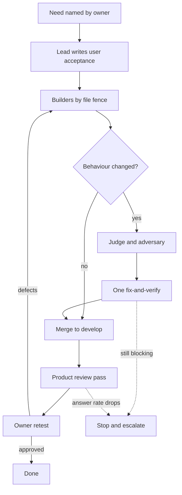

# Bossman mode

Autonomous execution. The plan exists. Execute it without asking questions.

This file is a router. It carries what is true in every mode:

- The team
- The flow
- The budgets

It points at the one reference file the current stage needs, so a review round does not pay for the dispatch instructions and a UI fix does not pay for either.

Redesigned on 2026-09-24 from `docs/build/Bossman_mode_redesign.md`, whose eight decisions the product owner accepted in full ("Accept all eight"). They are the last eight rows of `DECISIONS.md` dated that day. The short reason: every check the old harness ran pointed at the code and none at the product a person uses. After 35 merged phases, the golden questions answered in 13 of 85 runs.

## Table of contents

- [Invocation](#invocation)
- [Pick the mode first](#pick-the-mode-first)
- [Activation checklist, build-phase mode only](#activation-checklist-build-phase-mode-only)
- [The team](#the-team)
- [The flow](#the-flow)
- [Budgets and stop conditions](#budgets-and-stop-conditions)
- [What to read, and when](#what-to-read-and-when)
- [Behaviour in both modes](#behaviour-in-both-modes)
- [Status check](#status-check)

## Invocation

```text
/bossman                 # activate, build-phase mode (requires an existing plan)
/bossman --phase 2       # execute or re-enter a specific phase
/bossman --ui            # activate UI fix mode
/bossman --status        # show current progress
/bossman --stop          # exit, return to normal collaboration
```

## Pick the mode first

The two modes differ in what verifies the work.

| Question | Build-phase mode | UI fix mode |
| --- | --- | --- |
| Delivers | One phase, chosen by what a person sees first | A defect the product owner hit on the deployed develop app |
| Git | Phase branch, one PR | Straight to `develop`, no branch, no PR |
| Verified by | One judge round, one adversary round, one fix-and-verify, the product reviewer, then the product owner | The product owner's live retest, with the product reviewer as the agent pre-screen |
| A ticket reaches done when | The product owner gives a verdict on develop | The product owner gives a verdict on develop |
| Read | `reference/Phase_execution.md`, `reference/Review_rounds.md`, `reference/Product_review.md` | `reference/UI_fix_loop.md`, `reference/Product_review.md` |

Choose build-phase mode when the work does any of these:

- Delivers a numbered phase.
- Changes the agent loop's contract or adds a tool.
- Touches auth, the graph credential or the event schema.

Choose UI fix mode when the work is a card in `testing/UI_fix_plan.md` or is about to become one. It is a product-owner decision dated 2026-09-12 and it replaces the build-phase cadence for UI fixes only.

A defect the product owner hit is not automatically small. Row 10.2 read like a frontend change and needed a schema migration and a data-retention decision, so it escalated rather than being fixed. When a UI item turns out to need a migration, a locked-document edit or a widened security control, stop and hand it back.

The two modes merge into one cadence with a risk dial, decided on 2026-09-24 and scheduled for AFTER the next build phase closes, so the dial is tried once before it replaces the fix loop. Until then they stay two modes, and the develop carve-out in `.claude/rules/bossman-mode.md` stays bounded by mode. The dial, as decided, for whoever makes the merge:

- A copy or layout fix: builder, clerk and product review.
- A change to runnable behaviour: adds the judge and the adversary.
- Auth, the graph credential, the event schema or `.claude/`: adds a branch and a pull request.

## Activation checklist, build-phase mode only

Verify all three before entering:

1. Plan exists: a written plan with numbered phases.
2. Architecture agreed: the user has explicitly approved the approach.
3. Phase scope is clear: the current phase has defined deliverables.

If any is missing, say "We need [missing item] before entering bossman mode. Let's nail that down first."

## The team

Six roles. The tier follows one test: spend reasoning where a mistake cascades. Tier names map to models in `docs/build/Build_workflow_cadence.md` under "Provider mapping".

| Role | Tier and effort | Does | Never |
| --- | --- | --- | --- |
| Tech lead, the session itself | Depth, high | Picks the phase, splits the work by file, writes each ticket's acceptance in the user's words, integrates, decides, reports to the owner | Writes the code it will judge |
| Builder | Balance, medium | One ticket, a named file fence, and the tests for that ticket | Dispatches agents, edits outside its fence |
| Clerk | Speed, low | Board rows, counts, the handoff file and doc sync, by copying fields from their source | Restates a fact in its own words |
| Judge | Depth, high | One round on the diff: correctness, security, the `production-standards` gates, and "break it, does a test go red" as one checklist line | Closes its own findings, reviews its own fixes |
| Adversary | Depth, high | One round on any phase that changes runnable code, hunting the confident wrong answer and the lying trust signal | Runs a second round, or runs on a documentation-only change |
| Product reviewer | A script captures; depth tier, medium effort, judges | Drives the deployed develop app: every changed screen at 1280 and 390 beside `docs/build/design/design-system/prototype/app.html`, the golden questions with time to answer, then reads each answer against the five-line rubric | Closes anything; the owner's verdict closes |

Why these tiers, one line each:

- Lead: a bad split cascades into every worker.
- Builder: bounded work with clear acceptance; build phase 4.4's two builders shipped on this tier.
- Clerk: mechanical, and a sub-agent that restated `PROGRESS.md` in its own words introduced six false sentences (LEARNINGS.md, 2026-09-24).
- Judge: the only role with measured evidence that a weaker review costs whole rounds (build phase 2.1).
- Adversary: it found criticals in nearly every phase it ran, including the UI phases.
- Product reviewer: it does the owner's kind of judgement, so it gets the strong tier; a capture is a script, so the model only judges.

The product reviewer is an agent, `.claude/agents/product-reviewer.md`, with read-only tools plus Bash for the capture and no Write or Edit. Its procedure and its five-line rubric are in `reference/Product_review.md`. It is a pre-screen: it tells the owner what to look at first, and it never moves a card or a ticket.

No other roles. Research is the lead's job or the builder's own reading, and tests are written by the builder who owns the ticket.

## The flow



In build-phase mode the merge to develop is the owner merging the phase's pull request after reading the checkpoint. Develop then deploys and the product reviewer runs against it. The owner retests there. Tickets merge at `in-review` and reach `done` only on the owner's verdict.

The order of work, in both modes, is what a person sees first: answer quality and speed ahead of technical specification Section 25's order (DECISIONS.md, 2026-09-24). Section 25 still says what each phase delivers and which dependencies are real. It no longer says what comes next.

## Budgets and stop conditions

Every phase runs inside these limits. Hitting one is a stop, not a failure to hide.

| Budget | Limit | On hitting it |
| --- | --- | --- |
| Wall clock, phase open to "ready for owner" | 8 hours | Stop, run `/phase-checkpoint` so `HANDOFF.md` carries the stop, and escalate with options |
| Review rounds | 1 judge and 1 adversary, then 1 fix-and-verify | Merge with the open item named, or revert and re-split. There is no third round, ever, even with the owner's authorisation |
| Agent dispatches | 8 per phase, reviewers and the product reviewer included; workers never dispatch | Ask the owner before the ninth |
| Instrument share | More than half of a round's findings are about the phase's own tests or documents | Stop writing checks and escalate: the effort has moved off the product |
| Answer rate | Any drop in the golden run's answered count, measured over its three passes | Stop and fix, or revert, before anything else lands on develop |
| Tokens | Not set: no billing log exists in this repository | Dispatch count and wall clock are the proxy |

Exit immediately on any of these:

1. An architecture-level change is needed: something in the plan is fundamentally wrong.
2. A blocker with no reasonable workaround: missing credentials, a broken dependency, or an ambiguous requirement that could go either way with major consequences.
3. The review budget is spent: round 2 still returns a blocking finding. Hand the owner the four-item handover in `reference/Review_rounds.md`, Rule 3, with exactly two options, merge with the item named open or revert. A third round is not an option.
4. A regression sits inside a prior fix in this same phase. File the finding, then stop mid-round without finishing it, per Rule 4.
5. Any budget in the table above is hit.
6. The phase is complete: normal checkpoint.
7. The user says stop.

Conditions 3 and 4 exist because build phases 2.1 and 4.2 hit both repeatedly when neither was a stop condition. The two-round cap of 2026-08-18 then held in 4 of the 13 phases reviewed after it, because each extra round could be authorised; 17 extra rounds followed. That is why the cap now has no exception.

## What to read, and when

Read the file for the stage you are at. Do not read all of them at phase open.

| Stage | Read |
| --- | --- |
| The cadence at a glance: stages, model assignment, provider mapping, where everything is written | `docs/build/Build_workflow_cadence.md` |
| Picking the phase, splitting it, dispatching builders, what a worker is handed, gates, checkpoint | `reference/Phase_execution.md` |
| The judge, the adversary, the fix-and-verify round, the ledger | `reference/Review_rounds.md` |
| The product review and the golden consistency run | `reference/Product_review.md` |
| Any UI fix | `reference/UI_fix_loop.md` |
| Board format, ticket states, the `Round` and `Regression of` fields | `task-tracker` skill |

Answer behaviour is the one place a premise check survives. For an answer-path change the premise check is the golden consistency run in `reference/Product_review.md`. It blocks. Nothing else in this cadence writes a premise gate or a mutation harness file. Breaking a control to see a test go red is one line on the judge's checklist.

## Behaviour in both modes

The `bossman-mode` rule in `.claude/rules/` auto-loads every session and states which rules this mode suspends and which it preserves. It is already in context, so it is not restated here. Five things are worth repeating because they are the ones most often relaxed under time pressure:

- Every other rule still binds. `v1-scope-boundary` binds hardest here, not least, because autonomy is exactly when scope creep happens. `production-standards` gates hold on a one-line fix as they hold on a phase.
- Write a finding the moment it is established, before doing anything else with it. An agent's context is not storage.
- The finder is never the closer. Whoever raised an item never closes it.
- Workers never dispatch agents. Every worker brief says so, and a worker that thinks it needs help reports that to the lead instead.
- The product reviewer runs before every owner retest, in both modes, and every answer-path change waits on the golden consistency run.

## Status check

On `--status`, print one line each:

- The mode, and the current phase or UI fix set.
- What is done so far.
- The decisions taken.
- The blockers.
- Hours since phase open, of 8.
- Dispatches used, of 8.
- Review rounds used, of 2.
- The latest golden answered count against the floor.
