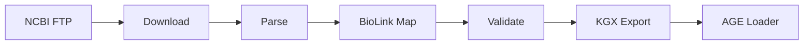

# Documentation standards

These rules apply to all `.md` files, all docstrings, and all README content in this repo. They override any conflicting style from the reference repos.

## Style fundamentals (writing-style.md applies)

- Sentence case for all headings and titles. Capitalize only the first word, proper nouns, acronyms, and named tools (BioLink, KGX, LinkML, PostgreSQL, Apache AGE, MONDO, ClinVar, NCBI Gene)
- No em dashes or en dashes. Use commas, "which/where", or split into separate sentences
- No bold. Use "Label:" instead of "**Label**"
- No emoji in section headers
- No horizontal rules between sections unless structurally needed
- After a colon, capitalize only if a complete sentence follows

## Python docstrings (Google style)

Required on every public function, every class, and every module.

```python
def parse_clinvar_chunk(
    chunk: pd.DataFrame,
    gene_symbols: set[str],
    config: PipelineConfig,
) -> pd.DataFrame:
    """Parse a chunk of ClinVar variant_summary records.

    Args:
        chunk: A pandas DataFrame slice from variant_summary.txt.gz.
        gene_symbols: Set of HGNC gene symbols to filter by.
        config: Pipeline configuration with significance filter.

    Returns:
        Filtered DataFrame containing only variants matching the gene set
        and clinical significance threshold.

    Raises:
        ValidationError: If a row is missing required columns.

    Example:
        >>> df = parse_clinvar_chunk(chunk, {"BRCA1", "BRCA2"}, config)
        >>> df["GeneSymbol"].unique().tolist()
        ['BRCA1', 'BRCA2']
    """
```

Class docstrings include `Attributes:`. Module docstrings include a one-paragraph purpose plus a "Key components" list.

## File naming

Markdown files in `docs/` follow `.claude/rules/file-naming.md`:

| Type | Format | Example |
|---|---|---|
| Plan | `Topic_plan.md` | `System_1_data_engineering_plan.md` |
| Reference | `Topic_reference.md` | `NCBI_databases_and_APIs_reference.md` |
| Decision | `Topic_decision.md` | `Neo4j_vs_AGE_decision.md` |
| Explanation | `Concept_explained.md` | `BioLink_explained.md` |

Sentence case with underscores. Lowercase the rest. Folders: `planning/`, `architecture/`, `context/`.

## Cross-references

Use relative paths from repo root, no leading `/`:

```markdown
See `docs/System_1_data_engineering_plan.md` section "Pipeline architecture".
Reference pipeline at `reference/ncbi_ai_agents-ncbi-kg/KG/pipeline/src/glucose_metabolism_kg/`.
File-and-line refs use the format `path/file.py:42`.
```

In code-aware contexts (CLAUDE.md, SETUP.md), use the markdown link format `[file.py:42](path/file.py#L42)` so the IDE renders it clickable.

## What every README should have

Each major folder gets a `README.md` with these sections in this order:

1. One-paragraph purpose
2. Folder structure (tree, max 2 levels deep)
3. How to run / how to use
4. Inputs and outputs
5. Cross-references to related folders

Skip "badges", "table of contents", "contributors", and "version history" sections. Those are for public OSS repos, not internal pipeline code.

## Mermaid diagrams

Use them for pipeline flow, system boundaries, and entity relationships. Rules:

- Node labels under 30 characters
- No literal `\n` or `<br/>` inside labels (split into separate nodes)
- Use `graph LR` for pipelines, `graph TB` for system architecture, `erDiagram` for schema
- One diagram per concept, not one mega-diagram



## DECISIONS.md format

Append-only table. Never edit or delete prior rows. New rows go at the bottom (or top — pick one and stick with it; this repo uses bottom-append).

```markdown
| Date | Decision | Alternatives considered | Why |
|------|----------|------------------------|-----|
| 2026-04-06 | What we chose | What we didn't | The reason |
```

When a decision is superseded, add a NEW row marked "(supersedes row from YYYY-MM-DD)" and edit the old row's "Decision" cell to prepend "(SUPERSEDED YYYY-MM-DD)".

## Docstring requirements per file type

| File type | Docstring required | Example |
|---|---|---|
| `system-01-data-pipelines/<db>/parser.py` | Module + every public function | `parse_gene_info`, `parse_clinvar_chunk` |
| `system-01-data-pipelines/shared/utils.py` | Module + every utility | `download_file`, `entrez_with_retry` |
| `system-02-knowledge-graph/loaders/age_loader.py` | Module + class + every method | `AGELoader`, `load_nodes`, `load_edges` |
| `tests/**/test_*.py` | Module only (test names are self-documenting) | `"""Tests for clinvar parser."""` |
| `*.md` in `docs/` | Front matter not required, but each file starts with H1 + 1-paragraph purpose | |

## Anti-patterns

- Title case headings (`# This Is Wrong`)
- Bold text in body content
- Emoji in section headers (`## 🚀 Quick Start`)
- Version banners at the top of every doc (`**v3.2 PRODUCTION-READY**`)
- "TODO" comments in committed code (use a GitHub issue or DECISIONS.md instead)
- Restating what code obviously does in a docstring
- Cross-references with absolute paths (`/Users/...`)

## Quick checklist

Before merging documentation changes:

- [ ] All headings sentence case
- [ ] No bold, no em dashes, no emoji headers
- [ ] All code examples have language hint (` ```python`, ` ```bash`)
- [ ] Cross-refs use relative paths from repo root
- [ ] New decisions logged in DECISIONS.md
- [ ] New folders have a README.md
- [ ] Public functions have Google-style docstrings
