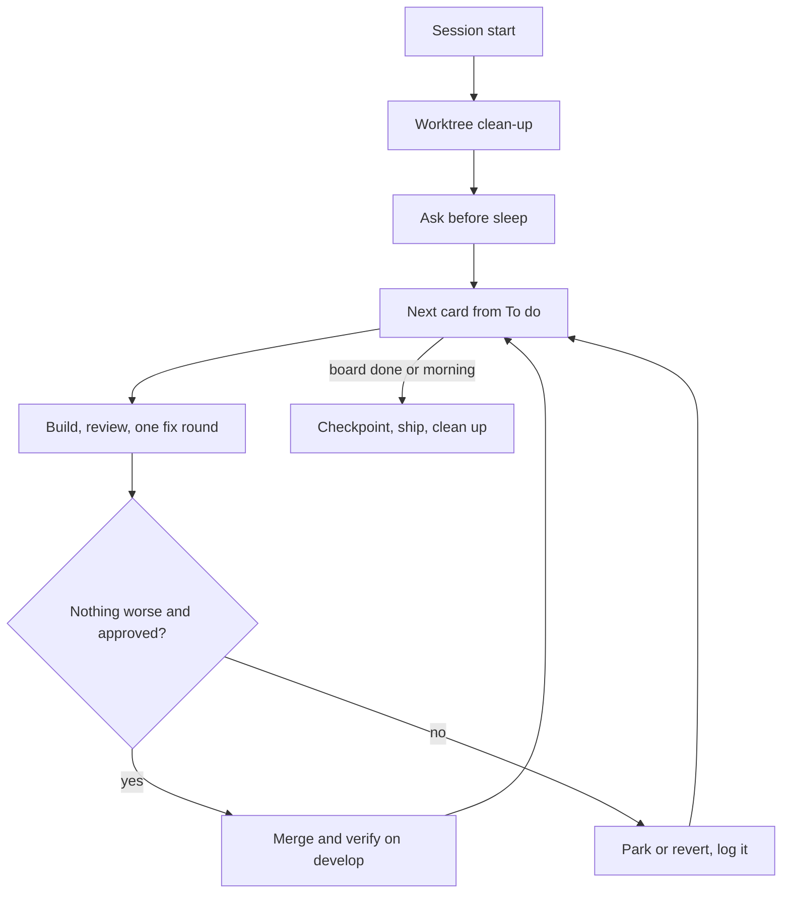

# Overnight development

The owner says "work overnight" before sleeping. The lead then runs the board on its own until morning and hands back a clean state. This skill is that procedure, so the owner never has to restate it.

It sits beside `bossman-mode` and refers to it rather than repeating it:

- `bossman-mode` owns the dial, the team, the review rounds and the budgets (`.claude/skills/bossman-mode/SKILL.md` and its `reference/` files).
- This skill owns what changes when nobody is awake to answer: what to ask before sleep, what never happens unattended, when a merge is allowed, how the night is verified and logged, and the state the morning finds.

Every step carries its reason from the record, cited by the date of its `DECISIONS.md` or `LEARNINGS.md` row.

## Table of contents

- [How it differs from bossman mode](#how-it-differs-from-bossman-mode)
- [Step 1: session start](#step-1-session-start)
- [Step 2: worktree clean-up](#step-2-worktree-clean-up)
- [Step 3: before the owner sleeps](#step-3-before-the-owner-sleeps)
- [Step 4: what to work on, in order](#step-4-what-to-work-on-in-order)
- [Step 5: each card](#step-5-each-card)
- [Step 6: verification](#step-6-verification)
- [Step 7: running agents](#step-7-running-agents)
- [Step 8: logging as the night goes](#step-8-logging-as-the-night-goes)
- [Step 9: close](#step-9-close)
- [Anti-rationalization](#anti-rationalization)
- [Exit checklist](#exit-checklist)

## How it differs from bossman mode

| Question | `bossman-mode` | This skill, overnight |
| --- | --- | --- |
| Who answers a decision | The owner, asked at once | The owner, asked before sleep; after that only a standing decision covers it, otherwise it is queued |
| How a card lands | Positions 1 and 2 land on develop directly | Every card takes a branch and a pull request, so each merge ties to the owner's stated approval and to CI |
| Who merges | The owner at position 3 | The lead, only for pull requests the owner approved before sleep, on the conditions the owner set |
| What verifies | The product reviewer, the golden run on answer-path changes, the owner's retest | The card's entries in the test queries document on deployed develop; the golden run only if the owner asks |
| How it ends | A checkpoint per phase or card | `/phase-checkpoint`, `/ship`, and local and remote back to their steady state |

The night at a glance:

## Step 1: session start

Run these in order, before anything else:

1. Check for an older lead in this repository. List the agent command line tool's native-binary processes with their start times, `ps -axo pid,lstart,command | grep "<cli-binary>"`, and read each one's working directory with `lsof -a -d cwd -p <pid>`. Stop an older lead only if the owner said so. Why: two leads drove the same agents at once, and two writers edited one file (LEARNINGS, 2026-09-27 and 2026-10-06).
2. `git status --short`, to see uncommitted work before touching anything.
3. `git worktree list`, to see every checkout the night inherits.
4. Read `HANDOFF.md`: what is live, what awaits the owner, the one next action.

## Step 2: worktree clean-up

Run this at session start and again at close. The Desktop folder syncs to iCloud, which evicts files from old worktrees, and `git status` on an evicted worktree hangs: five day-old worktrees each sat at 0% CPU for over 20 minutes (LEARNINGS, 2026-10-08).

1. Before any `git status` on an old worktree, count its evicted files: `find "<worktree>" -flags +dataless | wc -l`.
2. Survey only worktrees whose count is zero. An evicted worktree is read in the background first (its files downloaded), or left and named.
3. Run `/ship` Step 3's three checks on each surveyed worktree: unmerged commits, uncommitted work, reverted after merge.
4. Remove only what clears all three: `git worktree remove "<path>"`, then `git branch -d <branch>`. Never `-D`, which the git-workflow rule forbids; `/ship` Step 3 still names `--force` and `-D`, and the rule governs here.
5. Name everything left and why.

Two traps from the record:

- Paths hold a space. A loop that split `git worktree list` on spaces broke every path and removed nothing locally while the remote deletions went ahead (LEARNINGS, 2026-10-05). Quote every path and read `git worktree list --porcelain` line by line.
- Remove a merged worktree the same night it merges, so none sits long enough to be evicted (LEARNINGS, 2026-10-08).
- Downloading an evicted worktree is slow, about 1,000 files in 20 minutes, and asking iCloud for several at once drove the load average to 101 (LEARNINGS, 2026-10-08). Read one worktree's files at a time at low priority (`nice -n 19`), smallest first, and only when no builder is starting.
- An evicted worktree can lose its index: `git ls-files` lists nothing and every file reads as deleted. Rebuild the index with `git -C <path> reset -q` (it touches no file on disk), then compare any modified file with develop before calling it work (the night of 2026-10-08 to 09, `asu-audit`).

## Step 3: before the owner sleeps

Ask every foreseeable decision at once through the question tool, one question per decision, recommendation first, each option's cost in plain words, with a phone notification (`decision-cadence`). Whatever is not asked now waits for the morning.

Diagnose before asking. On the night of 2026-10-08, the cards' design and cost questions surfaced only from diagnoses written after the owner slept, so cards 17, 20, 29, 30 and 48 waited until the owner woke at 01:00 and answered a second round (DECISIONS, 2026-10-09). Dispatch the diagnoses of the night's cards first; while they run, ask the questions below; then ask every design or cost choice the diagnoses name, each with its options and costs, before the owner sleeps.

Always ask these:

| Question | Why it must be asked now |
| --- | --- |
| Which pull requests may merge tonight, and on what conditions (CI green, a fresh verifier finds nothing worse than develop)? | The permission layer refused an unattended merge it could not tie to the owner's approval, and a refused action is never pursued another way. The owner's "PR approved 204" in chat, then "Yes all pr if working are approved to be merged and pushed to ship", is what made the merges possible (DECISIONS, 2026-10-08) |
| What happens if a check fails: revert, park, or keep and report? | The owner set both rules for card 101 before sleeping, so the lead never had to guess (DECISIONS, 2026-10-08) |
| Does tonight run the golden run? The default is no | The owner chose "Test queries only" (DECISIONS, 2026-10-08); `bossman-mode` still says the golden run blocks answer-path changes, so the night's choice is the owner's, stated |
| May throwaway test accounts be created on develop? | The permission layer refused the lead's first attempt; the owner's yes made it possible (DECISIONS, 2026-10-08) |
| Which deployment settings may the lead change tonight, by name and value (for example `PER_QUERY_COST_CAP_USD=0.25` on develop's API)? | The permission layer refused a develop setting an earlier decision covered, and the owner's yes in their own words, given on waking, is what let it through (DECISIONS, 2026-10-09). Ask for each setting a merge will need |
| How much may the night's live checks spend, and is a phase's ceiling separate? | Develop's questions and the build's checks draw on one account; the owner set $20 for a phase and $6, then $8, for everything else (DECISIONS, 2026-10-08 and 2026-10-09) |

Record each answer as a `DECISIONS.md` row the moment it arrives. An approval in the owner's own words, on the record, is what the lead later points to.

## Step 4: what to work on, in order

Work the board's To do column, `testing/UI_fix_plan.md`, top down, with these rules:

- Skip a card that needs a design agreed with the owner. Card 56's remaining cases wait for one (DECISIONS, 2026-10-06; `HANDOFF.md`).
- Take first what a person using the product notices first (DECISIONS, 2026-09-24). Do not stack several answer-path changes behind one owed check, or a drop cannot be traced to one change (DECISIONS, 2026-10-08, the build order row).
- A card goes on the board before it is built. Loose ends a person would see became cards 103 and 104 before anyone built them (DECISIONS, 2026-10-08).
- Do not take Factory's lane. Its brief, `docs/build/Factory_onboarding.md`, names its next cards, and building one leaves the brief stale and two agents on one card (DECISIONS, 2026-10-08).

Never done overnight, queued for the morning instead:

| Kind of change | Why |
| --- | --- |
| The security layer: hooks, settings, permissions, deny rules, guarding mods, card 40 | Each change needs the owner's item-by-item yes (DECISIONS, 2026-10-06, card 40) |
| A production deploy | An agent never deploys to production without a human approving that action (`CLAUDE.md`, "Working agreements") |
| A live migration, which includes any migration file | Every develop deploy runs `alembic upgrade head` (`railway.json`), so a merged migration is a live migration; the owner reserves every one (DECISIONS, 2026-10-08, cards 54 and 71) |
| A write to the knowledge graph | Never without a human approving that specific action (`CLAUDE.md`, "Working agreements") |

## Step 5: each card

Follow `bossman-mode` for the dial, the roles and the round budget. Overnight adds these steps:

1. The lead makes the worktree and branch itself: `git worktree add "<path>" -b fix/cardN-short origin/develop`. Agents dispatched with isolation cannot run the project's Python, because the guard misreads the space in the project's path (the lead's practice since 2026-09-27). Put every new worktree outside iCloud, under a home folder with no space in its path such as `~/asu-wt/<name>`: seven new worktrees under the Desktop drove the load average to 101 within ten minutes (LEARNINGS, 2026-10-08).
2. A diagnosis first when the cause is unknown, written to `testing/Developer/reports/<date>_cardN/diagnosis.md`, read by the lead before any builder starts (`bossman-mode`, "Behaviour at every position").
3. A builder on the ticket, inside its file fence. Quote any owner rule the ticket depends on word for word, with its source path, and add no clause to it: a brief that paraphrased the Jev charge rule and added one clause got exactly that clause built, and it was one of three reasons the guardrail was parked (LEARNINGS, 2026-10-08). Tell the builder that a commit held by the guard is left staged and reported: every sub-agent commit was held on the night of 2026-10-08 while the lead's went through, so the lead reviews the staged diff, commits it, and runs `git status` after, since a builder's unstaged files are not in that commit (LEARNINGS, 2026-10-08).
4. A pull request against develop. Open pull requests a few minutes apart: five at once put twenty CI jobs in the queue and the waiting ones were cancelled, which reads as a failure (LEARNINGS, 2026-10-05).
5. A fresh judge and a fresh adversary on any card that changes runnable behaviour (`bossman-mode/reference/Review_rounds.md`). A copy or layout card runs neither at position 1, and still gets a fresh verifier before merge, because the overnight merge condition needs one.
6. At most one fix round, then a fresh verifier.
7. Merge only when nothing is worse than develop and the card is covered by the owner's approval from Step 3. Card 71's table part was held when its verifier found one narrow thing worse on a phone (DECISIONS, 2026-10-08). When the verifier finds something worse and the owner set that bar, the pull request stays open with two options written on it, merge with the items filed as cards or fix them first, as phase 8.7's did (DECISIONS, 2026-10-08).
8. A regression inside the fix round means revert that fix or park the card, never a third round. Card 54 merged with its fix-round line reverted when the verifier found the line raised a false alarm (DECISIONS, 2026-10-08; `bossman-mode/reference/Review_rounds.md`, Rules 3 and 4).

Never write a migration file, for the reason in Step 4. Card 54 kept its change to one constant with no schema change for exactly this reason (DECISIONS, 2026-10-08).

Merge with `gh pr merge <n> --merge`, never squash. Remove the card's worktree before deleting its branch: a worktree holding the branch stopped `--delete-branch` before the remote deletion (LEARNINGS, 2026-09-26). Wait for CI to register before reading `gh pr checks`, since a watch started seconds after a push reports "no checks reported" and exit 1 (LEARNINGS, 2026-09-30).

## Step 6: verification

The owner's test queries document, `testing/Test_queries_and_workflows.md`, is the pass or fail (DECISIONS, 2026-10-08, restating the owner's decision of 2026-09-26).

After each merge:

1. Confirm the Railway deploy of develop carries the merge commit, and that `/health` reports develop, as `/ship` confirms a deploy.
2. Dispatch the product reviewer (`bossman-mode/reference/Product_review.md`) to run the card's test-query entries on deployed develop at 1280 and 390.
3. Record the result in the card's report folder and the done file's retest list.

The golden run is optional, run only if the owner asks (DECISIONS, 2026-10-08, "Test queries only").

A live check run locally on a branch, before merge, times what a person sees only through `core.run.run_streaming()`, the path the web app uses; `core.run.run()` yields every event at the end and measures cost and content only (LEARNINGS, 2026-10-08). Read the account's credits before and after each run.

A full unit suite that fails only on tests that read or write saved answers is rerun once before the failures count: the suite shares the local user database with every other worktree (LEARNINGS, 2026-10-08).

Throwaway develop accounts need the owner's yes from Step 3. Their sign-in details live in a scratchpad file the script reads by path, never in a command, because the secret scanner blocks credential words in Bash text (LEARNINGS, 2026-07-28). The scratchpad is emptied when a session stops (LEARNINGS, 2026-09-26), so anything the morning needs is committed, never left there.

## Step 7: running agents

- Background by default, so the lead keeps working and the owner can interject.
- Independent cards in parallel. Cards that touch the same file run one after the other: parallel builders cut from one develop conflicted once the first merged (LEARNINGS, 2026-10-05).
- Workers never dispatch. Every brief says so (`bossman-mode`, "Behaviour at every position").
- One reviewer per worktree at a time. A judge mutating a file in the worktree the adversary was probing made a result impossible to reproduce (LEARNINGS, 2026-10-06). Builders never use `git stash`, whose stack every worktree shares (LEARNINGS, 2026-10-05).
- Limit concurrent full test suites to one. The machine restarted at a load average of 100 to 200 with several suites running (LEARNINGS, 2026-09-27), and on the night of 2026-10-08 the load reached 190 to 300 and suites timed out. Builders run the tests for their own files; CI is the final word on the full suite.

## Step 8: logging as the night goes

- Every decision taken for the owner is a `DECISIONS.md` row the moment it is taken, marked "Decided by the lead on the owner's behalf overnight", as every 2026-10-08 row is. The rows go on a docs branch, such as `chore/overnight-<date>`, which ships at the close.
- A failure costing more than five minutes is a `LEARNINGS.md` row before continuing (the `learnings` skill).
- A finding is written the moment it is established. An agent's context is not storage (`bossman-mode/reference/Review_rounds.md`, "Shared-ledger coordination").

## Step 9: close

1. Run `/phase-checkpoint` in UI-fix-loop mode.
2. Run `/ship`, which carries the docs branch's pull request, merged under the owner's approval from Step 3.
3. `HANDOFF.md` says, in the owner's words:
   - What merged, and how each was verified.
   - Every decision taken for the owner, by `DECISIONS.md` row.
   - Anything that failed or was parked, and why.
   - What waits on the owner.
4. Run Step 2's clean-up again.
5. Bring local and remote to their steady state, the owner's decision of 2026-08-30 (`.claude/rules/git-workflow.md`) restated by the owner on 2026-10-08:
   - Local holds only `develop`: check `git branch` and `git worktree list`.
   - The remote holds only `develop` and `production`: check `git ls-remote --heads origin`.
   - Anything else that is merged and clears `/ship` Step 3's three checks is removed: `git worktree remove "<path>"`, `git branch -d <branch>`, `git push origin --delete <branch>`.
   - Anything still in use is left and named with its reason in `HANDOFF.md`: an open pull request, unmerged commits, uncommitted work, an evicted worktree that could not be checked, a branch the owner chose to keep, or a branch or worktree another agent is still working in.

## Anti-rationalization

| The excuse | The counter |
| --- | --- |
| The owner would obviously approve this merge | Only an approval stated before sleep counts. Queue it. |
| The permission layer refused, so try another route | A refused action is never pursued another way. Record it and queue it. |
| One more fix round will get it through | There is no third round. Revert the fix or park the card. |
| The migration is tiny | Every develop deploy runs it against the live database. Queue it. |
| The hook change is harmless | The security layer needs the owner's item-by-item yes. Queue it. |
| Factory is idle tonight, so take its card | Idle is not a moved lane. Leave its cards. |
| I will log the decisions at the end | Write each row the moment it is taken. Context can end mid-sentence. |
| The worktree is clearly merged, delete it | Run all three checks, and count evicted files first. |
| Run every suite at once to save time | The machine restarted under that load. One full suite at a time. |

## Exit checklist

- [ ] Step 1 ran in order: older lead checked, `git status --short`, `git worktree list`, `HANDOFF.md` read.
- [ ] Every worktree surveyed had its evicted files counted first, and every removal cleared all three of `/ship` Step 3's checks with `-d`, never `-D`.
- [ ] Every merge tonight is covered by an approval the owner stated before sleep, recorded as a `DECISIONS.md` row, with its conditions met.
- [ ] Nothing in the security layer changed, no production deploy, no migration file, no graph write.
- [ ] No card had a third round; every regression inside a fix round was reverted or parked.
- [ ] Every merged card's test-query entries ran on deployed develop at 1280 and 390, against the deploy carrying its merge commit.
- [ ] Every decision taken for the owner and every failure over five minutes is a row, on the docs branch, and that branch shipped.
- [ ] `/phase-checkpoint`, then `/ship`, ran, and `HANDOFF.md` names what merged and how it was verified, every decision, what failed or was parked and why, and what waits on the owner.
- [ ] Local holds only `develop` and the remote only `develop` and `production`, or every other branch and worktree is named in `HANDOFF.md` with its reason.
