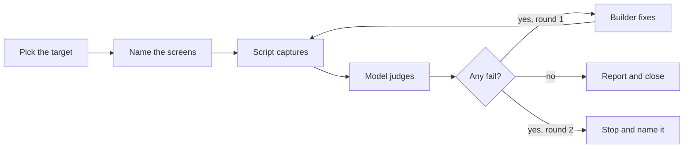

# Verify skill

Run the product and prove the change works on screen, before the owner looks. When a change reaches the product owner, three things are already done:

- The team drove the running app at the widths people use.
- It compared each screen with the design.
- It fixed what failed.

The owner's retest then confirms rather than discovers.

Approved by the product owner on 2026-09-26 as step 1 of card 42 (DECISIONS.md, "The verify loop of card 42 is approved as proposed"). The design is `docs/build/Verify_loop_proposal.md`. Until 2026-09-26 the name `/verify` belonged to the pre-commit skill, now `/precommit`.

A script captures and the model judges. The script measures what a script can decide, and the model reads the screenshots for what only a reader can. No judgement is written without a file behind it, the product owner's lesson of 2026-09-01: every capture the assistant interpreted by hand needed correcting at least once.

## Table of contents

- [When to use](#when-to-use)
- [Step 1: pick the target](#step-1-pick-the-target)
- [Step 2: name what to check](#step-2-name-what-to-check)
- [Step 3: capture, with the script](#step-3-capture-with-the-script)
- [Step 4: judge](#step-4-judge)
- [Step 5: answers](#step-5-answers)
- [Step 6: the loop](#step-6-the-loop)
- [Step 7: closing](#step-7-closing)
- [The report](#the-report)
- [What it will not catch](#what-it-will-not-catch)
- [Exit checklist](#exit-checklist)

## When to use

- Any change that touches a screen, before it reaches the owner.
- On a branch before the merge, and on deployed develop after it.
- When anyone asks whether the site looks right, or to QA a change.

Not for checking the code: that is `/precommit`. Not a substitute for the golden run on an answer-path change: Step 5 points there.



## Step 1: pick the target

| When | Target | How it is chosen |
|------|--------|------------------|
| On a branch, before the merge | The local stack | The change is not deployed anywhere yet, so local is the only place it exists |
| After the merge, once `/ship` has confirmed the deploy | Deployed develop | The owner retests there, so that is what gets proved |

The URLs are not written here. The script reads them from their one source:

- Develop: `DEVELOP_WEB` and `DEVELOP_API` in `frontend/e2e/live-target.ts`, overridden by `S3_LIVE_WEB_URL` and `S3_LIVE_API_URL` exactly as there.
- Local: the two fixed ports in `frontend/playwright.config.ts`, Vite on 5273 and FastAPI on 8931.

Confirm which app answered before anything is captured. A screenshot of the wrong deployment looks identical to one of the right deployment.

- On develop the script asks the API's `/health` for `app_env`. Anything but `develop` stops it with exit code 2 and nothing captured.
- On local it records whatever `app_env` the local backend reports, and stops only if `/health` does not answer.

Starting the local stack, each in the background, stopped when the run ends:

- Backend, from the repository root: `PORT=8931 python3 -m tests.e2e_support.mock_llm_backend`. The model call is faked, so it proves layout and wording, not answers. `S3_E2E_REAL_MODEL=1` makes it real (the backend's module docstring says what that changes).
- Frontend, from `frontend/`: `VITE_API_BASE_URL=http://127.0.0.1:8931 npm run dev -- --port 5273 --strictPort --host 127.0.0.1`.

## Step 2: name what to check

The screens come from the caller, or from the diff when the caller names none.

- On a branch: `git diff --name-only origin/develop...HEAD -- frontend/src`.
- After the merge: the same over the merged range.

Map each changed file to the screens a person reaches it on:

| Changed file under `frontend/src/components/` | Screens |
|------------------------------------------------|---------|
| `screens/HomeScreen.tsx`, `controls/` | Home |
| `screens/RunScreen.tsx`, `screens/RunProgress.tsx`, `screens/ReasoningLog.tsx`, `chat/` | The run, mid-question |
| `screens/AnswerScreen.tsx`, `answer/`, `feedback/` | The answer |
| `screens/InfoScreens.tsx`, `screens/AboutScreen*`, `screens/ArchitectureScreen.tsx` | Integrations, About, Architecture |
| `auth/`, `guest/` | Sign-in, the guest wall |
| `shell/`, `brand/`, `frontend/src/theme.ts` | Every screen: home and answer at least |

For each screen, write down how a person reaches it. That is the spec in Step 3.

- A screen with an address: the address.
- A screen behind a click: the clicks.
- The answer screen: a real question. Ask something light, such as "What does BRCA1 do?".

Before judging any screen, look it up in the coverage table of `docs/build/design/README.md`. A screen with no design is named as a gap in Step 4.

## Step 3: capture, with the script

The capture is `.claude/skills/verify/scripts/capture.mjs`. Its module comment is the full contract:

- The spec format.
- What it measures, and what it does not.
- Its exit codes.

Run it from `frontend/`, so it uses the Playwright and `@axe-core/playwright` installed there:

```bash
cd frontend
node ../.claude/skills/verify/scripts/capture.mjs \
  --spec ../.claude/skills/verify/specs/home_and_answer.json --target develop
```

- A screen reached by its address alone needs no spec: `--screen about=/about --topic about_copy`.
- A screen reached by clicks or a question needs a JSON spec. `specs/home_and_answer.json` is the worked example, including how to reach the same screen in the prototype.
- An agent worktree has no `frontend/node_modules`. Run the command from the main checkout's `frontend/` with the worktree's script path. The output still lands in the worktree, since the script derives every path from its own location.

Per screen, at 1280x900 and at 390x844, each width in a fresh browser so a phone-width page loads at phone width:

- A full-page screenshot, `<screen>_<width>.png`, and the first screen a person sees on landing, `<screen>_<width>_fold.png`.
- Horizontal overflow, the page's `scrollWidth` minus its `clientWidth`. Anything above zero fails, and the script lists up to five elements whose right edge passes the screen's, as candidates for the cause.
- Console errors and uncaught page errors. Any one fails.
- An axe scan with the WCAG 2.1 A and AA tags `frontend/e2e/accessibility.spec.ts` uses. Every serious or critical violation is listed, and any one fails.
- The same screen in `docs/build/design/design-system/prototype/app.html` at the same width, `prototype_<screen>_<width>.png`, when the spec says how to reach it there.

It writes into `testing/Developer/reports/<date>_verify_<topic>/`:

- The screenshots.
- `results.json`: every measurement, and one pass or fail line per scripted check.
- `spec.json`: the spec that ran.

It replaces the repository root and the home folder with `<repo-root>` and `<home>` before anything reaches disk.

Exit codes: 0 when every scripted check passed, 1 when at least one failed, 2 when the target was wrong or unreachable. Poll it until it exits. A question runs once per width, so one answer screen costs two of a guest's five answers and a few cents.

## Step 4: judge

Copy every scripted line from the script's output unchanged. The script's pass or fail stands; the model never overrides it.

Then add one line per screenshot pair, for each screen at each width:

1. Read the app screenshot and the prototype screenshot at the same width.
2. Judge position, not only presence: where each part sits, what wraps, what is cut off, what is missing. Build phase 4.8's checks asserted what was on screen and never where, and the whole app shipped in a 720px strip.
3. Where the prototype draws a canned answer and the app a real one, judge layout and structure, not the words.
4. A sticky or fixed element is drawn where the first screen ends in a full-page screenshot, not where the page ends. The app's footer band is sticky (`frontend/src/components/shell/AppShell.tsx`), so it can appear mid-page there: read it as pinned to the bottom of the screen, and check the first-screen shot.
5. Mark it pass or fail, and name both files.

Until `/design` exists, the design system and the prototype are the spec (`.claude/rules/design-consistency.md`). The prototype is the only file that answers what happens at 390 pixels, since every media query lives there.

A screen with no design in the coverage table gets a gap line instead of a design line: it names the missing design and is never judged against an invented look. Its scripted checks still run and still count.

## Step 5: answers

A change to the answer path, one that can change what an answer says, which records it names or cites, or whether a question is answered or refused, also needs two things `/verify` does not do itself:

- The golden consistency run, `.claude/skills/bossman-mode/reference/Product_review.md` Step 2. It blocks on any drop in the answered count below the floor.
- The five-line rubric, Step 3 of the same file.

Run them exactly as written there. The `/verify` report names their result, or names them as still to run. A screenshot check cannot judge whether an answer is right.

## Step 6: the loop

- A failing line goes back to whoever built the change, with the line and its file.
- They fix it, and `/verify` runs again with the same spec into a new folder, `<date>_verify_<topic>_round2`.
- At most two rounds (`.claude/rules/self-eval-loop.md`). If a line still fails after round two, stop and name it: the change ships with that line named as open, or it is reverted. There is no third round.
- Never make a check pass by changing the check. Dropping a failing screen or width from the spec, or rewording a line to pass, is a failed run (`.claude/rules/goal-contracts.md`).

## Step 7: closing

- A wording or layout card that passes at both widths, 1280 and 390, starts the seven-day close. The owner's retest is a spot check, and the owner can object or reopen within the seven days (DECISIONS.md 2026-09-26, "A `/verify` pass at 1280 and 390 pixels starts the seven-day close").
- The lead writes the "closes on" date on the card, as `.claude/skills/bossman-mode/reference/UI_fix_loop.md` step 8 says.
- A card that changes answers waits for the owner's verdict, whatever `/verify` says.
- `/verify` never moves a card or closes a ticket itself.

## The report

The report is `report.md` in the same folder. An agent that may not write files returns it as text, and the lead saves it there. It is short, in this order:

1. The target: the web and API URLs, `app_env`, the local checkout's commit and the deployed commit where known, and the round.
2. Every check line, fails first, in this form:

```text
- FAIL | answer at 390 | horizontal overflow | 14 px | testing/Developer/reports/<folder>/results.json
- PASS | home at 1280 | matches the prototype | heading, search bar and depth control centred as in the prototype | home_1280.png, prototype_home_1280.png
- GAP | sign-in at 390 | no design | the coverage table lists sign-in and sign-up as not designed | docs/build/design/README.md
```

3. For an answer-path change, the golden run and rubric results, or that they are still to run.
4. What was not captured and why, stated rather than implied.
5. The verdict: passed at both widths, or the lines still failing.

Before committing the folder, prove it holds no local path, secret or personal data. `grep -rlF "$HOME" <folder>` must print nothing, and read the `.txt` files. The capture runs as a guest, so no account appears on screen.

## What it will not catch

- Taste where no design exists: it names the gap instead.
- Whether an answer is good beyond the rubric's five lines.
- Any screen the spec does not name, and any state it does not reach.
- A screen only a signed-in person sees: the script has no sign-in step yet, so such a screen is named as not captured.
- Keyboard traps, screen-reader order and touch behaviour. The phone width is a viewport, not a device profile.
- Contrast during an animation: pages run with reduced motion, so the scan reads the settled colours, as the accessibility suite does.

## Exit checklist

- [ ] The target was confirmed through `/health` before anything was captured
- [ ] Every changed screen was captured at 1280 and 390, or named as not captured with the reason
- [ ] Every scripted line was copied unchanged, with its file
- [ ] Every screenshot pair has a judgement line naming both files, or a gap line
- [ ] An answer-path change names the golden run and the rubric, run or still to run
- [ ] At most two rounds, and anything still failing is named as open
- [ ] The report folder holds no local path, secret or personal data
