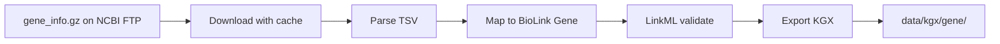
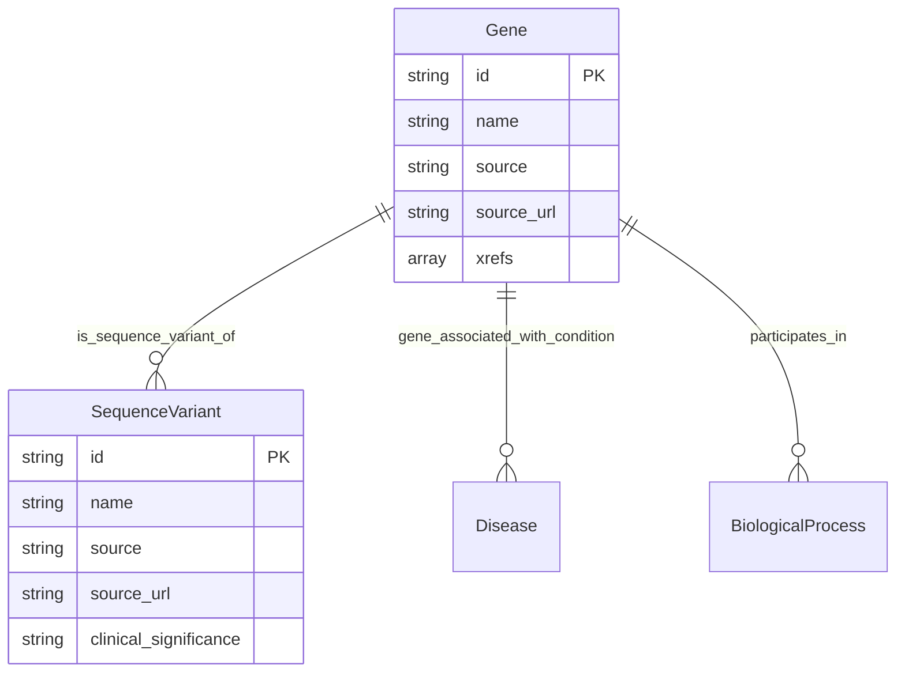

# Visualization standards

This repo has no frontend, no Cytoscape, no React Flow. Visualizations live in markdown docs as Mermaid diagrams and as well-formed schema tables.

Adapted from the reference NCBI KG `visualization-standards` skill. Stripped: 8-layer query flow, frontend rendering, color palettes for query layers, GQuery stats blocks. Kept: Mermaid hygiene, ER diagrams for schema, pipeline flow diagrams.

## When to use

- Documenting a new pipeline (Gene, ClinVar, MedGen, PubMed, Taxonomy, SNP).
- Updating `docs/System_1_data_engineering_plan.md` architecture sections.
- Drawing the System 1 → System 2 boundary for a design discussion.
- Documenting BioLink schema relationships in `system-02-knowledge-graph/schema/`.

## Mermaid hygiene

Apply `.codex/rules/writing-style.md` to diagram labels:

- Sentence case in node labels. Capitalize only proper nouns and acronyms.
- No emoji in node labels. The reference repo used emoji extensively; this repo does not.
- No bold, no italics, no markdown inside node labels.
- No literal `\n` or ` ` inside Mermaid labels. Keep labels short. If a label needs two lines, split it into two nodes connected by `-->`.
- Node labels under 30 characters. If you can't fit it, split the node.
- Use `flowchart LR` for left-to-right pipelines, `flowchart TD` for top-down hierarchies, `erDiagram` for schemas, `sequenceDiagram` for query traces.

## Diagram types

### 1. Pipeline flow diagram

Purpose: show one ETL pipeline's 5-step pattern with the FTP source on the left and the KGX output on the right.

Required elements:
- FTP source node (file name, approximate size)
- One node per pipeline step (download, parse, map, validate, export)
- KGX output node (`nodes.tsv` + `edges.tsv` and the database name)
- Arrows in execution order, no cycles unless the cycle is real (idempotency check loop)

Example:

### 2. Cross-database flow diagram

Purpose: show how multiple pipelines feed the merge step.

Required elements:
- One column per Phase 1 pipeline (Gene, ClinVar, MedGen)
- A merge node downstream
- Arrows showing which KGX outputs feed the merge

Use `flowchart LR`. No emoji. No timing estimates (this repo does not have query-layer timings).

### 3. Schema ER diagram

Purpose: document BioLink node types and predicates used by this repo.

Required elements:
- One entity per BioLink category in use (`Gene`, `SequenceVariant`, `Disease`, `Article`, `OrganismTaxon`, `BiologicalProcess`, `MolecularActivity`, `CellularComponent`)
- Primary key marked PK
- Provenance fields (`source`, `source_url`) on every entity
- Edges labeled with the BioLink predicate

Example:

### 4. System boundary diagram

Purpose: show the System 1 / System 2 / System 3 split. Used in `AGENTS.md` and onboarding docs.

Rules:
- System 3 must be drawn as a dashed-border node labeled "separate repo".
- The arrow into System 3 must be dashed too. This repo never imports from or executes inside System 3.

## What is forbidden

- No emoji. Anywhere.
- No bold inside labels.
- No timing estimates. This repo is offline ETL; per-step latency is not a user-facing concept.
- No "🟢 ⏳ ❌" status indicators inside diagrams. Status belongs in `AGENTS.md` tables.
- No layer color palette lifted from the reference repo. The reference repo's 8-layer color scheme is for query-time pipelines; this repo has none.
- No diagrams that mention Neo4j Browser, Cytoscape, React Flow, or any UI library.

## Schema tables

Schema tables in markdown docs follow `.codex/skills/documentation-standards/SKILL.md`:

- Sentence case headers.
- One row per node category or per predicate.
- A `Source database` column on every row.
- A `Canonical CURIE prefix` column on every node table.

## Checklist

Before committing a new or updated diagram:

- [ ] Sentence case labels, no emoji, no bold
- [ ] No ` ` or `\n` in node labels
- [ ] Labels under 30 characters
- [ ] Provenance fields shown on every schema entity
- [ ] System 3 (if mentioned) drawn with dashed border
- [ ] Renders correctly when previewed in VS Code Markdown preview
