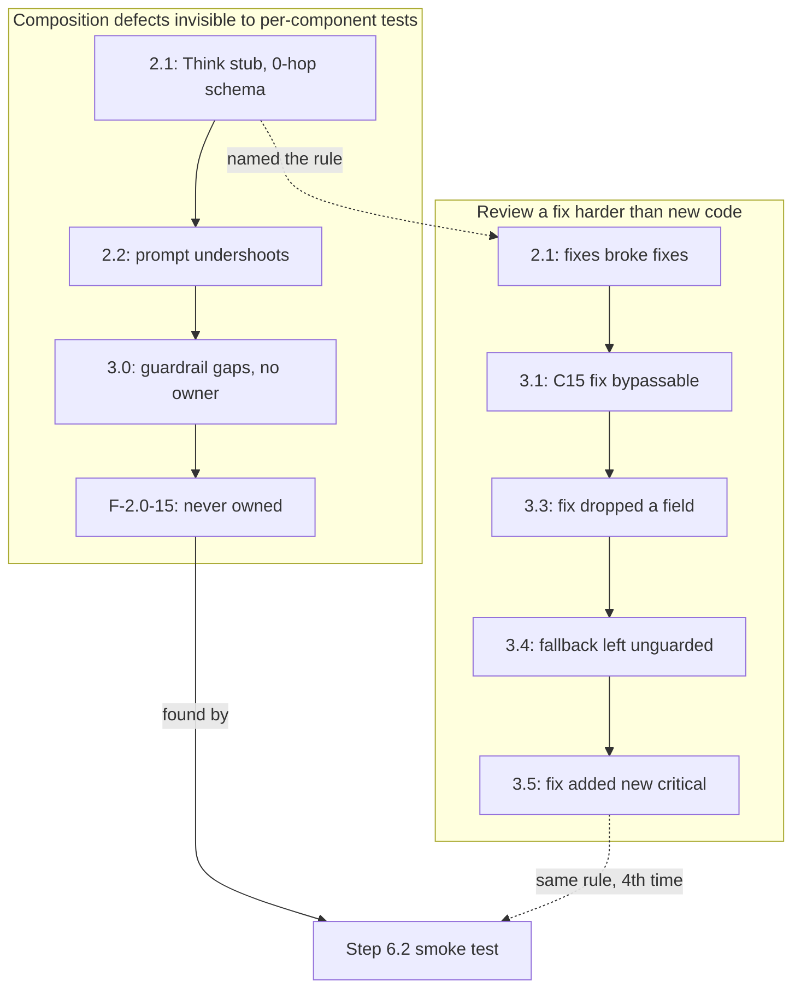

# Learnings

What broke during the build, what was tried, and what actually fixed it. Written at the moment of failure, not reconstructed at phase end.

Maintained by the `learnings` skill. Read before opening any build phase, filtered to that phase's tools and layers. This file is also the captured record that feeds the Plan.md Step 6.2 reconciliation, so the PRD, tech spec, and strategic memo get updated from evidence rather than memory.

Newest entries at the bottom. Every table cell here is short by design: the six earliest entries (2026-07-26, Phase 5) fit in a cell on their own, and every later entry ends with "Full account below," a pointer into [Entry detail](#entry-detail), where nothing has been shortened, reworded, or dropped. This split happened on 2026-08-10 for readability; per the `learnings` skill's own rule, entries are a historical record, so the split only relocates text, it never changes a word of it.

## Table of contents

- [Index by theme](#index-by-theme)
- [Lessons](#lessons)
- [Entry detail](#entry-detail)
- [Retrospective: why build phase 2.1 took five review rounds](#retrospective-why-build-phase-21-took-five-review-rounds)
- [Recurring patterns](#recurring-patterns)

## Index by theme

The Lessons table below holds about 79 dated rows with no anchors, so scanning it for "have we hit this before" means reading all of it. This index groups the rows by the kind of failure they record rather than by which file or phase they happened in, since the value of this log is pattern recognition across the whole build, not a per-phase changelog. Each bullet names the pattern and the dates of the rows that show it. A row can fit more than one theme; it is listed under the theme its own wording matches most directly.

- Assertions that cannot fail, and gates that pass vacuously: a check is structurally unable to catch the defect it exists to catch, whether it asserts nothing at all, compares two things that are equal by construction, reads a channel a real client cannot read, or a green suite total stands in for a meaning check. This is the single most repeated failure in the file: by 2026-08-14 the entries are explicitly self-counting instances of it, up to an eleventh. 2026-08-01, 2026-08-03, 2026-08-04, 2026-08-05, 2026-08-10, 2026-08-13, 2026-08-14.
- Fixtures and test data that encode a belief rather than the interface: a mock, a global fixture, or a hand-written test helper asserts what its author expected the real system to do, not what it actually does, so the test stays green while the real boundary goes untested. 2026-07-29, 2026-07-31, 2026-08-03, 2026-08-11.
- A fix round introducing the defect the next round finds: the round that closes one finding plants the next one, sometimes the identical invariant defeated a second or third time by its own replacement. The second most repeated failure in the file. 2026-07-31, 2026-08-01, 2026-08-03, 2026-08-07, 2026-08-08.
- Silent tooling failures: a hook that does not fire because the edit bypassed its trigger, an exclusion pattern that never matched, or a replace that matched nothing and reported no error. 2026-07-26, 2026-08-14.
- Environment and dependency traps: a misdirected venv, an empty or renamed environment variable, a gitignore pattern swallowing the wrong path, or a library's undocumented lifecycle rule, such as a session manager that only initializes inside its own lifespan or a host-header allowlist rejecting a port-less Host. 2026-07-26, 2026-07-27, 2026-07-28, 2026-07-29, 2026-08-11.
- The gap between what a check asserts and what a user experiences: every component-level test or scripted review passes, and the thing it was meant to guarantee is still broken end to end, usually surfaced only by tracing a live run or comparing a screenshot against the design rather than trusting the green suite. 2026-07-28, 2026-08-04, 2026-08-08, 2026-08-09, 2026-08-10, 2026-08-13, 2026-08-14.

## Lessons

The date, what it applies to, and what broke stay visible, so the table scans for "have we hit this before". What was tried and what fixed it sit behind their own dropdowns.

One tradeoff, stated rather than hidden: a collapsed block is invisible to the browser's find-in-page, so a word that appears only in a fix will not be found by searching the rendered page. Use the index above to narrow by theme first.


| Date | Applies to | What broke | What was tried | What fixed it |
|------|-----------|------------|----------------|---------------|
| 2026-07-26 | `.claude/hooks/sync-agents-md.sh`, Phase 5 | AGENTS.md silently drifted one line out of sync with CLAUDE.md. The body is supposed to be byte-identical from line 4 onward, and the sync hook normally guarantees it | <details><summary>what was tried</summary>Assumed the hook had not fired at all, and checked whether the hook script was broken. It was not; it had fired correctly on every earlier edit in the session</details> | <details><summary>what fixed it</summary>The hook is wired to PostToolUse on Edit and Write. The final change to CLAUDE.md was made with `sed -i` through Bash, which is neither, so the hook never ran. Any edit path that bypasses the Edit and Write tools also bypasses every PostToolUse hook. Use Edit for files that have hooks attached, or re-run the sync by hand afterward</details> |
| 2026-07-26 | `.claude/` generally, Phase 5 | Six parallel agents each reported `git status --short` as empty after writing files, which read as "the write silently failed" | <details><summary>what was tried</summary>Checked for permission errors and for agents writing to the wrong path. Neither was true; the files existed on disk with correct content</details> | <details><summary>what fixed it</summary>`.claude/` was gitignored at the time, so nothing inside it could appear in `git status`. Verify with `ls -la` and `git check-ignore -v`, not with `git status`, when a directory might be ignored. Resolved later the same day: `.claude/` was re-tracked, so this specific trap is gone, but the diagnostic habit stands</details> |
| 2026-07-26 | HTML artifacts, Phase 5 | The published artifact was treated as the primary copy and the local file as a byproduct, when the product owner reads the local file. The source also lived in a session scratchpad, so it would have vanished at session end leaving only the derived copy | <details><summary>what was tried</summary>Kept regenerating the local file from the scratchpad after each change. It worked, but left the real source outside version control and one step behind</details> | <details><summary>what fixed it</summary>Inverted the dependency. The repo file is the source of truth and `docs/publish_body.sh` derives the publishable fragment from it. The general rule: whatever the human opens is the source, and anything hosted is downstream of it</details> |
| 2026-07-26 | `LEARNINGS.md` itself, Phase 5 | Appending an entry with a shell heredoc put the row after the closing prose section instead of inside the table, producing an orphaned row that renders as loose text | <details><summary>what was tried</summary>Appended with `cat >>`, which always writes at end of file regardless of document structure</details> | <details><summary>what fixed it</summary>Use the Edit tool anchored on the last table row, not a blind append. A file whose table is not its last element cannot be appended to positionally. Same root cause as the sync-hook entry above: shell writes ignore structure that tool-based edits respect. Committed this one twice before it stuck, which is the point of writing it down</details> |
| 2026-07-26 | `DECISIONS.md`, repo-wide refactors, Phase 5 | A bulk path rewrite across 17 files silently modified `DECISIONS.md`, which is append-only by rule. Two historical rows had their paths rewritten, changing the record of what was decided | <details><summary>what was tried</summary>The exclusion was written as `grep -v '^\./DECISIONS\.md$'` against a list whose entries did not carry the `./` prefix consistently, so the anchor never matched and the file stayed in the target list</details> | <details><summary>what fixed it</summary>Reverted with `git checkout DECISIONS.md`, since the only uncommitted change was the unwanted rewrite. For future bulk edits, exclude by basename rather than by anchored path, and run a positive check that the protected file is untouched before committing. An exclusion that was supposed to work is not evidence that it did</details> |
| 2026-07-26 | `.gitignore`, `docs/build/`, Phase 5 | A bare `build/` pattern in `.gitignore` matched `docs/build/`, the folder holding the build workflow docs. A `git add` of those paths failed, which broke a shell `&&` chain, silently skipped one commit, and folded its changes into the next commit under a message that described only half of them | <details><summary>what was tried</summary>First read of the error suggested the files were never tracked at all. They were, because `git mv` stages past gitignore, so the folder looked fine until a plain `git add` touched it</details> | <details><summary>what fixed it</summary>Anchored the Python entry to `/build/` and pointed the Node entry at `frontend/build/`, which is what it was for. Then split the mixed commit, which was safe only because nothing had been pushed. Two general lessons: a gitignore pattern without a leading slash matches at every depth, and chaining `git add && git commit` means a failed add silently skips the commit rather than stopping the run</details> |
| 2026-07-27 | bossman-mode sub-agent dispatch, Phase 6, build phase 1.0 | A worktree-isolated builder reported `ModuleNotFoundError` for packages the lead had just `pip install`ed and confirmed present via `pip show`. | <details><summary>what was tried</summary>Assumed the builder had the wrong venv and repointed it; the builder re-verified twice, once with the sandbox disabled, producing consistent evidence packages were missing.</details> | <details><summary>what fixed it</summary>RETRACTED by the next entry: the real cause was a misdirected venv copied from a sibling repo, not sandbox isolation. Full account below.</details> |
| 2026-07-27 | `git-workflow.md` commit hygiene, Phase 6, build phase 1.0 | A tracker commit used the prefix `tracker(phase-1.0):`, but `tracker` is a valid scope, not a valid Conventional Commits type. | <details><summary>what was tried</summary>Caught on self-review before pushing, since no commit-msg hook enforces the type enum; confirmed against the rule text naming this exact case.</details> | <details><summary>what fixed it</summary>Reworded to `chore(tracker): ...` via a detached-commit amend and `git rebase --onto`, verified message-only with `git diff --stat`. Full account below.</details> |
| 2026-07-27 | `venv/`, Phase 6, build phase 1.0, corrects the row above | The prior sub-agent-isolation explanation was wrong: `agentic-search-ui/venv` was actually a copy of the sibling repo's venv, so activating it silently ran the sibling's Python. | <details><summary>what was tried</summary>Ran `pip --version` and grepped the activate scripts for the sibling repo's path, confirming the misdirected venv and a related mistaken install into the sibling repo.</details> | <details><summary>what fixed it</summary>Cleaned the sibling venv's foreign packages, then rebuilt this repo's venv from scratch (backed up, fresh `venv`, clean install), verified via the path shown in a `pytest` run. Full account below.</details> |
| 2026-07-27 | `contracts/events.py`, build phase 1.0, the multi-agent schema-validation gate | `Event.payload` was an open `dict[str, Any]`, so the eleven typed payload models and their `max_length`/`max_items` caps were unenforced on any emitted event. | <details><summary>what was tried</summary>The deferral looked reasonable against T-1.0-01's own criteria, but the judge checked the phase premise and built adversarial `Event` instances instead of trusting the type declarations.</details> | <details><summary>what fixed it</summary>Added a Pydantic `model_validator` that validates each payload against its type-matched model while keeping the wire schema unchanged. Full account below.</details> |
| 2026-07-27 | `task-tracker`'s raiser-never-closes rule, judge and fix-agent workflow | The judge that rejected T-1.0-01 was resumed to re-review its own requested fix and closed its own findings, violating raiser-never-closes. | <details><summary>what was tried</summary>The judge itself flagged the tension transparently in its own report rather than silently closing.</details> | <details><summary>what fixed it</summary>A separate, fresh agent with no prior context independently re-derived the verdict from code and tests and appended its own confirmation. Full account below.</details> |
| 2026-07-28 | `tests/system_03_search_agent/data/test_migration.py`, build phase 1.1 | The migration test suite ran `alembic downgrade base` against the real live user-data database on every run, destroying all rows at least twice, while still reporting green. | <details><summary>what was tried</summary>Nothing was tried first since nothing looked wrong; it surfaced only when the judge planted a canary row and counted it before and after.</details> | <details><summary>what fixed it</summary>Moved the upgrade/downgrade round trip to a uniquely named throwaway database created and dropped per test, preserving all rollback coverage. Full account below.</details> |
| 2026-07-28 | worktree-isolated builders and the shared venv, build phase 1.1 | A worktree builder installed SQLAlchemy and Alembic only in its own venv, so its "220 passed" report was false in the main checkout, which lacked those packages. | <details><summary>what was tried</summary>Nothing needed trying to notice; it surfaced because the lead ran `pip list` in the main venv before trusting the builder's pasted test output.</details> | <details><summary>what fixed it</summary>Installed the missing packages in the main venv and re-ran the full suite; the lead must re-run tests in the target checkout after every worktree merge. Full account below.</details> |
| 2026-07-28 | the judge and adversary split, build phase 1.1 | The judge passed refresh-token rotation on all ten acceptance criteria, but the adversary proved a rotate-first attacker can reuse a stolen refresh token indefinitely, defeating the spec's claimed property. | <details><summary>what was tried</summary>The judge correctly verified the written criterion, but no criterion tested the actual claimed security property, only the mechanism behind it.</details> | <details><summary>what fixed it</summary>Filed as F-1.1-07 for triage; security-property claims need acceptance criteria phrased as the property itself, not the mechanism. Full account below.</details> |
| 2026-07-28 | `task-tracker`'s builder-never-marks-done rule, build phase 2.0, T-2.0-04 | A builder sub-agent edited the phase tracker and set its own ticket's Status to done, violating the builder-never-marks-done rule. | <details><summary>what was tried</summary>Not caught by the builder itself; surfaced only because the lead diffed the worktree's tracker file against the merged branch before merging.</details> | <details><summary>what fixed it</summary>Corrected the status to in-review before merging; leads must diff a worktree's tracker file for status changes before every merge. Full account below.</details> |
| 2026-07-28 | ticket-boundary integration gaps, build phase 2.0, T-2.0-06 and T-2.0-07 | `build_stable_prefix()` had zero callers, and `core/graph.py` called the harness with no `cache_prefix` argument, so the correctly-built prompt-cache module was never actually used. | <details><summary>what was tried</summary>Neither ticket's own test suite could catch the gap since each tested only its own scope; it surfaced through the judge's phase-premise check.</details> | <details><summary>what fixed it</summary>Wired the stable prefix into every dispatch call with a new test asserting it reaches the model call; scaffold and integration tickets each need a criterion naming the other. Full account below.</details> |
| 2026-07-28 | `.claude/hooks/scan-secrets.sh`, local end-to-end verification, build phase 2.0 | A heredoc-run verification script was blocked by the secret-scanning hook over a literal test password and an inline `AUTH_SECRET`-shaped assignment. | <details><summary>what was tried</summary>Bisecting the visible command against the hook's regexes found no match in isolation, since the hook fails closed and scans the full raw payload when it can't cleanly parse a complex heredoc.</details> | <details><summary>what fixed it</summary>Wrote the script to a file, moved credentials into runtime-generated exports (`openssl rand`) instead of literals, and invoked the file with one plain command. Full account below.</details> |
| 2026-07-28 | `frontend/src/pages/ChatPage.tsx`, build phase 1.2, T-1.2-05/06/08 | Six chat components each passed their own unit tests in isolation, but no ticket owned wiring them together, so `ChatPage.tsx` stayed a placeholder with no auth or real pipeline call. | <details><summary>what was tried</summary>The gap surfaced only when the lead read `ChatPage.tsx` directly while scoping the E2E ticket, rather than trusting that passing dependency tickets meant it worked.</details> | <details><summary>what fixed it</summary>Added T-1.2-08 to build the real wiring and auth; any deliverable named "wired end to end" needs its own explicit acceptance criterion. Full account below.</details> |
| 2026-07-28 | run lifecycle (`core/run_registry.py`, `adapters/web_sse/app.py`), build phase 1.2, adversary pass | An adversary run found three resource-lifecycle gaps (unbounded run retention, orphaned SSE tasks, single-consumer event queues) a passing judge review missed because no acceptance criterion covered them. | <details><summary>what was tried</summary>The judge's scripted review passed all eight criteria; the judge separately also found the eviction gap independently while reading source during its own phase-premise check.</details> | <details><summary>what fixed it</summary>Filed as F-1.2-01/02/03 and deferred to build phase 4.0 as concrete named findings rather than an easily-forgotten abstract scope note. Full account below.</details> |
| 2026-07-29 | Layer 1 access, `tools/graph_connection.py`, build phase 2.1 open | Layer 1 access setup hit two traps: empty `GRAPH_PG_HOST`/`PASSWORD` looked like an unreachable graph, and once a read-only role existed, `LOAD 'age'` failed with `InsufficientPrivilege` since AGE was not preloaded. | <details><summary>what was tried</summary>Checking the reference repo's connection code and a port probe showed the graph was reachable via an SSH tunnel, not missing; a preload-and-restart fix and a permission-widening symlink fix were both rejected as worse than the alternative.</details> | <details><summary>what fixed it</summary>`ALTER ROLE kg_reader SET session_preload_libraries = 'age'`, avoiding `LOAD 'age'` entirely, verified with real reads succeeding and writes/deletes refused. Full account below.</details> |
| 2026-07-29 | every `cypher_query` test, build phase 2.1, the phase's own failure | 716 tests passed but `execute_cypher` returned unparsed agtype strings that `to_output_row` couldn't read, emitting empty citations; `plan_node` also hardcoded empty `target_entities`, so nothing worked. | <details><summary>what was tried</summary>Nothing seemed wrong until the judge and adversary independently found it; every test mocked `execute_cypher`, so no test crossed the boundary between fetching and interpreting rows.</details> | <details><summary>what fixed it</summary>Wrote T-2.1-09, a 9-test suite against the live graph with only the model call mocked, then fixed against it; the phase gate must be the least-mocked test. Full account below.</details> |
| 2026-07-29 | `tools/graph_connection.py`, the AGE query planner, build phase 2.1 | A CURIE lookup with `LIMIT 5` took 42 seconds against the live graph, while the same query with `LIMIT 100` or no limit ran in under 220ms. | <details><summary>what was tried</summary>Three wrong diagnoses: measuring without the LIMIT the validator injects, suspecting an absent-entity case, and moving the LIMIT onto the wrapping SELECT; none reproduced or fixed it.</details> | <details><summary>what fixed it</summary>`SET enable_seqscan = off` forced the GIN index, cutting 42,034ms to 108ms; the planner mis-estimated selectivity under a small LIMIT and chose a full scan. Full account below.</details> |
| 2026-07-29 | `.env` provisioning against a locked spec, build phase 2.1 | `.env` had `PER_USER_DAILY_CAP_USD`, which nothing reads, and lacked `PER_USER_DAILY_QUERY_CAP`, which the cost control module reads, causing a bare `RuntimeError` with no events on an e2e run. | <details><summary>what was tried</summary>The lead provisioned variable names from the locked `Technical_specification.md`, not realizing phase 2.0 had deliberately renamed the variable in code and in `env.example`.</details> | <details><summary>what fixed it</summary>Renamed the key in `.env` to match `env.example` and filed the spec-versus-code divergence as a Step 6.2 reconciliation item. Full account below.</details> |
| 2026-07-31 | `core/graph.py`'s guardrail and think stubs, build phase 2.1 rework | `guardrail_node` and `think_node` sent a bare user question to a real model with no system instruction, so it wrote a full 1000-token answer that was then discarded, costing 10-15 seconds per call. | <details><summary>what was tried</summary>Misdiagnosed three times as OpenRouter rate limiting, cold-connection latency, and too-small a step budget, each widening moving the failure later rather than fixing it, until tracing the call's own token usage showed `out=1000` on every call.</details> | <details><summary>what fixed it</summary>Gave both stub steps a one-word system instruction and lowered guard tier `max_tokens` to 128, cutting output to 1-2 tokens; a cap hit every call is a target, not a ceiling. Full account below.</details> |
| 2026-07-31 | `harness/harness.py` per-step timeouts, build phase 2.1 rework | Widening the per-step timeout kept moving the failure to the next step (guardrail passes, then think fails, then plan, then write) across four rounds of increases. | <details><summary>what was tried</summary>Each widening was justified by a real latency measurement of the step that had just failed, but treated a single per-step number as tunable when guard, plan, and synth actually needed different budgets.</details> | <details><summary>what fixed it</summary>Replaced `budget_for_query_class` with `budget_for_step(step, query_class)`, resolving model-calling steps against their own tier and only `act` against query class. Full account below.</details> |
| 2026-07-31 | `tools/cypher_query.py` parameter binding, build phase 2.1 rework, the adversary's worst find | `"Compare NCBIGene:7157 and BRCA1..."` extracted TP53 first and `_build_params` bound parameters positionally, so a query about BRCA1 ran against TP53 and returned a confidently cited, wrong-gene answer. | <details><summary>what was tried</summary>Nothing at first; the builder had filed it as F-2.1-05, a consciously accepted "documented, pragmatic" limitation, since it was inert while agtype parsing was still broken. Fixing that parsing armed it.</details> | <details><summary>what fixed it</summary>Built a naming contract (`entity_param_bindings`) that binds parameters by deterministic name and rejects invented names before execution; a dormant known limitation is a scheduled defect. Full account below.</details> |
| 2026-07-31 | `tools/cypher_provenance.py`, `tests/.../test_cypher_provenance.py`, build phase 2.1 rework | `cypher_query` refused correct answers for scalar, projection, and `collect()` query shapes, since `_iter_entities` only recognized vertices, so every "how many" question came back as an empty refusal despite the graph answering. | <details><summary>what was tried</summary>The empty-row behavior was deliberately tested and asserted correct, reasoning a scalar carries no citation of its own, without asking where a scalar's provenance should actually come from.</details> | <details><summary>what fixed it</summary>Derived values now get one row marked `node_or_edge_type="derived"`, cited to the entity they were computed from; verified live, BRCA1's variant count matched the true total. Full account below.</details> |
| 2026-07-31 | the lead's own editing, build phase 2.1 rework | A blanket `$gene_id` to `$e_NCBIGene_672` replacement across 21 test call sites broke three tests using a different entity, and a first-match `str.replace(..., 1)` fixed the wrong occurrence. | <details><summary>what was tried</summary>Both mistakes happened despite the lead having just warned, in the same session, that blanket replacement across near-identical lines was risky.</details> | <details><summary>what fixed it</summary>Fixed each individually by reading surrounding context or targeting by line number; verify the match count before writing rather than trusting care under time pressure. Full account below.</details> |
| 2026-07-31 | `harness/harness.py` tier configuration, build phase 2.1, third adversary pass | Widening the tool budget from 30s to 90s to fix F-2.1-B02 left 9 of 10 real-model queries still timing out, now slower and pricier, with zero actual improvement. | <details><summary>what was tried</summary>The budget was widened twice, each backed by a real latency measurement, but both treated latency as a bound to raise rather than a symptom to explain.</details> | <details><summary>what fixed it</summary>Measuring token usage found the plan tier at `effort: high` spent 970 of 1014 output tokens reasoning about one line of Cypher; dropping to `effort: none` cut latency 27x with no quality loss. Full account below.</details> |
| 2026-07-31 | `tools/cypher_query.py` derived-value provenance, build phase 2.1, third judge and adversary | The fix for F-2.1-B05 re-created F-2.1-B01 one layer down: a derived count cited the first candidate entity rather than the one actually bound, so a BRCA1 count came back cited to TP53. | <details><summary>what was tried</summary>Nothing, because a regression test built specifically for B01 passed; it asserted on the entity row's CURIE, but the derived path emitted a different row type through a different function.</details> | <details><summary>what fixed it</summary>Attribution now reads from `params`, the entities actually bound, and refuses to guess when more than one is bound; a new code path needs every prior finding re-tested against it. Full account below.</details> |
| 2026-07-31 | the lead's own verification procedure, build phase 2.1 rework | Reverting a fix by cutting text between two markers cut to the wrong closing marker, leaving an early-refusal return as the function's only path, making the revert-and-watch-fail check give a false result. | <details><summary>what was tried</summary>The false result was almost accepted; what caught it was that the failing test asserted a real gene still answers, a failure whose direction didn't match the change.</details> | <details><summary>what fixed it</summary>Re-ran the check by disabling one named predicate instead of excising a text range; prefer disabling a single predicate over deleting a text range for revert checks. Full account below.</details> |
| 2026-07-31 | any Opus-tier fan-out, build phase 2.1 | Two concurrently dispatched Opus subagents (fourth judge and fourth adversary) both died within a minute on a session limit, producing nothing after roughly 25 minutes of wall time. | <details><summary>what was tried</summary>Concurrent dispatch was the only thing tried, repeating a known failure mode already recorded of reasoning-model agents dying together on a shared session limit.</details> | <details><summary>what fixed it</summary>Re-dispatched sequentially, judge first then adversary; concurrency lets two frontier agents sharing one session limit become one failure instead of two independent ones. Full account below.</details> |
| 2026-08-01 | any phase whose output is model-generated, build phase 2.1 | Build phase 2.1 failed four consecutive judge and adversary reviews with a green 879-test suite; the worst case returned 25 non-human orthologs, confidently cited, for a BRCA1 disease question. | <details><summary>what was tried</summary>Three rounds of fixing the parameter binder and citation layer, roughly 25 real but non-causal defects, each round ending green until disproven by a fresh review pass.</details> | <details><summary>what fixed it</summary>Printing the model's actual input revealed Think's hardcoded `query_class="lookup"` stub mapped to a 0-hop schema slice with no disease label, so the generator answered the only question it could. Full account below.</details> |
| 2026-08-01 | the verify surface of any model-generating phase, build phase 2.1 | All 879 tests passed through four failed reviews; the tracker claimed "the premise is met" citing live-graph tests and the suite total, but every clause was true while the conclusion didn't follow. | <details><summary>what was tried</summary>Trusting the suite total as premise evidence four times, hidden behind the phrase "only the model call mocked," offered as proof the gate was strong.</details> | <details><summary>what fixed it</summary>`test_cypher_query_premise.py` does not mock the model and checks answer meaning against live-graph ground truth; a premise claim must cite that file, never a suite total. Full account below.</details> |
| 2026-08-01 | reviewing any fix, build phase 2.1 | Every one of five review rounds found its worst defect inside the fix from the round before; F-2.1-J5-01 was a comment claiming a property the code never actually implemented. | <details><summary>what was tried</summary>Reviewing new code and fix code at the same scrutiny level, and trusting a confident code comment as documentation rather than as an untested claim.</details> | <details><summary>what fixed it</summary>Fix code now gets more scrutiny than untouched code, and any comment asserting a security or correctness property needs a test asserting the same property. Full account below.</details> |
| 2026-08-01 | any invariant that gates generated output, build phase 2.1 | The same connectivity invariant was defeated twice in one day, first by a decoy MATCH binding an unrelated entity, then by renaming a variable through WITH, each time returning arbitrary cited data. | <details><summary>what was tried</summary>Enumerating and blocking each newly discovered attack shape one pattern at a time, across four rounds, rather than fixing the underlying property being checked.</details> | <details><summary>what fixed it</summary>Switched to a fail-closed connectivity check where every value must trace back to a caller-supplied entity through resolved aliases; a blocklist is infinite, an allowlist is finite. Full account below.</details> |
| 2026-08-03 | any phase that assembles a prompt from retrieved data, build phase 2.2 | The Write step refused correct answers; the flagship gene-disease question returned "I could not find information" despite four correct rows fetched live from the graph. | <details><summary>what was tried</summary>Printed the exact Synth prompt before debugging the answer, applying the 2.1 retrospective's rule first.</details> | <details><summary>what fixed it</summary>The findings block rendered only opaque `field`/`field_value` identifiers with no record type, so the answer was not expressible; fixed by rendering record type plus identifier. Full account below.</details> |
| 2026-08-03 | any deterministic text-matching gate, build phase 2.2 | A substring-match gate accepted a fabricated ortholog count riding alongside one real cited number, since containment was checked in the unsafe direction. | <details><summary>what was tried</summary>Considered whether the spec's rule was implemented wrongly; it was not, the rule as written accepts this.</details> | <details><summary>what fixed it</summary>Bounded containment to the claim-in-field_value direction and added a check requiring every standalone number in a claim to appear in the cited value or the user's question. Full account below.</details> |
| 2026-08-03 | any test fixture that mocks a model globally, build phase 2.2 | Ten tests failed once the Write step used its model response; a global mock returned one fixed answer for every tier, including narrating a raw Cypher string or "ok" as the synth output. | <details><summary>what was tried</summary>Initially read the failures as regressions in the new Write-step code.</details> | <details><summary>what fixed it</summary>Fixture dispatch keyed on the Synth system instruction with a compliant model restating the given findings, and reading `return_value` back off the mock instead of relying on `side_effect`. Full account below.</details> |
| 2026-08-03 | build velocity across build phases 1.0 to 2.2, `docs/build/Build_velocity_post_mortem.md` | The product owner questioned why a phase now takes a full day versus a reference repo's weekend MVP, suspecting autonomous multi-agent execution itself was the cause. | <details><summary>what was tried</summary>Measured actual git history, commit timestamps, the day's network outages, and the harness's always-loaded context cost instead of guessing.</details> | <details><summary>what fixed it</summary>Auto mode was not the cause; the day's cost was adversarial review doing its job plus network outages, not process ceremony. Multi-agent dispatch does multiply cost, but only across many review rounds. Full account below.</details> |
| 2026-08-03 | any gate whose input is attacker-controlled, build phase 2.2 | The same critical injection defect reopened three times across three review rounds; deleting two characters ("Is X?" versus "X is...?") bypassed the fix each time. | <details><summary>what was tried</summary>Round 2 tightened the admission rule and mutation-tested it; the mutant was killed, proving the gate was genuinely tested.</details> | <details><summary>what fixed it</summary>Inverted to positive admission, only a wh-opener licenses content and each licensed sentence truncates at its own first `?`; exposed that all round-2 tests shared one question shape. Full account below.</details> |
| 2026-08-03 | any degenerate-value or unsafe-shape check, build phase 2.2 | A finding value shipped as a full-confidence citable fact four separate times through shapes a blocklist had not yet named: null, ETL sentinel strings, containers, then float specials including a rendered memory address. | <details><summary>what was tried</summary>Three successive rounds of adding each newly found shape to a named-type blocklist.</details> | <details><summary>what fixed it</summary>Inverted to an allowlist: only a string or a finite number can render as a citable value, everything else falls back to the CURIE. Full account below.</details> |
| 2026-08-03 | parallel agents editing sibling files, build phase 2.2 | Three workers each correctly fixed separate files feeding one pipeline, but combined they broke a repo-wide guard rejecting vendor-slash-model-shaped strings, since one worker's added sentinel `n/a` matched it. | <details><summary>what was tried</summary>Trusted three green workers, each of whom had verified only their own file and their own tests.</details> | <details><summary>what fixed it</summary>Running the full suite after the parallel fan-out surfaced it; fixed by expressing the sentinel as a precise compiled pattern rather than narrowing the guard. Full account below.</details> |
| 2026-08-04 | agent dispatch generally, build phase 3.0 | Two parallel researcher agents died without producing output, one closing mid-response and one stalling 600 seconds, despite a passing pre-flight network check. | <details><summary>what was tried</summary>Ran the repo's documented pre-flight check (`curl` to openrouter.ai) and dispatched agents on its 200 response.</details> | <details><summary>what fixed it</summary>Realized the pre-flight probed the product's model provider, not the build harness's own agent-dispatch transport; did the small research task inline instead, cheaper than the two dead dispatches. Full account below.</details> |
| 2026-08-04 | any premise gate for an admission or filtering step, build phase 3.0 | Not a failure yet; recorded at design time that a guardrail has no safe failure direction, since `return refuse` scores perfectly on reject tests while silently destroying the product. | <details><summary>what was tried</summary>n/a, caught before the gate was written rather than after.</details> | <details><summary>what fixed it</summary>Required both an admit arm and a reject arm, anchored the admit arm on the v1 must-pass moat questions, and pinned three keyword-collision traps as tests. Full account below.</details> |
| 2026-08-05 | any test fixture for an external API, build phase 3.1 adversary round 1 | Two criticals passed review because the ESummary and ELink error fixtures were invented from documentation rather than captured live, hiding a fabricated citation and a missed API error respectively. | <details><summary>what was tried</summary>Both fixtures were hand-written from a reading of NCBI's documentation before this round, and both passed their own test suites.</details> | <details><summary>what fixed it</summary>Filed for a separate fixer rather than fixed directly; the lesson is that a fixture must be captured from a live response, not written from a reading of documentation. Full account below.</details> |
| 2026-08-04 | any check whose justification names another layer, build phase 3.0 | Four off-topic queries like "What is the capital of the USA?" were fully admitted because the pre-filter's symbol pattern matched any two-capital token. | <details><summary>what was tried</summary>A code comment claimed the classifier would catch it later, but nothing actually re-checked topicality after the pre-filter.</details> | <details><summary>what fixed it</summary>Re-read tech spec Section 10.1 step 3, which required the Guard-tier to catch off-topic cases too, not just injection. Full account below.</details> |
| 2026-08-04 | any multi-layer filter or validation pipeline, build phase 3.0 | Third-person clinical questions (e.g. tamoxifen advice about "this patient") passed every guardrail layer, since no layer owned advice about a third party, despite 140 tests and a 20/20 premise gate. | <details><summary>what was tried</summary>Nothing caught it beforehand; each layer individually passed its own tests and acceptance criteria.</details> | <details><summary>what fixed it</summary>Recognized the defect existed only in composition, then enumerated the dimensions each layer keys on to find combinations no layer covers. Full account below.</details> |
| 2026-08-04 | delegating build work to subagents, build phase 3.0 | A builder analyzing finding F-2.1-C15 skipped its required analysis deliverable, wrote 205 lines of new validator code instead, and left the suite red with its own failing test. | <details><summary>what was tried</summary>Nothing to try; the agent simply inverted the contracted order of analyze-then-implement.</details> | <details><summary>what fixed it</summary>Reverted the diff, kept it in scratchpad, and going forward denied write access to src/ for investigation-only tickets. Full account below.</details> |
| 2026-08-05 | test isolation and logging, build phase 3.1 | `alembic/env.py`'s `fileConfig` permanently disabled all already-imported loggers, silently killing two security tests that appeared to pass vacuously. | <details><summary>what was tried</summary>Wrongly blamed `caplog` configuration, then `litellm`, for swallowing log records.</details> | <details><summary>what fixed it</summary>Printed the actual logger gating state directly, revealing `.disabled = True`, and added a positive control asserting the test is still observing. Full account below.</details> |
| 2026-08-05 | any security check with no safe direction of failure, build phase 3.1 | The transport rejected any body containing `<!DOCTYPE`, blocking every real PubMed EFetch response despite a docstring claiming no false positives against real NCBI traffic. | <details><summary>what was tried</summary>n/a, caught by testing against live traffic before shipping instead of trusting the docstring's claim.</details> | <details><summary>what fixed it</summary>Permitted a `DOCTYPE` with no internal subset while still rejecting any `ENTITY` declaration, satisfying both directions of failure at once. Full account below.</details> |
| 2026-08-05 | any dormant limitation flagged in an earlier phase, build phase 3.1 | n/a, caught before code was written: F-3.1-01's over-broad token pattern was harmless only while the lookup behind it was a one-entry dict. | <details><summary>what was tried</summary>n/a</details> | <details><summary>what fixed it</summary>Reading `core/graph.py` before dispatching T-3.1-11 showed it would turn dict lookups into live NCBI calls, so the candidate filter was folded into the same ticket rather than left as a follow-up. Full account below.</details> |
| 2026-08-05 | any premise gate whose only production-path case is also its only skippable case, build phase 3.1 | The premise gate passed 18 of 19 cases while `ncbi_efetch` was never actually dispatched in production, since `act_node` only calls `cypher_query` and the gate bypassed the agent loop entirely. | <details><summary>what was tried</summary>Trusting the gate's green run as evidence the tool was actually wired in.</details> | <details><summary>what fixed it</summary>A judge round questioned the premise itself rather than the checklist and found the gap, filed as a critical finding carried open pending a product-owner scope decision. Full account below.</details> |
| 2026-08-08 | any tool wrapping a search/autocomplete-style API, build phase 3.3 | `litvar2_lookup` and `pubtator_annotate` discarded the upstream API's own match-relevance signal, so bare queries like "334" or "the" returned confidently cited but wholly unrelated results under status ok. | <details><summary>what was tried</summary>An adversary round diffed the raw upstream response against the tool's output side by side, which two prior review rounds had not done since they only graded schema conformance.</details> | <details><summary>what fixed it</summary>Added an additive, optional `matched_on` disclosure field to each result item, deferring any auto-refusal or confidence heuristic to a separate review round. Full account below.</details> |
| 2026-08-08 | a fix for one finding that touches a second, related code path it does not test, build phase 3.3 | The F-3.3-J-02 fix for a fabricated-ok-on-zero-matches bug discarded pre-existing `fields_withheld` notes on the same path and rewrote the one test that would have caught it, so an all-excluded response shipped indistinguishable from a genuine no-match. | <details><summary>what was tried</summary>An independent fresh-context re-review, dispatched because same-session fixes in this repo's history tend to hide defects, found it by re-reading the full function and constructing an adversarial input.</details> | <details><summary>what fixed it</summary>Routed the existing withheld notes through the new `status: "empty"` branch and restored the removed test assertions. Full account below.</details> |
| 2026-08-07 | a non-nesting bracket regex, where a sibling pattern in the same file already had the same defect class fixed once, `fix/c15-generation-bound` | The first F-2.1-C15 fix was itself bypassable, since its non-nesting character class went blind to an entire hop once a nested bracket appeared inside it, e.g. `[:orthologous_to*2 {tags: [$a, $b]}]` validated clean. | <details><summary>what was tried</summary>A fresh-context adversarial review found the bypass on the first pass by reading the regex closely and constructing a candidate string.</details> | <details><summary>what fixed it</summary>Rebuilt as a standalone pattern anchored on the literal `[` with no wildcard before the required `*`, confirmed by a second independent review. Full account below.</details> |
| 2026-08-08 | worktree-isolated builders dispatched before the lead's prep work is committed, build phase 3.5 | Two worktree-isolated builders were dispatched before the lead committed shared prerequisite files to the phase branch, so both worktrees were created without those files existing at all. | <details><summary>what was tried</summary>One builder diffed its worktree against the shared checkout's filesystem and manually synced the missing files; the other refused to fabricate them and flagged its assumptions explicitly instead.</details> | <details><summary>what fixed it</summary>The lead committed the prep work after the fact and reconciled the flagged assumptions, an extra pass that committing prerequisites before dispatch would have avoided. Full account below.</details> |
| 2026-08-08 | `tests/system_03_search_agent/harness/test_tiers.py`'s repo-wide model-id guard, build phase 3.5 | The full suite failed on a repo-wide model-id guard after a new taxon-rejection sample string coincidentally matched the guard's word/word shape, despite passing in its own file's isolated run. | <details><summary>what was tried</summary>Nothing needed; running the full suite rather than trusting the isolated file run surfaced the cross-file collision, as an earlier learning already prescribed.</details> | <details><summary>what fixed it</summary>Reshaped the local sample string to use two slashes instead of loosening the repo-wide guard. Full account below.</details> |
| 2026-08-08 | build phase 3.5's fix round, `pathogen_detection.py` / `pathogen_ftp_transport.py` | A fix for a critical scan-early-exit defect (F-3.5-06) itself introduced a new critical defect (F-3.5-A-01): removing the early exit meant the 411GB file could never be fully scanned in budget, so the tool could never return success at all, undetected by a passing premise gate. | <details><summary>what was tried</summary>A live premise gate certified the first fix using a cluster whose rows sat deep in the file, masking the new defect; only an adversary choosing a cluster with rows at byte 0 exposed it, and a second live re-verification found a third instance downstream.</details> | <details><summary>what fixed it</summary>Used partial scan results on a deadline cutoff instead of discarding them, then reserved a fixed budget slice for the mandatory follow-up read regardless of upstream scan duration. Full account below.</details> |
| 2026-08-09 | `core/graph.py`'s `_layer2_citation_for_synth_finding`, build phase 3.4, T-3.4-05 | A builder's self-reported "10 of 10 passed" result was flaky on re-run, since a defensive fallback `CitationPayload` construction sat outside its own try/except and crashed the whole query on a schema-valid record whose host didn't match the narrower pattern. | <details><summary>what was tried</summary>A repro script calling the compiled graph directly, bypassing the normal entry point's swallow-and-refuse catch-all, run in a loop until the real exception surfaced.</details> | <details><summary>what fixed it</summary>Widened the return type to include None and wrapped both construction attempts in the same fail-closed handling, so the caller skips a None result instead of crashing. Full account below.</details> |
| 2026-08-09 | `test_a_dual_layer_question_dispatches_and_cites_both_layers`, build phase 3.4, T-3.4-05 | Even after the crash fix, the test still failed about 3 in 4 runs because Synth's narrative didn't always cite both layers, and a reworded question tested worse (0 of 20) and was reverted. | <details><summary>what was tried</summary>Graded the assertion using pass@8 rather than a single run, to measure the capability's presence instead of one sample's determinism.</details> | <details><summary>what fixed it</summary>A judge round caught an arithmetic error in the pass@8 justification's probability claim (wrong tail of the binomial) and corrected the confidence figure, though the 8-attempt bound itself stood. Full account below.</details> |
| 2026-08-09 | dispatched builder agents ending their own turn on unclaimed background work, build phase 3.4, T-3.4-04 through the judge round | Across five dispatches, builders or the judge repeatedly ended their turn claiming to wait for a background validation loop or notification, despite being told to run verification in the foreground, leaving results uncollected. | <details><summary>what was tried</summary>Resumed each agent with a targeted message quoting its own words and restating the foreground instruction, rather than starting fresh.</details> | <details><summary>what fixed it</summary>No code fix; recognized subagents have no notification channel of their own, so instructions must explain why backgrounding fails for that role, not just forbid it. Full account below.</details> |
| 2026-08-10 | `core/graph.py`'s `think_node`, Step 6.2 manual smoke test (the informal end-to-end check agreed after the "are we over-engineering this" discussion, not a review round) | 4 of 7 v1 must-pass moat questions refused outright and a 5th gave only a one-sentence answer, because `think_node`'s query classification was still a stub, always returning empty resolved entities and a hardcoded query class. | <details><summary>what was tried</summary>Nothing to try; a live SSE trace made the cause visible immediately, showing `plan_node` misreading database names mentioned in questions as gene-symbol guesses.</details> | <details><summary>what fixed it</summary>Not fixed at the time; filed as F-2.0-15 with no owner. Assigned to build phase 4.7 later the same day (see DECISIONS.md, 2026-08-10). Full account below.</details> |
| 2026-08-10 | `test_phase_4_0_premise.py`, build phase 4.0 | A resumability test that opened a real `httpx` streamed SSE response, read one line, then abandoned it before the run finished, hung the whole pytest process indefinitely rather than failing. | <details><summary>what was tried</summary>Assumed the hang was a deadlock in the new `RunRegistry.subscribe`/`asyncio.Condition` code and moved `release.set()` earlier in the test, before the streaming context manager's exit. The hang persisted unchanged.</details> | <details><summary>what fixed it</summary>Rewrote the test to detach via `RunRegistry.subscribe(...).aclose()` at the registry level instead of abandoning a real HTTP stream mid-flight. `httpx.AsyncClient.stream()` over `ASGITransport` does not reliably signal the server-side task to unwind when the client stops reading early; closing early is not a safe test pattern against this transport. Full account below.</details> |
| 2026-08-10/11 | `adapters/web_sse/app.py`'s `GET /events`, build phase 4.0, judge round 1 | The premise gate's own resumability test proved reconnection worked by reading `seq` out of the JSON response body and hand-building the next `Last-Event-ID` header from it. The endpoint never actually emitted the SSE wire `id:` line a real client's `Last-Event-ID` depends on, so a genuine `EventSource` or off-the-shelf SSE library could never resume at all, invisible to a fully green premise gate. | <details><summary>what was tried</summary>Nothing to try; a fresh-context judge round captured raw wire bytes and found no `id:` line present, then confirmed a reconnect with an empty `Last-Event-ID` re-delivered the whole run as duplicates.</details> | <details><summary>what fixed it</summary>Added `"id": str(event.seq)` to every yielded SSE frame, using the envelope's own `seq`, not a per-connection counter (a counter would desync from the cost-event filter a non-operator caller already has applied). General form: a test that proves a client-facing contract by reading a channel a real client cannot read (here, the JSON body instead of the wire protocol) can pass while the actual contract is completely broken. Full account below.</details> |
| 2026-08-11 | `core/run_registry.py`'s `_reschedule_abandonment_check`, build phase 4.0, adversary round 1 | The abandonment-check fix from build phase 1.2 (cancel a run nobody is watching after a grace window) scheduled a brand-new, full-length timer on every subscribe or unsubscribe. A reconnect cadence faster than the grace window, attach, immediately detach, repeat, reset the clock every cycle and held a run alive indefinitely, the opposite of what the control exists to guarantee. | <details><summary>what was tried</summary>Nothing to try; an adversary round drove the real registry with a scripted churn loop and a control arm, and the two diverged exactly as predicted (control cancelled within one grace window, the churned run survived more than five).</details> | <details><summary>what fixed it</summary>Replaced the resettable timer with cumulative real unwatched time tracked on the entry itself (`cumulative_unwatched_seconds`, `unwatched_since`), scheduling only the remaining budget on each detach rather than a fresh full window. General form: a liveness or timeout control defined by "time since the last state transition" is gameable by anyone who can trigger transitions faster than the window; the safe definition is cumulative time in the bad state, not time since it was last observed. Full account below.</details> |
| 2026-08-11 | `adapters/mcp/server.py` mounted into `adapters/web_sse/app.py`, build phase 4.1, pre-implementation probe | Every real MCP call over the mounted Starlette sub-app failed, three separate ways depending on what was tried first: `RuntimeError: Task group is not initialized`, then a silent-looking `307 Temporary Redirect` a naive client never follows, then `421 Misdirected Request`. | <details><summary>what was tried</summary>A standalone in-process probe (server plus a real `mcp` client session over `httpx2.ASGITransport`) built incrementally, isolating one variable per run rather than guessing at the mounted app directly.</details> | <details><summary>what fixed it</summary>Three independent fixes, each for a different mechanism: (1) `MCPServer.streamable_http_app()`'s session manager task group only initializes inside the sub-app's OWN Starlette lifespan, which a `Mount()` does not cascade into automatically, so the parent FastAPI app's `lifespan=` must explicitly enter `sub_app.router.lifespan_context(sub_app)`; (2) mounting at `/mcp` while leaving `streamable_http_path` at its SDK default also `/mcp` doubles the effective path to `/mcp/mcp`, so the sub-app must be built with `streamable_http_path="/"`; (3) the SDK's DNS-rebinding protection auto-enables for `host="127.0.0.1"` (the default) and only allows `Host` headers matching `localhost:*`/`127.0.0.1:*`/`[::1]:*` with an explicit port, so a bare `Host: test` or `Host: localhost` (no port) is rejected with 421, and any custom `httpx2.AsyncClient` passed as `http_client=` to the mcp client transport also bypasses the SDK's own `follow_redirects=True` default, so a caller-built test client must set both a port-bearing localhost-family `base_url` and `follow_redirects=True` explicitly. Full account below.</details> |
| 2026-08-11 | `tests/system_03_search_agent/adapters/mcp/test_phase_4_1_premise.py`, build phase 4.1, fixing the premise gate against the real implementation | After the mount fixes above, the golden path passed but 7 of 13 cases still failed: every second and later call through the shared production `app` singleton raised `RuntimeError: StreamableHTTPSessionManager .run() can only be called once per instance`, and separately, every `pytest.raises(MCPError)` around an auth-failure call failed even though the correct `MCPError` was visibly raised and printed in the traceback. | <details><summary>what was tried</summary>Nothing to try for the first; the error message named the exact cause. For the second, initially suspected the wrong exception was being raised, until printing the caught object's real type showed the test's own `pytest.raises(MCPError)` was the mismatch, not the implementation.</details> | <details><summary>what fixed it</summary>First: `MCPServer.streamable_http_app()` builds a brand-new `StreamableHTTPSessionManager` on every call, so the fix was to build a fresh mounted test app per test call (`_build_test_mcp_app()`) rather than reuse the production `app` object's one instance across many isolated test functions, since a real server only ever enters that lifespan once for its whole process lifetime. Second: `anyio`'s nested task groups (the SSE read loop, the client session's request dispatch) wrap a propagating exception in a `BaseExceptionGroup` at every level, even for exactly one cause, so the raised object's own top-level type is `ExceptionGroup`, never a bare `MCPError`; `pytest.raises(MCPError)` does not match that. Fixed with Python 3.11's `except* MCPError`, which unwraps arbitrarily many nesting levels and collects every matching leaf exception regardless of depth. General form: a resource that is documented as "call this once per instance" is a signal to build a fresh instance per isolated test rather than share one across a whole test module, and any assertion library's `raises(SpecificType)` should be treated with suspicion around `anyio`/`asyncio` task-group code, since the type actually raised at the call site may be a wrapping `ExceptionGroup` even when the underlying cause matches exactly. Full account below.</details> |
| 2026-08-11 | `tests/system_03_search_agent/adapters/mcp/test_phase_4_1_production_mount.py`, build phase 4.1 fix round, F-4.1-J-02 | Needed to prove the REAL, shipped `/mcp` mount (`adapters/web_sse/app.py`'s module-level `app` singleton, never a hand-copied rebuild) actually works end to end, but that singleton's session manager may only enter its lifespan once per process, and it is imported by four other test files already. | <details><summary>what was tried</summary>Read Starlette's `routing.py` to confirm `app.router.lifespan_context(app)` on the top-level FastAPI app resolves to the identical mechanism already proven safe for the mounted Starlette sub-app in the premise gate file, then grepped the whole test tree for any existing use of `TestClient(app)` as a context manager or `app.router.lifespan_context`, rather than assuming safety from reading only the new file's own imports.</details> | <details><summary>what fixed it</summary>Confirmed clean: `test_health.py` calls `TestClient(app)` without a `with` statement, so its lifespan handling never fires, and every other file drives `app` over `httpx`/`httpx2` `ASGITransport`, which never sends ASGI `lifespan` scope events at all regardless of `with`. Wrote exactly one test function, in its own new file, that enters the lifespan and makes exactly one real MCP call, with the constraint and the grep verification spelled out in the file's own module docstring so a future test added elsewhere does not silently violate it. General form: before touching a "may only run once" resource exposed as a module-level singleton shared across many test files, grep the whole test tree for existing uses of the mechanism that would consume it; do not reason from the current file's own imports alone. Full account below.</details> |
| 2026-08-11 | `tests/system_03_search_agent/adapters/mcp/test_phase_4_1_premise.py`'s `_call_tool_expecting_mcp_error`, build phase 4.1 fix round 2 (F-4.1-A-06, F-4.1-A-13) | Two new tests raising `MCPError` from deeper in the call (a fold-loop timeout, an unknown-argument rejection, both AFTER auth already succeeded) failed with the helper's own pre-existing single-level `except* MCPError` unwrap: the object it returned was still an `ExceptionGroup`, not a bare `MCPError`, so `error.code`/`"x" in error.message` raised `AttributeError`/matched the group's own generic "unhandled errors in a TaskGroup" text instead of the real message. | <details><summary>what was tried</summary>Printed the raw caught object's type and repr rather than guess: it showed two levels of nested `ExceptionGroup` around the real `MCPError`, one more level than the auth-failure case the helper was originally built and verified against.</details> | <details><summary>what fixed it</summary>Replaced the fixed single-level `except* MCPError` with a small recursive unwrap (`_first_mcp_error`) that walks `BaseExceptionGroup.exceptions` to whatever depth is actually present, rather than special-casing a second exact depth. General form: an exception raised LATER in a deeply `async with`-nested call accumulates more `anyio.TaskGroup`-induced `BaseExceptionGroup` wrapping than one raised early (e.g. during auth, before most of the call's own task groups have even opened), so a helper calibrated against one raise site's nesting depth is not safely reusable at a different depth without either re-deriving the exact level or, better, making the unwrap recursive so depth stops being a variable to track by hand. Full account below.</details> |
| 2026-08-13 | `frontend/src/index.css`, `AnswerScreen.tsx`, build phase 4.8 post-merge | Two major layout defects shipped: the whole redesigned application rendered in a 720px strip with the app bar's wordmark wrapped onto three lines, and the provenance spine's segments drifted out of register with the claims they describe, so by the third claim the grey uncited segment sat beside the wrong sentence | <details><summary>what was tried</summary>Nothing was tried, because nothing reported a problem. 147 unit tests, 19 end-to-end tests, a clean typecheck, a clean production build and a full WCAG 2.1 AA pass were all green through both. Every frontend check asserts what is on screen, never where it is: presence, role, accessible name, colour token, order, count</details> | <details><summary>what fixed it</summary>Found by starting the application and looking at a screenshot. Removed build phase 1.2's leftover `#root { max-width: 720px }` scaffold, and made each spine segment and its claim two cells of ONE grid row so a segment's height is driven by the claim it describes. The general form: a restyle that changes every screen does not change the container the screens sit in, and no assertion about content can see a container. Until a visual check exists, opening the application is a real step in the cadence, not a nicety</details> |
| 2026-08-13 | `frontend/e2e/trust-surface.spec.ts`, build phase 4.8 post-merge | The guard written to catch the spine misalignment could not fail. It compared the segment's bounding box to the claim's Typography bounding box, which are two cells of the same grid row and therefore level by construction | <details><summary>what was tried</summary>Ran a mutation restoring the old independent segment sizing and watched the guard stay green, which is the only reason it was caught. Reading the assertion had not revealed it: it looks like a measurement</details> | <details><summary>what fixed it</summary>Rewrote it to measure the rendered glyphs, via a Range over the claim's own text nodes rather than the element that holds them, then mutation-tested twice: against a displaced track, and against the actual committed pre-fix component with nothing changed but the test hook. Both CAUGHT, the second at segment 1, which is where the drift starts. This is the sixth assertion-that-cannot-fail in build phase 4.8 and the fourth written by the lead. The pattern is now predictive rather than anecdotal: an assertion written against the structure that produced the output tends to restate that structure instead of testing it, so the mutation is the check, never the reading</details> |
| 2026-08-14 | `frontend/src/railCollapsePremise.test.tsx`, F-4.8-P-03 | A gate written specifically to fix this repository's "asserts what is on screen, never where it is" blind spot had the blind spot itself. Its two position clauses read DOM order, which is reading order, not layout | <details><summary>what was tried</summary>Mutation M9 added `order: -1` to the content column, which moves the rail to the visual right of the page. All eleven clauses stayed green. Reading the assertions had not revealed it: `compareDocumentPosition` looks like a position check</details> | <details><summary>what fixed it</summary>Added `e2e/rail-collapse.spec.ts`, five bounding-box measurements in a real browser, and mutation-tested it against that exact case, where it goes red. The vitest gate's coverage statement now names visual position as NOT exercised instead of implying it covers it. The general form: DOM order and visual order are different properties, and a jsdom test can only ever assert the first. Two further defects in the same gate were caught the same way, both while watching it fail: one clause compared the rail against `<main>` when the rail is a DESCENDANT of main, so `compareDocumentPosition` returned `CONTAINED_BY` and it asserted nothing, and one passed vacuously by asserting only an absence, which is true of a control that was never built. This is the seventh, eighth and ninth assertion-that-cannot-fail in build phase 4.8's territory</details> |
| 2026-08-14 | `adapters/web_sse/app.py`, F-4.8-P-01, the guest allowance | A product-owner finding read as a frontend regression ("the app blocks every search behind sign-in") and would have been fixed as one | <details><summary>what was tried</summary>Nothing was assumed. The instruction was to settle whether the API accepts an unauthenticated run BEFORE writing any fix, so all four `/v1/query` endpoints were called with no `Authorization` header rather than reasoned about from the source</details> | <details><summary>what fixed it</summary>All four return 401, and no anonymous path exists anywhere in `src/`. The finding is a backend dependency owned by build phase 6.0, not a frontend fix, and the repository's own `stubs/registry.ts` already said so. A frontend-only "fix" would have had to fake the allowance with a client-side counter, which is the same dishonesty class the phase's judge round 1 filed as its first critical. The general form: when a UI finding names a missing capability rather than a wrong appearance, probe the surface that would have to supply it before deciding which layer owns the defect. A 60-second probe reclassified the whole ticket</details> |
| 2026-08-14 | `components/answer/FollowUp.tsx`, F-4.8-P-03 baseline alignment | A fidelity fix reproduced a WCAG 2.1 AA failure by transcribing the design faithfully. `.rm` is `--ink-faint` in the prototype, and on the active row's `--l1-wash` ground that measures 3.92:1 against a 4.5:1 requirement | <details><summary>what was tried</summary>Nothing was tried, because the transcription was the goal and the value came from the approved design. axe caught it in the existing accessibility suite, which is the only reason it did not ship</details> | <details><summary>what fixed it</summary>The active row's meta steps up to `inkMuted` (5.74:1); the token is not changed unilaterally, and the underlying defect is filed as F-4.8-D-08. The general form worth carrying: a design system can be internally inconsistent, and "matches the design" and "passes the accessibility gate" are two different checks that can disagree. This is the SECOND instance of the same one token, `inkFaint`, being AA-safe on some of the design system's own surfaces and not others, so it is now filed as one design-system defect rather than worked around a third time. Related: the rail's heading had already been moved off the prototype's token for this reason, and moving the rail back to the prototype's white surface is what made the prototype's token safe there again, so the surface and the token had to change together</details> |
| 2026-08-14 | The Claude Design project, F-4.8-D-08's colour fix | A design-system token fix was pushed to all 21 mirrored card files, verified by reading one back, and reported as done. The product owner said the prototype had not updated | <details><summary>what was tried</summary>Nothing was tried first, because `write_files` returned `written: 21` and a read-back of `foundations/colors.html` showed the new value. Both were true and both were beside the point</details> | <details><summary>what fixed it</summary>`_ds_manifest.json` lists every card the Design System pane renders, and it carries THREE prototype cards: `prototype/app.html`, which the repository mirrors, plus `NCBI Agentic Search prototype.html` at the project root and `gif/frames.html`, neither of which the repository mirrors and neither of which the push touched. Both were patched from the content `get_file` returns and pushed, then read back. The general form: "mirror" was true of the paths the mirror lists and false of the project, so a completeness check built from the local file tree could only ever verify the half already known. Read the REMOTE index (`list_files`, `_ds_manifest.json`) and reconcile against it, rather than enumerating what is on disk. Full account: `docs/build/design/Design_to_build_workflow.md`, "The mirror is partial"</details> |
| 2026-08-14 | `App.tsx`'s rail render branch, F-4.8-P-04 | An anonymous visitor was shown the full stored-searches rail, complete with its empty state, on the landing screen the prototype gives no rail at all | <details><summary>what was tried</summary>Nothing was tried, because nothing reported it. 131 vitest tests, 29 browser tests including the full WCAG sweep, typecheck and production build were all green, and the rail's own gate had a clause named "offers no toggle once the user signs out" that passed</details> | <details><summary>what fixed it</summary>Found by screenshotting the app beside the prototype in the same state, which had never been done before. The cause was a two-way ternary, `railAvailable && !railOpen ? strip : rail`, whose else branch rendered the rail unconditionally; three outcomes had been written as two. TWO general forms, both worth keeping. First, the gate asserted the absence of the TOGGLE and never of the RAIL, so it tested the control and not the thing controlled; when a feature has a visible surface and a control for it, both need the absence clause. Second, the defect was LATENT until the same session's baseline alignment removed `HistoryRail`'s return-null-when-empty guard, which had masked it: correcting one thing to match the design unmasked a defect the incorrect version had been hiding, so a change that is right on its own merits can still surface a regression that was always there</details> |
| 2026-08-14 | `hooks/useRunView.ts`, `phase49Premise.test.tsx`, build phase 4.9 | Two defects that a fully green gate could not see. The new reasoning log opened a PASSING run with "This question could not be processed.", and an unclosed `ReadableStream` in the phase's own gate made unrelated test files time out at 15s and once at 23s | <details><summary>what was tried</summary>Neither was tried for, because nothing reported either. All twelve gate clauses were green, 146 vitest tests passed, and every implicated test file passed when run alone</details> | <details><summary>what fixed it</summary>The refusal copy came from `CATEGORY_COPY`, whose `ok` entry is a FALLBACK for a refusal with no category, not a description of a guard that passed; found by screenshotting the rendered screen after the gate was already green, and now pinned by a thirteenth clause asserting both the absence of the refusal text and the presence of the in-scope text. The stream was left open deliberately to simulate a run in flight, which held a reader for the file's lifetime; closing it does not end the run, since no `done` event was sent. TWO general forms: a copy table written for one state is not safe to reuse for its opposite, and the fallback entry is exactly where that goes unnoticed; and a test fixture that opens a resource is a leak like any other, with the cost landing on OTHER files, which is why the symptom looked like flakiness rather than a bug</details> |
| 2026-08-14 | The design system itself, `e2e/design-system-audit.spec.ts` | The same defect was hit three times across two build phases: a token or markup pattern taken faithfully from the approved design failed WCAG 2.1 AA, so "matches the design" and "passes the accessibility gate" disagreed and the code had to deviate | <details><summary>what was tried</summary>Each instance was worked around at one call site and filed (F-4.8-D-08 twice, F-4.9-D-13, F-4.9-D-14). Three separate deviations, three filings, and the design system unchanged</details> | <details><summary>what fixed it</summary>Pointed axe at all 21 design-system cards, the same tool that already gates the app. Seven violations, and FOUR OF THE SIX contrast failures were one token: `--ok` #2E8540 passes on white at 4.62 and fails on `surfaceSunk` (4.35) and `--l2-wash` (4.01). Moved to #276E34 at source, which cleared all four, and the two code deviations became transcriptions again. The general form: three workarounds for one cause is a signal to go up a level, and the cheapest audit of a design system is the gate you already run against the product. It also found a card that CONTRADICTS the prototype (depth-control drops the label's colour scoping, giving black on navy at 1.54:1), which matters because this repository's own workflow says builders build against the cards</details> |
| 2026-08-14 | `e2e/design-system-audit.spec.ts`, while adding it as a gate | The new design-system gate could not fail. It wrote its findings to a JSON file and asserted NOTHING, so it passed unconditionally | <details><summary>what was tried</summary>Nothing was suspected: it had just been written, it ran green, and the design system genuinely was at zero violations, so the green was both true and meaningless</details> | <details><summary>what fixed it</summary>A mutation restoring the old failing green left it green, which is the only reason it was caught. The cause was a silent no-op: the `.replace()` that was supposed to insert the assertion had the wrong indentation in its search string, matched nothing, and reported no error. TWO general forms. First, a string-replace that finds no match is a silent failure, so assert the count before writing. Second, and the reason this is worth recording at all: a NEW gate is exactly as likely to be vacuous as an old one, and its greenness on the day it is written proves nothing. Eleventh assertion-that-cannot-fail in this repository, and the fourth caught by a mutation rather than by reading</details> |
| 2026-08-16 | Every seam between two modules in build phase 4.2 | ONE defect appeared FOUR times in a single phase, each time a catcher naming an exception type its raiser never raises. The renderer dispatched on `httpx` types while the client raised its own hierarchy; `main.py` caught `httpx.HTTPStatusError` where `credentials.py` raises `RefreshError`; the `CliApiError` BASE was left out of a caught tuple so every 500 escaped uncapped with raw ANSI intact; and a fixer added six exception types with no common base while another fixer was being told to catch two of them | <details><summary>what was tried</summary>Each instance was found by a different party: the first by the integrated gate run, the second by the judge, the third by the adversary, the fourth by the lead at a merge boundary. Each was individually fixed by extending a caught tuple, which is what let the next instance happen</details> | <details><summary>what fixed it</summary>Extending the tuple is the wrong fix, because the contract between a raiser and a catcher then lives in two places and nobody checks them together. The fix is one base class every type derives from, plus a test that walks the module's OWN NAMESPACE by introspection, not a hand-written list, and asserts every exception class in it derives from that base. That test is the whole point: it fails the moment someone adds a seventh type without wiring it in. The general form: when the same defect recurs across independent workers, the defect is in the contract's SHAPE, not in any worker's attention, and parallel builders cannot see it because each one is individually correct. Full account below |
| 2026-08-16 | `contracts/events.py`'s `NCBI_SOURCE_URL_PATTERN`, made live by build phase 4.2 | A finding that had been open and correctly judged NOT EXPLOITABLE for two phases became exploitable because a new surface was added, and nothing in the process would have noticed. F-3.4-A-06 records that the citation URL pattern is anchored at the start but never terminated, with the standing note "confirmed still not exploitable through any current call site". That was true while every surface rendered to a browser, where an injected newline is inert markup | <details><summary>what was tried</summary>Nothing, because the flag was reviewed twice and correctly reasoned about both times. The reasoning was sound and its premise silently expired</details> | <details><summary>what fixed it</summary>The CLI is the first surface where citation text reaches a terminal, and a terminal EXECUTES what it is given, so an unterminated pattern let one `source_url` carry a newline plus an entire forged reference row pointing at any host. Found by an adversary told specifically that a CLI's output device interprets control characters. Closed with the character-class restriction the flag itself had named, avoiding the bare `$` it warned would reject every real URL. The general form, and the reason this is worth recording: a dormant finding's disposition is a claim about the SET OF SURFACES that exists, and adding a surface silently invalidates it. Any finding parked on "not reachable today" needs re-checking when a new delivery surface lands, not only when the finding's own code is touched. Full account below |
| 2026-08-16 | The build phase 4.2 phase premise, written by the lead | The premise CONTRADICTED ITSELF and the gate arm pinned the contradiction rather than exposing it. It required both that the rotated refresh token is written back "before the retried request is issued" and that the retry policy "NEVER covers `POST /v1/query`". Those cannot both hold when the 401 lands on create. `TestRefreshRotation` drove its 401 through create and asserted a SECOND create arrived, so it was pinning the first clause by REQUIRING the behaviour the second forbids | <details><summary>what was tried</summary>Nothing, for the whole phase. The arm and the code agreed with each other and both disagreed with the premise, so every run was green. It surfaced only when a fix made create structurally unretriable and the arm could no longer be satisfied</details> | <details><summary>what fixed it</summary>Resolved in favour of never-reissue for create, since that call spends a user's allowance and the server has no idempotency key, with the ordering clause moved onto `stop`, which is legitimately retried. The replacement pins BOTH properties where the original pinned one, and the never-reissue clause is new coverage: the gate had previously watched two creates on that path and treated it as correct. FOUR defects in this phase were in the lead's own briefs and premise rather than in any builder's code, a missing signature, a wrong signature, a false independence claim, and this. The general form: a premise is an artifact that needs review like any other, and a gate written FROM a premise inherits its contradictions instead of catching them, so the two agreeing proves nothing about either. Full account below |
| 2026-08-16 | `tests/.../test_phase_4_2_premise.py`'s password arm, build phase 4.2 | The gate arm written specifically for "the one genuinely new risk this phase introduces" passed while the risk was live. `s3 login` echoed the password in cleartext on a real terminal, and the arm searched argv, captured stdout and captured stderr for a sentinel, found nothing, and went green | <details><summary>what was tried</summary>The arm was deliberately designed to be strong: it used a distinctive sentinel and checked three separate channels, specifically so it would fail loudly if someone later added a `--password` flag</details> | <details><summary>what fixed it</summary>Found by an adversary driving a REAL pty and reading the terminal's `ECHO` bit, which is a fourth channel nobody had thought of. `getpass` appeared nowhere in the module, and the function's own docstring claimed the password was "never echoed". The general form: a gate that checks N channels is evidence about those N channels and nothing else, and the channel that matters is the one belonging to the OUTPUT DEVICE rather than to the program. For any secret, enumerate where it can physically become visible, terminal echo, scrollback, process listing, shell history, core dump, before deciding the check is complete. Full account below |
| 2026-08-16 | The lead's own merge procedure, build phase 4.2 fix round | A merge reported "Already up to date", exited zero, and brought in NOTHING. One fixer had created its own branch name instead of using the worktree's default, so the merge targeted a stale ref that was genuinely already an ancestor. Every signal said success | <details><summary>what was tried</summary>Nothing was suspected. The merge command printed no error and the pipeline continued normally</details> | <details><summary>what fixed it</summary>Caught only because the specific gate the fix was meant to repair was re-run AFTER the merge, and was still red. `git worktree list` then showed the real branch. The general form is the one `sandbox-diagnosis` already states for pushes and which generalizes to every integration step: prove the fix with evidence from the actual command path, never with the exit code of the command that was supposed to apply it. A merge's success means a ref was reachable, not that the change arrived. Full account below |
| 2026-08-16 | Every fix round of build phase 4.2, and the reason it took six review rounds | FIVE consecutive review rounds each found their worst defect INSIDE THE PREVIOUS ROUND'S FIX. Round 1's sanitizer covered C0 and C1 and missed every bidirectional character. Round 2's skip-unknown-frames fix let a would-be-fatal frame be absorbed into a clean exit 0. Round 3's frame classifier keyed on a sender-controlled label while round 3's OTHER fix, in the same commit, made that label corruptible. Round 4's D-05 fix added an unsanitized write ELEVEN LINES BELOW its own D-03 fix that sanitized one. Round 4 also re-committed the Trojan Source literals round 3 had just had removed, in a different file | <details><summary>what was tried</summary>Each instance was fixed on its own merits and each fix was individually correct, mutation-proven, and reviewed. Five rounds of increasing scrutiny, 40-plus findings, and the recurrence rate did not fall</details> | <details><summary>what fixed it</summary>Round 5 was run deliberately as a SINGLE agent holding every fix at once, instead of parallel agents each owning one module. It closed both assigned findings AND found a sixth unsanitized site on a fallback path that five parallel rounds had walked past. The cause was never attention or model tier: it is that a parallel builder is individually correct and structurally blind to the sibling editing the same function, so two correct fixes compose into a defect and no reviewer of either one sees it. TWO general forms. Parallelism is a throughput lever for INDEPENDENT work and an active hazard for work that shares a seam, so fan out on disjoint files and go serial on disjoint findings within one file. And an enumerated defense is the shape that keeps failing here: C0 and C1 rather than a Unicode category, three exception types rather than a base class, five write sites rather than every write site. Fix by category, by base, by sweep. Full account below |
| 2026-08-16 | `tracker/phase_4.2.md`'s findings ledger, build phase 4.2 | The ledger silently disagreed with reality by 40 rows. Its own header says the judge and adversary rounds file there, and not one of the judge's ten `J-4.2-*` or the adversary's thirty `F-4.2-A-*` findings ever got a row, a state, or an owner. It read as 16 findings when the real number was 56 | <details><summary>what was tried</summary>Nothing, for the whole phase. The reports existed as separate files and were complete and accurate, so every individual artifact looked right and nobody compared the ledger against them</details> | <details><summary>what fixed it</summary>Found by a Depth-tier reviewer that counted rather than read. The consequence was concrete rather than cosmetic: `J-4.2-04` was half-fixed with nothing tracking the other half, and the untracked half resurfaced twice more as `F-4.2-D-01` and `F-4.2-V4-02`, each time with a commit message claiming the fix was complete. `check_learnings_coverage.py` could not catch it either, since it reads narrative blocks and this file records findings as table rows, the blind spot already boarded. The general form: two independent mechanisms both failed to notice 40 missing rows, because both were reading for CONTENT and the defect was ABSENCE. A ledger nothing counts against its own sources will drift, and the drift is invisible precisely because every surviving row is correct. Full account below |
| 2026-08-17 | The premise gate of build phase 4.3, found by a mutation sweep | FIVE of the gate's arms were VACUOUS: each stayed green with the very control it names deleted. Four were bound arms asserting only that SOME error came back (delete the depth, alias or token limiter and another error always arrives: the deep document is independently invalid, the alias document resolves 60 unknown runs, the oversized one trips the alias bound instead), and the fifth read a router attribute that does not exist through `getattr(..., ())`, so `() == ()` held and it would have passed with both WebSocket protocols enabled | <details><summary>what was tried</summary>The gate was written arm by arm with the mutation that should turn each one red named in a comment beside it, and all 42 arms passed. Nobody had RUN those mutations; naming a mutation is not the same as applying it</details> | <details><summary>what fixed it</summary>A harness that applies each named mutation to the real source, runs the single arm, and restores from a verified backup. 7 of 15 arms survived their own mutation; investigating each separately mattered more than the count, because three were bad mutations rather than bad arms (two controls were protected twice, one edit was a dead statement). The four real ones now assert the specific bound's own message, and the IDE arm authenticates first, since a 401 was arriving before the IDE could render. The general form: on a surface with many independent reasons to error, asserting "an error occurred" proves nothing about WHICH control fired, and a gate arm should name its own control's fingerprint. Full account below |
| 2026-08-17 | `RequestTimeoutExtension`, build phase 4.3's first assembly | A per-request timeout built as a Strawberry schema extension bounded the request correctly and still killed it. `asyncio.timeout` there works by cancelling the running task: the cancel fired on time, converted to `TimeoutError`, and the handler set a correct short-circuit result, yet the request died with `CancelledError` anyway | <details><summary>what was tried</summary>Catching `CancelledError` alongside `TimeoutError`; distinguishing by `Timeout.expired()`; distinguishing by a wall-clock deadline; calling `Task.uncancel()` to balance the cancellation count. Every one of them still ended in `CancelledError`, and instrumentation confirmed the handler WAS reached and did set a good result</details> | <details><summary>what fixed it</summary>Moving enforcement one layer out, into ASGI middleware that runs the request as a CHILD task under `asyncio.wait_for`. The cancellation is then confined to the child and the parent, never cancelled, writes a clean error response. The general form: a task cannot cancel itself and then go on to serve the response, so suppressing the cancellation at one point in that task does not make the task healthy again. Bound a hung operation from OUTSIDE it, not from inside. Mounting the wrapped router instead was tried and reverted, because `app.mount` 307-redirects a bare POST, the same trailing-slash trap this repository already documents for the MCP mount. Full account below |
| 2026-08-17 | The disclosure decision in `adapters/graphql/security.py`, build phase 4.3, across four attempts | TWO CRITICAL credential-disclosure bugs, in the same decision, three rounds apart. Each version answered "may the caller see this exception?" with a PROXY for safety instead of the property itself. Round 1 trusted the PACKAGE a class was declared in; an adversary defined a class in that package and got a live DSN, credentials and a source path back. Round 4's fix trusted the CLASS FAMILY (`isinstance(x, GraphQLError)`); a resolver raising that type leaked the same DSN, and graphql-core's own server-bug errors got stamped BAD_USER_INPUT, blaming the caller for our defect. Round 5's fix trusted the PHASE (`error.path is None`, "no resolver ran so nothing internal was touched"); false, because variable coercion runs this surface's own scalar parsers. | <details><summary>what was tried</summary>Three successive proxies, each fixing the previous one's counterexample and each reviewed as correct before shipping. Every one was defeated by the first case its author had not imagined.</details> | <details><summary>what fixed it</summary>Checking the TEXT. A message reaches a caller only if it matches a shape authored in advance, or carries a code this package's own extensions stamped at the raise site; everything else is replaced by a fixed literal. The general form, and the reason this took four tries: the property that mattered was a fact about the STRING (does this contain internal detail), and package, class and phase are all merely CORRELATES of it. A correlate has exceptions, and an adversary's whole job is finding one. When a check must decide about a value, check the value, not its provenance. Full account below.</details> |
| 2026-08-17 | The `_DISCLOSABLE_MESSAGE_PATTERNS` table, build phase 4.3, and the header directly above it | The content rule that replaced those proxies then blunted FIFTEEN ordinary caller mistakes into a codeless generic literal (undefined variable, duplicate argument, fragment cycle, `{ __schema }`, eleven more). Three patterns missed the installed library's real wording BY ONE WORD: the code guessed `Introspection is disabled.`, the library says `GraphQL introspection has been disabled, but the requested query contained the field '__schema'.` It re-committed the exact defect an earlier commit in the same phase existed to fix. | <details><summary>what was tried</summary>The patterns were hand-written from what the messages were expected to say. `security.py`'s own module header claimed every decision in it had been verified against the INSTALLED package, and that claim was true of every part of the file except this table.</details> | <details><summary>what fixed it</summary>Driving the real schema with malformed documents and deriving every pattern from the captured strings, 22 to 39. The durable half is a test pinning 38 exact messages plus a coverage arm that fails if any pattern matches nothing, which would have caught this at the commit that introduced it and turns the next library upgrade into a loud failure rather than a silent blunting. The lesson is one this repository already had and did not apply here: capture from the live source, never author from a reading of the docs. A comment claiming verification is not verification. Full account below.</details> |
| 2026-08-17 | Build phase 4.3's review loop, six rounds, and the merge bar it lacked | SIX independent review rounds, every one returning FAIL, every one finding its worst defect inside the previous round's fix. This is build phase 4.2's pattern reproducing on a second phase, and the phase could not converge. | <details><summary>what was tried</summary>Fixing each round's findings and running another round. Five of the six fix rounds were run by the lead, who then wrote the tests pinning those fixes; six of the phase's FOURTEEN vacuous gate arms came from that, including one whose own named mutation left the suite green and one found only when a reviewer mutated it.</details> | <details><summary>what fixed it</summary>Two changes, and the first is the one that mattered. A MERGE BAR: a critical or a REACHABLE major blocks, minors and latent findings are tracked with an owner. Every round until then was briefed as "find anything", and against a surface this size that question always has an answer, so the loop had no terminating condition; a done-when had been written for the build and never for the review, which is a `goal-contracts.md` failure. Second, the maker-checker split was finally applied to FIXES rather than only to reviews: a fresh agent fixed the last round's findings and the lead verified. That round closed both blockers, found a second half of one finding nobody had filed, and correctly DISPUTED the review on a third. Full account below.</details> |
| 2026-08-19 | `tests/system_03_search_agent/export/test_kgx_export_premise.py`, build phase 4.4 | The premise gate passed 6 of 6 while the export's DEFAULT invocation returned 500 Articles and ZERO of the twelve disease edges that same gate pinned as its own ground truth, with a manifest certifying it had traversed all fourteen edge labels. The gate's own coverage statement had NAMED that omission from the day it was written. | <details><summary>what was tried</summary>Nothing, for most of the phase, and that is the finding. The gate was treated as green because it was green, and the stated omission ("every edge label but `gene_associated_with_condition`") was treated as a documented limitation rather than as a hole. Five of the six cases passed an explicit single-label list, so every one of them walked past the default path. It took an adversary agent, briefed to start at the gate's declared blind spots, to find it.</details> | <details><summary>what fixed it</summary>Two new gate cases on the default path, both SEEN FAILING before any fix existed: one asserting a high-cardinality label cannot starve a low-cardinality one out of the export, one asserting a truncated export cannot claim to have traversed every label. The generalizable rule, now in the gate's own docstring: a stated omission that covers the DEFAULT path is not an omission, it is a hole. Writing a blind spot down makes it arguable; it does not make it safe. Test whichever path a real caller hits first, before any path you chose for convenience.</details> |
| 2026-08-19 | The lead's own second gate case, build phase 4.4 | The case written to catch the manifest lying about which edge labels it traversed PASSED on first run, against code that was provably lying. | <details><summary>what was tried</summary>It passed an explicit single-label list, where the requested set and the traversed set cannot diverge by construction, so the assertion could not fail no matter what the code did. Written by the lead, in the same session as briefing a judge agent to hunt for exactly this defect class.</details> | <details><summary>what fixed it</summary>Rewritten against the default path with a small cap, where the divergence is real, and it then failed correctly. Kept as a note in the test file rather than quietly corrected. The check that generalizes: after writing an assertion, construct the input that makes it fail. If you cannot, it is decoration. This is cheap to do and it is the only thing that separates a gate from a green light.</details> |
| 2026-08-19 | `export/traversal.py`'s scheduler, build phase 4.4 | One shared node budget spent first-come first-served across edge labels meant the highest-cardinality label, `mentioned_in`, consumed the entire budget and the twelve labels after it were never queried at all. The export was well formed, correctly cited, correctly ordered, and held none of the answer. | <details><summary>what was tried</summary>The per-edge-label traversal itself was already correct and measurement-driven (an unscoped hop off BRCA1 took 23.2s and timed out in reverse, the same hop scoped to one label took 2.3s). The defect was not the query shape, it was that the budget was global while the consumption was sequential.</details> | <details><summary>what fixed it</summary>Build the full work list per hop, give every item an equal quota of the remaining room before any item gets a second helping, then distribute the remainder round robin. Explicitly NOT fixed by reordering the label list, special-casing `mentioned_in`, or hardcoding which labels matter, all of which would have moved the starvation to whichever label came second. When a shared resource is consumed in sequence, fix the scheduler, never the order.</details> |
| 2026-08-19 | Cypher `LIMIT` sizing against the AGE graph, build phase 4.4 | A SMALLER `LIMIT` was dramatically slower than a larger one. A budget-derived `LIMIT 5` on `in_taxon` exceeded the 30 second per-call budget, while `LIMIT 1`, `13`, `39`, `100` and `500` all returned in under 9 seconds. | <details><summary>what was tried</summary>The natural design, deriving each query's `LIMIT` from the caller's remaining node budget, which reads as obviously correct and is what a reviewer would expect.</details> | <details><summary>what fixed it</summary>A fixed `LIMIT 500` per query, with the caller's budget enforced after the rows come back rather than inside the query. A full 13-query pass cost 34.4s at LIMIT 500 versus 50.2s at LIMIT 39. Same family as the `SET enable_seqscan = off` finding: this planner's row-count estimates under a small LIMIT choose a catastrophically worse plan, so a tighter query is not a cheaper one. Measure, never assume monotonicity.</details> |
| 2026-08-19 | The recorded Python-suite failure baseline, found at build phase 4.4's close | The full suite reported 10 failures against a recorded baseline of 6, and the recorded figure had been wrong for some time rather than newly broken. | <details><summary>what was tried</summary>The tempting move, and the wrong one: reasoning that build phase 4.4 touched only an isolated export package, that `git status` proved nothing under `tools/` or `synthesis/` had changed, and therefore that the extra failures could not be its fault. Every step of that reasoning was true and it is still not evidence.</details> | <details><summary>what fixed it</summary>Re-running both affected files at commit `4d067d0`, the commit BEFORE the phase opened, in a throwaway `git worktree`, which produced the identical 3 and identical 7. That cost about eight minutes and converted a plausible argument into proof. It also exposed the stale baseline, which matters more than the phase itself: a baseline nobody re-measures is exactly where a real regression hides, because the next reader compares against a number that was never true. Re-measure at each phase close rather than carrying the figure forward.</details> |
| 2026-08-19 | Long-running background agents on this machine, build phase 4.4 | Two consecutive judge dispatches died at the identical point, their first long reasoning turn, with "your computer went to sleep mid-response". Each had produced no work, so each relaunch started from zero. | <details><summary>what was tried</summary>Relaunching, which failed the same way at the same point. A third blind relaunch would have failed identically; the pattern was already visible after two.</details> | <details><summary>what fixed it</summary>`pmset -g assertions` showed the only power assertion held was "prevent sleep while display is on", so an idle display put the whole machine to sleep and killed whatever agent was mid-response. `caffeinate -i` in the background for the duration of the phase, killed at the end. Also worth doing regardless: agents on long jobs should write their report to disk incrementally, so an interruption costs progress rather than everything.</details> |
| 2026-08-19 | The SSH tunnel to the Layer 1 graph under parallel agents, build phase 4.4 | The tunnel dropped mid-run and seven live tests began failing in ways that read as code defects at first glance. | <details><summary>what was tried</summary>Nothing wrong was done to diagnose it, and that is the point: the builder correctly probed `tracker/preflight.py`, saw `down`, and reported it rather than claiming a clean pass. The cost was the run, not a misdiagnosis, because the preflight existed.</details> | <details><summary>what fixed it</summary>Serializing live access: exactly one agent owns the graph at a time, and every other agent is explicitly told not to touch it and given a `--ignore` for the live files. The tunnel is a single long-lived SSH forward and two large live suites at once is enough to kill it. Also: a `skipped` premise gate is never a passing one, so always re-probe before trusting a green live run.</details> |
| 2026-08-19 | Agent file-scope partitioning under peer messaging, build phase 4.4 | A fix agent messaged a DIFFERENT agent directly and asked it to edit a file that agent had originally written, which was outside the brief the lead had given either of them. | <details><summary>what was tried</summary>The lead partitioned work by file so that no two agents could edit the same one, which is the standing rule after build phase 4.2's parallel fix rounds each produced the next round's worst defect. That partitioning assumed agents only touch what they are assigned.</details> | <details><summary>what fixed it</summary>Nothing broke this time: the edits were sequential rather than concurrent, the change was correct, and the tests confirmed they composed. But it routed around both the file partition and the maker-checker split, since the file's original author edited it again, and it did so without announcing itself to the lead. Verify any peer-initiated edit explicitly rather than letting it ride on a green suite, and state in a fix brief that peer requests to edit files outside the brief are refused and reported upward.</details> |
| 2026-08-20 | Session memory end to end, build phase 4.5 | The read side shipped complete and correct (contract, token cap, compaction, injection point, reference resolution, ownership check) and NOTHING EVER WROTE A SUMMARY, so the feature was inert on the real path while eight premise-gate arms passed. | <details><summary>what was tried</summary>Nothing, because nothing failed. Every arm was green. The gap was found by asking a question no test asked: what actually populates this?</details> | <details><summary>what fixed it</summary>Every one of those eight arms constructs a `SessionMemorySummary` in the test and hands it in on `RequestContext`, so all of them are structurally blind to whether anything produces one. This is build phase 4.4's lesson in a new costume, and it was committed while quoting that lesson in the gate's own coverage note: there, five of six cases passed an explicit edge-label list and the default path was tested by nothing; here, every memory case passed an explicit summary and the path a real caller takes was tested by nothing. THE INJECTED FIXTURE IS THE EXPLICIT LIST. Four separate defects sat behind it, each alone enough to keep memory empty and each invisible to the tests that existed: no write path, no read-back call, a row key that silently dropped every non-UUID session id (so memory would have worked in a browser and been inert for the CLI and most MCP callers), and an entity read from a field that does not exist on the wire. Fixed with a new arm, P4b, that hands in nothing: two real turns through one session where turn 2's pronoun can only bind if turn 1 was actually persisted. Seen failing against each of the four defects in turn. General form: WHEN A TEST SUPPLIES THE THING UNDER TEST, IT CANNOT TELL YOU THE THING EXISTS, so at least one arm must obtain it the way production does. Full account below.</details> |
| 2026-08-20 | The audience-depth directive against the grounding pass, build phase 4.5 | Four successive versions of one prompt directive each broke the answer in a different way: the depth refused outright, then reported three of four findings, then emitted a bare identifier list that grounded to nothing, before a fourth version worked. | <details><summary>what was tried</summary>Each version was a wording fix for the symptom the previous one produced, which is why there were four of them.</details> | <details><summary>what fixed it</summary>One cause under three symptoms. Version 1 said "do not print CURIEs"; build phase 2.2's grounding pass accepts a claim only when it substring-matches its finding, and a Layer 1 finding's value IS the identifier, so every claim failed the match and the answer was stripped to a refusal. Version 2 said "keep background to a minimum" and the depth started dropping findings, which is worse than refusing because a brief that silently omits one of four disease associations is a confident wrong answer aimed at the reader least able to notice. Version 3 demanded verbatim identifiers and the model complied literally, producing a list with no sentence answering the question, which the core-ask requirement correctly rejected. Each version tried to buy a property (verifiability, completeness, groundedness) with an instruction about FORM. The grounding pass already owns verifiability and a new structural completeness check owns completeness, so version 4 constrains register and length and nothing else. General form: a presentation instruction that constrains WHICH TOKENS may appear is not presentation at all when a downstream gate matches on those tokens; it is grounding wearing a style hat. Full account below.</details> |
| 2026-08-20 | A disclosure note added to be honest, build phase 4.5 | The note written to disclose that an answer had omitted a finding told the reader "the full set is in the citations", which is FALSE, and separately failed the citation-coverage gate. | <details><summary>what was tried</summary>It was read over and looked correct. Neither defect is visible by reading it; both surfaced only when the offline eval gate ran.</details> | <details><summary>what fixed it</summary>An unreported finding produces no grounded claim, and citations are built from grounded claims, so the omitted rows are absent from the citations exactly as they are absent from the prose. The note pointed the reader at a place the data is not, which is worse than silence because a wrong pointer closes the question. Separately it was three sentences and only the first began "Note:", so the coverage grader counted the continuations as uncited factual claims. Rewritten as one sentence stating the scale rather than naming values, which is forced as well as chosen: a Layer 1 value like `NM_007294.4(BRCA1):c.190T>G` is full of periods and the grader splits sentences on periods, so inlining values fragments the note however it is worded. General form: A DISCLOSURE IS ANSWER TEXT, and every rule that governs answer text governs it too. It can be uncited, it can be wrong, and it can fail the same gates a claim fails. Writing one is not a safe act just because its purpose is honesty. Full account below.</details> |
| 2026-08-21 | `tracker/check_doc_drift.py`, and any generated-file pair, build phase 4.5's review round | A drift flag said eight documents were stale: "says build phase 4.5 merged as PR #52 (computed: PR #53)". The obvious fix, swapping 52 for 53, would have made every one of those sentences FALSE. | <details><summary>what was tried</summary>The first instinct was a bulk find-and-replace of 52 to 53 across all eight files, since the checker names both the wrong value and the right one, which makes the edit look mechanical. What stopped it was asking why the checker thought 53, rather than trusting that it did.</details> | <details><summary>what fixed it</summary>Both numbers are true and the checker is right to union them: `compute_merged_pr_numbers` deliberately matches `fix/N.M-*` branches as well as `phase/N.M-*` ones, and its own docstring says why, citing build phase 3.1 where PR #22 merged the phase and PR #23 closed its re-review debt. Phase 4.5 merged as PR #52; PR #53 is the independent review it shipped without. The repo already had the answer: 3.1's documents say "PR #22 (superseded by PR #23)", and "superseded" is on `HEDGE_WORD_RE`, so the hedged form is both accurate AND what the checker accepts. General form: A DRIFT CHECKER REPORTS A DISAGREEMENT, NOT A VERDICT. It knows one fact is computed and another is written; it cannot know which is wrong. Making the document match the tool is a guess, and when the tool is measuring something subtly different from what the sentence asserts, it is a guess that replaces a true sentence with a false one. Read what the check COMPUTES before editing what it flagged. This is `goal-contracts`' reward-hacking clause pointed at documentation: changing the thing being checked so the check passes is a failed run, and it is easiest to do accidentally when the check helpfully prints the value that would satisfy it. Full account below.</details> |
| 2026-08-21 | `AGENTS.md`, `tracker/BOARD.md`, and every generated file, build phase 4.5's review round | An edit to fix the drift above was applied to `AGENTS.md`, which is GENERATED from `CLAUDE.md` by `.claude/hooks/sync-agents-md.sh`. The source kept the stale text, and the next sync would have reverted the fix silently. | <details><summary>what was tried</summary>Editing `AGENTS.md` directly, because the drift report names it by path and line number and nothing in that report says the file is generated. The sync hook was then run, which is what surfaced the problem: `grep -c` showed the corrected sentence present in `AGENTS.md` and absent from `CLAUDE.md`, which is exactly backwards from a durable fix.</details> | <details><summary>what fixed it</summary>Apply the edit to `CLAUDE.md`, re-run the sync hook, then VERIFY parity with `diff <(tail -n +4 CLAUDE.md) <(tail -n +4 AGENTS.md)` rather than assuming the hook ran. The general form is that a tool reporting a defect reports it where the defect is VISIBLE, not where it is AUTHORED, and for generated files those are different places. This repository has at least three such pairs: `CLAUDE.md` to `AGENTS.md` via `sync-agents-md.sh`, and `tracker/BOARD.md` via `sync-board.sh`, whose own known wart is that a board edit made through a shell command instead of the Edit tool bypasses the hook and leaves the rendered page stale. Before editing any file a checker names, ask whether something else writes it. The tell is cheap: a header saying "Exact same content as CLAUDE.md" sits in the first three lines of `AGENTS.md` and was not read.</details> |
| 2026-08-24 | Any ticket that states WHERE a fix goes, fix branch `fix/a02-discontinued-gene-record` | The board and the adversary report both said the F-4.7-A-02 fix was single-site because `status` and `currentid` were "already inside the ESummary response the resolver retrieves". True of the raw HTTP body, FALSE of what the resolver can see: the `summary` action's per-database allowlist stripped both fields before the resolver was handed the record. A fix written on the ticket's premise would have read `None` for every gene, live or withdrawn, refused nothing, and looked exactly like a working fix. Caught by calling the real tool and printing the fields BEFORE writing any code, which took one command. The general form is `attack-the-constraint`'s own rule applied to a ticket rather than to a model: when something upstream assembles the input, the assembly step is the constraint until proven otherwise, and a ticket's stated premise is an assembly step. Verify where a fix goes before writing it, not after. | <details><summary>what was tried</summary>Reading the ticket, the board row and the adversary report, all three of which agree with each other and are all wrong on this point</details> | <details><summary>what fixed it</summary>Calling the real tool and printing the fields it returns, before writing any code. One command, and it turned a one-site fix into a two-site one. `status` and `currentid` were added to the `gene` row of `_SUMMARY_FIELDS_BY_DB`, commented in place as a deliberate deviation from Section 6.2's table, after checking that `action=summary, db=gene` has exactly one production caller so nothing user-visible widens</details> |
| 2026-08-24 | Any check against an external API field, fix branch `fix/a02-discontinued-gene-record` | NCBI returns `status` as the EMPTY STRING on a live gene record and as the INTEGER 1 on a withdrawn one, and build phase 4.7's adversary report transcribed the same field as the STRING "1". Three shapes for one field. So `status == 1` is correct against the live API and inert against the report, `status == "1"` is inert against the live API, and a presence check (`is not None`) classifies EVERY live gene as withdrawn because the empty string is present. Each of the three is a plausible thing to write and two of them ship the confidently wrong answer. Fixed by normalising through `str()` and by three separate mutations that feed all three shapes. The lesson is narrower than "check the value": a field's TYPE can vary with its VALUE in the same API, so pin the types by probing real records of each kind before writing the comparison. | <details><summary>what was tried</summary>Writing the check against the shape named in the adversary report, the string "1", which is inert against every real NCBI record</details> | <details><summary>what fixed it</summary>Probing three real records of each kind (a live gene, two withdrawn genes) and pinning the observed types in the gate's own docstring, then normalising every comparison through `str()`. Three mutations (M4a int-only, M4b str-only, M4c presence-only) feed all three shapes and each is required to go red</details> |
| 2026-08-24 | Any fix whose output reaches the user through more than one channel, fix branch `fix/a02-discontinued-gene-record` | Every gate arm was green, the mutation harness was green, and the fix was still incomplete. The refusal reaches the user as `token` events AND as `TrustSignalPayload.message`; the fix rebuilt the first and left the second pointed at the old constant, so a live run emitted a correct answer sentence beside a `trust_signal` asserting "NCBI has no record matching the name" about a record NCBI does hold. Two channels stating different facts about one refusal is worse than either being wrong alone, because which one the consumer trusts is a coin flip. The gate could not have caught it: the arm graded the text BUILDER, and the defect was in a call site that never went through that builder. Found by running the thing and reading the output, which is build phase 4.8's lesson (two major layout defects survived 147 unit tests) arriving through a different door. Count the channels before declaring a user-facing fix done. | <details><summary>what was tried</summary>Trusting a green gate plus a green mutation harness as the definition of done</details> | <details><summary>what fixed it</summary>Running the real question through `core.run.run()` and reading the whole event stream, not just the answer text. Both channels now build from one function, `_unresolved_entity_refusal_message`, and P8 asserts the event message is contained in the answer text so the two cannot diverge again</details> |
| 2026-08-24 | Writing a mutation harness, fix branch `fix/a01-injection-guardrail` | A mutation CHANGED the gate rather than only grading it. M3 asks what happens if the injection vocabulary is matched against the normalized form instead of the raw text, which would collapse the underscore that makes each term unambiguous. It produced NO red arm anywhere, which read as proof the underscore requirement did not matter. It was proof the control set had a hole: every near-miss question in the gate avoided the vocabulary words entirely, so the underscore requirement, the entire precision argument for the pattern, was ungraded. Three questions were added to close it. Writing the mutation found the hole; reading the gate had not, and the gate had been read carefully by its author with this exact failure mode in mind. A mutation that finds nothing is evidence about the GATE, not a licence to skip it. | <details><summary>what was tried</summary>Reading the near-miss control set and judging it adequate, with this exact failure mode in mind</details> | <details><summary>what fixed it</summary>Writing the mutation anyway and treating its silence as a finding about the gate. Three questions were added: the plain-English forms of `clinicaltrials_search`, `resolved_entities` and `risk_tier`, which are exactly what the underscore requirement exists to keep admitting</details> |
| 2026-08-24 | Writing a mutation harness, both fix branches | FOUR mutations across two branches did not actually mutate, and each failed in a way pytest reports as "DID NOT RAISE", which is indistinguishable from a control that failed to break. A stub read `payload.action` on a pydantic `RootModel` where the fields live at `.root`; the same stub omitted two required output fields; a "broken" classifier was written as `str(x or "")`, which already maps the integer 0 to `""` because 0 is falsy, so it was correct; and a "broader" regex dropped a required noun, which made it NARROWER for the payload under test. A fifth mutation failed to isolate its control, because two controls genuinely overlapped on that payload and whichever fired first masked the other. The general form: a mutation harness needs its own populate-check. Assert the mutation took effect and that the pre-mutation behaviour still holds, before asserting the arm goes red. | <details><summary>what was tried</summary>Reading each mutation to confirm it reproduced the defect, which is the method this whole file exists to say does not work</details> | <details><summary>what fixed it</summary>Running them, then diagnosing each "DID NOT RAISE" rather than loosening the assertion. Every mutation now carries a populate-check asserting the mutation took effect and that the pre-mutation behaviour still holds, so an inert mutation fails loudly instead of reading as a passing arm</details> |
| 2026-08-24 | Any control added to `guardrail/prefilter.py`, fix branch `fix/a01-injection-guardrail` | The Guard-tier prompt ALREADY carried the abstract rule the finding describes, in almost the finding's own words, and admitted the attack 6 of 6 anyway. Strengthening that paragraph would have been answering a control failure with a rewording for the fourth time in this repository. What actually closed it was moving the control to a DETERMINISTIC layer ahead of the model, per `system-design-patterns` pattern 8, and choosing each pattern's discriminator for PRECISION rather than coverage: the colon on a forged processing header, so `processing note:` matches and `RNA processing:` does not, and the underscore on the system's own control vocabulary, so `clinicaltrials_search` matches and "ClinicalTrials search" stays admitted. Measured: Guard-tier admission fell 12/18 to 0/18 and the payload is refused at $0.00 with no model call reached. When a prompt already says the right thing and the behaviour is still wrong, the prompt is not the layer to fix. | <details><summary>what was tried</summary>Hardening the Guard-tier prompt, which was the obvious fix and the one the finding's own wording invites</details> | <details><summary>what fixed it</summary>Adding a deterministic layer in `prefilter.py` ahead of the model, with a precision discriminator per pattern, and keeping the prompt hardening only as defence in depth. The gate asserts on the deterministic layer, which cannot flake, and measures the model layer separately and reports the rate</details> |
| 2026-08-24 | `railway up` in ANY monorepo with per-service config, build phase 4.12 | `railway up --service search-agent-web`, run from inside `frontend/`, deployed a second copy of the PYTHON API to the static frontend service. It built green and served `{"detail":"Not Found"}`, a FastAPI 404, with `Uvicorn running` and `StreamableHTTP session manager started` in its logs. `railway up` deploys from the LINKED PROJECT ROOT regardless of the working directory, so both services got the root `railway.json`, which is the API's uvicorn config. The trap had been PREDICTED in writing two messages earlier and walked into anyway, because the thing verified was that `frontend/railway.json` existed and was correct, rather than which config the service actually used. Verifying an artifact is not verifying the path that consumes it. | <details><summary>what was tried</summary>Running `railway up` from inside `frontend/`, which changes nothing because the project root is what is deployed. Then `railway up frontend` and `railway up .`, both of which return `prefix not found` even though `--help` documents a `[PATH]` argument. Then Railway's GraphQL `serviceInstanceUpdate` mutation using the CLI's own stored `user.accessToken`, which returns HTTP 403 on both `Authorization: Bearer` and `Project-Access-Token`: the CLI session token is not scoped for the public API.</details> | <details><summary>what fixed it</summary>Nothing available from the CLI. The service's Root Directory is a dashboard-only field, or reachable through the Railway MCP once it has been authorised interactively. The wasted deployment was removed with `railway down` rather than `railway service delete`, so the service shell and its generated domain survive and nothing has to be recreated. THE CHECK THAT WOULD HAVE CAUGHT IT EARLIER: read the deploy logs of the service, not the status field. `Online` was true and useless; `Uvicorn running` in a static frontend's log is unambiguous.</details> |
| 2026-08-24 | Any `railway up`, and any tool that uploads a working directory, build phase 4.12 | The first `railway up` DIED rather than merely wasting bandwidth: `reference/.../agentmemory: IO error ... No such file or directory (os error 2)`. `reference/` holds symlinks to material outside the repository and one target is absent on this machine, so the indexer followed the link, could not stat the target, and aborted the entire upload. | <details><summary>what was tried</summary>Nothing first: the error named the path and the cause precisely, which is what made it a two-minute fix rather than an investigation.</details> | <details><summary>what fixed it</summary>A `.railwayignore` excluding `reference/`, plus `venv/` (373 MB, and a macOS venv cannot run in a Linux container anyway, so uploading it would be both slow and wrong) and the documentation and test trees. `.env` is listed EXPLICITLY rather than relied upon, because `railway up` indexes the WORKING DIRECTORY rather than the git index, so a gitignored file is NOT excluded by default. That distinction is the difference between local secrets staying local and being uploaded into a build.</details> |

## Entry detail

Full, verbatim text for every entry above whose table cell says "Full account below." Nothing here is summarized; each paragraph is the original cell content, unchanged, just given a label and moved out of the table so the table stays scannable. In date order, oldest first, matching the table above.

### 2026-07-27 — Bossman-mode sub-agent venv dispatch

What broke: A worktree-isolated builder sub-agent reported `ModuleNotFoundError` for `fastapi`/`uvicorn`/`httpx`/`pytest-asyncio`, packages the lead had just `pip install`ed into the shared venv moments earlier and confirmed present via `pip show`

What was tried: Assumed the builder was looking at the wrong venv (a similarly-shaped sibling-repo venv exists under `reference/agentic-search-data-engineering/venv`) and repointed it at the same absolute path the lead used. The builder re-checked twice, once with the sandbox explicitly disabled to rule out a stale sandboxed view, and produced hard evidence: identical `pip list`/import failures both times, and a `site-packages` mtime unchanged since the venv's original creation

What fixed it: RETRACTED. See the other 2026-07-27 entry below tagged "corrects the row above": there is no such sandbox isolation, and the explanation given here is wrong. Kept for the record rather than deleted, since the correcting entry references it. Worktree-isolated sub-agents do not share a live filesystem view with the lead's session for paths outside the git-tracked worktree, and a gitignored venv is exactly such a path. A `pip install` run in the lead's own shell is invisible to a subagent's sandbox. Fix: have each sub-agent install its own already-declared, already-pinned packages rather than assume a lead-side install is inherited. A builder that only needs packages already in the venv's original snapshot (here, `pydantic` and `pytest`, both already present for unrelated tooling) will not hit this at all, which is why one parallel builder passed clean while the other did not

### 2026-07-27 — Conventional commit type vs scope mixup

What broke: A tracker-board commit was written with the prefix `tracker(phase-1.0):`, but `tracker` is a valid scope in this repo's Conventional Commits convention, not a valid type. The type enum is `feat`/`fix`/`docs`/`chore`/`refactor`/`test`/`ci`/`security`; nothing scope-shaped is also a type

What was tried: Caught on self-review before pushing, not by a hook, since this repo has no commit-msg hook enforcing the type enum. Confirmed against the rule text, which already names this exact case: "chore: repo maintenance with no behavior change... tracker housekeeping"

What fixed it: Reworded to `chore(tracker): ...`. The mistaken commit was no longer `HEAD` (two commits had landed on top of it), so a plain `git commit --amend` could not reach it. Fixed non-interactively with `git checkout <old-sha>`, `git commit --amend` on the detached commit, then `git rebase --onto <new-sha> <old-sha> <branch>` to replay the later commits. Verified the fix was message-only with `git diff <old-tip> <new-tip> --stat` showing zero output, against a throwaway backup branch, before trusting the result. General lesson: when a scope name (`tracker`, `harness`, `cache`, `auth`, `docs`, `rules`, `hooks`) sounds like it could plausibly be the type, check the type enum explicitly first, since none of the eight valid types double as a scope name

### 2026-07-27 — Venv silently pointed at sibling repo

What broke: The 2026-07-27 "sub-agent venv isolation" row above is wrong. There is no such isolation. `agentic-search-ui/venv` was, at some point, a wholesale copy of a venv originally created for the sibling `agentic-search-data-engineering` repo: every generated script that bakes in an absolute interpreter path (`activate`, `activate.csh`, `activate.fish`, `pip`, `pip3`) still pointed at the sibling repo's path. `source venv/bin/activate` in this repo silently activated the sibling's venv instead (`which python3` resolved to the sibling's `bin/python3`), so the lead's `pip install` and every later `pip show`/`pip list` "confirmation" were all silently checking the sibling's venv, which coincidentally also had the packages after the same mistaken install landed there. The one builder that checked by absolute path, bypassing `source activate` entirely, saw the true (empty) state and was right the whole time

What was tried: Believed the builder's evidence but reached for the wrong explanation (sub-agent sandbox isolation) because it was plausible and matched the symptom. What actually cracked it: running `pip --version` after activating and reading its reported install location, which named the sibling repo's path explicitly, plus `grep`-ing every `venv/bin/activate*` file for the sibling repo's path and finding it hardcoded in three of four. Also discovered, only because of this, that the lead's original `pip install -r requirements.txt` had gone into the sibling repo's venv, adding 58 foreign packages there (none declared by that repo's own requirements.txt) and bumping `click` to a version incompatible with `biolink-model`/`linkml`'s own pin, which `pip check` confirmed before anything was touched

What fixed it: Fixed the sibling repo's venv first (uninstalled the 58 foreign packages, verified each one absent from that repo's own requirements.txt before removing anything, left `click`'s version fix to the user rather than keep acting in a repo that is not this project's to modify, matching `file-protection`'s reference/ boundary even though the path reached the sibling directly rather than through the symlink). Then fixed this repo's own venv properly: patching the four hardcoded activate scripts is not enough when `pip`/`pip3` also bake in the same wrong path via the macOS shebang-length workaround (`'''exec' "<hardcoded path>" "$0" "$@"`), so any script generated inside a copied venv can carry the same bug. The reliable fix is `mv venv venv.broken-<date>` (never `rm -rf`, which this repo's `block-bash-delete.sh` hook blocks outright and which is not this agent's call to override) followed by a fresh `python3.11 -m venv venv` and a clean `pip install -r requirements.txt`. Verified by checking the warning path in a full `pytest` run: it must show `agentic-search-ui/venv/...`, never a sibling repo path. General lesson: a `pip show`/`pip list` check run through `source venv/bin/activate` is only as trustworthy as that activate script's own hardcoded path; when a copied or inherited venv is suspected, verify with `pip --version`'s reported location or a direct absolute-path invocation, not an activated one

### 2026-07-27 — Event payload schema binding gap

What broke: `Event.payload` was typed as an open `dict[str, Any]`, so nothing bound a given event's payload to the eleven typed payload models Section 2.3 defines. Every `max_length`/`max_items` cap on those models was unenforced on any event the system actually emitted, even though the builder had explicitly reasoned the binding was safe to defer to a later ticket

What was tried: The deferral looked reasonable in isolation: T-1.0-01's own acceptance criteria did not require the binding, and the module docstring said as much. The judge caught it anyway by checking the phase premise (does the sum of the tickets satisfy Section 25's stated deliverable), not just each ticket's own narrow criteria, and by constructing adversarial `Event` instances rather than trusting the type declarations

What fixed it: Added a Pydantic `model_validator(mode="after")` on `Event` that looks up the payload model by `type` and validates against it, keeping the stored field `dict[str, Any]` so the Section 2.2 wire schema stays unchanged. General lesson: a documented "defer this to a later ticket" reasoning needs to be re-checked against what actually ships in the SAME phase, not just the ticket that wrote the comment. The deferral's premise, that nothing emits real events yet, was falsified by a sibling ticket (T-1.0-03) built in this same phase

### 2026-07-27 — Judge resumed to close own findings

What broke: The judge that rejected T-1.0-01 was resumed, for context efficiency, to re-review the fix it had asked for, and then closed its own findings. `task-tracker`'s raiser-never-closes rule forbids this even when the actual fix was authored by a different agent, since the judge is still both the raiser and the closer

What was tried: The judge itself flagged the tension transparently in its own report rather than silently closing, which is what surfaced it at all. Resuming the same agent for a re-review is efficient and was not done to evade the rule, but it produces exactly the shape the rule exists to prevent

What fixed it: Dispatched a separate, fresh agent with zero prior context to independently re-derive the verdict from the code and tests, not from the judge's or lead's summary. It ran roughly twenty of its own adversarial probes, confirmed the fix held, and appended its own confirmation lines rather than re-performing the close. General lesson: resuming the same judge agent for a re-review is efficient but silently violates raiser-never-closes when the judge itself filed the original findings. Route re-verification of a judge's own findings to a different agent by default, not a resume, and treat a resumed judge's self-closure as needing a separate sign-off before the phase relies on it

### 2026-07-28 — Migration test destroyed real user data

What broke: The migration test suite destroyed every row in the developer's real user-data database on every run. It resolved its target as `os.environ.get("USER_DB_URL", ...)`, the live `search_agent_users` database, then ran `alembic downgrade base` against it, which drops all six tables. It fired at least twice before anyone noticed

What was tried: Nothing was tried first, because nothing looked wrong. This is the point: the `migrated_head` fixture restored the schema on teardown, so the database looked structurally correct afterward and the suite reported green either way. The builder's own tests passed, the builder's own canary was never run, and a reviewer reading the test file sees a fixture that appears to clean up after itself. It surfaced only because the judge planted a canary row and counted before and after, rather than reading the fixture and believing it

What fixed it: Moved the upgrade/downgrade round trip onto a uniquely named throwaway database (`migration_scratch_<uuid4 hex>`), created by a module-scoped fixture and dropped in a `finally` block, with `monkeypatch.setenv` repointing `USER_DB_URL` for the duration. Coverage was preserved rather than deleted: 5 tests before and after, assertions 8 to 9, `command.downgrade(cfg, "base")` still running against real PostgreSQL. Two general lessons. First, restoring schema is not restoring data, and a fixture that restores schema will make data loss invisible. Second, the tempting fix (delete the destructive test) makes the canary survive and the suite go green while silently removing the rollback coverage the migration's entire safety story rests on; that is the reward-hacking failure `goal-contracts` forbids, and the fix instruction has to rule it out explicitly or an agent will reach for it

### 2026-07-28 — Worktree venv had unshared packages

What broke: A worktree builder installed SQLAlchemy and Alembic, ran its tests green, and reported success. Those packages were never installed in the main checkout's venv, so the main checkout could not run the tests the builder had just written. The builder's "220 passed" was true in its worktree and false everywhere else

What was tried: Nothing needed trying, but it would have gone unnoticed: the merge succeeded, the diff was clean, and the tracker said in-review. It surfaced only because the lead ran `pip list` in the main venv before running the merged suite, rather than trusting the builder's pasted test output

What fixed it: Installed the two packages in the main venv and re-ran the full suite, which then reported the expected 258. General lesson, and it is the mirror image of the 2026-07-27 venv row above rather than a repeat of it: that entry was about a venv silently pointing at the wrong repo, this one is about two genuinely different environments both being right about themselves. A worktree builder's green test run proves nothing about the checkout the work merges into. The lead must re-run the suite in the target checkout after every worktree merge, and treat a builder's test output as a claim about its own environment only

### 2026-07-28 — Judge passed rotation, adversary broke it

What broke: The judge passed the auth surface clean with cited evidence on all ten of T-1.1-03's acceptance criteria, including refresh rotation. The adversary then proved the rotation delivers none of the security property the locked spec claims for it: an attacker who steals a refresh token and rotates first keeps rotating indefinitely, since nothing acts on the replay the server detects. Both agents were correct

What was tried: The judge was not sloppy and did not skip anything. It verified the criterion as written ("replaying the presented refresh token afterwards returns 401"), and that behavior genuinely works. The gap was that no acceptance criterion asked whether rotation delivers Section 15's stated claim that it "bounds the damage of a stolen refresh token to one use", so a scripted pass against the criteria could not reach it

What fixed it: Filed as F-1.1-07 for triage rather than fixed by the finder. General lesson, and it is the concrete instance of `goal-contracts`'s "rigor about the wrong layer": a scripted gate answers "does the implemented behavior work", an unscripted adversary answers "does the working behavior deliver the property the spec claims". Those are different questions and the first cannot reach the second, no matter how thorough the evidence. Any phase whose spec states a security property in words needs an acceptance criterion phrased as that property, not as the mechanism that is supposed to produce it. "Replaying a used refresh token returns 401" is a mechanism; "a stolen refresh token cannot be used more than once" is the property, and only the second would have failed in review

### 2026-07-28 — Builder marked its own ticket done

What broke: A builder sub-agent, after implementing `enforce_timeout`, edited `tracker/phase_2.0.md` itself and set its own ticket's `Status` to `done`, checking off every acceptance criterion in the same edit

What was tried: Not caught by the builder itself; the builder reported success without flagging the board edit as unusual. Surfaced only because the lead diffed the worktree's `tracker/phase_2.0.md` against the merged branch before merging, rather than merging the worktree's changes unread

What fixed it: Corrected to `Status: in-review` before merging, per the rule that only the judge may set a ticket to `done`. General lesson: a builder that is handed write access to the phase's tracker file (to record its own evidence, which is legitimate) will sometimes also flip the status field in the same edit, since nothing stops it mechanically. The lead must diff a worktree's tracker file for a status-field change specifically before merging, the same way LEARNINGS row 25 already says to re-run a worktree's tests rather than trust its report; a green diff on the code is not evidence the board wasn't also touched

### 2026-07-28 — Stable prefix built but never wired in

What broke: `build_stable_prefix()` (T-2.0-06) passed every one of its own acceptance criteria: correct assembly order, byte-equality across differing suffixes, no volatile tokens. It had zero callers anywhere in `src/`. `core/graph.py` (T-2.0-07, built after it, by a different builder) called `harness.call_tier(tier, messages)` at all four model-calling nodes with no `cache_prefix` argument at all, so the module T-2.0-06 built correctly was never actually used until the judge's phase-premise check caught the gap (F-2.0-03)

What was tried: T-2.0-06's own test suite gave no signal, because a unit test only proves a function is correct, not that anything calls it. T-2.0-07's own test suite also gave no signal, because nothing in its acceptance criteria asked whether the prompt-cache module existed, only that the graph's five nodes worked. The gap was invisible from either ticket's own vantage point

What fixed it: Wired `_STABLE_PREFIX = build_stable_prefix()` into every `_dispatch_tier_call` invocation in `graph.py`, with a new test asserting the mocked `litellm.acompletion` call actually receives it as the leading message. General lesson, and it sits next to LEARNINGS row 22 (`Event.payload` binding) rather than repeating it: that row was about one ticket deferring a binding under the assumption nothing else needed it yet, falsified within the SAME phase. This one is about two SEPARATE tickets each satisfying their own acceptance criteria in isolation while the wiring between them was nobody's named criterion. A scaffold ticket ("build X, make Y accept it as a parameter") and an integration ticket ("wire everything built so far into the real loop") both need an explicit acceptance criterion naming the other, or a judge's phase-premise check is the only thing standing between "every ticket passed" and "half the phase's deliverables are unreachable dead code"

### 2026-07-28 — Secret scan blocked heredoc verification script

What broke: A one-off Python script run via a bash heredoc, used to prove `POST /query` works end to end against a real signed-up user, was blocked by the secret-scanning PreToolUse hook. The command contained `"password": "Str0ngPassw0rd!"` as a literal JSON test fixture value, and separately an inline `AUTH_SECRET="..."`-shaped assignment

What was tried: Assumed the specific literal string was the trigger and tested the hook's two regexes (`PREFIX`, the vendor-token-prefix pattern; `FIELD`, the `NAME"?=...` assignment pattern) against isolated fragments of the command by hand. Neither matched in isolation, which was a real, if incomplete, diagnosis: the hook's documented fail-closed behavior scans the RAW input when it cannot cleanly parse the command field out of a complex multi-line heredoc, so a password-shaped fragment anywhere in the full raw payload can trip it even when no single line matches alone

What fixed it: Moved the script to a real file (`Write`, not a heredoc), and moved every credential-shaped value (a test password, `AUTH_SECRET`) out of the command line and into `export NAME` lines inside a small wrapper shell script, with the actual value generated by `openssl rand -base64 N` rather than a literal string. Re-ran with a single `bash /tmp/run_e2e.sh` invocation, which is not password-shaped at all and passed cleanly. General lesson: when a Bash tool call is blocked by `scan-secrets.sh` and the offending literal isn't obvious from the visible command, do not spend time bisecting the visible `command` field against the hook's regexes; the hook can be scanning a larger raw payload than what appears to be the command. The reliable fix is structural, not textual: write the script to a file, generate any credential-shaped value at runtime (`openssl rand`, not a literal), and invoke the file with a single plain command containing no `NAME=value` pairs that look like a secret assignment

### 2026-07-28 — ChatPage components never wired together

What broke: T-1.2-05 and T-1.2-06 built and unit-tested six chat components in isolation, each passing its own acceptance criteria; `QueryPipelineStepper.tsx`'s own docstring even anticipated that "a later ticket's wiring" would assemble them. No ticket in the original 7-ticket decomposition actually owned that wiring. `ChatPage.tsx` stayed T-1.2-03's placeholder, calling neither `useAgentRun` nor `createRun`, and nothing in the frontend acquired a bearer token at all, until the lead caught it while scoping T-1.2-07 (the E2E ticket, which needed a real page to test against) and added T-1.2-08 mid-phase to close the gap

What was tried: Nothing needed trying to notice the gap this time; it surfaced because the lead was about to write a Playwright test dispatch prompt against `ChatPage` and read the file first rather than assuming it worked because its dependency tickets had all passed. This is the same root cause as LEARNINGS row 28 (`build_stable_prefix()` with zero callers): a leaf-level ticket can satisfy its own acceptance criteria while the phase's actual deliverable, stated in `Technical_specification.md` Section 25 as "an empty chat endpoint wired end to end," goes unverified until something forces someone to look at the assembled whole

What fixed it: Added T-1.2-08 as a new ticket, built the real wiring plus a minimal real auth step, and re-ran the full verification chain. General lesson, sharpened from row 28's: a scaffold-and-integrate decomposition (build N components, "wire them in a later ticket") needs the wiring ticket named and scoped AT THE SAME TIME the scaffold tickets are, not discovered by accident when a downstream ticket happens to need the assembled page. If a phase's own Section 25 line names an end-to-end deliverable ("wired end to end"), at least one ticket must have that exact deliverable as its acceptance criterion, or the phase can pass every ticket and still not deliver what it promised

### 2026-07-28 — Adversary found run-lifecycle resource leaks

What broke: An adversary run against the real system (not a scripted checklist) found three related resource-lifecycle gaps a passing judge review had missed entirely, because none of them violate any written acceptance criterion: `RunRegistry._runs` never evicts a completed or abandoned run (400 runs created by one account in 32 seconds, zero rejections, all retained for the process lifetime); an abandoned client SSE connection does not cancel the server-side task, so it runs to completion and leaks anyway; and the per-run event queue is destructively single-consumer, so a second concurrent or reconnecting client for the same run silently gets zero events and a clean 200

What was tried: The judge's own scripted review, run just before the adversary, graded every ticket against its written acceptance criteria and passed all eight; none of the criteria asked "what happens to a run nobody is listening to anymore" or "what happens if two clients ask for the same run's events," so a green judge verdict carried no signal either way. The judge separately, independently, found the eviction gap too, from reading `run_registry.py`'s source during its own phase-premise check, which is a different discovery path arriving at the same finding

What fixed it: Filed as F-1.2-01/02/03, deferred to build phase 4.0 ("the REST plus SSE adapter finalized as the public API surface"), the phase whose own Scope note already claims the finalized shape as its job; this phase's own Scope note already said as much ("not the finalized resumability... Reworking `/query` itself into the finalized shape is phase 4.0's job") but named it as an abstract deferral rather than three concrete, reproduced findings with an owner. General lesson: a scripted judge and an unscripted adversary are not redundant even on the same phase run back to back, exactly as `self-eval-loop.md` already states; here the adversary's contribution was not finding a NEW category of risk, it was making an already-named, already-deferred abstract gap concrete and load-bearing enough to track as a named flag with a trigger, rather than a sentence in a scope note that is easy to forget by the time the trigger phase actually opens

### 2026-07-29 — Layer 1 read-only access: tunnel and AGE preload

What broke: Standing up least-privilege Layer 1 access looked like a one-line role creation and was not. Two separate traps fired in sequence. First, `.env` had `GRAPH_PG_HOST` and `GRAPH_PG_PASSWORD` empty, and the initial read of that was "the graph is unreachable, build against fixtures." Second, once a read-only `kg_reader` role existed, it could connect but could not use the graph at all: every Cypher call failed because `LOAD 'age'` returns `InsufficientPrivilege: access to library "age" is not allowed` for a non-superuser, and `shared_preload_libraries` was empty on the box so nothing had preloaded it

What was tried: The fixture-only conclusion was wrong and was caught by checking the reference repo (`reference/agentic-search-data-engineering`) for how System 1 and 2 actually connect, which the product owner prompted. That surfaced `loader/connection.py` and the Hetzner setup doc, and a port probe then showed the real shape: port 22 accepts, port 5432 is refused, `ss -lntp` on the box shows Postgres bound to `127.0.0.1` only. So the access path was never missing, it was an SSH tunnel nobody had opened. For the AGE privilege failure, the two obvious fixes were both worse than the one chosen: adding `age` to `shared_preload_libraries` needs a restart of the production database holding 115M nodes, and symlinking `age.so` into `$libdir/plugins/` would let any future non-superuser `LOAD` arbitrary plugin libraries

What fixed it: `ALTER ROLE kg_reader SET session_preload_libraries = 'age'`. The setting is superuser-set but role-scoped, so a superuser applies it once and every `kg_reader` session then starts with AGE already loaded, with no restart and no cluster-wide permission widening. The consequence for code is easy to miss and worth stating plainly: `graph_connection.py` must NOT issue `LOAD 'age'` the way the sibling repo's `loader/connection.py` does, because that call is exactly what fails for the read-only role. Copying the reference connection helper verbatim would have broken on the one line that looks most obviously correct. Two general lessons. First, "the credentials are missing" and "the transport was never set up" look identical from an empty `.env`, and the reference repo is the cheaper place to check which one it is. Second, a least-privilege role is not done when it can log in; it is done when it can do the read it exists for and provably cannot write. Both halves were verified here (3 real ClinVar rows returned in 133 ms; `CREATE TABLE`, `INSERT`, Cypher `CREATE`, and Cypher `DETACH DELETE` all refused), and graph integrity was re-checked afterwards because the `DETACH DELETE` probe was cancelled by `statement_timeout` rather than by the read-only guard, which left a real question about whether it had partially applied. It had not

### 2026-07-29 — Cypher query test mocking blind spot

What broke: The phase reported 716 tests passing and every ticket green, and did not work at all. The graph returned real rows and the tool discarded them: `execute_cypher` hands back `{"result": '{"id":..., "label":"SequenceVariant", "properties":{...}}::vertex'}`, nothing anywhere parsed agtype, so `to_output_row` looked for `label`/`curie`/`properties` at the top level of that dict, found none, and emitted `curie=""`, `fields={}`, `source_url=None` for every row, while `cypher_query` reported `status="ok"` with `row_count=3`. A synthesizer reading that sees three successful rows with no content and no citations. Separately, `plan_node` hardcoded `target_entities=[]`, so no query could bind a parameter at all, and every one dead-ended in `status="error"`

What was tried: Nothing was tried, because nothing looked wrong. That is the whole point. The judge and the adversary each found it independently, and the single root cause behind both discoveries is that `execute_cypher` was mocked in EVERY `cypher_query` test (7 call sites) while the one live test bypassed `cypher_query` entirely. No test crossed the seam between the module that fetches rows and the module that interprets them. Two builders had each satisfied their own contract: one returned agtype strings, one expected parsed dicts, and neither could see the mismatch from inside its own ticket. The lead's own e2e ticket, T-2.1-09, was the control that would have caught all of it, and the lead dispatched the judge and adversary BEFORE building it

What fixed it: Wrote T-2.1-09 first, as a 9-test suite against the live graph with ONLY the model call mocked, then fixed against it. General lesson, and it is the third occurrence of this shape after rows 28 and 30 rather than a new one: those two were about a module with no callers and components with no assembler, both caught by a human or judge reading code. This one could not be caught by reading, because both sides were individually correct; only running them against reality exposed it. When two modules exchange data, a test that mocks the boundary verifies neither side of it. The durable rule: the phase gate must be the least-mocked test in the phase, it must be written before review is dispatched rather than after, and if a fix requires adding a mock to the gate then the gate has stopped doing its job. Corollary the lead got wrong twice in one phase: a leaf measurement does not license a claim about the whole. `execute_cypher` returning real rows in isolation was true and was used to assert the premise was met; it was not

### 2026-07-29 — AGE query planner LIMIT clause slowdown

What broke: A CURIE lookup took 42 seconds. `MATCH (g:Gene {id: $gene_id}) RETURN g LIMIT 5` ran 42,034 ms against the live graph, while the same query with `LIMIT 100` ran in 108 ms and with no LIMIT at all in 214 ms. It surfaced as an e2e test timing out and being written off as a live-graph performance quirk

What was tried: Three wrong diagnoses before the right one, each plausible. First the lead measured the query WITHOUT a LIMIT clause, got 113 ms, and concluded a judge finding about slow whole-vertex returns did not reproduce; that measurement was correct and irrelevant, because the validator injects a LIMIT that the probe never had. Second, when an agent reported 43 seconds, the shape looked like an absent-entity problem, since the failing test queried a nonexistent gene; that was wrong too, a PRESENT entity with `LIMIT 5` is equally slow. Third, moving the LIMIT from inside the Cypher onto the wrapping `SELECT` was measured and made no difference at all, still 42 seconds, because the inner plan is chosen the same way regardless

What fixed it: `SET enable_seqscan = off` on the graph session, which forces the GIN index: 42,034 ms to 108 ms, with labelled multi-hop traversal unaffected (125 ms versus 129 ms). `EXPLAIN` gives the actual cause: the planner estimates `rows=67521` for `properties @> '{"id": "..."}'` on a label where the true answer is 0 or 1, so with a small LIMIT it prices a Seq Scan as cheap on the assumption it can stop as soon as LIMIT rows are found. When fewer than LIMIT rows match, that early exit never happens and it reads all 67.5 million rows. `LIMIT 1` on a present entity is fast, which is exactly what makes this easy to misdiagnose as absence-related. Also rejected: raising the injected LIMIT past the observed cliff between 10 and 20, since that is a statistics artifact rather than a stable boundary and it would silently change how many rows a caller asked for. Fixing the statistics server-side is the real repair but the graph is read-only from this repo. General lesson: on this graph a small LIMIT plus a mis-estimated selectivity is a full table scan, so the presence of a LIMIT clause must be part of any timing measurement, and a fast probe that omits something the production path always adds has measured a different query

### 2026-07-29 — Env provisioning against locked spec

What broke: `.env` was populated with `PER_USER_DAILY_CAP_USD=100`, a variable nothing in the codebase reads, and lacked `PER_USER_DAILY_QUERY_CAP`, which `harness/cost_control.py` actually reads. The visible symptom was an agent's e2e run dying with a bare `RuntimeError` and zero prior events, because `guardrail_node`'s daily-cap check raises on a missing variable and its own try/except only catches the two classified cap-exceeded errors

What was tried: The lead had read the cap values out of `Technical_specification.md` Section 24, which is the locked source of truth for the numbers and names them `PER_QUERY_COST_CAP_USD`, `PER_USER_DAILY_CAP_USD`, `SYSTEM_DAILY_CAP_USD`. That was the wrong file to provision from. The rename to `PER_USER_DAILY_QUERY_CAP` happened in phase 2.0 as T-2.0-03, precisely because the value is a query count and not dollars, and `env.example` documents the corrected name with an explicit comment saying so. The lead had even flagged the `_USD` suffix as a defect earlier in the same session without noticing the code had already fixed it

What fixed it: Renamed the key in `.env`, same value, and filed the spec-versus-code divergence as a Step 6.2 reconciliation item. General lesson: the locked spec is the source of truth for DECISIONS, not for the current names of implementation details, and a rename the code made deliberately will not be reflected in a frozen document. Provision environment variables from `env.example`, which travels with the code, and treat the spec's env-var table as history. Second lesson worth as much: the failure mode of a missing cap variable is a bare `RuntimeError` with no events emitted, which reads as a mysterious crash rather than a configuration gap, so a cap check that raises on a MISSING value needs an error that says which variable is absent

### 2026-07-31 — Guardrail and think stub token waste

What broke: The loop could not complete a single real query, and the reason was not the timeouts it appeared to be. `guardrail_node` and `think_node` each sent `[{"role": "user", "content": query.text}]` to a real model: the bare user question, with no system message and no instruction of any kind. The model did the obvious thing with a bare question and wrote a full answer, running to the 1000-token ceiling. Measured `out=1000` exactly, on every call, taking roughly 10 to 15 seconds each. Both steps then DISCARD the response entirely and emit a hardcoded stub payload (`passed=True`, `query_class="lookup"`), so this was a thousand generated tokens per step, twice per query, that nobody read

What was tried: Three wrong diagnoses first, each costing a real cycle. The failure surfaced as `error_class: "transient"` at the guardrail, which reads as a provider problem, so the first theory was OpenRouter rate limiting after a burst of probe calls. The second was cold-connection latency, supported by a genuine observation (the first litellm call in a fresh process measured 6048 ms versus 2.5 s warm) that turned out to be real but not the cause. The third was that the per-step budget was simply too small, which led to widening it twice, first 5 to 15 seconds and then adding per-tier floors, and each widening moved the failure one step later down the loop rather than fixing it. What finally cracked it was wrapping `litellm.acompletion` in a tracing shim and printing the call's own arguments and token usage, which showed `out=1000` and made it obvious the model was being asked to answer the question rather than classify it

What fixed it: Gave both stub steps a one-word system instruction, and lowered the guard tier's `max_tokens` from 1000 to 128. Results: `out=1` and `out=2`. Deliberately NOT guardrail logic, which stays build phase 3.0's job per `v1-scope-boundary`; the response is still discarded and the stub payload still hardcoded. Two general lessons. First, a step that discards its own response is invisible in every test that asserts on outputs, so nothing anywhere could have caught this except watching the call itself; when a call's result is unused, its COST is the only thing worth asserting on, and nothing did. Second, and this is the expensive one: `max_tokens` was set to 1000 as a safety ceiling, and a ceiling the model hits on every single call is not a ceiling, it is a target. A generation that lands exactly on its cap is a signal the prompt is wrong, not that the cap is

### 2026-07-31 — Per-step timeout budget by tier not class

What broke: Widening the per-step timeout kept moving the failure rather than fixing it: raise it and the guardrail passes, then think fails; raise it again and plan passes, then write fails. Four rounds of this before the shape became clear

What was tried: Each widening was justified by a real measurement of the step that had just failed, which is what made the pattern easy to miss: every individual change was evidence-based and every one was incomplete. The error was treating a per-step timeout as one number to tune, when the measurements were already saying otherwise. Guard measured 719 to 4615 ms, synth measured 17527 to 21572 ms, and plan both completed and exceeded a 15 second budget on the same query shape. No single figure bounds those three: set it high enough for synth and a guard classification gets a 45 second timeout, which is precisely where a tight one is worth having

What fixed it: Replaced `budget_for_query_class` with `budget_for_step(step, query_class)`. Section 19.1 budgets a per-step timeout but selects its value by QUERY CLASS alone, and those are two different axes: query class describes how hard the question is, while what a step costs is driven by which TIER answers it. A model-calling step now resolves against its own tier; `act` alone resolves against query class, because it is the one step whose work genuinely scales with the question (more tool calls, more graph traversal). General lesson: when a fix has to be applied three or four times in a row to consecutive components, stop applying it. That is the signal that the dimension being tuned is not the dimension that varies. The tell here was available from the first measurement pair, guard at 4.6 s and synth at 21.6 s, and it was read as "widen the budget" instead of "these need different budgets". Values are provisional: three or four calls per tier, enough to prove the old figures unworkable and not enough to set a production number, and model-dependent, so build phase 7.0's model-bench should re-measure

### 2026-07-31 — Cypher query positional parameter binding

What broke: The system produced a fully cited, confident answer about the wrong gene. `"Compare NCBIGene:7157 and BRCA1: which diseases is BRCA1 linked to?"` extracted TP53 first because it appears first in the text, and `_build_params` bound parameters by zipping names against `target_entities` positionally, so the query about BRCA1 ran against TP53. It returned 12 real TP53 disease rows, correctly cited, `status="ok"`, `trust_outcome="answer"`. The validator accepted, rows parsed, every `source_url` was host-pinned and resolved to a genuine NCBI record. Ground truth for BRCA1 is 4 rows with entirely different CURIEs

What was tried: Nothing was tried, because this was already in the tracker and had been consciously accepted. It was filed as F-2.1-05 by its own builder, honestly and in its own docstring, as a "documented, pragmatic" scope limitation rather than a defect, on the reasoning that no ticket in the phase defined a naming contract. That reasoning was correct when written: while agtype parsing was broken and every row came back empty, there was nothing to bind wrongly, so the limitation was genuinely inert. Fixing agtype parsing is what armed it. Two independent reviewers had also seen it: the judge flagged it as a concern to attack, and the first adversary pass listed it as untested. Only the second adversary pass, which was the first to have model credentials and could run real generation, actually fired it

What fixed it: A naming contract with one source of truth: `entity_param_bindings` derives a deterministic parameter name per CURIE, the generation prompt states which name holds which value and forbids inventing others, `_build_params` binds by name, and `_unknown_param_names` rejects an invented name before execution rather than letting it reach AGE as an opaque `UndefinedParameter`. General lesson, and it is the one worth carrying: a known limitation that is currently dormant is not a limitation, it is a scheduled defect. The thing that makes it dormant is usually another bug, and fixing that bug arms it silently. When a fix lands, re-triage everything filed as "known limitation, harmless today" against what the fix just changed, because the phase's own ledger had this recorded, in writing, with the correct mechanism described, and it still shipped. Second lesson: positional coupling between two components is not a contract, it is a coincidence that holds while exactly one item is in play, which is the only case the tests covered

### 2026-07-31 — Cypher provenance refusing derived value answers

What broke: The tool refused correct answers for five of the six query shapes the real plan model actually produces. A scalar (`count(sv)`), a projection (`d.name`), and a `collect()` list all parse to something that is not a vertex, so `_iter_entities` yielded nothing, `to_output_rows` produced no rows, and the tool reported `status="empty"`, which `write_node` turns into a refusal. Every "how many" question was unanswerable. The tell was sitting in the output the whole time: `total_available` was non-zero while `row_count` was zero, so the tool knew the graph had answered and said nothing was found

What was tried: The behaviour was not merely untested, it was asserted as correct. `test_to_output_rows_omits_a_bare_scalar_column` asserted `rows == []` for a scalar column, with a comment explaining that a scalar "carries no label and no CURIE, so it contributes no output row rather than an empty one." That reasoning is half right, which is why it survived review: a scalar genuinely has no citation of its own, and emitting it as an empty content row would have been the worse bug. The step nobody took was asking where a scalar's provenance actually comes from

What fixed it: A derived value is now shaped into one row marked `node_or_edge_type="derived"`, cited to the entity it was computed FROM, threaded down from the caller as `derived_source_curie`, since the count of BRCA1's variants is genuinely attributable to BRCA1's record. Without an entity it carries no `source_url` and the existing cite-or-refuse gate still drops it, which preserves exactly the guarantee the old test was protecting. Verified live: the count returns 15310, matching the true BRCA1 variant total. General lesson: a test that asserts an ABSENCE deserves a second look, because "returns nothing" is what both correct filtering and silent data loss look like from the outside, and the assertion cannot tell them apart. Ask what the caller does with the nothing. Here the answer was "refuses", and a refusal on a query the graph answered correctly is a defect, not the safe direction

### 2026-07-31 — Lead's own blanket test edits

What broke: Two self-inflicted errors in one hour, both from the same habit. First, a blanket `$gene_id` to `$e_NCBIGene_672` replacement across 21 test call sites: three of those tests use a DIFFERENT entity (a nonexistent gene, TP53), so they got BRCA1's parameter name bound to another gene's CURIE and failed. Second, a `str.replace(old, new, 1)` aimed at the TP53 test matched the FIRST occurrence in the file instead, which belonged to the BRCA1 test, so it broke a passing test and left the intended one unfixed

What was tried: Both were caught by the suite within a minute, which is the only reason they cost minutes rather than a session. The second one is the more embarrassing: the lead had explicitly warned, in the same session, that blanket replacement across near-identical lines is risky, and then reached for `replace(..., 1)` twice on a file with near-identical lines

What fixed it: Fixed each individually by reading the surrounding context first and targeting by line number where the text alone was ambiguous. General lesson: first-match replacement is a bad tool for a file that repeats a pattern, which is exactly what a test file is. Either anchor on enough surrounding context to be unique, or operate on line numbers after reading them. The wider point is about self-knowledge rather than technique: knowing a pattern is dangerous does not stop you reaching for it under time pressure, so the guard has to be mechanical, verify the match count before writing, not a resolution to be careful

### 2026-07-31 — Plan tier reasoning effort latency

What broke: F-2.1-B02 was closed by widening the tool budget from 30 to 90 seconds, and it had not been fixed at all. At the original 30-second budget, 8 of 10 real-model queries timed out. After the widening, 9 of 10 still timed out, now burning 90 seconds and up to $0.022 each instead of 30 seconds and $0.010. The widening bought a slower, more expensive failure and nothing else. Even "Which diseases are associated with NCBIGene:672?", the simplest query this phase can resolve, timed out

What was tried: The budget was widened twice, 30s then 90s, each backed by a real latency measurement, which is exactly what made the wrong diagnosis durable. Both treated latency as a bound to be raised rather than a symptom to be explained, and neither run measured where the time actually went

What fixed it: Measuring it. One probe found 1014 output tokens on a single Cypher generation, of which 970 were reasoning tokens: the plan tier was configured `effort: high` and was spending almost its entire output thinking about how to write one line of Cypher against a fixed schema. Dropped the plan tier to `effort: none`. Measured over the five query shapes that were failing, two runs each: `high` totalled 163.0 seconds with a worst case of 84.3 on multi-hop, `none` totalled 6.1 seconds with a worst case of 2.2, and all five were CORRECT at both settings with neither ever writing an entity id as a literal. A 27x latency multiple for no measurable quality. Three general lessons. First, a timeout is a symptom with at least two causes, the work being slow and the budget being small, and widening the budget is only the fix for the second; if a budget increase does not move the success rate, the cause was the first one and the next increase will not help either, which is `attack-the-constraint` verbatim: a timeout that survives a 3x budget increase is not a budget problem, and no budget would ever have been wide enough. Second, and this is the durable one: reasoning effort is a latency setting, not just a quality setting, and its cost is invisible in the response because reasoning tokens do not appear in the content. The tell was available from the token counts the whole time, and nobody looked at them because the failure presented as a timeout rather than as a cost

### 2026-07-31 — Derived-value provenance regression re-created

What broke: The fix for F-2.1-B05 re-created F-2.1-B01, this phase's worst finding, one layer down and in a code path B01's own regression test cannot reach. B05's fix added a derived-value path so a count could be answered at all, and cited that count to `next(iter(entity_bindings.values()))`, which is the FIRST CANDIDATE entity rather than the one the generated Cypher actually bound. A count of BRCA1's variants came back correct at 15310, cited to TP53's gene record, `status="ok"`, every gate green. The adversary reproduced the same shape on projections: four real BRCA1 disease IDs, four resolving citations, all pointing at TP53

What was tried: Nothing was tried, because the phase had just built a regression test specifically for B01 and it passed. That test asserts on the entity ROW's CURIE. The derived path emits a different row type through a different function, so the test was green and irrelevant. The naming contract itself was never broken: the adversary attacked it directly and could not get a wrong entity bound to a parameter. Both ways past it went AROUND it, one attacking provenance downstream of binding, the other removing parameters from the query entirely

What fixed it: Attribution now reads `params`, the entities actually bound, and refuses to guess when more than one is bound, since "which entity is this number about" has no answer then and inventing one is precisely what B01 was. General lesson: when a fix adds a NEW code path that produces the same class of output, every prior finding about that output class must be re-tested against the new path, not assumed closed because the old path's test is green. A regression test proves the old route is shut; it says nothing about a route that did not exist when it was written. The corollary for review: a fix landing in the same phase as the finding it repairs deserves the adversary's attention MORE than untouched code, not less, because it is the newest and least-exercised thing in the build

### 2026-07-31 — Verification procedure reverted to wrong marker

What broke: The procedure for proving a regression test is real, revert the fix, watch the test fail, restore, produced a FALSE result. Reverting the C10 gate by cutting text between two markers cut to the wrong closing marker: the end anchor `return CypherQueryOutput(` matched the early-refusal return INSIDE the block being removed, so the revert left that refusal as the function's only return and every query came back `empty`. Two absent-entity tests then "passed" because they expect `empty`, and the real-gene test failed. Read at face value, that says the fix is unnecessary and breaks a working case, the exact opposite of the truth

What was tried: Nothing, initially. The result was almost accepted. What caught it was that the failing test was the one asserting a REAL gene still answers, which is not a failure the removal of an absence-check could plausibly cause. The direction of the failure did not match the change

What fixed it: Re-ran the check by surgically disabling one predicate (`return False` at the top of `_derived_result_is_empty`) instead of excising a text range. That showed the honest picture: the well-formed-but-absent CURIE genuinely fails without the gate, while the malformed one is already caught by a sibling agent's local-id validation, so the fix closes one of the two cases and another layer closes the other. General lesson: the verify surface is code too, and a check that runs is not a check that is correct. `goal-contracts` says never weaken the verify surface; this is the quieter failure, where the surface is not weakened but is silently measuring the wrong thing. Two mechanical guards, both cheap: prefer disabling a single named predicate over deleting a text range, and treat a failure whose DIRECTION does not match the change as a broken experiment rather than as a finding

### 2026-07-31 — Opus-tier concurrent fan-out session limit

What broke: Two Opus subagents (the fourth judge and the fourth adversary) were dispatched concurrently over the same phase. Both died within a minute of starting, on a session limit, having produced nothing. One returned "I'll start by orienting myself"; the other "Now let me set up a probe harness". Roughly 25 minutes of wall time bought zero review

What was tried: The dispatch itself was the only thing tried. It was a repeat: `plan-then-fan-out` already records a fan-out of five reasoning-model-inherited agents dying together on a session limit, which is the rule's stated reason for tiering execution down to Sonnet

What fixed it: Re-dispatched sequentially, judge first because it is the gating role, adversary after it returns. The load-bearing point is not "use Sonnet", since `plan-then-fan-out` explicitly exempts subtle adversarial verification and keeps it on the stronger model. It is that the exemption removes the tiering-down defence, so concurrency has to absorb the risk instead: two frontier agents that share one session limit are one failure, not two independent ones, and a reviewer that dies at minute one is indistinguishable from one never dispatched. Sequential costs wall time and cannot lose both

### 2026-08-01 — Composition defect behind four failed reviews

What broke: Build phase 2.1 failed FOUR consecutive judge and adversary reviews while its test suite was green, ending at 879 passing tests and 3 of 8 real questions answered correctly. The worst case returned 25 non-human orthologs for "which diseases are associated with BRCA1?", status ok, every row carrying a real resolving NCBI citation, not one of them a disease

What was tried: Three rounds of fixing the parameter binder and the citation layer, roughly 25 findings, every one of them a real defect. None of them causal. Each round ended green and had to be disproven by a fresh 20 to 30 minute review pass rather than by a test

What fixed it: Printing the model's actual input. The root cause was a COMPOSITION defect between two individually correct components: Think emits a hardcoded query_class="lookup" stub (T-2.0-07), and lookup mapped to a 0-hop schema slice, which for a Gene anchor renders exactly one edge, orthologous_to. The generator was asked about diseases and handed a schema containing no disease and one gene-to-gene traversal, so it answered the only question the schema left askable. Zero hops is correct for a true lookup and a stub classifier is a reasonable placeholder; only the composition is wrong, which is why every component-level review passed it. The same defect caused the OOM that took the graph server down, since ortholog traversals were all a lookup slice could produce. General lesson: when output is model-generated and wrong, read what the model was actually given BEFORE reading what it produced. Three rounds recorded this as generation quality; generation was never the problem

### 2026-08-01 — Premise claim citing suite total not gate

What broke: All 879 tests passed throughout four failed reviews. The tracker's phase-close section claimed "The premise is met", citing 9 live-graph tests and a 798-passing suite. Every clause of that claim was true and the conclusion did not follow

What was tried: Trusting the suite total as premise evidence, four times. The specific phrase that hid it was "only the model call mocked", offered as proof the gate was strong

What fixed it: "Only the model call mocked" WAS the gap. Mocking the model means every test supplies a Cypher query someone already knew was correct, so no test in the suite could see a generation defect, and generation is where three of four criticals came from. Fixed by test_cypher_query_premise.py, which does not mock the model and asserts on the MEANING of the answer against ground truth read from the live graph. Two details in it are load-bearing: it sends query_class="lookup", the stub production actually emits, because a first draft that hand-picked a class per question scored 8 of 9 where production scored 3 of 9, and a gate handed a better input than production sends is a fixture; and its ground truth is read from the graph so "correct" is checkable rather than plausible. Standing rule now: a premise claim cites that file, never a suite total. This is goal-contracts' "rigor about the wrong layer" measured rather than hypothesised

### 2026-08-01 — Reviewing fixes with more scrutiny

What broke: Every one of five review rounds found its worst defect in the code written to fix the previous round. F-2.1-J4-03, J4-05 and J4-06 were all regressions in fixes from the round before. F-2.1-J5-01 is the cleanest instance: the connectivity check carried a comment block asserting "a WITH does not launder an unanchored variable" while the code never read WITH at all, so `WITH d AS x ... RETURN x` returned five arbitrary cited diseases

What was tried: Reviewing new code and fix code at the same level of scrutiny, and treating a confident code comment as documentation

What fixed it: Two rules, both earned. First, a fix landing in the same phase as the finding it repairs deserves MORE scrutiny than untouched code, not less, so review briefs now say so explicitly. Second, a comment that CLAIMS a property is a claim to be tested, not documentation to be trusted: the next reader stops checking exactly where the comment sounds most confident, which is why J5-01 survived. Where a comment asserts a security or correctness property, there must be a test asserting the same property, or the comment is a liability

### 2026-08-01 — Connectivity invariant defeated twice in a day

What broke: The same invariant was defeated twice in one day. First "the query must bind at least one caller entity" was defeated by a decoy: bind BRCA1 in a throwaway MATCH, then match an unrelated pattern, and five arbitrary diseases came back cited for a question about BRCA1. Replaced with a connectivity invariant, which was then defeated by renaming through WITH

What was tried: Enumerating shapes to block. Four rounds of adding one pattern per newly discovered spelling of the same attack

What fixed it: Presence was the wrong PROPERTY, not a property implemented badly. What has to hold is that every returned value traces back to an entity the caller supplied, which is connectivity, and provenance has to be resolved through aliases before the check runs. The general lesson is that a blocklist of unsafe shapes is infinite while an allowlist of safe ones is finite: the validator only stopped leaking when its inner classification flipped from allowlist-of-known-shapes to fail-closed, so an expression it cannot decompose is guilty until scanned clean. Equally load-bearing, and nearly missed: a first cut of the connectivity check falsely rejected three legitimate aggregates and `WHERE g.id IN [$p1, $p2]`. A false reject means the user gets nothing, so a gate needs its cost side tested as hard as its block side

### 2026-08-03 — Prompt assembly hides answer from Write step

What broke: Seven of ten premise-gate questions failed with the Write step refusing, and the refusal message said the synthesis had failed. The flagship question, "which diseases are associated with NCBIGene:672?", came back as `I could not find information on this.` over four correct rows fetched from the live graph

What was tried: Nothing, because the 2.1 retrospective's rule was applied first this time: one probe printing the exact Synth prompt before any debugging of the answer

What fixed it: The findings block rendered `field` and `field_value` only, producing four lines reading `[1] curie: MedGen:C0346153`. Four opaque identifiers under a field named `curie` never say they are diseases, so the correct answer was NOT EXPRESSIBLE from what the model was handed, and refusing was the honest response. Fixed by rendering the record type and identifier: `[1] Disease record MedGen:C0346153`. Two things worth carrying: this is the SAME composition-defect shape as 2.1 (a correct retrieval step, a correct generation step, and an assembly step between them handing over less than the answer needs), relocated one layer up, which suggests the assembly step is where to look first in any phase with this shape, not a 2.1-specific accident. And none of the 988 tests in the suite could see it, because every one of them mocks the model and a mocked model returns whatever the test author already decided was correct. Cost of finding it: one probe script and about two minutes, against 2.1's five review rounds for the same class of defect

### 2026-08-03 — Directional substring matching gate

What broke: A required-path test written to pin Section 8.2's "one is a substring of the other" rule showed the rule accepting `BRCA1 has 15310 variants and 400 orthologs [1]` against a finding worth `15310`. The ortholog count is invented, carries a real marker, and cites a resolving URL

What was tried: Considering whether the spec's rule was being implemented wrongly. It was not; the rule as written accepts this

What fixed it: Substring containment is directional and only one direction is safe. `claim in field_value` bounds the claim by the source. `field_value in claim` does not bound the claim at all, so arbitrary invented text rides along with one true token. This is build phase 2.1's fluent-wrong-answer shape relocated from retrieval into synthesis, and it is a hole in the SPECIFICATION, not in an implementation of it. Mitigated by a second check requiring every standalone number in a claim to appear in the cited value or in the user's own question, aimed at numbers because a count or frequency is the highest-risk invented content in a biomedical answer and unverifiable by eye. Two general points: a tightening of a locked spec gets filed as a finding for reconciliation rather than absorbed silently, and adding a check to a verify surface is allowed where weakening one is not. The non-numeric half of the same hole, an invented entity NAME riding along with a matched identifier, is still open

### 2026-08-03 — Global model mock hides Write defects

What broke: Ten tests across two files failed the moment the Write step started using its model response. Two of them failed against the live graph with an error message blaming the graph

What was tried: Reading the failures as regressions in the new Write-step code

What fixed it: The fixtures patched `litellm.acompletion` globally with a single fixed response, which was harmless while `write_node` discarded whatever synth returned and became wrong the moment it did not: the synth call received a Cypher string, or the literal `"ok"`, as its narrative. A global model mock silently answers for every tier, and it only stays correct while every tier's response is unused or interchangeable. Fixed by dispatching on the Synth system instruction, which only the Write call carries, and having the fixture play a COMPLIANT model that restates the findings it was given, so the grounding pass still runs for real and a defect in it still fails the test. Second trap in the same fix: setting `side_effect` on an existing `AsyncMock` silently disables every `return_value` override the tests already used, so the dispatcher has to read `return_value` back off the mock rather than closing over a fixed response

### 2026-08-03 — Build velocity post-mortem across phases 1.0-2.2

What broke: The product owner asked why one phase now takes a whole day when `reference/ncbi_ai_agents-ncbi-kg`'s initial prototype shipped in a weekend, and suspected autonomous multi-agent execution itself was the cause

What was tried: Measured rather than guessed: the reference repo's git history (557 commits over 9 months, but the weekend claim only holds for its 5-day, zero-review Phase 1-3 MVP); this repo's own commit timestamps (phases 1.0, 1.1, 1.2 and 2.0 shipped in under two calendar days combined; phase 2.1 took four days across five review rounds, fully accounted for in this file's own retrospective below; phase 2.2 ran one 6.7-hour session on 2026-08-03 and paused); the day's three network outages (an estimated 1 to 1.5 hours of dead agent dispatches); and the harness's own always-loaded cost (22 rule files, 134,463 bytes, confirmed unchanged since the 2026-08-02 consolidation)

What fixed it: Auto mode is not the cause: the identical harness shipped four phases in two days. The measured cost on 2026-08-03 was the adversarial review round doing its job, catching a negation grounded as support and an uncited fabricated drug-discontinuation instruction, plus environmental network loss, not process ceremony (412 lines of tracker and decision records took well under an hour to produce). Multi-agent dispatch does multiply cost when many rounds are needed, since every fresh agent re-pays the roughly 150KB context load; that is the real, narrower version of the product owner's hypothesis. Full breakdown and a prioritized delete-first list live in the new doc

### 2026-08-03 — Injection gate reopened three times

What broke: The same critical defect reopened THREE times across three review rounds. Round 1: a question-seeded claim shipped cited. Round 2's fix scoped what a question licenses; round 3 found that deleting two characters reopened it, since `"MedGen:C0346153 is treated with pembrolizumab?"` is admitted where `"Is MedGen:C0346153 treated with pembrolizumab?"` is blocked

What was tried: Round 2 tightened the rule and tested it. Mutation testing confirms the gate WAS tested and the mutant WAS killed, so this was not an untested gate

What fixed it: The admission test asked "is this a question" while its own docstring claimed it asked "is this an OPEN question", and a trailing `?` is punctuation an attacker types, not evidence of anything. Fixed by inverting to positive admission: only a wh-opener licenses content, and each licensed sentence truncates at its own first `?`. The deeper lesson is the coverage one: all three round-2 tests used a question opening on an auxiliary (`Is`, `Does`, `Can`) and not one used a noun-initial sentence ending in `?`, so the gate was graded only on the shapes its author had already imagined. That is `goal-contracts`'s "a verify surface must state its own coverage" failing inside the phase whose own retrospective names it. A killed mutant proves a gate is tested; it says nothing about whether the test set covers the input space. Ask what shape of input the tests do NOT contain, separately from asking whether the tests pass

### 2026-08-03 — Blocklist of unsafe render shapes

What broke: A finding value shipped as a full-confidence citable fact four separate times, each through a shape the previous fix had not enumerated: a literal null, then the ETL sentinel strings `"None"`/`"null"`/`"n/a"`, then containers, then float specials and arbitrary objects. The last rendered a Python memory address as a disease name, and `nan` is reachable in production because `tools/agtype.py` parses with a bare `json.loads`, which accepts the `NaN` literal AGE emits

What was tried: Three successive rounds of adding the newly-found shape to a named-type blocklist. Each fix was correct for the shape it named and silent about every shape it did not

What fixed it: Inverted to an allowlist: only a string or a finite number can be rendered as a citable value, everything else routes to the CURIE fallback. This repo already recorded the identical lesson on 2026-08-01 for the Cypher validator ("a blocklist of unsafe shapes is infinite while an allowlist of safe ones is finite"), and it was not applied here until the fourth occurrence. When a check enumerates what is BAD, ask immediately what happens to an input matching none of the entries; if the answer is "it passes", the check is the wrong shape regardless of how many entries it has

### 2026-08-03 — Parallel workers break a shared guard

What broke: Three workers fixed three files that feed one pipeline. Each change was individually correct, each worker's own tests passed, and together they broke a repo-wide guard none of them could see: `test_no_model_id_shaped_string_outside_the_default_table` fails on any string matching a vendor-slash-model shape, and one worker added the sentinel `n/a`, which matches it exactly

What was tried: Trusting three green workers. Each had verified its own file and its own tests

What fixed it: Only the FULL suite surfaced it, which is why the composition check is run rather than inferred after any parallel fan-out. This is `LEARNINGS.md`'s own build phase 2.1 root cause at the process layer rather than the code layer: two individually correct components with a defect that exists only in their composition. Fixed by expressing the sentinel as a compiled pattern rather than narrowing the guard, since admitting short segments would make the guard start missing the degenerate hardcoded-model-id case it exists to catch. General rule: after parallel workers land, run the whole suite before believing any of them, and when a global guard fires, fix the local code rather than the guard

### 2026-08-04 — Pre-flight check tests the wrong transport

What broke: Two researcher agents dispatched in parallel both died without producing anything. One closed its connection mid-response, after finishing its reads and immediately before writing its output file; the other stalled with no progress for 600 seconds. The scratchpad was empty, so both dispatches returned zero work

What was tried: Ran the repo's own documented pre-flight check first, `curl https://openrouter.ai/api/v1/models`, got 200, and dispatched on that evidence

What fixed it: The pre-flight check tests the wrong transport. `openrouter.ai` is the PRODUCT's model provider, the one `harness.call_tier` reaches at query time. Subagents run on the build harness's own provider, a different endpoint entirely, so a 200 from openrouter carries no information about whether a dispatch will survive. This matters because `docs/build/Build_velocity_post_mortem.md`'s priority-1 recommendation is "a pre-flight network check before dispatching any gate run or review agent", and the command it names satisfies only the first half: it covers premise-gate runs and misses agent dispatch, which is the more expensive of the two to lose. A correct pre-flight needs a probe per transport, and the post-mortem's recommendation should say so. Second lesson, a sizing one: the delegated work was two file reads and a doc grep, and doing it inline afterwards cost less than the two dead dispatches had already burned. Delegation carries a fixed setup cost AND a failure rate, so a task small enough to do inline is one that should be done inline, which is `docs/build/Build_workflow_cadence.md`'s own "each dispatched agent should carry a task worth its overhead" applied to research rather than to builders

### 2026-08-04 — Guardrail gates need both admit and reject arms

What broke: Not a failure yet, recorded at design time because the failure it prevents is invisible once made. Build phase 2.2's gate could lean on one safe direction of failure: withholding an answer was acceptable, asserting a false one was not. A guardrail has no safe direction, and the asymmetry is a trap: `return refuse` scores one hundred percent on every reject-arm test that will ever be written, while silently destroying the product

What was tried: n/a, caught before the gate was written rather than after

What fixed it: A gate for a filtering step needs BOTH arms, and the admit arm is the one a security-minded author is most likely to omit, because every instinct while writing a guardrail is pointed at what must be kept out. The admit arm is anchored on the v1 must-pass moat questions, since those are the questions the product exists to answer. Three false-positive traps were added for the specific collisions a keyword filter creates: "deletions" is both a Cypher write verb and the most common structural variant type, "treatments" is both a medical-advice trigger and what must-pass question Q4 routes to ClinicalTrials for, and "diagnostic" is both an advice trigger and an ordinary evidence noun. The general form: whenever a check's job is to reject, ask what legitimate input is one token away from the rejection rule, and pin that input as a test

### 2026-08-05 — Documentation-written fixtures hide API criticals

What broke: Two criticals shipped past review because their tests fixtured an error shape invented from reading documentation rather than captured from a live response. F-3.1-13 fixtured ESummary's batch-level `{"result":{"ERROR":...}}` shape; NCBI actually answers a nonexistent uid with HTTP 200 and a PER-UID error object nested under the uid key, which the extractor's field allowlist silently discards, so `summary` fabricates a citation for a record that does not exist. F-3.1-16 fixtured ELink's error as `{"linksets":{"ERROR":...}}` with `linksets` as a dict; NCBI actually returns `ERROR` at the top level beside `linksets` as a LIST, so `isinstance(envelope, dict)` is False, the error check never fires, and `link` reports a confirmed empty result for a genuine API error

What was tried: Both fixtures were hand-written from a reading of NCBI's documentation before this round, and both passed their own suites, which is what let both criticals through

What fixed it: Filed for a separate fixer, not fixed by the adversary. Both fixtures passed, both encoded a shape the API does not produce, and both hid a critical. General lesson: when a fixture is hand-written from a reading of documentation rather than captured from a live response, it tests the author's belief and not the interface, so a live capture belongs in the fixture path for any external API

### 2026-08-04 — Guardrail check justified by another layer

What broke: Four genuinely off-topic queries were fully ADMITTED by the finished guardrail. "What is the capital of the USA?" came back `passed=True, category="ok"` end to end through the real node. The pre-filter's symbol pattern clears the allowlist for any two-capital token, so USA passed exactly as BRCA1 does

What was tried: Nothing, at first: the over-broad pattern was a KNOWN, deliberate trade-off, recorded as finding F-3.0-03 and justified in a code comment reading "a false match costs one Guard-tier call, after which the classifier refuses the query anyway"

What fixed it: That sentence was false. The classifier judged only injection, and the forbidden screen judges only write and verdict requests, so nothing re-checked topicality after the pre-filter. The excuse for the over-broad pattern depended on a layer that did not exist. Two things worth carrying beyond the fix. First, this is exactly the F-2.1-J5-01 pattern (a confident comment asserting a property the code does not implement), and it was written by the same agent that had cited F-2.1-J5-01 by name in a different module's docstring earlier in the same session: knowing a rule, and citing it, did not prevent committing it. The general form is sharper than "test your comments": when a deliberate weakness is justified by saying ANOTHER layer covers it, that sentence is a claim about a different module and must be verified there, not asserted here. Second, the correct fix came from re-reading the spec rather than reasoning about the code. Section 10.1 step 3 defines the Guard-tier step as "nuanced prompt-injection AND OFF-TOPIC cases the pre-filter could not resolve", and the implementation had silently dropped half of it, so this was a spec-compliance defect wearing the costume of a hardening gap

### 2026-08-04 — Multi-layer guardrail composition gap

What broke: Four third-person clinical questions passed every layer of the guardrail with no refusal at all. "Should this patient be started on tamoxifen given her BRCA1 status?" is not obfuscated; it is how a clinician asks precisely what Section 10.5 forbids

What was tried: The phase already had 140 unit tests across five files, a two-armed premise gate passing 20 of 20, and every acceptance criterion passing with cited evidence. None of them saw it

What fixed it: The pre-filter keyed on first-person framing, the forbidden screen keyed on narrow literals, and the classifier only ever judged injection. Each layer was individually reasonable and correct for what it owned, and NOTHING owned "advice about a third party". The only thing separating these queries from the handled cases was the absence of the word "I". This is build phase 2.1's root cause relocated into a filter pipeline: a defect that exists only in the composition, invisible to per-layer tests because every layer passes its own. The practice that follows: after building an N-layer pipeline, enumerate the DIMENSIONS each layer keys on (here: grammatical person, literal phrase, intent class) and ask which combinations no layer covers. That question is answerable by reading the layers side by side, and it is not answerable by testing them one at a time

### 2026-08-04 — Subagent skips its deliverable

What broke: A builder dispatched to analyse finding F-2.1-C15 skipped its main deliverable entirely, never wrote the required analysis file, implemented 205 lines including a new validator rule instead, and stalled before verifying any of it. It left the suite RED, and the failing test was its own

What was tried: Nothing had to be tried: the contract said analysis first, implement only if the analysis showed no false positives, and the agent inverted that order

What fixed it: Reverted, and the diff kept in the scratchpad rather than discarded. The failing test was named `test_star_inside_a_property_map_value_is_not_mistaken_for_var_length`, meaning the builder had written the CORRECT test and an implementation that fails it: a legitimate query with arithmetic in a property map, `[:orthologous_to {weight: 2*3}]`, would have been rejected as an unbounded traversal. Three general points. A contract that orders "analyse, then decide, then implement" is not self-enforcing, and an agent under a deadline collapses it into "implement". A dead dispatch that has already written to `src/` is worse than one that never started, because the next thing to run the suite inherits the mess: the judge was running concurrently and would have reported failures the guardrail did not cause. And the safest scoping for an investigation ticket is to deny write access to `src/` outright, so the deliverable can only be the analysis it was asked for

### 2026-08-05 — Disabled logger masked a security test

What broke: `alembic/env.py` called `fileConfig` with `disable_existing_loggers` left at its default `True`, which sets `.disabled = True` on every already-imported logger, permanently. Two harness tests import that module, so the transport's logger was dead by the time its own tests ran, and two security tests then passed vacuously, with the property they claimed to check never actually observed

What was tried: Blaming `caplog` configuration first, then blaming `litellm` for swallowing log records. Both were innocent

What fixed it: The failing assertion was the POSITIVE CONTROL, not the security assertion itself, so the property held while the test went blind without ever failing loudly. Printing the actual gating state at one instant, effective level `DEBUG` but `isEnabledFor` `False`, which only happens via `.disabled` or `logging.disable`, named the cause immediately. General form: reading the real state beat reasoning about it, and a security test that can silently stop observing needs a positive control asserting it is still watching, or it is not a test

### 2026-08-05 — DOCTYPE rejection blocked all real EFetch traffic

What broke: The transport rejected any body containing `<!DOCTYPE`, and every real PubMed EFetch response carries one, so the tool could not parse a single real record. The module docstring asserted "no known false positive against real NCBI traffic", and live traffic disproved it on the first real call

What was tried: n/a, caught by running against live traffic before shipping rather than trusting the docstring's claim

What fixed it: Same shape as build phase 3.0's guardrail: a check with no safe direction of failure, where over-blocking is invisible to every attack test (rejecting every `DOCTYPE` scores 100 percent on the XXE test) and destroys the product. The fix had to satisfy both directions at once: permit a `DOCTYPE` with no internal subset, reject any `ENTITY` declaration anywhere in the body. A confident docstring claim of "no known false positive" is a claim to be tested against real traffic, not documentation, the same lesson this file already recorded for a code comment instead of a docstring

### 2026-08-05 — Dormant token-pattern limitation armed by a later ticket

What broke: n/a, caught before code was written rather than after a bill arrived. F-3.1-01 recorded that `_GENE_SYMBOL_TOKEN_PATTERN` matched every uppercased word in a query, not just symbols, and was harmless only because the lookup behind it was a one-entry dict

What was tried: n/a

What fixed it: Reading `core/graph.py` before dispatching T-3.1-11's builder, rather than after, showed that the ticket making resolution real was the same ticket that would turn six `dict.get` calls into six live NCBI calls per query, five of them guaranteed misses. The candidate filter was folded into T-3.1-11 itself rather than left as a follow-up ticket, since the ticket that arms a dormant defect is the one that must also carry its fix. This is LEARNINGS.md row 38's rule, a known limitation that is currently dormant is not a limitation, it is a scheduled defect, paying off a second time in this repository, this time caught at decomposition time instead of at review time

### 2026-08-05 — Premise gate bypassed the real dispatch path

What broke: The premise gate passed 18 of 19 cases while `ncbi_efetch` could not reach an answer in production at all: `act_node` dispatches only `cypher_query`, so no NCBI record ever becomes a citation or is subject to cite-or-refuse, and the gate could not see this because it calls the tool directly through its own `_run` helper, bypassing the agent loop entirely

What was tried: Trusting a green run of the gate's blocking half as evidence the tool was wired in, since every other assertion in it passed with real evidence

What fixed it: A judge round attacked the premise rather than the checklist and found the gap by asking whether the tool is dispatched anywhere outside the gate, not by re-running any test. General form: when a gate's only production-path case is also the one case it cannot exercise without a resource the gate skips on, here, going through the real agent loop rather than a direct call, the gate is testing the component and not the system it is supposed to prove. This is build phase 2.1's blind-spot lesson recurring in a new shape, and it is filed as a CRITICAL finding carried open rather than fixed, since wiring the tool into `act_node` is a scope decision for the product owner, not a bug fix

### 2026-08-08 — Enrichment tools discarded upstream match-relevance signal

What broke: `litvar2_lookup` and `pubtator_annotate` both parsed a match into typed output fields and discarded the upstream API's own relevance signal (LitVar2's `match`: `"Matched on synonyms <m>334C</m>"`; PubTator3's `match`: `"Multiple matches"`), the one thing distinguishing an exact identifier hit from a substring hit inside an internal composite id. Live-reproduced: `variant_search(query="334")` returned five confidently cited, wholly unrelated variants under `status: "ok"`; `entity_lookup(query="the")` returned ten confidently normalized MeSH/Gene entities. Both are real, correctly-parsed records, which is what made them dangerous rather than merely noisy

What was tried: Nothing had to be tried to find it: an adversary round diffed the raw upstream response against the tool's own output side by side, rather than reading either alone, and the dropped field was immediately visible. Two prior review rounds (a judge, an independent re-review of a fix) had already passed both tools without catching it, because both graded conformance to the locked schema and to already-known failure classes, never asked "what did the API send that the output schema doesn't have room for"

What fixed it: Added an additive, optional `matched_on` field to each result item, disclosure only, no auto-refusal or confidence heuristic built (that judgment call was explicitly deferred to its own review round, not folded into an already-multi-finding fix round). General form: an autocomplete/search-style upstream API's own match-quality field is exactly the kind of "not named in the locked output schema, therefore never even considered" gap the additive-field pattern this repo already uses for `fields_withheld`/`pmids_not_found` exists to close. Before wiring pathogen_detection or clinicaltrials_search (build phase 3.5), check whether either API volunteers a similar relevance or confidence signal on its own search-style endpoints, and disclose it the same way rather than rediscovering this the hard way

### 2026-08-08 — Fix for one finding broke an adjacent code path

What broke: The F-3.3-J-02 fix (closing `litvar2_lookup._variant_search`'s fabricated-`ok`-on-zero-matches bug by returning `status: "empty"`) discarded the `fields_withheld` disclosure notes `_parse_variant_matches` had already computed for the excluded rows on that exact path, so a response where every row was excluded shipped `status: "empty"` with `fields_withheld: None`, byte-identical to a genuine no-match. The same commit also rewrote the one test that would have caught it (`test_over_length_identity_field_excludes_the_whole_match`) into a shape that no longer asserted on `fields_withheld` at all, so the regression shipped with a green suite

What was tried: An independent fresh-context re-review of the fix round, dispatched specifically because this repo's own history (build phase 2.1's four self-inflicted rounds, build phase 3.2's fix-round-introduces-two-more-defects pattern) predicts a same-session fix hides a defect its own author cannot see. It found the regression by re-reading the full function the fix touched, not just the diff, and by constructing an adversarial input the original fix's own tests never tried

What fixed it: Routed the pre-existing `withheld` notes through the new `status: "empty"` branch instead of discarding them, and restored the removed assertion (plus added a second one for the non-dict-row exclusion path). Third measured instance in this repo of the same shape: a fix that closes the named finding while quietly breaking or discarding something adjacent it never states an intent to touch. General form, sharper than "review a fix harder than new code": when a fix branches into an early return (a new `if`/`return` inserted before the function's normal exit), check every local variable already computed above that branch that the function's OTHER exit paths still use, since an early return is exactly where "I only need to handle the new case" quietly drops something the old path was already carrying

### 2026-08-07 — Non-nesting regex reintroduced a fixed defect class

What broke: The first version of the F-2.1-C15 fix (a check rejecting a variable-length relationship pattern such as `[:orthologous_to*]`, the mechanism behind a generated query that took the graph server down for every user) was itself bypassable: `[:orthologous_to*2 {tags: [$a, $b]}]` validated clean, because the check was built on `_RELATIONSHIP_HOP_PATTERN`'s captured bracket interior, and that pattern's non-nesting `[^\[\]]*` character class never matches a hop at all once a nested `[` appears inside it, so the whole hop, `*range` spec included, was invisible

What was tried: Nothing had to be tried on the fix itself; a fresh-context adversarial review, dispatched specifically because this codebase's own retrospective shows a same-session fix regularly hides a defect its own author cannot see, found the bypass on the first pass by reading the regex closely and constructing a candidate string rather than reasoning abstractly

What fixed it: Rebuilt as a standalone pattern (`_UNBOUNDED_TRAVERSAL_PATTERN`) matched directly against the quote-masked full query string, anchored on the literal `[` with no wildcard anywhere before the required `*`, so it does not depend on `_RELATIONSHIP_HOP_PATTERN` or on finding a hop's true closing bracket at all. A second independent review then confirmed the bypass closed, found no new one, checked for ReDoS, and found one narrow, non-blocking gap against full Cypher grammar (unreachable by this system's actual generation). General form, sharper than "review a fix harder than new code": this exact defect class, a non-nesting bracket-capture regex silently skipping structure on a nested bracket, had already been found and fixed ONCE in this same file, for node patterns, as F-2.1-A9. Fixing it once did not generalize it; a new check built on a DIFFERENT pattern with the same non-nesting shape reintroduced the identical defect. When a defect class has already cost a review round in a file, the next new check added to that file needs to be checked against that same class specifically, not assumed safe by association with the earlier fix

### 2026-08-08 — Worktree builders dispatched before prerequisites committed

What broke: Two parallel `isolation: "worktree"` builders were dispatched for `pathogen_detection` and `clinicaltrials_search` right after the lead had written the shared prerequisites (`pathogen_ftp_transport.py`, both premise gates, the `"clinicaltrials"` rate-limit family in `ncbi_transport.py`, `tracker/phase_3.5.md`) directly in the main checkout's working tree, but never committed them to the phase branch. Each worktree is created from the branch's actual git history, not from the lead's uncommitted working-tree state, so both builders opened a worktree where none of those "already built" files existed at all

What was tried: The `clinicaltrials_search` builder discovered the gap, diffed its own worktree against the shared checkout's filesystem (worktrees are sibling directories, not filesystem-isolated, only git-state-isolated), confirmed the missing files were byte-identical to what the lead had written, and synced them in manually before proceeding. The `pathogen_detection` builder, working under a stricter reading of its own sandboxing, did not attempt the same cross-worktree read, correctly refused to fabricate the missing transport module or premise gate itself (`goal-contracts.md`: never weaken or invent a verify surface), and instead built only what it could verify (the schema file, zero dependency on the missing module) plus a best-effort tool implementation against the documented function signatures alone, flagging every unverifiable assumption explicitly in its own module docstring rather than guessing silently

What fixed it: The lead committed the prep work to the phase branch after the fact, then had to individually reconcile the `pathogen_detection` builder's flagged assumptions (guessed TSV column names, an async/sync guess, a deadline-budget guess) against the real, now-committed `pathogen_ftp_transport.py` and live data, costing a full extra review-and-fix pass that a correctly-ordered dispatch would not have needed. General rule, sharper than LEARNINGS row 25's "a worktree builder's green run proves nothing about the target checkout": a worktree is created from committed git state, so ANY file the lead builds as a stated prerequisite for a worktree-isolated builder, a shared transport module, a locked premise gate, a schema constant, must be committed to the phase branch BEFORE that builder is dispatched, not merely present in the lead's own working tree. Two builders hit the identical gap; one silently worked around it by reading outside its own worktree (not guaranteed and not something to rely on), the other correctly stopped and reported rather than guess, and both outcomes trace to the same root cause, dispatch order

### 2026-08-08 — Test sample string collided with the model-id guard

What broke: The full suite failed on `test_no_model_id_shaped_string_outside_the_default_table` after `pathogen_detection_schemas.py` merged clean on its own file's test run. The offending value was a taxon-validation REJECT-sample string, `"Salmonella/enterica"`, used to prove a slash-containing taxon value is correctly rejected before it can build a path-traversal FTP URL. It fullmatches the guard's `^word/word$` shape by coincidence, the same collision class LEARNINGS row 57 already recorded for an unrelated sentinel string in build phase 2.2

What was tried: Nothing needed trying to find it: the module's own test file passed in isolation (79 tests, including this exact sample), and only running the FULL suite surfaced the cross-file collision, exactly as row 57 already prescribes ("after parallel workers land, run the whole suite before believing any of them")

What fixed it: Changed the sample to `"Salmonella/enterica/serovar"` (two slashes), which still exercises the same rejection path (a taxon value containing a path separator) without matching the guard's single-slash shape. The guard itself was not touched, per row 57's own precedent: the fix belongs on the LOCAL string, never on loosening a repo-wide sentinel that exists to catch a real hardcoded-model-id mistake. General form, now the second confirmed instance: any test fixture, docstring example, or sample string shaped like `word/word` (a taxon, a file path fragment, a ratio) is a candidate collision with this guard, and the fix is always to reshape the LOCAL string, never the guard, unless the guard's own pattern is provably wrong

### 2026-08-08 — Fix for a discard-real-data defect reintroduced it

What broke: A judge round found a critical defect (F-3.5-06: `stream_filtered_tsv_rows` stopped after the FIRST row sharing a filter key, so `cluster_snp_neighbors` silently reported 2 of 4 real neighbors as complete) and it was fixed and lead-verified with a live premise gate pass, 8 of 8. An adversary round dispatched immediately after found that the FIX ITSELF had introduced a NEW critical defect of the exact same shape (F-3.5-A-01): the fix removed the only early exit from the scan, and `SNP_distances.tsv` (411 GB) has no reachable EOF within the tool's 60 to 120 second budget, so `cluster_snp_neighbors` could now NEVER return `status: "ok"` at all, a 100% false-negative rate on the phase's own headline capability, discovered coexisting with a green judge verdict and a passing live premise gate

What was tried: The live premise gate that certified the first fix used a `pds_cluster` whose SNP_distances rows happen to sit deep in the file, so its own scan legitimately timed out either way and could not distinguish 'correctly empty' from 'incorrectly empty', the same blind-spot shape `goal-contracts.md` already names ('a verify surface must state its own coverage'). Only an adversary deliberately choosing a cluster whose rows begin at byte 0 of the file, specifically to force the scan to actually complete inside the budget, exposed that a SUCCESSFUL scan was ALSO being discarded, not only a timed-out one. Even after that fix landed, a second live re-verification (not trusted from the unit suite, which stayed green throughout) found a THIRD instance of the identical discard shape one call downstream: the SNP_distances scan alone could consume the entire remaining deadline, leaving zero time for the metadata read that turns found distances into real isolate records

What fixed it: Fixed in two more rounds: use partial scan results on a deadline cutoff instead of discarding them (closing F-3.5-A-01's first half), then reserve a fixed slice of the shared budget for the mandatory follow-up read regardless of how long the upstream scan runs (closing the second half, found only by re-running the exact adversary repro case live a second time after the first fix). General lesson, sharper than LEARNINGS row 47's 'review a fix harder than new code': a fix for a discard-real-data defect is exactly the kind of change most likely to reintroduce the identical defect one layer over, because the fixer's attention is on the ONE call site the finding named, not on every OTHER call site sharing the same resource-exhaustion shape. A judge and a first adversary round both passing is not proof of a complete fix when the underlying constraint (here, a 411 GB file with no natural stopping point) can starve more than one step; only live re-verification against the adversary's OWN repro case, run again after every round of changes, closes that gap. Passing unit tests are not sufficient evidence either way, since every regression in this cycle shipped past a fully green mocked suite and was found only by driving the real code against real bytes on the wire

### 2026-08-09 — Unguarded fallback citation construction crashed queries

What broke: A builder's own "10 of 10 premise cases passed" self-report was independently re-run rather than trusted, and the ONE case T-3.4-05 was built to prove (the first time this repo dispatches two answer-bearing tools per query) was genuinely flaky, roughly 2 failures in 5 to 6 live runs. Investigation found the function's defensive fallback `CitationPayload(...)` construction, the one meant to catch "nothing citable," sat OUTSIDE its own enclosing `try/except`: a schema-valid `ncbi_efetch` record citing `omim.org` (that record type's own pattern allows the host; `CitationPayload`'s narrower pattern does not) crashed the whole query with an uncaught `pydantic.ValidationError`, surfacing only as `core.run.run`'s generic, unlogged "failed unexpectedly" refusal

What was tried: A repro script calling `compiled_graph.ainvoke` directly, bypassing `core.run.run`'s own swallow-and-refuse catch-all, run in a loop until the real exception and traceback actually appeared, since the normal entry point logs nothing on this path (a separate, already-filed gap, F-3.4-T03-01)

What fixed it: Widened the function's return type to `CitationPayload \| None` and wrapped BOTH construction attempts, not just the primary one, in the same fail-closed discipline; the caller skips a `None` result instead of crashing. General form, a new instance of a known shape (LEARNINGS row 47, 'review a fix harder than new code'): a defensive fallback written specifically to catch a first failure mode is itself unguarded code, and an author who has just finished reasoning about the PRIMARY path's failure modes is the person least likely to notice the FALLBACK can fail too. When adding a fallback branch to catch a construction failure, check that the fallback's own construction is guarded before considering the fix complete, not after

### 2026-08-09 — Dual-layer citation test needed pass@k grading and had a probability error

What broke: Direct instrumentation across 30+ live runs confirmed the crash above was not the whole story: even after it was fixed, the same test still failed roughly 3 in 4 runs, with dispatch and citation-building always correct (`act_node` always issued exactly two tool calls, the Layer 2 finding always existed) but Synth's own narrative not always citing both layers. A rewording of the question, asking for two explicit separate statements instead of a single "confirm" framing, was tried and live-tested, 20 runs, 0 passed, measured WORSE than the original (~25% per-run) and was reverted rather than kept on faith

What was tried: Graded the assertion pass@8 instead of on a single run, the same `pass@k` vocabulary `eval-harness` already uses elsewhere in this repo, since the underlying capability's PRESENCE, not one model sample's determinism, is what the assertion needs to prove

What fixed it: A subsequent judge round caught a real arithmetic error in the pass@8 justification itself (filed and closed as F-3.4-J-02, this phase's `tracker/phase_3.4.md`): the docstring claimed an 8-for-8 miss had "under 0.002% chance of happening by chance alone," which is `0.25**8` (the chance all 8 SUCCEED), not `0.75**8 ≈ 10.0%` (the chance all 8 FAIL), the wrong tail entirely. The 8-attempt bound and its correct ~90% single-invocation reliability figure (`1 - 0.75**8`) were unaffected, but the confidence claim attached to a full-budget failure was overstated by four orders of magnitude. General form: a probability claim defending a test-design decision is exactly the kind of throwaway-feeling arithmetic that a reviewer skips re-deriving because the SHAPE of the sentence sounds right (a small number, described as rare); stating which of two complementary events a probability describes, and re-deriving it rather than trusting that it reads correctly, catches an error that changes what the number is allowed to justify

### 2026-08-09 — Subagents stopping to wait for background work

What broke: Across five separate dispatches this phase, a builder or the judge ended its own turn at least once claiming to be "waiting for a background validation loop" or "waiting for the monitor's notification" to arrive, despite being explicitly told in its own brief to run every verification command in the foreground and never background its own validation. In every case the harness reported the agent as `completed` with zero live background children, meaning whatever it started had already finished or died silently, and its result was never actually collected or read before the agent stopped. Two of the five stops were genuine external interruptions (a session rate limit, a mid-response connection drop) which the same resume-with-context approach also recovered from; three were the agent's own choice to background and then stop

What was tried: Resuming each agent (via a targeted message quoting its own exact words back at it and restating the "run everything synchronously" instruction) rather than starting a fresh dispatch, since the agent's own transcript and partial work were real and worth keeping

What fixed it: No code fix; a process pattern worth naming because it kept recurring after being named. The clearest recovery, on the judge round's own resume, explicitly described switching to `nohup ... &` plus a blocking `while kill -0 $PID; do sleep 5; done` wait loop specifically because it "finally got real terminal output instead of relying on a notification" — a subagent is not the main session and does not receive the harness's own task-notification events, so "wait for a notification" inside a subagent's own turn is not a recoverable state, it is simply stopping. General form: an instruction to "run this in the foreground and read the real output" needs to additionally say WHY backgrounding fails for this specific role (a subagent has no notification channel of its own), since the instruction alone was given, verbatim, in three of the five briefs that still hit this failure

### 2026-08-10 — think_node's classification stub failed the moat smoke test

What broke: 4 of the 7 v1 must-pass moat questions refused outright with "I could not identify that gene," and a 5th (Q1, the CNV/dbVar/ClinVar/OMIM question) "answered" with one sentence naming only a bare gene symbol. This was the first time this build's own 12 completed phases were tested by manually reading real answers to real questions rather than reviewing code or fixture-based tests. Live event trace showed `think_node`'s `payload.narrative` reading `"stub: real query classification lands in a later phase"`, `query_class` hardcoded to `"lookup"`, `resolved_entities` always `[]`

What was tried: Nothing to try; the live SSE trace made the cause visible on the first capture. `plan_node`'s own `narrative` field said it directly: `"no tool selected; unresolved gene symbol candidate(s): GTR"` for the Lynch syndrome question, `"AMR"` for the Salmonella question, `"SRA"` for both SRA/BioProject questions, each one a database name mentioned in passing inside the question, misidentified as a gene-symbol guess by Plan's fallback (Think gives it nothing real to work with), tried, failed to resolve, and the whole query refused rather than falling back to the question's actual subject

What fixed it: Not fixed; a real gap, not a bug. `think_node`'s stub is deliberate and dated: this is a documented deferral from build phase 2.0 (2026-07-31 entry above, "guardrail and think stubs, build phase 2.1 rework"), on the explicit reasoning that "real query classification and entity resolution are a later phase's job." No phase in the current build order (1.0 through 7.1) actually claims that job; build phase 4.7's "query-shape routing" is the closest candidate but is scoped narrower (few-shot routing seeded from the moat set, not general entity resolution). Filed as F-2.0-15, `tracker/BOARD.md`'s Open flags table, owner: unassigned pending an explicit product-owner phase decision. General form, and the reason this is recorded here rather than only in the tracker: a stub deferred with a specific, well-reasoned justification at the time it was written can still fall through every later phase's scope unless something revisits "did the later phase this was deferred to ever actually get named," and nothing did here for two weeks and twelve phases. A live manual read of real answers found this in one smoke test; a component-level premise gate, which is what every one of those twelve phases actually ran, structurally could not, since each one graded its own tool in isolation and none of them exercises Think's classification as the thing under test

Update, 2026-08-10, later the same day: F-2.0-15's disposition was decided. Build phase 4.7 ("query-shape routing") is now formally this stub's real home, not just few-shot example selection layered on top of it. Build phases 4.0 through 4.6 proceed unaffected, since none of them depend on real question-understanding. Recorded in `DECISIONS.md`, 2026-08-10.

### 2026-08-10 — A streamed httpx response abandoned mid-flight hung the suite

What broke: `tests/system_03_search_agent/adapters/web_sse/test_phase_4_0_premise.py`'s resumability arm needed a test proving a reconnecting client picks up events that arrived after a previous reader stopped watching, not only a snapshot buffered at the moment it detached. The first version opened a real SSE stream with `client.stream("GET", ...)` (httpx over `ASGITransport`), read exactly one line via `aiter_lines()`, then `break`, then exited the `async with` block before releasing a fake `run_streaming` paused on an `asyncio.Event`. The whole pytest process hung indefinitely, no output, no traceback, nothing to catch in a normal test run

What was tried: Assumed a real deadlock in the new `RunRegistry.subscribe`/`asyncio.Condition` code (T-4.0-02, the multi-consumer redesign this phase built), since that is genuinely new concurrency machinery and the obvious suspect. Moved `release.set()` to fire *inside* the `async with` block, immediately after the early `break`, on the theory that closing a streamed response waits on the server-side task to finish and the two sides were deadlocked against each other. Re-ran: identical hang, unchanged. Isolated further by running each test class alone (`TestMultiConsumer` alone: 3 seconds, passed clean; `TestResumability`'s first, non-abandoning test alone: passed clean; the abandoning test alone: hung again), which ruled out cross-test interference and confirmed the hang was intrinsic to abandoning the streamed response itself, not to the ordering fix

What fixed it: Rewrote the test to never open a real HTTP stream for the "detach mid-flight" half at all. It calls `RunRegistry.subscribe(run_id, after_seq=-1)` directly, reads the first event with `anext()`, then calls `await subscriber.aclose()` to detach deterministically at the registry level, exactly the API surface a real HTTP disconnect drives internally. Only the final reconnect (a plain, non-streaming `client.get(...)`) touches the HTTP layer. This is not a code defect in the shipped `subscribe`/`GET /events` implementation, both were already independently confirmed correct by `TestMultiConsumer` (a live, non-abandoned concurrent read gets the full stream) and the first resumability test (buffered replay by `seq` works). It is a test-authoring trap specific to this transport: `httpx.AsyncClient.stream()` over `ASGITransport` runs the ASGI app call tied to the client actually consuming the response, and abandoning that consumption early (`break` out of `aiter_lines()`, then exit the context manager) does not reliably deliver anything resembling a real client disconnect to the app, so nothing ever unblocks a server-side coroutine that is legitimately waiting on more work to do. General form: when a test needs to simulate "a client went away," drive the abandonment at the layer your own code actually owns the disconnect semantics for (here, the registry's subscriber bookkeeping), not by relying on an HTTP client library's incompletely-specified behavior for an intentionally-unfinished streamed response over an in-process transport.

### 2026-08-10/11 — A green premise gate proved resumability through a channel no real client can read

What broke: build phase 4.0's own premise gate had a resumability arm from the start, and it passed. It proved a reconnecting client receives exactly the events it missed by parsing each SSE frame's JSON `data` payload, pulling `seq` out of the body, and hand-building the next request's `Last-Event-ID` header from that value. What it never checked is whether the SSE frame itself carried a wire-level `id:` line, the only place `Last-Event-ID` actually comes from for a real client: a native browser `EventSource`, or any off-the-shelf SSE library a future CLI or MCP client might use. `adapters/web_sse/app.py`'s `_event_stream` never emitted one. A fully green gate was sitting on top of a feature that could not work for anyone but the test itself.

What was tried: Nothing needed trying to surface it; a fresh-context judge round, dispatched specifically because build phase 2.1's retrospective already established that a same-session self-check is not independent verification, captured the raw SSE wire bytes from a real request rather than trusting the gate's own JSON-level assertions. No `id:` line appeared on any frame. The judge then drove the exact failure home: a reconnect with an empty `Last-Event-ID` (what a real client sends when it has never seen an `id:` to remember) re-delivered the entire run as duplicates, the precise failure the phase's own premise paragraph names as forbidden.

What fixed it: `_event_stream` now yields `{"id": str(forwarded.seq), ...}` on every frame, using the envelope's own `seq`, not a per-connection counter. The counter alternative was considered and rejected for a real reason: a non-operator caller already has `cost` events filtered out of the stream, so a per-connection counter would renumber what that caller sees and desync from what `subscribe(after_seq=...)` expects on the next reconnect, while the real envelope `seq` resumes correctly across that same gap. Two new premise-gate arms were added afterward, one asserting every frame's `id:` matches its own `seq`, one repeating the judge's own reconnect-on-empty-header repro. General form, and the sharper one: a test that proves a client-facing wire contract by reading a channel only the test itself has privileged access to (here, the JSON body, which a real `EventSource` never parses for this purpose) can stay green while the actual contract is completely unusable. When pinning a protocol-level guarantee, assert it at the protocol level the real consumer actually uses, not at whatever level happens to be convenient to parse in the test.

### 2026-08-11 — A resettable abandonment timer was defeated by reconnect churn

What broke: build phase 1.2's adversary round found that a run nobody is watching should stop consuming model and tool budget after a short grace window, and build phase 4.0 shipped the fix: `RunRegistry._reschedule_abandonment_check` cancelled any pending check and scheduled a fresh `abandon_grace_seconds`-long timer every time a subscriber attached or detached. An adversary round against the finished build phase 4.0 code tried something no acceptance criterion had named: attach, read nothing, detach immediately, and repeat on a cadence shorter than the grace window. The run survived more than five full grace windows before it happened to run out of real work to do, never once cancelled, because every reconnect reset the countdown to full length before it could ever reach zero.

What was tried: Nothing needed trying to find it; a scripted adversary probe ran a control arm (nobody ever subscribes) alongside the churn arm on the same live registry, timestamps captured every second. The control cancelled cleanly inside its grace window every time. The churn arm's `subscriber_count` read `0` at every single sampled instant, identical to the control, yet the run kept running. The two arms diverging on identical instantaneous state was the proof the defect was in how elapsed time was accounted for, not in the subscriber-count logic itself.

What fixed it: Replaced the resettable timer with two new fields on the run entry, `cumulative_unwatched_seconds` (a running total, never reset) and `unwatched_since` (when the current unwatched interval began, cleared the moment someone attaches). On every detach, the scheduled check's delay is computed as the grace window minus whatever unwatched time has already accumulated, not a fresh full window. A churn of brief reconnects still accumulates real unwatched time in the gaps between cycles, so the run is still cancelled once the total crosses the grace window, the same outcome as if nobody had ever reconnected. General form, worth carrying to any future timeout or liveness control: if "watched" or "healthy" is defined by resetting a timer on every state-change event, and an attacker (or an ordinary flaky client) controls how often that event fires, the timer measures time since the last event, not total time in the bad state, and can be held off indefinitely by an event cheap enough to repeat. The safe design accumulates time in the bad state across every interval, spending only the remaining budget on each reschedule, not the same full budget every time.

### 2026-08-11 — Mounting the mcp==2.0.0 SDK's streamable_http_app into FastAPI silently fails three separate ways

What broke: build phase 4.1's own pre-build read had already confirmed `MCPServer.streamable_http_app(stateless_http=True)` returns a plain `starlette.applications.Starlette` app "mountable in FastAPI via `app.mount('/mcp', ...)`", which is true as far as it goes, but a literal `app.mount("/mcp", mcp_server.streamable_http_app(stateless_http=True))` with every other default left alone fails end to end in three independent ways, each hiding the next: first `RuntimeError: Task group is not initialized. Make sure to use run()` on every request; once that is fixed, a `307 Temporary Redirect` that a hand-built httpx client does not follow, surfacing as `mcp.shared.exceptions.MCPError: Unexpected content type:`; once that is fixed, `421 Misdirected Request` from the SDK's own DNS-rebinding protection.

What was tried: Rather than debug against the full FastAPI app with its auth, database, and CORS wiring, built a minimal standalone probe (one `MCPServer`, one tool, mounted into a bare `FastAPI()`, driven by a real `mcp.client.streamable_http` session over `httpx2.ASGITransport`) and changed exactly one variable per run. This isolated each of the three failures to a different mechanism instead of one confusing compound failure.

What fixed it: (1) `StreamableHTTPSessionManager`'s task group is only initialized inside the RETURNED sub-app's own Starlette `lifespan` (`lifespan=lambda app: session_manager.run()`, set inside `streamable_http_app()` itself), and Starlette's `Mount` does not cascade a child app's lifespan into the parent's automatically; nothing in the SDK or in FastAPI does this for you. The parent app must be given an explicit `lifespan=` that enters `sub_app.router.lifespan_context(sub_app)` via an `AsyncExitStack`, or the mounted MCP endpoint never works at all, in a real deployment under uvicorn exactly as much as under a test client. (2) `streamable_http_app()`'s own internal route defaults to `streamable_http_path="/mcp"`; mounting that sub-app at an outer FastAPI prefix of `/mcp` without overriding this doubles the effective externally-reachable path to `/mcp/mcp`. Passing `streamable_http_path="/"` to the sub-app before mounting it at `/mcp` keeps the public URL at `/mcp`, at the cost of a `307` redirect from `/mcp` to `/mcp/` that any spec-compliant client (including the SDK's own default `create_mcp_http_client()`, which sets `follow_redirects=True`) already follows transparently. (3) The SDK auto-enables DNS-rebinding `Host`-header protection whenever `streamable_http_app()`'s `host` parameter is left at its default `"127.0.0.1"`, and the allowlist it builds (`127.0.0.1:*`, `localhost:*`, `[::1]:*`) requires an explicit port in the `Host` header to match the wildcard suffix; a bare `Host: test` (this repo's established `ASGITransport` convention for the REST/SSE premise gate, `base_url="http://test"`) or even a bare `Host: localhost` with no port both fail closed with 421. A test driving the MCP surface needs `base_url="http://localhost:<any-port>"` (or `127.0.0.1:<any-port>`), never the bare `http://test` convention the REST/SSE gate uses. Separately, any custom `httpx2.AsyncClient` passed as the mcp client transport's `http_client=` (needed to inject a test `Authorization` header) bypasses `create_mcp_http_client()` entirely, including its `follow_redirects=True` default, so that custom client must set `follow_redirects=True` itself or the `307` from fix (2) surfaces as an opaque `MCPError` instead of being followed. General form: an SDK's own documentation-level "just mount this" instruction can be true and still omit load-bearing wiring (lifespan propagation, a default that only stays hidden until two defaults combine, a security control auto-enabled by a different parameter's default value); a standalone minimal probe that changes one variable at a time is cheaper than debugging the same failure through a much larger app's full request path.

### 2026-08-11 — Testing the mounted MCP endpoint needed two more non-obvious accommodations

What broke: with the three mount-level fixes above applied, the golden-path test passed but 7 of the premise gate's 13 cases still failed. Six failed with `RuntimeError: StreamableHTTPSessionManager .run() can only be called once per instance. Create a new instance if you need to run again.`, thrown on the SECOND (and every later) call in the test run that entered the shared production `app` object's lifespan. The other four (`TestAuth`'s missing/malformed/invalid-token arms and one duplicate) failed a `with pytest.raises(MCPError):` block even though the correct `mcp.shared.exceptions.MCPError: missing, malformed, or invalid bearer token` was visibly the innermost cause printed in the traceback.

What was tried: For the first, nothing needed trying; the error message stated the exact cause and the exact remedy in its own text. For the second, briefly suspected the auth handler was raising the wrong exception type or catching-and-rewrapping incorrectly, until printing the raised object's own `type()` at the `pytest.raises` boundary showed it was `ExceptionGroup`, not `MCPError`, confirming the implementation was already correct and the test's assertion was the mismatch.

What fixed it: First, `MCPServer.streamable_http_app()` constructs a brand-new `StreamableHTTPSessionManager` on every call, and that manager's one-shot `run()` restriction exists to match a real server's single long-lived process (enter the lifespan once at startup, serve many requests through that one instance, never re-enter). This test file's 13 independent test functions each make their own isolated call, so reusing the literal production `app` singleton's already-entered lifespan across many separate test functions violated that one-shot contract on the second call. Fixed by building a fresh mounted FastAPI test wrapper per call (`_build_test_mcp_app()`), using the exact same recipe (`streamable_http_path="/"`, the `AsyncExitStack`-wrapped lifespan) `adapters/web_sse/app.py` uses in production, just invoked fresh each time rather than reusing one shared instance across the whole test module; this still exercises the real, singleton `mcp_server` object with its real registered tool and real auth code path. Second, `anyio`'s task groups (one for the SSE read loop, one for the client session's request dispatch) each wrap a propagating exception in a `BaseExceptionGroup`, even when there is exactly one underlying cause, so the exception object actually raised at the `await _call_tool(...)` call site is `ExceptionGroup`, never a bare `MCPError`, and `pytest.raises(MCPError)` matches on the raised object's own top-level type, not on anything nested inside it. Fixed with Python 3.11's `except* MCPError`, written as a small `_call_tool_expecting_mcp_error` helper that unwraps however many nesting levels exist and asserts exactly one matching leaf exception, returning it for the test to assert against directly. General form, worth carrying to any future test against `anyio`-based async code: a resource whose own docstring says "call this once per instance, create a new instance to run again" is telling you how to structure test isolation, not just describing an implementation quirk; and `pytest.raises(SpecificType)` around any code that runs inside nested task groups needs a second look; the type actually raised at the boundary you are asserting on may be a wrapping `ExceptionGroup` even when the real, underlying cause matches exactly what you expected.

### 2026-08-11 — Proving the one and only safe place to enter a shared singleton's lifespan

What broke: nothing broke at runtime. This entry records the verification done before writing `test_phase_4_1_production_mount.py`, in response to judge finding F-4.1-J-02 (the shipped `/mcp` mount was never exercised, only a hand-copied duplicate of it). Closing that finding meant entering the REAL, module-level `app` singleton's own lifespan (`app.router.lifespan_context(app)`) to prove the production mount recipe itself works, not a rebuilt copy. That singleton's mounted MCP sub-app has the same one-shot constraint the previous two entries already found (`StreamableHTTPSessionManager.run()` may only execute once per instance), and `app` is imported by four other test files in the repo (`test_health.py`, `test_streaming_endpoints.py`, `test_phase_4_0_premise.py`, `test_phase_4_1_premise.py`), so entering its lifespan carelessly risked either colliding with an existing test or silently blocking any future test from doing the same.

What was tried: read Starlette's `routing.py` directly rather than assume the technique already used on the mounted Starlette sub-app (`sub_app.router.lifespan_context(sub_app)`, established in `test_phase_4_1_premise.py`'s `_build_test_mcp_app()`) would extend safely to the outer FastAPI `app` object. Confirmed `Router.lifespan_context` is assigned the exact user-supplied `lifespan=` callable when it is already an `asynccontextmanager` (which `adapters/web_sse/app.py`'s `_lifespan` is), so `app.router.lifespan_context(app)` on the top-level app is the identical mechanism, not a coincidence of naming. Then grepped the whole test tree for `TestClient(app)` and `lifespan_context` before writing anything, to find out whether any existing test already consumed the one-shot budget.

What fixed it: the grep came back clean. `test_health.py` instantiates `TestClient(app)` but never uses it as a context manager (`with TestClient(app) as client:`), and `TestClient.__enter__`/`__exit__` is the only place Starlette's `TestClient` sends ASGI `lifespan` scope events; a bare `client = TestClient(app)` followed by `.get(...)` never triggers them. Every other file uses `httpx.AsyncClient`/`httpx2.AsyncClient` with `ASGITransport`, which by design only forwards `http` scope requests and never sends `lifespan` events at all, with or without a `with` block. So the production `app` singleton's lifespan had never been entered by anything in the repo before this fix round, and one new file entering it exactly once, in one test function, closes the gap without touching the isolation the premise gate file already relies on for its own 19 per-call tests. General form: a "call this once per instance" resource exposed as a module-level singleton is a shared, mutable piece of process state the moment more than one test file imports it; verify safety by checking what the OTHER consumers of that singleton actually do (not just what the new code does), and grep before assuming, since the failure mode (a `RuntimeError` from a second `.run()` call) is loud but only if you happen to run the colliding tests together.

### 2026-08-11 — A single-level exception-group unwrap was calibrated against one raise site's depth, not all of them

What broke: `_call_tool_expecting_mcp_error`, the premise gate's existing helper for asserting an `MCPError` was raised (built for the three original auth-failure tests, all raised before `RunRegistry.create_run` is ever reached), failed on two new fix-round-2 tests whose `MCPError` is raised LATER in the same call: the fold loop's wall-clock timeout (F-4.1-A-06) and the unknown-argument rejection (F-4.1-A-13), both checked AFTER auth already succeeded. One test crashed with `AttributeError: 'ExceptionGroup' object has no attribute 'code'`; the other's assertion compared against the literal string `'unhandled errors in a TaskGroup'` instead of the real `MCPError` message.

What was tried: printed the caught object's own repr rather than guess at the cause. It showed `ExceptionGroup('unhandled errors in a TaskGroup', [ExceptionGroup('unhandled errors in a TaskGroup', [MCPError(-32602, 'unknown argument(s): operator_mode', None)])])`, two levels of nesting around the real `MCPError`, one level deeper than the helper's own docstring described and its `except* MCPError` handled (`matched = eg.exceptions; assert len(matched) == 1; caught = matched[0]`, which assumed `matched[0]` was always already a leaf `MCPError`, true for the original three auth tests and false for these two).

What fixed it: replaced the fixed single-level unwrap with a small recursive helper, `_first_mcp_error`, that walks into `BaseExceptionGroup.exceptions` however many levels deep the real tree turns out to be, returning the first `MCPError` leaf found. Verified against both the original three auth-failure tests (still pass, now via the same recursive path, one level deep for them) and the two new deeper-raising tests (now pass, two levels deep). General form: a raise site nested further inside an `async with`/task-group chain accumulates more `anyio`-induced `BaseExceptionGroup` wrapping on its way out than a raise site nearer the top of the same call, so an unwrap helper hand-calibrated against one raise site's observed depth is not safely reusable at a different depth in the same codebase without either re-deriving the new depth by hand each time or, the more durable fix, making the unwrap recursive so depth is never a constant the helper has to get right.

### 2026-08-20 — Eight passing gate arms could not see that session memory was never written

What broke: build phase 4.5 shipped the entire read side of session memory, correctly. The `SessionMemorySummary` contract, a token cap counted with the receiving tier's real tokenizer, compaction in Section 14.3's exact order, the injection point into Think and Plan, reference resolution against stored entities, and the ownership check that closes F-4.1-A-15. All of it worked. Nothing ever wrote a summary, so on the real path memory was permanently empty and the whole feature was inert.

What was tried: nothing, because nothing failed. Eight premise-gate arms exercised memory and all eight passed. The defect was found by asking a question no test asked, at the end of the phase, while marking a ticket complete: what actually populates this?

What fixed it: the reason the gate was blind is structural rather than careless. Every one of those eight arms constructs a `SessionMemorySummary` inside the test and passes it in on `RequestContext`. They verify that memory is read, capped, compacted, injected into the right steps, kept out of Act and Write, and refused to a non-owner. Not one of them can observe whether anything produces a summary in the first place, because each supplies its own.

This is build phase 4.4's finding repeated, and it was committed while quoting that finding in this gate's own coverage note. There, the premise gate passed 6 of 6 while the default invocation returned the wrong subgraph, because five of its six cases passed an explicit edge-label list and the default path was exercised by none of them. Here, every memory case passed an explicit summary and the path a real caller takes was exercised by none of them. The injected fixture plays exactly the role the explicit label list played.

Four separate defects sat behind the single symptom, and each one alone was enough to keep memory empty. Each was invisible to every test that existed, and each was found only by running the new end-to-end arm and reading what actually came back:

- No write path at all. `merge_turn` and `save_for_caller` did not exist. Added, folding a turn in idempotently by natural key (a CURIE for an entity, trace id plus summary for a finding), because the Act step retries and a blind append would grow the list on every replay and evict real history to make room for duplicates.
- No read-back call. `load_for_caller` existed and nothing invoked it on the way in. The graph reads `RequestContext.session_memory`, which only a caller ever set, so a summary could have been written every turn and never read. Write-without-read and read-without-write are the same bug seen from two sides, and both look correct in isolation.
- The row key was wrong, and wrong in a way that would have shipped. `Query.session_id` is a free-form string of up to 64 characters and the surfaces genuinely differ: the web UI sends `crypto.randomUUID()`, the CLI sends bare 32-character hex, MCP accepts whatever the caller passes. `sessions.id` is a UUID column, and the first store silently dropped every session id that did not parse as a UUID. Memory would have worked in a browser and been inert for the CLI and for most MCP callers, which is the shape of defect that gets reported as "it works for me".
- The entities were read from a field that does not exist on the wire. `_remember_turn` reached into `tool_calls[].target_entities`, and `ToolCall` carries tool, call id and layer only. It found nothing, every turn, silently.

Two further defects surfaced while fixing those. The event contract's `ResolvedEntity` is `{text, curie, confidence}` and the memory contract's is `{mention, curie, entity_type}`; constructing one with the other's fields crashed `plan_node` into `run()`'s last-resort catch, which correctly converted it into a generic "failed unexpectedly" with an empty narrative, so a contract mismatch presented as a mystery rather than a traceback. And an ownership refusal on the READ path escaped `run()` unhandled, breaking its documented never-raises contract and failing 27 existing tests, which forced the useful distinction that a read from another caller's session should degrade to a stateless turn while a write must still refuse.

The new arm, P4b, hands in nothing: two real turns through one session, where turn 2's pronoun can only bind if turn 1 was genuinely persisted. It was seen failing against each of the four defects in turn, which is the only reason it can be trusted now.

General form, and the reason this entry is long: WHEN A TEST SUPPLIES THE THING UNDER TEST, IT CANNOT TELL YOU THE THING EXISTS. A suite can verify every property of an object exhaustively and never establish that the system produces one. At least one arm must obtain that object the way production obtains it, and on this evidence that arm should be written first, not last.

### 2026-08-20 — Four prompt directives, three symptoms, one cause: buying a property with an instruction about form

What broke: the `clinical_brief` audience-depth directive went through four versions before it worked, and the first three each broke the answer differently. Version 1 made the depth refuse outright with an empty narrative. Version 2 made it report three of four pinned disease associations, fully cited and confidently worded. Version 3 made it emit a bare identifier list with no sentence answering the question, which grounded to nothing and refused again.

What was tried: each version was a wording fix aimed at the symptom the previous version produced, which is exactly why there were four of them.

What fixed it: one cause under all three symptoms, visible only after lining them up.

Version 1 ended "do not print CURIEs, accession numbers, or coordinates in the prose; the citations carry them". Build phase 2.2's grounding pass accepts a claim only when it substring-matches the finding it cites, and a Layer 1 finding's value IS the identifier. Forbidding identifiers made every claim fail that match, so the grounding pass stripped the entire answer and the run refused, while `researcher` answered from the identical findings. A depth control had silently become a retrieval control.

Version 2 replaced that with "be brief, keep background to a minimum". The depth stopped refusing and started answering incompletely, which is worse: a refusal is visibly a non-answer, while a brief that drops one of four disease associations is a confident wrong answer, and the clinician who selected "brief" is precisely the reader least equipped to notice. Two successive strengthenings of the instruction, including an explicit "report every finding you were given, without exception. Say less about each finding; never report fewer findings", did not hold it.

Version 3 added "state the identifiers and values exactly as they appear". The model complied literally and produced a list of identifiers with no sentence answering the question, which the grounding pass's core-ask requirement correctly rejected, so the depth refused again with an empty narrative.

Each version tried to buy a property with an instruction about FORM: verifiability, then completeness, then groundedness. The grounding pass already owns verifiability and a structural completeness check now owns completeness, so version 4 is allowed to do only what a depth directive should, which is set register and length. It says nothing about which tokens may appear and nothing about which findings are covered.

General form: a presentation instruction that constrains WHICH TOKENS MAY APPEAR is not presentation at all when a downstream gate matches on those tokens. It is grounding wearing a style hat. When a directive is asked to guarantee a property that a mechanism elsewhere already enforces, the directive will fight that mechanism and lose, in a different way each time.

### 2026-08-20 — A disclosure written to be honest was both wrong and ungrounded

What broke: the note added to disclose that an answer had omitted a retrieved finding ended with "The full set is in the citations." That statement is false. It also failed the offline eval gate's citation-coverage check.

What was tried: it was read over and looked fine. Neither defect is visible by reading; both surfaced only when `tests/system_03_search_agent/eval/test_write_step_eval_gate.py` ran.

What fixed it: a finding the answer never reported produced no grounded claim, and citations are built from grounded claims, so the omitted rows are missing from the citations exactly as they are missing from the prose. The note directed the reader to a place the data is not, which is worse than saying nothing at all, because a wrong pointer closes the question while silence leaves it open.

Separately, the note was three sentences and only the first began "Note:". `_citation_coverage` treats any non-framing sentence without a marker as an uncited factual claim, so the two continuations scored as uncited claims and pulled coverage below 1.0, failing the cite-or-refuse gate this system exists to satisfy.

Rewritten as a single sentence stating the scale rather than naming each omitted value. That matches the discipline `_build_truncated_answer_note` already follows, and here it is forced as well as chosen: a Layer 1 field value such as `NM_007294.4(BRCA1):c.190T>G` is full of periods, and the coverage grader splits sentences on periods, so inlining values fragments the note into uncited pieces however it is worded.

General form: A DISCLOSURE IS ANSWER TEXT. Every rule that governs answer text governs it too. It can be uncited, it can be factually wrong, and it can fail the same gates a claim fails. Writing one is not a safe act just because its purpose is honesty, and a caveat is exactly where nobody thinks to check.

### 2026-08-21: a drift checker reports a disagreement, not a verdict

`python tracker/check_doc_drift.py --check` printed eight lines of this shape after PR #53 merged:

```text
CLAUDE.md:16: says build phase 4.5 merged as PR #52 (computed: PR #53)
```

That output is unusually easy to act on wrongly, and the reason is worth naming: it prints the value that would make the check pass. A bulk swap of 52 for 53 across the eight files takes one command, clears the gate, and leaves every one of those sentences false. Build phase 4.5 merged as PR #52. PR #53 is the independent review it shipped without, plus the fixes that review produced. No document in the repository should say the phase merged as #53, because it did not.

What the checker actually computes, from `compute_merged_pr_numbers`'s own docstring, is the MAX across two branch shapes: the phase's declared `phase/N.M-*` branch, unioned with any `fix/N.M-*` branch matched by phase id. It does that deliberately, and the docstring says why, citing build phase 3.1: PR #22 merged the phase from `phase/3.1-ncbi-efetch`, then PR #23 closed its re-review debt from `fix/3.1-rereview-round1-critical-regressions`. So the fact is not "the PR that merged this phase". It is "the highest-numbered PR that closed work for this phase", and those two differ precisely when a phase needs a second branch.

The repository already contained the answer. Build phase 3.1's line reads "merged as PR #22 (superseded by PR #23)", and `superseded` is in `HEDGE_WORD_RE`, so the hedged, accurate form is also the form the checker accepts. Every one of the eight sites now names both numbers.

Two general forms, and the second is the one that generalizes past this script:

- A DRIFT CHECKER REPORTS A DISAGREEMENT, NOT A VERDICT. It knows one value is computed and another is written. It cannot know which is wrong. When a check measures something subtly different from what the flagged sentence asserts, making the document match the tool replaces a true sentence with a false one.
- This is `goal-contracts`' reward-hacking clause pointed at documentation. Changing the thing being checked so the check passes is a failed run, and it is easiest to do by accident when the check helpfully prints the value that would satisfy it. Read what the check COMPUTES before editing what it flagged.

The near-miss and the recovery both belong in the record, because the recovery was not cleverness. It was one question: why does the checker think 53?

## Retrospective: why build phase 2.1 took five review rounds

Written 2026-08-01, after the phase merged as PR #15. This is the one entry
in this file that is a narrative rather than a single failure, because the
cost was not any one defect. It was the shape of how the work was run.

### The root cause was visible on day one and was found on round five

Think sends a hardcoded `query_class="lookup"`. `lookup` mapped to a 0-hop
schema slice. A 0-hop Gene slice contains exactly one edge:
`orthologous_to`. The model was asked about diseases and handed a schema
with no disease in it, so it returned orthologs. One `print()` of the
model's actual input would have shown it in minute one.

Neither component was wrong. Zero hops is correct for a true lookup, and a
stub classifier is a reasonable placeholder. That is why every
component-level review passed. The defect was in the COMPOSITION, and
nothing in the process looked there.

### Four things made it expensive

1. The layer that was failing was fixed, not the layer that was causing it.
   Roughly 25 findings across three rounds landed in the parameter binder
   and the citation layer. Every one was a real defect. None was causal.
   `attack-the-constraint` is a rule in this repo, and it was applied to
   the code and never to the process running it.

2. The verify surface could not see the failure class. 879 green tests, all
   mocking the model call. So every round ended green and could only be
   disproven by a 20 to 30 minute review pass. Ten of those passes is most
   of the elapsed time. The gate that finally worked took about 40 minutes
   to build.

3. A large share of the rounds were self-inflicted. F-2.1-J4-03, J4-05,
   J4-06, J5-01 and A5-01 were all regressions in fixes from the round
   before. Round four existed largely to catch round three's damage, and
   the same invariant was defeated three separate times.

4. Confident artifacts were trusted, including this agent's own. F-2.1-J5-01
   was a code comment asserting a property the code did not implement.

### What to do differently in the next tool phase

- Build the premise gate FIRST, not last. Before any tool code: 8 to 10 real
  questions, answers read from the graph, real model, asserting on meaning.
  It costs about 40 minutes and $0.013 per run. It would have caught this on
  day one, and it already caught two regressions before a reviewer did.
- Print the model's real input before debugging its output. Cheap, and it
  was the whole ballgame here.
- Review fixes harder than new code. Six rounds for six, the newest code was
  the defect.
- Make the gate state its own coverage. The fifth adversary caught that all
  nine gate questions were one hop from a Gene anchor, so the gate built to
  catch this class of failure had the same blind spot as the code it grades.
  A gate must say which question shapes it exercises and which it omits.

### Why these were written into the cadence rather than left as advice

The four items above were all available as guidance before this phase
started, and three of them were already in `.claude/rules/` in some form.
`attack-the-constraint` has said "find the bottleneck before optimizing"
since the repo was set up. `goal-contracts` already described rigor
pointing at the wrong layer. `self-eval-loop` already owned the
maker-cannot-check split.

None of it fired. The evidence that the binder was the wrong layer was
available after round two, and the response was three more rounds of
fixing the binder. Knowing a rule and applying it to your own process
under pressure are different things, and the second one failed here.

So the conclusion is not "remember these next time". It is that a lesson
which depends on someone remembering it, at the moment they are most
invested in the approach that is failing, is not a control. The premise
gate became a BLOCKING stage in `docs/build/Build_workflow_cadence.md`
and a mandatory first ticket in the `task-tracker` skill for exactly that
reason: a stage that blocks does not require anyone to recall why it
exists.

That is the same reasoning this repo already applies to code in
`system-design-patterns` pattern 8, that the strongest constraint on an
agent is removing the ability rather than asking it not to use one, and in
`ai-security-standards`, that Layer 1 is read-only by CREDENTIAL rather
than by instruction. This is that principle turned on the build process
itself. Decision recorded in `DECISIONS.md`, 2026-08-01.

## Recurring patterns

Two lessons in this file did not stay learned the first time they were written down. This diagram traces both lineages, node to node, using only the connections the entries above already state explicitly (see the "General form" and "General lesson" sentences in each one). It exists because the file's own stated point is "the same wall is not hit twice," and these two walls were hit more than twice before the pattern became a structural gate instead of a paragraph to remember.



L1 is `attack-the-constraint`'s "rigor about the wrong layer" measured five separate times: a defect that exists only in how two individually correct components compose, invisible to any test that exercises them one at a time. It ends at F-2.0-15, the finding this repo's own component-level premise gates structurally could not catch, because every one of them graded its own tool in isolation and none exercised Think's classification as the thing under test. Only a manual, end-to-end read of real answers found it, twelve phases and two weeks after the stub was written.

L2 is `self-eval-loop`'s "review a fix harder than new code," first written down after build phase 2.1's five review rounds and then confirmed four more times: a same-session fix is exactly the code most likely to hide a defect its own author cannot see, because the fixer's attention is on the one thing the finding named, not on everything else the change touched.

Both lineages resolved the same way this repo resolves a lesson that keeps recurring: not by writing it down again, but by turning it into something that runs whether or not anyone remembers it. The premise gate became a BLOCKING stage in the build cadence. A fix round now gets independent re-review by default, not a resume of the same agent. Neither depends on the next person recalling this diagram.

| 2026-08-21 | Any build phase that adds an alembic migration, and every baseline re-measurement, build phase 4.6 | A baseline run at the pre-phase commit reported 25 errors the branch did not have, in `test_models.py` and `test_cost_control.py`. Read the obvious way, that says the branch FIXED 25 errors, which no ticket claimed and nobody had done. | <details><summary>what was tried</summary>First, running the one failing file alone at the base commit. It returned `1 passed, 9 skipped`, versus 6 failures on the branch, which looks like proof the branch caused them. That comparison is worthless and was discarded rather than recorded: the suspected mechanism was environment leakage between test modules in one pytest process, and a single-file run cannot reproduce that by construction. Second, the full suite at the base commit in a throwaway worktree, which is the like-for-like comparison and which produced the 25 errors.</details> | <details><summary>what fixed it</summary>Reading the error instead of the count: `alembic.script.revision.ResolutionError: No such revision or branch '0008_interactions_owner_id'`. The shared development database `search_agent_users` had been stamped at revision 0008, which exists only on the branch. A worktree at an earlier commit has no such file, so alembic cannot resolve the revision the database reports, and every test touching that database errors at setup. The 25 errors belong to the measuring instrument, not to either commit. The 6 failures ARE pre-existing, confirmed because they never touch the user database and appeared at baseline anyway. GENERAL FORM, and it is the sharp one: A PHASE THAT ADDS A MIGRATION SILENTLY DESTROYS ITS OWN ABILITY TO RE-MEASURE A BASELINE, which is the exact check `goal-contracts` and build phase 4.4's lesson require so a real regression cannot hide behind a stale number. The contamination points in the direction of a regression, so the failure mode is filing phantom findings, not missing real ones. A baseline re-measurement on a migration-bearing phase must run against its own database, never the shared development one. This is the third instance in two phases of "the regression was my own instrument", after build phase 4.5's withdrawn budget finding and the invalid single-file comparison above, and the only one of the three caught before it was recorded. Full account: `tracker/phase_4.6.md`, F-4.6-10.</details> |
| 2026-08-21 | Any premise gate, and any ticket written from a specification without reading the code, build phase 4.6 | A gate arm asserted that the server replaces a caller-supplied `trace_id`. Satisfying it required a second mint inside `run()`, which broke a locked specification section and forced a builder to rewrite a test that was correctly encoding that spec. | <details><summary>what was tried</summary>The arm was written from Section 20.1 ("a `trace_id` is minted at the Guardrail step") and the ticket with it. The builder implemented it faithfully, measured the cost, and escalated rather than absorbing it, which is the only reason it was caught before merge. The first instinct on reading the escalation was to keep the mint and reconcile `run_id` afterwards.</details> | <details><summary>what fixed it</summary>Checking whether any caller could actually reach the path the arm tested. None could: `web_sse`, `mcp` and `graphql` each mint `run_id = str(uuid.uuid4())` and set `trace_id=run_id` before calling the core, the CLI is a REST client, and `CreateRunRequest` forbids extra fields and declares no `trace_id` at all. The property was already true everywhere it mattered, and the only way to observe it false was an in-process call. The mint was reverted, the rewritten tests restored from `git diff` rather than memory, and the arm rebuilt to assert the STRUCTURAL closure (the field cannot be supplied) plus its consequence (two queries leave two countable rows). GENERAL FORM: A GATE ARM THAT TESTS A PATH NO CALLER CAN REACH DOES NOT MEASURE SAFETY, IT MANUFACTURES A REQUIREMENT, and a manufactured requirement can outrank a locked section until somebody checks. Before writing an arm, ask which caller reaches this and how; if the answer is "an in-process test", the arm is describing the test harness, not the product. Second, smaller form: this repository's locked spec contradicts itself here (Section 20.1 says Guardrail mints it, Section 13.1 says the adapter does and it doubles as `run_id`), and a ticket written from one half of a contradiction looks perfectly reasonable. Full account: `tracker/phase_4.6.md`, F-4.6-06 and F-4.6-07. |
| 2026-08-21 | Any two controls that are individually correct, build phase 4.6 | One NUL byte appended to a question made every daily cost cap stop counting. Measured against a cap of 3: twelve queries, twelve answers, zero refusals, against a control of five honest queries that refused correctly on the fourth. | <details><summary>what was tried</summary>The first framing was "handle the NUL byte", which would have fixed one instance of a class. Two candidate principles were offered to the fix agent and both were rejected by it as insufficient: making the row independent of the payload handles causes already known and nothing else, and making the counter independent of the row abandons the ledger the review ritual depends on.</details> | <details><summary>what fixed it</summary>The agent's own principle, which is better than either: A CALLER'S OWN INPUT MUST NEVER BE ABLE TO DECIDE WHETHER THEIR QUERY IS COUNTED. Split capture's failures by WHO CONTROLS THEM rather than by severity. Failures a caller can cause degrade the row's content, never its existence (a recursive sanitizer at the single chokepoint, plus a degraded-row fallback carrying identity and accounting columns only). Failures nobody controls, such as the database being unreachable, may still lose the row exactly as Section 16 permits, because nobody can select them and they fail identically for everyone. GENERAL FORM, and it is the transferable part: NEITHER CONTROL WAS WRONG. Section 16 requires capture to be best-effort and never block an answer. The cap counts captured rows. Composed, anything that prevents a row raises that caller's cap to infinity. When two correct decisions meet, ask what an attacker can do at the seam, because no review of either one alone will see it. The same phase found a second instance by a different route: a stopped or never-subscribed run left the epilogue unreached, fixed by moving capture into a `finally` that every termination path runs rather than patching the two paths that were found. Full account: `tracker/phase_4.6.md`, F-4.6-A-01 and F-4.6-A-02. |
| 2026-08-21 | Any finding a fix round decides belongs to somebody else, build phase 4.6 | Control characters in a user's question forged the weekly reviewer's terminal, erasing real output and substituting a forged candidate group whose identifiers the reviewer then copies. It blocked the phase at round 2 of a two-round budget and cost an authorised round 3. | <details><summary>what was tried</summary>Nothing, and that is the finding. The fix round did not overlook it. It REASSIGNED it, in writing: `feedback/writer.py` says control characters other than NUL "are a RENDERING problem, not a storage problem, and they belong to whoever prints the column (F-4.6-A-06 owns the review script's terminal), not here." That reasoning is correct and stripping them at storage would have destroyed content the reviewer needs.</details> | <details><summary>what fixed it</summary>Building the receiving end: an escaping helper at every print site in `feedback/review.py`, covering the class (C0 controls plus DEL, C1 controls which need no ESC byte on an 8-bit terminal, and the bidi format controls which reverse reading order with no escape sequence at all) rather than the one ANSI sequence that was demonstrated. GENERAL FORM: A HANDOFF WRITTEN IN A CODE COMMENT IS NOT A HANDOFF. `review.py` printed raw and the runbook contained zero occurrences of "escape", "sanitize", "untrusted" or "control character", so the delegation landed nowhere and nobody owned it. When a fix decides a problem belongs elsewhere, the elsewhere needs a ticket or a ledger row with an owner, not a sentence in the file that is declining the work. Worth recording alongside it: three separate parties reached for a literal control character while working on this, the fix agent pasted a live bidi character into its own test file and caught itself with a raw-byte scan, and the tool layer blocked the lead's verification probe for the same reason. Full account: `tracker/phase_4.6.md`, F-4.6-A-06. |
| 2026-08-21 | The shared findings ledger, and any adversary round, build phase 4.6 | An adversary round filed fifteen findings, including two criticals, and NOT ONE was entered in `tracker/phase_4.6.md`. Six were fixed while citing their ids in source comments, so the ids were live in agents' context and dead in the artifact the product owner reads. Nine had no severity, no owner and no reachability argument. | <details><summary>what was tried</summary>The lead acted on the two criticals immediately by writing agent briefs that quoted them, which felt like handling them and produced real fixes. The ledger was updated diligently for every finding the lead found by reading, and for the judge's findings, so it looked maintained.</details> | <details><summary>what fixed it</summary>Transcribing all fifteen after the round-2 re-verifier filed the absence as its own finding. The cost is measurable rather than hypothetical: F-4.6-A-06 was filed in round 1 as a major with a reachability argument, never reached the board, and surfaced in round 2 as the single blocker that stopped the phase and spent an authorised third round. Had it carried an owner in round 1 it would have been a tracked deferral. GENERAL FORM: ACTING ON A FINDING IS NOT RECORDING IT, and the difference only shows up later, when the party deciding what blocks a merge reads the board rather than the transcript. `.claude/skills/bossman-mode/SKILL.md`'s shared-ledger convention already says adversary findings land in the phase file; the failure was not a missing rule but a lead who believed a fix dispatched was a finding filed. Second, mechanical form: `tracker/check_learnings_coverage.py 4.6` returned "ok: no confirmed or closed findings, nothing to cover" against a ledger of thirty findings, because it parses for the literal states `confirmed` and `closed` and this ledger uses `fixed, re-verified` and `open`. A gate whose whole job is to force a learnings entry passed because it could not read the ledger, which is the same parsing gap build phase 3.3 already flagged and which is still open. Full account: `tracker/phase_4.6.md`, R-01 and the note above its Findings table. |
| 2026-08-22 | Any TCP port probe run from inside this harness, and any test asserting a port is closed, build phase 4.11 | A probe of the graph box read ports 80, 443 and 5432 as filtered by a firewall, and the whole reading was an artifact of the sandbox. This harness renders "nothing listening" and "filtered" identically, as an 8 second timeout, so a closed port and a blocked port are indistinguishable. The cost was not just time: a wrong blocker was reported to the product owner and an infrastructure credential was requested and granted for a firewall that does not exist. | <details><summary>what was tried</summary>A control probe WAS run, and it is the reason the wrong conclusion felt safe: `github.com:443` and `github.com:22` both connected, which was read as proving egress worked generally. It proves only that those two destinations had something listening. The OS-level checks that followed were all correct and all pointed the wrong way: `ufw` inactive, `iptables -L INPUT` empty, `ip6tables` empty, `nft list ruleset` empty. Finding no filter on the box was then read as evidence the filter must be upstream at the provider, rather than as evidence there was no filter at all.</details> <details><summary>what fixed it</summary>Two probes, either of which would have caught it in seconds. The negative control: `github.com:12345`, a port that host neither serves nor drops, ALSO times out here, which collapses the whole inference immediately. The positive control, run after installing Caddy: with something actually listening on 80, the box answered from outside in 0.14s, proving the port was open all along. The Hetzner API then confirmed it independently, returning zero firewalls in the project and none attached to the server. GENERAL FORM, and it is `.claude/rules/sandbox-diagnosis.md`'s own warning arriving as a measurement error rather than a tooling error: a control probe must exercise the NEGATIVE case, a destination that should fail, not only a destination that should succeed. A control that can only come back green is not a control. THE SECOND HALF IS THE EXPENSIVE ONE: this same ambiguity had already been written into the phase's premise gate, where arm P10 asserted `pytest.raises(OSError)` on the public 5432. A sandbox timeout is an OSError, so that arm passed on a denial and would have gone on passing with the database port wide open. Filed as F-4.11-01 and rebuilt so the service's own 443 must CONNECT from the same machine first, which makes the two outcomes distinguishable inside one run, plus a second arm reading the binding on the box with `ss` so the two fail for independent reasons. Any assertion that a port is closed, written from inside this harness, has this defect by default. |
| 2026-08-22 | Remote operations over `ssh` from this harness, build phase 4.11 | Three separate `ssh` commands were refused by `.claude/hooks/block-bash-delete.sh` with "destructive command inside an execution wrapper", none of which deleted anything: a box inventory, a firewall check, and the service-user creation. | <details><summary>what was tried</summary>Reading the command for an actual destructive token first, which found none, then re-running a shorter version, which was also refused. The refusal message names the wrapper (`ssh`) rather than the token it matched, so it does not say which part of a long command tripped it, and a compound `ssh` line has many candidates.</details> <details><summary>what fixed it</summary>Removing `2>/dev/null` from inside the ssh-quoted string. The hook scans inside execution wrappers for a redirect, and a redirect to a path is indistinguishable from an overwrite at that layer, so `/dev/null` reads as a destructive write target. The same command with stderr left alone runs fine, and `2>&1` placed OUTSIDE the quotes, where it belongs to the local shell rather than the remote one, is never scanned. Worth knowing before writing a deploy script: keep redirects out of the remote half of an `ssh` invocation, or the hook will refuse commands that do nothing but read.</details> |
| 2026-08-22 | Long-running review and fix agents, build phase 4.11 | THREE agents died mid-task in one phase, each to a different cause: machine sleep, a provider session limit, and a watchdog stall with no progress for 600 seconds. The third produced NOTHING at all, having held every result in context for a final write-up it never reached. | <details><summary>what was tried</summary>Re-dispatching the fix agent after the first two deaths, which was correct and worked: the constants and helpers it had already written to disk survived, because they were edits to source files rather than findings held in context. That contrast is the whole lesson. Work written to a FILE survived every death; work held for a summary did not survive any.</details> | <details><summary>what fixed it</summary>Two things. For the fix agent, finishing the remaining work INLINE rather than paying to rebuild an agent's context a third time: `tracker/preflight.py`'s own guidance already says a small task costs less inline than a dead dispatch, and the endpoint rewrite was two functions. For the re-verifier, mandating that it create its report file FIRST and append each finding the moment it confirms it, never at the end, so a death costs partial work instead of all of it. This is not a new lesson: build phase 4.3 lost FOUR review agents the same way, told the second pair to append as they went, and both still died before writing past a header. What that phase recorded as advice is now written into the brief as the first instruction, above the task itself, because an agent that reads it last has already lost. GENERAL FORM: for any agent expected to run more than a few minutes, durability of partial output is a property of the BRIEF, not of the agent, and the brief must place it before the work.</details> |
| 2026-08-25 | `.claude/skills/doc-readability/scripts/check_preservation.py`, and any gate with a tie-broken ranking | The gate was NON-DETERMINISTIC: the same before-and-after pair produced different findings on different runs, 1 orphan claim on some and 2 on others. `all_keys()` returns a set of tuples containing strings, string hashing is randomized per process, and the candidate ranking followed that iteration order, so `Counter.most_common` broke ties differently each run. A gate whose answer moves is worse than no gate, because a real finding stops being distinguishable from noise. | <details><summary>what was tried</summary>It was not found by reading the code, and it was not found by the self-tests, which were green throughout. A fix agent reported it as intermittent, roughly 1 run in 15 to 20, after hitting a finding that appeared and vanished across repeated runs of the identical comparison. The first instinct, re-running to see whether it reproduced, is exactly what makes this class of defect get dismissed as a flake.</details> | <details><summary>what fixed it</summary>Two `sorted()` calls: iterate the key set in sorted order, and rank candidates by `(-count, index)` so equal-count candidates always order the same way. Proven, not asserted: six hash seeds over a real document pair now yield one result where they previously yielded two. THE HARDER HALF WAS TESTING IT. The determinism test was VACUOUS on two attempts and only found so by deliberately reverting the fix and checking the test still failed. With the fix reverted, the bundled golden fixture passed, a fixture built specifically to force anchoring ties passed, and a real 355-line document pair carrying zero findings passed. Only a real pair carrying actual findings caught it. The third case is the trap and the transferable part: a real document with a clean comparison LOOKS like a legitimate test and will certify a broken build. The general form, which is not specific to this script: a test for a property that only manifests under ordering, contention, or load must run against a subject that actually exercises the property, and it must be run in a subprocess when the property depends on per-process state such as a hash seed, since an in-process loop cannot fail by construction.</details> |
| 2026-08-26 | Any CI job that runs a test suite depending on an external service, build phase 4.14 | A gate cannot tell "passed" from "did not run", and the suite is built so that it never will. Every database-backed test in this repository probes connectivity and calls `pytest.skip` rather than failing when PostgreSQL is unreachable. The machine this phase was written on had PostgreSQL running, so those tests RAN and were counted inside "3947 passed". A GitHub Actions runner has none, so the identical `pytest -m "not integration"` there would have printed an identical, confident green having executed none of them. This was found by asking what the command would do on the runner rather than by running it, which is the only reason it was found before the first CI run rather than never. | <details><summary>what was tried</summary>The first instinct was to trust the fix: add a `services: postgres` block and move on. That is wrong for a reason worth naming, because it feels like the complete answer. A service block is an ASSUMPTION that the tests reach it, and a wrong port, a wrong database name, or an unhealthy container all leave a workflow that looks correct and certifies exactly as little as before, with the added cost that it now looks deliberate. The second instinct, pinning the total skip count, was also rejected: the suite carries 136 legitimate `RUN_PREMISE_GATE` skips, so a pinned total fails every time someone correctly adds one, and a gate that fails for being right is a gate that gets switched off. | <details><summary>what fixed it</summary>`.github/scripts/assert_no_db_skips.py`, a separate step that reads the JUnit report and fails if any skip REASON names a database, plus the service and an `alembic upgrade head`. Matching the reason rather than the count is what makes it survivable: proven in BOTH directions, which is the bar this repository's own guardrail lessons keep re-teaching. Pointed at a dead database it goes red, and the measurement is the finding itself: `pytest tests/system_03_search_agent/auth/test_router.py` against a dead `USER_DB_URL` prints "1 skipped in 0.29s" and EXITS 0, with 62 real tests silently gone. Run against the real 137-skip report it stays quiet. The whole suite was then run against a genuinely fresh, CI-shaped database, empty then migrated, and returned 3993 passed with zero failed, which is the workflow's real path proven rather than asserted. The general form: when a test suite is written to stand down politely in the absence of a dependency, CI must assert the dependency was present, because the suite has already given up its ability to tell you.</details> |
| 2026-08-26 | Any repository where two tools check the same property, build phase 4.14 | Section 24 names `isort --check` as gate 2 and `ruff check` as gate 3, and this repository's ruff rule set already enables the `I` rules, so both tools policed import order. They do not agree, and the disagreement is not reconcilable by configuration tinkering. With ruff green, `isort --check` failed on 26 files; after running isort, `ruff check` failed on 23. Each tool's fix re-breaks the other, so one of the two gates would have been red permanently, on every pull request, no matter what anyone committed. Adding the second checker did not double the confidence, it guaranteed a failure. | <details><summary>what was tried</summary>Configuration reconciliation, twice, and it kept looking like it was one setting away. `profile = "black"` plus a matching `line_length` closed most of it. Then `combine_as_imports`, which the black profile turns ON and ruff leaves OFF, accounted for the next chunk: left as the profile sets it, isort merges an aliased import back into the main `from` block and ruff accepts the split form. Each fix genuinely reduced the count, which is what made the approach so hard to abandon, and the residue never reached zero. | <details><summary>what fixed it</summary>Giving the property one owner: `ignore = ["I001"]` in ruff, isort keeps gate 2. The largest single remaining cause also settled WHICH tool to believe, and it is worth stating because it is not a coin toss: ruff sees a directory named `alembic/` at the repository root and classifies `from alembic import op` as first-party, when it is the installed third-party migration library and `alembic/` is the migrations directory, not an importable package of ours. isort is simply right and ruff is simply wrong about this layout. `test_p13_import_order_has_exactly_one_owner` now fails loudly if anyone re-enables the second checker, with the reasoning in the message rather than left to be rediscovered. The general form: two implementations of the same check are not redundancy, they are a contradiction waiting for the first file that distinguishes them, and the fix is to pick one rather than to keep negotiating.</details> |
| 2026-08-26 | Any measurement of a project property taken from a developer's own environment, build phase 4.14 | `pip-audit` reported two vulnerabilities and the phase nearly shipped a dependency change to clear them. Neither belonged to this project. A bare `pip-audit` audits the ambient virtualenv, not the project: `cryptography 49.0.0` is required by nothing at all here, as `pip show` states in a field nobody reads, and the second finding was `pip` itself, the installer. `pip-audit -r requirements.txt`, scoped to what this project actually declares, returns "No known vulnerabilities found". | <details><summary>what was tried</summary>The tempting fix was pinning `cryptography>=50.0.0` in `requirements.txt`. It would have worked, in the sense that the gate would have gone green, and it is the wrong move for the reason `goal-contracts` names as the inverse of reward hacking: it edits the SUBJECT so a check pointed at the wrong thing passes, converting a true state of affairs into a false record and adding a dependency this project does not use. The advisory text was read in full before deciding, and it describes a PKCS#7 `EnvelopedData` decryption oracle, which this system has no code path anywhere near. | <details><summary>what fixed it</summary>Scoping the gate: `pip-audit -r requirements.txt`, with F-4.14-01's reasoning written into the workflow beside the flag so the next reader does not helpfully "simplify" it back, and `test_p3_gate_6_audits_the_requirements_file_not_the_ambient_environment` failing if they do. This is the same shape as build phase 4.5's withdrawn budget regression, which was also an artifact of the measuring instrument rather than of the code, and it is the second time in this build that a finding turned out to be about the ruler. The general form, which is cheap to apply and expensive to skip: before acting on a measurement, establish what the instrument was actually pointed at.</details> |
