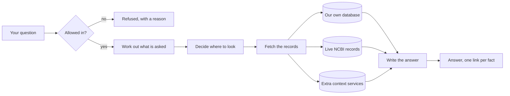

# Progress

A plain-language update, covering:

- What this project is.
- What works today.
- What comes next.

No jargon. If you have never seen the code, start here.

Last updated: 2026-09-22.

## Table of contents

- [What we are building, in one paragraph](#what-we-are-building-in-one-paragraph)
- [What works today](#what-works-today)
- [What does not work yet](#what-does-not-work-yet)
- [The story so far, sprint by sprint](#the-story-so-far-sprint-by-sprint)
- [What is next](#what-is-next)
- [Problems we know about and are tracking](#problems-we-know-about-and-are-tracking)
- [How we work](#how-we-work)
- [Where to look for more detail](#where-to-look-for-more-detail)

## What we are building, in one paragraph

A search tool for biomedical researchers. You ask a question in ordinary English, like "which diseases are associated with the BRCA1 gene?". It answers you in ordinary English, with a link next to every fact showing exactly which official record that fact came from. The links are the point. Anyone can build something that sounds confident. The hard part is being able to prove every sentence, and refusing to answer when you cannot.

It searches three kinds of source. A large database we built in advance and hold ourselves, which is fast. Live government APIs at the US National Center for Biotechnology Information, which are always current. And a set of extra enrichment services that add context. The system decides which of the three to use for each question.

Here is the whole thing as a picture. Every question takes this path, and the parts in the middle are what the sprints below have been building one at a time.

The two ends are the ones worth noticing. On the left, a question can be turned away before anything is spent on it. On the right, nothing reaches you without a link attached. If there is no link to attach, you get told so instead of being told something invented.

## What works today

You can ask a question and get a real, cited answer back, streamed to a web page as it is written.

NEW ON 20 SEPTEMBER, and the biggest single item is that all of it is now on the public site. A release went out, v0.2.0, the first since 28 August. It carries 241 changes, three weeks of work that until today only existed on the practice site. The public site is answering.

What a person notices, in the order it matters:

- An answer can now quote what a research paper actually found, rather than only naming the paper and leaving you to go and read it.
- Every question now searches the resources that suit it. Until today every question followed one fixed plan, whatever it was about.
- The same question now tends to give the same answer. Asked three times each, eight of the ten question-and-setting combinations we tried returned exactly the same number of sources every time, and the other two differed on one try out of three. Yesterday the same question gave eighteen sources, then thirteen, then eight.
- Long tables of results now turn a page at a time, ten rows to a page, instead of showing a cut-off list with no way to see the rest.
- The list of sources under an answer is now three folded groups rather than one long list that could run to seventy-eight entries. Open the group you care about.
- Searching published research now asks for the most relevant papers first. A question about mulberry leaves was coming back with papers about something else entirely, and the reason was one missing instruction in the request.
- The names of the scientists shown while you wait are now readable. They were flashing past too quickly to take in, and the time each one is shown now depends on how many there are rather than being a fixed number.
- The notes underneath an answer no longer contradict each other. There were four separate ways an answer could describe its own findings wrongly, and all four are fixed.
- The instructions on the integrations page, for connecting an AI tool to this product, now work exactly as printed. Pasting them used to fail, because the web address they named was missing one character at the end and the correction sent the request somewhere it could not follow.

NEW ON 14 SEPTEMBER, from the product owner's hands-on feedback over two days:

- Answers read like a short report instead of one long block. There is a one-line summary, then headings, then tables of diseases, genes, variants and clinical trials. It looks the same in the plain-language mode and the researcher mode, and on a phone the tables turn into stacked rows so nothing scrolls sideways.
- Sources are quieter. Each fact ends in a small number. Hover over it or tap it to see which record it came from, with a link to that record.
- While the answer is being written, a banner names the scientist writing it and how many records their helpers found. The sentences then appear one after another rather than all at once.
- Copying an answer and pasting it somewhere else gives you just the answer, without the hidden labels meant for screen readers.
- It can now say which genetic variant is linked to which disease. Ask "What diseases are caused by variants in the HNF1A gene?" and you get a table pairing each variant with its diseases. An earlier note claiming our database could not do this was wrong: nobody had checked.
- "What genes are associated with MODY?" now answers with six genes, the same six an outside prototype shows. Before, it did not recognise the name of a disease on its own.
- "Variants in GCK causing MODY" now answers every time. Before, it sometimes mistook MODY for the name of an animal and refused.
- Honest limits as of today: about 1 search in 10 fails with "could not be completed" and needs asking again, and the cause has not been found. Some answers have too much bold text. Long lists stop at 20 sources, so one question shows 5 variant rows where the outside prototype shows 13.

NEW ON 13 SEPTEMBER, from the product owner's first round of hands-on testing:

- You can search as a guest with no limit and no wall stopping you after a handful of tries, and nothing asks you to sign in partway through.
- Signing in takes one button. If the email is new, it creates the account. If the password is wrong for an existing account, it tells you the password does not match, rather than a vague error.
- Logging out takes you straight to the search home page from wherever you were.
- The screen holds still while you use it: the blue header and footer stay put instead of jumping, the answer box keeps one steady width as you move from the waiting screen to the finished answer, screens fade in and sit centred rather than snapping into place, and the home page is a light background rather than the dark one used elsewhere.
- The progress screen shows something happening the moment you press Search, instead of a blank pause first.
- The search box is bigger, so a long question no longer scrolls out of sight as you type it, and this works on a phone screen as well as a full-size one.
- The browser tab now shows an icon for the product instead of a blank page icon.

NEW ON 1 SEPTEMBER, and this is the sprint a person will actually notice:

- Answers name things. Ask which diseases are linked to BRCA1 and you get "breast-ovarian cancer, familial, susceptibility to, 1", not a reference code. Each name carries a link to the medical record it was read from, so you can check it.
- The waiting no longer looks broken. A number counts up every second and the current step pulses, so there is never a long stretch where the screen appears frozen. It is not faster, it is just honest about being slow.
- Follow-up questions continue the conversation. Ask about BRCA1, then ask "what variants cause it", and it knows what "it" means. The earlier conversation steers what gets looked up and never what gets claimed, so every statement in the new answer is still checked against a real record.
- An answer can offer where to go next, and can decline to. If the search found records it did not describe, it offers to go through them, and saying yes continues the conversation rather than starting over. If there is nothing genuinely further to offer, it says nothing, because a system that always asks a question is padding.
- Answers are whole sentences. If our checking removes a claim from the middle of a sentence, the whole sentence goes rather than leaving a fragment with a missing verb and an unclosed bracket.
- The system stopped talking to itself in public. It used to end an answer with "this answer reports 4 of the 5 findings prepared for it", which means nothing to a reader. It now says "3 further disease records were found for this question and are not described above".

Concretely, and from earlier sprints:

- There is a practice site and a real site, and they share nothing. Changes appear on the practice site as soon as they are merged, and the real site moves only when someone deliberately cuts a release. An account made on one does not exist on the other. Before 28 August there was one site, and anything merged went straight to the address people visit.
- Cutting a release does its own paperwork. It works out the new version number from the descriptions written on each change, writes the list of what is in the release, stamps the version permanently, and publishes a release page. Nobody summarises anything by hand.
- Changes get checked before they reach you. Ten checks now run by themselves whenever anyone proposes a change to the project: does the code still build, are the tests still passing, do any of the outside pieces we depend on have known security holes, and does the page still work for someone using a screen reader. Before this week none of that happened unless a person remembered to do it.
- You can see it working. Until this week the screen showed five grey step markers for about eleven seconds and then the whole answer appeared at once, so it looked frozen and then abrupt. It now shows each source being consulted as it happens. The answer was never slow in the way it looked; nothing was being said out loud while it worked.
- A conversation stays on the page. Asking a follow-up used to wipe out the answer you had just read. Your earlier questions now stay below the new one, folded up, and you can open any of them again.
- Every page has its own web address. You can send someone a link to the integrations page and they land on the integrations page. The back button works. Before this, every page lived at the same address and the address never changed.
- The page listing the ways to plug this into other software now describes the ones that exist. It was telling people to run a command that has never existed, and pointing at a web address that was never built, while leaving out one of the five ways entirely.
- The thumbs-down button works where you can see it. The icon was being drawn outside its own button, so clicking the picture missed the control underneath.
- It understands what your question is asking. This sounds like it should always have been true and it was not. Until this week the system read your question by looking for words written in capital letters and guessing each one was a gene name. Mention a database in passing, the way people naturally do, and it grabbed that instead, found no gene by that name, and refused to answer at all. Four of the seven questions this product exists to answer were being turned away exactly that way, and had been for twelve sprints. It now works out what kind of question you asked, picks out what the question is genuinely about, and checks each one against the real records before relying on it. If it cannot confirm something, it uses nothing rather than guessing.
- It knows which species you mean. Asking about a mouse gene used to get you a confident, fully sourced answer about the human one. Now the animal you name is carried through to the lookup, and if we cannot honour it, you get a refusal rather than an answer about the wrong creature.
- Two people can run the weekly review routine at the same moment without corrupting the file of approved example questions. Proven by actually running eight of them at once, twice over, with nothing lost.
- You can use it without an account at all, and as of 13 September there is no longer a five-search wall stopping you partway through. Signing in afterwards carries that visit's searches across.
- Another program can now ask it questions, in a format built for software rather than for people. A developer writes down exactly which parts of the answer they want (just the answer text, or the answer plus every source, or only the sources) and gets back that and nothing else. This needs an account; there is no anonymous version of it.
- You can now take a slice of our biomedical database away with you as a file. You name a starting point, say a gene, and how far out from it to walk, and you get back two spreadsheet-style files, one listing the things and one listing the connections between them, plus a short note recording exactly what was asked for and what actually came back. Other researchers' tools read this format directly. It is a batch job you run rather than something you click, and it will refuse to write into a folder that already has files in it unless you tell it to go ahead, because quietly mixing two exports together is how you end up with a file that looks complete and is not.
- You can use it from a terminal instead of a web page. `s3 ask "your question"` prints the answer as it is written, with the list of sources underneath, and you can send that straight into a file. Progress messages go to the screen rather than into the file, so the file holds the answer and nothing else.
- It remembers the conversation. Ask "which diseases are associated with BRCA1?" and then "what variants cause it?", and it knows what "it" means. What it remembers is deliberately small and capped, it is only ever used to work out what you are asking about, and it is never used as evidence: anything it tells you is looked up fresh and cited from the source, every time.
- What it remembers is yours. If someone else names your conversation, they get nothing, and they cannot tell the difference between "that is not yours" and "that does not exist", so it cannot be used to go fishing for other people's conversations.
- You can choose how technical the answer is: a short version for a clinician who needs the evidence fast, the normal version, or a full-detail version with the raw identifiers spelled out. Once you are signed in it remembers which you prefer, on any device.
- If an answer leaves something out that we actually found, it now says so, in the answer, and lowers its own confidence rating. It tries once to write the answer again including what it missed, and if it still cannot, it tells you rather than quietly handing you a shorter answer that looks complete.
- Every answer is signed by a named scientist from history, the same name every time for your account. They are all people who have died, which is a deliberate choice: putting a living scientist's name above an answer they had no part in reads like they are endorsing it.
- You can sign in. Accounts, passwords, and sessions all work.
- You can type a question into a chat window and watch the answer appear word by word, with a stop button.
- The system asks a real question against our own biomedical database and gets real results.
- Every factual sentence in the answer carries a numbered link to the official record it came from.
- If the system cannot find support for something, it says so and points you somewhere else, instead of making something up.
- Questions that are off topic, that ask for medical advice, or that try to manipulate the system are turned away before they cost anything.
- The system can look up any gene name against the live NCBI databases, not just the one it knew about before. This was the single biggest gap, and it is now closed.
- A dangerous kind of automatic question, one that once crashed our own database and took it offline for everyone, is now stopped before it can ever reach the database at all.
- The system can now look up a genetic variant by its standard identifier (an "rs number", the way scientists refer to a specific spot in the genome) and get back its normalized coordinates, how clinically significant it is, and how common it is across different population groups.
- The system can now look up what a published research paper says about a gene, disease, or chemical, and separately look up what has been written in the scientific literature about a specific genetic variant.
- The system can now look up a bacterial sample (a "biosample", the way labs track which food-poisoning outbreak a sample came from) and get back its lab metadata, which antibiotics it resists, and which other samples belong to the same outbreak cluster and how closely related they are genetically.
- The system can now search for clinical trials by disease or condition and get back real trial identifiers, their recruitment status, and a bounded summary of who can enroll.

All six live-government-API connections the plan called for are now built. That is every planned data source.

- For the first time, a question about a gene can pull an answer from BOTH our own database and a live government record at once, in the same answer, each fact carrying its own separate link back to where it came from. This is the first time the system has ever combined two sources in one answer.
- Every citation, from any of the seven sources, now carries the same four pieces of trust information: what kind of evidence it is, how confident the source itself is in the claim, what population the data covers if relevant, and what usage rights apply to it. Previously only our own database's citations carried this.
- The system's highest-stakes example question, "which diseases are associated with BRCA1?", is now correctly flagged as needing extra scrutiny. Before this sprint, a quirk in how the answer was assembled meant this exact question, the one the whole trust system is built around, was being waved through as routine instead.
- If a live government record and our own database disagree about the same fact, the system now notices and says so, rather than silently picking one and hiding the disagreement.
- If a piece of information from our own database is old enough to be worth double-checking, the system is now built to automatically verify it against the live government record before repeating it as current. This machinery is real and tested, but our own database does not yet store the specific kind of detail it needs to check against, so it has nothing to actually fire on yet (see below).
- If your internet drops mid-answer and you reconnect, the system now picks up exactly where you left off, no repeated sentences, no missed ones. Before this sprint, a reconnect just started the whole answer over from the beginning.
- Two people, or two browser tabs, can now watch the same answer being written at the same time. Before this sprint, only the first one got anything; the second one saw nothing at all.
- A conversation nobody is actually watching now stops itself after a short wait, instead of quietly running to completion and burning resources on an answer nobody will ever read. This closes a real gap found earlier: an abandoned browser tab used to let the system keep working, unseen, until it finished on its own.
- You can now ask for the full list of sources behind a finished answer as a single request, rather than only ever seeing them appear one at a time while the answer streams.
- The web page now looks like a finished product rather than an unstyled form. There is a proper landing page, a live view of the five thinking steps as they happen, an answer page where every sentence sits beside a coloured stripe showing which of the three data sources backed it, expandable source cards, a page explaining how answers are built, and developer documentation. A grey stripe means a sentence nobody could back with a source, which is visible before you read a word.
- You can now try the system without an account, and (as described above under 13 September) that no longer stops after a handful of searches.
- Every answer now carries the name of a historical scientist working on your question, shown as a plain label rather than a cartoon, and a control that lets you ask for a clinical summary, a researcher-level answer, or a deeply technical one.
- You can rate an answer, say what was wrong with it from a list drawn from mistakes this system has genuinely made before, and flag an individual source as not supporting the sentence it is attached to. That last one is the most useful thing a person can tell us, because it identifies exactly which link was wrong rather than just that the answer felt off. This line described a button that looked real and quietly threw your rating away until the most recent sprint. It is now genuinely saved, against your own record and nobody else's, and the button was proved to work by starting the real product in a browser and clicking it rather than by any test.
- The system now keeps a record of every question it is asked: what was asked, which sources it used, whether it answered or refused, how much it cost and how long it took. Nothing looked at these records before, so the daily spending limits had been counting against an empty book since the very first sprint and had never once been able to stop anything. They work now.
- There is a weekly routine, and a real script rather than a document describing one, that shows you the questions the system handled badly and lets you turn a recurring one into a new permanent test case. A person makes every judgement in that routine; the software cannot promote anything on its own.
- Every screen was checked against the international accessibility standard by an automated tool, and four real problems it found were fixed, including text that was too faint to read against its own background and code examples a keyboard user could not scroll.
- The system now has a first outbound door for other computer programs and AI agents to ask it questions directly, the same protocol other AI tools already speak to each other. It answers with one complete, cited result rather than a stream, and it never hands out a cost figure or lets a caller reach any of the seven lookup tools directly, only the one question-answering door. Nothing outside this project uses it yet, so there is no visible change if you are using the web page.
- Your past searches are still there when you come back. Close the browser, open it again, sign back in, and the questions you asked before are waiting in the sidebar with the date you asked them and how many sources each answer used. Clicking one asks it again. Until this sprint that list lived only in the page you had open, so closing the tab erased it. Two things it deliberately does not do: it brings back your questions and not the answers themselves, because we never stored the answer text, and it cannot show you the list until you sign in again, which is the next thing to fix.

## What does not work yet

THE HONEST HEADLINE AS OF 22 SEPTEMBER, in one sentence: the system can quote its sources but it cannot explain them in its own words, so answers read like a list of records no matter which setting you pick.

And now we know how often it answers at all, because on 22 September we finally ran every one of our fifty test questions three times over. Half the questions answer every time, and when they answer they come back with the same sources each time. Eighteen never answer, and twelve of those are meant to be turned away. Six are genuine gaps, and every one of them is the same kind of failure: the search of our own database comes back with nothing, or breaks, and nothing says so.

That is not a writing problem, and it took most of a day to establish that. The system has a safety rule that every sentence must be checkable against a source. The way it checks is strict: the sentence has to repeat the source's words exactly, in the same order. That works fine for a short record, where a sentence can quote the whole thing. It breaks for a long piece of text like a research abstract, because a single sentence cannot contain four hundred words, so the only sentence that passes is one that copies a chunk of the abstract word for word.

Explaining something means saying it differently. So every explanatory sentence the system writes gets quietly deleted before you see it, and what arrives looks thin rather than censored. We tested nineteen different ways of writing such a sentence. Three survived, and all three were straight copies.

We have now tried five separate times to fix this by rewording the instructions we give the system, two of those attempts today. All five failed, and each failed differently. One made it refuse to answer at all. One made it quietly drop a quarter of what it found. One produced two hundred words of "One disease is called this. Another disease is called that." A sixth attempt is not the answer.

We also caught ourselves measuring the wrong thing. We reported one attempt as a success because the answer got longer. Then we ran the same question three times without changing anything and got 113, 66 and 101 words. The length was noise, and the thing we actually care about, whether a person understands the answer, was never measured at all. The product owner's words, which are now written into the code: "Number of words do not define an answer."

What we shipped instead of a sixth rewrite: we went and fetched better raw material. NCBI writes a plain-English description of every gene, and we had simply never asked for it. It now comes back with every search and is shown as a source. The honest limit is that the system still does not use it to explain anything, so this is half a fix.

The other things we know are wrong today:

- One search in ten quietly loses an entire source of information. First seen over twenty live runs on 21 September, measured over the full test on 22 September (of 119 database lookups where the same question had found records on another try, 12 came back with nothing), and by the end of the same day we know why, twice over. The lookup had been writing down its own reason all along, and the step that reports it to the screen was throwing the reason away and keeping only the row count. That one line is fixed, and the reasons turned out to be two. Some questions name nothing the system can look up, like a stretch of chromosome coordinates or a bacterial isolate, so the database search is started with nothing to search for. And on the broadest questions, the second of two database searches runs out of the time the system allows and is dropped while the answer carries on with what the first search found. As of the evening of 22 September the screen does tell you: an answer that lost a search ends with a line saying so and inviting a retry, and a question the system could not read is answered with "name the gene, variant, disease or organism you mean" instead of a dead end.
- Nine of the fifty test questions fail that database lookup every single time, not just sometimes, and six of them end as "I could not find grounded evidence" for questions we expect to be answerable. We now know these split two ways: four name nothing the system can turn into a lookup (a coordinate range, an isolate, a project accession), and two always lose their second search to the time limit. Both are defects with a fixed list of examples rather than bad luck.
- ~~Two questions that the product is not supposed to handle at all, one asking it to run a sequence search and one handing it a file of genetic variants, were answered rather than turned away.~~ DECIDED and FIXED on 22 September: the product owner chose to turn them away, and the gatekeeper now does, with a message saying the capability does not exist and where to run a sequence search instead. Confirmed by the product owner on the practice site the same day.
- The tool we built a week ago to catch exactly that had a one-word bug and had been reporting "nothing wrong" on every single run. It was looking for the word "layer_1" and the system says "layer_1_graph".
- ~~Long quotes from research papers are still cut off in the middle of a word, like "has been uncle".~~ FIXED on 22 September, checked on the practice site the same hour (the gene description now runs to its end), and confirmed by the product owner the same day. The cause was embarrassing in a useful way: a safety limit deep in the system trimmed every piece of text to 500 characters, and its own comment said the limit was 2000. The 2000 could never apply because of how the text was handed in. The day before, we had traced the text through every step we could think of, found it whole at each one, and concluded the problem only happened on the live site. We had skipped a step. A fresh pair of eyes listed every step on the real path and found it in an hour. Text is now trimmed at 2000 characters, at the end of a word, with a visible "…" when it is trimmed at all.
- One useful source of gene-to-disease information, OMIM, is still switched off. We switched it on today and switched it straight back off, because we found that a safety filter written for it had never actually been connected. Without that filter, asking about one gene can return records about a completely different gene, correctly labelled and completely wrong. That is the worst kind of error this product can make, so it stays off until the filter is wired in.
- ~~One question shape is slow every time. "I am a student, explain in plain terms what the BRCA1 gene does" took 110, 104 and 97 seconds on three tries.~~ FOUND and FIXED on the evening of 22 September. The database was being asked, for that shape of question, to run a search it could not plan well, and it gave up after its own half-minute limit while the answer waited on it. That shape now asks for the gene's own record instead, which takes under a second. On the practice site, waiting to be confirmed.
- Clicking one of your past searches asks the question again from scratch instead of showing the answer you already read, because answers are not stored anywhere.
- One security-shaped loose end in how an AI tool connects to the product, described below.

THE HONEST HEADLINE AS OF 20 SEPTEMBER, kept for the record, in one sentence: answers now hit their own ceiling of twenty sources and then tell you they were cut short, so a good answer still reads as a thin one.

That is measured rather than felt. We ran thirty real searches on the live practice site and counted what each answer said about itself. Twenty-four of the thirty ended by telling the reader the result had been trimmed. Twenty-two of the thirty said some of what was found is not described above. The number of sources used ranged from thirteen to twenty, averaging sixteen, and twenty is exactly the limit we set. So answers are pressed up against that limit most of the time, and then apologising for it. Nobody has yet decided whether twenty is the right number.

That measurement also killed the theory that sent us looking. We had believed the system was routinely throwing away its own written answer and shipping a bare list of records instead. It does that on seven of thirty runs, and five of those seven are one single question. Two of the five questions we tried never did it at all. Measuring it cost an evening and saved us building a fix for a problem that is much narrower than we thought.

The other things we know are wrong today:

- The two answer settings, plain language and researcher, still look too similar. The product owner raised it today and was blunt about it: plain language is for an ordinary reader, researcher is for a researcher, and right now both produce the same page. It is decided and written down. It is not built.
- One search out of the thirty took 127 seconds. The usual is about 13. Nobody has found out why, and nobody is assigned to.
- For one shape of broad question, "what genes are associated with X", the written answer fails our own fact-check five times out of six, so the reader gets a list of records instead of a piece of writing. Refusing to show unverified writing is the correct behaviour. Needing to refuse that often is not.
- Clicking one of your past searches in the sidebar asks the question again from scratch instead of showing you the answer you already read. That is because the answer text is not stored anywhere at all. Fixing it means deciding whether we should store answers, which is a question about people's data rather than a piece of screen work.
- One security-shaped loose end. Connecting an AI tool to the product involves a web address that quietly forwards the request, and the forwarding step sends it to an unencrypted address before bouncing it back. The instructions we now print avoid that step entirely, so nobody following them is exposed, but the forwarding itself is still wrong and fixing it means changing how the site is hosted rather than changing any code.

One thing that did improve, and it is worth keeping in view: another thirty live searches ran today and every one of them answered. Counting the two runs before it, that is seventy-five searches in a row with no failure, against roughly one in ten failing a week ago. We have not fixed that failure and we are not claiming we have. The recorder built to catch it in the act has been running the whole time and has never once caught it.

THE HONEST HEADLINE AS OF 13 SEPTEMBER, kept for the record: the screens are steadier now, and the biggest remaining problem is the answers themselves. Most real questions are still refused or answered thinly, only two of our seven lookup tools are actually being used, and the literature and clinical-trials tools are never reached at all.

A few more things worth saying plainly, from the product owner's first round of testing:

- The same question can get a different outcome on different tries. Ask it twice and you may get an answer once and a refusal the next time.
- The account menu tells you there is no search limit in effect, which is wrong: a signed-in account is actually held to a limit of 100 searches a day, and that limit does fire.
- Connecting an AI tool to this product through the link meant for that purpose does not work on the practice site right now; every attempt is rejected.

THE HONEST HEADLINE AS OF 5 SEPTEMBER, kept for the record: the product is much easier on the eye than it was, and the biggest remaining problem is still that answers are SLOW. Nothing done that week made them faster.

Two things are worth saying about the week, because they are the kind of thing a progress note usually leaves out.

The first is that we found a privacy problem nobody was looking for. If two people used the same computer, one after the other, the second person could still see the first person's conversation on screen after the first had signed out: their questions, the claims, and the sources. It is fixed. It had been there a while, and it survived because two comments in the code confidently said it had already been handled.

The second is that a test we trusted had been quietly broken for seven rounds of work. The tests kept passing, so nobody looked. They were passing because almost all of them checked that the SCREEN drew correctly, and the screen draws correctly whether or not the system actually answers. A green tick meant "the page rendered", never "it answered the question". That is now partly fixed and honestly recorded as not finished.

THE HEADLINE FROM 1 SEPTEMBER, still true: the answers are readable, and the thing that replaced unreadability as the biggest problem is that they are SLOW.

An answer can take more than twenty-five seconds. We had believed it was twelve to fourteen, and we were wrong: we filmed the live site one picture per second and the answer had still not arrived at twenty-five. Worse, for fifteen of those seconds NOTHING ON THE SCREEN CHANGED. We have made the waiting look alive, with a number counting up and a moving indicator, and that is honest rather than fast. It does not make the answer arrive any sooner, and nobody is currently assigned to make it faster.

One smaller one we found and have not fixed: the system reports the cost of answering a question as zero. That turned out not to be a bug at all. The figure is deliberately hidden from ordinary users, and it is hidden from us too unless an account is explicitly marked as an operator. The control is working; we were reading it wrong.

The phone-sized page that slid sideways IS now fixed, and the cause was not what the note said. It was recorded as "about eight pixels too wide", which sounds like a rounding nuisance. The real cause was that the bar across the top of the page overlapped itself: the product name wrapped onto three lines and ran into the menu beside it, and the sign-in button was cut off the edge. The eight pixels were the symptom. Anyone reading the old description would have put it off; anyone seeing the actual screen would have fixed it that day.

THE PREVIOUS HEADLINE, from 31 August, kept because the story of it is worth more than the fix. Someone asked the live site which diseases are linked to the gene BRCA1. It answered, quickly, and cited every claim:

> The knowledge graph associates the gene BRCA1 with four disease records: MedGen:C0346153, MedGen:C2676676, MedGen:C3280442, and MedGen:C4554406.

Four reference codes where four disease names should be. A researcher cannot use that sentence for anything. Everything around it worked: the page was well built, the system found real records, and it honestly showed its sources. The answer was still useless.

We found the cause by looking in our copy of the database rather than guessing. Each disease record has a field meant to hold its name, and for diseases that field was filled in with the name of the CATALOGUE the record came from, not the name of the disease. Across twenty-five records it only ever said one of three things: "MedGen", "MeSH", or "SNOMEDCT_US". Gene records are fine, which is why gene questions read normally. So a readable answer was never possible from our own copy of the data, and showing the system that field would have made things worse, not better: it would have answered "SNOMEDCT_US" four times.

WE THOUGHT THE FIX WAS ALREADY HALF DONE, AND WE WERE HALF WRONG, which is the part worth keeping. Our notes said the system already looked these records up at a public medical database during the same search, so the ability to turn a code into a name was already there. The notes also said to check that before promising it. We checked, and the public database REJECTS a request made that way: it needs two steps, one to find the record and one to read its name. What survived was the useful half, that the system could already do both steps, so this was wiring rather than building. It now makes those two requests once for the whole answer rather than once per disease, and it matches each name to the right code by reading the code back out of the reply instead of trusting the order they arrive in, which would have quietly attached the wrong disease name to the right code the day that database changed its ordering.

The newest honest limitation, and it is the one a person will actually notice. Your searches are now saved properly on our side, but the browser still forgets WHO YOU ARE when you reload the page. So you come back, you are signed out, and you have to sign in again before your searches appear. They are not lost, they are just behind a sign-in you did not expect. Keeping you signed in is its own piece of work and is deliberately not bolted onto this one, because where a browser is allowed to store the thing that proves who you are is a security question worth deciding properly rather than in the last hour of an unrelated week.

A second one, from the same sprint, and it matters most on a shared computer. If someone uses the tool without an account and then a DIFFERENT person creates an account on that same browser, the first person's questions follow them into the new account. Our system genuinely cannot tell those two situations apart: one person finally signing up looks exactly like a second person sitting down at the same machine. We found it, we can see it, and we chose to write it down rather than guess at a fix that would break the ordinary case of one person signing up.
Both of last week's headline problems are fixed, so this section leads with what is true now rather than keeping solved problems at the top. What they were, and what happened to them, is in the sprint list below.

The honest headline as of 30 August: WE STILL CANNOT SAY HOW OFTEN THE ANSWERS ARE GOOD, and we now know that is harder than we thought. The system answers questions and cites every claim, and three releases have shipped. We built the measuring instrument this week and it did not work. Four separate checkers who did not build it reviewed it, and it failed all four.

What failed is worth understanding, because it is not a small bug. The scorer was meant to check that an answer really came from the records the system looked up. It ended up checking the answer against the system's OWN note about what it had looked up. Both of those are written by the same system, so an answer that invents a gene AND invents a source for it agrees with itself perfectly and scores full marks. We measured exactly that: an answer about a gene that does not exist, citing a record that does not exist, scored a perfect result while every automated check was green.

The scorer is shelved rather than patched, and that is a deliberate call by the project owner. The fifty test questions are a FIRST ATTEMPT. Until we are confident those are the right questions, building a scorer accurate enough to catch subtle errors is precision aimed at a target that is still moving. The questions themselves survived all four reviews and are the half worth keeping.

The previous headline is worth keeping in view because it is now fixed. It used to be that nothing ran the tests automatically: every check happened because a person decided to run it, while a change merged into the main line went straight to the live web address with nothing in between. That is fixed as of 26 August, and 28 August put a second step between a merge and the public.

The new honest headline is narrower and still real: those checks do not actually BLOCK anything. They put a red mark next to a button that still works. Making them genuinely block a merge needs either a paid plan on the service that hosts our code, or making the project's code public, and that is a decision for the product owner rather than something we can build. Until it is made, the checks inform a person rather than stopping them.

The second thing to know: the seven problems one person found in an afternoon of clicking around are all fixed and all live, as of 25 August. We checked by opening the real web address afterwards rather than trusting that it had worked. One thing is better but not finished: the screen used to sit silent for about eleven seconds while it worked, and it now tells you which source it is consulting as it goes, but there is still a gap of about six seconds at the end while it writes the answer, during which it says nothing. That is the same problem one step further along, and it is written down.

A correction to what this section said last week. It claimed the thing we most wanted to remove was that the tool could only be reached by someone able to run it on their own machine. That had already stopped being true when it was written: there has been a public web address since 24 August. Left in and corrected rather than quietly deleted, because a status document that silently rewrites its own past is worth less than one that shows where it was wrong.

On the two problems that headlined this section last week, and why we are not simply declaring victory:

- The first was that someone could hide a polite-sounding instruction inside an ordinary question and make the system answer about a gene they chose rather than the one the question was about. That is fixed, and the fix does not depend on the system being clever enough to notice. It now recognises the shape of such an instruction directly, before it does any thinking at all, and turns the question away in a fraction of a second at no cost. We measured it: before the fix, the system's own judgement let this through on all six attempts of the worst example. After it, none of eighteen attempts got through.
- The second was that asking about a retired gene name got you a confident, fully sourced answer about a different gene, with nothing saying the subject had been swapped. That is fixed too. The system now declines to answer and tells you what it found instead: that the name you used has been retired, and which record replaced it, so you can ask again.

What we are deliberately NOT claiming about the first one. We closed the shapes we could recognise reliably: an instruction dressed up as a processing note, and any question that names the system's own internal machinery. Someone who writes the same trick in completely plain English, using none of those tells, still has to get past the system's judgement rather than a mechanical check. We have measured that judgement as unreliable in principle. This raises the floor. It does not prove there is no way in. We would rather say that plainly than let a green tick imply more than we tested.

An older limitation, still true: someone determined, with access to a lot of internet connections, can still use up the free searches we set aside for strangers each day and leave nothing for genuine visitors. It is a real problem for a public launch and it is scheduled.

## The story so far, sprint by sprint

Each of these is a completed, reviewed, merged piece of work.

| Sprint | In plain terms | Done |
|--------|----------------|------|
| Finding out why the answers read thinly, and fixing a real loss of sources | Discovered that the system is only allowed to quote its sources word for word, never to explain them, which is why every answer reads like a list. Tried five ways of instructing it differently; all five failed. Went and fetched better raw material instead: NCBI writes a plain-English description of every gene and we had never asked for it. Separately, found and fixed a genuine loss: a quote from a research paper that ran to more than one sentence was being thrown away completely, contributing nothing and losing its source link, with nothing on screen to say so. Also removed a confusing Notes block the product owner flagged, and proved that one search in ten quietly loses a whole source of information | 21 September |
| Twelve fixes, and the first release in three weeks | Answers can quote what a paper found. Every question now searches what suits it rather than following one fixed plan. Long tables turn a page at a time. The source list folds into three groups instead of running to seventy-eight entries. Research searches ask for the most relevant papers first. The scientist names during the wait are readable. The integrations instructions work as printed. Then all three weeks of work went to the public site as release v0.2.0, 241 changes. What the day taught was uncomfortable: every problem the product owner had reported turned out to be the product describing itself badly rather than failing to find things. On the one question we took apart in detail, it was already finding 124 records where it used to find 44 | 20 September |
| Getting the safety checks working again, and measuring what is really wrong | The automatic checks that run on every change had been failing for five days. The cause turned out to be three separate problems in the tests themselves, not in the product, one of which could have pointed the system at the wrong database. Fixed all three without weakening any check. Then measured the live site properly and found that the same question can return three different sets of sources | 20 September |
| Making it easier on the eye, and writing down what it must do | Rebuilt the sign-in screen, which had never been designed at all and looked like a raw form. Removed a permanent warning strip that sat on every screen and took up a tenth of a phone display. Made the top bar work on a phone instead of overlapping itself. Gave the integrations page working copy buttons and real links, where before it was text you could only read. Fixed a privacy problem where one person's conversation stayed on screen for the next person. And wrote down, for the first time, the fifty things the product must be able to do, ranked so the most important come first | 5 September |
| A budget on how much we ask of others | Capped how many requests one question may make of the public medical databases, and made a quick question give up waiting sooner than a deep one | 31 August |
| 1.0 | The skeleton of the service, and the fixed format every answer travels in | 2026-07-27 |
| 1.1 | Sign-in, accounts, and the database that holds user information | 2026-07-28 |
| 2.0 | The five-step thinking loop the system follows for every question, and the machinery that picks which AI model does which step | 2026-07-28 |
| 1.2 | The web page: a chat window, answers appearing as they are written, and a stop button | 2026-07-28 |
| 2.1 | The first real connection to our biomedical database | 2026-08-01 |
| 2.2 | The rule that every sentence must be backed by a source, or the system refuses to answer | 2026-08-03 |
| 3.0 | The gatekeeper that decides which questions are allowed in at all | 2026-08-04 |
| 3.1 | The first live government API connection, and gene name lookup | 2026-08-05 |
| Database safety fix | Stopped a specific kind of automatic question that had previously crashed our own database | 2026-08-07 |
| 3.2 | The second live government API connection: genetic variant lookup by rs number | 2026-08-08 |
| 3.3 | The third and fourth live government API connections: published research literature lookup, and research-literature lookup for a specific genetic variant | 2026-08-08 |
| 3.5 | The fifth and sixth live government API connections: disease outbreak lookup and clinical trials search, completing every planned data source | 2026-08-08 |
| 3.4 | Extended the trust-and-citation rules to cover all six newer lookup tools, and connected gene lookup to the answer pipeline for real, the first tool to be wired all the way through | 2026-08-10 |
| Specification pause | Brought the written plans in line with everything learned building the six tools; cleared a backlog of small real bugs and mismatches; swept a folder of outside reading material; then, for the first time, actually asked the finished system real questions and read the answers by hand, which is what found today's headline problem | 2026-08-10 |
| 4.0 | Finished the front door to the whole system: reconnecting after a dropped connection, two people watching the same answer at once, a stalled conversation stopping itself, and a way to fetch a finished answer's full source list in one request | 2026-08-11 |
| 4.1 | Built the first back door: a way for other computer programs and AI agents, not just a person typing into the web page, to ask the system a question and get one complete, cited answer back | 2026-08-11 |
| 4.8 | Gave the web page a real design, and found that no browser test in this project had actually run for five sprints | 2026-08-13 |
| 4.9 | Brought the answer page in line with the approved design, and found three serious problems by putting the two side by side | 2026-08-14 |
| 4.10 | Opened the product to people without an account: five free searches, counted by our server rather than the browser. Then spent four rounds stopping one person from using up everybody else's free searches in under two seconds | 2026-08-15 |
| 4.2 | A command-line version, so you can ask a question from a terminal and pipe the answer into a file. Six rounds of review found 56 problems, five of them serious, including one where a booby-trapped research abstract could take over your terminal window and fake its own list of sources | 2026-08-16 |
| 4.3 | A way for other software to ask questions and pick exactly which parts of the answer it wants back. It took six rounds of review, more than any other piece of work so far. Twice the same bug returned: an error message meant for us leaked a database password out to whoever was asking. Both times the cause was the same, and it is worth stating plainly, because it is a mistake anyone can make: the code tried to decide whether a message was safe to show by looking at WHERE THE MESSAGE CAME FROM instead of at WHAT IT SAID | 2026-08-17 |
| 4.4 | Take a slice of the database away as a standard file other tools can read. The check we had written to prove it worked passed, while the plain everyday way of running it returned five hundred of the wrong thing and none of the right thing | 2026-08-19 |
| 4.5 | It remembers what you just asked, so you can say "what variants cause it?" instead of naming the gene again. You can also pick how technical the answer should be, and it now signs its work with the name of a scientist from history. Two serious problems turned up in our own work, both after it looked finished: telling it to write plainly made it stop answering entirely, and the remembering half was built so carefully that nobody noticed nothing was ever being written down | 2026-08-20 |
| 4.5 review | The review sprint 4.5 skipped, run afterwards by two independent reviewers who had not written any of it. They found the mistyped-gene problem and the shared-conversation problem described above, plus about thirty smaller things, and they found the same two worst problems separately without seeing each other's notes. They also found that the safety check written to guard this work was barely running at all | 2026-08-21 |
| Design system repair | Fixed the design's own colour and keyboard problems at source, after working around them three separate times | 2026-08-14 |
| 4.6 | The system now keeps a record of every question it is asked and how well it answered, you can rate an answer with a thumbs up or down, and there is a weekly routine for turning bad answers into new test questions. It also switched on the daily spending limits, which had been running against an empty record book since the very beginning and so had never once been able to stop anything. Three rounds of review found thirty problems. Two were serious and both broke the spending limits in the same way: putting one invisible character in your question, or just pressing Stop, made that question free and uncounted. Neither piece of the system was wrong on its own, which is why nobody caught it by looking at either one. Merged | 2026-08-21 |
| 4.11 | The database now answers over a normal secure web connection, so nothing depends on a person opening a hand-made connection first. Before this, every check against real data waited on someone remembering to do that by hand, and that connection failed twice in one week: it was down for two days, then down again through all three review rounds of the previous sprint, which shipped with three of its real-data checks never run. Now the checks run on their own, and all 59 of them pass against the live service with no hand-made connection anywhere. It took four rounds of review instead of the usual two, and three times the work had to stop because a problem was found inside the previous round's own repair | 2026-08-22 |
| 4.7 | The system finally understands what a question is asking. Until this sprint it never worked that out: it scanned your question for any word written in capitals and guessed that was a gene name. So if you asked about a testing panel and mentioned a database in passing, it grabbed the database name, failed to find a gene by that name, and refused the whole question. Four of the seven questions this product must be able to answer were being turned away that way, and it had been true for twelve sprints. Now it works out what kind of question it has been asked, picks out the things the question is actually about, and confirms each one against the real records before using it. All seven questions get through | 2026-08-23 |
| 4.12 | Put it on the internet. There is now a web address anyone can open, and it answers real questions with real sources. Added at this checkpoint rather than the last one, where it was missed: the sprint that made the product reachable by a stranger had no line in this table at all. Five separate things had to be fixed before it answered even once, every one of them found by using it rather than by reading it, and the most useful lesson was that a green status light is not evidence: the word Online was true of a service quietly running a copy of the wrong program | 2026-08-24 |
| 4.16 | The seven things one person found wrong in an afternoon with the live version, all fixed. The screen no longer looks frozen while it works: it now says which source it is consulting as it goes. A follow-up question keeps your earlier ones on the page instead of wiping them out. Every page has its own web address and the back button works. The page describing how to plug this into other software now names the five ways that exist, instead of a command that never existed and a web address never built. A source label stopped repeating itself. The line under an answer stopped telling you to narrow your question when what it meant was that only one record backed the claim. And the thumbs-down icon is now drawn inside the button you click. The most useful thing learned was not any of those: the reason the screen looked frozen was that the system never said anything out loud while it did the actual work, and a note written in the code eleven days earlier had predicted exactly that and been read as a design principle rather than a live fault | 2026-08-25 |
| 4.13 | Your searches survive closing the browser. The sidebar now reads them back from the server instead of forgetting them, each one showing its own date and source count, and nobody can see anyone else's | 2026-08-27 |
| 5.0 | Recording of what the system does on every question: how long it took, what it cost, and which sources it touched | 2026-08-30 |
| 5.1 | Fifty test questions with known-correct answers, each checked against the live public databases rather than taken on trust. Sorted into three kinds: questions with one exact answer, questions asking for everything of a kind, and open-ended conversations that build over several turns | 2026-08-30 |
| 5.2 | The machine meant to score answers against those questions. Built, reviewed four times, failed four times, and SHELVED. It is kept and it refuses to run, so nobody mistakes it for working | 2026-08-30 |
| A map of the code | A guide that says which file to open when something breaks, plus one line on what every single code file does. Written for whoever picks this up next, human or machine | 2026-08-31 |
| Set 11, answers worth sharing | Answers read like a short report, with a summary, headings and tables, in both modes and on a phone. Sources became small numbers you tap. A banner names the scientist writing the answer. Copying an answer copies only the answer. Questions about which variant causes which disease, and which genes go with a disease, now answer. About 1 search in 10 still fails and needs asking again | 2026-09-14 |

Nine of these are worth understanding, because they explain how this project works.

Sprint 2.1, the expensive lesson. We asked "which diseases are associated with BRCA1?" and got back twenty-five results. All twenty-five had real, working links to official records. Every automated test passed. And every single result was wrong: they were not diseases at all, they were similar genes in other animals. The tests could not see this, because they were checking that the plumbing worked rather than that the answer was true.

Finding it took four rounds of review over four days. Everything we do now is shaped by that: before writing any new feature, we now write a test that asks whether the ANSWER is right. We watch it fail first, so we know the test is capable of catching a lie.

Sprint 3.0, the gatekeeper, and why it has two halves. A gatekeeper that refuses everything is perfectly secure and completely useless. So the tests check both directions: that bad questions get turned away, and just as importantly that good questions get through. That second half caught a real problem. An early version refused the single most important question in the whole product, "which diseases are associated with BRCA1?", because our list of biomedical words contained "disease" and the question said "diseases". One letter. No security test would ever have found that.

Sprint 3.1, the check that paid for itself twice over. Gene name lookup shipped, got checked. The check found two serious problems: the lookup was completely broken for every gene (a leftover from an unrelated fix), and a search-scoping fix was quietly returning the wrong results instead of the right ones. Both got fixed.

Then, because the same team had just spent a whole day learning not to trust a fix that graded its own homework, we paid for one more check on the fix for those two problems. That last check found something worse than either original bug: for a handful of gene names, the government database was matching on a nickname instead of the real name and handing back a real gene that was simply the wrong one. Confidently, with a real-looking source link attached.

That is the exact failure this whole project exists to prevent, and it was three checks deep before anyone caught it.

The database safety fix, the same lesson learned twice in one afternoon. A week and a half earlier, one automatically written question had a shape our database could not handle. It crashed the whole database for everyone using it at the time. This sprint closed that gap: the system now recognises that dangerous shape and refuses to even try running it.

But the first attempt at writing that fix had a bug of its own, an obscure one. A reviewer caught it before it ever shipped. The fix was rewritten, and a second, completely separate reviewer checked the rewrite and confirmed it actually closed the gap. The team had already learned once, on sprint 3.1, that a fix should never be trusted just because the person who wrote it says it works.

This sprint proved that lesson applies even to the fix for a problem the team already understood well: knowing exactly what is wrong is not the same as writing a correct fix on the first try.

Sprint 3.2, the variant lookup tool. The fix that broke something new twice.

Building this tool found two serious problems early: it silently cut off values that were too long instead of saying so (imagine a lab report where a long diagnosis just gets chopped off mid-word with no note that anything is missing), and if you typed in a plain number instead of a real variant identifier, the system would confidently return real information about a completely different, unrelated variant. Both got fixed.

Then, exactly as happened on sprint 3.1, a separate check on the fix itself found the fix had its own problems: the "stop cutting things off" fix turned out to reject roughly one in ten real, clinically important variants outright, including some of the most well known ones in medicine, because the fix refused the whole answer rather than just leaving out the one piece that was too long.

And a second fix, meant to correctly tell the system "this failure is temporary, try again" versus "this input is simply wrong, do not retry," was doing the opposite of what it claimed for one common kind of failure. Both were fixed a second time and checked a third time before anyone trusted them.

The lesson, now proven on two sprints in a row: a fix for a bug deserves MORE scrutiny than new code, not less, because the fix is the newest, least-tested thing in the whole system.

Sprint 3.3, the literature lookup tools. The confidently wrong answer that both tools gave at once. Both new tools ask a government search service for a match and hand back whatever comes back as a real result. Late in review, someone tried typing in a bare number, "334", instead of a real identifier. Both tools cheerfully returned real, official-looking, fully cited answers about five completely unrelated things.

Separately, typing in an ordinary word like "the" returned ten confidently matched, real medical terms that had nothing to do with the word "the". Nothing was broken about the individual records returned. Both were real entries from the government's own database. The problem was that the government service itself already flags a weak, "closest guess" style match differently from an exact one. Our tools were throwing that flag away before anyone downstream ever saw it.

It is now kept and passed along. This is the single most important find of this sprint, because it is exactly the failure this whole project exists to prevent: not a crash, not an error message, a fully cited, entirely wrong answer delivered with total confidence.

It was also found by deliberately typing hostile and strange things into the finished tools, not by any planned test, which is why that kind of adversarial poking is now a standing step for every tool going forward, not an occasional extra.

Sprint 3.5, the last two data tools. The fix that broke the thing it just fixed, twice. This sprint's outbreak-cluster lookup reads a government file that turned out to be about 400 times bigger than a normal file its own size class: roughly 411 gigabytes, for one bacterial species. The tool has to read that file a little at a time and give up gracefully if it runs out of time, rather than trying to load the whole thing.

The first version had a real, serious bug: it stopped reading after finding just the FIRST matching entry, then confidently reported that as the complete answer, when a real outbreak cluster of four related samples was quietly reported as having only two. That got caught and fixed, checked, and passed a full re-test. Then a second, deliberately hostile round of testing found something worse: the FIX ITSELF had broken the tool a different way.

In closing the "stops too early and lies" bug, the fix removed the only thing that let the tool stop at all, so now it could never successfully finish AT ALL, not even on the exact same real outbreak cluster it had gotten wrong before. It failed silently, reporting "nothing found" instead of a wrong answer, which is safer but still wrong. That got fixed too, and a live re-check on that same real outbreak cluster still came back empty.

It took a THIRD look to find the actual remaining problem: the fix that made the tool patient enough to find every real match had also made it so patient it ran out of time before ever getting to the last, quick step that turns the matches into a proper labeled result.

A dedicated slice of time was reserved for that last step no matter how long the earlier steps take, and only then did a live check on the real outbreak cluster come back with the exact right answer: four related samples, with the exact genetic distances a human reviewer had worked out by hand as the ground truth to check against.

Three real bugs, each one only found by actually running the finished tool against the real government service and checking the ANSWER, not by trusting that the tests still said "green".

Sprint 3.4, the trust system's own final exam. The two-gene question that gave a confidently incomplete answer. This was the sprint that connected everything:

- Extending the trust-and-citation rules to all six lookup tools.
- Teaching the system to notice when two sources disagree.
- For the first time, actually letting gene lookup contribute to a real answer alongside our own database.

Building and checking it in the ordinary way went well: two rounds of review, a handful of real bugs found and fixed, all closed cleanly. Then a deliberately hostile round of testing tried something nobody had tried before: asking about two different genes in a single question. Two times out of three, the system:

- Answered fluently.
- Cited its one source correctly.
- Never mentioned the second gene at all, reporting itself as a complete, trustworthy answer the whole time.

Nothing was technically wrong with the sentence it wrote. It simply never tried to cover the rest of the question, and said nothing about that. This is exactly the failure this whole project exists to prevent: not a crash, not a wrong fact, a confident answer that quietly does less than it claims.

It is fixed now: the system checks whether every named subject in a multi-part question actually got an answer, and if not, it downgrades its own confidence and says plainly which part it could not cover.

Fixing that turned up a second problem in the same area: the check meant to catch our own database and a live government record disagreeing about the same gene had never actually been able to compare them in practice, because the two sources describe a gene's identity slightly differently (a full name versus a short symbol) and the check required an exact match. It now understands that the two are the same kind of fact.

A few smaller, lower-priority gaps were found and deliberately left for later, each with a written reason why leaving it was the right call for now, not an oversight.

Sprint 4.0, the front door. The reconnect trick that quietly defeated its own fix. This sprint finished the one door every future way of reaching the system, a phone app, a command-line tool, another program, will eventually walk through. Building the ordinary version went the usual way: build it, review finds real problems (the reconnect feature was silently unusable by any standard tool, because of one missing line), fix them, a second reviewer confirms.

Then a deliberately hostile round of testing found something nobody had tried: quickly disconnecting and reconnecting on a fast, repeating cycle, never actually reading anything. This exact trick defeated the "stop an abandoned conversation" fix from three sprints ago, keeping a conversation nobody is reading alive forever, as long as the reconnects came fast enough.

It also found that a conversation someone deliberately stops now needs to say so clearly rather than just going silent, and that a partial list of sources needs to say plainly that it is partial, not look identical to a complete one.

Fourteen real problems were found this way in one sitting; ten were fixed and independently re-confirmed by a fourth review. Four were deliberately left for a specific later sprint each, with the reason written down for each one rather than left unowned.

The reviewer's own closing note is the throughline worth keeping: fixing one loophole is exactly when a new one is easiest to introduce, because attention is on the loophole just closed, not on every other door shaped the same way.

Sprint 4.1, the back door. The check that could never fail. This sprint built the first way for another computer program, not a person on the web page, to ask the system a question directly and get one complete answer back. Before any of that code was written, a check was written to prove it worked, the usual practice by now.

The first reviewer found something worse than a missing feature: two of the check's own tests had been written in a way that could never fail, no matter what the real code did, because the test compared the wrong two things to each other. A check that cannot fail is worse than no check, because it looks like proof when it proves nothing. That got rewritten and fixed.

Then a deliberately hostile round of testing against the real, running door found sixteen problems, two of them serious, and both shared the same shape as the front-door problems found the sprint before: the system could tell another program "here is a confident, trustworthy answer" in exactly the moment that was least true, when the underlying work had failed, been cut off partway through, or produced nothing worth trusting.

Both are fixed now: a failed or stopped answer can never again present itself as a complete, trustworthy one.

Two smaller, genuine judgment calls were found and deliberately left open rather than guessed at: whether content copied in from an outside source should be visibly marked as such before being handed to another AI program, since a hostile instruction hidden inside an outside document is invisible to a person reading it but not necessarily to a program blindly following it; and a small identity check that is currently unused and harmless today, but will need attention the moment a future sprint gives it something real to check against.

Sprint 4.9, the design comparison nobody had run. The check that could not fail. Somebody finally opened the built page and the approved design side by side in the same states, and compared them. That had never been done in this project. It found nine differences, and a live bug: a visitor with no account was being shown the whole panel of saved searches that is supposed to appear only after signing in.

Fixing the nine went the usual way, and then three separate reviews took it apart. The first, a deliberately hostile one, found the worst thing on the page: when a search failed partway through, the page printed the system's own internal error text, including how much money the search had cost, directly underneath a green badge saying "Grounded, every claim cited". A crashed search was wearing the badge of a successful one. It also found that a refused question was shown with a green tick beside the word "Refused", which at a glance reads as "done, fine".

The second review found something more uncomfortable: the check written to prove all this worked could not fail. Deleting the little number badge that says how many sources an answer has left the check passing, because the check was looking at the whole box rather than the badge, and one of the source identifiers in the test data happened to contain the digit it was looking for. Sixteen deliberate attempts to break the code had missed it, because the person who wrote them chose where to look, and chose where they were already looking.

The third review looked only at the repairs, and found that three of the four most serious fixes were themselves wrong. One had moved a nonsense message rather than removing it. One had collapsed every kind of failure onto a single sentence, so a search the user stopped on purpose was told "this could not be completed, try again", which is both untrue and faintly accusing. The third had been checked in a way that tested a hidden marker rather than either of the two things a real person would notice.

All of those are fixed. The number worth keeping is that the page was fully passing its own checks at the moment each of these was found.

Sprint 4.10, letting strangers in. Four attempts to stop one of them ruining it for everybody. Until this sprint, nobody could try the product without creating an account first, which meant it could not be shown to anyone. Fixing that turned out to be the easy half.

The hard half was that a free search costs us real money, and a stranger has no name. Four separate attempts went into limiting how much one person could take, and the first three were each defeated the same way.

The first limited how many searches one visitor could run at once. A reviewer beat it in a quarter of a second by simply becoming forty visitors: asking the system for a new anonymous identity is free, so limiting what one identity can do limits nothing. Worse, it turned out the two spending limits we already had could not see an anonymous person at all, so there was no backstop underneath. Nothing was capping what strangers could spend.

The second added a daily budget for all anonymous use together. That worked, and it is still the thing protecting the money.

The third was meant to stop one person taking the whole daily budget, and it did the opposite. We had decided that a question the system refuses should not cost the asker one of their five searches, which is fair. But that removed the only thing limiting how many times one person could ask, so a single visitor could ask two hundred refused questions in under two seconds and use up the entire day for everyone else. The fix for one problem created a worse one.

The fourth attempt changed what was being counted. Instead of limiting a person, or an identity, it limits how much of the day any one internet connection can take. Making up more identities does not help, because they all come from the same place. That held: the same attack now gets twenty searches instead of two hundred, someone on a different connection is unaffected. An office of four people sharing one connection still gets their full five searches each.

Three things are worth saying plainly about how that went. Every one of the five serious problems in this sprint was in our own design or in the checks we wrote to prove the design worked, not in the code somebody built from it. Three of those five were created by the fix for the previous one. And one of them came from an instruction written confidently by the lead that was simply factually wrong, which the builder then implemented exactly as told.

Sprint 4.4 is worth one more paragraph, because the thing that went wrong is the most useful mistake this project has made so far.

Before building anything, we write a check designed to catch the one failure that would be worst here: a file that looks perfect and holds the wrong information. That check passed, six out of six, against the real database. It was also nearly useless, and we had written down why on the day we created it. Five of its six cases told the system exactly which kind of connection to follow. Nobody had checked what happens when you just run it the plain way, without saying.

The plain way spent its whole allowance on the single most common kind of connection and came back with five hundred research papers and none of the twelve diseases the check itself had recorded as the right answer, together with a note claiming it had looked at everything.

We had listed that gap in the check's own documentation from day one. Listing it made it something you could argue about; it did not make it safe. The lesson, in the plainest terms we can put it: test the way people will actually use the thing before you test the way you find convenient. A gap you have written down that covers the ordinary everyday case is not a gap, it is a hole.

One more thing from this sprint that cost nothing and was worth a lot. Ten checks failed at the end, and the written record said only six were expected to. It would have been easy, and reasonable-sounding, to argue that this sprint could not have caused the other four. Instead we went back to the version of the project from before the sprint started and ran the same checks there: identical failures. The four were old. The record had simply been wrong for weeks.

A number nobody re-checks is exactly where a genuine new problem hides, because the next person compares against something that was never true.
Sprint of 24 August: fixing the two problems that headlined the previous section.

Both had been found on purpose, by deliberately attacking our own system. Both had been left open with a note saying they must be fixed before anyone outside the team can reach the product. They were. Two things from the week are worth reading even if you skip the rest, because neither is about the code.

The first. The written instruction for one of the fixes said, confidently, exactly where the fix should go. Two separate documents agreed with each other. Both were wrong. Had we followed them, we would have written a fix that did nothing at all while looking completely correct. Every check we ran would have passed. What caught it was spending one minute asking the real system what it actually returns, before writing a line of code.

The general lesson: a confident instruction about where a problem lives is a claim to be checked, not a fact to be used, and checking it is almost always cheaper than not.

The second is stranger and more useful. We write deliberately broken versions of our own checks, to prove a check would actually notice if the thing it guards were removed. One of those broken versions produced no complaint from any check. The obvious reading was that the guard it targeted was unnecessary. The true reading was the opposite: our checks had a hole, and none of them was looking at the thing that mattered. We added three more. Reading the checks carefully had not found this. Only breaking them did.

Four more of these deliberately broken versions turned out not to be broken at all, in ways that looked exactly like a check quietly failing. That is now impossible to miss: every one of them proves it actually broke something before it draws any conclusion.

### Sprint: putting it on the internet (24 August)

We put the thing on a public web address, and it answers.

Ask it "which diseases are associated with BRCA1" at that address and about sixteen seconds later you get an answer with five sources, each one a link back to the NCBI record it came from. That is the whole product working end to end, on a real server, reachable by anyone with the link.

Getting there took five separate repairs, and every single one was found by USING it rather than by reading the code:

- The database had no tables at all. The very first thing the site does when you arrive is create a temporary guest account, and that failed instantly.
- Six settings were missing. We found them by listing every setting the software expects and comparing it against what the server actually had, rather than discovering them one crash at a time.
- One of those settings was a daily usage limit that had no value anywhere, not even on our own machines.
- Every single question timed out after 45 seconds. The cause was a leftover step that asks the AI a question and then throws the answer away. Given no instructions, the AI wrote a long essay nobody reads, and the essay took longer than the time limit. We had already found and fixed this exact problem in a different step months ago and never checked whether it applied elsewhere.
- One real gene was reported as not existing. The gene is GCK. Two OTHER genes list "GCK" as an old nickname, so a search for it comes back with three results, and our code refused to guess among three. The fix was to stop guessing and instead ASK which of the three actually has that name as its own.

The most useful thing we learned has nothing to do with any of those. It is that a status light saying "running" is not evidence. One of our two web services reported itself perfectly healthy for several minutes while running a second copy of the WRONG program. And three separate times, a fix looked like it had failed when in truth the new version had never been loaded at all. We now check what a thing is actually DOING, not what it says about itself.

### Sprint: the checks that run by themselves (26 August)

Ten checks now run automatically every time anyone proposes a change: the code compiles, it is tidy, the tests pass, the dependencies have no known security holes, the web pages build, and a screen-reader check runs when the appearance changes.

The valuable part of this sprint is not the checks. It is what they caught the first four times they ran, none of which any person or any earlier check had noticed:

- The project could not actually be installed. Anyone following our own instructions to install it got an error. This had been true for the entire life of the project, which means the two command-line tools we shipped in August could not be installed by anybody at all. Nothing had noticed because every way we run it ourselves happens to sidestep the install step.
- The tests need about thirty settings that a fresh machine does not have. Ours worked because our own machines were quietly supplying them. So every earlier claim that "the tests pass" had been measured in a friendlier environment than a clean one.
- One of our own checks was declaring a perfectly healthy test broken, depending on how many processors the machine had. It gave different answers on different computers, which makes a real finding impossible to tell from noise.
- Twenty-five tests could never have run on the new machine at all, and were hiding behind a cheerful "4019 passed". They were reaching for a database using an address that only works on our own laptops.

That last one is the clearest argument for the whole sprint. A green tick saying four thousand tests passed looked completely healthy, and twenty-five of them had quietly not run. The only reason we know is that we had built something specifically to tell the difference between "this test passed" and "this test never happened", and it refused to let them slide.

It cost three rounds of review and one full stop, and the reason is worth telling. We had written a checker to confirm that each of the ten checks really did what it claimed. Twice, someone reviewing our work broke it in a way that looked completely convincing on the page and did nothing at all when run. The second time, eight of the ten checks were switched off and every one of our own tests still reported everything fine.

The fix was not to patch it a third time. The product owner's call was to change the shape of the thing so the trick becomes impossible rather than merely harder: each check's instructions moved into its own small file, and the automated system is now only allowed to say "run that file" and nothing else. There is no longer any room for a hidden instruction, because there is no longer any room for anything.

The lesson we wrote down: a test that tries to prove another test works only proves it against the tricks you thought to try. When something keeps failing in the same way, stop making the check stricter and change what it is looking at.

### Sprint: two sites instead of one (28 August)

Until this sprint there was one website. Anything merged went straight to the address people visit, with nothing in between. This sprint made that two.

There is now a practice site and a real site. They look identical and share no data at all: separate databases, separate memory, separate keys. An account made on the practice site does not exist on the real one. That separation is not a claim, it is checked automatically: the system creates a real account on one site and confirms the other refuses it.

How work reaches people now:

- Everyday work merges into the main working line and appears on the PRACTICE site within a couple of minutes. Nothing anyone outside sees changes.
- When it is ready for the public, we cut a release, and merging that release is what moves the REAL site.
- Cutting a release also does the paperwork by itself: it works out the new version number from the descriptions we wrote on each change, writes a plain list of what is in this release, stamps the version permanently, publishes a release page, and opens a request to carry the paperwork back so the two lines do not drift apart.

That last part is why we have been writing change descriptions in a fixed format for weeks. The format was never for us. It was so a machine could read a month of work and produce the release notes without anyone summarising anything by hand.

WHAT WENT WRONG, and this sprint has an unusually honest list.

The plan was two sites inside one project, which is how the hosting service describes it and how we specified it. It does not work: the hosting service ties "which version of the code" to the service rather than to the site, so pointing the real site at a different version moved the practice site too. We found that by trying it and checking BOTH sites, not by reading the documentation, which says the opposite. The design was rebuilt as two entirely separate projects the same day.

The practice site was live, answered correctly when asked if it was healthy, and could not reach its own service at all. The address of the service it should talk to is baked in when the site is built, and we had set it after the build, so the site was shipped pointing at the visitor's own computer. It passed every check we had written, including one that said all four addresses respond. Nothing caught it, because no check had ever actually opened the site and looked. One does now.

FOUR separate times, the defect was not broken code but a confident sentence describing a check that did not exist. A note claimed a comparison the code never made. A test claimed to prove two sites use different keys when it only proved they use different databases, and that one took four attempts to fix properly. A file whose entire job is catching tests that cannot fail claimed to cover everything while missing two, twice, the second time inside the fix for the first. And then the status board made the same claim a third time, written while fixing the second.

The fix was not a better sentence. We deleted the claims. A sentence saying "everything is covered" cannot be checked by reading and goes out of date the moment anyone adds anything, so it is replaced by a rule that cannot go stale: write the safety check in the same edit as the thing it checks.

It cost four rounds of review against a budget of two, and the rule that stops us patching the same thing forever fired twice. The product owner authorised each continuation rather than it being taken quietly.

### Sprint: the first releases (28 August)

Three releases went out: v0.1.0, v0.1.1 and v0.1.2. The last two ran start to finish on their own, with nobody doing anything by hand.

This is the sprint where the machinery built last time was actually used. Everything before it was tested; none of it had ever run for real.

WHAT RUNNING IT FOR REAL FOUND, and none of it was reachable by any test we had:

A permission we did not know was off. The last step of a release, the one that carries the paperwork back so the two lines stay in step, failed. Not because the code was wrong, it was correct, but because an account setting we had never looked at forbids automated tools from opening a request for review. Nothing inside the project can see a setting that lives outside it, so no test could ever have caught it. The setting is on now, and a check will fail loudly if anyone turns it back off.

A release note nobody would read. The first release listed 798 changes and its page ran to sixty-two thousand characters, because a first release has nothing before it to compare against and so sweeps up the entire history of the project.

Something worse than long, hiding inside it. Of those 798 entries, 173 were filed as fixes. Every single one predates the release, so we were telling a reader about 173 bugs we had fixed in a product nobody had ever used. That is not clutter, it is untrue in what it implies, and no amount of filtering could fix it because those changes genuinely were fixes during development. The first release now says what the product does rather than listing what we did to build it, and it says in its own text why it is the only entry written by hand.

Two pieces of wording on a public page. A release with nothing user-facing in it read as "Plus 2 internal changes" under a bare heading, which is a sentence missing its first half. A release with exactly one read "1 internal changes".

The result: the release notes went from 822 lines to 63, and the first release's page from sixty-two thousand characters to under two thousand.

One thing we got wrong and are recording rather than quietly fixing. We predicted the third release would be the one to test the no-user-facing-changes wording, and it was not, because the fix itself counted as user-facing and so got its own line. That wording is proven in a practice run and still not in a real release.

The lesson, and it is the one worth keeping: a thing that has never actually run is not tested, however carefully it has been checked. Three real releases found five things in an afternoon that a suite of four thousand tests could not, because all five lived outside the code.

### Sprint: making the system show its workings (30 August, merged)

Until this sprint the tool answered you and then forgot everything about how it got there. If an answer was wrong, there was no way to go back and see which sources it had consulted, how long each one took, or whether one of them had quietly failed. This sprint gives it a memory of its own work, in three separate records rather than one, so that losing any single one still leaves a usable picture.

The first is a step-by-step trace of a whole question, sent to an outside service built for exactly this, so you can open one question and watch it move through the system. The second counts behaviour in aggregate: how many questions, how often the system refuses, how often someone gives a thumbs up. It counts, it never stores the question. The third is a plain file on our own machine, one line per outside lookup, that only ever gets added to and never edited, recording which source was consulted, under which permission, what it answered and how long it took.

The hardest part was not building any of that. It was making sure none of the three records can accidentally carry a password or an account name off our machine. That took five rounds of fixing and re-checking one control, which is the most any single piece of this project has ever taken.

What went wrong is worth stating plainly, because it was a thinking error rather than a coding one. Error messages from a failed lookup can contain the password used to make it, because the password sits inside the web address. We spent four rounds hardening the check that scans those messages before writing them to our own file on our own machine, and each round was defeated by a slightly different message. Meanwhile the very same text was being sent, unchecked, to the outside tracing service. Four rounds guarding the front door of a house whose back door was open. Two independent reviewers found it; the people doing the work did not, because each round only looked at the file the previous round had been editing.

The fix was to stop trying to scan the text at all. The system no longer sends the message; it sends a short code saying what kind of failure it was, and the name of the failure type. Nothing else. A message you never send is a message that cannot leak.

One more thing happened at the very end, and it is recorded because a reader learns more from it than from another green tick. The session that paused this work wrote a handoff note saying one small item was still unfinished. It was not: the fix, its tests, and the record of it had all been saved together. The note was written after a genuine re-check, but the re-check tested the wrong door and found a real problem behind a different one. The next session re-measured before building anything and caught it. Had it trusted three documents that all agreed, it would have rebuilt a working control on top of itself.

## What is next

Where the finished work sits against what is still ahead:

THE ORDER BELOW IS DECIDED BY WHAT THE PRODUCT OWNER FINDS WHEN THEY TEST, not by a number on an old list.

1. Confirm on the practice site that a question the system cannot read, like a stretch of chromosome coordinates, now asks you to name a gene or variant instead of saying it found nothing.
2. Decide whether twenty sources is the right ceiling. Answers hit it on most questions and then tell the reader they were cut short, which is a large part of why a good answer reads as a thin one.
3. Switch OMIM back on, once its safety filter is actually connected. It is a genuinely useful source of gene-to-disease information and it is switched off for a good reason.
4. The rest of the screen work: a bigger, clearer disclaimer notice, and the smaller items on the tester's list that nobody has objected to yet.

NOT ON THIS LIST, deliberately: making the two answer settings genuinely different. It was worked on all day on 21 September. The product owner has seen where it got to and accepted it as it stands. There is a way forward written down, which is to have the system place the plain-English description itself rather than asking it to write one, but it is an option on the table rather than a queued job.

The previous next step, still true and now further down the list: are the fifty test questions the right fifty?

HOW WORK GETS CHOSEN FROM HERE ALSO CHANGED on 31 August, and it is worth a sentence because it explains why this list no longer looks like the earlier ones.

Until now the plan was a numbered list of building blocks written months ago, and each sprint took the next number. That list is finished: every block has either been built or moved to a later pile. What is left is of two kinds, and neither fits a numbered block. There are notes attached to bits of the code saying "if you ever touch this, watch out for that", which only become work if someone touches that code. And there is the list of things a real person hit when they used the live site, which is the one that matters now.

So from here the work comes off those two lists rather than off the plan. The reason is the sprint above: we took the next number, built it, and it turned out to protect against a problem we do not have yet, while the thing making answers unreadable sat in our notes the whole time. A number in a plan is a poor guide to what is worth doing once most of the plan is built.

Everything else waits on that. They were written as a first attempt to get moving, and they held up well, every one checked against the live databases and re-checked by four separate reviews. But nobody has yet said they are the RIGHT fifty questions to judge this system by, and until someone does, there is little point building a scorer precise enough to catch subtle mistakes against them.

Changing the set is cheap and safe. There is a documented method for it, and the tool that builds the question list re-checks every fact against the live databases each time it runs. The expensive part is deciding what to ask.

After that, the order is: stop the system overloading the public databases it depends on; a full safety and quality review before anyone outside the team relies on it; and then working out which underlying AI model does each job best, which needs a working scorer to answer.

Every planned data lookup tool, all six live-API connections, is now built AND independently checked. The trust-and-citation rules now cover all of them. Each tool went through the same pattern: build it, find real problems in review, fix them. Find MORE problems in the fix itself before trusting it.

Sprint 3.4 held that pattern too, and pushed it one step further: its hostile testing round found a real problem (the two-gene question, see the story above) that no planned test had ever thought to try, only deliberate, adversarial poking at the finished system.

Sprint 4.0 repeated the pattern once more on the front door itself, and its own reviewer flagged something worth remembering going forward: a fix round is exactly where the next problem is most likely to hide, because attention is on the one loophole just closed.

Sprint 4.1 repeated it a third time on the new back door, and its own hostile testing round found the identical shape of problem the front door had: a failed or cut-off answer that could still present itself as complete and trustworthy.

The planned specification pause (updating the written plans with everything learned from building all six tools and the trust system) ran and finished on 2026-08-10. It also swept a folder of outside reading material collected during the build, and it is the pause that found the question-understanding gap below, by actually asking the system real questions for the first time rather than only reviewing code.

The longer arc behind the ordered list at the top of this section, so the two are not confused:

- The answer work started on 14 September is finished and shipped. Fewer bold words, a smoother move from searching to writing, and a paper's own findings usable as evidence all went out on 20 September.
- Saved searches that survive closing the browser are done, and so is staying signed in through a reload.
- Connecting the lookup tools to the answers is nearly done. One live question now uses eight lookups at once across gene records, variant records, published research and clinical trials. Only the disease-outbreak tool is still unconnected.
- Still ahead, and unchanged: measurement and quality scoring, then hardening the whole thing for real use.

Two items that used to head this list are gone because they are done, and it is worth saying what they were rather than letting them disappear. The first was closing two ways the system could be made to answer about the wrong gene, both fixed on 24 August before any public address existed, which was the ordering we insisted on: a confidently worded, properly sourced answer about the wrong thing is more dangerous than no answer. The second was getting it online at all, done the same day.

## Problems we know about and are tracking

Nothing here is hidden or forgotten. Each one is written down with a decision about when it gets fixed.

| Problem, in plain terms | When it gets fixed |
|-------------------------|--------------------|
| Answers reach their own ceiling of twenty sources and then tell the reader the result was cut short. Across thirty measured searches, twenty-four ended with a note about being trimmed and twenty-two said some of what was found is not described. This is the single biggest reason a good answer reads as a thin one | Needs a product decision first: is twenty the right number? Nobody has set it deliberately. Raising it is not free, because every extra source costs time and money on each question |
| The system can quote its sources word for word but cannot explain them in its own words, because every sentence has to repeat a source exactly to pass the safety check. This is why both answer settings read like a list of records | Worked on all day on 21 September and accepted as it stands by the product owner. Five attempts to fix it by rewording the instructions all failed. There is a way forward written down, which is to have the system place the plain-English text itself instead of asking it to write one, but it is an option rather than a queued job |
| One search in ten quietly loses a whole source of information. Measured over the full 150-search test on 22 September: 12 of 119 database lookups came back empty where the same question had found records on another try. The reason was being thrown away one step before the screen; it is now kept, and it is one of two: the question named nothing to look up, or the second search ran out of time | The reason is fixed to reach the record. Whether the answer itself says so is the product owner's decision, raised 22 September with the causes in hand |
| ~~Long quotes from research papers are cut off in the middle of a word, like "has been uncle". A fix was written and shipped on 21 September and did NOT work~~ | FIXED 22 September and confirmed by the product owner the same day. The real cause was a 500-character safety trim deep in the system whose own comment claimed 2000; the 21 September fix was on a path the text never took |
| OMIM, a useful source of gene-to-disease information, is switched off. It was switched on and straight back off on 21 September, because a safety filter written for it had never been connected, and without it a question about one gene can return records about a different gene, correctly labelled and completely wrong | Stays off until the filter is connected. The steps are written into the code beside the switch |
| Nine of the fifty test questions fail the database lookup every single time, and six of them end as a refusal for questions we expect to be answerable. The largest single reason a test question does not answer | Open, found 22 September. It shares its next step with the row above: read one tracing record and find the reason |
| ~~Two requests the product is not built to handle, a sequence search and a file of genetic variants, were answered about the disease terms found inside them rather than turned away~~ | DECIDED, FIXED and confirmed by the product owner, 22 September: turned away with a message saying the capability does not exist |
| ~~One question shape takes about 100 seconds every time: a plain-language explanation of a well-studied gene~~ | FOUND and FIXED 22 September: that shape asks the database for the gene's own record instead of a search it could not plan. On the practice site, waiting to be confirmed |
| Broad questions of the shape "what genes are associated with X" fail our own fact-check five times out of six, so the reader is handed a list of records instead of a written answer. Refusing to show unverified writing is right; needing to refuse that often is not | Unowned. It is narrow, which is itself a finding: four other question shapes we tried barely do this at all |
| Clicking one of your past searches asks the question again from scratch instead of showing the answer you already read | Blocked on a decision about people's data. No answer text is stored anywhere today, so this needs somewhere to keep answers and a decision about whether we should keep them at all |
| Connecting an AI tool to the product involves a web address that quietly forwards the request, and the forwarding step sends it to an unencrypted address before bouncing back | Open. The instructions we now print avoid that step entirely, so nobody following them is exposed, but fixing the forwarding itself means changing how the site is hosted rather than changing any code |
| About 1 search in 10 used to end with "could not be completed" instead of an answer. It has not happened once in the last seventy-five tries, but nothing was fixed, so it is hiding rather than gone. The recorder built to capture the cause has been running the whole time and has never caught it | Still open. The next step is to catch one in the act rather than to assume it has left |
| ~~The same question can return a different set of sources each time it is asked. Asked six times, one question gave eighteen sources, then thirteen, then eight~~ | LARGELY FIXED, 20 September. Asked three times each, eight of the ten question-and-setting combinations returned exactly the same number of sources every time, and the other two differed on one try out of three. Not yet confirmed by the product owner, and it is on their retest list |
| ~~Some answers have too many words in bold, so nothing stands out~~ | FIXED and shipped, 20 September. It over-corrected on the first attempt, leaving plain language with no emphasis at all, and that was repaired the same day |
| ~~The move from searching to the written answer is too abrupt to follow~~ | FIXED and shipped, 20 September, together with making the scientist names readable while you wait |
| Answers can take more than twenty-five seconds. We had believed twelve to fourteen and were wrong: we filmed the live site and the answer had not arrived at twenty-five, with fifteen of those seconds showing no change on screen at all. The waiting is now visible, which is honest rather than fast | NOT ASSIGNED. This is the largest problem on this page with nobody working on it |
| The system reports the cost of answering a question as zero, which cannot be right. No spending figure should be trusted until this is understood | Not yet scheduled. It matters because the daily spending limits read this number |
| ~~The page listing ways to connect other software may already be fine, or may be advertising things nobody can use. We do not yet know which~~ | CHECKED PROPERLY on 20 September, by running every instruction the page prints rather than by looking at it. Four of the six work exactly as printed. One was broken and is now fixed. The remaining two are the two command-line tools, which cannot be run because installing this project has been broken for a long time, and that is already its own row further down |
| The automatic tests written to prove the new request budget works do not actually check it. The whole feature could be deleted and every test would still pass. The feature does work, confirmed by watching it run, but nothing would warn us if it stopped | After we have heard from real users. A gap in the tests rather than a fault in the product, written down with owners rather than quietly left |
| When a question uses up its allowance of outside requests partway through, the system stops asking, which is correct, but it does not pass that news along properly. A person could see a message saying something is broken when the honest message is that the question was too large | After we have heard from real users. It affects six separate search tools the same way, so it is one decision rather than six small fixes |
| When a question is being answered, the system waits for the counting service to acknowledge it before showing you the answer. If that outside service is slow, your search is slow, for no benefit to you. The fix is written down and not yet applied, because applying it breaks a set of existing tests that would have to be rewritten in the same change | The next time the counting code is touched. The work is scoped and the tests that need rewriting are named |
| One of the two places we send records to the outside tracing service still has no word-by-word check on ordinary text. Nothing sent there today contains anything private, but that is true because of what the code happens to send, not because anything stops it | Deliberately left open rather than closed with another text scanner, since four rounds this sprint proved a text scanner loses. It is re-checked whenever new information starts being sent |
| The old, over-powerful key for the counting service still exists and needs cancelling by hand. It has been removed from our machine and nothing uses it, but it has not been switched off at the far end | Needs a person to click cancel in the counting service. Nothing in the code can do it |
| ~~Reloading the page signs you out, so your saved searches only appear after you sign in again~~ | FIXED on 13 September and approved by the product owner after retesting. A reload keeps you signed in, with your searches where you left them. On a phone they now open in a panel that slides in, which is also new |
| On a shared computer, if one person uses the tool without an account and a different person then creates an account in that same browser, the first person's questions follow them into the new account. The system cannot tell those two situations apart | Owned alongside the earlier work that moves a guest's searches into a new account, since this sprint made a pre-existing problem visible rather than creating it |
| A search list longer than fifty is quietly cut to the fifty most recent, and nothing on screen says there is more | Whenever the sidebar gets a way to show more, which the approved design does not currently have |
| ~~Nothing runs the tests by itself. Every check happens because a person chooses to run it, while a change merged into the main line goes straight to the live web address with nothing in between~~ | FIXED, 26 August. Ten checks now run automatically on every proposed change |
| The request that carries release paperwork back to the working line is the one request nothing checks automatically. It is opened by a machine, and the service that runs our checks deliberately ignores anything a machine opens, to stop it triggering itself forever | Left as it is, by product-owner decision on 28 August. Closing it means giving an automated job a permanent password with write access to everything, which is a bigger risk than the gap. The request itself now says in plain words that nothing checked it |
| One test leaves a small unused account behind on the real site every time it runs | Accepted deliberately. The alternatives are worse: a fixed shared account means a password written down in the code, and cleaning up after itself means giving a test permission to delete things on the real site |
| A release with no user-facing changes at all shows a line of wording that has only been checked in practice, never on a real release | Whenever a release happens to contain nothing but internal work. Recorded because we predicted the third release would test it and were wrong |
| The automatic checks do not actually BLOCK a change. They put a red mark next to a button that still works, so a person can merge past a failing check | Needs a product-owner decision rather than building: either a paid plan on the service hosting our code, or making the project's code public. Neither is a change we can make on our own |
| One of the ten checks, the one that talks to our big biology database, has never actually run. It reports honestly that it could not run rather than pretending to pass, but that means it has never checked anything | When the automatic system is given the password for that database. It is written and waiting; nothing is wrong with it |
| Our own browser tests cannot exercise the product the way a visitor without an account actually uses it. That path had never once been tested in a browser, because a missing setting made every anonymous question fail before it started. Fixed for the test setup on 25 August, but it means the way most people will use this had no automated cover until now | The setting is fixed; broader cover for that path comes with the automated-testing sprint |
| Our browser tests also cannot watch the system actually consult a source, because the test setup stands in for the AI but not for the outside services, so no lookup is ever planned. One long-standing failing test is explained by this | With the automated-testing sprint |
| The drawings the screens are built from do not include the follow-up box or the running conversation at all, and they have nothing to say about how an answer backed by a single record should be labelled. Those are exactly the two places where problems shipped unnoticed, because a screen nobody has drawn is a screen no check can grade | Needs a decision: the drawings are owned by the product owner, not the build |
| ~~A polite-sounding instruction hidden inside an ordinary question can make the system look up a gene the writer chose rather than the one you asked about~~ | FIXED on 24 August. The system now recognises the shape of such an instruction before it does any thinking, and turns the question away in a fraction of a second at no cost. Measured: the worst example got through all six times before the fix and none of eighteen times after. What is NOT fixed: the same trick written in completely plain English, using none of the tells we can recognise mechanically, still depends on the system's own judgement, which we have measured as unreliable |
| ~~Asking about a gene name that has been retired and replaced gets you a confident answer about its replacement, with no mention that the question was swapped~~ | FIXED on 24 August. The system now declines to answer and tells you what it found: that the name you used has been retired, and which record replaced it, so you can ask again |
| The system pays for one round of thinking on every question that it then throws away without reading. It is roughly a third of what each question costs to answer, bought for nothing, and it is a second place a question can fail slowly for no benefit | When we measure the cost of each thinking tier properly, which is its own scheduled piece of work later in the plan |
| About one question in five dies partway through on a timeout when run against the live services, and the gatekeeper does not always give the same verdict on the same question twice. The second half matters more than it sounds: it means a single test of a safety check tells you what happened once, not what the check does | Not yet scheduled. Raised this week and now written down as a real problem rather than a footnote |
| The new database connection identifies who is calling by trusting one piece of information the web server in front of it passes along. That works, but it currently relies on a single safeguard where we had believed there were two, because a setting we thought was switched on was not | It is already online with this still true. The note that wrongly claimed two safeguards has already been corrected. A fix for the safeguard itself is not yet scheduled |
| If you paste a password or an access key into your question, it is stored exactly as you typed it. We cannot simply strip it out, because the whole point of keeping the question is so a person can read what was actually asked when reviewing a bad answer. The check we wrote for this looks for keys leaking out of our own configuration, which is a real risk but not this one | Decided 2026-08-21: the promise is narrowed to what we can actually keep, and no automatic hiding is built. Anything that guesses at key-shaped text gets it wrong both ways, and a wrong guess would mangle the very question a reviewer needs to read. Proper handling moves to the later production-readiness work, where who can see that column is decided |
| Asking the same question twice leaves the second answer with no working rating button | Not yet scheduled. A visible annoyance rather than a risk |
| About half the time, a question that should have a straightforward answer comes back as "I could not find information on this" instead. The system finds one relevant record, then writes an answer that does not actually rest on it, so our own honesty check correctly refuses to show it. Refusing is the right behaviour; needing to refuse this often is not. This is not new, and it is not something recent work caused: we measured it on the current version and on the version from before, and it was the same on both | Sprint 5.1, when the scoring harness that measures answer quality across fifty test questions gets built. That is the tool designed to find exactly this |
| When the short, plain-language answer leaves something out, it now says so, but it can still leave something out. We tried three times to instruct it not to and none of them held, so instead it reports what it missed and lowers its own confidence. It is honest rather than complete | Reconsidered if it turns out to omit things often; the fix is a bigger change to how answers are assembled |
| ~~The checks that run the system against the real database could not run, because the connection to it had to be opened by hand and kept failing~~ FIXED 2026-08-22. The database now answers over an ordinary secure web connection and all 59 real-data checks run on their own, with nothing opened by hand | Fixed in sprint 4.11 |
| Six checks are reported as failing every time anyone runs the full set, and none of them is actually broken. They talk to live outside services, which the everyday run deliberately blocks, and they report that as a failure instead of as "skipped". Verified on 24 August: all six pass when run properly. It matters because a permanent set of red results is exactly where a real failure would go unnoticed | The sprint that makes the tests run by themselves, since it is the one already teaching the checks to tell "skipped" apart from "failed" for a handful of other files with the same problem |
| The two shortcut commands this project installs, the terminal one and the new export one, do not actually work by typing their name. The packaging step that would put them on your computer properly has been broken for a while, so both only run the long way round. This is not new to this sprint, it just became visible again | In the hardening sprint, along with the packaging fix itself |
| The export command tells apart "you typed something wrong" from "the database could not be reached" by the type of error rather than by the error saying which it is. It is correct today, and we checked that it is, but it stays correct only as long as nobody uses that error type for a third meaning | Whenever the export needs to report a new kind of failure |
| When another program asks a badly-formed question, one particular kind of mistake slips past the part that scrubs our internal wording out of error messages. Today the only thing that escapes is a word the asker typed themselves, so nothing of ours gets out, but the rule we rely on is not airtight and we know it | The hardening sprint, 6.1 |
| The safety net that logs what broke during a sprint reported "nothing to record" for the sprint that had the most to record of any so far. It was looking for words our notes did not happen to use. The notes were written by hand instead, but a check that cannot fail is worth no more than no check | The hardening sprint, 6.1 |
| Almost nothing in this project looks at the finished web page. Most checks ask what is on the screen, never where it is, which is how a page that drew itself into a narrow strip passed everything. There are now a handful of checks that measure where things actually land, and one that checks the design pages themselves, but they cover a few specific things rather than the page as a whole | Partly addressed. Full coverage needs a deliberate visual-checking approach that does not exist yet |
| The answer page cannot show two things the design calls for, because the system does not send them: the date our stored database snapshot was taken, and the name of the thing a source is about rather than just its number. A reader therefore cannot tell a stored value from a freshly fetched one | The next sprint, which is already changing the back end |
| Sources now fold away until you click them, which is what the design asks for, but it also folded away a warning that appears when a source link points somewhere other than an official government site. A security warning is now two clicks deep instead of visible | Needs a decision: whether a warning of that kind may sit behind a fold at all |
| A search you stop on purpose never says clearly that it stopped. The little label for the tool it was running says "running" for ever, because the page hangs up on the connection before the system's own "cancelled" message can arrive | A sprint that owns how searches start and stop |
| Parts of the design itself failed the accessibility standard the product is held to: a green used for success was unreadable on two of the backgrounds it sits on, a label was near-black on a dark blue panel, and a button was placed inside another clickable element. The code had worked around three of these one at a time before anyone checked the design itself | Fixed at source on 2026-08-14, and there is now an automatic check over all 21 design pages so it cannot come back |
| A web page address does not identify what you are looking at, so no answer can be shared by sending someone a link, bookmarked, or reached with the browser's Back button, and reloading loses the answer | Needs a decision from the product owner first, since the approved design does not cover it |
| Parts of the old web page are now unused but still have tests passing against them. Roughly a quarter of the web page's automated checks are testing screens nobody can reach any more, which makes the number of passing tests look better than it is | Needs a decision on whether to delete them. Not deleted yet, because deleting work is not a call to make quietly |
| An automated accessibility checker reported the new web page as completely clean while the single most important thing on it, the coloured marker showing which source backed each sentence, was invisible to anyone using a screen reader. The tool cannot tell whether the thing a product exists to communicate is actually communicated | Fixed this sprint. The lesson is the durable part: a green automated check is evidence about what the tool measures, not about whether the product works for a person |
| For five sprints, no browser test in this project actually ran. Two separate faults were stacked: one made the tests unable to start, which hid the fact that the other had already broken them. Both are fixed and browser tests run again, but it means five sprints of work were signed off without that check ever passing | Fixed this sprint. Worth remembering: a check that cannot run is worse than a check that fails, because a failure is visible |
| The step that is supposed to understand what a question is actually asking has never been built past a placeholder (see "What does not work yet" above). The single biggest known problem right now | Given a home: a specific future sprint, later than the next several. It will not be rushed in early, and nothing else waits on it |
| One of the two small leftover gaps in the gene lookup tool (a missing length limit on one nested list) turned out to be real and already reachable by a real question, once this sprint's specification pause looked again; it is fixed. The other (an unusual input shape inside a different lookup path) is still not reachable by anything today, so it was left alone | Fixed |
| ~~Five of the six lookup tools are still not connected to the answer pipeline. Each can look up real data but cannot yet use it to answer a question~~ | MOSTLY CLOSED. As of 20 September a single live question was answered using eight lookups at once, with sources spanning gene records, variant records, published research and a clinical trial. The one still not connected is the disease-outbreak tool, which reads a very large file rather than answering a quick request, and no everyday question needs it yet |
| If two live sources describe the same fact in genuinely different words for the same fact, not just a different name for the same gene, the system has one narrow safety check for the one specific case found so far (a real value versus a wildly wrong one for the same field) but has not been tested against every way two sources might phrase the same fact differently | Whenever a future check finds a new case |
| The system is now built to automatically double-check an old, possibly-outdated fact from our own database against the live government record before repeating it as current, but our own database does not yet store the specific kind of detail (how old a particular fact is, field by field) this check needs to know when to fire, so in practice it never runs yet. This is a gap in the earlier database-building work, not in this system, confirmed still true by this sprint's specification pause | Whenever the earlier database-building work stores that detail |
| One narrow path in the gatekeeper, if it ever hit a specific rare internal error, showed a generic "something went wrong" message instead of the real reason. Found by accident in an earlier sprint | Fixed |
| The two new literature lookup tools disagree with each other about whether to tell you when they had to hide part of an answer for being too long. One says so, the other stays quiet. Neither is wrong exactly, they were built by different people making a reasonable call about the same open question, but having two different answers to the same question in one product needs a single decision | Whenever the product owner decides |
| The two new literature lookup tools disagreed about whether to tell you when they had to hide part of an answer for being too long. Settled on 15 August: one rule now, if the system leaves anything out or shortens it, it says so | Applied on the next piece of work touching either tool |
| The variant-literature tool's link for a specific variant used to point only to a general search page. Now every individual match gets its own real record-page link when one exists, and every related paper in a list gets its own link too, not just the tool's one overall link | Fixed |
| One advanced way of asking the literature-lookup tool "how are this chemical and this disease related to each other" has not yet been confirmed to actually work against the real government service, so it is not offered yet | A future add-on, once verified |
| Nobody has been assigned yet to double-check that the expected answers for our future quality-testing question set are actually correct. A wrong expected answer would make a wrong system answer look like a pass | Whenever the quality-scoring sprint begins |
| A handful of smaller, lower-priority gaps from an earlier sprint: two places where a very long list gets quietly shortened with no note that anything was cut (not yet seen in real use); one narrow input shape that could still slip past a should-refuse-if-empty check (not yet seen in real use); and one inconsistency in how the two literature tools handle a single bad entry inside an otherwise-good batch request | Whenever the product owner decides, or whenever real use actually produces one of these shapes |
| A handful of smaller, lower-priority gaps from an earlier sprint, including two places where a long list gets quietly shortened with no note. The same one rule above now covers these | The next piece of work touching those tools |
| Two open questions about how the gene lookup tool should handle ambiguous input: should a handful of medical abbreviations that are also real gene names stay blocked, and what should happen when someone types a gene name in lowercase. Neither is a bug, both are genuine judgment calls with real tradeoffs either way | Whenever the product owner decides |
| Two open questions about how gene lookup should handle ambiguous input, including whether medical abbreviations that are also gene names should be recognised. Settled on 15 August by deferring them: the rough method they depend on is being replaced wholesale by a later sprint, so answering them now would mean designing the same thing twice | The sprint that rebuilds question understanding |
| If you type a plain number that belongs to something else, formatted to look like a variant id, you get that variant. Settled on 15 August as correct behaviour: it is a real id, the tool cannot read your mind, and the answer says which one it looked up | Closed, no change planned |
| The written specification set a length limit on one clinical field that is too short for real medical terms. The tool already says plainly "some information was left out because it was too long to fit" rather than silently cutting terms off. Raising the limit itself is still an open product decision | Whenever the product owner decides |
| The written specification set a length limit on one clinical field that was too short for real medical terms, refusing about one term in ten. Raised on 15 August so real terms fit | Done |
| The clinical trials search tool has the same weak-match problem the literature tools had in an earlier sprint: a bare number or a common word like "the" can return confident, real-looking, but essentially meaningless results. The tool now asks for its best matches first, which helps, but unlike the literature tools it still has no way to tell you a match was weak, since the government service behind it does not offer that signal the same way | Whenever that government service starts offering a usable signal |
| The clinical trials search tool used to reject a status word (like "withdrawn" or "suspended") that the same government service could hand back as a real answer, because our own written specification listed fewer status words than the service actually uses. Checked directly against the government service and widened to match all of them | Fixed |
| Three smaller gaps in the gatekeeper, where a backup layer currently covers for them | The hardening sprint near the end |
| One narrow way of sneaking an instruction into a question, hidden as a clause inside an otherwise ordinary question, still slips past detection in one specific grammatical shape. A test is in place that will fail loudly the moment the real fix is attempted, so this cannot silently regress | Whenever picked up as a dedicated task |
| Three places where the written specification and the working code used to disagree, including one written plan that described a piece of work as still needed when it had actually already been finished in an earlier sprint | Fixed |
| One test is switched off because checking it needs a connection to our server that we cannot open from the current setup | Whenever that connection is available, about ten minutes of work |
| A full security review of the whole codebase has never been run. It is paused on cost | Before this is ever shown to anyone outside the team, or put on the internet |
| Nothing yet stops one person from starting an enormous number of conversations very quickly. A test run started over nine thousand in under a minute with none rejected. Each one is still cleaned up properly after a while, but nothing limits how many pile up before that happens | A dedicated future sprint whose whole job is exactly this kind of speed limiting |
| When a conversation is deliberately stopped partway through, the answer given so far is real, but there is currently no clean, general way for a future tool (like a phone app or a command-line client) to tell "this is a complete answer" apart from "this is all we got before it was cut off", beyond a plain marker on the wire | Whichever future sprint next touches how the final answer summary is put together |
| A conversation that is watched by a connection that never actually reads anything (as opposed to one that disconnects, which is already handled) can still be kept alive indefinitely. Different from the fast-reconnect trick above, and not yet closed | A future sprint revisiting how the system decides whether anyone is still watching |
| When another computer program asks the system a question through the new back door and gets back cited source text pulled from an outside document, nothing currently marks that text as "copied from an outside source" versus "written by our own system." A person reading an answer would never be fooled by a hidden instruction sitting inside a quoted source; whether an automated program reading the same text needs that distinction marked explicitly is a real, open product question, not a bug with an obvious fix | Whenever the product owner decides, or the hardening sprint near the end |
| A conversation id that the new back door accepts from a calling program is not yet checked against who that program actually is. Harmless today, since nothing reads it yet, but it will need a real ownership check the moment a future sprint starts using it to remember someone's conversation history | Whichever future sprint first starts using that id for real |
| One narrow error message on the new back door still describes a real internal failure in developer-facing terms rather than fully plain language, though nothing sensitive leaks through it today by coincidence rather than by design | The hardening sprint near the end, or whichever sprint next touches that error-handling code |
| The new back door's honesty signal, for the rare case where nothing at all could be confirmed one way or the other, currently always reports itself as "low risk" rather than "we do not know." Every other case is handled correctly; only reaches this narrow case with no attempted answer at all | Whenever the product owner decides, or whichever sprint next revisits how that signal is set |
| The account menu tells a signed-in person that no search limit is in effect, when a daily limit of 100 searches actually does apply and does refuse searches once reached | Whenever the wording is next touched. The limit itself works correctly; only the message is wrong |
| Some of our automated checks fail only when the computer running them is busy with something else at the same time, and pass cleanly when run alone. This makes a real new problem hard to tell apart from ordinary machine noise | Not yet scheduled, raised this sprint |
| ~~The link meant to let an AI tool connect to this product does not work on the practice site: every attempt to connect is rejected~~ | FIXED, 20 September. The web address we printed was missing a single character at the end. Without it the request was forwarded elsewhere, and the forwarding lost the question. The printed address now carries that character and the connection works pasted straight in. The forwarding itself is still wrong and has its own row above |
| About one guest search in seven used to fail at one particular step. A fix now tries that step a second time when it first comes back malformed, and that catches most of the failures, but a different, separate kind of slow timeout is still seen from time to time | The retry is live. The remaining timeout is not yet scheduled |

That last row used to end with a reassurance that none of these could affect a real person, because the project ran only on a laptop. That reassurance is gone, and it is worth saying why rather than deleting it quietly. Since 24 August there has been a public web address, and since 20 September a released version sits behind it. Several of the rows above are now things a real visitor could meet.

The four problems that used to sit here were all about the five-free-search wall for guests. As of 13 September that wall is gone, so those rows are gone with it.

### Sprint: a budget on how much the system may ask of others (31 August, merged)

Every search this system runs asks questions of public medical databases that other people pay to keep running, and those databases are free to us. That combination is the problem: our own spending limits cannot see free requests at all, so nothing stopped a single question from asking hundreds of them. This sprint set a ceiling of twenty per question, and made a quick question stop waiting sooner than a deep one when those databases are busy.

Two honest things about it.

The first is that most of this was already built. Before writing anything we checked all eight requirements in the plan against the code that already existed, and five of them had been quietly built already, one at a time, as each search tool was added over previous weeks. The plan promised a piece of work that was mostly finished. Finding that out was arguably worth more than the two pieces we added.

The second is that we built the wrong thing this week, and that is worth saying plainly rather than burying. This protects against many people using the tool at once, and today almost nobody is using it. Meanwhile the reference-code problem described at the top of this page, the one that makes answers unreadable, was sitting in our notes the whole time. We had the evidence for what actually needed fixing and worked somewhere else. The order of work has been changed as a result: making answers readable now comes first, and the remaining safety and quality work waits until real people have tried it.

An independent reviewer checked the work and found nine problems in it, three of them serious. All three say the same thing: the automatic tests written to prove this feature works do not actually check it, and the feature could be deleted without a single test complaining. The feature itself does work, proven by watching it run rather than by the tests. We fixed the one problem that made answers worse, wrote the other eight down with owners, and merged, because unreadable answers are the bigger problem and this is not where the effort belongs.

### Sprint: making the answers readable, and the interface around them (1 September, merged)

The sprint that came from watching someone use the thing. Every complaint a real person had raised about the live site was fixed in ONE pass rather than a few at a time, because fixing them piecemeal would mean re-testing the whole thing after each one.

What changed for a user is the list at the top of this page. What is worth recording is how it went.

We checked our own notes before trusting them, and they were half wrong. The notes said the fix for unreadable answers was nearly free, because the system already looked these records up during the same search. They also said to verify that before promising it. We verified, and the public database rejects a request made the way our notes assumed; it needs two steps. The useful half survived, that the system could already do both steps, so this was wiring rather than building.

The most uncomfortable result is about our own checking rather than the product. Of the nine problems found this sprint, FOUR were faults in the tools we use to check our work, not in the work. Three of those four did not fail, they returned a believable wrong answer. One nearly had us report a fault in the product that did not exist: a script watching the live site was looking for two things by the wrong name, found nothing, and reported "nothing happened" on every frame of a recording where things plainly did happen. We caught it only because the recording contradicted something we already knew.

They all have the same shape, and it is now written down: each one NAMED SOMETHING THAT DOES NOT EXIST, and the surrounding machinery reported the absence as an ordinary value rather than an error. A missing thing counted as zero. An unknown label became a warning nobody reads. A state we forgot to handle counted as "not finished yet". None of those can fail, so none of them was really a check.

The way work gets checked also changed this sprint. Until now an independent reviewer went over each piece before it was released to the practice site. From here the product owner tests it there instead, and their verdict is what marks something finished. The argument that won: a problem a real person hits is worth more than one a reviewer imagines, and the practice site is now a place to try things rather than the thing itself, so a problem there costs a test run rather than a user. One rule was kept: whoever built something still does not get to declare it finished.

Six things were knowingly left undone, and the largest is that answers are SLOW. We filmed the live site one picture per second and the answer had not arrived after twenty-five seconds, where we had believed twelve to fourteen. Nobody is assigned to that yet.

### Sprint: a map of the code (31 August, merged)

The problem was mundane and had been true since the start. Nothing in this project told a person which file to open when something went wrong. There was a list of folders, but no route from "this is broken" to "look here".

So the team wrote one. It has two halves. The first is a list of symptoms: seventeen real failures that have actually happened here, each pointing at the file that explains it. The second is a line for every one of the 120 code files, saying what that file is for.

The interesting part is not the guide itself. A document like this normally goes out of date within weeks. It happens quietly, and nobody notices until it sends someone to a file that is no longer there.

So the guide comes with an automatic check that runs on every change. Three ways to make the build go red:

- Add a file and do not describe it.
- Delete a file and leave its description behind.
- Change what a file is for.

The check caught three mistakes before the guide was even finished. One file had been left out entirely, and one pointer named a file path that does not exist.

Three separate independent reviewers read the guide, and all three found real errors. Thirty in total. The most useful finding was not any single error. It was a pattern: nine of one reviewer's fourteen findings were concentrated in the one section the automatic check does not watch. The reviewer spotted that connection itself. It is a useful thing to know in general, that putting a check on one part of your work does not just find problems there, it pushes the remaining problems somewhere else.

Three of the errors were sentences the author had written confidently, and confidence was exactly the problem: a reader stops checking when a sentence sounds sure. One of them began with the word "Measured", and the measurement was wrong.
### Found on the live site, 24 August

One person used the deployed site for an afternoon. These are their words, kept as they said them rather than tidied up, because the plain wording is the useful part. All seven are now fixed, as of 25 August, and checked by opening the real address afterwards rather than by trusting that the fix had worked.

| What is wrong | What it means | Status |
|---------------|---------------|--------|
| The answer does not appear gradually | It should type out as it is written, like a chat. Instead you stare at nothing, then everything appears at once | Fixed. The screen now says which source it is consulting as it works. One gap remains: about six seconds of silence right at the end, while the answer itself is being written, is written down separately below rather than folded into this closed row |
| It feels very slow | Probably the same problem as the row above | Fixed for the same reason: the long silence that made it feel slow is what the row above closed |
| You cannot ask a follow-up | The conversation stops after one question | Fixed. Your earlier questions now stay on the page, folded up, and a follow-up no longer wipes out the answer you just read |
| The answer looks wrong | It does not match the design that was agreed | Fixed for the seven defects checked in this pass. A separate, narrower gap remains: three parts of the approved design drawings themselves, not the code, are missing the follow-up box, the running conversation, and a rule for how a single-source answer should be labelled. That one is a decision for the product owner, not a coding fix, and is tracked further down this page |
| The integrations page is not right | Five ways of connecting to this system exist and work, but that page did not present them properly | Fixed. The page now names the five real ways in, instead of a command that never existed and a web address that was never built |
| Every page has the same web address | Clicking to another page does not change the address bar, so you cannot bookmark or share a particular page | Fixed. Every page now has its own address, and the back button works |
| One gene works on our machines and not on the live site | The gene GCK. We know it is not the network and not an out-of-date copy, because a different gene works fine there | Fixed the same week, in an earlier piece of work than the other six rows above. The gene has two nicknames shared with two other genes, and the system was refusing to guess among the three matches. It now asks NCBI which of the three actually owns that name |

### The gap underneath all of the above

Nothing automatically checks our work before it goes live. We have nearly four thousand automated checks, and they only run when a person remembers to run them. As of this week, anything merged goes straight to the public site. We have been bitten by this before: a broken build once sat unnoticed for weeks, and a broken browser test suite sat unnoticed for five rounds of work. Fixing this is now its own scheduled piece of work rather than a good intention.

### Sprint: the first round of testing, and fixing the screens (12 to 13 September)

This is the first sprint where the product owner actually sat down and tried the product against a written plan, rather than us guessing what to fix next. Two rounds of fixes went out: the first let people in properly, with no five-search wall and a working sign in and sign out. The second made the screen itself hold still: a fixed header and footer, one steady width for the answer box, screens that fade in instead of snapping, a lighter home page, and a bigger search box that also works on a phone. Both rounds, plus eight small follow-ups the product owner asked for after retesting, are now live and approved.

Three things went wrong along the way, and they are worth keeping rather than smoothing over.

One site update went out broken. A check meant to catch a failing build had a gap in it, and a change that should never have shipped reached the practice site with the page failing to build. It was caught and fixed within minutes, and the previous, working version of the site kept running for visitors the whole time, so nobody saw a broken page.

A long test of 150 questions, meant to measure how often the system actually answers well, turned out to be only half useful. It was run from a single account, and that account hit its own daily limit partway through, so only 85 of the 150 questions really ran. The test was paused on purpose. The product owner's call was that the screen fixes above should come first, and the test should be run again later from several fresh accounts so one shared limit cannot cut it short a second time.

And about one guest search in seven was failing at one particular step before this sprint. A fix now tries that step a second time when the first attempt comes back malformed, and that catches most of the failures. It does not catch all of them: one different, separate kind of slow timeout is still seen from time to time.

### Sprint: measuring how often it answers, and finding the cut (22 September)

The first thing that happened this sprint is the test we had never managed to finish. Every one of the fifty test questions was asked three times, signed in, spread over forty minutes, and the result of every one of the 150 searches was written down as it came in. The last attempt at this, on 12 September, silently lost 65 of its 150 searches to a daily limit on the single account it used, so this time it used two accounts and stayed under the limit on each. Half the questions now answer every time. On 12 September one did.

The second thing is a mistake we made and caught within the hour. Four searches appeared to hang for six to eleven minutes and then drop the connection with no answer. The first report to the product owner called that a defect in the system. It was the laptop running the test going to sleep on battery, twice. What gave it away was that the hung searches came in pairs and ended at the exact same second, which no fault in the system could produce. Three of the four searches had in fact finished on the server while the laptop slept. The four were set aside and re-run with the machine kept awake, and all four answered. The lesson is written down: a test that measures time from its own clock cannot tell a slow server from a sleeping tester.

The third thing is the mid-word cut, finally. The day before, we had followed a piece of text through every step of the system we could think of, found it whole at every one, and concluded the cut only happened on the live site. That was wrong because we had skipped a step. A fresh pair of eyes, told to list every step on the real path before guessing, found a safety limit that trimmed every piece of text to 500 characters, in a part of the system nobody thinks of as a text handler. Its own comment said the limit was 2000. The 2000 could never apply because of how the text was handed to it. The fix is on the practice site and waits for the product owner to confirm it.

## How we work

Every sprint follows the same loop, and it is deliberately slower than just writing the code.

1. Write down what "finished" means, as a test that checks whether the ANSWER is right rather than whether the code ran.
2. Watch that test fail, to prove it is capable of failing.
3. Build the thing.
4. Hand it to a separate reviewer that did not write it, whose job is to decide if it is correct.
5. Hand it to a second reviewer whose job is to actively try to break it.
6. Fix what they find, and re-run everything.
7. Only then, a human reviews and approves it.

The reason for steps 4 and 5 is that the person who wrote something is the worst person to check it. On sprint 3.0, everything passed the checklist. The reviewer still failed it, because it turned out you could ask "what is the capital of the USA?" and get let straight through. On the same sprint, the second reviewer found that a doctor asking "should this patient be started on tamoxifen?" also got through, which is exactly the kind of question this system must never answer.

Both of those were found after every test was green. That is why both steps exist.

### What changed on 18 August, and why

Step 6 above, "fix what they find and re-run everything", had no limit on how many times it could go round. Two sprints went round five and six times, and each time we looked, the worst problem in that round was sitting inside the repair we had made in the round before. More care did not help; we tried that. The rate of new problems did not drop.

The cause turned out to be how the repairs were shared out. When two problems were in the same file, we gave one to each of two workers running at the same time. Each repair was correct on its own, and neither worker could see the other, so the two correct repairs combined into a new problem that nobody reviewing either half could spot. When we tried one worker holding both problems at once, it not only fixed both but found a third that four earlier rounds had walked straight past.

Three things changed as a result:

- Two rounds, then a person decides. If it is still not right after one repair round, the work stops and comes back with what is broken, what each attempt changed, and the choices. Before, it just went round again.
- Repairs to the same file go to one worker, in order. Different files can still be worked on at the same time.
- A repair that breaks something we already fixed stops the work immediately, rather than being added to a list.

We also added a ten-second check that the connections are alive before starting any expensive piece of work. On one day in August we lost somewhere between one and one and a half hours to work that was sent off into a dead connection, and twice we read the silence as a bug in the work rather than a network outage and went looking for a fault that was not there.

None of this is proven yet. It is based on measuring what went wrong before, and the next sprint is the first real test of whether it helps.

### What changed on 25 August, and why

This is not a change to the product. It is a change to how we keep documents like this one honest, and it is worth writing down for the same reason the 18 August change above is: it is a new part of "how we work".

We now have a tool that rewrites a document to be easier to read, a document like this one, without being allowed to lose a single fact in the process. It breaks long, crammed paragraphs into lists and tables. While doing that, it will not:

- Reword a sentence.
- Invent a number.
- Quietly drop a detail.

Two separate checks decide whether it succeeded, and both have to sign off before a rewritten document counts as done:

- A script that compares the document word for word before and after, and fails loudly if anything is missing.
- A second reviewer who never sees what the first check decided, so it cannot simply agree with a verdict it was shown.

This very page is one of the first things it has been used on.

What actually happened when we used it, kept in because it is the honest part. The checking tool turned out to be the thing most in need of checking. Using it on real documents found eight faults in the tool itself, and every one was the same kind: it complained about writing that was perfectly fine. That is the worse kind of fault for a checker to have, because a checker that cries wolf gets switched off.

Two of those are worth stating plainly:

- The tool gave different answers to the same question on different runs. Feed it the identical pair of documents twice and it could disagree with itself. A checker whose answer moves is worse than no checker, because you can no longer tell a real complaint from noise.
- The test written to catch that problem did not work, twice. It passed on a deliberately broken version of the tool, so it was proving nothing while looking like proof. It only started working when pointed at a real document that actually had problems in it. Testing it against a clean document had told us nothing at all, and that is the trap, because a clean document looks like a perfectly good test.

None of this changes the product. It is written down because the same trap applies to every check on this project, including the ones that decide whether an answer to a question is correct.

## Where to look for more detail

| If you want | Read |
|-------------|------|
| The current state of every sprint, as a visual board | `tracker/board.html`, open it in a browser |
| What went wrong and what fixed it, written at the time | `LEARNINGS.md` |
| Every decision we made and why, including the ones we rejected | `DECISIONS.md` |
| The technical picture | `README.md` |
| The full plan | `requirements/Plan.md` |
