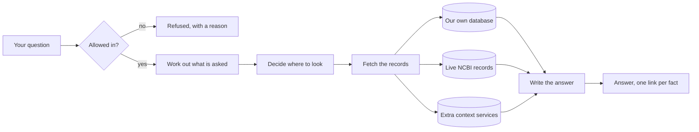

# Progress

A plain-language update on what this project is, what works today, and what comes next. No jargon. If you have never seen the code, start here.

Last updated: 2026-08-10.

## Table of contents

- [What we are building, in one paragraph](#what-we-are-building-in-one-paragraph)
- [What works today](#what-works-today)
- [What does not work yet](#what-does-not-work-yet)
- [The story so far, sprint by sprint](#the-story-so-far-sprint-by-sprint)
- [What is next](#what-is-next)
- [Problems we know about and are tracking](#problems-we-know-about-and-are-tracking)
- [How we work](#how-we-work)
- [Where to look for more detail](#where-to-look-for-more-detail)

## What we are building, in one paragraph

A search tool for biomedical researchers. You ask a question in ordinary English, like "which diseases are associated with the BRCA1 gene?", and it answers you in ordinary English, with a link next to every fact showing exactly which official record that fact came from. The links are the point. Anyone can build something that sounds confident; the hard part is being able to prove every sentence, and refusing to answer when you cannot.

It searches three kinds of source. A large database we built in advance and hold ourselves, which is fast. Live government APIs at the US National Center for Biotechnology Information, which are always current. And a set of extra enrichment services that add context. The system decides which of the three to use for each question.

Here is the whole thing as a picture. Every question takes this path, and the parts in the middle are what the sprints below have been building one at a time.

The two ends are the ones worth noticing. On the left, a question can be turned away before anything is spent on it. On the right, nothing reaches you without a link attached, and if there is no link to attach, you get told so instead of being told something invented.

## What works today

You can ask a question and get a real, cited answer back, streamed to a web page as it is written.

Concretely:

- You can sign in. Accounts, passwords, and sessions all work.
- You can type a question into a chat window and watch the answer appear word by word, with a stop button.
- The system asks a real question against our own biomedical database and gets real results.
- Every factual sentence in the answer carries a numbered link to the official record it came from.
- If the system cannot find support for something, it says so and points you somewhere else, instead of making something up.
- Questions that are off topic, that ask for medical advice, or that try to manipulate the system are turned away before they cost anything.
- The system can look up any gene name against the live NCBI databases, not just the one it knew about before. This was the single biggest gap, and it is now closed.
- A dangerous kind of automatic question, one that once crashed our own database and took it offline for everyone, is now stopped before it can ever reach the database at all.
- The system can now look up a genetic variant by its standard identifier (an "rs number", the way scientists refer to a specific spot in the genome) and get back its normalized coordinates, how clinically significant it is, and how common it is across different population groups.
- The system can now look up what a published research paper says about a gene, disease, or chemical, and separately look up what has been written in the scientific literature about a specific genetic variant.
- The system can now look up a bacterial sample (a "biosample", the way labs track which food-poisoning outbreak a sample came from) and get back its lab metadata, which antibiotics it resists, and which other samples belong to the same outbreak cluster and how closely related they are genetically.
- The system can now search for clinical trials by disease or condition and get back real trial identifiers, their recruitment status, and a bounded summary of who can enroll.

All six live-government-API connections the plan called for are now built. That is every planned data source.

- For the first time, a question about a gene can pull an answer from BOTH our own database and a live government record at once, in the same answer, each fact carrying its own separate link back to where it came from. This is the first time the system has ever combined two sources in one answer.
- Every citation, from any of the seven sources, now carries the same four pieces of trust information: what kind of evidence it is, how confident the source itself is in the claim, what population the data covers if relevant, and what usage rights apply to it. Previously only our own database's citations carried this.
- The system's highest-stakes example question, "which diseases are associated with BRCA1?", is now correctly flagged as needing extra scrutiny. Before this sprint, a quirk in how the answer was assembled meant this exact question, the one the whole trust system is built around, was being waved through as routine instead.
- If a live government record and our own database disagree about the same fact, the system now notices and says so, rather than silently picking one and hiding the disagreement.
- If a piece of information from our own database is old enough to be worth double-checking, the system is now built to automatically verify it against the live government record before repeating it as current. This machinery is real and tested, but our own database does not yet store the specific kind of detail it needs to check against, so it has nothing to actually fire on yet (see below).

## What does not work yet

The honest headline, found today by actually asking the finished system real questions and reading the answers by hand, not by reviewing code: the step that is supposed to understand what a question is actually asking has never been built past a placeholder. Right now, the system mostly just scans your question for something that looks like a gene name. If it finds a real one, it looks that up and stops there, even if your question asked for much more. If it finds something that LOOKS like a gene name but is not (a database name mentioned in passing, like "GTR" or "SRA"), it tries to look that up, fails, and gives up on the whole question, "I could not identify that gene," instead of noticing what the question was actually about. Asking the system's own seven showcase questions directly today, 4 came back this way, and a 5th came back with only one bare word as its whole answer, for the same underlying reason. This was a known, deliberate shortcut from the very first sprint that built the thinking loop, written down at the time with a plan to come back and build the real version later. Two weeks and twelve completed sprints have gone by since, and nobody has come back to it.

Separately, one of the six newer lookup tools, gene lookup, can now be used together with our own database to answer a question. The other five, genetic variants, research literature (two tools), disease outbreaks, and clinical trials, still cannot: they can each translate a name or identifier into real, verified data, but nothing yet connects them to the actual question-answering pipeline.

Also not built yet: saved history, the other ways to access the system besides the web page, and anything to do with hosting it somewhere other than a laptop.

## The story so far, sprint by sprint

Each of these is a completed, reviewed, merged piece of work.

| Sprint | In plain terms | Done |
|--------|----------------|------|
| 1.0 | The skeleton of the service, and the fixed format every answer travels in | 2026-07-27 |
| 1.1 | Sign-in, accounts, and the database that holds user information | 2026-07-28 |
| 2.0 | The five-step thinking loop the system follows for every question, and the machinery that picks which AI model does which step | 2026-07-28 |
| 1.2 | The web page: a chat window, answers appearing as they are written, and a stop button | 2026-07-28 |
| 2.1 | The first real connection to our biomedical database | 2026-08-01 |
| 2.2 | The rule that every sentence must be backed by a source, or the system refuses to answer | 2026-08-03 |
| 3.0 | The gatekeeper that decides which questions are allowed in at all | 2026-08-04 |
| 3.1 | The first live government API connection, and gene name lookup | 2026-08-05 |
| Database safety fix | Stopped a specific kind of automatic question that had previously crashed our own database | 2026-08-07 |
| 3.2 | The second live government API connection: genetic variant lookup by rs number | 2026-08-08 |
| 3.3 | The third and fourth live government API connections: published research literature lookup, and research-literature lookup for a specific genetic variant | 2026-08-08 |
| 3.5 | The fifth and sixth live government API connections: disease outbreak lookup and clinical trials search, completing every planned data source | 2026-08-08 |
| 3.4 | Extended the trust-and-citation rules to cover all six newer lookup tools, and connected gene lookup to the answer pipeline for real, the first tool to be wired all the way through | 2026-08-10 |
| Specification pause | Brought the written plans in line with everything learned building the six tools; cleared a backlog of small real bugs and mismatches; swept a folder of outside reading material; then, for the first time, actually asked the finished system real questions and read the answers by hand, which is what found today's headline problem | 2026-08-10 |

Seven of these are worth understanding, because they explain how this project works.

Sprint 2.1, the expensive lesson. We asked "which diseases are associated with BRCA1?" and got back twenty-five results. All twenty-five had real, working links to official records. Every automated test passed. And every single result was wrong: they were not diseases at all, they were similar genes in other animals. The tests could not see this, because they were checking that the plumbing worked rather than that the answer was true. Finding it took four rounds of review over four days. Everything we do now is shaped by that: before writing any new feature, we now write a test that asks whether the ANSWER is right, and we watch it fail first, so we know the test is capable of catching a lie.

Sprint 3.0, the gatekeeper, and why it has two halves. A gatekeeper that refuses everything is perfectly secure and completely useless. So the tests check both directions: that bad questions get turned away, and just as importantly that good questions get through. That second half caught a real problem. An early version refused the single most important question in the whole product, "which diseases are associated with BRCA1?", because our list of biomedical words contained "disease" and the question said "diseases". One letter. No security test would ever have found that.

Sprint 3.1, the check that paid for itself twice over. Gene name lookup shipped, got checked, and the check found two serious problems: the lookup was completely broken for every gene (a leftover from an unrelated fix), and a search-scoping fix was quietly returning the wrong results instead of the right ones. Both got fixed. Then, because the same team had just spent a whole day learning not to trust a fix that graded its own homework, we paid for one more check on the fix for those two problems. That last check found something worse than either original bug: for a handful of gene names, the government database was matching on a nickname instead of the real name and handing back a real gene that was simply the wrong one. Confidently, with a real-looking source link attached. That is the exact failure this whole project exists to prevent, and it was three checks deep before anyone caught it.

The database safety fix, the same lesson learned twice in one afternoon. A week and a half earlier, one automatically written question had a shape our database could not handle, and it crashed the whole database for everyone using it at the time. This sprint closed that gap: the system now recognises that dangerous shape and refuses to even try running it. But the first attempt at writing that fix had a bug of its own, an obscure one, and a reviewer caught it before it ever shipped. The fix was rewritten, and a second, completely separate reviewer checked the rewrite and confirmed it actually closed the gap. The team had already learned once, on sprint 3.1, that a fix should never be trusted just because the person who wrote it says it works. This sprint proved that lesson applies even to the fix for a problem the team already understood well: knowing exactly what is wrong is not the same as writing a correct fix on the first try.

Sprint 3.2, the variant lookup tool, and the fix that broke something new twice. Building this tool found two serious problems early: it silently cut off values that were too long instead of saying so (imagine a lab report where a long diagnosis just gets chopped off mid-word with no note that anything is missing), and if you typed in a plain number instead of a real variant identifier, the system would confidently return real information about a completely different, unrelated variant. Both got fixed. Then, exactly as happened on sprint 3.1, a separate check on the fix itself found the fix had its own problems: the "stop cutting things off" fix turned out to reject roughly one in ten real, clinically important variants outright, including some of the most well known ones in medicine, because the fix refused the whole answer rather than just leaving out the one piece that was too long. And a second fix, meant to correctly tell the system "this failure is temporary, try again" versus "this input is simply wrong, do not retry," was doing the opposite of what it claimed for one common kind of failure. Both were fixed a second time and checked a third time before anyone trusted them. The lesson, now proven on two sprints in a row: a fix for a bug deserves MORE scrutiny than new code, not less, because the fix is the newest, least-tested thing in the whole system.

Sprint 3.3, the literature lookup tools, and the confidently wrong answer that both tools gave at once. Both new tools ask a government search service for a match and hand back whatever comes back as a real result. Late in review, someone tried typing in a bare number, "334", instead of a real identifier. Both tools cheerfully returned real, official-looking, fully cited answers about five completely unrelated things. Separately, typing in an ordinary word like "the" returned ten confidently matched, real medical terms that had nothing to do with the word "the". Nothing was broken about the individual records returned. Both were real entries from the government's own database. The problem was that the government service itself already flags a weak, "closest guess" style match differently from an exact one, and our tools were throwing that flag away before anyone downstream ever saw it. It is now kept and passed along. This is the single most important find of this sprint, because it is exactly the failure this whole project exists to prevent: not a crash, not an error message, a fully cited, entirely wrong answer delivered with total confidence. It was also found by deliberately typing hostile and strange things into the finished tools, not by any planned test, which is why that kind of adversarial poking is now a standing step for every tool going forward, not an occasional extra.

Sprint 3.5, the last two data tools, and the fix that broke the thing it just fixed, twice. This sprint's outbreak-cluster lookup reads a government file that turned out to be about 400 times bigger than a normal file its own size class: roughly 411 gigabytes, for one bacterial species. The tool has to read that file a little at a time and give up gracefully if it runs out of time, rather than trying to load the whole thing. The first version had a real, serious bug: it stopped reading after finding just the FIRST matching entry, then confidently reported that as the complete answer, when a real outbreak cluster of four related samples was quietly reported as having only two. That got caught and fixed, checked, and passed a full re-test. Then a second, deliberately hostile round of testing found something worse: the FIX ITSELF had broken the tool a different way. In closing the "stops too early and lies" bug, the fix removed the only thing that let the tool stop at all, so now it could never successfully finish AT ALL, not even on the exact same real outbreak cluster it had gotten wrong before. It failed silently, reporting "nothing found" instead of a wrong answer, which is safer but still wrong. That got fixed too, and a live re-check on that same real outbreak cluster still came back empty. It took a THIRD look to find the actual remaining problem: the fix that made the tool patient enough to find every real match had also made it so patient it ran out of time before ever getting to the last, quick step that turns the matches into a proper labeled result. A dedicated slice of time was reserved for that last step no matter how long the earlier steps take, and only then did a live check on the real outbreak cluster come back with the exact right answer: four related samples, with the exact genetic distances a human reviewer had worked out by hand as the ground truth to check against. Three real bugs, each one only found by actually running the finished tool against the real government service and checking the ANSWER, not by trusting that the tests still said "green".

Sprint 3.4, the trust system's own final exam, and the two-gene question that gave a confidently incomplete answer. This was the sprint that connected everything: extending the trust-and-citation rules to all six lookup tools, teaching the system to notice when two sources disagree, and, for the first time, actually letting gene lookup contribute to a real answer alongside our own database. Building and checking it in the ordinary way went well: two rounds of review, a handful of real bugs found and fixed, all closed cleanly. Then a deliberately hostile round of testing tried something nobody had tried before: asking about two different genes in a single question. Two times out of three, the system answered fluently, cited its one source correctly, and never mentioned the second gene at all, reporting itself as a complete, trustworthy answer the whole time. Nothing was technically wrong with the sentence it wrote. It simply never tried to cover the rest of the question, and said nothing about that. This is exactly the failure this whole project exists to prevent: not a crash, not a wrong fact, a confident answer that quietly does less than it claims. It is fixed now: the system checks whether every named subject in a multi-part question actually got an answer, and if not, it downgrades its own confidence and says plainly which part it could not cover. Fixing that turned up a second problem in the same area: the check meant to catch our own database and a live government record disagreeing about the same gene had never actually been able to compare them in practice, because the two sources describe a gene's identity slightly differently (a full name versus a short symbol) and the check required an exact match. It now understands that the two are the same kind of fact. A few smaller, lower-priority gaps were found and deliberately left for later, each with a written reason why leaving it was the right call for now, not an oversight.

## What is next

Where the finished work sits against what is still ahead:

```mermaid
flowchart LR
    subgraph Built["Built, reviewed, merged"]
        direction LR
        A[Service skeleton] --> B[Sign in]
        B --> C[The thinking loop]
        C --> D[The web page]
        D --> E[Our database, connected]
        E --> F[Every fact cited]
        F --> G[The gatekeeper]
        G --> H[Gene name lookup]
        H --> I[Database safety fix]
        I --> Iv[Variant lookup]
        Iv --> Lit[Literature lookup, two tools]
        Lit --> Out[Outbreak + trials lookup]
        Out --> Tr[Trust rules cover all tools, gene lookup wired in]
        Tr --> Sp[Specification pause, found the question-understanding gap]
    end
    Sp --> Dec[Question-understanding gap: given a home, a later sprint, not fixed yet]
    Dec --> Wire[Wire the other five tools into the answer pipeline]
    Wire --> L[Everything else]
```

Every planned data lookup tool, all six live-API connections, is now built AND independently checked, and the trust-and-citation rules now cover all of them. Each tool went through the same pattern: build it, find real problems in review, fix them, and find MORE problems in the fix itself before trusting it. Sprint 3.4 held that pattern too, and pushed it one step further: its hostile testing round found a real problem (the two-gene question, see the story above) that no planned test had ever thought to try, only deliberate, adversarial poking at the finished system.

The planned specification pause (updating the written plans with everything learned from building all six tools and the trust system) ran and finished today. It also swept a folder of outside reading material collected during the build, and it is the pause that found today's headline problem, the question-understanding gap above, by actually asking the system real questions for the first time rather than only reviewing code.

In order, now:

1. The question-understanding gap now has a home: a specific future sprint, later than the next several, will build the real fix. It is not being rushed in early, and nothing in the next few sprints depends on it being fixed first.
2. Wiring the other five lookup tools (genetic variants, both literature tools, disease outbreaks, clinical trials) into the answer pipeline the same way gene lookup was wired in an earlier sprint.
3. Then the remaining work: the other ways to access the system, saved history and personalisation, measurement and quality scoring, and finally hardening it for real use.

## Problems we know about and are tracking

Nothing here is hidden or forgotten. Each one is written down with a decision about when it gets fixed.

| Problem, in plain terms | When it gets fixed |
|-------------------------|--------------------|
| The step that is supposed to understand what a question is actually asking has never been built past a placeholder (see "What does not work yet" above). The single biggest known problem right now | Given a home: a specific future sprint, later than the next several. It will not be rushed in early, and nothing else waits on it |
| One of the two small leftover gaps in the gene lookup tool (a missing length limit on one nested list) turned out to be real and already reachable by a real question, once this sprint's specification pause looked again; it is fixed. The other (an unusual input shape inside a different lookup path) is still not reachable by anything today, so it was left alone | Fixed |
| Five of the six lookup tools (genetic variants, both research-literature tools, disease outbreaks, and clinical trials) are still not connected to the answer pipeline. Each can look up real data but cannot yet use that lookup to answer a question. Gene lookup is the one exception, connected in an earlier sprint | A later sprint |
| If two live sources describe the same fact in genuinely different words for the same fact, not just a different name for the same gene, the system has one narrow safety check for the one specific case found so far (a real value versus a wildly wrong one for the same field) but has not been tested against every way two sources might phrase the same fact differently | Whenever a future check finds a new case |
| The system is now built to automatically double-check an old, possibly-outdated fact from our own database against the live government record before repeating it as current, but our own database does not yet store the specific kind of detail (how old a particular fact is, field by field) this check needs to know when to fire, so in practice it never runs yet. This is a gap in the earlier database-building work, not in this system, confirmed still true by this sprint's specification pause | Whenever the earlier database-building work stores that detail |
| One narrow path in the gatekeeper, if it ever hit a specific rare internal error, showed a generic "something went wrong" message instead of the real reason. Found by accident in an earlier sprint | Fixed |
| The two new literature lookup tools disagree with each other about whether to tell you when they had to hide part of an answer for being too long. One says so, the other stays quiet. Neither is wrong exactly, they were built by different people making a reasonable call about the same open question, but having two different answers to the same question in one product needs a single decision | Whenever the product owner decides |
| One of the two literature lookup tools used to give you a name-lookup result with no link back to where the confirmation came from. Now it links every result its sibling mode already did | Fixed |
| The variant-literature tool's link for a specific variant used to point only to a general search page. Now every individual match gets its own real record-page link when one exists, and every related paper in a list gets its own link too, not just the tool's one overall link | Fixed |
| A handful of smaller, lower-priority gaps from an earlier sprint: two places where a very long list gets quietly shortened with no note that anything was cut (not yet seen in real use); one narrow input shape that could still slip past a should-refuse-if-empty check (not yet seen in real use); and one inconsistency in how the two literature tools handle a single bad entry inside an otherwise-good batch request | Whenever the product owner decides, or whenever real use actually produces one of these shapes |
| A separate, smaller flake: about one time in ten, an automatically written question comes out slightly malformed in a way our database rejects outright, with no second attempt. Not dangerous, just occasionally a wasted question | Whenever we next have a working connection to measure it properly |
| Two open questions about how the gene lookup tool should handle ambiguous input: should a handful of medical abbreviations that are also real gene names stay blocked, and what should happen when someone types a gene name in lowercase. Neither is a bug, both are genuine judgment calls with real tradeoffs either way | Whenever the product owner decides |
| Similarly, if you type in a plain number that happens to belong to something else (say, a gene's own catalog number) formatted to look like a variant identifier, the variant tool will honestly report which identifier it actually looked up, but that identifier is still the wrong one for what you meant | Whenever the product owner decides it needs closing |
| One government lookup the variant tool relies on has been broken on the government's own side since before we started building against it, for every input we have tried. We found a working substitute, but have not yet proven the substitute behaves identically for every case | Whenever someone verifies it live |
| The written specification set a length limit on one clinical field that is too short for real medical terms. The tool already says plainly "some information was left out because it was too long to fit" rather than silently cutting terms off. Raising the limit itself is still an open product decision | Whenever the product owner decides |
| The clinical trials search tool understands its search box as a small command language, not plain text, so a real medical term containing the word "NOT" (a standard way doctors write "not otherwise specified") could silently search for the exact OPPOSITE of what was typed. The tool now tells the system asking the question about this risk directly, rather than staying silent about it; the underlying command-language behavior itself is unchanged | Escaping the risk away entirely is a future decision, if the current disclosure turns out not to be enough |
| The clinical trials search tool has the same weak-match problem the literature tools had in an earlier sprint: a bare number or a common word like "the" can return confident, real-looking, but essentially meaningless results. The tool now asks for its best matches first, which helps, but unlike the literature tools it still has no way to tell you a match was weak, since the government service behind it does not offer that signal the same way | Whenever that government service starts offering a usable signal |
| The clinical trials search tool used to reject a status word (like "withdrawn" or "suspended") that the same government service could hand back as a real answer, because our own written specification listed fewer status words than the service actually uses. Checked directly against the government service and widened to match all of them | Fixed |
| Three smaller gaps in the gatekeeper, where a backup layer currently covers for them | The hardening sprint near the end |
| Three places where the written specification and the working code used to disagree, including one written plan that described a piece of work as still needed when it had actually already been finished in an earlier sprint | Fixed |
| One test is switched off because checking it needs a connection to our server that we cannot open from the current setup | Whenever that connection is available, about ten minutes of work |
| A full security review of the whole codebase has never been run. It is paused on cost | Before this is ever shown to anyone outside the team, or put on the internet |

That last row is the important one. None of these can affect a real person while the project runs only on a laptop with no outside users. The moment that changes, several of them stop being optional.

## How we work

Every sprint follows the same loop, and it is deliberately slower than just writing the code.

1. Write down what "finished" means, as a test that checks whether the ANSWER is right rather than whether the code ran.
2. Watch that test fail, to prove it is capable of failing.
3. Build the thing.
4. Hand it to a separate reviewer that did not write it, whose job is to decide if it is correct.
5. Hand it to a second reviewer whose job is to actively try to break it.
6. Fix what they find, and re-run everything.
7. Only then, a human reviews and approves it.

The reason for steps 4 and 5 is that the person who wrote something is the worst person to check it. On sprint 3.0, everything passed the checklist, and the reviewer still failed it, because it turned out you could ask "what is the capital of the USA?" and get let straight through. On the same sprint, the second reviewer found that a doctor asking "should this patient be started on tamoxifen?" also got through, which is exactly the kind of question this system must never answer.

Both of those were found after every test was green. That is why both steps exist.

## Where to look for more detail

| If you want | Read |
|-------------|------|
| The current state of every sprint, as a visual board | `tracker/board.html`, open it in a browser |
| What went wrong and what fixed it, written at the time | `LEARNINGS.md` |
| Every decision we made and why, including the ones we rejected | `DECISIONS.md` |
| The technical picture | `README.md` |
| The full plan | `requirements/Plan.md` |
