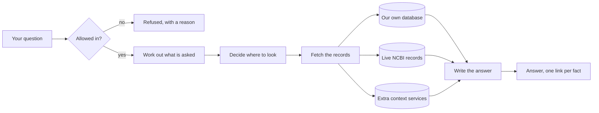
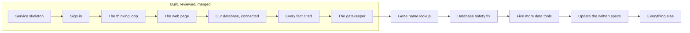

# Progress

A plain-language update on what this project is, what works today, and what comes next. No jargon. If you have never seen the code, start here.

Last updated: 2026-08-04.

## Table of contents

- [What we are building, in one paragraph](#what-we-are-building-in-one-paragraph)
- [What works today](#what-works-today)
- [What does not work yet](#what-does-not-work-yet)
- [The story so far, sprint by sprint](#the-story-so-far-sprint-by-sprint)
- [What is next](#what-is-next)
- [Problems we know about and are tracking](#problems-we-know-about-and-are-tracking)
- [How we work](#how-we-work)
- [Where to look for more detail](#where-to-look-for-more-detail)

## What we are building, in one paragraph

A search tool for biomedical researchers. You ask a question in ordinary English, like "which diseases are associated with the BRCA1 gene?", and it answers you in ordinary English, with a link next to every fact showing exactly which official record that fact came from. The links are the point. Anyone can build something that sounds confident; the hard part is being able to prove every sentence, and refusing to answer when you cannot.

It searches three kinds of source. A large database we built in advance and hold ourselves, which is fast. Live government APIs at the US National Center for Biotechnology Information, which are always current. And a set of extra enrichment services that add context. The system decides which of the three to use for each question.

Here is the whole thing as a picture. Every question takes this path, and the parts in the middle are what the sprints below have been building one at a time.

The two ends are the ones worth noticing. On the left, a question can be turned away before anything is spent on it. On the right, nothing reaches you without a link attached, and if there is no link to attach, you get told so instead of being told something invented.

## What works today

You can ask a question and get a real, cited answer back, streamed to a web page as it is written.

Concretely:

- You can sign in. Accounts, passwords, and sessions all work.
- You can type a question into a chat window and watch the answer appear word by word, with a stop button.
- The system asks a real question against our own biomedical database and gets real results.
- Every factual sentence in the answer carries a numbered link to the official record it came from.
- If the system cannot find support for something, it says so and points you somewhere else, instead of making something up.
- Questions that are off topic, that ask for medical advice, or that try to manipulate the system are turned away before they cost anything.

## What does not work yet

The honest headline: it currently only knows about one gene by name.

If you ask about BRCA1, it works. If you ask about TP53, or almost any other gene, it comes back with nothing. This is not a subtle bug. There is a lookup table in the code with exactly one entry in it, because the piece that translates a gene name into an official identifier has not been built yet.

That single gap is the main thing standing between this project and something you could show to a colleague. It is the next piece of work.

Also not built yet: the connections to the live government APIs (so anything not already in our own database cannot be answered), the other five data tools, saved history, and anything to do with hosting it somewhere other than a laptop.

## The story so far, sprint by sprint

Each of these is a completed, reviewed, merged piece of work.

| Sprint | In plain terms | Done |
|--------|----------------|------|
| 1.0 | The skeleton of the service, and the fixed format every answer travels in | 2026-07-27 |
| 1.1 | Sign-in, accounts, and the database that holds user information | 2026-07-28 |
| 2.0 | The five-step thinking loop the system follows for every question, and the machinery that picks which AI model does which step | 2026-07-28 |
| 1.2 | The web page: a chat window, answers appearing as they are written, and a stop button | 2026-07-28 |
| 2.1 | The first real connection to our biomedical database | 2026-08-01 |
| 2.2 | The rule that every sentence must be backed by a source, or the system refuses to answer | 2026-08-03 |
| 3.0 | The gatekeeper that decides which questions are allowed in at all | 2026-08-04 |

Two of these are worth understanding, because they explain how this project works.

Sprint 2.1, the expensive lesson. We asked "which diseases are associated with BRCA1?" and got back twenty-five results. All twenty-five had real, working links to official records. Every automated test passed. And every single result was wrong: they were not diseases at all, they were similar genes in other animals. The tests could not see this, because they were checking that the plumbing worked rather than that the answer was true. Finding it took four rounds of review over four days. Everything we do now is shaped by that: before writing any new feature, we now write a test that asks whether the ANSWER is right, and we watch it fail first, so we know the test is capable of catching a lie.

Sprint 3.0, the gatekeeper, and why it has two halves. A gatekeeper that refuses everything is perfectly secure and completely useless. So the tests check both directions: that bad questions get turned away, and just as importantly that good questions get through. That second half caught a real problem. An early version refused the single most important question in the whole product, "which diseases are associated with BRCA1?", because our list of biomedical words contained "disease" and the question said "diseases". One letter. No security test would ever have found that.

## What is next

Where the finished work sits against what is still ahead:

The single box that matters right now is "gene name lookup". Everything to its left is done. Nothing to its right can be shown to anyone until it is finished, because until then the system only recognises one gene by name.

In order:

1. Sprint 3.1, the gene name lookup. This is the one that fixes the "only knows BRCA1" problem, by connecting to the live government APIs that can translate any gene name into an official identifier. Started, not finished. This is what unblocks showing the project to someone.
2. A small fix straight after it, for a problem where a badly formed automatic query once overloaded our database server.
3. Sprints 3.2 to 3.5, the five remaining data tools: genetic variants, published literature enrichment, disease outbreak data, and clinical trials.
4. A planned pause to update the written specifications with everything we have learned from actually building it.
5. Then the remaining work: the other ways to access the system, saved history and personalisation, measurement and quality scoring, and finally hardening it for real use.

## Problems we know about and are tracking

Nothing here is hidden or forgotten. Each one is written down with a decision about when it gets fixed.

| Problem, in plain terms | When it gets fixed |
|-------------------------|--------------------|
| A badly formed automatic query once overloaded the database server. We have limited the damage it can do, but not stopped it being written in the first place | Immediately after sprint 3.1 |
| Three smaller gaps in the gatekeeper, where a backup layer currently covers for them | The hardening sprint near the end |
| Two places where the written specification and the working code disagree and need reconciling | The planned specification pause |
| One test is switched off because checking it needs a connection to our server that we cannot open from the current setup | Whenever that connection is available, about ten minutes of work |
| A full security review of the whole codebase has never been run. It is paused on cost | Before this is ever shown to anyone outside the team, or put on the internet |

That last row is the important one. None of these can affect a real person while the project runs only on a laptop with no outside users. The moment that changes, several of them stop being optional.

## How we work

Every sprint follows the same loop, and it is deliberately slower than just writing the code.

1. Write down what "finished" means, as a test that checks whether the ANSWER is right rather than whether the code ran.
2. Watch that test fail, to prove it is capable of failing.
3. Build the thing.
4. Hand it to a separate reviewer that did not write it, whose job is to decide if it is correct.
5. Hand it to a second reviewer whose job is to actively try to break it.
6. Fix what they find, and re-run everything.
7. Only then, a human reviews and approves it.

The reason for steps 4 and 5 is that the person who wrote something is the worst person to check it. On sprint 3.0, everything passed the checklist, and the reviewer still failed it, because it turned out you could ask "what is the capital of the USA?" and get let straight through. On the same sprint, the second reviewer found that a doctor asking "should this patient be started on tamoxifen?" also got through, which is exactly the kind of question this system must never answer.

Both of those were found after every test was green. That is why both steps exist.

## Where to look for more detail

| If you want | Read |
|-------------|------|
| The current state of every sprint, as a visual board | `tracker/board.html`, open it in a browser |
| What went wrong and what fixed it, written at the time | `LEARNINGS.md` |
| Every decision we made and why, including the ones we rejected | `DECISIONS.md` |
| The technical picture | `README.md` |
| The full plan | `requirements/Plan.md` |
