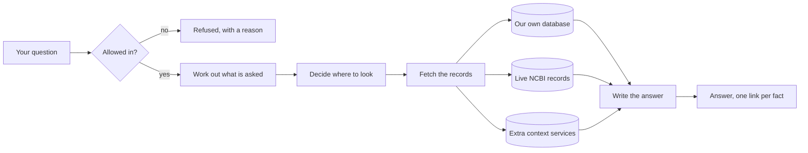

# Progress

A plain-language update on what this project is, what works today, and what comes next. No jargon. If you have never seen the code, start here.

Last updated: 2026-08-08.

## Table of contents

- [What we are building, in one paragraph](#what-we-are-building-in-one-paragraph)
- [What works today](#what-works-today)
- [What does not work yet](#what-does-not-work-yet)
- [The story so far, sprint by sprint](#the-story-so-far-sprint-by-sprint)
- [What is next](#what-is-next)
- [Problems we know about and are tracking](#problems-we-know-about-and-are-tracking)
- [How we work](#how-we-work)
- [Where to look for more detail](#where-to-look-for-more-detail)

## What we are building, in one paragraph

A search tool for biomedical researchers. You ask a question in ordinary English, like "which diseases are associated with the BRCA1 gene?", and it answers you in ordinary English, with a link next to every fact showing exactly which official record that fact came from. The links are the point. Anyone can build something that sounds confident; the hard part is being able to prove every sentence, and refusing to answer when you cannot.

It searches three kinds of source. A large database we built in advance and hold ourselves, which is fast. Live government APIs at the US National Center for Biotechnology Information, which are always current. And a set of extra enrichment services that add context. The system decides which of the three to use for each question.

Here is the whole thing as a picture. Every question takes this path, and the parts in the middle are what the sprints below have been building one at a time.

The two ends are the ones worth noticing. On the left, a question can be turned away before anything is spent on it. On the right, nothing reaches you without a link attached, and if there is no link to attach, you get told so instead of being told something invented.

## What works today

You can ask a question and get a real, cited answer back, streamed to a web page as it is written.

Concretely:

- You can sign in. Accounts, passwords, and sessions all work.
- You can type a question into a chat window and watch the answer appear word by word, with a stop button.
- The system asks a real question against our own biomedical database and gets real results.
- Every factual sentence in the answer carries a numbered link to the official record it came from.
- If the system cannot find support for something, it says so and points you somewhere else, instead of making something up.
- Questions that are off topic, that ask for medical advice, or that try to manipulate the system are turned away before they cost anything.
- The system can look up any gene name against the live NCBI databases, not just the one it knew about before. This was the single biggest gap, and it is now closed.
- A dangerous kind of automatic question, one that once crashed our own database and took it offline for everyone, is now stopped before it can ever reach the database at all.
- The system can now look up a genetic variant by its standard identifier (an "rs number", the way scientists refer to a specific spot in the genome) and get back its normalized coordinates, how clinically significant it is, and how common it is across different population groups.
- The system can now look up what a published research paper says about a gene, disease, or chemical, and separately look up what has been written in the scientific literature about a specific genetic variant.

## What does not work yet

The honest headline: the system can now look up genes, genetic variants, research literature, and named entities, but it cannot yet use any of those lookups to answer a question.

All four lookup tools built so far can translate a name or an identifier into real, verified data by asking the live government APIs. But the step that connects any of them to the actual question-answering pipeline is not yet wired in. Every tool is built and independently checked, and the last piece that connects them to the answer path is carried to a later sprint.

Also not built yet: the connections to the two remaining live government APIs (disease outbreak data and clinical trials, so those two topics still cannot be answered), saved history, and anything to do with hosting it somewhere other than a laptop.

## The story so far, sprint by sprint

Each of these is a completed, reviewed, merged piece of work.

| Sprint | In plain terms | Done |
|--------|----------------|------|
| 1.0 | The skeleton of the service, and the fixed format every answer travels in | 2026-07-27 |
| 1.1 | Sign-in, accounts, and the database that holds user information | 2026-07-28 |
| 2.0 | The five-step thinking loop the system follows for every question, and the machinery that picks which AI model does which step | 2026-07-28 |
| 1.2 | The web page: a chat window, answers appearing as they are written, and a stop button | 2026-07-28 |
| 2.1 | The first real connection to our biomedical database | 2026-08-01 |
| 2.2 | The rule that every sentence must be backed by a source, or the system refuses to answer | 2026-08-03 |
| 3.0 | The gatekeeper that decides which questions are allowed in at all | 2026-08-04 |
| 3.1 | The first live government API connection, and gene name lookup | 2026-08-05 |
| Database safety fix | Stopped a specific kind of automatic question that had previously crashed our own database | 2026-08-07 |
| 3.2 | The second live government API connection: genetic variant lookup by rs number | 2026-08-08 |
| 3.3 | The third and fourth live government API connections: published research literature lookup, and research-literature lookup for a specific genetic variant | 2026-08-08 |

Five of these are worth understanding, because they explain how this project works.

Sprint 2.1, the expensive lesson. We asked "which diseases are associated with BRCA1?" and got back twenty-five results. All twenty-five had real, working links to official records. Every automated test passed. And every single result was wrong: they were not diseases at all, they were similar genes in other animals. The tests could not see this, because they were checking that the plumbing worked rather than that the answer was true. Finding it took four rounds of review over four days. Everything we do now is shaped by that: before writing any new feature, we now write a test that asks whether the ANSWER is right, and we watch it fail first, so we know the test is capable of catching a lie.

Sprint 3.0, the gatekeeper, and why it has two halves. A gatekeeper that refuses everything is perfectly secure and completely useless. So the tests check both directions: that bad questions get turned away, and just as importantly that good questions get through. That second half caught a real problem. An early version refused the single most important question in the whole product, "which diseases are associated with BRCA1?", because our list of biomedical words contained "disease" and the question said "diseases". One letter. No security test would ever have found that.

Sprint 3.1, the check that paid for itself twice over. Gene name lookup shipped, got checked, and the check found two serious problems: the lookup was completely broken for every gene (a leftover from an unrelated fix), and a search-scoping fix was quietly returning the wrong results instead of the right ones. Both got fixed. Then, because the same team had just spent a whole day learning not to trust a fix that graded its own homework, we paid for one more check on the fix for those two problems. That last check found something worse than either original bug: for a handful of gene names, the government database was matching on a nickname instead of the real name and handing back a real gene that was simply the wrong one. Confidently, with a real-looking source link attached. That is the exact failure this whole project exists to prevent, and it was three checks deep before anyone caught it.

The database safety fix, the same lesson learned twice in one afternoon. A week and a half earlier, one automatically written question had a shape our database could not handle, and it crashed the whole database for everyone using it at the time. This sprint closed that gap: the system now recognises that dangerous shape and refuses to even try running it. But the first attempt at writing that fix had a bug of its own, an obscure one, and a reviewer caught it before it ever shipped. The fix was rewritten, and a second, completely separate reviewer checked the rewrite and confirmed it actually closed the gap. The team had already learned once, on sprint 3.1, that a fix should never be trusted just because the person who wrote it says it works. This sprint proved that lesson applies even to the fix for a problem the team already understood well: knowing exactly what is wrong is not the same as writing a correct fix on the first try.

Sprint 3.2, the variant lookup tool, and the fix that broke something new twice. Building this tool found two serious problems early: it silently cut off values that were too long instead of saying so (imagine a lab report where a long diagnosis just gets chopped off mid-word with no note that anything is missing), and if you typed in a plain number instead of a real variant identifier, the system would confidently return real information about a completely different, unrelated variant. Both got fixed. Then, exactly as happened on sprint 3.1, a separate check on the fix itself found the fix had its own problems: the "stop cutting things off" fix turned out to reject roughly one in ten real, clinically important variants outright, including some of the most well known ones in medicine, because the fix refused the whole answer rather than just leaving out the one piece that was too long. And a second fix, meant to correctly tell the system "this failure is temporary, try again" versus "this input is simply wrong, do not retry," was doing the opposite of what it claimed for one common kind of failure. Both were fixed a second time and checked a third time before anyone trusted them. The lesson, now proven on two sprints in a row: a fix for a bug deserves MORE scrutiny than new code, not less, because the fix is the newest, least-tested thing in the whole system.

Sprint 3.3, the literature lookup tools, and the confidently wrong answer that both tools gave at once. Both new tools ask a government search service for a match and hand back whatever comes back as a real result. Late in review, someone tried typing in a bare number, "334", instead of a real identifier. Both tools cheerfully returned real, official-looking, fully cited answers about five completely unrelated things. Separately, typing in an ordinary word like "the" returned ten confidently matched, real medical terms that had nothing to do with the word "the". Nothing was broken about the individual records returned. Both were real entries from the government's own database. The problem was that the government service itself already flags a weak, "closest guess" style match differently from an exact one, and our tools were throwing that flag away before anyone downstream ever saw it. It is now kept and passed along. This is the single most important find of this sprint, because it is exactly the failure this whole project exists to prevent: not a crash, not an error message, a fully cited, entirely wrong answer delivered with total confidence. It was also found by deliberately typing hostile and strange things into the finished tools, not by any planned test, which is why that kind of adversarial poking is now a standing step for every tool going forward, not an occasional extra.

## What is next

Where the finished work sits against what is still ahead:

```mermaid
flowchart LR
    subgraph Built["Built, reviewed, merged"]
        direction LR
        A[Service skeleton] --> B[Sign in]
        B --> C[The thinking loop]
        C --> D[The web page]
        D --> E[Our database, connected]
        E --> F[Every fact cited]
        F --> G[The gatekeeper]
        G --> H[Gene name lookup]
        H --> I[Database safety fix]
        I --> Iv[Variant lookup]
        Iv --> Lit[Literature lookup, two tools]
    end
    Lit --> J[Two more data tools]
    J --> K[Update the written specs]
    K --> L[Everything else]
```

Gene name lookup, variant lookup, and now both literature lookup tools are all built AND independently checked. Four data tools out of the six live-API connections planned are done; two remain. Each one has gone through the same pattern: build it, find real problems in review, fix them, and find MORE problems in the fix itself before trusting it. That pattern held again on sprint 3.3 (see the story above), the third sprint in a row it has held, which is the strongest evidence yet that the review process is catching real things and not just adding ceremony.

In order:

1. Sprint 3.5, the two remaining data tools: disease outbreak data and clinical trials. (Sprint 3.4 comes after 3.5 despite the number, since it needs all five other data-tool sprints finished first.)
2. A planned pause to update the written specifications with everything we have learned from actually building it.
3. Then the remaining work: wiring the live API tools into the answer pipeline, the other ways to access the system, saved history and personalisation, measurement and quality scoring, and finally hardening it for real use.

## Problems we know about and are tracking

Nothing here is hidden or forgotten. Each one is written down with a decision about when it gets fixed.

| Problem, in plain terms | When it gets fixed |
|-------------------------|--------------------|
| Two small leftover gaps in the gene lookup tool, both in code the answer pipeline cannot reach yet because the pipeline doesn't use this tool yet either. Neither is a correctness risk today; both need a look before the pipeline connects to this tool | Before the answer pipeline is wired to this tool |
| None of the four lookup tools built so far (gene names, genetic variants, and now research literature two ways) is connected to the answer pipeline yet. All four can look up real data but cannot yet use those lookups to answer a question | A later sprint in the 3.x group |
| The two new literature lookup tools disagree with each other about whether to tell you when they had to hide part of an answer for being too long. One says so, the other stays quiet. Neither is wrong exactly, they were built by different people making a reasonable call about the same open question, but having two different answers to the same question in one product needs a single decision | Whenever the product owner decides |
| One of the two literature lookup tools gives you a name-lookup result (say, confirming a term really is a recognized gene) with no link back to where that confirmation came from, even though the underlying record does have a real, findable page. Its sibling mode links every result; this one does not | The planned specification pause |
| The variant-literature tool's link for a specific variant points to a general search page rather than a page about that exact variant, and when it returns a list of up to 590 related papers, none of the individual papers gets its own link (its sibling tool does give every paper its own link) | The planned specification pause |
| A handful of smaller, lower-priority gaps from this same sprint: two places where a very long list gets quietly shortened with no note that anything was cut (not yet seen in real use); one narrow input shape that could still slip past a should-refuse-if-empty check (not yet seen in real use); and one inconsistency in how the two literature tools handle a single bad entry inside an otherwise-good batch request | Whenever the product owner decides, or whenever real use actually produces one of these shapes |
| A separate, smaller flake: about one time in ten, an automatically written question comes out slightly malformed in a way our database rejects outright, with no second attempt. Not dangerous, just occasionally a wasted question | Whenever we next have a working connection to measure it properly, or the specification pause |
| Two open questions about how the gene lookup tool should handle ambiguous input: should a handful of medical abbreviations that are also real gene names stay blocked, and what should happen when someone types a gene name in lowercase. Neither is a bug, both are genuine judgment calls with real tradeoffs either way | Whenever the product owner decides |
| Similarly, if you type in a plain number that happens to belong to something else (say, a gene's own catalog number) formatted to look like a variant identifier, the variant tool will honestly report which identifier it actually looked up, but that identifier is still the wrong one for what you meant | Whenever the product owner decides it needs closing |
| One government lookup the variant tool relies on has been broken on the government's own side since before we started building against it, for every input we have tried. We found a working substitute, but have not yet proven the substitute behaves identically for every case | The planned specification pause |
| The written specification sets a length limit on one clinical field that is too short for real medical terms. Rather than silently cut those terms off or quietly ignore the limit, the tool now says plainly "some information was left out because it was too long to fit" whenever this happens, about one time in ten for that particular field. Raising the limit itself needs a product decision, since it means changing a written specification | The planned specification pause, or an earlier product-owner decision |
| Three smaller gaps in the gatekeeper, where a backup layer currently covers for them | The hardening sprint near the end |
| Three places where the written specification and the working code disagree and need reconciling, including one written plan that described a piece of work as still needed when it had actually already been finished in an earlier sprint | The planned specification pause |
| One test is switched off because checking it needs a connection to our server that we cannot open from the current setup | Whenever that connection is available, about ten minutes of work |
| A full security review of the whole codebase has never been run. It is paused on cost | Before this is ever shown to anyone outside the team, or put on the internet |

That last row is the important one. None of these can affect a real person while the project runs only on a laptop with no outside users. The moment that changes, several of them stop being optional.

## How we work

Every sprint follows the same loop, and it is deliberately slower than just writing the code.

1. Write down what "finished" means, as a test that checks whether the ANSWER is right rather than whether the code ran.
2. Watch that test fail, to prove it is capable of failing.
3. Build the thing.
4. Hand it to a separate reviewer that did not write it, whose job is to decide if it is correct.
5. Hand it to a second reviewer whose job is to actively try to break it.
6. Fix what they find, and re-run everything.
7. Only then, a human reviews and approves it.

The reason for steps 4 and 5 is that the person who wrote something is the worst person to check it. On sprint 3.0, everything passed the checklist, and the reviewer still failed it, because it turned out you could ask "what is the capital of the USA?" and get let straight through. On the same sprint, the second reviewer found that a doctor asking "should this patient be started on tamoxifen?" also got through, which is exactly the kind of question this system must never answer.

Both of those were found after every test was green. That is why both steps exist.

## Where to look for more detail

| If you want | Read |
|-------------|------|
| The current state of every sprint, as a visual board | `tracker/board.html`, open it in a browser |
| What went wrong and what fixed it, written at the time | `LEARNINGS.md` |
| Every decision we made and why, including the ones we rejected | `DECISIONS.md` |
| The technical picture | `README.md` |
| The full plan | `requirements/Plan.md` |
