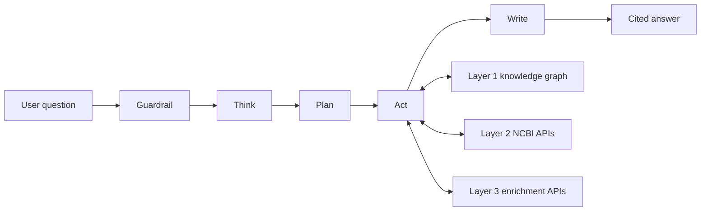

# Agentic search UI

Agentic search agent for querying NCBI biomedical data across a 115M-node knowledge graph and 30+ live APIs.

Takes natural language questions about genes, diseases, variants, publications, and taxonomy. Returns cited answers with links back to NCBI source records. Built with FastAPI, LangGraph, and React.

For a plain-language, no-jargon project update, see [PROGRESS.md](PROGRESS.md).

## Table of contents

- [Live demo](#live-demo)
- [Architecture](#architecture)
- [Tech stack](#tech-stack)
- [Status](#status)
- [Quick start](#quick-start)
- [Running the checks locally](#running-the-checks-locally)
- [Directory structure](#directory-structure)
- [Planning documents](#planning-documents)
- [Documentation](#documentation)
- [Cost model](#cost-model)
- [Connection to System 1 and System 2](#connection-to-system-1-and-system-2)
- [License](#license)

## Live demo

There are TWO deployments as of build phase 4.15. Use the production links unless you specifically want to see unreleased work.

| Deployment | Web UI | API | Deploys from |
|---|---|---|---|
| Production | https://search-agent-web-production.up.railway.app | https://search-agent-api-production.up.railway.app | the `production` branch |
| Develop | https://search-agent-web-develop-2aeb.up.railway.app | https://search-agent-api-develop-43b3.up.railway.app | the `develop` branch |

They are fully separate: different Railway projects, different databases, different caches, different signing keys. An account created on one does not exist on the other, and a session token from one is rejected by the other. Ask either API's `/health` endpoint which it is and it will tell you, in an `app_env` field.

Deployed on Railway since 2026-08-24, split into two in build phase 4.15 on 2026-08-28. Merging to `develop` deploys the develop app. Production moves only when a release branch is cut from `develop` and merged into `production`, which also creates a version tag, a changelog entry and a GitHub Release. The full procedure is [`docs/build/Release_flow.md`](docs/build/Release_flow.md).

Measured on the deployed API rather than asserted, 2026-08-25: "Which diseases are associated with BRCA1?" returns a grounded answer with five citations in about 10 seconds, across a Layer 1 graph query and a Layer 2 NCBI confirmation, with each tool reporting itself as it runs.

It is a PROTOTYPE. What that means in practice, stated because a demo link invites the wrong assumption:

- No account is needed. An anonymous visitor gets a small free allowance of searches, counted server-side.
- CI runs Section 24's ten gates on every pull request and on every push to `develop` or `production` (build phases 4.14 and 4.15). The gates are ADVISORY rather than merge-blocking, since branch protection needs GitHub Pro or a public repository, so a merge deploys regardless of gate outcome and the only thing stopping a red merge is a person choosing not to click. Since build phase 4.15 that exposure is one step further from the audience: a merge to `develop` reaches the develop deployment, and production moves only on a deliberate release.
- Coverage is uneven by organism and by database. Treat an answer as a starting point for verification, never as an endpoint.

Known open items are tracked on `tracker/BOARD.md` rather than duplicated here. The six UI defects the first live session surfaced, plus a seventh found alongside them, were all closed by build phase 4.16 on 2026-08-25.

---

## Architecture

This is System 3 of a three-system project. System 1 (ETL pipelines) and System 2 (knowledge graph) built the graph. System 3 queries it.

| Layer | What | Access method | Latency |
|-------|------|---------------|---------|
| Layer 1: knowledge graph | 5 NCBI databases (Gene, ClinVar, MedGen, PubMed, Taxonomy) pre-ingested into PostgreSQL + AGE | Cypher queries via psycopg2 (read-only) | <10ms per query |
| Layer 2: on-demand NCBI APIs | 30+ databases reached at query time via EFetch, ELink, dbSNP REST | httpx async calls | 200-500ms per call |
| Layer 3: enrichment APIs | PubTator3, LitVar2, LitSense, ClinicalTrials.gov | httpx async calls | 500ms-2s per call |

Agent loop for every query:

```
Guardrail -> Think -> Plan -> Act -> Write
```

How the loop reaches the three layers:



Multi-model harness routes each step to the appropriate model tier (guard, plan, or synth) based on cost and capability.

---

## Tech stack

| Component | Technology |
|-----------|-----------|
| Backend API | FastAPI + Uvicorn |
| Agent orchestration | LangGraph |
| LLM access | LiteLLM (multi-provider: Anthropic, OpenAI) |
| Knowledge graph | PostgreSQL 15 + Apache AGE on Hetzner CPX42 |
| User data | PostgreSQL (separate instance) |
| Caching | Redis |
| Frontend | React |
| Auth | PyJWT (HS256 access tokens), argon2-cffi (argon2id password hashing) |
| Observability | LangSmith, PostHog, an append-only JSONL tool-call audit log |

---

## Status

| Track | Status |
|-------|--------|
| Planning (Phases 1-4) | Complete: problem definition, evaluation playbook, PRD (locked), technical specification (locked) plus strategic memo |
| Planning (Phase 5) | Complete (opened and closed 2026-07-26): system and tooling updates |
| Build (Phases 6-7) | In progress. Step 6.1, the prototype, is complete. Step 6.3, build v1, has merged build phases 3.0 through 3.5, 4.0 through 4.16, and 5.0. THE PRODUCT IS DEPLOYED AND ANSWERING (see Live demo above), now as TWO separate deployments with a release-branch flow between them, and CI running Section 24's ten gates on every pull request and on both deployment branches. Three releases are cut (v0.1.0 through v0.1.2, 2026-08-28), proving the promotion path works end to end. Build phase 5.0, observability (LangSmith tracing, PostHog analytics, the append-only tool-call audit log), MERGED as PR #83 on 2026-08-30 with all four CI gates green. Build phases 5.1, 5.2 and 5.3 all merged on 2026-08-30 and 2026-08-31, and the evaluation track was CLOSED at that point by product-owner decision: the 50-query golden dataset is sound, the grading harness is merged and PARKED because it does not work, and the follow-up sits in `requirements/Plan.md` Phase 7 rather than on the board. Build phase 6.0, rate limiting and concurrency, MERGED as PR #91 on 2026-08-31, all four CI jobs green; build phases 6.0 and 6.1 moved BEHIND the prototype the same day, because a live run showed answers reading `MedGen:C0346153` where a disease name should be. Build phase 6.2, answer readability and the single UI pass, MERGED as PR #92 on 2026-09-01, closing that disease-name defect. Their verdict on `docs/build/UI_feedback.md` produced PR #93, MERGED on 2026-09-05, not a numbered build phase: a designed sign-in screen, the permanent disclaimer band removed, a nav overflow menu below 720px, a usable integrations page, one shape for every refusal, a session-state privacy leak closed, and `testing/Developer/Developer_workflows.md`, 50 workflows in three tiers. The next action is not a build phase: the product owner is testing against that new spec, and findings land in `testing/Product/feedback/inbox/`. See `tracker/BOARD.md` for per-phase status, `HANDOFF.md` for what to do next, and `requirements/Plan.md` for the full narrative |

### Build phase detail

| Phase | Delivers | Status |
|-------|----------|--------|
| 1.0 | FastAPI app skeleton, health endpoint, the Pydantic event contract, a typed run() stub wired to the query endpoint | Merged into develop, PR #5, 2026-07-27 |
| 1.1 | Minimal v1 auth and the PostgreSQL user-data schema (six tables) | Merged into develop, PR #6 |
| 1.2 | SSE streaming endpoints (POST /v1/query, GET /v1/query/{run_id}/events, POST /v1/query/{run_id}/stop) and the frontend/ React shell wired end to end against the real backend | Merged into develop, PR #12 |
| 2.0 | The real five-node LangGraph Guardrail, Think, Plan, Act, Write loop and the three-tier harness, replacing the phase 1.0 stub | Merged into develop, PR #9 |
| 2.1 | cypher_query over Layer 1, the first live graph access | Merged into develop, PR #15, 2026-08-01 |
| 2.2 | Deterministic cite-or-refuse, Layer 1 provenance on every citation, the first trust signal | Merged into develop, PR #18, 2026-08-03 |
| 3.0 | The full Section 10 guardrail: non-LLM pre-filter, boundary validation, Guard-tier injection and off-topic classification, forbidden query types | Merged into develop, PR #19, 2026-08-04 |
| 3.1 | ncbi_efetch, the first Layer 2 tool: live NCBI record access across E-utilities, Datasets v2, and PubChem, with gene-symbol resolution | Merged into develop, PR #22, 2026-08-05; re-review debt closed via PR #23, 2026-08-07 |
| 3.2 | ncbi_dbsnp, the second Layer 2 tool: variant normalization and dbSNP record retrieval over Variation Services and dbSNP ESummary | Merged into develop, PR #25, 2026-08-08, after six review passes |
| 3.3 | pubtator_annotate and litvar2_lookup, the two Layer 3 enrichment tools: entity normalization and publication annotation via PubTator3, variant-to-literature evidence via LitVar2 | Merged into develop, PR #26, 2026-08-08, after ten review passes |
| 3.4 | Provenance extended to Layers 2 and 3, the two-tier risk gate, freshness and conflict resolution, T-3.1-28 (dual-layer Act-step dispatch) folded in | Merged into develop, PR #28, 2026-08-10, after two judge rounds, an adversary round, and two fix rounds |
| 3.5 | pathogen_detection (bulk access to the NCBI Pathogen Detection FTP snapshot tree) and clinicaltrials_search (ClinicalTrials.gov API v2), completing the seven-tool roster | Merged into develop, PR #27, 2026-08-08, after a judge round, an adversary round, and two fix rounds |
| 4.0 | The REST plus SSE adapter finalized as the public API surface: resumable multi-consumer SSE, bounded registry eviction, grace-period abandonment cancellation, GET /citations, operator-scoped cost visibility, legacy POST /query removed | Merged into develop, PR #39, 2026-08-11, after four judge rounds and an adversary round (14 findings, 4 carried open to build phase 6.0 and later) |
| 4.1 | The outbound-only MCP server wrapping the same tool functions: a single advertised tool, ask_biomedical_question, folding the REST/SSE core's event stream into one JSON result, hard-pinned no-cost surface, bearer-JWT auth reusing the existing decode path | Merged into develop, 2026-08-11, after three judge rounds and an adversary round (16 findings, 2 carried open with named owners) |
| 4.2 | Thin CLI client over the REST API: `system3-cli`, command `s3` | Merged into develop, PR #47, 2026-08-16 |
| 4.3 | GraphQL surface via Strawberry, sharing auth and tools with REST | Merged into develop, PR #48, 2026-08-17, after six independent review rounds |
| 4.4 | KGX export: a query-scoped subgraph, seed CURIEs and bounded hops, writing nodes.tsv, edges.tsv and a manifest | Merged into develop, PR #51, 2026-08-19 |
| 4.5 | Bounded session memory, audience-depth control, the named scientist persona. Never touches grounding | Merged into develop, PR #52, then PR #53 on 2026-08-21 |
| 4.6 | Interaction capture, the weekly review ritual, hand-promotion into few-shot examples | Merged into develop, PR #54, 2026-08-21 |
| 4.7 | Competency-question routing: real query-shape classification and entity resolution in Think, closing a finding that survived twelve phases | Merged into develop, PR #56, 2026-08-23 |
| 4.8 | Web UI visual design: MUI adoption, a real theme, restyling every screen | Merged into develop |
| 4.9 | Nine answer-screen and chrome fidelity gaps against the approved design | Merged into develop |
| 4.10 | The anonymous run path and the server-side guest allowance, with history migration on signup | Merged into develop |
| 4.11 | The read-only HTTPS graph query service on the Hetzner box, retiring the hand-opened SSH tunnel | Merged into develop, PR #55, 2026-08-22 |
| 4.12 | The demo deployment on Railway: two services, Postgres and Redis, the Layer 1 cutover, and CD watching develop | Merged into develop, PR #62, 2026-08-24. THE PRODUCT IS LIVE |
| 4.13 | Durable cross-reload search history over the interactions rows 4.6 writes | Merged into develop, PR #69, 2026-08-27, after three review rounds and a Rule 4 stop |
| 4.14 | CI: the ten gates from Section 24, advisory rather than merge-blocking since branch protection needs GitHub Pro or a public repository | Merged into develop, PR #68, 2026-08-26, after three review rounds and a Rule 4 stop |
| 4.15 | Two SEPARATE Railway projects and a release-branch flow, plus release automation: a semantic version derived from the Conventional Commit subjects, a CHANGELOG.md section, an annotated tag, a GitHub Release, and an automated back-merge into develop | Merged into develop, PR #71, 2026-08-28, after four review rounds and two Rule 4 stops. Two projects rather than two environments because a Railway service's git branch is service-level, measured rather than assumed |
| 4.16 | The seven UI defects the first live session surfaced. The largest was backend, not frontend: the Act step emitted no events at all, so eleven seconds of a run were silent and no tool chip had ever rendered | Merged into develop, PR #63, 2026-08-25. Inserted by product-owner decision |
| 5.0 | Observability: technical specification Section 20 in full, as three records with one job each, LangSmith per-run tracing joined on `trace_id`, PostHog behavioural analytics as aggregates only, and the append-only JSONL tool-call audit log | Merged into develop, PR #83, 2026-08-30, after a judge round, an adversary round, and five fix-and-verify rounds on one control |

Per-phase narrative, including what each review round found and what it cost, is `requirements/Plan.md`'s Revision history. Per-phase tickets and evidence are `tracker/phase_N.M.md`.

---

## Quick start

```bash
# Prerequisites
python 3.11+
node 18+ (for React frontend)
redis (for caching)
postgresql 15+ (local, for the user-data database: auth, sessions, interactions)
# No local AGE knowledge graph needed - Layer 1 connects to the remote Hetzner VPS

# Backend setup
git clone <repo-url>
cd agentic-search-ui
cp env.example .env   # fill in API keys and credentials
python -m venv venv
source venv/bin/activate
pip install -r requirements.txt
# pip install -e . also works now (fixed in build phase 4.14) and installs
# the s3 and s3-kgx-export console scripts

# User-data database (auth, sessions, interactions). Create it once, then migrate.
# USER_DB_URL in .env names the target; the default is the local database below.
createdb search_agent_users
alembic upgrade head

# Run backend
uvicorn system_03_search_agent.adapters.web_sse.app:app --reload

# Frontend setup (separate terminal)
cd frontend
npm install
npm run dev

# Run tests
pytest tests/
```

---

## Running the checks locally

The same checks CI runs on every pull request (build phase 4.14), so a failure surfaces before pushing rather than after:

| Check | Command |
|-------|---------|
| Import order | `isort --check-only --diff src tests services tracker alembic .claude .github` |
| Lint | `ruff check` (no path argument: the whole repository) |
| Unit test suite | `pytest -m "not integration"` |
| Python dependency audit | `pip-audit -r requirements.txt` |

Full gate list, order, and the design rationale (why the CI workflow itself contains no inline shell): [`.github/gates/README.md`](.github/gates/README.md).

---

## Directory structure

```
agentic-search-ui/
  src/
    system_03_search_agent/
      core/                     # The LangGraph five-step loop, run() and run_streaming(), run_registry.py, session_memory.py
      contracts/                # Pydantic event models, the query contract, JSONSchemas
      guardrail/                # The Section 10 pipeline: pre-filter, classifier, forbidden-type screen
      harness/                  # Tiers, cost caps, timeouts, coordinator-worker, prompt-cache prefix
      orchestrator/             # Step budgets and query-class routing
      synthesis/                # Grounding, citations, trust, freshness, conflict detection, refusal
      tools/                    # cypher_query, ncbi_efetch, ncbi_dbsnp, pubtator_annotate, litvar2_lookup, pathogen_detection, clinicaltrials_search
      export/                   # KGX subgraph export (build phase 4.4)
      feedback/                 # Interaction capture and the weekly review ritual (build phase 4.6), plus the durable history read path (build phase 4.13)
      observability/            # LangSmith tracing, PostHog analytics, the append-only tool-call audit log (build phase 5.0)
      adapters/
        web_sse/                # FastAPI plus SSE, the public API surface
        graphql/                # Strawberry schema over the same core
        mcp/                    # MCP server, outbound-only
        cli/                    # Thin REST client, the `s3` command
      auth/                     # Signup, login, refresh, logout, guest sessions, preferences
      data/                     # Postgres models: auth, guest sessions, interactions, cq_candidates
  frontend/                     # React 19, Vite, TypeScript, MUI
    src/
      components/
        screens/                # Home, Run, Answer, and the Integrations, Docs and About pages
        answer/                 # The follow-up field and the history rail
        chat/                   # Stop button, guardrail banner, cap message
        shell/                  # App bar, account menu, disclaimer modal, persona chip
        auth/, brand/, controls/, feedback/, guest/
      hooks/                    # useAgentRun (SSE over fetch), useRunView (events to screens)
      lib/                      # events.ts (typed AgentEvent union), api.ts, routing.ts, guestSession.ts
      stubs/                    # The stub registry: every surface still rendering from a local stand-in
    e2e/                        # Playwright specs, including the live diagnostics gated behind RUN_LIVE_DIAGNOSTICS
  tests/                        # pytest suite, including the per-phase premise gates and mutation harnesses
  testing/                      # UI testing entry point: manual workflows, the ranked spec, evidence and feedback capture (see testing/Developer/Developer_workflows.md)
  docs/                         # Architecture, NCBI, build cadence, and the design system
  reference/                    # Symlink to agentic-search-data-engineering (System 1 and 2)
  requirements/                 # Plan.md, PRD.md, Technical_specification.md, Strategic_memo.md, Evaluation_playbook.md
  tracker/                      # The build board: BOARD.md, phase tickets, render_board.py, check_doc_drift.py
  alembic/                      # Migrations for the user-data schema
  .claude/                      # Claude Code rules, skills, agents, hooks
  .github/                      # CI workflow (ci.yml) and one script per Section 24 gate (gates/)
  CLAUDE.md                     # Claude Code instructions
  AGENTS.md                     # Instructions for other AI agents
  DECISIONS.md                  # Decision log
  LEARNINGS.md                  # What broke during the build and what fixed it
  PROGRESS.md                   # The plain-language update, written for a non-technical reader
```

---

## Planning documents

| Doc | Status |
|-----|--------|
| [Plan](requirements/Plan.md) | Master phase tracker. Its Revision history section is the project's change record, since no release has been cut yet |
| [PRD](requirements/PRD.md) | Locked 2026-07-22 |
| [Technical specification](requirements/Technical_specification.md) | Locked. 25 sections, seven tools, six delivery surfaces (web UI, REST plus SSE API, GraphQL API, MCP server, KGX export, CLI), Section 25 build order |
| [Strategic memo](requirements/Strategic_memo.md) | Phase 4 deliverable |
| [Evaluation playbook](requirements/Evaluation_playbook.md) | Living |
| [Evaluation boundary](requirements/Evaluation_boundary.md) | Living. What the eval set does NOT measure. Read beside the playbook, never instead of it: a coverage figure quoted without it is read as a completeness figure |

---

## Documentation

| Doc | What it covers |
|-----|---------------|
| [System 3 architecture brainstorming](docs/architecture/System_3_architecture_brainstorming.md) | Agent loop, tools, multi-model harness, cost model, deployment plan |
| [Three-layer data architecture](docs/architecture/Three_layer_data_architecture.md) | How System 3 accesses Layer 1 (graph), Layer 2 (NCBI APIs), Layer 3 (enrichment) |
| [Knowledge graph reference](docs/data-engineering/Knowledge_graph_on_server_reference.md) | Live graph operations: SSH, Cypher examples, indexes, node/edge counts, cost |
| [NCBI databases and APIs](docs/ncbi/NCBI_databases_and_APIs_reference.md) | All 39 NCBI databases, endpoints, rate limits, record counts |
| [NCBI repos deep dive](docs/ncbi/NCBI_repos_deep_dive.md) | Analysis of 13 NCBI GitHub repos: code to reuse, patterns to adopt, what not to build locally |
| [BioLink repos explained](docs/architecture/Biolink_repos_explained.md) | BioLink model categories, predicates, CURIEs used in the graph |
| [Multi-agent system design explained](docs/architecture/Multi_agent_system_design_explained.md) | Converted external reading on how groups of AI agents fail in a shared environment, and the bounded-swarm architecture that prevents it |
| [Project overview](docs/data-engineering/Project_overview_A_to_Z.md) | Navigation hub for the full project |
| [Agent teams tmux quickstart](docs/build/Agent_teams_tmux_quickstart.md) | tmux launch guide for bossman-mode parallel builders |
| [Claude security plugin usage](docs/Claude_security_plugin_usage.md) | How to run the on-demand `claude-security` scan, apply patches, and how it complements the always-on `security-guidance` plugin |
| [Tool implementation mechanics](docs/ncbi/Tool_implementation_mechanics.md) | Per-tool API traps from tech spec section 6: edge-label enforcement, ELink target db, the `global_mafs` array, sequential dbSNP calls, snapshot pinning |
| [Build workflow cadence](docs/build/Build_workflow_cadence.md) | The quick reference for how a build phase runs: the twelve stages, who acts at each, the model and effort per stage. Stage 5, the premise gate, is mandatory and blocking for a model-generating phase |
| [Phase 6 execution flow](docs/build/Phase_6_execution_flow.html) | The build cadence as a visual page, also published as a Claude artifact |
| [CI gate scripts](.github/gates/README.md) | Why the CI workflow contains no inline shell: one script per Section 24 gate, and the premise-gate defeats that forced the design |
| [Debugging guide](docs/build/Debugging_guide.md) | Which file to open when something is wrong: a symptom index, then what every source file does |
| [NCBI design system migration assessment](docs/build/design/NCBI_design_system_migration_assessment.md) | Assessment, not a decision, answering four questions: this app's current design system, what the NCBI design system is, which parts could migrate, and whether the work can be done off the NCBI network |
| [Decisions](DECISIONS.md) | Architecture and implementation decisions with rationale |

---

## Cost model

Estimated monthly cost for the full System 3 deployment:

| Item | Estimated cost |
|------|---------------|
| Knowledge graph hosting (Hetzner CPX42, 8 vCPU, 16 GB, 320 GB NVMe), including tax | ~$35/month |
| Railway Hobby plan: eight services across two projects, four per deployment | $5/month today, up to ~$20 under sustained traffic. Build phase 4.15 doubled the service count by giving the develop deployment its own database and cache |
| LLM API costs (Anthropic + OpenAI, depending on query volume) | ~$10-50/month |
| Domain + TLS, once a custom domain replaces the `*.up.railway.app` subdomains | ~$1/month |
| Total | ~$51-101/month |

The Railway line covers four services per deployment, and there are two deployments as of build phase 4.15:

- `search-agent-web`
- `search-agent-api`
- Postgres
- Redis

The develop deployment's own Postgres and Redis are a deliberate cost, taken by product-owner decision on 2026-08-27. Sharing them would have meant every test run spending production's daily quota and writing into the table the live history rail reads, and a wrong migration reaching production the moment it merged to develop.

It replaces the separate user-database and Redis rows this table carried before the deployment landed, which double-counted both now that Railway hosts them.

That figure is measured from the live services rather than estimated. Resource usage across all four, sampled over 7 days on 2026-08-25:

| Resource | Usage | Rate | Cost |
|----------|-------|------|------|
| CPU | 0.002 vCPU | $20/vCPU/month | $0.04/month |
| RAM | 0.44 GB | $10/GB/month | $4.37/month |
| Volume storage | 0.24 GB | $0.15/GB/month | $0.04/month |
| Network egress | negligible | $0.05/GB | under $0.01/month |
| Resource usage total | | | $4.45/month |

Because $4.45 sits inside the $5 of usage the Hobby subscription already includes, the Railway bill today is the $5 base and nothing more. The headroom figure comes from observed peak memory across the four services, 1.31 GB, which would bill about $13/month in RAM if it were sustained rather than momentary.

LLM API cost is the term that actually moves the total. It scales with query volume, and at meaningful traffic it will exceed every other line combined.

Cost caps enforced per-query via the multi-model harness. Guard tier uses the cheapest model, synth tier uses the strongest only when needed.

---

## Connection to System 1 and System 2

The knowledge graph that System 3 queries was built by the data engineering repo (System 1 + System 2). That repo is symlinked at `reference/agentic-search-data-engineering` for documentation access. System 3 connects to the graph as a read-only client via psycopg2.

Do not add any of these to this repo:

- ETL pipeline code
- Graph loading code
- Data ingestion logic

That belongs in the data engineering repo.

---

## License

Apache 2.0. See [LICENSE](LICENSE).

---

Last updated: 2026-09-08
