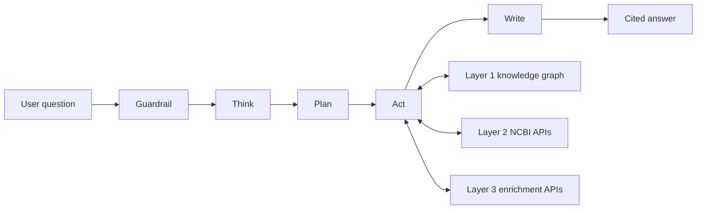

# Agentic search UI

Agentic search agent for querying NCBI biomedical data across a 115M-node knowledge graph and 30+ live APIs.

- Takes natural language questions about genes, diseases, variants, publications, and taxonomy.
- Returns cited answers with links back to NCBI source records.
- Built with FastAPI, LangGraph, and React.

For a plain-language, no-jargon project update, see [PROGRESS.md](PROGRESS.md).

## Table of contents

- [Live demo](#live-demo)
- [Quick start](#quick-start)
- [Use it from a terminal or an AI agent](#use-it-from-a-terminal-or-an-ai-agent)
- [Architecture](#architecture)
- [Tech stack](#tech-stack)
- [Status](#status)
- [Running the checks locally](#running-the-checks-locally)
- [Directory structure](#directory-structure)
- [Planning documents](#planning-documents)
- [Documentation](#documentation)
- [Cost model](#cost-model)
- [Connection to System 1 and System 2](#connection-to-system-1-and-system-2)
- [License](#license)

## Live demo

There are TWO deployments as of build phase 4.15. Use the production links unless you specifically want to see unreleased work.

| Deployment | Web UI | API | Deploys from |
|---|---|---|---|
| Production | https://search-agent-web-production.up.railway.app | https://search-agent-api-production.up.railway.app | the `production` branch |
| Develop | https://search-agent-web-develop-2aeb.up.railway.app | https://search-agent-api-develop-43b3.up.railway.app | the `develop` branch |

They are fully separate:

- Different Railway projects
- Different databases
- Different caches
- Different signing keys

An account created on one does not exist on the other, and a session token from one is rejected by the other. To check which one you are on, ask either API's `/health` endpoint: it answers in an `app_env` field.

How the two deploy:

- Deployed on Railway: since 2026-08-24.
- Split into two: in build phase 4.15 on 2026-08-28.
- Develop: merging to `develop` deploys the develop app.
- Production: moves only when a release branch is cut from `develop` and merged into `production`.
- A release also creates: a version tag, a changelog entry and a GitHub Release.

The full procedure is [`docs/build/Release_flow.md`](docs/build/Release_flow.md).

Measured on the deployed API rather than asserted, 2026-08-25: "Which diseases are associated with BRCA1?" returns a grounded answer with five citations in about 10 seconds, across a Layer 1 graph query and a Layer 2 NCBI confirmation, with each tool reporting itself as it runs.

It is a PROTOTYPE. What that means in practice, stated because a demo link invites the wrong assumption:

- No account is needed. An anonymous visitor gets a small free allowance of searches, counted server-side.
- CI runs Section 24's ten gates on every pull request and on every push to `develop` or `production` (build phases 4.14 and 4.15).
  - Since 2026-09-27, rulesets let only the owner's account change `develop` and `production`, and neither may be force-pushed or deleted.
  - The gates are still ADVISORY rather than merge-blocking: a documentation-only change runs no workflow, so a required check would never report on it. The only thing stopping a red merge is the owner choosing not to click.
  - Since build phase 4.15 that exposure is one step further from the audience: a merge to `develop` reaches the develop deployment, and production moves only on a deliberate release.
- Coverage is uneven by organism and by database. Treat an answer as a starting point for verification, never as an endpoint.

## Quick start

```bash
# Prerequisites
python 3.11+
node 22+ (for React frontend)
redis (for caching)
postgresql 15+ (local, for the user-data database: auth, sessions, interactions)
# No local AGE knowledge graph needed - Layer 1 connects to the remote Hetzner VPS

# Backend setup
git clone <repo-url>
cd agentic-search-ui
cp env.example .env   # fill in API keys and credentials
python -m venv venv
source venv/bin/activate
pip install -r requirements.txt
# pip install -e . also works now (fixed in build phase 4.14) and installs
# the s3 and s3-kgx-export console scripts

# User-data database (auth, sessions, interactions). Create it once, then migrate.
# USER_DB_URL in .env names the target; the default is the local database below.
createdb search_agent_users
alembic upgrade head

# Run backend
uvicorn system_03_search_agent.adapters.web_sse.app:app --reload

# Frontend setup (separate terminal)
cd frontend
npm install
npm run dev

# Run tests
pytest tests/
```

## Use it from a terminal or an AI agent

The web app is one of six ways in. The Integrations page prints the exact commands for each: the REST API with its event stream, GraphQL, MCP, the `s3` command line and KGX export. See it on [production](https://search-agent-web-production.up.railway.app/integrations) or [develop](https://search-agent-web-develop-2aeb.up.railway.app/integrations).

- Command line and local MCP server: `pip install "git+https://github.com/monideep2255/agentic-search-ui.git#subdirectory=clients/system3-cli"`, with Python 3.11 or newer, in a virtualenv.
- Depth: the command line takes `--depth`, and MCP's ask tool takes `audience_depth`. MCP answers at researcher depth unless the agent asks for another.

## Architecture

This is System 3 of a three-system project. System 1 (ETL pipelines) and System 2 (knowledge graph) built the graph. System 3 queries it.

| Layer | What | Access method | Latency |
|-------|------|---------------|---------|
| Layer 1: knowledge graph | 5 NCBI databases (Gene, ClinVar, MedGen, PubMed, Taxonomy) pre-ingested into PostgreSQL + AGE | Cypher queries via psycopg2 (read-only) | <10ms per query |
| Layer 2: on-demand NCBI APIs | 30+ databases reached at query time via EFetch, ELink, dbSNP REST | httpx async calls | 200-500ms per call |
| Layer 3: enrichment APIs | PubTator3, LitVar2, LitSense, ClinicalTrials.gov | httpx async calls | 500ms-2s per call |

Agent loop for every query:

```
Guardrail -> Think -> Plan -> Act -> Write
```

How the loop reaches the three layers:


```mermaid
flowchart LR
  q[User question] --> g[Guardrail]
  g --> t[Think]
  t --> p[Plan]
  p --> a[Act]
  a --> w[Write]
  w --> ans[Cited answer]
  a <--> l1[Layer 1 knowledge graph]
  a <--> l2[Layer 2 NCBI APIs]
  a <--> l3[Layer 3 enrichment APIs]
```

Multi-model harness routes each step to the appropriate model tier (guard, plan, or synth) based on cost and capability.

## Tech stack

| Component | Technology |
|-----------|-----------|
| Backend API | FastAPI + Uvicorn |
| Agent orchestration | LangGraph |
| LLM access | LiteLLM (multi-provider: Anthropic, OpenAI) |
| Knowledge graph | PostgreSQL 15 + Apache AGE on Hetzner CPX42 |
| User data | PostgreSQL (separate instance) |
| Caching | Redis |
| Frontend | React |
| Auth | PyJWT (HS256 access tokens), argon2-cffi (argon2id password hashing) |
| Observability | LangSmith, PostHog, an append-only JSONL tool-call audit log |

## Status

- Known open items are tracked in two places rather than duplicated here: the board (`testing/UI_fix_plan.md`) and the open phase ledgers under `tracker/`.
- See `HANDOFF.md` for what to do next.
- Per-phase narrative, including what each review round found and what it cost, is `requirements/Plan.md`'s Revision history.
- Per-phase tickets and evidence are `tracker/phase_N.M.md`.
- `tracker/BOARD.md` is frozen as the record of build phases through 6.2.
- The six UI defects the first live session surfaced, plus a seventh found alongside them, were all closed by build phase 4.16 on 2026-08-25.

## Running the checks locally

The same checks CI runs on every pull request (build phase 4.14), so a failure surfaces before pushing rather than after:

| Check | Command |
|-------|---------|
| Import order | `isort --check-only --diff src tests services tracker alembic .claude .github` |
| Lint | `ruff check` (no path argument: the whole repository) |
| Unit test suite | `pytest -m "not integration"` |
| Python dependency audit | `pip-audit -r requirements.txt` |

In [`.github/gates/README.md`](.github/gates/README.md):

- Full gate list
- Order
- The design rationale (why the CI workflow itself contains no inline shell)

## Directory structure

```
agentic-search-ui/
  src/
    system_03_search_agent/
      core/                     # The LangGraph five-step loop, run() and run_streaming(), run_registry.py, session_memory.py
      contracts/                # Pydantic event models, the query contract, JSONSchemas
      guardrail/                # The Section 10 pipeline: pre-filter, classifier, forbidden-type screen
      harness/                  # Tiers, cost caps, timeouts, coordinator-worker, prompt-cache prefix
      orchestrator/             # Step budgets and query-class routing
      synthesis/                # Grounding, citations, trust, freshness, conflict detection, refusal
      tools/                    # cypher_query, ncbi_efetch, ncbi_dbsnp, pubtator_annotate, litvar2_lookup, pathogen_detection, clinicaltrials_search
      export/                   # KGX subgraph export (build phase 4.4)
      feedback/                 # Interaction capture and the weekly review ritual (build phase 4.6), plus the durable history read path (build phase 4.13)
      observability/            # LangSmith tracing, PostHog analytics, the append-only tool-call audit log (build phase 5.0)
      adapters/
        web_sse/                # FastAPI plus SSE, the public API surface
        graphql/                # Strawberry schema over the same core
        mcp/                    # MCP server, outbound-only
        cli/                    # Thin REST client, the `s3` command
      auth/                     # Signup, login, refresh, logout, guest sessions, preferences
      data/                     # Postgres models: auth, guest sessions, interactions, cq_candidates
  frontend/                     # React 19, Vite, TypeScript, MUI
    src/
      components/
        screens/                # Home, Run, Answer, and the Integrations, Docs and About pages
        answer/                 # The follow-up field and the history rail
        chat/                   # Stop button, guardrail banner, cap message
        shell/                  # App bar, account menu, disclaimer modal, persona chip
        auth/, brand/, controls/, feedback/, guest/
      hooks/                    # useAgentRun (SSE over fetch), useRunView (events to screens)
      lib/                      # events.ts (typed AgentEvent union), api.ts, routing.ts, guestSession.ts
      stubs/                    # The stub registry: every surface still rendering from a local stand-in
    e2e/                        # Playwright specs, including the live diagnostics gated behind RUN_LIVE_DIAGNOSTICS
  tests/                        # pytest suite, including the per-phase premise gates and mutation harnesses
  testing/                      # UI testing entry point: manual workflows, the ranked spec, evidence and feedback capture (see testing/Developer/Developer_workflows.md)
  docs/                         # Architecture, NCBI, build process, the design system, and rules/ for the one rule read on demand
  reference/                    # Symlink to agentic-search-data-engineering (System 1 and 2)
  requirements/                 # Plan.md, PRD.md, Technical_specification.md, Strategic_memo.md, Evaluation_playbook.md
  tracker/                      # Phase ledgers, check_doc_drift.py, and the build board frozen at phase 6.2 (BOARD.md, render_board.py)
  alembic/                      # Migrations for the user-data schema
  .claude/                      # Claude Code rules, skills, agents, hooks
  .github/                      # CI workflow (ci.yml) and one script per Section 24 gate (gates/)
  CLAUDE.md                     # Claude Code instructions
  AGENTS.md                     # Instructions for other AI agents
  DECISIONS.md                  # Decision log
  LEARNINGS.md                  # What broke during the build and what fixed it
  PROGRESS.md                   # The plain-language update, written for a non-technical reader
```

## Planning documents

| Doc | Status |
|-----|--------|
| [Plan](requirements/Plan.md) | Master phase tracker. Its Revision history section is the project's change record; each release since v0.1.0 on 2026-08-28 is also in [`CHANGELOG.md`](CHANGELOG.md) |
| [PRD](requirements/PRD.md) | Locked 2026-07-22 |
| [Technical specification](requirements/Technical_specification.md) | Locked. 25 sections, seven tools, six delivery surfaces (web UI, REST plus SSE API, GraphQL API, MCP server, KGX export, CLI), Section 25 build order |
| [Strategic memo](requirements/Strategic_memo.md) | Phase 4 deliverable |
| [Evaluation playbook](requirements/Evaluation_playbook.md) | Living |
| [Evaluation boundary](requirements/Evaluation_boundary.md) | Living. What the eval set does NOT measure. Read beside the playbook, never instead of it: a coverage figure quoted without it is read as a completeness figure |

## Documentation

The reference documents are indexed in [`docs/README.md`](docs/README.md) and described in the reference docs table of [`CLAUDE.md`](CLAUDE.md).

| Doc | What it covers |
|-----|---------------|
| [Graph data hand over, 2026-09-25](docs/data-engineering/Graph_data_hand_over_2026-09-25.md) | Measured graph-data gaps handed from System 3 to the data-engineering repository: source-vocabulary disease names, missing phenotype edges, no MeSH term names, an empty Gene vertex |
| [Build workflow cadence](docs/build/Build_workflow_cadence.md) | Since 2026-09-25 a pointer holding the provider mapping, the tier-to-model table. It was the quick reference for how a build phase runs, with its stages, who acts at each, and the model and effort per stage. Its stage 5 premise gate, mandatory and blocking for a model-generating phase, was retired on 2026-09-24 for everything except answer behaviour. The build loop now lives in [the bossman-mode skill](.claude/skills/bossman-mode/SKILL.md), one cadence with a risk dial |
| [CI gate scripts](.github/gates/README.md) | Why the CI workflow contains no inline shell: one script per Section 24 gate, and the premise-gate defeats that forced the design |

## Cost model

Estimated monthly cost for the full System 3 deployment:

| Item | Estimated cost |
|------|---------------|
| Knowledge graph hosting (Hetzner CPX42, 8 vCPU, 16 GB, 320 GB NVMe), including tax | ~$35/month |
| Railway Hobby plan: eight services across two projects, four per deployment | $5/month today, up to ~$20 under sustained traffic. Build phase 4.15 doubled the service count by giving the develop deployment its own database and cache |
| LLM API costs (Anthropic + OpenAI, depending on query volume) | ~$10-50/month |
| Domain + TLS, once a custom domain replaces the `*.up.railway.app` subdomains | ~$1/month |
| Total | ~$51-101/month |

The Railway line covers four services per deployment, and there are two deployments as of build phase 4.15:

- `search-agent-web`
- `search-agent-api`
- Postgres
- Redis

The develop deployment's own Postgres and Redis are a deliberate cost, taken by product-owner decision on 2026-08-27. Sharing them would have meant every test run spending production's daily quota and writing into the table the live history rail reads, and a wrong migration reaching production the moment it merged to develop.

It replaces the separate user-database and Redis rows this table carried before the deployment landed, which double-counted both now that Railway hosts them.

That figure is measured from the live services rather than estimated. Resource usage across all four, sampled over 7 days on 2026-08-25:

| Resource | Usage | Rate | Cost |
|----------|-------|------|------|
| CPU | 0.002 vCPU | $20/vCPU/month | $0.04/month |
| RAM | 0.44 GB | $10/GB/month | $4.37/month |
| Volume storage | 0.24 GB | $0.15/GB/month | $0.04/month |
| Network egress | negligible | $0.05/GB | under $0.01/month |
| Resource usage total | | | $4.45/month |

Because $4.45 sits inside the $5 of usage the Hobby subscription already includes, the Railway bill today is the $5 base and nothing more. The headroom figure comes from observed peak memory across the four services, 1.31 GB, which would bill about $13/month in RAM if it were sustained rather than momentary.

LLM API cost is the term that actually moves the total. It scales with query volume, and at meaningful traffic it will exceed every other line combined.

Cost caps enforced per-query via the multi-model harness. Guard tier uses the cheapest model, synth tier uses the strongest only when needed.

## Connection to System 1 and System 2

- The knowledge graph that System 3 queries was built by the data engineering repo (System 1 + System 2).
- That repo is symlinked at `reference/agentic-search-data-engineering` for documentation access.
- System 3 connects to the graph as a read-only client via psycopg2.

Do not add any of these to this repo:

- ETL pipeline code
- Graph loading code
- Data ingestion logic

That belongs in the data engineering repo.

## License

Apache 2.0. See [LICENSE](LICENSE). Copyright 2026 [Monideep Chakraborti](https://github.com/monideep2255).

You are welcome to use, fork and build on this code. When you share a copy or something built on it, keep to the three points below. The license asks for the first two and the project asks for the third:

- Keep the `LICENSE` and `NOTICE` files with your copy. `NOTICE` carries the attribution, and Apache 2.0 (Section 4) has every redistribution carry it somewhere a reader can find it.
- Mark any file you changed as changed, so nobody mistakes your version for this one.
- Cite the project when you write about it. `CITATION.cff` holds a ready reference, and GitHub shows it under "Cite this repository". This one is a request, not a license term.

Apache 2.0 grants no rights to the project's names or marks (Section 6). Call your derivative something of your own.

Last updated: 2026-09-27
