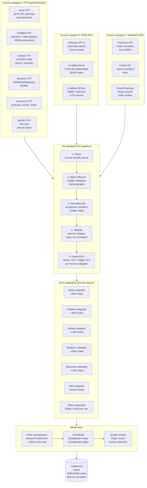
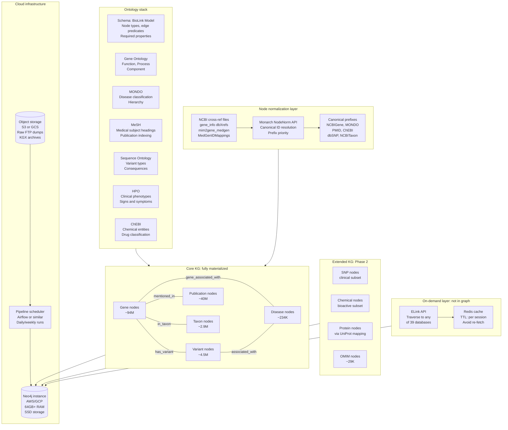
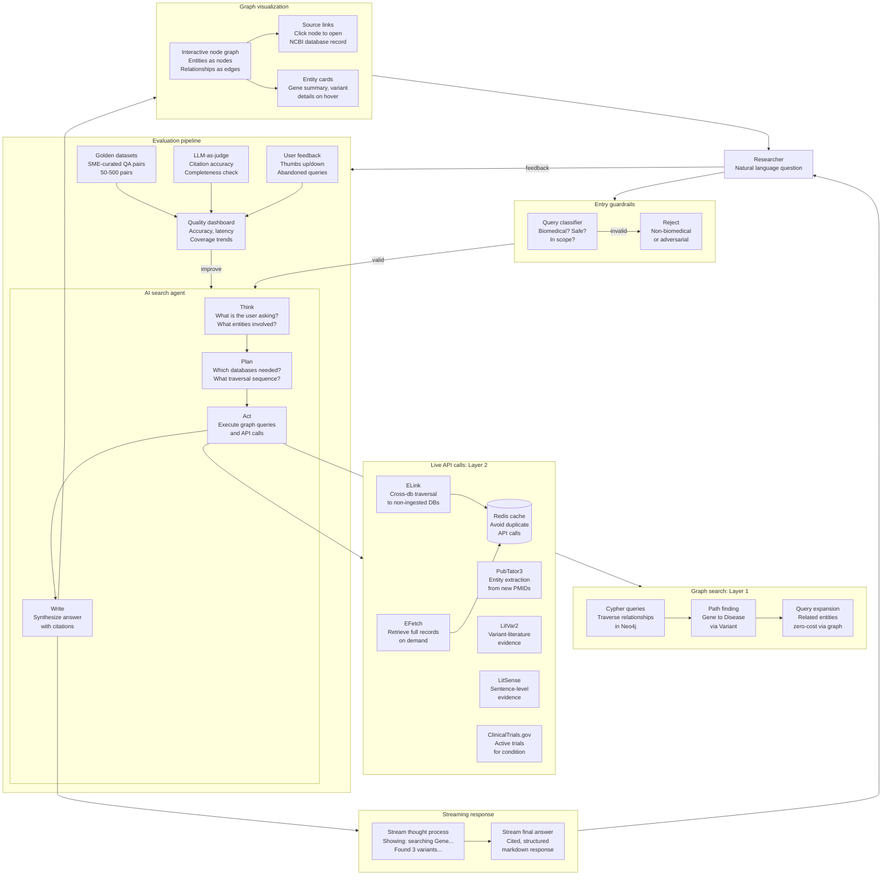
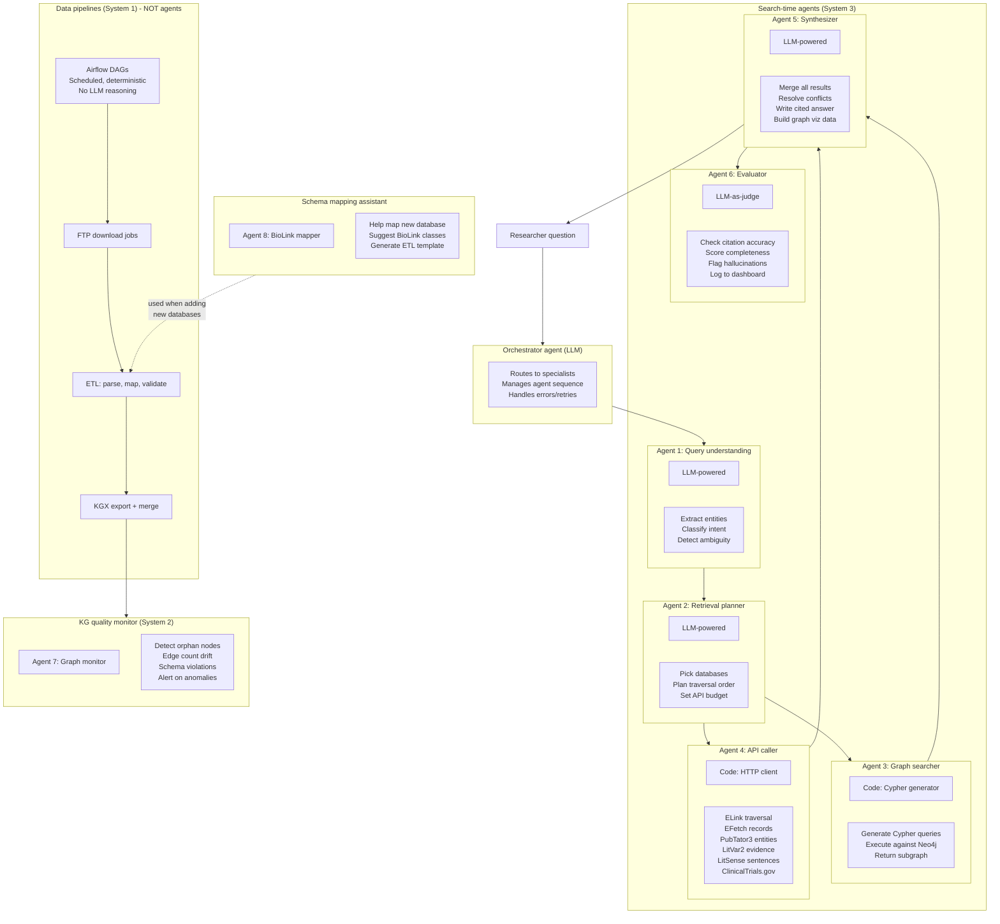
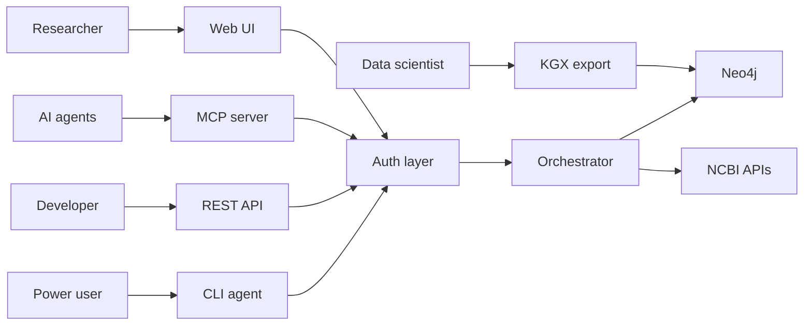

# Agentic search architecture: questions and answers

Working document capturing all architecture, scope, and ontology questions discussed during the April 2, 2026 deep dive session. Based on live NCBI API data and research into BioLink, Monarch Initiative, and existing biomedical KGs.

---

## Q1: can we go bigger than 4 databases?

Yes, but "all 39" is the wrong target. "All the connections" is the right target.

### The math problem with "all the data"

| Database tier | Records | Ingest via API at 10 req/sec? | FTP bulk? |
|---|---|---|---|
| Current alpha (PMC, ClinVar, Datasets, MedGen) | ~16.8M | Feasible | Yes |
| Add Gene + PubMed (highest-connectivity hubs) | +134M | Slow but doable | Yes |
| Add SNP + OMIM + Taxonomy + GEO | +1.2B (SNP alone) | No. SNP would take 33+ hours continuous API calls just for IDs | FTP only |
| Full sequence databases (Protein, Nucleotide, IPG) | +3.4B | Absolutely not via API | FTP dumps are massive |

### The real insight from the reference doc

The proposal says the bottleneck is connecting findings, not finding them. The reference doc (NCBI_databases_and_APIs_reference.md) proves this with data:

- PubMed: 47 link types to 25+ databases (the universal connector)
- Gene: 33 link types (the biology hub)
- Protein: 38 link types
- The current 4 alpha databases miss both universal connectors

Adding Gene and PubMed to the alpha gives more traversal coverage than adding 10 low-connectivity databases.

### What's wrong with "all 39"

- 2 are deprecated (PopSet, HomoloGene returned API errors on April 2, 2026)
- 3 haven't been updated since 2015-2017 (GRASP, GaPPlus, ProteinClusters)
- Several are metadata-about-metadata (AnnotInfo, BlastdbInfo, SeqAnnot) with no user-facing search value
- The billion-record sequence databases (Protein 1.57B, Nucleotide 712M) serve sequence-level analysis, not the natural language question-answering the proposal describes
- A researcher asking "what variants are associated with BRCA1 and breast cancer" doesn't need 1.57B protein records in the graph

### What's right about "think big"

4 databases IS too conservative. The reference doc proves it. The smart expansion:

| Tier | Databases | Why | Records |
|---|---|---|---|
| Alpha core (current) | PMC, ClinVar, Datasets, MedGen | Already planned | ~16.8M |
| Add as hubs (high impact) | Gene, PubMed | Highest connectivity, universal connectors | +134M |
| Phase 2 candidates | SNP, OMIM, Taxonomy, PubChem Compound, GTR | Clinical depth + chemistry + classification | +1.2B |
| On-demand via ELink (not ingested) | Protein, Nucleotide, SRA, Structure, etc. | Too large to ingest, query at runtime instead | 3.4B+ |

### FTE reality check

Current focus says NWS is 50-60%, KG is 30-40%. That makes the team ~0.6-0.8 FTE, not 2 full-time people. Month 1 allocates time for 4 pipelines. Expanding to 6-8 means either extending the timeline or making this the primary allocation.

---

## Q2: what architecture will we need? Is it possible with all the NCBI data?

Yes. The hybrid architecture: graph core + on-demand traversal.

The key insight: you don't need every record in the graph. You need every relationship type represented, and the ability to reach any record on demand.

### Three-layer architecture

```
Layer 1: Knowledge graph (Neo4j)
  - 6-8 high-connectivity databases fully ingested
  - BioLink schema, ~150M-500M nodes
  - All cross-database relationships materialized
  - This is where the agent THINKS

Layer 2: On-demand API layer (E-utilities ELink + EFetch)
  - Remaining 30+ databases accessible at query time
  - Agent follows ELink paths from graph nodes into any Entrez database
  - Results cached in a transient layer (Redis/similar)
  - This is where the agent REACHES

Layer 3: Research APIs (no ingestion needed)
  - PubTator3: entity extraction from any PMID at query time
  - LitVar2: variant-literature links at query time
  - LitSense: sentence-level evidence retrieval
  - ClinicalTrials.gov: clinical trial lookup
  - These AUGMENT answers, not the graph
```

### Why this works

The reference doc shows every database has cross-database links via ELink. The agent doesn't need SNP's 1.2B records in the graph if it can:

1. Start at a Gene node in the graph
2. Follow the `gene_snp` link type via ELink API call
3. Get the specific SNP records for that gene
4. Include them in the answer with citation

The graph holds the structure. The API provides the reach. Combined: full NCBI coverage.

### Data engineering architecture

```
Ingestion (batch, scheduled):
  FTP bulk download -> Parser (per-database) -> BioLink mapper -> Validator -> Neo4j loader

  Schedule:
  - PMC: weekly (FTP baseline + daily updates)
  - Gene: weekly (gene_info, gene2refseq, gene2go from FTP)
  - PubMed: daily (FTP baseline + update files)
  - ClinVar: weekly (ClinVarFullRelease.xml from FTP)
  - MedGen: monthly (FTP dump)
  - Datasets: on-demand via API (smaller, structured)
  - SNP/OMIM/others in Phase 2

On-demand (per-query):
  Agent query -> Graph traversal -> ELink to external databases -> EFetch records -> Cache -> Answer

  - Rate budget: 10 req/sec, allocate per query (e.g. max 20 API calls per user query)
  - Cache layer: avoid re-fetching the same records within a session
```

### Infrastructure requirements

| Component | What | Why |
|---|---|---|
| Neo4j (persistent) | 150M-500M nodes for alpha, scalable to billions | Graph queries, relationship traversal |
| Redis or similar (transient) | Cache on-demand API results | Avoid re-fetching, stay within rate limits |
| FTP pipeline runner | Scheduled jobs (daily/weekly) | Bulk ingestion from NCBI FTP |
| API gateway | Rate-limited E-utilities client | On-demand queries with backpressure |
| Object storage | Raw FTP dumps before processing | Staging area, reprocessing if schema changes |

### The honest constraints

| Constraint | Real or imagined? | Mitigation |
|---|---|---|
| 4.4B records won't fit in Neo4j | Real for full ingest, imagined for hybrid approach | Don't ingest everything. Graph holds relationships, API provides reach. |
| 2 people can't build 39 pipelines | Real | Build 6-8 pipelines for Layer 1. Layer 2 (ELink/EFetch) is one generic client, not 30 separate pipelines. |
| Rate limits block real-time queries | Real if you hit 30 APIs per query | Budget API calls per query. Cache aggressively. Most queries only need 2-3 database hops. |
| BioLink doesn't map to all 39 databases | Partially real | BioLink covers the clinical/genomic databases well. Chemistry (PubChem) and expression (GEO) need custom mappings. |
| FTP bulk loads are huge files | Real but manageable | Gene info is ~2GB. PubMed baseline is ~30GB compressed. ClinVar is ~2GB. These are not prohibitive. |

### What to change in the proposal

The proposal currently says "4 databases." The reference doc gives the evidence to say:

> "6-8 databases fully integrated into the knowledge graph, chosen for maximum cross-database connectivity, with on-demand traversal to all remaining Entrez databases via ELink. This gives researchers full NCBI coverage without requiring every record in the graph."

That's the honest "think big" version. Not "all 39 databases ingested" (which is a vanity metric), but "any question across any NCBI database can be answered" (which is the actual goal).

---

## Q3: how will we make it BioLink compliant?

### Which NCBI databases have direct BioLink class mappings?

10 databases map cleanly:

| NCBI database | BioLink class | Identifier prefix | Notes |
|---|---|---|---|
| Gene | `biolink:Gene` | NCBIGene: | Direct 1:1. Standard BioLink prefix. |
| PubMed | `biolink:Article` | PMID: | Standard identifier prefix. |
| ClinVar | `biolink:SequenceVariant` | ClinVar: | Rich cross-references in XML. |
| MedGen | `biolink:Disease` / `biolink:PhenotypicFeature` | UMLS: (CUI) | The disease/condition hub for NCBI. |
| SNP/dbSNP | `biolink:SequenceVariant` / `biolink:Snv` | dbSNP:rs | Scale is the challenge, not the mapping. |
| OMIM | `biolink:Disease` + `biolink:Gene` | OMIM: | Split: gene entries (type *) and phenotype entries (type #, %). |
| Taxonomy | `biolink:OrganismTaxon` | NCBITaxon: | Direct 1:1. Standard BioLink prefix. |
| PubChem Compound | `biolink:SmallMolecule` | PUBCHEM.COMPOUND: | Needs mapping to ChEBI (BioLink's preferred chemical prefix). |
| Protein | `biolink:Protein` | RefSeq: / UniProtKB: | Most KGs use UniProt as protein hub. Map through `gene_refseq_uniprotkb_collab`. |
| PMC | `biolink:Article` | PMCID: | Merges with PubMed nodes via shared PMID. |

6 databases have weak or partial BioLink mappings:

| NCBI database | Closest BioLink class | Problem |
|---|---|---|
| GEO | `biolink:Dataset` | BioLink Dataset class is thin. GEO is expression data infrastructure, not a biological entity. |
| Nucleotide | `biolink:NucleicAcidEntity` | Generic catch-all. Individual GenBank records are sequences, not discrete entities in the BioLink sense. |
| Assembly | `biolink:Genome` | Reasonable but not heavily used in existing KGs. |
| SRA | No natural class | Raw sequencing runs. Closest: `biolink:Dataset` or `biolink:MaterialSample`. Neither fits. |
| GTR | `biolink:DiagnosticAid` | Genetic test registry. BioLink's clinical classes are still maturing. |
| dbGaP | `biolink:Study` | Study-level data. Phenotype variables inconsistently coded. |

The remaining databases (AnnotInfo, BlastdbInfo, SeqAnnot, GaPPlus, GRASP, Orgtrack, Biocollections) are infrastructure or deprecated: they don't represent biological entities and have no BioLink mapping path.

---

## Q4: will the relationships take place? Do all records have ontology mappings?

### Ontology coverage across NCBI databases

#### GO (Gene Ontology) terms
- Gene: yes, via `gene2go` file. GO annotations for 450+ species.
- Protein: indirectly, through UniProtKB-GO annotations.
- GEO: yes, GEO2R results include GO term annotations on genes.
- All other databases: no direct GO terms.

#### MONDO disease IDs
- MedGen: yes, MONDO is now a source vocabulary in MedGen alongside OMIM and Orphanet.
- ClinVar: indirectly, through MedGen condition mappings (ClinVar -> MedGen CUI -> MONDO).
- All other databases: no direct MONDO IDs. MONDO adoption flows through MedGen as the hub.

#### UMLS CUIs
- MedGen: yes, this is MedGen's primary identifier (CUIs starting with "C" or NCBI-generated "CN").
- ClinVar: yes, conditions link to MedGen CUIs.
- GTR: yes, conditions link through MedGen CUIs.
- PubMed/MeSH: indirectly, MeSH terms are part of UMLS and have CUI mappings.
- Gene, SNP, GEO, SRA, Protein, Nucleotide, Assembly, PubChem, dbGaP: no direct CUIs.

#### MeSH terms
- PubMed: yes, every indexed article gets MeSH annotations (the primary MeSH use case).
- PMC: yes, inherits MeSH from corresponding PubMed records.
- MedGen: yes, MeSH is an authoritative source vocabulary.
- PubChem: yes, chemical MeSH headings mapped to Compound records.
- All other databases: no direct MeSH.

#### OMIM IDs
- MedGen: yes, OMIM is a primary source for disease/gene records.
- ClinVar: yes, submissions reference OMIM conditions and genes.
- Gene: yes, via `mim2gene_medgen` FTP file. Maps MIM numbers to Gene IDs and MedGen CUIs.
- GTR: yes, genetic tests reference OMIM conditions.
- All other databases: no direct OMIM IDs.

#### HGNC gene IDs
- Gene: yes, `gene_info` includes HGNC IDs for human genes in the dbXrefs column.
- ClinVar: indirectly, through Gene cross-references.
- OMIM: includes HGNC cross-references for gene entries.
- Most other databases: no. HGNC is human-specific and Gene is the hub.

#### Databases with NO standard ontology identifiers (need custom mapping)
- SRA: experiment types but no standard ontology IDs.
- Assembly: linked to Taxonomy IDs but no disease/function ontologies.
- Nucleotide: linked to Taxonomy but no GO/MeSH/disease ontologies on the records.
- dbGaP: phenotype variables are free-text with inconsistent controlled vocabulary.
- GEO: semi-structured free-text metadata. Ontology use is author-dependent and inconsistent.

### Summary: ontology mapping coverage

| Ontology | Databases with coverage | Databases without |
|---|---|---|
| GO | Gene, Protein (via UniProt), GEO (partial) | Everything else |
| MONDO | MedGen, ClinVar (via MedGen) | Everything else |
| UMLS CUI | MedGen, ClinVar, GTR, PubMed/MeSH (indirect) | Gene, SNP, GEO, SRA, Protein, Nucleotide, Assembly, PubChem, dbGaP |
| MeSH | PubMed, PMC, MedGen, PubChem | Gene, ClinVar, SNP, GEO, SRA, Nucleotide, Assembly, dbGaP |
| OMIM | MedGen, ClinVar, Gene, GTR | PubMed, SNP, GEO, SRA, Protein, Nucleotide, Assembly, PubChem, dbGaP |
| HGNC | Gene, ClinVar (indirect), OMIM | Most databases |

---

## Q5: can all the databases be mapped to each other in a knowledge graph?

### The answer is yes, through cross-database identifier mapping files

NCBI provides extensive mapping files on FTP that are the foundation for building cross-database edges.

#### NCBI Gene FTP (`ftp.ncbi.nlm.nih.gov/gene/DATA/`)

| File | Maps from | Maps to |
|---|---|---|
| `gene2pubmed.gz` | Gene ID | PMID |
| `gene2refseq.gz` | Gene ID | RefSeq nucleotide/protein accessions |
| `gene2accession.gz` | Gene ID | GenBank/RefSeq accessions (broader) |
| `gene2ensembl.gz` | Gene ID | Ensembl gene/transcript/protein IDs |
| `gene2go.gz` | Gene ID | GO term IDs (with evidence codes) |
| `gene_info.gz` | Gene ID | Symbol, synonyms, dbXrefs (HGNC, MIM, Ensembl, VGNC), chromosome, location |
| `gene_orthologs.gz` | Gene ID | Ortholog Gene IDs (cross-species) |
| `gene_refseq_uniprotkb_collab.gz` | Gene ID / RefSeq protein | UniProtKB accessions |
| `mim2gene_medgen` | MIM number | Gene ID + MedGen CUI |

#### ClinVar FTP (`ftp.ncbi.nlm.nih.gov/pub/clinvar/tab_delimited/`)

| File | Contains |
|---|---|
| `variant_summary.txt.gz` | ClinVar accession, Gene ID, Gene symbol, rs ID (dbSNP), HGVS names, clinical significance, condition, assembly coordinates |
| `allele_gene.txt.gz` | ClinVar allele ID to Gene ID |
| `var_citations.txt` | ClinVar variation ID to PMID and dbSNP/dbVar IDs |
| `cross_references.txt` | ClinVar to dbSNP rs IDs and dbVar accessions |

The ClinVar XML files (VCV and RCV) are the richest: Gene IDs, rs IDs, MedGen CUIs, OMIM IDs, condition names, supporting PMIDs, and submitter information all in one record.

#### Other key mapping resources

| Resource | What it maps |
|---|---|
| MedGen FTP: `MedGenIDMappings.txt` | MedGen CUI to OMIM, Orphanet, SNOMED CT, MeSH, HPO |
| NCBI Taxonomy FTP: `taxdump.tar.gz` | Taxonomy IDs to names and full lineage hierarchy |
| dbSNP FTP: VCF files | rs IDs to genomic coordinates and alleles |
| PubChem FTP | Compound-to-gene, compound-to-MeSH, compound-to-pathway |
| UniProt ID mapping service | UniProtKB to NCBI Gene, RefSeq, PDB, Ensembl |
| PMC ID Converter API | PMID to PMCID to DOI |
| E-utilities ELink | Programmatic links between any pair of 39 Entrez databases |

---

## Q6: do we need small KGs contributing to a bigger KG, or what?

### Yes. This is a well-established pattern called "modular KG construction."

### Monarch Initiative (the clearest example)

Monarch ingests 33 separate data sources, each transformed independently:

1. Each source is downloaded and passed through Koza (their ETL tool) which transforms it into BioLink-compliant KGX format
2. Cat-Merge then merges all the individual KGX graphs, performing node normalization to unify identifiers across sources
3. The result is a single merged KG served through REST API, Solr, file downloads, and a web UI
4. Monthly update cycle. Each source is an independent "small KG" that feeds the bigger Monarch KG

Source: Monarch Initiative 2024 paper in Nucleic Acids Research (NAR).

### NCATS Biomedical Data Translator

A consortium of 10+ teams, each building independent knowledge providers (KPs) that federate into a unified reasoning system:

- RTX-KG2: integrates 70+ knowledge sources into a single BioLink-compliant KG (including NCBI Taxonomy, SemMedDB, ChEMBL, DrugBank, UMLS). 3.6M edges from NCBI Taxonomy alone.
- BioThings Explorer: entirely federated approach, no central KG. Queries routed to individual API endpoints, results merged on the fly using BioLink as the shared schema.
- TRAPI (Translator Reasoner API): standardized query/response format so different KGs can interoperate.

Source: RTX-KG2 paper in BMC Bioinformatics.

### KG-Hub

Platform for building modular BioLink-compliant KGs:
- Uses KGX format as the interchange standard
- Currently hosts 7+ KG projects (COVID-19, drug repurposing, rare disease, microbial-environmental)
- Each project is a composable subgraph that can be merged with others

Source: KG-Hub paper in Bioinformatics (2023).

### KGX (Knowledge Graph Exchange) format

The standard serialization for merging graphs:
- Simple node and edge TSV files with BioLink categories and predicates
- Designed specifically for the merge use case: normalize nodes, concatenate edges, deduplicate
- Can export to Neo4j, SQLite, RDF, or keep as flat files

### What this means for the NCBI agentic search project

The recommended approach:

```
Per-database subgraph (small KG):
  Gene subgraph: gene_info + gene2go + gene2pubmed -> BioLink nodes + edges -> KGX files
  ClinVar subgraph: ClinVar XML -> variants, genes, diseases, associations -> KGX files
  MedGen subgraph: MedGen dump -> diseases, phenotypes, ontology mappings -> KGX files
  PubMed subgraph: PubMed baseline -> articles, MeSH annotations -> KGX files
  (repeat for each database)

Merge step:
  All KGX files -> Node normalization (unify identifiers) -> Cat-Merge -> Single merged KG

Load step:
  Merged KG -> Neo4j (or similar graph database)
```

Each subgraph is independently testable, updatable, and validatable. If one pipeline breaks, the others continue. If a database schema changes, only that subgraph's pipeline needs updating.

---

## Q7: how to set up the ontology?

### The ontology stack for NCBI agentic search

The system needs 3 layers of ontology:

#### Layer 1: schema (what types of things exist and how they connect)

BioLink Model is the schema. It defines:
- Node types: Gene, Disease, SequenceVariant, Publication, SmallMolecule, Protein, OrganismTaxon, etc.
- Edge types (predicates): `biolink:gene_associated_with_condition`, `biolink:has_variant`, `biolink:treats`, `biolink:expressed_in`, etc.
- Required properties: id, name, category for nodes; subject, predicate, object for edges

BioLink is not an ontology in the strict sense: it's a data model. It tells you what shape the data should be, not what the data means.

#### Layer 2: domain ontologies (what the data means)

These provide the actual biological semantics:

| Ontology | What it covers | How it enters the graph |
|---|---|---|
| Gene Ontology (GO) | Molecular function, biological process, cellular component | Via `gene2go`: Gene nodes get edges to GO term nodes |
| MONDO | Disease classification | Via MedGen: Disease nodes get MONDO IDs as the canonical identifier |
| MeSH | Medical subject headings (broad) | Via PubMed: Publication nodes get edges to MeSH descriptor nodes |
| Sequence Ontology (SO) | Variant types and consequences | Via ClinVar/dbSNP: SequenceVariant nodes get SO terms for functional consequence |
| Human Phenotype Ontology (HPO) | Clinical phenotypes | Via MedGen: PhenotypicFeature nodes get HPO IDs |
| ChEBI | Chemical entities | Via PubChem: SmallMolecule nodes get ChEBI IDs (mapped from CID via InChI) |
| NCBI Taxonomy | Organism classification | Direct: OrganismTaxon nodes with NCBITaxon: prefix |

#### Layer 3: identifier normalization (how entities from different databases become the same node)

This is the hardest part. The same gene appears in Gene (NCBIGene:672), OMIM (OMIM:113705), Ensembl (ENSG00000012048), and HGNC (HGNC:1100). These must all resolve to one node.

Tools:
- Monarch's Node Normalizer (NodeNorm): resolves equivalent identifiers to a canonical form using curated mappings. Available as an API.
- NCBI's own cross-reference files: `gene_info` dbXrefs column maps Gene IDs to HGNC, MIM, Ensembl.
- BioLink preferred prefixes: each class has a preferred identifier prefix (e.g. NCBIGene: for genes, MONDO: for diseases, CHEBI: for chemicals).

### Practical setup sequence

1. Start with BioLink as the schema. Every node gets a `category` (e.g. `biolink:Gene`), every edge gets a `predicate` (e.g. `biolink:gene_associated_with_condition`).
2. Use NCBIGene: as the canonical gene identifier. Map HGNC, OMIM, Ensembl to it using `gene_info` dbXrefs.
3. Use MONDO: as the canonical disease identifier. Map OMIM phenotypes and MeSH disease terms to MONDO via MedGen.
4. Use GO terms as function/process/component annotations on Gene nodes.
5. Use SO terms for variant consequence annotations on SequenceVariant nodes.
6. Use MeSH as the annotation layer on Publication nodes.
7. Run BioLink validator on every subgraph before merge. Reject non-compliant records.

---

## Q8: BioLink compliance path per database (build order)

### Tier 1: ready now (direct mapping, standard ontology IDs, existing KGs already ingest them)

| Database | BioLink class | Path to compliance |
|---|---|---|
| Gene | `biolink:Gene` | Use NCBIGene: prefix. `gene_info` provides HGNC/Ensembl/MIM cross-refs. `gene2go` provides function edges. `gene2pubmed` provides literature edges. Monarch and RTX-KG2 already ingest this. |
| PubMed | `biolink:Article` | Use PMID: prefix. MeSH annotations become edges to `biolink:OntologyClass`. `gene2pubmed` links to genes. Already in SemMedDB/RTX-KG2. |
| ClinVar | `biolink:SequenceVariant` | Rich cross-references in XML: Gene IDs, rs IDs, MedGen CUIs, OMIM, PMIDs. Produces variant-to-disease and variant-to-gene associations directly. Monarch already partially ingests ClinVar. |
| MedGen | `biolink:Disease` / `biolink:PhenotypicFeature` | CUI-based. Maps to OMIM, Orphanet, MeSH, SNOMED, MONDO. The disease/condition hub. `mim2gene_medgen` directly produces disease-to-gene edges. |
| Taxonomy | `biolink:OrganismTaxon` | Use NCBITaxon: prefix. Already a standard BioLink prefix. `taxdump` files provide full lineage hierarchy. |

### Tier 2: feasible with moderate mapping work

| Database | BioLink class | Path to compliance |
|---|---|---|
| SNP/dbSNP | `biolink:SequenceVariant` / `biolink:Snv` | Use dbSNP:rs prefix. ClinVar already links rs IDs to clinical significance. Challenge: scale (1.2B variants). Approach: ingest only clinically annotated or functionally annotated variants. |
| OMIM | `biolink:Disease` + `biolink:Gene` | `mim2gene_medgen` provides the mapping. Challenge: OMIM is not freely redistributable without license, so most KGs go through MedGen instead. |
| PubChem Compound | `biolink:SmallMolecule` | CIDs need mapping to ChEBI. PubChem has InChI and ChEBI cross-references. Challenge: 123M+ compounds, most KGs filter to bioactive/drug compounds only. |
| Protein | `biolink:Protein` | `gene_refseq_uniprotkb_collab` maps to UniProt (BioLink's preferred protein prefix). Most existing KGs use UniProt as the protein hub. |
| PMC | `biolink:Article` | PMCID: prefix. Most PMC articles also have PMIDs, so they merge with PubMed nodes. Lower priority since PubMed covers the same publications at metadata level. |

### Tier 3: requires significant custom work

| Database | Closest BioLink class | Path to compliance |
|---|---|---|
| GEO | `biolink:Dataset` | Extract gene-to-condition associations from metadata via text mining, or use curated resources like ARCHS4. Not a natural KG entity. |
| Nucleotide | `biolink:NucleicAcidEntity` | Useful mainly as cross-references from Gene nodes. Not worth ingesting as primary nodes. |
| Assembly | `biolink:Genome` | Straightforward but low-value for a biomedical QA KG. Small record count (~50K). |
| SRA | No good class | Metadata (BioProject, BioSample) could become `biolink:Study` / `biolink:MaterialSample` but value proposition is unclear. |
| GTR | `biolink:DiagnosticAid` | Links tests to conditions (MedGen CUIs) and genes. Niche use case. |
| dbGaP | `biolink:Study` | Valuable data but controlled access. Phenotype variables need NLP/ontology mapping. |

### Recommended build order for the KG

1. Gene + MedGen + ClinVar (the core triangle: gene-variant-disease with rich cross-references already in place)
2. PubMed + Taxonomy (literature context and species classification, both already KG-ready)
3. SNP + OMIM (expand variant and disease coverage, filter for clinical relevance)
4. PubChem + Protein (chemical and protein entities, map through ChEBI and UniProt)
5. PMC (full-text mining for additional edges via PubTator3)
6. GEO, Assembly, GTR, dbGaP (only if specific use cases demand it)
7. SRA, Nucleotide (leave as cross-references via ELink, not primary nodes)

---

## Q9: what about the Datasets API? Does it overlap or provide better connectivity?

The NCBI Datasets API (v2) overlaps with E-utilities for Gene, Genome/Assembly, Taxonomy, and Virus data. For those databases, Datasets returns richer, more structured records.

| Need | Datasets API | E-utilities |
|---|---|---|
| Gene info with GO terms, transcripts, Swiss-Prot accessions | Yes (richer) | Yes (flatter) |
| Genome assemblies with annotation stats, BUSCO, gene counts | Yes (much richer) | Yes (basic metadata only) |
| Taxonomy with lineage | Yes | Yes |
| PubMed, PMC, literature | No | Yes |
| SNP, ClinVar, dbVar (variation) | No | Yes |
| GEO, expression data | No | Yes |
| PubChem (chemistry) | No | Yes |
| Cross-database linking (ELink) | No | Yes |
| MedGen, OMIM, GTR (clinical genetics) | No | Yes |

For data engineering: use FTP bulk downloads as the primary ingest path (not either API). Use Datasets API for ad-hoc lookups where you need richer metadata. Use E-utilities ELink for on-demand cross-database traversal at query time.

---

## Q10: what sources were used for the NCBI databases reference doc?

Full provenance table is in the reference doc header. Summary: all 39 databases were queried live via `einfo.fcgi` on April 2, 2026 using the NCBI API key from `.env`. All 4 research APIs (PubTator3, LitVar2, LitSense, ClinicalTrials.gov) were verified with live API calls. The Datasets API was verified with live calls to Gene ID 672 (BRCA1) and Assembly GCF_000001405.40 (human reference genome). BLAST and PubChem PUG REST were documented from official NCBI API docs, not live-tested.

---

## Sources for ontology/mapping research

| Topic | Source |
|---|---|
| BioLink Model specification | biolink.github.io/biolink-model/, github.com/biolink/biolink-model |
| Monarch Initiative architecture | Monarch 2024 paper, Nucleic Acids Research (NAR), doi:10.1093/nar/gkad1082 |
| RTX-KG2 (70+ source integration) | RTX-KG2 paper, BMC Bioinformatics, PMC9520835 |
| KG-Hub (modular KG construction) | KG-Hub paper, Bioinformatics 2023, doi:10.1093/bioinformatics/btad418 |
| BioThings Explorer (federated approach) | BioThings Explorer paper, PMC10153288 |
| BioLink Model paper | Clinical and Translational Science, PMC9372416 |
| NCBI Gene FTP file documentation | ftp.ncbi.nlm.nih.gov/gene/DATA/README |
| ClinVar FTP documentation | ncbi.nlm.nih.gov/clinvar/docs/ftp_primer/ |
| MedGen data processing | ncbi.nlm.nih.gov/medgen/docs/data/ |
| MONDO Disease Ontology | mondo.monarchinitiative.org |
| KGX format specification | github.com/biolink/kgx |
| Petagraph (modular base KG) | Petagraph paper, Scientific Data 2024, doi:10.1038/s41597-024-04070-w |
| Samyama (open biomedical KGs at scale) | arXiv:2603.15080 |

---

## Proposed architecture: the three systems

Your instinct is right. This is 3 distinct systems that connect:

1. Data engineering: ingests from 3 source categories, each database gets its own ETL pipeline producing a BioLink-compliant subgraph
2. Knowledge graph: subgraphs merge into a unified KG with a node normalization layer, hosted on cloud infrastructure
3. UI and agent: natural language interface with streaming, graph visualization, live API augmentation, and an evaluation pipeline that feeds back into the agent

Each system is detailed below with architecture diagrams.

---

## System 1: data engineering architecture

### The 3 source categories

The data comes from 3 fundamentally different types of sources, each requiring different ingestion strategies:

Source category 1, FTP bulk downloads: the primary path for large databases. NCBI publishes structured dump files that are the authoritative, complete datasets. Gene, PubMed, ClinVar, MedGen, Taxonomy, and dbSNP all have well-maintained FTP files with known formats (TSV, XML, VCF). This is where 95%+ of the graph data comes from.

Source category 2, NCBI APIs: for databases without good FTP dumps, or for cross-database relationships. The Datasets API v2 provides richer gene and assembly records than FTP. E-utilities ELink provides the cross-database relationship matrix (39x39 databases). EFetch retrieves individual records from OMIM, PubChem, GTR where FTP isn't practical.

Source category 3, Research APIs: PubTator3 (entity extraction from publications), LitVar2 (variant-literature links), and ClinicalTrials.gov. These don't feed into the core graph during batch ingestion. They are used at query time (Layer 3 of the UI architecture) or to enrich existing nodes during periodic enhancement runs.

### Per-database ETL pipeline (the same 5 steps for every source)

Every database, regardless of source category, goes through the same pipeline:

1. Parse: format-specific parser (XML for ClinVar, TSV for Gene, VCF for dbSNP, JSON for Datasets API)
2. Map to BioLink: assign `biolink:Category` to nodes and `biolink:predicate` to edges
3. Normalize IDs: resolve to canonical prefixes (NCBIGene:, MONDO:, PMID:, ChEBI:, dbSNP:rs, NCBITaxon:)
4. Validate: run BioLink validator, reject non-compliant records, log rejection reasons
5. Export KGX: output as nodes.tsv + edges.tsv per source (the KGX interchange format)

Each pipeline produces an independent subgraph. If one pipeline breaks, the others continue. If a database schema changes, only that pipeline needs updating.

### Diagram: data engineering architecture

[Edit this diagram](https://l.mermaid.ai/HcnQ4v)



### Specific pipeline details per database

| Database | Source | Files/endpoints | Update frequency | Estimated nodes | Key edges produced |
|---|---|---|---|---|---|
| Gene | FTP | gene_info.gz, gene2go.gz, gene2pubmed.gz, gene2refseq.gz, gene_orthologs.gz, mim2gene_medgen | Weekly | ~94M | Gene-to-GO, Gene-to-Publication, Gene-to-Disease (via MIM), Gene-to-Ortholog |
| PubMed | FTP | baseline XML (1,200+ files), daily update files | Daily | ~40M | Publication-to-MeSH, Publication-to-Gene (via gene2pubmed) |
| ClinVar | FTP | ClinVarFullRelease.xml.gz, variant_summary.txt.gz, var_citations.txt | Weekly | ~4.5M | Variant-to-Disease, Variant-to-Gene, Variant-to-Publication |
| MedGen | FTP | MedGenIDMappings.txt, MGREL.RRF.gz | Monthly | ~234K | Disease-to-Gene (via mim2gene_medgen), Disease-to-Ontology (MONDO, OMIM, MeSH, SNOMED, HPO) |
| Taxonomy | FTP | taxdump.tar.gz (names.dmp, nodes.dmp) | Weekly | ~2.9M | Taxon-to-ParentTaxon (full lineage tree) |
| SNP (clinical subset) | FTP | VCF files (clinically annotated only) | Quarterly | ~5-10M (filtered from 1.2B) | Variant-to-Gene, Variant-to-ClinicalSignificance |
| OMIM | API (EFetch) | Individual records via E-utilities | Monthly | ~29K | Disease-to-Gene, Gene-to-Publication |
| PubChem Compound | FTP + API | compound-to-gene, compound-to-MeSH mappings | Monthly | ~1-5M (bioactive subset) | Chemical-to-Gene (target), Chemical-to-Disease (indication) |
| Protein | FTP | gene_refseq_uniprotkb_collab.gz | Monthly | ~1-5M (representative subset) | Protein-to-Gene, Protein-to-Domain |

### Update schedule

```
Daily:   PubMed (incremental update files)
Weekly:  Gene, ClinVar, Taxonomy
Monthly: MedGen, OMIM, PubChem, Protein
On-demand: Datasets API enrichment, PubTator3 entity runs
```

Each update triggers only the affected subgraph's pipeline, then re-runs the merge step. The merge is incremental: new/changed nodes are upserted, deleted nodes are removed.

---

## System 2: knowledge graph architecture

### The answer to "one KG or many?"

Both. Each database produces its own subgraph (small KG), and they merge into one unified KG. This is the Monarch Initiative pattern, proven at scale with 33+ sources.

The subgraphs share commonalities because they all use BioLink as the schema and normalized identifiers. When the Gene subgraph creates a node `NCBIGene:672` (BRCA1) and the ClinVar subgraph creates edges pointing to `NCBIGene:672`, they automatically link after merge because the ID is the same. This is why node normalization in the ETL step is critical: it's what makes the subgraphs connect.

### What makes subgraphs linkable

The linking happens at 3 levels:

Level 1, shared identifiers: Gene subgraph and ClinVar subgraph both reference `NCBIGene:672`. After merge, this is one node with edges from both sources.

Level 2, cross-reference files: `gene2pubmed` explicitly maps Gene IDs to PMIDs. `mim2gene_medgen` maps OMIM to Gene to MedGen. These become edges in the merged graph.

Level 3, ELink relationships: for cross-database links not covered by FTP mapping files, E-utilities ELink provides the 39x39 database relationship matrix. These can be materialized as edges during periodic enrichment runs.

### Hosting: AWS or GCP?

Either works. The key requirements:

| Requirement | AWS option | GCP option | Recommendation |
|---|---|---|---|
| Graph database | Neo4j on EC2 (self-managed) or Neptune (managed, but not Cypher-native) | Neo4j on GCE (self-managed) or Neo4j Aura (managed) | Neo4j Aura (managed) or self-hosted Neo4j Enterprise on EC2/GCE. Neptune uses Gremlin/SPARQL, not Cypher, which adds friction. |
| Object storage (FTP dumps) | S3 | GCS | Either, ~$0.023/GB/month. ~50GB for all FTP dumps. |
| Pipeline orchestration | MWAA (managed Airflow) or Step Functions | Cloud Composer (managed Airflow) | Airflow on either cloud. The ETL pipelines are DAGs. |
| Cache (Redis) | ElastiCache | Memorystore | Either, managed Redis for on-demand API result caching. |
| Compute (ETL runners) | EC2 or ECS/Fargate | GCE or Cloud Run | Containerized ETL jobs triggered by Airflow. |

Estimated infrastructure cost for alpha:
- Neo4j instance (64GB RAM, SSD): ~$500-800/month (self-hosted) or ~$1000-1500/month (Aura)
- S3/GCS storage: ~$5/month (50GB of FTP dumps + KGX files)
- Airflow: ~$200-400/month (managed)
- Redis: ~$50-100/month (small instance for query caching)
- ETL compute: ~$100-200/month (burst during pipeline runs)
- Total alpha: ~$1000-2500/month

If NCBI has existing AWS or GCP accounts, use whichever the org already supports for billing, networking, and security review.

### Diagram: knowledge graph architecture

[Edit this diagram](https://l.mermaid.ai/snHkVC)



### Graph schema: what the unified KG looks like

Node types (BioLink categories):

| Category | Example ID | Source databases | Estimated count |
|---|---|---|---|
| `biolink:Gene` | NCBIGene:672 | Gene, OMIM (gene entries) | ~94M |
| `biolink:Disease` | MONDO:0007254 | MedGen, OMIM (phenotype entries) | ~234K |
| `biolink:SequenceVariant` | ClinVar:12345 | ClinVar, dbSNP (clinical subset) | ~5-15M |
| `biolink:Publication` | PMID:32942285 | PubMed, PMC | ~40M |
| `biolink:OrganismTaxon` | NCBITaxon:9606 | Taxonomy | ~2.9M |
| `biolink:SmallMolecule` | CHEBI:15365 | PubChem (bioactive subset) | ~1-5M |
| `biolink:Protein` | UniProtKB:P38398 | Protein (via UniProt mapping) | ~1-5M |
| `biolink:OntologyClass` | GO:0005515 | Gene Ontology, MeSH, HPO | ~500K |

Edge types (BioLink predicates):

| Predicate | Subject | Object | Source |
|---|---|---|---|
| `biolink:gene_associated_with_condition` | Gene | Disease | mim2gene_medgen, ClinVar |
| `biolink:has_sequence_variant` | Gene | SequenceVariant | ClinVar, dbSNP |
| `biolink:is_sequence_variant_of` | SequenceVariant | Gene | ClinVar |
| `biolink:variant_associated_with_condition` | SequenceVariant | Disease | ClinVar |
| `biolink:mentioned_in` | Gene / Variant / Disease | Publication | gene2pubmed, var_citations |
| `biolink:in_taxon` | Gene | OrganismTaxon | gene_info |
| `biolink:enables` | Gene | MolecularActivity (GO) | gene2go |
| `biolink:involved_in` | Gene | BiologicalProcess (GO) | gene2go |
| `biolink:located_in` | Gene | CellularComponent (GO) | gene2go |
| `biolink:has_phenotype` | Disease | PhenotypicFeature (HPO) | MedGen |
| `biolink:treats` | SmallMolecule | Disease | PubChem-disease mappings |
| `biolink:physically_interacts_with` | SmallMolecule | Protein | PubChem-target mappings |
| `biolink:subclass_of` | OrganismTaxon | OrganismTaxon | Taxonomy lineage |
| `biolink:broad_match` | Disease | OntologyClass (MeSH) | MedGen-MeSH mappings |

---

## System 3: UI and agent architecture

### The latency question

You asked: how will latency be affected? Here's the breakdown:

| Operation | Expected latency | Why |
|---|---|---|
| Query classification (guardrails) | 200-500ms | Small model or rule-based classifier. Fast. |
| Think + Plan (LLM reasoning) | 1-3 seconds | One LLM call to understand the question and plan the retrieval strategy. |
| Graph traversal (Cypher queries) | 50-200ms per query | Neo4j is fast for relationship traversal. Most queries need 2-5 Cypher calls. Total: 100-1000ms. |
| On-demand API calls (ELink + EFetch) | 200-500ms per call | Network round-trip to NCBI. Budget 2-5 calls per query. Total: 400-2500ms. |
| Research API calls (PubTator3, LitVar2, LitSense) | 500-2000ms per call | These run in parallel with graph traversal. Not on the critical path if parallelized. |
| Answer synthesis (LLM write step) | 2-5 seconds | The LLM synthesizes data from all sources into a cited answer. This is the slowest step. |
| Total end-to-end | 4-10 seconds | Acceptable for a research tool. Much faster than 60-90 seconds from Experiment 1. |

### Why streaming is essential

At 4-10 seconds total, the user would stare at a blank screen. Streaming solves this:

Phase 1 (immediate, 0-1s): show the thought process. "Understanding your question... Identified entities: BRCA1, breast cancer. Planning: will search Gene, ClinVar, PubMed."

Phase 2 (progressive, 1-5s): show partial results as they arrive. Graph traversal returns first: "Found 47 variants in ClinVar for BRCA1." Then API results stream in: "LitVar2 found 744 publications for rs80357906." Each result appears as it arrives, not after everything completes.

Phase 3 (final, 5-10s): the synthesized answer with citations replaces the streaming partial results. Full markdown with linked sources.

This is the same pattern used by modern AI search tools. The user sees progress immediately and gets the full answer within 10 seconds.

### Graph visualization: why it matters

The text answer is one output. The graph visualization is the other. Both serve different needs:

The text answer serves: "tell me what to know." Synthesized, cited, readable. For researchers who want a quick answer.

The graph visualization serves: "show me the connections." Interactive node-and-edge diagram where researchers can see HOW entities connect across databases. For researchers who want to explore and verify.

Components of the graph visualization:
- Interactive node graph: entities as clickable nodes (genes, diseases, variants, publications), relationships as edges. Laid out using force-directed or hierarchical layout.
- Source links: every node links to its original NCBI database record. Click a Gene node to open the NCBI Gene page. Click a Variant node to open ClinVar. This is where LitVar2 and LitSense come in: they provide the deep links back to specific sentences in specific papers.
- Entity cards: hover over a node to see a summary card (gene function, variant clinical significance, disease description). No need to leave the visualization.
- Subgraph highlighting: show which nodes came from which database (color-coded). Researchers can see that a disease-gene link comes from ClinVar (clinical evidence) vs gene2pubmed (literature mention).

### Evaluation pipeline: how quality improves over time

The evaluation pipeline has 3 input channels and 1 output:

Input 1, golden datasets: SMEs create curated question-answer pairs (50-500 pairs over time). These define "what does a correct answer look like?" The system scores itself against these automatically on every code change.

Input 2, LLM-as-judge: an independent LLM reviews each answer for: (a) citation accuracy (does the cited record actually support the claim?), (b) completeness (did the agent miss a relevant database?), (c) grounding (is every fact traceable to the graph, not hallucinated?). This runs on every query in production.

Input 3, user feedback: thumbs up/down on answers, abandoned queries (user asked but didn't engage with the answer), repeat searches (user re-asked the same question differently, meaning the first answer wasn't good enough), session depth (how many follow-up questions, indicating engagement).

Output: quality dashboard showing accuracy trends, latency percentiles, coverage gaps (which types of questions fail most), and improvement over time. This feeds back into the agent's prompt engineering and retrieval strategy. The graph data itself is never modified by feedback. Only the agent's behavior changes.

### Diagram: UI and agent architecture

[Edit this diagram](https://l.mermaid.ai/fw03jP)



### UI technology stack (proposed)

| Component | Technology | Why |
|---|---|---|
| Frontend framework | React or Next.js | Standard, SSR for SEO, good streaming support |
| Graph visualization | Cytoscape.js or D3-force | Cytoscape.js is purpose-built for biological network visualization (used by STRING, NDEx). D3-force is more customizable but more work. |
| Streaming | Server-Sent Events (SSE) or WebSocket | SSE is simpler for one-directional streaming (server to client). WebSocket if bidirectional needed. |
| API layer | FastAPI (Python) | Async support for parallel graph + API calls. Native streaming response support. The agent logic is Python (LangChain/LangGraph or custom). |
| Graph database client | Neo4j Python driver | Official driver, supports async queries. |
| LLM integration | LangChain or direct API calls | For Think/Plan/Write steps and LLM-as-judge evaluation. |
| Observability | LangSmith (LLM traces) + PostHog (user analytics) | Need NCBI-managed instances. Currently using personal accounts. |
| Caching | Redis | On-demand API result caching with TTL per session. |

### How the 3 systems connect

```
System 1 (Data Engineering)
    writes to -->
System 2 (Knowledge Graph)
    read by -->
System 3 (UI + Agent)
    feedback from -->
System 3 (Evaluation Pipeline)
    improves -->
System 3 (Agent behavior)
```

The critical boundary: System 1 writes to the graph. System 3 only reads from the graph. The agent never modifies the data. This is the trust boundary that keeps the KG stable while the search layer improves continuously.

---

---

## Q11: how many agents do we need? One or a group?

A group. 8 agents total, but they are NOT all the same kind of thing.

### The key distinction: agents vs pipelines

System 1 (data engineering) does NOT need AI agents. ETL pipelines are deterministic: download file, parse, map, validate, export. No LLM reasoning required. This is Airflow DAGs, not agents. Using an LLM to download an FTP file is like using a chainsaw to open a letter.

System 2 (knowledge graph) is mostly pipelines too. The merge, normalization, and loading steps are deterministic. But monitoring graph quality benefits from an agent that can detect anomalies.

System 3 (UI + search) is where the agents live. This is where reasoning happens: understanding a natural language question, deciding what to retrieve, synthesizing an answer.

### The 8 agents

| Agent | System | LLM-powered? | What it does | When it runs |
|---|---|---|---|---|
| 1. Orchestrator | 3 | Yes | Routes user queries to specialist agents, manages sequence, handles errors/retries | Every query |
| 2. Query understanding | 3 | Yes | Extracts biological entities from NL question, classifies intent (lookup vs comparison vs exploration), detects ambiguity | Every query |
| 3. Retrieval planner | 3 | Yes | Decides which databases to query, plans traversal order through the graph, sets API call budget for this query | Every query |
| 4. Graph searcher | 3 | Hybrid | Generates Cypher queries from the plan, executes against Neo4j, returns subgraph of relevant nodes and edges | Every query |
| 5. API caller | 3 | No (code) | HTTP client that executes ELink/EFetch/PubTator3/LitVar2/LitSense/ClinicalTrials.gov calls per the plan. Manages rate limits, caching. | Every query (parallel with Agent 4) |
| 6. Synthesizer | 3 | Yes | Merges results from graph + API calls, resolves conflicts, writes cited answer, generates graph visualization data | Every query |
| 7. Evaluator | 3 | Yes (judge) | Checks citation accuracy, scores completeness, flags hallucinations, logs metrics to dashboard | Every query (async, after response) |
| 8. Graph monitor | 2 | Yes | Detects orphan nodes, edge count drift, schema violations, alerts on anomalies after pipeline runs | After each pipeline run (daily/weekly) |

Optional: Agent 9, BioLink mapper. Used only when adding a new database. Suggests BioLink classes for the new database's entities, generates an ETL template. This is a development-time assistant, not a production agent.

### Why not one agent?

One monolithic agent would need to: understand the question, plan retrieval, write Cypher, call 6 APIs, synthesize an answer, AND evaluate itself. That's too many responsibilities in one context window. Problems:

- Context pollution: Cypher query results and API JSON would fill the context, leaving less room for reasoning about the answer
- No parallelism: Agents 4 (graph) and 5 (API) should run in parallel. A single agent executes sequentially.
- No specialization: the Cypher generation prompt is very different from the synthesis prompt. Mixing them degrades both.
- No independent evaluation: the agent can't objectively judge its own output. Agent 7 (evaluator) needs a separate context.

### Why not 39 agents (one per database)?

The databases are not the right unit of decomposition. A single query might touch 5 databases. You don't want 5 database-specific agents that each return partial results without knowing what the others found. The right split is by capability (understand, plan, retrieve, synthesize), not by data source.

### How the agents communicate

```
User question
  |
  v
Orchestrator (Agent 1)
  |
  v
Query Understanding (Agent 2)
  Output: entities[], intent, ambiguity_flag
  |
  v
Retrieval Planner (Agent 3)
  Input: entities[], intent
  Output: plan{graph_queries[], api_calls[], budget}
  |
  +--> Graph Searcher (Agent 4)     [parallel]
  |     Input: graph_queries[]
  |     Output: subgraph{nodes[], edges[]}
  |
  +--> API Caller (Agent 5)          [parallel]
  |     Input: api_calls[]
  |     Output: api_results[]
  |
  v
Synthesizer (Agent 6)
  Input: subgraph + api_results + original question
  Output: {answer_markdown, citations[], graph_viz_data}
  |
  +--> User (streaming response)
  |
  +--> Evaluator (Agent 7) [async, non-blocking]
        Input: question + answer + sources
        Output: {accuracy_score, completeness_score, flags[]}
```

Agents 4 and 5 run in parallel (graph search and API calls are independent). Agent 7 runs asynchronously after the response is sent to the user (evaluation doesn't block the response).

### Implementation: LangGraph or custom?

| Option | Pros | Cons |
|---|---|---|
| LangGraph (LangChain) | Built-in agent orchestration, parallel node execution, state management, streaming support | Vendor lock-in, abstraction overhead, debugging can be opaque |
| Custom Python + asyncio | Full control, no abstraction overhead, easier to debug | Must build orchestration, state management, streaming yourself |
| Claude Agent SDK | Native Claude integration, tool use built in | Newer, less battle-tested for multi-agent patterns |

Recommendation: start with LangGraph for the prototype (faster to build, handles the parallel agent execution and streaming), evaluate switching to custom if the abstraction becomes a bottleneck. The agent logic is in the prompts, not the framework, so switching costs are moderate.

### Diagram: multi-agent architecture

[Edit this diagram](https://l.mermaid.ai/xiwgT3)



---

## Q12: what about security?

Security is not a bolt-on. It has to be designed into each of the 3 systems from the start.

### System 1 (data engineering) security

| Threat | Mitigation |
|---|---|
| API key exposure | NCBI API key stored in secrets manager (AWS Secrets Manager / GCP Secret Manager), never in code or environment variables. Rotated quarterly. |
| FTP download tampering | Verify file checksums against NCBI-published MD5s after every download. Reject files that don't match. |
| Pipeline credentials | Airflow connections use IAM roles (not static credentials) to access S3/GCS, Neo4j, Redis. |
| Poisoned data in FTP dumps | Schema validation in ETL step 4 catches malformed records. BioLink validator rejects records with unexpected fields. But this relies on NCBI data integrity, which is a trusted source. |
| ETL job permissions | Pipeline runners have write access ONLY to object storage and Neo4j. No internet access except NCBI FTP and API endpoints (network-level restriction via security groups / VPC). |

### System 2 (knowledge graph) security

| Threat | Mitigation |
|---|---|
| Unauthorized graph writes | Neo4j access control: ETL pipeline service account has write access. The search agent (System 3) has READ-ONLY access. No user ever has direct graph access. |
| Graph data exfiltration | Neo4j is in a private subnet, not internet-accessible. Only the API layer (FastAPI) can reach it, and only for read queries. |
| Cypher injection | Agent 4 (Graph Searcher) generates Cypher queries from the planner's output, not from raw user input. Parameterized queries only, never string concatenation. Input sanitization on entity names before they enter any Cypher template. |
| dbGaP controlled-access data | dbGaP phenotype data requires approved access. If ingested, it must stay in a separate, access-controlled subgraph with audit logging. For alpha, exclude dbGaP entirely. |
| OMIM licensing | OMIM is not freely redistributable. Access through MedGen (which is public) or acquire OMIM license. Do not serve raw OMIM text to users without license. |
| Data freshness attacks | If an attacker could serve stale FTP files, the graph would have outdated data. Mitigated by downloading directly from NCBI FTP (not mirrors) and checking file modification dates. |

### System 3 (UI + agent) security

| Threat | Mitigation |
|---|---|
| Prompt injection | Agent 1 (Query Understanding) acts as a guardrail: classifies whether the input is a biomedical question. Non-biomedical or adversarial inputs are rejected before reaching the planner. The agent never executes arbitrary instructions from user input. |
| LLM hallucination presented as fact | Agent 7 (Evaluator) checks every answer for grounding: is every claim traceable to a graph node or API result? Ungrounded claims are flagged. The UI marks unverified statements differently. |
| Indirect prompt injection via data | If a PubMed abstract or ClinVar record contains adversarial text, it could manipulate the Synthesizer. Mitigation: Synthesizer prompt explicitly says "use only the structured data fields, not free-text content, for factual claims." Entity data (gene names, variant IDs, clinical significance) is structured, not free-text. |
| API key leakage to client | The NCBI API key is used server-side only (FastAPI backend). Never sent to the browser. The frontend calls the FastAPI backend, which calls NCBI. |
| Rate limit abuse | Per-user rate limiting on the API layer (e.g. 10 queries/minute). Prevents one user from exhausting the NCBI API budget (10 req/sec shared across all users). |
| Authentication | NIH SSO (Shibboleth/InCommon) for internal deployment. For public alpha, consider API key-based access or institutional login. No anonymous access to the search agent. |
| Session data isolation | Each user session has its own Redis cache namespace. User A cannot see User B's cached API results or query history. |
| Audit logging | Every query, every agent decision, every API call logged with timestamp, user ID, and result. Immutable audit trail for compliance. |
| PII in queries | Researchers might ask about specific patients or genetic data. The system should NOT store identifiable patient data. Guardrail: reject queries that contain names, dates of birth, or other PII patterns. Log the rejection, not the PII. |

### NCBI-specific compliance considerations

| Requirement | How we meet it |
|---|---|
| NCBI API usage policy | API key registered with tool name and contact email. Rate limits enforced server-side. Large batch jobs scheduled for off-hours. |
| NIH data sharing policy | All data in the graph is from public NCBI databases (no controlled-access data in alpha). If dbGaP is added later, it requires separate access controls and IRB approval. |
| Section 508 (accessibility) | UI must be accessible. Graph visualization needs text alternatives. Screen reader support for answer text. |
| FedRAMP (if on government cloud) | If deployed on AWS GovCloud or GCP government, additional security controls apply. Neo4j and Redis must be FedRAMP-authorized or self-hosted within the boundary. |
| FISMA (federal information security) | NIH systems must comply with FISMA. System security plan (SSP), authority to operate (ATO), continuous monitoring. This is an organizational requirement, not a technical one, but it affects deployment timeline. |

### Security architecture diagram summary

```
Internet
  |
  v
[Load Balancer + WAF]
  |
  v
[FastAPI backend - public subnet]
  - NIH SSO authentication
  - Per-user rate limiting
  - Input sanitization
  - Audit logging
  |
  +--> [LLM API calls - outbound only]
  |     Agents 1,2,3,6,7
  |
  +--> [Neo4j - private subnet, READ-ONLY from here]
  |     Agent 4 (Graph Searcher)
  |     Parameterized Cypher only
  |
  +--> [NCBI APIs - outbound only]
  |     Agent 5 (API Caller)
  |     Server-side API key
  |
  +--> [Redis - private subnet]
        Session-scoped cache
        Per-user namespace isolation

[Airflow - private subnet, separate from user traffic]
  - ETL pipelines
  - WRITE access to Neo4j
  - FTP download from NCBI only
  - No user-facing endpoints
```

The critical boundary: the user-facing system (FastAPI + agents) has READ-ONLY access to Neo4j. Only the ETL pipelines (Airflow) can write. This prevents the search layer from ever corrupting the data layer.

---

---

## Q13: how does this benefit the end user? What are the 5 access channels?

### The core value proposition (one sentence)

A researcher asks a question in English and gets a cited, multi-database answer in seconds, instead of manually searching 6 NCBI websites, cross-referencing IDs, and synthesizing findings themselves.

### The 5 access channels

The same backend (8 agents + Neo4j + NCBI APIs) serves 5 different audiences through 5 different interfaces. Each audience has different needs, different latency tolerance, and different output format expectations.



### Channel 1: Web UI (for researchers)

Who uses it: bench scientists, clinicians, librarians, anyone who currently searches PubMed/Gene/ClinVar manually.

What they get:
- Type a natural language question in a search box
- See the thought process stream in real time ("Searching Gene for BRCA1... Found 47 ClinVar variants... Checking PubMed for recent reviews...")
- Get a structured answer with inline citations that link to the exact NCBI record
- See an interactive graph visualization showing how entities connect across databases
- Click any node to go straight to the NCBI source page
- Hover over nodes for entity cards (gene function, variant significance, disease description)

What changed for them: today they open 6 browser tabs, search each database separately, manually match gene IDs to variant IDs to disease names, and try to synthesize the picture themselves. That takes 30-60 minutes. This takes 10 seconds.

Example user journey:
1. Types: "What variants in BRCA1 are pathogenic for breast cancer and have active clinical trials?"
2. Sees streaming: "Found BRCA1 (NCBIGene:672)... 1,847 ClinVar variants... filtering pathogenic... 312 pathogenic variants... checking ClinicalTrials.gov..."
3. Gets answer: structured table of pathogenic variants with clinical significance, supporting publications, and links to 23 active clinical trials
4. Sees graph: BRCA1 node connected to variant nodes, disease nodes, publication nodes, trial nodes
5. Clicks a variant node: opens ClinVar record for that specific variant

### Channel 2: MCP server (for AI agents)

Who uses it: Claude, GPT, Gemini, Copilot, and any future AI agent that needs biomedical knowledge during a conversation.

Why this matters most long-term: this is the channel that scales. Today, one researcher searches NCBI manually. Tomorrow, every AI agent conversation that touches biology can query NCBI knowledge through MCP. The volume of agent-to-agent queries will dwarf human queries within 2-3 years.

What the MCP server exposes (tool definitions):

```
Tool: ncbi_search
  Input: {question: string, databases: string[], max_results: int}
  Output: {answer: string, citations: [{db, id, title, url}], entities: [{type, id, name}]}

Tool: ncbi_entity_lookup
  Input: {entity_type: "gene"|"variant"|"disease"|"chemical", identifier: string}
  Output: {entity_data: object, related_entities: [{type, id, relationship}]}

Tool: ncbi_graph_traverse
  Input: {start_entity: {type, id}, relationship: string, max_hops: int}
  Output: {paths: [{nodes: [], edges: []}]}

Tool: ncbi_literature_evidence
  Input: {claim: string, entities: string[]}
  Output: {supporting_papers: [{pmid, title, relevant_sentence, confidence}]}
```

How an AI agent uses it (example):
1. User asks Claude: "Is there a genetic basis for my family's history of early-onset Alzheimer's?"
2. Claude calls `ncbi_search(question="genetic variants associated with early-onset Alzheimer's disease", databases=["gene", "clinvar", "pubmed"])`
3. Gets back: PSEN1, PSEN2, APP genes with pathogenic variants, 47 supporting publications
4. Claude synthesizes this with its own knowledge into a personalized, cited response
5. The researcher never had to visit NCBI directly, the agent did it for them

Authentication for MCP: OAuth 2.0 token-based. Each registered AI agent (Claude, GPT, etc.) gets a client ID and secret. Rate limits per agent: 100 queries/minute (higher than human UI because agents batch).

### Channel 3: REST API (for developers)

Who uses it: bioinformaticians building pipelines, app developers building tools on top, researchers who script their analysis.

What they get:
- Standard REST endpoints with OpenAPI spec
- API key authentication (self-service registration)
- JSON responses with consistent schema
- Pagination, filtering, field selection
- Webhooks for async queries (long-running graph traversals)

Endpoints:

```
POST /api/v1/search
  Body: {question, databases[], options{max_results, include_graph}}
  Returns: {answer, citations[], graph{nodes[], edges[]}}

GET  /api/v1/entity/{type}/{id}
  Returns: {entity_data, cross_references[], related[]}

POST /api/v1/traverse
  Body: {start{type, id}, relationship, max_hops, filters{}}
  Returns: {paths[], statistics{nodes_visited, dbs_queried}}

GET  /api/v1/graph/cypher
  Body: {query: "MATCH (g:Gene)-[:HAS_VARIANT]->(v) WHERE g.id = 'NCBIGene:672' RETURN v"}
  Returns: {results[]}
  Note: read-only Cypher endpoint for advanced users

GET  /api/v1/status
  Returns: {graph_stats{nodes, edges, last_updated}, api_status, rate_limit_remaining}
```

Rate limits: 60 requests/minute per API key (free tier), 600/minute (registered institutional tier).

### Channel 4: KGX bulk export (for data scientists)

Who uses it: computational biologists who want to run their own analysis on the graph data, other KG projects (Monarch, Translator) that want to federate with this data.

What they get:
- Monthly snapshots of the full KGX graph (nodes.tsv + edges.tsv)
- Downloadable from S3/GCS with institutional authentication
- BioLink-compliant format, directly importable into Neo4j, NetworkX, or any KGX-compatible tool
- Versioned: every monthly snapshot is retained for reproducibility
- Subset exports: download only specific subgraphs (e.g. "all gene-disease associations" or "ClinVar variants with pathogenic significance")

File sizes (estimated):
- Full graph: ~5-20GB compressed (depending on how many databases are ingested)
- Gene-disease subgraph: ~500MB
- ClinVar subgraph: ~1GB

This is the "data product" channel. It enables the NCBI graph to become a building block that other projects compose into larger systems. This is how Monarch, RTX-KG2, and KG-Hub already work. Being part of this ecosystem increases the project's impact and visibility.

### Channel 5: CLI agent (for power users)

Who uses it: bioinformaticians who live in the terminal, researchers who want to script searches, anyone who wants to pipe NCBI graph queries into their analysis pipeline.

What they get:

```bash
# Natural language search
$ ncbi-search "pathogenic BRCA1 variants in breast cancer"
Found 312 pathogenic variants. Top 10:
  rs80357906  p.Glu1735Ter  Pathogenic  744 publications
  rs80357713  p.Arg1699Trp  Pathogenic  523 publications
  ...

# Entity lookup
$ ncbi-search entity gene BRCA1
NCBIGene:672  BRCA1  DNA repair associated
  Aliases: BRCA1, IRIS, PSCP, BRCAI, BRCC1, FANCS, PPP1R53, RNF53
  Chromosome: 17q21.31
  ClinVar variants: 1,847 (312 pathogenic)
  Publications: 12,432

# Graph traversal
$ ncbi-search traverse --from gene:672 --relationship has_variant --filter clinical_significance=pathogenic
312 results. Output: variants.tsv

# Pipe-friendly JSON output
$ ncbi-search "BRCA1 breast cancer" --format json | jq '.citations[].pmid'

# Batch queries from file
$ ncbi-search batch queries.txt --output results/
Processing 50 queries... done. Results in results/
```

Why a CLI matters: the future is agents running in terminals. Claude Code, Cursor, Windsurf, every AI coding tool runs in a terminal or terminal-like environment. A CLI tool is immediately usable as a tool by these agents without needing MCP integration. It's the lowest-friction path to agent adoption.

Authentication: API key stored in `~/.ncbi-search/config` or passed via `--api-key` flag or `NCBI_SEARCH_API_KEY` environment variable.

---

## Q14: how will agents change this? The future where AI does the searching

### The shift: from "human searches database" to "agent searches database on behalf of human"

Today's NCBI usage pattern:
```
Researcher -> opens browser -> searches PubMed -> reads results -> 
searches Gene -> cross-references -> searches ClinVar -> 
synthesizes in their head -> writes findings
```

Near-term pattern (this project):
```
Researcher -> asks question in Web UI -> 
agentic search system finds, connects, synthesizes -> 
researcher reviews cited answer
```

Medium-term pattern (2-3 years):
```
Researcher -> asks Claude/GPT a question during their work -> 
AI agent calls NCBI MCP tools automatically -> 
integrates NCBI knowledge into its response -> 
researcher gets answer without ever thinking about NCBI
```

Long-term pattern (5+ years):
```
AI research agent -> autonomously identifies knowledge gaps -> 
queries NCBI + 50 other knowledge sources -> 
synthesizes findings -> proposes hypotheses -> 
researcher reviews and directs
```

### What this means for the 5 channels

| Channel | Today | 2-3 years | 5+ years |
|---|---|---|---|
| Web UI | Primary channel, most traffic | Still used for exploration and visualization, but declining share | Niche: used when researchers want to visually explore the graph |
| MCP server | Early adopters, low volume | Dominant channel. Every AI conversation about biology routes through MCP. | Overwhelming majority of traffic. Agent-to-agent is the default. |
| REST API | Developer integrations | Steady, used by pipeline builders | Stable, becomes the MCP backend |
| KGX export | Data scientists | Federation standard. Other KGs import NCBI subgraphs. | Critical infrastructure. The graph IS the product. |
| CLI agent | Power users | AI coding tools (Claude Code, Cursor) use it as a tool | Agents running in terminals are the primary CLI users, not humans |

### The MCP channel will dominate

Here's why. Consider the math:

- Today: ~3 million unique NCBI searchers per day (human, via web)
- MCP future: every AI agent conversation that touches biology makes 1-5 NCBI tool calls. If 1% of all AI conversations touch biology, and there are billions of AI conversations per day, that's 10-100 million tool calls per day.

The MCP server becomes the highest-traffic channel by 10-100x. This has implications:

Caching becomes critical: agents ask similar questions repeatedly. A Redis cache with intelligent TTLs (gene data: 1 week, publication data: 1 day, variant data: 1 week) dramatically reduces Neo4j and NCBI API load.

Structured output matters more than natural language: agents don't need a beautifully written paragraph. They need structured JSON with entity IDs, relationship types, and confidence scores. The MCP tool definitions should return structured data, not prose.

Token efficiency: AI agents pay per token. The MCP response should be compact: entity IDs, key facts, citation PMIDs. Not full abstracts. Let the agent's own LLM synthesize the narrative if the user needs one.

Batch queries: an AI agent researching a topic might need to look up 50 genes at once. The MCP and API channels need batch endpoints that return results for multiple entities in one call, not 50 sequential calls.

### Design decisions that prepare for the agent future

1. MCP is not an afterthought: design the MCP tool definitions first, then build the Web UI on top of the same backend. The MCP tools ARE the product. The Web UI is one rendering of those tools.

2. Structured over prose: every response has a structured data layer (JSON with entities, relationships, scores) and an optional prose layer (natural language synthesis). Agents consume the structured layer. Humans consume the prose layer. Both are generated from the same underlying data.

3. Batch-first API design: every endpoint accepts arrays, not just single values. `POST /api/v1/entity/batch` with a list of 100 gene IDs returns all 100 in one response.

4. Citation as first-class data: every fact in every response carries its provenance (which database, which record ID, which field). Agents need this to attribute claims. Humans need this to verify. It's the same data structure serving both needs.

5. Graph visualization is exportable: the graph viz data (nodes + edges + layout) is returned as JSON, not just rendered as an image. An AI agent can consume this data and re-render it in its own UI, or reason about the graph structure directly.

6. Rate limits by channel: human UI gets lower rate limits (humans are slower), MCP/API get higher limits (agents are faster and batch), KGX gets no rate limit (it's a file download). Price accordingly if monetization matters.

### What about a CLI agent specifically?

Yes, build it. Here's why:

The CLI is the bridge between "tool" and "agent." Today, a bioinformatician types `ncbi-search "BRCA1 variants"` in their terminal. Tomorrow, Claude Code (or whatever agent framework) runs the same command as a tool call. The CLI is already agent-compatible because terminal commands ARE tool calls for AI agents.

Implementation: the CLI is a thin wrapper around the REST API. Same authentication, same endpoints, same rate limits. The CLI just formats the JSON response for human-readable terminal output and adds pipe-friendly modes (`--format json`, `--format tsv`).

```
CLI architecture:

ncbi-search (Python CLI, pip install ncbi-search)
  |
  +--> Config: ~/.ncbi-search/config (API key, default output format)
  |
  +--> Commands:
  |     search "query"          -> POST /api/v1/search
  |     entity {type} {id}     -> GET /api/v1/entity/{type}/{id}
  |     traverse --from --rel  -> POST /api/v1/traverse
  |     batch {file}           -> POST /api/v1/search/batch
  |     graph {cypher}         -> GET /api/v1/graph/cypher
  |     export {subgraph}      -> GET /api/v1/export/{subgraph}
  |
  +--> Output formats: table (default), json, tsv, csv
  |
  +--> Pipe-friendly: no color/formatting when stdout is not a TTY
```

---

## Q15: end user benefit summary by persona

| Persona | Current pain | What they get | Channel |
|---|---|---|---|
| Bench researcher | Searches 6 NCBI sites manually, cross-references IDs in a spreadsheet, misses connections between databases | One question, one answer, all databases connected, citations linked to source | Web UI |
| Clinical geneticist | Looks up variants in ClinVar, checks Gene, checks OMIM, checks GTR separately for each patient case | Ask "what do we know about this variant?" and get the full picture: clinical significance, gene function, available tests, relevant literature | Web UI |
| Bioinformatician | Writes scripts to query E-utilities, parses XML, joins datasets manually in Python | Structured API with JSON responses, graph traversal endpoints, batch queries, pipe-friendly CLI | REST API, CLI |
| Data scientist | Downloads FTP dumps, writes custom ETL, builds their own graph from scratch | Ready-made BioLink-compliant KGX graph, monthly snapshots, importable into NetworkX/Neo4j | KGX export |
| AI agent (Claude, GPT) | No programmatic access to connected NCBI knowledge (only raw E-utilities which require expertise to use) | MCP tools that return structured, cited, multi-database answers in one call | MCP server |
| AI coding tool (Claude Code) | No way to look up biomedical knowledge during development | CLI tool that's immediately usable as a terminal command/tool call | CLI |
| Lab PI / group leader | Depends on trainees to do literature searches, results vary by skill | Consistent, reproducible, cited answers that any lab member can generate | Web UI |
| Librarian / information specialist | Spends hours helping researchers navigate NCBI, teaching search strategies | Points researchers to the tool, focuses on advanced questions the tool can't answer | Web UI |
| Other KG projects (Monarch, Translator) | Must build their own NCBI ingestion pipelines | Import the KGX subgraphs directly, federate with their existing KG | KGX export |

### The metric that matters

Today: a typical multi-database NCBI research question takes 30-60 minutes of manual searching and cross-referencing.

With this system: the same question takes 10 seconds (via any channel).

That's not a 10% improvement. That's a 180-360x speedup. When the cost of asking a question drops by 2 orders of magnitude, researchers ask questions they never would have asked before. That's how new discoveries happen.

---

---

## Q16: BCC contractor proposal review and comparison

### What is BCC building?

A 9-month, ~$2.6-3.3M contractor project (BCC + Knowledge3 subcontractor, 9.75 FTE at peak) to build the NLM Knowledge Network (NLM-KN): a BioLink-compliant knowledge graph covering 4 domain-specific modules, driven by competency questions about glucose metabolism and GLP-1 agonists.

Their 4 modules: GKN (genomics: ClinVar, Gene, MedGen), CKN (cell phenotypes: CellxGene, NS-Forest), RWDKN (real-world data: DailyMed, adverse events), HuPhysKN (human physiology: NLP from medical textbooks).

Their tech stack: LinkML schema, BioLink assertions with edge-level provenance, Arango or RDF/property graph, HyperGraphQL for federated queries, containerized microservices, AWS, custom NLP for textbook extraction, curation UI + query UI.

### Is their architecture better, or are we doing completely different things?

Completely different things. The confusion comes from both projects using "knowledge graph" and "BioLink," but the architectures solve different problems.

BCC is building a **curated knowledge base.** Humans define competency questions. Engineers build a schema to answer those specific questions. SMEs curate the data. The output is a high-quality, narrow graph that answers pre-defined analytical queries about glucose metabolism with rigorous provenance.

Your project is building an **AI-powered search engine.** The knowledge graph is the backbone, but the value is in the agent layer that understands natural language, plans retrieval across dozens of databases, and synthesizes cited answers. No pre-defined questions. Any question, any database.

Analogy: BCC is building a **medical encyclopedia** (expertly curated, narrow, authoritative on what it covers, silent on everything else). You're building a **research assistant** (broad, can look things up across many sources, synthesizes on the fly, cites its sources).

Architecture comparison:

| Layer | BCC | Your project | Different because |
|---|---|---|---|
| Data ingestion | Custom ETL per module, NLP for unstructured sources, human curation | FTP bulk + API ETL, automated validation, no human curation | BCC creates NEW knowledge from text. You connect EXISTING structured knowledge. |
| Schema | LinkML with formal constraints, SSSOM mappings, assertion-level provenance | BioLink + KGX format, node-level provenance (should upgrade to edge-level) | BCC's is more rigorous. Worth adopting LinkML and SSSOM. |
| Graph store | Arango or RDF/property graph (unclear) | Neo4j | Both are fine choices. Neo4j has better Cypher tooling for agent-generated queries. |
| Query layer | HyperGraphQL: federated SPARQL/GraphQL across modules + external KGs | Cypher + ELink API: graph queries + live API calls | BCC does true federation (single query hits multiple sources). You do sequential retrieval (graph first, then APIs). |
| AI/agent layer | None | 8 specialized agents with LLM reasoning | This is the fundamental difference. BCC has no AI. |
| User interface | Curation UI + query UI (predefined queries with parameter substitution) | Web UI + MCP + REST API + KGX export + CLI (5 channels) | BCC serves humans only. You serve humans AND AI agents. |
| Evaluation | CQ-aligned SPARQL skeletons (deterministic) | LLM-as-judge + golden datasets (probabilistic) | BCC's is more rigorous for what it covers. Both approaches are needed. |

Neither architecture is "better." They're optimized for different things:
- BCC optimized for: data quality, formal rigor, expert curation, narrow depth
- Your project optimized for: breadth of coverage, AI accessibility, speed of answer, agent-to-agent scalability

The real question isn't which is better, it's whether NLM needs both. The answer is yes: BCC produces deeply curated domain modules that could eventually feed INTO your broader graph as high-quality subgraphs, while your system provides the AI search layer that makes ALL of NCBI queryable in natural language.

### What BCC does better (honest assessment)

1. Ontology engineering depth: dedicated ontology engineer (0.5-1.0 FTE, 9 months) doing LinkML schema, SSSOM mappings, formal predicate governance. Your project hand-waves this.
2. Curation workflow: SMEs review, correct, and annotate assertions. You have no human-in-the-loop.
3. NLP from unstructured sources: HuPhysKN extracts knowledge from medical textbooks. You only use pre-built APIs.
4. Formal evaluation: CQs as executable SPARQL skeletons. Deterministic, not probabilistic.
5. Federated queries: HyperGraphQL hits their KG + external KGs in one query. Your ELink is sequential.
6. Team size: 9.75 FTE vs 0.8 FTE. They can parallelize.
7. Provenance rigor: edge-level provenance with confidence scores on every assertion.
8. Governance model: formal change control, SME review cycles, decision checkpoints.

### What your project does better

1. Database coverage: 39 databases (6-8 ingested, 30+ on-demand) vs their 4 modules.
2. AI agent layer: 8-agent system with LLM reasoning. They have none.
3. Access channels: 5 (Web UI, MCP, API, KGX, CLI) vs their 1 (web UI with predefined queries).
4. Agent-to-agent readiness: MCP server means any AI agent can query NCBI. BCC is human-only.
5. Live data augmentation: PubTator3, LitVar2, LitSense, ClinicalTrials.gov at query time.
6. Cost efficiency: ~$80-100K vs ~$2.6-3.3M for broader scope.
7. Bulk data product: KGX export for other KG projects to consume.
8. Security architecture: designed into all 3 systems from the start.

### Estimated BCC contract value: $2.6M - $3.3M

| Role | Avg FTE | Months | Loaded rate/hr | Total |
|---|---|---|---|---|
| KG Architect | 1.0 | 9 | $275 | $428K |
| Ontology Engineer | 0.78 | 9 | $225 | $274K |
| ETL Engineer | 1.0 | 9 | $200 | $311K |
| NLP Engineer | 1.0 | 9 | $210 | $327K |
| Graph DB Engineer | 0.5 | 9 | $200 | $156K |
| Full-Stack Devs (x2) | 2.0 | 7 | $190 | $460K |
| Business Analyst | 1.0 | 6 | $160 | $166K |
| DevOps | 1.5 | 7 | $190 | $345K |
| Project Manager | 0.75 | 9 | $150 | $175K |
| Labor subtotal | | | | ~$2.64M |
| AWS + licensing + travel | | | | $80-170K |
| Knowledge3 sub margin | | | | $100-200K |
| Total | | | | $2.6M - $3.3M |

---

## Q17: what to steal from BCC's proposal

8 specific things to adopt, with effort estimates:

### 1. Competency questions as executable Cypher test skeletons

BCC defines CQs upfront and turns each into an executable SPARQL skeleton. The graph is validated by running these skeletons.

Adopt: define 20-30 CQs that span your database tiers. Turn each into a Cypher query. Run all 30 on every graph update.

Examples for this project:

| CQ | Databases | Cypher skeleton |
|---|---|---|
| Pathogenic BRCA1 variants for breast cancer? | Gene, ClinVar, MedGen | `MATCH (g:Gene {symbol:"BRCA1"})-[:HAS_VARIANT]->(v:SequenceVariant)-[:ASSOCIATED_WITH]->(d:Disease) WHERE v.clinical_significance = "pathogenic" AND d.name CONTAINS "breast" RETURN v` |
| Drugs targeting GLP1R and their indications? | Gene, PubChem, MedGen | `MATCH (g:Gene {symbol:"GLP1R"})<-[:TARGETS]-(c:SmallMolecule)-[:TREATS]->(d:Disease) RETURN c, d` |
| Publications mentioning both TP53 and Li-Fraumeni? | Gene, PubMed, MedGen | `MATCH (g:Gene {symbol:"TP53"})-[:MENTIONED_IN]->(p:Publication)<-[:MENTIONED_IN]-(d:Disease {name:"Li-Fraumeni"}) RETURN count(p)` |

Use CQs for graph validation (deterministic). Use LLM-as-judge for answer synthesis quality (probabilistic). Both, not either.

Effort: 1-2 days. When: before building pipelines.

### 2. LinkML for schema definition

BCC uses LinkML to formally define their schema with machine-enforceable constraints: required fields, valid ranges, identifier formats, inheritance. Malformed data can't enter the graph.

Adopt: define your BioLink schema in LinkML. It generates JSON Schema validators, SHACL shapes, and Python dataclasses from one source file. Your ETL step 4 (validate) becomes: run the LinkML validator.

Effort: 1-2 days. When: during ETL pipeline design.

### 3. SSSOM for mapping specifications

BCC uses SSSOM (Simple Standard for Sharing Ontology Mappings) to document every mapping decision: source term to ontology term, who decided, confidence, evidence.

Adopt: when your ETL maps ClinVar conditions to MONDO terms, or Gene dbXrefs to HGNC IDs, record in SSSOM format. Gives you an audit trail, shareable mappings, and version-controlled evolution.

Effort: ongoing, minimal per mapping. When: during ETL pipeline build.

### 4. Edge-level provenance (upgrade from node-level)

BCC stores provenance at the edge level. Every assertion carries: source reference, extraction method, evidence type, confidence score.

Adopt: upgrade from "this node came from ClinVar" to "this variant-disease edge came from ClinVar VCV000012345, reviewed by expert panel, last evaluated 2025-11-15, supported by PMID:12345678." The Synthesizer agent needs this for precise citations.

```
Edge properties:
  source: "ClinVar"
  source_record: "VCV000012345"
  evidence_type: "clinical_testing"
  clinical_significance: "pathogenic"
  review_status: "reviewed_by_expert_panel"
  last_evaluated: "2025-11-15"
  supporting_pmids: ["PMID:12345678"]
```

Effort: design decision (affects edge schema). When: during graph schema design.

### 5. Curation UI (lightweight, Phase 2)

BCC builds a full curation UI where SMEs review and correct assertions. Too heavy for your alpha.

Adopt for Phase 2: when an SME sees an incorrect assertion in a search result, they can flag it. Flagged assertions get reviewed and either corrected or suppressed. This is the feedback loop that makes the graph improve from expert usage.

Effort: Phase 2 feature. When: after alpha launch.

### 6. Federated query evaluation

BCC uses HyperGraphQL to federate across modules and external KGs (NCATS Translator) in a single query.

Evaluate: could LangGraph's parallel tool-calling approximate federation? Agent 3 (planner) dispatches simultaneous calls to Neo4j, Translator TRAPI endpoint, and Monarch API. Agent 6 (synthesizer) merges results. De facto federation without a HyperGraphQL layer.

Effort: 1 day research spike. When: before alpha, to decide architecture.

### 7. Change control in DECISIONS.md

BCC has formal change control. You already have DECISIONS.md.

Adopt: when scope changes (e.g., expanding from 4 to 6-8 databases), log: what changed, why, impact on timeline, who approved. 5 minutes per decision.

Effort: 5 min per decision. When: now and ongoing.

### 8. "Signals to watch" on risk table

BCC's risk table has a "signals to watch" column: what to look for that indicates a risk is materializing before it becomes a problem.

Adopt:

| Risk | Signal to watch |
|---|---|
| FTP bulk loads take too long | First pipeline run exceeds 4 hours |
| Neo4j can't handle 150M+ nodes | Cypher query latency exceeds 2 seconds for 2-hop traversals |
| NCBI rate limits block queries | Cache miss rate exceeds 40% during user sessions |
| Agent hallucination too high | Evaluator flags > 15% of answers as ungrounded |
| BioLink mapping gaps | > 5% of records rejected by LinkML validator |

Effort: 30 min. When: now.

### Summary: adoption plan

| # | What | Effort | When | Priority |
|---|---|---|---|---|
| 1 | CQ test skeletons | 1-2 days | Before pipelines | High |
| 2 | LinkML schema | 1-2 days | Pipeline design | High |
| 3 | SSSOM mappings | Ongoing | Pipeline build | Medium |
| 4 | Edge-level provenance | Schema decision | Graph design | High |
| 5 | Curation UI (lightweight) | Phase 2 | After alpha | Medium |
| 6 | Federated query eval | 1 day spike | Before alpha | Low |
| 7 | Change control | 5 min/decision | Now | High |
| 8 | Risk signals | 30 min | Now | Medium |

Items 1, 2, 4, and 7 are the highest priority. Small investments, large quality improvements. None require BCC's 10-person team.

---

---

## Q18: what if we build this independently? Cost and open source strategy

If NCBI doesn't fund the innovation project, the data is public and the tools are free. The real cost is time, not money.

Full build plan, repository structure, open source strategy, publication targets, and schedule: see [Personal_build_plan.md](Personal_build_plan.md).

### Personal cost (Track 1: not funded, 100% out of pocket)

Everything paid personally. No NCBI resources. Need a VPS from day one to keep it clean from government equipment.

| Item | Monthly cost | Notes |
|---|---|---|
| Claude Code Max | $100/month | Already paying regardless of this project. Not incremental cost. |
| VPS (PostgreSQL + AGE + FastAPI + Redis) | $10-15/month | Hetzner 8GB RAM, 160GB disk. PostgreSQL + AGE is disk-based, handles 150M nodes on 8GB. |
| LLM for agent layer | $0-20/month | Ollama (local, free) for development and most queries. OpenRouter ($5-20/month) for cheap models (Gemma, Llama, Mistral) if needed. Build the harness first, upgrade models later. |
| NCBI APIs | Free | Public APIs with free API key. 10 req/sec. |
| Research APIs (PubTator3, LitVar2, LitSense, ClinicalTrials.gov) | Free | No API keys needed. |
| PostgreSQL + Apache AGE | Free | Open source. Replaces Neo4j ($0 vs $100-200/month for 64GB RAM VPS). |
| LangSmith (observability) | Free | Free tier: 5K traces/month. |
| PostHog (analytics) | Free | Free tier: 1M events/month. |
| Domain name | ~$1/month | Optional. ~$12/year. |

Budget cap: $100/month max, target $50/month. Claude Code Max is personal, not counted.

Incremental cost (what this project adds to existing expenses):

| Phase | Monthly (incremental) | 6-month total |
|---|---|---|
| Build phase (pipelines + graph, no agents yet) | $10-15 | $60-90 |
| With agents (Ollama local) | $10-15 | $60-90 |
| With agents (OpenRouter cheap models) | $15-35 | $90-210 |
| Live demo URL (VPS already covers this) | $10-15 | $60-90 |

Claude Code Max is $100/month but already paid for other work. The real project cost is the VPS + optional cheap LLM API.

### NCBI funded cost (Track 2: innovation project approved)

Development happens on NCBI work computer (355GB free). No VPS cost during build. Claude Code Max already paid for other work.

| Phase | Monthly (incremental) | 6-month total |
|---|---|---|
| Build phase (pipelines + graph on work computer) | $0 | $0 |
| With agents (Ollama local on work computer) | $0 | $0 |
| With agents (OpenRouter cheap models) | $5-20 | $30-120 |
| Live demo URL (add VPS for public access) | $10-15 | $60-90 |

### LLM strategy for agents

The goal is a harness so good that it does not matter what model runs behind it. The agent interfaces (query understanding, Cypher generation, synthesis, evaluation) are defined by input/output contracts, not by model capabilities. Build the system once, swap models freely. If the harness is right, any competent model produces consistent results.

#### Model routing by agent task

| Agent task | Recommended model | Deployment | Monthly cost |
|---|---|---|---|
| Query understanding (entity extraction, intent) | Llama 4 Scout or Mistral Small 3.1 | Ollama (local) | $0 |
| Cypher query generation | GPT-4o-mini (best structured output reliability) | OpenRouter | $5-10 |
| Result synthesis with citations | Llama 4 Scout | Ollama (local) | $0 |
| Answer evaluation (LLM-as-judge) | Llama 4 Scout or Nemotron Nano | Ollama (local) | $0 |

Only Cypher generation goes to a paid API because a malformed query fails silently. Everything else runs locally for free. Total LLM cost: $5-10/month.

#### Models that run locally via Ollama

| Model | RAM needed | Good at |
|---|---|---|
| Llama 4 Scout | ~12GB | All-rounder, code, synthesis |
| Mistral Small 3.1 24B | ~14GB | Function calling, structured output |
| Gemma 3 27B | ~16GB | Reasoning |
| Nemotron Nano 9B | ~6GB | Fast, lightweight evaluation tasks |

#### Infrastructure: Ollama local + Ollama Cloud + OpenRouter

| Option | Cost | When to use |
|---|---|---|
| Ollama local | $0 | Development, testing, most production queries. Run on work computer or VPS. |
| Ollama Cloud | ~$20/month (Pro plan) | When local hardware is insufficient or need to run from VPS without GPU. |
| OpenRouter (cheap tier) | $5-20/month | Cypher generation (GPT-4o-mini), or any task where local models fall short. Routes to cheapest available model. |
| Anthropic/OpenAI API (premium) | $50-150/month | Last resort. Only if cheap models produce unacceptable quality after tuning. Not the default. |

#### Chinese models (personal project only)

DeepSeek V3 and Qwen 3.5 are extremely cheap on OpenRouter and competitive with frontier models. Banned for NCBI work (Track 2). Usable for personal/open source project (Track 1). Route through OpenRouter or run locally via Ollama.

#### Approved model providers for NCBI work (Track 2)

NVIDIA, Google, OpenAI, Anthropic, Meta (Llama), Mistral. No Chinese models.

### Key savings from April 6 infrastructure decisions

- PostgreSQL + AGE instead of Neo4j: saves $100-200/month on VPS RAM. Neo4j needs 64GB+ RAM for 150M nodes. AGE handles it on 8GB because it is disk-based.
- Open source LLMs instead of premium APIs: saves $50-150/month. The harness is model-agnostic. Only Cypher generation uses a paid API ($5-10/month).
- Full comparison in [System_1_data_engineering_plan.md](../Plan/System_1_data_engineering_plan.md#graph-database-options).

### Why the data is already curated (no SME cost for data quality)

BCC needs a curation UI and 1.3 FTE of NIH SME time because they're extracting from unstructured text (medical textbooks). Their NLP output is noisy and needs human review.

Our data is already curated at the source by professional NCBI teams:
- ClinVar: clinical labs and expert panels assign review status to every variant assertion
- Gene: NCBI RefSeq curators maintain gene records and annotations
- PubMed: NLM indexers assign MeSH terms to 40M articles
- MedGen: NLM terminology experts map concepts to MONDO, OMIM, SNOMED, MeSH, HPO
- Taxonomy: NCBI taxonomy curators maintain 2.9M organisms with validated lineage

The knowledge graph inherits this curation. SMEs validate the search and synthesis layer (are the agent's answers correct?), not the underlying data (which is already authoritative). This is a fundamental cost and trust advantage over BCC's approach.

### Graph database decision (April 6, 2026)

Original plan assumed Neo4j Community Edition, which needs 64GB+ RAM for 150M nodes ($100-200/month VPS). Switched to PostgreSQL + Apache AGE: disk-based, handles 150M nodes on 8GB RAM, supports the same Cypher query language. Full comparison in [System_1_data_engineering_plan.md](../Plan/System_1_data_engineering_plan.md#graph-database-options).

---

*Created: April 2, 2026. Updated April 6, 2026 with revised cost analysis (PostgreSQL + AGE, Track 1 vs Track 2 scenarios). Based on live NCBI API data, BCC proposal v17 review, and research into biomedical knowledge graph patterns.*
