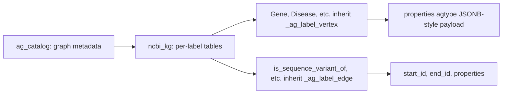

# Knowledge graph on the server: A to Z reference

This doc is the single source of truth for the live PostgreSQL + AGE knowledge graph that runs on the Hetzner CPX42 VPS at `46.225.128.133`. It covers what is in the database, how it is laid out, how to connect, how to query without hitting the slow paths, what is indexed, what is not, how to maintain it, and what to do when something breaks. Read it before opening psql against the production graph for the first time.

## Table of contents

- [A. What lives on the server](#a-what-lives-on-the-server)
- [B. Box and software versions](#b-box-and-software-versions)
- [C. Database and graph layout](#c-database-and-graph-layout)
- [D. Vertex labels and counts](#d-vertex-labels-and-counts)
- [E. Edge labels and counts](#e-edge-labels-and-counts)
- [F. CURIE prefixes you will encounter](#f-curie-prefixes-you-will-encounter)
- [G. Connection and session prelude](#g-connection-and-session-prelude)
- [H. The three rules of writing fast Cypher here](#h-the-three-rules-of-writing-fast-cypher-here)
- [I. Indexes that exist on the graph](#i-indexes-that-exist-on-the-graph)
- [J. Statistics and the planner](#j-statistics-and-the-planner)
- [K. Canonical smoke-test query suite](#k-canonical-smoke-test-query-suite)
- [L. Performance baseline and what slow looks like](#l-performance-baseline-and-what-slow-looks-like)
- [M. Known data-quality issues](#m-known-data-quality-issues)
- [N. Maintenance and backups](#n-maintenance-and-backups)
- [O. Refreshing the graph (full reload)](#o-refreshing-the-graph-full-reload)
- [P. Cost and downgrade plan](#p-cost-and-downgrade-plan)
- [Q. What is NOT in scope for this graph](#q-what-is-not-in-scope-for-this-graph)
- [R. Troubleshooting playbook](#r-troubleshooting-playbook)

## A. What lives on the server

One PostgreSQL 15 cluster with one Apache AGE graph called `ncbi_kg`. The graph holds the merged 5-database BioLink-compliant knowledge graph produced by Phases 1 and 2 of System 1, which were Gene, ClinVar, MedGen, PubMed, and Taxonomy. It contains 115,406,761 nodes and 693,295,991 edges across 11 vertex labels and 14 edge labels. Every node and edge carries source provenance, so any fact in the graph can be linked back to its NCBI source record.

The graph is the production target for System 3, which is a separate repository. System 3 will issue Cypher queries against this graph at runtime. Nothing else writes to this graph.

## B. Box and software versions

| Component | Version | Notes |
|---|---|---|
| Hetzner cloud server | CPX42 | 8 vCPU, 16 GB RAM, 320 GB NVMe |
| Operating system | Ubuntu 22.04 LTS | |
| Swap | 16 GB file-backed at `/swapfile`, persistent via fstab | Added during age-load to absorb the curie_to_id dict spike |
| PostgreSQL | 15.17 | Default Ubuntu apt package |
| Apache AGE | 1.5.0 | Built from source against PG 15 headers |
| Database | `ncbi_kg` | Single database, default tablespace |
| Schema | `ncbi_kg` | The AGE graph creates a schema with the same name as the graph |
| auth | `pg_hba.conf` trust for `postgres` over `local` and `127.0.0.1/32` | Server is firewalled to SSH-only at the network level |

## C. Database and graph layout

Apache AGE stores a property graph inside Postgres tables. Every vertex label gets a SQL table named after it, and every edge label likewise. Two parent tables (`_ag_label_vertex` and `_ag_label_edge`) hold the inheritance roots; the per-label tables are children that inherit columns and add a `properties agtype` column. AGE also maintains a `ag_catalog` schema with metadata.



A row in `ncbi_kg."Gene"` looks like this in raw SQL:

```text
        id        |                       properties
------------------+-----------------------------------------------------------------
 844424943782239  | {"id":"NCBIGene:1131","name":"cholinergic ...","source":"NCBI Gene"}
```

The Cypher engine wraps this so that `MATCH (g:Gene {id:'NCBIGene:1131'})` reads the same row.

## D. Vertex labels and counts

| Label | Rows | Source | Typical CURIE prefix |
|---|---|---|---|
| Article | 40,387,670 | PubMed | PMID: |
| Gene | 67,536,325 | NCBI Gene + orthologs | NCBIGene: |
| SequenceVariant | 4,467,468 | ClinVar | ClinVar: |
| OrganismTaxon | 2,736,611 | NCBI Taxonomy | NCBITaxon: |
| Disease | 200,845 | MedGen | MedGen:, occasionally MONDO: |
| BiologicalProcess | small | GO via Gene | GO: |
| MolecularActivity | small | GO via Gene | GO: |
| CellularComponent | small | GO via Gene | GO: |
| OntologyClass | small | MeSH via PubMed | MeSH: |
| PhenotypicFeature | small | MedGen | HP:, MedGen: |
| NamedThing | ~81K | dangling-endpoint stubs from merger | mixed prefixes |

Total: 115,406,761 nodes.

## E. Edge labels and counts

| Edge label | Rows | Endpoints (typical) |
|---|---|---|
| has_mesh_annotation | 349,158,184 | Article to OntologyClass |
| mentioned_in | 124,014,037 | Gene to Article |
| in_taxon | 67,536,348 | Gene to OrganismTaxon |
| actively_involved_in | 44,831,987 | Gene to MolecularActivity |
| participates_in | 40,767,983 | Gene to BiologicalProcess |
| located_in | 31,890,737 | Gene to CellularComponent |
| orthologous_to | 17,418,089 | Gene to Gene |
| has_phenotype | 6,076,735 | Disease to PhenotypicFeature |
| is_sequence_variant_of | 4,407,252 | SequenceVariant to Gene |
| cited_in | 3,924,906 | Article to Article |
| subclass_of | 2,832,513 | OntologyClass to OntologyClass |
| close_match | 410,000 | mixed |
| gene_associated_with_condition | 7,648 | Gene to Disease |
| exact_match | 970 | mixed |

Total: 693,295,991 edges.

## F. CURIE prefixes you will encounter

A CURIE is a compact identifier of the form `prefix:localid`. The graph uses these prefixes:

| Prefix | Meaning | Example |
|---|---|---|
| NCBIGene | NCBI Gene database | NCBIGene:672 (BRCA1) |
| ClinVar | ClinVar variant accession | ClinVar:17660 |
| MedGen | MedGen concept unique ID | MedGen:C0031485 (phenylketonuria) |
| PMID | PubMed article ID | PMID:34567890 |
| NCBITaxon | NCBI Taxonomy taxon | NCBITaxon:9606 (human) |
| GO | Gene Ontology term | GO:0006096 |
| MeSH | Medical Subject Headings | MeSH:D012345 |
| HP | Human Phenotype Ontology | HP:0001250 |
| MONDO | Mondo Disease Ontology | MONDO:0009861 (rare; only when MedGen had a confirmed mapping) |

Important gotcha: most diseases are stored under MedGen prefix, not MONDO. The original test suite assumed MONDO; the corrected suite uses MedGen. To discover the right prefix for a given concept, run `MATCH (n:Disease) WHERE n.name =~ '(?i).*your_term.*' RETURN n.id LIMIT 5`.

## G. Connection and session prelude

SSH and open psql:

```bash
ssh root@46.225.128.133
sudo -u postgres psql -d ncbi_kg
```

Every psql session that wants to write Cypher needs this prelude (AGE does not auto-load on connect):

```sql
LOAD 'age';
SET search_path = ag_catalog, "$user", public;
\timing on
```

Place this in `~/.psqlrc` for the postgres user if you want it automatic. The `\timing on` line is optional but recommended; every Cypher example below assumes you can see ms numbers.

Cypher is invoked through the `cypher()` SQL function:

```sql
SELECT * FROM cypher('ncbi_kg', $$
    MATCH (n:Gene {id: 'NCBIGene:672'}) RETURN n.name LIMIT 1
$$) as (name agtype);
```

The trailing `as (...)` clause is mandatory. Its column count and types must match the `RETURN`.

## H. The three rules of writing fast Cypher here

These three rules cover 95% of performance problems on this graph. Internalize them before writing any production query.

Rule 1: always specify the edge label. Write `[:is_sequence_variant_of]`, never `[r]`. AGE compiles untyped edges to a UNION ALL across all 14 edge tables, which is always slow. The first BRCA1 query went from 4 minutes 17 seconds to 229 ms when the edge label was added.

Rule 2: match by `id` whenever possible, and use the right CURIE prefix. The `id` field is GIN-indexed on the four largest vertex labels. Matching by `name` falls back to a sequential scan unless the result set is naturally tiny. If you do not know the right CURIE prefix, look it up first with a small `MATCH ... LIMIT 5` exploratory query, then use it in the real query.

Rule 3: keep regex matches narrow. `WHERE n.name =~ '(?i).*foo.*'` cannot use any index, ever. It is fine when applied to a small label like BiologicalProcess (Q3 returns in 218 ms) or after another filter has already pruned the result set. It is a death sentence on Article (40M rows) or Gene (67M rows). When you need full-text search, write a SQL query against the underlying table with a `pg_trgm` GIN index, not Cypher.

## I. Indexes that exist on the graph

Indexing was completed in three passes. Only the Gate 3 close-out pass produces sub-second Cypher; without it, every MATCH falls back to seq scan.

Pass 1 (loader Step 8, 2026-04-22): B-tree functional index on `agtype_to_text(properties -> '"id"')` for every vertex label. Useful for raw-SQL `WHERE agtype_to_text(...) = 'X'` lookups (which is what the loader's edge-resolution code uses internally), but does not help Cypher because the engine emits a `properties @> '{"id":"X"}'::agtype` containment filter that B-tree functional indexes cannot serve.

Pass 2 (Gate 3 close-out, 2026-04-22): GIN indexes on the `properties` column for Gene, Disease, BiologicalProcess, SequenceVariant. GIN supports the `@>` containment operator, so these are the indexes Cypher MATCH-by-property actually uses. Other vertex labels (Article, Taxon, etc.) will get GIN added the first time a query needs them.

Pass 3 (Gate 3 close-out, 2026-04-22): B-tree on `start_id` and `end_id` for every edge label table. Required so that any relationship traversal uses an index lookup rather than a seq scan + hash join across the entire edge table.

Inspect the live index list with:

```sql
SELECT indexname, tablename FROM pg_indexes WHERE schemaname='ncbi_kg' ORDER BY tablename, indexname;
```

The loader's [index_builder.py](system-02-knowledge-graph/loader/index_builder.py) is being updated so the next deploy gets all three passes automatically as Step 8.

## J. Statistics and the planner

Postgres stores per-table row counts and per-column distribution histograms in `pg_class.reltuples` and `pg_statistic`. The query planner uses these to estimate join cardinality and pick the right plan. On a freshly bulk-loaded table, both are stale or zero, so the planner falls back to defaults (assume 1000 rows, uniform distribution) and picks bad plans. This is the reason Q2 took 2 minutes 23 seconds even with the correct indexes in place.

The Gate 3 close-out runs `ANALYZE` on every vertex and edge table, which reads a sample of each table and writes fresh statistics back into the catalogs. The same pass should be repeated whenever a large change happens, for example a full data refresh or a new edge bulk insert. Routine writes are picked up by autovacuum within a few minutes; manual ANALYZE is only needed after bulk operations.

Inspect statistics with:

```sql
SELECT relname, reltuples, relpages FROM pg_class
WHERE relnamespace='ncbi_kg'::regnamespace ORDER BY reltuples DESC;
```

## K. Canonical smoke-test query suite

The reference query suite lives at [tests/cypher/gate3_queries.sql](tests/cypher/gate3_queries.sql) in the repo and is the file to run after any maintenance change to confirm the graph still answers correctly. It contains seven queries covering BRCA1 traversal, PKU disease lookup, glucose-metabolism gene listing, TP53 article citations, human-taxon membership, vertex counts, and edge counts.

Run it with:

```bash
sudo -u postgres psql -d ncbi_kg -f /tmp/gate3_queries.sql
```

Save the dated output alongside the suite file as [tests/cypher/gate3_results_YYYY-MM-DD.txt](tests/cypher/). Comparing two consecutive runs is the simplest regression test for the graph.

## L. Performance baseline and what slow looks like

These are the indexed-query baselines on the CPX42, post-tuning. Anything significantly above these numbers indicates either a missing index, stale statistics, or a query that hit one of the three slow patterns in section H.

| Query shape | Expected time | Notes |
|---|---|---|
| MATCH by `id` on Gene, Disease, BioProcess, SeqVariant | under 50 ms | GIN index hit |
| Single-hop traversal with typed edge from a small node | under 500 ms | both endpoint indexes used |
| Single-hop traversal with typed edge from one of millions of starting nodes | 1 to 5 seconds | bounded by edge-table scan |
| Two-hop traversal | 1 to 10 seconds | scales with intermediate fan-out |
| Regex match on small label | 100 to 500 ms | seq scan but on small data |
| Regex match on Article or Gene | tens of seconds | avoid; use SQL with pg_trgm |
| Untyped edge `[r]` | seconds to minutes | always avoid |

If a query falls outside its expected band, run `EXPLAIN` (without `ANALYZE`, to avoid actually executing) on the SQL form:

```sql
EXPLAIN SELECT * FROM cypher('ncbi_kg', $$ ... $$) as (...);
```

A `Seq Scan` on a label table is the smoking gun for a missing GIN. A `Materialize` over `Append` of every edge label is the smoking gun for an untyped edge.

## M. Known data-quality issues

These are tracked in this section so the next person to hit them does not waste an hour debugging.

MedGen Disease nodes have `name` populated with source-vocabulary codes such as `"SNOMEDCT_US"` instead of human-readable disease names. Q2 returned `dname = "SNOMEDCT_US"` for phenylketonuria. The id and edges are correct; only the display name is corrupt. Root cause is in the MedGen ETL parser in Phase 1; fix queued as a Phase-2 followup.

MedGen disease IDs use the `MedGen:` prefix and do not use `MONDO:` except in the rare cases where the MedGen ETL found a confirmed cross-reference. Do not assume MONDO. If a query returns 0 rows and you expected results, check that you used the right prefix for the label.

A small number of dangling endpoints (~81K) are filled with `NamedThing` stub nodes injected by the merger to keep the graph internally consistent. These nodes have minimal properties and exist only so traversals do not break. If a query result lands on a NamedThing, the upstream ETL that should have produced the real node had a gap.

## N. Maintenance and backups

The graph is read-mostly. There is no autovacuum bloat concern under normal use because nothing writes to it after the bulk load. The only maintenance items are:

Snapshot via the Hetzner console after any major change. Costs about $1 to $2 per month per snapshot. This is the disaster-recovery backup; restoring takes about 10 to 20 minutes.

Re-run `ANALYZE` if you ever bulk-insert new edges or vertices, for example a future data refresh. The standard one-liner:

```sql
ANALYZE ncbi_kg.\"Gene\"; -- repeat per affected table, or just ANALYZE; for the whole DB
```

Vacuum is not required after bulk loads on append-only tables, but `VACUUM ANALYZE` once a quarter does no harm and updates visibility maps that speed up index-only scans.

There is no incremental backup. The bytes that matter are the data directory at `/var/lib/postgresql/15/main/`. To create a snapshot manually:

```bash
sudo -u postgres pg_dump -Fc -d ncbi_kg -f /root/ncbi_kg_$(date +%Y%m%d).dump
```

A `pg_dump` of this graph is roughly 60 to 100 GB. It is not part of the regular workflow; the Hetzner snapshot is the primary backup.

## O. Refreshing the graph (full reload)

A full refresh is rerunning Phase 1 (ETL all 5 databases from FTP), Phase 2 (merge to a single KGX), and Phase 4 (rsync + age-load). It is a multi-day operation. Before starting:

1. Take a Hetzner snapshot of the current state, in case the new load is broken and you need to roll back.
2. Temporarily upgrade the VPS from CPX32 (steady state) to CPX42 (load window) for the duration of age-load; downgrade back after.
3. Run the loader with `--drop-existing` to clear the old graph before loading the new one. Do not try to do an incremental refresh; the curie_to_id dict design assumes a clean target.
4. Run the post-load tuning pass (GIN, edge B-trees, ANALYZE). The updated `index_builder.py` does this as Step 8 automatically; if you bypass the loader, run them by hand.
5. Re-run the smoke-test suite and diff against the previous run.

## P. Cost and downgrade plan

Steady state after Gate 3 close-out is approximately $24 per month on Hetzner CPX32 (8 vCPU, 16 GB RAM, 240 GB disk). The CPX42 we provisioned for the load is roughly $34 per month and will be downgraded after the snapshot is taken. Bandwidth on Hetzner is metered but the included quota (20 TB per month) is far above anything System 3 will ever use.

Downgrade procedure (only after a verified snapshot):

1. Stop Postgres: `sudo systemctl stop postgresql`
2. Hetzner console: rescale CPX42 to CPX32. Disk shrinks from 320 GB to 240 GB.
3. Wait for reboot, start Postgres: `sudo systemctl start postgresql`
4. Run the smoke-test suite to confirm everything still works.

The graph data on disk is roughly 95 to 150 GB steady state, so 240 GB is comfortable.

## Q. What is NOT in scope for this graph

Several things are deliberately not in this graph. Avoid the temptation to add them ad hoc.

dbSNP is excluded. The 1.2B variant records would not fit, and the use case (allele frequency lookup by rs#) is better served by the live NCBI dbSNP REST API at query time, which is what System 3 will do. See DECISIONS row 66.

PubChem, SRA, dbGaP are excluded. SRA is raw sequencing reads (analysis pipelines, not search). dbGaP is controlled-access (IRB approval). PubChem is community-submitted with variable curation. See DECISIONS row 18.

Layer 2 enrichment data (variant annotations from third-party tools, expression data, drug bindings, etc.) is excluded. That data is meant to be fetched on demand by System 3 and joined at query time, not pre-ingested. See [docs/architecture/Three_layer_data_architecture.md](docs/architecture/Three_layer_data_architecture.md).

System 3 components (FastAPI, LangGraph, UI, MCP servers, channel integrations) are not in this repo and not on this server. They run elsewhere and connect to this graph as a client.

## R. Troubleshooting playbook

A query takes more than 30 seconds: kill it with `pg_terminate_backend(pid)`, then run `EXPLAIN` on the SQL form. Check for `Seq Scan` on a label table (missing GIN), `Append` over all edge tables (untyped edge), or a regex on a large label.

A connection hangs at the pg_hba prompt: confirm you are SSHed as root and that you used `sudo -u postgres psql`. The trust rules only apply to the `postgres` user on localhost.

A query returns 0 rows when you expected results: check the CURIE prefix. Run `MATCH (n:Label) WHERE n.name =~ '(?i).*term.*' RETURN n.id, n.name LIMIT 5` to discover the actual prefix and id format.

A query returns garbage in the `name` field: see Section M. The MedGen ETL has a known data-quality bug; the id and edges are still correct.

The disk is filling up: check `df -h /` first. The most likely cause is a forgotten `pg_dump` file in `/root` or a leftover KGX file. Do not delete anything inside `/var/lib/postgresql/`.

age-load fails midway with `relation "ncbi_kg.X" does not exist`: a vertex label is missing from the loader's `VERTEX_LABELS` constant in [system-02-knowledge-graph/loader/schema.py](system-02-knowledge-graph/loader/schema.py). Add the label, scp the file, retry. See Phase 4 Problem 8 in [docs/learnings.md](docs/learnings.md).

The Postgres process gets OOM-killed during a load: confirm swap is mounted (`free -h`); if not, `sudo swapon /swapfile`. If swap is heavily used (more than 10 GB), upgrade temporarily to CPX52 for the load window, then downgrade. See Phase 4 Problem 9 in [docs/learnings.md](docs/learnings.md).

## References

- Loader code: [system-02-knowledge-graph/loader/](system-02-knowledge-graph/loader/)
- Schema constants: [system-02-knowledge-graph/loader/schema.py](system-02-knowledge-graph/loader/schema.py) (VERTEX_LABELS)
- Index builder: [system-02-knowledge-graph/loader/index_builder.py](system-02-knowledge-graph/loader/index_builder.py)
- Smoke-test suite: [tests/cypher/gate3_queries.sql](tests/cypher/gate3_queries.sql)
- Latest smoke results: [tests/cypher/gate3_results_2026-04-22.txt](tests/cypher/gate3_results_2026-04-22.txt)
- Phase 4 narrative: [docs/learnings.md](docs/learnings.md) Problems 1 to 13 + Gate 3 outcome section
- Decisions log: [DECISIONS.md](DECISIONS.md) rows 67 to 79
- VPS setup: [docs/context/setup/setup-04_hetzner_vps.md](docs/context/setup/setup-04_hetzner_vps.md)
- AGE loader explainer: [docs/architecture/AGE_loader_explained.md](docs/architecture/AGE_loader_explained.md)
- Health sweep snapshot: [tests/cypher/health_sweep_2026-04-22.txt](tests/cypher/health_sweep_2026-04-22.txt)

Last updated: 2026-04-22
