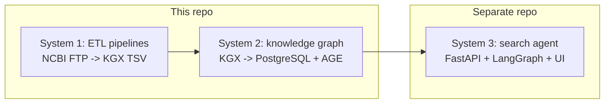

# Project overview A to Z

This is the single-source-of-truth navigation hub for the `agentic-search-data-engineering` repo. The repo builds System 1 (NCBI ETL pipelines) and System 2 (a PostgreSQL + Apache AGE knowledge graph) for an agentic search prototype over NCBI data. V1 is loaded on a Hetzner CPX42 VPS with 115.4M nodes and 693.3M edges; the 7 smoke Cypher queries pass. Read this doc first, then click through to the deeper docs linked in each section.

## Table of contents

- [A. Project goals and scope](#a-project-goals-and-scope)
- [B. Three-system architecture](#b-three-system-architecture)
- [C. V1 status snapshot](#c-v1-status-snapshot)
- [D. How the data was built](#d-how-the-data-was-built)
- [E. How the data was loaded](#e-how-the-data-was-loaded)
- [F. How to query the live graph](#f-how-to-query-the-live-graph)
- [G. Cost](#g-cost)
- [H. How decisions are tracked](#h-how-decisions-are-tracked)
- [I. How problems and learnings are tracked](#i-how-problems-and-learnings-are-tracked)
- [J. How the project was executed phase-by-phase](#j-how-the-project-was-executed-phase-by-phase)
- [K. Documentation map](#k-documentation-map)
- [L. Where the live data lives](#l-where-the-live-data-lives)
- [M. What is NOT in this repo](#m-what-is-not-in-this-repo)

## A. Project goals and scope

The goal is a queryable knowledge graph stitched from 5 NCBI databases (Gene, ClinVar, MedGen, PubMed, Taxonomy) with full provenance on every node and edge, served by a downstream agentic search system. This repo covers the data engineering and graph layers only. For framing, see [Innovation proposal 2026](context/Innovation_proposal_2026.md). For how this graph fits the broader three-layer query architecture (Layer 1 graph, Layer 2 on-demand API, Layer 3 enrichment), see [Three-layer data architecture](architecture/Three_layer_data_architecture.md).

## B. Three-system architecture

System 1 (ETL pipelines) and System 2 (knowledge graph) live in this repo. System 3 (search agent, FastAPI, LangGraph, UI, delivery channels) lives in a separate repository and is out of scope here.

A polished architecture diagram lives at [Architecture diagram](visualizations/Architecture_diagram.md) (TBD).

## C. V1 status snapshot

| Metric | Value |
|--------|-------|
| Nodes loaded | 115.4M |
| Edges loaded | 693.3M |
| Smoke Cypher queries passing | 7 of 7 |
| Host | Hetzner CPX42, 16 GB RAM, 360 GB NVMe |
| Monthly cost | ~$30 |
| Database | PostgreSQL 15.17 + Apache AGE 1.5.0 |

For full operational details (SSH, queries, indices, snapshot procedure), see [Knowledge graph on server reference](Knowledge_graph_on_server_reference.md).

## D. How the data was built

Every pipeline follows a 5-step pattern: download from NCBI FTP (idempotent), parse, map to BioLink categories and predicates, validate against the LinkML schema, and export as KGX TSV with provenance on every row. The 5 per-database KGX outputs are then streamed through a merger that dedupes nodes by canonical CURIE, injects stubs for dangling edges, and produces a single unified KGX bundle. For the BioLink mapping conventions and ontology choices, see [Data mapping and ontology explained](architecture/Data_mapping_and_ontology_explained.md). For the merge algorithm, see [Merge logic explained](architecture/Merge_logic_explained.md).

## E. How the data was loaded

The AGE loader (`system-02-knowledge-graph/loader/`) reads the merged KGX bundle, builds a `curie_to_id` mapping, and bulk-loads nodes then edges into AGE using `COPY` for throughput. Indices on `id`, `category`, and edge endpoints are created after load. RAM tuning, swap, and memory bounds matter at this scale. For first-principles design and tuning, see [AGE loader explained](architecture/AGE_loader_explained.md). For the actual problems hit during cloud load (missing NamedThing table, OOM at 16 GB, quoted multi-line abstract mismatches), see [Learnings](learnings.md) Problems 12 to 14.

## F. How to query the live graph

SSH access, openCypher examples, the 7 smoke queries, and index listings are documented in [Knowledge graph on server reference](Knowledge_graph_on_server_reference.md), Sections G and H.

## G. Cost

The full V1 graph runs at roughly $30 per month on a Hetzner CPX42 VPS. See the [Monthly cost](../README.md#monthly-cost) table in the README for the breakdown, and [DECISIONS.md](../DECISIONS.md) row 80 for the host-selection rationale (Hetzner versus Netcup versus Contabo, EU versus US).

## H. How decisions are tracked

Non-trivial choices, between alternatives, get a row in [DECISIONS.md](../DECISIONS.md). The format is a single append-only table: date, decision, alternatives considered, why. The rule is in [.claude/rules/decision-logging.md](../.claude/rules/decision-logging.md). Entries are never deleted; the file is the historical record.

## I. How problems and learnings are tracked

Every problem hit during a pipeline or load run, plus its root cause and fix, gets logged to [docs/learnings.md](learnings.md). Numbered problems make them citable from commit messages and other docs (for example, "see learnings.md Problem 12").

## J. How the project was executed phase-by-phase

The build was sequenced into phases (1.0 schema, 1.x ETL pipelines, 2.x merge, 3.0 AGE loader code, 4.0 cloud deploy) with a gate at each phase boundary. The full plan, status per phase, and gate criteria live in [docs/bossman_execution_plan.md](bossman_execution_plan.md).

## K. Documentation map

- [docs/Knowledge_graph_on_server_reference.md](Knowledge_graph_on_server_reference.md): A-to-Z operations guide for the live V1 graph on Hetzner.
- [docs/architecture/Data_mapping_and_ontology_explained.md](architecture/Data_mapping_and_ontology_explained.md): BioLink categories, predicates, CURIE conventions, ontology choices, per-pipeline mapping rules.
- [docs/architecture/Technical_reference_data_engineering.md](architecture/Technical_reference_data_engineering.md): A-Z technical walkthrough of the V1 system (architecture, schema, indexing, performance baselines).
- [docs/visualizations/](visualizations/): Architecture diagram, schema diagram, KGX flow diagrams (TBD).
- [docs/architecture/Three_layer_data_architecture.md](architecture/Three_layer_data_architecture.md): Layer 1 graph, Layer 2 on-demand API, Layer 3 enrichment.
- [docs/architecture/Merge_logic_explained.md](architecture/Merge_logic_explained.md): Streaming merge, dedup, stub injection, dangling-edge detection.
- [docs/architecture/AGE_loader_explained.md](architecture/AGE_loader_explained.md): KG structure, why AGE over Neo4j, performance, hosting comparison.
- [docs/architecture/Biolink_repos_explained.md](architecture/Biolink_repos_explained.md): BioLink and LinkML reference for schema design.
- [docs/bossman_execution_plan.md](bossman_execution_plan.md): Phase-by-phase plan with gates and deliverables.
- [docs/learnings.md](learnings.md): Numbered problems and solutions log.
- [docs/data_inventory.md](data_inventory.md): What was downloaded, FTP URLs, sizes, row counts, validation outcomes.
- [docs/System_1_data_engineering_plan.md](System_1_data_engineering_plan.md): Detailed ETL design for all 5 pipelines.
- [docs/System_3_architecture_brainstorming.md](System_3_architecture_brainstorming.md): Notes on the downstream search agent (separate repo).
- [DECISIONS.md](../DECISIONS.md): Append-only decision log.
- [CLAUDE.md](../CLAUDE.md) / [AGENTS.md](../AGENTS.md) / [README.md](../README.md): Agent instructions, agent index, public-facing repo overview.
- [schema/biolink_ncbi.yaml](../schema/biolink_ncbi.yaml): LinkML schema with 10 node types and 14 predicates.

## L. Where the live data lives

The V1 graph runs on a Hetzner CPX42 VPS in the EU, with PostgreSQL 15.17 and Apache AGE 1.5.0. SSH access, Cypher entry, snapshot, and restore procedures are in [Knowledge graph on server reference](Knowledge_graph_on_server_reference.md). Raw KGX files used for the load are also rsynced to the VPS (144 GB).

## M. What is NOT in this repo

- System 3: the search agent (FastAPI, LangGraph, UI, MCP servers, delivery channels) lives in a separate repository.
- Layer 2 on-demand API and Layer 3 enrichment: these are query-time concerns handled in the System 3 repo. See [Three-layer data architecture](architecture/Three_layer_data_architecture.md) for the boundary.
- Raw FTP caches and large binaries: gitignored under `data/raw/` and `data/ftp_cache/`; rsynced separately to the VPS.
