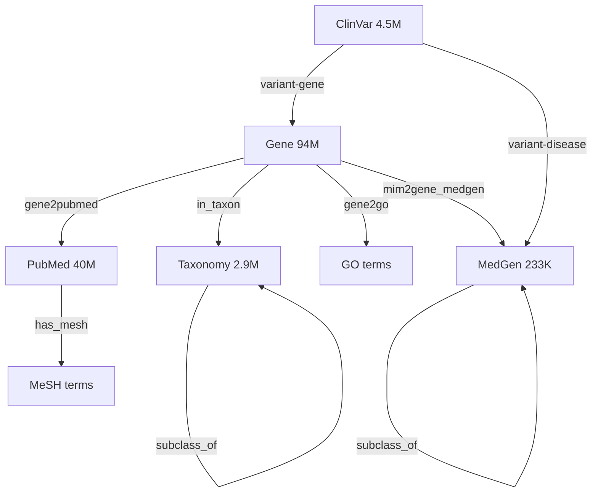
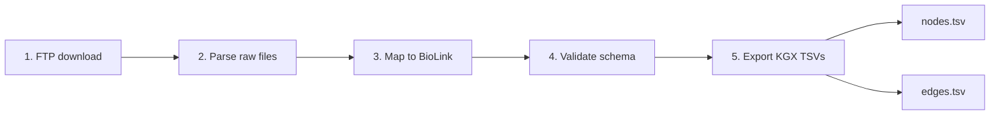

# System 1: data engineering plan

What we are building, why, and how. Crystallized from the April 2 brainstorming session (Agentic_search_architecture_QA.md) and the April 5 architecture review.

## Table of contents

- [The problem](#the-problem)
- [What System 1 does](#what-system-1-does)
- [Architecture overview](#architecture-overview)
- [The three-layer data architecture](#the-three-layer-data-architecture)
- [Why these 5 databases (evidence)](#why-these-5-databases-evidence)
- [What data we need (FTP downloads)](#what-data-we-need-ftp-downloads)
- [KGX output size estimates](#kgx-output-size-estimates)
- [Pipeline architecture (per database)](#pipeline-architecture-per-database)
- [Provenance: first-class requirement](#provenance-first-class-requirement)
- [Schema: where it lives](#schema-where-it-lives)
- [Build order](#build-order)
- [What "done" looks like for System 1](#what-done-looks-like-for-system-1)
- [What System 1 does NOT do](#what-system-1-does-not-do)
- [Repo structure decision](#repo-structure-decision)
- [How System 2 connects](#how-system-2-connects)
- [Graph database options](#graph-database-options)
- [Validation: how to know System 1 is working](#validation-how-to-know-system-1-is-working)
- [Prerequisites (before writing the first pipeline)](#prerequisites-before-writing-the-first-pipeline)
- [Update schedules (how often FTP sources refresh)](#update-schedules-how-often-ftp-sources-refresh)
- [Shared utilities (reusable across all pipelines)](#shared-utilities-reusable-across-all-pipelines)
- [Risk signals and fallback plans](#risk-signals-and-fallback-plans)
- [Wall-clock time (things that take real time regardless of coding speed)](#wall-clock-time-things-that-take-real-time-regardless-of-coding-speed)
- [Lessons from Anne's glucose metabolism KG pipeline](#lessons-from-annes-glucose-metabolism-kg-pipeline)
- [Architecture diagram checklist](#architecture-diagram-checklist)
- [Decisions made during April 5 architecture review](#decisions-made-during-april-5-architecture-review)

---

## The problem

NCBI has 39 databases containing 4.4 billion records. A researcher investigating a single question (e.g. "what variants in HNF1A cause MODY?") must manually visit 4-6 databases, copy identifiers between them, and mentally assemble the connections. The bottleneck is not finding data, it is connecting findings across databases.

## What System 1 does

System 1 extracts data from 5 core NCBI databases (Gene, ClinVar, MedGen, PubMed, Taxonomy), transforms it into BioLink-compliant KGX files, and prepares it for loading into the knowledge graph (System 2). PMC remains in Layer 2 (on-demand via API at query time). dbSNP is deferred from V1; population frequency queries are handled by the NCBI dbSNP REST API at query time in System 3.

System 1 produces the raw materials. System 2 assembles and serves them.

```
System 1 boundary:
  Input:  NCBI FTP bulk files + mapping files
  Output: Per-database KGX files (nodes.tsv + edges.tsv), BioLink-compliant
          with provenance on every node and edge

System 2 boundary:
  Input:  KGX files from System 1
  Output: Merged knowledge graph in PostgreSQL + Apache AGE, queryable via openCypher
```

---

## Architecture overview

```
                        NCBI FTP Servers
                    (public, free, bulk data)
                              |
              +---------------+---------------+
              |               |               |
         gene_info.gz    ClinVar XML     MedGen dump
         gene2go.gz      variant_summary  MedGenIDMappings
         gene2pubmed.gz  var_citations    MGREL
              |               |               |
              v               v               v
        +-----------+  +-----------+  +-----------+
        | Gene ETL  |  | ClinVar   |  | MedGen    |
        | Pipeline  |  | ETL       |  | ETL       |
        +-----------+  +-----------+  +-----------+
              |               |               |
              v               v               v
        +-------------------------------------------+
        |        BioLink Mapper + Validator          |
        |  (maps to BioLink categories/predicates,   |
        |   attaches provenance, validates schema)   |
        +-------------------------------------------+
              |               |               |
              v               v               v
        +-----------+  +-----------+  +-----------+
        | Gene KGX  |  | ClinVar   |  | MedGen    |
        | nodes.tsv |  | KGX       |  | KGX       |
        | edges.tsv |  |           |  |           |
        +-----------+  +-----------+  +-----------+
              |               |               |
              +-------+-------+-------+-------+
                      |               |
                +-----+-----+  +-----+-----+
                | PubMed    |  | Taxonomy   |
                | KGX       |  | KGX        |
                | (40M)     |  | (2.9M)     |
                +-----+-----+  +-----+-----+
                      |               |
                      v               v
              +------------------------------------------+
              |   All 5 KGX file sets ready              |
              |   for System 2 (merge +                  |
              |   normalize + AGE load)                  |
              +------------------------------------------+
```

---

## The three-layer data architecture

Not all data lives in the same place. Three layers, each with a different purpose:

### Layer 1: knowledge graph (fully ingested, 5 databases)

These 5 databases are fully downloaded from FTP, parsed, mapped to BioLink, and loaded into PostgreSQL + Apache AGE. The agent queries these via openCypher in milliseconds.

| Database | Records | BioLink category | Why it's in Layer 1 |
|---|---|---|---|
| Gene | 94M (all organisms) | `biolink:Gene` | Biology hub. 33 outbound link types. Connects to everything. |
| PubMed | 40M articles | `biolink:Article` | Universal connector. 47 link types to 25+ databases. Literature is the glue. |
| ClinVar | 4.5M variants | `biolink:SequenceVariant` | Variant-disease associations. Without it, can't go from variant to disease. |
| MedGen | 233K concepts | `biolink:Disease` | Disease concept hub. Maps MONDO, OMIM, MeSH, SNOMED, HPO to one concept. |
| Taxonomy | 2.9M organisms | `biolink:OrganismTaxon` | Scopes results to human (or any organism). Gene has 94M records across all species. Full tree downloaded. |

Selection criteria:
1. Connectivity: Gene (33 links) and PubMed (47 links) are the two highest-connectivity databases that are feasibly sized
2. SME feedback: every failed query in March 2026 testing failed because ClinVar, MedGen, Taxonomy, or SNP was missing
3. Traversal completeness: these 5 databases appear in every core research traversal path. Remove any one and a path breaks. dbSNP variant queries are served by the NCBI dbSNP REST API at query time in System 3.

### Layer 2: on-demand API (30+ remaining databases)

Reached at query time via ELink/EFetch. Not ingested. The agent follows connections from Layer 1 nodes into these databases via live API calls.

Examples: PMC (12M full-text articles), dbSNP (1.2B variants, via NCBI REST API), Protein (1.57B records), Nucleotide (712M), Structure, OMIM, GTR, GEO, dbVar, Assembly.

Excluded from all layers: SRA (raw sequencing reads, consumed by analysis pipelines, not search), dbGaP (controlled-access, requires individual Data Access Requests with IRB approval), PubChem (community-submitted chemical compound data with varying curation levels, poor fit for a system where every fact must trace to an authoritative source).

Latency: 200-500ms per call. Budget: max 20 API calls per user query. Cached in Redis.

### Layer 3: research APIs (answer enrichment)

Not databases. These are specialized APIs that augment answers with deeper evidence:

| API | What it adds | When called |
|---|---|---|
| PubTator3 | Entity annotations on publications (genes, diseases, chemicals, mutations, species) | After PubMed results found |
| LitVar2 | Variant-specific literature links | After variants identified |
| LitSense | Sentence-level evidence from full text | After key publications identified |
| ClinicalTrials.gov | Active clinical trials for diseases/genes | After diseases identified |

---

## Why these 5 databases (evidence)



### Evidence 1: connectivity ranking from live API data (April 2, 2026)

We ran `einfo.fcgi` against all 39 databases and counted outbound link types:

| Rank | Database | Outbound links | In Layer 1? | Why/why not |
|---|---|---|---|---|
| 1 | PubMed | 47 | Yes | Highest connectivity, manageable size (30GB compressed FTP) |
| 2 | Protein | 38 | No | 1.57B records. Too large. Layer 2 via ELink. |
| 3 | Nucleotide | 37 | No | 712M records. Too large. Layer 2 via ELink. |
| 4 | Gene | 33 | Yes | Biology hub, manageable size (~2GB FTP) |
| 5 | PubChem | 28 | Excluded | Community-submitted data with varying curation. Not in any layer. |
| 6 | BioProject | 26 | No | Study metadata. Low direct research value. |

Gene and PubMed were chosen for connectivity AND size. Protein and Nucleotide have high connectivity but billions of records, so they go to Layer 2.

### Evidence 2: SME feedback defined the remaining 4

From March 2026 prototype testing (KG_prototype_feedback.md):

| Query that failed | Missing database | Why it failed |
|---|---|---|
| "What diseases are caused by variants in HNF1A?" | ClinVar, MedGen | No variant-disease or disease concept mapping |
| "What genes are associated with MODY?" | MedGen | No phenotypic series traversal |
| "Which genes have both deletions and SNVs?" | SNP | No variant type annotations. (dbSNP now deferred to System 3 API.) |
| "Describe the mutation spectrum for HNF1A" | SNP | No aggregate variant statistics. (dbSNP now deferred to System 3 API.) |
| "What genes are involved in glucose metabolism?" | Taxonomy | Can't scope Gene's 94M records to human |
| "What pathways does TP53 participate in?" | Taxonomy | Same organism scoping problem |

ClinVar, MedGen, and Taxonomy were chosen because real researchers asked real questions and the answers required these databases. SNP queries from this feedback are now served by the NCBI dbSNP REST API at query time in System 3.

### Evidence 3: traversal path completeness

Core research traversal paths from the NCBI cross-database link map:

```
Disease name:     MedGen -> ClinVar -> Gene -> Protein -> Structure
Gene symbol:      Gene -> ClinVar -> PubMed (SNP queries via System 3 API)
Clinical variant: ClinVar -> Gene -> GTR
Gene function:    Gene -> GO terms (via gene2go), scoped by Taxonomy
Literature:       PubMed -> Gene (via gene2pubmed) -> ClinVar -> MedGen
```

All 5 Layer 1 databases appear in these paths. SNP traversals are handled by the NCBI dbSNP REST API in System 3. The remaining databases (Protein, Structure, GTR) are reachable via Layer 2 ELink calls.

---

## What data we need (FTP downloads)

Principle: download everything available on FTP for each Layer 1 database. No cherry-picking, no "optional" files, no subsets. If a file exists in the FTP directory and contains data about the database's entities, download it. The file lists below are the known files; during pipeline build, inventory the actual FTP directory and add any files not listed here. Storage and processing strategy (incremental, streaming, cloud) are implementation decisions made later. The download scope is non-negotiable: all data.

### Gene pipeline

| FTP file | Size | What it contains | Edges it produces |
|---|---|---|---|
| `gene_info.gz` | ~2GB | Gene records: ID, symbol, synonyms, chromosome, dbXrefs (HGNC, OMIM, Ensembl) | Gene nodes + identifier normalization xrefs |
| `gene2go.gz` | ~200MB | Gene ID -> GO term mappings with evidence codes | Gene --[participates_in]--> BiologicalProcess/MolecularActivity/CellularComponent |
| `gene2pubmed.gz` | ~500MB | Gene ID -> PMID links | Gene --[mentioned_in]--> Publication |
| `gene_refseq_uniprotkb_collab.gz` | ~50MB | Gene ID -> UniProt accessions | Stored as xrefs on Gene nodes (UniProt IDs). No Protein nodes in Layer 1; Protein is reachable via Layer 2 ELink. |
| `mim2gene_medgen` | ~5MB | OMIM -> Gene ID -> MedGen CUI | Disease --[associated_with]--> Gene |
| `gene_orthologs.gz` | ~100MB | Cross-species ortholog mappings | Gene --[orthologous_to]--> Gene |

FTP path: `ftp.ncbi.nlm.nih.gov/gene/DATA/`

### ClinVar pipeline

| FTP file | Size | What it contains | Edges it produces |
|---|---|---|---|
| `ClinVarFullRelease.xml.gz` | ~2GB | Full variant records: Gene IDs, rs IDs, MedGen CUIs, OMIM, PMIDs, clinical significance, review status | Variant --[associated_with]--> Disease, Gene, Publication |
| `variant_summary.txt.gz` | ~500MB | Tabular summary: ClinVar accession, Gene, rs ID, HGVS, significance, condition | Same edges, lighter format for validation |
| `var_citations.txt` | ~50MB | ClinVar variation ID -> PMIDs and dbSNP/dbVar IDs | Variant --[cited_in]--> Publication |

FTP path: `ftp.ncbi.nlm.nih.gov/pub/clinvar/`

### MedGen pipeline

| FTP file | Size | What it contains | Edges it produces |
|---|---|---|---|
| `MedGenIDMappings.txt` | ~50MB | MedGen CUI -> MONDO, OMIM, Orphanet, MeSH, SNOMED, HPO | Disease node xrefs (ontology cross-references) |
| `MGREL` | ~20MB | MedGen concept relationships (broader, narrower, related) | Disease --[subclass_of]--> Disease (hierarchy) |
| `Names.RRF` or similar | ~30MB | Preferred names and synonyms for disease concepts | Disease node name and synonym properties |
| `medgen_pubmed_lnk.txt` | ~10MB | MedGen CUI -> PMID links | Disease --[mentioned_in]--> Publication |
| `MedGen_HPO_OMIM_Mapping.txt` | ~5MB | Additional HPO and OMIM cross-references | Disease node xrefs (strengthens ontology coverage) |

FTP path: `ftp.ncbi.nlm.nih.gov/pub/medgen/`

### PubMed pipeline

| FTP file | Size | What it contains | Edges it produces |
|---|---|---|---|
| PubMed baseline XMLs | ~30GB compressed | 40M+ article records: title, abstract, MeSH terms, publication date, authors | Publication nodes + Publication --[has_mesh_annotation]--> OntologyClass |
| Daily update files | ~100MB/day | New and modified records | Incremental updates |

FTP path: `ftp.ncbi.nlm.nih.gov/pubmed/baseline/`

Download the full baseline. No subset. gene2pubmed links span the entire history of PubMed, and subsetting would create millions of dangling edges to nonexistent article nodes.

### Taxonomy pipeline

Download the full taxonomy dump. All 2.9M organisms, full parent-child tree.

| FTP file | Size | What it contains | Edges it produces |
|---|---|---|---|
| `taxdump.tar.gz` | ~500MB | names.dmp (organism names), nodes.dmp (taxonomy tree with parent-child), division.dmp, gencode.dmp | OrganismTaxon --[subclass_of]--> OrganismTaxon (full lineage) |

FTP path: `ftp.ncbi.nlm.nih.gov/pub/taxonomy/`

### SNP pipeline (deferred from V1)

dbSNP (1.2B variants) is deferred from pre-ingestion. Population frequency and variant annotation queries are handled by the NCBI dbSNP REST API at query time in System 3. ClinVar nodes carry rs# identifiers as cross-references, so variant-to-SNP lookups remain possible without pre-ingesting dbSNP. Revisit if user research shows API latency is unacceptable.

---

## KGX output size estimates

Estimated output sizes after each pipeline completes. These drive disk planning and merge time expectations.

| Pipeline | Estimated nodes | Estimated edges | KGX TSV size estimate |
|---|---|---|---|
| Gene (all organisms) | ~94M | ~15M (gene2go) + ~25M (gene2pubmed) + ~94M (in_taxon) | ~40-60GB |
| Gene (human only, tax_id=9606) | ~62K | ~500K (gene2go) + ~600K (gene2pubmed) + ~62K (in_taxon) | ~2-3GB |
| ClinVar | ~4.5M variants | ~4.5M (variant-gene) + ~4.5M (variant-disease) | ~3-5GB |
| MedGen | ~233K diseases | ~500K (subclass_of + xref edges) | ~200MB |
| PubMed (full baseline) | ~40M articles | ~40M+ (MeSH edges) | ~30-50GB |
| Taxonomy | ~2.9M organisms | ~2.9M (parent edges) | ~1-2GB |

Total across all 5 pipelines (all organisms): ~115M nodes, ~693M edges, ~75-95GB KGX TSV.

---

## Pipeline architecture (per database)



Each pipeline follows the same 5-step pattern:

```
Step 1: Download
  FTP bulk download -> raw files stored in local data/ftp_cache/
  Idempotent: skip if file hasn't changed (check FTP timestamp)

Step 2: Parse
  Database-specific parser reads the raw format (XML, TSV, dump files)
  Extracts records with all fields needed for BioLink mapping
  Output: parsed records (Python objects or intermediate JSON)

Step 3: Map to BioLink
  Each record gets:
    - category: BioLink class (e.g. biolink:Gene)
    - id: canonical identifier with prefix (e.g. NCBIGene:672)
    - name: human-readable label
    - xrefs: list of alternative identifiers from other systems
    - source_url: clickable link to the original NCBI page
  Each relationship gets:
    - subject: source node ID
    - predicate: BioLink predicate (e.g. biolink:gene_associated_with_condition)
    - object: target node ID
    - source: which database this edge came from
    - source_url: clickable link to the source record
    - provenance properties: assertion type, review status, evidence code (where available)

Step 4: Validate
  Run BioLink validator on every node and edge
  Reject records that don't conform to the schema
  Log rejected records with reason (for debugging, not for silent discard)

Step 5: Export KGX
  Write validated records to KGX format:
    - nodes.tsv: id, category, name, xrefs, source_url, [additional properties]
    - edges.tsv: subject, predicate, object, source, source_url, [provenance properties]
  One KGX file pair per database (Gene KGX, ClinVar KGX, etc.)
```

---

## Provenance: first-class requirement

Every node and every edge carries its source. This is not optional. Trust is the moat.

### Node provenance

```
id: NCBIGene:672
category: biolink:Gene
name: BRCA1
source: NCBI Gene
source_url: https://www.ncbi.nlm.nih.gov/gene/672
xrefs: [HGNC:1100, OMIM:113705, Ensembl:ENSG00000012048]
```

### Edge provenance

```
subject: ClinVar:VCV000017599
predicate: biolink:is_sequence_variant_of
object: NCBIGene:672
source: ClinVar
source_url: https://www.ncbi.nlm.nih.gov/clinvar/variation/17599/
clinical_significance: Pathogenic
review_status: reviewed by expert panel
supporting_publications: [PMID:12345678, PMID:23456789]
```

### Why this matters

If the answer says "BRCA1 has 744 pathogenic variants," the user can click through to every single one. Every fact is verifiable. Every connection is traceable. This is what separates a knowledge graph from a search engine.

---

## Schema: where it lives

The BioLink schema is a shared artifact that lives at the repo root (`schema/biolink_ncbi.yaml`). Both System 1 (for mapping and validation) and System 2 (for graph loading) consume it. It is defined once, before any pipeline code, and updated when new node types or predicates are needed.

### Node types (from our 5 databases)

| BioLink category | Canonical ID prefix | Source database | Fallback ID if canonical unavailable |
|---|---|---|---|
| `biolink:Gene` | NCBIGene: | Gene | (always available) |
| `biolink:SequenceVariant` | ClinVar: | ClinVar | dbSNP rs# IDs available via ClinVar cross-references |
| `biolink:Disease` | MONDO: | MedGen | MedGen CUI (e.g. MedGen:C0031485) |
| `biolink:PhenotypicFeature` | HP: | MedGen | MedGen CUI |
| `biolink:Article` | PMID: | PubMed | (always available) |
| `biolink:OrganismTaxon` | NCBITaxon: | Taxonomy | (always available) |
| `biolink:BiologicalProcess` | GO: | gene2go | (always available) |
| `biolink:MolecularActivity` | GO: | gene2go | (always available) |
| `biolink:CellularComponent` | GO: | gene2go | (always available) |
| `biolink:OntologyClass` | MeSH: | PubMed | (always available) |

### Edge types (predicates)

| BioLink predicate | Subject | Object | Source file |
|---|---|---|---|
| `biolink:gene_associated_with_condition` | Gene | Disease | mim2gene_medgen, ClinVar XML |
| `biolink:is_sequence_variant_of` | SequenceVariant | Gene | ClinVar XML |
| `biolink:has_phenotype` | SequenceVariant | Disease | ClinVar XML |
| `biolink:participates_in` | Gene | BiologicalProcess | gene2go |
| `biolink:actively_involved_in` | Gene | MolecularActivity | gene2go |
| `biolink:located_in` | Gene | CellularComponent | gene2go |
| `biolink:mentioned_in` / `biolink:related_to` | Gene | Article | gene2pubmed |
| `biolink:has_mesh_annotation` | Article | OntologyClass | PubMed XML |
| `biolink:in_taxon` | Gene | OrganismTaxon | gene_info |
| `biolink:subclass_of` | OrganismTaxon | OrganismTaxon | taxdump |
| `biolink:subclass_of` | Disease | Disease | MGREL |
| `biolink:close_match` / `biolink:exact_match` | Disease | Disease | MedGenIDMappings (xrefs) |

### Handling ontology gaps

Not every record has every ontology mapping. The plan:

1. Keep every record. Never drop data because of missing mappings.
2. Use canonical ID when available (MONDO for diseases, NCBIGene for genes).
3. Fall back to native ID when canonical isn't available (MedGen CUI instead of MONDO).
4. Store all alternative IDs in the xrefs property for future resolution.
5. Multi-hop traversal handles the rest. A PubMed article reaches a disease through: Article -> MeSH -> MedGen -> MONDO.

Coverage estimates:

| Mapping | Coverage | Gap handling |
|---|---|---|
| MedGen CUI -> MONDO | ~70-80% | Use MedGen CUI as fallback ID |
| PubMed -> MeSH | ~90% | Unindexed articles still have gene2pubmed links |
| Gene -> GO terms | High for human, lower for other organisms | Genes without GO terms still connect via gene2pubmed and ClinVar |
| ClinVar -> Gene ID | ~95%+ | Rare unmapped variants stay as orphan nodes |
| ClinVar -> MedGen CUI | ~90%+ | Variants without condition still connect to Gene |

---

## Build order

### Phase 1: the core triangle (Gene + ClinVar + MedGen)

Why first: these three databases have the richest cross-references to each other. `mim2gene_medgen` directly maps all three. ClinVar XML references Gene IDs and MedGen CUIs in every record. Once you have this triangle, every subsequent database connects to existing nodes rather than creating islands.

| Step | What | Output | Validates |
|---|---|---|---|
| 1a | Define shared LinkML schema (node types, edge types, required properties) in `schema/` at repo root | `schema/biolink_ncbi.yaml` | Schema is parseable and BioLink-compliant, importable by both System 1 and System 2 |
| 1b | Gene ETL pipeline: download gene_info, gene2go, gene2pubmed from FTP | Gene KGX (nodes.tsv + edges.tsv) | Gene nodes have NCBIGene: IDs, xrefs include HGNC/OMIM |
| 1c | ClinVar ETL pipeline: download ClinVarFullRelease.xml from FTP | ClinVar KGX | Variant nodes link to Gene IDs and MedGen CUIs |
| 1d | MedGen ETL pipeline: download MedGenIDMappings and MGREL from FTP | MedGen KGX | Disease nodes have MONDO IDs (where available) and xrefs |
| 1e | Write SSSOM mapping files for Gene-HGNC, ClinVar-MONDO (via MedGen), Gene-GO | `mappings/*.sssom.tsv` | Every mapping decision is recorded with confidence |
| 1f | First merge test: combine 3 KGX files, check node deduplication | Merge report (nodes before/after, duplicates found) | Same Gene ID from Gene and ClinVar resolves to one node |

Test queries after Phase 1:
- "Find all pathogenic variants in BRCA1" (Gene -> ClinVar)
- "What diseases are associated with HNF1A?" (Gene -> ClinVar -> MedGen)
- "What genes are associated with phenylketonuria?" (MedGen -> ClinVar -> Gene)

### Phase 2: literature and full organism context (PubMed + Taxonomy)

Why second: PubMed connects literature to genes (via gene2pubmed). Taxonomy adds the full organism tree for hierarchical queries. Both connect to Phase 1 nodes.

PMC stays in Layer 2 (on-demand via EFetch at query time).

| Step | What | Output | Validates |
|---|---|---|---|
| 2a | PubMed ETL pipeline: download full baseline (~40M articles) | PubMed KGX | Article nodes with MeSH edges, linked to Gene via gene2pubmed |
| 2b | Taxonomy ETL pipeline: download taxdump (full tree) | Taxonomy KGX | Full lineage tree with parent-child edges |
| 2c | Full merge: all 5 KGX files through node normalization + merge | Merged graph stats | Cross-database traversal working |

Test queries after Phase 2:
- "What publications mention BRCA1 and breast cancer?" (Gene -> PubMed via gene2pubmed, filtered by MeSH)
- "What human genes are involved in glucose metabolism?" (Taxonomy filter + Gene -> GO)

### Phase 3: AGE loader (deferred dbSNP to System 3 API)

dbSNP (1.2B variants) is deferred from pre-ingestion. Population frequency queries, variant type annotations, and mutation spectrum queries are handled by the NCBI dbSNP REST API at query time in System 3. ClinVar nodes carry rs# cross-references, so the graph still connects variants to their dbSNP identifiers without a separate SNP pipeline.

Phase 3 instead covers the AGE loader: loading the 5-database merged KGX into PostgreSQL + Apache AGE.

---

## What "done" looks like for System 1

- [ ] 5 ETL pipelines producing valid KGX files
- [ ] Every node has a source_url (clickable link to NCBI)
- [ ] Every edge has source and provenance properties
- [ ] SSSOM mapping files for all cross-database identifier resolutions
- [ ] BioLink validator passes on all KGX files
- [ ] Merge report showing deduplication stats (nodes before/after)
- [ ] KGX files ready for System 2 (AGE load)

## What System 1 does NOT do

- Does not load data into the graph database (that's System 2)
- Does not own the schema alone (schema is shared in `schema/` at repo root, consumed by both System 1 and System 2)
- Does not handle user queries (that's System 3)
- Does not call live APIs (Layer 2/3 are query-time concerns in System 3)

---

## Repo structure decision

System 1 can be its own repo. The output is KGX files. System 2 consumes those files. Clean boundary.

You could also have System 2 in the same repo under a different folder (the repo structure in the Personal_build_plan.md already does this with `data-pipelines/` and `knowledge-graph/`). Up to you whether it's one monorepo or separate repos. For a portfolio project, one repo is simpler.

---

## How System 2 connects

System 2 = knowledge graph. It takes System 1's KGX files and turns them into a queryable graph.

System 2 responsibilities:
- Schema consumption (shared LinkML YAML from `schema/`)
- Node normalization (resolve canonical IDs across subgraphs)
- Cat-Merge (deduplicate nodes, concatenate edges)
- Graph database loader (KGX to graph database)
- Cypher query tests (CQ test skeletons that validate the graph)

---

## Graph database options

The ETL pipelines in System 1 don't change regardless of which graph database System 2 uses. They output KGX files. The only thing that changes is the loader in System 2. Same data, same queries, cheaper hardware.

The software is free for both options. The cost difference is hardware.

### Option A: PostgreSQL + Apache AGE (recommended for personal budget)

PostgreSQL is disk-based by design. Even 1B+ nodes on 8-16GB RAM is normal Postgres territory with proper indexing. Apache AGE adds openCypher support on top.

Infrastructure options:
1. Run on work computer (355GB free, $0/month). Can switch to option 2 if needed.
2. Run on a rented VPS (~$34/month, Hetzner CPX42: 8 vCPU, 16GB RAM, 320GB disk, Nuremberg datacenter) for production infrastructure.

### Option B: Neo4j Community Edition

Neo4j wants the graph in memory for fast queries. 115M nodes (our V1 scope) would need 64GB+ RAM. That means $200+/month for a VPS, ruling it out at this budget.

### Comparison

| | Neo4j Community | PostgreSQL + AGE |
|---|---|---|
| Query language | Cypher | Cypher (same) |
| Graph traversals | Yes | Yes |
| Cost (software) | Free | Free |
| Cost (hardware for 115M nodes) | $200+/month (needs 64GB+ RAM) | ~$34/month (disk-based, 16GB RAM, Hetzner CPX42) |
| Maturity | 15+ years, industry standard | Postgres is 30+ years. AGE is younger (~3 years) but backed by Apache Foundation. |
| What you lose | Nothing for your use case | Neo4j's built-in graph visualization browser, some advanced graph algorithms (GDS library) |
| What you keep | - | Same Cypher queries, same traversal patterns, same schema design |

### What changes and what doesn't

System 1 does not change at all. It downloads FTP files, parses them, maps to BioLink, validates, and outputs KGX files (nodes.tsv + edges.tsv). It doesn't care what database loads those files.

System 2 changes slightly. The loader step writes to PostgreSQL + AGE instead of Neo4j. The Cypher queries stay the same since AGE speaks the same language. The schema definition, node normalization, and merge steps are identical.

System 3 (search agents) does not change. The agents generate Cypher queries and send them to whatever graph database is running. The agent layer talks to a query endpoint, not directly to Neo4j or Postgres internals.

### Where to run

Primary: work computer (355GB free, $0/month). This is NCBI work (Track 2, innovation project). The data is NCBI's public data, the pipelines serve the NCBI project. No IP issue.

Disk constraint: with 5 databases (dbSNP deferred to System 3 API), the total merged KGX is ~75-95GB and the AGE database is ~80-120GB. 320GB on the Hetzner CPX42 handles this comfortably. Strategy: rsync merged KGX to VPS, load into AGE, delete KGX after validation. Keep raw FTP files on the laptop as regeneration source.

Production runs on the Hetzner CPX42 (~$34/month). The code and KGX files are portable since they are just files on disk.

For portfolio/open source sharing: the code (pipelines, schema, agents) lives in a public GitHub repo regardless of where the data runs. The graph database with 115M nodes is too large to share as a download. The portfolio is the code and architecture, not the running instance.

---

## Validation: how to know System 1 is working

Three levels of validation, each catches different problems:

| Level | What it checks | How |
|---|---|---|
| Per-record | Each node/edge conforms to BioLink schema | LinkML validator on every KGX file. Rejects malformed records with reason logged. |
| Per-pipeline | The pipeline produces the expected output | Count checks: "Gene pipeline should produce ~94M gene nodes, ~X GO edges, ~Y pubmed edges." If counts are wildly off, something broke. |
| Cross-pipeline | Merge works, no duplicate nodes, edges connect | After merging all KGX files: count unique nodes vs total nodes (dedup rate). Check that a Gene node from gene_info matches the same Gene ID referenced in ClinVar. Run 5-10 spot checks manually. |

### Concrete validation test (after Phase 1: core triangle)

Run these 3 Cypher queries against the merged graph:

```cypher
-- Test 1: Gene to variant traversal
MATCH (g:Gene {name:"BRCA1"})-[:IS_SEQUENCE_VARIANT_OF]-(v:SequenceVariant) RETURN count(v)
-- Expected: hundreds of variants

-- Test 2: Disease to gene traversal
MATCH (d:Disease {name:"phenylketonuria"})--(g:Gene) RETURN g.name
-- Expected: PAH

-- Test 3: Gene to biological process traversal
MATCH (g:Gene)-[:PARTICIPATES_IN]->(bp:BiologicalProcess) WHERE bp.name CONTAINS "glucose" RETURN g.name LIMIT 10
-- Expected: multiple glucose metabolism genes
```

If those return sensible results, System 1 is working. If they return 0 or garbage, something in the pipeline or merge is broken.

---

## Prerequisites (before writing the first pipeline)

- [ ] NCBI API key in .env (already have it)
- [ ] Python 3.11+ environment
- [ ] Graph database installed locally (PostgreSQL + Apache AGE)
- [ ] Clone/init the repo structure
- [ ] LinkML installed (`pip install linkml`) for schema validation

---

## Update schedules (how often FTP sources refresh)

Each pipeline needs a scheduled run to keep the graph current:

| Database | FTP update frequency | Pipeline schedule | Notes |
|---|---|---|---|
| Gene | Weekly | Weekly | gene_info, gene2go, gene2pubmed all update weekly |
| ClinVar | Weekly | Weekly | ClinVarFullRelease.xml updates weekly |
| MedGen | Monthly | Monthly | Slower update cycle |
| PubMed | Daily (update files) | Weekly initially, daily for production | Baseline is annual, daily updates are incremental XMLs |
| Taxonomy | Irregular (~monthly) | Monthly | taxdump updates less frequently |
| SNP (full dbSNP) | Infrequent (~quarterly builds) | Deferred | dbSNP deferred from V1 pre-ingestion. Served by NCBI dbSNP REST API in System 3. |

For alpha: run all pipelines manually. Automate scheduling after the first successful full merge.

---

## Shared utilities (reusable across all pipelines)

Every pipeline repeats the same download-parse-map-validate-export pattern. Extract the common parts:

| Utility | What it does | Used by |
|---|---|---|
| `shared/ftp_client.py` | FTP download with resume, timestamp check (skip if unchanged), progress logging | All 5 pipelines |
| `shared/biolink_mapper.py` | Maps parsed records to BioLink categories and predicates, attaches provenance | All 5 pipelines |
| `shared/kgx_exporter.py` | Writes validated records to KGX nodes.tsv + edges.tsv format | All 5 pipelines |
| `shared/validator.py` | Runs BioLink/LinkML validation on records, logs rejections with reason | All 5 pipelines |

Build these shared utilities during the first pipeline (Gene), then reuse for all subsequent pipelines.

---

## Risk signals and fallback plans

| Risk | Signal (when to worry) | Fallback response |
|---|---|---|
| Full dbSNP too large for disk | 1.2B records produce 200-400GB of KGX TSV | Deferred from V1. dbSNP served by NCBI REST API in System 3. If later re-added, stream VCF parsing directly into AGE load or process per-chromosome. |
| PubMed baseline download stalls | 30GB download fails mid-transfer or takes > 12 hours | Use FTP resume (REST command). Download in batches of baseline XML files, not all at once. Run overnight. |
| Graph database can't handle 115M+ nodes | Cypher queries timeout or OOM during System 2 testing | AGE is disk-based and handles large node counts on 8GB RAM. Add indexes on id, category, and frequently queried properties. |
| 2 months not enough for all 5 pipelines | Week 4 and only 2 pipelines done | Ship with core triangle (Gene + ClinVar + MedGen). Add PubMed/Taxonomy post-launch. |
| ClinVar XML parsing too complex | VCV record structure changes or edge cases consume >3 days | Fall back to variant_summary.txt (tabular, simpler). Fewer fields but faster to parse. |
| FTP download blocked or rate-limited | NCBI blocks IP during bulk download | Use weekend/off-hours downloads per NCBI usage policy. Pause between large files. |
| Disk space exhaustion | Raw FTP + KGX output + AGE data directory exceed 355GB | Process pipelines sequentially: download, parse, load into AGE, delete intermediate KGX files. Keep raw FTP cached for re-runs. |
| AGE openCypher gaps | Cypher queries fail or produce wrong results in AGE | AGE implements a subset of openCypher. Known gaps: no MERGE (use CREATE + manual dedup), no CALL procedures, limited path pattern support. All queries require wrapping in `SELECT * FROM cypher('graph_name', $$ ... $$)`. Test every query pattern against AGE early, not after building all pipelines. |

---

## Wall-clock time (things that take real time regardless of coding speed)

| Task | Estimated time | Why it can't be compressed |
|---|---|---|
| dbSNP FTP download (deferred) | N/A | Deferred from V1. dbSNP served by NCBI REST API in System 3. |
| PubMed FTP baseline download (full) | 4-8 hours | 30GB compressed, network bound |
| Gene FTP download (all files) | 30-60 minutes | ~3GB total |
| ClinVar XML download | 20-30 minutes | ~2GB compressed |
| Graph database loading 115M+ nodes | 2-6 hours | Disk I/O bound, index building. |
| Node normalization across 5 subgraphs | 1-2 hours | ID resolution over ~115M records |
| Agent prompt tuning (System 3) | Days, not hours | Requires human judgment loops |

Plan around these. PubMed baseline download is the longest single operation. Run it overnight.

---

## Lessons from Anne's glucose metabolism KG pipeline

Anne built a working BioLink-compliant KG pipeline for glucose metabolism (82,517 nodes, 263,408 edges). Code is at `NIH/KG/Use-case-WG/PoC/Pipeline/`. Her 9-step pipeline follows the same pattern as our plan (fetch, parse, map to BioLink, merge, validate, export). Key lessons to adopt:

### Adopt directly

1. Validation checklist from her assembly step. Six concrete checks, all must be zero:
   - Duplicate node IDs: 0
   - Duplicate edges (subject + predicate + object): 0
   - Dangling edge subjects: 0
   - Dangling edge objects: 0
   - Add our own: nodes without source_url: 0
   - Add our own: edges without provenance properties: 0

2. Pip-installable package with CLI. Her pipeline is runnable as `glucose-kg build`, `glucose-kg validate`, `glucose-kg info`. Our pipelines should follow the same pattern for each database.

3. MONDO OBO as supplementary mapping source. Anne downloads the MONDO OBO file directly for UMLS-to-MONDO mapping, not just relying on MedGen. This catches mappings MedGen might miss.

### Adopt in Phase 2

4. MANE v1.5 for protein selection. When Protein enters Phase 2, use MANE Select (one canonical protein per gene) rather than random RefSeq accessions. Anne's approach is the gold standard.

5. Reactome pathway integration. Anne added pathway nodes with `participates_in` edges. Consider adding Reactome as a Phase 2 data source for pathway-level queries.

### Where our plan goes further

| Dimension | Anne's pipeline | Our plan |
|---|---|---|
| Scope | Human glucose metabolism (6,709 genes) | All organisms, all databases (94M+ genes) |
| Literature | None | PubMed (40M articles via gene2pubmed) |
| Organism handling | Hardcoded tax_id = 9606 | Taxonomy database for dynamic organism scoping |
| Provenance | No source URLs on nodes/edges | Source URLs required on every node and edge |
| On-demand reach | Graph only | Layer 2 ELink/EFetch to 30+ databases at query time |
| Mapping audit | No explicit mapping provenance | SSSOM files for every cross-database mapping |
| Export formats | TSV, JSON-LD, Neo4j CSV | KGX (standard for merge), then AGE load in System 2 |

---

## Architecture diagram checklist

Required diagrams for the complete architecture documentation. Each diagram should be present as a Mermaid diagram in the appropriate doc.

| Diagram | What it shows | Where it lives | Status |
|---------|--------------|----------------|--------|
| Overall high-level schema | Three systems, three layers, how they connect | Three_layer_data_architecture.md | done (Mermaid added 2026-04-19) |
| System 2 schema | BioLink node types, edge types, property slots | schema/biolink_ncbi.yaml + Biolink_repos_explained.md | done |
| Database relationship map | How the 5 databases cross-reference each other | System_1_data_engineering_plan.md (this file) | done (Mermaid added 2026-04-19) |
| ETL pipeline flow | 5-step pipeline: download, parse, map, validate, export | System_1_data_engineering_plan.md (this file) | done (Mermaid added 2026-04-19) |
| Merge logic flow | Streaming passes, dedup, stub injection, dangling-edge detection | Merge_logic_explained.md | done |
| AGE loader flow | KGX to AGE: connection, schema, batch insert, indexing | AGE_loader_explained.md | done |
| ELink connectivity map | How NCBI databases link to each other via ELink | NCBI_databases_and_APIs_reference.md | done (Mermaid added 2026-04-19) |
| Data flow end-to-end | FTP sources through KGX through AGE with node counts | data_inventory.md | done (Mermaid added 2026-04-19) |
| Code logic and rules | Why each pipeline step exists, what rules govern it | .claude/rules/ + this file (pipeline architecture section) | done |
| Ontology mapping process | How BioLink categories and predicates are assigned per database | Biolink_repos_explained.md + handling ontology gaps (this file) | done |
| Phase dependency graph | Bossman phases, gates, dependencies | bossman_execution_plan.md | done |

---

## Decisions made during April 5 architecture review

| Decision | Alternatives considered | Why |
|---|---|---|
| 5 core databases, not 39 (originally 6; dbSNP deferred) | Ingest all 39, stay with original 4 | 5 covers all core traversal paths. 39 is infeasible (4.4B records). 4 misses Gene and PubMed (the two universal connectors). dbSNP deferred to System 3 API. |
| Hybrid architecture (graph + on-demand API) | Full ingestion, fully federated | Full ingestion costs months and massive infra. Fully federated has too much latency. Hybrid gives 90% coverage at 1% cost. |
| Provenance on every node and edge from day one | Add provenance later | Retrofitting provenance means rebuilding every pipeline. Design it in from the start. Trust is the moat. |
| BioLink as schema (adopt, not invent) | Custom schema, RDF/OWL | BioLink is the standard. Monarch, RTX-KG2, KG-Hub all use it. Interoperability matters for open source adoption. |
| Keep all records regardless of ontology coverage | Drop records without canonical IDs | No data loss. Partially mapped records are still valuable. Coverage improves over time as upstream databases add cross-references. |
| Fallback ID hierarchy (MONDO -> MedGen CUI -> OMIM) | Single canonical or nothing | Maximizes node connectivity. 70-80% get MONDO, remainder still addressable. |
| Core triangle first (Gene + ClinVar + MedGen) | Build all 6 in parallel | Richest cross-references between them. Subsequent databases connect to existing nodes. Reduces risk of orphan islands. |
| Full PubMed baseline (40M articles) | 2024-2026 subset (~5M articles) | Subsetting creates millions of dangling gene2pubmed edges. Full baseline avoids this. Download overnight. |
| PostgreSQL + AGE over Neo4j | Neo4j Community, DuckDB, KuzuDB (abandoned by Apple) | Disk-based (115M nodes on 16GB RAM), free, openCypher support, ~$34/month vs $200+/month for Neo4j at this scale. Same queries, cheaper hardware. |
| dbSNP deferred from V1 (SUPERSEDED: was "full dbSNP 1.2B records") | Pre-ingest full dbSNP; clinical subset only | Population frequency queries answered by NCBI dbSNP REST API at query time in System 3. ClinVar nodes carry rs# identifiers. Pre-ingesting 1.2B nodes for queries an API call answers is waste. Revisit if user research shows API latency is unacceptable. |
| Hetzner CPX42 (Nuremberg, 320GB disk, ~$34/month) as production VPS | Work computer only ($0); larger VPS with 500GB volume | 320GB handles 5-database AGE graph (~80-120GB) with headroom. No 500GB volume needed after dbSNP deferral. Laptop is development only; production is on the VPS. |

---

*Created: April 5, 2026. Based on Agentic_search_architecture_QA.md (April 2 brainstorming) refined through April 5 architecture review. Updated April 6, 2026: added graph database options (PostgreSQL + AGE vs Neo4j) and infrastructure decisions. Updated April 13, 2026: fixed stale Neo4j references, clarified schema ownership as shared artifact, added KGX output size estimates, simplified Taxonomy to model organisms for Phase 1, upgraded to full PubMed baseline (no subset), upgraded SNP to full dbSNP (1.2B records), updated risk and wall-clock tables for new scope. Updated April 19, 2026: dbSNP deferred from V1 pre-ingestion. Population frequency queries served by NCBI dbSNP REST API at query time in System 3. Graph is now 5 databases (~115M nodes, ~693M edges).*
