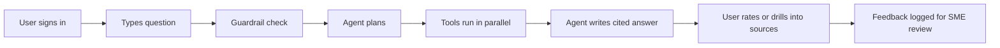

# System 3 architecture brainstorming

A first-principles walk through the System 3 (search agent) architecture, captured from a brainstorming session on 2026-04-20 during the Phase 4.0 data transfer. Nothing here is finalized. It records the reasoning, trade-offs, and open questions so the first implementation commit does not start from a blank page.

## Table of contents

- [Why this document exists](#why-this-document-exists)
- [Axioms we are standing on](#axioms-we-are-standing-on)
- [How System 3 connects to Layer 1](#how-system-3-connects-to-layer-1)
- [User flow and UI surface](#user-flow-and-ui-surface)
- [The agent loop](#the-agent-loop)
- [Model choice and portability](#model-choice-and-portability)
- [Multi-model harness and cost control](#multi-model-harness-and-cost-control)
- [Query classification and effort allocation](#query-classification-and-effort-allocation)
- [Auth and user data storage](#auth-and-user-data-storage)
- [Cost model at multi-user affordable](#cost-model-at-multi-user-affordable)
- [A simulated user query end-to-end](#a-simulated-user-query-end-to-end)
- [Feedback loop and observability](#feedback-loop-and-observability)
- [Shipping all three parts from day one](#shipping-all-three-parts-from-day-one)
- [Reference repository that already demonstrates most of this](#reference-repository-that-already-demonstrates-most-of-this)
- [Five delivery modes and what each one actually exposes](#five-delivery-modes-and-what-each-one-actually-exposes)
- [Latency levers and what actually moves the needle](#latency-levers-and-what-actually-moves-the-needle)
- [Discipline that matters more than velocity](#discipline-that-matters-more-than-velocity)
- [Open questions](#open-questions)

## Why this document exists

System 1 and System 2 are finishing up in this repo. The 5-database knowledge graph is being loaded on the Hetzner VPS as this doc is written. System 3 (the search agent, API, UI) lives in a separate repository that does not exist yet. Before that repository is created, some architectural choices benefit from being written down. The goal is not to lock in decisions. The goal is to have the first System 3 commit land with clear intent rather than with a drift of week-one improvisation.

If you are reading this document and planning to start System 3, treat every choice as a proposal you can override. The axioms below are the part to challenge first.

## Axioms we are standing on

These are statements we accept as true before reasoning from them. If any of these turn out to be wrong, the conclusions downstream also change.

1. System 3 must serve multiple users, not just one developer
2. Infrastructure cost should stay under about $100 per month baseline, excluding LLM usage which scales with traffic
3. Every answer must trace back to a specific record in a specific NCBI database. Nothing is generated from LLM training data alone.
4. The Layer 1 knowledge graph is authoritative and stable. System 3 reads from it, never writes to it.
5. Researchers will not adopt a tool they cannot verify. Trust is the product, the chat interface is the wrapper.
6. Velocity is high enough that "how fast can we build this" is not the interesting question. "How do we keep it from drifting after we build it" is the interesting question.

## How System 3 connects to Layer 1

Apache AGE is a PostgreSQL extension, so any language that speaks PostgreSQL can query the graph. The AGE-specific wrapper is that every openCypher query goes inside a SQL call to a function named `cypher`.

```python
cur.execute("""
    SELECT * FROM cypher('ncbi_kg', $$
        MATCH (g:Gene {id: 'NCBIGene:672'})-[:gene_associated_with_condition]->(d:Disease)
        RETURN g.name, d.name LIMIT 10
    $$) as (gene agtype, disease agtype);
""")
```

That pattern is the full connection surface between System 3 and the knowledge graph. Every tool call the agent makes against the graph flows through this one mechanism.

Three options were considered for the connection topology:

| Option | Pattern | When to pick |
|--------|---------|--------------|
| Direct PostgreSQL from System 3 | System 3 backend holds a connection pool to the Hetzner VPS on port 5432 | V1 default. Simplest and fastest. |
| Thin HTTP wrapper on the VPS | System 3 calls a small API on the VPS that wraps Cypher in REST endpoints | When you want versioned query endpoints, server-side caching, or to hide Cypher from external callers |
| SSH tunnel | Open a tunnel at startup, connect to localhost as if it were local | Dev and debug only |

V1 picks the direct connection. Adding an HTTP layer introduces a service to maintain, a new failure mode, and roughly 10-30ms of hop latency per query. It is justified when a real reason appears, not pre-emptively.

Before the first System 3 connection, five VPS steps have to be in place:

1. Create a read-only PostgreSQL role named `kg_reader` with SELECT grants on `ag_catalog` and the graph schema
2. Edit `pg_hba.conf` to allow the `kg_reader` role from System 3's egress IP over SSL
3. Set `listen_addresses = '*'` and `ssl = on` in `postgresql.conf`
4. Restart the PostgreSQL service
5. Open port 5432 on the Hetzner Cloud firewall only to the System 3 egress IP, never to 0.0.0.0

The `kg_reader` role is the single place that enforces "System 3 never writes to the graph." If the role has no INSERT, UPDATE, DELETE, or CREATE grant, no amount of agent cleverness can corrupt the authoritative data.

## User flow and UI surface

The user flow decides which UI parts matter. A biomedical researcher opens the site, logs in, asks a question, watches the agent think out loud, reads a cited answer, and clicks citations to verify them. Everything else is secondary.



The pages that show up on day one:

| Page | What it shows | The detail that matters |
|------|---------------|-------------------------|
| Home | Single question input, example questions, recent activity | Examples come from the golden dataset, not from marketing copy |
| Answer | Two pane chat: conversation on the left, citations on the right | Every claim in the answer has an inline citation chip that highlights the matching source card on click |
| Integrations | Every Layer 1 database and every Layer 2 or Layer 3 API, with status, record count, last refresh timestamp | This is the trust dashboard, not decoration. Users should see "Gene, 67.5M nodes, last updated on this date, BioLink 4.x validated, zero dangling edges." |
| Graph view | A small Cytoscape.js embedding that renders the subgraph used to produce the current answer | Click a node to open its full NCBI record in a new tab |
| History | The user's past questions, bookmarkable and shareable via URL | |
| Feedback | Thumbs up, thumbs down, optional text, and per-claim ratings | Feeds into the SME review queue, not directly into model training |

Trust requirements baked into the UI:

1. Citations are inline chips, not footnotes at the bottom. A reader who ignores the chips is still making a deliberate choice to ignore them.
2. Guardrail rejections show a one-line explanation, not a silent refusal. "This question looks like a clinical diagnosis request. The tool is for research, not for individual patient advice."
3. Every streaming answer has a stop button. Multi-hop queries can run 15-60 seconds, and a user who wants to refine mid-stream should not have to wait for completion.
4. No "AI generated" warning banner. The citations themselves are the trust signal. Warning banners teach users that the content is suspect, which is the opposite of what grounded provenance achieves.

## The agent loop

The loop has five steps. Each step has one job. Keep them separate and the system stays debuggable.

1. Guardrail: is this a valid biomedical question, safely phrased, in scope? If no, return a rejection with a reason.
2. Think: what is the user actually asking? What does the word "MODY" mean in this context? What cross-references are implied?
3. Plan: which layers and which tools are needed, in what order? Can any of them run in parallel?
4. Act: call the tools. Cypher queries against Layer 1. REST calls against Layer 2 and Layer 3. Collect results.
5. Write: synthesize the collected evidence into a cited answer. Stream it to the user token by token.

The tools available to the agent in V1 are small and well-shaped. Four or five tools, each with a typed signature, a clear JSON schema, and explicit error handling. Tools considered for day one:

| Tool | Layer | What it does |
|------|-------|--------------|
| `cypher_query` | Layer 1 | Runs a Cypher query against the AGE graph, returns rows |
| `ncbi_efetch` | Layer 2 | Fetches a specific record from an NCBI E-utilities database |
| `ncbi_dbsnp` | Layer 2 | Looks up a variant by rs# for allele frequency and functional annotations |
| `pubtator_annotate` | Layer 3 | Returns structured entity annotations on a PubMed article |
| `litvar2_lookup` | Layer 3 | Returns variant-specific literature links |

Fewer tools beats more tools. The agent picks correctly from a small menu. A large menu causes tool-selection errors even in strong LLMs.

Memory is layered, not flat. Four kinds of memory matter, and each has a different store:

| Layer | What it holds | Where it lives | When it loads |
|-------|---------------|----------------|---------------|
| Session conversation | Last N messages of the current chat | Relational row per message | Every turn |
| User profile | One-line summary: who the user is, what they research | Relational row per user | Every turn, small token cost |
| Long-term memory | Past sessions, saved citations, ongoing investigations | Relational rows, optionally a vector index later | On demand, via a retrieval tool |
| Query telemetry | All queries ever asked, all tool results, all ratings | Append-only event log | Analytics only, never loaded into agent context |

A single orchestrator is the right default. One agent runs the loop, tools do the retrieval. Move to a multi-agent pattern (a planner, specialised retrievers, a synthesiser) only when queries routinely need 10 or more tool calls, or when specialised prompts per domain start to help.

## Model choice and portability

The model is a commodity. The harness around it is the product. Making the harness model-agnostic from day one keeps options open as open-source models catch up to closed ones.

The abstraction pattern:

```python
from some_adapter_layer import acompletion

response = await acompletion(
    model="provider-name/model-name",
    messages=[...],
    tools=[...],
)
```

Swap the model string, nothing else changes. An adapter layer like LiteLLM handles the provider-specific tool-call formats behind one OpenAI-compatible interface.

Hosted open-source models cost dramatically less than closed-source frontier models. A question that costs roughly $0.06 on a closed frontier model costs roughly $0.002 on a hosted open-source model at similar quality for most biomedical retrieval tasks. The trade-off is that open-source models are weaker at multi-tool planning. A two-tier approach handles this:

1. Small, cheap, fast open-source model for planning and tool selection
2. Larger, closed-source model (or large open-source model) for final synthesis when the planning model flags a hard question

That routing alone can cut LLM cost by 5 to 10 times with only minor quality loss on easy questions.

## Multi-model harness and cost control

Two-tier routing is the start. The full pattern is three tiers, each fitting a different sub-task, and a set of hard cost caps that the harness enforces. This matters because LLM cost is the one line in the budget that can spike unpredictably. Infrastructure is fixed. Models scale with traffic plus the agent's own behaviour, which means a runaway agent loop can burn a month of budget in an hour if nothing stops it.

Why three tiers and not one big model. Different sub-tasks have wildly different minimum-quality requirements. A guardrail classifier asking "is this biomedical?" runs fine on a small open-source model and costs roughly 30 to 100 times less than running the same call on a frontier model. A final synthesis across 10 retrieved sources needs real reasoning headroom. Charging the cheapest model for the synthesis hurts answer quality. Charging the most expensive model for the guardrail hurts the wallet. Routing matches model capacity to task difficulty, per call.

The three tiers, with example task assignments:

| Tier | Purpose | Model class | Approximate cost per million tokens |
|------|---------|-------------|--------------------------------------|
| Guard | Input classification, entity extraction, simple tool selection from a small menu | 7 to 13 billion parameter open-source model on a fast inference provider | Roughly $0.05 to $0.20 |
| Plan | Multi-step planning, Cypher generation, tool coordination across two or three steps | 70 billion parameter open-source model | Roughly $0.20 to $0.90 |
| Synth | Final answer synthesis across retrieved evidence, citation assembly, hard disambiguation | 70 to 400 billion parameter open-source model, or a closed frontier model as last-resort fallback | Roughly $0.50 to $5.00 |

A typical query routes something like Guard for the guardrail step (one call), Plan for the two or three planning turns, Synth for the final synthesis (one call). That distribution keeps roughly 70 to 80 percent of token volume on the cheap tier.

Cost control levers the harness must implement. These are hard requirements, not nice-to-haves. At the scale of a personally-funded project, losing control for one hour can burn a month of budget.

| Lever | What it does | When it triggers |
|-------|--------------|------------------|
| Per-query hard cap | Kill the agent loop if total query cost exceeds a threshold like $0.10 | Synthesis step reads the running budget before allocating more tokens |
| Per-user per-day cap | Reject new queries from a user who has already consumed their daily quota | Before the guardrail, return a polite "you have hit today's limit" |
| System-wide daily cap | Pause accepting new queries (existing in-flight ones keep running) if total system spend exceeds the daily budget | Middleware check on every incoming request |
| Per-step timeout | Abort a model call if it runs longer than N seconds | Forces the agent to fail fast instead of burning tokens on a stuck request |
| Circuit breaker on provider failures | Stop trying a provider that has returned errors on the last K requests, fail over to the next | Health check middleware tracks provider success rate over a rolling window |
| Token-count cap per call | Truncate context to a max size before sending to the model | Prevents a runaway retrieval step from stuffing 200K tokens into a single call |

The 3am scenario the circuit breaker exists for: an agent gets into a retry loop calling a tool that keeps failing, the model writes more tokens with each retry, cost spirals, you wake up to a four-figure bill. A per-query hard cap cuts this off at $0.10 worst case. A system-wide daily cap turns the worst case into "tool unavailable until tomorrow" instead of "tool unavailable until next month's budget reset."

What the harness does that the model cannot do for itself. Five responsibilities, all of which live in code outside the model:

1. Map each task to a tier explicitly. "This is the guardrail step, it uses Guard tier." Never ask the model to pick its own tier. The decision belongs to the harness.
2. Standardize the tool-use format across providers. Different APIs use slightly different tool-call schemas. The harness translates once, the agent code stays clean.
3. Track cost and latency per model per call. Log every call to the observability layer with the model name as a dimension, so you can answer "which provider is cheapest for the Plan tier this week?"
4. Gracefully degrade on failure. If Plan tier times out, retry once, then fall through to Synth tier with a longer prompt. If all open-source tiers fail, fall through to the closed frontier model and log the fallback explicitly.
5. Expose per-user and per-system budgets to the user. "You have 12 queries left today" reduces confusion when a cap triggers.

The quality ablation that proves the harness-first thesis. Once the multi-tier harness is working, run the golden dataset through every realistic model combination and produce a grid:

| Guard model | Plan model | Synth model | Golden score | Cost per query |
|-------------|------------|-------------|--------------|----------------|
| Small OSS | Medium OSS | Medium OSS | Roughly 82 percent | Roughly $0.004 |
| Small OSS | Medium OSS | Large OSS | Roughly 88 percent | Roughly $0.012 |
| Small OSS | Medium OSS | Closed frontier | Roughly 91 percent | Roughly $0.045 |
| Closed frontier all the way | Roughly 93 percent | Roughly $0.080 |

Numbers are illustrative until measured. The point is structural: the harness lets you pick the point on this curve and even pick different points per user tier. Free users get the cheap combo, paying or trusted users get the hybrid, hard questions force-promote to the larger tier. Without the harness, this experiment is not possible because the model choice is hardwired into every call.

## Query classification and effort allocation

The three-tier model routing matters only if the planner is picking the right tier per query. Different questions deserve different amounts of work. A simple lookup should not allocate the same time, tools, and tokens as a multi-source synthesis. The planner's job is not just "pick which tools to call." It is "decide how much work this question deserves." That decision happens once, before any retrieval.

The four query complexity classes for a biomedical retrieval tool. Most queries fall into one of these shapes:

| Class | Example | Tools needed | Time budget | Cost ceiling | Synthesis tier |
|-------|---------|--------------|-------------|--------------|----------------|
| Lookup | "What is HNF1A?" | 1 Cypher | Under 3 seconds | $0.002 | Guard or Plan |
| Single-hop | "What diseases is HNF1A associated with?" | 1 to 2 Cypher | Under 5 seconds | $0.005 | Plan |
| Multi-hop | "What variants in MODY genes are pathogenic and in which populations?" | 3 to 5 Cypher plus Layer 2 API | Under 15 seconds | $0.03 | Plan or Synth |
| Deep research | "Write a review of MODY pathogenesis with novel variants from 2024-2026" | 10 to 30 tool calls across all layers | Under 2 minutes | $0.20 | Synth, possibly closed frontier fallback |

The 80-20 rule applies. Most queries are Lookup or Single-hop. A small fraction are Deep research. Monthly cost is dominated by how well the planner routes, not by how many users you have.

What the planner actually does. The planner is one small LLM call that runs at the start of every query. Its output is structured, not prose:

```json
{
  "class": "multi_hop",
  "predicted_tools": ["cypher_query", "cypher_query", "ncbi_dbsnp"],
  "predicted_turns": 3,
  "budget_ceiling_usd": 0.03,
  "model_tier_for_synthesis": "plan",
  "rationale_one_line": "Asks about variants and population frequency, requires graph plus dbSNP."
}
```

Four benefits of making the planner output structured:

1. The orchestrator can enforce the plan. If the planner said "3 tools" and the agent is on its 5th tool call, the orchestrator cuts it off or escalates the budget explicitly.
2. Cost is bounded upfront. The orchestrator sets the budget cap before any LLM work begins.
3. Observability is clean. Each query is tagged with its predicted class, so you can ask "how accurate is the planner at classifying Deep research queries this week?"
4. Mis-classifications surface after the fact. A question labeled Lookup that took 10 tool calls and 30 seconds means the planner was wrong. That becomes training signal for prompt tuning, more examples in the planner system prompt, or a fallback classifier.

The planner is itself a model choice. The planner runs on every single query, so its cost and latency matter a lot. Sensible defaults:

1. Planner model: small to medium open-source, deterministic (low temperature), with the full tool menu and a handful of example classifications baked into the system prompt
2. Planner latency budget: under 500 milliseconds
3. Planner cost budget: under $0.0005 per query

A slow or expensive planner defeats the whole purpose. If the planner costs more than the average query it plans, the routing scheme is upside down. Keep the planner small and fast.

User-facing effort toggle, optional but powerful. A pattern worth considering, copied directly from search products that work this way. Let the user pick the effort level when they want, with a sensible default:

1. Quick (default for first-time users): forces Lookup or Single-hop, cheap and fast
2. Standard: planner decides
3. Deep research: forces Multi-hop or Deep, budget 10x normal, user sees a "this will take up to 2 minutes" nudge before submission

For the internal SME dogfood phase, skip the toggle and always trust the planner. Add it when external users arrive and need control over cost and time per query.

Calibrating the planner with the golden dataset. Each golden dataset question is tagged with its expected class. The nightly evaluation runs the planner on every question and reports four metrics:

1. Classification accuracy: what fraction got the right class
2. Upgrade rate: how often the planner under-budgeted (had to extend mid-query)
3. Downgrade rate: how often the planner over-budgeted (finished with budget left over)
4. Cost per class: actual cost vs predicted cost, broken down by class

This grid tells you whether the planner needs better examples, a larger model, a tighter prompt, or simply more golden dataset coverage of edge cases. Without this calibration, you are flying blind on the most important decision the agent makes per query.

## Auth and user data storage

User data (identities, sessions, messages, ratings) is relational by shape. Users have sessions. Sessions have messages. Messages have tool calls and citations. Rows with foreign keys.

The choice for V1 is a managed serverless PostgreSQL with a generous free tier. This keeps user data separate from the Layer 1 graph box, so user writes never touch the graph, and the user database can be scaled or rebuilt without any coordination with the knowledge graph side.

Schema sketch for the user data side:

```sql
users        (id, email, created_at, profile_json)
sessions     (id, user_id, created_at, last_active_at)
messages     (id, session_id, role, content, tokens, created_at)
tool_calls   (id, message_id, tool_name, args_json, result_preview, latency_ms)
citations    (id, message_id, layer, source_type, source_id, ranking)
ratings      (id, message_id, user_id, score, feedback_text, created_at)
```

Six tables. Standard relational shape. New tables can be added without touching the Layer 1 graph box.

One caveat: the serverless PostgreSQL provider of choice supports a curated list of extensions but not Apache AGE. If user-behavior graph queries become useful later ("which tool-call chains produced the highest-rated answers?", "find users with similar query patterns"), those queries will run on the Hetzner AGE box as a second named graph alongside `ncbi_kg`, not on the user data provider.

On the auth provider choice, three realistic options exist:

| Provider | Free tier | Trade-off |
|----------|-----------|-----------|
| Managed auth service | Typically 10K MAU free | Zero auth code to maintain, drops in as React components, vendor dependency |
| OSS auth library on the user database | Unlimited | You maintain the library integration, you wire the email provider, no vendor |
| Magic links via an email API and a custom cookie | Free at small scale | Dead simple, no social login, no MFA out of the box |

For V1, the managed auth service wins. At fewer than 10K monthly active users the cost is zero, the setup is minutes, and the migration path to an OSS library is a weekend if you ever grow past the free tier.

## Cost model at multi-user affordable

The goal stated at the start of the session was multi-user at affordable price. With the choices above, the realistic floor:

| Cost line | Amount per month | Notes |
|-----------|------------------|-------|
| Layer 1 knowledge graph on the dedicated VPS | Roughly $24 after the post-Gate-3 downgrade | Required, where the 115M nodes live |
| System 3 backend on a hobby PaaS | Roughly $5 | Covers FastAPI, a small worker, and in-memory Redis if needed |
| System 3 UI on a static edge host | $0 | Free tier covers low-to-moderate traffic |
| User data on serverless PostgreSQL | $0 | Free tier covers the first several thousand users |
| Managed auth service | $0 | Free tier covers the first 10K monthly active users |
| NCBI Layer 2 and Layer 3 APIs | $0 | Free with an API key |
| LLM usage | Roughly $15 to $60 | Depends on traffic, mix of small vs large models, caching |
| Total | Roughly $44 to $89 | |

The cost lever that matters most is the LLM mix. At 250 queries per day with a closed-source frontier model for every turn, LLM cost is in the hundreds of dollars per month. With a two-tier routing and a Redis cache on the user-question-to-answer layer, the same traffic lands in the $15-60 range.

## A simulated user query end-to-end

To make the architecture concrete, here is a walk-through of a single real query from the researcher's perspective, with timings and costs.

A diabetes researcher asks: "I am studying MODY. Which genes cause it, what variants are pathogenic, what is the European allele frequency, and which recent papers describe novel variants?"

The flow:

| Clock time | What happens | Notes |
|------------|--------------|-------|
| T + 0.0s | Browser opens an event stream connection to the backend | Right pane clears and shows an empty skeleton |
| T + 0.1s | Backend authenticates the JWT, loads the last N messages from the user database, starts the agent loop | SQLite or Neon row read, under 5 milliseconds |
| T + 0.2s | First agent turn: plan the retrieval. Emit a `thinking` event. | UI shows "Identifying MODY genes from the graph" streaming in |
| T + 2.1s | Agent issues a Cypher query against Layer 1 for genes associated with MODY | Under 100 millisecond round trip. 14 MODY genes returned. |
| T + 2.2s | Tool result event emitted. Right pane adds the first citation card: "14 MODY genes, Layer 1 graph, 92ms." | |
| T + 2.3s | Second agent turn: plan the next three calls in parallel. Emit a `thinking` event. | |
| T + 2.5s | Three tools fire in parallel: a second Cypher for pathogenic variants, a batch of dbSNP API calls for allele frequencies, a LitVar2 call for recent papers | |
| T + 3.7s | All three tool results are back | 47 pathogenic variants, 10 allele frequencies, 5 recent papers |
| T + 3.7s to T + 8.4s | Final synthesis: streaming answer token by token, with inline citation chips emitted as the model references sources | User sees the answer unfold in real time |
| T + 8.4s | Stream closes. Backend writes the conversation, tool calls, and citations back to the user database. | |

Cost breakdown for this one query:

| Step | Tokens | Approximate cost |
|------|--------|------------------|
| Turn 1, plan | 4K in, 80 out | Low |
| Turn 2, plan plus three parallel tool calls | 4.5K in, 150 out | Low |
| Turn 3, synthesis | 7K in, 400 out | Medium |
| Layer 1 Cypher queries | Included in the VPS cost | No per-query charge |
| Layer 2 dbSNP API calls | Free with a key | No per-query charge |
| Layer 3 LitVar2 API call | Free | No per-query charge |

On a frontier closed-source model the total LLM cost for this query sits around $0.06. On a two-tier routing (small model for Turns 1 and 2, large model for Turn 3) the same query lands around $0.02. On an all-small-model setup the cost drops to roughly $0.002 at the cost of some synthesis quality.

At 50 users asking 5 questions per day: 250 queries per day, 7,500 per month. The all-frontier path lands near $450 per month. The two-tier path lands near $150 per month. The all-small path lands near $15 per month. Cache hits on repeated questions shave another 30 to 40 percent.

## Feedback loop and observability

Trust is earned over time, not declared once at launch. The feedback loop is what earns it.

The three-layer shape:

| Layer | What flows in | What it produces |
|-------|---------------|------------------|
| LLM trace | Every LLM call, token count, latency, tool use, errors | Debuggable per-call records on a tracing platform |
| App event log | Question, user_id, session_id, tools called, final answer, rating | Rows in the user database for analytics and replay |
| Golden dataset | SME-curated question to expected answer pairs | A regression harness run on every prompt change |

The critical architectural insight: the feedback loop tunes the agent and its prompts, not the knowledge graph. If the KG has a gap, the fix goes upstream into System 1 or System 2. Agent tuning is system prompt plus tool descriptions only. That boundary keeps the data layer stable while the agent improves continuously.

The cadence that makes "consistently improved with feedback" actually happen:

| Frequency | What | Who |
|-----------|------|-----|
| Per query | LangSmith trace recorded, event row written, user rating optional | Automatic |
| Daily | Nightly evaluation runs the golden dataset, posts pass or fail | Cron job on the PaaS |
| Weekly | SME review session for 30 minutes. Walk through 10 or 15 flagged answers. Add 3 to 5 to the golden dataset. | Lead plus SMEs |
| Bi-weekly | Agent prompt PR if the review surfaced patterns. The PR must not regress on the golden dataset. | Developer plus lead |
| Monthly | Read user feedback in aggregate, write up themes, decide what changes | Lead |
| Quarterly | Refresh the knowledge graph from the latest NCBI FTP snapshot | System 1 and 2 work |

Three discipline rules make the cadence work:

1. The agent prompt lives in git, versioned and tagged. Every change is a PR that must not regress the golden dataset.
2. SME findings route into one of three buckets: agent change, UI change, KG change. Different repos, different cadences. If everything looks like an agent change, the system is over-tuning.
3. User thumbs up and thumbs down are not ground truth. They are a signal for which answers deserve SME attention. SMEs decide what is correct. Users decide what is useful.

## Shipping all three parts from day one

A tempting pattern is to ship the UI first, then the agent, then the feedback loop. That pattern is a trap. Without the feedback loop, the UI and agent evolve without a regression signal. Drift sets in quickly.

A better pattern is to ship all three at minimum viable quality on the same day, then improve all three in parallel on a weekly cadence. "Minimum viable" means the smallest version that still collects useful signal.

Rough scope for v0.1:

| Part | v0.1, a few weeks of work | v1.0, roughly three months |
|------|---------------------------|----------------------------|
| UI | Single chat input, SSE streaming text, citations panel, login, thumbs up and thumbs down | Two-pane chat with sources, embedded graph view, integrations page, history, share via URL |
| Agent | One orchestrator, four tools, one guardrail, synthesis, tracing on every call | Adds the LLM-as-judge async step, tool-failure retry, query rewriting on empty results, multi-step planning |
| Feedback loop | Tracing platform integrated, user database tables, a hand-curated 5-question golden dataset, nightly eval cron | SME review admin route, weekly review session, 50-question golden dataset, regression alerts on PRs, prompt-change PRs gated by golden dataset score |

The first four weeks of work, roughly in order:

1. Week 1: infrastructure ready, auth wired in, empty chat UI streams echo text back
2. Week 2: one tool (the Cypher query against Layer 1), one small LLM, end-to-end streaming answer for "What diseases are associated with HNF1A?"
3. Week 3: three more tools, guardrail, citations panel, thumbs up and thumbs down stored
4. Week 4: tracing platform integrated, a 5-question golden dataset, nightly eval, simple SME review table, first 2 or 3 SMEs invited

After week 4, the weekly cadence takes over. New features land only after the current golden dataset is passing.

What to not do in the first four weeks:

1. No multi-agent orchestration. Single orchestrator until evidence demands more.
2. No vector memory layer. Add only if SMEs ask for it.
3. No graph visualisation. Answers and citations are the product. The viz is a polish layer for later.
4. No external users. Invite-only until the golden dataset has 50 or more questions clearing consistently.
5. No custom evaluation framework. A tracing platform plus a Python script is enough.

## Reference repository that already demonstrates most of this

A reference repository exists at `reference-repos/ncbi_ai_agents` on the `ncbi-kg` branch. It is a working implementation of a very similar system, built against Neo4j. It demonstrates almost every part of the architecture above.

What it already has:

| Part | Reference artifact |
|------|--------------------|
| Chat with streaming | `frontend/src/components/ChatMode.tsx` |
| Citations and results panel | `ResultsPanel.tsx` and `ResultsTable.tsx` |
| Graph visualisation | `CypherResultsGraph.tsx` and `ConnectionExplorer.tsx` |
| Integrations page | `IntegrationHub.tsx` |
| Schema explorer | `SchemaViewer.tsx` |
| Query history | `QueryHistory.tsx` |
| Feedback buttons | `FeedbackButtons.tsx` |
| Example questions | `ExampleQueries.tsx` |
| Power-user Cypher editor | `CypherEditor.tsx` |
| Admin panel for SME workflow | `admin/AdminPage.tsx` and related |
| Auth | Firebase integration |
| NL to Cypher | `src/knowledge_graph/nl_to_cypher.py` |
| Entity extraction | `src/knowledge_graph/entity_extractor.py` |
| Query expansion | `src/knowledge_graph/query_expander.py` |
| Ontology mapping | `src/knowledge_graph/ontology_mapper.py` |
| FastAPI | `api/main_api.py` and `api/admin.py` |
| MCP server | `mcp_server.py` and `src/mcp/servers/` |
| LLM tracing | `src/utils/observability.py` and `src/utils/trace_logger.py` |
| Product analytics | `frontend/src/analytics/posthog.ts` |
| Tests for observability | `tests/observability/` |
| BioLink and KGX validation | `scripts/validate_biolink.py` and `scripts/validate_kgx.py` |

What it does not have:

1. Golden dataset and nightly regression evaluation. Nothing matching `*golden*` or `*eval*` exists in the repo file tree. This is the most important gap to close.

What has to change to adapt it to the current Layer 1 on PostgreSQL plus AGE:

1. Swap the Neo4j client layer. Replace `services/neo4jApi.ts` with an AGE equivalent. The agent code for NL to Cypher, entity extraction, and query expansion carries over almost verbatim because AGE speaks openCypher. The wrapper change is that every query goes through `SELECT * FROM cypher(...)` on the server side.
2. Swap user data storage from Firebase to a serverless PostgreSQL. Small refactor.
3. Replace the Neo4j data loader scripts with the AGE loader already built in System 2 of this repo.
4. Adapt the integrations page to show the 5 databases ingested by the new System 1, not the smaller PoC set.

## Five delivery modes and what each one actually exposes

The innovation proposal names five delivery channels for System 3. Each one has a different surface area. More importantly, each one exposes a different subset of the three layers.

| Mode | What it exposes | Primary user | Day-one scope |
|------|-----------------|--------------|---------------|
| Web UI | The agent loop with access to all three layers, plus citations and graph views | Researchers asking ad hoc questions | Core product. Ship first. |
| CLI agent | Same agent loop over a terminal interface, pipeable into shell workflows | Researchers scripting bulk investigations | Thin wrapper on the FastAPI endpoint |
| MCP server | Individual tools (Cypher query, NCBI E-utilities fetch, enrichment lookups) exposed over the Model Context Protocol | External agent hosts that want to call this graph as a tool | Reference repo already has the pattern. Adapt the tools to the AGE client. |
| API | REST or GraphQL endpoints wrapping the agent, plus a passthrough Cypher endpoint for power users | Internal teams, automated pipelines, third-party integrations | FastAPI already exists. Add `/cypher` for direct queries. |
| KGX export | A downloadable snapshot of Layer 1 as nodes.tsv plus edges.tsv | Researchers building derivative graphs, reproducibility workflows | The merge pipeline already produces this. Expose it as a file download. |

The KGX export has one important limitation that has to be stated clearly on the download page: it contains Layer 1 only. Layer 2 and Layer 3 data are fetched from live NCBI APIs at query time and are not stored on the server, so they cannot be exported as KGX. A user who downloads the KGX export gets roughly 144 GB of data covering 115M nodes and 693M edges from Gene, ClinVar, MedGen, PubMed, and Taxonomy. A user who wants Layer 2 or Layer 3 data must call the MCP server, the API, or the Web UI where the live APIs are reachable.

The MCP server fills the gap that KGX cannot fill. Tools exposed over MCP include the three-layer retrieval that the Web UI uses. An external agent host that connects via MCP gets live Layer 1 Cypher plus live Layer 2 and Layer 3 API calls, without the need to ingest any local data. This is the reason MCP matters even when the web UI and API already exist: it lets other agent systems treat the knowledge graph as a first-class tool they can reason over.

One more nuance worth naming explicitly. A sophisticated external team can combine the KGX export and the MCP server: load the Layer 1 snapshot into their own PostgreSQL plus AGE instance, then call the MCP server only for Layer 2 and Layer 3 data at query time. This reconstructs the full three-layer picture on their side and gives them sub-10 millisecond Layer 1 queries because the graph is now local. This pattern benefits external teams with engineering capacity, not the typical researcher using our web UI. The delivery modes enable reach, not speed. Speed for our own users is a different conversation, which is the next section.

How the integrations page should expose all of this:

1. A first table listing every delivery mode with its current status (up, degraded, offline), the data layers it covers, a link to its docs, and the last deploy or refresh timestamp.
2. A second table listing every Layer 1 database with its record count, last FTP refresh date, and BioLink validation status.
3. A third table listing every Layer 2 and Layer 3 API with its uptime status and current rate-limit consumption.

One page, three tables. The page is the trust dashboard for researchers who care about provenance. No marketing copy.

## Latency levers and what actually moves the needle

A common confusion is that MCP, GraphQL, or some other protocol choice will make the system faster. It does not. Protocols are about interoperability and abstraction, not speed. In most cases adding a protocol layer introduces one more hop of serialization, which is more latency, not less.

Where latency actually lives for a typical query hitting our web UI:

1. Browser to backend: roughly 50 to 100 milliseconds depending on geography
2. Backend to Hetzner AGE for a Cypher query: roughly 50 to 100 milliseconds
3. Backend to NCBI APIs for Layer 2 or Layer 3: roughly 100 to 500 milliseconds per call
4. Backend to LLM provider for planning and synthesis: roughly 500 milliseconds to 5 seconds depending on model and token count
5. Backend streaming tokens back to the browser: as fast as the LLM produces them

Total: 2 to 15 seconds for a multi-hop question. The LLM and the NCBI APIs dominate. The graph query is already fast. The protocol choice is irrelevant noise at this scale.

The leverage points that genuinely reduce latency, ranked by impact:

| Lever | Typical saving | Difficulty |
|-------|---------------|------------|
| Redis cache on Layer 2 and Layer 3 API responses, with a 24-hour time to live on stable fields | 100-500ms down to under 5 milliseconds per cache hit. Biomedical questions repeat enough that cache hit rate can reach 30-50 percent. | Low, 1 to 2 days |
| Fast inference on hosted open-source LLM providers that run models 5 to 10 times faster than closed frontier models | Synthesis drops from 3 to 5 seconds to under 1 second | Low, swap the model name |
| Parallel tool calls via asyncio.gather on independent Layer 2 and Layer 3 lookups | Three sequential calls of 300 milliseconds each (900 ms total) become three parallel calls (300 ms total) | Low, part of the agent loop design |
| Streaming the answer token by token | Total latency does not change, but perceived latency drops to "time to first token" which is under 1 second | Already planned |
| LLM prompt caching on supported providers, where the cached system prompt plus schema summary is paid for once and reused | 10 to 30 percent win on cost and latency for follow-up turns in the same conversation | Depends on the provider |
| Putting the backend geographically closer to users | 50 to 100 milliseconds per hop | High, free-tier PaaS makes this hard |

The single largest lever is Redis caching on Layer 2 and Layer 3. Five different users asking about variants in BRCA1 in one week all hit the same dbSNP records. Caching those responses turns a 300 millisecond API call into a 2 millisecond Redis hit. Over a month of real usage this is the difference between 30-40 percent of queries feeling instant and 30-40 percent of queries feeling slow.

The second-largest lever is the LLM inference provider. The choice between a fast hosted open-source model and a slow closed frontier model can change perceived answer latency by 3 to 5 seconds. For a research tool used during active thinking, that gap is the difference between "tool I reach for" and "tool I gave up on."

Protocol choices (MCP, REST, GraphQL, SSE) do not appear on the list because they are not latency levers. They are interoperability levers. Pick the one that fits your integration needs, not the one you hope will be faster.

## Discipline that matters more than velocity

At a sustainable pace, a small team with LLM-assisted coding can ship the shape above in weeks, not months. At that velocity, the bottleneck stops being "can we build it" and starts being "can we keep it from drifting."

Four discipline gates are worth establishing on commit one, because retrofitting them later is painful:

1. Branch protection on the System 3 repo's main branch. Every change is a PR.
2. A golden dataset CI check that runs the eval harness on every PR and blocks merge on regression. Even at v0.1 with only 5 questions, the gate creates the habit.
3. Agent prompt lives in git. Production reads the prompt from a tagged commit, never from a hand-edited environment variable. If a prompt change is needed, it is a PR.
4. An override rule: if a regression needs to ship despite failing the golden dataset, exactly one named human can approve the override, and the reason is logged in the PR description. No silent overrides.

These four together are cheaper than any one refactor that would be needed to install them six months in. They also shape the team's habits while those habits are still forming.

## Open questions

These are the decisions that were raised during the brainstorm but are not settled. They are the first things to answer when System 3 starts.

1. Who are the first two or three SMEs, and what specific NCBI database are they expert in? Their domain shapes the initial golden dataset questions, which biases the agent's early tool use and prompt tuning.
2. Which auth provider to pick on day one? Managed service for zero-code setup versus OSS library for no vendor dependency. Both are viable. The decision is philosophical, not technical.
3. Which hosted open-source LLM provider to default to? Cost, rate limits, and model availability differ meaningfully. Worth a one-day bakeoff before committing.
4. Should the existing reference repository be forked outright or should a fresh repository be started with the best parts cherry-picked? Fork is faster, inherits baggage. Fresh is cleaner, costs extra days.
5. How will the first SME review meeting be structured? The format matters. SMEs lose interest fast if the process is vague or the feedback does not visibly change the system within a week.

None of these block the start of System 3 work. Each of them shapes the first month of that work. Better to answer them on the first day than on the first incident.
