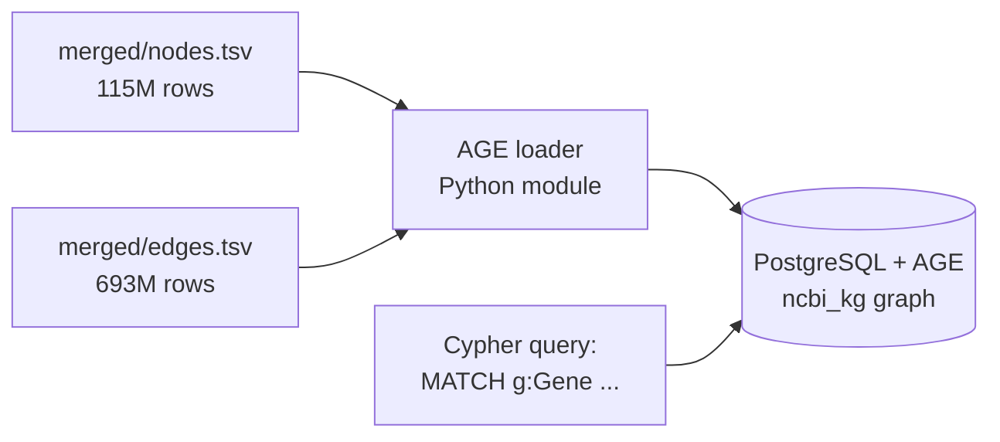
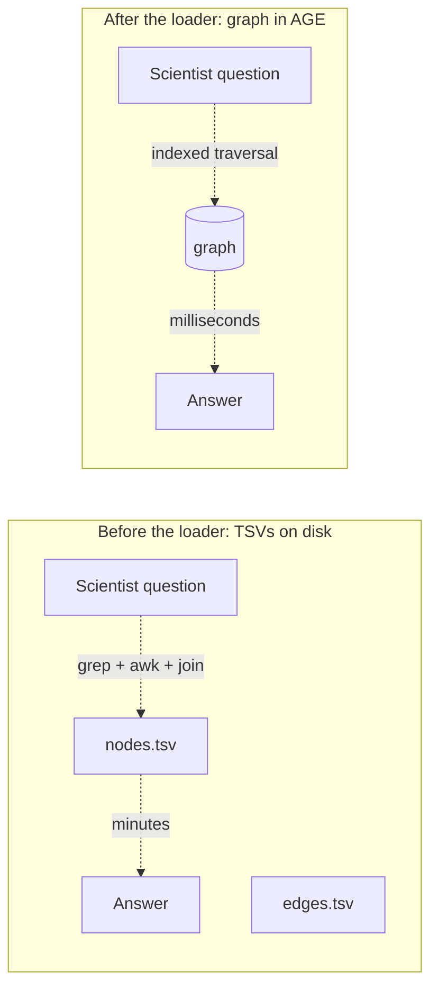
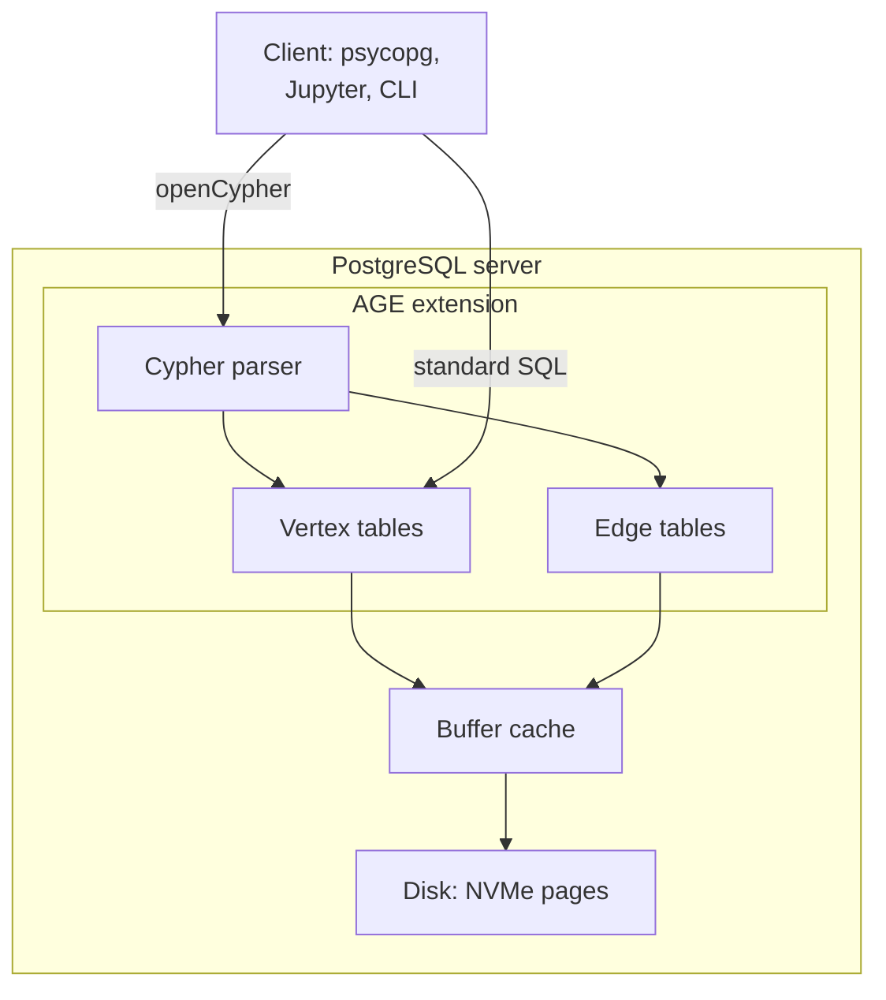
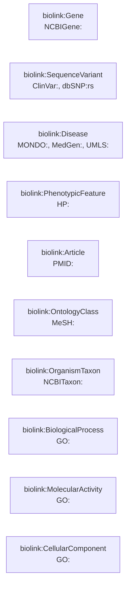
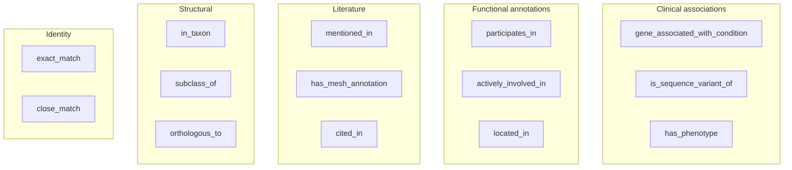
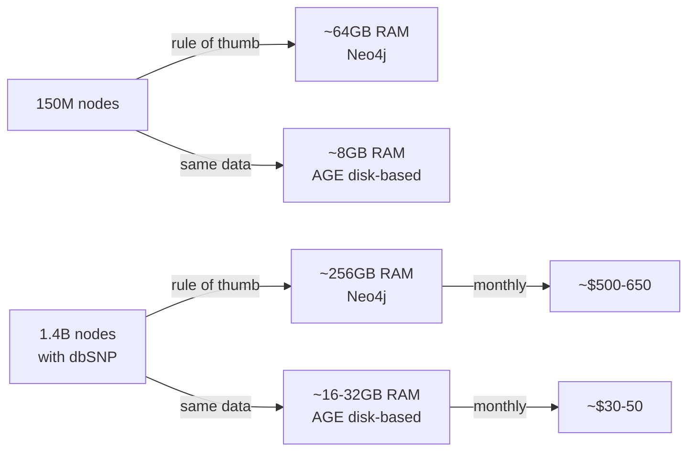
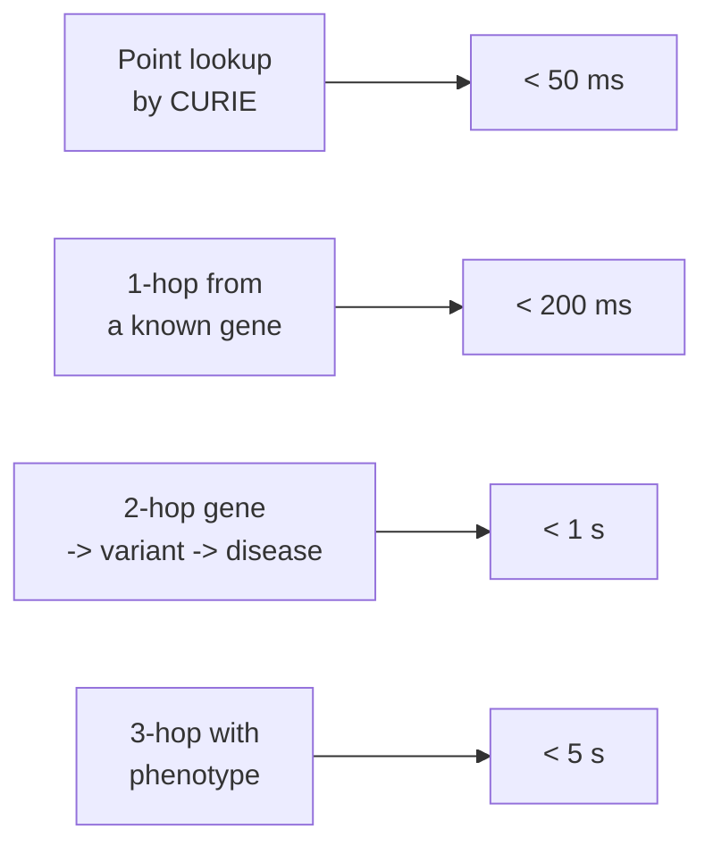
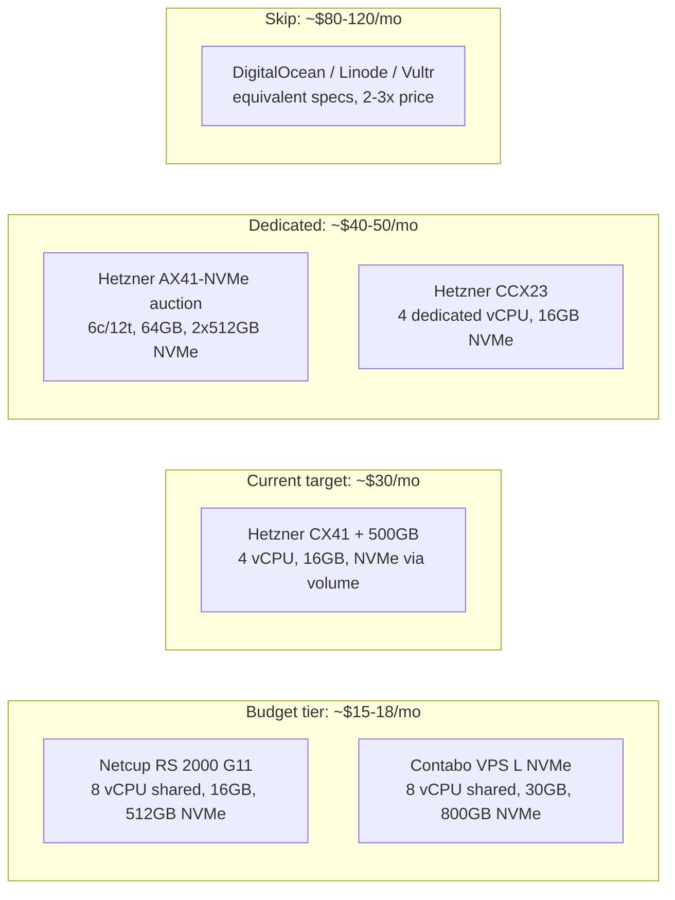
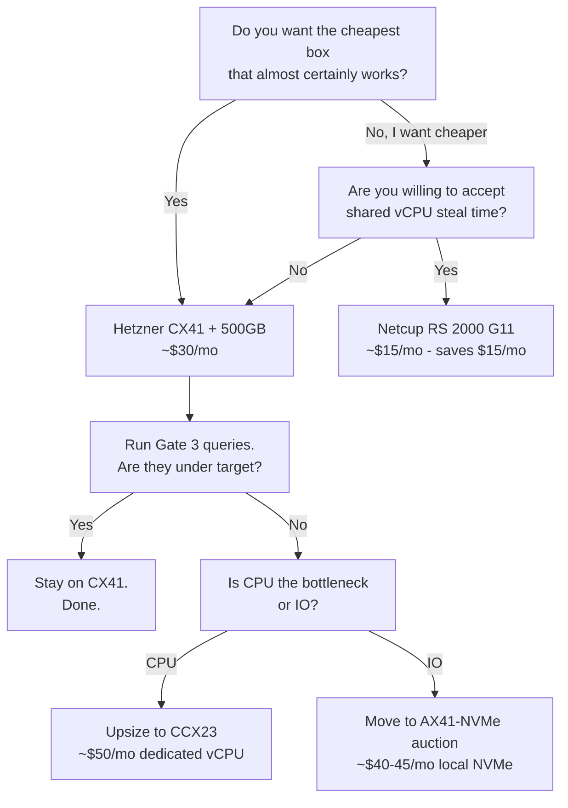
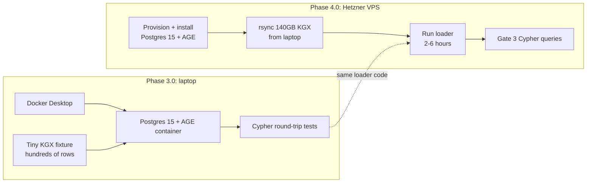

# The AGE loader explained

Written in first-principles style. What the loader is, why it exists, how it works, and what it means for you. Plus a hosting comparison so the Hetzner choice is not taken on faith.

Related artifacts:
- `schema/biolink_ncbi.yaml` (LinkML schema, 10 node types, 14 predicates)
- `docs/architecture/Merge_logic_explained.md` (the step before the loader)
- `docs/architecture/Three_layer_data_architecture.md` (where the graph sits in the wider system)
- DECISIONS.md rows dated 2026-04-06 and 2026-04-13 (the PostgreSQL + AGE choice)

## Table of contents

- [Axioms](#axioms)
- [What is the AGE loader](#what-is-the-age-loader)
- [Why does it exist](#why-does-it-exist)
- [What is PostgreSQL + Apache AGE](#what-is-postgresql--apache-age)
- [Our knowledge graph structure](#our-knowledge-graph-structure)
- [Why AGE over Neo4j](#why-age-over-neo4j)
- [Performance: what to expect](#performance-what-to-expect)
- [Hosting: is Hetzner the right floor](#hosting-is-hetzner-the-right-floor)
- [Are these providers safe, and is the data hosted in the USA](#are-these-providers-safe-and-is-the-data-hosted-in-the-usa)
- [Phase 3.0 vs Phase 4.0: code now, load later](#phase-30-vs-phase-40-code-now-load-later)
- [What this means for you](#what-this-means-for-you)

## Axioms

Before reasoning about the loader, name the things you are treating as solid. If any of these turn out false, the whole design shifts.

1. The graph is the product. KGX TSV files are intermediates. Delete them after the graph is loaded and validated.
2. Public NCBI data has no compliance constraints. You are free to host it anywhere with commodity hardware.
3. You will query the graph far more often than you load it. Optimise for read performance, not load speed.
4. A 20x cost difference between two technically-acceptable options is not a tie. Pick the cheaper one and upgrade later if you must.
5. Storage on disk is cheap. RAM is not. If a database can stay on disk and still answer the query in under a second, you do not buy RAM.
6. Your working queries are mostly point lookups and 1-3 hop traversals. They are not 7-hop shortest-path searches over the whole graph.

Everything that follows builds on these six.

## What is the AGE loader

The AGE loader is a small Python module. You give it a folder of merged KGX files. It gives you back a queryable graph inside a PostgreSQL database.

Five concrete jobs, in order:

1. Create the graph. One SQL call: `SELECT create_graph('ncbi_kg')`. This sets up internal tables for vertices and edges inside a Postgres schema.
2. Create vertex labels. One AGE label per BioLink category. Gene, SequenceVariant, Disease, Article, OntologyClass, OrganismTaxon, and so on. Ten labels total, matching the schema.
3. Bulk insert nodes. Stream `merged/nodes.tsv` in batches of tens of thousands of rows. Every node carries its CURIE, its BioLink category, its name, and its provenance fields.
4. Bulk insert edges. Stream `merged/edges.tsv` in batches. Every edge carries its predicate, its endpoints (looked up by CURIE), and its provenance.
5. Create indexes. A btree index on the `id` property for every vertex label. Another on `(subject, predicate, object)` for edges. Without these, every query is a full-graph scan.

The loader is idempotent. Re-run it on a fresh graph: full rebuild. Re-run it on an existing graph: no-ops on duplicates. No partial states to reason about.

What this means for you: when you run the loader on the VPS in Phase 4.0, you can kill it and restart it without worrying about corruption. That is the only way to sleep through a 6-hour load.

## Why does it exist

The pipelines in Phases 1 and 2 end in TSV files. That is useful as a transport format. It is useless as a query target.

If a scientist asks "what pathogenic variants are in BRCA1", you cannot answer that from a TSV. You would have to read the entire file, filter, join another file, filter again. On 115M nodes and 693M edges, that is minutes per question.

A graph database is a data structure optimised for one thing: follow edges fast. Given a starting node, it finds connected nodes in milliseconds, not seconds. It is what makes traversal queries cheap.

The loader is the bridge between "data we produced" and "data we can interrogate".

## What is PostgreSQL + Apache AGE

PostgreSQL is the relational database you already know. Tables, rows, SQL, ACID transactions, btree indexes. Thirty years of mature tooling.

Apache AGE is an extension you bolt onto Postgres. It is short for A Graph Extension. It adds two capabilities on top of ordinary Postgres:

1. A graph data model. Vertices and edges as first-class objects with labels and properties. Behind the scenes, they are stored in Postgres tables, but you see them as a graph.
2. An openCypher parser. Cypher is the query language Neo4j invented. AGE supports a useful subset of it. You write `MATCH (g:Gene)-[:gene_associated_with_condition]->(d:Disease) RETURN d`, AGE turns that into a Postgres query plan, Postgres runs it.

You get a graph query language on top of a relational storage engine. That sounds like a compromise. It is. The compromise buys you something important: you run the whole thing on a cheap box, because Postgres is disk-based, and it has been tuned for disk-based workloads for three decades.

## Our knowledge graph structure

After Phase 2.2 merge ran at Gate 2, the graph looks like this:

- 115.4M nodes across 10 BioLink categories
- 693.3M edges across 14 BioLink predicates
- 99.99% cross-pipeline connectivity
- 100% provenance coverage on every node and edge

The ten node categories (vertex labels in AGE):

The fourteen predicates (edge labels in AGE), grouped by the question they answer:

Every edge also carries two BioLink 4.x provenance slots: `knowledge_level` and `agent_type`. These are what let System 3 filter by evidence strength.

What this means for you: when you write the AGE loader, the schema is already fixed. You are not designing labels or predicates. You are translating the ten categories and fourteen predicates that already exist into AGE vertex and edge labels, one-for-one.

## Why AGE over Neo4j

The axiom that drives this: RAM is the expensive component, storage is cheap, and our queries fit the AGE strength zone.

Neo4j Community Edition is a fine graph database. It is RAM-hungry by design. Its page cache wants the working set in memory. The rule of thumb scales with data size:

At our final scale (1.4B nodes after dbSNP lands), Neo4j on AuraDB or a self-hosted 128-256GB box is $500-650/month. AGE on a 16GB Hetzner box is $30/month. That is a 20x gap.

Axiom 4 says a 20x gap is not a tie.

Three more reasons the choice is comfortable:

1. SQL and Cypher live side by side. You can join graph query results against relational tables (ETL run logs, provenance audits) inside a single query. Neo4j cannot do that.
2. Postgres operational knowledge is commodity. Backups, replication, monitoring, tuning: anyone who has run Postgres for five years can run this. Neo4j-specific expertise is rarer.
3. KGX is vendor-neutral. If AGE ever becomes the bottleneck, regenerate the KGX intermediates from the FTP cache and load into any other BioLink-aware graph store. The choice of graph database is reversible.

What this means for you: you are not trading down. You are trading a marginal performance loss on deep traversals (queries we do not ask) for a 20x cost reduction on the queries we do ask.

## Performance: what to expect

Honest answer: you will not get the raw traversal speed of a well-tuned Neo4j instance with the full graph in RAM. You will get something different that still answers every question we care about, in times a human will accept.

Queries AGE is fast at:

Why these are fast: they all start with an indexed CURIE lookup, which is a single btree probe. The traversal that follows expands a bounded number of edges. Postgres can plan that well.

Queries AGE is slow at:

- Deep multi-hop traversals with no starting filter. "All nodes 5 hops away from any disease." Here Neo4j's in-memory cache wins.
- Global shortest-path queries. AGE supports them; they run, but not snappily.
- Aggregations over tens of millions of nodes without a starting index. Postgres does it; it is not fast.

Axiom 6 says you do not run those queries. If the search agent in System 3 starts asking for global shortest-path, you either pre-compute views or upsize the box. You do not trade the whole stack.

Mitigations you apply at load time (Phase 4.0):

1. Index CURIE on every vertex label. Non-negotiable.
2. Index `(subject, predicate, object)` on edges.
3. Tune Postgres. Set `shared_buffers` to 25-40% of RAM, `effective_cache_size` to 60-70%.
4. Cluster the most-queried tables on `id` to reduce random IO.
5. If latency on a hot query shape disappoints, pre-compute a materialised view for it. Do not blame the database first.

## Hosting: is Hetzner the right floor

The first draft of this plan said Hetzner CX41 at $30/month. That is reasonable. It is not the only reasonable option. Here is the honest comparison so the choice is earned, not assumed.

What you are optimising for: disk-heavy reads, bursty CPU, 500GB+ NVMe, 16-32GB RAM, no egress surprises.

Shortlist with real numbers and real trade-offs:

| Provider and plan | Monthly USD | vCPU | RAM | Disk | Trade-off |
|-------------------|-------------|------|-----|------|-----------|
| Netcup RS 2000 G11 | ~$15 | 8 shared | 16GB | 512GB NVMe | Shared vCPU steal time. Unknown IO ceiling under load. ~50% cheaper than CX41 on paper. |
| Contabo VPS L NVMe | ~$17 | 8 shared | 30GB | 800GB NVMe | Well-documented CPU steal time. IOPS throttling under load. Bad fit for disk-heavy reads. |
| Hetzner CX41 + 500GB volume | ~$30 | 4 shared | 16GB | 500GB via block storage | Known quantity. Block volume IO lower than local NVMe. The safe default. |
| Hetzner CCX23 + 500GB volume | ~$50 | 4 dedicated | 16GB | 500GB via block storage | Dedicated CPU removes steal time. Worth it if Cypher planning becomes CPU-bound. |
| Hetzner AX41-NVMe (robot auction) | ~$40-45 | 6c/12t dedicated Ryzen | 64GB | 2x512GB local NVMe | Dedicated box, local NVMe, 4x RAM. The upgrade if IO is actually the constraint. Auction availability varies. |
| DigitalOcean / Linode / Vultr | $80-120 | similar | similar | similar | 2-3x Hetzner for the same specs. Skip unless a compliance or region constraint forces you. |

Where the egress and hidden costs bite:

- Hetzner includes 20TB outbound per month. At our query volume, we will not touch it.
- DigitalOcean, Linode, Vultr charge ~$0.01 per GB after a small included bucket. For a query-heavy workload feeding System 3, this can add up.
- "Unlimited" on EU budget hosts usually means fair-use 50-100TB. Acceptable for us.

### Are these providers safe, and is the data hosted in the USA

Two separate questions. Keep them separate.

Safety first. All the providers in the table above are established, mainstream hosts with millions of customers. They offer standard security: encrypted volumes, firewalls, DDoS protection, SOC 2 or ISO 27001 attestations on most plans. Our data is public NCBI content with no PHI and no PII. Safety is not the differentiator between them.

Data location is the real question. It depends on which provider and which plan:

| Provider and plan | HQ | US data centers | EU data centers |
|-------------------|----|-----------------|-----------------|
| Hetzner Cloud (CX41, CCX23) | Germany | Yes: Ashburn VA, Hillsboro OR | Yes: Falkenstein, Nuremberg, Helsinki |
| Hetzner Robot (AX41 auction) | Germany | No | Yes: Falkenstein, Nuremberg, Helsinki |
| Netcup RS 2000 G11 | Germany | No | Yes: Nuremberg, Karlsruhe, Vienna |
| Contabo VPS L NVMe | Germany | Yes: St. Louis, New York, Seattle | Yes: Nuremberg, Munich |
| DigitalOcean, Linode, Vultr | USA | Yes, many | Yes, some |

The key facts to carry forward:

1. Hetzner Cloud is available in the US at the same price as the EU. You pick the region at provisioning. If US hosting is a requirement, Hetzner CX41 in Ashburn VA is the clean answer at ~$30/month with no cost penalty.
2. Netcup is EU-only. If US hosting is a hard requirement, Netcup drops off the list.
3. Hetzner Robot (the dedicated auction boxes like AX41-NVMe) is EU-only. If you want that upgrade path in the US, you are back to Hetzner Cloud or a different provider.
4. Contabo has US locations, but its IO throttling makes it a bad fit for a disk-heavy graph database regardless of location.

What this means for you:

- If US hosting is required (NIH procurement rule, US-based users where latency matters, IT policy): Hetzner CX41 in Ashburn VA at ~$30/month. Same spec, same price, US location.
- If US hosting is a preference, not a requirement: Netcup Germany at ~$15/month is still the cheapest candidate worth benchmarking. Public NCBI data hosted in the EU has zero compliance implication, because the data itself is already public.
- If you start in the EU and later need US: Hetzner Cloud supports region migration; the rsync + loader scripts are portable across providers anyway.

The recommendation, phrased as a decision tree:

What this means for you:

- Default to Hetzner CX41 for Phase 4.0. You already budgeted for it. It is the known quantity.
- If you want to save $15/month and can tolerate a benchmark-then-confirm step, try Netcup RS 2000 G11 first. Run the AGE loader, run Gate 3 queries, measure. If steal time is low and IO stays above 200 MB/s, stay. If not, move to Hetzner. The rsync and loader scripts are portable.
- If Gate 3 misses latency targets on Hetzner CX41, do not switch databases. Upsize to AX41-NVMe (local NVMe, 64GB RAM, ~$40/mo). That almost certainly fixes the IO constraint without touching code.

## Phase 3.0 vs Phase 4.0: code now, load later

The work is split across two phases on purpose. Phase 3.0 is cheap; Phase 4.0 is the expensive one, and you only want to do the expensive part once.

Phase 3.0 proves correctness on a representative shape. Phase 4.0 applies that exact same code at scale, once, on the host where the graph will live. You do not do the full load locally. The laptop does not have the headroom, and doing the work twice buys you nothing.

## What this means for you

- The AGE loader is the bridge between KGX files and a queryable graph. Five jobs: create graph, create labels, bulk insert nodes, bulk insert edges, create indexes.
- You chose AGE over Neo4j because our final 1.4B-node graph runs on a $30/month box instead of a $500/month box, and our query shapes are exactly where AGE is strong.
- You will not get Neo4j-on-RAM speed on deep traversals. You will get under-a-second 2-hop traversals with the right indexes. That is the trade.
- Hetzner CX41 at $30/month is the safe default. Netcup at $15/month is the cheaper candidate worth benchmarking. Hetzner AX41-NVMe at $40/month is the upgrade path if IO turns out to be the bottleneck.
- Phase 3.0 builds the loader and proves it on a small fixture. Phase 4.0 runs it once, on the cloud, on the full merged graph. Do not do the full load locally.

Axioms named, reasoning shown. If any axiom turns out false (for example: a compliance rule forces a specific hosting region, or the queries actually do need 7-hop shortest-path), revisit the decision. Otherwise, proceed.

Last updated: 2026-04-19
