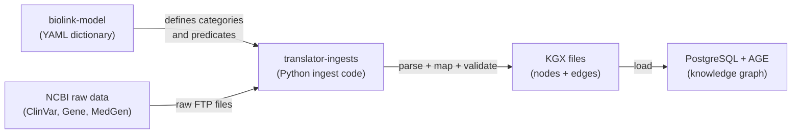

# The biolink repos: what they are and how to use them for the NCBI KG project

*Written using first-principles approach. Date: February 24, 2026.*

## Table of contents

- [Part 1: the two repos](#part-1-the-two-repos)
- [What is `biolink-model`?](#what-is-biolink-model)
- [What is `translator-ingests`?](#what-is-translator-ingests)
- [Part 2: how biolink fits your NCBI KG project](#part-2-how-biolink-fits-your-ncbi-kg-project)
- [What is the core problem biolink solves for you?](#what-is-the-core-problem-biolink-solves-for-you)
- [How biolink fits into your three project aims](#how-biolink-fits-into-your-three-project-aims)
- [The cross-KG query chain, concretely](#the-cross-kg-query-chain-concretely)
- [What this means for you: concrete next steps](#what-this-means-for-you-concrete-next-steps)
- [In one sentence](#in-one-sentence)



---

## Part 1: the two repos

---

## What is `biolink-model`?

`biolink-model` is the official dictionary for biomedical knowledge graphs.

It defines two things: **what things exist** (genes, diseases, variants, drugs) and **how they relate to each other** (gene → causes → disease). Every other knowledge graph that uses Biolink speaks this same language.

### Why does it exist?

Before Biolink, every database used different words for the same thing.

ClinVar said a variant "causes" a disease. Another database said it was "associated with." A third said "pathogenic for." These mean roughly the same thing  -  but a computer can't know that unless someone writes it down.

Biolink is that definition list. It says: "From now on, use `biolink:genetic_association` for all of these. Here is what it means. Here is how to use it."

### How does it work?

The entire model lives in **one YAML file**: `biolink-model.yaml`. It is 13,848 lines long.

That file defines two types of things:

1. **Classes**  -  the nouns. Examples:
   - `biolink:Gene`  -  a gene like GCK or BRCA1
   - `biolink:Disease`  -  a condition like Type 2 Diabetes
   - `biolink:SequenceVariant`  -  a specific DNA change like rs1799884
   - `biolink:ChemicalEntity`  -  a drug like semaglutide

2. **Predicates**  -  the verbs. Examples:
   - `biolink:genetic_association`  -  "this variant is genetically linked to this disease"
   - `biolink:treats`  -  "this drug treats this disease"
   - `biolink:expressed_in`  -  "this gene is expressed in this cell type"

From that one YAML file, the project automatically generates:

| Output format | What it's used for |
|---|---|
| JSON Schema | Validating data files |
| Python dataclasses | Writing Python code that handles Biolink data |
| OWL | Reasoning with ontology tools |
| GraphQL | Querying knowledge graphs via API |
| JSON-LD context | Linking data to the web (Linked Data) |

You don't need to author these separately. The YAML is the source of truth. Everything else is generated.

### What this means for you

You are mapping NCBI data (ClinVar, NCBI Gene, MedGen) to Biolink types. Concretely:

| Your NCBI data | Biolink class | Biolink predicate |
|---|---|---|
| A ClinVar variant | `biolink:SequenceVariant` |  -  |
| Variant → Disease | `biolink:genetic_association` |  -  |
| An NCBI Gene entry | `biolink:Gene` |  -  |
| Gene → GO term | `biolink:has_biological_process` |  -  |
| A MedGen disease concept | `biolink:Disease` (mapped to MONDO) |  -  |

The `biolink-model` repo is your **reference**. You read it to know which class or predicate to use. You do not modify it.

---

## What is `translator-ingests`?

`translator-ingests` is a Python codebase that shows you exactly how to take raw data from a database and convert it into a Biolink-compliant knowledge graph.

It was built by the NCATS Biomedical Data Translator team  -  the same team that runs the largest federated knowledge graph at NIH, integrating 150+ biomedical sources.

### Why does it exist?

Knowing the Biolink vocabulary isn't enough. You also need to actually convert your raw database rows into Biolink nodes and edges.

Every data source has its own format. ClinVar gives you a VCF file. NCBI Gene gives you tabular data. MedGen gives you UMLS mappings. A team has to write code that reads each one and outputs standardized Biolink nodes (genes, variants, diseases) and edges (associations).

`translator-ingests` provides the pattern, the tooling, and working examples for doing that conversion.

### How does it work?

The pipeline has five steps:

```
Raw data source (e.g., ClinVar VCF)
       ↓
   Download script (download.yaml)
       ↓
   Transform config (source.yaml)
       ↓
   Python parser (source.py) ← This is where your NCBI data gets converted
       ↓
   KGX output files (nodes.jsonl + edges.jsonl)
```

**KGX** (Knowledge Graph Exchange) is the standard file format for Biolink knowledge graphs. It produces two files:
- `nodes.jsonl`  -  every entity (gene, disease, variant) as a JSON line
- `edges.jsonl`  -  every relationship between entities as a JSON line

The parser uses a **Pydantic model** to validate each node and edge against the Biolink schema before writing it out. If a node doesn't match the schema, the validation catches the error.

**Key concept: Resource Ingest Guide (RIG)**
Every data source gets a `RIG`  -  a YAML file documenting what data is being ingested, what modeling decisions were made, and why. The RIG is both a technical spec and a record of decisions. You'll need to write one for ClinVar, one for NCBI Gene, and one for MedGen.

### What this means for you

`translator-ingests` is your **implementation model**. You use it as the template for writing your own ingest code for ClinVar, NCBI Gene, and MedGen.

The CTD (Comparative Toxicology Database) example in the repo is especially useful  -  it shows a complete worked example from raw data to KGX output.

Concretely, for the NCBI KG project, you would write:

| File | What it does |
|---|---|
| `clinvar/download.yaml` | Specifies how to download ClinVar data |
| `clinvar/clinvar.yaml` | Configuration for the transform |
| `clinvar/clinvar.py` | Python parser converting ClinVar rows to Biolink nodes/edges |
| `clinvar/clinvar_rig.yaml` | Documents the modeling decisions |
| `tests/unit/clinvar/test_clinvar.py` | Unit tests with mock data |

Then repeat for NCBI Gene and MedGen.

---

## Part 2: how biolink fits your NCBI KG project

---

## What is the core problem biolink solves for you?

You are trying to combine data from three NCBI databases (ClinVar, NCBI Gene, MedGen) into one knowledge graph, and then connect that graph to three other NLM knowledge graphs.

The problem: each database uses its own IDs, its own relationship words, its own disease names.

- ClinVar identifies diseases its own way.
- MedGen uses UMLS Concept Unique Identifiers (CUIs)  -  NCBI's internal disease IDs.
- MONDO is the standard disease ontology used by the other KGs.

Without Biolink, your graph and the Cell Phenotype KG would be speaking different languages. A query asking "what cell types express genes linked to Type 2 Diabetes?" couldn't cross from your graph to theirs.

Biolink is the shared vocabulary that makes cross-KG queries possible.

## How biolink fits into your three project aims

Your project has three stated aims. Here is how Biolink delivers each one:

### Aim 1: "born interoperable"

**What it means:** Your data should work with other NIH knowledge graphs out of the box, without a custom translation layer for each one.

**How Biolink delivers it:** Every other NLM KG project (Cell Phenotype KG, Healthy KG, REAL-KG) is also using Biolink as its schema. Your graph and theirs use the same class names and predicate names. A query that traverses from your `biolink:Gene` to their `biolink:CellType` works because both sides use the same type system.

NCATS Translator  -  the largest NIH knowledge graph system  -  also runs on Biolink. By adopting Biolink now, you can directly plug into Translator later without re-engineering your data model.

### Aim 2: "community standards"

**What it means:** Use established, peer-reviewed ontologies for naming things, not your own invented IDs.

**How Biolink delivers it:** Biolink doesn't replace MONDO, GO, or UBERON  -  it works alongside them. Biolink says *what kind of thing* something is (`biolink:Disease`). MONDO says *which specific disease* it is (`MONDO:0005148` = Type 2 Diabetes).

Your entity mapping in practice:

```
MedGen CUI → UMLS crosswalk → MONDO ID → biolink:Disease (category)
NCBI Gene ID → HGNC symbol  →           → biolink:Gene (category)
ClinVar VCV  → dbSNP rsID   →           → biolink:SequenceVariant (category)
```

Biolink provides the **category**. MONDO/GO/dbSNP provide the **specific identifier**.

### Aim 3: "user focused"

**What it means:** Stakeholders  -  researchers, data scientists, clinicians  -  can access and use the data.

**How Biolink delivers it:** Because the data follows Biolink, it can be queried through standard Translator APIs that researchers already know how to use. You don't need to build a custom query interface. The standard tooling works.

## The cross-KG query chain, concretely

Here is what becomes possible once your NCBI KG is Biolink-compliant. This is Use Case 2 from your overarching use cases document:

```
Question: "What cell types express proteins targeted by GLP-1 agonists,
           and what adverse events are associated with those tissues?"

Step 1  -  NCBI KG (your graph):
  Type 2 Diabetes (MONDO:0005148) → biolink:genetic_association → GCK gene
  GCK gene → biolink:has_variant → rs1799884 (ClinVar)

Step 2  -  Cell Phenotype KG:
  GCK gene → biolink:expressed_in → Pancreatic beta cell (Cell Ontology)

Step 3  -  Healthy KG:
  Pancreatic beta cell → biolink:located_in → Pancreatic Islet (UBERON)
  Pancreatic Islet → biolink:participates_in → insulin secretion (GO)

Step 4  -  REAL-KG:
  Glucokinase protein → biolink:targeted_by → Dorzagliatin (RxNorm)
  Dorzagliatin → biolink:has_adverse_event → Hypoglycemia (SNOMED CT)
```

This query chain works **only** because all four KGs use Biolink. Without it, each step would require a custom bridge.

---

## What this means for you: concrete next steps

| Step | What to do | Why |
|---|---|---|
| 1 | Read `biolink-model.yaml` classes: `Gene`, `Disease`, `SequenceVariant` | Understand what types your data maps to |
| 2 | Browse the CTD ingest example in `translator-ingests` | See a complete working ingest from raw data to KGX |
| 3 | Write a RIG for ClinVar | Document your modeling decisions before writing code |
| 4 | Write a RIG for NCBI Gene | Same |
| 5 | Write a RIG for MedGen | Focus here on the UMLS → MONDO crosswalk |
| 6 | Write a Python parser for each source using the `translator-ingests` template | Produce Biolink-compliant nodes and edges |
| 7 | Validate output KGX files against Biolink schema | Catch modeling errors before integration |

The hardest step is step 5. The MedGen → UMLS → MONDO mapping is the main technical uncertainty in your project. Your SOW correctly identifies this as a Month 2–3 task.

---

## In one sentence

The `biolink-model` repo is the dictionary. The `translator-ingests` repo is the instruction manual for using that dictionary to process real data. Your NCBI KG project uses both to make ClinVar, NCBI Gene, and MedGen speak the same language as every other NLM knowledge graph.
