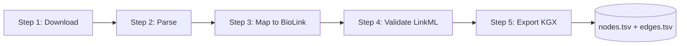
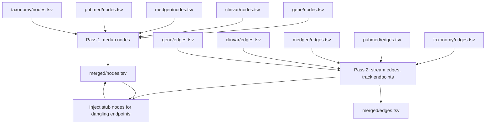

# Data mapping and ontology explained

A first-principles, A to Z reference for how raw NCBI data becomes a BioLink knowledge graph in this repo. Written so that a smart person who has never touched ontologies can read it once and understand every category, every predicate, and every rule that turns a row of FTP text into a node or edge.

The story sentence: NCBI gives us flat tables and XML; we apply a small fixed vocabulary (BioLink) and a small fixed set of identifier rules (CURIEs) to turn those tables into one merged graph where every fact is clickable back to its source.

## Table of contents

- [Who this is for](#who-this-is-for)
- [What an ontology is, and what BioLink is](#what-an-ontology-is-and-what-biolink-is)
- [The 5-step pipeline pattern](#the-5-step-pipeline-pattern)
- [CURIEs: the identifier contract](#curies-the-identifier-contract)
- [Per-pipeline mapping rules](#per-pipeline-mapping-rules)
- [The 5-database merge](#the-5-database-merge)
- [BioLink 4.x compliance: knowledge_level and agent_type](#biolink-4x-compliance-knowledge_level-and-agent_type)
- [How we know this works](#how-we-know-this-works)
- [Pointers to deeper docs](#pointers-to-deeper-docs)

## Who this is for

You, if you want to answer questions like:
- Why does ClinVar variant 12345 end up as `ClinVar:12345` and not `clinvar/12345`?
- Why is a gene-to-disease link labeled `biolink:gene_associated_with_condition` and not just `causes`?
- Where in the code does the rule live that says "any CURIE starting with `GO:` is a `biolink:BiologicalProcess`"?
- What happens if Gene says a record exists but ClinVar references one we never loaded?

Every answer is in this doc. Every claim points to a real file.

## What an ontology is, and what BioLink is

An ontology is a controlled vocabulary plus rules about how the words in that vocabulary relate. Instead of letting one pipeline write `gene` and another write `Gene` and a third write `protein-coding-gene`, an ontology says: there is exactly one term, `biolink:Gene`, and these are its valid relationships.

BioLink is the ontology used across most major biomedical knowledge graphs (Monarch, RTX-KG2, ROBOKOP). It defines a small, fixed list of node categories (Gene, Disease, SequenceVariant, etc.) and a small, fixed list of predicates (`gene_associated_with_condition`, `has_phenotype`, etc.). We use BioLink 4.x.

Why we use it instead of inventing our own:
- Interoperability: anything we build can plug into existing biomedical KGs.
- Trust: BioLink predicates have agreed semantics; `causes` is dangerously vague, `gene_associated_with_condition` is not.
- Tooling: KGX (the file format) and AGE loader expect BioLink-shaped data.

This repo uses 10 categories and 14 predicates total, defined once in [schema/biolink_ncbi.yaml](../../schema/biolink_ncbi.yaml) and enforced in [system-01-data-pipelines/shared/biolink_mapper.py](../../system-01-data-pipelines/shared/biolink_mapper.py) as `VALID_CATEGORIES` and `VALID_PREDICATES`. If a parser tries to emit anything outside those two frozensets, `map_node` or `map_edge` raises `ValueError`. There is no path where bad vocabulary reaches disk.

## The 5-step pipeline pattern

Every one of the 5 ETL pipelines (Gene, ClinVar, MedGen, PubMed, Taxonomy) follows the same five steps. This is a load-bearing constraint: it means once you understand one pipeline, the other four are variations on the same theme.



What each step does, in plain terms:

1. Download: pull the raw file from NCBI FTP. Idempotent: if the file is already cached and unchanged, skip the download. Lives in `<pipeline>/download.py`.
2. Parse: open the raw file (gzip TSV, XML, RRF, dmp), pull out only the columns we need, yield Python dicts. Lives in `<pipeline>/parse_*.py`.
3. Map: take a parsed row and call `map_node()` or `map_edge()`. This is where the BioLink category or predicate is assigned, and where the CURIE is built. Lives inside the same parse files (they map as they parse).
4. Validate: run the LinkML validator against `schema/biolink_ncbi.yaml`. Reject with reason; never silently drop. Lives in [shared/validator.py](../../system-01-data-pipelines/shared/validator.py).
5. Export: write to KGX format, two tab-separated files (`nodes.tsv` and `edges.tsv`) with every required provenance field on every row. Lives in [shared/kgx_exporter.py](../../system-01-data-pipelines/shared/kgx_exporter.py).

Steps 3 and 4 are the heart of the system. Step 3 says "here is what this row means in BioLink terms." Step 4 says "yes, that meaning is well-formed." Everything else is plumbing.

## CURIEs: the identifier contract

A CURIE is a Compact URI: a short prefix, a colon, then a local ID. Examples:
- `NCBIGene:7157` (the TP53 gene)
- `MONDO:0005148` (type 2 diabetes)
- `PMID:12345678` (a PubMed article)
- `biolink:Gene` (a category, also a CURIE)

The full URL is reconstructed by looking up the prefix in the schema's `prefixes:` block. So `NCBIGene:7157` expands to `https://www.ncbi.nlm.nih.gov/gene/7157`. The prefix map lives in [schema/biolink_ncbi.yaml](../../schema/biolink_ncbi.yaml) lines 27 to 40.

We did not invent any prefix. Every one traces to either the W3C CURIE standard, the Bioregistry, or the BioLink Model.

The two places the prefix-to-category rules live in code:

1. [schema/biolink_ncbi.yaml](../../schema/biolink_ncbi.yaml): the canonical declaration. Lists every prefix and its full URL expansion.
2. [system-01-data-pipelines/shared/merger.py](../../system-01-data-pipelines/shared/merger.py) lines 39 to 50: the runtime map used to infer a category for stub nodes. Reproduced here for reference:

```python
_PREFIX_TO_CATEGORY: list[tuple[str, str]] = [
    ("NCBIGene:", "biolink:Gene"),
    ("PMID:", "biolink:Article"),
    ("MeSH:", "biolink:OntologyClass"),
    ("GO:", "biolink:BiologicalProcess"),
    ("MedGen:", "biolink:Disease"),
    ("MONDO:", "biolink:Disease"),
    ("NCBITaxon:", "biolink:OrganismTaxon"),
    ("HP:", "biolink:PhenotypicFeature"),
    ("ClinVar:", "biolink:SequenceVariant"),
    ("UMLS:", "biolink:Disease"),
]
```

Order matters: the first matching prefix wins. Anything unrecognized falls through to `biolink:NamedThing`, which is the BioLink root category and a signal that something needs investigation.

## Per-pipeline mapping rules

Each subsection covers what the pipeline reads, how it decides categories and predicates, and one concrete worked example.

### Gene pipeline

Lives in [system-01-data-pipelines/gene/](../../system-01-data-pipelines/gene/). Reads six NCBI Gene FTP files:

| Input file | Parser | What it produces |
|------------|--------|------------------|
| `gene_info.gz` | `parse_gene_info.py` | Gene nodes + `in_taxon` edges to NCBITaxon |
| `gene2go.gz` | `parse_gene2go.py` | GO term nodes (Process/Function/Component) + edges to genes |
| `gene2pubmed.gz` | `parse_gene2pubmed.py` | `mentioned_in` edges from genes to PMIDs |
| `mim2gene_medgen` | `parse_mim2gene.py` | `gene_associated_with_condition` edges to MedGen/MIM |
| `gene_orthologs.gz` | `parse_orthologs.py` | `orthologous_to` edges between genes across taxa |
| `gene_refseq_uniprotkb_collab.gz` | `parse_refseq_uniprot.py` | RefSeq-UniProt cross-references |

Category rules:
- Every row of `gene_info.gz` becomes one node with `category="biolink:Gene"` (hard-coded at [parse_gene_info.py line 161](../../system-01-data-pipelines/gene/parse_gene_info.py)).
- GO terms get categories from a fixed map in `parse_gene2go.py` lines 45-47: `Process` → `biolink:BiologicalProcess`, `Function` → `biolink:MolecularActivity`, `Component` → `biolink:CellularComponent`.

Predicate rules:
- Gene to taxon: `biolink:in_taxon` (always).
- Gene to GO term: `biolink:participates_in` (Process), `biolink:actively_involved_in` (Function), `biolink:located_in` (Component). The `gene2go` GO category dictates the predicate. From `parse_gene2go.py`:

```python
_GO_PREDICATE_MAP = {
    "Process":   ("biolink:participates_in", "biolink:BiologicalProcess"),
    "Function":  ("biolink:actively_involved_in", "biolink:MolecularActivity"),
    "Component": ("biolink:located_in", "biolink:CellularComponent"),
}
```

- Gene to PMID: `biolink:mentioned_in`.
- Gene to disease (via MIM): `biolink:gene_associated_with_condition`.
- Gene to gene (orthologs): `biolink:orthologous_to`.

Provenance set on every gene node: `source="NCBI Gene"`, `source_url=https://www.ncbi.nlm.nih.gov/gene/{geneid}`.

Worked example. Raw row from `gene_info.gz`:

```
9606  7157  TP53  -  TRP53|p53  ... tumor protein p53 ...
```

After Step 3 mapping, the node:

```python
{
  "id": "NCBIGene:7157",
  "category": "biolink:Gene",
  "name": "TP53",
  "source": "NCBI Gene",
  "source_url": "https://www.ncbi.nlm.nih.gov/gene/7157",
  "synonyms": ["TRP53", "p53"],
  "description": "tumor protein p53",
}
```

And the companion edge:

```python
{
  "subject": "NCBIGene:7157",
  "predicate": "biolink:in_taxon",
  "object": "NCBITaxon:9606",
  "source": "NCBI Gene",
  "source_url": "https://www.ncbi.nlm.nih.gov/gene/7157",
  "knowledge_level": "knowledge_assertion",
  "agent_type": "manual_agent",
}
```

### ClinVar pipeline

Lives in [system-01-data-pipelines/clinvar/](../../system-01-data-pipelines/clinvar/). Reads two files:

| Input file | Parser | What it produces |
|------------|--------|------------------|
| `variant_summary.txt.gz` | `parse_variant_summary.py` | SequenceVariant nodes + edges to genes and phenotypes |
| `var_citations.txt` | `parse_var_citations.py` | `cited_in` edges from variants to PMIDs |

Category rules:
- Every variant row produces one node with `category="biolink:SequenceVariant"` ([parse_variant_summary.py line 164](../../system-01-data-pipelines/clinvar/parse_variant_summary.py)).

Predicate rules:
- Variant to gene: `biolink:is_sequence_variant_of` (line 184).
- Variant to phenotype/disease: `biolink:has_phenotype` (line 196). The phenotype object is a MedGen or OMIM CURIE depending on what the row carries.
- Variant to PMID: `biolink:cited_in` (parse_var_citations.py line 105).

Worked example. Raw `variant_summary.txt.gz` row (relevant fields):

```
VariationID=12345  Name="NM_000546.6:c.215C>G (p.Pro72Arg)"  GeneID=7157  PhenotypeIDS=MedGen:C0027672
```

Becomes:

```python
# Node
{
  "id": "ClinVar:12345",
  "category": "biolink:SequenceVariant",
  "name": "NM_000546.6:c.215C>G (p.Pro72Arg)",
  "source": "ClinVar",
  "source_url": "https://www.ncbi.nlm.nih.gov/clinvar/variation/12345/",
  ...
}
# Edge to gene
{ "subject": "ClinVar:12345", "predicate": "biolink:is_sequence_variant_of",
  "object": "NCBIGene:7157", ... }
# Edge to phenotype
{ "subject": "ClinVar:12345", "predicate": "biolink:has_phenotype",
  "object": "MedGen:C0027672", ... }
```

Note the cross-pipeline link: this ClinVar edge points at `NCBIGene:7157`, a node produced by the Gene pipeline. That cross-link is exactly what makes the merge interesting (and what makes stub injection necessary, see below).

### MedGen pipeline

Lives in [system-01-data-pipelines/medgen/](../../system-01-data-pipelines/medgen/). Reads five files:

| Input file | Parser | What it produces |
|------------|--------|------------------|
| `MedGenIDMappings.txt.gz` | `parse_id_mappings.py` | Disease/PhenotypicFeature nodes with MONDO promotion |
| `NAMES.RRF.gz` | `parse_names.py` | CUI to display-name lookup |
| `MGREL.RRF.gz` | `parse_mgrel.py` | `subclass_of` edges between MedGen concepts |
| `mim2gene_medgen` (HPO/OMIM) | `parse_hpo_omim.py` | `close_match` edges to HP and OMIM |
| `pubmed_links.txt` | `parse_pubmed_links.py` | `mentioned_in` edges to PMIDs |

Category rules. MedGen rows describe medical concepts. The rule is in `parse_id_mappings.py` `_assign_category()` (line 56-57): if the Semantic Type (STY) string contains a phenotype-flavored fragment, category is `biolink:PhenotypicFeature`; otherwise `biolink:Disease`.

CURIE rule (the interesting one). MedGen uses CUIs as primary keys (e.g. `C0027672`). But MONDO is the cleaner, cross-resource disease ontology. So we promote: if any row for a CUI has a MONDO cross-reference, the canonical node id becomes `MONDO:{id}`; otherwise it falls back to `MedGen:{CUI}`. Code at [parse_id_mappings.py line 122-123, 142](../../system-01-data-pipelines/medgen/parse_id_mappings.py):

```python
if source == "MONDO" and source_id and source_id not in ("-", ""):
    entry["mondo_id"] = source_id
...
node_id = entry["mondo_id"] if entry["mondo_id"] else f"MedGen:{cui}"
cui_to_canonical_id[cui] = node_id
```

The returned `cui_to_canonical_id` map is then used in `pipeline.py` to rewrite every edge that originally said `MedGen:Cxxx` so it points at the new MONDO canonical id. This is the "CUI rewriting" step. Without it, half the edges would dangle: the node now lives at `MONDO:0005148` but the edge still pointed at `MedGen:C0011860`.

Predicate rules:
- MedGen to MedGen: `biolink:subclass_of` (parse_mgrel.py line 82).
- MedGen to HP or OMIM: `biolink:close_match` (parse_hpo_omim.py lines 98 and 114).
- MedGen to PMID: `biolink:mentioned_in` (parse_pubmed_links.py line 94).

### PubMed pipeline

Lives in [system-01-data-pipelines/pubmed/](../../system-01-data-pipelines/pubmed/). Reads:

| Input file | Parser | What it produces |
|------------|--------|------------------|
| MeSH descriptor XML | `parse_mesh_nodes.py` | OntologyClass nodes for MeSH terms |
| PubMed baseline XML | `parse_pubmed_xml.py` | Article nodes + `has_mesh_annotation` edges |

Category rules (hard-coded constants at top of each file):
- MeSH descriptors: `biolink:OntologyClass` (parse_mesh_nodes.py line 25).
- PubMed articles: `biolink:Article` (parse_pubmed_xml.py line 38).

Predicate rules:
- Article to MeSH term: `biolink:has_mesh_annotation` (parse_pubmed_xml.py line 39).

Worked example. PubMed XML article:

```xml
<PubmedArticle>
  <PMID>12345678</PMID>
  <ArticleTitle>The role of TP53 in apoptosis</ArticleTitle>
  <MeshHeading><DescriptorName UI="D016158">Apoptosis</DescriptorName></MeshHeading>
</PubmedArticle>
```

Becomes:

```python
# Node
{ "id": "PMID:12345678", "category": "biolink:Article",
  "name": "The role of TP53 in apoptosis", "source": "PubMed", ... }
# Edge
{ "subject": "PMID:12345678", "predicate": "biolink:has_mesh_annotation",
  "object": "MeSH:D016158", ... }
```

### Taxonomy pipeline

Lives in [system-01-data-pipelines/taxonomy/](../../system-01-data-pipelines/taxonomy/). Reads NCBI's `taxdump`:

| Input file | Parser | What it produces |
|------------|--------|------------------|
| `nodes.dmp` | `parse_nodes.py` | OrganismTaxon nodes (id + parent only) + `subclass_of` edges |
| `names.dmp` | `parse_names.py` | tax_id to scientific-name lookup |

Category rule:
- Every taxonomy row: `biolink:OrganismTaxon` (parse_nodes.py line 109).

Predicate rule:
- Child to parent: `biolink:subclass_of` (parse_nodes.py line 123). NCBI taxonomy is a strict tree, so each non-root node has exactly one parent edge.

The pipeline does the join in `pipeline.py`: parse_nodes yields the structural skeleton, parse_names provides the names, then `map_node` is called per row.

## The 5-database merge

Implemented in [system-01-data-pipelines/shared/merger.py](../../system-01-data-pipelines/shared/merger.py). The merge is a streaming two-pass operation, written without pandas to keep memory bounded.



How dedup works (Pass 1):
- Stream every `nodes.tsv` row by row. Keep a `seen_ids: set[str]`. If a CURIE appears twice (e.g. `MONDO:0005148` produced by both MedGen and ClinVar), keep the first, drop the rest. Counter logs how many duplicates each prefix dropped.

How dangling-edge handling works (Pass 2 + stub injection):
- Stream every `edges.tsv` row by row. For each edge, check if `subject` and `object` are in `seen_ids`. If not, add the missing CURIE to `dangling_endpoints: set[str]`.
- After Pass 2 finishes, walk `dangling_endpoints` and synthesise a minimal stub node per missing CURIE. The stub's category is inferred from the CURIE prefix using `_infer_category()` (the prefix map shown earlier). The stub is marked `source="stub"` so it can be distinguished from real nodes downstream.
- Stubs are appended to `merged/nodes.tsv`. After this, by construction, no edge dangles. This is the zero-dangling-edge policy.

Why stubs instead of dropping dangling edges: because cross-pipeline edges are the whole point. If ClinVar references a Gene row we did not download in this run, dropping the edge would silently lose the connection. A stub preserves the link and tells the next maintainer "we know this CURIE was referenced, we did not have a full record for it at merge time." When the missing pipeline runs and produces a real node, the stub gets overwritten on the next merge.

For a much deeper walkthrough of the merge logic, see [docs/architecture/Merge_logic_explained.md](Merge_logic_explained.md).

## BioLink 4.x compliance: knowledge_level and agent_type

BioLink 4.x added two required slots on every edge: `knowledge_level` and `agent_type`. They answer "how was this fact established?" and "by whom?"

Defaults are set in [shared/biolink_mapper.py `map_edge`](../../system-01-data-pipelines/shared/biolink_mapper.py) lines 160-161:

```python
def map_edge(
    ...
    knowledge_level: str = "knowledge_assertion",
    agent_type: str = "manual_agent",
    ...
)
```

What the defaults mean:
- `knowledge_assertion`: the source database asserts this as a fact (not predicted, not statistical).
- `manual_agent`: a human curator at NCBI (or the upstream provider) made the call.

These defaults match the bulk of NCBI data, which is curator-asserted. Any parser that knows better can override. For example, an ortholog edge could pass `knowledge_level="prediction"` and `agent_type="data_analysis_pipeline"` if we wanted to be more precise about computational orthology calls.

Validation: the LinkML validator checks that both fields are present and non-empty on every edge. The exporter writes them to KGX edges.tsv as columns. Failure to set them raises `ValueError` in `map_edge` itself, before the edge ever reaches disk.

## How we know this works

Five independent confirmations that the mapping is correct:

1. Schema validation. Every node and edge passes through `map_node` / `map_edge`, which check category and predicate against `VALID_CATEGORIES` and `VALID_PREDICATES`. Bad vocabulary cannot reach disk.
2. 184 unit and integration tests. They cover parsers, mapper edge cases, merge dedup, stub injection, and round-trip KGX export. Tests live in `tests/` and run on every change.
3. KGX validate. The KGX library's `validate` command runs over the merged output, independently checking shape (column names, header presence, no nulls in required fields, valid CURIE syntax).
4. awk verify. A separate shell-level check counts node IDs in nodes.tsv vs subject and object IDs referenced in edges.tsv. The 64K mismatches found during Phase 4.0 traced not to mapping bugs but to quoted multi-line PubMed abstracts confusing line counting. The mapping itself was clean.
5. Verbatim from reference repo. The category list, predicate list, and per-pipeline rules are copied directly from the reference 9-step BioLink pipeline at `reference-repos/ncbi_ai_agents/KG/pipeline/src/glucose_metabolism_kg/`. We did not invent vocabulary; we adopted a working one.

If all five pass, the graph is correct by construction.

## Pointers to deeper docs

| Doc | What it explains |
|-----|------------------|
| [docs/architecture/Merge_logic_explained.md](Merge_logic_explained.md) | First-principles walkthrough of the merge, dedup, stub injection |
| [docs/architecture/Biolink_repos_explained.md](Biolink_repos_explained.md) | Where BioLink and LinkML fit, which upstream repos define the schema |
| [docs/architecture/AGE_loader_explained.md](AGE_loader_explained.md) | How the merged KGX gets loaded into PostgreSQL + AGE for openCypher queries |
| [schema/biolink_ncbi.yaml](../../schema/biolink_ncbi.yaml) | Canonical LinkML schema; the source of truth for vocabulary |
| [system-01-data-pipelines/shared/merger.py](../../system-01-data-pipelines/shared/merger.py) | The merge implementation, including `_PREFIX_TO_CATEGORY` |
| [system-01-data-pipelines/shared/biolink_mapper.py](../../system-01-data-pipelines/shared/biolink_mapper.py) | `map_node`, `map_edge`, `VALID_CATEGORIES`, `VALID_PREDICATES` |
| [DECISIONS.md](../../DECISIONS.md) rows 12, 32-34 | Why we chose BioLink 4.x, how MONDO promotion was decided, knowledge_level defaults |
| [docs/learnings.md](../learnings.md) | "Understanding: CURIE and how KGX uses it" section, full per-database CURIE rationale |

Last updated: 2026-04-22
