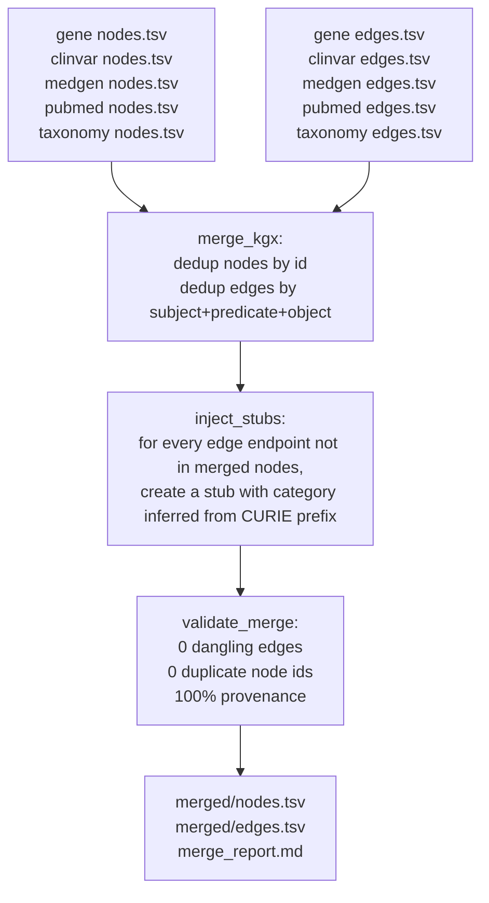

# The 5-database merge explained

A first-principles walkthrough of what the merge step does, why it exists, the axioms it relies on, and the schema that governs it.

Related code:
- `system-01-data-pipelines/shared/merger.py` (merge_kgx, inject_stubs, validate_merge)
- `system-01-data-pipelines/merge/pipeline.py` (run_five_database_merge)
- `schema/biolink_ncbi.yaml` (LinkML schema)

---

## What is the merge?

The merge is the step where five independent pipelines' outputs (gene, clinvar, medgen, pubmed, taxonomy) get combined into one knowledge graph that has every node exactly once, every edge with both endpoints present, and every category and predicate drawn from the BioLink Model.

It is not a join. It is not a pivot. It is a set-union with rules: dedup by identity, resolve cross-pipeline references, enforce schema.

## Why does it exist?

Each pipeline writes its own KGX files. That's a design choice, not an accident: parsing gene_info is unrelated to parsing pubmed XML, so the parsers live in isolation. But isolation creates a problem.

The Gene pipeline produces edges like:

```
NCBIGene:7157  biolink:mentioned_in  PMID:12345678
```

The `NCBIGene:7157` node exists in gene's nodes.tsv. But the `PMID:12345678` node lives in pubmed's nodes.tsv. After the Gene pipeline runs, that edge is dangling: the subject has a home but the object points nowhere.

The merge is the step that stitches those references together. Without it, you would load 5 disconnected graphs. With it, you get one graph where a Cypher query can traverse from gene to article to MeSH term to taxon without hitting dead ends.

## How does it work?

Three passes on data flowing through `shared/merger.py`:



### Pass 1: dedup by identity

For every nodes.tsv across the 5 pipelines, collect rows keyed by `id` (the CURIE). If `NCBIGene:7157` appears in both gene's and clinvar's nodes.tsv, keep the first occurrence and drop duplicates. Same for edges, keyed by `(subject, predicate, object)`.

### Pass 2: stub injection for dangling references

For every merged edge, check that both subject and object exist in the merged node set. If not, create a stub node with:

- `id` = the CURIE from the edge
- `category` = looked up from the CURIE prefix ([shared/merger.py:31-42](../../system-01-data-pipelines/shared/merger.py#L31-L42))
- `name` = the CURIE itself (placeholder; real name comes when the referenced pipeline runs later)
- `source` = the database whose edge needed the stub
- `source_url` = derived from the CURIE

The prefix-to-category table in `merger.py` is the bridge between free-form cross-references and the strongly-typed BioLink categories:

| Prefix | BioLink category |
|--------|-----------------|
| `NCBIGene:` | biolink:Gene |
| `PMID:` | biolink:Article |
| `MeSH:` | biolink:OntologyClass |
| `GO:` | biolink:BiologicalProcess |
| `MedGen:`, `MONDO:`, `UMLS:` | biolink:Disease |
| `NCBITaxon:` | biolink:OrganismTaxon |
| `HP:` | biolink:PhenotypicFeature |
| `ClinVar:` | biolink:SequenceVariant |

### Pass 3: validate

The merged graph must pass three checks: zero dangling edges, zero duplicate node IDs, 100% provenance (every node and edge has source and source_url). If any fail, the merge reports the counts but still writes the files.

## The axioms

Every design decision in the merge rests on these:

1. **Same CURIE = same entity.** If two pipelines produce `NCBIGene:7157`, that is the same gene, not two similar ones. This is why dedup works.
2. **Every edge must have both endpoints as nodes.** An edge whose subject or object is unknown is not a knowledge claim; it's noise. Stubs exist so that the graph keeps the edge but promises the endpoint is a real thing.
3. **CURIE prefix implies BioLink category.** `NCBITaxon:9606` is always a `biolink:OrganismTaxon`. This lets the merger assign a category to stub nodes without round-tripping to the source database.
4. **Provenance is required on every node and edge.** Every fact in the graph must be traceable back to its NCBI source record. No source, no merge.

If any of these axioms are false, the merge produces a broken graph. The axioms are explicit so we can challenge them when a new data source (like dbSNP) introduces edge cases.

## The schema

**Yes, we have a schema.** Two layers:

### Layer 1: BioLink Model 4.x (external)

The BioLink Model is an open data model published at `https://biolink.github.io/biolink-model/`. It defines:

- Node categories like `biolink:Gene`, `biolink:Disease`, `biolink:Article`
- Edge predicates like `biolink:gene_associated_with_condition`, `biolink:subclass_of`
- Required slots on every `Association`: `knowledge_level`, `agent_type` (added in 4.x, fixed mid-Gate-2)

BioLink is the vocabulary. Any knowledge graph that claims BioLink compliance uses these exact strings.

### Layer 2: `schema/biolink_ncbi.yaml` (local LinkML)

LinkML is a schema language for data structures. The `schema/biolink_ncbi.yaml` file is our local schema, written in LinkML, that selects a subset of BioLink suitable for NCBI data. It defines:

- 10 node classes (Gene, SequenceVariant, Disease, PhenotypicFeature, Article, OrganismTaxon, BiologicalProcess, MolecularActivity, CellularComponent, OntologyClass)
- 15 edge classes (GeneConditionAssociation, VariantGeneAssociation, ArticleMeshAssociation, TaxonAssociation, etc.)
- Required fields on every node: `id, category, name, source, source_url`
- Required fields on every edge: `subject, predicate, object, source, source_url, knowledge_level, agent_type`
- Allowed CURIE prefixes: NCBIGene, ClinVar, dbSNP, MONDO, MedGen, HP, PMID, NCBITaxon, GO, MeSH
- Regex patterns on node IDs (e.g. `NCBIGene:\d+`)

The shared `biolink_mapper.py` uses this schema to validate every node and edge at pipeline-build time. The external `kgx validate` tool validates the final KGX files against the live BioLink Model.

## What this means for you

If you add a new pipeline (dbSNP in Phase 5), you must:

1. Use `shared/biolink_mapper.map_node` and `map_edge` to build records — they enforce the schema.
2. Pick the right BioLink category and predicate for your data. If you need a new one, extend `schema/biolink_ncbi.yaml` first, then update `VALID_CATEGORIES` / `VALID_PREDICATES` in `biolink_mapper.py`.
3. Make sure your CURIE prefix has a row in `merger.py`'s `_PREFIX_TO_CATEGORY` table. Otherwise stub injection will fall back to `biolink:NamedThing` and the downstream graph will have untyped placeholders.
4. Include `knowledge_level` and `agent_type` explicitly if your edges come from a computed source (e.g. orthology predictions should use `agent_type="automated_agent"` and `knowledge_level="prediction"`). The default for manually-curated NCBI data is `knowledge_assertion` + `manual_agent`.

If you are debugging a merge failure:

1. Check `merge_report.md` in `data/kgx/merged/` first. It lists dangling counts, missing provenance, and category/predicate distribution.
2. If an edge is dangling, either the referenced pipeline wasn't included in the merge, or the CURIE prefix is wrong.
3. If a stub has `category = biolink:NamedThing`, add the prefix to `_PREFIX_TO_CATEGORY`.
4. If a duplicate node count is nonzero, two pipelines emitted different node records for the same CURIE — decide which is canonical and fix the loser.

---

Last updated: 2026-04-17
