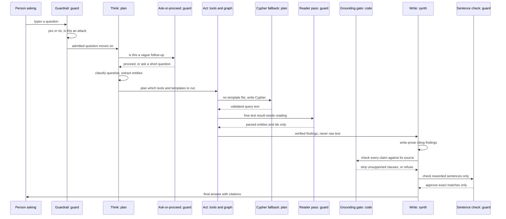
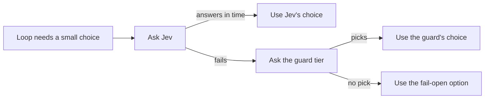

# Model architecture

Written 2026-09-25. This document covers:

- Which language models System 3 calls today
- What each call decides
- How the calls hand off to each other inside one question
- The cost, timeout and caching controls around them

It does not cover the wider system diagram (the five surfaces, the request lifecycle, auth, deployment). See `visualizations/Architecture_diagram.md` at the repository root for that.

## Table of contents

- [The short version](#the-short-version)
- [The three tiers](#the-three-tiers)
- [Every model call in one question](#every-model-call-in-one-question)
- [How the calls hand off to each other](#how-the-calls-hand-off-to-each-other)
- [What is not a model](#what-is-not-a-model)
- [Cost, time and caching](#cost-time-and-caching)
- [Jev as the classifier, live on develop](#jev-as-the-classifier-live-on-develop)
- [Where to change a model](#where-to-change-a-model)
- [What this document did not check](#what-this-document-did-not-check)

## The short version

- The agent loop is Guardrail, Think, Plan, Act, Write. Three of those steps and part of a fourth call a language model. Act mostly does not.
- Every model call, in every step, goes through one function, `Harness.call_tier`, and one route: LiteLLM to OpenRouter. Nothing calls a provider SDK directly.
- There are three tiers, not three fixed models. A tier is a job description (guard tier: the fast, cheap model used for quick yes-or-no decisions). Which real model answers a tier is a config value, read from an environment variable, not a choice made in code.
- On develop right now, the guard tier and the plan tier are the same model, deepseek/deepseek-v4-flash. That is a deployed override, not the code's own default. The synth tier is z-ai/glm-5.2 on both develop and in code.
- Eight model call sites exist in the loop today. Two of them (the guard tier's reworded sentence check, and a Cypher-generation fallback) exist specifically to check or replace another part of the pipeline, not to talk to the user.
- The most important safety rule in this whole document: a model never gets to state a fact as true just because it said so. Every model output that reaches a user passes through a deterministic, non-model check first (a schema, an exact-quote match, a validator) before the next step trusts it.

## The three tiers

Guard tier: the fastest, cheapest model. Used for yes-or-no and short-classification decisions:

- Does this question look like an attack
- Should we ask a one-word clarifying question
- Did this record actually get read correctly
- Does this one sentence say more than its source

Reasoning is turned fully off for this tier (`effort: none`), because reasoning tokens are billed as output tokens and this tier's job never needed them.

Plan tier: the mid-range model. Used to classify what kind of question was asked and pull out the entities in it, and, on the rare path where no fixed template fits, to write one Cypher query by hand. Reasoning is also off for this tier today, because build phase 2.1 measured that turning reasoning on cost roughly 27 times the latency for identical, correct answers on this tier's current job (writing one line of Cypher against a fixed schema).

Synth tier: the strongest model. It is used once per answer to turn a list of already-verified facts into prose the user reads. It runs a second time only if the first pass leaves out something it was shown. Reasoning is off here too, for the same measured reason: at any reasoning setting above none, this tier sometimes spent its whole output budget on reasoning and returned nothing usable in time.

| Tier | What it is for | Model on develop | Code default | Where set |
|------|-----------------|-------------------|---------------|-----------|
| Guard | Fast, cheap yes/no and short classification calls | deepseek/deepseek-v4-flash | deepseek/deepseek-v4-flash | `GUARD_MODEL` env var, falls back to `_DEFAULT_MODELS["guard"]` in `src/system_03_search_agent/harness/tiers.py:53` |
| Plan | Query classification, entity extraction, one-off Cypher generation | deepseek/deepseek-v4-flash (develop overrides the code default) | moonshotai/kimi-k2.6 | `PLAN_MODEL` env var, falls back to `_DEFAULT_MODELS["plan"]` in `src/system_03_search_agent/harness/tiers.py:54` |
| Synth | Final answer writing from verified facts | z-ai/glm-5.2 | z-ai/glm-5.2 | `SYNTH_MODEL` env var, falls back to `_DEFAULT_MODELS["synth"]` in `src/system_03_search_agent/harness/tiers.py:55` |

Develop's guard and plan tiers are currently the same model. That is a deployed environment-variable override read from Railway on 2026-09-25, not something the code does on purpose. Production's settings were not read for this document (see the last section).

A tier's resolved model is fetched once per question and held for that question's whole duration, through a `TierContext` object (`src/system_03_search_agent/harness/tiers.py:150` onward). A question never observes its own guard tier switch models partway through, even if the environment variable changes while the question is running.

## Every model call in one question

Every row below is issued through `Harness.call_tier` (`src/system_03_search_agent/harness/harness.py:513`), the single function every model call in the loop passes through. Most rows are also wrapped by `_dispatch_tier_call` (`src/system_03_search_agent/core/graph.py:765`), the shared sequence that checks the per-query cost cap, then calls the tier, then enforces the step's timeout, in that fixed order.

| Step | What the model decides or writes | Tier | What checks its output | What happens if it fails | File:line |
|------|-----------------------------------|------|--------------------------|----------------------------|-----------|
| Guardrail | Whether the question looks like a prompt-injection attempt against the system, as a yes/no verdict with a reason, and whether it is off topic | Guard. With `CLASSIFIER_PROVIDER=jev`, Jev is asked `guardrail.injection` alone beside this call, as a second judge: the question is refused as injection when this call OR Jev says so, so Jev can add a refusal and never remove one (build phase 8.6, rewired in its fix round after Jev admitted forged chat transcripts this call refused) | A Pydantic schema (`InjectionClassification`, `extra="forbid"`) must parse the reply; an unparseable reply is retried once, then fails the whole question rather than being treated as admitted | The question is not admitted. A parse failure or timeout raises and the run ends with a generic "a step hit a temporary error" message, never a silent pass-through. When Jev fails, or is still running at the guardrail's own budget, this call's verdict stands and the guard tier's generic decision prompt is never asked | `src/system_03_search_agent/core/graph.py`'s `_guardrail_after_prefilter` and `_jev_injection_pick`, classifier, `verdict_for_decision` and the injection decision's description in `src/system_03_search_agent/guardrail/classifier.py` |
| Think, ask-or-proceed | Whether a question of one to three words should be asked back, with choices written for its subject, or should just proceed (item 12.3) | Guard | A parsed `ClarifyDecision` shape from `src/system_03_search_agent/core/clarify.py`; any unparseable reply, timeout, or cap hit is treated as "proceed", never as a block | Fails open on purpose: the product owner's instruction is that a broken classifier must never stop a question that could otherwise be answered, so failure just means no clarifying question is asked | `src/system_03_search_agent/core/graph.py:2125` |
| Think, classification | What kind of question this is (a lookup, a comparison, a multi-hop question, and so on) and which entities it names | Plan, with either classifier provider. Build phase 8.6 made the class a `think.query_class` decision and its fix round reverted it: the guard provider's generic pick changed production's class unmeasured, and Jev's disagreed with the golden pin on 4 of 6 golden questions | A Pydantic schema (`_ThinkClassification`) must parse; one retry on an unusable reply, with a bounded excerpt of the bad reply logged so the cause is visible | Never fabricates or defaults a classification. Two unusable replies in a row fail the step and end the question with a generic error | `src/system_03_search_agent/core/graph.py`'s `_run_think_classification` |
| Act, Cypher generation fallback | The literal Cypher query text, only when no fixed template matches the question shape | Plan | The Cypher validator (`src/system_03_search_agent/tools/cypher_validator.py`) checks the generated text before it ever reaches the graph; a validator rejection is fed back to the model once as a repair prompt | A second failed attempt returns a tool-level error result, not a query run against the graph with unvalidated text | `src/system_03_search_agent/tools/cypher_generation.py:334`, called from `src/system_03_search_agent/tools/cypher_query.py` |
| Act, reader pass | A short read of one free-text tool result (for example an abstract), pulling out entities and normalized ids from it | Guard | The reply is parsed into a fixed `Finding` shape; nothing free-text from this pass reaches the user unmediated, and the Write step only ever sees what this parsed shape carries | A cap breach, timeout, or classified failure degrades to an empty-but-valid `Finding` marked as not attempted, rather than raising and failing every other concurrent tool call | `src/system_03_search_agent/harness/coordinator_worker.py:471` |
| Write, sentence check | Whether one reworded answer sentence says anything more than the exact record text it quotes, for sentences that already passed every code-only check but the wording itself. As a Jev decision: one yes-or-no question per sentence, every sentence of one answer in one call, and only "no, it says nothing more" approves | Guard. Jev alone when `CLASSIFIER_PROVIDER=jev`, never followed by the guard tier, through `check_reworded_sentences` (build phase 8.6, wired into `core/graph.py` from builder K's patch; fix round, F-8.6-A01) | Runs only after three deterministic checks already passed (the quote is in the record character for character, every number in the sentence is in the quote, the sentence negates exactly when its quote does); the model only ever answers the one remaining question | Fails closed: no candidates, too little time budget, the cost cap, a failed or unreadable reply, or a spent budget all approve nothing, and the answer falls back to what code alone already accepted. With Jev, a Jev failure approves nothing, and even odds approve nothing | `src/system_03_search_agent/core/graph.py`'s `_ground_with_sentence_check`, decision logic in `src/system_03_search_agent/synthesis/sentence_check.py` |
| Write, answer synthesis | The prose answer itself, built only from the facts it was handed | Synth | The deterministic cite-or-refuse grounding gate (`src/system_03_search_agent/synthesis/grounding.py`) strips any clause that cannot be traced to a specific finding, and refuses the whole answer if that strips out the question's core ask | A step timeout or classified call failure ends the question with a generic "a step hit a temporary error" message; the model never gets a second unchecked chance to fabricate | `src/system_03_search_agent/core/graph.py:9790` |
| Write, repair pass | A second attempt at the same answer, only when the first pass left out a fact it was shown and the code-built listing will not cite that fact by its own citation. Build phase 8.6 (T-8.6-07) let a paper's abstract or PMID count as shown once the listing's row for that paper was cited, and its fix round reverted that: the folded view is shown nowhere, so a gene's summary or the figure in an abstract vanished with no repair and no omission note | Synth | The same grounding gate re-runs against the repaired text | Runs only within whatever time remains of the Write step's one shared budget; if that budget or the cost cap is spent, the first pass's already-grounded answer stands | `src/system_03_search_agent/core/graph.py`'s `_code_built_lines_will_cite` decides; the call is in `_write_answer` |

That is eight call sites across five loop steps (Guardrail, Think, Act, Write, plus the ask-or-proceed decision that sits inside Think).

## How the calls hand off to each other

## What is not a model

Several load-bearing decisions in the loop are made by ordinary code, on purpose. A model is never asked to make them.

- The cite-or-refuse grounding gate (`src/system_03_search_agent/synthesis/grounding.py`): whether a sentence in the final answer is actually supported by a retrieved fact is decided by exact match or substring match after normalization, never by a similarity score. A fuzzy match would silently pass a hallucinated quote.
- The Cypher templates (`src/system_03_search_agent/tools/cypher_templates.py`): the everyday question shapes are answered by a fixed, parameterized query chosen in code from the bound entity type and a keyword test, not written fresh by a model each time. This exists because letting a model write Cypher for every question measured as inconsistent: the same question returned four sources on one run and five on the next.
- The trust verdict (`src/system_03_search_agent/synthesis/trust.py`): whether an answer is safe to state outright, flag, ask about, or refuse is a lookup over risk tier, whether the claim is grounded, and whether it is triangulated across independent sources. Every step in this module is a lookup or a comparison, stated in the module's own docstring, with no model-judged step.
- Tool calls to NCBI and enrichment APIs (EFetch, dbSNP, PubTator, LitVar2, ClinicalTrials.gov, and the graph itself over Cypher): these are ordinary HTTP or database calls, not model calls, and they return data for a model to read, never an instruction for a model to follow.

## Cost, time and caching

Cost caps (`src/system_03_search_agent/harness/cost_control.py`):

- A per-query dollar cap
- A per-user daily query count cap
- A system-wide daily dollar cap

Every model call goes through `_dispatch_tier_call`'s cap check first. A call that would breach the per-query cap is never dispatched at all, and the pending question is declined rather than run over budget.

Per-step timeouts (`Harness.enforce_timeout` at `src/system_03_search_agent/harness/harness.py:672`, and `budget_for_step` at `src/system_03_search_agent/harness/harness.py:432`): each step's timeout is chosen by which tier answers it, not by how hard the question looks. This is because measured latency tracks the tier, not the query. By tier:

- Guard: 15 seconds
- Plan: 45 seconds
- Synth: 45 seconds, shared across the Write step's two calls (the answer and its possible repair) rather than a full budget for each

Reasoning effort is turned off (`effort: none`) on all three tiers today. This was measured, not assumed: turning reasoning on for the plan tier's Cypher generation cost roughly 27 times the latency for correct output that did not change, and turning it on for the synth tier sometimes burned the entire output budget on reasoning and returned nothing.

Prompt caching (`src/system_03_search_agent/harness/cache.py`, design in `.claude/rules/prompt-cache-discipline.md`): the Think, Plan and Write calls share one stable prefix, assembled in a fixed order every time.

- The system instructions
- The tool schema list, sorted alphabetically and never reordered
- The static graph and BioLink schema
- The seeded few-shot examples

Nothing volatile is ever placed in this prefix: not the current question, not a timestamp, not a session id. Two calls deliberately skip the prefix: the Guardrail's attack classifier and the Write step's sentence check. Both were measured to sometimes act as the answering agent instead of doing their own narrow job when the prefix came first, so they run on the bare instruction instead.

## Jev as the classifier, live on develop

Built overnight on 2026-09-25 as build phase 8.2 (pull request #106) and switched on for develop with `CLASSIFIER_PROVIDER=jev`; production is unchanged, because the code default is `guard`. Jev, `typesafe/jev-1.13`, is reached through OpenRouter's `POST /api/alpha/decisions` endpoint by `harness/jev_client.py`, behind one seam, `decide()` in `harness/decide.py`. It returns a chosen option plus a probability for each option and a confidence score. It cannot write free text, so it is not a candidate for anything in the "Every model call" table above except the classification-shaped decisions.

The decisions it makes on develop:

- Whether a question is relevant to what the system covers (`guardrail.relevancy`), asked only when the biomedical word list does not recognise the question; the list can admit but never refuse.
- The one-to-three-word ask-back decision (`think.ask_back`); the guard tier still writes the choices offered, since Jev cannot write text.
- Whether a question asks for papers (`plan.literature`), replacing a word list.
- Whether a question asks for recent work without saying how recent (`think.recent_years`), which asks "How far back should I search?".
- Which resource to pull (`plan.resource`) is NOT wired: the plan makes no runtime choice between tools today. The closed option list it would use is `tools/catalogue.py`.
- Whether each reworded answer sentence says anything its quoted record words do not (the Write step's sentence check, build phase 8.6). Built in `synthesis/sentence_check.py`'s `check_reworded_sentences`: one call per answer carrying one yes-or-no question per sentence, which the endpoint accepts (thirty questions measured at 343 to 611 ms for $0.00033). A sentence is approved only when Jev picks "adds nothing" with a strictly higher probability, and a Jev failure approves nothing: the guard tier is never asked as a second chance (fix round, F-8.6-A01, A09). `core/graph.py`'s `_ground_with_sentence_check` calls it since builder K's patch was applied.
- Whether the question is a prompt-injection attempt (`guardrail.injection`, build phase 8.6), asked beside the guardrail's classifier call and only when `CLASSIFIER_PROVIDER=jev`; with the code default the classifier's own verdict stands, byte for byte as before. Jev is a second judge here, never the only one: the question is refused when the classifier OR Jev says injection. It is the one decision not asked through `decide()`: Jev is asked alone, and when Jev fails, or is still running at the guardrail's budget, the classifier's verdict stands, so the guard tier's generic decision prompt, which admitted 5 of 25 prefilter-passing injections where the classifier admitted 2, never judges it (fix round, F-8.6-A05, A06, A10, J04, A12).
- The question's shape is NOT a Jev decision. Build phase 8.6 made it one (`think.query_class`) and its fix round reverted that (F-8.6-J03, A07, A17): with either provider the class is the plan tier's classification, as before the phase.
- Whether the question asks about a condition's features, signs, symptoms or phenotype (`think.asks_features`, build phase 8.6), read by Write. Only on "asks_features" does an answer say "MedGen lists no clinical features for ..." or keep ten of the model's prompt slots for the disease's features; any other outcome speaks of neither. Since the fix round the sentence is also said only of a record MedGen's own semantic type marks as a disease (F-8.6-A11).

How each decision is made, since build phase 8.6 (DECISIONS.md 2026-09-25, "Jev decides; the guard tier (DeepSeek) is Jev's fallback on failure only"):

- Jev is asked alone. Its answer is used when it arrives within its 3-second total limit with one of the offered options, and the decision then takes Jev's time and nothing more.
- The guard tier is asked only when Jev fails: a timeout, an HTTP error, a malformed reply, an option outside the set, the cost cap, or an unexpected error. Its pick is used and Jev's reason is recorded in `fallback_reason`.
- No step waits on a decision past its own budget, the fallback included (fix round, F-8.6-A03, J08).
- Two decisions never fall back to the guard tier: `guardrail.injection`, where the guardrail classifier's verdict stands, and the sentence check, which approves nothing.
- When neither model makes a pick, the loop does what the decision point's fail-open option says, and the record reads `no_usable_pick:<Jev's reason>`.
- Nothing runs beside Jev any more. Build phase 8.2 asked the guard tier every decision at the same time as Jev and waited up to one second (`GUARD_COMPARISON_GRACE_S`, now removed) for a pick that was only recorded.
- Every decision rides on the answer's done event in `decisions`. Build phase 8.2's live comparison table is `testing/Developer/reports/2026-09-25_phase_8.2_golden/decisions_comparison.md`.

How the two models are compared now, off the live path (build phase 8.6):

- `testing/Developer/scripts/compare_classifiers.py` takes golden question ids and runs the loop's own Guardrail, Think and Plan steps for each, never Act or Write.
- Every decision the loop asks there goes to both Jev and the guard tier at once, through `compare_models` in `harness/decide.py`; the loop carries on with the pick the live seam would use. No live path calls either.
- It writes an agreement table per decision point and every disagreement with Jev's confidence, and it cannot spend past its budget, which it enforces as a per-question cost cap.
- The committed run, 10 golden questions and 18 decisions: all 18 agreed, Jev's median time per decision was 266 to 314 ms against the guard tier's 947 to 1334 ms, and the run cost $0.0097 (`testing/Developer/reports/2026-09-26_phase_8.6/classifier_comparison.md`).
- A first run minutes earlier disagreed once, on the one-word question "the": the guard tier said on topic and Jev said off topic at 0.84. In the committed run the guard tier changed its answer and Jev did not.
- It does not compare the Write step's sentence check, which needs a full answer, and no golden question reaches the ask-back decision, since the only two short ones are refused at the guardrail first.

## Where to change a model

The three tiers each resolve from an environment variable first, and a code default second: `GUARD_MODEL`, `PLAN_MODEL`, `SYNTH_MODEL`, read in `src/system_03_search_agent/harness/tiers.py:resolve_model`. Changing which real model answers a tier on a deployment is an environment variable edit, nothing more. Changing the app's own fallback default is a one-line edit to `_DEFAULT_MODELS` in the same file.

The standing rule from `.claude/rules/system-design-patterns.md` pattern 11 applies here: model identity is a harness decision, never an agent decision. `resolve_model` never hardcodes a model id inline outside that one table.

On a recurring failure, the standing order is to iterate the harness first and try a model swap only second. Iterating the harness means adjusting:

- The prompt
- The reasoning-effort setting
- The timeout
- The retry behavior

Every reasoning-effort and timeout value recorded in this document was arrived at exactly that way, by measuring the current model under a harness change before ever considering a different model.

## What this document did not check

- Production's `GUARD_MODEL`, `PLAN_MODEL`, and `SYNTH_MODEL` values were not read from Railway for this document. Only develop's settings, read 2026-09-25, are stated above.
- Whether the Jev classifier seam described in the planned section has any code scaffolding already in the repository was not checked beyond a grep for the name; the ticket that authorized this document states the decision as made but not yet built, and this document takes that at face value.
- This document lists every call site found by searching for `call_tier(`, `_dispatch_tier_call(`, and the tier name strings `"guard"`, `"plan"`, `"synth"` passed to a call, across the harness, guardrail, core, tools and synthesis packages. A call site added after 2026-09-25, or one that reaches a model through a path this search did not match, would not appear here.
