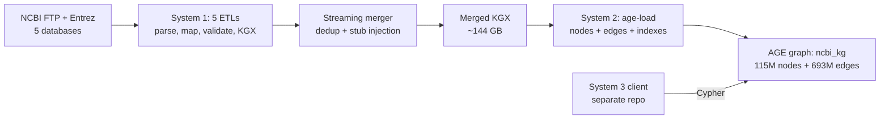
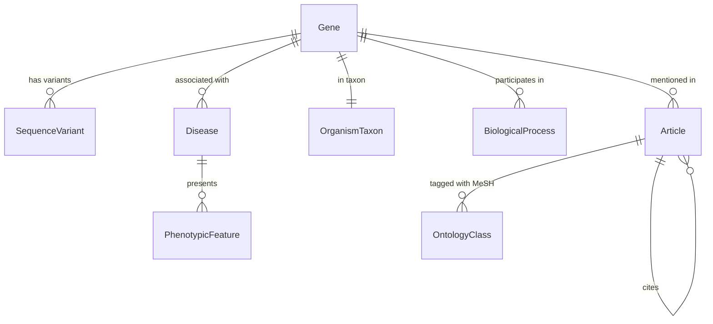
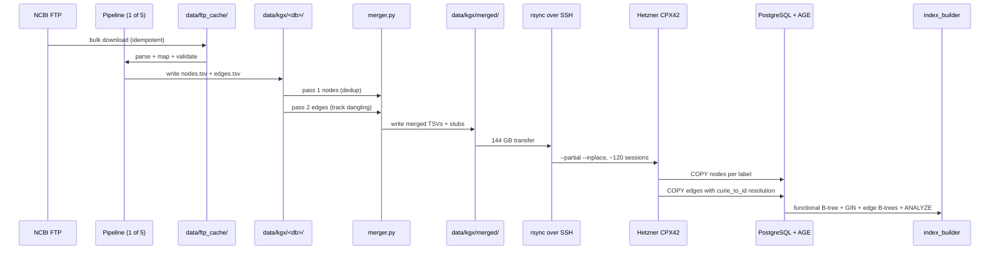

# Technical reference: NCBI knowledge graph V1

This is the technical walkthrough of the live V1 system: a BioLink-compliant knowledge graph built from 5 NCBI databases, merged into a single KGX dataset, and loaded into PostgreSQL 15.17 + Apache AGE 1.5.0 on a Hetzner CPX42 VPS at `46.225.128.133`. Final shape: 115,406,761 nodes and 693,295,991 edges across 11 vertex labels and 14 edge predicates. Read this if you need to understand what was built, how it was built, what it costs to run, and what the operating gotchas are.

This doc complements [docs/Knowledge_graph_on_server_reference.md](../Knowledge_graph_on_server_reference.md) (the live-server A-to-Z reference). Where overlap exists, this doc points there rather than repeating.

## Contents

1. [System overview: what V1 actually is](#1-system-overview-what-v1-actually-is)
2. [Deep dive 1: data, how obtained, cleaned, validated](#2-deep-dive-1-data-how-obtained-cleaned-validated)
3. [Deep dive 2: schema and the BioLink mapping](#3-deep-dive-2-schema-and-the-biolink-mapping)
4. [Deep dive 3: data flow end to end](#4-deep-dive-3-data-flow-end-to-end)
5. [Deep dive 4: indexing strategy](#5-deep-dive-4-indexing-strategy)
6. [Deep dive 5: Cypher query patterns and the three rules](#6-deep-dive-5-cypher-query-patterns-and-the-three-rules)
7. [Performance baselines](#7-performance-baselines)
8. [Phase 4.0 lessons (Problems 12 to 14)](#8-phase-40-lessons-problems-12-to-14)
9. [File map: every file worth knowing](#9-file-map-every-file-worth-knowing)
10. [Infrastructure and cost](#10-infrastructure-and-cost)
11. [What is NOT in scope](#11-what-is-not-in-scope)

## 1. System overview: what V1 actually is

A BioLink 4.x compliant knowledge graph covering five NCBI source databases: Gene, ClinVar, MedGen, PubMed, and Taxonomy. The graph lives in a single AGE graph called `ncbi_kg` inside one PostgreSQL 15 cluster on a single Hetzner CPX42 VPS. System 3 (a separate repo) connects as a read-only Cypher client. Nothing in this repo writes to the graph after the bulk load.



What it is not: this is not a general-purpose biomedical KG. It is the V1 cut: 5 databases, no dbSNP, no PubChem, no live enrichment. Layer 2 (on-demand API) and Layer 3 (enrichment) are query-time concerns owned by System 3. See [docs/architecture/Three_layer_data_architecture.md](Three_layer_data_architecture.md).

The full architecture and live counts live in [docs/visualizations/Architecture_diagram.md](../visualizations/Architecture_diagram.md). The schema with sample CURIEs and edge directionality lives in [docs/visualizations/Schema_visualization.md](../visualizations/Schema_visualization.md).

## 2. Deep dive 1: data, how obtained, cleaned, validated

### Sources

Five NCBI databases, all bulk-downloaded over FTP rather than streamed via Entrez. Bulk FTP is required at this scale: streaming Entrez at the 67M-row Gene level would take weeks under E-utilities rate limits.

| Source | What it provides | Key prefix | Pipeline |
| --- | --- | --- | --- |
| NCBI Gene | Gene records, orthologs, GO annotations | NCBIGene: | [system-01-data-pipelines/gene/](../../system-01-data-pipelines/gene/) |
| ClinVar | Sequence variants and clinical significance | ClinVar: | [system-01-data-pipelines/clinvar/](../../system-01-data-pipelines/clinvar/) |
| MedGen | Disease concepts and phenotypes | MedGen:, HP: | [system-01-data-pipelines/medgen/](../../system-01-data-pipelines/medgen/) |
| PubMed | Article metadata and MeSH annotations | PMID:, MeSH: | [system-01-data-pipelines/pubmed/](../../system-01-data-pipelines/pubmed/) |
| NCBI Taxonomy | Taxon records and parent links | NCBITaxon: | [system-01-data-pipelines/taxonomy/](../../system-01-data-pipelines/taxonomy/) |

### Per-pipeline 5-step pattern

Every ETL follows the same 5 steps. Code lives under [system-01-data-pipelines/](../../system-01-data-pipelines/), shared utilities under [system-01-data-pipelines/shared/](../../system-01-data-pipelines/shared/).

1. Download: idempotent FTP pull into `data/ftp_cache/`. Skips files whose timestamps and sizes match the cache.
2. Parse: format-specific parser (gzipped XML for PubMed, gzipped TSV for Gene, custom for ClinVar) yields Python objects.
3. Map: BioLink mapper assigns the right category, predicate, and canonical CURIE. The prefix-to-category map in [merger.py](../../system-01-data-pipelines/shared/merger.py) lines 39 to 50 is the source of truth.
4. Validate: LinkML validator at the export boundary. Every node needs id, category, name, source, source_url; every edge needs subject, predicate, object, source, source_url. Missing fields are rejected with a reason logged; never silently dropped.
5. Export: KGX TSV format to `data/kgx/<database>/nodes.tsv` and `edges.tsv`. KGX is the BioLink-standard interchange format.

Provenance is treated as a first-class type: any function that produces a node without `source` and `source_url` is treated as a bug. This is the architectural enforcement of the trust moat (every fact must be clickable back to its NCBI source record).

### Cleaning: deduplication, dangling-edge handling, stub injection

The merger ([merger.py](../../system-01-data-pipelines/shared/merger.py)) does three cleaning passes in two streams:

- Pass 1 streams every per-database `nodes.tsv` and dedups by CURIE. Memory: O(unique CURIEs) ~= 116M strings ~= 8 GB at peak, which is why the merger uses a `set` rather than a list. First-occurrence wins.
- Pass 2 streams every `edges.tsv` and tracks dangling endpoints (subject or object CURIEs that have no matching node from pass 1). Edges themselves are not deduplicated; cross-pipeline edge collisions are rare by construction and a full edge-triple set would need ~100 GB RAM.
- After pass 2, the merger synthesises a `NamedThing` stub for every dangling endpoint, with category inferred from the CURIE prefix. About 81K stubs are needed at V1 scale (now ~10K after Gate 3 cleanup). Stubs carry `source="stub"` and an empty `source_url` so they are easy to find later.

The result is a single merged KGX at `data/kgx/merged/nodes.tsv` and `edges.tsv`, ~144 GB total. See [docs/architecture/Merge_logic_explained.md](Merge_logic_explained.md) for the full first-principles walkthrough.

### Validation paths

Two validation passes:

1. Build-time, per pipeline: LinkML validator runs at step 5 of every ETL. Catches missing fields, bad CURIE formats, and unknown BioLink categories before KGX is written.
2. Merge-time: [merger.py](../../system-01-data-pipelines/shared/merger.py) tracks duplicates, dangling endpoints, and missing-provenance rows. The `validate_merge` function returns category and predicate counts as a final sanity check.

V1 build-time validation: 0 errors. Merge-time: 0 dangling endpoints after stub injection (stubs absorb everything). See [docs/architecture/Merge_logic_explained.md](Merge_logic_explained.md) for the algorithm and [docs/learnings.md](../learnings.md) for the operational issues encountered during the actual merge run.

## 3. Deep dive 2: schema and the BioLink mapping

The schema is encoded in [system-02-knowledge-graph/loader/schema.py](../../system-02-knowledge-graph/loader/schema.py) as two Python lists: `VERTEX_LABELS` (11 entries) and `EDGE_LABELS` (14 entries). These are the source of truth.



Full label-by-label tables, sample CURIEs, edge directionality, and live counts: [docs/visualizations/Schema_visualization.md](../visualizations/Schema_visualization.md).

Two design choices worth flagging:

First, both `MedGen:` and `MONDO:` map to `biolink:Disease` (and so does the rare `UMLS:`), but in practice the V1 graph stores almost all diseases under `MedGen:`. Queries that assume MONDO will return zero rows. Discover the right prefix with the small `MATCH ... LIMIT 5` exploratory pattern in Section R of [docs/Knowledge_graph_on_server_reference.md](../Knowledge_graph_on_server_reference.md).

Second, `NamedThing` is the catch-all label for stub nodes. If a query result lands on a NamedThing, the upstream ETL had a gap. The category is inferred from the CURIE prefix; the merger emits a per-prefix histogram in the run log so post-load triage is easy.

## 4. Deep dive 3: data flow end to end



The rsync hop deserves its own callout. The work laptop runs Windows; cwRsync over a single TCP flow drops at ~1.4 GB regardless of network or flags (NAT eviction or DPI reset, see [docs/learnings.md](../learnings.md) Phase 4 Problem 3). The fix is a retry loop in `scripts/rsync-retry.sh` that uses `--partial --inplace` to preserve transferred bytes across sessions. Total transfer: ~120 sessions, 4 to 8 wall-clock hours on home Wi-Fi.

The Windows-specific rsync gotchas (cygdrive paths, MSYS_NO_PATHCONV, OpenSSH vs cwRsync ssh) live in [docs/context/setup/setup-05_rsync_windows.md](../context/setup/setup-05_rsync_windows.md). The Hetzner provisioning steps live in [docs/context/setup/setup-04_hetzner_vps.md](../context/setup/setup-04_hetzner_vps.md).

## 5. Deep dive 4: indexing strategy

This was the hard part of Phase 4.0 and the subject of Problems 12 to 14 in [docs/learnings.md](../learnings.md). AGE label tables are bare Postgres heaps (Problem 13: AGE inheritance silently strips every Postgres guarantee). Nothing is indexed by default. The loader has to build everything Postgres normally gives you for free.

Four index types live on the graph after the Gate 3 close-out pass. All of them are folded into Step 8 of [system-02-knowledge-graph/loader/index_builder.py](../../system-02-knowledge-graph/loader/index_builder.py).

| Index type | Where | Purpose |
| --- | --- | --- |
| Functional B-tree on `agtype_to_text(properties -> '"id"')` | Every vertex label | Raw-SQL `WHERE agtype_to_text(...) = 'X'` lookups (used by the loader's edge-resolution code). Does not help Cypher. |
| graphid PK B-tree on the `id` column | Every vertex label | 1-row lookup by the AGE-assigned graphid. Without this, even a single-row lookup forces a parallel seq scan over millions of rows (root cause of Q2's 16 s before this index was added). |
| GIN on `properties` | Every vertex label that gets MATCHed | Cypher `MATCH (n:L {prop:val})` compiles to `WHERE properties @> '{"prop":"val"}'::agtype`, and `@>` containment can only be served by GIN. This is the Problem 12 fix. |
| B-tree on `start_id` and `end_id` | Every edge label | Required so any relationship traversal uses an index lookup instead of a seq scan + hash join over the entire edge table. |

After indexes are built, ANALYZE has to run on every vertex and edge table. Postgres autovacuum is idle on freshly-loaded tables because no DML happened, so it never schedules an ANALYZE on its own. Without fresh statistics, the planner falls back to defaults (assume 1000 rows, uniform distribution) and picks bad plans even when the right indexes exist.

Section I of [docs/Knowledge_graph_on_server_reference.md](../Knowledge_graph_on_server_reference.md) is the live-server reference for this; the lessons that produced the strategy are in Section 8 below.

## 6. Deep dive 5: Cypher query patterns and the three rules

Three rules from Section H of [docs/Knowledge_graph_on_server_reference.md](../Knowledge_graph_on_server_reference.md) cover 95% of performance issues. Internalize before writing any production query.

Rule 1: always specify the edge label. Write `[:is_sequence_variant_of]`, never `[r]`. AGE compiles untyped edges to a UNION ALL across all 14 edge tables, which is always slow. Q1 (BRCA1 to variants) went from 4 minutes 17 seconds to 229 ms when the typed edge was added.

Rule 2: match by `id` whenever possible, and use the right CURIE prefix. The `id` field is GIN-indexed on the high-traffic vertex labels. Matching by `name` falls back to a sequential scan unless the result set is naturally tiny. If you do not know the prefix, look it up first with a small `MATCH ... LIMIT 5` exploratory query.

Rule 3: keep regex matches narrow. `WHERE n.name =~ '(?i).*foo.*'` cannot use any index. It is fine on small labels (BiologicalProcess, ~17K rows: Q3 returns in 28 ms) but a death sentence on Article (40M) or Gene (67M). For full-text search use a SQL query against the underlying table with a `pg_trgm` GIN index, not Cypher.

The session prelude every psql session needs:

```sql
LOAD 'age';
SET search_path = ag_catalog, "$user", public;
\timing on
```

Cypher invocation form (the trailing `as (...)` clause is mandatory and must match the RETURN):

```sql
SELECT * FROM cypher('ncbi_kg', $$
    MATCH (g:Gene {id: 'NCBIGene:672'}) RETURN g.name LIMIT 1
$$) as (name agtype);
```

Canonical smoke-test queries live in [tests/cypher/gate3_queries.sql](../../tests/cypher/gate3_queries.sql) and the latest results in [tests/cypher/gate3_results_2026-04-22.txt](../../tests/cypher/gate3_results_2026-04-22.txt).

## 7. Performance baselines

Indexed-query baselines on the CPX42 after the Gate 3 tuning pass. Anything significantly above these numbers means a missing index, stale statistics, or one of the three slow patterns from Section 6.

| Query shape | Expected time | Live example |
| --- | --- | --- |
| MATCH by `id` on a GIN-indexed label | under 50 ms | Q5: NCBITaxon:9606 to Gene, 13.8 ms |
| Single-hop typed edge from a small node | under 500 ms | Q1: BRCA1 to variants, 224 ms |
| Two-hop with a large intermediate fan-out | seconds to tens of seconds | Q4: TP53 to articles, 26 s (Article label needs GIN) |
| Regex on small label (BiologicalProcess, ~17K) | 100 to 500 ms | Q3: glucose metabolism genes, 28 ms |
| Vertex count per label (Gene, 67M scan) | 10 to 30 s | Q6: 16.5 s |
| Edge count per label | under 30 ms | Q7: 23.6 ms |
| Untyped edge `[r]` | seconds to minutes | always avoid |

If a query falls outside its band, run `EXPLAIN` on the SQL form. A `Seq Scan` on a label table is the smoking gun for missing GIN; `Append` over every edge table means an untyped edge.

Q4 above (TP53 to articles, 26 s) is the visible reminder that GIN is currently only built on Gene, Disease, BiologicalProcess, and SequenceVariant. Article and the smaller labels still need GIN before they can be MATCHed by property at speed; see Category A of the comprehensive sweep findings in [docs/learnings.md](../learnings.md) Problem 13.

## 8. Phase 4.0 lessons (Problems 12 to 14)

These three problems define what the Phase 4.0 close-out actually was. Long-form versions live in [docs/learnings.md](../learnings.md); summaries here for reference.

Problem 12 (Cypher MATCH does sequential scan despite functional indexes): the loader built B-tree functional indexes on `agtype_to_text(properties -> '"id"')`, which is the right index for raw SQL written with that helper but the wrong index for Cypher. The Cypher engine compiles `MATCH (g:Gene {id: 'X'})` into `WHERE properties @> '{"id":"X"}'::agtype`, and the `@>` containment operator can only be served by GIN. First Cypher test took 4 minutes 17 seconds before timing out; after building GIN on `properties`, the same query landed in 229 ms. Fix: GIN on `properties` for every vertex label that will be MATCHed in Cypher.

Problem 13 (AGE inheritance silently strips every Postgres guarantee): AGE creates each label as a child table inheriting from `_ag_label_vertex` or `_ag_label_edge`. Postgres inheritance does not propagate primary keys, unique constraints, foreign keys, indexes, NOT NULL, or triggers from parent to child. So every "this is just a Postgres table, you get the normal stuff for free" assumption was wrong. The loader has to explicitly build five categories of structure (PK B-tree on id, GIN on properties, B-tree on edge endpoints, ANALYZE, and Postgres-config tuning) for the graph to be production-fast. The pattern of finding gaps one at a time during close-out (each fix exposing the next) is what made this the meta-problem behind Problem 12 and most of the close-out churn. Updated [index_builder.py](../../system-02-knowledge-graph/loader/index_builder.py) handles all five categories as Step 8.

Problem 14 (Hetzner does not allow disk shrink on rescale): the planned post-V1 downgrade from CPX42 (320 GB NVMe) to CPX32 (160 GB NVMe) cannot be done with the Rescale button. Hetzner's rescale only grows disk. The actual downsize path is snapshot-restore-to-new-server: snapshot the CPX42, create a new CPX32 with the snapshot as image, verify the smoke suite, delete the old server, update IP everywhere. Cost overlap during verification is roughly $0.10. Decision logged: stay on CPX42 for the first month post-V1 (+$10/mo over CPX32) until there is observed System 3 traffic to size against. See DECISIONS row 80.

The deeper meta-lesson across all three: when a tool's "load complete" message comes back, that means rows are in tables. It does not mean queries will be fast, or that the planner will pick the right plan, or that the cloud SKU you provisioned can be downsized. For databases that use inheritance, custom storage formats, or non-standard query compilation (AGE checks all three), making it fast is its own phase with its own checklist. For cloud infra, verify operational constraints with the provider's docs before planning a button-click downsize.

## 9. File map: every file worth knowing

### Pipelines and merge

| File | What it does |
| --- | --- |
| [system-01-data-pipelines/gene/](../../system-01-data-pipelines/gene/) | Gene ETL: 67.5M nodes, NCBIGene + orthologs |
| [system-01-data-pipelines/clinvar/](../../system-01-data-pipelines/clinvar/) | ClinVar ETL: 4.5M variants |
| [system-01-data-pipelines/medgen/](../../system-01-data-pipelines/medgen/) | MedGen ETL: 200K diseases + phenotypes |
| [system-01-data-pipelines/pubmed/](../../system-01-data-pipelines/pubmed/) | PubMed ETL: 40M articles + MeSH |
| [system-01-data-pipelines/taxonomy/](../../system-01-data-pipelines/taxonomy/) | Taxonomy ETL: 2.7M taxa |
| [system-01-data-pipelines/shared/merger.py](../../system-01-data-pipelines/shared/merger.py) | Streaming 2-pass merge with stub injection |
| [system-01-data-pipelines/shared/](../../system-01-data-pipelines/shared/) | Downloader, BioLink mapper, LinkML validator, KGX exporter |

### AGE loader

| File | What it does |
| --- | --- |
| [system-02-knowledge-graph/loader/connection.py](../../system-02-knowledge-graph/loader/connection.py) | psycopg2 connection with AGE preload |
| [system-02-knowledge-graph/loader/schema.py](../../system-02-knowledge-graph/loader/schema.py) | VERTEX_LABELS, EDGE_LABELS, idempotent DDL |
| [system-02-knowledge-graph/loader/node_loader.py](../../system-02-knowledge-graph/loader/node_loader.py) | COPY nodes per label table |
| [system-02-knowledge-graph/loader/edge_loader.py](../../system-02-knowledge-graph/loader/edge_loader.py) | Resolve CURIE to graphid, COPY edges |
| [system-02-knowledge-graph/loader/index_builder.py](../../system-02-knowledge-graph/loader/index_builder.py) | Step 8: B-tree + GIN + edge B-trees + ANALYZE |
| [system-02-knowledge-graph/loader/pipeline.py](../../system-02-knowledge-graph/loader/pipeline.py) | Top-level orchestrator |
| [system-02-knowledge-graph/loader/cli.py](../../system-02-knowledge-graph/loader/cli.py) | age-load CLI entry point |

### Tests and reference

| File | What it does |
| --- | --- |
| [tests/cypher/gate3_queries.sql](../../tests/cypher/gate3_queries.sql) | 7-query smoke-test suite |
| [tests/cypher/gate3_results_2026-04-22.txt](../../tests/cypher/gate3_results_2026-04-22.txt) | Live counts and timings |
| [docs/Knowledge_graph_on_server_reference.md](../Knowledge_graph_on_server_reference.md) | Live-server A-to-Z reference |
| [docs/visualizations/Architecture_diagram.md](../visualizations/Architecture_diagram.md) | System architecture diagrams |
| [docs/visualizations/Schema_visualization.md](../visualizations/Schema_visualization.md) | Schema, sample CURIEs, edge directionality |
| [docs/architecture/AGE_loader_explained.md](AGE_loader_explained.md) | First-principles loader walkthrough |
| [docs/architecture/Merge_logic_explained.md](Merge_logic_explained.md) | First-principles merge walkthrough |
| [docs/architecture/Three_layer_data_architecture.md](Three_layer_data_architecture.md) | Layer 1 vs Layer 2 vs Layer 3 |
| [docs/learnings.md](../learnings.md) | Operational lessons including Problems 12 to 14 |
| [DECISIONS.md](../../DECISIONS.md) | Decision log; rows 67 to 80 cover Phase 4 |

## 10. Infrastructure and cost

| Component | Detail |
| --- | --- |
| VPS | Hetzner CPX42 in Nuremberg (8 vCPU, 16 GB RAM, 320 GB NVMe) |
| OS | Ubuntu 22.04 LTS |
| Swap | 16 GB file-backed at `/swapfile`, persistent via fstab |
| PostgreSQL | 15.17 (default Ubuntu apt) |
| Apache AGE | 1.5.0 (built from source against PG 15) |
| Database | `ncbi_kg` |
| Schema | `ncbi_kg` (same name as the AGE graph) |
| Auth | `pg_hba.conf` trust for `postgres` over local + 127.0.0.1; firewall is SSH-only |
| Snapshot | ~28 GB compressed (3.5x ratio on graph data) |

Cost as of 2026-04-22 (post-April-1-2026 Hetzner price adjustment):

| Item | EUR/month | USD/month at €1≈$1.08 |
| --- | --- | --- |
| CPX42 base | €25.99 | ~$28.07 |
| Snapshot (28 GB compressed) | €0.40 | ~$0.43 |
| Bandwidth (20 TB/mo included; observed under 1 GB) | €0 | $0 |
| Total all-in | €26.39 | ~$28.50 |

Round to $30/month for FX volatility headroom. Future steady-state on CPX32 would be €20.39/mo (~$22/mo) but requires a snapshot-restore migration, not a Rescale click (Problem 14).

Full provisioning, hardening, and post-load tuning steps live in [docs/context/setup/setup-04_hetzner_vps.md](../context/setup/setup-04_hetzner_vps.md).

## 11. What is NOT in scope

These are deliberately excluded from V1. Avoid the temptation to ad-hoc-add them.

dbSNP is excluded. 1.2B variant records would not fit on the box, and the use case (allele frequency lookup by rs#) is better served by the live NCBI dbSNP REST API at query time, which is what System 3 will do. See DECISIONS row 66.

PubChem, SRA, dbGaP are excluded. SRA is raw sequencing reads (analysis pipelines, not search). dbGaP is controlled-access (IRB approval). PubChem is community-submitted with variable curation. See DECISIONS row 18.

Layer 2 enrichment data (variant annotations from third-party tools, expression data, drug bindings) is excluded. That data is meant to be fetched on demand by System 3 and joined at query time, not pre-ingested. See [docs/architecture/Three_layer_data_architecture.md](Three_layer_data_architecture.md).

System 3 components (FastAPI, LangGraph, UI, MCP servers, channel integrations) are not in this repo and not on this server. They live in a separate repository and connect to this graph as a Cypher client.

Variant-to-disease causal edges (`biolink:causes`) are not yet in V1. The PoC graph carried these but the V1 ETL does not yet emit them. Filed as a Phase-2 followup.

Last updated: 2026-04-22
