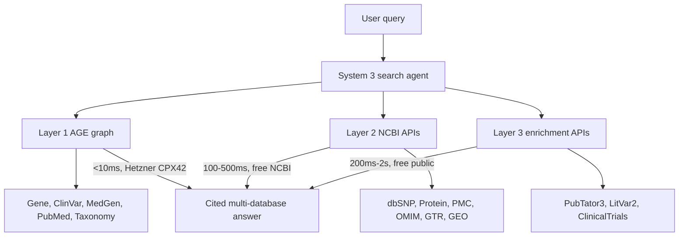

# Three-layer data architecture

How data flows from NCBI sources to user answers. Three layers, each with a different purpose, latency, and ownership.

## Table of contents

- [Layer 1: knowledge graph (System 1 + 2, this repo)](#layer-1-knowledge-graph-system-1--2-this-repo)
- [Why these 5 databases for Layer 1?](#why-these-5-databases-for-layer-1)
- [Why PostgreSQL + Apache AGE](#why-postgresql--apache-age)
- [Layer 2: NCBI on-demand APIs (System 3)](#layer-2-ncbi-on-demand-apis-system-3)
- [Layer 3: enrichment and external APIs (System 3)](#layer-3-enrichment-and-external-apis-system-3)
- [How they connect](#how-they-connect)
- [Estimated monthly cost](#estimated-monthly-cost)
- [Why this repo is the foundation](#why-this-repo-is-the-foundation)
- [What this repo does and does not do](#what-this-repo-does-and-does-not-do)
- [Handoff point](#handoff-point)
- [How System 3 connects to Layer 1](#how-system-3-connects-to-layer-1)
- [Will Layer 2/3 API calls work?](#will-layer-23-api-calls-work)

## Layer 1: knowledge graph (System 1 + 2, this repo)

5 NCBI databases downloaded in full from FTP, parsed, mapped to BioLink 4.x, and loaded into PostgreSQL + Apache AGE. The search agent queries these via openCypher at <10ms.

These are the databases where graph traversal across millions of records is required. They cannot be served by API at query time without unacceptable latency.

| Database | Records | BioLink category | Why Layer 1 |
|----------|---------|-----------------|-------------|
| Gene | 67.5M (all organisms) | biolink:Gene | Biology hub. 33 outbound link types. Connects to everything. |
| PubMed | 40M articles | biolink:Article | Universal connector. 47 link types. Literature is the glue. |
| ClinVar | 4.5M variants | biolink:SequenceVariant | Variant-disease associations. Clinically curated. |
| MedGen | 233K concepts | biolink:Disease | Disease concept hub. Maps MONDO, OMIM, MeSH, SNOMED, HPO. |
| Taxonomy | 2.9M organisms | biolink:OrganismTaxon | Scopes results to human (or any organism). |

Built by: System 1 (ETL pipelines) + System 2 (AGE loader) in this repo.
Latency: <10ms per Cypher query.
Total: ~115M nodes, ~693M edges.

Excluded from pre-ingestion (all covered by Layer 2 or Layer 3 instead):

| Database | Records | Why not Layer 1 |
|----------|---------|-----------------|
| dbSNP | 1.2B | Leaf node. Population frequency queries fetch a specific rs# record. The NCBI dbSNP REST API answers in 100-300ms. Pre-ingesting 1.2B nodes for this is waste. |
| Protein | 1.57B | Sequence database. Most queries need a handful of records. On-demand EFetch. |
| Nucleotide | 712M | Same pattern as Protein. |
| PMC | 12M | Full text needed only after you know which articles matter. Too large to store. |
| OMIM | 29K | Small but specialized. Niche queries only. On-demand EFetch. |
| GTR | 64K | Genetic testing registry. Niche queries only. |
| Structure | 251K | 3D structures. Needed only when following protein links. |
| GEO | 8.7M | Expression data. Specialized research queries. |

Excluded entirely (not in any layer):

| Database | Reason |
|----------|--------|
| SRA | Raw sequencing reads. Input to analysis pipelines, not search. |
| dbGaP | Controlled-access. Requires individual Data Access Request with IRB approval. |
| PubChem | Community-submitted with varying curation. Breaks the provenance trust moat. |

## Why these 5 databases for Layer 1?

Three criteria drove the selection.

### Criterion 1: hub connectivity

The cross-database link map shows which databases are universal connectors, appearing as link targets from almost every other database:

- PubMed: 47 link types to 25+ databases
- Gene: 33 link types
- Taxonomy: organism classification links from all sequence databases

These three are the backbone. ClinVar and MedGen complete the clinical genetics triangle. Together they cover the traversal paths that matter most: disease -> gene -> variant -> literature.

### Criterion 2: graph traversal requirement

Graph traversals require joins across multiple entity types in one pass. "Find all genes linked to this disease, then find all variants of those genes, then find literature for those variants" is a single Cypher query against the pre-built graph. Done as sequential API calls it would take 10-30 round-trips at 200-500ms each, producing 2-15 seconds of latency on every user query.

Gene (67.5M records), PubMed (40M records), ClinVar (4.5M records) are too large for ESearch-style ranked-result APIs to return graph neighborhoods. Pre-ingestion is the only way to make these traversals fast.

### Criterion 3: leaf node vs skeleton

Layer 1 databases form the graph skeleton: the connections between genes, diseases, variants, organisms, and literature. Layer 2 databases are leaf nodes: you reach them by following a link from a Layer 1 entity, fetch the specific record you need, and return. That pattern works fine with a live API call.

dbSNP is the clearest example. ClinVar nodes in the graph carry rs# identifiers. When a user asks about allele frequency for a variant, System 3 reads the rs# from the ClinVar node and calls the NCBI dbSNP REST API. One API call, 100-300ms, correct answer. No 1.2B node pre-ingestion needed.

## Why PostgreSQL + Apache AGE

PostgreSQL + AGE stores graph data on disk. We chose it over Neo4j because:

- Neo4j needs all data in RAM. At 115M nodes, that requires 64GB+ RAM ($200+/month for a cloud instance). We have 16GB.
- AGE is disk-based. It handles 115M+ nodes on 16GB RAM because it uses PostgreSQL's disk-backed storage engine.
- AGE supports openCypher, so the query language is the same as Neo4j.
- Cost: ~$30/month on a Hetzner CPX42 vs $200-500/month for Neo4j-grade hardware.

## Layer 2: NCBI on-demand APIs (System 3)

Reached at query time via NCBI E-utilities (ELink, EFetch, ESummary) and database-specific REST APIs. The search agent follows connections from Layer 1 nodes into these databases via live API calls. Nothing is pre-downloaded.

All of these use the NCBI API key (10 req/sec, free). Register at `www.ncbi.nlm.nih.gov/account/`.

| Source | API | What it provides | When called |
|--------|-----|-----------------|-------------|
| dbSNP | `api.ncbi.nlm.nih.gov/variation/v0/` | Population frequencies, functional annotations, variant type for a specific rs# | After variant identified in ClinVar |
| Protein | EFetch (`db=protein`) | Protein sequence, function, RefSeq accession | After gene-to-protein link followed |
| Nucleotide | EFetch (`db=nuccore`) | Nucleotide sequence, RefSeq record | After gene or variant link followed |
| PMC | EFetch (`db=pmc`) | Full-text article XML | After PubMed article identified as relevant |
| OMIM | EFetch (`db=omim`) | Gene-disease relationships, inheritance patterns, clinical synopsis | After disease concept identified in MedGen |
| GTR | EFetch (`db=gtr`) | Genetic tests available for a condition | After disease identified |
| Structure | EFetch (`db=structure`) | 3D protein structure | After protein identified |
| GEO DataSets | EFetch (`db=gds`) | Gene expression datasets | After gene or disease identified |
| dbVar | ELink (`dbfrom=clinvar&db=dbvar`) | Structural variants associated with a gene or disease | After variant region identified |
| Assembly | EFetch (`db=assembly`) | Genome assembly details | After organism identified |

Latency: 100-500ms per API call. Budget: max 20 calls per user query. Responses cached in Redis (System 3).

Built by: System 3 (search agent) in a separate repo.

## Layer 3: enrichment and external APIs (System 3)

Not NCBI databases. Specialized APIs that augment answers with deeper evidence or data from outside NCBI. Called after initial results are found from Layer 1 and Layer 2.

| API | What it provides | When called |
|-----|-----------------|-------------|
| PubTator3 (`www.ncbi.nlm.nih.gov/research/pubtator3-api/`) | Entity annotations on publications: genes, diseases, chemicals, mutations, species | After PubMed articles identified |
| LitVar2 (`www.ncbi.nlm.nih.gov/research/litvar2-api/`) | Variant-specific literature links | After variants identified |
| LitSense (`www.ncbi.nlm.nih.gov/research/litsense-api/`) | Sentence-level evidence from full text | After key publications identified |
| ClinicalTrials.gov (`clinicaltrials.gov/api/v2/`) | Active clinical trials for diseases or genes | After diseases or genes identified |
| NCBI Datasets (`api.ncbi.nlm.nih.gov/datasets/v2/`) | Genome datasets, gene summaries, RefSeq catalogs | After gene or organism context needed |
| NCBI E-utilities ESummary | Summary records for any NCBI database not covered above | Fallback for any ELink result |

Latency: 200ms-2s per call. Called selectively, not on every query.

Built by: System 3 (search agent) in a separate repo.

## How they connect

System 3 queries all three layers at query time and combines the results into one cited answer. Layer 1 is a database query against the hosted graph. Layers 2 and 3 are live API calls to external services. All happen in parallel, orchestrated by the search agent.



## Estimated monthly cost

| Component | What it does | Monthly cost |
|-----------|-------------|-------------|
| Layer 1: AGE database | Hosts the 115M node knowledge graph | ~$34 (Hetzner CPX42 + IPv4, Nuremberg) |
| Layers 2 + 3: NCBI APIs | Live queries to NCBI servers and enrichment APIs | $0 (free) |
| System 3: search agent + API | Orchestrates queries, serves results | ~$10-20 (separate VPS) |
| System 3: UI | Web interface for users | ~$0-10 (Vercel/Netlify) |
| Total | | ~$44-64/month |

Post-Gate 3 optimization: after the graph is validated, delete KGX files and downgrade Layer 1 from CPX42 (~$34) to CPX32 (~$24-26). Drops total to ~$34-56/month steady state.

## Why this repo is the foundation

This repo (System 1 + 2) is the base that makes System 3 tractable. Without the pre-built graph, System 3 would need 10-30 sequential API calls per query at 200-500ms each just to do basic traversals. With the graph, those traversals are <10ms Cypher queries. System 3's job becomes orchestration and presentation, not data wrangling.

| System | What it does | Complexity type |
|--------|-------------|-----------------|
| System 1 (this repo) | Download, parse, map, validate, export | Data engineering: predictable, batch, offline |
| System 2 (this repo) | Load graph, serve Cypher queries | Infrastructure: set up once, maintain |
| System 3 (separate repo) | Everything the user actually touches | Software engineering: real-time, many moving parts |

System 3 handles:

- Query understanding: turning "what genes cause cystic fibrosis?" into a Cypher query against the graph
- Multi-layer orchestration: querying Layer 1 (graph), Layer 2 (NCBI APIs), and Layer 3 (enrichment APIs) in parallel, merging results
- Agent logic: deciding which layers to query, when to follow links, when to stop
- Citation assembly: every fact in the answer traced back to its source (provenance from this repo makes this possible)
- Caching: Redis for API responses to stay within NCBI rate limits under load
- UI: web interface for users
- Observability: logging, error tracking, latency monitoring
- Rate limit management: 10 req/sec NCBI cap across concurrent users

The 115M-node graph with provenance on every record is the hard part that makes everything downstream tractable.

## What this repo does and does not do

Does:

- Download and ingest the 5 Layer 1 databases (System 1: ETL pipelines)
- Load them into PostgreSQL + AGE on a cloud VPS (System 2: knowledge graph)
- Validate the graph with Cypher queries
- Produce a queryable graph that System 3 connects to

Does not:

- Call Layer 2 or Layer 3 APIs (that is System 3, query-time)
- Build the search agent (that is System 3, separate repo)
- Pre-ingest dbSNP, Protein, PMC, or any other Layer 2 database
- Serve a UI or API endpoint (that is System 3)

## Handoff point

Phase 4.0 (Cypher query validation) in the bossman execution plan is the handoff. Once Gene -> ClinVar -> MedGen traversals return correct results from the AGE graph on the Hetzner VPS, System 3 can connect and start building the agent layer on top.

System 3 needs:

- PostgreSQL + AGE running with the `ncbi_kg` database loaded
- The BioLink schema (`schema/biolink_ncbi.yaml`) to know what node types and predicates exist
- The CURIE prefix conventions (`NCBIGene:`, `MONDO:`, `PMID:`, etc.) to construct queries
- An NCBI API key for Layer 2 and Layer 3 calls

System 3 does not need:

- The KGX files (deleted after AGE load)
- The ETL pipeline code (System 3 talks to the database, not the pipelines)
- This repo checked out (just the running database)

## How System 3 connects to Layer 1

The connection is a normal PostgreSQL client session. Apache AGE is a Postgres extension, so any language that speaks Postgres can query the graph. The AGE-specific part is wrapping each Cypher query in a `SELECT * FROM cypher('ncbi_kg', $$ ... $$) as (...)` call.

### Minimal connection example

```python
import psycopg2

conn = psycopg2.connect(
    host="46.225.128.133",
    dbname="ncbi_kg",
    user="kg_reader",
    password="...",
    sslmode="require",
)
cur = conn.cursor()

# Enable AGE for this session
cur.execute("LOAD 'age';")
cur.execute("SET search_path = ag_catalog, public;")

# Any Cypher query goes inside cypher('graph_name', $$ ... $$)
cur.execute("""
    SELECT * FROM cypher('ncbi_kg', $$
        MATCH (g:Gene {id: 'NCBIGene:672'})-[:gene_associated_with_condition]->(d:Disease)
        RETURN g.name, d.name
        LIMIT 10
    $$) as (gene agtype, disease agtype);
""")
for row in cur.fetchall():
    print(row)
```

That is the entire API surface between System 3 and Layer 1. Every openCypher query the agent composes flows through this pattern.

### Three architectural options for System 3

| Option | Pattern | When to pick |
|--------|---------|--------------|
| A. Direct Postgres connection | System 3 -> psycopg2 -> VPS port 5432 | V1 default. Simplest. One LangGraph tool node per Cypher query. |
| B. Thin FastAPI wrapper on VPS | System 3 -> HTTPS -> FastAPI on VPS -> Postgres on localhost | When you need versioned query endpoints, server-side caching, rate limits, or to hide Cypher from the client. |
| C. SSH tunnel | `ssh -L 5432:localhost:5432` -> psycopg2 -> localhost | Dev / debug only. Not for production multi-user. |

V1 recommendation: Option A. It is the lowest-friction path and matches how the AGE loader in System 2 already talks to the same database. Revisit Option B only when one of its trigger conditions is real (third-party access, caching need, rate limiting across users).

### One-time VPS prep before System 3 connects

All five steps run on the Hetzner VPS after Gate 3 completes. These are part of the Gate 3 handoff, not separate work.

1. Create a read-only role for System 3:
   ```sql
   CREATE USER kg_reader WITH PASSWORD '...';
   GRANT CONNECT ON DATABASE ncbi_kg TO kg_reader;
   GRANT USAGE ON SCHEMA ag_catalog, ncbi_kg TO kg_reader;
   GRANT SELECT ON ALL TABLES IN SCHEMA ncbi_kg TO kg_reader;
   GRANT SELECT ON ALL TABLES IN SCHEMA ag_catalog TO kg_reader;
   ```
2. Edit `/etc/postgresql/15/main/pg_hba.conf` to allow `kg_reader` from System 3's egress IP over SSL:
   ```
   hostssl  ncbi_kg  kg_reader  <system3-ip>/32  scram-sha-256
   ```
3. Edit `/etc/postgresql/15/main/postgresql.conf`:
   ```
   listen_addresses = '*'
   ssl = on
   ```
4. Restart Postgres: `systemctl restart postgresql`.
5. Open port 5432 on the Hetzner Cloud firewall to System 3's egress IP only, never `0.0.0.0/0`. If System 3 is a cloud service with a rotating IP, put it behind a NAT gateway with a fixed egress IP or use a private network.

Put the password in a secret manager on the System 3 side (AWS Secrets Manager, GCP Secret Manager, Railway variables, etc.). Do not commit credentials.

### What System 3 should NOT do on the connection

- Do not issue write Cypher (CREATE, MERGE, DELETE) against the shared graph. System 3 is read-only by contract. Writes happen from System 1 / 2 re-ingestion only.
- Do not open a new psycopg2 connection per query. Use a connection pool (SQLAlchemy `create_engine` with `pool_size=10`, or `psycopg2.pool.ThreadedConnectionPool`). Each Postgres connection is a server process; one-per-query exhausts the VPS.
- Do not cache at the row level on System 3 unless you are willing to invalidate when the graph is re-ingested. Prefer query-level caching in Redis keyed by the Cypher string.

### Why not MCP / a query service abstraction?

An MCP server or REST wrapper on the VPS feels tidy but adds a component to operate, a new failure mode, and ~10-30ms of hop latency per query. For V1 where the agent runs one Cypher per question, direct Postgres is cheaper and faster. Re-evaluate if:

- Multiple agent systems need the graph and you want one access point
- You want to metric per-caller rate limits in one place
- You want to precompile frequent queries as stored procedures

## Will Layer 2/3 API calls work?

Yes, with constraints.

### Why it works

- NCBI E-utilities (ELink, EFetch, ESummary) are stable public APIs running for 20+ years. They are the official programmatic interface to all 39 databases.
- The dbSNP REST API is newer (released 2020) but stable and actively maintained by NCBI.
- ClinicalTrials.gov API v2 is maintained by NLM, the same organization that runs PubMed.
- Latency budget (100-500ms per call, max 20 calls per query) is realistic. NCBI responses are typically 100-300ms for EFetch on small record sets.

### Where the risk is

- Rate limiting: 10 req/sec with an API key. Multiple concurrent users under load could hit this ceiling. Mitigate with Redis caching and request coalescing in System 3.
- NCBI occasionally throttles IPs that exceed limits even with a key. The agent needs exponential backoff.
- Some EFetch responses are large (full PMC article XML, full protein record). Parsing at query time adds latency.
- NCBI maintenance windows (rare, typically a few hours per quarter) cause API errors. Mitigate with graceful degradation in System 3 (return Layer 1 results with a note that enrichment is temporarily unavailable).

None of these are dealbreakers. They are engineering problems with known solutions.
