# Bossman execution plan: System 1 data pipelines

Phase-by-phase implementation plan for the 5 NCBI ETL pipelines. Each phase is one bossman session with integrated skill chain and branch+MR workflow. Use `/bossman-mode --phase N` to execute.

Created: 2026-04-13. Last updated: 2026-04-19 (Phase 3.0 complete: AGE loader module built, 5-node + 3-edge round-trip smoke test passed via Docker Desktop apache/age:latest; 232 tests passing; Phase 4 next).

## Table of contents

- [Plan overview](#plan-overview)
- [End product](#end-product)
- [Timeline estimate](#timeline-estimate)
- [Skill chain (every phase follows this)](#skill-chain-every-phase-follows-this)
- [Branch + MR workflow](#branch--mr-workflow)
- [Execution map](#execution-map)
- [Phase 1: core triangle (Gene + ClinVar + MedGen)](#phase-1-core-triangle-gene--clinvar--medgen-done)
- [Phase 2: literature + taxonomy](#phase-2-literature--taxonomy-done)
- [Phase 3: AGE loader code (no bulk local load)](#phase-3-age-loader-code-no-bulk-local-load-done-2026-04-19)
- [Phase 4: provision VPS + rsync KGX + cloud load](#phase-4-provision-vps--rsync-kgx--cloud-load)
- [Post-V1: user research and feedback loop](#post-v1-user-research-and-feedback-loop)
- [Phase 5: dbSNP (deferred)](#phase-5-dbsnp-deferred--not-part-of-v1)
- [Testing strategy](#testing-strategy)
- [Key decisions](#key-decisions)
- [Reference files](#reference-files)

---

## Plan overview

```mermaid
%%{init: {'flowchart': {'nodeSpacing': 55, 'rankSpacing': 90, 'padding': 15, 'useMaxWidth': true, 'htmlLabels': true}}}%%
graph TD
    subgraph "Phase 1: core triangle [DONE]"
        P10[1.0 Schema + scaffolding]
        P11[1.1 Shared utilities]
        P12[1.2-1.4 Gene+ClinVar+MedGen ETL]
        P15[1.5 Merge + validation]
        P10 --> P11 --> P12 --> P15
    end

    subgraph "Gate 1: run locally [DONE]"
        G1R[Run medgen/gene/clinvar-etl]
        G1V[KGX BioLink validation]
        P15 --> G1R --> G1V
    end

    subgraph "Phase 2: literature + taxonomy [DONE]"
        P20[2.0 PubMed ETL code]
        P21[2.1 Taxonomy ETL code]
        P22[2.2 Five-database merge code]
        G1V --> P20 & P21
        P20 & P21 --> P22
    end

    subgraph "Gate 2: run locally [DONE]"
        G2R[Run pubmed/taxonomy/gene-etl + merge-etl]
        G2V[KGX BioLink validation]
        P22 --> G2R --> G2V
    end

    subgraph "Phase 3: AGE loader code [DONE]"
        P30[3.0 AGE loader + fixture smoke test]
        G2V --> P30
    end

    subgraph "Phase 4: cloud provision + load"
        P40[4.0 Provision Hetzner VPS]
        P40R[rsync KGX to VPS]
        P40L[Load 5 databases into AGE on cloud]
        P40Q[Cypher query validation on cloud]
        P30 --> P40 --> P40R --> P40L --> P40Q
    end

    subgraph "Gate 3: cloud graph validated"
        G3D[Delete local KGX files]
        P40Q --> G3D
    end

    subgraph "Gate 3: complete"
        G4V[Full 5-db graph validation]
        G3D --> G4V
    end

    style P10 fill:#2d6a2d,color:#fff
    style P11 fill:#2d6a2d,color:#fff
    style P12 fill:#2d6a2d,color:#fff
    style P15 fill:#2d6a2d,color:#fff
    style G1R fill:#2d6a2d,color:#fff
    style G1V fill:#2d6a2d,color:#fff
    style P20 fill:#2d6a2d,color:#fff
    style P21 fill:#2d6a2d,color:#fff
    style P22 fill:#2d6a2d,color:#fff
    style G2R fill:#2d6a2d,color:#fff
    style G2V fill:#2d6a2d,color:#fff
    style P30 fill:#2d6a2d,color:#fff
```



Legend: green = done, yellow = in progress, default = pending.

Each phase produces code only (parsers, pipeline orchestrators, tests). Each gate runs the pipelines on real NCBI FTP data and validates BioLink compliance via the NCATS KGX validator. KGX files are intermediates deleted after AGE load. The graph database is the end target, deployed to a cloud VPS for team access.

---

## End product

When all phases are complete, this repo produces:

1. 5 ETL pipelines that download NCBI bulk data and output BioLink-compliant KGX files (nodes.tsv + edges.tsv per database)
2. A merged knowledge graph in PostgreSQL + Apache AGE, deployed on a Hetzner VPS, queryable via openCypher
3. Every node and edge traceable back to its NCBI source record (provenance on 100%)

### Graph scale

| Pipeline | Nodes | Edges | KGX size |
|----------|-------|-------|----------|
| Gene (all organisms) | ~67.5M | ~278M | ~39GB |
| ClinVar | ~4.5M | ~9M | ~3-5GB |
| MedGen | ~233K | ~500K | ~200MB |
| PubMed | ~40M | ~40M+ | ~30-50GB (KGX TSV output; FTP download is ~54GB compressed) |
| Taxonomy | ~2.9M | ~2.9M | ~1-2GB |
| Total (5 databases) | ~115M | ~693M | ~75-95GB |

Note: dbSNP (1.2B variants) is not pre-ingested. Population frequency queries use the NCBI dbSNP REST API at query time in System 3. See `docs/architecture/Three_layer_data_architecture.md` for the full Layer 1 vs Layer 2 rationale.

### What you can query after Gate 3

- "Find all pathogenic variants in BRCA1" (Gene -> ClinVar)
- "What diseases are associated with HNF1A?" (Gene -> ClinVar -> MedGen)
- "What publications mention BRCA1 and breast cancer?" (Gene -> PubMed, MeSH filter)
- "What human genes are involved in glucose metabolism?" (Taxonomy + Gene -> GO)
- "What is the European allele frequency of rs328?" (System 3: NCBI dbSNP REST API call at query time)
- "What is the mutation spectrum for HNF1A?" (System 3: NCBI dbSNP REST API call at query time)

This is System 1 + System 2. System 3 (search agent, FastAPI, LangGraph, UI) lives in a separate repo and consumes this graph.

---

## Timeline estimate

### What the phases produce (code vs data)

Each bossman phase produces code only: parsers, pipeline orchestrators, shared utilities, and tests. Tests use small inline fixtures, not real NCBI data. No data is downloaded during bossman sessions.

The actual FTP downloads happen when you run the pipelines at each gate. Running the pipelines is a separate step from building them.

### Data validation gates (run after each phase group)

After each group of pipeline phases is built and merged, run the pipelines on real data before building the next group. This catches data format surprises early.

Every gate runs the same validation checklist on each pipeline's KGX output before proceeding.

### Validation checklist (run at every gate, for every database)

1. Pipeline runs without errors (no crashes, no uncaught exceptions)
2. KGX files exist at `data/kgx/<database>/nodes.tsv` and `edges.tsv`
3. Row counts match expected order of magnitude (see graph scale table above)
4. All data downloaded, no organism filters, no subset sampling
5. 0 duplicate node IDs
6. 100% provenance coverage (every node and edge has source + source_url)
7. Dangling edges logged and explained (cross-pipeline refs are expected, unexplained dangles are not)
8. KGX BioLink validation via NCATS validator passes:
   ```
   pip install kgx
   kgx validate data/kgx/<database>/nodes.tsv data/kgx/<database>/edges.tsv
   ```
   Checks: categories and predicates exist in official BioLink model, ID prefixes registered in BioLink prefix map, required KGX columns present, edge subjects/objects reference valid node IDs
9. Validation report saved, any failures fixed before proceeding
10. docs/data_inventory.md updated with download sizes, row counts, and validation results
11. docs/learnings.md updated with any problems encountered and fixes applied

### Gate status

| Gate | Run after | What | Where | Status |
|------|-----------|------|-------|--------|
| Gate 1 | Phase 1.5 | Run medgen/gene/clinvar-etl, validate KGX | NCBI server `/export` (data migrated to laptop 2026-04-16) | DONE (2026-04-16) |
| Gate 2 | Phase 2.2 | Run pubmed/taxonomy-etl + merge-etl, validate KGX | Windows laptop C: drive | DONE (2026-04-17) |
| Gate 3 | Phase 4.0 | Load 5-db into AGE on cloud, Cypher queries pass, delete local KGX | Hetzner VPS | Pending |

### Coding time (bossman sessions)

| Phase | Session | What | Status |
|-------|---------|------|--------|
| 1.0 | 1 | Schema + scaffolding | DONE (2026-04-13) |
| 1.1 | 2 | Shared utilities (6 modules) | DONE (2026-04-14) |
| 1.2-1.4 | 3 | Gene + ClinVar + MedGen ETL | DONE (2026-04-14) |
| 1.5 | 4 | Merge + validation | DONE (2026-04-14) |
| Gate 1 | - | Run 3 pipelines on NCBI server, validate (data migrated to laptop 2026-04-16) | DONE (2026-04-16) |
| 2.0 | 5 | PubMed ETL | DONE (2026-04-16) |
| 2.1 | 6 | Taxonomy ETL | DONE (2026-04-16) |
| 2.2 | 7 | 5-database merge | DONE (2026-04-16) |
| Gate 2 | - | Run PubMed + Taxonomy + Gene (re-export) + merge-etl on laptop, validate | DONE (2026-04-17): 115M nodes + 693M edges, 99.99% cross-pipeline connectivity, streaming refactors required mid-gate (gene + merge both hit list-accumulate OOM on laptop-scale data) |
| 3.0 | 8 | AGE loader code + fixture smoke test (no bulk local load) | DONE (2026-04-19): 7-module loader built; 44 unit tests + 4 docker smoke tests; 5-node + 3-edge round-trip confirmed via apache/age:latest |
| 4.0 | 9 | Provision Hetzner VPS, rsync KGX, load 5-db on cloud | Pending |
| Gate 3 | - | Validate cloud graph, delete local KGX files. System complete. | Pending |

### Wall-clock time (downloads and processing)

| Task | Wall-clock | When |
|------|-----------|------|
| MedGen download (115MB) | 5 min | Gate 1 (local) |
| Gene FTP download (3GB) | 30-60 min | Gate 1 (local) |
| ClinVar download (500MB) | 20-30 min | Gate 1 (local) |
| PubMed baseline + updatefiles download (~54GB compressed, 1334 + 81 files) | 4-8 hours serial, 1-2 hours if parallelized | Gate 2 (laptop, overnight) |
| Taxonomy download (500MB) | 10 min | Gate 2 (laptop) |
| rsync KGX to Hetzner VPS (~75-95GB merged KGX) | 3-8 hours at home Wi-Fi upload (typical 20-50 Mbps up) | Phase 4.0 |
| AGE load 5 databases (~115M nodes) on cloud | 2-4 hours | Phase 4.0 (cloud) |

### Realistic calendar

| Week | What | Where | Status |
|------|------|-------|--------|
| Week 1 | Phase 1 code + Gate 1 | NCBI server `/export` | DONE (2026-04-14 to 2026-04-16). Data migrated to Windows laptop on 2026-04-16 (see `docs/context/setup/setup-03_windows_laptop.md`). |
| Week 2 | Phase 2 code + Gate 2 | Windows laptop C: drive | 2.0 + 2.1 + 2.2 code DONE (2026-04-16). Gate 2 DONE (2026-04-17): 115M nodes + 693M edges, 99.99% cross-pipeline connectivity; streaming refactors required mid-gate for gene and merge. |
| Week 3 | Phase 3 (loader code) + Phase 4 (provision VPS, rsync from laptop, cloud load) + Gate 3 | Laptop then cloud | Phase 3 DONE (2026-04-19). Phase 4 next. |
| Week 4 | Phase 4 (provision VPS + rsync + cloud load) + Gate 3 | Cloud | Pending. Gate 3 = system complete for V1. dbSNP added via System 3 API after user research validates the need. |

### Why this order

1. Phases 1-2 (code + Gates 1-2): build and test all 5 pipelines on the Windows laptop. Free, fast iteration, exclusive 355GB C: drive.
2. Phase 3 (AGE loader code only): build the AGE loader module. Validate loader logic against a tiny KGX fixture locally on the laptop using Docker Desktop + a Linux PostgreSQL + AGE container (AGE round-trip smoke test). No full 5-database load locally. Rationale: a local full load + pg_dump peak (~300 GB) would exceed comfortable laptop headroom and is wasted work when the graph's final home is the cloud VPS.
3. Phase 4 (provision VPS + rsync + cloud load): provision Hetzner CPX42, install PostgreSQL + AGE, rsync merged KGX (~75-95GB) from the laptop to the VPS, run the AGE loader on the cloud instance, validate with Cypher queries. Gate 3 passes when cloud queries return expected results. Delete laptop KGX after cloud validation passes. This is the V1 completion point.

dbSNP: not pre-ingested. Population frequency queries handled by System 3 via the NCBI dbSNP REST API at query time. Decision: 1.2B extra nodes, 200-400GB, and 6-24 hours of load time for queries that a real-time API call answers equally well. Do user research first; add pre-ingestion only if API latency proves unacceptable at scale.

### Disk budget

Local disk (Windows laptop C: drive): 355GB free as of 2026-04-16 (exclusive, not shared). Gate 1 data migrated from NCBI server `/export` on 2026-04-16 (see `docs/context/setup/setup-03_windows_laptop.md`).

Project footprint after Gate 1 migration: Gene KGX 39GB + ClinVar KGX 2.6GB + MedGen KGX 4.7GB + FTP cache ~5GB = ~51GB.

| After step | Project footprint | Laptop C: free space |
|------------|-------------------|----------------------|
| Gate 1 (migrated, KGX for 3 databases) | ~51GB | ~304GB |
| Gate 2 (add PubMed KGX 30-50GB + PubMed FTP cache ~54GB + Taxonomy ~1-2GB) | ~136-157GB | ~198-219GB |
| Phase 3.0 (loader code + fixture smoke test only via Docker Desktop, no bulk local load) | ~136-157GB | ~198-219GB |
| Phase 4.0 (rsync KGX from laptop to VPS, delete laptop KGX after cloud validation passes) | ~60GB (FTP cache only) | ~295GB |

No local peak above 160GB. Exclusive laptop storage eliminates the shared-volume risk of the NCBI `/export` setup.

Cloud disk (Hetzner CPX42, 320GB local disk): dedicated to this project.

| After step | Cloud disk used | Cloud headroom |
|------------|----------------|----------------|
| Phase 4.0 (KGX uploaded ~75-95GB + 5-db AGE graph ~80-120GB; delete KGX after validation) | ~80-120GB | ~200GB |

No storage problems at any step. No 500GB volume needed (dbSNP not pre-ingested).

### Data storage

Local (current, post 2026-04-16 migration): all data on the Windows laptop C: drive under the repo-local path `C:/Users/<you>/agentic-search-data-engineering/data/`. Paths are configured in `.env` (see `docs/context/setup/setup-03_windows_laptop.md` for the full setup). FTP cache is kept for re-runs, and KGX files are deleted after rsync to the Hetzner VPS and cloud validation passes.

Prior arrangement (retired 2026-04-16): data was symlinked from the repo to `/export/home/chakrabortim2/data/` on the NCBI server. `/export` is a 4.3TB LVM volume shared across ~925 machine users with no quota protection, which made the 51GB footprint a good-citizen concern and exposed the pipeline to silent disk contention. Migrated to laptop to eliminate both risks.

Cloud: PostgreSQL + AGE database on Hetzner VPS (Nuremberg datacenter). This is the production instance that System 3 connects to. Cost: ~$34/month (CPX42: 8 vCPU, 16GB RAM, 320GB local disk + IPv4 address). No separate volume needed.

---

## Skill chain (every phase follows this)

Each bossman phase integrates multiple skills in a fixed order. This is not optional.

```
PHASE START
  |
  +-- best-practices         session checklist (venv, postgres, CLAUDE.md, git status)
  +-- architecture-patterns   read before designing new modules
  +-- git branch              create phase/N.M-description from main
  |
DEVELOPMENT (bossman autonomous execution)
  |
  +-- python-code-standards   inline during code writing (type hints, docstrings, logging)
  +-- testing-standards       write tests alongside code (fixtures, no network, one assert per concept)
  +-- documentation-standards sentence case, no bold, no em dashes
  +-- decision-logging        log choices to DECISIONS.md as they happen
  +-- parallel-first          check independence, dispatch parallel builders
  +-- boil-the-lake           complete 100%, no shortcuts
  +-- attack-the-constraint   focus on what actually blocks progress
  |
PHASE END
  |
  +-- qa-gate                 6-phase quality gate (mandatory, no skips)
  |   +-- Phase 1: pytest -q
  |   +-- Phase 2: python-code-standards + testing-standards
  |   +-- Phase 3: eval-harness (BioLink, KGX, dangling edges, provenance)
  |   +-- Phase 4: schema + dependency-tracking
  |   +-- Phase 5: documentation-standards + docs-sync agent
  |   +-- Phase 6: verdict checklist
  |
  +-- release-workflow        chains qa-gate then ship
  +-- ship                    docs-sync agent -> commit -> push branch -> create MR
  |
MR REVIEW
  |
  +-- user reviews and approves MR
  +-- merge into main
  +-- delete phase branch
  +-- proceed to next phase
```

### Skills by role

| When | Skills active | Rules active | Agents |
|------|--------------|-------------|--------|
| Phase start | best-practices, architecture-patterns | file-protection, dependency-tracking | none |
| Development | python-code-standards, testing-standards, documentation-standards | parallel-first, boil-the-lake, attack-the-constraint, writing-style, decision-logging | sub-agents (builders, judge, test writer) |
| Phase end | qa-gate (chains eval-harness), release-workflow, ship | git-workflow, file-protection | docs-sync, git-sync |
| Review | objective-review (optional, if user asks) | none | none |

### Skills suspended during bossman execution

| Skill | Why suspended |
|-------|--------------|
| socratic-questioning | Scope is defined. No Socratic questioning mid-build. |
| first-principles | Used during planning, not execution. |
| pause-before-acting | Plan is agreed. No need to pause and re-check. |
| preserve-your-thinking | Decisions were made during planning. Execute. |
| clarify-before-drafting | Scope is defined. |

---

## Branch + MR workflow

### Branch naming

`phase/N.M-short-description` where N.M matches the phase number.

| Phase | Branch name | Status |
|-------|------------|--------|
| 1.0 | `phase/1.0-schema-scaffolding` | Merged, deleted |
| 1.1 | `phase/1.1-shared-utilities` | Merged, deleted |
| 1.2-1.4 | `phase/1.2-1.4-core-triangle-etl` | Merged, deleted (combined) |
| 1.5 | `phase/1.5-merge-validation` | Merged, deleted |
| 2.0 | `phase/2.0-pubmed-etl` | Merged, deleted |
| 2.1 | `phase/2.1-taxonomy-etl` | Merged, deleted |
| 2.2 | `phase/2.2-literature-taxonomy-merge` | Merged, deleted |

### Per-phase git flow

```
1. git checkout main && git pull origin main
2. git checkout -b phase/N.M-description
3. [bossman builds, commits within branch]
4. qa-gate passes
5. git push -u origin phase/N.M-description
6. gh pr create
7. user reviews MR
8. merge into main, delete branch
9. start next phase from updated main
```

### Parallel phases (1.2 + 1.3 + 1.4)

The original plan called for three separate branches, but in practice these were combined into a single branch (`phase/1.2-1.4-core-triangle-etl`) since all three pipelines touch different directories with no conflicts. One PR, one merge. Faster to review and ship.

---

## Execution map

```
Session 1: Phase 1.0  schema + project scaffolding        DONE (2026-04-13)
    v
Session 2: Phase 1.1  shared utilities (6 modules)        DONE (2026-04-14)
    v
Session 3: Phase 1.2-1.4  Gene+ClinVar+MedGen ETL         DONE (2026-04-14)
    v
Session 4: Phase 1.5  merge + validation                  DONE (2026-04-14)
    v
--- GATE 1: run 3 pipelines locally (all data) ---        DONE (2026-04-16)
    |  medgen-etl (198K nodes, 48M edges)
    |  gene-etl (67.5M nodes, 278M edges)
    |  clinvar-etl (4.4M nodes, 14M edges)
    v
Session 5: Phase 2.0  PubMed ETL code                     DONE (2026-04-16)
    v
Session 6: Phase 2.1  Taxonomy ETL code                   DONE (2026-04-16)
    v
Session 7: Phase 2.2  5-database merge code               DONE (2026-04-16)
    v
--- GATE 2: run PubMed + Taxonomy + Gene (re-export) + merge-etl on Windows laptop --- DONE (2026-04-17)
    |  taxonomy-etl (77 s), pubmed-etl (5.5 hr parallel), gene-etl --skip-download (77 min streaming)
    |  merge-etl (2h 21min): 115.4M nodes, 693.3M edges, 81K stubs, 99.99% cross-pipeline connectivity
    |  awk verify: all 693M edges NF=8, 0 empty knowledge_level/agent_type
    |  per-db KGX deleted post-validation (143.8 GB reclaimed)
    v
Session 8: Phase 3.0  AGE loader code + fixture smoke test  DONE (2026-04-19)
    |  7 modules: connection, schema, node_loader, edge_loader, index_builder, pipeline, cli
    |  44 unit tests + 4 docker smoke tests (232 total)
    |  5-node + 3-edge round-trip confirmed via apache/age:latest on Docker Desktop
    |  direct INSERT into AGE internal tables (not cypher() UNWIND)
    v
Session 9: Phase 4.0  provision VPS + rsync KGX + cloud load
    |  provision Hetzner CPX42 (8 vCPU, 16GB RAM, 320GB disk)
    |  install PostgreSQL + AGE on VPS
    |  rsync merged KGX (~75-95GB) from laptop to VPS (~3-8 hrs over home Wi-Fi)
    |  run AGE loader on VPS for 5 databases
    |  run Cypher test queries on cloud
    v
--- GATE 3: cloud graph validated --- V1 COMPLETE ---
    |  delete laptop KGX intermediates
    |  handoff to System 3
    |  system complete
```

---

## Phase 1: core triangle (Gene + ClinVar + MedGen) [DONE]

### Phase 1.0: schema + project scaffolding (DONE 2026-04-13)

Branch: `phase/1.0-schema-scaffolding` (merged, deleted)

Deliverables (all complete):
- `schema/biolink_ncbi.yaml`: LinkML schema with 10 node types, 14 predicates, provenance fields required
- `pyproject.toml`: project metadata, pytest config, Click entry points, package-dir mapping
- `tests/conftest.py`: 4 shared fixtures
- `tests/test_schema.py`: 5 tests validating schema structure

Pass criteria (all passed):
- [x] `linkml validate schema/biolink_ncbi.yaml` exits 0
- [x] All 10 node categories present
- [x] 14 predicates present (added orthologous_to and cited_in)
- [x] Every node class requires: id, category, name, source, source_url
- [x] `pytest tests/test_schema.py` passes (5/5)

### Phase 1.1: shared utilities (DONE 2026-04-14)

Branch: `phase/1.1-shared-utilities` (merged, deleted)

Deliverables (all in `system-01-data-pipelines/shared/`):

| Module | Purpose |
|--------|---------|
| `config.py` | PipelineConfig dataclass, loads .env, creates dirs |
| `ftp_client.py` | Idempotent FTP download with cache-hit check |
| `entrez_client.py` | Entrez API with retry/backoff |
| `biolink_mapper.py` | map_node/map_edge with category/predicate validation |
| `kgx_exporter.py` | KGX TSV export with streaming append for large datasets |
| `validator.py` | Dangling edge, duplicate, and provenance validation |

Pass criteria (all passed):
- [x] 82 tests across 6 modules, all passing
- [x] All 6 modules importable
- [x] Provenance enforced at function signature level
- [x] ftp_client skips download on cache hit

### Phase 1.2: Gene ETL pipeline (DONE 2026-04-14)

Branch: `phase/1.2-1.4-core-triangle-etl` (combined, merged, deleted)

FTP source: `ftp.ncbi.nlm.nih.gov/gene/DATA/` (6 files: gene_info, gene2go, gene2pubmed, mim2gene_medgen, gene_refseq_uniprotkb_collab, gene_orthologs)

9 modules created. Uses streaming edge export (append_edges) to handle 278M edges without OOM.

Pass criteria (all passed):
- [x] 10 tests passing
- [x] Correct CURIE format, GO predicate mapping, provenance
- [x] Streaming edges to avoid OOM at full scale

### Phase 1.3: ClinVar ETL pipeline (DONE 2026-04-14)

Branch: `phase/1.2-1.4-core-triangle-etl` (combined, merged, deleted)

FTP source: `ftp.ncbi.nlm.nih.gov/pub/clinvar/tab_delimited/` (variant_summary.txt.gz + var_citations.txt)

5 modules created. Uses variant_summary.txt.gz (tabular) not XML. Assembly filter (GRCh38) deduplicates, does not exclude data.

Pass criteria (all passed):
- [x] 16 tests passing
- [x] Header-based column lookup (robust to column order changes)
- [x] Streaming line-by-line parser

### Phase 1.4: MedGen ETL pipeline (DONE 2026-04-14)

Branch: `phase/1.2-1.4-core-triangle-etl` (combined, merged, deleted)

FTP source: `ftp.ncbi.nlm.nih.gov/pub/medgen/` (5 files, all pipe-delimited)

8 modules created. MONDO promotion with CUI-to-canonical-id rewriting in edges.

Pass criteria (all passed):
- [x] 18 tests passing
- [x] MONDO canonical where available, MedGen CUI fallback
- [x] Edge CUI references rewritten to canonical IDs

### Phase 1.5: merge + cross-pipeline validation (DONE 2026-04-14)

Branch: `phase/1.5-merge-validation` (merged, deleted)

Deliverables: merger.py, merge_report.py, 3 SSSOM mapping templates, 14 integration tests.

Pass criteria (all passed):
- [x] 14 integration tests passing
- [x] Stub injection for dangling cross-pipeline refs
- [x] Cross-database traversal tests (Gene -> ClinVar -> MedGen)

---

## Phase 2: literature + taxonomy [DONE]

### Phase 2.0: PubMed ETL (DONE 2026-04-16)

Branch: `phase/2.0-pubmed-etl` (merged, deleted)

FTP: `ftp.ncbi.nlm.nih.gov/pubmed/baseline/` (1334 files, ~54GB compressed) + `updatefiles/` (81 files, current data through 2026-01-30)

5 modules created: download, parse_pubmed_xml (lxml streaming), parse_mesh_nodes, pipeline (single-open-handle streaming for ~40M articles + ~300M MeSH edges), cli.

Pass criteria (all passed):
- [x] 12 PubMed tests passing
- [x] lxml.etree.iterparse with proper element + ancestor clearing
- [x] One open() per file kind across whole loop (avoids 80M+ syscalls)
- [x] include_updates default True
- [x] BioLink: biolink:Article, biolink:OntologyClass, biolink:has_mesh_annotation

Decision: serialize_value made public in kgx_exporter for cross-module use.

### Phase 2.1: Taxonomy ETL (DONE 2026-04-16)

Branch: `phase/2.1-taxonomy-etl` (merged, deleted)

FTP: `ftp.ncbi.nlm.nih.gov/pub/taxonomy/taxdump.tar.gz` (~70MB compressed, ~498MB extracted)

5 modules created: download (with path traversal guard on tarball extraction), parse_nodes, parse_names, pipeline, cli.

Format detail: NCBI taxdump uses `\t|\t` field delimiter and `\t|\n` row terminator (NOT standard tab).

Pass criteria (all passed):
- [x] 11 Taxonomy tests passing
- [x] Tab-pipe-tab delimiter handled correctly
- [x] Scientific name filter (name_class == "scientific name", with space)
- [x] Root self-loop excluded (tax_id=1 doesn't subclass_of itself)
- [x] BioLink: biolink:OrganismTaxon, biolink:subclass_of

Decision: in-memory list approach (2.7M nodes is small enough, no streaming needed).

### Phase 2.2: 5-database merge (DONE 2026-04-16)

Branch: `phase/2.2-literature-taxonomy-merge` (merged PR #6, deleted)

Deliverables (all complete):

- `system-01-data-pipelines/merge/pipeline.py`: `run_five_database_merge` orchestrator (collect inputs, merge_kgx, inject_stubs, validate_merge, write merged TSVs, generate report)
- `system-01-data-pipelines/merge/cli.py`: `merge-etl` command, registered in pyproject.toml
- `shared/merger.py`: prefix map extended with MeSH (biolink:OntologyClass), ClinVar (biolink:SequenceVariant), UMLS (biolink:Disease) so stubs for dangling cross-pipeline refs get the correct category
- `shared/merge_report.py`: connectivity metrics added for Gene->PMID, Gene->NCBITaxon, PMID->MeSH, NCBITaxon->NCBITaxon
- `tests/merge/test_five_database_merge.py`: 11 integration tests covering the full 5-database fixture, gene2pubmed resolution, in_taxon resolution, MeSH edge resolution, partial-dataset stub injection, and missing-database graceful skip
- `pyproject.toml`: `merge-etl`, `pubmed-etl`, `taxonomy-etl` scripts registered

Pass criteria (all passed):

- [x] 180 tests passing (146 Phase 1 + 23 Phase 2.0/2.1 + 11 merge)
- [x] merge-etl runs against a 5-database fixture and produces merged nodes.tsv, edges.tsv, and merge_report.md
- [x] Gene in_taxon edges resolve to NCBITaxon nodes (0 dangling)
- [x] Gene mentioned_in edges resolve to PubMed Article nodes (0 dangling)
- [x] PubMed has_mesh_annotation edges resolve to MeSH OntologyClass nodes (0 dangling)
- [x] Omitting a database injects correctly-typed stubs rather than dropping edges

---

## Phase 3: AGE loader code (no bulk local load) [DONE 2026-04-19]

### Phase 3.0: PostgreSQL + AGE loader (DONE 2026-04-19)

Branch: `phase/3.0-age-loader` (merged)

Built the AGE loader code. 7 modules: connection, schema, node_loader, edge_loader, index_builder, pipeline, cli. Direct INSERT into AGE internal tables (not cypher() UNWIND — see learnings.md for rationale). Round-trip smoke test: 5 nodes + 3 edges through apache/age:latest Docker container confirmed. No bulk local load (reserved for cloud).

Prerequisites (install before running `/bossman-mode --phase 3.0`):

- Repo cloned and venv active. `pytest -q` passes (184/184 baseline).
- Linux PostgreSQL 15 + AGE reachable from the laptop. AGE does not install natively on Windows. Pick one path:
  - Docker Desktop (recommended): install from https://www.docker.com/products/docker-desktop/, reboot, verify with `docker run --rm apache/age:latest postgres --version`. ~20 min setup. Free for personal use; check Docker Business licensing if your employer has >250 employees or >$10M revenue.
  - WSL2 Ubuntu + native install (fallback): `wsl --install -d Ubuntu` then `apt install postgresql-15` and build AGE from source. ~45-60 min setup. No Docker license question.
- On a personal computer is fine for Phase 3.0: it is code + tiny inline fixtures only, no NCBI data touched. Phase 4.0 requires returning to the work laptop where the 140GB merged KGX lives.

Deliverables:
- AGE loader module (schema creation, batched node insert, batched edge insert, index creation)
- Fixture tests using small inline KGX to assert load + Cypher round-trip
- Smoke-test script: loads fixture into local AGE, runs a handful of Cypher queries, tears down

Rationale: laptop C: drive has 355GB free, but holding the 5-database KGX (~140GB) plus a full AGE database (~80-130GB) plus a pg_dump peak would squeeze a development workstation. Loading once on the cloud avoids duplicate work. The fixture smoke test runs via Docker Desktop with a Linux PostgreSQL + AGE container; do not install AGE natively on Windows.

---

## Phase 4: provision VPS + rsync KGX + cloud load

### Phase 4.0: provision Hetzner VPS and load 5 databases on cloud

Branch: `phase/4.0-cloud-deploy`

Provision Hetzner CPX42 (8 vCPU, 16GB RAM, 320GB disk, Nuremberg datacenter, ~$34/month with IPv4). Install PostgreSQL + AGE. rsync merged KGX (~75-95GB) from the Windows laptop C: drive to the VPS (3-8 hours over home Wi-Fi upload). Run the AGE loader from Phase 3.0 on the VPS to load all 5 databases. Verify Cypher queries work remotely. After cloud validation passes, delete laptop KGX intermediates.

Test queries (run on cloud; same as original Phase 3 test queries):
- Gene to variant traversal (BRCA1)
- Disease to gene traversal (phenylketonuria -> PAH)
- Gene to biological process (glucose metabolism genes)

Pre-load validation (before running AGE loader on cloud):

1. Monideep manual data mapping: review the BioLink mapping rules and compare against what the pipelines produced. Verify categories, predicates, and ID prefixes match expectations before loading into the graph. This is a human review step, not automated.
2. Verify all data downloaded: cross-check FTP cache against expected file list for all 5 databases. Confirm no partial downloads or missing files. Compare node/edge counts in merged KGX against Gate 2 validation report.
3. Run `kgx validate -i tsv` on merged KGX files on the VPS after rsync, before loading into AGE. Catches any corruption during transfer.

Gate 3 passes when cloud Cypher queries return the expected results.

Post-Gate 3 steps:

1. Delete KGX files on the VPS (~75-95GB freed)
2. Delete KGX files on the laptop (~75-95GB freed)
3. Snapshot the server via Hetzner console (~$1-2/month at $0.01/GB)
4. Downgrade from CPX42 (320GB, ~$34/month) to CPX32 (240GB, ~$24-26/month)
5. Steady-state: database serves Cypher queries to System 3, no writes, ~$24-26/month

When data refresh is needed (re-run pipelines with newer NCBI dumps): temporarily upgrade back to CPX42 for the load window, then downgrade again.

---

## Post-V1: user research and feedback loop

After Gate 3, the knowledge graph is live. The next priority is validating that the right data was ingested and the right queries are possible.

1. User research: what questions do biomedical researchers actually ask? This determines whether the 5-database graph covers the core use cases or whether additional databases (dbSNP, Protein) need pre-ingesting.
2. Optimize ETL pipelines: consult NCBI domain experts on data quality, update frequencies, and edge cases the current parsers may miss.
3. Optimize search experience: what question patterns does System 3 need to handle well? Informs agent logic and Cypher query templates.
4. Seed golden datasets: curate a set of known-correct query/answer pairs for evaluation. These become the test harness for System 3 development.
5. Feedback loop: user research findings feed back into pipeline improvements (this repo) and agent design (System 3 repo).

---

## Phase 5: dbSNP (deferred — not part of V1)

dbSNP pre-ingestion is deferred until user research validates that population frequency queries cannot be served by the NCBI dbSNP REST API at query time.

The NCBI dbSNP REST API (`api.ncbi.nlm.nih.gov/variation/v0/`) returns population frequencies, functional annotations, and variant type data for specific rs# IDs in 100-300ms. ClinVar nodes in the 5-database graph already carry rs# identifiers, so System 3 can follow the link and call the API at query time with no pre-ingestion.

Pre-ingesting dbSNP would add 1.2B nodes, 200-400GB of storage, 6-24 hours of load time, and 3 extra bossman sessions for queries that a live API call answers equally well. Do user research first. If allele frequency queries are a core use case and API latency is unacceptable at scale, revisit this decision and add Phase 5.

If Phase 5 is later added: build SNP ETL code locally (per-chromosome VCF parsing, streaming), run the pipeline directly on the VPS (download dbSNP ~100GB to cloud), parse per chromosome, load each chromosome into AGE incrementally. Never have the full KGX on disk at once. Link ClinVar variants to dbSNP via the RS# field using `exact_match` edges.

---

## Testing strategy

Testing is integrated at every phase, not an afterthought.

### Test file structure

```
tests/
  conftest.py                          shared fixtures (4 fixtures)
  test_schema.py                       schema validation (5 tests)
  shared/
    conftest.py                        sys.path setup for shared imports
    test_config.py                     config loading (8 tests)
    test_ftp_client.py                 mocked FTP, cache-hit (8 tests)
    test_entrez_client.py              mocked Entrez, retry/backoff (14 tests)
    test_biolink_mapper.py             node/edge mapping, provenance (22 tests)
    test_kgx_exporter.py              TSV output, column order (10 tests)
    test_validator.py                  dangling edges, duplicates (20 tests)
  gene/
    test_gene_pipeline.py              all parsers + end-to-end (10 tests)
  clinvar/
    test_clinvar_pipeline.py           variant_summary, citations, end-to-end (16 tests)
  medgen/
    test_medgen_pipeline.py            id_mappings, names, mgrel, end-to-end (18 tests)
  pubmed/
    test_pubmed_pipeline.py            xml streaming + mesh stubs + end-to-end (12 tests)
  taxonomy/
    test_taxonomy_pipeline.py          nodes.dmp, names.dmp, end-to-end (11 tests)
  integration/
    conftest.py                        sys.path setup
    test_merge.py                      merge dedup, stubs, validation (9 tests)
    test_cross_database_traversal.py   Gene -> ClinVar -> MedGen triangle (5 tests)
  merge/
    conftest.py                        sys.path setup
    test_five_database_merge.py        5-db orchestrator + cross-pipeline connectivity (11 tests)
  loader/
    conftest.py                        docker marker, AGE connection fixtures
    test_age_loader.py                 unit tests: schema, node/edge insert, index builder (44 tests)
    test_age_smoke.py                  docker smoke: 5-node + 3-edge round-trip (4 tests, @pytest.mark.docker)
```

All tests use inline fixtures (no separate fixture files). Total: 232 tests, all passing (184 through Phase 2.2 + Gate 2 fixes + 44 unit + 4 docker smoke added in Phase 3.0). Docker smoke tests require `--docker` flag and a running apache/age container; they are skipped in CI without the flag.

### Testing rules

- Tests do not hit the network unless marked `@pytest.mark.integration`
- One assertion per test concept
- Fixtures for shared setup, never copy-paste
- For new code: there must be a test next to it
- Coverage target: 70%+ on shared utilities, parsers, and mappers

---

## Key decisions

1. Parsers are separate files per FTP source, not monoliths. Enables parallel builders.
2. Cross-database edges dangle within single-pipeline KGX. Merge phase injects stubs to resolve them.
3. ClinVar uses variant_summary.txt.gz (tabular, streaming line-by-line), not XML. Simpler and sufficient.
4. MONDO is canonical disease ID, MedGen CUI fallback. CUI-to-canonical-id rewriting in MedGen pipeline.
5. No Entrez API in Phase 1. All data from FTP bulk files.
6. Combined branch for parallel phases (1.2-1.4) when they touch different directories.
7. Skill chain is fixed: best-practices -> architecture-patterns -> [dev with standards] -> qa-gate -> release-workflow -> ship.
8. Sub-agents used for parallel builders. Simpler than full agent teams, sufficient for the task.
9. Testing integrated at every phase via testing-standards + qa-gate + eval-harness.
10. 184 tests across Phase 1, Phase 2, and Gate 2 fixes (5 schema + 86 shared including 4 new BioLink 4.x tests + 10 gene + 16 clinvar + 18 medgen + 14 integration + 12 pubmed + 11 taxonomy + 11 five-database merge). The 4 new tests cover `knowledge_level` / `agent_type` defaults and per-edge overrides in `map_edge`.
11. Data validation gates between phase groups. Run pipelines on real data before building next group.
12. KGX files are intermediates. Graph database is the end target. Delete KGX after AGE load.
13. AGE loader (Phase 3) builds loader code only; full load moved to Phase 4 on the cloud VPS (see decision 18).
14. dbSNP deferred from V1. Population frequency queries served via NCBI dbSNP REST API in System 3.
15. Cloud deploy (Hetzner CPX42, Nuremberg, 320GB local disk, ~$34/month with IPv4) for team access and System 3 integration. No separate volume needed.
16. Gene pipeline streams edges to disk per parser batch (append_edges) to avoid OOM on 278M edges.
17. ClinVar and dbSNP use different ID spaces (ClinVar:{id} vs dbSNP:rs{id}), no schema conflict. If dbSNP is later pre-ingested, connect via exact_match edges.
18. Skip the local AGE load. Phase 3.0 builds the loader + a fixture smoke test; Phase 4.0 provisions the VPS, rsyncs KGX, and loads once on the cloud. Rationale: actual `/export` free space is 284GB (not 403GB as originally budgeted), and a local full load + pg_dump peak would overflow. A single cloud load avoids ~2-6 hours of duplicate load work and eliminates the ~150GB temporary pg_dump overhead. Trade-off: lose the ability to run full-scale Cypher validation locally; mitigated by the Phase 3.0 fixture smoke test proving loader logic before rsync. Earlier Hetzner billing starts ~2 weeks sooner (~$15).
19. PubMed download parallelised with `ThreadPoolExecutor(max_workers=8)` during Gate 2 (SUPERSEDES the original "serial is acceptable" plan). Measured serial rate (31 sec/file × 1416 files = ~12 hr) overshot the 4-8 hr plan estimate, so the pre-approved parallel path was applied mid-gate. Cut pubmed download to ~90 min. Rationale logged in DECISIONS.md 2026-04-16.
21. Gene pipeline streams all 5 parsers to disk (generators + `append_nodes` / `append_edges` per batch) instead of accumulating lists. Mid-Gate-2 refactor after `parse_gene_info` OOMed at ~21 GB on a 33 GB laptop. Peak RAM dropped to ~2 GB. Rule going forward: any parser producing >1M records must be a generator. Rationale logged in DECISIONS.md 2026-04-17.
22. `shared/merger.py` streams both passes (nodes with dedup set, edges without dedup, stubs inline) instead of loading all 5 KGX files into memory. Mid-Gate-2 refactor after the list-accumulate design would have needed ~400 GB of RAM. Peak dropped to ~12 GB. Edge-level dedup skipped because cross-pipeline edge collisions are rare by construction. Rationale logged in DECISIONS.md 2026-04-17.
23. After `merge-etl` completes and the merged KGX passes awk verification plus cross-pipeline connectivity checks, per-database KGX directories (`data/kgx/{gene,clinvar,medgen,pubmed,taxonomy}/`) are deleted to reclaim disk. Done at end of Gate 2: 143.8 GB reclaimed. FTP cache is kept as the regeneration source. Rationale in DECISIONS.md 2026-04-17.
20. Local development and all bulk data live on the user's Windows laptop C: drive (355GB exclusive), not the NCBI shared server `/export`. Gate 1 data was migrated on 2026-04-16 after the `/export` free-space audit revealed 284GB shared with ~925 users and no quota protection. Setup steps captured in `docs/context/setup/setup-03_windows_laptop.md`. Phase 3.0 fixture smoke test uses Docker Desktop + a Linux PostgreSQL + AGE container. Phase 4 rsync to Hetzner runs over home Wi-Fi upload (6-16 hrs for ~140GB). No NIH funding or policy ties the pipeline to NCBI infrastructure; all NCBI data is public FTP.
24. AGE loader uses direct INSERT into AGE internal tables (`ag_catalog._ag_label_vertex`, `ag_catalog._ag_label_edge`) instead of the `cypher() UNWIND` approach. Rationale: UNWIND batching through the cypher() function wrapper adds a SQL-to-Cypher round-trip for every batch and makes psycopg2 parameter binding fragile (percent signs in CURIE values conflict with psycopg2 parameter markers). Direct INSERT treats the AGE tables as normal PostgreSQL tables, avoids the escaping problem, and is 2-4x faster for bulk load. Trade-off: couples the loader to AGE internals; if AGE changes its table layout a loader update is required.

---

## Reference files

| File | Read when |
|------|-----------|
| `docs/context/setup/setup-03_windows_laptop.md` | First time setting up the repo on a laptop; migrating from `/export`; verifying `.env` paths |
| `docs/System_1_data_engineering_plan.md` | Before any pipeline work |
| `docs/architecture/Merge_logic_explained.md` | First-principles walkthrough of the 5-database merge, the schema, the axioms (written during Gate 2) |
| `docs/architecture/AGE_loader_explained.md` | First-principles walkthrough of the Phase 3 AGE loader: KG structure, why AGE over Neo4j, performance expectations, hosting comparison (Hetzner vs Netcup vs Contabo, US vs EU) |
| `docs/learnings.md` | After any pipeline run (add problems and solutions) |
| `docs/data_inventory.md` | After any pipeline run (add download and output details) |
| `reference-repos/ncbi_ai_agents/KG/pipeline/src/glucose_metabolism_kg/` | Building shared utilities, merger, exporter |
