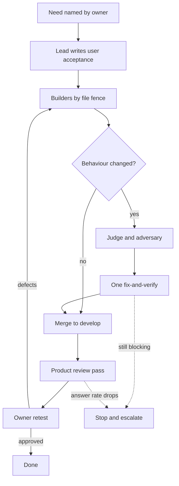

# Bossman mode redesign

Why the autonomous build harness was slow and produced a product that could not be shown, measured from this repository's own record, and a proposed redesign. Written 2026-09-24 for the product owner. A diagnosis and a proposal only: nothing under `.claude/` has changed.

## Table of contents

- [The short answer](#the-short-answer)
- [Part 1: the measured diagnosis](#part-1-the-measured-diagnosis)
- [Part 2: the redesign](#part-2-the-redesign)
- [Part 3: decisions for the product owner](#part-3-decisions-for-the-product-owner)
- [What could not be measured](#what-could-not-be-measured)

## The short answer

Was it worth it? Partly. The build phases produced a real engine, about 70,000 lines of product code in 35 phases, and their review rounds stopped real harm before it shipped: an invented drug instruction, a leaked database password, a cost cap that one hidden character in a question could switch off. But every check in the harness asked "is this code correct, and are our own tests honest?", and by the last third of the build close to half of what review found was a defect in the harness's own tests rather than in the product. No stage asked "would a researcher want this answer?", no stage looked at the screen at phone width until the final UI phase, and the deployed product was first put in front of a person after 24 phases. On 2026-09-12, after every phase had passed its reviews, the golden questions answered in 13 of 85 runs. The fix loop worked because a person looked at the running product every day. So the change is: order the work by what a person sees, keep one engineering review, add a product reviewer that drives the deployed app and reads answers the way you would before you see them, cap every phase at a working day and eight agents, and delete the machinery that tests the tests.

## Part 1: the measured diagnosis

### Where the lines went, from git

Measured with `git diff --numstat` between each phase branch's merge base and its tip, for the 35 phase merges on `develop` from PR #5 (build phase 1.0, 2026-07-27) to PR #92 (build phase 6.2, 2026-09-01). Product means `src/`, `frontend/src/`, `services/`, `deploy*` and `.github/gates/`. Tests means any path under `tests/`, `frontend/e2e/`, `e2e_support`, or a `.test.` or `.spec.` file. Record means `tracker/`, `docs/`, `requirements/`, `testing/` and any `.md`.

| Measure | Lines inserted |
| --- | --- |
| Product code, 35 phases | 69,989 |
| Tests, 35 phases | 110,684 |
| Written record, 35 phases | 41,539 |
| Tests per line of product | 1.58 |
| The four UI phases (4.8, 4.9, 4.16, 6.2): product | 6,595 |
| The four UI phases: tests | 6,765 |
| The four UI phases: written record | 9,379 |

Sizes of the record itself, from `wc -l`: `tracker/` holds 35,805 lines, of which 20,932 are in 51 separate review report files (`tracker/phase_*_report.md`). `tracker/BOARD.md` alone is 114.6KB.

### Where the review effort went, phase by phase

Hours are first branch commit to merge, from git, so they understate time spent before the first commit. Rounds count every independent review pass the phase file names (judge, adversary, re-review, re-verify, gap check). Findings are distinct finding IDs, classed by reading each one:

- Product: a defect in what the running product does, reachable or latent.
- Instrument: a defect in the harness's own checks. A test or gate arm that could not fail, a mutation harness that did not mutate, a premise gate with the wrong premise, or a docstring, board row or commit message claiming a check that did not exist.
- Other: process (agent deaths, CI plumbing) and scope (decisions with no defect).

The classing was done by read-only workers, one per phase group, each citing file and line; the per-phase sources are the phase files and their `_report.md` siblings. Rows are in merge order. Build phases 4.8, 4.9 and 4.16 are counted from an audit of the UI phases and are not fully classed, and 5.0's split is a range.

| Phase | Hours | Rounds | Findings | Product | Instrument | Other |
| --- | --- | --- | --- | --- | --- | --- |
| 1.0 | 2 | 1 | 4 | 4 | 0 | 0 |
| 1.1 | 2 | 3 | 18 | 12 | 2 | 4 |
| 1.2 | 4 | 2 | 6 | 5 | 0 | 1 |
| 2.0 | 2 | 2 | 14 | 11 | 1 | 2 |
| 2.1 | 23 | 10 passes, "five review rounds" | 70 | 59 | 7 | 4 |
| 2.2 | 9 | 3 plus a mutation pass | 12 | 8 | 4 | 0 |
| 3.0 | 0 | 2 | 15 | 11 | 0 | 4 |
| 3.1 | 29 | 6 | 51 | 42 | 4 | 5 |
| 3.2 | 0 | 3 | 26 | 20 | 3 | 3 |
| 3.3 | 3 | 4 | 29 | 24 | 3 | 2 |
| 3.4 | 22 | 4 | 19 | 11 | 5 | 3 |
| 3.5 | 2 | 2 | 27 | 20 | 4 | 3 |
| 4.0 | 13 | 5 | 24 | 19 | 4 | 1 |
| 4.1 | 3 | 4 | 25 | 18 | 5 | 2 |
| 4.8 visual design | 10 | 3, then 3 passes after merge | 66 | not classed | at least 6 | not classed |
| 4.9 fidelity | 6 | 3, all FAIL | 47 | not classed | at least 5 | not classed |
| 4.10 | 10 | 4 | 45 | 29 | 11 | 5 |
| 4.2 | 6 | 6 | 56 | 44 | 8 | 4 |
| 4.3 | 14 | 6, plus a lead sweep | 75 | 60 | 12 | 3 |
| 4.4 | 5 | 3 | 24 | 19 | 4 | 1 |
| 4.5 | 4 | 0 before merge, 2 after | 57 | 38 | 19 | 0 |
| 4.6 | 0 | 3 | 43 | 22 | 18 | 3 |
| 4.11 | 10 | 4 | 42 | 20 | 20 | 2 |
| 4.7 | 3 | 4 | 31 | 15 | 14 | 2 |
| 4.12 | 8 | 0 | 19 | 11 | 5 | 3 |
| 4.16 | 4 | 0 | not tabled | 7 defects | 4 | not stated |
| 4.14 | 2 | 3 | 42 | 22 | 18 | 2 |
| 4.13 | 6 | 3 | 24 | 16 | 8 | 0 |
| 4.15 | 18 | 4 | 45 | 23 | 18 | 4 |
| 5.0 | 23 | 7 | 70 | 28 to 30 | 35 to 38 | 6 to 8 |
| 5.1 eval | 1 | 2 | 46 | 46 against the eval deliverable | 0 | 0 |
| 5.2 eval | 4 | 4 | 25 own, 66 with carried | 20 against the grader | 5 | 0 |
| 5.3 eval | 2 | 2 | 41 | 26 | 9 | 6 |
| 6.0 | 2 | 1 | 12 | 3 | 8 | 1 |
| 6.2 | 5 | 0 | 9 | 5 | 4 | 0 |

What the table says, in numbers:

- Instrument findings rose as the harness added instruments. Phases 1.0 to 3.5: 33 of 291 findings, 11 percent. Phases 4.0 to 4.11 outside the two UI phases: 115 of 422, 27 percent. Phases 4.12 to 6.2 outside the eval track: 96 to 99 of 221, 43 to 45 percent. Across every classed phase outside the eval track, 244 to 247 of 934 findings, about a quarter, were defects in the harness's own checks. By the end it was close to half.
- Build phase 6.0 is the clearest case: 8 of its 12 findings were instrument defects, and CLAUDE.md describes the eight judge findings left open at merge, three of them critical, as "all saying the gate does not pin the production wiring rather than that either feature is broken, since both are verified working by execution" (Build phase history, row 6.0).
- The evaluation track, 5.1 to 5.3, was an instrument from end to end: three phases and 8 review rounds produced a grader that "does NOT work" and is parked (CLAUDE.md, Current focus, priority 4).
- The two-round cap, added 2026-08-18 (DECISIONS.md), held in 4 of the 13 phases reviewed after it: 4.4, 4.6, 4.7, 4.11, 4.13, 4.14, 4.15, 5.0 and 5.2 each ran three to seven rounds, every extra round authorised by the product owner.
- At least 22 review or build agents died mid-task and are recorded: build phases 2.1 (3), 2.2 (3), 3.2 (1), 3.4 (1), 4.1 (1), 4.3 (6), 4.11 (3) and 4.13 (4) (phase files and LEARNINGS.md rows of 2026-07-31, 2026-08-22 and 2026-08-27). At the cadence document's own 15 to 25 minutes per dead dispatch, that is 5.5 to 9 hours of dead agent time.
- Tests outweighed product code 1.58 to 1 in lines, and the written record was 0.59 of product code.

### Why the UI shipped bad despite the review rounds

The four phases that built what a person sees, and what their review actually looked at. Every row cites the phase file.

| Phase | Review run | What the checks asserted | Looked at the running app like a person? | Asked "would a researcher want this answer"? |
| --- | --- | --- | --- | --- |
| 4.8 visual design, merged 2026-08-13 | Judge 18 findings, adversary 27, re-review 11, all before merge (`tracker/phase_4.8.md:118-193`) | Token hex values, required elements present, WCAG contrast, one question reaching the stream (`tracker/phase_4.8.md:28-31`); "It does not check visual fidelity pixel for pixel" (`:43-45`) | Only after merge, because the product owner asked: two major position defects "on `develop` after the phase had already closed green" (`:217`), including the whole app rendering in a 720px strip (F-4.8-V-01, `:223`). No viewport width named anywhere | No line in the file judges readability, length or usefulness |
| 4.9 answer-screen fidelity, merged 2026-08-14 | Three rounds, all FAIL, 47 findings (`tracker/phase_4.9.md:6`, `:89`) | DOM order, text and state; "Geometry and visual position" explicitly not covered (`:132`) | A screenshot beside the prototype, which "had never been run in this repository before" and found nine gaps that "three independent review rounds had all missed" (`:136`). No 390 or mobile width | Not stated |
| 4.16 the demo defects, merged 2026-08-25 | No judge or adversary round; the lead measured and fixed (`tracker/phase_4.16.md:6`) | SSE event timing, DOM presence, one bounding box, routes (`:113-161`) | Yes, the deployed app at 1280 and 1440 against `screens/answer.html` (`:193`, `:263-271`); "every screen at a narrow viewport" NOT YET COMPARED (`:215`); "This repository still has none" visual regression check (`:305`) | Closest yet: caught an outcome that contradicted its own trust pills (`:213`), but "does not touch grounding" (`:303`) |
| 6.2 answer readability and UI pass, merged 2026-09-01 | No judge or adversary round, by product-owner decision (DECISIONS.md, 2026-09-01) | First gate to assert the MEANING of the answer, disease names against MedGen (`tracker/phase_6.2.md:90-93`) | First phase to measure 390, 768 and 1440 (`:664`, `:1020-1024`), found a 390px overflow; five of eight user journeys "built, not run" (`:715-722`) | Yes, its whole premise; and it left "an answer can exceed 25 seconds" with no ticket (`:1044-1086`) |

Before the deployment, the only person to look at the product was the product owner, once, on a local run the evening build phase 4.8 merged, and they found three gaps against the design (`tracker/phase_4.8.md:255-257`). The first look at the deployed product was build phase 4.12 on 2026-08-24, the 25th phase merged, 28 days after build phase 1.0. `tracker/BOARD.md:7` records that 4.12 "put the product in front of a person for the first time, and that person found six defects no suite in this repository can see". Their words, recorded verbatim at `tracker/phase_4.12.md:236-241`: "The search is super super super super slow" and "The answer presentation is horrible and nothing close to what the design sync had". That was eleven days after 4.8 and 4.9 had each passed through a judge and an adversary.

Three causes, each from the record:

- The review rounds were aimed at engineering properties. They checked grounding, security, schema, and whether the phase's own tests could fail. Build phase 4.8 names the gap itself: "Every check here asserts what is on screen, never where it is" (`tracker/phase_4.8.md:219`) and "nothing in this repository looks at the rendered page" (`:233`).
- The browser suite could not see a real answer. The end-to-end tests ran against a mocked model backend (`tracker/phase_4.8.md:108`), and F-4.16-02 records that the browser suite "cannot reach a real tool dispatch" (`tracker/BOARD.md:127`). So the screen was tested against answers no researcher would ever get.
- Six surfaces had no design at all, including the sign-in screen, the follow-up field and the history rail (DECISIONS.md, 2026-09-05). Nobody noticed until a person saw a raw-HTML sign-in screen inside a designed shell.

Then, on 2026-09-01, two product-owner decisions removed what little looking the agents did: the assistant "does NOT drive the browser unless explicitly asked", and "THE JUDGE ROUND STOPS BEING THE GATE" because "judging is my domain now" (DECISIONS.md, both 2026-09-01). From then on no agent judged the product. The fix loop's screenshots at 1280 and 390 confirm that a change is live (`.claude/skills/bossman-mode/reference/UI_fix_loop.md`, "The loop", step 5); whether it is any good is left to the product owner. That is why two weeks of their time went into testing.

### What the product owner had to fix

Items in sets 1 to 12 of `testing/UI_fixes_done.md` (114 rows, sets dated 2026-09-12 to 2026-09-24), each classed by its own "what you noted" text. The class tally is a hand count over the item headings, not a total the file states.

| Class | Items | Examples |
| --- | --- | --- |
| Answer: what it says or finds | 38 | Disease and gene answers "surface level" (`testing/UI_fixes_done.md:734`), plain language and researcher looking the same (`:1796-1799`), "The answers list what was found instead of answering" (`:2264`) |
| Behaviour: flow, sign-in, memory, speed | 34 | Guest walls (`:1006-1014`), follow-ups that forget context (`:1410`), a saved answer re-running the search (`:2267`) |
| Visual: layout, colour, responsive | 30 | "The footer moves all over the place" (`:1100`), "The home page contrast is horrible" (`:1140`) |
| Platform: tests, measurement, deploy | 12 | Letting the browser suite see a real answer (set 6) |
| Copy | 6 | Refusal labels, disclaimer wording |

The single most telling number: before the fix loop touched the answer path, a consistency run of the golden questions on 2026-09-12 got 85 runs to start, and of those "13 answered (15%)", "54 refused for no evidence (64%)" and "12 crashed mid-run (14%)" (`testing/UI_fixes_done.md:2773-2779`). That is after 35 merged build phases, each with review rounds. Ten days of the fix loop later, the same run answered 86 of 150 (`testing/UI_fixes_done.md:2356`).

So a third of what the product owner fixed was answer quality, a class no build-phase review measured across the golden questions, because the grader built for it in build phase 5.2 "does NOT work" and was parked (CLAUDE.md, Current focus, priority 4).

### What the UI fix loop did better, and worse

Measured over the loop's life, 2026-09-12 to 2026-09-24, against the build-phase window, 2026-07-27 to 2026-09-01, from `git log --no-merges` on `develop`.

| Measure | Build phases | UI fix loop |
| --- | --- | --- |
| Calendar days | 37 | 13 |
| Non-merge commits | 720 | 251 |
| Share of commits that are `docs` | 284 of 720, 39% | 126 of 251, 50% |
| `feat` plus `fix` commits | 294 | 109 |
| Review rounds per unit of work | 0 to 7 per phase and 10 passes in 2.1; cap 2 from 2026-08-18 | None; the product owner's retest |
| Items shipped in one day, where a shipped list counts them | Not counted per phase | 12 on 2026-09-20, 12 on 2026-09-22, 22 on 2026-09-23 (the daily shipped lists, folded on 2026-09-24 into the "Shipped days" section of `testing/UI_fixes_done.md`) |
| Browser check at 1280 and 390 | First done in build phase 6.2 | Every visual item: "checked by screenshot at 1280px and 390px" (`testing/UI_fixes_done.md:1077`, `:1210`, `:1255`, `:1275`) |
| Answers checked by live runs | Premise gates ran live questions one phase at a time; the first recorded consistency run of the golden set through the agent was on 2026-09-12 (`testing/UI_fixes_done.md:2771-2773`) | Five or more live runs per answer fix, a rule from 2026-09-13 (`.claude/skills/bossman-mode/reference/UI_fix_loop.md`, "What verification means here"); all 150 golden runs completed for the first time on 2026-09-22 (`testing/UI_fixes_done.md:2356`) |

Better, from the record:

- The person who judges the product saw each change the same day, on the deployed app.
- Work was chosen by what the person saw, not by Section 25's order, which is why answer quality finally got most of the effort.
- Verification moved to the running product: screenshots at two widths, live repeated runs, and a committed script as the done-when for set 12 (`testing/UI_fixes_done.md:2184-2189`).

Worse, from the record:

- The product owner became the only quality gate for everything a person sees. On 2026-09-24, 24 items sat in the Retest column waiting on them (`testing/UI_fix_plan.md:41-71`).
- Seven reverts or same-day regressions, including 11.27 and 11.28 sharing a merge that CI failed, and 12.8's fix creating 12.11 the same day (`testing/UI_fixes_done.md:1873-1893`, `:2262-2265`).
- Engineering slips a review round would have caught went out: a commit shipped with a red test because `| tail -3` swallowed the exit code, a sub-agent wrote six false sentences into `PROGRESS.md`, and a decision was hardcoded from word lists until the product owner stopped it with "Please do not hardcode!" (LEARNINGS.md rows dated 2026-09-22 and 2026-09-24).
- Half the commits were documentation. The bookkeeping did not shrink when the review rounds went away.

### Model tiering: what the harness says and what ran

What the harness says:

- `docs/build/Build_workflow_cadence.md` "Model assignment": depth tier for decomposition, premise-gate design, judge and adversary; balance for builders, test writers and gate runs; speed for bulk research.
- `.claude/rules/plan-then-fan-out.md`: the strongest model plans and synthesises, cheaper models execute, and a worker is given an explicit cheaper model rather than inheriting the lead's.

What the record shows actually ran:

- The tier of a dispatch is recorded for a handful of dispatches only. Build phase 4.2's judge and adversary ran "at Depth tier, high effort" (`tracker/phase_4.2_judge_report.md:3`, `tracker/phase_4.2_adversary_report.md:3`). Build phase 4.4's two builders ran on the balance tier (`tracker/phase_4.4.md:285`). The overnight fix-loop session of 2026-09-23 ran eight agents, the depth tier "for the trust-critical and multi-file judgement" and the balance tier "for bounded builds and checks" (`testing/Shipped_2026-09-23.md:9-10`).
- Deaths from running the top tier concurrently are recorded three times: two depth-tier agents dying together on a session limit in build phase 2.1 (LEARNINGS.md, 2026-07-31), the same collision in build phase 3.2 (`tracker/phase_3.2.md:128`), and a depth-tier re-review in 4.2 that died and was replaced by a builder-tier verifier (`tracker/phase_4.2_rereview_report.md:7`).
- For every other dispatch in 35 phases the tier is not recorded, so what ran is not measurable from the repository. The default in this tool, stated as the reason `plan-then-fan-out` exists, is that a dispatch without a `model` inherits the lead's model: "a fan-out of five reasoning-model-inherited agents died together on a session limit".

This diagnosis is itself a data point about how the harness spends tokens. It dispatched 7 read-only workers on the balance tier. Two of them applied `plan-then-fan-out`'s "check for parallelism first" to their own slice and dispatched 4 and 9 workers of their own; the one that spawned 4 handed back empty. An eighth dispatch was refused at the harness's concurrent limit of 20, and the lead session counted about 17 running at once, past the rule's own ask-first line of 8. At 20:30 on 2026-09-24 the session's task folder held 23 subagent transcripts. The seven finished workers reported 1,597,601 tokens between them, from 126,395 for the empty one to 334,977 for the slowest, which took 19 minutes (task notifications); whether those figures include the workers they spawned is not stated. Nothing stopped a worker from fanning out, because the rule that tells the lead to fan out reads the same to a worker.

## Part 2: the redesign

### The constraint

The constraint was never build speed or code correctness. Median phase time from first commit to merge was 4 hours, and three quarters of phases merged within 10 (git, 35 merges). Review found real product defects in nearly every phase it ran on. The constraint was that every check pointed at the code, and none pointed at the product a person uses. The loop certified 35 phases, after which the golden questions refused for want of evidence in 64 percent of the runs that started. `docs/build/UI_feedback.md:196` put it in one line: "excellent chrome around content nobody can read".

The 2026-08-03 post-mortem (`docs/build/Build_velocity_post_mortem.md`, "What to change", priority 4) said to keep the judge, adversary and premise gate exactly as they were. It was right that they catch code defects. The 31 phases since show they cannot catch a bad product, and that the instruments added around them grew into the main source of findings.

The order below follows `.claude/rules/attack-the-constraint.md`: requirements, delete, simplify, accelerate, automate.

### Step 1: make the requirements less dumb

| Requirement | Who set it | What the record says | Verdict |
| --- | --- | --- | --- |
| Work in Section 25's order | The locked technical specification | Six delivery surfaces, CI and a release flow came before anyone saw an answer; the first look came at phase 25 | Order by what a person sees first, which `decide-from-the-users-chair` already states ("Order work by what the user feels first") |
| Judge and adversary on every phase | `bossman-mode` rule | Both found real criticals: an invented drug instruction (2.2), a leaked database password (4.3), a free query from one NUL byte (4.6), four trust signals lying on the answer screen (4.9, `tracker/phase_4.9.md:73`) | Keep both, one round each. They are not the constraint, so they are not the thing to cut |
| A premise gate on every phase, every arm mutation-proven, a permanent mutation harness | Cadence stage 5, `Review_rounds.md` | Stage 5 was written for model-generated output (2.1). Spread to CI, release and rate limiting, it became the main source of findings, 43 to 45 percent late in the build | Keep one premise check: the live golden-question run, for answer-path changes only |
| More rounds when round 2 still fails, if the product owner allows | DECISIONS.md, 2026-08-19 onward | 9 of 13 phases after the cap ran past it; 5.0 ran 7 rounds on one control | No round 3. After round 2, merge with the open item named, or revert |
| Findings and full reports copied into `tracker/` | `self-eval-loop`, shared ledger | 51 report files, 20,932 lines, 1.53MB | Ledger rows only |

### Step 2: delete

| Delete | What it saves, from Part 1 |
| --- | --- |
| Every review round past two | 17 extra rounds across 4.4, 4.6, 4.7, 4.11, 4.13, 4.14, 4.15, 5.0 and 5.2 (the rounds column above) |
| Premise gates, mutation harness files and coverage claims for anything that is not answer behaviour | The source of most instrument findings: 96 to 99 of 221 in the last third of the build |
| Per-round report files under `tracker/` | 20,932 lines; the ledger row carries the finding |
| The build narrative in `CLAUDE.md` ("Current focus" and "Build phase history") | 32,795 bytes, about 8,200 tokens, loaded on every turn. `CLAUDE.md` was 16,201 bytes on 2026-08-03 and is 54,110 now; `requirements/Plan.md` already holds the narrative |
| The narrative in `tracker/BOARD.md` | Most of 114.6KB; the board becomes a status table |
| Coverage sentences in docstrings, boards and commit messages | The "confident sentence" class, seven instances by build phase 6.2 (`tracker/phase_6.2.md:1140`). Build phase 4.15 already fixed its own case by deletion |

What stays: the judge and the adversary at one round each, one fix-and-verify round, Rule 4 (stop on a regression inside a fix), write-first findings, file fencing for parallel work, and every rule under `.claude/rules/`.

### Step 3: simplify into a team

Six roles. The tier follows the cadence document's own test: spend reasoning where a mistake cascades.

| Role | Tier and effort | Does | Never | Why this tier |
| --- | --- | --- | --- | --- |
| Tech lead, the session itself | Depth, high | Splits work by file, writes each ticket's acceptance in the user's words, integrates, decides, reports to the owner | Writes the code it will judge | A bad split cascades into every worker (`docs/build/Build_workflow_cadence.md`, "Model assignment") |
| Builder | Balance, medium | One ticket, a named file fence, the tests for it | Dispatches agents, edits outside its fence | Bounded work with clear acceptance; build phase 4.4's two builders shipped on this tier (`tracker/phase_4.4.md:285`) |
| Clerk | Speed, low | Board rows, counts, the handoff file, doc sync, by copying fields | Restates a fact in its own words | Mechanical; a sub-agent that restated `PROGRESS.md` introduced six false sentences (LEARNINGS.md, 2026-09-24) |
| Judge | Depth, high | One round on the diff: correctness, security, the `production-standards` gates, and "break it, does a test go red" as one checklist line | Closes its own findings, reviews its own fixes | The only role with measured evidence that a weaker review costs whole rounds (build phase 2.1) |
| Adversary | Depth, high | One round on any phase that changes runnable code, hunting the confident wrong answer and the lying trust signal | Runs a second round, or on a documentation-only change | It found criticals in nearly every phase it ran, including the UI phases |
| Product reviewer, new | A script captures; depth tier, medium effort, judges | Drives the deployed develop app: every changed screen at 1280 and 390 beside `design-system/prototype/app.html`, then the golden questions with time to answer, then reads each answer against a five-line rubric | Closes anything; the owner's verdict closes | It does the owner's kind of judgement, so it gets the strong tier; a capture is a script, so the model only judges |

The product reviewer's rubric, in the owner's own words from the fix loop:

- Does the first sentence answer the question, or does it "list what was found instead of answering" (`testing/UI_fixes_done.md:2264`)?
- Would a researcher, a clinician or a student learn something a general chatbot would not tell them (`:734`)?
- Do Plain language and Researcher read differently (`:1796-1799`)?
- How many seconds until the answer landed?
- Does each screen match its design at both widths, and is any surface missing a design (`docs/build/design/README.md`, coverage table)?

### The flow

A phase that touches auth, the graph credential, the event schema or `.claude/` still uses a branch and a pull request, per `.claude/rules/git-workflow.md`. Everything else lands on develop the way the fix loop does, because develop is now a test environment rather than the product (DECISIONS.md, 2026-09-01).

### Steps 4 and 5: accelerate, then automate

- Accelerate: a phase merges to develop the day its judge and adversary pass, and the owner's retest runs on develop rather than on a pull request. The fix loop shipped 12 to 22 items a day this way (the daily shipped lists, folded on 2026-09-24 into the "Shipped days" section of `testing/UI_fixes_done.md`).
- Automate last, and only what already exists: the consistency run and the eight browser journeys kept behind `RUN_LIVE_JOURNEYS=1` (DECISIONS.md, 2026-09-01) become the product reviewer's capture step. Nothing new gets automated until the product review has run by hand on two phases.

### Verification placed where it would have caught what the owner caught

| What the owner caught | The check | Where it runs | Would it have fired? |
| --- | --- | --- | --- |
| Answers refusing or crashing: 13 of 85 answered on 2026-09-12 | The golden consistency run, already scripted (`testing/Developer/reports/2026-09-22_10.3_consistency/run_consistency.py`) | Product review, on every answer-path change and nightly on develop | Yes. It is the same run that produced the baseline (`testing/UI_fixes_done.md:2773-2779`) |
| "super super super super slow"; 25 seconds; 100 seconds | Time to answer per golden question, in the same run | Product review | Yes. The 100-second question was found by timing live runs (`testing/Developer/reports/2026-09-22_slow_second_search`) |
| The 720px strip, the moving footer, the home page contrast, the 390px overflow | Screenshots at 1280 and 390 beside the prototype, plus a scroll-width check | Product review, on every frontend change | Yes. 4.9's first side-by-side found nine gaps in one pass (`tracker/phase_4.9.md:136`); 6.2's first 390 check found the overflow (`tracker/phase_6.2.md:1020-1024`) |
| A raw-HTML sign-in screen inside a designed shell | Read the design coverage table before ticketing a surface | Lead, at decomposition | Yes. The gap was measurable from the design folder the day someone looked (DECISIONS.md, 2026-09-05) |
| "The answer presentation is horrible"; answers that list rather than answer | The five-line rubric above | Product review | Yes; the rubric is those complaints |
| No deployed product for 24 phases | A deployed develop app a person uses by the end of the first week, and every phase ends on it | Build order | Yes, by construction |

### Stop conditions and a budget per phase

| Budget | Limit | Basis in the record | On hitting it |
| --- | --- | --- | --- |
| Wall clock, phase open to "ready for owner" | 8 hours | Median 4 hours, 75th percentile 10; the five phases whose span passed 18 hours, overnight included (2.1, 3.1, 3.4, 4.15, 5.0), each ran four or more review rounds | Stop, write the handoff, escalate with options |
| Review rounds | 1 judge and 1 adversary, then 1 fix-and-verify | 17 rounds past two, in 9 of the 13 phases reviewed after the cap | Merge with the open item named, or revert and re-split |
| Agent dispatches | 8 per phase including reviewers; workers may not dispatch | `plan-then-fan-out`'s own ask-first line is 8; this diagnosis reached about 17 because workers fanned out | Ask the owner |
| Instrument share | More than half of a round's findings are about the phase's own tests or docs | Late-build share 43 to 45 percent; 6.0 at 8 of 12 | Stop writing checks and escalate: the effort has moved off the product |
| Answer rate | Any drop in the golden run's answered count | The 2026-09-12 baseline is the floor | Stop and fix before anything else lands |
| Tokens | Not set | No billing log exists in the repository, so a token budget cannot be measured yet | Use dispatch count and wall clock as the proxy |

Rule 4 stays as it is: a regression found inside a fix stops the round on the spot.

### Staying fresh across sessions

A worker is handed:

- The ticket: one acceptance sentence in the user's words, and the test command that proves it.
- Its file fence: the exact files it may touch.
- Only the files it needs to read, named.
- The one to three `LEARNINGS.md` rows that name one of those files.
- For a screen, its design card and the prototype section.

A worker is never handed:

- The build history, the board, other phases' findings or review reports.
- The conversation or the lead's reasoning, which is already the rule for reviewers (`.claude/rules/self-eval-loop.md`).
- Permission to dispatch agents.

A new session reads one handoff file, the fix loop's "Where we stopped" section in `testing/UI_fixes_done.md`, which already works, instead of rebuilding state from `CLAUDE.md`, `requirements/Plan.md`, the continuation prompt and the board. Cutting the `CLAUDE.md` narrative matters here too, since it loads on every turn.

### What the fix loop's success means for the build cadence

- The verification that found what mattered was a person on the running product the same day. The build cadence should end every phase there, with the product review as the agent pre-screen and the owner's retest as the verdict.
- The fix loop showed where the effort belongs: 38 of 114 items were answer quality, and so were 33 of the 53 developer investigations under `testing/Developer/reports/`. Section 25's remaining phases should queue behind answer quality, not ahead of it.
- The fix loop also showed what a missing engineering review costs: seven reverts or same-day regressions and a red test pushed through a pipe. So the redesign keeps the one judge round on code that the fix loop dropped.
- The two modes collapse into one cadence with a risk dial. A copy or layout fix is builder, clerk and product review. A change to runnable behaviour adds the judge and the adversary. Auth, the graph credential, the event schema or `.claude/` adds a branch and a pull request.

## Part 3: decisions for the product owner

1. Reorder the remaining build by what a person sees first, answer quality and speed ahead of Section 25's order? Recommendation: yes. Strongest argument against: Section 25 encodes dependencies, and rate limiting (build phase 6.0's residue) protects a public app.
2. Add the product reviewer, an agent that drives develop at 1280 and 390 and reads answers against the rubric before your retest? This reverses the 2026-09-01 decision that the assistant does not drive the browser unless asked. Recommendation: yes, as a pre-screen that never closes an item. Against: that decision was taken because every capture the assistant interpreted "needed correcting at least once" (DECISIONS.md, 2026-09-01).
3. Make the golden consistency run a blocking check on every answer-path change: any drop in the answered count stops the phase? Recommendation: yes. Against: outcomes vary between runs of the same question ("15 of 32 questions gave different outcomes across runs", `testing/UI_fixes_done.md:2780`), so a single run can block good work on noise; the check needs repeated runs, which cost model budget.
4. No third review round, even with your authorisation: after round 2, merge with the open item named or revert? Recommendation: yes. Against: build phase 4.4's third round was authorised precisely so a reachable major would not merge open or force a revert (DECISIONS.md, 2026-08-19); under this rule it must do one or the other.
5. Delete mutation harness files and premise gates for everything except answer behaviour, keeping mutation as one judge checklist line? Recommendation: yes. Against: build phase 4.11's three vacuous arms were caught by mutation and none by reading (CLAUDE.md, Build phase history, 4.11).
6. Cap each phase at 8 hours and 8 dispatches, and forbid workers from dispatching? Recommendation: yes. Against: a hard stop can land an hour before done; the escalation is the release valve.
7. Move the build narrative out of `CLAUDE.md` and the board into `requirements/Plan.md`? Recommendation: yes. Against: a fresh session loses the story at a glance, which the handoff file then has to carry.
8. Merge build mode and fix mode into one cadence with a risk dial? Pick one: merge now, merge after the next build phase, or keep two modes. Recommendation: merge after the next build phase, so the dial is tried once before it replaces the fix loop. Against merging at all: the develop carve-out in `.claude/rules/bossman-mode.md` is bounded by mode on purpose, and a dial blurs that line.

## What could not be measured

- Tokens or dollars per phase or per agent. No billing log exists in the repository; the worker token counts above come from this session's task notifications only.
- Wall-clock time before a phase's first commit. The hours column starts at the first branch commit.
- Which model tier ran for most dispatches. The record names it only for the few listed under model tiering.
- Which build phase introduced each surface the fix loop repaired. `testing/UI_fixes_done.md` does not say, and it was not inferred.
- The class split for build phase 5.0 is a range, because its findings carry no class and one ID (F-5.0-16) is reused for two findings. Build phases 4.8, 4.9 and 4.16 are counted but not fully classed.
- Stated totals disagree with recounts in several phases: 4.11 states 26 findings and recounts 42, 4.13 states 21 and recounts 24, 4.15 states 44 and recounts 45, 5.2 states "roughly ninety" and recounts 66. The recounts are used.
