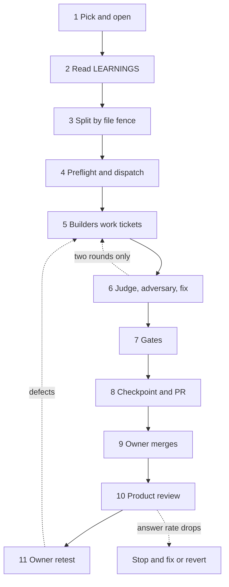

# Build workflow cadence

This is the quick reference for a build phase. It covers three things:

- The loop one build phase runs
- Who does each step
- Which model runs it

Where the other versions live:

- Visual version: `docs/build/Phase_6_execution_flow.html`
- Full detail: `.claude/skills/bossman-mode/SKILL.md` and its three reference files

Redesigned on 2026-09-24. The product owner accepted all eight decisions in `docs/build/Bossman_mode_redesign.md`, recorded as the last eight rows of `DECISIONS.md` that day. What the old loop did:

- It ran a premise gate on every phase.
- Its cap on review rounds could be authorised away.
- It never looked at the deployed product.

It certified 35 phases, after which the golden questions answered in 13 of 85 runs. The loop below ends every phase on the running product.

Last updated: 2026-09-24.

## Table of contents

- [The one-paragraph version](#the-one-paragraph-version)
- [The stages](#the-stages)
- [Budgets and stop conditions](#budgets-and-stop-conditions)
- [The answer-path premise check](#the-answer-path-premise-check)
- [Model assignment](#model-assignment)
- [Effort and tier basis, measured 2026-08-02](#effort-and-tier-basis-measured-2026-08-02)
- [Provider mapping](#provider-mapping)
- [Where everything is written](#where-everything-is-written)
- [The three verification halves](#the-three-verification-halves)
- [Transport preflight](#transport-preflight)
- [The review loop has a budget: two rounds](#the-review-loop-has-a-budget-two-rounds)
- [Build mode and fix mode](#build-mode-and-fix-mode)
- [Known weak points](#known-weak-points)

## The one-paragraph version

It runs like a small engineering team with a product person watching the screen.

- Work is picked by what a person using the product sees first, not by the order of technical specification Section 25
- Agents verify the engineering: one judge round, one adversary round, one fix-and-verify
- A product reviewer looks at the deployed app the way a person does, and the golden questions are asked again on every answer-path change
- The product owner verifies the product on develop, and their verdict is what closes a ticket

## The stages

| # | Stage | Who | Tier | Effort |
|---|-------|-----|------|--------|
| 1 | Pick the phase by what a person sees first, read `HANDOFF.md`, verify real dependencies are merged | Lead | depth | high |
| 2 | Read `LEARNINGS.md` filtered to this phase | Lead | depth | low |
| 3 | Split into tickets by file fence, each with an acceptance sentence in the user's words and its test command; read the design coverage table before ticketing any screen | Lead | depth | high |
| 4 | Transport preflight (`python3 tracker/preflight.py`), cut the branch, plan the 8 dispatches, dispatch builders | Lead | depth | low |
| 5 | Builders work tickets in parallel, each writing the tests for its own ticket | Builders | balance | medium |
| 6 | One judge round, one adversary round, then one fix-and-verify round | Judge, adversary, fix agents, a fresh verifier | depth; fix agents balance | high |
| 7 | Gates: `verify`, `eval-harness` on answer generation, `dev-standards` on application code, the learnings coverage check | Lead | depth | medium |
| 8 | Checkpoint, board left at `in-review`, render, open the pull request | Lead, clerk | clerk speed | low |
| 9 | Read the checkpoint and merge | Product owner | human | n/a |
| 10 | Product review of the deployed develop app; the golden consistency run blocks an answer-path change | Product reviewer: a script captures, the model judges | depth | medium |
| 11 | Retest on develop; the verdict sets `done` or sends defects back to stage 5 | Product owner | human | n/a |

Recording what broke is not a stage. Whoever hits a failure writes it to `LEARNINGS.md` at the moment it happens.

Stage 7 names three gate skills, and they are not interchangeable items on one checklist:

- `verify` is the pre-commit check: Python compile, tests, lint, git status.
- `eval-harness` is required before shipping any answer-generation feature, per the AI answer grounding gate in `production-standards.md`.
- `dev-standards` is the six-lens production readiness review, for a phase that shipped application code.
- `release-workflow` stays available to invoke directly. It was mandatory at every phase end until 2026-08-10 and measured 0 real dispatches in 6 phases, so it is no longer the assumed default.

## Budgets and stop conditions

Every phase runs inside these limits (DECISIONS.md, 2026-09-24).

| Budget | Limit | Basis in the record | On hitting it |
|--------|-------|---------------------|---------------|
| Wall clock, phase open to "ready for owner" | 8 hours | Median phase 4 hours, 75th percentile 10; the five phases past 18 hours (2.1, 3.1, 3.4, 4.15, 5.0) each ran four or more review rounds | Stop, run `/phase-checkpoint` so `HANDOFF.md` carries the stop, escalate with options |
| Review rounds | 1 judge and 1 adversary, then 1 fix-and-verify | 17 rounds past two, in 9 of the 13 phases reviewed after the cap | Merge with the open item named, or revert and re-split |
| Agent dispatches | 8 per phase including every reviewer; workers never dispatch | `plan-then-fan-out`'s own ask-first line is 8; the redesign's diagnosis reached about 17 because workers fanned out | Ask the owner before the ninth |
| Instrument share | More than half of a round's findings are about the phase's own tests or documents | Late-build share 43 to 45 percent; build phase 6.0 at 8 of 12 | Stop writing checks and escalate |
| Answer rate | Any drop in the golden run's answered count | The latest accepted run is the floor: 86 of 150 on 2026-09-22 | Stop and fix, or revert, before anything else lands |
| Tokens | Not set | No billing log exists in the repository | Dispatch count and wall clock are the proxy |

Rule 4 is unchanged: a regression found inside a fix stops the round on the spot.

## The answer-path premise check

A premise check is a test that runs the real model against real ground truth and asserts the answer means the right thing. An ordinary test suite checks the SHAPE of an answer: rows came back, every row is cited. Both of those pass on an answer that is completely wrong.

The case that created it: build phase 2.1 shipped a fully green suite that answered "which diseases are associated with BRCA1?" with twenty-five non-human orthologs. Every row carried a real, resolving NCBI citation, so every shape check passed.

Where it applies now, and where it does not:

- Answer behaviour only: a change that can alter what an answer says, which records it names or cites, or whether a question is answered or refused.
- For every such change, the check is the golden consistency run, 50 questions three times on develop, and it blocks. The procedure is in `.claude/skills/bossman-mode/reference/Product_review.md`.
- An answer-path phase may still add a premise gate for a behaviour the golden questions cannot see. It is written first and seen failing before the code it grades.
- Nothing else gets a premise gate, a mutation harness file or a coverage claim. Spread from model-generated output to CI, release and rate limiting, those instruments became the main source of findings, 43 to 45 percent late in the build. Breaking a control to see a test go red is one line on the judge's checklist.

The four properties that make an answer-path check worth running, each a measured failure in 2.1:

- It does NOT mock the model. A mocked call supplies an answer someone already knew was correct.
- It asserts on the MEANING of the answer, not its shape.
- Its ground truth is read from the live source and pinned, so "correct" is checkable rather than plausible.
- It runs the way PRODUCTION runs. A first draft of 2.1's gate hand-picked an input and scored 8 of 9, where the input production actually sends scored 3 of 9. The golden run meets this by asking the deployed develop API.

## Model assignment

The rule: spend reasoning where a mistake is expensive and cascades, spend cheaply where the task is bounded and the instructions are clear.

| Role | Tier | Effort | Why this tier |
|------|------|--------|---------------|
| Tech lead, the session itself | depth | high for picking and splitting, low for routine steps | A bad split cascades into every builder downstream. This is the most expensive place to be wrong |
| Builder | balance | medium | Well-scoped construction against clear acceptance. Build phase 4.4's two builders shipped on this tier |
| Clerk | speed | low | Board rows, counts, the handoff file and doc sync, by copying fields. A sub-agent that restated `PROGRESS.md` in its own words introduced six false sentences (LEARNINGS.md, 2026-09-24) |
| Judge | depth | high | A missed defect here ships. Build phase 2.1 failed four consecutive judge and adversary reviews with a green suite before the real defect surfaced |
| Adversary | depth | high | Finding a fluent, plausible, wrong answer needs real adversarial reasoning |
| Fix agent | balance | medium | Bounded repair of named findings, one agent per file |
| Verifier | depth | high | It re-derives the judge's verdicts from scratch, so it carries the judge's cost of a miss |
| Product reviewer | a script captures; depth judges | medium | It does the owner's kind of judgement; the capture is mechanical, so the model only judges |

Researcher and test writer are no longer roles. Research is the lead's own reading or the builder's, and each builder writes the tests for its own ticket.

Two notes on this table:

- These are build-time capability tiers, assigned to the agents that write System 3 itself. They are a separate concept from the product's own guard, plan, and synth runtime tiers, which route models per user query at serve time. Both are called tiers, but they name different things. Do not conflate the two.
- Delegation has a fixed setup cost, and a phase has 8 dispatches. Do not shard a phase into many tiny tasks just to parallelize. Each dispatched agent should carry a task worth its overhead.

## Effort and tier basis, measured 2026-08-02

Most roles were re-tiered on this date from a prior default of `depth` and `high`. This section states the measurement behind that change and what would justify raising a rung back, so the next reader does not mistake a guess for a finding.

### What is reasoning effort, and why does a rung cost anything?

Reasoning effort is a dial that decides how many thinking tokens a model spends before it writes its answer.

Why it exists: a harder problem benefits from the model working through it internally first. The dial buys that working-out.

The thing that makes it expensive is that you cannot see what you bought. Thinking tokens are billed as output but never appear in the response, so a call that spent most of its budget reasoning looks identical to a cheap one. Worse, they are replayed as input on every later turn in a session, so one high rung keeps charging for the rest of the phase.

An analogy: it is a taxi meter running while the driver plans the route, with the meter hidden behind the seat. The trip looks the same to you either way.

Concretely, from this repository: the plan tier at `effort: high` spent 970 of 1014 output tokens reasoning about a single line of Cypher. Dropping to `effort: none` produced the same correct answers 27 times faster.

What this means for you: treat effort as a latency and cost setting first. Raise a rung only against a cited miss, never against a feeling that a role seems important.

### The evidence

External evidence, on reasoning effort specifically:

- Dropping reasoning effort from high to medium gave 76 percent fewer output tokens at the same task-completion rate.
- Each effort rung costs roughly twice the rung below it.
- Thinking tokens reach up to 40 percent of total output spend, and they are replayed as input on every later turn in a session, so an unnecessarily high rung compounds across a whole phase, not just one call.

External evidence, on capability tier:

- A mid-tier model costs about 0.6 times a top-tier model and performs comparably on most development work.

Internal evidence, from this repository's own build. `LEARNINGS.md`'s 2026-07-31 entry on `harness/harness.py` tier configuration records that the plan tier, configured `effort: high`, spent 970 of 1014 output tokens on a single Cypher generation on reasoning rather than content. Measured over five failing query shapes, two runs each:

- `high`: totalled 163.0 seconds, with a worst case of 84.3 seconds on a multi-hop query
- `effort: none`, a rung below this ladder's own `low`: totalled 6.1 seconds, with a worst case of 2.2

All five runs were correct at both settings. The entry calls this "a 27x latency multiple for no measurable quality".

That internal data point is narrower than the change made here. Reading the two together:

- It proves `none` was safe for one bounded, fixed-schema Cypher generation
- It does not prove that `medium` is safe for every role in this cadence
- The external 76 percent figure is the direct evidence for the specific high-to-medium move applied to most roles
- The internal result is a strict superset of the claim actually needed, so it supports the change without overstating what was measured

### Why judge and adversary did not move

The two roles that did not move share one justification: this repository has direct evidence that a weaker review costs entire rounds, not just latency.

- Build phase 2.1 failed four consecutive judge and adversary reviews behind a fully green test suite before the real defect was found.
- The fifth pass found a defect class (every two-hop question unanswerable) that the phase's own checks could not see.
- Reasoning effort measurably changed neither the pass rate nor the citations on a bounded lookup task.
- It has not been measured against a review role's job, which is finding what a prior pass missed.

The lead's split stays on `depth` and `high` for the same cascading reason: a bad split reproduces its error in every ticket, and its gaps are invisible to every test the tickets write.

What would justify raising a tier or a rung back: a specific, cited miss. A defect that a lower effort or tier demonstrably let through, recorded as a finding in a `tracker/phase_N.M.md` file or as a `LEARNINGS.md` entry naming the tier or effort setting as a contributing cause. A feeling that a role "seems important" is not that bar. Per `goal-contracts`, this section is a verify surface for the tables above: weakening it back to a guess does not meet the bar it sets.

## Provider mapping

What this section covers:

- Three providers
- Three capability bands each
- An identical five-rung effort ladder

This table is the only place a provider name appears in this document. Every tier reference elsewhere points back to a row here.

| Tier | What it is for | Claude | Codex | Alternate backend |
|------|-----------------|--------|-------|-------------------|
| Depth | Architecture, hard debugging, long messy agentic work with many tradeoffs | Opus | Sol | See the local note |
| Balance | Normal development work, bounded construction, careful checking | Sonnet | Terra | See the local note |
| Speed | Quick lookups, extraction, classification, repetitive work | Haiku | Luna | See the local note |

Effort ladder, identical on all three providers:

- The five rungs: low, medium, high, extra high, max
- Raise the rung as the task gets harder
- `low` for quick and bounded work
- `max` for the one hardest problem where maximum depth matters most

The alternate backend is the metered fallback used when the primary provider's weekly budget is exhausted. Its model identifiers, prices and launch profiles are deliberately not written here, for two reasons:

- They name specific products and change monthly, which `writing-style` keeps out of tracked documentation
- Writing them here would make this table stale by design

They live in a local, uncommitted note instead, `docs/build/multi-model-harness/Multi_model_harness_plan.md`.

One constraint from that arrangement does belong here, because it governs the cadence itself rather than the configuration: the fallback is scoped by role, not applied to a whole phase.

- Stages assigned Depth for their judgement do not fail over: the lead's split, the judge, the adversary, the verifier and the product reviewer's judgement.
- A review run on the fallback records findings and closes nothing.
- The phase does not reach stage 9 until those stages have run on the primary provider, and the re-run counts against the 8 dispatches.

Switching the harness to a different provider means editing this one table and nothing else. Nothing in these three places names a product directly:

- The stage table
- The model assignment table
- `Phase_6_execution_flow.html`

## Where everything is written

| File | Holds | Written by | When |
|------|-------|-----------|------|
| `tracker/BOARD.md` | Phase status and open flags, a status table | Lead, through the `task-tracker` skill | Phase open and close |
| `tracker/phase_N.M.md` | Tickets, and every finding as a ledger row under Findings | Lead, builders, judge, adversary, verifier, product reviewer, each on its own states | Continuously |
| `tracker/board.html` | The page the product owner reads | `tracker/render_board.py`, via hook | Automatically, on every board edit |
| `HANDOFF.md` | What a fresh session needs: what is live, what awaits the owner, the one next action | `/phase-checkpoint` | Every checkpoint, and at any budget stop |
| `testing/Developer/reports/<date>_product_review_<topic>/` | The product review's screenshots, golden run and report | The product reviewer's capture commands | Stage 10 |
| `requirements/Plan.md` | The build narrative and the dated revision history | `/phase-checkpoint` | Every checkpoint |
| `LEARNINGS.md` | What broke, what was tried, what fixed it | Whoever hit the problem | At the moment of failure |
| `DECISIONS.md` | Choices between alternatives | Lead | When a choice is made |
| Source and tests | The product | Builders | During the phase |
| PRD, tech spec, memo | The locked contract | Nobody | Frozen |

No per-round report file is written under `tracker/`. A reviewer's findings are ledger rows in the phase file.

## The three verification halves

The split that matters, and the reason each part exists:

- Agents verify the engineering. The judge asks whether it works, whether it is correct, and whether it is safe to ship, and must produce cited evidence for every claim. The adversary asks whether it can be made to fail in a way nobody wrote a check for.
- The product reviewer pre-screens the product. It looks at the deployed screens at 1280 and 390 beside the design, asks the golden questions again, and reads the answers against a five-line rubric. It closes nothing.
- The product owner verifies the product. Is this the right thing to have built, does it meet the user need, and does it actually feel right. No agent can answer that last one, and their verdict is the only thing that sets `done`.

One nuance worth keeping straight: the adversary sits on the boundary. It hunts the confident wrong answer, an engineering failure in mechanism and a product failure in consequence. It belongs to the agent half because finding it is mechanical; what it protects is the trust moat, which is a product concern.

## Transport preflight

Added 2026-08-18, closing the priority-1 recommendation in `Build_velocity_post_mortem.md`. What `python3 tracker/preflight.py` does:

- Probes one endpoint per transport before anything expensive is dispatched
- Exits 1 when a transport is down

There is one probe per transport rather than one probe. The reason: the first attempt at this check probed the product's model provider while the thing dying was agent dispatch against a different endpoint, so a green result predicted nothing.

| Transport | Gates | Dead-dispatch cost |
|-----------|-------|--------------------|
| `product-model` | The golden run, answer-path premise gates, anything calling `harness.call_tier` | 6 to 10 minutes |
| `harness-model` | Every agent dispatch | 15 to 25 minutes |
| `graph` | Tool premise gates, live graph tests | The run, plus the misdiagnosis |

Re-probe `harness-model` immediately before a review-agent dispatch at stage 6, since phase open may have been hours earlier. Two results that are easy to misread:

- A `down` result on a host that is not on the sandbox allowlist may be a denial rather than an outage. The two are indistinguishable at that layer and the script says so instead of guessing.
- A `skipped` result means the transport was not configured, so nothing was verified, which is not the same as a pass.

## The review loop has a budget: two rounds

The budget is one judge round and one adversary round, then one fix-and-verify round. If round 2 still returns a blocking finding, the phase stops and hands the owner exactly two options:

- Merge with the open item named.
- Revert and re-split.

There is no round 3. The owner's authorisation does not create one.

Why the cap lost its exception on 2026-09-24: added on 2026-08-18, it held in only 4 of the 13 phases reviewed after it, because each extra round could be authorised. 17 extra rounds followed, and build phase 5.0 ran seven on one control. Build phases 2.1 and 4.2, which prompted the cap, had shown that every round found its worst defect inside the previous round's fix, so rising scrutiny was never the lever.

Two rules govern how fixes are dispatched inside that budget, both measured on build phase 4.2:

- Group findings by file, and give every finding in one file to a single fix agent working serially. Parallel fix agents are individually correct and structurally blind to the sibling editing the same function.
- Fix by category, never by enumerating instances. A defense that lists cases has failed here every time it was tried.

A finding located inside an earlier fix stops the phase mid-round, without finishing the round, because it says the fix approach is wrong rather than incomplete. Two files hold the rest:

- `.claude/skills/bossman-mode/reference/Review_rounds.md` holds the full statement of all four rules.
- `task-tracker` holds the two ledger fields, `Round` and `Regression of`, that make them checkable rather than remembered.

## Build mode and fix mode

Two modes exist today: this build-phase cadence, and the UI fix loop (`.claude/skills/bossman-mode/reference/UI_fix_loop.md`), where a product-owner defect lands straight on develop and their retest is the verification. The product reviewer runs before the owner's retest in both.

Decided on 2026-09-24 and scheduled for AFTER the next build phase closes: the two modes merge into one cadence with a risk dial, so the dial is tried once before it replaces the fix loop.

- A copy or layout fix: builder, clerk and product review.
- A change to runnable behaviour: adds the judge and the adversary.
- Auth, the graph credential, the event schema or `.claude/`: adds a branch and a pull request.

Until the merge, the develop carve-out in `.claude/rules/bossman-mode.md` stays bounded by mode.

## Known weak points

Stated rather than hidden, because each one is a place the cadence can quietly fail:

- A board edit made through a shell command instead of the Edit tool bypasses the sync hook and leaves the rendered page stale. Mitigated by re-rendering at phase close, not eliminated.
- The golden run's outcomes vary between runs of one question. Three passes reduce that noise and do not remove it, so a real drop and a noisy one can look alike. Only the owner may accept a drop.
- The golden run asks 50 questions at the default depth. A defect confined to a question shape the set does not hold, or to Plain language, is invisible to it; the product reviewer's depth comparison covers three questions only.
- The golden fixtures have no named domain sign-off owner. The run counts answered questions, not correct ones, so a fluent wrong answer still counts as answered; the rubric read and the owner's retest are what catch it.
- The product review runs after merge, because develop is the only deployment a branch reaches. A drop blocks further landings and forces a fix or a revert; it cannot stop the merge that caused it.
