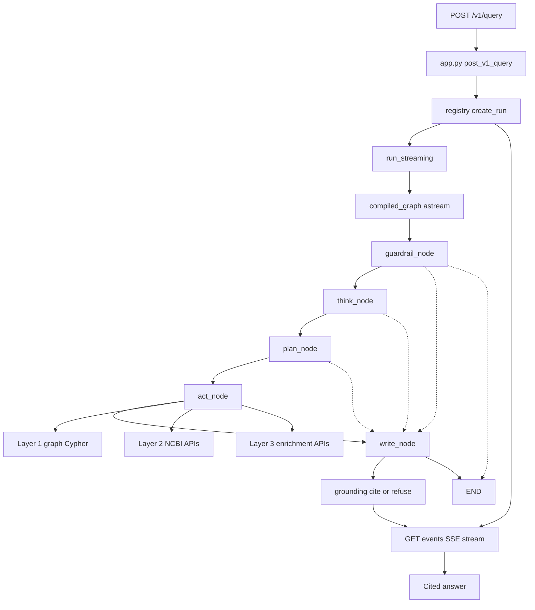

# Debugging guide

Which file to open when something is wrong, and what every source file does.

This guide has two halves. The first is a symptom index: you have a failure, and it tells you where to look. The second is an inventory: one row for every Python file under `src/system_03_search_agent/`, plus the frontend, test and infrastructure files a debugger actually opens.

Written for two audiences at once. A software engineer landing on this repository for the first time, and an AI agent working in it with no prior context. Both need the same thing, which is a path from a symptom to a file.

What this guide is not. It does not explain why the architecture is shaped the way it is; that is `docs/architecture/System_3_architecture_brainstorming.md`. It does not hold the per-tool API traps; those are `docs/ncbi/Tool_implementation_mechanics.md`. It does not cover operating the graph server; that is `docs/data-engineering/Graph_query_service_runbook.md`. It links to each rather than restating it.

Two things it deliberately does not claim. It describes what each file is for, never whether that file is correct. And a symptom row is a starting point, not a diagnosis.

One known divergence, recorded rather than quietly corrected.

- `requirements/Technical_specification.md` section 1.6 lists ten entries in its target module layout, and says the source tree holds only a package stub.
- The tree is built out. It holds fourteen top-level subpackages, or nineteen counting the four nested under `adapters/` the way that section counts. Either way the spec's list is short and its stub sentence is false.
- That document is locked, so this guide states the divergence and changes nothing.
- Its stated release condition, the Plan.md Step 6.2 reconciliation, has already passed and the lock remains. Worth knowing before you propose editing it.

## Table of contents

- [What this system actually is](#what-this-system-actually-is)
- [How a query flows through the code](#how-a-query-flows-through-the-code)
- [Start here by symptom](#start-here-by-symptom)
- [Keeping this guide current](#keeping-this-guide-current)
- [The Python inventory](#the-python-inventory)
- [The frontend, tests, tracker and CI gates](#the-frontend-tests-tracker-and-ci-gates)
- [Environment and configuration](#environment-and-configuration)
- [How to re-verify this guide](#how-to-re-verify-this-guide)

## What this system actually is

### What is it?

This repository answers plain English questions about NCBI biomedical data. You ask about a gene, a disease, a genetic variant, a publication, or an organism. You get back an answer where every claim carries a link to the NCBI record it came from.

One term first. A knowledge graph here stores each biological entity as a node and each relationship as a labelled edge. That shape lets you ask "which diseases connect to this gene" in one query instead of many joins. This one holds roughly 115M nodes and 693M edges from five NCBI databases.

An analogy, since the shape is the part people get wrong. A relational database is a filing cabinet: drawers of like-shaped records, and you answer a question by pulling from several drawers and matching them up by hand. A knowledge graph is a city map: the roads between places are drawn in advance, so "how do I get from here to there" is a walk rather than a reconstruction. The agent's job is to pick the right map, and to know when the map is out of date. That last part is why Layers 2 and 3 exist: the graph is a snapshot, and a snapshot of a city does not show the road that opened last week.

### Why does it exist?

A real research question crosses several NCBI databases at once. Answered through sequential public API calls, one traversal costs 10 to 30 round trips at 200 to 500ms each. The pre-built graph answers it in under 10ms. The graph is a periodic snapshot, so it can go stale, which is why live APIs stay in the picture.

Three axioms hold up everything after this.

- Axiom 1: every claim traces to a source record, or the system refuses. A confident wrong answer is worse than no answer here. `synthesis/grounding.py` matches by equality or substring after normalization, with no similarity score in the module.
- Axiom 2: Layer 1 is read-only at the connection level, not by instruction. The `kg_reader` role carries `default_transaction_read_only = on`, so no prompt can talk the agent into a write. `tools/cypher_validator.py` rejects write clauses as a second layer.
- Axiom 3: each of the five loop steps has one job, and the steps talk only through one state object, `GraphState`.

Axiom 3 is narrower than it first looks, and the missing half matters when you debug. A tempting stronger form is that a defect therefore belongs to exactly one step. The files do not support it: `write_node` reads fields that `think`, `plan` and `act` each wrote, so a wrong answer at Write is often a wrong value written three steps earlier. What does hold is the first half, since `core/graph.py` registers exactly five nodes with one function each.

### How does it work?

Every query runs five steps in order. Guardrail validates input and rejects injection. Think classifies the question and resolves the entities it names. Plan picks the tools. Act runs them. Write synthesizes the answer and attaches citations.

Act reaches three layers that differ in freshness and speed:

- Layer 1: the pre-ingested graph, Cypher over psycopg2, under 10ms, a snapshot that can be stale.
- Layer 2: live NCBI APIs such as EFetch and dbSNP REST, 100 to 500ms, always current.
- Layer 3: enrichment APIs such as PubTator3 and ClinicalTrials.gov, 200ms to 2s, always current.

Those two figures come from `docs/architecture/Three_layer_data_architecture.md`, and the repository does not agree with itself about them. `README.md`'s architecture table says 200 to 500ms and 500ms to 2s, and `.claude/rules/system-design-patterns.md` gives Layer 3 as 200 to 800ms. Three sources, three answers. Treat all of them as order-of-magnitude rather than measured, and do not quote one as authoritative.

### What this means for you

- Ask which axiom the bug violates. A missing citation is axiom 1. An unexpected write is axiom 2. A wrong field value is axiom 3.
- Do not chase a wrong answer at Write first. Find the node that last wrote the wrong field, then read what that node was handed.
- Treat a refusal as a designed outcome. Axiom 1 requires it when nothing grounds the claim.
- When a graph query fails, never reach for write credentials. The connection cannot write, by design.

## How a query flows through the code

You need this path in your head before you debug anything, because almost every symptom you will see is a late effect of an early hop.

The request does not run the agent inline. Three things happen instead:

- The server registers a run and gives it an id.
- The request returns immediately.
- The answer arrives later, on a separate stream.

The entry point is the FastAPI application object `app` in `adapters/web_sse/app.py`, built as `app = FastAPI(lifespan=_lifespan)`. Two routes matter here. `post_v1_query` handles `POST /v1/query` and returns 202 with a run id. `get_v1_query_events` handles `GET /v1/query/{run_id}/events` and returns an `EventSourceResponse`, which is the Server Sent Events stream the browser reads.

Between those two routes sits `core/run_registry.py`. `post_v1_query` calls `default_registry.create_run`, which starts a background task. That task drains `run_streaming(query, context)` from `core/run.py` into the run entry, and `RunRegistry.subscribe` replays those events to whoever is listening on the events route. This is why a run survives a client that reconnects, and why more than one consumer can read the same run.

`run_streaming` is the agent itself. It calls `compiled_graph.astream` on the graph compiled once at import time in `core/graph.py`, with `stream_mode=["updates", "custom"]`. Two channels, not one, and the difference matters when you debug a stall:

- The `updates` channel yields once per completed node.
- The `custom` channel carries events emitted mid-node through `_EventSink.emit_live`. That is how a tool chip appears while Act is still running rather than after it finishes.
- A trap worth knowing: `run.py` states the single-channel `stream_mode="updates"` form in two places, its module docstring and `run_streaming`'s own function docstring. Both are stale. Read the call site, not either docstring.

`run()` is the older buffered sibling. It uses `ainvoke` and yields everything after the graph returns. Both share a crash fallback that emits a synthetic error and done pair, so a crashed node never produces a blank screen.

The graph itself is five nodes registered in `_build_graph`. The edges are not a straight line, and that is the fact most worth carrying:

- `_route_after_guardrail` can send control to Think, or straight to Write, or straight to the end.
- `_route_after_think` can skip ahead to Write.
- `_route_after_plan` can skip ahead to Write.
- Act always goes to Write. That hop is the only unconditional one.
- Only Write reaches the end normally.

So a run can finish having never executed the node you assumed produced its output. Every node reads and writes the single `GraphState` TypedDict in `core/state.py`. Only the `events` field concatenates rather than overwrites.

Act is where the three data layers get touched, through `coordinator_worker_execute` in `harness/coordinator_worker.py`:

- Layer 1: `tools/cypher_query.py`, validated by `tools/cypher_validator.py` and executed by `execute_cypher` in `tools/graph_connection.py`.
- Layer 2: `tools/ncbi_efetch.py` and `tools/ncbi_dbsnp.py`.
- Layer 3: `tools/pubtator_annotate.py`, `tools/litvar2_lookup.py`, `tools/clinicaltrials_search.py`, `tools/pathogen_detection.py`.

Write calls the model to draft a narrative, then runs `run_grounding_pass` in `synthesis/grounding.py` over it. Any clause that no finding supports gets stripped along with its marker. If stripping removes the query's core ask, the whole answer is refused. That is axiom 1 executing, and it is the last gate before the answer leaves the process.



| Hop | File | What can go wrong there |
|---|---|---|
| HTTP entry, `post_v1_query` | `adapters/web_sse/app.py` | Auth or caller resolution rejects the request. The concurrency cap or the guest allowance refuses before any model call. A malformed body fails Pydantic validation and never reaches the agent. |
| Run registration, `create_run` | `core/run_registry.py` | The run is created but nothing subscribes, so events buffer with no reader. An abandoned run is cancelled after its grace period and looks like a silent hang. |
| Event stream, `get_v1_query_events` | `adapters/web_sse/app.py` | The client reconnects and asks for events after a sequence number the registry no longer holds. A run id owned by another caller is refused. |
| Agent entry, `run_streaming` | `core/run.py` | A node raises and you get the synthetic error and done pair instead of the real events. Interaction capture or session memory loading fails and silently changes what the next turn sees. |
| Graph invocation, `compiled_graph` | `core/graph.py` | Routing skips a node you assumed ran. A cap or a guard refusal sends control to Write or to the end, so Think, Plan and Act never execute at all. |
| Guardrail, `guardrail_node` | `core/graph.py` | An injection or off-topic classification refuses a legitimate question. The per-user daily cap or the system-wide cap declines the query before any spend. |
| Think, `think_node` | `core/graph.py` | Entity resolution returns nothing, or resolves a gene symbol to the wrong identifier. An unresolved gene-shaped token sets `unresolved_entity_symbols`, and Write then refuses by design. |
| Plan, `plan_node` | `core/graph.py` | No tool is selected, so Act has nothing to run and Write reports an empty result. Session memory supplies an antecedent identifier you did not expect. |
| Act, `act_node` | `core/graph.py` | A tool times out against its per-call budget, or a rate limit pool saturates. A `tool_start` event is emitted with no matching `tool_result`, leaving a chip spinning in the UI. |
| Layer 1 access | `tools/cypher_query.py`, `tools/graph_connection.py` | The validator rejects generated Cypher. The schema slice handed to the model omits the label the answer needs, so a correct answer is not expressible. Read that input before blaming the generation. |
| Layer 2 and Layer 3 access | `tools/ncbi_efetch.py`, `tools/ncbi_dbsnp.py`, `tools/pubtator_annotate.py`, `tools/litvar2_lookup.py`, `tools/clinicaltrials_search.py`, `tools/pathogen_detection.py` | A live API throttles or returns a maintenance error. A stale Layer 1 value is stated as current when a live value for the same field was also fetched. |
| Write and grounding | `core/graph.py`, `synthesis/grounding.py` | A claim is stripped because its clause does not match its finding, and the answer reads as truncated. Stripping removes the core ask and the whole answer becomes a refusal. |

## Start here by symptom

Every row below was verified against the named file. Work the rows this way:

- Find the closest symptom.
- Open the file the row names.
- Read its docstring and its comments before changing anything. In this repository the explanation is usually already written down at the site.

### The suite behaves strangely

| Symptom | Where to look | What is going on |
|---|---|---|
| A test fails with `LiveHttpCallInUnitSuiteError` | `tests/conftest.py` | A session-scoped fixture blocks real outbound HTTP in the unit suite. The exception class docstring carries the fix options |
| Seventeen psycopg2 tests fail right after you set `GRAPH_QUERY_URL` in `.env` | `tests/system_03_search_agent/tools/conftest.py` | Importing `litellm` anywhere calls `load_dotenv()`, so your `.env` becomes process state and the Layer 1 transport choice stops being explicit |
| Tests skip with a graph reason that looks wrong | `tests/system_03_search_agent/graph_gate.py` | The one implementation of the reachability probe. It replaced eight copies that all probed a transport that no longer exists and produced false skips |
| Many unrelated tests fail at once after a harness change | `tests/system_03_search_agent/model_stub.py` | One shared stub dispatches per tier. It breaks when a tier's response becomes load-bearing |
| `pytest` exits 0 having collected nothing | `.claude/skills/verify/SKILL.md` | Exit code 5 is a failure, not a pass. Usually a wrong working directory, a broken `PYTHONPATH`, a bad virtualenv, or a moved test tree |
| Live premise arms do not run | Any `*_premise.py` under `tests/` | They are gated on the `RUN_PREMISE_GATE` environment variable, not on a pytest marker |

### Green locally, red in CI

| Symptom | Where to look | What is going on |
|---|---|---|
| `ruff` is clean locally and gate 3 is red | `.github/gates/gate03_lint.sh` | The gate runs `ruff check` with no path, meaning the whole repository. A local run scoped to `src` and `services` checks less |
| `isort` is clean locally and gate 2 is red | `.claude/skills/verify/SKILL.md`, step 3b | `/verify` does run this gate, and has since 2026-08-30. If you ran bare `isort` by hand instead, that is the gap: `isort` is not idempotent on every input here, and its output can broaden a `# noqa` from one name to three. Run `bash .github/gates/gate02_import_order.sh` |
| `npm ci` passes on macOS and fails in the container | `frontend/.npmrc` | An unsatisfiable upstream peer dependency reached only on Linux, where npm walks the WASM fallback branch. The file explains the diagnosis in full |
| Gate 5 reports NOT RUN | `.github/gates/gate05_integration.sh` | Neither graph credential is set, so the gate exits 0 with a warning rather than passing silently |
| A gate passed but nothing ran | `.github/scripts/assert_gate_ran.py` | `pytest` exits 0 in more than one situation and only one of them is a pass. These assertions exist for exactly that |

### The browser suite will not start

| Symptom | Where to look | What is going on |
|---|---|---|
| Playwright dies on a `config.webServer` timeout | `frontend/playwright.config.ts` | Without `--host 127.0.0.1` Vite binds IPv6 loopback only, and the readiness probe never connects. The flag is load-bearing |
| `vite preview` answers 403 Blocked request | `frontend/vite.config.ts` | The preview server rejects a hostname the build did not know about. The allowed host is set in the config, because a CLI flag was dropped in argument forwarding |

### The product answers, but wrongly

| Symptom | Where to look | What is going on |
|---|---|---|
| The answer ships with no citations, or refuses when it should not | `src/system_03_search_agent/synthesis/grounding.py`, then `refuse.py` | Cite-or-refuse is deterministic here: exact or substring match after normalization, with no similarity score anywhere |
| A Cypher query returns plausible rows that answer the wrong question | `src/system_03_search_agent/tools/schema_slice.py` | Read the schema text the model was actually handed before debugging what it generated. A wrong answer from a correct generator means the input was wrong |
| The wrong entity was looked up | `async def think_node` in `src/system_03_search_agent/core/graph.py` | Entity resolution runs exact-ID-first and confirms every model-extracted span before it contributes a CURIE |
| A graph query is unexpectedly slow | `src/system_03_search_agent/tools/graph_connection.py` | The planner's row estimate under a small LIMIT chooses a sequential scan. The measured numbers and the fix are in the comments beside `_ENABLE_SEQSCAN_OFF_SQL` |

### The web app misbehaves

| Symptom | Where to look | What is going on |
|---|---|---|
| The UI shows `run failed` and an exception class, and nothing useful | `frontend/src/hooks/useAgentRun.ts` | Deliberate. The server message is not surfaced to the browser, so read the server side |
| The deployed web app is up, answers 200, and reaches no API | `frontend/src/lib/api.ts` | The base URL comes from `import.meta.env`, which Vite inlines at build time. Setting it after the build has no effect on the shipped bundle |
| A surface renders suspiciously perfect data | `frontend/src/stubs/registry.ts` | The single enumerable list of surfaces still rendering from a local stand-in rather than the real source |

## Keeping this guide current

This guide makes a claim about the source tree, and a claim about a tree goes stale the moment someone adds a file. So the claim is enforced rather than requested.

The contract, in two sentences. If you add, delete, rename or repurpose a file under `src/system_03_search_agent/`, update this guide in the same commit. If you change a file's module docstring summary line, re-check its row here and regenerate the manifest in the same commit.

`tests/system_03_search_agent/test_debugging_guide_coverage.py` enforces it with three arms, and rides CI gate 4 with no extra wiring:

- Arm 1, a file was added or deleted. Set equality between the tree and the paths this guide names.
- Arm 2, a path named here does not exist. Catches a rename that updated the code and not this document.
- Arm 3, a file was repurposed. Arms 1 and 2 both pass while a row describes a job the file no longer does, because the path is still right. The manifest stores a hash of each file's docstring summary line, which is the sentence each row was written from.

Each arm has a mutation case beside it proving it can go red. An arm that cannot fail is not an arm.

What the arms do not cover, stated here because a green gate otherwise reads as a stronger guarantee than it is:

- A behaviour change that leaves the docstring untouched. Arm 3 proves a row still matches the file's stated purpose, never that the statement is true.
- Whether any row's prose is accurate. No arm reads a row's meaning.
- Backticked filenames with no directory in them, which arm 2 skips as ambiguous.
- Paths under `logs/`, which holds gitignored runtime artifacts, and `reference/`, which is a symlink into another repository.
- Files with no module docstring, which arm 3 cannot watch. They are listed by name in the manifest under `no_docstring` so the gap is countable rather than silent. That list is currently empty: all 120 files carry a docstring.

Regenerate the manifest after a deliberate change:

```bash
python tests/system_03_search_agent/test_debugging_guide_coverage.py
```

Arm 3 fires on a docstring typo fix as well as on a real repurpose. That is the price of catching the real one, and the fix is a single manifest line. If it ever stops being worth paying, delete the arm rather than loosening it.

## The Python inventory

One row for every Python file under `src/system_03_search_agent/`, 120 in all, grouped by package. The "what it does" column is taken from each file's own module docstring, never inferred from its name.

One exception, flagged rather than hidden. `core/graph.py`'s module docstring still opens "The five-node LangGraph loop with stub nodes (T-2.0-07)". The nodes stopped being stubs at build phase 4.7. Its row below describes what the file does now, not what its docstring says, and this is the second stale docstring in `core/` after `run.py`'s. Arm 3 of the coverage gate watches that docstring for change, so if it is ever corrected the arm will fire and this note should go.

Symbols are named rather than located. There are no line numbers anywhere in this guide, because a line number is a claim that goes stale silently on the next edit. To find one, `grep -rn "async def act_node" src/`.

### `core/` the agent loop itself

Where the agent loop lives. Everything a query touches from `run()` through the compiled five-node graph, plus the state it carries along the way.

| File | What it does | Open it when |
|---|---|---|
| `src/system_03_search_agent/core/__init__.py` | Package marker. States that `core` is the agent-loop entry point, the `run()` interface every surface calls. | Confirming which package owns `run()` before searching elsewhere |
| `src/system_03_search_agent/core/graph.py` | The largest source file by a wide margin, 5947 of the package's 63102 lines, about a tenth. Its own docstring still says stub nodes and is stale. The five-node LangGraph loop with real node logic (`guardrail_node`, `think_node`, `plan_node`, `act_node`, `write_node`), plus the module-level `compiled_graph`. | Any Guardrail, Think, Plan, Act, or Write behavior needs tracing |
| `src/system_03_search_agent/core/persona.py` | The stable named scientist persona (`T-4.5-09`, Section 14.2). Presentation only, it never changes which tools run or what is retrieved. | A persona name looks wrong, unstable across turns, or leaks into grounding |
| `src/system_03_search_agent/core/run.py` | The `run()` entry point (Section 2.1). Wraps `core.graph.compiled_graph` and adds interaction capture and session memory. | A run starts, stops, or crashes before any node executes |
| `src/system_03_search_agent/core/run_registry.py` | In-process run registry tracking every in-flight or recently finished streaming run so HTTP endpoints can create, reconnect, or stop a run by `run_id`. | A `run_id` cannot be found, reconnected to, or stopped as expected |
| `src/system_03_search_agent/core/session_memory.py` | Bounded in-conversation session memory: token-capped, owner-checked, and firewalled so it can shape Think and Plan but never becomes a citation. | Session memory leaks into an answer, or an owner check fails |
| `src/system_03_search_agent/core/state.py` | `GraphState`, the `TypedDict` threaded through all five LangGraph nodes (Section 3.2). A pure type declaration with no runtime logic. | A node reads or writes a state key that looks missing or mistyped |

### `core/graph.py`, the five nodes

`compiled_graph` is built once at import time (`_build_graph().compile()`), since the graph structure is static and every per-query value lives in `GraphState`, never in the compiled object.

| Node | What it does |
|---|---|
| `async def guardrail_node` | Section 10 admission control. Decides whether the query is allowed in at all before any Think, Plan, or Act work happens. |
| `async def think_node` | Query-shape classification and entity resolution: extracts spans, confirms them live, and resolves symbols to CURIEs. |
| `async def plan_node` | Decomposes the classified query into planned tool calls, selecting `cypher_query` or an `ncbi_efetch` call and binding session memory. |
| `async def act_node` | Executes the planned tool calls, splits rows by trust, and shapes structured fields for citation. |
| `async def write_node` | Synthesizes the final answer from grounded findings, assembles citations, and applies the live-wins and staleness rules. |

### `contracts/` the typed request and event shapes

Typed request and event contracts shared by every System 3 surface (web_ui, rest_sse, mcp, cli, graphql).

| File | What it does | Open it when |
|---|---|---|
| `src/system_03_search_agent/contracts/__init__.py` | Package marker. States that contracts are typed request and event shapes shared across every surface. | Confirming which package owns a shared type before searching elsewhere |
| `src/system_03_search_agent/contracts/events.py` | The event envelope and the eleven-member event payload taxonomy (Sections 2.2 and 2.3), including `Event`, `GuardPayload`, `ThinkPayload`, `PlanPayload`, `ToolCall`, `CitationPayload`, `CostPayload`, `ErrorPayload`, `DonePayload`. | An emitted event has the wrong shape, a missing field, or fails validation |
| `src/system_03_search_agent/contracts/query.py` | The `Query` and `RequestContext` models: the single request shape every surface builds before calling `run()` (Section 2.1). | A surface builds a malformed `Query` or `RequestContext` before `run()` |

### `guardrail/` Section 10 admission control

Admission control for the agent loop: the only step every query passes through before any downstream work runs. One module per Section 10 subsection.

| File | What it does | Open it when |
|---|---|---|
| `src/system_03_search_agent/guardrail/__init__.py` | Package marker mapping each module to its Section 10 subsection (`verdict.py`, `prefilter.py`, `classifier.py`, `forbidden.py`). | Figuring out which Section 10 subsection owns a given check |
| `src/system_03_search_agent/guardrail/classifier.py` | Section 10.4: Guard-tier prompt-injection classification, the only step in the package that costs a model call. Defense in depth, not the sole control. | An injection-shaped query is wrongly admitted or wrongly refused |
| `src/system_03_search_agent/guardrail/forbidden.py` | Section 10.5: screens for verdict-seeking intent (diagnosis, treatment, pathogenicity calls) and write-seeking intent, after classification clears. | A verdict-seeking or write-seeking query slips through admitted |
| `src/system_03_search_agent/guardrail/prefilter.py` | Section 10.2: the cheap non-LLM pre-filter. Checks injection markers, medical-advice requests, then the biomedical allowlist, in that order, no model call. | A query is refused or admitted before the classifier ever runs |
| `src/system_03_search_agent/guardrail/verdict.py` | The shared `GuardVerdict` result type every Section 10 screen returns, constrained to `GuardPayload`'s category vocabulary. | A screen's verdict shape or category looks inconsistent downstream |

### `harness/` the three-tier LLM harness

The guard, plan, and synth tiers, cost accounting, per-step timeouts, prompt caching, and the coordinator-worker split.

| File | What it does | Open it when |
|---|---|---|
| `src/system_03_search_agent/harness/__init__.py` | Package marker describing the three-tier harness and pointing to `tiers.py`, `harness.py`, `cost_control.py`, `coordinator_worker.py`. | Getting oriented before tracing a cost, tier, or timeout issue |
| `src/system_03_search_agent/harness/cache.py` | The prompt-cache stable-prefix scaffold (`T-2.0-06`): builds and hashes the stable prefix string `Harness.call_tier` prepends. | A prompt cache hit rate drops or the stable prefix looks byte-unstable |
| `src/system_03_search_agent/harness/coordinator_worker.py` | The coordinator-worker split (Section 3.4): an isolated guard-tier reader pass over tool output, bounded and capped before it reaches synthesis. | A tool result looks corrupted, oversized, or wrongly capped before Write |
| `src/system_03_search_agent/harness/cost_control.py` | The four Section 19.1 cost caps (per-query, per-user daily, system-wide daily, anon daily) plus the `cost` event: `check_per_query_cap`, `check_user_daily_query_cap`, `check_system_daily_cost_cap`. | A cost cap did not fire, fired wrongly, or a `cost` event looks wrong |
| `src/system_03_search_agent/harness/harness.py` | `Harness.call_tier`: the LiteLLM/OpenRouter call wrapper with cost accounting. Per-step timeouts live here: `budget_for_step`, `budget_for_query_class`. | A model call times out, mis-prices, or `call_tier` raises unexpectedly |
| `src/system_03_search_agent/harness/tiers.py` | Tier resolution for guard, plan, and synth: `resolve_model` and `TierContext` hold a tier's resolved model id, never hardcoded. | The wrong model answered a tier, or a tier switched mid-query |

### `orchestrator/` the few-shot routing pool

The versioned few-shot example pool (Section 17), loaded once per process rather than per request.

| File | What it does | Open it when |
|---|---|---|
| `src/system_03_search_agent/orchestrator/__init__.py` | Package marker. States that the pool file loads once at process start and is written to only by the feedback promotion path. | Confirming which file owns the few-shot pool before editing it |
| `src/system_03_search_agent/orchestrator/few_shot_pool.py` | The loader that reads `few_shot_examples.json` exactly once per process: `load_pool`, `reset_pool_cache`, `append_example`. | A few-shot example is missing, stale, or reloaded mid-session |

### `tools/` Layer 1, the knowledge graph

This group is everything `cypher_query` is assembled from: schema slicing, generation, validation, provenance, the graph connection, and the HTTP transport that fronts it.

| File | What it does | Open it when |
|---|---|---|
| `src/system_03_search_agent/tools/cypher_query.py` | The only path to Layer 1. Runs the three step pipeline, slice, generate, validate and execute, with exactly one repair retry. | A graph answer comes back empty, uncited, or with a wrong row count |
| `src/system_03_search_agent/tools/schema_slice.py` | The graph schema text injected into the Cypher generation prompt. | A generated query references a label or predicate the model should not know about, or misses one it should |
| `src/system_03_search_agent/tools/cypher_generation.py` | Cypher generation with one informed repair retry, a single plan tier model call plus deterministic extraction of the Cypher body. | The model's raw response is not turning into usable Cypher, or the repair retry is not firing |
| `src/system_03_search_agent/tools/cypher_validator.py` | Deterministic validator for generated Cypher, regex and string based, never a model call and never a fuzzy score. | A query is rejected that should pass, or a query passes that should have been blocked |
| `src/system_03_search_agent/tools/cypher_provenance.py` | Maps a graph CURIE to its NCBI record page and shapes a raw graph row into the `CypherQueryRow` dict shape. | A row has the wrong citation, a missing `source_url`, or a duplicate citation across rows |
| `src/system_03_search_agent/tools/graph_connection.py` | The Layer 1 input and output boundary. Connects over psycopg2 as `kg_reader`, or dispatches to HTTPS when `GRAPH_QUERY_URL` is set. | A graph query fails to connect, times out, or is refused |
| `src/system_03_search_agent/tools/graph_http_transport.py` | The client side HTTPS transport for Layer 1, fronting the AGE graph when `GRAPH_QUERY_URL` is set. | The HTTPS graph query service is unreachable, rate limited, or returns a malformed body |
| `src/system_03_search_agent/tools/graph_schema_constants.py` | Static Layer 1 graph schema: labels, predicates, and CURIE prefixes. | A label, predicate, or CURIE prefix looks wrong or missing anywhere upstream |
| `src/system_03_search_agent/tools/agtype.py` | AGE agtype text parser, turning one agtype column value into the underlying Python value. | A parsed row is empty or malformed even though the query itself looks correct |
| `src/system_03_search_agent/tools/cypher_schemas.py` | Pydantic v2 input and output schemas for the `cypher_query` tool, the typed implementation of Section 6.1's locked JSON schema. | A `cypher_query` call is rejected on shape, or an unexpected field passes through |

Where the transport choice is made and the two error taxonomies a debugger reaches for:

- The dispatch itself lives in `_execute_cypher_impl` in `graph_connection.py`, which reads the `GRAPH_QUERY_URL` environment variable and either opens a psycopg2 connection or calls `execute_cypher_over_http`.
- The HTTPS client half of that dispatch is `execute_cypher_over_http` in `graph_http_transport.py`.
- `GraphError` family, all raised from the psycopg2 side and from `graph_http_transport.py`: `GraphError` (base, in `graph_connection.py`), `GraphConnectionError`, `GraphTimeoutError`, `GraphAuthError`, and `GraphRateLimitedError` (in `graph_http_transport.py`, a subclass of `GraphError`).
- `TransportError` family, raised from the Layer 2 and 3 shared transport, not Layer 1: `TransportError` (base, in `ncbi_transport.py`), `TransportTimeoutError`, `TransportConnectionError`, `TransportRateLimitedError`.

### `tools/` Layers 2 and 3, the live APIs

Every tool that reaches a live external endpoint at query time, plus the shared transports they call through. The endpoints are NCBI E-utilities and Datasets, PubChem, PubTator3, LitVar2 and ClinicalTrials.gov.

| File | What it does | Open it when |
|---|---|---|
| `src/system_03_search_agent/tools/ncbi_efetch.py` | The dispatcher for build phase 3.1's Layer 2 tool, routing to the search, fetch, summary, link, and enrichment action modules. | The wrong action module runs for a given `ncbi_efetch` input, or citation minting looks wrong |
| `src/system_03_search_agent/tools/ncbi_eutils_actions.py` | E-utilities body inspecting actions for `ncbi_efetch`: search, summary, fetch, and link. | An E-utilities call returns an empty, truncated, or misparsed record |
| `src/system_03_search_agent/tools/ncbi_datasets_actions.py` | The `dataset_report` action of `ncbi_efetch`, calling NCBI Datasets API v2. | A gene or genome dataset report field is missing or wrong |
| `src/system_03_search_agent/tools/ncbi_pubchem_actions.py` | The `pubchem_property` action of `ncbi_efetch`, calling PubChem PUG REST. | A PubChem property lookup by CID or by name returns nothing or the wrong compound |
| `src/system_03_search_agent/tools/ncbi_coordinate_overlap.py` | The dbVar and ClinVar coordinate overlap action for `ncbi_efetch`. | A coordinate overlap query misses a placement or matches the wrong chromosome or assembly |
| `src/system_03_search_agent/tools/ncbi_efetch_schemas.py` | Pydantic v2 input and output schemas for the `ncbi_efetch` tool, one input model per action. | An `ncbi_efetch` call is rejected on shape, or the wrong action's input model is being validated |
| `src/system_03_search_agent/tools/ncbi_dbsnp.py` | Variant normalization and dbSNP record retrieval, the rsID, SPDI, and HGVS normalization path. | A dbSNP lookup fails to normalize a variant, or a population frequency or clinical significance field is missing |
| `src/system_03_search_agent/tools/ncbi_dbsnp_schemas.py` | Pydantic v2 input and output schemas for the `ncbi_dbsnp` tool. | An `ncbi_dbsnp` call is rejected on shape |
| `src/system_03_search_agent/tools/pubtator_annotate.py` | Entity normalization and publication annotation via PubTator3. | An entity lookup or a publication's annotations come back empty or mismatched |
| `src/system_03_search_agent/tools/pubtator_annotate_schemas.py` | Pydantic v2 input and output schemas for the `pubtator_annotate` tool. | A `pubtator_annotate` call is rejected on shape |
| `src/system_03_search_agent/tools/litvar2_lookup.py` | Variant to literature evidence over LitVar2, variant search and publications lookup. | A variant search returns no matches, or a publications lookup returns the wrong PMIDs |
| `src/system_03_search_agent/tools/litvar2_lookup_schemas.py` | Pydantic v2 input and output schemas for the `litvar2_lookup` tool. | A `litvar2_lookup` call is rejected on shape |
| `src/system_03_search_agent/tools/clinicaltrials_search.py` | The disease to trials path over ClinicalTrials.gov API v2. | A trial search is missing `total_count`, a phase field, or a pagination cursor |
| `src/system_03_search_agent/tools/clinicaltrials_search_schemas.py` | Pydantic v2 input and output schemas for the `clinicaltrials_search` tool. | A `clinicaltrials_search` call is rejected on shape |
| `src/system_03_search_agent/tools/pathogen_detection.py` | Bulk Salmonella isolate, cluster, and AMR access over the NCBI Pathogen Detection PDG snapshot tree. | An isolate lookup or a cluster's SNP neighbors come back empty or wrong |
| `src/system_03_search_agent/tools/pathogen_detection_schemas.py` | Pydantic v2 input and output schemas for the `pathogen_detection` tool. | A `pathogen_detection` call is rejected on shape |
| `src/system_03_search_agent/tools/pathogen_ftp_transport.py` | Streaming HTTPS transport for the NCBI Pathogen Detection FTP tree, directory listing and filtered TSV row streaming. Declares `DEFAULT_TIMEOUT_S` (60.0) and `_DIRECTORY_LISTING_TIMEOUT_S` (15.0). | A snapshot fails to resolve, or a bulk TSV stream stalls or times out |
| `src/system_03_search_agent/tools/ncbi_transport.py` | Shared HTTP transport for `ncbi_efetch` and `ncbi_dbsnp`, rate limiting, retry, and response classification. Declares `DEFAULT_TIMEOUT_S` (15.0). | A rate limit, retry, or classification decision looks wrong across any E-utilities or Variation Services call |

This section deliberately omits the per-tool API traps, such as ELink target databases and the `global_mafs` array. Those live in `docs/ncbi/Tool_implementation_mechanics.md`.

### `tools/` the per-tool schema modules

Every `*_schemas.py` file does the same job: a Pydantic v2 typed, validated implementation of one tool's locked Section 6 input and output JSON schema, with `extra="forbid"` on every model.

| File | Tool it schemas |
|---|---|
| `src/system_03_search_agent/tools/cypher_schemas.py` | `cypher_query` |
| `src/system_03_search_agent/tools/ncbi_efetch_schemas.py` | `ncbi_efetch` |
| `src/system_03_search_agent/tools/ncbi_dbsnp_schemas.py` | `ncbi_dbsnp` |
| `src/system_03_search_agent/tools/pubtator_annotate_schemas.py` | `pubtator_annotate` |
| `src/system_03_search_agent/tools/litvar2_lookup_schemas.py` | `litvar2_lookup` |
| `src/system_03_search_agent/tools/clinicaltrials_search_schemas.py` | `clinicaltrials_search` |
| `src/system_03_search_agent/tools/pathogen_detection_schemas.py` | `pathogen_detection` |

### `adapters/web_sse/`

The FastAPI application object and every REST and SSE route a client calls. Startup work happens in its lifespan handler.

| File | What it does | Open it when |
|---|---|---|
| `src/system_03_search_agent/adapters/web_sse/__init__.py` | Package marker. States the package holds the FastAPI application and routes. | Confirming this is the web/SSE adapter package |
| `src/system_03_search_agent/adapters/web_sse/app.py` | FastAPI application entry point for the web/SSE adapter: the app object, lifespan startup, and every route. | A request 404s, 401s, times out, or never reaches the agent loop |

Route table for `src/system_03_search_agent/adapters/web_sse/app.py`. The `@app` routes are in file order. The two mounted routers are listed last for readability, though both are registered ahead of the first `@app` route in the file:

| Method and path | What it does |
|---|---|
| `GET /health` | Liveness check, returns `HealthResponse` |
| `GET /v1/persona` | Returns the caller's resolved persona for personalization |
| `GET /v1/allowance` | Returns the caller's remaining guest or account query allowance |
| `GET /v1/history` | Returns the caller's past runs from `interactions` |
| `POST /v1/query` | Creates a new agent run, returns `202` and a run id, never retried by any client |
| `GET /v1/query/{run_id}/events` | Streams the run's event envelope over SSE |
| `GET /v1/query/{run_id}/citations` | Returns the run's citations, capped at `_MAX_CITATIONS_PER_RUN` |
| `POST /v1/query/{run_id}/stop` | Stops a running query in flight |
| `POST /v1/query/{run_id}/feedback` | Records thumbs up or down feedback on a finished run, `204` |
| `include_router(auth_router)` | Mounts every `/auth/*` route from `src/system_03_search_agent/auth/router.py` |
| `include_router(graphql_router)` | Mounts the GraphQL surface at `GRAPHQL_PATH` |

### `adapters/cli/`

The `s3` terminal client: a thin HTTP and SSE client over the REST surface above, with no agent logic of its own.

| File | What it does | Open it when |
|---|---|---|
| `src/system_03_search_agent/adapters/cli/__init__.py` | Package marker for the `s3` terminal client. Deliberately re-exports nothing so siblings compose only through fixed interfaces. | Checking why a CLI submodule import fails |
| `src/system_03_search_agent/adapters/cli/client.py` | `CliClient`, wrapping the four REST/SSE calls `s3` makes: create a run, stream events, stop, export citations. | A CLI call gets the wrong HTTP error type or an unexpected retry |
| `src/system_03_search_agent/adapters/cli/credentials.py` | The on-disk credential store for the CLI's bearer JWT and refresh token, with strict file permission checks. | `s3 login` fails, or credentials are rejected as insecure or corrupt |
| `src/system_03_search_agent/adapters/cli/main.py` | The CLI entry point: `s3 ask`, `s3 stop`, `s3 login`. Parses argv and drives the run lifecycle. | `s3` exits with the wrong code, or a command does not do what its flags say |
| `src/system_03_search_agent/adapters/cli/render.py` | `Renderer`, turning the decoded `Event` envelope into the CLI's answer and references output. | CLI output is missing text, malformed, or leaks an unsanitized value |
| `src/system_03_search_agent/adapters/cli/sse.py` | Parses the actual SSE wire format `app.py` writes, including the `sse_starlette` keepalive comment line. | An SSE stream hangs, drops a frame, or raises `SseFrameTooLargeError` |

Console scripts, from `pyproject.toml`'s `[project.scripts]`:

| Script | Entry point |
|---|---|
| `s3` | `system_03_search_agent.adapters.cli.main:main` |
| `s3-kgx-export` | `system_03_search_agent.export.cli:main` (outside this scope) |

### `adapters/graphql/`

The GraphQL delivery surface built on Strawberry, mounted into the same FastAPI process as `web_sse/app.py`.

| File | What it does | Open it when |
|---|---|---|
| `src/system_03_search_agent/adapters/graphql/__init__.py` | Package marker. Deliberately empty of re-exports so each sibling module composes only through its fixed interface. | Checking why a GraphQL submodule import fails |
| `src/system_03_search_agent/adapters/graphql/context.py` | `get_context`, the one place this surface decides who is calling. Registered-account only, no guest path. | A GraphQL call gets the wrong caller identity, or a guest token is wrongly accepted |
| `src/system_03_search_agent/adapters/graphql/fold.py` | Folds one run's event stream into a single GraphQL response, duplicating `adapters/mcp/server.py`'s fold on purpose. | A GraphQL `ask` result is missing an answer, citation, or trust signal |
| `src/system_03_search_agent/adapters/graphql/router.py` | Constructs the hardened `GraphQLRouter` with request size, depth, and timeout limits. | A GraphQL request is rejected as too large, too deep, or times out unexpectedly |
| `src/system_03_search_agent/adapters/graphql/schema.py` | The `Query` and `Mutation` operation roots and their resolvers, the integration seam into the run registry. | A specific GraphQL field or mutation returns the wrong data or a `RunNotFound`/`RunNotOwned` error |
| `src/system_03_search_agent/adapters/graphql/security.py` | Overrides Strawberry's defaults: depth limit, alias limit, complexity budget, request timeout, error masking. | A GraphQL error message leaks internal detail, or a query is wrongly allowed or blocked |
| `src/system_03_search_agent/adapters/graphql/types.py` | The GraphQL type layer, mirroring each Section 2.3 payload model field for field. | A GraphQL type is missing a field the REST payload has, or `AskInput` validation is wrong |

### `adapters/mcp/`

The outbound-only MCP server, wrapping the same core agent loop the web adapter drives.

| File | What it does | Open it when |
|---|---|---|
| `src/system_03_search_agent/adapters/mcp/__init__.py` | Package marker for the outbound-only MCP server. | Confirming this is the MCP adapter package |
| `src/system_03_search_agent/adapters/mcp/server.py` | Exposes exactly one MCP tool, `ask_biomedical_question`, wrapping `RunRegistry.create_run`/`subscribe`, never the seven internal tools directly. | An MCP client gets a malformed or fatal-disclosure response from `ask_biomedical_question` |

### `auth/`

Password hashing, token minting and verification, the `/auth` router, and the guest identity path.

`AUTH_SECRET` is read independently in three files, which is worth knowing before you chase a token problem:

- `src/system_03_search_agent/auth/tokens.py`
- `src/system_03_search_agent/auth/guest.py`
- `src/system_03_search_agent/auth/router.py`

| File | What it does | Open it when |
|---|---|---|
| `src/system_03_search_agent/auth/__init__.py` | States the package holds pure auth primitives only, no HTTP or database access. | Confirming which auth logic belongs in this package versus `router.py` |
| `src/system_03_search_agent/auth/dependencies.py` | FastAPI dependencies resolving the caller: `get_current_user` for registered accounts, `get_caller` for the guest-aware `Principal`. | A protected route 401s unexpectedly, or a guest is resolved as the wrong identity |
| `src/system_03_search_agent/auth/guest.py` | Guest token primitives. Signs with `HMAC-SHA256(AUTH_SECRET, b"guest-token-v1")`, a key domain-separated from access tokens. | A guest token is rejected, or a guest and a logged-in user collide on identity |
| `src/system_03_search_agent/auth/passwords.py` | Argon2id password hashing and verification only. | A signup or login rejects a password that should be valid, or hashing throws |
| `src/system_03_search_agent/auth/preferences.py` | Reads and writes the single audience-depth preference stored on `users.profile` JSONB. | A user's audience depth preference is not saved or not applied |
| `src/system_03_search_agent/auth/router.py` | The `/auth` FastAPI router: `signup`, `login`, `refresh`, `logout`, `me`, `create_guest`. | Any `/auth/*` call returns the wrong status, or a refresh token reuse is not detected |
| `src/system_03_search_agent/auth/schemas.py` | Pydantic request and response schemas for the `/auth` router, all with `extra="forbid"`. | An `/auth` request with an unknown field is silently accepted instead of `422` |
| `src/system_03_search_agent/auth/tokens.py` | Access token (15-minute JWT, HS256, `AUTH_SECRET`) and refresh token (opaque, hashed) primitives. | A token fails to decode, an `alg` other than HS256 is accepted, or `AUTH_SECRET` is unset |

### `data/`

The user-data store for `search_agent_users`, entirely separate from the read-only knowledge-graph connection. It holds the SQLAlchemy engine, the session factory and the ORM models. `src/system_03_search_agent/data/base.py` is the sole reader of `USER_DB_URL`.

| File | What it does | Open it when |
|---|---|---|
| `src/system_03_search_agent/data/__init__.py` | States the package's `USER_DB_URL` dependency and that it never touches the graph database. | Confirming this package never shares a connection pool with the graph |
| `src/system_03_search_agent/data/base.py` | Declarative `Base` and engine construction, reading `USER_DB_URL` fresh on first engine creation. | The database connection fails to establish, or the wrong database URL is used |
| `src/system_03_search_agent/data/guest_sessions.py` | Creates guest sessions and spends allowance atomically via one `UPDATE ... RETURNING`, never read-then-write. | A guest allowance is over-spent, under-counted, or a race lets two tabs both spend |
| `src/system_03_search_agent/data/models.py` | SQLAlchemy ORM models for the user-data schema: `User`, `AuthSession`, `ChatSession`, `Interaction`, `CqCandidate`, `SavedQuery`, `GuestSession`, `GuestDailyUsage`, `GuestSourceDailyUsage`. | A field is missing from a query result, or a migration and the model disagree |
| `src/system_03_search_agent/data/session.py` | Session factory and the FastAPI dependency (`get_session`) handing out a database session per request. | A route holds a stale session, or a session is not closed after a request |

ORM table names in `src/system_03_search_agent/data/models.py`: `users`, `auth_sessions`, `sessions`, `interactions`, `cq_candidates`, `saved_queries`, `guest_sessions`, `guest_daily_usage`, `guest_source_daily_usage`.

### `synthesis/`

This is the Write step's deterministic half, Sections 8 and 9. Nothing in this package asks a model anything, which is the most common wrong assumption about this code. In plain code, before or after the Synth call but never inside it, it does three things:

- Builds the findings list.
- Grounds or refuses each claim by exact or substring match.
- Assigns trust.

| File | What it does | Open it when |
|---|---|---|
| `src/system_03_search_agent/synthesis/__init__.py` | Package map: `findings.py`, `grounding.py`, `trust.py`, `refuse.py`, called in that order by `write_node`. | Tracing the Write step's call order end to end |
| `src/system_03_search_agent/synthesis/conflict_detection.py` | Section 7.2: normalized equality check between a Layer 1 value and a live Layer 2/3 value, routing a mismatch to the `flag` trust outcome. | A conflicting value gets silently picked instead of flagged |
| `src/system_03_search_agent/synthesis/findings.py` | Section 8.1: the code-built findings list Synth is given, compressed from tool results, with no raw record reachable outside it. | A finding cites the wrong value, or Synth seems to reach outside its list |
| `src/system_03_search_agent/synthesis/freshness.py` | Section 7: live-wins-for-currency, the as-of marker, and the 30/90-day staleness thresholds for Layer 1 only. | A stale graph value is stated as current, or an as-of marker is missing |
| `src/system_03_search_agent/synthesis/grounding.py` | Section 8.2: deterministic cite-or-refuse. Exact or substring match after normalization, with no similarity score anywhere. | An answer ships uncited, or refuses when it should not |
| `src/system_03_search_agent/synthesis/provenance_defaults.py` | Section 9.2: the per-tool provenance default table for `evidence_kind`, `assertion_confidence`, population context and `license`. | A citation's `license` or `evidence_kind` looks wrong for its source tool |
| `src/system_03_search_agent/synthesis/refuse.py` | Section 8.4: builds the NCBI cross-database fallback link every refusal carries, host-pinned and length-capped. | A refusal has no fallback link, or the link fails the host pattern |
| `src/system_03_search_agent/synthesis/trust.py` | Section 8.3: the deterministic trust decision table over risk tier, grounded and triangulated, yielding answer, flag, ask, or refuse. | A high-risk claim comes back `answer` instead of `ask`, or triangulation looks wrong |

### `export/`

The KGX export package reads a scoped subgraph out of the already-built AGE graph and serializes it to `nodes.tsv`, `edges.tsv` and a manifest. It never writes to the graph and is a batch job, not a live adapter.

| File | What it does | Open it when |
|---|---|---|
| `src/system_03_search_agent/export/__init__.py` | Package summary: reads a scoped subgraph out of AGE and serializes it as KGX, never writing to the graph. | Orienting to the export package before touching any of its modules |
| `src/system_03_search_agent/export/cli.py` | The `s3-kgx-export` batch entry point: argument parsing, validation, error rendering, and printing manifest disclosures. | The CLI's argument handling or its printed disclosure text looks wrong |
| `src/system_03_search_agent/export/kgx.py` | Shapes a `TraversalResult` into TSV rows and a manifest, rebuilding every citation URL from a verified CURIE. | An exported row has a guessed or wrong `source_url` |
| `src/system_03_search_agent/export/manifest.py` | Builds and writes `manifest.json`: what was asked for, what happened, row counts, and the standing Layer 1 limitation. | `truncated` looks wrong or missing, or the snapshot version source is unclear |
| `src/system_03_search_agent/export/traversal.py` | Bounded subgraph traversal over Layer 1: one edge label per query, fixed single hops, a code-controlled `LIMIT 500`. | A traversal query times out, or a hop returns unexpectedly few or many rows |

### `feedback/`

The feedback loop ships three of Section 16's five stages in v1. Those are capture, the human-gated weekly review, and few-shot promotion. `writer.py` is the only place an `interactions` row reaches the database.

| File | What it does | Open it when |
|---|---|---|
| `src/system_03_search_agent/feedback/__init__.py` | Package summary: exports `capture_run` (stage 1) and `record_feedback`, the two public entry points into the capture path. | Finding which module owns a given feedback-loop stage |
| `src/system_03_search_agent/feedback/capture.py` | Pure assembler: folds a finished run's `Query` and events into one `InteractionRow`, no database or model call. | A captured row has a wrong or missing field traced back to the run |
| `src/system_03_search_agent/feedback/contracts.py` | The `InteractionRow` and `FeedbackPayload` types, the shared shape between the capture and writer halves. | A field name mismatch between capture and writer, or an ownership error type |
| `src/system_03_search_agent/feedback/coverage.py` | Derives `concept:<Label>` coverage tags from what a run's citations actually named. Note `predicate:<edge_type>` is deliberately deferred. | Coverage tags look wrong, or someone expects a `predicate:` tag that never ships |
| `src/system_03_search_agent/feedback/history.py` | The owner-scoped read path over `interactions`: `list_history` filters strictly on `owner_id`, never `user_id` or `session_id`. | A history read returns another owner's rows, or a guest sees nothing after reload |
| `src/system_03_search_agent/feedback/promotion.py` | Stage 5: promotes a reviewed `cq_candidates` row into the few-shot pool file and the golden dataset file, append only. | A promoted example never shows up in `few_shot_examples.json` or the golden dataset |
| `src/system_03_search_agent/feedback/review.py` | Stages 3 and 4: the weekly human-gated review script, surfacing candidates and recording a human's decision. | Running or debugging the weekly review ritual |
| `src/system_03_search_agent/feedback/rubric.py` | Deterministic `rubric_outcome_for`, zero LLM cost: maps trust signal and hard-fails to `pass`, `fail`, or `abstain`. | A live row's `rubric_outcome` looks wrong, or `rubric_score` is unexpectedly set |
| `src/system_03_search_agent/feedback/writer.py` | The one place an `interactions` row reaches the database. Idempotent writes, best-effort, never raises. | An interaction row is missing, duplicated, or a daily cap is undercounting |

### `observability/`

Section 20 keeps three separate records, each owning one job, so no single outage blinds the picture. They are `tracing`, `analytics` and `audit`.

- `observability/config.py` is the single resolver for every observability environment value all three read.
- The audit log's append happens in `_append_line`. Its default path is `logs/tool_audit.jsonl`.

| File | What it does | Open it when |
|---|---|---|
| `src/system_03_search_agent/observability/__init__.py` | Package summary naming the three records and stating `config` as their single leaf dependency. | Orienting to which observability module owns a given question |
| `src/system_03_search_agent/observability/analytics.py` | PostHog behavioral analytics, aggregates only, three real events (`build_properties` enforces the allowlist by construction). | An analytics event carries raw query text, citation content, or PII |
| `src/system_03_search_agent/observability/audit.py` | The append-only tool-call audit log. `record_tool_call` writes one JSONL line per Layer 1/2/3 access via `_append_line`. | An audit line is missing, malformed, or a secret leaked into a logged field |
| `src/system_03_search_agent/observability/config.py` | The single resolver for every observability environment value: `tracing_enabled`, `analytics_enabled`, `audit_log_path`, and more. | Tracing or analytics is on or off unexpectedly, or an env var seems ignored |
| `src/system_03_search_agent/observability/tracing.py` | LangSmith per-run tracing, with `redact_payload` stripping account PII (`owner_id`, `user_id`, session memory) before a trace is built. | A trace carries account PII, or a new `Query` field leaks into LangSmith |

### `eval/`

The offline evaluation harness operationalizes the evaluation playbook and Section 23. The grading harness is PARKED: `replay()` refuses to run without `acknowledge_parked=True`, because grounding compares the agent's prose against its own citation payload rather than the real record, so a fabricated answer can score full marks.

| File | What it does | Open it when |
|---|---|---|
| `src/system_03_search_agent/eval/__init__.py` | Package summary: the 50-query golden dataset, the 8-point rubric, hard-fails, pass@k/pass^k, coverage, and cost report. | Orienting to which eval module owns a given metric |
| `src/system_03_search_agent/eval/aggregate.py` | `pass_at_k` and `pass_caret_k` over per-run outcome tokens, plus `hard_fail_free_rate`. | A must-pass question's pass@k or pass^k figure looks wrong |
| `src/system_03_search_agent/eval/cost_report.py` | Summarizes per-query and total cost from already-captured trace records, never re-running anything. | The eval run's dollar cost or per-query breakdown needs checking |
| `src/system_03_search_agent/eval/coverage.py` | The coverage diagnostic: concept and predicate coverage against the graph's own schema constants. Never a gate. | Coverage percentages look wrong, or someone treats coverage as pass/fail |
| `src/system_03_search_agent/eval/dataset.py` | Loads and validates `golden_dataset.json`. Refuses any row whose `authored_from` is `agent_output`. | A golden row fails to load, or its `authored_from` provenance looks wrong |
| `src/system_03_search_agent/eval/hard_fails.py` | The three hard-fails checked on every run: zero provenance, a rendered clinical verdict, missing assembly context. | A run should have hard-failed but did not, or `renders_a_verdict` misfires |
| `src/system_03_search_agent/eval/replay.py` | Offline replay that grades captured runs and writes `interactions.rubric_score`. `replay()` refuses without `acknowledge_parked=True`: the harness is PARKED, four review rounds returned FAIL, and a fabricated answer citing a fabricated record can score 16 of 16. | Running or reasoning about a golden-dataset replay, or `rubric_score` looks wrong |
| `src/system_03_search_agent/eval/rubric_grader.py` | The 8-point rubric grader, five criteria deterministic and three judge-delegated, hard-fails computed before outcome before score. | A rubric score looks too high or too low for a graded run |
| `src/system_03_search_agent/eval/trace_source.py` | Assembles one `RunRecord` from a LangSmith trace's tree of per-node runs sharing a `trace_id`. | A trace fails to parse into a `RunRecord`, or a field looks missing |

### The package roots

Three package markers that belong to no single group above. They carry real docstrings, so they are listed rather than dismissed as empty files.

| File | What it does | Open it when |
|---|---|---|
| `src/system_03_search_agent/__init__.py` | The top-level package marker. Names System 3 as the agentic search agent for querying the NCBI knowledge graph. | Confirming the package name before an import |
| `src/system_03_search_agent/adapters/__init__.py` | Package marker for the delivery-surface adapters. | Confirming which package holds the surfaces |
| `src/system_03_search_agent/tools/__init__.py` | Declares the tool-layer contract: each tool is a read-plus-one-source reader that can call its own source and nothing else, never another tool and never a write path. | Before adding a tool, or when one tool appears to call another |

## The frontend, tests, tracker and CI gates

Everything outside `src/`. This is not one row per file: there are 48 `.ts` and `.tsx` files under `frontend/src/` and 179 test files, and listing them all would bury the ones that matter. What follows is the load-bearing set, the files whose behaviour causes a failure that looks like it came from somewhere else.

### `frontend/` the React application

Only the load-bearing files, the ones a reader needs to understand how a question becomes a rendered answer.

| File | What it does |
|------|--------------|
| `frontend/src/main.tsx` | Mounts `App` into the DOM's `#root` element inside `StrictMode`, throwing if the element is missing. |
| `frontend/src/App.tsx` | The assembled application shell: owns screen state, the ask flow, guest and signed-in auth, session id, depth preference, and the history rail. |
| `frontend/src/lib/api.ts` | Typed `fetch()` wrappers for the streaming-run REST surface and auth. The API base URL is same-origin by default, overridable via the `VITE_API_BASE_URL` environment variable, or per call via an `options.baseUrl` argument for tests. |
| `frontend/src/lib/events.ts` | Defines the `AgentEvent` discriminated union, the typed event contract mirrored from the backend's `contracts/events.py`, plus a defensive runtime parser, `parseAgentEvent`, that re-validates every frame on receipt. |
| `frontend/src/lib/routing.ts` | Client-side routing for the four top-level screens (search, integrations, about, docs), built on the History API directly with no router dependency. |
| `frontend/src/lib/guestSession.ts` | Guest token persistence in `localStorage`, the migrated-session marker, and `dailyLimitPhrase`, the single function both the account menu and the history rail's footer read for "searches left" copy. |
| `frontend/src/hooks/useAgentRun.ts` | Consumes `GET /v1/query/{run_id}/events`. It owns the SSE decode: it opens the stream over `fetch()` rather than the native `EventSource` (which cannot send a bearer header), and hand-parses the `text/event-stream` wire format as chunks arrive. |
| `frontend/src/hooks/useRunView.ts` | Maps the real agent event stream onto the run and answer screens: derives the active step, tool call chips, claims, sources, trust pills, and the reasoning log, purely from events received. |
| `frontend/src/stubs/registry.ts` | The stub registry. Declares every UI surface still rendering from a local stub, what it renders today, the build phase that wires it for real, and where the real data will come from. |
| `frontend/vite.config.ts` | Vite and vitest configuration: the jsdom test environment, a 15 second test timeout (raised from vitest's 5 second default after a stream leak and genuine contention), and the preview server's allowed host list. |
| `frontend/playwright.config.ts` | Playwright end-to-end configuration: fixed, non-default ports for the frontend and backend, and the two `webServer` entries that start a real Vite dev server and a real FastAPI backend with only the outbound LLM call faked. |
| `frontend/.npmrc` | Sets `legacy-peer-deps=true` to work around an unsatisfiable peer dependency (`@napi-rs/wasm-runtime` wanting a newer `@emnapi/core` than the lockfile resolves) that only surfaces when `npm ci` runs on Linux. |

The `components/` directory holds 24 `.tsx` files across nine subdirectories, counted with `find frontend/src/components -name "*.tsx"`.

| Subdirectory | Files |
|---|---|
| `chat/` | 6 |
| `screens/` | 6 |
| `shell/` | 4 |
| `auth/` | 2 |
| `feedback/` | 2 |
| `answer/` | 1 |
| `brand/` | 1 |
| `controls/` | 1 |
| `guest/` | 1 |

### `tests/` the suite, and the helpers that cause confusing failures

Not a list of the 179 Python test files. These are the shared fixtures whose behaviour can make a failure look like it belongs to a different file entirely.

| File | What it does |
|------|--------------|
| `tests/conftest.py` | A session-scoped, autouse fixture that blocks every real outbound HTTP call (patched at `httpx.AsyncHTTPTransport.handle_async_request`, `httpx.HTTPTransport.handle_request`, and `requests.adapters.HTTPAdapter.send`), so a test file that forgets to stub a network call fails loudly in that test rather than silently reaching NCBI or LangSmith. Stands aside entirely when `RUN_PREMISE_GATE` is set. |
| `tests/system_03_search_agent/graph_gate.py` | One shared implementation of "is the Layer 1 graph reachable right now", dispatching on `GRAPH_QUERY_URL` the same way `graph_connection.execute_cypher` does, replacing eight byte-identical copies that all probed a deleted SSH tunnel and skipped silently. |
| `tests/system_03_search_agent/model_stub.py` | One shared stub for `litellm.acompletion` that dispatches a compliant response per tier (Guard, Think, Synth), so a tier that starts reading its own response for the first time does not silently break tests that never expected it to. |
| `tests/system_03_search_agent/tools/conftest.py` | Clears the `GRAPH_QUERY_URL` environment variable before every test in this directory (an autouse fixture), so a test states its own Layer 1 transport rather than inheriting whatever a developer's `.env` happens to set. |
| `tests/e2e_support/mock_llm_backend.py` | A standalone process entrypoint that runs the real, unmodified FastAPI app with only the outbound LLM call monkeypatched, for Playwright's `webServer` to spawn as the end-to-end suite's backend. |

`pyproject.toml`'s `[tool.pytest.ini_options]` sets `testpaths = ["tests"]` and registers exactly one marker: `integration`.

| How to run | Command |
|------------|---------|
| Full suite | `pytest` |
| Unit selection, what CI's gate 4 runs | `pytest -m "not integration" -q -rs --junitxml=unit-results.xml` |
| Integration selection, gate 5 | `pytest -m integration -q -rs --junitxml=integration-results.xml` |
| Live premise gate opt-in | Set `RUN_PREMISE_GATE=1` (accepted values `1`, `true`, `yes`) to let the live tool arms run and to stand `tests/conftest.py`'s network block aside |

Directory counts, from `find tests -name "*.py"`. There are 179 Python test files under `tests/`.

| Directory | Files |
|---|---|
| `tests/system_03_search_agent/tools/` | 42 |
| `tests/system_03_search_agent/adapters/` | 25 |
| `tests/system_03_search_agent/core/` | 22 |
| `tests/system_03_search_agent/eval/` | 11 |
| `tests/system_03_search_agent/feedback/` | 10 |
| `tests/system_03_search_agent/synthesis/` | 10 |
| `tests/system_03_search_agent/observability/` | 9 |
| `tests/system_03_search_agent/auth/` | 6 |
| `tests/system_03_search_agent/data/` | 6 |
| `tests/system_03_search_agent/export/` | 6 |
| `tests/system_03_search_agent/harness/` | 6 |
| `tests/system_03_search_agent/guardrail/` | 5 |
| `tests/system_03_search_agent/contracts/` | 3 |
| `tests/system_03_search_agent/` directly | 5 |
| `tests/ci/` | 5 |
| `tests/services/` | 3 |
| `tests/e2e_support/` | 2 |
| `tests/` root | 2 |
| `tests/tracker/` | 1 |

Those sum to 179. Of the five files sitting directly in `tests/system_03_search_agent/`, two are the shared helpers listed above, `graph_gate.py` and `model_stub.py`. The others are `__init__.py`, `test_integrations_page_claims.py`, and `test_debugging_guide_coverage.py`, which is the gate described under Keeping this guide current. Separately, the frontend carries 18 `*.test.*` files under `frontend/src/` and 13 Playwright spec files under `frontend/e2e/`.

### `tracker/` the build board and its scripts

One Python script per job, each read for its own docstring and its own argument parsing rather than assumed.

| Script | Job | Flags |
|--------|-----|-------|
| `preflight.py` | Probes one endpoint per transport (the product's own model provider, the build harness's own model provider, and the Layer 1 graph) before dispatching anything expensive, using stdlib only. | `--transport` (repeatable, choices are the HTTPS transports plus `graph`, default is all of them), `--timeout` (float seconds per probe, default `PREFLIGHT_TIMEOUT` environment variable or `6`) |
| `check_doc_drift.py` | Computes every tracked fact (a test count, a decision count, a phase status, a PR number) from source, then scans every tracked markdown file for a stale copy of it, plus a handful of recurring structural defects. | `--check` (exit 0 on a clean run, exit 1 if any drift is found) |
| `render_board.py` | Renders `tracker/BOARD.md` into `tracker/board.html`, the kanban view. It is the only thing that writes that file, so the two can never drift by hand. | `--check` (parse and report, write nothing) |
| `check_learnings_coverage.py` | Fails a phase close if that phase had confirmed or closed findings and zero matching rows in `LEARNINGS.md`. | Positional `<phase>` (for example `2.0`), `--phase-file PATH` (defaults to the phase's own tracker file) |

### `.github/` continuous integration

`.github/workflows/ci.yml` runs Section 24's ten gates across four jobs. They are ADVISORY rather than merge-blocking, since branch protection needs GitHub Pro or a public repository (finding F-4.14-A-04). A red gate does not stop a merge; a person choosing not to click does. Every gate step's `run:` is exactly one token, the path to its script under `.github/gates/`.

| Gate | What it checks | Script | Command it runs |
|------|-----------------|--------|------------------|
| 1 | Python compiles and imports cleanly | `.github/gates/gate01_compile_and_import.sh` | `python -m compileall -q src services tests alembic && python -c "import system_03_search_agent.adapters.web_sse.app, system_03_search_agent.core.graph, system_03_search_agent.adapters.cli.main"` |
| 2 | Import order | `.github/gates/gate02_import_order.sh` | `isort --check-only --diff src tests services tracker alembic .claude .github` |
| 3 | Lint | `.github/gates/gate03_lint.sh` | `ruff check` |
| 4 | Unit test suite, plus a follow-up step proving no test skipped for a missing database | `.github/gates/gate04_unit_suite.sh` and `.github/gates/gate04b_no_unsanctioned_skips.sh` | `pytest -m "not integration" -q -rs --junitxml=unit-results.xml`, then `python .github/scripts/assert_no_db_skips.py unit-results.xml` |
| 5 | Integration suite, network-gated | `.github/gates/gate05_integration.sh` | `pytest -m integration -q -rs --junitxml=integration-results.xml`, reported as `NOT RUN` rather than passed when neither `GRAPH_QUERY_URL` nor `GRAPH_PG_HOST` is available |
| 6 | Python dependency audit | `.github/gates/gate06_python_audit.sh` | `pip-audit -r requirements.txt` |
| 7 | Frontend dependency audit | `.github/gates/gate07_frontend_audit.sh` | `npm audit --audit-level=high` |
| 8 | Frontend build and test | `.github/gates/gate08_frontend_build_and_test.sh` | `npm run build && npm test` |
| 9 | Required-path tests, never skippable | `.github/gates/gate09_required_paths.sh` | `pytest tests/system_03_search_agent/synthesis/test_required_paths.py -q --no-header -p no:cacheprovider -rs --junitxml=required-paths.xml && python .github/scripts/assert_required_paths_ran.py required-paths.xml` |
| 10 | Accessibility, WCAG 2.1 AA, on UI-touching pull requests only | `.github/gates/gate10_accessibility.sh` (gated by `.github/gates/gate10_filter.sh`) | `npx playwright test e2e/accessibility.spec.ts` |

The workflow contains no inline shell: every gate step's body is a single token equal to its script's path, a whole-string equality chosen after two separate defeats of substring matching against inline shell. See `.github/gates/README.md` for the full reasoning.

## Environment and configuration

### Every variable, and who reads it

| Variable | In env.example | Read by | What breaks without it |
|---|---|---|---|
| `GRAPH_QUERY_URL` | yes | `src/system_03_search_agent/tools/graph_connection.py`, `src/system_03_search_agent/tools/graph_http_transport.py`, and `services/graph_query_service/app.py` on the server side | Layer 1 HTTPS graph queries fail; fallback to psycopg2 if unset |
| `GRAPH_QUERY_TOKEN` | yes | `src/system_03_search_agent/tools/graph_http_transport.py` on the client side, `services/graph_query_service/app.py` on the server side | Layer 1 HTTPS queries fail (Bearer token required if `GRAPH_QUERY_URL` set) |
| `GRAPH_PG_HOST` | yes | `src/system_03_search_agent/tools/graph_connection.py` | Layer 1 psycopg2 connections fail; defaults to empty |
| `GRAPH_PG_PORT` | yes | `src/system_03_search_agent/tools/graph_connection.py` | Layer 1 connections use wrong port; defaults to `5432` |
| `GRAPH_PG_USER` | yes | `src/system_03_search_agent/tools/graph_connection.py` | Layer 1 psycopg2 connections fail; defaults to empty |
| `GRAPH_PG_PASSWORD` | yes | `src/system_03_search_agent/tools/graph_connection.py` | Layer 1 psycopg2 authentication fails; defaults to empty |
| `GRAPH_PG_DBNAME` | yes | `src/system_03_search_agent/tools/graph_connection.py` | Layer 1 connections use wrong database; defaults to empty |
| `GRAPH_SNAPSHOT_VERSION` | no | `src/system_03_search_agent/tools/cypher_query.py`, `src/system_03_search_agent/export/manifest.py` | Nothing breaks. Both readers fall back to `_DEFAULT_GRAPH_SNAPSHOT_VERSION`, which is `ncbi_kg_v1_2026-04-22`. That constant is hand-maintained and nothing re-reads it from the graph |
| `GUARD_MODEL` | yes | `src/system_03_search_agent/harness/tiers.py` | Guard tier falls back to app config default if unset |
| `PLAN_MODEL` | yes | `src/system_03_search_agent/harness/tiers.py` | Plan tier falls back to app config default if unset |
| `SYNTH_MODEL` | yes | `src/system_03_search_agent/harness/tiers.py` | Synth tier falls back to app config default if unset |
| `NCBI_EUTILS_RPS` | no | `src/system_03_search_agent/tools/ncbi_transport.py` | Nothing. Each family falls back to its `default_requests_per_second` in `_FAMILY_CONFIGS` |
| `NCBI_DATASETS_RPS` | no | `src/system_03_search_agent/tools/ncbi_transport.py` | Same fallback |
| `NCBI_PUBCHEM_RPS` | no | `src/system_03_search_agent/tools/ncbi_transport.py` | Same fallback |
| `NCBI_VARIATION_RPS` | no | `src/system_03_search_agent/tools/ncbi_transport.py` | Same fallback |
| `NCBI_PUBTATOR_RPS` | no | `src/system_03_search_agent/tools/ncbi_transport.py` | Same fallback |
| `NCBI_LITVAR2_RPS` | no | `src/system_03_search_agent/tools/ncbi_transport.py` | Same fallback |
| `NCBI_CLINICALTRIALS_RPS` | no | `src/system_03_search_agent/tools/ncbi_transport.py` | Same fallback |
| `NCBI_API_KEY` | yes | `src/system_03_search_agent/tools/ncbi_transport.py` | E-utilities rate limit stays at 3/sec instead of 10/sec; Layer 2 access rate-limited |
| `NCBI_EMAIL` | yes | nothing under `src/` or `services/` | Declared as a live assignment in `env.example` and not yet wired. E-utilities requests carry no email parameter |
| `OPENROUTER_API_KEY` | yes | (LiteLLM reads this indirectly for OpenRouter provider) | Model calls via OpenRouter fail without authentication |
| `ANTHROPIC_API_KEY` | yes | (LiteLLM reads this indirectly for Anthropic provider) | Model calls via Anthropic provider fail |
| `OPENAI_API_KEY` | yes | (LiteLLM reads this indirectly for OpenAI provider) | Model calls via OpenAI provider fail |
| `USER_DB_URL` | yes | `src/system_03_search_agent/data/base.py` | User database connections fail; auth, interactions, and candidate tables unreachable |
| `REDIS_URL` | yes | nothing under `src/` or `services/` | The name `REDIS_URL` appears nowhere under `src/` or `services/`. Redis is mentioned once, in a comment in `synthesis/freshness.py`. Redis is provisioned and billed per deployment, and the Section 4.3 response cache is not wired yet |
| `AUTH_SECRET` | yes | `src/system_03_search_agent/auth/tokens.py`, `src/system_03_search_agent/auth/guest.py`, `src/system_03_search_agent/auth/router.py` | Token signing/verification fails; authentication and session management broken |
| `S3_BASE_URL` | no | `src/system_03_search_agent/adapters/cli/main.py` | The `s3` command falls back to `_DEFAULT_BASE_URL`, which is `http://127.0.0.1:8000`. Not read by `s3-kgx-export`, which is `export/cli.py` |
| `S3_CREDENTIALS_PATH` | no | `src/system_03_search_agent/adapters/cli/credentials.py` | CLI credential file uses hardcoded path if override not set |
| `PER_QUERY_COST_CAP_USD` | yes | `src/system_03_search_agent/harness/cost_control.py` | Cost cap cannot be enforced; RuntimeError raised if not set when checked |
| `PER_USER_DAILY_QUERY_CAP` | yes | `src/system_03_search_agent/harness/cost_control.py` | Per-user query counting disabled; RuntimeError raised if not set when checked |
| `SYSTEM_DAILY_CAP_USD` | yes | `src/system_03_search_agent/harness/cost_control.py` | System-wide cost cap disabled; RuntimeError raised if not set when checked |
| `PER_STEP_TIMEOUT_SECONDS` | yes | nothing under `src/` or `services/` | The per-step budgets that are enforced come from `_TIER_STEP_BUDGET_S` in `src/system_03_search_agent/harness/harness.py`, not from this variable |
| `ANON_DAILY_RUN_CAP` | yes | `src/system_03_search_agent/harness/cost_control.py` | Anonymous daily run limit cannot be enforced; RuntimeError raised if not set when checked |
| `OPERATOR_USER_IDS` | yes | `src/system_03_search_agent/harness/cost_control.py` | No operators allowed to see cost/token details; empty list by default |
| `RUN_MIGRATIONS_ON_STARTUP` | yes | `src/system_03_search_agent/adapters/web_sse/app.py` | Database schema migrations skipped on startup if not set |
| `APP_ENV` | yes | `src/system_03_search_agent/adapters/web_sse/app.py` | Health endpoint returns `unknown` for `app_env` if not set |
| `CORS_ORIGINS` | yes | `src/system_03_search_agent/adapters/web_sse/app.py` | CORS headers not validated; defaults to empty |
| `LANGSMITH_ENDPOINT` | no | `src/system_03_search_agent/observability/config.py` | Nothing. A fallback variant, with `LANGCHAIN_ENDPOINT` beside it |
| `LANGCHAIN_ENDPOINT` | no | `src/system_03_search_agent/observability/config.py` | Nothing. A fallback variant |
| `LANGSMITH_TRACING` | no | `src/system_03_search_agent/observability/config.py` | Nothing. A tracing-flag variant |
| `LANGSMITH_TRACING_V2` | no | `src/system_03_search_agent/observability/config.py` | Nothing. A tracing-flag variant |
| `LANGCHAIN_TRACING` | no | `src/system_03_search_agent/observability/config.py` | Nothing. A tracing-flag variant |
| `LANGSMITH_API_KEY` | yes | `src/system_03_search_agent/observability/config.py` (also `LANGCHAIN_API_KEY`) | LangSmith tracing disabled if both variants unset |
| `LANGSMITH_PROJECT` | yes | `src/system_03_search_agent/observability/config.py` (also `LANGCHAIN_PROJECT`) | LangSmith traces filed under default `agentic-search-ui` project if unset |
| `LANGCHAIN_TRACING_V2` | yes | `src/system_03_search_agent/observability/config.py`, and the langsmith library also honours it | Tracing flag precedence; see observability/config.py docstring |
| `POSTHOG_API_KEY` | yes | `src/system_03_search_agent/observability/config.py` | PostHog analytics disabled if unset |
| `POSTHOG_HOST` | yes | `src/system_03_search_agent/observability/config.py` | PostHog ingest host defaults to `https://us.i.posthog.com` if unset |
| `TOOL_AUDIT_LOG_PATH` | yes | `src/system_03_search_agent/observability/config.py` | Audit log defaults to `logs/tool_audit.jsonl` if unset |
| `TOOL_AUDIT_LOG_ENABLED` | yes | `src/system_03_search_agent/observability/config.py` | Audit log enabled by default; only literal `false` disables it |
| `VITE_API_BASE_URL` | yes | (frontend/src/lib/api.ts reads this at build time) | Frontend defaults to same-origin; unset uses relative URLs |
| `PORT` | yes | nothing under `src/` or `services/`. Read by `railway.json`'s start command and passed to `uvicorn --port` | The deployed service binds the wrong port |
| `LOG_LEVEL` | yes | nothing under `src/` or `services/` | Nothing. No module installs a logging handler; the host, `uvicorn` or `pytest`, configures the root logger |
| `NIXPACKS_NO_CACHE` | yes | nothing under `src/` or `services/` | A Railway builder hint. The build may reuse a cached layer |
| `NIXPACKS_NODE_VERSION` | yes | nothing under `src/` or `services/` | A Railway builder hint. The frontend toolchain version is unpinned |
| `BUILD_OPENROUTER_API_KEY` | yes | (build harness only, not used in product code) | Alternate build backend unavailable |

### Variables read in code but absent from env.example

Seventeen names are read in the application code and absent from `env.example`.

Seven are the per-family rate-limit overrides that `ncbi_transport.py` reads through `_FAMILY_CONFIGS`, one per API family: `NCBI_EUTILS_RPS`, `NCBI_DATASETS_RPS`, `NCBI_PUBCHEM_RPS`, `NCBI_VARIATION_RPS`, `NCBI_PUBTATOR_RPS`, `NCBI_LITVAR2_RPS`, `NCBI_CLINICALTRIALS_RPS`.

Those are the live knobs on every Layer 2 and Layer 3 pool that `.claude/rules/tool-call-budgets.md` governs, and none is discoverable from `env.example`.

The remaining ten names follow, rendered as seven bullets because three tracing-flag variants are named inside a sibling's bullet rather than given one each:

- `GRAPH_SNAPSHOT_VERSION`: read independently by `src/system_03_search_agent/tools/cypher_query.py` and `src/system_03_search_agent/export/manifest.py`. The second restates the constants rather than importing them, deliberately, because the first module's are private. It is on the live answer path, not CLI-only. Falls back to `_DEFAULT_GRAPH_SNAPSHOT_VERSION`, not to an empty string.
- `S3_BASE_URL`: read by `src/system_03_search_agent/adapters/cli/main.py`, the `s3` command. Points the CLI at a non-default API host.
- `S3_CREDENTIALS_PATH`: read by `src/system_03_search_agent/adapters/cli/credentials.py` for CLI credential overrides. Also CLI-only.
- `LANGSMITH_ENDPOINT`: read by `src/system_03_search_agent/observability/config.py` as a fallback variant. Variant `LANGCHAIN_ENDPOINT` also read but undeclared.
- `LANGSMITH_TRACING_V2`: read by `src/system_03_search_agent/observability/config.py` as a variant. Additional variants `LANGCHAIN_TRACING_V2`, `LANGSMITH_TRACING`, and `LANGCHAIN_TRACING` are also read but only `LANGCHAIN_TRACING_V2` is declared in env.example.
- `LANGCHAIN_API_KEY`: read by `src/system_03_search_agent/observability/config.py` as a fallback variant of the declared `LANGSMITH_API_KEY`. Undeclared.
- `LANGCHAIN_PROJECT`: read by `src/system_03_search_agent/observability/config.py` as a fallback variant of the declared `LANGSMITH_PROJECT`. Undeclared.

### Variables in env.example but read by nothing under src/ or services/

- `REDIS_URL`: a live assignment in `env.example`, read by nothing under `src/` or `services/`. Needed when the Section 4.3 response cache is wired.
- `NCBI_EMAIL`: a live assignment in `env.example`, read by nothing under `src/` or `services/`.
- `PER_STEP_TIMEOUT_SECONDS`: a live assignment in `env.example`, read by nothing. The per-step budgets actually enforced come from `_TIER_STEP_BUDGET_S` in `src/system_03_search_agent/harness/harness.py`, read by `budget_for_step`.
- `NIXPACKS_NO_CACHE`: deployment-only build hint (not read by app code).
- `NIXPACKS_NODE_VERSION`: deployment-only build hint for frontend toolchain (not read by app code).
- `PORT`: declared in env.example; read at runtime by the web framework, not explicitly in Python code.
- `LOG_LEVEL`: declared in env.example; not read in Python code (likely used by the logging framework at deployment time).

### Central settings module

No central settings.py or config.py exists in the main codebase. The observability system reads multiple environment variables through a dedicated resolver in `src/system_03_search_agent/observability/config.py`. Every other subsystem reads its own environment variables directly at the point of use. The graph connection, the cost caps and the auth token path each do their own reading, which is why the table above lists a file per variable rather than one settings module.

### Counts

Measured rather than asserted:

- `env.example` declares 40 variables. Re-derive with `grep -cE '^[A-Za-z0-9_]+=' env.example`.
- Seventeen names are read in code and absent from it: seven `NCBI_*_RPS` rate-limit overrides, `GRAPH_SNAPSHOT_VERSION`, the two `S3_` command-line variables, and seven LangSmith and LangChain naming variants.
- Twelve of the forty declared variables are read by no code under `src/` or `services/`. Re-derive with `grep -rE "os\.environ|os\.getenv" src services --include="*.py"` and compare against `env.example`. They split into two groups, and the difference matters:
  - Consumed elsewhere, so their absence from our code is correct: `OPENROUTER_API_KEY`, `ANTHROPIC_API_KEY` and `OPENAI_API_KEY`, which LiteLLM reads; `VITE_API_BASE_URL`, which Vite inlines at frontend build time; and `BUILD_OPENROUTER_API_KEY`, which belongs to the build harness.
  - Read by nothing in this repository's application code: `NCBI_EMAIL`, `REDIS_URL`, `PER_STEP_TIMEOUT_SECONDS`, `PORT`, `LOG_LEVEL`, `NIXPACKS_NO_CACHE`, `NIXPACKS_NODE_VERSION`. `PORT` and the two `NIXPACKS_` values are read by the platform, from `railway.json` and the builder. The other four are unwired.

## How to re-verify this guide

Nothing here is asserted on trust. Run these to check it yourself.

| What you are checking | Command |
|---|---|
| Every source file has a row, no phantom paths, no repurposed file with a stale row | `pytest tests/system_03_search_agent/test_debugging_guide_coverage.py -v` |
| House style, the same gate every document in this repository passes | `python .claude/skills/doc-readability/scripts/check_style.py docs/build/Debugging_guide.md` |
| No stated count has gone stale anywhere in the repository | `python tracker/check_doc_drift.py --check` |
| Every transport this guide names is actually reachable right now | `python3 tracker/preflight.py` |

To find a symbol this guide names, without a line number that would have rotted:

```bash
grep -rn "async def act_node" src/
```

That is the habit this guide is built around. Line numbers are deliberately absent throughout: a line number is a claim that goes stale silently on the next edit, and a symbol name is greppable and self-correcting.

Last updated: 2026-08-31.
