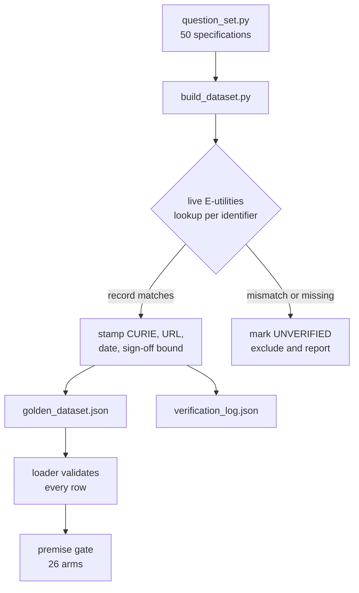

# How the golden dataset was built

The complete method behind `eval/golden/golden_dataset.json`, the 50-query evaluation set built in build phase 5.1 on 2026-08-30. It records every decision, every step, and the things that went wrong on the way, so the next person to change the set can see what the choices were rather than inferring them from the result.

Read this before adding, removing or editing any golden row.

## Table of contents

- [Why this dataset exists](#why-this-dataset-exists)
- [Decision 1: what a row pins](#decision-1-what-a-row-pins)
- [Decision 2: the three search categories](#decision-2-the-three-search-categories)
- [Decision 3: verification runs on an independent path](#decision-3-verification-runs-on-an-independent-path)
- [The schema](#the-schema)
- [Composition of the 50](#composition-of-the-50)
- [The build pipeline, step by step](#the-build-pipeline-step-by-step)
- [What the verifier refuses](#what-the-verifier-refuses)
- [Proving the verifier is not vacuous](#proving-the-verifier-is-not-vacuous)
- [What actually happened when it ran](#what-actually-happened-when-it-ran)
- [The row that is expected to fail](#the-row-that-is-expected-to-fail)
- [How to reproduce or extend the set](#how-to-reproduce-or-extend-the-set)
- [What this method does not establish](#what-this-method-does-not-establish)

## Why this dataset exists

Every build phase before this one measured itself with tests it wrote about code it had just written. That catches broken code. It cannot catch a system that runs perfectly and answers badly.

Two recorded problems are invisible to every offline check in this repository, and both name build phase 5.1 as the place they become measurable:

- The first answer grounds nothing on a single finding in roughly half of live runs. Measured on 2026-08-20 across twelve live runs at two different commits, so it is neither new nor caused by any one change. Cite-or-refuse then correctly refuses. The refusal is right. Needing to refuse that often is a retrieval and synthesis quality problem, and nothing reports it.
- Build phase 4.5's depth-fingerprint check is disabled (xfailed) because live runs return zero or one findings to synthesis, so the two audience depths have nothing to diverge on.

Neither is fixed by this phase. This phase builds the instrument that can see them.

## Decision 1: what a row pins

Settled 2026-08-30 by product-owner decision, recorded in `DECISIONS.md`.

Three options were put forward. The reasons for rejecting two of them are the load-bearing part of this document, because both rejected options look reasonable and one of them is much faster.

| Option | Verdict | Reason |
|---|---|---|
| Constraint assertions, authored independently | Chosen | Pins what must be TRUE, leaves how it is said to the rubric. Non-circular and stable across rewording |
| Full reference answers in prose | Rejected | Not on rigour, on maintainability. Pinning prose for model-generated output breaks the fixture every time the agent rewords a CORRECT answer, and a fixture that fails on correct behaviour creates standing pressure to weaken it |
| Curate from the agent's own runs | Rejected | Circular. Anything currently wrong that the reviewer does not personally catch becomes the certified correct answer, permanently, behind a green gate |

The third option is the dangerous one because it is by far the cheapest. Run the agent over 50 questions, read the outputs, fix what looks wrong, freeze the result. It produces a complete dataset in an afternoon and a gate that is green on day one. It also guarantees that every defect the reviewer did not personally spot is now the specification.

The split this buys, and the sentence worth carrying: the dataset pins what must be true, the 8-point rubric grades how well it was said. Neither does the other's job.

That decision is enforced structurally rather than by convention. `authored_from` is a required field with a closed vocabulary, and the value `agent_output` is refused by the loader with the word "circular" in the error message. A convention that expected answers are authored independently is exactly the kind of thing that erodes under deadline, and the erosion is invisible, since a row curated from agent output looks identical to a row read from NCBI.

## Decision 2: the three search categories

Added 2026-08-30 on product-owner direction, part way through the build. Every row carries a `search_category`, which is orthogonal to both wedge type and query class.

| Category | What it is | Example | The failure mode | So the metric is |
|---|---|---|---|---|
| kiss | Known item search. One question, one exact answer | "What diseases does BRCA1 cause?" | Being wrong | Precision |
| kisses | The plural. One question, all the known results | "Give me every paper on cancer" | Being incomplete, and worse, incomplete without saying so | Recall, plus honest disclosure of truncation |
| discovery | A discussion. An open question, then another, each turn depending on the last | "Tell me about the tree of life", then where bacteria sit, then a specific organism | Losing the thread | Coherence across turns |

Why this matters rather than being a filing convenience: grading all three against one criterion flatters the wrong thing. A KISS row scored on recall rewards padding the answer. A KISSES row scored on precision rewards answering with one row and stopping. The categories exist so each question is scored against the thing that would actually make it a good answer.

Two consequences are enforced in the schema rather than left to judgment:

- A discovery row must carry `follow_ups`. One turn cannot demonstrate holding a thread across turns, so a discovery row with no second turn is refused at load. This stops "discovery" becoming a label applied to an ordinary single question that happened to feel exploratory.
- A KISSES row must forbid `undisclosed_truncation`. An exhaustive question answered with a silent subset is a confident wrong answer, not a partial one. F-2.2-06 is the recorded instance in this project: a truncated answer disclosed the cut but not its scale.

The constraint is applied in the builder rather than hand-written on twenty rows, because twenty hand-written copies of one rule is twenty chances for one to be missing and nobody to notice. The loader then enforces it independently, so the rule still holds if the builder is bypassed.

The reference discovery thread is G-038, named by the product owner as the shape the category is for:

```text
Turn 1: Tell me about the tree of life.
Turn 2: Where do bacteria sit in it, and how is that decided?
Turn 3: Show me how Salmonella enterica is classified within that.
Turn 4: How does the NCBI taxonomy relate to the MeSH terms for the same organisms?
```

No single turn there has an exact answer. What is being graded is whether turn four still knows what turn one established.

## Decision 3: verification runs on an independent path

The builder speaks to NCBI E-utilities directly over `urllib`, with its own rate limiter and its own timeout. It deliberately does not use this project's `tools/ncbi_efetch.py` or the agent's `resolve_symbol_to_curie`.

Reusing the agent's own tool layer is the obvious implementation and it is wrong, subtly. If the agent's resolver carries a defect, a dataset verified through that same resolver inherits the identical defect and then certifies it as correct. That is the circularity rejected in Decision 1, arriving through the back door: not "the expected answer came from the agent's output" but "the expected answer came from the agent's own machinery", which fails for the same reason.

The duplication is the point. An independent path is what makes the verification independent.

## The schema

One row of `golden_dataset.json`:

| Field | What it holds |
|---|---|
| `id` | `G-001` through `G-050` |
| `question` | The question text, exactly as a person would type it |
| `search_category` | `kiss`, `kisses` or `discovery` |
| `follow_ups` | Turns 2 to n. Required for discovery, forbidden otherwise |
| `wedge_type` | `gene-variant-literature`, `pathogen-sequence-outbreak` or `paper-data-tool` |
| `query_class` | One of the five in `QueryClass`, imported from the enum rather than re-typed |
| `personas` | Which of the 11 personas this serves |
| `expected_outcome` | `answer`, `refuse`, `ask` or `flag` |
| `acceptable_outcomes` | Where more than one behaviour is correct. Defaults to exactly `expected_outcome` |
| `must_resolve` | CURIEs the answer must have resolved |
| `must_cite` | Source records or databases the answer must cite |
| `forbidden` | Behaviours that make the answer wrong regardless of its content |
| `hard_fails_applicable` | Which of the three hard-fails apply to this question |
| `provenance` | Where the constraint came from, when, who signed it, and what that sign-off does not cover |
| `notes` | Why this row exists and what it is really testing |

Two schema choices are worth explaining because both were forced by content rather than chosen up front.

`acceptable_outcomes` exists because some questions have more than one correct behaviour. A bare number typed as a question ("334") is equally well handled by asking what it refers to or by refusing it. Pinning one of the two would fail correct behaviour, which is the same trap that ruled out pinning reference prose.

`must_cite` accepts a database prefix as well as an exact record URL. A question like "find literature on BRCA1" has many correct answers, so pinning one PMID would fail a correct response. Pinning "it must cite something on PubMed" is the constraint that is actually true.

## Composition of the 50

| Group | Rows | What it is |
|---|---|---|
| A | 7 | The v1 must-pass moat set: Q1, Q3, Q4, Q5, Q6, Q8, Q10 from the locked playbook |
| B | 8 | Regression rows curated from real recorded failures |
| C | 25 | Expansion, aimed at graph predicates the moat set never touches |
| D | 10 | Refusal and boundary rows, where the correct answer is not to answer |

By search category: 24 KISS, 20 KISSES, 6 discovery carrying 18 follow-up turns.

By outcome: 37 answer, 11 refuse, 1 ask, 1 flag.

By query class: 16 lookup, 15 single_hop, 13 multi_hop, 5 exploratory, 1 aggregate.

Group B closes the open item "Curate LEARNINGS.md into the golden eval dataset", and it is a curation rather than an import, exactly as that item required. Most LEARNINGS rows describe internal plumbing and make no sense as a user question. Only the ones that are genuinely "a real person could ask this and get a confidently wrong answer" are included:

- G-008 and G-009: the bare-number and common-word weak matches from build phase 3.3, which returned confident, wholly generic citations.
- G-011: the two-gene case from build phase 3.4, where one gene's answer silently dropped.
- G-012: the ClinicalTrials.gov Essie `NOT` risk from build phase 3.5, where a real clinical term containing "not" returns the exact inverse of what was asked.
- G-013: lowercase gene mentions, F-3.1-42.
- G-014: the discontinued gene record answered as its successor, F-4.7-A-02.
- G-015: the injected parenthetical that steers entity resolution, F-4.7-A-01.
- G-010: the third-person clinical framing from build phase 3.0.

Group C exists because the moat set is engineered narrow. Its first-pass predicate coverage is 3 of 14, and a dataset that only ever exercises three predicates cannot report anything about the other eleven. These rows aim directly at the untouched ones: `orthologous_to`, `actively_involved_in`, `located_in`, `has_mesh_annotation`, `in_taxon`, `participates_in`, `has_phenotype`, `subclass_of`, `close_match`, `exact_match`.

Group D exists because abstain-as-pass is an explicit rubric outcome and an untested refusal path is a fabrication waiting to happen.

## The build pipeline, step by step



The eleven steps as actually executed:

1. Read the locked playbook's moat set, coverage metric, 8-point rubric and hard-fails, and technical specification Section 23.
2. Establish the branch-point baseline and confirm all three transports were reachable, so live verification was genuinely available rather than assumed.
3. Settle Decision 1 with the product owner before writing any code, and log it.
4. Write the premise gate first, at cadence stage 5, and watch it fail. It failed on a collection error, since no `eval` package existed yet.
5. Build the seven harness modules until the gate went green except for the arm that needs the dataset.
6. Read the CURIE vocabulary and query-class enum out of `graph_schema_constants.py` and `cypher_schemas.py`, so the dataset speaks the system's own language instead of a second hand-maintained copy of it.
7. Write the 50 specifications in `question_set.py`, with the identifiers to verify rather than the answers.
8. Write `build_dataset.py`, the independent verifier.
9. Run it against live NCBI. Fix what it rejected. Repeat until every row verified or was honestly excluded.
10. Prove the verifier can reject, by feeding it known-bad identifiers.
11. Apply the three-category taxonomy, add the schema rules it implies, and rebuild.

## What the verifier refuses

A row failing any of these is recorded UNVERIFIED, excluded from the shipped dataset, and reported. It is never guessed at and never softened, which is this phase's declared blocked-stop.

- A gene id whose returned `name` does not equal the expected symbol. This catches a mistyped identifier, the single most likely authoring error.
- A gene record carrying a discontinued status. Build phase 4.7's F-4.7-A-02 shipped a confidently cited answer about a substituted gene, and a withdrawn record must never become a golden constraint.
- A taxon whose returned scientific name does not equal the expected one.
- Any record the service does not return at all.
- A row expecting an `answer` outcome that ends up pinning nothing it must cite, since such a row would pass against any fluent output.

The discontinued-status check carries a trap worth repeating, because it was recorded once and is easy to lose. The field types are inconsistent: a live record returns `status` as the empty string, a withdrawn one returns the integer 1. The comparison is normalised through `str()` rather than trusting the type.

## Proving the verifier is not vacuous

The first full run verified 50 of 50 on the first attempt. That is exactly the result to distrust, because a verifier that never rejects anything is indistinguishable from one that checks nothing. This repository has filed vacuous checks in five separate phases, so the run was not accepted as evidence until the verifier was shown to discriminate.

Six probes, four expected to fail and two controls:

| Probe | Result |
|---|---|
| Gene id 673 declared as BRCA1 | Rejected: "gene 673 is 'BRAF', the spec expected 'BRCA1'" |
| Gene id 672 declared as BRCA1 | Accepted, the control |
| Gene id 999999999 | Rejected: no record returned |
| Gene id 60500 declared as BRCA3 | Rejected: "carries status='1', currentid=675" |
| Taxon 9606 declared as Mus musculus | Rejected: "taxon 9606 is 'Homo sapiens'" |
| Taxon 9606 declared as Homo sapiens | Accepted, the control |

The fourth probe is the most valuable line in this document. It independently re-confirmed build phase 4.7's F-4.7-A-02 against today's live NCBI: BRCA3 really does resolve to a discontinued record whose successor is BRCA2. A finding recorded months earlier was re-measured rather than trusted, and it held.

With four rejections against two accepted controls, 50 of 50 means the identifiers were right, not that the check was hollow.

## What actually happened when it ran

Recorded rather than smoothed over, because the disagreements are the instructive part.

Final run, 2026-08-30: 50 specifications, 50 verified, 0 excluded, 43 live calls, 6.4 seconds, throttled to 8 requests per second against a 10 per second ceiling.

Three things went wrong and were fixed:

The verdict check laundered a verdict using the verdict's own word. The safety hard-fail admitted any sentence containing the bare verb "reported" as attribution to a source. The premise gate's own test sentence is "This variant is pathogenic and should be reported as such", which attributes to nobody and contains "reported". The check would not have fired on the exact sentence it exists to catch. The admit-list and the deny-list overlapped on the same token, which reading either list alone would never reveal. Attribution was narrowed to mean naming a source: a citation marker, "according to", or a named database. Filed as F-5.1-01.

A tripwire would have named the wrong function. Both tripwires in the arm that proves grading never re-runs the agent loop closed over a loop variable instead of binding it, so either one firing would have reported the last name rather than the one that fired. The arm's verdict was unaffected and its diagnostic was wrong. Caught by `ruff` B023, not by reading. Filed as F-5.1-02.

The premise gate was wrong about the dataset, and the dataset was right. Arm P8 asserted that every row's `authored_from` is `live_source`. When the real dataset existed, 17 rows were `locked_requirements`: refusal and boundary rows such as "What is the weather in San Francisco?" have no NCBI identifier to verify, and their authority is Section 10.5 of the locked specification. That figure is 16 in the shipped set today, because the later category pass gave G-038 two live taxon lookups it did not have at the moment P8 first went red. The count is stated as it was rather than back-dated, so a reader comparing it against the current file sees a change that happened rather than an error.

That last one is the case `goal-contracts` warns about, where a red gate is a question rather than an instruction. Both the check and the subject were right about different things. The resolution was to fix the check and to make it stronger rather than weaker, since weakening it to "authored_from is in the allowed set" would have removed its teeth entirely. P8 now asserts three things: no row is ever `agent_output`; any row that pins a CURIE must be `live_source` and must name a live lookup in its provenance, because asserting a fact about a specific NCBI record is only worth something if a live record was actually read; and at least 30 rows must be live-verified, so the arm cannot pass against a dataset that quietly stopped verifying and relabelled everything.

The strengthened arm was then proven red under mutation: a row that pins a CURIE while claiming locked-document provenance fails it.

## The row that is expected to fail

G-050 asks "Welche Krankheiten sind mit dem Gen BRCA1 assoziiert?" and pins `expected_outcome: answer`.

The open flag ADV-02-residual records that a non-English question written in pure ASCII is currently refused as off-topic by the pre-filter. So this row is expected to come out red against today's system.

It is pinned to the correct behaviour anyway, deliberately. A golden set that encodes today's behaviour so the gate stays green is the circular dataset rejected in Decision 1, just applied to a known gap instead of an unknown one. The instrument's job is to report the gap, not to be comfortable.

## How to reproduce or extend the set

```bash
# Rebuild from the specifications, re-verifying every identifier live
python3 eval/golden/build_dataset.py

# Verify a subset while iterating
python3 eval/golden/build_dataset.py --limit 10

# Validate the result and run the 26 premise arms
python -m pytest tests/system_03_search_agent/eval/ -q
```

To add a question:

1. Add a specification to `QUESTION_SPECS` in `eval/golden/question_set.py`, naming the identifiers to verify rather than the answer.
2. Choose its `search_category` honestly. If it has one exact answer it is a KISS, if it asks for everything of a kind it is a KISSES, and if it only makes sense as a conversation it is a discovery row and needs `follow_ups`.
3. Write the `notes` field explaining what the row is really testing. A row nobody can explain is a row nobody will maintain.
4. Rebuild. If the row is rejected, fix the specification. Never soften the verifier.
5. Run the premise gate.

Never edit `golden_dataset.json` by hand. It is generated, and a hand-edited row carries a provenance stamp claiming a live lookup that did not happen, which is the one lie this whole method is built to prevent.

## What this method does not establish

Stated here rather than discovered later, because a verify surface that cannot say what it misses reads as "this class is covered" when it may only mean "the cases someone thought of are covered".

- Live verification confirms that an identifier exists and is what the specification says it is. It does not confirm that the question's expected answer is clinically or biologically correct. That rests on the product owner's sign-off, and the bound on that sign-off is recorded in every row: signed by the product owner, not by an external clinical or human-variation reviewer.
- No test checks that a row is in the right category. The premise gate proves the three categories are structurally distinguishable and that the schema enforces what each requires. Whether G-011 is really a KISS and not a KISSES is an editorial judgment carried in that row's notes.
- Nothing here runs a discovery thread. The follow-up turns are stored and their presence is enforced, but no arm drives them through the agent, so cross-turn coherence is specified rather than measured.
- The dataset is not a breadth instrument. The moat set is engineered narrow, with first-pass concept coverage around 5 of 10 and predicate coverage around 3 of 14. A green gate says the agent answers these questions correctly and says nothing about the rest of the graph.
- Compute-tool questions are out of scope by the PRD's v1 boundary: no BLAST, no sequence-similarity search, no VCF ingestion. Q2, Q7 and Q9 are the fast-follow set and are not among the 50.
- ACMG classification is out of scope. The system assembles evidence and renders no verdict, so a rendered verdict is a hard-fail rather than a low score.

Last updated: 2026-08-30.
