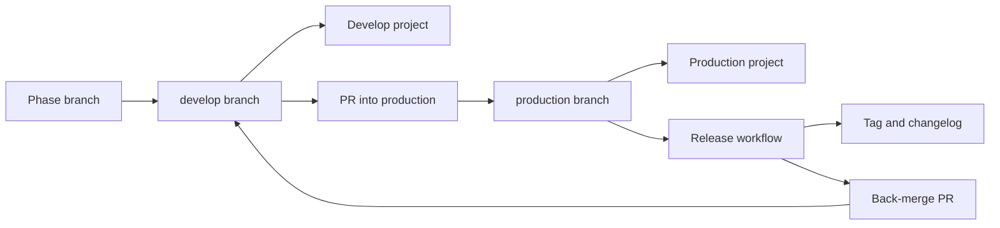

# Release flow

This document is the source of truth for how a change reaches production. It names the two Railway projects, how to tell them apart, the exact steps that promote a change from develop to production, what the release automation does for you, how to roll back, and what this flow does not protect against. Written for build phase 4.15, which split one Railway deployment into two projects with a branch flow, and updated the same phase when the branch flow moved from `main` to `production` and release automation shipped.

## Table of contents

- [The two deployments](#the-two-deployments)
- [Why two projects, not two environments in one project](#why-two-projects-not-two-environments-in-one-project)
- [Telling which deployment you are looking at](#telling-which-deployment-you-are-looking-at)
- [The release procedure](#the-release-procedure)
- [What the automation produces](#what-the-automation-produces)
- [Rolling back](#rolling-back)
- [What this flow does not protect against](#what-this-flow-does-not-protect-against)
- [Branch to deployment flow](#branch-to-deployment-flow)

## The two deployments

Each deployment lives in its own Railway project. Each project has its own Postgres, its own Redis, its own `AUTH_SECRET`, its own `APP_ENV` and its own `CORS_ORIGINS`, a product-owner decision recorded in `DECISIONS.md` on 2026-08-27, so a develop credential never reaches production and test traffic never spends production's daily caps.

| Deployment | Railway project | Watches branch | API URL | Web URL |
|---|---|---|---|---|
| develop | `system3-search-agent-develop` | `develop` | https://search-agent-api-develop-43b3.up.railway.app | https://search-agent-web-develop-2aeb.up.railway.app |
| production | `system3-search-agent` | `production` | https://search-agent-api-production.up.railway.app | https://search-agent-web-production.up.railway.app |

`develop` remains the repository's default branch. `production` is a separate branch that exists only to drive the production deployment.

Phase branches, the ones named `phase/N.M-description` in `.claude/rules/git-workflow.md`, never auto-deploy to either project. Only `develop` and `production` are watched. A phase branch reaches a deployment only after it merges into `develop`.

## Why two projects, not two environments in one project

The first design put both deployments as two environments inside one Railway project, matching Section 24's wording that names Railway's environment feature. That design was reversed the same day, by measurement rather than by argument (finding F-4.15-03, `tracker/phase_4.15.md`): a Railway service's git source, its repository plus its branch, is set at the service level, not the environment level. Two environments in one project cannot watch two different branches for the same service.

This was measured, not assumed. Pointing the `search-agent-api` service at a new branch for production only moved the branch for both environments at once, while the untouched `search-agent-web` service still read its own branch in both. Three independent write paths agreed on this, including Railway's own support agent. Because a shared branch setting defeats the entire point of a develop-versus-production split, the deployments were rebuilt as two separate Railway projects instead, one watching `develop` and one watching `production`.

## Telling which deployment you are looking at

`GET /health` returns an `app_env` field, read from the `APP_ENV` environment variable at `src/system_03_search_agent/adapters/web_sse/app.py` line 354. Since the two projects carry different `APP_ENV` values, anyone holding a URL can call its `/health` endpoint and read `app_env` to confirm which deployment answered, rather than guessing from the hostname alone.

The two projects are isolated end to end, not just by URL. An account created on develop cannot sign in on production, and a bearer token minted on one is rejected by the other, because each project has its own user database and its own `AUTH_SECRET`.

## The release procedure

1. Work phase branches and merge them into `develop` through the normal branch and pull request flow in `.claude/rules/git-workflow.md`. Every merge to `develop` triggers the develop project to redeploy from `develop`, publishing to the develop URLs above.
2. When `develop` is ready to release, cut a release branch from it: `git checkout develop && git pull && git checkout -b release/<version>`, then push it. The release branch is not optional and not a formality: it is the thing that freezes what goes out, so `develop` can keep taking merges while the release is being checked, and it is what the product owner asked for in those words on 2026-08-27.
3. Open a pull request from `release/<version>` into `production`.
4. CI runs on that pull request automatically. `.github/workflows/ci.yml`'s `pull_request` trigger carries no branch filter, so a pull request into `production` already runs all ten of Section 24's gates with no separate configuration needed. Wait for the gates to report before merging.
5. Merge the pull request into `production`. CI is advisory, not merge-blocking, so the merge button stays available next to a red check regardless of gate status. Confirm the gates are actually green before merging rather than relying on a blocked merge to stop you.
6. The push to `production` triggers two things at once: the production project redeploys, publishing to the production URLs above, and `.github/workflows/release.yml` fires and cuts a release. See the next section for what that produces.
7. Confirm the deployment by calling `GET https://search-agent-api-production.up.railway.app/health` and checking that `app_env` reads `production`.
8. Review and merge the automated back-merge pull request the release workflow opens against `develop`, described below.

Everything in this list up to and including the merge in step 5 is a human action. Steps 6 onward, the deploy and the release automation, run without further action once the merge lands, except reviewing the back-merge pull request in step 8.

## What the automation produces

`.github/workflows/release.yml` fires on every push to `production` and runs four scripts in `.github/release/`, in order:

- `derive_version.sh`: computes the next semantic version from the Conventional Commit subjects since the previous release tag. A `!` before the colon or a `BREAKING CHANGE` footer bumps major, a `feat` commit bumps minor, anything else bumps patch. If there are no commits since the previous tag, the workflow stops here and releases nothing.
- `write_changelog.sh`: prepends a new dated section to `CHANGELOG.md`, grouped by commit type (breaking changes, features, fixes, security, maintenance).
- `tag_and_release.sh`: commits the changelog with a `[skip ci]` marker so the commit does not trigger another CI or release run, creates an annotated tag `vN.N.N`, pushes it, and publishes a GitHub Release with the changelog section as its notes.
- `open_backmerge_pr.sh`: opens a pull request from `production` back into `develop`, carrying the changelog commit and the tag forward so the two branches do not drift apart.

The back-merge lands as a pull request, never a direct push, because a back-merge can conflict, and an automatic conflicting push to the default branch is worse than a pull request a human reviews. If `develop` already contains everything on `production`, the script opens no pull request, since there would be nothing to carry back.

No release has been cut yet as of this writing. The first push to `production` produces `v0.1.0`.

## Rolling back

Railway's rollback is a manual action taken in the Railway console: open the affected service's deploy history and redeploy a previous build from it. There is no API surface for this exercised by this repository, so do it directly in the dashboard, not from the command line or from a script.

The API and web services are separate Railway services, so rolling one back does not roll back the other. Roll back each one that needs it. Rolling back a deploy does not revert `production` in git, and it does not undo a tag, a changelog entry, or a GitHub Release the automation already published. The next merge to `production` redeploys forward again unless `production` itself is fixed first.

## What this flow does not protect against

Said plainly rather than implied:

- CI is advisory, not merge-blocking. This is finding F-4.14-A-04, unchanged by build phase 4.15. Branch protection needs GitHub Pro or a public repository. A red check on a release pull request sits beside a working merge button. Nothing stops a merge with failing gates except a human choosing not to click it.
- Nothing stops a direct push to `production`. There is no branch protection rule blocking it, so a push straight to `production`, bypassing the release pull request entirely, still triggers a production deploy and still fires the release automation.
- The two deployments share one read-only HTTPS graph query service by design. Layer 1 access is read-only at the connection level, so there is no develop-versus-production hazard on the graph the way there is on Postgres, Redis, `AUTH_SECRET` or `CORS_ORIGINS`, and this phase does not attempt to separate it.
- The back-merge pull request can conflict. When it does, the release workflow still opens it, and it needs a human to resolve the conflict on that branch. Nobody force-pushes `develop` to make it apply.
- Rollback is not exercised by any automated check in this repository. It is a console action, tested by hand, not by CI.

## Branch to deployment flow

