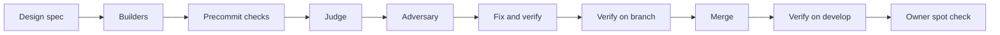

# The verify loop: the team checks the product before the owner does

A proposal, not yet approved. It answers card 42 of `testing/UI_fix_plan.md`, the product owner's request of 2026-09-26:

> the bossman mode team should be able to write the code, verify the code, judge, averserial, then have a /design for what I want and in the end /verify the QA work. This whole end to end is what we need to build.

The one thing it has to make true: when a change reaches the owner, the team has already done three things.

- Driven the running app.
- Compared it with what the owner wants.
- Fixed what failed.

The owner's retest then confirms rather than discovers.

## Table of contents

- [Why the owner is the QA step today](#why-the-owner-is-the-qa-step-today)
- [What the verification-loops talk offers](#what-the-verification-loops-talk-offers)
- [The proposal](#the-proposal)
- [Where bossman mode calls it](#where-bossman-mode-calls-it)
- [What it costs](#what-it-costs)
- [What it will not catch](#what-it-will-not-catch)
- [Decisions for the owner](#decisions-for-the-owner)

## Why the owner is the QA step today

- Nothing says what a screen should look like before it is built, so nothing can check it afterwards.
  - The builder reads the design system.
  - The product reviewer compares screenshots with the prototype after the merge.
  - The first person who judges the result against what the owner wanted is the owner.
- The product reviewer is a pre-screen by design (`.claude/skills/bossman-mode/reference/Product_review.md`). It never closes an item, and it runs only after the merge, so what it finds is already on develop.
- `/verify` was this repository's pre-commit skill when this was written: compile, tests, lint, git status. A project skill takes precedence over a bundled one of the same name, so it shadowed Claude Code's own `/verify`. That is the skill that builds, runs and observes an app. The loop the talk describes had never run here. On 2026-09-26 the pre-commit skill was renamed `/precommit`, and `/verify` became the skill this proposal describes.
- The tools exist but are never chained into a check that must pass before the owner sees a change:
  - Playwright with 25 end-to-end specs, including `accessibility.spec.ts` and `design-system-audit.spec.ts`
  - CI's accessibility gate, `gate10`
  - the assembled prototype, `docs/build/design/design-system/prototype/app.html`
- The result: `testing/UI_fixes_done.md` holds 271 rows, most of them found by the owner by hand.

## What the verification-loops talk offers

Sources: the talk "Building verification loops in Claude Code" (https://www.youtube.com/watch?v=mQZB0l-rhxE) and its blog post (https://claude.com/blog/building-verification-loops-in-claude-code-with-skills), with the skills documentation (https://code.claude.com/docs/en/skills.md).

- A verification loop is "a repeating cycle where an AI agent checks its own work, running tests, linters, or custom checks, and fixes what fails before moving on". Packaged as a skill, every session runs the same checks instead of relying on someone to remember them.
- Four placements:
  - Standalone: invoked by hand.
  - Embedded: runs at the end of the skill that produced the work.
  - Chained: one skill hands to the next, for example code review, then simplify, then verify.
  - Every pull request.
- The bundled `/verify` builds and runs the app and observes it. For a web app that means screenshots, reading the page, clicking and filling forms. `/run-skill-generator` records a project's own recipe into `.claude/skills/verify/SKILL.md`, and from then on `/verify` follows it.
- The post mentions a `/design` skill that checks work against the guidelines in a DESIGN.md file.
- The rule that makes a loop close on its own: "Give Claude something that produces a pass or fail."
- What the talk does not cover: how to check a screen against a design, visual comparison, or accessibility. That part is ours, and this repository already has the instruments for it.

## The proposal

### 1. Free the name

- Rename the pre-commit skill from `verify` to `precommit`, and update every reference: `CLAUDE.md`, `AGENTS.md`, `ship` and `bossman-mode`.
- `/verify` then means one thing, "run the product and prove the change works", as the talk and the bundled skill mean it.

### 2. `/design`: what the owner wants, written so a script can check it

- It runs before any change that touches a screen, and writes the target down as a short spec in the card or the phase ledger.
- Every line of the spec can pass or fail:
  - which screen, reached how;
  - at 1280 and at 390 pixels wide, what must be where, and which design token it uses;
  - the exact text, where text matters;
  - no horizontal overflow, no console error, no accessibility violation.
- It builds only from the design system and the nearest designed neighbour (`.claude/rules/design-consistency.md`). A surface with no design is named, and the owner is asked once.
- The owner approves a spec once. After that the team works to it, and no fix needs a fresh instruction.

### 3. `/verify`: run the product and prove the change

- Recorded with `/run-skill-generator` so it knows how this app starts, then extended with this repository's checks.
- It runs against two targets:
  - on a branch, the local stack, before the merge;
  - after the merge, deployed develop, confirmed through `/health` before anything is captured.
- For every changed screen:
  - Playwright at 1280 and at 390, with screenshots;
  - the overflow measurement, console errors and an accessibility scan;
  - every line of the `/design` spec, each marked pass or fail with its screenshot.
- For a change to answers, the golden consistency run and the five-line rubric, both as today.
- The loop: a failed line goes back to the builder, is fixed and is verified again. At most two rounds, then it stops and names what is still failing (`.claude/rules/self-eval-loop.md`).
- The report is one line per check, pass or fail, with the file that proves it. A script captures and the model judges, so no judgement is written without a file behind it (the 2026-09-01 lesson).

## Where bossman mode calls it

- The design step comes first, so the builders, the judge and the verifier all work to the same written target.
- `/verify` runs twice: on the branch, where a failure costs nothing to fix, and on deployed develop, where the golden run already lives.
- The product reviewer becomes the agent that runs `/verify` on develop. Its pass becomes a gate rather than a pre-screen.
- For a wording or layout card, a `/verify` pass starts the seven-day close the owner approved on 2026-09-25. A change to answers still waits for the owner's verdict, and a drop in the golden count is still only the owner's to accept.

## What it costs

These are estimates to be measured on the first two runs, not measurements.

- Time: a few minutes per changed screen on each target. The golden run stays at about 40 minutes and runs only for answer changes.
- Money: a few live questions per run, cents. The golden run stays at about $1.35.
- Dispatches: none new in a phase. The product reviewer's dispatch already exists; the branch-side run is the fix-and-verify round's verifier running one more skill.

## What it will not catch

- Taste where no design exists. It names the missing design instead of inventing one.
- Whether an answer is good beyond the rubric's five lines. The golden run and the rubric stay the measure there.
- Anything on a screen the spec does not name. The spec's coverage is stated in the spec, so a gap is visible, not silent (`.claude/rules/goal-contracts.md`).

## Decisions for the owner

1. May a `/verify` pass close a wording or layout card on the seven-day clock, with your retest as a spot check rather than the gate? Recommendation: yes. Changes to answers still wait for you.
2. The build order. Recommendation:
   - rename the pre-commit skill and record `/verify` first, because it is useful alone;
   - then `/design`;
   - then wire both into bossman mode.
   Each lands on its own branch and pull request, since each touches `.claude/`.
