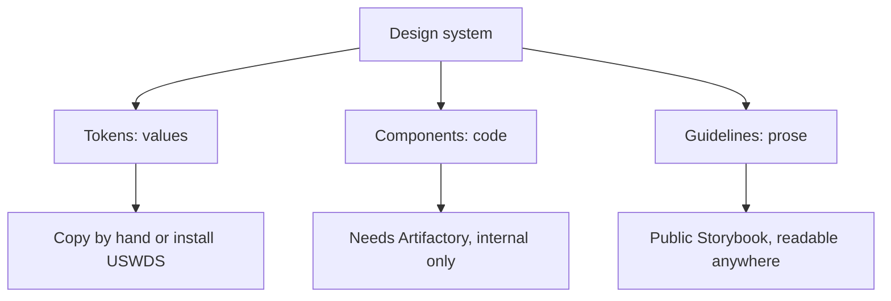
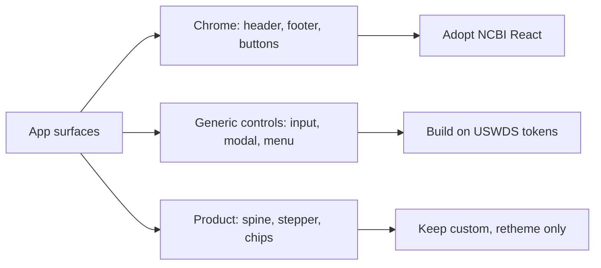
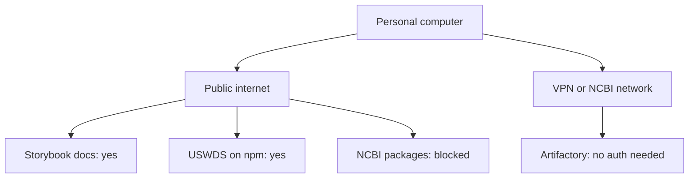

# NCBI design system migration assessment

An assessment, not a build plan. It answers four questions: what design system this app has today, what the NCBI design system actually is, which parts of one can become the other, and whether any of that work can be done on a personal computer away from the NCBI network. Every claim below was verified by reading a file or making a request on 2026-09-08, and the evidence is recorded in the appendix. Stage 0 of the staged plan, the drift fixes that need no new dependency and no change to `frontend/src/theme.ts`, was implemented on 2026-09-12; see "Stage 0 status" below. Every other stage remains unimplemented.

## Table of contents

- [The short answer](#the-short-answer)
- [First principles: a design system is three separable things](#first-principles-a-design-system-is-three-separable-things)
- [Question 1: what this app uses today](#question-1-what-this-app-uses-today)
- [Question 2: what the NCBI design system is](#question-2-what-the-ncbi-design-system-is)
- [Question 3: what can migrate, and what cannot](#question-3-what-can-migrate-and-what-cannot)
- [Question 4: can this be done off the NCBI network](#question-4-can-this-be-done-off-the-ncbi-network)
- [What follows from all this](#what-follows-from-all-this)
- [Blockers to settle before writing code](#blockers-to-settle-before-writing-code)
- [Verify it yourself from your own machine](#verify-it-yourself-from-your-own-machine)
- [What could not be established](#what-could-not-be-established)
- [Evidence appendix](#evidence-appendix)

## The short answer

Four answers, one per question asked:

- Current design system: a hand-built system of 24 colour tokens, a 6 step type scale on Public Sans, and an 8 step spacing scale, encoded in `frontend/src/theme.ts` and documented as 21 HTML cards under `docs/build/design/design-system/`. Its own foundations file states that every value is USWDS.
- NCBI design system: two internal packages, `@ncbi-design-system/base` at 5.12.0 and `@ncbi-design-system/react` at 5.12.0-b0, both built on USWDS, documented in a public Storybook carrying 275 stories.
- What can migrate: the page chrome and identity, which is roughly 18 of the 25 NCBI React components. The product surfaces that make this an agentic search tool have no NCBI equivalent at all.
- Off the NCBI network: you can read everything and build most of it. You cannot install the NCBI packages. The reason is that the documentation is public and the code is not.

That last split is the single most useful fact in this document, so it is worth stating plainly. Reading the design system and consuming the design system are different questions with different answers, and conflating them produces either false optimism or false despair about what is possible from home.

## First principles: a design system is three separable things

The phrase "migrate to the NCBI design system" sounds like one task. It is three, and they have different costs, different blockers, and different answers to the personal computer question. Separating them is what makes the rest of this document tractable.

The three layers:

- Tokens: the raw values. Colours, type sizes, spacing steps, radii. These are data, not code. A hex value copied by hand is identical to a hex value installed from a package.
- Components: the code that renders a button, a header, a table. This is an implementation, and using it means installing a package or copying source.
- Guidelines: the prose that says when to use which component and why. This is documentation, and reading it requires only a browser.

Why the split matters here, stated as a rule: a layer can only be adopted through a channel that carries it. Tokens travel as values, so any channel carries them, including a screenshot. Guidelines travel as documents, so a public web page carries them. Components travel as packages, so they need a registry you can reach.



The consequence, which drives the recommendation later: the layer that is hardest to obtain from home is components, and components are also the layer this app needs least, because most of what it renders has no NCBI equivalent to install.

## Question 1: what this app uses today

Source of truth, in the order the repository's own `design-consistency` rule gives: the HTML cards under `docs/build/design/design-system/`, then `frontend/src/theme.ts`, then a shipped component that already matches.

### The token layer

| Layer | What exists | Values |
|---|---|---|
| Colour | 24 tokens | Grounds `#f0f0f0` and `#fff`, ink `#1b1b1b` and `#565c65`, navy `#112f4e`, blue `#205493`, three layer colours with washes, risk `#981b1e`, warn `#7a5900`, ok `#276e34` |
| Type family | 2 stacks | Public Sans with system fallbacks, and a `ui-monospace` stack |
| Type scale | 6 steps | `clamp(32px,4.8vw,52px)`/800, `clamp(24px,3.1vw,33px)`/800, 16px/400, 13.5px/400, 11px/700 uppercase, 14px mono |
| Spacing | 8 steps | 4, 8, 12, 16, 24, 32, 48, 76, all px |
| Radius | 3 values | 8px surfaces, 4px controls, 999px pills |
| Shadow | 1 value | Modal only, by deliberate decision |

The load-bearing sentence sits in `foundations/colors.html`: "Every value is USWDS, the system NCBI is built on. Nothing invented." The type card says the same of the face: "Public Sans, the USWDS face." So the token layer is not a bespoke system that must be abandoned. It is an unmanaged copy of the system NCBI already uses, which changes the character of the migration entirely.

### The code layer

`frontend/src/theme.ts` is 211 lines. It exports `designTokens`, a flat object holding every colour, and merges it onto a MUI theme so that, per the file's own comment, "a component reaches every colour through one object". Five MUI components are overridden: Paper, AppBar, Button, Chip, Tooltip.

The component inventory is more surprising than the dependency list suggests. Across 19 shipped files, 15 import something from MUI, but almost every import is `Box` or `Typography` styled with `sx`. The only MUI components actually rendered as themselves are Button, TextField, Stack, AppBar, Toolbar, and IconButton. Dialog, Menu, Chip, Card, Tabs, Stepper, Avatar, Alert, Checkbox and Select were all hand built from styled `Box` elements instead.

That matters for a reason worth stating directly: the app is far less coupled to MUI than `package.json` implies. Replacing MUI is mostly a question of replacing six components, not thirty.

### Known drift, already present

Five places where `theme.ts` and the foundations cards disagree. These are defects today, independent of any migration:

| Property | Foundations card | theme.ts |
|---|---|---|
| h1 letter-spacing | -2.8% | -0.034em, which is -3.4% |
| h1 size | 38px fixed | clamp(32px, 4.8vw, 52px) |
| h2 size | 26px fixed | clamp(24px, 3.1vw, 33px) |
| body1 line-height | 1.6 | 1.65 |
| navyDeep `#0B2138` | absent from every foundations file | present in designTokens |

A sixth: `12.5px` is used twice in `theme.ts`, for caption and tooltip, and appears nowhere in `type.html`.

### Stage 0 status, resolved and open, 2026-09-12

Stage 0 from the staged plan below was implemented on 2026-09-12, editing only the foundations cards under `docs/build/design/design-system/foundations/`. `frontend/src/theme.ts` was not touched, by scope: any change to it needs the product owner's explicit approval under the repository's `design-consistency` rule, and a separate agent was editing the frontend at the same time.

Resolved by adding a card entry, since the code's value was correct and only the documentation was missing:

- `navyDeep` (`#0B2138`): added to `foundations/colors.html` as its own swatch. It carries no shipped use today, so the card says so rather than inventing one.
- `12.5px` caption size: added to `foundations/type.html` as its own row, matching `theme.ts`'s caption and tooltip size exactly.
- `canvasDeep` (`#E4E6E8`), `surfaceSunk` (`#F7F8F9`), `lineStrong` (`#A9AEB1`), `inkFaint` (`#666B70`): all four already lived in the card's own CSS token block, used to style the card itself, but had no swatch and no use note. Added swatches for all four, with use notes taken from `frontend/src` (`surfaceSunk` and `lineStrong` are read in `FollowUp.tsx`, `HomeScreen.tsx`, `AnswerScreen.tsx`, `RunScreen.tsx`, `AuthGate.tsx`, `GuestAllowance.tsx` and more; `inkFaint` is read in the same files, with its own accessibility note in `FollowUp.tsx` about which surface keeps it AA-safe).
- The three logo rung tokens, `logoRungOnBlue1` (`#CFE1F5`), `logoRungOnBlue2` (`#9FD3A8`), `logoRungOnBlue3` (`#C3B2E6`), added to `theme.ts` on 2026-09-12 for the logo mark on the blue app bar and footer, had no card entry at all. Added as three swatches.
- Two product-owner decisions from 2026-09-12 that the colour card stated the opposite of: the footer is now the same blue as the app bar (`AppShell.tsx`, "Set 2, R9 and R11"), not navy, and the home page sits on the canvas ground (`HomeScreen.tsx`), not a navy hero. `foundations/colors.html`'s card note and the Navy and Canvas use notes were updated to match what ships.

Settled on 2026-09-25, build phase 8.5 card 34: the product owner ruled that
the shipped `theme.ts` values win, so `foundations/type.html` was edited to
match code rather than the other way round. The four values that used to
disagree:

| Property | Foundations card, before | theme.ts | File and line |
|---|---|---|---|
| h1 letter-spacing | -2.8% | -0.034em (-3.4%) | `docs/build/design/design-system/foundations/type.html:39`, `frontend/src/theme.ts:160` |
| h1 size | 38px fixed | `clamp(32px, 4.8vw, 52px)` | `type.html:39`, `theme.ts:160` |
| h2 size | 26px fixed | `clamp(24px, 3.1vw, 33px)` | `type.html:40`, `theme.ts:161` |
| body1 line-height | 1.6 | 1.65 | `type.html:41`, `theme.ts:164` |

`type.html` now carries theme.ts's h1 and h2 values verbatim, and its body1
sample renders at 1.65 rather than inheriting the card's page-wide 1.6.
`frontend/src/theme.ts` was not touched. This is no longer an open item.

### Coverage, and one asset worth protecting

Six surface groups are designed: screens, app bar, the seven component cards, the three identity cards, two flows, and the foundations. Six are not: sign-in and sign-up, the nav overflow menu, the follow-up field, the history rail, the account menu, and the Integrations, docs and about pages.

The asset: `frontend/e2e/design-system-audit.spec.ts` points axe at every design system card and holds it to WCAG 2.1 AA. It found seven violations on its first run and the design system is at zero now. Any migration must keep that gate green, and it is the cheapest available check that a swap has not regressed accessibility.

## Question 2: what the NCBI design system is

Two distributable packages plus a documentation site, all from the GitLab project `ncbi/pd/www/cms/ncbi-web-design-system`.

| Package | Latest | Published | Built on | Peer dependencies |
|---|---|---|---|---|
| `@ncbi-design-system/base` | 5.12.0 | 2026-07-30 | `@uswds/uswds` 3.12.0 | none |
| `@ncbi-design-system/react` | 5.12.0-b0 | 2026-06-05 | `@uswds/uswds` 3.12.0 | react 19.2.3, react-dom 19.2.3, both exact |

Two facts about the React package deserve emphasis rather than a footnote. It has only three published versions, `5.11.0-a1`, `5.11.0-a2` and `5.12.0-b0`, and every one of them is a prerelease. Also, neither package declares a license string in its `package.json`.

The Storybook at `dev.ncbi.nlm.nih.gov/labs/storybook/` carries 275 stories across 129 distinct titles:

| Group | Count | What it is |
|---|---|---|
| Django Components | 27 | Server rendered components for a Django and Wagtail CMS |
| HTML Components | 26 | The same set as static markup |
| React Components | 25 | The set relevant to this app |
| Test stories | 25 | Internal fixtures |
| Documentation | 14 | Installation, how-to guides, versioning policy |
| Example pages | 7 | Home, landing, generic content, four error pages |
| Style Guide | 5 | Colors, Typography, Icons, Graphics, Page layout |

The site runs Storybook 10.2.15 on the `@storybook/react-webpack5` framework with SCSS styling, and it loads an accessibility addon, which is a useful signal about how the components are held to standard. Each component is published three times, once per variant, so the Django, HTML and React groups are the same library rendered three ways rather than three different libraries.

The 25 React components: Accordion, Alert, Banner, Beta Banner, Biography, Breadcrumb, Button, Button Group, Card Group, Collection, Featured Content, Footer, Header, Hero, Icon, Image, In Page Navigation, Link, Rich Text, Side Navigation, Simple Table, Site Alert, Summary Box, Tag, Youtube Embed.

Read that list for what is absent rather than what is present. There is no text input, no modal, no dropdown menu, no stepper, no tooltip, no checkbox, no tabs. What the library is for shows in the two components the React variant does not get: StreamField and Mock Youtube Video, both Wagtail and CMS concepts, ship only in the Django and HTML variants. This is a content and CMS component library for building NCBI web pages, not an application UI kit for building an interactive product.

## Question 3: what can migrate, and what cannot

The app depends on 17 distinct UI primitives. Mapping each against the NCBI React set gives three groups.

### Migrates directly

| App need | NCBI component |
|---|---|
| App bar and top navigation | Header |
| Site footer | Footer |
| Button, primary and secondary | Button, Button Group |
| Chip and pill | Tag |
| Disclosure and accordion | Accordion |
| Inline banner and alert | Alert, Site Alert, Banner |
| Bordered panel and card | Card Group, Summary Box |
| Data table | Simple Table |
| Link and icon | Link, Icon |
| Prototype status marker | Beta Banner |

### No NCBI equivalent, must stay custom or come from USWDS directly

Seven primitives the app uses that the NCBI React set does not supply: text input, modal or dialog, dropdown menu, segmented control, badge or numeric counter, stepper or linear progress, and checkbox. USWDS itself supplies markup and styles for several of these, notably text input and checkbox, so the gap is smaller at the token and CSS layer than at the React layer.

### No equivalent anywhere, and should not have one

These are the surfaces that make this product itself rather than an NCBI web page. Nothing in the NCBI design system addresses them, and nothing should:

- Search bar with its two pixel outline, specified deliberately against the MUI default
- Pipeline stepper showing Guardrail through Write
- Provenance spine and its deliberate null state for an uncited claim
- Citation chip and the three layer badges
- Source card and trust pills
- Depth control and persona control
- Guest allowance and the sign-in wall
- Disclaimer modal, the one lifted surface in the system

The honest summary: migration converts the chrome, not the product. Roughly 18 of 25 NCBI React components have a use here, they cover the outer frame of the page, and they leave every distinctive surface untouched.



## Question 4: can this be done off the NCBI network

This was the question that most needed testing rather than assuming, because the answer differs per resource. The result:

| Resource | Reachable from a personal computer | Evidence |
|---|---|---|
| Storybook documentation | Yes | Resolves in public DNS to 130.14.29.120, that address serves the identical page, public wildcard certificate for `*.ncbi.nlm.nih.gov`, HTTP 200 with no redirect and no authentication |
| `@uswds/uswds` | Yes | Public npm, version 3.14.0, published 2026-08-18, open source |
| `@ncbi-design-system/base` | No | HTTP 404 on the public npm registry |
| `@ncbi-design-system/react` | No | HTTP 404 on the public npm registry |
| GitLab source repository | No | API returns "404 Project Not Found", the web URL redirects to a sign-in page |
| Artifactory registry | No | NXDOMAIN in public DNS, so the hostname does not exist outside NCBI |

One finding cuts the other way and is worth knowing: Artifactory required no authentication at all. Metadata reads, the search endpoint, and a full 1.4MB tarball download all succeeded with plain unauthenticated requests. The barrier is purely network reachability, not credentials, so any path onto the NCBI network is sufficient. No token needs to be obtained.



So the answer to the question as asked: yes, the NCBI design system is available publicly in Storybook format, and you can use it from home as a specification. No, the packages behind it are not, and installing them needs the NCBI network.

## What follows from all this

The recommendation rests on one fact established in Question 1: this app's tokens are already USWDS values, and both NCBI packages are USWDS wrappers. The two systems share a common ancestor. That means the convergence work is mostly not blocked by the network at all, which inverts the intuition that the migration must wait until you are on site.

Four stages, ordered so that everything doable from home comes first:

| Stage | Where | What | Blocked by network |
|---|---|---|---|
| 0 | Home | Fix the six drifts between `theme.ts` and the foundations cards | No, and partially done: see "Stage 0 status" above. Four of six items are open value mismatches awaiting a product-owner decision, not implementation work |
| 1 | Home | Install public `@uswds/uswds`, source tokens from it instead of hand-copied hex values | No |
| 2 | Home | Rebuild the seven missing generic primitives on USWDS markup and styles | No |
| 3 | NCBI network | Swap chrome to `@ncbi-design-system/react`, starting with Header and Footer | Yes |

Stage 0 is worth doing whether or not the migration ever happens, since a code value that contradicts its own design card is a defect under the repository's `design-consistency` rule today.

Stage 1 is the one that carries the most value for the least risk. Replacing a hand-copied hex with the same value read from a maintained package changes nothing visually, and it converts the token layer from an unmanaged copy into a tracked dependency. Everything after it becomes cheaper.

Stage 3 is the only stage that needs to happen on the network, and it is also the smallest, because it touches the outer frame rather than the product surfaces.

## Blockers to settle before writing code

Five things that would stop stage 3, listed with what each would take to resolve:

- React version conflict: `@ncbi-design-system/react` pins peer dependencies to exactly `react` 19.2.3 and `react-dom` 19.2.3. This repository runs 19.2.8. An exact pin, not a range, means npm will refuse the install rather than warn. Resolving it means either pinning this app down to 19.2.3, or asking the design system team to widen the range.
- Prerelease only: every published version of the React package is a prerelease. Depending on a beta for a product surface is a decision with an owner, not a detail to absorb quietly.
- No declared license: neither package states a license in `package.json`. That is worth confirming before the code ships anywhere public.
- Two component systems in one app: adopting NCBI components while MUI remains means two styling systems, two reset behaviours, and two sources of truth. The component inventory says this is smaller than feared, since only six MUI components are genuinely used, but it is still a decision to make deliberately.
- The accessibility gate: the existing axe audit holds the design system to WCAG 2.1 AA and currently passes at zero violations. Any swap has to keep it green, and the gate only scans the design system cards, not the running app, so it will not catch a regression that appears only in an assembled screen.

## Verify it yourself from your own machine

Run these from a personal computer, off the NCBI network, to confirm every access claim in Question 4 rather than trusting this document:

```bash
# Should succeed: the documentation is public
curl -sI https://dev.ncbi.nlm.nih.gov/labs/storybook/ | head -1
curl -s https://dev.ncbi.nlm.nih.gov/labs/storybook/index.json | head -c 200

# Should succeed: USWDS is public and open source
curl -s https://registry.npmjs.org/@uswds/uswds | head -c 200

# Should return 404: the NCBI packages are not public
curl -s -o /dev/null -w "%{http_code}\n" https://registry.npmjs.org/@ncbi-design-system%2Fbase
curl -s -o /dev/null -w "%{http_code}\n" https://registry.npmjs.org/@ncbi-design-system%2Freact

# Should fail to resolve: Artifactory does not exist in public DNS
nslookup artifactory.ncbi.nlm.nih.gov
```

To work on stages 0 through 2 at home, only the public package is needed:

```bash
cd frontend
npm install @uswds/uswds
```

## What could not be established

Recorded so the gaps are arguable rather than discovered later:

- Whether the Storybook is deliberately public or incidentally so. It serves without authentication today, and that could change without notice.
- Whether a VPN or remote access path to Artifactory exists for this account. It was not tested, because testing it needs credentials and an approved path rather than a probe.
- The license terms of both NCBI packages, since neither declares one.
- Whether the React package is considered production ready by its maintainers, given that only prereleases have shipped.
- Whether NCBI requires this product to adopt the design system at all, and on what timeline. That is a question for the design system team and the product owner, not something a repository can answer.
- Whether the Storybook's React stories match the 5.12.0-b0 package exactly, since the site publishes no version marker that was found.

## Evidence appendix

Every check was run on 2026-09-08 from an NCBI network machine unless noted.

| Claim | How it was checked | Result |
|---|---|---|
| Storybook is publicly reachable | Public DNS over HTTPS, then HTTPS to the public address with matching SNI | Resolves to 130.14.29.120, serves the identical page, 4481 bytes, title "storybook - Storybook" |
| Certificate is public | `openssl s_client` against the public address | `CN = *.ncbi.nlm.nih.gov` |
| Artifactory is internal | Public DNS over HTTPS | NXDOMAIN |
| NCBI packages not on public npm | `curl` to `registry.npmjs.org` | 404 for both |
| Source repository not public | GitLab API and web URL, unauthenticated | "404 Project Not Found", then redirect to sign-in |
| Artifactory needs no credential | Metadata, search and tarball requests with no auth | All 200, including a 1.4MB tarball |
| Storybook contents | `index.json` | 275 stories, 129 titles, groups as tabulated above |
| Storybook build | `project.json` and manager globals | Storybook 10.2.15, `@storybook/react-webpack5`, SCSS, accessibility addon loaded |
| React variant is smaller | Compared title sets across the three groups | Django 27, HTML 26, React 25; StreamField and Mock Youtube Video absent from React |
| Package versions and dependencies | Artifactory package metadata | base 5.12.0, react 5.12.0-b0, both on `@uswds/uswds` 3.12.0 |
| Current tokens | Read `foundations/colors.html`, `type.html`, `spacing.html` | 24 colours, 6 type steps, 8 spacing steps |
| Theme encoding and drift | Read `frontend/src/theme.ts` in full | 211 lines, five MUI overrides, six drifts from the cards |
| Component inventory | Read all 19 shipped component files | 15 import MUI, 6 MUI components genuinely rendered, 17 primitives needed |
| Accessibility gate | Read `frontend/e2e/design-system-audit.spec.ts` | Axe against every card, WCAG 2.1 AA, currently zero violations |

The evidence above was gathered on 2026-09-08. The Stage 0 status section above records a later change, on 2026-09-12.

Last updated: 2026-09-12
