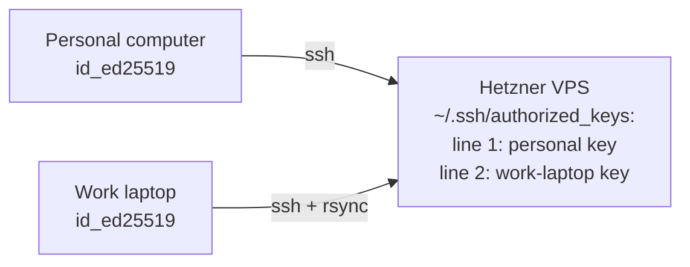

# Phase 4.0 Hetzner VPS setup

End-to-end setup for the Hetzner Cloud VPS that hosts the production PostgreSQL + Apache AGE knowledge graph. Covers provisioning the server, getting SSH access from both the personal computer and the work laptop, installing rsync, and preparing the server for the Phase 4.0 load.

Status as of 2026-04-20: Parts A, B, C are done and the server is live. Part D was run as part of `/bossman-mode --phase 4.0`: PostgreSQL 15.17 + Apache AGE 1.5.0 are installed, the `ncbi_kg` database exists, the `ncbi_kg` graph was created (graphid 16969), and the loader + Python venv are set up at `/root/repo/`. The rsync transfer is the final pending step (see `docs/learnings.md` Phase 4.0 execution notes for the session-drop retry loop).

Sits alongside the existing setup docs:

- `setup-01.md`: original project onboarding
- `setup-02.md`: retired AlmaLinux work-computer setup
- `setup-03_windows_laptop.md`: Windows laptop setup (Phase 1-3 local dev)
- `setup-04_hetzner_vps.md`: this doc (Phase 4.0 cloud deploy)

Related reading before you start:

- `docs/architecture/AGE_loader_explained.md`: why PostgreSQL + AGE, hosting comparison, performance expectations
- `docs/bossman_execution_plan.md` Phase 4.0 section: what the phase does end-to-end
- `DECISIONS.md` 2026-04-18 entry: Hetzner CPX42 Nuremberg, ~$34/month rationale

## Table of contents

- [Prerequisites](#prerequisites)
- [Part A: provision the Hetzner CPX42](#part-a-provision-the-hetzner-cpx42)
- [Part B: SSH access from both computers](#part-b-ssh-access-from-both-computers)
- [Part C: install rsync on the work computer](#part-c-install-rsync-on-the-work-computer)
- [Part D: install PostgreSQL 15 + AGE on the server](#part-d-install-postgresql-15--age-on-the-server)
- [Part E: end-to-end verification](#part-e-end-to-end-verification)
- [Troubleshooting](#troubleshooting)

## Prerequisites

Before you start, you need:

- A Hetzner Cloud account with a payment method (https://console.hetzner.com)
- The personal computer set up per `setup-03_windows_laptop.md` (Phase 1-3 already done here)
- The work computer with the merged KGX in `C:/Users/<you>/agentic-search-data-engineering/data/kgx/merged/` (~75-95GB)
- Git Bash or PowerShell available on the work computer (OpenSSH client ships built-in on Windows 11)
- The repo cloned and venv active on the work computer, `pytest -q` passes (232 tests)

## Part A: provision the Hetzner CPX42

The target spec comes from DECISIONS.md: CPX42, Nuremberg, no separate volume.

### Step A1: create the server

1. Log in to https://console.hetzner.com
2. Click "New server" (or "Add server" in your project view)
3. Pick the following options:

| Option | Value |
|--------|-------|
| Location | Nuremberg (nbg1) |
| Image | Ubuntu 24.04 |
| Type | CPX42 (8 vCPU, 16GB RAM, 320GB local disk) |
| Networking | IPv4 + IPv6 (default) |
| SSH keys | Upload your personal computer's public key here OR leave blank if you'll use the root password |
| Firewalls | None for now (add later if needed) |
| Volumes | None, the 320GB local disk is enough for V1 (no dbSNP) |
| Backups | Optional, ~$7/month |
| Name | `agentic-search-vps` (or any name) |

4. Click "Create & Buy Now". Server provisioning takes ~30 seconds.

### Step A2: grab the public IP

Once the server is running, Hetzner shows the public IPv4 on the server page. You will need this for every subsequent step. The actual IP for this deployment is `46.225.128.133` (captured 2026-04-19; substitute your own if you are redoing this from scratch).

### Step A3: note the root credentials

- If you uploaded an SSH key during provisioning, password login is disabled. You log in with the key.
- If you did not upload a key, Hetzner emails you the root password. Subject: "Your new Cloud Server at Hetzner". Use this password for the first login, then immediately add an SSH key and disable password auth (covered in Part B).

## Part B: SSH access from both computers

You will run Phase 4.0 from the work computer (where the KGX data lives). The personal computer only needs SSH access for setup convenience.

Both computers need to be in the server's `~/.ssh/authorized_keys` file.

### Why both

- Personal computer: set up Hetzner initially, ran Phase 3.0, handy to have around for debugging.
- Work computer: runs Phase 4.0, owns the 75-95GB merged KGX that rsync will push.



### Step B1: add the personal computer's key (if not done at provisioning)

On the personal computer:

```bash
cat ~/.ssh/id_ed25519.pub
```

Copy the entire line.

If you added it during provisioning, skip ahead to Step B3.

If not, paste it into the server via the Hetzner web console:

1. Dashboard, click your server, then click "Console" (top right)
2. Log in as root with the emailed password
3. Run:

```bash
mkdir -p ~/.ssh
chmod 700 ~/.ssh
echo 'PASTE-PERSONAL-COMPUTER-PUBKEY-HERE' >> ~/.ssh/authorized_keys
chmod 600 ~/.ssh/authorized_keys
```

Note the single quotes around the key: they prevent shell interpretation of any special characters.

### Step B2: test SSH from the personal computer

```bash
ssh root@<server-ip>
```

Should log in with no password. If you get "Permission denied (publickey)", the key is not in authorized_keys; go back and re-check.

### Step B3: add the work computer's key

On the work computer (Git Bash or PowerShell), check if a key already exists:

```bash
ls ~/.ssh/
```

- If you see `id_ed25519` and `id_ed25519.pub`, use it. Reuse across services is fine; an SSH key is just a key.
- If nothing is there, generate one:

```bash
ssh-keygen -t ed25519 -C "work-laptop"
```

Press Enter three times (default path, no passphrase, acceptable for a personal dev machine).

Show the public key:

```bash
cat ~/.ssh/id_ed25519.pub
```

Copy that single line.

Now add it to the server. Easiest path: SSH in from the personal computer (which already works) and append:

```bash
# on personal computer
ssh root@<server-ip>

# then on the server
echo 'PASTE-WORK-LAPTOP-PUBKEY-HERE' >> ~/.ssh/authorized_keys
chmod 600 ~/.ssh/authorized_keys
cat ~/.ssh/authorized_keys
```

The `cat` at the end should show two lines. Exit with `exit`.

### Step B4: test SSH from the work computer

On the work computer:

```bash
ssh root@<server-ip>
```

First-time prompt: "The authenticity of host ... can't be established. Are you sure you want to continue?" Type `yes`, Enter.

You should land on `root@<hostname>:~#` with no password prompt. Type `exit` to disconnect.

### Step B5: lock down password authentication (optional but recommended)

Once both machines can log in via keys, disable password auth entirely. On the server:

```bash
sed -i 's/^#*PasswordAuthentication.*/PasswordAuthentication no/' /etc/ssh/sshd_config
systemctl reload sshd
```

Closes the password-guessing attack surface. Key-based login still works.

## Part C: install rsync on the work computer

Windows does not ship with rsync. You need it to push the 75-95GB merged KGX to the server with resumable transfer. `scp` is not resumable, which matters over home Wi-Fi.

Check first:

```bash
which rsync
```

If it prints a path, you already have rsync and can skip this part.

### Options

| Option | Install time | Notes |
|--------|-------------|-------|
| WSL2 Ubuntu + `apt install rsync` | ~15 min | Cleanest. WSL2 reads C: drive at `/mnt/c/`, so rsync runs from the native Windows path without copying. |
| `scoop install rsync` | ~2 min | Fast if Scoop is already installed. |
| `choco install rsync` | ~2 min | Fast if Chocolatey is already installed. |
| Drop rsync.exe into Git Bash | ~5 min | Download cwRsync or MSYS2 rsync; put the binary in `C:\Program Files\Git\usr\bin\`. Works but fiddly. |

### Recommended path: WSL2 Ubuntu

If you do not already have WSL2:

```powershell
wsl --install -d Ubuntu
```

Reboot when prompted. Launch Ubuntu from the Start menu, create a username and password. Then:

```bash
sudo apt update
sudo apt install -y rsync openssh-client
```

Verify:

```bash
rsync --version
```

Your Windows C: drive is at `/mnt/c/` inside WSL. So the merged KGX path from WSL is:

```
/mnt/c/Users/<you>/agentic-search-data-engineering/data/kgx/merged/
```

### Verify rsync can reach the server

From WSL (or wherever rsync lives now):

```bash
rsync --dry-run -avP /mnt/c/Users/<you>/agentic-search-data-engineering/data/kgx/merged/ root@<server-ip>:/tmp/rsync-test/
```

The `--dry-run` flag skips the actual transfer. If you see a list of files, rsync is working. Remove `--dry-run` when ready for the real thing during Phase 4.0.

## Part D: install PostgreSQL 15 + AGE on the server

This step is typically handled by `/bossman-mode --phase 4.0` as part of the phase. The commands below are documented here for reference and for manual setup if needed.

### Step D1: install PostgreSQL 15

On the server:

```bash
apt update
apt install -y postgresql-common
/usr/share/postgresql-common/pgdg/apt.postgresql.org.sh -y
apt install -y postgresql-15 postgresql-server-dev-15 build-essential git bison flex
```

### Step D2: build and install Apache AGE

AGE ships as source. Build against the Postgres 15 dev headers:

```bash
cd /tmp
git clone https://github.com/apache/age.git
cd age
git checkout release/PG15/1.5.0
make PG_CONFIG=/usr/lib/postgresql/15/bin/pg_config
make install PG_CONFIG=/usr/lib/postgresql/15/bin/pg_config
```

### Step D3: create database and enable AGE

```bash
sudo -u postgres psql -c "CREATE DATABASE ncbi_kg;"
sudo -u postgres psql -d ncbi_kg -c "CREATE EXTENSION age;"
sudo -u postgres psql -d ncbi_kg -c "LOAD 'age';"
sudo -u postgres psql -d ncbi_kg -c "SET search_path = ag_catalog, \"\$user\", public;"
```

### Step D4: configure connections

By default, PostgreSQL only accepts local connections. If Phase 4.0 runs the loader from the server itself (via SSH + psql), no change needed. If you want to connect from the work laptop via psql, edit `/etc/postgresql/15/main/pg_hba.conf` to allow your IP and open port 5432 in the firewall. Most workflows do not need this.

### Step D5: create the graph

The AGE loader creates the graph on first run, so this is optional. If you want to pre-create it:

```bash
sudo -u postgres psql -d ncbi_kg -c "SELECT create_graph('ncbi_kg');"
```

## Part E: end-to-end verification

Before kicking off `/bossman-mode --phase 4.0`, confirm every link in the chain works.


Five checks, in order:

1. SSH from work computer works without password:

```bash
ssh root@<server-ip> "hostname && uptime"
```

2. Rsync can reach the server:

```bash
rsync --dry-run -avP /mnt/c/Users/<you>/agentic-search-data-engineering/data/kgx/merged/ root@<server-ip>:/tmp/test/
```

3. Server has Postgres + AGE:

```bash
ssh root@<server-ip> "sudo -u postgres psql -d ncbi_kg -c \"SELECT * FROM ag_catalog.ag_graph;\""
```

Output should include a graph row (if pre-created) or return zero rows cleanly.

4. Disk headroom on the server:

```bash
ssh root@<server-ip> "df -h /"
```

Expect ~280GB+ free on the root filesystem. Phase 4.0 uploads ~144GB of KGX (revised up from the original 95GB estimate after Gate 2 measured actual sizes) and builds an ~80-120GB graph, so you want at least 200GB free before starting.

Note on the "320 GB" spec: Hetzner markets the disk in decimal GB (10^9 bytes). Linux `df -h` reports in binary GiB (2^30 bytes). 320 × 10^9 ÷ 2^30 ≈ 298 GiB. Ext4 also reserves 5% for root by default. Net usable is ~285 GiB on a fresh CPX42. This is expected, not missing disk.

5. Local KGX is where you think it is:

```bash
ls -la /mnt/c/Users/<you>/agentic-search-data-engineering/data/kgx/merged/
```

Expect `nodes.tsv` and `edges.tsv` files, totalling 75-95GB.

All five passing = ready to run `/bossman-mode --phase 4.0` on the work computer.

## Troubleshooting

### "Permission denied (publickey)" from a machine that should work

Your public key is not in `~/.ssh/authorized_keys` on the server, or the file's permissions are wrong. Check:

```bash
ssh root@<server-ip> "cat ~/.ssh/authorized_keys && stat -c '%a %n' ~/.ssh ~/.ssh/authorized_keys"
```

Expected: your key is listed, `~/.ssh` is `700`, `authorized_keys` is `600`.

Fix if wrong:

```bash
chmod 700 ~/.ssh
chmod 600 ~/.ssh/authorized_keys
```

### Password prompt when SSH should use a key

Three likely causes:

1. Key is missing from `authorized_keys`. See above.
2. Your SSH client is offering a different key than you think. Run `ssh -v root@<server-ip>` and look at the lines starting with "Offering public key". If the key offered is not the one in `authorized_keys`, specify with `-i`:

```bash
ssh -i ~/.ssh/id_ed25519 root@<server-ip>
```

3. The key on the server was added at the Hetzner account level (Security → SSH Keys), not to this running server's `authorized_keys` file. Account-level keys only apply at server creation. Re-add via the running server's file.

### Paste not working in the Hetzner web console

The browser console uses noVNC. Regular Ctrl+V does not reach the VM. Use the noVNC clipboard sidebar (click the small arrow on the left edge to expand, then the clipboard icon). Or SSH in from a machine that already has access and use `echo '...' >> ~/.ssh/authorized_keys`.

### rsync complains about CR/LF or permissions

If you see weird "chmod" or "failed: Operation not permitted" errors, Windows line endings may be confusing rsync. Add `--no-perms --no-owner --no-group` to the rsync command. For the Phase 4.0 rsync this is standard because KGX files are plain TSV and do not need Unix permission preservation.

### Server runs out of disk during load

Unlikely on 320GB, but possible if the graph grows faster than estimated. Options:

1. Delete the uploaded KGX after the load, since the graph is the source of truth now.
2. Resize the CPX42 in place (Hetzner console → server → Rescale). No rebuild.
3. Attach a block volume temporarily.

Last updated: 2026-04-19
