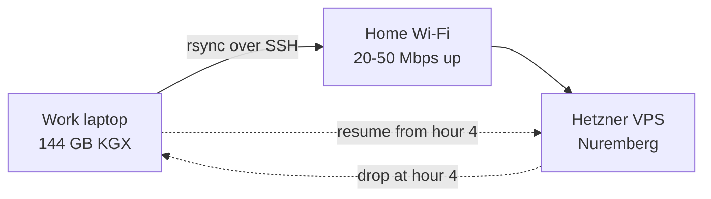
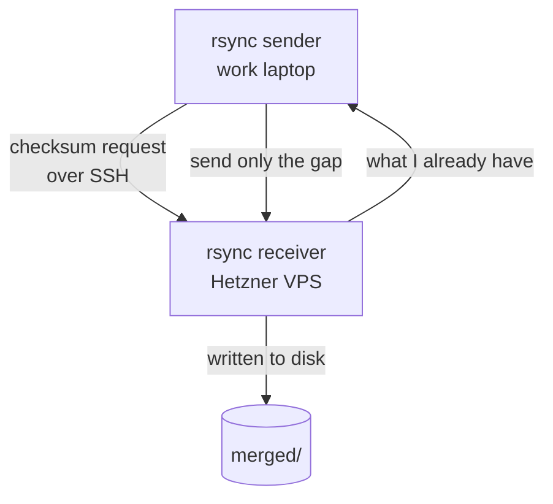
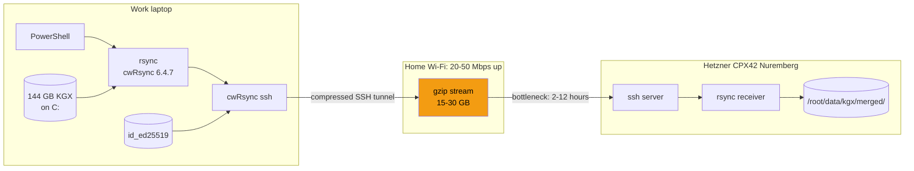

# rsync on Windows for Phase 4.0

End-to-end setup for the rsync client on the Windows work laptop. Covers what rsync is, why Windows is awkward, every command that worked, every failure we hit along the way, and the final working invocation for Phase 4.0.

Written in first-principles style so a smart high schooler could follow along. Sits alongside:

- `setup-03_windows_laptop.md`: Windows laptop setup for Phase 1-3
- `setup-04_hetzner_vps.md`: Hetzner server provisioning and SSH access
- This doc: the rsync piece, which fits between server SSH and the Phase 4.0 data transfer

---

## Table of contents

- [Axioms](#axioms)
- [What is rsync](#what-is-rsync)
- [Why does it exist](#why-does-it-exist)
- [How does it work](#how-does-it-work)
- [What is PowerShell and why are we using it](#what-is-powershell-and-why-are-we-using-it)
- [The Windows problem](#the-windows-problem)
- [Install on a locked-down Windows laptop](#install-on-a-locked-down-windows-laptop)
- [The three gotchas we hit](#the-three-gotchas-we-hit)
- [The final working command](#the-final-working-command)
- [Why the transfer takes 6 to 12 hours](#why-the-transfer-takes-6-to-12-hours)
- [What this means for you](#what-this-means-for-you)

---

## Axioms

Named up front so anyone reading can challenge the floor this doc stands on.

1. You have ~144 GB of merged KGX to move from the work laptop to the Hetzner server.
2. Home Wi-Fi upload is 20 to 50 Mbps. A single transfer will take 6 to 12 hours.
3. The connection will drop at least once during a 6-12 hour window. Any tool without resume is disqualified.
4. The work laptop is locked down: no admin, no Docker, no Program Files writes. Any install has to work in the user profile.
5. SSH from the work laptop to the Hetzner server already works with a key (per `setup-04_hetzner_vps.md`).

If any of these turn out false, revisit the choice of tool.

---

## What is rsync

rsync is a file-copy tool that only sends what is missing or changed, and can resume after interruptions.

Think of it as a shipping company that remembers what boxes are already at the destination. You ask it to deliver 144 GB. It asks the other end: what do you already have? It only ships the gap. If the truck breaks down halfway, the next truck continues from where the first stopped.

---

## Why does it exist

Plain copy tools have three problems that bite hard at scale.

Problem 1: no resume. If the network drops at hour 4 of a 6-hour transfer, the whole thing restarts from zero.

Problem 2: no delta. Even if the destination already has 99 percent of a file, the tool sends all of it again.

Problem 3: no verification. You trust the byte count and hope nothing silently corrupted.

rsync solves all three.



The drop is expected. Without rsync, the drop erases 4 hours of upload. With rsync, the drop costs a few seconds of verification and keeps going.

---

## How does it work

Three clever things happen during a transfer.

Checksum comparison: before sending a file, rsync asks the destination, do you already have this? It skips anything identical.

Block-level delta: for a partially-copied file, rsync only sends the missing bytes, not the whole file.

Resumable over SSH: if your Wi-Fi drops, re-run the same command. rsync picks up exactly where it left off.



rsync does not replace SSH. It rides on top of SSH, using it as the transport. You already set up SSH keys in `setup-04_hetzner_vps.md`; rsync reuses them.

---

## What is PowerShell and why are we using it

PowerShell is Microsoft's command-line shell, the Windows equivalent of bash on Linux or zsh on macOS. You type a command, it runs. That is the whole job.

Two reasons we use it for this doc rather than Command Prompt or Git Bash:

Reason 1: it ships with every Windows install and cannot be removed by IT policy. Command Prompt also ships with Windows, but it is a decades-old limited shell. Git Bash ships only if someone installed Git for Windows. PowerShell is the one universal shell you can assume is present on a locked-down work laptop.

Reason 2: the commands that install Scoop, set environment variables, and check installed tools are written in PowerShell syntax. Examples you will see later in this doc:

- `Invoke-RestMethod`: download from a URL. Command Prompt has no equivalent.
- `$env:HOME = $env:USERPROFILE`: set an environment variable for the current session. Command Prompt syntax would be `set HOME=%USERPROFILE%`.
- `Get-ChildItem`: list files. Command Prompt uses `dir`.

You do not need to learn PowerShell. You need to open it and paste commands from this doc.

How to open PowerShell:

1. Press the Windows key
2. Type `powershell`
3. Press Enter

A blue-ish window opens with a prompt that looks like `PS C:\Users\you>`. The `PS` at the start confirms you are in PowerShell. That is the only signal you need.

One important habit: when a command asks you to install something that changes the PATH (like Scoop), close the PowerShell window completely and open a fresh one. PATH updates do not apply to sessions that were already open when the change happened.

If you are comfortable in Git Bash or Windows Terminal and prefer it, both can host a PowerShell session inside them. Same thing. Look for `PS` at the start of the prompt.

---

## The Windows problem

Unix ships rsync in the base install. Linux, macOS, FreeBSD, you get rsync for free.

Windows does not. rsync is not a Microsoft tool. It is a Unix tool. You have four ways to get it on Windows:

1. WSL2 Ubuntu plus `apt install rsync`: cleanest, needs admin to install WSL on most work machines
2. Scoop plus a Windows rsync port: no admin, per-user install, works on locked-down machines
3. Chocolatey plus rsync: needs admin to install Chocolatey
4. Manually drop a cwRsync binary into Git Bash: fiddly but possible

On a locked-down work machine with no admin, Scoop is the only option that reliably works in under 5 minutes.

Scoop's main bucket does not have a package called `rsync`. It has a package called `cwrsync`. That is a Windows port of rsync based on Cygwin. When you install `cwrsync`, the command on the PATH is called `rsync`, so from your shell it looks and behaves the same.

---

## Install on a locked-down Windows laptop

Seven steps. Total time: about 5 minutes.

Step 1: Open PowerShell (regular, not admin). Windows key, type powershell, Enter.

Step 2: Set execution policy for your user. May error if your company has a higher-scope policy, which is fine:

```powershell
Set-ExecutionPolicy -ExecutionPolicy RemoteSigned -Scope CurrentUser
```

If PowerShell tells you "your shell will retain its current effective execution policy of Unrestricted," that is not a blocker. Unrestricted is more permissive than what you tried to set. Proceed.

Step 3: Install Scoop. One line, no admin:

```powershell
Invoke-RestMethod -Uri https://get.scoop.sh | Invoke-Expression
```

Expected line in the output: `Scoop was installed successfully!`

Step 4: Install cwRsync via Scoop:

```powershell
scoop install cwrsync
```

Expected last line: `'cwrsync' (6.4.7) was installed successfully!`

Step 5: Close PowerShell and open a fresh one. This matters. Scoop adds new paths, and the PATH update only takes effect in new sessions.

Step 6: Verify rsync is on the PATH:

```powershell
rsync --version
```

Expected first line: `rsync version 3.4.1 protocol version 32` or similar.

Step 7: Verify the Hetzner server has rsync installed on its side:

```powershell
ssh root@<server-ip> "which rsync"
```

Expected: `/usr/bin/rsync`. If blank, install it on the server with `ssh root@<server-ip> "apt install -y rsync"`.

---

## The three gotchas we hit

These are not hypothetical. Every one of these bit us during the real setup on 2026-04-19. Document them here so future-you does not rediscover them.

Gotcha 1: Windows paths break rsync's argument parser.

rsync uses the colon character to separate host from path, as in `host:/remote/path`. When you pass `C:/Users/...` it reads `C` as a hostname. You get this error:

```
The source and destination cannot both be remote.
```

Fix: use the Cygwin-style path format. `C:/Users/you/Desktop/...` becomes `/cygdrive/c/Users/you/Desktop/...`. Same path, different notation, no colon confusion.

Gotcha 2: cwRsync cannot talk to Windows OpenSSH.

Windows 11 ships its own native SSH client at `C:\Windows\System32\OpenSSH\ssh.exe`. When rsync invokes ssh, it finds this one first on the PATH. rsync launches successfully, SSH authenticates, remote rsync starts on the server, and then the local rsync dies with:

```
debug2: channel 0: read failed rfd 4 maxlen 32768: Unknown error
rsync: connection unexpectedly closed (0 bytes received so far) [Receiver]
```

Root cause: cwRsync is Cygwin-based. It expects Cygwin-style pipes between itself and the ssh process. Windows OpenSSH creates native Windows pipes. cwRsync's `read()` cannot talk to those handles. The processes see each other, but they cannot pass data.

Fix: tell rsync to use cwRsync's own bundled ssh instead of Windows OpenSSH. cwRsync ships its own Cygwin-compatible ssh at `C:\Users\<you>\scoop\apps\cwrsync\6.4.7\bin\ssh.exe`. Force it with the `-e` flag:

```
-e "/cygdrive/c/Users/<you>/scoop/apps/cwrsync/6.4.7/bin/ssh.exe"
```

Gotcha 3: cwRsync's ssh does not know where your key lives.

Windows OpenSSH reads keys from `C:\Users\<you>\.ssh\`. cwRsync's bundled ssh, being Cygwin-based, reads keys from `$HOME/.ssh/`. On Windows, `$HOME` is usually not set at all. Result: cwRsync's ssh asks for a password because it cannot find any keys to try.

Two-part fix:

Part A: set `HOME` for the current PowerShell session so cwRsync's ssh looks in the right place:

```powershell
$env:HOME = $env:USERPROFILE
```

Part B: point the ssh client directly at the key file using `-i`, so key discovery is not a problem at all:

```
-i /cygdrive/c/Users/<you>/.ssh/id_ed25519
```

Also helpful: `-o StrictHostKeyChecking=accept-new` so the first-time host fingerprint is accepted without an interactive prompt.

---

## The final working command

This is the command that transferred the dry-run list successfully on 2026-04-19 after all three gotchas were fixed. Save this.

For a dry run (confirms the wiring without moving any bytes):

```powershell
$env:HOME = $env:USERPROFILE
rsync --dry-run -avP -e "/cygdrive/c/Users/chakrabortim2/scoop/apps/cwrsync/6.4.7/bin/ssh.exe -i /cygdrive/c/Users/chakrabortim2/.ssh/id_ed25519 -o StrictHostKeyChecking=accept-new" "/cygdrive/c/Users/chakrabortim2/Desktop/agentic-search-data-engineering/data/kgx/merged/" root@46.225.128.133:/tmp/rsync-test/
```

For the real Phase 4.0 transfer, three changes from the dry-run:

1. Remove `--dry-run`
2. Add `--compress`, because KGX is text TSV and compresses 5 to 10 times on the wire
3. Change the destination from `/tmp/rsync-test/` to a stable path like `/root/data/kgx/merged/`

Real command:

```powershell
$env:HOME = $env:USERPROFILE
rsync -avP --compress -e "/cygdrive/c/Users/chakrabortim2/scoop/apps/cwrsync/6.4.7/bin/ssh.exe -i /cygdrive/c/Users/chakrabortim2/.ssh/id_ed25519 -o StrictHostKeyChecking=accept-new" "/cygdrive/c/Users/chakrabortim2/Desktop/agentic-search-data-engineering/data/kgx/merged/" root@46.225.128.133:/root/data/kgx/merged/
```

One-time prep before the real transfer, to make sure the destination exists:

```powershell
ssh root@46.225.128.133 "mkdir -p /root/data/kgx/merged"
```

Flag explanation:

- `-a`: archive mode, preserves permissions and timestamps
- `-v`: verbose, show what is happening
- `-P`: progress bar plus resumable partial transfers
- `--compress`: gzip data over the wire
- `-e "..."`: the ssh command to use for transport
- `-i ...`: the private key file
- `-o StrictHostKeyChecking=accept-new`: auto-accept new host fingerprints

---

## Why the transfer takes 6 to 12 hours

Not guesswork. It falls out of arithmetic on three inputs: how much data you are moving, how fast your home upload pipe is, and how much compression helps.

Input 1: data volume. Gate 2 produced 144 GB of merged KGX (46.5 GB nodes + 97.8 GB edges).

Input 2: upload bandwidth. Typical US home Wi-Fi upload is 20 to 50 Mbps. That is megabits per second, not megabytes. Divide by 8 to convert: 2.5 to 6.25 MB per second of raw upload capacity.

Input 3: compression. KGX is plain text TSV with a lot of repetition (CURIE prefixes like `NCBIGene:`, `biolink:` appear millions of times). gzip compresses TSV 5 to 10 times. With `--compress` enabled, 144 GB of text becomes roughly 15 to 30 GB on the wire.

Now the math:

| Scenario | On-wire size | Upload speed | Hours |
|----------|-------------|--------------|-------|
| Slow Wi-Fi (20 Mbps), poor compression (5x) | 30 GB | 2.5 MB/s | ~12 hr |
| Slow Wi-Fi (20 Mbps), typical compression (7x) | 21 GB | 2.5 MB/s | ~8 hr |
| Fast Wi-Fi (50 Mbps), typical compression (7x) | 21 GB | 6.25 MB/s | ~3 hr |
| Fast Wi-Fi (50 Mbps), great compression (10x) | 15 GB | 6.25 MB/s | ~2 hr |

So the range is roughly 2 to 12 hours depending on your ISP plan and how well TSV compresses. The 6 to 12 hour estimate is the pessimistic half of that range. Budget for it.

The whole stack, showing where the 6 to 12 hours actually gets spent:



The orange node is the bottleneck. Everything local and remote is fast (SSD, gigabit inside the VPS, in-memory compression). The slow step is exactly one thing: how many megabits per second your home ISP lets you push up.

Two ways to cut the time if it matters:

Option 1: run the transfer from a faster network once. If you can temporarily park the work laptop somewhere with a 200+ Mbps symmetric connection (office, library, family member), the transfer drops to 30 to 60 minutes.

Option 2: live with it and run overnight. This is the default. Kick off rsync before bed, resume with up-arrow + Enter if it dropped overnight, check the completed transfer in the morning. Zero active supervision required.

If the transfer is still running when you sit down for Phase 4.0 bossman work, that is fine. Bossman detects KGX already on the server and skips the transfer step.

---

## What this means for you

Three takeaways you will carry into Phase 4.0.

Takeaway 1: the install is fast once you know the pattern. Scoop plus cwRsync takes about 5 minutes on a locked-down laptop. The three gotchas add another 10 to 15 minutes when discovered from scratch. With this doc, they add zero.

Takeaway 2: the real transfer takes hours. Plan for it. Kick off the rsync before bed. Check in the morning. If it errored halfway, press up-arrow in PowerShell and Enter, rsync resumes.

Takeaway 3: bossman mode can run the real command for you. When you run `/bossman-mode --phase 4.0` on the work laptop, bossman will use this exact command template. You do not need to run the transfer manually unless you want to front-load it overnight before bossman runs.

If anything in this doc stops working, suspect one of the three gotchas returning, usually because:

- Scoop updated cwRsync to a new version: the `6.4.7` in the ssh path would become `6.5.x`. Re-run `Get-ChildItem "$env:USERPROFILE\scoop\apps\cwrsync" -Recurse -Filter "ssh.exe"` to find the new path.
- A new PowerShell session lost `HOME`: re-run `$env:HOME = $env:USERPROFILE` at the top of every new session. Or add it to your PowerShell profile for persistence.
- You rotated your SSH key: update the `-i` path to the new key file.

---

Last updated: 2026-04-19
