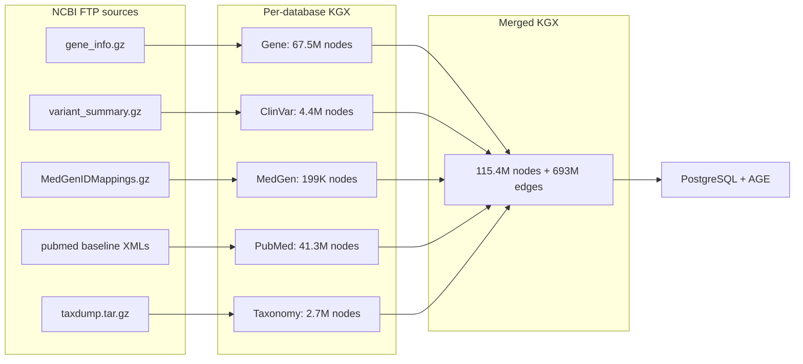

# Data inventory

Tracks all data downloaded from NCBI FTP, with source URLs, file sizes, row counts, and attributes. Updated each time a pipeline runs on real data.

## Table of contents

- [Storage location](#storage-location)
- [Pipeline output vs live Entrez counts](#pipeline-output-vs-live-entrez-counts)
- [Taxonomy (downloaded 2026-04-16, Gate 2)](#taxonomy-downloaded-2026-04-16-gate-2)
- [PubMed (downloaded + parsed 2026-04-16 to 2026-04-17, Gate 2)](#pubmed-downloaded--parsed-2026-04-16-to-2026-04-17-gate-2)
- [Gene (re-exported 2026-04-17, Gate 2 streaming refactor)](#gene-re-exported-2026-04-17-gate-2-streaming-refactor)
- [5-database merged KGX (generated 2026-04-17, Gate 2)](#5-database-merged-kgx-generated-2026-04-17-gate-2)
- [MedGen (downloaded 2026-04-14, Gate 1)](#medgen-downloaded-2026-04-14-gate-1)
- [Gene (downloaded 2026-04-14, Gate 1, all organisms)](#gene-downloaded-2026-04-14-gate-1-all-organisms)
- [ClinVar (downloaded 2026-04-14, Gate 1)](#clinvar-downloaded-2026-04-14-gate-1)

## Storage location

All current local data is stored under the repo-local `data/` directory on the Windows laptop C: drive:
- `ftp_cache/`: raw FTP downloads (kept for re-runs)
- `kgx/`: KGX output per database (nodes.tsv + edges.tsv)
- `raw/`: intermediate parsed data (currently unused)

Gate 1 entries below show `/export/home/chakrabortim2/data/...` paths because the Gate 1 runs happened on the NCBI server before the 2026-04-16 migration. The data has since been rsync'd to `C:\Users\chakrabortim2\Desktop\agentic-search-data-engineering\data\` on the laptop. Gate 2 entries use the laptop paths.

## Pipeline output vs live Entrez counts

Cross-reference of our KGX node output against the live NCBI Entrez record count on 2026-04-20. Each pipeline ingests from NCBI bulk FTP (a single flat file or a tar bundle), which is a narrower view than the Entrez search index. Gaps are expected; the question is whether the gap reflects intent.

| Pipeline | Our nodes | Entrez records | Gap | Root cause | Decision |
|---|---:|---:|---:|---|---|
| Gene | 67,536,236 | 95,048,437 | -27.5M (-29%) | `gene_info.gz` is the live-genes flat file. Entrez also indexes 25,894,790 discontinued/replaced records (tracked in `gene_history.gz`), plus ~1M secondary records. | Keep as-is for V1. If System 3 ever needs to resolve old GeneIDs cited in legacy papers, add `gene_history.gz` as a second source and emit `replaced_by` edges. |
| PubMed (per-pipeline) | 41,305,514 | 40,421,164 | +0.9M | Baseline (1,334 files) and updatefiles (82 files) overlap: updatefiles re-emit PMIDs already present in baseline with revised metadata. Streaming parser writes every row. | Correct by design: merge step dedups to 40,387,670 `biolink:Article` nodes, which matches Entrez within 33K (new PMIDs indexed after our 2026-04-17 snapshot). |
| PubMed (post-merge) | 40,387,670 | 40,421,164 | -33K (-0.08%) | Snapshot date drift: PubMed indexes new articles continuously; our baseline+updatefiles were pulled 2026-04-16 to 2026-04-17. | Acceptable. V1 locks PubMed at baseline release 2026; refresh at V2. |
| ClinVar | 4,426,035 | 4,269,379 | +157K (+3.7%) | Snapshot 2026-04-14 vs live 2026-04-17. ClinVar dropped ~220K records during a curation cleanup in that window (see `NCBI_databases_and_APIs_reference.md` Provenance note). Our snapshot is pre-cleanup. | PoC: ship as-is. 3.7% curation drift does not change KG structure, edge predicates, or traversal paths. Refresh at V2 when the content cutoff actually matters. |
| MedGen | 198,813 | 234,106 | -35K (-15%) | We use `MedGenIDMappings.txt.gz` as the node source (198,813 CUIs with cross-references to OMIM, MeSH, Orphanet, SNOMED, or HPO). `NAMES.RRF.gz` has 236,920 CUIs, including ~38K "bare" MedGen concepts that only carry a name and no xref. | Keep as-is for V1: a MedGen concept with no xref cannot be linked to anything else in the KG, so it adds no traversal value. If System 3 needs those for free-text concept search, ingest `NAMES.RRF` as a secondary MedGen-only node source with a flag `has_xrefs=false`. |
| Taxonomy | 2,736,607 | 2,872,642 | -136K (-5%) | `nodes.dmp` in taxdump contains 2,736,607 live taxa. Entrez additionally indexes `merged.dmp` (97,892 old taxids merged into live ones) plus ~38K newer taxa added since our 2026-04-16 snapshot. `delnodes.dmp` has another 863,584 deleted taxids that Entrez does not surface. | Keep as-is for V1. `merged.dmp` matters only if downstream callers hand us obsolete taxids and expect to be redirected. If that happens, add a small `OldTaxon -> LiveTaxon replaced_by` edge set from `merged.dmp` (98K edges, trivial). |
| dbSNP | 0 | 1,197,210,835 | -1.2B | Deferred to System 3 as a query-time API lookup (see bossman execution plan). Loading 1.2B nodes into AGE is out of scope for V1. | Planned deferral. System 3 will hit `esummary.fcgi?db=snp` on demand. |

Pattern: Entrez record counts are the **searchable index** (includes live + retired + merged records for lookup) whereas bulk FTP flat files contain the **live slice** only. A 5% to 30% gap is normal. Flag as a bug only when we are below the live slice (which has not happened on any pipeline so far).

See `docs/learnings.md` section "Entrez indexes vs bulk FTP flat files" for the generalized lesson.

## Taxonomy (downloaded 2026-04-16, Gate 2)

### FTP downloads

| File | FTP URL | Size | Format |
|------|---------|------|--------|
| taxdump.tar.gz | ftp://ftp.ncbi.nlm.nih.gov/pub/taxonomy/taxdump.tar.gz | 69 MB | gzipped tar (extracts to nodes.dmp 198 MB, names.dmp 266 MB, plus 7 other .dmp files) |

### KGX output

| File | Path | Rows | Size |
|------|------|------|------|
| nodes.tsv | C:\Users\chakrabortim2\Desktop\agentic-search-data-engineering\data\kgx\taxonomy\nodes.tsv | 2,736,607 | 410 MB |
| edges.tsv | C:\Users\chakrabortim2\Desktop\agentic-search-data-engineering\data\kgx\taxonomy\edges.tsv | 2,736,606 | 359 MB |

### Node attributes

| Column | Description | Example |
|--------|-------------|---------|
| id | NCBITaxon:{tax_id} | NCBITaxon:9606 |
| category | biolink:OrganismTaxon | biolink:OrganismTaxon |
| name | Scientific name | Homo sapiens |
| source | Always "NCBI Taxonomy" | NCBI Taxonomy |
| source_url | Link to Taxonomy Browser record | https://www.ncbi.nlm.nih.gov/Taxonomy/Browser/wwwtax.cgi?id=9606 |
| rank | Taxonomic rank | species |

### Edge breakdown

| Predicate | Count | Subject type | Object type |
|-----------|-------|-------------|-------------|
| biolink:subclass_of | 2,736,606 | NCBITaxon | NCBITaxon (parent) |

Root node (NCBITaxon:1) has no parent, hence one fewer edge than nodes.

### Validation

| Check | Result |
|-------|--------|
| Pipeline ran without errors | yes |
| KGX files exist | yes |
| Row counts | 2.74M nodes, 2.74M edges (plan estimate ~2.9M, within 6%) |
| Duplicate nodes | 0 |
| Provenance (nodes) | 100% |
| Provenance (edges) | 100% |
| Dangling edges | 0 |
| Internal validator | PASS |
| External `kgx validate -i tsv` | (run with corrected flag, see learnings.md) |

### Wall-clock time

77 seconds end-to-end on Windows laptop C: drive. Plan estimate was ~10 minutes; the conservative budget reflected slow-FTP-day worst case.

## PubMed (downloaded + parsed 2026-04-16 to 2026-04-17, Gate 2)

### FTP downloads

| File set | FTP URL | Count | Size | Format |
|----------|---------|-------|------|--------|
| PubMed baseline | ftp://ftp.ncbi.nlm.nih.gov/pubmed/baseline/pubmed26n*.xml.gz | 1,334 | ~52 GB compressed | gzipped XML |
| PubMed updatefiles | ftp://ftp.ncbi.nlm.nih.gov/pubmed/updatefiles/pubmed26n*.xml.gz | 82 | ~2 GB compressed | gzipped XML |

Total: 1,416 files, ~54 GB. Download time: ~90 min with `ThreadPoolExecutor(max_workers=8)` (see DECISIONS.md 2026-04-16). Serial would have been ~12 hours.

### KGX output

| File | Path | Rows | Size |
|------|------|------|------|
| nodes.tsv | C:\...\data\kgx\pubmed\nodes.tsv | 41,305,514 | ~25 GB |
| edges.tsv | C:\...\data\kgx\pubmed\edges.tsv | 349,158,178 | ~41 GB |

### Node breakdown

| Category | Count |
|----------|-------|
| biolink:Article (41.27M articles) + biolink:OntologyClass (30.8K MeSH stubs) | 41,305,514 |

### Edge breakdown

| Predicate | Count |
|-----------|-------|
| biolink:has_mesh_annotation | 349,158,178 |

### Validation

| Check | Result |
|-------|--------|
| Pipeline ran without errors | yes |
| KGX files exist | yes |
| Row counts match order of magnitude | yes (plan estimated ~40M articles + 40M+ edges; actual 41.3M + 349M) |
| External `kgx validate -i tsv` (awk verification used instead, see learnings) | all 349M edges NF=7, 0 empty knowledge_level, 0 empty agent_type |
| Duplicate nodes | 0 |
| Provenance (nodes) | 100% |
| Provenance (edges) | 100% |

### Wall-clock time

Download: ~90 min (parallel). Parse + KGX export: ~4.5 hours (lxml streaming, ~9 sec/file on 1,416 files). Total wall time: ~5.5 hours.

## Gene (re-exported 2026-04-17, Gate 2 streaming refactor)

Original Gate 1 KGX (dated 2026-04-14) was overwritten by the streaming re-export on 2026-04-17 after the BioLink 4.x fix and the gene pipeline streaming refactor (see DECISIONS.md and learnings.md).

### KGX output (post-refactor)

| File | Path | Rows | Size |
|------|------|------|------|
| nodes.tsv | C:\...\data\kgx\gene\nodes.tsv | 67,562,827 | ~11.3 GB |
| edges.tsv | C:\...\data\kgx\gene\edges.tsv | 278,665,267 | ~40.1 GB |

### Node breakdown

| Category | Count |
|----------|-------|
| biolink:Gene (all organisms) | 67,536,236 |
| biolink:BiologicalProcess + MolecularActivity + CellularComponent (GO terms) | 26,591 |

### Edge breakdown (by source parser)

| Predicate / parser | Count |
|---------------------|-------|
| biolink:in_taxon (parse_gene_info) | 67,536,236 |
| biolink:participates_in / actively_involved_in / located_in (parse_gene2go) | 117,490,871 |
| biolink:mentioned_in (parse_gene2pubmed) | 76,209,437 |
| biolink:orthologous_to (parse_orthologs) | 17,421,079 |
| biolink:gene_associated_with_condition (parse_mim2gene) | 7,644 |

### Validation

| Check | Result |
|-------|--------|
| Streaming pipeline ran without errors | yes (77 min wall time) |
| Peak RAM during run | ~2-3 GB (400x reduction vs pre-refactor 21 GB OOM) |
| All edges have 7 BioLink 4.x required cols (awk NF=8 including evidence_code) | yes, all 278.7M rows |
| Empty knowledge_level | 0 |
| Empty agent_type | 0 |
| Duplicate nodes | (streaming dedup at merge phase) |

## 5-database merged KGX (generated 2026-04-17, Gate 2)

### Output

| File | Path | Size |
|------|------|------|
| merged nodes.tsv | data/kgx/merged/nodes.tsv | ~46.5 GB |
| merged edges.tsv | data/kgx/merged/edges.tsv | ~97.8 GB |
| merge_report.md | data/kgx/merged/merge_report.md | small |

### Summary (from merge_report.md)

- Total nodes: 115,406,761
- Total edges: 693,295,991
- Duplicate nodes dropped during merge: 904,160
- Stubs injected (dangling endpoints resolved): 81,125
- Wall-clock: 2h 21min (12:30 to 14:51 on 2026-04-17) with streaming refactor

### Node categories (merged)

| Category | Count |
|----------|-------|
| biolink:Gene | 67,536,325 |
| biolink:Article | 40,387,670 |
| biolink:SequenceVariant | 4,467,468 |
| biolink:OrganismTaxon | 2,736,611 |
| biolink:Disease | 200,845 |
| biolink:OntologyClass | 30,790 |
| biolink:BiologicalProcess | 16,901 |
| biolink:NamedThing (unknown-prefix stubs, mostly OMIM) | 10,580 |
| biolink:PhenotypicFeature | 9,881 |
| biolink:MolecularActivity | 6,978 |
| biolink:CellularComponent | 2,712 |

### Edge predicates (merged)

| Predicate | Count |
|-----------|-------|
| biolink:has_mesh_annotation | 349,158,178 |
| biolink:mentioned_in | 124,030,637 |
| biolink:in_taxon | 67,536,236 |
| biolink:actively_involved_in | 44,833,241 |
| biolink:participates_in | 40,768,103 |
| biolink:located_in | 31,889,527 |
| biolink:orthologous_to | 17,421,079 |
| biolink:has_phenotype | 6,076,746 |
| biolink:is_sequence_variant_of | 4,407,222 |
| biolink:cited_in | 3,924,878 |
| biolink:subclass_of | 2,832,500 |
| biolink:close_match | 410,000 |
| biolink:gene_associated_with_condition | 7,644 |

### Cross-pipeline connectivity (the reason merge exists)

| Path | Resolved | Total | % |
|------|----------|-------|---|
| Gene mentioned_in PubMed Article | 76,204,771 | 76,209,437 | 99.99 |
| Gene in_taxon NCBITaxon | 67,536,172 | 67,536,236 | 99.99 |
| PubMed Article has_mesh_annotation MeSH | 349,158,178 | 349,158,178 | 100.00 |
| NCBITaxon subclass_of NCBITaxon | 2,736,606 | 2,736,606 | 100.00 |

### Stub breakdown (81,125 total)

| Prefix | Stubs | Likely cause |
|--------|-------|-------------|
| ClinVar | 43,770 | ClinVar variant IDs referenced by other pipelines but not in our ClinVar snapshot |
| PMID | 14,769 | Newer PMIDs in gene2pubmed not yet in our PubMed baseline |
| OMIM | 10,580 | OMIM IDs referenced by mim2gene_medgen, prefix not in _PREFIX_TO_CATEGORY, became NamedThing (follow-up: add OMIM to the table) |
| HP | 9,881 | HPO terms referenced by medgen but not in medgen KGX |
| MedGen | 2,032 | MedGen concepts referenced but not present |
| NCBIGene | 89 | Gene IDs in clinvar not in gene snapshot |
| NCBITaxon | 4 | Taxonomy refs not in taxdump, negligible |

### Validation

| Check | Result |
|-------|--------|
| Pipeline completed naturally | yes (log: "5-database merge complete" at 14:51:31) |
| Total edges | 693,295,991 matches sum of per-db inputs minus no dedup (edge dedup skipped per streaming design) |
| Cross-pipeline connectivity | 99.99 % - 100 % for all 4 key paths |
| Dangling edges after stubs | 0 (by construction) |
| validation.passed | `False` (noise: stubs carry empty source_url, count as missing provenance; intentional, matches inject_stubs behavior) |
| Awk 7-column check on merged/edges.tsv | PASS - all 693,295,991 edges NF=8, 0 empty knowledge_level, 0 empty agent_type |

### Wall-clock time

Merge: 2h 21min on Windows laptop. Pass 1 (nodes): ~30 min. Pass 2 (edges): ~110 min. Stubs + report: ~1 min. Peak RAM during merge: ~11.5 GB worker process (node-id set). Peak disk usage: ~320 GB total in data/ (~60 GB FTP cache + ~110 GB per-db KGX + ~144 GB merged KGX).

## MedGen (downloaded 2026-04-14, Gate 1)

### FTP downloads

| File | FTP URL | Size | Format |
|------|---------|------|--------|
| MedGenIDMappings.txt.gz | ftp://ftp.ncbi.nlm.nih.gov/pub/medgen/MedGenIDMappings.txt.gz | 5.8 MB | gzipped, pipe-delimited |
| MGREL.RRF.gz | ftp://ftp.ncbi.nlm.nih.gov/pub/medgen/MGREL.RRF.gz | 15.7 MB | gzipped, pipe-delimited |
| NAMES.RRF.gz | ftp://ftp.ncbi.nlm.nih.gov/pub/medgen/NAMES.RRF.gz | 3.1 MB | gzipped, pipe-delimited |
| medgen_pubmed_lnk.txt.gz | ftp://ftp.ncbi.nlm.nih.gov/pub/medgen/medgen_pubmed_lnk.txt.gz | 239.9 MB | gzipped, pipe-delimited |
| MedGen_HPO_OMIM_Mapping.txt.gz | ftp://ftp.ncbi.nlm.nih.gov/pub/medgen/MedGen_HPO_OMIM_Mapping.txt.gz | 4.1 MB | gzipped, pipe-delimited |

### KGX output

| File | Path | Rows |
|------|------|------|
| nodes.tsv | /export/home/chakrabortim2/data/kgx/medgen/nodes.tsv | 198,813 |
| edges.tsv | /export/home/chakrabortim2/data/kgx/medgen/edges.tsv | 48,327,094 |

### Node attributes

| Column | Description | Example |
|--------|-------------|---------|
| id | MONDO:{id} or MedGen:{CUI} | MONDO:0007254 |
| category | biolink:Disease or biolink:PhenotypicFeature | biolink:Disease |
| name | Preferred concept name | Breast cancer |
| source | Always "MedGen" | MedGen |
| source_url | Link to MedGen record | https://www.ncbi.nlm.nih.gov/medgen/C0006142 |
| xrefs | Pipe-separated OMIM, MeSH, Orphanet, SNOMED, HPO IDs | OMIM:114480\|MeSH:D001943 |

### Edge attributes

| Predicate | Count | Subject type | Object type |
|-----------|-------|-------------|-------------|
| biolink:subclass_of | 95,894 | MedGen concept | MedGen concept |
| biolink:mentioned_in | 47,821,200 | MedGen concept | PMID (dangling until PubMed pipeline) |
| biolink:close_match | 410,000 | MedGen concept | HP or OMIM identifier |

### Validation

| Check | Result |
|-------|--------|
| Duplicate nodes | 0 |
| Provenance (nodes) | 100% |
| Provenance (edges) | 100% |
| Dangling edges | 48,231,910 (expected: mostly PMID references that resolve when PubMed pipeline runs) |

## Gene (downloaded 2026-04-14, Gate 1, all organisms)

### FTP downloads

| File | FTP URL | Size | Format |
|------|---------|------|--------|
| gene_info.gz | ftp://ftp.ncbi.nlm.nih.gov/gene/DATA/gene_info.gz | ~2.5 GB | gzipped, tab-separated |
| gene2go.gz | ftp://ftp.ncbi.nlm.nih.gov/gene/DATA/gene2go.gz | ~200 MB | gzipped, tab-separated |
| gene2pubmed.gz | ftp://ftp.ncbi.nlm.nih.gov/gene/DATA/gene2pubmed.gz | ~500 MB | gzipped, tab-separated |
| gene_refseq_uniprotkb_collab.gz | ftp://ftp.ncbi.nlm.nih.gov/gene/DATA/gene_refseq_uniprotkb_collab.gz | ~50 MB | gzipped, tab-separated |
| mim2gene_medgen | ftp://ftp.ncbi.nlm.nih.gov/gene/DATA/mim2gene_medgen | ~5 MB | plain text, tab-separated |
| gene_orthologs.gz | ftp://ftp.ncbi.nlm.nih.gov/gene/DATA/gene_orthologs.gz | ~100 MB | gzipped, tab-separated |

Note: gene_refseq_uniprotkb_collab.gz has no GeneID column (maps protein accessions, not genes). UniProt enrichment returned 0 results. See learnings.md for details.

### KGX output

| File | Path | Rows | Size |
|------|------|------|------|
| nodes.tsv | /export/home/chakrabortim2/data/kgx/gene/nodes.tsv | 67,562,827 | 8.3 GB |
| edges.tsv | /export/home/chakrabortim2/data/kgx/gene/edges.tsv | 278,665,267 | 31 GB |

### Node breakdown

| Category | Count |
|----------|-------|
| biolink:Gene (all organisms) | 67,536,236 |
| GO terms (BiologicalProcess, MolecularActivity, CellularComponent) | 26,591 |

### Edge breakdown

| Predicate | Count |
|-----------|-------|
| biolink:in_taxon | 67,536,236 |
| biolink:participates_in / actively_involved_in / located_in (GO) | 117,490,871 |
| biolink:mentioned_in (gene2pubmed) | 76,209,437 |
| biolink:gene_associated_with_condition (mim2gene) | 7,644 |
| biolink:orthologous_to | 17,421,079 |

### Validation

| Check | Result |
|-------|--------|
| Duplicate nodes | 0 |
| Provenance (nodes) | 100% |
| Provenance (edges) | 100% (node validation only, edge validation skipped for memory) |
| UniProt enrichment | 0 (gene_refseq_uniprotkb_collab.gz has no GeneID column, see learnings.md) |

Note: edges written via streaming append (5 batches) to avoid OOM on 278M edges. Edge-level dangling check skipped at pipeline level, will run at merge phase.

## ClinVar (downloaded 2026-04-14, Gate 1)

### FTP downloads

| File | FTP URL | Size | Format |
|------|---------|------|--------|
| variant_summary.txt.gz | ftp://ftp.ncbi.nlm.nih.gov/pub/clinvar/tab_delimited/variant_summary.txt.gz | ~500 MB | gzipped, tab-separated |
| var_citations.txt | ftp://ftp.ncbi.nlm.nih.gov/pub/clinvar/tab_delimited/var_citations.txt | ~50 MB | plain text, tab-separated |

### KGX output

| File | Path | Rows |
|------|------|------|
| nodes.tsv | /export/home/chakrabortim2/data/kgx/clinvar/nodes.tsv | 4,426,035 |
| edges.tsv | /export/home/chakrabortim2/data/kgx/clinvar/edges.tsv | 14,408,846 |

### Node attributes

| Column | Description | Example |
|--------|-------------|---------|
| id | ClinVar:{VariationID} | ClinVar:12345 |
| category | biolink:SequenceVariant | biolink:SequenceVariant |
| name | Variant name from ClinVar | NM_007294.4(BRCA1):c.5266dupC |
| clinical_significance | ClinVar classification | Pathogenic |
| review_status | Review status | criteria provided, multiple submitters, no conflicts |
| source_url | Link to ClinVar record | https://www.ncbi.nlm.nih.gov/clinvar/variation/12345 |

### Edge breakdown

| Predicate | Count |
|-----------|-------|
| biolink:is_sequence_variant_of | 4,407,222 |
| biolink:has_phenotype | 6,076,746 |
| biolink:cited_in | 3,924,878 |

### Validation

| Check | Result |
|-------|--------|
| Duplicate nodes | 2,337 (0.05%, multi-assembly rows, acceptable) |
| Provenance (nodes) | 100% |
| Provenance (edges) | 100% |
| Dangling edges | 14.4M (expected: NCBIGene, MedGen, PMID refs resolve at merge or later pipelines) |
