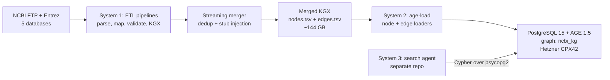
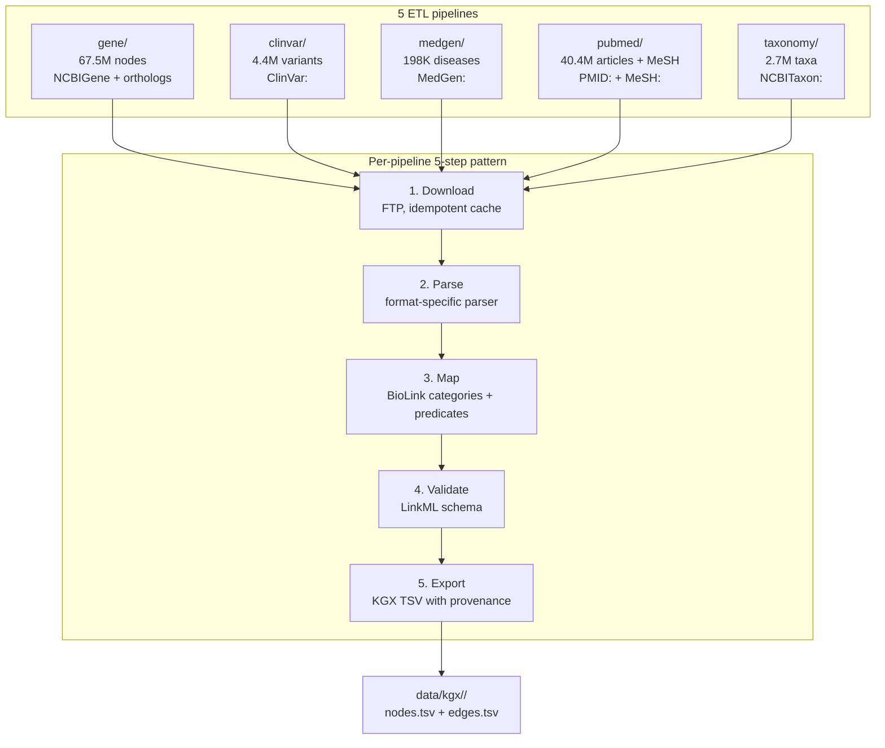
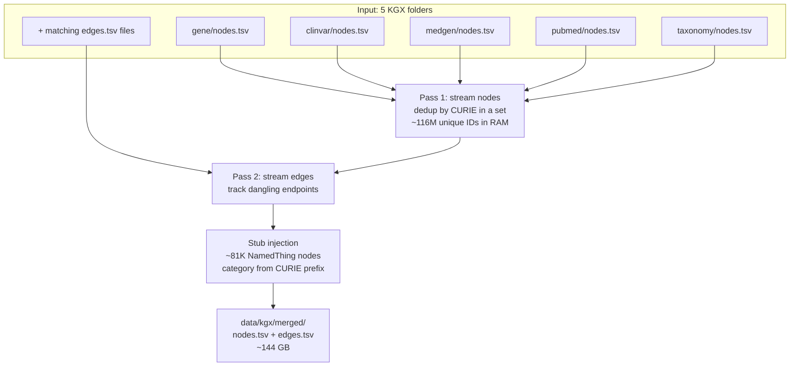
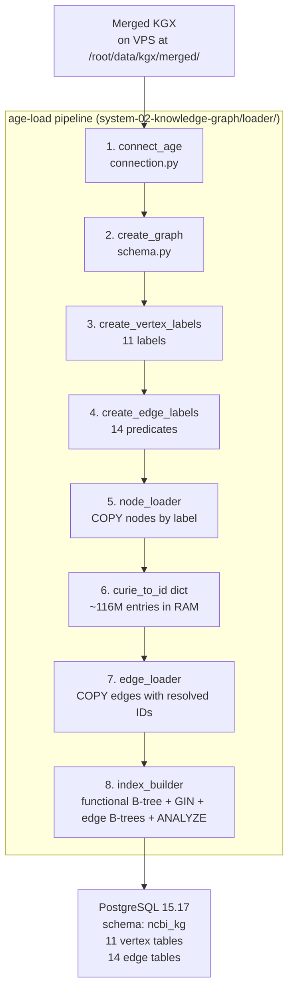
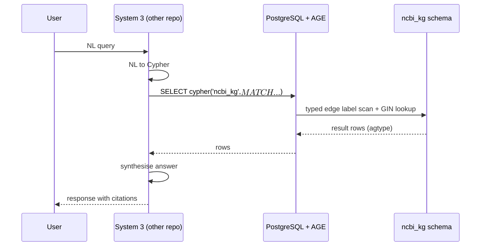
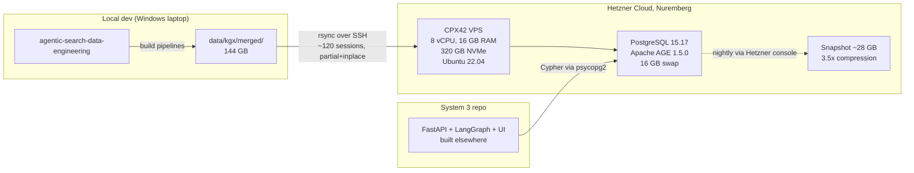

# Architecture diagram: NCBI knowledge graph V1

System architecture for the V1 knowledge graph: 5 NCBI ETL pipelines feed a streaming merger that writes a single KGX dataset, the loader pushes that dataset into PostgreSQL 15.17 + Apache AGE 1.5.0 on a Hetzner CPX42 VPS, and System 3 (a separate repo) connects as a Cypher client. Live counts: 115,406,761 nodes, 693,295,991 edges, 11 vertex labels, 14 edge labels.

## Table of contents

1. [End-to-end system overview](#1-end-to-end-system-overview)
2. [System 1: data pipelines (5 ETLs)](#2-system-1-data-pipelines-5-etls)
3. [Streaming merge into a single KGX](#3-streaming-merge-into-a-single-kgx)
4. [System 2: AGE loader on the Hetzner CPX42](#4-system-2-age-loader-on-the-hetzner-cpx42)
5. [Query-time data flow (System 3 as client)](#5-query-time-data-flow-system-3-as-client)
6. [Deployment topology](#6-deployment-topology)
7. [Live statistics](#7-live-statistics)

## 1. End-to-end system overview

The repo at hand owns everything from NCBI to AGE. System 3 is an external Cypher client and is not built here. See [docs/architecture/Three_layer_data_architecture.md](../architecture/Three_layer_data_architecture.md) for the full layer model.

## 2. System 1: data pipelines (5 ETLs)

Each pipeline follows the same 5-step pattern: download, parse, map to BioLink, validate against LinkML, export to KGX. Code lives under [system-01-data-pipelines/](../../system-01-data-pipelines/).

Shared utilities (downloader, BioLink mapper, LinkML validator, KGX exporter, streaming merger) live in [system-01-data-pipelines/shared/](../../system-01-data-pipelines/shared/). Provenance fields (`source`, `source_url`) are required on every node and edge; this is enforced at the validator boundary.

## 3. Streaming merge into a single KGX

The merger combines 5 per-database KGX directories into one merged KGX. It uses two streaming passes to keep RAM bounded at O(unique node CURIEs) instead of O(total rows). The full algorithm lives in [system-01-data-pipelines/shared/merger.py](../../system-01-data-pipelines/shared/merger.py); see [docs/architecture/Merge_logic_explained.md](../architecture/Merge_logic_explained.md) for the first-principles walkthrough.

Prefix-to-category map (from [merger.py](../../system-01-data-pipelines/shared/merger.py) lines 39 to 50) drives stub-category inference for any dangling endpoint:

| CURIE prefix | BioLink category |
| --- | --- |
| NCBIGene: | biolink:Gene |
| PMID: | biolink:Article |
| MeSH: | biolink:OntologyClass |
| GO: | biolink:BiologicalProcess |
| MedGen:, MONDO:, UMLS: | biolink:Disease |
| NCBITaxon: | biolink:OrganismTaxon |
| HP: | biolink:PhenotypicFeature |
| ClinVar: | biolink:SequenceVariant |
| (other) | biolink:NamedThing |

## 4. System 2: AGE loader on the Hetzner CPX42

The loader takes the merged KGX and pushes it into a single AGE graph called `ncbi_kg`. Code lives under [system-02-knowledge-graph/loader/](../../system-02-knowledge-graph/loader/). See [docs/architecture/AGE_loader_explained.md](../architecture/AGE_loader_explained.md) for the deep-dive.

The `curie_to_id` dict is the memory hot-spot: it maps every CURIE to its AGE-assigned graphid so edge endpoints can be resolved at insert time. It peaks around 12-14 GB on this graph, which is why the box has 16 GB swap (see [docs/learnings.md](../learnings.md) Problem 9).

Step 8 covers three index passes (added during Gate 3 close-out): functional B-tree on `agtype_to_text(properties -> '"id"')`, GIN on `properties` for high-traffic vertex labels, and B-tree on `start_id`/`end_id` for every edge label. ANALYZE then refreshes planner statistics. See [docs/Knowledge_graph_on_server_reference.md](../Knowledge_graph_on_server_reference.md) Section I and Problem 12 in [docs/learnings.md](../learnings.md).

## 5. Query-time data flow (System 3 as client)

System 3 lives in a separate repo and connects to the AGE graph as a read-only Cypher client. Nothing in this repo writes to the graph after the bulk load.

Performance bands and the three rules of fast Cypher (always specify edge label, match by `id` with the right CURIE prefix, keep regex narrow) live in [docs/Knowledge_graph_on_server_reference.md](../Knowledge_graph_on_server_reference.md) Section H.

## 6. Deployment topology

VPS provisioning detail and the rsync-on-Windows playbook live in [docs/context/setup/setup-04_hetzner_vps.md](../context/setup/setup-04_hetzner_vps.md) and [docs/context/setup/setup-05_rsync_windows.md](../context/setup/setup-05_rsync_windows.md). All-in cost is roughly $28.50/month on CPX42, $22/month on a future CPX32 downsize. See Section P of the server reference.

## 7. Live statistics

Counts below are pulled from [tests/cypher/gate3_results_2026-04-22.txt](../../tests/cypher/gate3_results_2026-04-22.txt), Q6 and Q7 of the smoke suite.

| Metric | Count |
| --- | --- |
| Vertex labels | 11 |
| Edge labels | 14 |
| Total nodes | 115,406,761 |
| Total edges | 693,295,991 |
| Source databases | 5 (Gene, ClinVar, MedGen, PubMed, Taxonomy) |
| BioLink validation errors | 0 (build-time + at-merge) |

Top vertex tables by row count:

| Vertex label | Rows |
| --- | --- |
| Gene | 67,536,325 |
| Article | 40,387,670 |
| SequenceVariant | 4,467,468 |
| OrganismTaxon | 2,736,611 |
| Disease | 200,845 |
| OntologyClass | 30,790 |
| BiologicalProcess | 16,901 |
| NamedThing | 10,580 |
| PhenotypicFeature | 9,881 |
| MolecularActivity | 6,978 |
| CellularComponent | 2,712 |

Top edge tables by row count:

| Edge label | Rows |
| --- | --- |
| has_mesh_annotation | 349,158,787 |
| mentioned_in | 124,032,423 |
| in_taxon | 67,536,046 |
| actively_involved_in | 44,832,765 |
| participates_in | 40,767,507 |
| located_in | 31,889,215 |
| orthologous_to | 17,421,811 |
| has_phenotype | 6,076,764 |
| is_sequence_variant_of | 4,407,168 |
| cited_in | 3,924,820 |
| subclass_of | 2,832,676 |
| close_match | 410,000 |
| gene_associated_with_condition | 7,644 |
| exact_match | 0 |

References:

- [Schema_visualization.md](Schema_visualization.md): vertex labels, edge predicates, sample CURIEs
- [docs/Knowledge_graph_on_server_reference.md](../Knowledge_graph_on_server_reference.md): live server reference
- [docs/architecture/Technical_reference_data_engineering.md](../architecture/Technical_reference_data_engineering.md): full V1 walkthrough
- [docs/architecture/AGE_loader_explained.md](../architecture/AGE_loader_explained.md): loader design
- [docs/architecture/Merge_logic_explained.md](../architecture/Merge_logic_explained.md): merger design

Last updated: 2026-04-22
