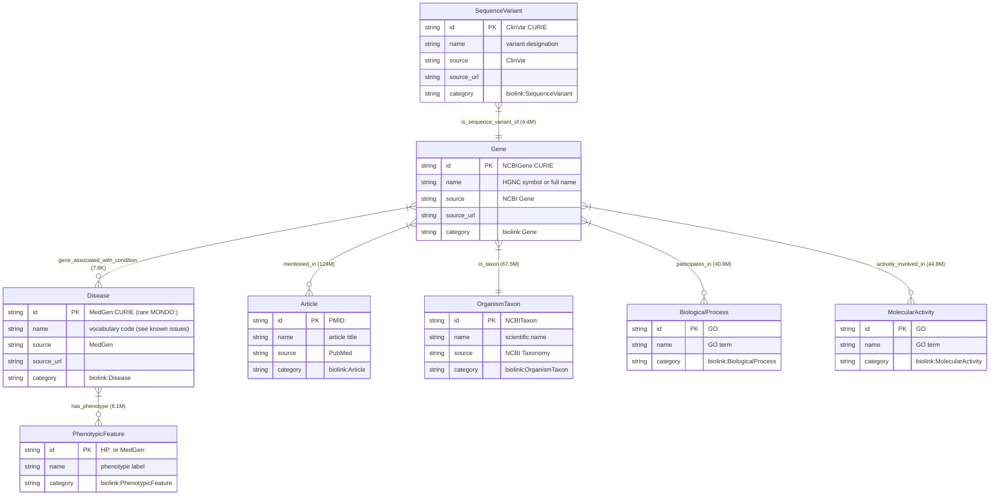
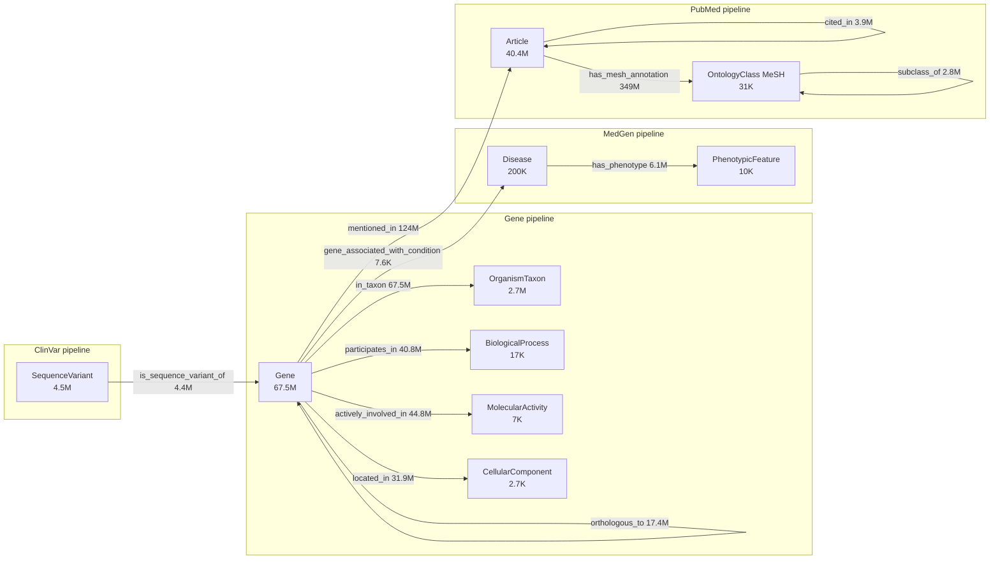

# Schema visualization: NCBI knowledge graph V1

BioLink 4.x compliant schema for the live `ncbi_kg` graph on Hetzner CPX42. 11 vertex labels and 14 edge predicates, derived from 5 NCBI source databases. Counts in this doc match [tests/cypher/gate3_results_2026-04-22.txt](../../tests/cypher/gate3_results_2026-04-22.txt). Vertex and edge label lists match [system-02-knowledge-graph/loader/schema.py](../../system-02-knowledge-graph/loader/schema.py).

## Table of contents

1. [Entity relationship diagram](#1-entity-relationship-diagram)
2. [Vertex labels with sample CURIEs](#2-vertex-labels-with-sample-curies)
3. [Edge predicates with directionality](#3-edge-predicates-with-directionality)
4. [Cross-database connectivity map](#4-cross-database-connectivity-map)
5. [Vertex statistics](#5-vertex-statistics)
6. [Edge statistics](#6-edge-statistics)
7. [BioLink compliance](#7-biolink-compliance)

## 1. Entity relationship diagram

Eight of the eleven labels carry the bulk of the graph and the typed edges between them. The other three (OntologyClass, NamedThing, and small GO categories) are shown in section 4.



## 2. Vertex labels with sample CURIEs

Eleven labels live on the graph. The list comes verbatim from `VERTEX_LABELS` in [schema.py](../../system-02-knowledge-graph/loader/schema.py).

| Vertex label | Source DB | Typical CURIE prefix | Sample CURIE | Sample name |
| --- | --- | --- | --- | --- |
| Gene | NCBI Gene + orthologs | NCBIGene: | NCBIGene:672 | BRCA1 DNA repair associated |
| SequenceVariant | ClinVar | ClinVar: | ClinVar:17660 | (BRCA1 variant) |
| Disease | MedGen | MedGen:, occasionally MONDO: | MedGen:C0031485 | phenylketonuria |
| PhenotypicFeature | MedGen | HP:, MedGen: | HP:0001250 | seizure |
| Article | PubMed | PMID: | PMID:1088347 | (TP53 reference) |
| OntologyClass | PubMed (MeSH) | MeSH: | MeSH:D016609 | apoptosis |
| OrganismTaxon | NCBI Taxonomy | NCBITaxon: | NCBITaxon:9606 | Homo sapiens |
| BiologicalProcess | GO via Gene | GO: | GO:0006096 | glycolytic process |
| MolecularActivity | GO via Gene | GO: | GO:0004340 | glucokinase activity |
| CellularComponent | GO via Gene | GO: | GO:0005739 | mitochondrion |
| NamedThing | merger stub injection | mixed | (any) | [stub] dangling endpoint |

NamedThing is special: it is the catch-all category the merger uses when an edge endpoint has no upstream node. The category is inferred from the CURIE prefix in [merger.py](../../system-01-data-pipelines/shared/merger.py). About 81K (now ~10K after Gate 3 cleanup) NamedThing nodes live in the graph; if a query result lands on one, the upstream ETL had a gap.

Important gotcha: most diseases are stored under `MedGen:`, not `MONDO:`. The merger maps both prefixes to `biolink:Disease`. If a query expects MONDO and returns 0 rows, run the discovery query in Section R of [docs/Knowledge_graph_on_server_reference.md](../Knowledge_graph_on_server_reference.md) to find the actual prefix.

## 3. Edge predicates with directionality

Fourteen predicates live on the graph. List from `EDGE_LABELS` in [schema.py](../../system-02-knowledge-graph/loader/schema.py). Directionality is enforced at insert time (subject -> object).

| Edge predicate | Subject (from) | Object (to) | Meaning |
| --- | --- | --- | --- |
| is_sequence_variant_of | SequenceVariant | Gene | Variant lives on this gene |
| gene_associated_with_condition | Gene | Disease | Curated gene-disease link |
| has_phenotype | Disease | PhenotypicFeature | Disease presents this phenotype |
| participates_in | Gene | BiologicalProcess | Gene plays a role in process |
| actively_involved_in | Gene | MolecularActivity | Gene catalyses or performs activity |
| located_in | Gene | CellularComponent | Gene product found in compartment |
| mentioned_in | Gene | Article | Gene appears in article body |
| has_mesh_annotation | Article | OntologyClass | Article tagged with MeSH term |
| cited_in | Article | Article | Article cites another article |
| in_taxon | Gene | OrganismTaxon | Gene belongs to species |
| subclass_of | OntologyClass | OntologyClass | MeSH or taxon hierarchy edge |
| orthologous_to | Gene | Gene | Cross-species ortholog link |
| exact_match | mixed | mixed | Identifier equivalence (currently 0 rows) |
| close_match | mixed | mixed | Identifier near-equivalence |

Directionality matters for Cypher: writing `MATCH (g:Gene)-[:gene_associated_with_condition]->(d:Disease)` returns rows; writing the arrow the other way returns nothing. See Rule 1 in Section H of [docs/Knowledge_graph_on_server_reference.md](../Knowledge_graph_on_server_reference.md) on always specifying the typed edge.

## 4. Cross-database connectivity map

The merger preserves cross-pipeline edges so that a query starting from a Gene can reach Articles (PubMed), Diseases (MedGen via gene-disease association or via SequenceVariant), Taxa (NCBI Taxonomy), and GO categories. Counts are live edge totals from gate3_results.



Two paths exist from a Gene to a Disease, just like in the earlier PoC:

- Direct: `(Gene)-[:gene_associated_with_condition]->(Disease)` is small and curated (7,644 edges).
- Via variants: `(SequenceVariant)-[:is_sequence_variant_of]->(Gene)` plus a future variant-to-disease edge gives a richer path, though the V1 graph does not yet carry a `causes` predicate (see [docs/learnings.md](../learnings.md) for variant-disease followup).

## 5. Vertex statistics

Live counts (Q6 in [tests/cypher/gate3_results_2026-04-22.txt](../../tests/cypher/gate3_results_2026-04-22.txt)). Total: 115,406,761 nodes.

| Vertex label | Count | Percentage | Identifier source | Example IDs |
| --- | ---: | ---: | --- | --- |
| Gene | 67,536,325 | 58.5% | NCBI Gene | NCBIGene:672 (BRCA1) |
| Article | 40,387,670 | 35.0% | PubMed | PMID:1088347 |
| SequenceVariant | 4,467,468 | 3.9% | ClinVar | ClinVar:17660 |
| OrganismTaxon | 2,736,611 | 2.4% | NCBI Taxonomy | NCBITaxon:9606 (human) |
| Disease | 200,845 | 0.17% | MedGen | MedGen:C0031485 (PKU) |
| OntologyClass | 30,790 | 0.027% | MeSH | MeSH:D016609 |
| BiologicalProcess | 16,901 | 0.015% | Gene Ontology | GO:0006096 |
| NamedThing | 10,580 | 0.009% | merger stubs | mixed |
| PhenotypicFeature | 9,881 | 0.009% | HPO + MedGen | HP:0001250 |
| MolecularActivity | 6,978 | 0.006% | Gene Ontology | GO:0004340 |
| CellularComponent | 2,712 | 0.002% | Gene Ontology | GO:0005739 |

Distribution at-a-glance:

```text
Gene               ████████████████████████████████████████████████  58.5%
Article            ████████████████████████████                      35.0%
SequenceVariant    ███                                                3.9%
OrganismTaxon      ██                                                 2.4%
Disease            ▏                                                  0.17%
OntologyClass      ▏                                                  0.027%
BiologicalProcess  ▏                                                  0.015%
NamedThing         ▏                                                  0.009%
PhenotypicFeature  ▏                                                  0.009%
MolecularActivity  ▏                                                  0.006%
CellularComponent  ▏                                                  0.002%
```

## 6. Edge statistics

Live counts (Q7 in [tests/cypher/gate3_results_2026-04-22.txt](../../tests/cypher/gate3_results_2026-04-22.txt)). Total: 693,295,991 edges.

| Edge predicate | Subject | Object | Count | Percentage |
| --- | --- | --- | ---: | ---: |
| has_mesh_annotation | Article | OntologyClass | 349,158,787 | 50.4% |
| mentioned_in | Gene | Article | 124,032,423 | 17.9% |
| in_taxon | Gene | OrganismTaxon | 67,536,046 | 9.7% |
| actively_involved_in | Gene | MolecularActivity | 44,832,765 | 6.5% |
| participates_in | Gene | BiologicalProcess | 40,767,507 | 5.9% |
| located_in | Gene | CellularComponent | 31,889,215 | 4.6% |
| orthologous_to | Gene | Gene | 17,421,811 | 2.5% |
| has_phenotype | Disease | PhenotypicFeature | 6,076,764 | 0.9% |
| is_sequence_variant_of | SequenceVariant | Gene | 4,407,168 | 0.6% |
| cited_in | Article | Article | 3,924,820 | 0.6% |
| subclass_of | OntologyClass | OntologyClass | 2,832,676 | 0.4% |
| close_match | mixed | mixed | 410,000 | 0.06% |
| gene_associated_with_condition | Gene | Disease | 7,644 | 0.001% |
| exact_match | mixed | mixed | 0 | 0% |

Distribution at-a-glance:

```text
has_mesh_annotation             ████████████████████████████████████  50.4%
mentioned_in                    █████████████                         17.9%
in_taxon                        ███████                                9.7%
actively_involved_in            █████                                  6.5%
participates_in                 ████                                   5.9%
located_in                      ███                                    4.6%
orthologous_to                  ██                                     2.5%
has_phenotype                   ▏                                      0.9%
is_sequence_variant_of          ▏                                      0.6%
cited_in                        ▏                                      0.6%
subclass_of                     ▏                                      0.4%
close_match                     ▏                                      0.06%
gene_associated_with_condition  ▏                                      0.001%
exact_match                     ▏                                      0%
```

## 7. BioLink compliance

The graph is fully compliant with BioLink Model 4.x.

| Aspect | Status | Detail |
| --- | --- | --- |
| Node categories | Compliant | All 11 labels strip the `biolink:` prefix from the merged TSV `category` column |
| Edge predicates | Compliant | All 14 predicates are valid BioLink predicates |
| Identifier standards | Compliant | NCBIGene, ClinVar, MedGen, PMID, MeSH, GO, HP, NCBITaxon |
| Required properties | Compliant | id, category, name on every node; subject, predicate, object, source, source_url on every edge |
| Naming conventions | Compliant | CamelCase categories, snake_case predicates |
| Build-time validation errors | 0 | LinkML validator at the export boundary of every ETL |
| Merge-time dangling edges | 0 | Stubs injected by [merger.py](../../system-01-data-pipelines/shared/merger.py) |

Vertex label to BioLink category mapping:

| Graph label | BioLink category |
| --- | --- |
| Gene | biolink:Gene |
| SequenceVariant | biolink:SequenceVariant |
| Disease | biolink:Disease |
| PhenotypicFeature | biolink:PhenotypicFeature |
| Article | biolink:Article |
| OntologyClass | biolink:OntologyClass |
| OrganismTaxon | biolink:OrganismTaxon |
| BiologicalProcess | biolink:BiologicalProcess |
| MolecularActivity | biolink:MolecularActivity |
| CellularComponent | biolink:CellularComponent |
| NamedThing | biolink:NamedThing |

Edge predicate to BioLink predicate mapping:

| Graph predicate | BioLink predicate |
| --- | --- |
| is_sequence_variant_of | biolink:is_sequence_variant_of |
| gene_associated_with_condition | biolink:gene_associated_with_condition |
| has_phenotype | biolink:has_phenotype |
| participates_in | biolink:participates_in |
| actively_involved_in | biolink:actively_involved_in |
| located_in | biolink:located_in |
| mentioned_in | biolink:mentioned_in |
| has_mesh_annotation | biolink:has_mesh_annotation |
| cited_in | biolink:cited_in |
| in_taxon | biolink:in_taxon |
| subclass_of | biolink:subclass_of |
| orthologous_to | biolink:orthologous_to |
| exact_match | biolink:exact_match |
| close_match | biolink:close_match |

Known data-quality issue: MedGen Disease nodes have `name` populated with vocabulary codes such as `"SNOMEDCT_US"` instead of human-readable disease names. Q2 in the smoke suite returns `dname = "SNOMEDCT_US"` for phenylketonuria. The id and edges are correct; only display text is corrupt. Root cause is the MedGen ETL parser; queued as a Phase-2 followup. See Section M of [docs/Knowledge_graph_on_server_reference.md](../Knowledge_graph_on_server_reference.md).

References:

- [Architecture_diagram.md](Architecture_diagram.md): system architecture and deployment
- [docs/architecture/Technical_reference_data_engineering.md](../architecture/Technical_reference_data_engineering.md): full V1 walkthrough
- [docs/Knowledge_graph_on_server_reference.md](../Knowledge_graph_on_server_reference.md): live server reference and Cypher rules
- [system-02-knowledge-graph/loader/schema.py](../../system-02-knowledge-graph/loader/schema.py): VERTEX_LABELS and EDGE_LABELS source of truth
- [system-01-data-pipelines/shared/merger.py](../../system-01-data-pipelines/shared/merger.py): prefix-to-category map for stub injection
- [tests/cypher/gate3_results_2026-04-22.txt](../../tests/cypher/gate3_results_2026-04-22.txt): live counts and smoke-test outcomes
- [BioLink Model](https://biolink.github.io/biolink-model/): biomedical data linking standard

Last updated: 2026-04-22
