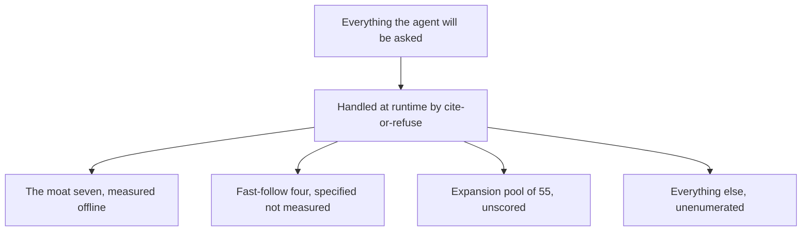

# Evaluation boundary

*August 22, 2026*

What the v1 evaluation set does not measure, stated in full, so that a passing score is read as the narrow claim it actually is.

The evaluation playbook says what the eval set covers. This document says what it does not. Both are needed, because a coverage figure with no boundary next to it is read as a completeness figure, and this eval set is deliberately narrow by design.

## Contents
- [Why this document exists](#why-this-document-exists)
- [What is actually measured today](#what-is-actually-measured-today)
- [Query classes not covered](#query-classes-not-covered)
- [Source types not covered](#source-types-not-covered)
- [Failure modes not covered](#failure-modes-not-covered)
- [Absence is not a negative finding](#absence-is-not-a-negative-finding)
- [What this document itself does not cover](#what-this-document-itself-does-not-cover)

## Why this document exists

A pass rate answers one question: did the system handle the cases we wrote down? It cannot answer the question every reader actually has, which is whether the system handles their case. The gap between those two questions is invisible unless someone writes it down.

This system is a general agent. The evaluation set is seven questions. That ratio is intentional, and it is also the single most misreadable thing about the project. Cite-or-refuse is what protects everything outside the seven at runtime; the eval set is not what protects it, and no number in the eval report should be read as though it were.

The concrete risk is a demonstration or a paper that reports "seven of seven pass" without the sentence that follows it. This document is that sentence, in a form that can be linked rather than remembered.

## What is actually measured today

State it plainly before listing the gaps, because the gaps only mean something against a real baseline.

- The offline gate runs the seven v1 must-pass competency questions: Q1, Q3, Q4, Q5, Q6, Q8, Q10. They span three wedge types: gene-variant-literature, pathogen-sequence-outbreak, and paper-data-tool.
- Each run is scored on the 8-point rubric, 0 to 2 per criterion, passing at 13 of 16, with three hard-fails that fail the run outright regardless of total.
- Aggregation targets: pass^k of 100 percent on the hard-fails, pass@3 as the quality floor, pass^3 of at least 90 percent as the reliability target.
- Graph coverage, reported as a diagnostic and never as a gate: about 5 of 10 concepts, about 3 of 14 predicates. The three exercised predicates are `is_sequence_variant_of`, `gene_associated_with_condition`, and `mentioned_in`.
- Cross-database reach outside the graph is the set's real breadth: roughly 9 API databases, including dbVar, OMIM, GTR, Pathogen Detection, SRA, BioProject, GEO, Assembly, and PubChem.

One fact belongs at the top rather than buried in a gap list, because it changes how every other number here should be read: `eval/golden_dataset.json` currently holds zero cases. The 50-query expansion set that every acceptance-criteria table measures against is specified and not yet built. Until build phase 5.1 populates it, the measured surface is the seven, and any statement of the form "measured against the golden dataset" is a statement about a file with no rows in it.

## Query classes not covered

Each item names what is absent and what a reader cannot conclude because of it.

Compute-tool questions. Q2 (VCF ingestion), Q7 (sequence-similarity execution), and Q9 (BLAST execution) are specified with pinned fixtures planned and are not run. Cost: nothing in the eval report speaks to how the agent behaves when an answer requires executing a computation rather than retrieving a record, which is a different failure surface from retrieval.

Segmental-duplication enrichment for Q1. Deferred with the UCSC source. Cost: Q1's evidence assembly is measured without the seg-dup layer, so a Q1 pass is a pass on a smaller evidence set than the fast-follow version will assemble.

The expansion pool. 55 questions previously tiered under the older selection bar are neither scored under the moat bar nor run. Cost: the seven were selected to score high on the moat test, so they are the favorable end of the distribution by construction. There is no measurement of the average case.

Deep-research questions requiring sub-query decomposition. A single orchestrator holds for v1, and decomposition is triggered only by a failure rate above 20 percent on that class. Cost: that trigger is measured in production, not in the offline gate, so the offline number cannot tell you whether the class is already failing.

Clinical-verdict questions. Excluded by the assemble-not-classify boundary, not by capability. Cost: the eval says nothing about classification quality because classification is refused by design, and a reader who assumes evidence assembly implies classification readiness has misread the entire product.

Single-source fetches. Scored as reproducible by a general tool, so handled at runtime but outside the moat eval set. Cost: the most common everyday query shape is the one least represented in the measured set.

Multi-turn conversations. The rubric grades one run of one query. Nothing in the offline gate grades a session. Cost: this is not hypothetical. The conversation-memory defect described below lived exactly in the space between two graded single-turn runs, and a full pass on the offline gate would not have moved.

## Source types not covered

Non-NCBI sources. UCSC genomicSuperDups is the only one specified, as a fast-follow. Cost: the set measures the agent against NCBI-shaped records only, so nothing here predicts behavior when a source's identifier conventions, coordinate semantics, or freshness model differ.

External knowledge-graph federation. v1 federation is exactly the three data layers, and this item has no named promotion trigger anywhere in the specification. Cost: no data at all on cross-graph identity resolution, which is where federation usually breaks.

Controlled-access data. dbGaP flows are out of scope for tier 1, and the seven are public-data questions. Cost: nothing here speaks to authorization-aware retrieval or to the refusal behavior expected when a citation would point at a record the reader cannot open.

Ten untouched graph predicates. GO annotation, taxonomy, orthology, MeSH, citation, and ontology structure: `has_mesh_annotation`, `in_taxon`, `actively_involved_in`, `participates_in`, `located_in`, `orthologous_to`, `cited_in`, `subclass_of`, `close_match`, `exact_match`. Cost: about four fifths of the graph's predicate space has never been exercised by an eval case. Whether traversal over those edges works is unknown, not working.

Live API drift. The gate runs against pinned fixtures, with a freshness-window allowance for live-API questions. Cost: a pass proves the agent handles the fixture, not that it handles the source on the day of the demonstration. Fixture pinning is the right choice for determinism and it buys that determinism by not measuring drift.

## Failure modes not covered

Three hard-fails are checked on every run: a claim with no source, a rendered verdict on a clinical or pathogenicity question, and a missing assembly or version context on a coordinate question. Everything below is a failure mode the gate does not check.

Silent question substitution. The measured instance: with conversation memory active, a mistyped gene name caused the system to answer about a different gene from earlier in the same conversation. The answer was confident, fully cited, and carried nothing on screen indicating the substitution. Every citation was real and pointed at a real record about the wrong gene. This passes all three hard-fails and would score well on the rubric, because the rubric grades the answer against the question the system believed it was answering. It was found by independent review, not by the eval set, and two reviewers working separately found it first.

Cross-user state leakage. Anonymous users sharing a conversation label could read and overwrite each other's history. No trickery required. Cost: this is a security property, not an answer-quality property, and the eval set does not and should not test it. Named here so that the eval report is not mistaken for a safety report.

Adversarial and hostile queries. The offline set is composed of well-formed research questions. Nothing in it is engineered to elicit a confident wrong answer, and no unscripted adversary pass runs against the gate. Cost: in a domain where a plausible wrong answer is worse than a crash, the most dangerous input class is the one the set does not contain.

Broken measurement. The measured instance: a review reported a repair step failing under time starvation. Investigation the next day withdrew it. The measuring tool was broken, not the product. Cost: no check exists that would distinguish an eval-harness defect from a system defect, so an alarming number has to be doubted by hand. When a measurement looks alarming, doubt the measuring tool first.

Unverified feasibility flags. Q1 carries a feasibility flag: if the coordinate-range check fails, Q1 moves to fast-follow and the must-pass set becomes six. Q5 and Q6 depend on Pathogen Detection access and SRA metadata field availability. Cost: the denominator of the pass rate is itself provisional.

No named fixture sign-off. The playbook flags this explicitly as a real gap: nobody is named as the domain signer for the clinical and human-variation golden fixtures. Cost: the correctness of the answer key is currently asserted by the people who wrote it, which is the same maker-checker collapse that produced the memory defect above.

## Absence is not a negative finding

Every item in this document is an absence. None of them is a measured negative.

- "Not covered" means no case was run. It does not mean the case fails.
- "Unknown" means the system may handle it perfectly, or may fail every time, and this project has no evidence either way.
- The only measured negatives on record are the ones named with their instances above: the question-substitution defect, the cross-user leakage, and the withdrawn repair-step report. All three came from independent review rather than from the eval set, which is the argument for keeping both.

Reporting an absence as a negative overstates what is known. Reporting it as a pass is worse. Neither is permitted in any figure that leaves this repository.

## What this document itself does not cover

- It enumerates classes, not instances. "The expansion pool of 55" is one line here and 55 distinct uncovered behaviors in reality.
- The coverage percentages are a hand-mapped first pass, not dynamic instrumentation. They are replaced once the agent runs and its Cypher is observable, and until then they carry the error of a manual mapping.
- It is a snapshot dated above. The golden dataset being empty is the fact most likely to change first, and this document does not update itself. Any reader using it more than one build phase later should check `eval/golden_dataset.json` before quoting the baseline.
- It does not cover the front end, latency, cost, or accessibility. Those have their own boundaries and none of them is stated here.

## Related documents

- [Evaluation_playbook.md](Evaluation_playbook.md): what the eval set covers, the rubric, the hard-fails, the targets
- [PRD.md](PRD.md): the seven must-pass questions and the v1 out-of-scope list
- [PROGRESS.md](../PROGRESS.md): current build state in plain language
- [LEARNINGS.md](../LEARNINGS.md): the defects above as they were recorded when found
