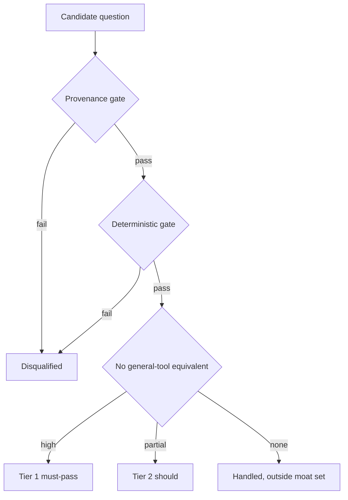
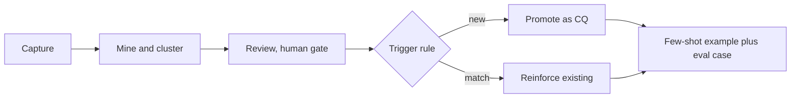
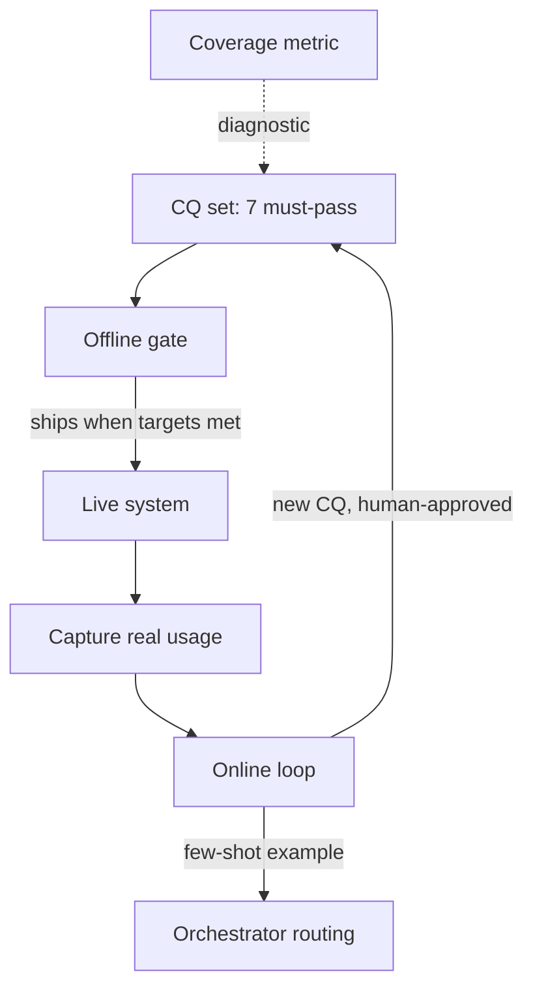

# Evaluation playbook

The standing reference for how System 3 is evaluated. It holds the competency-question set with tiers and personas, the moat test that selects and tiers them, the coverage metric that pairs with it, the offline evaluation gate, the model-selection method, and the online feedback loop. This is a living document: it is updated as the evaluation approach evolves. It is reconciled against prototype learnings at Phase 6.2 and updated continuously by the online feedback loop; unlike the PRD and technical specification, it is not frozen at v1. The technical specification references this playbook rather than restating it.

Phase 2 output. Last updated: 2026-07-22.

## Table of contents

- [What this is and why](#what-this-is-and-why)
- [The moat test: the selection and tiering bar](#the-moat-test-the-selection-and-tiering-bar)
- [The competency-question set](#the-competency-question-set)
- [The coverage metric](#the-coverage-metric)
- [The offline evaluation gate](#the-offline-evaluation-gate)
- [Model selection](#model-selection)
- [The online feedback loop](#the-online-feedback-loop)
- [How it fits together](#how-it-fits-together)
- [Open items and Phase 4 hooks](#open-items-and-phase-4-hooks)

## What this is and why

System 3 answers biomedical questions by crossing NCBI databases and citing every claim. Evaluation has to prove two different things, so it has two halves.

The first half is depth on chosen questions. Can the system answer the hardest, most differentiating questions correctly, with citations, every time? That is the moat test plus the offline evaluation gate.

The second half is breadth against what exists. Seven passing questions can still leave most of the domain untouched, so a high pass rate can hide large gaps. That is the coverage metric, and over time the online feedback loop, which grows the question set from real usage.

Two principles run through the whole playbook:

- The competency-question set is an evaluation gate, not a menu. The system is a general agent that answers anything the three data layers support. The set is the sample of hard questions we test to decide the system is good enough, not the list of questions it will answer.
- Assemble the evidence, never the verdict. Every answer surfaces cited evidence and never renders a clinical verdict (pathogenicity classification, variant prioritization, diagnosis, treatment). The system assembles and cites; a human decides.

## The moat test: the selection and tiering bar

The moat test is the primary bar for selecting and tiering competency questions. It outranks persona coverage and raw usage frequency, which stay as secondary tiebreakers. The reason: a question that scores high on persona coverage but low on the moat is exactly what a general tool already answers, so it is weak differentiation for System 3 even if users ask it often.

The bar is structured, not a flat average, because the dimensions are different kinds of thing.

Gates, binary, must pass to qualify at all:

- Provenance: every claim links to a source record. A question whose answer cannot be cited is disqualified, not low-scored.
- Deterministic: the answer is reproducible and verifiable given the data state at query time. A live-API answer that changes as the data changes is not a determinism failure; eval fixtures pin the data state or accept a freshness window.

Ranking, one design-time dimension:

- No general-tool equivalent: scored by an external empirical test. Run the candidate against a panel of the strongest general tools (a frontier chat LLM such as Claude, GPT, or Gemini; an answer engine with retrieval such as Perplexity; and plain web search). The question passes only if none produces the correct answer with verifiable citations across the required databases. The pass condition is grounding, not fluency: a general tool routinely produces a fluent answer, but not one backed by real, resolvable NCBI source records, because general LLMs hallucinate citations. A fluent, uncited, or hallucinated-citation answer does not count. Testing against the strongest tools, scored on verifiable grounding, keeps the bar honest against 2026 tools, and it moves the judgment from us to an observation that needs no app and no users.

Deferred to the online loop as re-ranking signals:

- Learn from the system and loop human behavior. Both describe how users gain insight and follow up, which cannot be observed until the system is live. They re-enter in the online feedback loop, not at design-time selection.

Rejected as a scoring axis:

- Cross-database span. Deciding that a question needs the databases is a judgment we impose, which biases the set. The empirical general-tool test replaces it.

Tier mapping among gate-passers:

Persona coverage and usage frequency act as intra-band tiebreakers and a coverage-balance check, never as an override of a weak moat score.

## The competency-question set

The set has three parts: the v1 must-pass moat set, the fast-follow set, and the expansion pool. Persona numbers reference the legend below.

Persona legend: 1 literature researchers, 2 sequence data users, 3 geneticists, 4 bioinformaticians, 5 structural biologists, 6 epidemiologists and public health, 7 drug discovery and pharma, 8 clinicians, 9 educators and students, 10 cross-database journey users, 11 AI agents and MCP and LLM consumers.

### The v1 must-pass moat set (seven)

These are the flagship differentiators. All pass the gates, all score high on the general-tool test (no general-tool equivalent), and all run without compute tools. The cap is seven.

| # | Question (short) | Wedge type | Personas | Feasibility flag |
|---|------------------|-----------|----------|------------------|
| Q1 | CNV region to cited ACMG-relevant evidence (dbVar, ClinVar, genes, OMIM, Variation Viewer). Assembles evidence, no classification. | gene-variant-literature | 3, 8, 10 | Coordinate-keyed. Layer 2 interval-overlap semantics to verify in Step 4.0. Segmental duplications deferred to fast-follow (UCSC source). |
| Q3 | BRCA1 to Gene, PubMed, ClinVar, GTR, MedGen in one answer. | gene-variant-literature | 1, 3, 8, 10, 11 | Clean. Flagship graph traversal. |
| Q4 | Disease phrase to routed cross-database queries (MedGen, ClinVar, GTR, PubMed, ClinicalTrials, Gene). | gene-variant-literature | 1, 3, 8, 10 | Ask-back on ambiguity. |
| Q5 | Salmonella isolate to SNP cluster, AMR genes, BioSample, neighbors within 5 SNPs. | pathogen-sequence-outbreak | 6, 4, 10 | Pathogen Detection access to verify. |
| Q6 | Natural-language SRA metadata search with match rationale. | pathogen-sequence-outbreak | 6, 2, 11 | SRA metadata field availability to verify. |
| Q8 | PMID to linked SRA, BioProject, GEO, assembly, PubChem, marking direct, inferred, or absent. | paper-data-tool | 1, 4, 10, 11 | Clean (ELink). |
| Q10 | BioProject to BioSamples, SRA runs, assembly bundle with retrieval path. | paper-data-tool | 4, 6, 10, 11 | Clean (Datasets and E-utilities). |

Coverage of the seven: all three wedge types (gene-variant-literature, pathogen-sequence-outbreak, paper-data-tool), and personas 1, 2, 3, 4, 6, 8, 10, 11.

Q1 held its place after a feasibility check. The coordinate-range query is reachable through Layer 2 for dbVar and ClinVar (ClinVar carries an explicit GRCh37 position field, so no liftover), plus overlapping genes, OMIM by gene, and a Variation Viewer citation link. Only segmental duplications are unreachable in the NCBI three-layer set, so they moved to the fast-follow with a later UCSC integration. If the interval-overlap check in Step 4.0 fails, Q1 drops to fast-follow and the cap becomes six.

### The fast-follow set

Added after the loop works, each with pinned fixtures. These score high on the moat but need compute tools or a new source that v1 does not build.

| # | Question (short) | Why deferred | Personas |
|---|------------------|--------------|----------|
| Q2 | ADA-region VCF to cited evidence per candidate variant. Assembles evidence, no prioritization. | VCF ingestion (compute) | 3, 8, 10 |
| Q7 | SRA reads similar to a query sequence, to runs, studies, publications. | sequence-similarity execution | 6, 4, 1, 10 |
| Q9 | BLAST to top hit, to annotated gene, SRA, citing PubMed. | BLAST execution | 2, 1, 4, 6, 10 |
| Q1-segdup | Segmental-duplication overlap for the Q1 CNV region. | new non-NCBI source (UCSC genomicSuperDups) | 3, 8, 10 |

v1 runs no compute tools (no BLAST, no sequence similarity, no VCF ingestion). Wedge coverage is preserved without them; the seven already cover all three wedge types.

### The expansion pool (old Tier 2 and Tier 3)

The 55 questions previously tiered under the old bar (persona coverage plus usage frequency) are the expansion pool, not discards. They are re-scored under the moat bar when the set grows past the seven, not now, because the general-tool test is an empirical per-question run that does not scale cheaply at planning time, and these questions do not gate v1.

Disposition rule:

- Old Tier 2 (28): the expansion candidate pool. Each is scored against the moat bar at growth time. High joins Tier 1, partial becomes the Tier 2 should-pass set, none is handled but outside the moat eval set.
- Old Tier 3 (27): split by why it was parked. Compute-tool questions go to the fast-follow. Clinical-verdict questions fail the assemble-not-classify boundary and are either reframed to evidence-assembly or stay out. Single-source fetches score none on the general-tool test (a general tool reproduces them) and are handled but outside the moat eval set.

## The coverage metric

The coverage metric pairs with the moat test and answers the orthogonal question: of the graph's concept and predicate space, how much does the eval actually exercise? It exists because a 100 percent competency-question pass rate can hide large concept incompleteness; one cited study passed 100 percent while touching only 14 percent of a domain's concepts.

It is a diagnostic, never a gate. The moat set is engineered to be narrow and cross-database-biased, so by construction it scores low on breadth. Gating a deliberately narrow set on breadth would contradict its design and pressure set-padding. The metric's job is to keep us honest about what the eval does not prove, and to guide set growth.

Definition:

- Denominator: the deployed graph's enumerable schema. 10 concept labels (the 11 vertex labels minus NamedThing, which is merger cruft) and 14 edge predicates.
- Numerator: the distinct concepts and predicates the CQ set exercises. Hand-mapped now, replaced by dynamic instrumentation once the agent runs and its Cypher is observable.
- Two ratios reported separately: concept coverage and predicate coverage.
- Secondary, qualitative: a Layer 2 API-reach checklist (which NCBI databases beyond the graph the set touches), because the API universe is not cleanly enumerable.

First pass on the seven: concept coverage about 5 of 10 (roughly 50 percent), predicate coverage about 3 of 14 (roughly 21 percent). The predicate breakdown:

- Exercised (3): `is_sequence_variant_of`, `gene_associated_with_condition`, `mentioned_in`.
- Borderline (1): `has_phenotype`, exercised only if Q4 surfaces phenotypes.
- Untouched (10): the GO-annotation, taxonomy, orthology, MeSH, citation, and ontology-structure edges (`has_mesh_annotation`, `in_taxon`, `actively_involved_in`, `participates_in`, `located_in`, `orthologous_to`, `cited_in`, `subclass_of`, `close_match`, `exact_match`).

These numbers are a hand-mapped first pass, replaced by dynamic instrumentation once the agent runs.

Read this correctly: low graph coverage is by design. Four of the seven (Q5, Q6, Q8, Q10) are Layer 2 dominant and barely touch the graph. The moat set's real breadth is cross-database reach into roughly 9 API databases outside the graph (dbVar, OMIM, GTR, Pathogen Detection, SRA, BioProject, GEO, Assembly, PubChem). So the metric guides set growth: as the set expands, coverage shows whether new questions broaden into untouched capabilities or pile onto the same three predicates.

## The offline evaluation gate

The offline gate is the baseline. It runs before any answer-generation feature ships. It scores the agent's answers against the 8-point rubric, wired to the eval-harness outcome model. Grade it with the `eval-harness` skill.

### The 8-point rubric

Each criterion scores 0, 1, or 2, from the Tier 1 eval spec.

| Criterion | 0 | 1 | 2 |
|-----------|---|---|---|
| Intent understanding | Misreads the task | Mostly right, misses constraints | Restates task and constraints |
| Entity normalization | No stable entities | Some normalized | All key entities normalized with IDs |
| Database routing | Wrong or shallow | Hits some databases | Hits all required or explains unavailable |
| Evidence quality | Unsupported claims | Partial citations | Claims tied to source records and IDs |
| Cross-database synthesis | Lists records only | Some synthesis | Explains how records connect |
| Freshness and versioning | No dates or versions | Partial context | Clear date, version, assembly context |
| Safety and limits | Overclaims | Some caveats | Separates evidence, inference, and limits |
| Output usability | Hard to reuse | Human-readable only | Human-readable plus structured IDs |

Pass threshold: 13 of 16.

### Hard-fails, checked every run

Any single run that hits a hard-fail fails the gate, regardless of total score:

- Provenance = 0 (a claim with no source).
- Safety and limits = 0 on a clinical or pathogenicity question (rendered a verdict).
- Missing assembly or version context on a coordinate or sequence question.

Cite-or-refuse lives here. Zero retrieval plus a correct refusal ("I could not find information on this") scores as pass, not fail. Abstain-as-pass is an explicit rubric outcome, not an afterthought.

### Composition with the eval-harness outcome model

The rubric grades one run; the eval-harness metrics aggregate across runs. They compose, they do not compete.

- The rubric grades a single run into one outcome: pass (score at least 13 of 16, no hard-fail), fail (any hard-fail, or score under 13), or abstain (returned the refusal string).
- eval-harness pass@k and pass^k aggregate those per-run outcomes across k samples.

Targets for a must-pass moat question, two levels:

- Hard-fails must hold on every run: pass^k = 100 percent (no fabrication and no verdict, ever).
- Quality (the 13 of 16 threshold): pass@3 as the floor (it can produce the cited answer within 3 tries), pass^3 at least 90 percent as the reliability target (it does so consistently).

A fabrication is never acceptable; quality is high but not required to be perfect. This matches a biomedical setting where a confident wrong answer is worse than no answer.

### Determinism and scope

- Determinism: the eval runs against pinned fixtures, with a freshness-window allowance for live-API questions.
- The moat seven are the initial offline eval set. The Phase 4 golden dataset of 50 queries is the expansion; every acceptance-criteria table measures against that fixed set.

Resolved scope decisions (from the eval spec's open list):

- ACMG classification: out of scope, evidence assembly only.
- Live BLAST and SRA sequence search: out of scope, fast-follow with fixtures.
- dbGaP controlled-access flows: out of scope for Tier 1, the seven are public-data.
- Domain sign-off for the golden fixtures: a real gap, flagged as a Phase 4 process item.

## Model selection

Model selection is a separate target from answer quality: which model or tier is good enough for a step, at what cost.

- model-bench (offline): the primary method. Blind generation, judge plus human scoring, an open and closed leaderboard. It picks the initial model per tier (guard, plan, synth) offline.
- A/B testing across model combinations (online, parked for the Phase 4 tech spec): randomly assign selected questions to different orchestrator-plus-planner combinations and compare outputs. This is the online complement to the offline model-bench: model-bench picks the initial model, A/B testing validates and tunes the live combination on real or golden-set questions. The mechanism (randomized routing, output capture, comparison, experiment tracking) is designed in Phase 4.

## The online feedback loop

The loop turns real usage into better routing. Phase 0 fixed the promotion mechanism: few-shot routing examples, not a classifier and not fine-tuning. So the loop's output is new few-shot examples and new eval cases, nothing heavier.

### The five stages

1. Capture. Every interaction is traced and analytics-logged: the query, the agent's route and plan, tools called, the answer, its citations, the rubric outcome, any abstain or cite-or-refuse miss, the coverage instrumentation, and explicit user feedback.
2. Mine and cluster. Periodically cluster captured queries by intent and surface three signals: queries the routing handled poorly, queries hitting untouched coverage areas, and moat wins worth reinforcing.
3. Review, always human-gated. In steady state this is semi-automated: the stage 2 mining pass proposes deduped candidate questions, and a human approves each before promotion. In v1, with stage 2 deferred, the same review is manual: a human reads the captured interactions and proposes candidates directly. Either way a human approves before anything is promoted, because changing routing is a behavior change and the security rules require a human gate.
4. Trigger rule. A cluster that recurs above a frequency threshold, passes the moat bar, and is not already covered becomes a candidate new question. A cluster matching an existing question with new phrasings reinforces it as a few-shot variant or a re-rank signal. This is where the deferred moat signals, learn-from-the-system and loop-human-behavior, re-enter as re-ranking inputs.
5. Promote. An approved question becomes a few-shot routing example in the orchestrator and a new eval case in the offline set. Promotion is human-approved and provenance-gated.

### v1 scope

Ship stages 1, 3, and 5 with a human in the loop: capture everything, a lightweight manual review ritual, hand-promotion. Defer stage 2 (automated mining, clustering, auto-proposal) to a fast-follow, built once enough data is captured to cluster. Capture is cheap and is the raw material; a human turns the loop immediately; the expensive automation waits for data.

### Data storage

Split by what each store is good at:

- PostgreSQL (already in the stack): the loop's durable system-of-record. An `interactions` table (query, normalized entities, route, rubric outcome, citations, coverage tags, user feedback, `trace_id`) and a `cq_candidates` table (proposed and promoted questions with few-shot examples and provenance). The human review reads from here; promoted questions live here.
- LangSmith: the raw per-run traces, linked to a Postgres row by `trace_id` and consumed by the graders.
- PostHog: behavioral analytics aggregates (volume, feedback clicks, abstain rate, follow-up funnel), feeding the frequency threshold and the loop-human-behavior signal.

Postgres is the owned source of truth, not LangSmith, so the promotion pipeline does not depend on a third-party tracing tool's API or retention.

Privacy (detail in Phase 4): PII minimization, scoped access, a retention policy, and provenance on every promoted question. Never store secrets. Biomedical queries can carry sensitive context.

### Where the LLM-judge sits

The LLM-judge is always a filter upstream of the human, never the final say after. The human is the terminal gate on any promotion, because promotion changes routing and the security rule requires a human to approve behavior changes.

- Offline eval grader (v1): code graders first (deterministic), then the LLM-judge (semantic), then a human only on flagged edge cases.
- Online candidate pre-screen (deferred to the fast-follow): drafts candidate questions with a rationale for the human to approve.
- Model-bench scorer for tier selection: a separate use of the same technique.

In v1 the online loop has no LLM-judge (stage 2 is deferred, so review is manual); the offline gate has one, as a grader before the human.

## How it fits together

The two halves of evaluation close a loop around the competency-question set.

The offline gate sets the bar. The live system captures real usage. The online loop grows the question set from that usage, feeding new questions back into both the offline eval set and the orchestrator's routing. The coverage metric watches the whole thing as a diagnostic, showing where the set is thin. Start small at seven, prove the loop, expand.

## Open items and Phase 4 hooks

- Q1 interval-overlap semantics: verify in Step 4.0 whether ESearch range-filtering yields true interval overlap for large SVs that span the query window. If not, Q1 drops to fast-follow and the cap becomes six.
- UCSC segmental-duplication source: design the fast-follow integration for the Q1 seg-dup enrichment.
- Q5 and Q6 feasibility: verify Pathogen Detection access and SRA metadata field availability in Step 4.0.
- Domain sign-off: name who signs off the golden fixtures for clinical and human-variation questions.
- A/B model-combination mechanism: design the randomized-routing and comparison mechanism in the Phase 4 tech spec.
- Automated mining (online loop stage 2): build as a fast-follow once enough interaction data is captured to cluster.
