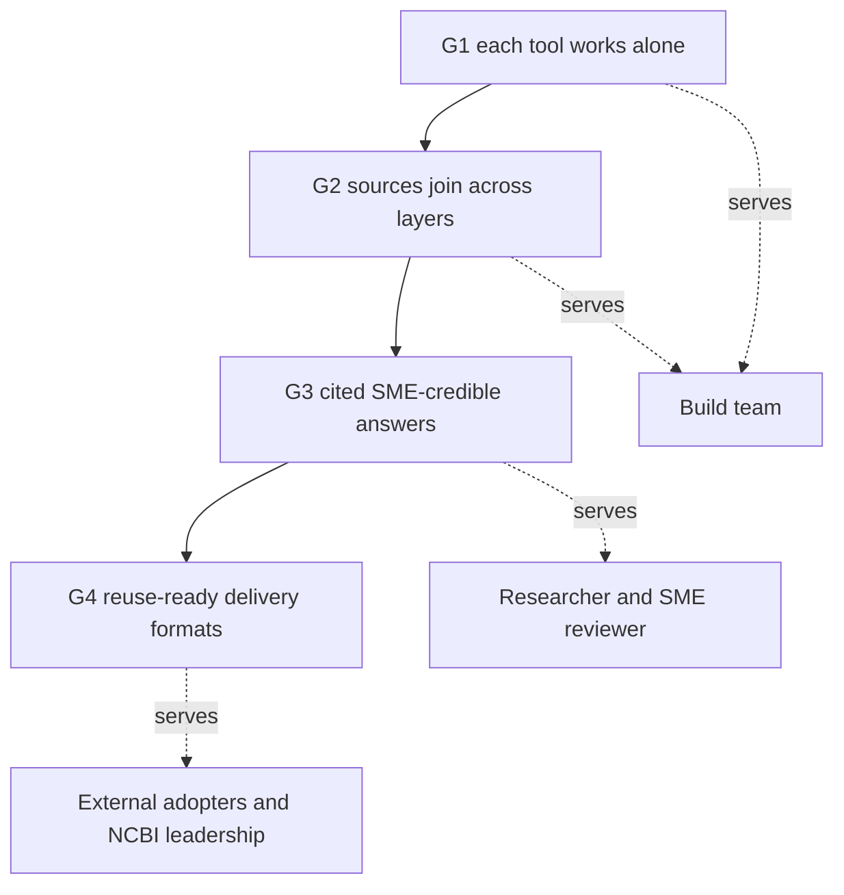
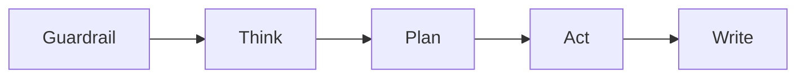

# System 3 product requirements

The single source of truth for what System 3 does, for whom, and how we measure success. Written for NCBI stakeholders who decide whether the wedge is real and worth backing, and inherited by the build team as the build contract.

Status: locked (2026-07-22). Inputs: the Phase 1 synthesis (`requirements/phase_1/Phase_1_synthesis.md`) and the Phase 2 evaluation playbook (`requirements/Evaluation_playbook.md`). Last updated: 2026-07-22.

## Table of contents

- [Problem statement and the wedge](#problem-statement-and-the-wedge)
- [Outcomes and stakeholders](#outcomes-and-stakeholders)
- [Success metrics](#success-metrics)
- [Users and personas](#users-and-personas)
- [Competency questions as acceptance criteria](#competency-questions-as-acceptance-criteria)
- [Core user flows](#core-user-flows)
- [UI experience](#ui-experience)
- [Cost-control UX](#cost-control-ux)
- [Edge cases and failure states](#edge-cases-and-failure-states)
- [Guardrails](#guardrails)
- [Security requirements](#security-requirements)
- [Accessibility and compliance](#accessibility-and-compliance)
- [Delivery formats](#delivery-formats)
- [Out of scope for v1](#out-of-scope-for-v1)
- [Open items and future iterations](#open-items-and-future-iterations)

## Problem statement and the wedge

A biomedical researcher with a real question, such as what is known about a variant, an isolate, or a paper's linked data, has to cross several NCBI databases by hand: Gene, then ClinVar, then PubMed, then dbVar, then MedGen, copying identifiers between them. It is slow, it is easy to miss a link, and the result is not assembled anywhere.

A general AI tool answers instantly, but it answers from training priors. For biomedical work that is worse than slow, it is untrustworthy: the tool produces a fluent answer with citations that are often wrong or invented, and the researcher cannot tell which. A confident wrong answer is more dangerous than no answer.

System 3 is the wedge between those two failures. A user asks one plain-language question. The agent queries across three data layers (the knowledge graph, live NCBI APIs, and enrichment APIs) through hard guardrails, and returns a cited answer where every claim links to a real, resolvable source record. It delivers cited, cross-database synthesis that a general tool cannot reach or cite.

The one belief this document has to earn: System 3 delivers cited, cross-database biomedical answers that a general tool cannot produce, serving the named outcomes below, and here is exactly what v1 does and how we will know it worked.

The differentiation anchor is data plus provenance: cited, deterministic, cross-database synthesis over the NCBI graph and APIs. Per-user personalization compounds the moat because it fuses with that data and the user's own cited research history, but personalization alone is copyable and is not the differentiator.

The NCBI strategic directives (the FY26 guiding principles, Gold Standard Science, and the AI Action Plan) are fixed constraints on this product, not positioning: simplify discovery, reproducibility and transparency, and AI-ready datasets.

## Outcomes and stakeholders

This section is the logic model. System 3's success is defined by Anne's milestone ladder: four climbing gates, each a go/no-go that serves a named stakeholder. A gate does not open until the one below it holds.

- G1, each tool works alone: every tool (cypher_query, the NCBI API tools, the enrichment tools) returns correct, typed, cited results on its own. Objective and machine-checkable. Serves the build team.
- G2, sources join across the three layers: the agent joins Layer 1, Layer 2, and Layer 3 into one answer, preserving identifiers across the join. Objective and machine-checkable. Serves the build team.
- G3, cited, SME-credible scientific answers: a subject-matter expert reads the assembled answer and finds it credible, cited, and free of overclaim. Human-judged. Serves the researcher and the SME reviewer. This is the gate the wedge lives or dies on.
- G4, reuse-ready delivery formats: the same answer is reachable and reusable through the delivery formats (web, API, MCP), so others can build on it. External. Serves external adopters and NCBI leadership.

A fifth success test sits beside the ladder: Bart's leadership-explainability test, whether a leader can understand what the system does and why to trust it. It is served by the strategic memo, not by a code gate, so it is a PRD-adjacent outcome, not an acceptance criterion here.

The adoption outcome that ties these together: System 3 becomes the researcher's default first stop for a biomedical question. Habit is the goal, and trust is the engine that forms it, since every question returns a verifiably cited answer faster than navigating five databases by hand.

## Success metrics

Because evaluation is a staged process, success is stakeholder-segmented, not one blended number. Each gate carries its own metric and its own reader. This section names the metric and the stakeholder for each gate. The operational thresholds, the per-question gate mapping, and the scoring rubric live in the evaluation playbook, so this PRD does not reopen to tune a number.

| Gate | Metric | Reader | Where the numbers live |
|------|--------|--------|------------------------|
| G1 | Per-tool correctness and provenance (valid output, cited source) | Build team | Playbook: the cypher_query, citation, and guardrail acceptance criteria |
| G2 | Cross-layer join correctness, identifiers preserved | Build team | Playbook: the competency-question acceptance criteria |
| G3 | Cited, SME-credible answers, scored on the 8-point rubric with cite-or-refuse enforced | Researcher and SME reviewer | Playbook: the offline eval gate, rubric, and pass@k/pass^k targets |
| G4 | The answer is reachable and reusable through each delivery format | External adopters, NCBI leadership | Playbook and tech spec |

Two product-level outcome metrics sit above the gates:

- Adoption: return-rate-per-question-occasion, not daily-active use. Researchers ask episodically, so a daily-active metric would punish the system for a cadence it does not control.
- Trust: the share of answers that pass cite-or-refuse (every claim tied to a resolvable source, or an honest refusal). This is the trust moat measured directly.

The offline competency-question gate runs before any answer-generation feature ships. The online feedback loop runs once the system is live and grows the question set from real usage. Both are defined in the playbook.

## Users and personas

The input stays chat-simple for every persona: one plain-language question, no forms, no query syntax, no database picking. Eleven personas were identified; the wedge-strong ones drive v1.

Wedge-strong (v1 priority):

- Literature researchers (1)
- Sequence data users (2)
- Geneticists (3)
- Bioinformaticians (4)
- Epidemiologists and public health (6): the strongest wedge persona in the Jira and roadmap usage evidence, so lead with it.
- Cross-database journey users (10)
- AI agents and MCP and LLM consumers (11): an emerging 2025-2026 signal.

Served with a clinical-safety boundary: clinicians and genetic counselors (8). The system assembles cited evidence for them and never renders a verdict (see guardrails).

Weaker for v1, covered but not prioritized: structural biologists (5), drug discovery and pharma (7), educators and students (9).

The experience model is a research assistant, not a chatbot. "Not a chatbot" is carried by the answer format (a structured, provenance-forward research brief) and the surrounding workspace (saved queries and suggested competency questions), not by the input box.

## Competency questions as acceptance criteria

The seven v1 must-pass competency questions are the acceptance criteria for the wedge. They are the offline eval set. All pass the moat bar (provenance and determinism gates, plus the no-general-tool-equivalent ranking dimension) and run without compute tools. The full set, wedge types, personas, and the fast-follow and expansion sets are in the evaluation playbook.

| # | Acceptance question (short) | Wedge type |
|---|-----------------------------|-----------|
| Q1 | CNV region to cited ACMG-relevant evidence (dbVar, ClinVar, genes, OMIM, Variation Viewer). Assembles evidence, no classification. | gene-variant-literature |
| Q3 | BRCA1 to Gene, PubMed, ClinVar, GTR, MedGen in one answer. | gene-variant-literature |
| Q4 | Disease phrase to routed cross-database queries. | gene-variant-literature |
| Q5 | Salmonella isolate to SNP cluster, AMR genes, BioSample, neighbors within 5 SNPs. | pathogen-sequence-outbreak |
| Q6 | Natural-language SRA metadata search with match rationale. | pathogen-sequence-outbreak |
| Q8 | PMID to linked SRA, BioProject, GEO, assembly, PubChem, marking direct, inferred, or absent. | paper-data-tool |
| Q10 | BioProject to BioSamples, SRA runs, assembly bundle with retrieval path. | paper-data-tool |

Tier 1 is a must-pass gate for v1: an answer-generation feature ships only when the seven meet their playbook targets. The seven are the eval gate, not the menu; the system is a general agent that answers far more, and cite-or-refuse protects everything outside the seven at runtime.

Q1 carries a feasibility flag: if the Phase 4 coordinate-range check fails, Q1 moves to the fast-follow set and the v1 must-pass set is six.

## Core user flows

Every query follows one five-step agent loop. Each step has one job.

- Guardrail: validate the input, reject prompt injection, block off-topic and medical-advice requests, check rate and cost caps. A cheap non-LLM pre-filter runs first.
- Think: classify the query (lookup, single-hop, multi-hop, aggregate, exploratory) and identify the data layers needed. Resolve free-text terms to CURIEs, and ask one targeted clarifying question on ambiguity before querying.
- Plan: decompose into tool calls and select the model tier per step, producing a structured, database-neutral plan (query class, target entities, tool list). The agent never writes Cypher directly.
- Act: execute the tool calls, independent ones in parallel. The cypher_query tool generates and validates Cypher inside itself. Layer 1 for speed, Layer 2 for correction, Layer 3 for enrichment.
- Write: synthesize a cited research brief. The model writes narrative with placeholder markers; the harness maps each marker to a verified source and strips any it cannot verify.

The user sees one orchestrator carrying a named-scientist persona (a historical biomedical scientist), with the reasoning streamed as a curated named-step narrative.

A representative flow, Q3: the user types "what's known about BRCA1." Guardrail passes it. Think classifies it as a multi-hop cross-database assembly and resolves BRCA1 to its Gene CURIE. Plan lists the Gene, PubMed, ClinVar, GTR, and MedGen lookups. Act runs them, graph-first with API correction. Write returns one brief: the gene record, recent reviews, pathogenic variants, clinical tests, and linked conditions, each line carrying a resolvable citation.

## UI experience

The surface is a workspace home, not a bare chat box: a plain-language input, saved queries, and suggested competency questions. The answer is a structured, provenance-forward research brief.

- Streaming by default: the agent's Think and Plan reasoning streams live as a curated named-step narrative, so the user watches the query take shape. Time-to-first-token is under one second. Typed SSE events drive it (status, tool_result, token, citation, done).
- Stop button throughout: the user can abort a query that is heading the wrong way, at any point in the loop.
- Show-full-reasoning expander: an optional expander reveals the raw chain of reasoning for a user who wants it, kept out of the default view.
- Citation chips inline: citations render as chips as the model references sources, each linking to the resolvable source record. A citation the harness cannot verify never appears.
- The named-scientist persona stays subtle and serious, so it never undercuts the provenance-forward positioning.
- Component base: adapt the reference build's QueryPipeline stepper, ChatMode shell, results table, feedback buttons, and session-gated medical-disclaimer modal. Streaming is net-new work, since the reference frontend has none.

Per-user personalization is part of v1: saved queries and feedback-driven personalization, fused with the user's own cited research history. It is the heaviest v1 item and the primary descope candidate if the build runs long.

## Cost-control UX

Cost caps are safety-critical and enforced in the runtime layer. The user sees them as clear limits, never as a silent failure.

- Per-query cap (starter value $0.10): if a single query would exceed it, the loop stops and the user sees a partial cited result plus a note that the query hit its budget.
- Per-user daily cap (starter value 100 queries per day): when reached, new queries are declined for the day with a clear message and a reset time.
- System-wide daily cap (starter value $10 per day): when reached, the system pauses accepting new queries and says so.
- Per-step timeouts inherit the latency budgets (lookup 5s, single-hop 10s, multi-hop 30s, deep research 2 minutes). On timeout, the system synthesizes from partial results and explains what timed out. The user never sees a blank screen.

The starter cap values are tunable in Phase 4. Changing a cap value is a decision that requires explicit approval.

## Edge cases and failure states

The system never shows nothing. Every failure resolves to a cited partial answer or an honest, specific statement of what happened.

- Empty retrieval: the agent returns "I could not find information on this" and stops. It never answers from priors. This refusal path is a tested path.
- Partial-layer failure: if one layer fails, the agent synthesizes from whatever responded and explains the gap. Graceful degradation is mandatory.
- Suspect Layer 1 data (stale snapshot, corrupted field, a NamedThing stub): Layer 2 is the authoritative fallback and corrects it.
- Ambiguous query: the agent asks one targeted clarifying question before querying, rather than guessing.
- Guardrail rejection: an off-topic, medical-advice, or injection attempt is refused and, where sensible, redirected to what the system can do.
- Timeout: partial synthesis plus an explanation of what timed out, per the latency budgets.
- Large result set: tool results are compressed before re-injection into the agent context, so a 500-row Cypher result never floods context or induces hallucination of the remainder.
- A citation that cannot be verified: the harness strips the marker before the user sees it. A claim that loses its citation does not ship as an uncited sentence.

## Guardrails

Guardrails are hard constraints, non-negotiable, and several are enforced structurally rather than by instruction.

- Assemble the evidence, never the verdict: the system reports cited evidence and clinical significance from source records. It never gives personal medical advice, diagnosis, treatment, a pathogenicity classification, or a variant prioritization. A human decides; the system assembles and cites. This is the forbidden-output boundary.
- Cite-or-refuse: every claim ties to a specific retrieved source, or the system refuses and stops.
- Read-only data access: Layer 1 is queried through a connection-level read-only role (kg_reader), and read-only is enforced twice independently (the Cypher validator and the database-client layer). No prompt can induce a write.
- Off-topic and non-biomedical queries are refused and redirected. A cheap pre-LLM guardrail (a biomedical allowlist, a medical-advice block, an off-topic block) runs before any model call.
- Prompt injection is rejected at the Guardrail, and the natural-language-to-Cypher separation means injected text cannot become a query.
- Risk-tiered grounding: low-risk answers (factual lookups, cross-database assembly) enforce standard cite-or-refuse. Higher-stakes answers (clinical-adjacent evidence, mechanistic claims) additionally require a citation-substantiation check (the cited passage must support the specific claim) and a cross-source triangulation gate, surfaced to the user through an answer, flag, or ask trust signal.

## Security requirements

Trust is the product, so the trust-guardrails are in v1 while enterprise security defers.

- In v1: read-only enforcement, provenance integrity, cost caps and timeouts, and prompt-injection defense.
- Treat all retrieved content as untrusted: an NCBI record field, a PubMed abstract, or an enrichment payload is data for the Write step to cite, never an instruction to act on.
- Secrets in environment variables or a secrets manager only, never in code, prompts, logs, or generated docs. This covers the Hetzner connection string, NCBI API keys, and provider keys.
- No PII to the LLM: user-account PII from the auth service is never sent to an external model. There is no PHI in the system.
- Least privilege for every tool and agent, with schema-validated tool input and output at each hop of the loop.
- Every Layer 2 and Layer 3 access is logged with its authorization.
- Basic user authentication returns for v1, because the personalization investment loop needs accounts.
- Deferred to the production track: enterprise IAM roles, session expiry, and access review.

## Accessibility and compliance

- v1 (Track 1 prototype): reasonable-effort accessibility, semantic HTML and keyboard navigation, with no formal audit.
- Deferred to the production and v1-official track: full Section 508 and WCAG 2.1 AA conformance with a formal audit. Section 508 is not optional for NIH-adjacent production work, so the prototype is built toward it without blocking on it.

## Delivery formats

Five formats are in scope, so the same cited answer is reusable, which is the G4 outcome.

- Web UI: the primary surface (the workspace and streaming research brief above).
- GraphQL API: structured programmatic access to nested biomedical data, served via Strawberry from the same FastAPI app with shared auth and shared tools.
- MCP server: System 3 exposed as an MCP server so other agents can consume it (persona 11). MCP is an outbound delivery format that wraps the same Python tools, not an inbound tool architecture.
- KGX export: scoped to the existing Hetzner graph, not a full graph export.
- CLI agent.

The REST plus SSE surface carries the chat streaming; GraphQL carries structured access. Both share one auth and one tool set.

## Out of scope for v1

- Compute tools: no BLAST, no sequence-similarity search, no VCF ingestion. The three execution-heavy questions (Q2, Q7, Q9) are the fast-follow set.
- Segmental-duplication overlap for Q1: deferred to the fast-follow with a UCSC source.
- External non-NCBI knowledge-graph federation: v1 federation is exactly the three data layers.
- Model distillation (fine-tuning a smaller student model): a v2 optimization, deferred until query logs stabilize.
- Fusion and ensemble model panels: a v2 triggered-escalation lever.
- The automated mining half of the online feedback loop: v1 ships capture plus manual review plus hand-promotion.
- Full Section 508 and WCAG audit, and enterprise security (IAM, session expiry, access review): the production track.
- Sub-query decomposition for deep research: the planned upgrade, triggered by a failure rate above 20 percent on that query class.

## Open items and future iterations

- Specific model per tier: the multi-model harness has three tiers (guard for validation, plan for decomposition and tool selection, synth for final synthesis) routed by LiteLLM over OpenRouter, and is specified in the tech spec. The harness pattern is locked now; which model fills each tier is decided in Phase 6 by model-bench and golden-dataset ablation, and is a config swap.
- Q1 interval-overlap semantics and the UCSC segmental-duplication source: verified in the Phase 4 Step 4.0 API deep dive.
- Acceptable-staleness threshold (when Layer 1 is too old to trust) and the concurrency queue strategy: deferred to the tech spec.
- Cost-cap final values: tunable in Phase 4 from the starter values above.
- Domain sign-off for the golden fixtures on clinical and human-variation questions: a Phase 4 process item.
- The provenance type's four added fields (evidence-kind, assertion-confidence, population and ancestry context, license) and the answer, flag, ask trust signal: specified in the tech spec.
- Doc-hygiene: reconcile the stale "eight agents" framing in the upstream innovation proposal and vision-of-success source docs so it does not leak into downstream materials.
- This PRD, the tech spec, and the strategic memo get one planned reconciliation from what the Phase 6 prototype teaches (Step 6.2), then lock at v1.
