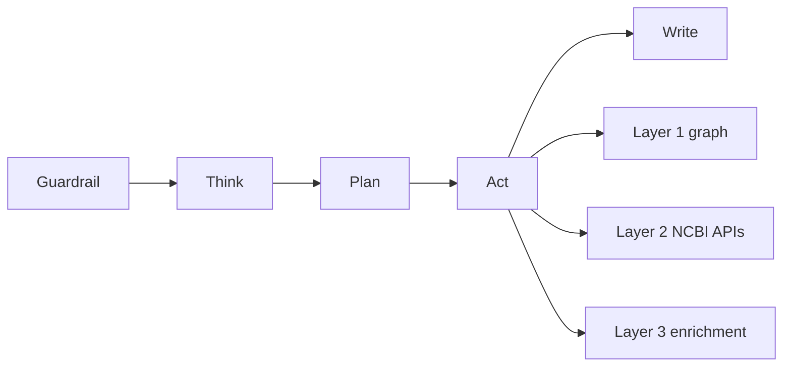

# System 3 strategic memo

A one-read orientation to System 3: what it is, why it is different, and what v1 builds. Distilled from the locked PRD (`requirements/PRD.md`) and the locked technical specification (`requirements/Technical_specification.md`). Written for a collaborator, or future-me, to hold the whole system in your head at a glance. This is a memo, read top to bottom. It is updated once after the Phase 6 prototype. Last updated: 2026-07-25.

## Table of contents

- [What it is](#what-it-is)
- [Why it exists](#why-it-exists)
- [How it works](#how-it-works)
- [What v1 delivers](#what-v1-delivers)
- [How we know it works](#how-we-know-it-works)
- [Where it goes](#where-it-goes)

## What it is

System 3 is a biomedical research partner. You ask a plain-language question, and it returns a cited, cross-database answer where every claim links back to a real, resolvable NCBI source record. It reaches across the NCBI knowledge graph and the live NCBI and enrichment APIs, through hard guardrails, and assembles what a researcher would otherwise gather by hand. It delivers cited, cross-database synthesis that a general AI tool cannot produce or cite.

## Why it exists

It sits between two failures:

- Manual database-hopping: a researcher crosses Gene, then ClinVar, then PubMed, then dbVar, then MedGen by hand, copying identifiers between them. It is slow, it is easy to miss a link, and the result is never assembled in one place.
- Confident-but-wrong AI: a general tool answers instantly but from training priors, with citations that are often invented. For biomedical work a confident wrong answer is more dangerous than no answer.

The moat is data plus provenance: cited, deterministic, cross-database synthesis over the NCBI graph and APIs. That is the one thing a general tool cannot copy.

## How it works

Every query runs one five-step agent loop and reaches three data layers.

- The agent loop: Guardrail validates and blocks unsafe input, Think classifies the query, Plan decomposes it into tool calls, Act runs them, Write synthesizes a cited answer.
- The three layers: Layer 1 is the knowledge graph (115M nodes, 693M edges), the fast connected map across databases; Layer 2 is the live NCBI APIs, the source of truth for current values; Layer 3 is the enrichment APIs (PubTator3, LitVar2, ClinicalTrials.gov).
- One core, many surfaces: a single agent core emits one typed event stream, and six thin adapters render it (Web UI, REST plus SSE, GraphQL, MCP server, KGX export, CLI).
- Cost and safety by construction: strong models plan and write while cheap models fetch and read, and the model never sees a raw untrusted payload. Every claim is cite-or-refuse: it ties to a real source, or the system says it could not find the answer and stops.

## What v1 delivers

- Seven flagship questions: the moat-seven competency questions v1 must answer, from a CNV region to cited ACMG-relevant evidence, to a Salmonella isolate to its outbreak cluster and resistance genes, to a paper to all of its linked data.
- Seven tools: `cypher_query` for the graph, `ncbi_efetch` and `ncbi_dbsnp` for NCBI records and variants, `pubtator_annotate` and `litvar2_lookup` for literature enrichment, and `pathogen_detection` and `clinicaltrials_search` for the outbreak and clinical-trial paths.
- Two hard guarantees: cite-or-refuse, so no claim ships uncited; and assemble the evidence, never the verdict, so the system cites clinical evidence but never diagnoses, classifies pathogenicity, or prioritizes a variant. A human decides.

## How we know it works

- The moat test selects the questions: a candidate qualifies only if no strong general tool answers it with real, resolvable citations. That keeps the bar honest against 2026 tools.
- An offline eval gate runs before any answer feature ships: an 8-point rubric with cite-or-refuse enforced, scored for reliability, not a single lucky pass.
- An online feedback loop grows the question set from real usage, turning what people actually ask into better routing.
- Anne's milestone ladder frames success as four climbing gates: each tool works alone, sources join across the layers, answers are cited and credible to a subject-matter expert, and the result is reusable through every delivery format.

## Where it goes

The end state is a research partner, not a chatbot. The work that once took a researcher 500 sources over weeks becomes a 30-minute cited conversation that feeds the next experiment and drops into a paper with its references already attached. Session memory holds the research arc, and per-user context compounds the moat, while the cited data underneath stays the real differentiator.

Status: the PRD locked 2026-07-22, the technical specification locked 2026-07-25. The build is next.
