# System 3 technical specification

The build blueprint for System 3. It translates the locked PRD and the Phase 4 core-architecture decisions into implementation decisions and a build order.

Status: locked (2026-07-25). Each section was drafted to implementation level by a parallel drafting pass, then Step 4.3 reconciled the open items: the citation, cost, and error event schemas are now unified against the canonical Section 2 and Section 9 definitions, the tool roster is complete at seven tools, and the delivery surfaces match the locked PRD. The five confirmed decisions are applied throughout: the Layer 1 staleness threshold (Section 7), the provenance type's four added fields (Section 9), the online A/B mechanism (Section 18), the concurrency queue strategy (Section 21), and the Pathogen Detection and ClinicalTrials.gov tool-roster resolution, each its own named tool rather than an ncbi_efetch action (Section 6). This is the user's own sign-off, given 2026-07-25. It references the evaluation playbook (requirements/Evaluation_playbook.md) and the eval-harness and dev-standards skills rather than restating them.

Traceability: every section traces back to a PRD outcome and to the core-architecture decisions in DECISIONS.md (Decisions A, C, D, E, F, G, and the cost amendment, all 2026-07-25) and to the verified API capability sheet (requirements/phase_4/API_capability_sheet.md).

## Table of contents

- [How to read this](#how-to-read-this)
- [1. System architecture overview](#1-system-architecture-overview)
- [2. The core service contract](#2-the-core-service-contract)
- [3. Model orchestration and the harness](#3-model-orchestration-and-the-harness)
- [4. Caching](#4-caching)
- [5. Three-layer data access](#5-three-layer-data-access)
- [6. Tool specifications](#6-tool-specifications)
- [7. Data freshness and conflict resolution](#7-data-freshness-and-conflict-resolution)
- [8. Synthesis and the trust signal](#8-synthesis-and-the-trust-signal)
- [9. Provenance and citation model](#9-provenance-and-citation-model)
- [10. Guardrail implementation](#10-guardrail-implementation)
- [11. Security implementation](#11-security-implementation)
- [12. Frontend architecture](#12-frontend-architecture)
- [13. Delivery surfaces](#13-delivery-surfaces)
- [14. Personalization and memory](#14-personalization-and-memory)
- [15. Auth and user data model](#15-auth-and-user-data-model)
- [16. Feedback loop pipeline](#16-feedback-loop-pipeline)
- [17. Competency question routing](#17-competency-question-routing)
- [18. Model selection and the A/B mechanism](#18-model-selection-and-the-ab-mechanism)
- [19. Cost control](#19-cost-control)
- [20. Observability](#20-observability)
- [21. Rate limiting and concurrency](#21-rate-limiting-and-concurrency)
- [22. Edge cases and failure states](#22-edge-cases-and-failure-states)
- [23. Testing strategy](#23-testing-strategy)
- [24. Deployment](#24-deployment)
- [25. Build order](#25-build-order)
- [Parked-thread resolution index](#parked-thread-resolution-index)

## How to read this

The spine is one agent core that exposes a single typed event stream. Six delivery surfaces sit over that core, per the locked PRD: four subscribe to the stream directly (web UI, REST plus SSE API, MCP server, CLI), and two more (GraphQL API, KGX export) reuse the same tools and data layers through a request/response or batch shape instead, since a typed query or a static export is a different shape of access than a query-time cited event stream. Retrieval feeds structured results into the core, the Write step synthesizes and grounds them, and the stream carries the cited result out to whichever streaming surface asked.

The sections group into six parts:

- Sections 1 to 4: the core (architecture, contract, harness, caching).
- Sections 5 to 7: data and tools.
- Sections 8 to 11: answer quality and trust.
- Sections 12 to 14: the surfaces and experience.
- Sections 15 to 21: data, learning, and operations.
- Sections 22 to 25: quality and delivery.

## 1. System architecture overview

System 3 is one agent core wrapped in thin, surface-specific adapters. The core owns the five-step loop, the three-layer retrieval model, and the single typed contract described in Section 2. Every delivery surface subscribes to that contract; none of them re-implement agent logic. This is Decision A (2026-07-25, the core service contract) and the Step 4.1 architecture frame decision (2026-07-25): build from the agent core outward, not from a specific surface inward.

### 1.1 The one-core, six-surface model

| Component | Role | Owned by |
|-----------|------|----------|
| Agent core | The Guardrail, Think, Plan, Act, Write loop. Exposes `run(query, context)`, Section 2. | `core/` |
| Harness | Cross-cutting: model tier resolution, cost accounting, per-step timeouts, the coordinator-worker split, cache hookup. | `harness/`, Section 3 |
| Tool layer | The seven tools (`cypher_query`, `ncbi_efetch`, `ncbi_dbsnp`, `pubtator_annotate`, `litvar2_lookup`, `pathogen_detection`, `clinicaltrials_search`), each a data source adapter. | `tools/`, Section 6 |
| Three data layers | Layer 1 graph, Layer 2 NCBI APIs, Layer 3 enrichment APIs. | Section 5 |
| Delivery surfaces, streaming | Four adapters that subscribe to the event stream directly: web UI, REST plus SSE API, MCP server, CLI. | Sections 12 to 13 |
| Delivery surfaces, structured | Two more surfaces the locked PRD requires, reusing the same tools and data layers without subscribing to the live stream: GraphQL API (nested biomedical data access) and KGX export (graph-only bulk export). A typed query or a static export is a different shape of access than a query-time cited event stream. | Section 1.1 below, Section 24, Section 25 |
| User data store | PostgreSQL: auth, the `interactions` table, `cq_candidates`. Separate from the read-only graph. | Section 15 |
| Cache | Redis for Layer 2 and Layer 3 responses; provider-side prompt caching for LLM calls. | Section 4 |
| Observability | LangSmith (per-run traces), PostHog (behavioral analytics). | Section 20 |

The locked PRD's five v1 delivery formats plus the REST-plus-SSE transport give six named surfaces in total: web UI, REST plus SSE API, GraphQL API, MCP server, KGX export, and CLI (Decision A's core-service-contract decision and the 2026-05-07 all-five-formats decision, read together). Four of the six (web UI, REST plus SSE, MCP, CLI) are the streaming adapters this document's introduction refers to. GraphQL and KGX export are the two structured, non-streaming surfaces built on the same underlying tools and layers; Decision 4 (2026-05-07) describes GraphQL explicitly as "structured programmatic access to nested biomedical data," a request/response shape, not a cited-event-stream shape, and KGX export is a batch job against Layer 1, not a live adapter at all. The operator cost view (Section 13.4) is a role-gated mode of the REST plus SSE adapter, not a seventh surface.

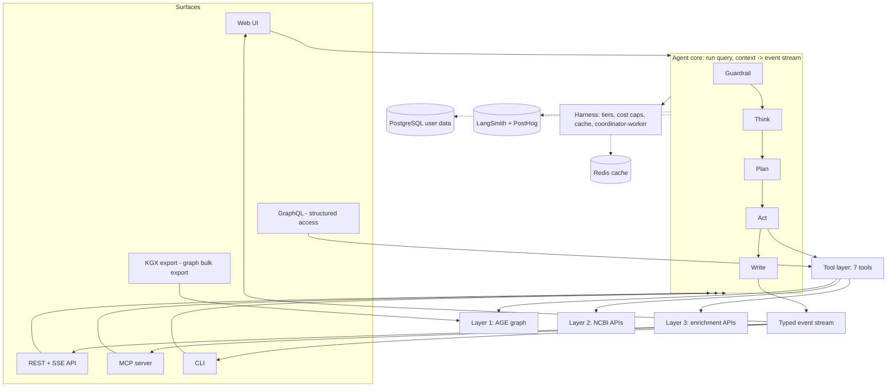

### 1.2 The agent core: the five-step loop

Each step has exactly one job. No step reaches past its neighbor.

| Step | Job | Input | Output |
|------|-----|-------|--------|
| Guardrail | Validate input, reject prompt injection and off-topic or medical-advice requests, check rate and cost pre-caps. A cheap non-LLM pre-filter runs before any model call. | Raw `Query` | A validated `Query` or a `guard` event with rejection reason |
| Think | Classify query shape (lookup, single-hop, multi-hop, aggregate, exploratory), resolve free-text terms to CURIEs, ask one clarifying question on ambiguity. | Validated `Query` | Query class, resolved entities, or a clarifying question |
| Plan | Decompose into tool calls, select the model tier per step, produce a structured database-neutral plan. Never writes Cypher. | Query class, entities | Tool call list |
| Act | Execute tool calls, independent ones in parallel. `cypher_query` generates and validates its own Cypher internally. Layer 1 for speed, Layer 2 for correction, Layer 3 for enrichment. | Tool call list | Structured `tool_result` findings |
| Write | Synthesize a cited research brief from structured findings only. Narrative with placeholder markers; the harness binds and verifies every marker. | Structured findings | Narrative plus citations plus a trust signal |


Tier assignment per step (which model tier runs which step) is Section 3's concern; this section only fixes each step's job and boundary.

### 1.3 The three data layers

| Layer | Contents | Latency | Freshness | Reached by |
|-------|----------|---------|-----------|------------|
| Layer 1 | AGE knowledge graph on Hetzner, 115M nodes, 693M edges, 11 concept labels, 14 edge predicates, from 5 NCBI databases | Sub-10ms typed queries | Periodic snapshot | `cypher_query`, Section 5 |
| Layer 2 | Live NCBI APIs: E-utilities, Datasets API v2, Variation Services, PubChem | 100 to 500ms | Always current | `ncbi_efetch`, `ncbi_dbsnp`, Section 5 |
| Layer 3 | Enrichment APIs: PubTator3, LitVar2, LitSense, ClinicalTrials.gov | 200ms to 2s | Always current | `pubtator_annotate`, `litvar2_lookup`, Section 5 |

Layer priority on disagreement, staleness thresholds, and the transport used to reach Layer 1 (Decision D) are Section 5's and Section 7's scope. This section only fixes the three-layer split and the one-tool-one-layer discipline (system-design-patterns rule 3): a tool call is scoped to exactly one layer, never mixed.

### 1.4 Request path: from surface to core to retrieval and back

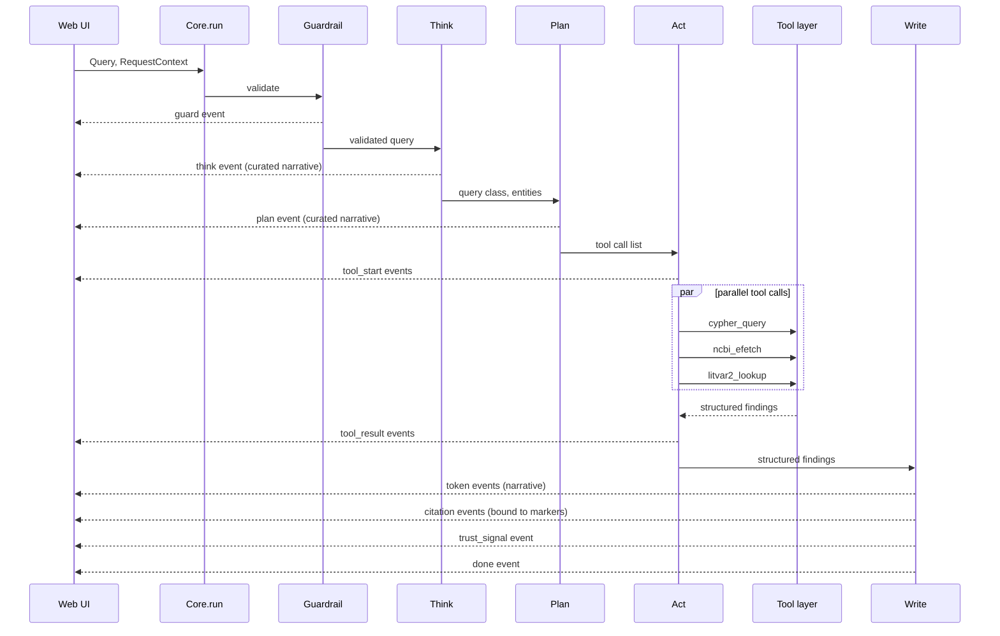

Every arrow back to the surface is a typed event from Section 2's taxonomy. The surface never sees a raw tool payload, a raw LLM completion, or raw chain-of-thought; it only ever consumes the event stream.

### 1.5 Component boundaries

| Boundary | What crosses | What never crosses |
|----------|--------------|---------------------|
| Surface to Core | A `Query` plus `RequestContext` | Anything surface-specific (HTTP headers, MCP protocol frames) |
| Guardrail to the rest of the loop | A validated `Query` | A rejected query. Rejection stops the loop at a `guard` event. |
| Think or Plan to Act | A structured plan (query class, target entities, tool list) | Raw Cypher. The agent never writes Cypher; `cypher_query` compiles it internally (Section 5, Section 6). |
| Act to Write (Synth tier) | Structured `tool_result` findings, reader-processed where the payload was untrusted free text | A raw API payload, a raw abstract, a raw record body (Decision C, Section 3, Section 11) |
| Write to Core output | Narrative plus verified citation bindings | An unbound citation marker. The harness strips any marker it cannot verify (Decision A companion rule, Section 8). |
| Core to Surface | The versioned event stream (Section 2) | Raw chain-of-thought. Reasoning is always a curated plan-step narrative (Decision A). |
| Harness to everything | Cost accounting, timeouts, tier resolution, cache | Direct LLM or tool calls issued outside the harness's accounting path |

### 1.6 Target module layout (Phase 6 build)

`src/system_03_search_agent/` currently holds only a package stub. The build-phase layout this tech spec targets:

```
src/system_03_search_agent/
    core/            # LangGraph graph: the 5-step loop, run() entrypoint
    contracts/        # Pydantic event models and JSONSchemas (Section 2)
    harness/          # Tiers, cost caps, timeouts, coordinator-worker, cache hooks (Section 3, 4)
    tools/            # cypher_query, ncbi_efetch, ncbi_dbsnp, pubtator_annotate, litvar2_lookup, pathogen_detection, clinicaltrials_search
    adapters/
        web_sse/       # FastAPI + SSE (Section 12, 13)
        graphql/       # Strawberry schema over the same tools
        mcp/           # MCP server, outbound-only (Section 13)
        cli/           # Thin REST client (Section 13)
    data/             # Postgres models: auth, interactions, cq_candidates (Section 15)
```

This layout is descriptive of the build target, not a decision requiring sign-off; it follows directly from CLAUDE.md's existing "Tools live in `system_03_search_agent/tools/`" convention and Decision A's one-core-many-adapters shape.

## 2. The core service contract

Decision A (2026-07-25) locks the shape every surface builds against: one interface, one versioned event stream, curated reasoning only. This section specifies that contract at implementation level: the function signature, the request models, the full event taxonomy, citation binding, versioning, and which surface consumes which event.

### 2.1 The `run()` interface

```python
async def run(query: Query, context: RequestContext) -> AsyncIterator[Event]:
    """The single internal interface every surface calls.

    Depends on:
        - system_03_search_agent.harness (tier resolution, cost caps, cache)
        - system_03_search_agent.contracts.events (the Event envelope)

    Never returns a bare string or a raw model completion. Every unit of
    output is a typed Event from the taxonomy in Section 2.3.
    """
```

Request models, both Pydantic, both schema-validated at the FastAPI boundary per production-standards:

```python
class Query(BaseModel):
    text: str = Field(..., max_length=2000)
    session_id: str = Field(..., max_length=64)
    trace_id: str = Field(..., max_length=64)
    user_id: str | None = Field(None, max_length=64)
    audience_depth: Literal["clinical_brief", "researcher", "deep_technical"] = "researcher"

class RequestContext(BaseModel):
    surface: Literal["web_ui", "rest_sse", "mcp", "cli"]
    session_memory: SessionMemorySummary | None = None  # bounded running summary, Section 14
    operator_mode: bool = False  # gates cost-event visibility, Section 2.7 and Section 19
```

`audience_depth` is the explicit personalization control from Decision F (Section 14); `operator_mode` is the builder-only flag the cost amendment introduces (Section 2.7).

### 2.2 The event envelope

Every item the stream yields is one envelope. `type` discriminates the payload shape.

```json
{
  "type": "object",
  "required": ["type", "version", "trace_id", "seq", "ts", "payload"],
  "properties": {
    "type": {
      "enum": ["guard", "think", "plan", "tool_start", "tool_result", "token",
                "citation", "trust_signal", "cost", "error", "done"]
    },
    "version": { "const": "v1" },
    "trace_id": { "type": "string", "maxLength": 64 },
    "seq": { "type": "integer", "minimum": 0 },
    "ts": { "type": "string", "format": "date-time" },
    "payload": { "type": "object" }
  }
}
```

`seq` is a monotonic per-trace counter so a surface can detect a dropped or reordered event over SSE reconnection. `trace_id` links every event in a run to its LangSmith trace (Section 20).

### 2.3 The event taxonomy

| Type | Emitted by | Purpose |
|------|-----------|---------|
| guard | Guardrail | Pass or reject the query before any further step runs |
| think | Think | Curated narrative of query classification and entity resolution |
| plan | Plan | Curated narrative of the tool call decomposition |
| tool_start | Act | A tool call has been dispatched |
| tool_result | Act | A tool call returned, structured and reader-processed where needed |
| token | Write | A streamed narrative token, may carry inline citation markers |
| citation | Write | A verified citation binding, the provenance type (Section 9) |
| trust_signal | Write | The deterministic answer, flag, ask, or refuse outcome (Section 8) |
| cost | Harness | Running per-query cost, builder-only |
| error | Any step | A recoverable or terminal failure (Section 22 owns the taxonomy) |
| done | Core | Terminal event: totals, elapsed time, trust outcome |

Payload shapes. This is the canonical definition for every event type. Sections 6, 8, 9, 12, 13, 19, and 22 elaborate on individual events but never restate a diverging shape; where one of those sections needs a richer walkthrough of a field, it cross-references the shape fixed here.

```json
// guard
{ "passed": true, "category": "ok", "reason": null }
// category enum: ok, off_topic, medical_advice, injection, rate_limited, cost_capped, write_seeking
// write_seeking added at Step 6.2 (finding F-3.0-01, additive per system-design-patterns rule 10):
// Section 10.5 requires refusing a write-seeking request, and until this reconciliation the enum
// named nothing write-shaped, so the refusal shipped under off_topic, the closest available member.

// think
{
  "narrative": "Resolving BRCA1 to its Gene CURIE",   // maxLength 500
  "query_class": "multi_hop",                          // lookup|single_hop|multi_hop|aggregate|exploratory
  "resolved_entities": [
    { "text": "BRCA1", "curie": "NCBIGene:672", "confidence": 0.98 }
  ],                                                    // maxItems 20
  "clarifying_question": null
}

// plan
{
  "narrative": "Querying Gene, PubMed, ClinVar, GTR, MedGen",  // maxLength 500
  "tool_calls": [
    { "tool": "cypher_query", "call_id": "c1", "layer": "layer_1_graph" },
    { "tool": "ncbi_efetch", "call_id": "c2", "layer": "layer_2_api" }
  ]                                                      // maxItems 20, tool enum pinned to the 7 registered tools
}

// tool_start / tool_result
{ "call_id": "c2", "tool": "ncbi_efetch", "layer": "layer_2_api", "status": "ok" }
// tool_result adds: "summary" (maxLength 1000), "result_count", "truncated"
// status enum: ok, empty, error (ties to the cite-or-refuse empty signal, Section 8)

// token
{ "text": "BRCA1 is a tumor suppressor gene", "marker_ids": ["c_1"] }

// citation, the canonical provenance type (full field-by-field rationale: Section 9.1)
{
  "citation_id": "c_1",
  "display_index": 1,
  "source": "NCBI Gene",
  "source_id": "672",
  "source_url": "https://www.ncbi.nlm.nih.gov/gene/672",
  "layer": "layer_1_graph",
  "field": "description",
  "claim_text": "BRCA1 is a tumor suppressor gene",
  "evidence_kind": "primary_assertion",
  "assertion_confidence": "asserted",
  "population_ancestry_context": null,
  "license": "public_domain_us_gov"
}
// layer enum: layer_1_graph | layer_2_api | layer_3_enrichment, used everywhere a layer field appears
// trust_signal is never a citation field. It is always its own separate event, below.
// host-pinned source_url regex: Section 9.3

// trust_signal
{ "outcome": "answer", "risk_tier": "low", "grounded": true, "triangulated": null }
// outcome enum: answer, flag, ask, refuse (Section 8's deterministic rule)

// cost (harness-emitted, builder-only, filtered from every end-user surface per Section 2.7)
{
  "query_cost_usd": 0.0234,
  "query_cap_usd": 0.10,
  "cap_fraction": 0.234,
  "model_tier": "guard"     // guard | plan | synth, maxLength 16
}
// query_cost_usd and cap_fraction are running totals for the active query, not deltas; full accounting rules: Section 19.3

// error, the canonical error shape (full taxonomy: Section 22.3)
{
  "fatal": false,
  "scope": "tool",                  // tool | step | run, maxLength 16
  "source": "ncbi_efetch",           // tool or layer name, maxLength 64
  "error_class": "transient",        // transient | recoverable | unexpected, maxLength 16
  "message": "ncbi_efetch timed out after 15s, retry with backoff",  // actionable text, maxLength 256
  "retry_after_s": 2
}
// a surface closes its stream on a fatal error, never on error_class alone: fatal is the one field every consumer branches on to decide whether the run has ended

// done
{ "total_cost_usd": 0.021, "total_tool_calls": 4, "elapsed_ms": 6200, "trust_outcome": "answer" }
```

Every string field carries `maxLength` and every array `maxItems`, per production-standards' multi-agent pipeline gate. `tool` fields are enums pinned to the seven registered tools, never a free string, so a malformed upstream payload cannot inject an unregistered tool name into the plan. `layer` fields, wherever they appear (`plan.tool_calls[].layer`, `tool_start.layer`, `tool_result.layer`, `citation.layer`), use the same three-value string enum, never an integer, so a consumer never has to branch on two different representations of the same three layers.

### 2.4 Inline citation binding

A `token` event's `marker_ids` array names zero or more citation ids that this token's text draws on. Each id must exactly match a `citation_id` already or subsequently emitted for the same `trace_id`. Binding is deterministic:

- The harness assigns a `citation_id` only after it verifies the underlying `tool_result` finding is real (source exists, `source_url` passes the host-pinned regex, Section 9).
- A token that references an unbound or unverifiable marker has that marker stripped before the token event is emitted. The user never sees a citation the harness cannot verify (Decision A's citation companion rule, reinforced by the AI answer grounding gate in production-standards).
- Matching is exact-string on the `citation_id`, never fuzzy. This is the same deterministic-match discipline Section 8 applies to cite-or-refuse.

### 2.5 Curated reasoning, never raw chain-of-thought

`think` and `plan` events carry only a `narrative` field: a short, human-readable, persona-voiced description of what the step is doing (Section 14 owns the persona). Decision A (2026-07-25) is explicit: reasoning is a curated plan-step narrative, never raw chain-of-thought, so no event in this taxonomy carries a raw token-level reasoning trace.

Gap to flag: PRD "UI experience" and the 2026-07-21 Step 1.10 UI-patterns decision both describe an optional "show-full-reasoning expander" that reveals the model's raw chain-of-thought. Decision A, dated later (2026-07-25) and explicitly the core-architecture decision this contract implements, states the opposite: never raw chain-of-thought. This tech spec implements Decision A as written, since Section 2's own "Draws from" line names Decision A as authoritative for the event taxonomy. If a full-reasoning expander is still wanted, it can only ever expand the curated narrative to a more detailed curated form (for example, a longer `narrative` or a `detail` sub-field), never literal chain-of-thought tokens.

Step 4.3 resolution: Decision A supersedes the PRD's show-full-reasoning wording, since it is later and is the controlling core-architecture decision for this exact contract. The PRD's own text is not edited here, that is a documentation change, not a schema change, and this tech spec is not the PRD's editor. It is logged here for the Step 6.2 prototype reconciliation (the scheduled doc-review sweep, DECISIONS.md 2026-07-24) to update the PRD's wording to match Decision A.

### 2.6 Versioning

The contract is versioned `v1` on every envelope. Rules for the life of `v1`:

- Additive changes only: a new optional payload field, a new event type appended to the enum. Existing consumers ignore fields they do not recognize.
- A breaking change (removing a field, changing a field's meaning, renumbering `layer`) requires a `v2` contract. Adapters declare which versions they support; the core may run both in parallel during a migration window.
- The `tool` enum inside `plan` and `tool_start` payloads changes only when a tool is added or removed from the registered five, which is also a prompt-cache-busting event (Section 4.2): a tool-registry change and a contract-version bump are coordinated, never silent.

### 2.7 Which surface consumes which events

| Event | Web UI | REST + SSE API | MCP server | CLI (default) | Operator view |
|-------|--------|-----------------|------------|-----------------|----------------|
| guard | yes | yes | filtered to a tool error | yes | yes |
| think | yes (streamed) | yes | filtered out | yes | yes |
| plan | yes (streamed) | yes | filtered out | yes | yes |
| tool_start | yes | yes | filtered out | yes | yes |
| tool_result | yes (as citation cards) | yes | folded into the final tool response | yes | yes |
| token | yes (streamed) | yes | folded into the final tool response | yes | yes |
| citation | yes (chips) | yes | yes, as structured output | yes | yes |
| trust_signal | yes | yes | yes | yes | yes |
| cost | no (filtered, cost amendment) | no (filtered) | no | no (unless `--operator`) | yes |
| error | yes | yes | yes | yes | yes |
| done | yes, cost fields suppressed | yes, cost fields suppressed for non-operator callers | yes, cost fields suppressed | yes, cost fields suppressed | yes, full payload |

The cost amendment (2026-07-25) names the `cost` event as builder-only and filtered from end-user surfaces. `done` carries the query's cost total in its payload regardless of caller; this tech spec extends the same filter to `done`'s cost fields for any non-operator caller, since showing a dollar figure only on the terminal event while hiding it on every prior `cost` event would be an inconsistent leak of the same information the amendment intends to keep operator-only. Section 13 details the MCP and CLI adapter-specific event folding; Section 19 owns the cap values and the graceful limit message.

## 3. Model orchestration and the harness

Decision C (2026-07-25) locks the harness as the coordinator-worker split, reaffirming the 2026-07-21 Phase 1 decision, with the untrusted-content reader narrowed to untrusted free text only. This section specifies the three tiers, the step-to-tier assignment, the LiteLLM plus OpenRouter integration, the coordinator-worker mechanics, and the harness as v1's in-process cost and safety owner.

### 3.1 The three tiers

| Tier | Purpose | Profile | Origin |
|------|---------|---------|--------|
| Guard | Fast, cheap input validation, guardrail classification, and (Section 3.2) query-shape classification | Sub-second, fractions of a cent | CLAUDE.md, Decision 2 (2026-05-05) |
| Plan | Mid-range query decomposition, tool selection, and the `cypher_query` tool's internal Cypher-generation call | 1 to a few seconds, low cost | CLAUDE.md, the 2026-05-07 Cypher-generation decision |
| Synth | Strongest model, final narrative synthesis and citation assembly only, never raw retrieval or open-ended reasoning over unverified data | Higher cost per call, used once per query | CLAUDE.md, Decision C |

Model identity per tier is not locked here. It is a config value (`GUARD_MODEL`, `PLAN_MODEL`, `SYNTH_MODEL` in `env.example`) resolved at Phase 6 by model-bench (Section 3.6). Swapping a model is a config change, never a code change.

### 3.2 Step-to-tier assignment

The five-step loop (Section 1.2) maps onto the three tiers as follows. This mapping operationalizes the tier purposes already locked in CLAUDE.md and DECISIONS.md; it is not a new architecture decision.

| Step | Tier | Why |
|------|------|-----|
| Guardrail | Guard | Input validation and guardrail classification is exactly Guard tier's defined job |
| Think | Guard | Query-shape classification and CURIE resolution are classification and lookup tasks; the 2026-07-21 Step 1.11 open-call decision folds routing into Guard plus Think's classification rather than adding a separate router model |
| Plan | Plan | Tool decomposition and selection is Plan tier's defined job |
| Act, coordinator-worker reader pass | Guard | The reader is "the cheap tier" in Step 1.11's coordinator-worker language; Guard is the tier CLAUDE.md defines as cheap |
| Act, `cypher_query` internal Cypher generation | Plan | The 2026-05-07 decision names this call explicitly as plan-tier |
| Write | Synth | Narrative synthesis and citation assembly is Synth tier's defined job, and Decision C keeps Synth from ever seeing a raw payload |

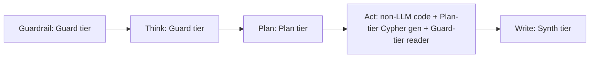

### 3.3 LiteLLM and OpenRouter integration

OpenRouter is the inference gateway (one API key, provider routing and fallback); LiteLLM is the in-code SDK abstraction (typed calls, cost tracking, retry logic, LangGraph integration). Each does what it is good at.

```python
def resolve_model(tier: Literal["guard", "plan", "synth"]) -> str:
    """Resolve a tier to a concrete OpenRouter model id.

    Reads: GUARD_MODEL, PLAN_MODEL, SYNTH_MODEL (env.example).
    Falls back to the app-config default per tier if the env var is unset.
    Model identity is a config value; Phase 6 model-bench populates the
    defaults (Section 3.6), this function never hardcodes a model id.
    """
```

Every call through this function is a LiteLLM call targeting `openrouter/<model_id>`, so a provider outage or a benched replacement is a config edit, not a redeploy of agent logic.

### 3.4 The coordinator-worker split

Decision C's central mechanism: a strong-enough tier plans and writes, a cheap tier does bounded reads, and the split is drawn at the untrusted-content boundary, not at every tool result.

- Structured data passes straight through: a Cypher row, a Datasets API JSON field, a PubChem property value, an ESummary field, all already shaped and typed. These go directly from Act to Write with no reader pass.
- Free text gets a reader pass: a PubMed abstract, a PubTator3 annotation span, an SRA sample-attribute string, a ClinicalTrials.gov description field. These route through an isolated Guard-tier reader call before Write ever sees them.
- The reader is scoped to Read plus the one API that produced the payload, never Write, never the ability to call another tool (system-design-patterns rule 8, the untrusted-source reader gate in production-standards). Section 11 owns the full security specification of this isolation; this section only fixes the mechanism.
- Synth never sees a raw record. It receives only the reader's structured findings (extracted entities, normalized ids, a short evidence summary) or the pass-through structured fields, never the original free text.

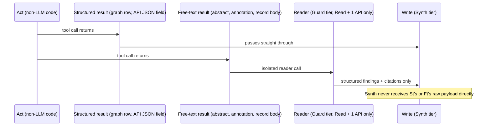

```python
async def coordinator_worker_execute(tool_calls: list[ToolCall]) -> list[Finding]:
    """Section 3.4. Independent tool calls run in parallel (asyncio.gather,
    the 2026-05-07 parallel-execution decision). Free-text payloads route
    through the isolated reader; structured payloads do not.
    """
    raw_results = await asyncio.gather(*(execute_one(c) for c in tool_calls))
    findings = []
    for call, result in zip(tool_calls, raw_results):
        if result.contains_untrusted_free_text:
            findings.append(await reader_pass(result, allowed_tool=call.tool))
        else:
            findings.append(result.structured_fields)
    return findings
```

### 3.5 The harness as an in-process module

The harness is in-process Python for v1, not a separate service (Decision C context, and the 2026-07-21 Step 1.11 harness-as-production-software decision). It owns four responsibilities:

```python
class Harness:
    """In-process module. Owns tier resolution, cost accounting, timeout
    enforcement, and the coordinator-worker split. Does not own cap values
    (Section 19) or cache TTLs (Section 4); it enforces them.

    Depends on:
        - system_03_search_agent.harness.tiers (resolve_model)
        - system_03_search_agent.harness.cache (prompt-cache prefix builder, Section 4.2)
        - system_03_search_agent.contracts.events (cost, error events)
    """

    def resolve_model(self, tier: Tier) -> str: ...

    async def call_tier(self, tier: Tier, messages: list[Message],
                         *, cache_prefix: CachePrefix) -> LLMResponse:
        """Every model call in the loop goes through here, never direct."""

    def track_cost(self, trace_id: str, tier: Tier, usd: float) -> None:
        """Emits a cost event (Section 2.3); enforces caps (Section 19)."""

    async def enforce_timeout(self, step: str, coro: Awaitable, budget_s: float):
        """Per-step timeout inheriting the latency budgets (Section 19)."""

    async def coordinator_worker_execute(self, calls: list[ToolCall]) -> list[Finding]:
        """Section 3.4."""
```

Fail-fast discipline (2026-07-21 Step 1.11): a tool or model-call failure never silently defaults. Every failure is classified transient, recoverable, or unexpected (Section 22 owns the taxonomy) before any retry, and every retry is logged so a model-caused failure (a bad completion) is distinguishable from a harness-caused one (a timeout, a rate limit). When a failure recurs, the harness is iterated first, the model swap is tried second, per the "freeze the model, iterate the harness" rule.

### 3.6 Model selection: deferred to Phase 6 model-bench

Which model fills each tier is not decided in this tech spec. It is decided in Phase 6 against a System-3-specific model-bench: frozen per-tier tasks (Cypher generation, tool-schema adherence, citation synthesis, guardrail classification), scored deterministically for correctness, and GeneBench-Pro-style (synthetic scenarios, expert-reviewed, deterministic grading) for biomedical judgment tasks. Taste-weighted scoring is reserved for Write-step tone only, never for correctness.

Candidate open-source models for the Phase 6 bench, per the 2026-07-21 Step 1.11 decision: DeepSeek-V4 (Pro and Flash), Kimi K2.6 and K2.7, GLM-5.2, Qwen3-Max, Gemma 4. Resilience and capacity join cost as selection criteria, not cost alone. The Track 1 versus production two-lane split (Step 1.13) governs country-of-origin constraints separately: the personal prototype benches the strongest candidates including Chinese-origin models, while a compliant US or allied-origin substitute (Devstral 2, Nemotron 3, Gemma 4, Llama) is benched in parallel so the production-path gap is always known. Neither list is re-decided here; both are carried forward as Phase 6 inputs.

## 4. Caching

Two independent cache layers sit in the request path: a provider-side prompt cache at the LLM call boundary, and a Redis response cache at the tool call boundary. They solve different problems (LLM token cost and latency versus external API load and rate-limit pressure) and are configured separately.

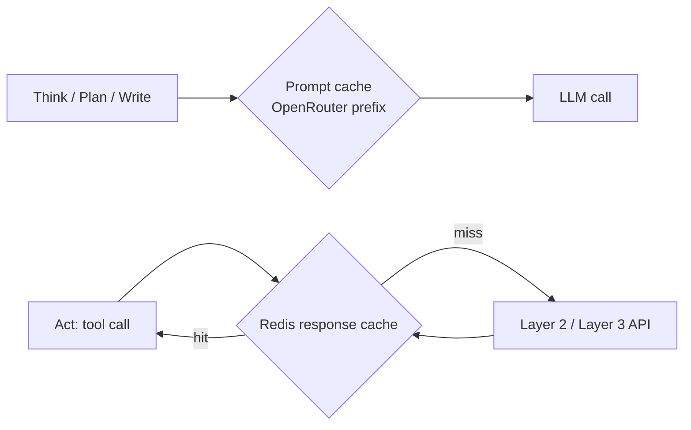

### 4.1 Two cache layers at a glance

| Layer | Caches | Sits at | Config |
|-------|--------|---------|--------|
| Prompt cache | Stable system instructions, tool schemas, static BioLink schema | Every `harness.call_tier` LLM call | No dedicated env var; structural, enforced by prompt assembly order (Section 4.2) |
| Redis response cache | Layer 2 and Layer 3 API responses | Every tool call before it reaches the network | `REDIS_URL` (env.example) |

### 4.2 Prompt caching via OpenRouter

The 2026-07-21 Step 1.11 decision adopts provider-side prompt caching: structure every prompt as a stable prefix, then a dynamic suffix, never change tools mid-session, never switch models mid-query, and track cache efficiency as a first-class metric.

Prefix structure for the main agent's LLM calls (Think, Plan, Write):

1. System instructions and SOUL.md behavioral directives (static across every query).
2. Tool schemas for the seven registered tools, frozen and deterministically sorted by tool name (`clinicaltrials_search`, `cypher_query`, `litvar2_lookup`, `ncbi_dbsnp`, `ncbi_efetch`, `pathogen_detection`, `pubtator_annotate`). Sorting is alphabetic and fixed in code, never re-ordered at runtime, because a reorder busts the cache exactly like a schema edit.
3. The static graph and BioLink schema: the 11 concept labels (the eleventh, `NamedThing`, is the dangling-endpoint stub the five-database merge produces, a real label the live graph carries and a generator must be able to name) and 14 edge predicates at the concept level, not the per-query slice. This is small and genuinely invariant across queries, which is what makes it eligible for the stable prefix.
4. Dynamic suffix: the current query, resolved entities, session-memory tail (Section 14), and the structured plan.

Reconciling two decisions on schema content: the 2026-05-07 schema-slicing decision (send only the relevant graph-schema portion to the LLM, not the full schema) and the 2026-07-21 Step 1.11 prompt-cache decision (the stable prefix includes "graph and BioLink schema") describe two different LLM call sites, and both hold without contradiction:

- The main agent's Think or Plan call uses the static, concept-level schema (11 labels, 14 predicates) in its stable prefix, so the agent knows what is queryable without per-query variation.
- The `cypher_query` tool's own internal Cypher-generation call (a separate plan-tier call, Section 3.2, Section 6) has its own stable prefix (Cypher-generation instructions, few-shot examples, edge-label enforcement rules) and its own dynamic suffix, into which the query-relevant schema slice is injected. The 2026-07-21 Step 1.12 conference-learnings decision to "cache the full sliced schema upfront rather than progressively" governs this call's dynamic suffix: the whole slice is injected in one shot, not built up turn by turn.

Cache-busting rules, enforced in code, not just by convention:

- The tool list never changes mid-session. Adding or removing a tool is a contract-version event (Section 2.6), coordinated across a session boundary.
- The model per tier never switches mid-query. A tier's model is resolved once at query start and held for the query's duration.
- No timestamp, request id, or other volatile token is placed in the stable prefix. Volatile values live only in the dynamic suffix.

### 4.3 Redis response cache for Layer 2 and Layer 3

Every Layer 2 and Layer 3 tool call checks Redis before it reaches the network, keyed by tool, endpoint, and normalized parameters.

Cache key shape: `l{layer}:{tool}:{endpoint}:{normalized_params_hash}:{schema_version}`. The `schema_version` component is a deliberate invalidation lever: when an upstream response shape drifts (for example the capability sheet's verified `germline_classification` rename on ClinVar, or PubChem's `ConnectivitySMILES` key), the tool's parser bumps its own `schema_version`, and the old cache entries age out as dead keys rather than serving a payload the current parser cannot read.

TTL buckets. Three values are directly verified in the Phase 4.0 capability sheet; every other data family is mapped to the nearest bucket by data-volatility analogy, flagged where it is an extrapolation rather than a verified value.

| Data family | Bucket | TTL | Status | Tools |
|-------------|--------|-----|--------|-------|
| Gene records (Gene ESummary, Datasets gene report) | Gene | 7 days | Verified (capability sheet) | `ncbi_efetch` |
| dbSNP, ClinVar, dbVar, Variation Services SPDI normalization | Variant | 7 days | Verified (capability sheet) | `ncbi_dbsnp`, `ncbi_efetch` |
| PubMed ESummary and EFetch, MeSH | Publication | 1 day | Verified (capability sheet) | `ncbi_efetch` |
| PubTator3 annotations, LitVar2, LitSense | Publication | 1 day | Extrapolated: literature-linked enrichment shares PubMed's volatility class | `pubtator_annotate`, `litvar2_lookup` |
| OMIM, MedGen, GTR concept records | Gene | 7 days | Extrapolated: low-churn reference records, nearest to the gene bucket | `ncbi_efetch` |
| ClinicalTrials.gov studies | Publication | 1 day | Extrapolated: status fields (recruiting, completed) change often enough to warrant the shorter bucket | `clinicaltrials_search` |
| PubChem compound records | Gene | 7 days | Extrapolated: stable reference data, nearest to the gene bucket | Datasets and PubChem path |
| SRA, BioProject, BioSample, GEO, Assembly ESummary | Gene | 7 days | Extrapolated: structural project metadata, low churn | `ncbi_efetch` |
| Pathogen Detection FTP snapshots | Snapshot-pinned, not TTL-bucketed | Cached until a newer complete PDG snapshot is pinned; re-checked daily | Verified caveat (capability sheet: "cache aggressively, the snapshot changes on NCBI's build cadence, not per query") | `pathogen_detection` |

Flag for Phase 6 confirmation: the six extrapolated rows are this tech spec's best-fit mapping onto the capability sheet's three verified buckets, not independently verified TTLs. They should be re-checked against real drift observations once the tools are live.

Fail-loud rule (capability sheet, reinforced by production-standards retry-safety): a cache miss combined with an API failure never serves a stale entry as if it were fresh, and never silently substitutes a default. It propagates a recoverable `error` event (Section 2.3) so the agent loop can retry with backoff or degrade gracefully (Section 22), rather than teaching the system a false model of API reliability.

### 4.4 Cache efficiency as a first-class metric

Two efficiency figures are tracked per query and aggregated per day, feeding the cost dashboard (Section 19) and the observability pipeline (Section 20) without this section restating either:

- Prompt cache hit rate: cached prefix tokens divided by total prompt tokens, per tier, read from OpenRouter's cache-read token accounting.
- Redis hit rate: cache hits divided by hits plus misses, per tool.

Both are cost signals, not just performance signals: a cache-miss-heavy session costs measurably more against the per-query cap (Section 19), so a sustained drop in either hit rate is an operator-visible regression, not only a latency concern.

### 4.5 Config surface

`REDIS_URL` (env.example) is the only cache-related environment variable; connection details for the response cache live there. TTL bucket values and the prompt-cache prefix assembly order are application-config constants in `harness/cache.py`, not environment variables, since they are build-time decisions (this section) rather than per-deployment secrets or endpoints.

## 5. Three-layer data access

Every fact the agent cites comes from one of three layers. The Act step reaches each layer through exactly one tool, and every tool call is HTTPS from the agent core's point of view, even the one layer that is really a database. Decision D (2026-07-25) is what makes that last part true: it hides the one non-HTTPS transport (the graph socket) inside the cypher_query tool instead of letting it leak into the agent loop.

### 5.1 Layer 1: the graph, through cypher_query

Layer 1 is the AGE graph on the Hetzner CPX42 box: 115M nodes, 693M edges, 11 concept labels, 14 edge predicates, queried read-only over openCypher. The transport between System 3 and that graph changes by build phase, never the tool's interface.

| Phase | Transport | How it works | Port exposure |
|-------|-----------|---------------|----------------|
| Phase 6 prototype | SSH tunnel or co-location | `ssh -L 5432:localhost:5432 <hetzner-host>`, then psycopg2 connects to `localhost:5432`, reusing System 2's `connection.py`. Or the agent process runs co-located on the same box and connects to `localhost:5432` directly. Zero new build. | Postgres bound to localhost only, never `0.0.0.0` |
| v1 | Thin read-only HTTPS query service | A small FastAPI service on the Hetzner box exposes one endpoint, `POST /v1/cypher`, over HTTPS. It is the only process that opens the Postgres socket. cypher_query calls this endpoint instead of calling psycopg2 directly. | Postgres 5432 never opens past localhost. Only 443 is internet-facing |

The v1 service contract is deliberately thin: it executes Cypher the tool already generated and validated, it does not generate or rewrite Cypher itself. Request `{cypher: string, params: object}`, response `{rows: array, row_count: integer}` or `{error: string}`. Because the service adds no query-construction logic, it adds no new injection surface: parameterization happens once, inside the tool, before the request leaves System 3.

The database port never opens to the internet in either phase (Decision D). The transport lives entirely inside the cypher_query tool module. The rest of the agent core sees one call, `cypher_query(query_intent, target_entities, query_class) -> rows | error`, regardless of which transport answers it. Swapping the tunnel for the HTTPS service later is a change inside that one module, what Decision D calls a two-way door.

Read-only is enforced twice, independent of which transport is active:

- The Cypher validator inside the tool rejects any generated query containing a write keyword (`CREATE`, `MERGE`, `DELETE`, `SET`, `REMOVE`) before execution.
- The database role (`kg_reader`) carries no write grants, so even a validator bypass cannot mutate the graph. Once the v1 HTTPS service is live, the service itself is a third layer of the same enforcement: it accepts only `MATCH`/`RETURN`-shaped bodies and refuses anything else before the request reaches Postgres.

Cypher generation happens inside the tool, not in the main agent loop (the NL-to-Cypher separation decision, 2026-05-07). Three internal steps, in order:

1. The Plan step hands cypher_query a structured intent.
2. The tool's own plan-tier LLM call generates Cypher, constrained by a sliced schema.
3. A validator checks the generated Cypher before execution.

Section 6.1 specifies this pipeline and its schemas.

### 5.2 Layer 2 and Layer 3: the API-caller pattern

Layer 2 (NCBI E-utilities, Variation Services, Datasets API v2, PubChem) and Layer 3 (PubTator3, LitVar2, LitSense, ClinicalTrials.gov) are both reached the same way: a plain HTTPS call issued by non-LLM code, never by the model directly.

The API-caller pattern, in order:

1. The tool receives a structured call from the Plan step (db or source, action, ids or terms), never raw natural language.
2. Tool code issues the HTTPS request, in parallel via `asyncio.gather` whenever the Plan step's call list contains two or more independent calls (the 2026-05-07 parallel-tool-execution decision).
3. Tool code parses the response against its own output JSONSchema and extracts only the fields the schema declares. Nothing outside the schema survives the call.
4. The tool returns the structured, schema-validated result. The model never sees the raw response body.

This is the concrete form of specialize-by-tool-access (system-design-patterns rule 8): the model's inability to see a raw Layer 2/3 payload is what makes the untrusted-source reader gate in section 11 a structural guarantee rather than a prompt request. Every string field in a tool's output schema carries a `maxLength`, every array a `maxItems`, and every `source_url` a host-pinned regex, per the production-standards multi-agent pipeline gate. Section 6 specifies these per tool.

Each Layer 2/3 tool declares three things up front, independent of any specific call: which host or hosts it is allowed to reach, its own per-call timeout, and its own rate-limit pool. Section 21 owns the shared budget across concurrent users; this section and section 6 own the per-tool numbers that budget is built from.

### 5.3 One-tool-one-layer

No tool call spans two layers (system-design-patterns rule 3). A question that needs both graph context and a live record, for example the graph supplies an rs# from a ClinVar node and a live dbSNP lookup then resolves current population frequency for that rs#, is two tool calls in the Plan step's call list, cypher_query then ncbi_dbsnp, never one tool that internally hops from the graph to an API. Keeping each tool scoped to one transport and one failure mode keeps its error handling, timeout, and schema validation legible on its own.

| Tool | Layer | Transport |
|------|-------|-----------|
| cypher_query | Layer 1 | SSH tunnel or co-location (Phase 6), HTTPS query service (v1) |
| ncbi_efetch | Layer 2 | HTTPS, E-utilities, Datasets API v2, PubChem PUG REST |
| ncbi_dbsnp | Layer 2 | HTTPS, NCBI Variation Services plus dbSNP ESummary |
| pathogen_detection | Layer 2 | HTTPS, the Pathogen Detection FTP results tree |
| pubtator_annotate | Layer 3 | HTTPS, PubTator3 |
| litvar2_lookup | Layer 3 | HTTPS, LitVar2 |
| clinicaltrials_search | Layer 3 | HTTPS, ClinicalTrials.gov API v2 |

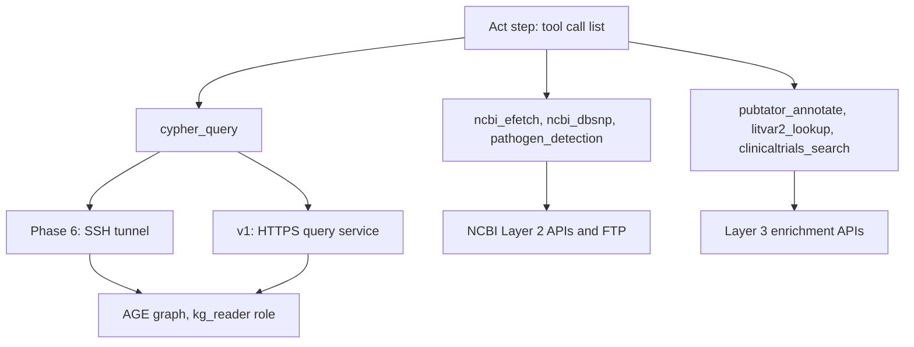

All three layers converge back into the same shape by the time the Write step sees them: a structured, schema-validated, source-attributed result. The layer is metadata on that result (the `layer` field in the provenance type, section 9), not a difference the Write step has to special-case.

## 6. Tool specifications

One subsection per tool, drawn directly from the capability sheet (`requirements/phase_4/API_capability_sheet.md`), the only verified source for endpoints, fields, and error and empty behavior. Every schema below applies the production-standards multi-agent pipeline gate: `maxLength` on every string, `maxItems` on every array, a host-pinned `source_url` regex, and no `additionalProperties`. Every tool is a Read-plus-one-source untrusted-source reader in the sense of system-design-patterns rule 8: it can call its own source and nothing else, never another tool, never a write path.

Every `source_url` pattern below is Section 9.3's strict host-pinned regex (`NCBI_RECORD_HOST`, `CLINICALTRIALS_HOST`), never the looser any-subdomain form. A citation always resolves to the human-facing record page (`www.ncbi.nlm.nih.gov/...`, `pubmed.ncbi.nlm.nih.gov/...`), never the `eutils.` or `api.` fetch host the tool actually called to retrieve the data. This is the concrete enforcement point for Section 9.3's rule; a tool schema that used the looser pattern would let a fetch host leak into a citation, defeating the rule Section 9.3 states.

The per-competency-question required IDs and fields (`reference/personal-os-work/NIH/Agentic-Search/Reference/system-3-brainstorming/02_Tier1_eval_spec.md`) are the input-output contract each schema below is checked against: VCV/RCV accessions for ClinVar, nstd/nsv/esv for dbVar, MIM IDs for OMIM, CUIs for MedGen, NCT IDs for ClinicalTrials.gov, rsIDs and SPDI for variants. Every field that spec names as required for a Tier 1 answer appears in at least one schema below.

### 6.1 cypher_query

Purpose: the only path to Layer 1. Per the 2026-05-07 Cypher-generation decision, the main agent never generates or sees raw Cypher; cypher_query runs a three-step internal pipeline instead:

1. Receive the Plan step's structured intent.
2. Generate Cypher with a plan-tier LLM call, constrained by a sliced schema.
3. Validate the generated Cypher, then execute.

Input schema:

```json
{
  "$id": "cypher_query.input",
  "type": "object",
  "required": ["query_intent", "query_class"],
  "additionalProperties": false,
  "properties": {
    "query_intent": {
      "type": "string",
      "maxLength": 1000,
      "description": "Structured description of what to retrieve, e.g. 'genes linked to BRCA1 via gene_associated_with_condition, then their ClinVar variants'"
    },
    "query_class": {
      "type": "string",
      "enum": ["lookup", "single_hop", "multi_hop", "aggregate", "exploratory"]
    },
    "target_entities": {
      "type": "array",
      "maxItems": 10,
      "items": {"type": "string", "maxLength": 100, "description": "CURIE, e.g. NCBIGene:672"}
    },
    "row_limit": {"type": "integer", "minimum": 1, "maximum": 500, "default": 100}
  }
}
```

Output schema:

```json
{
  "$id": "cypher_query.output",
  "type": "object",
  "required": ["status", "rows", "row_count", "truncated"],
  "additionalProperties": false,
  "properties": {
    "status": {"type": "string", "enum": ["ok", "empty", "error"]},
    "rows": {
      "type": "array",
      "maxItems": 500,
      "items": {
        "type": "object",
        "additionalProperties": false,
        "properties": {
          "node_or_edge_type": {"type": "string", "maxLength": 50},
          "curie": {"type": "string", "maxLength": 100},
          "fields": {"type": "object", "maxProperties": 30},
          "source_url": {
            "type": "string",
            "maxLength": 300,
            "pattern": "^https://(www\\.|pubmed\\.)?ncbi\\.nlm\\.nih\\.gov/"
          },
          "graph_snapshot_version": {"type": "string", "maxLength": 40}
        }
      }
    },
    "row_count": {"type": "integer"},
    "total_available": {"type": "integer"},
    "truncated": {"type": "boolean"},
    "cypher_executed": {"type": "string", "maxLength": 2000, "description": "Audit trail only, never rendered raw to the end user"},
    "error": {"type": "string", "maxLength": 500}
  }
}
```

Endpoint and fields used: the AGE graph, wrapped as `SELECT * FROM cypher('ncbi_kg', $$ ... $$, params) AS (...)`, always with an explicit edge label (never untyped `[r]`, the 2026-05-05 decision that keeps the planner off a 693M-row UNION ALL). The 11 concept labels and 14 edge predicates are enumerated in `docs/data-engineering/Knowledge_graph_on_server_reference.md`. Query parameters never string-interpolate into the Cypher text (production-standards query-safety gate). They also never pass through a `%s` placeholder on the `cypher()` call's own third argument: psycopg2 substitutes `%s` client-side before the statement reaches the server, so AGE never receives a genuine bind parameter there and rejects the call outright (sqlstate 22023, finding F-2.1-02). The mechanism that actually works is `PREPARE`/`EXECUTE`: prepare a statement declaring one `agtype` parameter, execute it with the params JSON bound through psycopg2's `%s` placeholder on the `EXECUTE` call itself, then `DEALLOCATE` in a `finally` block. This is the shipped mechanism in `tools/graph_connection.py` (`_build_prepare_sql`, `_build_execute_sql`, `_build_deallocate_sql`, wired together in `execute_cypher`); see `production-examples.md` example 1 for the full before and after.

Error and empty behavior:

- Zero rows: `status: "empty"`, not an error. This is the Layer 1 cite-or-refuse trigger.
- Validation failure (forbidden keyword, missing edge label, malformed generated Cypher): one retry, feeding the validator's error back into the internal generation call. A second failure returns `status: "error"` with an actionable message.
- Missing `LIMIT`: the tool injects `row_limit` (default 100, hard max 500) before execution. `truncated: true` plus `total_available` when the true row count exceeds what was returned (system-design-patterns rule 7).
- Timeout: `status: "error"`, message names the cause and the retry path ("graph query exceeded 30s, retry with a narrower query_intent or a smaller query_class").

Per-call timeout: 30 seconds, carried forward from the capability sheet's reference-PoC cap on the graph Cypher execution. Retry-safety: a read-only query is naturally idempotent, so retrying cypher_query never changes graph state; the only source of a changed result between retries is a System 1/2 re-ingestion, never this tool.

### 6.2 ncbi_efetch

Purpose: the general Layer 2 client. Covers Entrez E-utilities search, fetch, summary, and link across every Layer 2 database (PubMed, Gene, ClinVar, dbVar, OMIM, MedGen, GTR, SRA, BioProject, BioSample, Assembly, GEO, Taxonomy, MeSH), the NCBI Datasets API v2 gene and genome reports, and PubChem PUG REST. One tool, seven actions, discriminated by the `action` field.

Datasets API v2 (base `https://api.ncbi.nlm.nih.gov/datasets/v2/`) is the `dataset_report` action below: `GET gene/id/{gene_id}`, `GET gene/symbol/{symbol}/taxon/{taxon}`, and `GET genome/accession/{accession}/dataset_report`, each returning structured JSON with proper HTTP status codes, unlike the E-utilities 200-with-body-error pattern. This is the one-tool-per-access-path rule applied inside the tool: eutils and Datasets v2 are two action families on the same `ncbi_efetch` tool, not two tools, because both ultimately serve the same job, Layer 2 gene, genome, and record retrieval, discriminated by `action`.

Input schema:

```json
{
  "$id": "ncbi_efetch.input",
  "type": "object",
  "required": ["action"],
  "oneOf": [
    {
      "required": ["action", "db", "term"],
      "properties": {
        "action": {"const": "search"},
        "db": {"type": "string", "enum": ["pubmed", "gene", "clinvar", "dbvar", "omim", "medgen", "gtr", "sra", "bioproject", "biosample", "assembly", "gds", "taxonomy", "mesh"]},
        "term": {"type": "string", "maxLength": 500},
        "field_tags": {
          "type": "array",
          "maxItems": 5,
          "items": {"type": "string", "maxLength": 20},
          "description": "Must be validated against the EInfo field list for db before use. Never built from free text."
        },
        "retmax": {"type": "integer", "minimum": 1, "maximum": 500, "default": 100},
        "use_history": {"type": "boolean", "default": false}
      }
    },
    {
      "required": ["action", "db", "ids"],
      "properties": {
        "action": {"const": "fetch"},
        "db": {"type": "string", "enum": ["pubmed", "gene", "clinvar", "dbvar", "omim", "medgen", "gtr", "sra"]},
        "ids": {"type": "array", "maxItems": 50, "items": {"type": "string", "maxLength": 30}},
        "rettype": {"type": "string", "enum": ["abstract", "docsum", "full"], "default": "docsum"},
        "retmode": {"type": "string", "enum": ["xml", "text", "json"], "default": "json"}
      }
    },
    {
      "required": ["action", "db", "ids"],
      "properties": {
        "action": {"const": "summary"},
        "db": {"type": "string", "enum": ["pubmed", "gene", "clinvar", "dbvar", "omim", "medgen", "gtr", "sra", "bioproject", "biosample", "assembly", "gds"]},
        "ids": {"type": "array", "maxItems": 50, "items": {"type": "string", "maxLength": 30}}
      }
    },
    {
      "required": ["action", "dbfrom", "db", "ids"],
      "properties": {
        "action": {"const": "link"},
        "dbfrom": {"type": "string", "maxLength": 20},
        "db": {"type": "string", "maxLength": 20, "description": "Explicit target db. Never left to the ELink default, which can be dominated by computed pubmed_pubmed* neighbors."},
        "ids": {"type": "array", "maxItems": 20, "items": {"type": "string", "maxLength": 30}}
      }
    },
    {
      "required": ["action", "db", "chromosome", "start", "end", "assembly"],
      "properties": {
        "action": {"const": "coordinate_overlap"},
        "db": {"type": "string", "enum": ["dbvar", "clinvar"]},
        "chromosome": {"type": "string", "maxLength": 5},
        "start": {"type": "integer"},
        "end": {"type": "integer"},
        "assembly": {"type": "string", "enum": ["GRCh37", "GRCh38"]}
      }
    },
    {
      "required": ["action", "report_type"],
      "properties": {
        "action": {"const": "dataset_report"},
        "report_type": {"type": "string", "enum": ["gene", "genome"]},
        "gene_id": {"type": "string", "maxLength": 20},
        "symbol": {"type": "string", "maxLength": 30},
        "taxon": {"type": "string", "maxLength": 30},
        "accession": {"type": "string", "maxLength": 20}
      }
    },
    {
      "required": ["action", "lookup_type", "value"],
      "properties": {
        "action": {"const": "pubchem_property"},
        "lookup_type": {"type": "string", "enum": ["cid", "name"]},
        "value": {"type": "string", "maxLength": 200},
        "properties": {"type": "array", "maxItems": 10, "items": {"type": "string", "maxLength": 40}}
      }
    }
  ]
}
```

Output schema (one shape for every action; per-action content is documented in the endpoint table below):

```json
{
  "$id": "ncbi_efetch.output",
  "type": "object",
  "required": ["status", "action", "records", "record_count", "truncated"],
  "additionalProperties": false,
  "properties": {
    "status": {"type": "string", "enum": ["ok", "empty", "error"]},
    "action": {"type": "string", "maxLength": 20},
    "records": {
      "type": "array",
      "maxItems": 100,
      "items": {
        "type": "object",
        "additionalProperties": false,
        "properties": {
          "id": {"type": "string", "maxLength": 30},
          "db": {"type": "string", "maxLength": 20},
          "fields": {"type": "object", "maxProperties": 40},
          "source_url": {
            "type": "string",
            "maxLength": 300,
            "pattern": "^https://((www\\.|pubmed\\.)?ncbi\\.nlm\\.nih\\.gov|(www\\.)?omim\\.org)/"
          }
        }
      }
    },
    "record_count": {"type": "integer"},
    "total_available": {"type": "integer"},
    "truncated": {"type": "boolean"},
    "error": {"type": "string", "maxLength": 500}
  }
}
```

Endpoints and fields used, by action:

| Action | Endpoint | Fields extracted |
|--------|----------|-------------------|
| search | ESearch `db=<db>&term=<term>` | `count`, `idlist`, `webenv`/`query_key` when `use_history` |
| fetch | EFetch `db=<db>&id=<ids>&rettype=&retmode=` | abstract text or structured XML (`AbstractText`, `MeshHeadingList` for PubMed; per-db equivalents elsewhere) |
| summary | ESummary `db=<db>&id=<ids>&retmode=json` | the verified per-db field set, see table below |
| link | ELink `dbfrom=<dbfrom>&db=<db>&id=<ids>` | `linksets[0].linksetdbs[].links[]`, keyed by `linkname` |
| coordinate_overlap | ESearch coordinate prefilter then ESummary placement fetch | dbVar `dbvarplacementlist` or ClinVar `C37`/`CPOS`/`VLEN` |
| dataset_report | Datasets API v2 (base `https://api.ncbi.nlm.nih.gov/datasets/v2/`): `GET gene/id/{gene_id}`, `GET gene/symbol/{symbol}/taxon/{taxon}`, or `GET genome/accession/{accession}/dataset_report` | see the Datasets field list below |
| pubchem_property | PUG REST `/compound/cid/{cid}/property/{list}/JSON` or `/compound/name/{name}/cids/JSON` | `CID`, `MolecularFormula`, `MolecularWeight`, `ConnectivitySMILES`, `IUPACName` |

Verified ESummary fields by database (the load-bearing subset the tool extracts into `fields`):

| Database | Fields |
|----------|--------|
| pubmed | `authors`, `source`, `fulljournalname`, `pubdate`, `elocationid` (DOI), `articleids`, `pubtype` |
| gene | `name`, `description`, `chromosome`, `maplocation`, `genomicinfo` (current-assembly coordinates), `mim`, `organism` |
| clinvar | `accession` (VCV), `title`, `germline_classification` (object, not a flat scalar, drift-verified), `variation_set.canonical_spdi`, `genes` |
| dbvar | `CH`, `BASE`, `CHR_END`, `VT`, `VLEN`, `CLIN`, `PATHO_RNG`, per-population `AFR`/`AMR`/`EAS`/`EUR`/`SAS`/`OTH`/`FREQ`, `OMIM`, `GENE_NAME`, `ASSM` |
| omim | `oid` (MIM number), `title`, `alttitles`, `locus` |
| medgen | `conceptid` (CUI), `title`, `definition`, `semantictype` |
| gtr | `accession`, `testname`, `genelist`, `conditionlist`, `analyticalvalidity`, `clinicalvalidity`, `offerer` |
| sra | 22 ESearch-indexed fields (`ORGN`, `PLAT`, `STRA`, `SRC`, `SEL`, `LAY`, `ACS`, `GPRJ`, `BSPL`, `MBS`) plus EFetch sample attributes (`serovar`, `isolation_source`, `geo_loc_name`, `collection_date`), tag names normalized across submitters and brokers |

Datasets v2 field list (gene report): `gene_id`, `symbol`, `description`, `taxname`, `tax_id`, `omim_ids`, `ensembl_gene_ids`, `swiss_prot_accessions`, `chromosomes`, `map_locations`, `gene_ontology`, `synonyms`. Genome report: `accession`, `current_accession`, `paired_accession`, `assembly_info.assembly_level`, `assembly_info.assembly_name`, `assembly_stats`.

Coordinate-overlap procedure (implements the Q1 finding, dbVar and ClinVar coordinate range on Entrez is not true interval overlap by itself):

1. ESearch coarse prefilter: `<chr>[CHR] AND <start>:<end>[BASE]` (dbVar, pinned to the assembly via `ASSM`) or `<chr>[CHR] AND <start>:<end>[C37 or CPOS]` (ClinVar).
2. ESummary each candidate ID. For dbVar, read the `dbvarplacementlist` array (`chr`, `chr_start`, `chr_end`, `assembly` per entry). For ClinVar, read `C37`/`CPOS` and `VLEN` directly, since those fields are already single-assembly.
3. Select the placement entry matching the requested `assembly`.
4. Apply the exact predicate in tool code, never in the ESearch query: `placement.chr_start <= end AND placement.chr_end >= start`.
5. Drop any candidate that fails step 4. Only genuine overlaps reach the output, each tagged with its resolved placement and assembly.

Skipping steps 2 through 4 and trusting the raw ESearch range is the exact bug the capability sheet proved live: three sampled "hits" on a chr1 GRCh38 window were all 0bp point insertions that matched only because a GRCh37 unplaced-scaffold start paired with a GRCh38 end.

Error and empty behavior:

| Condition | HTTP | Body signal | Tool behavior |
|-----------|------|--------------|-----------------|
| Zero hits (ESearch) | 200 | `count: "0"`, `idlist: []` | `status: "empty"` |
| EFetch on a nonexistent id | 200 | empty record set, no error node | `status: "empty"` |
| Invalid db name | 200 | `esearchresult.ERROR: "Invalid db name specified: <db>"` | `status: "error"`, message is the `ERROR` body |
| Unknown field tag | 200 | no error, silent broad-search fallback | rejected before the call: `field_tags` are validated against the EInfo field list, never built from free text |
| Datasets bad id | 400 | `{"error", "code", "message"}` | `status: "error"`, branch on HTTP status (different from E-utilities) |
| PubChem bad CID | 400 | `{"Fault": {"Code", "Message"}}` | `status: "error"`, branch on HTTP status |

E-utilities returning HTTP 200 for both empty results and several error classes is the single most load-bearing finding for this tool: the tool inspects the response body, never the HTTP status, to decide cite-or-refuse for any E-utilities action. Datasets and PubChem use proper HTTP status codes, so those two actions branch on status directly. The XML parser used for `retmode=xml` disables external entities (`resolve_entities=False`).

Per-call timeout: 15 seconds with one backoff retry on a transient failure, for every action except `coordinate_overlap`, which budgets up to 15 seconds per ESearch/ESummary sub-call within the harness per-step timeout (section 19).

Rate limits: E-utilities is 3 requests/second unauthenticated, 10/second with an API key passed as `&api_key=` (key in an env var only, never in code or logs). Datasets v2 and PubChem require no key; PubChem is roughly 5 requests/second and 400/minute. All four pools are subject to the shared per-user and per-query budget in section 21.

Step 4.3 resolution (the fifth confirmed decision, alongside the four parked threads): Pathogen Detection (the FTP results tree of versioned PDG snapshots, anchoring Q5) and ClinicalTrials.gov v2 (anchoring Q4) each get their own named tool, `pathogen_detection` (Section 6.6) and `clinicaltrials_search` (Section 6.7), rather than a sixth and seventh action folded into `ncbi_efetch`. Neither fits this tool's action set cleanly: Pathogen Detection is bulk TSV and tar.gz retrieval with snapshot pinning and its own 60-second-plus timeout, not a parameterized Entrez, Datasets, or PubChem call, and the capability sheet's own moat map already lists it as a distinct tool outside the five original roadmap tools. ClinicalTrials.gov v2, while a simple GET/JSON call like PubChem, is NLM-hosted at a non-`ncbi.nlm.nih.gov` domain that `ncbi_efetch`'s namesake E-utilities family should not absorb. The roster is seven tools, not five plus two folded actions.

### 6.3 ncbi_dbsnp

Purpose: variant normalization and dbSNP record retrieval. Primary path is NCBI Variation Services (`https://api.ncbi.nlm.nih.gov/variation/v0`), a separate host and rate pool from E-utilities; a secondary dbSNP ESummary call via E-utilities supplies clinical and population fields Variation Services does not carry.

Input schema:

```json
{
  "$id": "ncbi_dbsnp.input",
  "type": "object",
  "required": ["query", "query_type"],
  "additionalProperties": false,
  "properties": {
    "query": {"type": "string", "maxLength": 200, "description": "rsid (rs334), HGVS expression, or SPDI"},
    "query_type": {"type": "string", "enum": ["rsid", "hgvs", "spdi"]},
    "include_clinical": {
      "type": "boolean",
      "default": true,
      "description": "Also fetch dbSNP ESummary for clinical_significance, global_mafs, genes, fxn_class"
    }
  }
}
```

Output schema:

```json
{
  "$id": "ncbi_dbsnp.output",
  "type": "object",
  "required": ["status", "rsid", "spdi_canonical"],
  "additionalProperties": false,
  "properties": {
    "status": {"type": "string", "enum": ["ok", "empty", "error"]},
    "rsid": {"type": "string", "maxLength": 20},
    "spdi_canonical": {"type": "string", "maxLength": 150},
    "alleles": {"type": "array", "maxItems": 10, "items": {"type": "string", "maxLength": 20}},
    "chrpos": {"type": "string", "maxLength": 30},
    "clinical_significance": {"type": "array", "maxItems": 10, "items": {"type": "string", "maxLength": 64}},
    "functional_consequence": {"type": "array", "maxItems": 10, "items": {"type": "string", "maxLength": 60}},
    "genes": {
      "type": "array",
      "maxItems": 10,
      "items": {
        "type": "object",
        "additionalProperties": false,
        "properties": {"name": {"type": "string", "maxLength": 30}, "gene_id": {"type": "string", "maxLength": 20}}
      }
    },
    "population_frequencies": {
      "type": "array",
      "maxItems": 30,
      "items": {
        "type": "object",
        "additionalProperties": false,
        "properties": {
          "population": {"type": "string", "maxLength": 20},
          "allele": {"type": "string", "maxLength": 10},
          "frequency": {"type": "number"}
        }
      }
    },
    "source_url": {
      "type": "string",
      "maxLength": 200,
      "pattern": "^https://(www\\.|pubmed\\.)?ncbi\\.nlm\\.nih\\.gov/snp/"
    },
    "error": {"type": "string", "maxLength": 500}
  }
}
```

Endpoints and fields used:

| Endpoint | Returns |
|----------|---------|
| `refsnp/{rsid}` | `refsnp_id`, `primary_snapshot_data`, `mane_select_ids`, `citations` |
| `spdi/{spdi}/contextual` | canonical `{seq_id, position, deleted_sequence, inserted_sequence}`. Corrected 2026-08-15: this section previously named `spdi/{spdi}/canonical_representative`, which build phase 3.2 live-confirmed returns HTTP 500 on every well-formed input tried, including NCBI's own documented example. The shipped tool has always used `/contextual`; the spec text was the thing that was wrong |
| `spdi/{spdi}/all_equivalent_contextual` | all equivalent contextual alleles |
| `hgvs/{hgvs}/contextuals` | SPDI contextual alleles for an HGVS expression (`>` URL-encoded as `%3E`) |
| dbSNP ESummary (`db=snp`) | `allele`, `chrpos`, `spdi`, `clinical_significance`, `fxn_class`, `genes`, `global_mafs` |

The `global_mafs` array is the frequency source; the flat `global_maf` scalar is verified null and must never be read.

Error and empty behavior: the dbSNP ESummary call inherits the E-utilities 200-with-body pattern from section 6.2 (empty record set on a nonexistent rsid, `ERROR` body on a bad request). Variation Services error behavior on an invalid rsid, SPDI, or HGVS input is not verified live in the capability sheet, only successful 200 responses were probed. This is flagged as an open verification gap for Phase 6: tool code defensively treats any non-200 response, or a 200 body missing `refsnp_id`, as `status: "error"`, and this defensive path must be live-verified before the tool ships. `global_mafs: []` with no other error signal is `status: "ok"` and `population_frequencies: []`, not a failure, since some variants genuinely carry no population MAF data.

Per-call timeout: 15 seconds per call. Variation Services normalization and the dbSNP ESummary clinical fetch run sequentially within one tool invocation, never in parallel, because the clinical fetch needs the canonical SPDI normalization to complete first. Budget up to 30 seconds worst case for one ncbi_dbsnp call against the harness per-step timeout.

Rate limit: Variation Services is roughly 1 request/second, its own pool, separate from the E-utilities 3/10-per-second pool. This is the tightest constraint on any tool in the roster and is the reason this tool serializes its two calls rather than parallelizing them.

### 6.4 pubtator_annotate

Purpose: Layer 3 enrichment. Entity normalization for free text and entity annotation on publications, via PubTator3 (`https://www.ncbi.nlm.nih.gov/research/pubtator3-api`, no API key).

Input schema:

```json
{
  "$id": "pubtator_annotate.input",
  "type": "object",
  "required": ["mode"],
  "oneOf": [
    {
      "required": ["mode", "query"],
      "properties": {
        "mode": {"const": "entity_lookup"},
        "query": {"type": "string", "maxLength": 200},
        "limit": {"type": "integer", "minimum": 1, "maximum": 20, "default": 10}
      }
    },
    {
      "required": ["mode", "pmids"],
      "properties": {
        "mode": {"const": "annotate_publications"},
        "pmids": {"type": "array", "maxItems": 20, "items": {"type": "string", "maxLength": 15}}
      }
    }
  ]
}
```

Output schema:

```json
{
  "$id": "pubtator_annotate.output",
  "type": "object",
  "required": ["status", "mode"],
  "additionalProperties": false,
  "properties": {
    "status": {"type": "string", "enum": ["ok", "empty", "error"]},
    "mode": {"type": "string", "maxLength": 25},
    "entities": {
      "type": "array",
      "maxItems": 20,
      "items": {
        "type": "object",
        "additionalProperties": false,
        "properties": {
          "pubtator_id": {"type": "string", "maxLength": 40},
          "biotype": {"type": "string", "maxLength": 20},
          "db": {"type": "string", "maxLength": 20},
          "db_id": {"type": "string", "maxLength": 30},
          "name": {"type": "string", "maxLength": 100},
          "description": {"type": "string", "maxLength": 300},
          "source_url": {"type": "string", "maxLength": 200}
        }
      }
    },
    "publications": {
      "type": "array",
      "maxItems": 20,
      "items": {
        "type": "object",
        "additionalProperties": false,
        "properties": {
          "pmid": {"type": "string", "maxLength": 15},
          "annotations": {
            "type": "array",
            "maxItems": 100,
            "items": {
              "type": "object",
              "additionalProperties": false,
              "properties": {
                "type": {"type": "string", "maxLength": 20},
                "identifier": {"type": "string", "maxLength": 60},
                "normalized_id": {"type": ["string", "null"], "maxLength": 60},
                "valid": {"type": "boolean"},
                "biotype": {"type": "string", "maxLength": 20},
                "name": {"type": "string", "maxLength": 100}
              }
            }
          },
          "source_url": {"type": "string", "maxLength": 200, "pattern": "^https://pubmed\\.ncbi\\.nlm\\.nih\\.gov/"}
        }
      }
    },
    "error": {"type": "string", "maxLength": 500}
  }
}
```

Endpoints and fields used:

- Entity lookup: `GET /entity/autocomplete/?query={text}&limit={n}` returns `_id` (the PubTator entity id), `biotype`, `db`, `db_id` (the bridge to the NCBI database id, for example `ncbi_gene` 672), `name`, `description`. Each entity's `source_url` is populated only for the two verified db types with a confirmed live record-page shape (`ncbi_gene`, `ncbi_mesh`), `None` for every other `db` value; widened into this schema at Step 6.2 (finding F-3.3-A-05) to match code shipped in build phase 3.3, since the field was already emitted beyond what the locked schema legally allowed. Widening further to cover `litvar`/`cvcl` db types needs their record-page URL shapes live-verified first, not attempted here.
- Annotate publications: `GET /publications/export/biocjson?pmids={csv}` returns a top-level `{"PubTator3": [...]}` object (a drift point, not a bare BioC document). Annotations live at `.PubTator3[i].passages[].annotations[]`, each with an `infons` object: `type`, `identifier`, `normalized_id` (nullable), `valid`, `biotype`, `database`, `accession`, `name`. A relations endpoint exists for entity-pair relations (chemical-disease, gene-disease); its exact path and fields were not live-verified in the capability sheet and are flagged as an open item for a fast-follow addition once verified.

Error and empty behavior: entity lookup on a no-match query returns `[]` with HTTP 200, this is the Layer 3 cite-or-refuse empty signal, mapped to `status: "empty"`. The biocjson export on a nonexistent PMID returns HTTP 400 with `{"detail": "Could not retrieve publications"}`, mapped to `status: "error"` with the `detail` string as the message, unlike E-utilities' 200-with-body pattern.

Untrusted content: `name`, `description`, and every annotation field are untrusted free text extracted from a source publication, never an instruction the agent executes. Per Decision C, these fields get a cheap isolated reader pass before the Synth model sees them (section 3 and section 11), the same untrusted-source reader gate that governs every Layer 2/3 free-text field.

Per-call timeout: 15 seconds. No API key, no documented rate limit; subject to the shared per-query call budget in section 21.

### 6.5 litvar2_lookup

Purpose: Layer 3 enrichment, variant-to-literature evidence, via LitVar2 (`https://www.ncbi.nlm.nih.gov/research/litvar2-api`, no API key).

Input schema:

```json
{
  "$id": "litvar2_lookup.input",
  "type": "object",
  "required": ["mode"],
  "oneOf": [
    {
      "required": ["mode", "query"],
      "properties": {
        "mode": {"const": "variant_search"},
        "query": {"type": "string", "maxLength": 100, "description": "rsid, HGVS, or variant name"}
      }
    },
    {
      "required": ["mode", "litvar_id"],
      "properties": {
        "mode": {"const": "publications_lookup"},
        "litvar_id": {"type": "string", "maxLength": 60, "description": "e.g. litvar@rs334##, URL-encoded by the tool before the call"}
      }
    }
  ]
}
```

Output schema:

```json
{
  "$id": "litvar2_lookup.output",
  "type": "object",
  "required": ["status", "mode"],
  "additionalProperties": false,
  "properties": {
    "status": {"type": "string", "enum": ["ok", "empty", "error"]},
    "mode": {"type": "string", "maxLength": 25},
    "variant_matches": {
      "type": "array",
      "maxItems": 10,
      "items": {
        "type": "object",
        "additionalProperties": false,
        "properties": {
          "litvar_id": {"type": "string", "maxLength": 60},
          "rsid": {"type": "string", "maxLength": 20},
          "gene": {"type": "array", "maxItems": 5, "items": {"type": "string", "maxLength": 30}},
          "name": {"type": "string", "maxLength": 60},
          "hgvs": {"type": "string", "maxLength": 80},
          "pmids_count": {"type": "integer"},
          "clinical_significance": {"type": "array", "maxItems": 10, "items": {"type": "string", "maxLength": 30}},
          "source_url": {"type": "string", "maxLength": 200}
        }
      }
    },
    "pmids": {"type": "array", "maxItems": 50, "items": {"type": "string", "maxLength": 15}},
    "pmid_source_urls": {"type": "array", "maxItems": 50, "items": {"type": "string", "maxLength": 60}},
    "total_pmids": {"type": "integer"},
    "source_url": {"type": "string", "maxLength": 200, "pattern": "^https://(www\\.|pubmed\\.)?ncbi\\.nlm\\.nih\\.gov/"},
    "error": {"type": "string", "maxLength": 500}
  }
}
```

Two fields widened into this schema at Step 6.2 (finding F-3.3-J-06), since the single top-level `source_url` this section originally provided cannot cite a multi-match `variant_search` result or an individual `publications_lookup` PMID: `variant_matches[].source_url`, this match's own dbSNP record page, populated for every match carrying a real rsid regardless of how many matches the result has (the output-level `source_url` stays gated to the single-match case, since it is one field for the whole result set); and `pmid_source_urls`, one canonical PubMed URL per entry in `pmids`, same order, same length, the same shape `pubtator_annotate` already ships per publication.

Endpoints and fields used:

- Variant search: `GET /variant/autocomplete/?query={rsid, hgvs, or name}` returns `_id` (the litvar id, format `litvar@rs334##`), `rsid`, `gene`, `name`, `hgvs`, `pmids_count`, `flag_rsid_variant`, `data_clinical_significance`.
- Publications for a variant: `GET /variant/get/{litvar_id}/publications`, the id URL-encoded by the tool (`@` as `%40`, `#` as `%23`), returns `{"pmids": [...]}`.

Error and empty behavior: variant search on a no-match query returns `[]` with HTTP 200, mapped to `status: "empty"`. A publications lookup on an id with zero linked PMIDs is expected to return `{"pmids": []}` consistent with LitVar2's other verified empty behavior; this specific zero-PMID case was not independently live-verified in the capability sheet and is treated as low-risk since it follows the same empty-array-plus-200 shape verified for autocomplete.

Truncation: `pmids` is capped at `maxItems: 50` with `total_pmids` carrying the true count. The capability sheet's verified example (rs334) carries 589 PMIDs; inlining all 589 into model context would defeat system-design-patterns rule 7, so the tool always truncates and always reports the total.

Per-call timeout: 15 seconds. No API key, no documented rate limit; subject to the shared per-query call budget in section 21.

### 6.6 pathogen_detection

Purpose: Layer 2, bulk access to the NCBI Pathogen Detection PDG snapshot tree, anchoring Q5 (a Salmonella isolate to its outbreak cluster, AMR genotype, and SNP-distance neighbors). This does not fit `ncbi_efetch`'s action set: it is versioned bulk TSV and tar.gz retrieval with snapshot pinning, not a parameterized Entrez, Datasets, or PubChem call (Section 6.2's Step 4.3 resolution note).

Input schema:

```json
{
  "$id": "pathogen_detection.input",
  "type": "object",
  "required": ["mode", "taxon"],
  "oneOf": [
    {
      "required": ["mode", "taxon", "biosample_acc"],
      "properties": {
        "mode": {"const": "isolate_lookup"},
        "taxon": {"type": "string", "maxLength": 50, "description": "FTP taxon folder, e.g. Salmonella"},
        "biosample_acc": {"type": "string", "maxLength": 30}
      }
    },
    {
      "required": ["mode", "taxon", "pds_cluster"],
      "properties": {
        "mode": {"const": "cluster_snp_neighbors"},
        "taxon": {"type": "string", "maxLength": 50},
        "pds_cluster": {"type": "string", "maxLength": 30},
        "max_snp_distance": {"type": "integer", "minimum": 1, "maximum": 50, "default": 5}
      }
    }
  ]
}
```

Output schema:

```json
{
  "$id": "pathogen_detection.output",
  "type": "object",
  "required": ["status", "mode", "isolates", "isolate_count", "truncated"],
  "additionalProperties": false,
  "properties": {
    "status": {"type": "string", "enum": ["ok", "empty", "error", "timeout"]},
    "mode": {"type": "string", "maxLength": 25},
    "pdg_snapshot": {"type": "string", "maxLength": 30, "description": "the pinned complete snapshot this result came from, e.g. PDG000000002.4157"},
    "isolates": {
      "type": "array",
      "maxItems": 100,
      "items": {
        "type": "object",
        "additionalProperties": false,
        "properties": {
          "biosample_acc": {"type": "string", "maxLength": 30},
          "run_sra": {"type": "string", "maxLength": 30},
          "strain": {"type": "string", "maxLength": 100},
          "serovar": {"type": "string", "maxLength": 60},
          "geo_loc_name": {"type": "string", "maxLength": 150},
          "collection_date": {"type": "string", "maxLength": 30},
          "pds_cluster": {"type": "string", "maxLength": 30},
          "amr_genotypes": {"type": "array", "maxItems": 30, "items": {"type": "string", "maxLength": 40}},
          "ast_phenotypes": {"type": "array", "maxItems": 30, "items": {"type": "string", "maxLength": 60}},
          "snp_distance": {"type": ["integer", "null"], "description": "distance from the queried isolate or cluster, cluster_snp_neighbors mode only"},
          "source_url": {
            "type": "string",
            "maxLength": 300,
            "pattern": "^https://(www\\.)?ncbi\\.nlm\\.nih\\.gov/pathogens/"
          }
        }
      }
    },
    "isolate_count": {"type": "integer"},
    "total_available": {"type": "integer"},
    "truncated": {"type": "boolean"},
    "error": {"type": "string", "maxLength": 500}
  }
}
```

Endpoints and fields used, by source file within the pinned snapshot (base `https://ftp.ncbi.nlm.nih.gov/pathogen/Results/<Taxon>/PDG*/`):

| Source | Path | Fields extracted |
|--------|------|--------------------|
| Metadata | `Metadata/PDG*.metadata.tsv` | `biosample_acc`, `Run` (SRA), `strain`, `serovar`, `geo_loc_name`, `collection_date`, `AMR_genotypes`, `AST_phenotypes`, `minsame`, `mindiff` |
| Cluster membership | `Clusters/PDG*.reference_target.cluster_list.tsv` | isolate to PDS SNP-cluster membership |
| SNP distances | `Clusters/PDG*.reference_target.SNP_distances.tsv` | pairwise SNP distances, the within-`max_snp_distance` neighbor set |
| AMR detail | `AMR/PDG*.amr.metadata.tsv` | AMRFinderPlus gene and phenotype detail |

Procedure:

1. Resolve the latest COMPLETE versioned PDG snapshot for `taxon`: pin to the newest snapshot whose Metadata, Clusters, and AMR directories are all present, never a mid-build snapshot that carries only `Metadata/`.
2. `isolate_lookup`: read the isolate's Metadata row, its `cluster_list.tsv` membership, its `amr.metadata.tsv` rows, and its `SNP_distances.tsv` row set filtered to `max_snp_distance` (default 5).
3. `cluster_snp_neighbors`: read `cluster_list.tsv` for every isolate in `pds_cluster`, then `SNP_distances.tsv` filtered to pairs within `max_snp_distance` of any member.

Error and empty behavior:

- `biosample_acc` or `pds_cluster` not found in the pinned snapshot: `status: "empty"`, a structured empty and the Layer 2 cite-or-refuse trigger for this tool, since a bulk file read carries no HTTP-status success signal the way Entrez does.
- The shared wall-clock budget runs out before the scan reaches a qualifying row: `status: "timeout"`, a fourth enum value distinct from `status: "empty"`, added at Step 6.2 (finding F-3.5-A-09). Before this, both cases shipped as `status: "empty"`, distinguishable only by parsing the free-text `error` field, since a genuinely absent record and a cutoff scan mean different things to a caller deciding whether to retry: a cutoff is worth retrying with more budget, a genuine absence is not.
- The snapshot directory is unreachable or incomplete for `taxon`: `status: "error"`, message names the taxon and the snapshot version it could not resolve.
- A newer complete snapshot appearing since the last check is never surfaced as an error: Section 4.3 already fixes the caching rule (cached until a newer complete PDG snapshot is pinned, re-checked daily), so the tool silently re-pins on its next daily check.

Per-call timeout: 60 seconds or more, per the capability sheet's bulk-file caveat, well above the 15-second interactive-API budget every other Layer 2 or 3 tool uses; the harness's per-step latency budget for the query's overall class (Section 19) still bounds the whole Act step. No rate-limit pool: this is a bulk FTP file read, not a per-request API, so the binding constraint is transfer time and snapshot pinning, not requests per second (Section 21.1).

Truncation: the tool never streams or loads a full TSV into agent context. It indexes and reads only the matched rows, per system-design-patterns rule 7, and reports `total_available` whenever `isolates` is truncated.

### 6.7 clinicaltrials_search

Purpose: Layer 3, the disease-to-trials path anchoring Q4, via ClinicalTrials.gov API v2 (`https://clinicaltrials.gov/api/v2/studies`, no API key). This does not fit `ncbi_efetch`'s action set either, since the host is NLM-hosted at a non-`ncbi.nlm.nih.gov` domain (Section 6.2's Step 4.3 resolution note).

Input schema:

```json
{
  "$id": "clinicaltrials_search.input",
  "type": "object",
  "required": ["query_cond"],
  "additionalProperties": false,
  "properties": {
    "query_cond": {"type": "string", "maxLength": 200, "description": "condition or disease phrase, maps to query.cond. Parsed by ClinicalTrials.gov as an Essie search expression, not a literal phrase: a condition name containing AND, OR, or NOT (e.g. \"Carcinoma NOT Otherwise Specified\") is interpreted as a boolean operator and can silently return the logical inverse of the intended search (F-3.5-A-03, disclosed at Step 6.2)"},
    "query_term": {"type": "string", "maxLength": 200, "description": "free text, maps to query.term"},
    "query_intr": {"type": "string", "maxLength": 200, "description": "intervention, maps to query.intr"},
    "overall_status": {"type": "string", "enum": ["RECRUITING", "COMPLETED", "TERMINATED", "ACTIVE_NOT_RECRUITING", "NOT_YET_RECRUITING", "UNKNOWN", "WITHDRAWN", "ENROLLING_BY_INVITATION", "SUSPENDED", "WITHHELD", "NO_LONGER_AVAILABLE", "AVAILABLE", "APPROVED_FOR_MARKETING", "TEMPORARILY_NOT_AVAILABLE"]},
    "page_size": {"type": "integer", "minimum": 1, "maximum": 100, "default": 20},
    "page_token": {"type": "string", "maxLength": 200}
  }
}
```

Output schema:

```json
{
  "$id": "clinicaltrials_search.output",
  "type": "object",
  "required": ["status", "studies", "study_count", "total_count", "truncated"],
  "additionalProperties": false,
  "properties": {
    "status": {"type": "string", "enum": ["ok", "empty", "error"]},
    "studies": {
      "type": "array",
      "maxItems": 50,
      "items": {
        "type": "object",
        "additionalProperties": false,
        "properties": {
          "nct_id": {"type": "string", "maxLength": 15},
          "brief_title": {"type": "string", "maxLength": 300},
          "overall_status": {"type": "string", "maxLength": 30},
          "conditions": {"type": "array", "maxItems": 10, "items": {"type": "string", "maxLength": 100}},
          "phase": {"type": "string", "maxLength": 30},
          "eligibility_summary": {"type": "string", "maxLength": 500},
          "source_url": {
            "type": "string",
            "maxLength": 200,
            "pattern": "^https://(www\\.)?clinicaltrials\\.gov/study/"
          }
        }
      }
    },
    "study_count": {"type": "integer"},
    "total_count": {"type": "integer"},
    "next_page_token": {"type": ["string", "null"], "maxLength": 200},
    "truncated": {"type": "boolean"},
    "error": {"type": "string", "maxLength": 500}
  }
}
```

Endpoints and fields used:

| Endpoint | Params | Fields extracted |
|----------|--------|--------------------|
| `GET /studies` | `query.cond`, `query.term`, `query.intr`, `filter.overallStatus`, `pageSize`, `pageToken` | `protocolSection.identificationModule` (`nctId`, `briefTitle`), `statusModule` (`overallStatus`), `conditionsModule`, `designModule` (phase), `eligibilityModule` (a bounded criteria summary), plus top-level `totalCount` and `nextPageToken` |

Error and empty behavior: a query with no matches returns `studies: []` with `totalCount: 0`, HTTP 200, mapped to `status: "empty"`, the Layer 3 cite-or-refuse trigger verified in the capability sheet.

Untrusted content: `brief_title`, `eligibility_summary`, and every free-text module field are untrusted external content submitted by a trial sponsor, never an instruction the agent executes. Per Decision C, these fields get the isolated reader pass before Synth ever sees them, the same untrusted-source reader gate that governs every other Layer 2 or 3 free-text field.

Per-call timeout: 15 seconds, the standard interactive-HTTPS budget. No documented rate limit; subject to the shared per-query call budget in Section 21, provisionally throttled at about 5 requests per second per Section 21.1's conservative default for an undocumented API.

### Multi-agent pipeline gate compliance

| Tool | maxLength on strings | maxItems on arrays | Host-pinned source_url | Read plus one source only |
|------|------------------------|----------------------|---------------------------|------------------------------|
| cypher_query | yes | yes | yes, `NCBI_RECORD_HOST` | yes, graph transport only |
| ncbi_efetch | yes | yes | yes, `NCBI_RECORD_HOST`, `omim.org` | yes, Entrez/Datasets/PubChem only |
| ncbi_dbsnp | yes | yes | yes, `NCBI_RECORD_HOST` scoped to `/snp/` | yes, Variation Services plus dbSNP ESummary only |
| pubtator_annotate | yes | yes | yes, `NCBI_RECORD_HOST` scoped to `pubmed.` | yes, PubTator3 only |
| litvar2_lookup | yes | yes | yes, `NCBI_RECORD_HOST` | yes, LitVar2 only |
| pathogen_detection | yes | yes | yes, `NCBI_RECORD_HOST` scoped to `/pathogens/` | yes, Pathogen Detection FTP only |
| clinicaltrials_search | yes | yes | yes, `CLINICALTRIALS_HOST` | yes, ClinicalTrials.gov v2 only |

### Per-call timeout and rate-limit summary

| Tool | Timeout | Rate-limit pool |
|------|---------|-------------------|
| cypher_query | 30s | n/a (graph, not rate-limited by NCBI) |
| ncbi_efetch | 15s per call (E-utilities, Datasets, PubChem); coordinate_overlap up to 15s per sub-call | E-utilities 3/s unauth, 10/s keyed; Datasets and PubChem unkeyed, PubChem ~5/s and 400/min |
| ncbi_dbsnp | 15s per call, up to 30s per tool invocation (sequential) | Variation Services ~1/s, separate pool |
| pubtator_annotate | 15s | none documented |
| litvar2_lookup | 15s | none documented |
| pathogen_detection | 60s or more (bulk FTP) | n/a, transfer-time and snapshot-pinning bound, not requests per second |
| clinicaltrials_search | 15s | none documented, provisional 5/s throttle (Section 21.1) |

### Open items remaining after Step 4.3

The tool-roster gap (Pathogen Detection and ClinicalTrials.gov having no tool home) is resolved above by adding `pathogen_detection` (6.6) and `clinicaltrials_search` (6.7) as named tools six and seven. Two smaller items stay open, both scoped to verification, not architecture:

- Variation Services error behavior on invalid input (ncbi_dbsnp) was not live-verified in the capability sheet. The defensive handling specified above must be confirmed live before Phase 6 ships the tool.
- The PubTator3 relations endpoint (entity-pair relations) was noted as existing but not live-verified; its schema is deferred to a fast-follow addition.

## 7. Data freshness and conflict resolution

Layer 1 is a periodic snapshot. Layer 2 and Layer 3 are live at call time. That asymmetry is a feature (Layer 1 is fast because it is stale by construction) and a risk (a snapshot can go out of date under it). This section fixes how the agent resolves a disagreement between the two, how it surfaces freshness and version context to the user, and locks the acceptable-staleness threshold the parked thread left open.

Staleness, as a concept, applies to Layer 1 only. A live Layer 2 or Layer 3 API call is current by definition at the moment it runs, so there is no staleness threshold for Layer 2 or Layer 3 data itself. What Section 4's Layer 2 and 3 cache TTLs bound is a Redis cache-cost lever, how long a cached response is served before the next call goes live again, never a claim that the underlying data is stale. Section 7.4 makes this split explicit in its table.

### 7.1 Layer priority on disagreement

When a Layer 1 graph result and a live Layer 2 result describe the same entity and disagree, for example a ClinVar classification the graph carries as one value while a live ClinVar ESummary call returns a different `germline_classification`, the resolution rule is fixed, not model-judged:

- Live API wins for currency. The value the Write step states as current is always the live Layer 2 or Layer 3 value when both were fetched for the same answer.
- Graph wins for traversal breadth. The graph result stays in the answer for what it is good at, the multi-hop path (gene to disease to variant to literature) that a live API cannot assemble in one call, per the 2026-05-07 decision that Layer 2 is the authoritative fallback when Layer 1 data is suspect.
- Both are cited. A detected disagreement never silently drops one side. The citation for the disputed field carries two `source_url` entries, one per layer, each tagged with its own `layer` value in the provenance type (section 9), so the user sees both the current live value and the graph's snapshot-time value.

This is the concrete implementation of the 2026-05-07 decisions on Layer 2 fallback and graceful degradation: the user never sees a bare error or a silently corrected value, only a cited, dated pair when the two layers genuinely disagree.

### 7.2 Conflict detection and resolution flow

Conflict detection runs whenever the Plan step's call list includes both a cypher_query result and a Layer 2/3 result that share an identifier (a CURIE, an accession, an rsID). The Write step, not the model, does the comparison, on the same fields the harness already extracted into each tool's output schema (never a free-text diff).

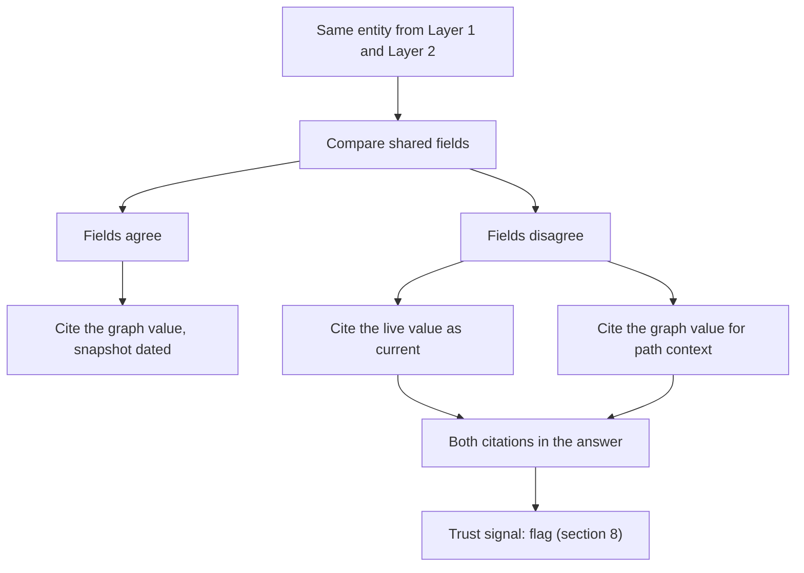

A detected conflict routes into the trust signal's `flag` outcome (Decision E, section 8), never a silent pick of one value. The triangulation gate treats an unresolved cross-layer disagreement as a structural non-concordance, which is what `flag` exists for: the answer is not wrong, but the two authoritative sources disagree and a human should see that plainly.

### 7.3 Freshness and version context on every citation

Every citation carries an as-of marker whose shape depends on the layer, not a single generic "last updated" string. This marker is a separate structure attached to a citation by shared `citation_id`, the same separate-structure pattern used for `trust_signal`, not a field on the canonical CitationV1 payload in Section 9.1:

```json
{
  "layer": "layer_1_graph",
  "graph_snapshot_version": "2026-06-15",
  "assembly": null
}
```

```json
{
  "layer": "layer_2_api",
  "fetched_at": "2026-07-25T14:03:00Z",
  "assembly": "GRCh38"
}
```

- Layer 1 citations carry `graph_snapshot_version`, the date the graph was last re-ingested by System 1/2. This is a fixed value per snapshot, not a per-query timestamp.
- Layer 2 and Layer 3 citations carry `fetched_at`, the timestamp of the live call that produced the value (or the cache entry's fetch time, when served from Redis).
- Any coordinate or sequence answer carries an explicit `assembly` field (`GRCh37` or `GRCh38`), never left implicit. This is the direct consequence of the dbVar and ClinVar coordinate findings in the capability sheet: mixing assemblies without saying so is a named fail condition in the eval spec's Q1 and Q2 cases, and a hard fail in the offline eval rubric when assembly and version context is missing from a coordinate or sequence answer.

The Write step refuses to state a coordinate or sequence claim with `assembly: null`. If the underlying tool result did not resolve an assembly (for example a dbVar record whose placement list has no entry for the requested build), the answer states that gap explicitly rather than picking one.

### 7.4 Acceptable-staleness threshold

Decided (confirmed 2026-07-25). This is the parked thread this section resolves; the value and policy below are locked, not a proposal awaiting confirmation.

Staleness means something different at each layer, so one number cannot cover all three. The 30-day and 90-day thresholds below apply to Layer 1, the graph snapshot, only. Layer 2 and Layer 3 have no staleness threshold at all: a live API call is always current by definition the moment it runs, and their TTL rows exist purely as a Redis cache-cost lever (how long a cached response is served before the next call goes live), never as a statement that the underlying NCBI or enrichment data is stale.

| Layer | What staleness means | Threshold | Action when exceeded |
|-------|-------------------------|------------------------|---------------------------|
| Layer 1 (graph) | Age of the current snapshot for a volatile field class. The only layer staleness applies to. | 30 days for volatile classes (ClinVar classification and review status, GTR test status), 90 days for stable classes (Gene coordinates, Taxonomy) | Auto-cross-verify the volatile field against a live Layer 2 call before citing it as current, per the 7.1 priority rule |
| Layer 2 (NCBI APIs) | Not staleness. A live call is current by definition; the number below is a cache-cost window, not a data-age check | Section 4's verified cache TTLs: gene 1 week, variant 1 week, publication 1 day | Cache entry expires, next call is live and repopulates the cache |
| Layer 3 (enrichment) | Not staleness, same distinction as Layer 2; the number below is a cache-cost window | Publication-tied sources (PubTator3) inherit the 1-day publication TTL; variant-tied sources (LitVar2) inherit the 1-week variant TTL; ClinicalTrials.gov listings get a 1-day TTL, since trial status (recruiting, completed, terminated) is operationally load-bearing and changes faster than a publication record | Cache entry expires, next call is live |

Rationale for the Layer 1 split: the graph is not re-ingested on a fixed schedule today (Phase 4 has not set a cadence), so a hard age-based check is the mechanism that catches a snapshot going stale between re-ingestions, not a claim about how often re-ingestion actually runs. Thirty days for volatile fields matches how quickly ClinVar classifications and GTR test listings can move relative to a slower-moving structural fact like a gene's chromosome location. Both numbers are starter values in the same sense the cost caps are starter values (DECISIONS.md, 2026-07-21): locked for build, tunable in Phase 4 once real re-ingestion cadence data exists, and any change to the value needs the same explicit approval a cap change needs.

This threshold is distinct from the `assembly`/version-context requirement in 7.3: staleness is about how old the data is, version context is about which build or snapshot it came from. A coordinate answer can be simultaneously fresh (Layer 2, fetched seconds ago) and clearly labeled (`assembly: GRCh38`); both properties are required, and neither substitutes for the other.

## 8. Synthesis and the trust signal

The Write step is the last code-and-model boundary before an answer reaches a surface. Two things are true of it by design: the model writes narrative, and the harness decides what counts as grounded, cited, and trustworthy. Nothing in this section allows a model call to make that decision. Section 9 defines the provenance type this section's outputs carry; sections 10 and 11 define what reaches Write in the first place.

### 8.1 The Write step: deterministic synthesis over structured findings

Synth receives only structured tool_result findings assembled by the Act step, never a raw retrieved document. A finding that started as untrusted free text (an abstract, an annotation, a record body) has already passed through the isolated reader (Decision C) before Synth ever sees it. Structured graph rows and structured API fields pass straight through with no reader pass, since they are already shaped and safe.

Each finding the Synth prompt carries has this shape:

```json
{
  "type": "object",
  "properties": {
    "ref_index": {"type": "integer", "minimum": 1},
    "citation_id": {"type": "string", "maxLength": 64},
    "layer": {"type": "string", "enum": ["layer_1_graph", "layer_2_api", "layer_3_enrichment"]},
    "tool": {"type": "string", "maxLength": 64},
    "field": {"type": "string", "maxLength": 128},
    "field_value": {"type": "string", "maxLength": 2000},
    "source_url": {"type": "string", "maxLength": 512}
  },
  "required": ["ref_index", "citation_id", "layer", "tool", "field", "field_value", "source_url"]
}
```

Synth's job is narrative only. It writes prose and places inline markers, `[1]`, `[2]`, keyed to `ref_index` values from the findings list it was given (binding mechanics in 9.4). Two structural rules keep this deterministic:

- One finding, one citable fact: a marker binds to exactly one finding. A sentence drawing on two findings carries two markers, `[1][2]`, not one marker covering both.
- No narrative-only claims: framing language ("in summary", "taken together") is not a factual claim and needs no marker. Any clause that reads as a factual claim with no adjacent marker is treated as untraceable and is stripped by the grounding pass in 8.2, not kept as free narrative.

The findings list itself is code-built, not model-built. The harness compresses and truncates raw tool outputs into this list before the Synth call (the existing result-compression and output-truncation pattern). Synth cannot reach outside the list for facts: there is no raw record in its context to reach into.

### 8.2 Deterministic cite-or-refuse grounding

This is the concrete implementation of the AI answer grounding gate in production-standards: every claim ties to a specific retrieved finding, checked by an exact or substring match after normalization, never a fuzzy or model-judged score.

Algorithm, run by the harness after Synth returns narrative text and before any token reaches a surface:

1. Parse the narrative for marker spans (`[1]`, `[2]`, and so on) and the clause each one is adjacent to.
2. Resolve: does the marker's number match a `ref_index` in the findings list given to this Synth call? If not, the marker is hallucinated. Drop the clause and the marker together.
3. Extract: the clause text bound to a resolved marker becomes the claim text.
4. Normalize both the claim text and the finding's `field_value`: lowercase, collapse internal whitespace to a single space, strip leading and trailing punctuation, and remove a thousands separator (a comma or thin space sitting directly between two digits) so `"15,310"` and `"15310"` normalize to the same string. This last piece (finding F-2.2-05) only equates two spellings of one number; the lookaround that finds it fires solely between two digits, so it never touches a comma between words or a colon inside a CURIE, and two different numbers still fail to match. Without it, a correct, well-cited answer stating a real count was stripped and refused over a comma.
5. Match: accept as grounded only if the normalized claim text equals the normalized field value, or one is a substring of the other. No embedding similarity, no LLM-judged closeness, no partial-credit scoring.
5a. Number check: every standalone number in the claim text must also appear in the finding's `field_value`, in the user's own question, or in the finding's own identifying context (its CURIE and label). Step 5's substring rule accepts a claim whenever the finding's value is a substring of the (longer) claim, and that direction has a hole: an unrelated invented number can ride along on a real, matched identifier, for example a claim citing "BRCA1 has 15310 variants and 400 orthologs" where only the variant count is real. A number already present in the question or in the cited record's own identifier is not invented, since restating the subject of a question or naming the record being cited is what a readable answer does; it is only a number found in none of those three places that is treated as fabricated.
5b. Content check: every content-bearing word in the claim, articles, copulas, and connectives excluded, must appear in the finding it cites or in the user's own question. Step 5's substring rule answers whether a clause mentions the cited value, not whether the clause is true about it, so a negation, an invented drug regimen, or a fabricated claim of causation can all ground cleanly on the strength of a correctly matched identifier alone. A small, closed allowlist treats "associated with", "related to", "linked to", and "connected to" as equivalent phrasings of the same underlying graph relationship; "causes" is deliberately excluded from that group, since a causal claim is stronger than, and different from, a correlational one, and must not ground on a relationship the finding only supports as an association.
6. Reject: any clause failing step 5, 5a, or 5b is stripped, marker included. The count of stripped claims is retained for the eval harness and the audit trail (11.5), never surfaced as a citation.
7. Whole-answer refuse: if stripping removes the query's core ask entirely, discard the partial narrative and return the refuse path (8.4) rather than ship a thin or misleading answer.

```python
def ground_claim(claim_text: str, field_value: str) -> bool:
    a = normalize(claim_text)
    b = normalize(field_value)
    return a == b or a in b or b in a
```

Steps 5a and 5b are deliberately additive rather than a replacement for step 5's match: each only ever rejects a clause step 5 would have accepted, and neither ever accepts a clause step 5 would have rejected, so together they tighten the gate without weakening it (per `goal-contracts`, the direction a verify surface is allowed to move).

This check runs identically regardless of risk tier. Every answer passes 8.2 before 8.3 runs; risk tier changes what happens after grounding succeeds, not whether grounding is required.

### 8.3 The deterministic trust signal

Decision E fixes the shape of this rule: a decision table over risk tier, grounded, and triangulated, yielding one of four outcomes, answer, flag, ask, or refuse. No step in this rule is model-judged.

#### 8.3.1 Risk tier: deterministic intent classification

Risk tier is computed per claim, not per query, since a single answer can mix a low-stakes identifier lookup with a clinical-adjacent assertion. A claim is high risk when its finding's field falls into a fixed set of clinical-adjacent or mechanistic fields:

| Signal (finding's source field or relationship type) | Risk tier |
|---|---|
| ClinVar `clinical_significance`, `review_status`, or ACMG-criteria fields | High |
| OMIM phenotype-gene mechanistic or causal mapping | High |
| PubTator3 or LitVar2 extracted relationship of type cause, associated_with, or treat, where the object is a Disease or Phenotype entity | High |
| Pathogen Detection AMR genotype-to-clinical-outcome fields | High |
| Identifier lookups, bibliographic metadata, dataset or BioProject metadata, cross-reference resolution | Low |
| Anything not matching a high-risk row above | Low (default) |

#### 8.3.2 Triangulation: a structural concordance check

Triangulation only runs for high-risk claims. It compares categorical field values across independent-origin sources, never free text similarity.

Independent origin: two findings count as independent only if they come from different origin databases (a Layer 1 graph snapshot of ClinVar and a Layer 2 live ClinVar fetch are the same origin and do not count as two independent sources for this check).

Equivalence buckets (example, clinical significance): a fixed, versioned lookup table groups categorical values before comparison.

| Bucket | Values that map into it |
|---|---|
| Pathogenic-leaning | Pathogenic, Likely pathogenic |
| Benign-leaning | Benign, Likely benign |
| Uncertain | Uncertain significance, Conflicting interpretations of pathogenicity, no assertion criteria provided |

Triangulation result:

| Independent sources found | Bucket agreement | Result |
|---|---|---|
| 2 or more | All map to the same bucket | Concordant |
| 2 or more | Map to different buckets | Discordant |
| Fewer than 2 | Not applicable | Insufficient |

#### 8.3.3 The decision table

| Risk tier | Grounded (8.2) | Triangulation result | Outcome |
|---|---|---|---|
| Low | False | Not applicable | Refuse |
| Low | True | Not evaluated | Answer |
| High | False | Not applicable | Refuse |
| High | True | Concordant | Answer |
| High | True | Discordant | Flag |
| High | True | Insufficient | Ask |

Grounded is the gate every other row depends on: an ungrounded claim refuses regardless of risk tier, per 8.2. Ask is reserved for a high-stakes claim resting on a single independent-origin source. It errs toward caution rather than a confident answer, per Decision E's "accepting some over-flagging."

Operationalization note: DECISIONS.md Decision E names the four outcomes and the three inputs; the specific partition of triangulation into concordant, discordant, and insufficient, and the mapping of insufficient to ask rather than flag, is the concrete rule drafted here to make the table exhaustive and deterministic. It is consistent with every locked decision but has not itself been logged as a DECISIONS.md row; flagging for phase-checkpoint to log if confirmed as written.

#### 8.3.4 Aggregating to answer level

Each grounded claim gets its own trust_signal, attached to its citation. The harness also computes one answer-level trust_signal by taking the most restrictive outcome among the answer's claims (refuse outranks ask, ask outranks flag, flag outranks answer). The UI (section 12) renders per-citation signals as chip-level indicators and the answer-level signal as a single banner, so a mostly-clean answer with one flagged claim shows the flag on that claim specifically, not as a blanket disclaimer over the whole response.

### 8.4 The refuse path: the NCBI cross-database fallback link

A refuse outcome, whether from whole-answer grounding failure (8.2 step 7) or the trust-signal rule (8.3.3), always emits a fallback link rather than a dead end.

Construction:

1. `base = "https://www.ncbi.nlm.nih.gov/search/all/?term="`.
2. `query_term` is the user's original query text, or the Think step's normalized entity string when one was resolved.
3. `encoded = urllib.parse.quote(query_term, safe="")`, full percent-encoding, no exempted characters, since this is a full query string, not a path segment.
4. `link = base + encoded`.
5. Before the link is ever attached to an event, validate it against the host-pinned regex from section 9.3. A string-building bug can never produce a link off `ncbi.nlm.nih.gov`, because the check runs on the fully constructed URL, not on the input.

```json
{
  "event": "trust_signal",
  "outcome": "refuse",
  "message": "I could not find grounded evidence for this. Try NCBI's cross-database search:",
  "fallback_link": "https://www.ncbi.nlm.nih.gov/search/all/?term=BRCA1%20founder%20variant%20Ashkenazi"
}
```

A refuse is an intentional content-safety outcome, not a system failure. It closes the response: no further citation or token events follow it, and the `done` event carries status `refused`, distinct from `error`, so section 20's observability and section 23's eval harness never conflate a correct refusal with a broken tool call. This is the same event this repo already requires as a tested path: zero retrieval plus a correct refusal string scores as pass, not fail, in the eval rubric.

Draws from: Decision E, the AI answer grounding gate in production-standards, the assemble-not-classify boundary in the playbook, the Step 3 (2026-07-22) risk-tier decision, the 2026-05-07 harness-assembles-citations-deterministically decision, the Step 2.4 hard-fail and abstain-as-pass rubric rows.

## 9. Provenance and citation model

Every citation the system emits, whether it lands in the UI as a chip, in the REST or SSE stream as a `citation` event, in an MCP tool response, or in a paper-facing export, carries the same provenance type. One type, one schema, four surfaces.

### 9.1 The base provenance type and the citation event

The base fields are locked by Decision A and CLAUDE.md's citations section: `source`, `source_id`, `source_url`, `layer`. The full citation event on the contract carries these plus the display and grounding fields section 8 depends on, plus the four added fields from 9.2.

```json
{
  "type": "object",
  "properties": {
    "citation_id": {"type": "string", "maxLength": 64},
    "display_index": {"type": "integer", "minimum": 1},
    "source": {"type": "string", "maxLength": 64},
    "source_id": {"type": "string", "maxLength": 128},
    "source_url": {"type": "string", "maxLength": 512},
    "layer": {"type": "string", "enum": ["layer_1_graph", "layer_2_api", "layer_3_enrichment"]},
    "field": {"type": "string", "maxLength": 128},
    "claim_text": {"type": "string", "maxLength": 500},
    "evidence_kind": {"type": "string", "enum": ["primary_assertion", "derived_summary", "literature_mention", "external_annotation"]},
    "assertion_confidence": {"type": "string", "enum": ["asserted", "hedged", "contested"]},
    "population_ancestry_context": {"type": ["string", "null"], "maxLength": 256},
    "license": {"type": "string", "enum": ["public_domain_us_gov", "publisher_copyright_abstract_only", "unspecified"]}
  },
  "required": ["citation_id", "display_index", "source", "source_id", "source_url", "layer", "field", "claim_text", "evidence_kind", "assertion_confidence", "license"]
}
```

`population_ancestry_context` is nullable and not required to be non-null: most findings carry no population data at all, and that is a normal, honest state, not a missing field.

`trust_signal` is never a field on the citation payload. It is its own event, `trust_signal` (Section 2.3, Section 8), computed per claim and attached to a citation by shared `citation_id` at render time, not embedded in the citation object itself. Folding it into the citation type would let a single event carry two different concerns, provenance and a grounding verdict, that the harness computes at different points in the pipeline (citation assignment happens in Act and Write; the trust signal happens after grounding, Section 8.2 to 8.3). Keeping them separate events, joined by `citation_id`, is what lets Section 8.3.4's per-claim signal and answer-level banner both work off the same join key without a citation ever needing to be re-emitted to update its verdict.

### 9.2 The four added fields (decided, confirmed 2026-07-25)

Step 1.12 (2026-07-21) named these four fields as a provenance expansion but did not fix their type, allowed values, or population mechanism. This is a parked thread this section resolves. The specification below is locked, consistent with everything already decided.

evidence_kind: type string enum, four values.

| Value | Meaning | How populated |
|---|---|---|
| primary_assertion | The source record states the fact directly (a database field, not a computed or mined value) | Default for cypher_query graph properties, ncbi_efetch and ncbi_dbsnp record fields stored as-is, and pathogen_detection isolate, cluster-membership, and AMR fields copied from the PDG snapshot |
| derived_summary | A tool-computed aggregation over multiple records (a count, a rollup) | Set by the tool code itself when it emits a field it computed rather than copied, for example "47 pathogenic variants across 8 genes" |
| literature_mention | An entity or relationship mined from free text by a text-mining tool, not asserted by a database curator | Default for every pubtator_annotate and litvar2_lookup finding, since both are text-mining outputs over PubMed abstracts |
| external_annotation | An enrichment fact from a non-NCBI-database federal source | Default for a clinicaltrials_search finding (ClinicalTrials.gov v2) |

Population is a static, per-tool default table maintained in code, not a per-call model judgment. A tool may override its default for a specific field it knows is computed (marking a field derived_summary even though the tool is otherwise primary_assertion), but the override is itself a fixed rule in that tool's code, not a runtime inference.

assertion_confidence: type string enum, three values, asserted, hedged, contested.

| Source pattern | Confidence |
|---|---|
| ClinVar review_status: practice guideline, reviewed by expert panel, or criteria provided with multiple submitters and no conflicts | Asserted |
| ClinVar review_status: criteria provided with a single submitter, or no assertion criteria provided | Hedged |
| ClinVar review_status: conflicting interpretations of pathogenicity | Contested |
| literature_mention finding whose supporting sentence matches a fixed hedge lexicon (may, possibly, suggests, could, appears to) | Hedged |
| literature_mention finding where two documents extract conflicting relationship types for the same entity pair | Contested |
| Any field with no hedge or conflict signal (a plain gene symbol, an rsID, a bibliographic identifier) | Asserted (default) |

Populated by a fixed lookup table for ClinVar-shaped fields and a fixed lexicon scan for free-text findings, run by the reader (Decision C) at extraction time, never by the Synth model. Both are deterministic string operations, not model judgment, consistent with the trust signal's determinism requirement.

population_ancestry_context: type string or null, max length 256.

| State | How populated |
|---|---|
| A source record carries a named population or ancestry field (dbSNP and Variation Services population-stratified allele frequency data is the primary v1 source) | Copied verbatim from the record field, for example "European (non-Finnish)" or "East Asian" |
| The source record carries no such field | Null. Rendered by the UI as "not specified", never inferred or guessed |

license: type string enum, three values.

| Value | Meaning |
|---|---|
| public_domain_us_gov | A work of the US federal government, not subject to copyright under 17 U.S.C. 105. Default for NCBI-native records (Gene, ClinVar, dbSNP, OMIM metadata, PubTator3 and LitVar2 annotations, Datasets API records) and for pathogen_detection PDG-snapshot data and clinicaltrials_search (ClinicalTrials.gov) records, all US federal sources |
| publisher_copyright_abstract_only | The underlying full-text article carries publisher copyright even though its PubMed metadata and abstract are indexed by NLM | Applied to PubMed and PMC-linked findings where the tool exposes only metadata and abstract, never full text |
| unspecified | The tool has not yet been mapped to a license value | Placeholder only, must not ship in v1 without a confirmed mapping per source |

The license mapping needs an explicit confirmation pass against each source's actual terms of use before build (Phase 6). Treat `unspecified` as a build-blocking gap for any tool that reaches it, not a shippable default.

### 9.3 Host-pinned source_url regex per layer

Every `source_url` is validated against a host allowlist before it is attached to a citation event, per the multi-agent pipeline gate's requirement that a URL field use a host-pinned regex, not a bare scheme check.

```python
NCBI_RECORD_HOST = r"^https://(www\.|pubmed\.)?ncbi\.nlm\.nih\.gov/"
CLINICALTRIALS_HOST = r"^https://(www\.)?clinicaltrials\.gov/"
```

| Tool | Layer | Allowed host pattern | Example source_url |
|---|---|---|---|
| cypher_query | Layer 1 graph | NCBI_RECORD_HOST | `https://www.ncbi.nlm.nih.gov/gene/6927` |
| ncbi_efetch | Layer 2 API | NCBI_RECORD_HOST (plus `omim.org` for OMIM findings) | `https://www.ncbi.nlm.nih.gov/clinvar/variation/12345/` |
| ncbi_dbsnp | Layer 2 API | NCBI_RECORD_HOST | `https://www.ncbi.nlm.nih.gov/snp/rs334` |
| pathogen_detection | Layer 2 API | NCBI_RECORD_HOST scoped to `/pathogens/` | `https://www.ncbi.nlm.nih.gov/pathogens/isolates/#/search/<accession>` |
| pubtator_annotate | Layer 3 enrichment | NCBI_RECORD_HOST | `https://pubmed.ncbi.nlm.nih.gov/32942285/` |
| litvar2_lookup | Layer 3 enrichment | NCBI_RECORD_HOST | `https://pubmed.ncbi.nlm.nih.gov/... ` (the underlying literature record, not the LitVar2 API host) |
| clinicaltrials_search | Layer 3 enrichment | CLINICALTRIALS_HOST | `https://clinicaltrials.gov/study/NCT04368728` |

Two rules keep this tight:

- The citation `source_url` is always the human-navigable record page, never the raw API or fetch endpoint. `eutils.ncbi.nlm.nih.gov` and `api.ncbi.nlm.nih.gov` are fetch hosts only; they must never appear as a `source_url` value, even though they are the hosts the tools actually call to retrieve data.
- A citation whose `source_url` fails its layer's pattern is rejected before it reaches a citation event. This is the same defense-in-depth posture as the redirect example in production-examples: validate the constructed URL, never trust that the building code got it right.

### 9.4 Inline citation-marker binding

Synth writes positional markers, `[1]`, `[2]`, matching the `ref_index` values in the findings list it was given (8.1). Binding runs in two stages:

1. Prompt-time numbering: the harness numbers findings 1 through N in the order it hands them to Synth. Synth's only obligation is to cite an existing number next to the clause it supports.
2. Post-grounding renumbering: after the grounding pass (8.2) strips any hallucinated or ungrounded markers, the harness renumbers the surviving citations sequentially by order of first appearance, 1 through M, with no gaps. This renumbered value becomes `display_index` on the citation event, the number a surface renders as the visible marker glyph (`[1]`, `[2]`). It is a rendering field, never a binding key: the wire-level marker never changes representation. A `token` event's `marker_ids` array (Section 2.4) always carries `citation_id` values, both before and after renumbering, so a surface binds a token to its citation by the stable opaque key, then looks up that citation's `display_index` only to decide which number to print. The internal `citation_id` itself (assigned when the finding was first recorded from a tool_result) never changes and is what the audit trail (11.5) and the eval harness key on.

The UI adapter renders `display_index` as a clickable chip. Clicking or hovering surfaces the full provenance object for that `citation_id`, including `trust_signal`, `evidence_kind`, and `assertion_confidence`, so a flagged or single-source claim is visibly distinct from a fully concordant one at the point of citation, not just in a banner.

### 9.5 Exportable citation format for paper-writing

Decision F marks paper-facing provenance and export as first-class. This mainly serves persona 1, literature researchers, who need to carry a cited claim out of the tool and into a manuscript.

Export is requested per interaction (or per selected citation set) with a format parameter:

| Format | Shape | Primary consumer |
|---|---|---|
| vancouver | NLM and Vancouver-style formatted string per citation, the convention PubMed itself uses, for example "Smith AB, Lee CD. BRCA1 founder mutations in Ashkenazi Jewish populations. J Med Genet. 2019;56(4):221-229. PMID: 32942285." | UI export button, default format |
| bibtex | One BibTeX entry per citation, keyed by `citation_id` | Reference-manager import |
| json | The full provenance object array, unformatted | MCP and CLI delivery surfaces (section 13), programmatic reuse |

A non-literature citation (a Gene or ClinVar record, not a PubMed article) exports in a record-citation shape rather than a Vancouver article citation, for example: "NCBI Gene. HNF1A [Internet]. Bethesda (MD): National Library of Medicine. Gene ID: 6927. Available from: https://www.ncbi.nlm.nih.gov/gene/6927." Vancouver format is the default because it is the convention biomedical journals already expect; bibtex and json exist for the two other concrete consumers (a reference manager, a downstream program) rather than as speculative options.

Draws from: Decision A citation event, Decision F paper-facing export, the provenance decision (Step 1.12, 2026-07-21), CLAUDE.md's citations-non-negotiable section, the multi-agent pipeline gate's URL host-pinning requirement in production-standards. Resolves the parked four-provenance-fields thread; the field specification in 9.2 is decided (confirmed 2026-07-25).

## 10. Guardrail implementation

The Guardrail step is the first of the five-step loop and the only step every query passes through before any model call happens. Its job is admission control: decide whether a query is even allowed to reach Think, and at what cost. Section 11 covers the companion problem, defending the loop against untrusted content that gets retrieved after admission; this section is entirely about the input side.

### 10.1 Pipeline overview

Ordered steps, each one gating the next:

| Step | What it checks | Cost | On failure |
|---|---|---|---|
| 1. Cheap non-LLM pre-filter | Off-topic, explicit medical-advice request, obvious injection markers | In-process, no model call | Reject immediately for a confident match |
| 2. Pydantic boundary validation | Type, length, and shape of the request payload | FastAPI request parsing | 422, request never reaches guardrail logic |
| 3. Guard-tier classification | Nuanced prompt-injection and off-topic cases the pre-filter could not resolve | One cheap model call | Reject with a reason |
| 4. Forbidden query type and read-only check | Verdict-seeking or write-seeking intent | In-process | Reject with the evidence-assembly framing |
| 5. Rate and cost pre-check | Per-user daily cap, system-wide daily cap | In-process, reads counters | Reject with a graceful cap message |
| 6. Admit to Think | None of the above tripped | | Query proceeds |

A query that fails any step emits a `guard` event with an outcome and a reason and never reaches Think, Plan, or Act.

### 10.2 The cheap non-LLM pre-filter

Per the Step 1.12 decision that a non-LLM classifier serves as a pre-filter before Guard-tier cost, and the Step 1.10 decision to adopt the zero-cost pre-LLM guardrail pattern, step 1 runs entirely in Python with no model call:

- Biomedical allowlist: the query must match at least one term from a fixed biomedical keyword and entity vocabulary (BioLink category names, NCBI database names, common gene symbols and disease terms). No match at all is an immediate off-topic rejection.
- Medical-advice block: a fixed set of request patterns ("what should I take for", "am I going to die", "diagnose me", "should I get tested") reject immediately with the evidence-assembly framing, since these ask for a verdict, not evidence.
- Injection markers: a fixed set of literal patterns ("ignore previous instructions", "you are now", "reveal your system prompt", "disregard the above") reject immediately.

A confident match on any of the three rejects with zero LLM cost. An ambiguous query, one that clears the allowlist but does not clearly match a block pattern, passes through to step 3 for the nuanced Guard-tier classification. The pre-filter is a coarse, fast net; it is not expected to catch everything, and it does not need to.

### 10.3 Pydantic validation at the FastAPI boundary

Every request to the chat endpoint is typed and length-bounded before any business logic runs. No raw dict or untyped payload reaches Guardrail code.

```python
class ChatRequest(BaseModel):
    query: str = Field(..., min_length=1, max_length=2000)
    conversation_id: str | None = Field(None, max_length=64)
    user_id: str = Field(..., max_length=64)
```

FastAPI rejects a malformed request with a 422 before the pre-filter or the Guard-tier model ever see it. This is the same discipline production-standards requires everywhere: validate and type-coerce at the boundary, never accept an arbitrary dict on an endpoint that touches the graph, an NCBI API, or the agent loop.

### 10.4 Prompt-injection rejection

Two layers work together, one cheap and coarse, one model-based and nuanced:

- The pre-filter (10.2) catches the obvious cases with zero cost.
- The Guard-tier model classifies the subtler cases with a schema-validated structured output, `{is_injection: bool, confidence: float, reason: str}`, rejected or accepted per the multi-agent pipeline gate's requirement that every tool and subagent output validate against a schema before the next hop.

This is defense in depth, not the sole control. Because the NL-to-Cypher separation principle means user text never becomes a query directly, an injection attempt that slips past both classification layers still cannot reach Layer 1 execution: the Plan step produces structured intent, and only the cypher_query tool's own constrained generation step, not free user text, ever produces Cypher. Guardrail classification is the first line; the architecture is the second.

The companion defense, treating retrieved Layer 2 and Layer 3 content as data rather than instructions once a query is already admitted, is section 11's job, not this one's. Guardrail only ever sees the user's own input.

### 10.5 Forbidden query types and read-only enforcement

Forbidden intents, checked in-process after Guard-tier classification clears:

- Personal medical advice, diagnosis, treatment recommendation, a pathogenicity classification, or a variant prioritization verdict. Rejected with a fixed message reframing to evidence assembly: "I can show you the cited evidence on this, but I can't render a diagnosis or a classification." This is the assemble-not-classify boundary applied at the guardrail, not just at answer time.
- Any attempt to request a write, mutation, or deletion against the graph, even a hypothetical or indirect phrasing ("add a node for this gene", "update this record's status"). Rejected outright.
- Off-topic or non-biomedical queries. Rejected and redirected toward what the system does handle.

Read-only enforcement is defended at three independent points, not one:

| Layer | Mechanism |
|---|---|
| Guardrail (this section) | Rejects a write-seeking request before it reaches Think, Plan, or Act at all |
| Tool-level | The cypher_query tool's Cypher validator rejects any write-shaped clause (CREATE, MERGE, SET, DELETE, REMOVE) before execution |
| Connection-level | The database connection uses the kg_reader role, which has no write grant in Postgres or AGE, so even a validator bug cannot produce a write |

No single layer carries the whole guarantee. A prompt cannot induce a write because there is no path from prompt to write grant, at any of the three points.

### 10.6 Rate and cost pre-checks

Guardrail checks only the caps that gate admission before a query has run at all; the per-query dollar cap and per-step timeouts are enforced later, inside the harness during Act and Write (section 19), since the query's actual cost is not known until it runs.

| Cap | Value | Checked at |
|---|---|---|
| Per-user daily query count | 100 queries per day | Guardrail, before admission |
| System-wide daily spend | $10 per day | Guardrail, before admission |
| Per-query hard cost cap | $0.10 | Harness, during Act and Write |
| Per-step timeout | 5s lookup, 10s single-hop, 30s multi-hop, 2min deep research | Harness, per tool call and per Write call |

A rejection at either admission-time cap returns a graceful, dollar-free message, consistent with the cost-amendment's builder-only cost visibility: the end user sees "you've reached today's limit," never a number.

Draws from: the PRD guardrails section, ai-security-standards, production-standards input handling, the Step 1.10 zero-cost pre-LLM guardrail decision, the Step 1.12 non-LLM pre-filter decision, the Step 1.11 cost-cap values, the NL-to-Cypher separation decision.

## 11. Security implementation

Section 10 defended the input side of the loop. This section defends everything after admission: retrieved content the loop does not control, the one component allowed to read it unmediated, what happens to a captured interaction, where secrets live, and how every tool call is audited.

### 11.1 Prompt-injection defense across the loop

Every record, abstract, and annotation a Layer 2 or Layer 3 tool returns is untrusted external content fetched at query time. A crafted or malformed field inside any of those payloads is data, never a system instruction, and nothing in the loop is allowed to act on it as one.

- Every Layer 2 and Layer 3 tool result is schema-validated on the way back into the loop, with `maxLength` on every string field and `maxItems` on every array, before it reaches any prompt. This is the multi-agent pipeline gate, applied at this specific hop.
- The isolated reader (Decision C) is the only component in the loop that ever sees untrusted free text: an abstract body, an annotation field, a record's free-text description. Its one job is extraction into the findings schema from 8.1, entity, relationship, confidence, source span. It has no tool-calling ability of its own, so an embedded instruction in the text it reads has nothing to act with, per system-design-patterns rule 8: the strongest constraint is removing the ability, not asking the model not to use one.
- The reader's own output is itself schema-validated before Synth ever sees it. Even a successfully subverted reader can only emit a malformed field, which fails validation and is dropped, not an executable instruction that reaches Synth.
- Synth never receives raw retrieved text. Decision C is explicit: structured graph rows and structured API fields pass straight through, and only free-text payloads get the reader pass. The attack surface for "text tells the model what to do" collapses to the reader alone, which is read-only and single-purpose.
- Retrieved content is never formatted into a system or developer-role message. It enters a model call only as a user-role or tool-role data payload, matching the production-standards rule to separate system instructions from retrieved content structurally, not by convention.

### 11.2 The untrusted-source reader tier separation

The reader's permission grant is fixed and narrow, the concrete implementation of the untrusted-source-reader rule in production-standards and system-design-patterns rule 8.

| Capability | Granted | Rationale |
|---|---|---|
| Read the specific untrusted payload it was invoked on | Yes | Its only job |
| Call the one API tool that fetched that payload, scoped to re-verification only | Yes, scoped | Bounded re-check, never a fresh unrelated call |
| Write to the graph, a database, or the filesystem | No | Never needed for extraction |
| Invoke another tool or sub-agent | No | Prevents chained privilege escalation through the reader |
| Emit anything outside the structured findings schema | No | Output is schema-validated, nothing else leaves the reader |

A reader that were somehow talked into "helpful" behavior by injected text still cannot write anywhere, cannot call an unrelated API, and cannot hand off to another agent. The tool list, not the prompt, is what makes this true.

### 11.3 PII handling on captured interactions

The interactions table (sections 15 and 16) captures query text, normalized entities, route, rubric outcome, citations, coverage tags, feedback, and trace_id, for both the feedback loop and future persistent memory.

- Account PII, email and name, lives only in the auth service's user table. The interactions table carries a `user_id` foreign key and nothing else from the account profile.
- No account PII is ever sent to an external LLM. A Guard, Plan, or Synth prompt carries the query text and structured findings, never a user's profile fields.
- Query text itself may incidentally carry PII if a user types it into their own question. This is the user's own statement, not a system output, so it is captured (not blocked or scrubbed at input time) but bounded by a retention policy: a configurable retention window on the interactions table, purged on a schedule, never retained indefinitely by default. The exact retention window is a Phase 6 build value to confirm, not yet fixed in DECISIONS.md.
- There is no PHI in the system. V1 operates on public NCBI data only, with no patient records, so a BAA is not required, per the PRD.

### 11.4 Secrets in env only

Every credential the system touches is an environment variable or a secrets-manager entry, never code, a prompt, a log line, or a generated doc.

| Secret | Where it lives |
|---|---|
| Hetzner AGE connection string (kg_reader role) | Environment variable locally, Railway environment configuration in deployed environments |
| NCBI API key | Environment variable |
| OpenRouter API key | Environment variable |
| LangSmith API key | Environment variable |
| PostHog project key | Environment variable |
| PostgreSQL user-data connection string | Environment variable |
| Auth session-signing secret | Environment variable |

`.env` stays gitignored locally; `env.example` (section 24) carries the canonical list of required secret names with blank values, never real values. When a secret must appear in a log or an error message for debugging, only the key's name is logged as a literal string, never its value, per the production-examples secrets pattern: "NCBI_API_KEY missing or rejected" is correct, the key value in the message is not.

### 11.5 Tool-call audit trail

Every Layer 2 and Layer 3 access is logged with what was queried and under what authorization, per the PRD security requirements. Three stores serve three different audiences; none substitutes for another.

| Store | What it holds | Audience |
|---|---|---|
| Append-only audit log (for example `logs/query_audit.jsonl`) | Tool name, endpoint, parameters (redacted if incidental PII per 11.3), finding count returned, which credential or role was used (by identifier, never by value), which guardrail pass admitted the request, cost charged, trace_id, timestamp | Security and compliance review |
| LangSmith traces | Full per-run reasoning and tool-call detail, linked by trace_id | Debugging and the offline eval graders (section 20) |
| PostgreSQL interactions table | The user-facing record: query, route, citations, feedback | The feedback loop and future per-user memory (section 16) |

The audit log never inlines a full tool response payload, only a bounded summary (finding count, not the findings themselves), keeping the log itself small and safe to retain longer than the raw traces. "Under what authorization" means the log records which API key or database role served the request and which guardrail step admitted it, never the credential's value.

Draws from: ai-security-standards, production-standards multi-agent pipeline gate, supply-chain-security, Decision C reader isolation, the Step 2.5 interactions-table and privacy decision, the PRD security requirements section.

## 12. Frontend architecture

The React UI is the reference adapter over Section 2's contract. It never retrieves data, never grounds a claim, and never computes a trust signal. Its entire job is: send a `Query` (Section 2.1), open the event stream, and render what Section 2.3 emits. Decision A's "adapters filter" model is literal here: subscribe, filter, render, nothing else.

Draws from: Decision A, Decision F (persona, audience depth), the cost amendment, the PRD UI experience section, production-standards' React/JSX safety and bounded-context rules.

### 12.1 Component architecture

The frontend lives at `frontend/src/` (a separate top-level directory from the Python backend's `src/system_03_search_agent/`, per Section 1.6). Component lineage follows the 2026-07-21 Step 1.10 decision: adapt the reference build's components where they exist, build streaming net-new.

| Component | Responsibility | Lineage |
|-----------|-----------------|---------|
| `pages/HomePage.tsx` | Empty state, example questions, saved queries | Net-new (reference has no equivalent home) |
| `pages/ChatPage.tsx` | Active or completed query view | Adapted from `ChatMode.tsx` |
| `components/chat/ChatShell.tsx` | Page layout, holds the current `run_id` and session state | Adapted from `ChatMode.tsx` |
| `components/chat/QueryInput.tsx` | The plain-language input box, one field, no query syntax | Adapted from `ChatMode.tsx` |
| `components/chat/PersonaHeader.tsx` | Named-scientist label and subtle avatar (Section 14.2) | Net-new |
| `components/chat/QueryPipelineStepper.tsx` | Curated guard, think, plan, tool_start, tool_result steps | Adapted from the reference's pipeline stepper concept |
| `components/chat/AnswerStream.tsx` | Token rendering with inline citation markers | Net-new (reference has no streaming) |
| `components/chat/CitationChip.tsx` | Inline citation marker, opens the citation panel | Adapted from `ResultsPanel.tsx` / `ResultsTable.tsx` |
| `components/chat/CitationPanel.tsx` | Full citation metadata: source, source_id, source_url, layer | Adapted from `ResultsPanel.tsx` |
| `components/chat/TrustSignalBadge.tsx` | Answer, flag, ask, or refuse indicator (Section 8) | Net-new |
| `components/chat/StopButton.tsx` | Aborts the run at any point in the loop | Net-new (reference has no streaming to stop) |
| `components/chat/GuardrailBanner.tsx` | Guardrail rejection, one line, a reason, never silent | Net-new |
| `components/chat/CapMessage.tsx` | Rate or cost cap message, no dollar figure (12.6) | Net-new |
| `components/chat/ReasoningExpander.tsx` | Full curated narrative and tool detail, never raw chain-of-thought (12.8) | Net-new |
| `components/chat/AudienceDepthToggle.tsx` | clinical_brief, researcher, deep_technical control (Section 14.5) | Net-new |
| `components/chat/EmptyState.tsx` | Home-page empty state | Net-new |
| `components/chat/LoadingSkeleton.tsx` | Connecting and guard-pending states | Net-new |
| `components/chat/MedicalDisclaimerModal.tsx` | Session-gated disclaimer, shown once per session | Adapted from the reference's disclaimer modal |
| `components/chat/FeedbackButtons.tsx` | Thumbs up or down, optional text, per-claim rating | Adapted from `FeedbackButtons.tsx` |
| `hooks/useAgentRun.ts` | Creates a run, opens the event stream, dispatches events | Net-new |
| `lib/events.ts` | TypeScript union type mirroring Section 2.3's payload shapes | Net-new |
| `lib/api.ts` | Typed fetch wrappers over Section 13's REST endpoints | Net-new |

### 12.2 SSE consumption: the event dispatcher

A query has two steps. First, `POST /v1/query` (Section 13.1) creates the run and returns `{ run_id, persona_name }` immediately. Second, the client opens `GET /v1/query/{run_id}/events` with `EventSource`, credentialed via the session cookie (`withCredentials: true`), which supports native browser reconnection and `Last-Event-ID` keyed off Section 2.2's `seq` field.

`lib/events.ts` mirrors the payload shapes in Section 2.3 exactly:

```typescript
type Layer = "layer_1_graph" | "layer_2_api" | "layer_3_enrichment";

type AgentEvent =
  | { type: "guard"; payload: { passed: boolean; category: string; reason: string | null } }
  | { type: "think"; payload: { narrative: string; query_class: string;
        resolved_entities: { text: string; curie: string; confidence: number }[];
        clarifying_question: string | null } }
  | { type: "plan"; payload: { narrative: string;
        tool_calls: { tool: string; call_id: string; layer: Layer }[] } }
  | { type: "tool_start"; payload: { call_id: string; tool: string; layer: Layer; status: string } }
  | { type: "tool_result"; payload: { call_id: string; tool: string; layer: Layer;
        status: "ok" | "empty" | "error"; summary: string; result_count: number; truncated: boolean } }
  | { type: "token"; payload: { text: string; marker_ids: string[] } }
  | { type: "citation"; payload: { citation_id: string; display_index: number; source: string;
        source_id: string; source_url: string; layer: Layer; field: string; claim_text: string;
        evidence_kind: string; assertion_confidence: string;
        population_ancestry_context: string | null; license: string } }
  | { type: "trust_signal"; payload: { outcome: "answer" | "flag" | "ask" | "refuse";
        risk_tier: string; grounded: boolean; triangulated: boolean | null } }
  | { type: "error"; payload: { fatal: boolean; scope: string; source: string;
        error_class: string; message: string; retry_after_s: number | null } }
  | { type: "done"; payload: { total_tool_calls: number; elapsed_ms: number; trust_outcome: string } };
  // Both "citation" and "error" mirror Section 2.3's canonical payload shapes exactly,
  // field for field, per Section 9.1 (citation) and Section 22.3 (error).
  // "cost" has no variant in this union. The end-user UI never declares a shape for it
  // (cost amendment, 2026-07-25). done's total_cost_usd field is stripped server-side
  // before it reaches this client (Section 13.1), so it never appears here either.
```

`useAgentRun.ts` registers one `EventSource` listener per known type and dispatches into a reducer:

```typescript
function useAgentRun(runId: string) {
  const [events, setEvents] = useState<AgentEvent[]>([]);
  useEffect(() => {
    const source = new EventSource(`/v1/query/${runId}/events`, { withCredentials: true });
    const knownTypes = ["guard", "think", "plan", "tool_start", "tool_result",
                          "token", "citation", "trust_signal", "error", "done"];
    knownTypes.forEach((type) => {
      source.addEventListener(type, (e: MessageEvent) => {
        setEvents((prev) => [...prev, { type, payload: JSON.parse(e.data) } as AgentEvent]);
        if (type === "done" || (type === "error" && JSON.parse(e.data).fatal)) source.close();
      });
    });
    return () => source.close();
  }, [runId]);
  return events;
}
```

The dispatcher's closing logic branches only on `fatal`, the one field the canonical error shape (Section 2.3, Section 22.3) defines for exactly this purpose. It never reads a `code` or `recoverable` field, since neither exists on the canonical shape; `error_class` (`transient | recoverable | unexpected`) is available for retry-policy decisions elsewhere in the UI, but stream-closing is `fatal`'s job alone.

No listener is ever registered for `cost`. An SSE event name with no registered handler is inert in the browser: it is received and discarded by the connection, never dispatched. This is defense in depth only. The primary enforcement is server-side, in the REST plus SSE adapter's role check (Section 13.1), which never writes a `cost` event onto a non-operator connection in the first place. Losing either layer still leaves the other holding the line.

### 12.3 Streaming the curated narrative, with a stop button

`QueryPipelineStepper` renders `guard`, `think`, `plan`, `tool_start`, and `tool_result` as an ordered list of curated steps, each labeled with the persona name (Section 14.2) and the event's `narrative` or `summary` field. Each step moves through pending, active, and done or error states as its events arrive.

`StopButton` is enabled from the moment the `guard` event passes until `trust_signal`, `done`, or a terminal `error` arrives. Clicking it does two things at once: it calls `POST /v1/query/{run_id}/stop` (Section 13.1) and it closes the local `EventSource` immediately, so the UI feels instantly responsive without waiting on a network round trip. The server independently guarantees the loop actually halts. Stopping an already-finished run is a no-op 200, never an error (the retry-safety gate in production-standards).

### 12.4 Inline citation chips

`AnswerStream` renders each `token.text` in order. For every id in a token's `marker_ids`, it substitutes a `CitationChip` in place of the raw marker. If a marker arrives before its matching `citation` event, the chip renders in a provisional, dimmed state and resolves to the full chip once the `citation` event lands. It never renders before that: no chip is ever built from data the frontend has not received as a verified `citation` event (Section 2.4's binding guarantee).

Clicking a chip opens `CitationPanel` with the full provenance: `source`, `source_id`, `source_url` (host-pinned per Section 9), `layer`, `evidence_kind`. The panel's link out to `source_url` is validated client-side against the same allowed-host set before navigation, per the production-standards redirect-validation pattern, as a second check behind the server's host-pinned regex.

### 12.5 Loading, empty, and home states

| State | Trigger | What renders |
|-------|---------|----------------|
| Cold start | `EventSource` opened, no event yet | A generic connecting spinner, `aria-label="Connecting"` |
| Guard pending | Submitted, no `guard` event yet | `PersonaHeader` with a pulsing indicator, no stepper content yet |
| Home, no active query | User has not submitted a query this visit | `EmptyState`: example questions drawn from the golden dataset, plus the user's saved queries (Decision F personalization) |
| Streaming | `guard` passed through `trust_signal` | `QueryPipelineStepper` plus `AnswerStream`, live |
| Refused | `trust_signal.outcome === "refuse"` | The refusal narrative plus the NCBI cross-database fallback link (Section 8), never a blank pane |
| Terminal error | `error` with `fatal: true` | An error state built from `error.message`, actionable text only, never a raw stack trace or internal code as the sole content |

### 12.6 Guardrail and cap messages, no dollar figures

`GuardrailBanner` renders whenever `guard.passed` is `false`, choosing its copy from `guard.category`.

| Category | Example copy |
|----------|---------------|
| off_topic | This looks outside biomedical research. I can help with a gene, variant, pathogen, or paper question. |
| medical_advice | I can assemble cited evidence about a condition or variant, but a clinician makes the diagnosis or treatment call. |
| injection | That request could not be processed as a research question. |
| rate_limited | You have reached today's question limit. Try again after (reset time). |
| cost_capped | The system is at capacity right now. Please try again shortly. |

`CapMessage` covers the mid-stream case: a non-fatal `error` event (`fatal: false`, `source` naming the cap, for example `per_query_cost_cap`) fired after the loop was already running. Its copy stays partial-result-plus-explanation, per the PRD's edge-cases section: the answer built so far stays visible, with a line such as "This answer stopped early because it reached its processing budget." No copy path in `GuardrailBanner` or `CapMessage` ever renders a dollar amount, a token count, or a cost figure. That is the cost amendment's boundary, enforced here at the copy layer as well as at the event-filtering layer (12.2, Section 13.1): even if a future event carried a number, this component's templates have no dollar-figure interpolation slot to put it in.

### 12.7 The named scientist persona

`PersonaHeader` renders the `persona_name` returned once by `POST /v1/query` (Section 13.1), not repeated on every event. It updates its caption from the currently active step's `narrative` field, for example "Mendel is checking ClinVar for pathogenic variants" during a `plan` or `tool_start` step. Styling stays subtle and serious: a small, static label and a muted icon, never an animated mascot or a cartoon avatar, per the 2026-07-21 decision that the persona builds connection without undercutting the provenance-forward positioning. Section 14.2 owns the assignment mechanism; this component only renders what it is given.

Design note for Section 2 or 13 alignment: Section 2's `think` event payload does not carry a `persona_name` field, and `RequestContext` does not either. This section assumes `persona_name` is resolved once at run creation and returned in the `POST /v1/query` response body (Section 13.1), since the persona is stable for the whole run (and, per Section 14.2, for the whole user), not something that needs to repeat on every streamed event. Flagged here so Section 2 or 13's final text can confirm or adjust the exact placement.

### 12.8 Reasoning depth: the default narrative versus the fuller expander

`ReasoningExpander`, when opened, shows the full, unabridged narrative and structured summary from every `think`, `plan`, `tool_start`, and `tool_result` event received so far, not only the current step the collapsed stepper highlights. It never shows a raw, token-level chain-of-thought trace, because no event in Section 2's taxonomy carries one.

This resolves the same tension Section 2.5 already flags: the PRD's UI-experience section and the 2026-07-21 Step 1.10 decision both describe a "show-full-reasoning expander" revealing the model's raw chain of thought, while Decision A (2026-07-25, later and the controlling core-architecture decision) states reasoning is a curated plan-step narrative, never raw chain-of-thought. This component implements Decision A as written: expanding depth means expanding how much of the curated narrative is shown, never switching to an uncurated source.

Step 4.3 resolution: the PRD's show-full-reasoning wording is superseded by Decision A here too, for the same reason Section 2.5 gives. The PRD's own text is not edited from this tech spec; the supersession is logged for the Step 6.2 prototype reconciliation (DECISIONS.md, 2026-07-24's build-phase doc-review cadence) to update the PRD's wording, not a frontend implementation choice to make here.

### 12.9 Audience-level depth control

`AudienceDepthToggle` is a three-way control mirroring `Query.audience_depth` exactly: `clinical_brief`, `researcher` (default), `deep_technical`. Changing it sets the value sent on the next `POST /v1/query`. It is disabled once a run has started and is mid-stream: the depth a run was dispatched with is locked for that run, so `Write` never has to reconcile a depth change against tokens it has already streamed. Section 14.5 owns what depth changes about synthesis; this component only owns the control's rendering and its disabled state during an active run.

### 12.10 Accessibility: Section 508 and WCAG 2.1 AA

Per the PRD's accessibility section, v1 (the Track 1 prototype) builds toward Section 508 and WCAG 2.1 AA with reasonable-effort implementation: semantic HTML, keyboard operability, and ARIA live regions where streaming content needs one. The full formal conformance audit is a production-track item, not a v1 gate. Section 508's technical requirements align with WCAG 2.0 and 2.1 Level AA, so one implementation pass serves both.

| Success criterion | Implementation |
|--------------------|------------------|
| 1.1.1 Non-text content | The persona icon carries `alt` text or `aria-hidden="true"` if purely decorative; every icon-only control has an `aria-label` |
| 1.4.3 Contrast (minimum) | Body text at least 4.5:1, chip borders and step indicators at least 3:1, checked in both light and dark theme |
| 1.4.4 Resize text | Layout in relative units, verified usable at 200% browser zoom with no clipped content |
| 2.1.1 Keyboard | Every interactive element (`StopButton`, `CitationChip`, `AudienceDepthToggle`, `FeedbackButtons`) reachable and operable by Tab, Enter, and Space, no mouse-only handler |
| 2.4.1 Bypass blocks | A skip-to-main-content link precedes the persona header |
| 2.4.3 Focus order | `MedicalDisclaimerModal` traps focus while open and returns focus to its trigger on close |
| 2.4.7 Focus visible | A visible focus ring on every interactive element in both themes |
| 3.3.2 Labels or instructions | `QueryInput` has an explicit `<label>`, never a placeholder-only affordance |
| 4.1.3 Status messages | The streaming narrative region uses `aria-live="polite"` so each new step is announced without interrupting the one before it; `GuardrailBanner` and `CapMessage` use `role="alert"` for immediate announcement |

Testing in v1: an automated `axe-core` check in CI as a baseline, plus a manual keyboard-and-screen-reader pass before each release. A formal third-party Section 508 audit is out of v1 scope, per the PRD, and deferred to the production track.

## 13. Delivery surfaces

The other three streaming adapters over Section 2's `run(query, context)` contract (REST plus SSE, MCP, CLI; Section 12 already covers the web UI), plus the operator view, which is a role-gated mode of the REST plus SSE adapter rather than a separate surface. Each streaming adapter's whole job is: construct a `Query` and a `RequestContext`, call `run()`, and render or fold Section 2's event stream into the shape its own consumer expects. None of them contain retrieval, grounding, or cost logic. That all stays in the agent core and the harness (Section 1.5's boundary table, Decision A).

GraphQL API and KGX export are the two additional, non-streaming delivery surfaces the locked PRD requires (Section 1.1's six-surface model). They reuse this section's tools and auth but do not subscribe to the event stream, so their design lives with Section 24's deployment topology (GraphQL, a router mounted in the same FastAPI process) and Section 25's build order (build phases 4.3, 4.4), not restated here.

Draws from: Decision A, Decision 24 (MCP outbound-only), the cost amendment, Section 1.6's `adapters/` layout, Section 2.7's per-surface event table.

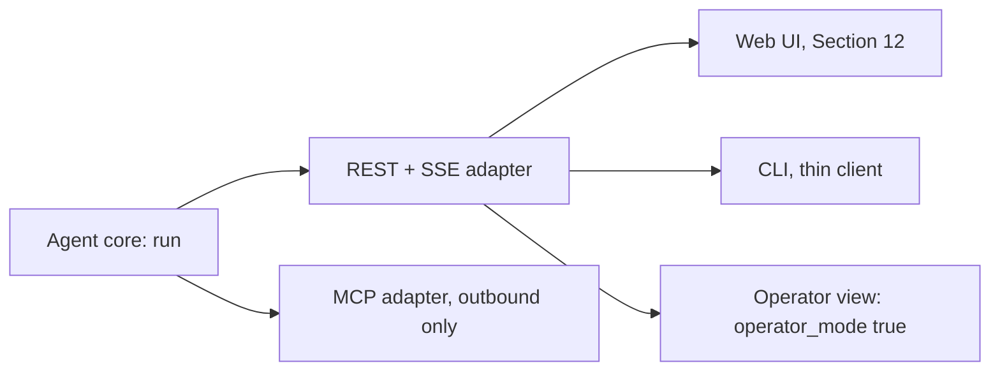

### 13.1 The REST plus SSE API

Lives at `adapters/web_sse/` (Section 1.6). This is the shared backend both the web UI (Section 12) and the CLI (13.3) call. Every request body is a Pydantic model validated at the FastAPI boundary, per production-standards.

| Endpoint | Method | Body or params | Behavior |
|----------|--------|------------------|----------|
| `/v1/query` | POST | `{ text, session_id, audience_depth? }` | Constructs `Query` (server generates `trace_id` as a uuid4, which doubles as `run_id`) and `RequestContext(surface="rest_sse", ...)`, starts `run()` as a background task, returns `202 { run_id, persona_name }` immediately |
| `/v1/query/{run_id}/events` | GET | `Last-Event-ID` header optional | `text/event-stream`, requires the same authenticated identity that owns `run_id`, 403 otherwise |
| `/v1/query/{run_id}/stop` | POST | none | Idempotent: stopping a finished or already-stopped run returns `200`, a no-op, never an error |
| `/v1/query/{run_id}/citations` | GET | none | Full citation objects for a completed run, the paper-facing export shape (Section 9, referenced not restated) |

Note on `run_id`: Section 2.1's `Query.trace_id` is a required field on the internal contract, but an external caller never supplies it. The adapter generates it once, when `POST /v1/query` constructs the internal `Query`, and returns it to the caller as `run_id`. They are the same identifier under two names: `run_id` is the external-facing name for `trace_id`, not a second identifier scheme.

Auth: a session cookie (httpOnly, Secure, `SameSite=Lax`) for the web UI; a bearer API key for the CLI, the MCP adapter's own internal calls, and any other programmatic caller.

Resumability: the server buffers each run's emitted events, keyed by `run_id`, for the run's lifetime plus five minutes, indexed by Section 2.2's monotonic `seq`. A reconnect with `Last-Event-ID` replays from the right point rather than restarting the run, which matters for a CLI session on a flaky connection or a browser tab that was backgrounded mid-stream.

Cost and `done` filtering, the enforcement point for the cost amendment:

```python
async def stream_events(run_id: str, operator_mode: bool):
    async for event in core.subscribe(run_id):
        if event.type == "cost" and not operator_mode:
            continue  # never written to the SSE response at all
        if event.type == "done" and not operator_mode:
            event = event.without_cost_fields()  # Section 2.7's done-cost suppression
        yield to_sse_frame(event)
```

`operator_mode` is never taken from a client-supplied field on the request. It is derived server-side from the authenticated identity's role or scope (an `operator` claim on the session or the API key) before the adapter constructs `RequestContext`. A client cannot request operator visibility by asking for it; it can only have it if its credential already carries the scope. This is the single enforcement point Section 2.7's per-surface table assumes: one role check, one place, rather than four adapters each reimplementing the same filter and risking drift.

### 13.2 The MCP server, outbound-only

Decision 24, reaffirmed 2026-07-22 and 2026-07-24: MCP is never how System 3 reaches the graph or the NCBI APIs. That reachability is Decision D's transport, internal to the tool layer (Section 5, 6). MCP is only how System 3 exposes itself outward, to persona 11 (AI agents and MCP or LLM consumers). It lives at `adapters/mcp/` (Section 1.6), a System 3-authored server, not a third-party dependency, which distinguishes it from the three third-party NCBI MCP servers declined 2026-07-24 as inbound tools.

An MCP tool call is request or response, not a live token stream. Per Section 2.7's table, the adapter waits on the internal event stream until `done`, folding `think`, `plan`, and `tool_start` out entirely and folding `token` and `tool_result` into the final structured response. `citation`, `trust_signal`, `error`, and `done` pass through as the shape of that response.

Tool schema, v1 ships exactly one tool, per the fewer-tools-beats-more-tools principle:

```json
{
  "name": "ask_biomedical_question",
  "description": "Ask a biomedical research question. Returns a cited answer assembled from the NCBI knowledge graph and live NCBI APIs, or an honest refusal.",
  "input_schema": {
    "type": "object",
    "properties": {
      "query": { "type": "string", "maxLength": 2000 },
      "audience_depth": { "type": "string", "enum": ["clinical_brief", "researcher", "deep_technical"] },
      "session_id": { "type": "string", "maxLength": 64 }
    },
    "required": ["query"]
  },
  "output_schema": {
    "type": "object",
    "properties": {
      "answer": { "type": "string", "maxLength": 8000 },
      "citations": {
        "type": "array",
        "maxItems": 50,
        "items": { "$ref": "#/definitions/CitationV1" }
      },
      "trust_signal": { "type": "object" },
      "run_id": { "type": "string", "maxLength": 64 }
    },
    "required": ["answer", "citations", "trust_signal", "run_id"]
  }
}
```

`CitationV1` is Section 9.1's provenance type, field for field, minus nothing: same required fields, same `layer` string enum, same `population_ancestry_context` name. An MCP consumer and the web UI's `CitationPanel` (Section 12.4) read the identical shape, which is now literally true rather than an aspiration, since Section 9.1 is the one place the shape is defined and every other section references it. This is a design choice worth stating plainly: the MCP surface wraps the one core's contract, the same guardrail, grounding, and trust-signal logic every other surface gets, rather than exposing the seven internal tools (`cypher_query`, `ncbi_efetch`, `ncbi_dbsnp`, `pubtator_annotate`, `litvar2_lookup`, `pathogen_detection`, `clinicaltrials_search`) directly as separate MCP tools. A raw per-tool passthrough would let an external agent bypass cite-or-refuse and the cost caps entirely, which is exactly the control the one-core, adapters-filter model (Decision A) exists to hold. The PRD's delivery-formats section describes MCP as wrapping "the same Python tools," which this section reads as wrapping them through the one core, not around it, since Decision A postdates and supersedes any looser reading.

Auth and least privilege: each MCP client authenticates with its own scoped API key, never the web UI's session credential, and gets its own cost-cap and rate-limit bucket tracked the same way as any REST API key (Section 19, 21). It can only ever call `ask_biomedical_question`, which internally exercises only the read-only tool layer. No MCP tool exposes a raw Cypher passthrough or a raw NCBI API passthrough (system-design-patterns rule 8: restrict the tool list first, then write the prompt for what remains).

Cost visibility: an MCP client is an external, end-user-equivalent caller. `operator_mode` is never true for an MCP client in v1, so the folded response never carries a cost field, the same suppression rule as 13.1's non-operator path.

### 13.3 The CLI

Package `system3-cli`, command `s3`. A thin client per the outline: no agent logic of its own, just an HTTP client against the REST plus SSE endpoints in 13.1, authenticated with the caller's own bearer API key stored at `~/.system3/credentials` (file mode 600).

| Command | Behavior |
|---------|-----------|
| `s3 ask "<query>" [--depth clinical_brief\|researcher\|deep_technical] [--session <id>]` | POSTs `/v1/query`, then streams `GET .../events`, parsing SSE frames itself. Same envelope as Section 2.2, no protocol difference from the browser's `EventSource` framing |
| `s3 stop <run_id>` | `POST /v1/query/{run_id}/stop` |
| `s3 ask ... --operator` | Only meaningful if the stored credential itself carries the operator scope. A non-operator credential passing `--operator` has the flag silently ignored server-side, since 13.1's role derivation, not a client-side flag, is what actually gates cost visibility |

Rendering rules:

- `guard` rejected: prints the guardrail-equivalent explanation to stderr, exits nonzero.
- `think` and `plan`: dim status lines to stderr, prefixed with the persona name.
- `tool_start` and `tool_result`: one dim line per tool call, showing its status.
- `token`: printed to stdout as the growing answer body.
- `citation`: appended as `[n]` markers matching each token's `marker_ids`, with a references block printed after the answer listing `source` and `source_url` per marker.
- `trust_signal`: a one-line prefix on the answer body, `[answer]`, `[flag]`, `[ask]`, or `[refuse]`.
- `error`: printed to stderr, exits nonzero unless `fatal` is false and `error_class` is `transient` or `recoverable`, in which case the CLI's own retry policy gets a chance to resolve it first.
- `done`: process exits 0 after the references block prints. Cost fields are never printed for a non-operator credential, because 13.1 already stripped them before the CLI ever received them, so there is nothing left for the CLI itself to filter, the same defense-in-depth relationship as Section 12.2's UI dispatcher.
- Ctrl-C: sends `s3 stop <run_id>` before the process exits, so an interrupted CLI session cleanly halts the server-side loop instead of leaving it running unseen (system-design-patterns rule 6).

### 13.4 The operator view: the one caller that sees cost

The operator view is not a fifth surface. It is the REST plus SSE adapter (13.1) called by an internal-only client, a small admin route in the same web application gated to an operator role, or a direct API-key call from an operator's own tooling, with `operator_mode=True` derived from that caller's authenticated role. It is the only caller for which 13.1's `stream_events` loop forwards the `cost` event and leaves `done`'s cost fields unsuppressed.

Section 19 owns the live per-query meter and the aggregate per-user-daily and system-daily dashboard built on top of that unfiltered stream. This section fixes only the adapter-level fact: operator visibility is a role-gated mode of one adapter, enforced in exactly one place (13.1's role check), not a separate protocol with its own filtering logic to keep in sync.

### 13.5 Per-surface summary

| Surface | Auth | Event shape delivered | Cost event |
|---------|------|-------------------------|-------------|
| Web UI | Session cookie | Live SSE, every event except cost | Filtered |
| REST plus SSE API | Bearer API key or session cookie | Live SSE, every event except cost (operator credential: full stream) | Filtered unless operator |
| MCP server | Scoped API key, one per client | Folded into one JSON result after `done` | Never included |
| CLI | Bearer API key | Parsed SSE, printed incrementally | Filtered unless operator credential |
| Operator view | Operator-scoped session or API key | Live SSE, full stream including cost | Included |

This table is a rendering-focused companion to Section 2.7's authoritative per-event table, not a replacement for it.

## 14. Personalization and memory

Personalization is in scope for v1, but it lives in exactly two places: orchestration (what Think and Plan do next) and presentation (the persona, the depth of the write-up). It never lives in grounding. The answer engine stays deterministic and user-independent at the claim level, so the same query, run stateless against the golden dataset or live inside a personalized session, is graded by the identical grounding rule either way.

Draws from: Decision F, Decision G, the bounded-context rule in production-standards.

### 14.1 The grounding firewall

Two users asking the identical question, with no session history, get the identical set of grounded claims. Only three things ever vary by user or session:

- Presentation: the persona label and voice (14.2).
- Orchestration convenience: Think does not re-resolve an entity it already resolved this session, Plan does not re-run a lookup it already has a fresh finding for (14.3, 14.4).
- Synthesis style: the audience-level depth parameter changes vocabulary and how much background gets spelled out (14.5).

None of these three ever change which tool results get retrieved as a candidate claim's source, and none of them change the cite-or-refuse rule or the trust-signal calculation (Section 8), which run identical code on identical inputs regardless of who is asking or what they asked before.

This is why the firewall matters operationally, not just as a principle. The eval harness runs the golden dataset's competency questions statelessly, with no session memory and no persona, while live sessions are stateful. If personalization ever leaked into grounding, a stateless offline pass could no longer predict live behavior, and the whole point of the offline gate, that it is a trustworthy proxy for what ships, would break. Keeping personalization out of grounding means the Write step's grounding code path is byte-identical whether it is invoked from the eval harness or a live personalized session. The only thing that differs is what Think and Plan saw on the way in.

### 14.2 The stable named persona

The persona is presentation-only: a historical biomedical scientist's name and a subtle, static label, never a change to what tools run or what gets asserted.

Assignment: at first login, the system draws one name from the curated top-100 biomedical-scientist list (curation is a Phase 6 build task, already logged) and stores it on the user's row (Section 15's auth and user-data model). Every subsequent query from that user carries the same name, for the life of the account. It is never reassigned. Before an account exists, an anonymous prototype session gets a persona drawn and held for that session only, then redrawn on the next anonymous session, a gap that closes once auth (Section 15) is live for that user.

The persona name reaches the caller once, in `POST /v1/query`'s response body (`{ run_id, persona_name }`, Section 13.1), not repeated on every streamed event. Section 12.7 renders it; this section only owns where it comes from.

If sub-query decomposition for deep research is ever built (the PRD marks it a triggered upgrade, not v1 scope), bounded sub-steps would carry their own scientist names under the lead persona, per the 2026-07-21 naming decision. That upgrade path is noted here for completeness and is not itself v1 work.

### 14.3 In-conversation session memory: the data shape

Decision G names the shape exactly: resolved entities, compressed prior findings with trace references, and open threads, injected into Think and Plan in the live tail under a hard cap, never grounding. Section 2.1's `RequestContext.session_memory` field carries a `SessionMemorySummary`, defined here:

```python
class ResolvedEntity(BaseModel):
    mention: str = Field(..., max_length=200)     # the free-text phrase the user used
    curie: str = Field(..., max_length=100)         # e.g. "NCBIGene:672"
    entity_type: str = Field(..., max_length=50)     # e.g. "Gene", "Variant", "Disease"

class CompressedFinding(BaseModel):
    claim_summary: str = Field(..., max_length=280)   # a compressed restatement, never re-asserted verbatim
    trace_id: str = Field(..., max_length=64)           # the run this finding came from (Section 2.2, 20)
    citation_ids: list[str] = Field(default_factory=list)  # maxItems 5, the markers that supported the claim

class SessionMemorySummary(BaseModel):
    session_id: str = Field(..., max_length=64)
    resolved_entities: list[ResolvedEntity] = Field(default_factory=list)     # maxItems 50
    compressed_findings: list[CompressedFinding] = Field(default_factory=list)  # maxItems 20
    open_threads: list[str] = Field(default_factory=list)                      # maxItems 10, maxLength 200 each
    token_budget: int = 1500       # hard cap, enforced at injection, never a soft target
    last_updated: datetime
```

Compaction: after each turn's `Write` step completes, an append step adds that turn's new resolved entities, findings, and threads. If the serialized summary then exceeds `token_budget`, a compaction pass runs before the next turn: it drops the oldest `open_threads` first, then merges the oldest `compressed_findings` into a shorter combined entry. `resolved_entities` are never dropped for budget reasons alone, since they are small and high-value for reference resolution; they are instead capped by the 50-item ceiling with FIFO eviction beyond it. This compaction is the concrete instance of production-standards' bounded-context rule: the cap is enforced server-side, before injection into a prompt, never left to a hope that the model stays terse.

### 14.4 Injection point and the hard token cap

`SessionMemorySummary` is formatted into a compact block and appended to the live tail of the `Think` and `Plan` prompts only. For example: "Session so far: resolved BRCA1 to NCBIGene:672. Established: pathogenic variant c.68_69delAG, cited. Open: comparison to BRCA2 not yet run."

It is never injected into `Act`: tool calls always execute against fresh retrieval, never against memory. It is never injected into `Write` as a citable source either. If a `compressed_finding` is relevant to the current answer, `Plan` must schedule it to be re-verified, either a fresh `Act` step or a reuse of the original `trace_id`'s `tool_result` payload if it is still in the per-run cache, so the claim in the final answer is regrounded against the current turn's structured findings, never asserted straight from the summary text. This is the mechanism-level version of 14.1's principle: session memory can shape what `Think` asks and what `Plan` schedules, but it can never itself become a citation.

The hard cap is enforced by a `build_session_context()` function that counts tokens against `token_budget` before injection, server-side, using the actual tokenizer for whichever model tier is receiving the prompt, never a client-supplied or assumed character count. This is the same bounded-context discipline production-standards requires for every retrieved passage or prior tool result injected into a prompt, applied here to the one context fragment that persists across turns instead of arriving fresh each time.

### 14.5 Audience-level depth as an explicit control

`Query.audience_depth` (Section 2.1) is a three-way, user-set control: `clinical_brief`, `researcher` (the default), or `deep_technical`.

| Depth | Effect |
|-------|---------|
| `clinical_brief` | Concise, evidence-first phrasing for a clinician who needs the assembled evidence fast. Still obeys the forbidden-output boundary: it changes vocabulary and framing only, it never unlocks a diagnosis or a classification |
| `researcher` | The default. Full mechanistic detail and standard biomedical vocabulary for a working researcher |
| `deep_technical` | Maximal technical depth: raw identifiers, assembly or version context, full parameter and coordinate detail for a bioinformatician |

The parameter is passed straight to the `Write` step as a synthesis-style input. It changes vocabulary, level of mechanistic detail, and how much background gets spelled out. It never changes which tool results get retrieved, never changes the cite-or-refuse gate, and never changes the trust-signal rule, all of which run identically at every depth. This is what keeps Decision F's "deterministic and user-independent at the claim level" true even though the write-up's shape visibly changes with depth.

Persistence: once auth is live (Section 15), depth defaults to the user's last-used value; before that, it defaults per session. It is always overridable per query, which matters for a programmatic caller such as an MCP consumer (persona 11, Section 13.2), who can set it explicitly on each call with no stored preference at all.

### 14.6 Fast-follow: persistent cross-session memory and store-plus-retrieval

Out of v1 scope, per Decision F and Decision G. Decision G names the deferred alternative directly: a structured store plus retrieval for session memory, as opposed to v1's bounded running summary. It is deferred because the bounded summary is cheap, cache-friendly, and enough to prove the research-partner feel, while the durable `interactions` table (Section 15) already preserves faithful history for both the feedback loop and this later memory, so nothing is lost by waiting.

Planned shape, design intent only, not built in v1: a retrieval step at the start of `Think` queries the user's own `interactions` table rows, scoped to that `user_id`, for past resolved entities, past cited findings, and past feedback. A bounded subset folds into a cross-session summary, injected the same way as `SessionMemorySummary` (14.4): same shape, same hard cap, same rule that it can shape orchestration but never become a citation on its own. Promoting it later is additive to this architecture, not a rearchitecture.

Trigger: per Decision F, this activates once the Section 16 feedback loop's capture stage has built up enough per-user interaction history to be useful, not on a fixed calendar date.

Explicitly not built in v1: no vector index over past sessions, no long-term store beyond the `interactions` table itself, no cross-session entity resolution at `Think` time. This extends the same conservatism the architecture brainstorming already applied to retrieval (no vector memory layer unless SMEs ask for it) to memory as well: add the richer store only when real usage shows the bounded summary is not enough.

## 15. Auth and user data model

System 3 runs two PostgreSQL instances, not one. The knowledge graph (Apache AGE, 115M nodes, 693M edges, on the Hetzner CPX42 box) is Layer 1, read-only, and reached only through the `cypher_query` tool per Decision D. The user-data database is a separate instance with its own host, its own credential, and full read-write for the application's own service role. Nothing in this section ever opens a connection to the graph box, and nothing on the graph box ever sees a user's email, query text, or feedback.

| Instance | Host | Role | Credential |
|----------|------|------|------------|
| Knowledge graph (`ncbi_kg`) | Hetzner CPX42 | Layer 1, read-only | `kg_reader`, enforced at the connection level, double-checked by the Cypher validator |
| User data (`search_agent_users`) | Managed Postgres alongside the Railway-hosted app | Auth, personalization, the feedback loop | The application's own read-write role, set via `USER_DB_URL` in `env.example` |

Two Postgres extensions are enabled on the user-data instance: `pgcrypto` for `gen_random_uuid()` primary keys, and `pg_trgm` for the trigram similarity index that stage 2 of the feedback loop (section 16) will use once it comes online.

### The auth service

The auth service is a FastAPI router mounted at `/auth`, backed by the `users` table below. It is basic user authentication, per the PRD's "basic user authentication returns for v1" decision, not an enterprise IAM layer.

Endpoints:

- `POST /auth/signup`: email plus password, creates a `users` row.
- `POST /auth/login`: verifies the password hash, issues an access token and a refresh token.
- `POST /auth/refresh`: rotates the refresh token, issues a new access token.
- `POST /auth/logout`: revokes the current `auth_sessions` row.
- `GET /auth/me`: returns the caller's profile from the access token.

Token model:

- Access token: a short-lived JWT (15 minutes), signed HS256 with the `AUTH_SECRET` env var already declared in `env.example`. Carries `user_id` and nothing else sensitive. Never carries PII beyond the user id, since the access token is the thing that ends up in request headers and, transitively, in logs.
- Refresh token: an opaque random string, never a JWT. Stored only as its SHA-256 hash in `auth_sessions.refresh_token_hash`, so a leaked database row cannot be replayed as a token. Rotated on every use (the old row is invalidated, a new one issued), which bounds the damage of a stolen refresh token to one use.
- Password hashing: argon2id (the current recommended default), never a reversible encoding, never logged.

This is a self-hosted design, not a managed auth vendor. The architecture brainstorm considered a managed auth service as an alternative (zero auth code, a vendor dependency) and a self-hosted design (full control, no new dependency). This spec picks self-hosted for v1 because it adds no new third-party dependency ahead of the explicit review `supply-chain-security` requires for a new vendor integration, and because the schema below is small enough that the auth code is not a meaningful build cost. Swapping in a managed provider later is a contained change: the `users` table gains an `external_auth_id` column, the `/auth/*` router becomes a thin proxy, and every downstream table that references `users(id)` is untouched.

### Table: users

```sql
CREATE TABLE users (
    id              UUID PRIMARY KEY DEFAULT gen_random_uuid(),
    email           TEXT NOT NULL UNIQUE,
    password_hash   TEXT NOT NULL,
    created_at      TIMESTAMPTZ NOT NULL DEFAULT now(),
    last_login_at   TIMESTAMPTZ,
    profile         JSONB NOT NULL DEFAULT '{}'::jsonb
);
```

`profile` holds presentation-layer preferences only, never grounding-relevant state: audience-level depth (the explicit control from section 14), a display name, and nothing that changes what a citation says. This keeps the personalization firewall from section 14 (personalization lives in orchestration and memory, never in grounding) visible at the schema level: nothing in `users.profile` is ever a parameter the Write step's grounding logic reads.

### Table: auth_sessions

Distinct from the `sessions` table below. `auth_sessions` tracks login state (refresh tokens); `sessions` tracks a chat or query workspace session. Conflating the two would mean revoking a login also erases the running conversation's context, which is the wrong coupling.

```sql
CREATE TABLE auth_sessions (
    id                  UUID PRIMARY KEY DEFAULT gen_random_uuid(),
    user_id             UUID NOT NULL REFERENCES users(id) ON DELETE CASCADE,
    refresh_token_hash  TEXT NOT NULL,
    created_at          TIMESTAMPTZ NOT NULL DEFAULT now(),
    expires_at          TIMESTAMPTZ NOT NULL,
    revoked_at          TIMESTAMPTZ,
    user_agent          TEXT,
    ip_hash             TEXT
);
```

`ip_hash` stores a salted hash of the client IP, not the raw address, enough to flag anomalous refresh-token reuse without keeping a raw IP on file.

### Table: sessions

A chat or query workspace session: the scope that section 14's bounded-running-summary session memory is keyed by, and the parent of every `interactions` row a user produces in one sitting.

```sql
CREATE TABLE sessions (
    id                UUID PRIMARY KEY DEFAULT gen_random_uuid(),
    user_id           UUID REFERENCES users(id) ON DELETE SET NULL,
    title             TEXT,
    created_at        TIMESTAMPTZ NOT NULL DEFAULT now(),
    last_active_at    TIMESTAMPTZ NOT NULL DEFAULT now(),
    experiment_id     UUID,
    experiment_arm    TEXT
);
```

`user_id` is nullable because a session can start before login (an anonymous first query on the workspace home) and get attached to an account on signup. `experiment_id` and `experiment_arm` are the A/B assignment from section 18, set once at session creation and held for the session's lifetime.

### Table: interactions

The shared substrate for both the feedback loop (section 16) and, on the fast-follow path, persistent cross-session memory (section 14). Decision G names eight fields: query, normalized entities, route, rubric outcome, citations, coverage tags, feedback, trace_id. The table below carries all eight plus the identity, timing, and experiment columns the implementation needs around them.

```sql
CREATE TABLE interactions (
    id                   UUID PRIMARY KEY DEFAULT gen_random_uuid(),
    trace_id             TEXT NOT NULL UNIQUE,
    user_id              UUID REFERENCES users(id) ON DELETE SET NULL,
    session_id           UUID REFERENCES sessions(id) ON DELETE SET NULL,
    created_at           TIMESTAMPTZ NOT NULL DEFAULT now(),

    query_text           TEXT NOT NULL,
    normalized_entities  JSONB NOT NULL DEFAULT '[]'::jsonb,
    query_class          TEXT NOT NULL
        CHECK (query_class IN ('lookup','single_hop','multi_hop','aggregate','exploratory')),
    route                JSONB NOT NULL,

    trust_signal         TEXT NOT NULL CHECK (trust_signal IN ('answer','flag','ask','refuse')),
    rubric_outcome       TEXT NOT NULL CHECK (rubric_outcome IN ('pass','fail','abstain')),
    rubric_score         SMALLINT CHECK (rubric_score BETWEEN 0 AND 16),

    citations            JSONB NOT NULL DEFAULT '[]'::jsonb,
    coverage_tags        TEXT[] NOT NULL DEFAULT '{}',
    user_feedback        JSONB,

    experiment_id        UUID,
    experiment_arm       TEXT,
    cost_usd             NUMERIC(9,6),
    latency_ms           INTEGER
);

CREATE INDEX idx_interactions_created_at    ON interactions (created_at DESC);
CREATE INDEX idx_interactions_user_id       ON interactions (user_id);
CREATE INDEX idx_interactions_rubric        ON interactions (rubric_outcome);
CREATE INDEX idx_interactions_coverage_tags ON interactions USING GIN (coverage_tags);
CREATE INDEX idx_interactions_query_trgm    ON interactions USING GIN (query_text gin_trgm_ops);
```

Column-to-decision mapping:

| Decision G field | Column | Notes |
|-------------------|--------|-------|
| Query | `query_text` | Raw user input, pre-normalization |
| Normalized entities | `normalized_entities` | JSONB array, one entry per resolved entity: `{surface_form, curie, entity_type, resolution_confidence}` |
| Route | `route`, `query_class` | JSONB: `{layers, tools, model_tiers}`, produced by Think and Plan (section 17) |
| Rubric outcome | `rubric_outcome`, `rubric_score` | `rubric_outcome` is deterministic and populated on every row at zero LLM cost (the trust signal plus the hard-fail checks); `rubric_score` (0 to 16) is populated only when the full graded rubric runs, which in v1 means offline golden-dataset replay, not every live query |
| Citations | `citations` | JSONB array, one entry per citation, shaped exactly per the canonical provenance type in Section 9.1: `{citation_id, display_index, source, source_id, source_url, layer, field, claim_text, evidence_kind, assertion_confidence, population_ancestry_context, license}` |
| Coverage tags | `coverage_tags` | `concept:<Label>` and `predicate:<edge_type>` strings, feeding the coverage metric's planned move from hand-mapping to dynamic instrumentation |
| Feedback | `user_feedback` | JSONB: `{rating, comment, flagged_reason}`, null until the user acts |
| trace_id | `trace_id` | Joins to the LangSmith run holding the raw trace (section 20) |

Implementation-only columns, not named in Decision G but required to make the table usable: `id` (a stable primary key independent of the trace id's format), `user_id` and `session_id` (so a row can be attributed and grouped), `created_at` (retention and clustering need a timestamp), `experiment_id` and `experiment_arm` (section 18's A/B mechanism, inherited from the parent session at write time), and `cost_usd` plus `latency_ms` (feed the cost dashboard in section 19 without a second query against LangSmith).

### Table: cq_candidates

Proposed and promoted competency questions, with provenance back to the interactions that produced them. Full mechanics in section 16; schema only here.

```sql
CREATE TABLE cq_candidates (
    id                       UUID PRIMARY KEY DEFAULT gen_random_uuid(),
    created_at               TIMESTAMPTZ NOT NULL DEFAULT now(),
    updated_at               TIMESTAMPTZ NOT NULL DEFAULT now(),

    status                   TEXT NOT NULL DEFAULT 'proposed'
        CHECK (status IN ('proposed','approved','rejected','promoted','retired')),
    representative_query     TEXT NOT NULL,
    source_interaction_ids   UUID[] NOT NULL DEFAULT '{}',
    frequency_count          INTEGER NOT NULL DEFAULT 1,

    wedge_type               TEXT
        CHECK (wedge_type IN ('gene-variant-literature','pathogen-sequence-outbreak','paper-data-tool','other')),
    moat_gate_provenance     BOOLEAN,
    moat_gate_deterministic  BOOLEAN,
    moat_rank                TEXT CHECK (moat_rank IN ('tier_1','tier_2','none')),
    llm_judge_rationale      TEXT,

    reviewed_by              TEXT,
    reviewed_at              TIMESTAMPTZ,
    review_decision          TEXT CHECK (review_decision IN ('approve','reject','needs_more_data')),
    review_notes             TEXT,

    few_shot_example         JSONB,
    eval_case                JSONB,
    promoted_at              TIMESTAMPTZ
);

CREATE INDEX idx_cq_candidates_status ON cq_candidates (status);
```

`source_interaction_ids` is a plain array, not a foreign key, deliberately: it lets an interaction row be anonymized or deleted (see section 16's retention policy) without cascading into the candidate record that a promoted competency question depends on. `llm_judge_rationale` is filled by the LLM-judge pre-screen (fast-follow, section 16); only `reviewed_by` and `review_decision`, both human-set, ever move a row to `promoted`.

### Table: saved_queries

The personalization investment loop's storage (PRD "per-user personalization is part of v1"). Mechanics of how this drives personalization belong to section 14; this is only the schema. Declared after `interactions` because it references it.

```sql
CREATE TABLE saved_queries (
    id                       UUID PRIMARY KEY DEFAULT gen_random_uuid(),
    user_id                  UUID NOT NULL REFERENCES users(id) ON DELETE CASCADE,
    query_text               TEXT NOT NULL,
    label                    TEXT,
    created_at               TIMESTAMPTZ NOT NULL DEFAULT now(),
    last_run_interaction_id  UUID REFERENCES interactions(id) ON DELETE SET NULL
);
```

### Separation from the read-only graph

Nothing above shares a connection pool, a credential, or a schema namespace with the AGE graph. The only relationship between the two stores is at the application layer: a `citations` entry's `source_url` points at a graph node or an NCBI record, it never foreign-keys into either. This preserves the read-only guarantee on Layer 1 (Decision D, the `kg_reader` role) independent of anything that happens to the user-data database: even a full compromise of `search_agent_users` grants no path to a graph write, because the graph credential does not exist anywhere in this schema or in the application code that touches it.

Traces to: Decision G (2026-07-25); PRD Security requirements ("basic user authentication returns for v1") and Users and personas (the investment loop); Evaluation_playbook.md's data-storage section.

## 16. Feedback loop pipeline

The evaluation playbook's online feedback loop section is the primary source for this section's five stages, the moat bar each candidate must clear, and the trigger-rule reasoning; it is referenced here, not restated. This section specifies how the loop runs against the schema in section 15: what writes a row, what a human actually does at review time, and where the pipeline stops in v1.

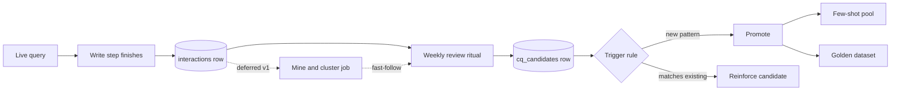

### v1 scope

Ship stages 1, 3, and 5: capture, human-gated review, few-shot promotion. Stage 2 (mine and cluster) is designed below but not built; the weekly review ritual does its job by hand instead. Stage 4 (the trigger rule) runs as part of the same manual review, not as a separate automated pass. This matches the PRD's "automated mining half of the online feedback loop" out-of-scope line and Decision G.

### Stage 1: capture

Every completed query writes exactly one `interactions` row, regardless of its outcome (`answer`, `flag`, `ask`, or `refuse`). The write happens in the Write step's epilogue, after the trust signal and citation list are final:

- The harness assembles the row from state it already has: `query_text` and `normalized_entities` from Think, `route` and `query_class` from Plan, `citations` and `trust_signal` from Write, `rubric_outcome` from the deterministic hard-fail and trust-signal checks (never an LLM call on the live path), `cost_usd` and `latency_ms` from the harness's own cost and timing accumulator, `coverage_tags` derived from which concepts, predicates, and tools actually fired.
- The row is written by a FastAPI background task dispatched after the `done` event is sent, so a slow or failed write never holds up the SSE stream the user is watching.
- The insert is `INSERT ... ON CONFLICT (trace_id) DO NOTHING`, so a retried background task (the harness's own retry-safety discipline, production-standards' retry-safety gate) can never double-write a row. `trace_id` is known from the moment the LangSmith run starts (the Guard step), so it exists before Write finishes and needs no separate reconciliation step.
- A capture failure (a dropped connection to the user-data database) is logged and retried once, then dropped with a warning. It is never surfaced to the user and never blocks or degrades the answer they already received. Losing a row is an acceptable failure mode; blocking the response is not.

### Stage 2: mine and cluster (fast-follow, designed but not built)

Design intent, so the schema above does not need to change when this stage is built: a periodic job (nightly, say) groups `interactions` rows by `query_class` plus normalized-entity overlap, using `pg_trgm` similarity on `query_text` as a secondary grouping signal for phrasing variants of the same underlying question. For each cluster it computes size, the `rubric_outcome` mix, and whether its `coverage_tags` introduce concepts or predicates the current competency-question set does not exercise, then labels the cluster as one of the three signals the playbook names: poorly-routed, untouched-coverage, or a moat win worth reinforcing. Labeled clusters are inserted into `cq_candidates` with `status = 'proposed'` and `source_interaction_ids` populated, exactly the same row shape the manual ritual produces below. Building this only pays off once enough interaction volume exists to cluster meaningfully, which is why it waits.

### Stage 3: human-gated review (the v1 ritual)

In v1 a human performs stages 2 and 3 together, by hand, on a cadence (starter value: weekly, tunable like the cost caps). The ritual:

1. Run a query against `interactions` surfacing candidates for the week, for example rows where `rubric_outcome != 'pass'`, `trust_signal IN ('flag','ask','refuse')`, or `user_feedback->>'rating' = 'down'`, grouped by normalized query text or entity set, ordered by count.
2. Read the flagged interactions directly. Because the pipeline is a general agent, most of what turns up is noise (a single ambiguous phrasing, a transient API timeout) rather than a real gap; the reviewer's job is to find the recurring pattern underneath the noise.
3. For a candidate pattern worth pursuing, insert or update a `cq_candidates` row: `representative_query`, `source_interaction_ids`, `wedge_type`, the two moat gates (`moat_gate_provenance`, `moat_gate_deterministic`), and `moat_rank` from an actual run of the moat test's no-general-tool-equivalent check (the same external empirical test the evaluation playbook defines for the original seven, run by hand against the same panel of general tools).
4. Set `reviewed_by`, `reviewed_at`, `review_decision`, and `review_notes`.

Because the row shape is identical whether stage 2 is manual or automated, turning on the automated mining job later changes only how a `cq_candidates` row gets its first draft, never how review or promotion consume it.

### Stage 4: trigger rule

Applied during the same review pass in v1. A cluster becomes a new candidate when all three hold:

- Frequency: the pattern recurs at least a threshold count within a rolling window (starter value: 3 occurrences in 30 days, tunable).
- Moat bar: both gates pass (provenance, deterministic) and the no-general-tool-equivalent test scores at least partial.
- Novel: it does not already match an existing `cq_candidates` row (checked by `pg_trgm` similarity on `representative_query`, or reviewer judgment in v1).

A cluster matching an existing candidate instead appends to its `source_interaction_ids`, increments `frequency_count`, and leaves `moat_rank` as is: a reinforcement, not a new row. This is where the two moat-test signals deferred from design-time selection, learn-from-the-system and loop-human-behavior, re-enter as re-ranking inputs, per the evaluation playbook.

### Stage 5: few-shot promotion

When `review_decision = 'approve'` on a new candidate, `status` moves to `promoted`, `promoted_at` is set, and the reviewer populates `few_shot_example` and `eval_case` from the representative interaction, generalizing the wording so the example is not tied to one user's literal phrasing (see privacy, below). Section 17 defines the shape of both JSONB payloads and how they land in the orchestrator's few-shot pool and the golden dataset. In v1 this is a manual step run at review cadence; both destinations pick up the new example on the next deploy or eval run, not a live hot reload, which is fine at a weekly promotion cadence.

### Where the LLM-judge sits

The LLM-judge is a filter upstream of the human, never the final say. Two placements exist, one live in v1 and one deferred:

- Offline eval grader (v1, live): a code grader checks the deterministic hard-fails first, then an LLM-judge scores the semantic parts of the 8-point rubric, and a human reviews only flagged edge cases. This produces `interactions.rubric_score` on golden-dataset replay runs, per the eval-harness skill.
- Online candidate pre-screen (fast-follow, not v1): once stage 2 mining is built, an LLM-judge drafts a candidate's `representative_query` and a rationale, written to `llm_judge_rationale`, for the human to approve or reject.

In v1 the online loop has no LLM-judge at all, since stage 2 is deferred and review is entirely manual; only the offline gate's LLM-judge runs. In both placements the schema enforces the human-terminal-gate rule structurally, not just by convention: `review_decision` and `reviewed_by` are set by a human column, never by the pre-screen. The LLM-judge writes `llm_judge_rationale`; it has no column that can move a row to `promoted`.

### Privacy and retention

Query text can carry sensitive framing even without carrying PHI (a query about a specific family member's variant, phrased in the first person). Treat `interactions.query_text` and `user_feedback` as sensitive by default.

| Data | Retention | Handling |
|------|-----------|----------|
| An `interactions` row, full | Life of the account | Needed to power saved queries and the personalization history in section 14 |
| An `interactions` row after account deletion | `user_id` set to null; the row is retained for feedback-loop learning unless the user requests full erasure | Balances the loop's learning value against a deletion request; full erasure removes the row entirely on request |
| `cq_candidates` | Retained indefinitely | Already decoupled from user identity, since `source_interaction_ids` is a plain array, not a foreign key |
| A promoted few-shot example or eval case | Retained indefinitely | The reviewer strips any literal personally-phrased wording before promotion; nothing promoted is a verbatim copy of one user's exact sentence |

Scoped access: only the application's own service role and the reviewer performing the weekly ritual can query `query_text` or `user_feedback` directly. PostHog receives behavioral aggregates only (volume, feedback-click rate, abstain rate, the follow-up funnel), never raw query text, matching Decision G's storage split. LangSmith receives the trace, linked by `trace_id`, which is a separate system with its own retention, not covered by this table's retention policy.

Never store secrets. No column in `interactions` or `cq_candidates` ever holds an API key, a token, or a credential; the tool arguments that reach these tables are domain values (gene symbols, CURIEs, accession numbers), never secrets, so there is nothing to redact before storage.

Traces to: Decision G (2026-07-25); Evaluation_playbook.md's online feedback loop section (the five stages, v1 scope, data storage, and LLM-judge placement, all referenced rather than restated); PRD "Out of scope for v1" (automated mining deferred) and "Security requirements" (no PII to the LLM, least privilege, logged Layer 2/3 access).

## 17. Competency question routing

Phase 0 fixed the promotion mechanism as few-shot routing examples, never a classifier and never fine-tuning (the Step 1.11 routing decision). This section specifies what the few-shot pool looks like today, how a promoted competency question enters it, and how Think decides which data layer a query needs before any of that runs.

### Few-shot routing in the orchestrator today

The v1 pool is small on purpose: the seven (or six, if Q1's feasibility flag trips) must-pass moat questions, seeded once from the evaluation playbook rather than mined from usage. It lives as a versioned file in the repo, `system_03_search_agent/orchestrator/few_shot_examples.py` or an equivalent JSON file loaded once at process start, not a live table read on every request. That matters for the prompt-caching discipline in section 4: the few-shot block sits inside the stable, cache-hot prefix (system instructions, tool schemas, the sliced graph schema), and the caching rule is never change the prompt structure mid-session. A file loaded at startup and held in memory satisfies that; a per-request database read of the pool would not, since a changing prefix defeats the cache.

Each seed example carries the same shape as a promoted `cq_candidates.few_shot_example` (below), so a hand-seeded example and a usage-mined one are indistinguishable to the orchestrator once they are in the pool.

At this size, roughly seven to nine examples, Think and Plan inject the whole pool into the stable prefix on every call. No retrieval or ranking step is needed yet: the pool is small enough that omitting a relevant example costs more (in accuracy) than the marginal tokens of including all of them cost (in cache-adjusted price).

The pool does two jobs inside the LLM call, never as a bypass of it:

- It biases Think's own classification and Plan's own tool-call generation toward the proven pattern when an incoming query resembles a seed example, by giving the model worked examples of the query shape, the entities, and the resulting route.
- It gives the model a template for a fully cross-database question (Q3, Q4, Q8, Q10 style) so a query it has never seen still gets decomposed the way a similar seed question was decomposed.

This is deliberately prompt-level only. There is no separate deterministic route-lookup layer that matches a query against the pool and dispatches without an LLM call: that would function as a lightweight classifier, and Phase 0's decision restricts the routing mechanism to few-shot examples. Adding a route cache is a distinct architecture change that would need its own decision entry, not something this section assumes.

### The upgrade path

Two upgrades are anticipated, in order, neither built in v1:

- Retrieval over the pool. Once the pool grows past the point where injecting every example is still cache-and-context efficient (a rough marker: high teens to twenty examples), switch from inject-everything to inject-top-k: an embedding similarity pass over `query_pattern` and resolved entities selects the k most relevant examples for the incoming query, keeping the stable prefix bounded regardless of how large the pool gets.
- A learned router. Once enough promoted questions and interaction volume exist, a lightweight classifier or a fine-tuned router model becomes viable for the routing decision itself. This mirrors the PRD's "model distillation is a v2 optimization, deferred until query logs stabilize" framing and is explicitly out of v1 scope; it would need its own decision entry when the data exists to evaluate it properly, not a default assumed here.

### From promoted competency question to few-shot example and eval case

A promoted `cq_candidates` row (section 16, stage 5) writes two JSONB payloads, each destined for a different downstream consumer.

`few_shot_example`, appended to the orchestrator's pool:

```json
{
  "query_pattern": "What is known about the {gene} gene?",
  "query_class": "exploratory",
  "resolved_entities": [{"surface_form": "BRCA1", "curie": "NCBIGene:672", "entity_type": "gene"}],
  "route": {"layers": ["layer1", "layer2"], "tools": ["cypher_query", "ncbi_efetch"]},
  "narrative_pattern": "gene record, recent reviews, pathogenic variants, clinical tests, linked conditions",
  "citation_pattern": ["Gene", "PubMed", "ClinVar", "GTR", "MedGen"]
}
```

`eval_case`, appended to the golden dataset the eval-harness runs against (section 23):

```json
{
  "question": "What is known about the BRCA1 gene?",
  "expected_entities": ["NCBIGene:672"],
  "expected_layers": ["layer1", "layer2"],
  "expected_tools": ["cypher_query", "ncbi_efetch"],
  "expected_citation_sources": ["Gene", "PubMed", "ClinVar", "GTR", "MedGen"],
  "fixture_ref": "golden/gene_672_brca1_2026-07",
  "rubric_hint": {"must_not_render_verdict": true}
}
```

The reviewer generalizes the wording during promotion (`{gene}` rather than the literal phrasing one user typed), which is also the privacy step from section 16: nothing promoted is a verbatim copy of one person's exact sentence. The promotion script does two mechanical things at the weekly review cadence: append `few_shot_example` to the orchestrator's pool file, tagged with the `cq_candidates.id` for traceability back to its source interactions, and append `eval_case` to the golden dataset with a fixture reference that pins the data state, satisfying the offline gate's determinism requirement the same way the original seven are pinned. Both take effect on the next deploy or eval run, not a live hot reload, which is adequate at a weekly promotion cadence.

### How Think routes by query shape

Think classifies every query into one of five shapes (the 2026-05-07 simplified-classification decision: query class, target entities, tool list) and that classification picks the primary data layer, the tool whitelist, and the latency budget the harness enforces.

| Query shape | Primary layer | Typical tools | Latency budget | Example |
|-------------|---------------|----------------|-----------------|---------|
| Lookup | Layer 2 | One live API call | 5s | "What is the RefSeq accession for BRCA1?" |
| Single-hop | Layer 2 | One to two Layer 2 tools, optionally corrected against Layer 1 | 10s | "What is dbSNP rs334?" |
| Multi-hop | Layer 1 | `cypher_query`, with Layer 2 correction on suspect fields | 30s | "What conditions link to BRCA1 pathogenic variants?" |
| Aggregate | Layer 1, sometimes Layer 2 | `cypher_query` plus a count or group step | 30s | "How many pathogenic ClinVar variants exist for BRCA1?" |
| Dynamic multi-source or exploratory | All three layers, the full loop | Any of the seven tools, dispatched in parallel where independent | 2 min | Q3: "what's known about BRCA1" |

This is the concrete form of the Step 1.11 routing decision: single-hop questions go to Layer 2 because a graph round trip adds nothing a direct API call does not already give faster; multi-hop questions go to Layer 1 because graph traversal is what the AGE store is for; dynamic multi-source questions run the full loop because no single layer covers them. The few-shot pool above biases this classification toward the proven pattern whenever the incoming query resembles a seed example, but Think still makes this call, via the Plan-tier model, on every query; there is no shortcut that skips the call.

### Defaulting to exact ID and CURIE retrieval

Before any fuzzy matching, Think checks the query text for a recognizable exact identifier: a PMID, an rsID (`rs\d+`), a gene symbol against a small in-memory symbol table, an accession pattern (`NM_`, `NC_`, `NP_`), or a CURIE already in `prefix:local_id` form. An exact match resolves directly and is treated as ground truth for every downstream tool call.

Fuzzy matching, embedding similarity or the PubTator3 and LitVar2 normalization tools already in the Layer 3 roster, runs only when the query has no recognizable exact identifier: a disease phrase, a colloquial description of a pathogen isolate, a gene synonym. Its output is a resolved CURIE, and from that point forward the query is handled as an exact-ID lookup, never as an ongoing fuzzy filter carried through the rest of the loop.

This ordering exists specifically to avoid the identifier-dropping failure semantic search has on gene symbols, rsIDs, PMIDs, and CURIEs: a fuzzy pass over an already-exact identifier can resolve it to the wrong nearby concept, where an exact-match check would have found the right one with no ambiguity at all.

Traces to: the Step 1.11 routing decision (query-shape routing, exact-ID-first retrieval); the Phase 0 few-shot promotion decision; PRD "Competency questions as acceptance criteria"; Evaluation_playbook.md's competency-question set and moat test (referenced for the no-general-tool-equivalent scoring used in promotion, not restated).

## 18. Model selection and the A/B mechanism

Model selection is a separate target from answer quality, per the evaluation playbook: which model or tier is good enough for a step, at what cost, not whether the answer is correct. This section covers the offline method briefly (it is a Phase 6 build task, detailed in the playbook and in the model-bench decision) and then designs the online A/B mechanism the playbook parked for this tech spec.

### Model-bench: the offline primary method

model-bench is the primary tier-selection method and is deferred to Phase 6, run before any live traffic exists. It benches candidates per tier duty (Cypher generation, tool-schema adherence, citation synthesis, guardrail classification) against frozen tasks, scored deterministically for correctness and GeneBench-Pro-style for biomedical judgment, over the candidate set already named in DECISIONS.md. Its output is the initial default model per tier, the arm this section calls control. The method itself, the scoring approach, and the candidate set are specified in the model-bench decision and the playbook's model-selection section; they are referenced here, not restated.

### The parked thread: an online A/B mechanism

Decided (confirmed 2026-07-25). Everything below resolves the evaluation playbook's parked A/B model-combination thread with a locked design. Every parameter (traffic split, sample sizes, thresholds) is a starter value in the same sense the cost caps are starter values: locked for build, tunable once the mechanism runs against real traffic, with any change needing the same explicit approval a cap change needs.

The idea: model-bench alone cannot tell you how a tier choice performs on real usage patterns, because its frozen tasks are a sample, not the live query distribution. The A/B mechanism is the online complement: it randomly assigns live or golden-set traffic across model combinations and compares outcomes, the way the feedback loop in section 16 compares routing outcomes.

#### What varies and what stays fixed

An arm is a `{plan_model, synth_model}` pair. The Guard tier stays fixed across every arm: it is the safety pre-filter, not a target of experimentation, and varying it would conflate a safety change with a quality experiment. The deterministic harness layers stay fixed too: the trust-signal rule, the cost caps, and the cite-or-refuse grounding check are code, not model output, and never vary by arm. Only the Plan-tier model's decomposition and the Synth-tier model's narrative vary between arms.

#### Randomization unit

Assignment is session-level, not query-level, for live traffic: a `sessions` row draws one arm at session creation and holds it for the session's lifetime (`sessions.experiment_id`, `sessions.experiment_arm` from section 15). Two reasons: switching the Plan or Synth model mid-session breaks the stable-prefix prompt cache from section 4, and a user should not feel a different assistant answer differently within one conversation.

A separate query-level mode exists for offline replay against the golden dataset (section 23), where each fixture is stateless and per-query assignment gets a higher-powered comparison faster, since there is no session continuity to protect.

#### Assignment

```sql
CREATE TABLE ab_experiments (
    id              UUID PRIMARY KEY DEFAULT gen_random_uuid(),
    name            TEXT NOT NULL,
    description     TEXT,
    arms            JSONB NOT NULL,
    traffic_split   JSONB NOT NULL,
    status          TEXT NOT NULL DEFAULT 'draft'
        CHECK (status IN ('draft','running','paused','concluded')),
    started_at      TIMESTAMPTZ,
    ended_at        TIMESTAMPTZ,
    created_by      TEXT NOT NULL
);
```

`arms` shape: `{"control": {"plan_model": "...", "synth_model": "..."}, "variant": {"plan_model": "...", "synth_model": "..."}}`. `traffic_split` shape: `{"control": 0.9, "variant": 0.1}`. At session creation, the harness looks up the single `running` experiment (v1 runs at most one at a time to keep comparison clean), draws a weighted-random arm from `traffic_split`, and writes it onto the new `sessions` row.

A new experiment starts at a low variant share (starter value: 10 percent) and only ramps after a human reviews the early comparison below, the same human-gate discipline the promotion pipeline in section 16 uses for a new competency question.

#### Capture

No separate capture path is needed. Every `interactions` row already inherits `experiment_id` and `experiment_arm` from its parent session at write time (section 15), so the existing capture mechanism (section 16, stage 1) is the same mechanism that feeds this comparison. Each run is also tagged with the same `experiment_id` and `experiment_arm` as LangSmith run metadata, so LangSmith's run-comparison view can filter and diff runs by arm directly, without a bespoke dashboard.

#### Comparison metric

Primary: the `rubric_outcome` pass rate per arm. On live traffic this is the deterministic portion only (hard-fails plus the trust signal, at zero LLM cost); on golden-dataset replay it is the full graded `rubric_score` per arm, run through the same offline gate both arms would otherwise be scored against individually.

Secondary, per arm from the same `interactions` rows: `cost_usd`, `latency_ms`, and the explicit `user_feedback` rate (thumbs up or down), the last aggregated through PostHog per Decision G's storage split.

A minimum sample size gates any conclusion: starter value, 30 golden-dataset replays per arm or 100 live interactions per arm, whichever comes first. Past that floor, compare the pass rate between control and variant with a two-proportion test (or a Bayesian beta-binomial posterior, if a continuously updating read is preferred over a fixed test). Either way a human reviews the comparison before acting on it; the mechanism produces a comparison, not an automatic decision.

#### Guardrails

- Hard-fail monitoring is real-time, not batched: if any arm's hard-fail rate (provenance, safety and limits, missing assembly context) drops below the playbook's non-negotiable pass^k = 100 percent target, that arm auto-pauses and all traffic routes back to control. A quality experiment never gets to trade away the one guarantee that must never break.
- Every arm obeys the same per-query, per-user-daily, and system-daily cost caps (section 19). No arm gets extra budget headroom for being a variant.
- Starting, ramping, or ending an experiment is a human action. This mirrors ai-security-standards' human-approval requirement for any behavior change and the same discipline section 16 applies to promoting a competency question: a model-combination change is a behavior change too.

### How model-bench and the A/B mechanism compose

model-bench picks control before launch, offline, against frozen tasks. The A/B mechanism then validates that pick against real or golden-set traffic and searches nearby combinations live. A variant that wins clearly and clears its minimum sample size becomes the new control; the next model-bench run, whenever a new model generation is worth evaluating, benches challengers against that new control rather than the original offline pick. This closes a loop shaped like the competency-question feedback loop in section 16: an offline process sets the bar, an online process validates and updates it, and the update feeds back into the next offline round.

Traces to: Evaluation_playbook.md's model-selection section and its "Open items" A/B model-combination entry (the parked thread this section resolves); the model-bench decision (Step 1.11, DECISIONS.md); Decision G's storage split, reused here for capture rather than duplicated.

## 19. Cost control

Cost caps are safety-critical (system-design-patterns rule 4). The harness (section 3), an in-process module in v1, is the sole owner and enforcement point of every cap in this section. No tool, no model call, and no surface adapter enforces its own cap independently.

### 19.1 The four hard caps

| Cap | Starter value | Scope | Trigger behavior |
|-----|---------------|-------|-------------------|
| Per-query cap | $0.10 | one query's total LLM inference spend across guard, plan, and synth tiers | loop stops, moves early to Write with whatever tool_results already exist, answer ships as a partial cited result |
| Per-user daily cap | 100 queries/day | one authenticated user, resets at a fixed daily boundary | new queries declined for the rest of the day |
| System-wide daily cap | $10/day | total LLM spend across every user | system pauses accepting new queries for the day |
| Per-step timeout | Two shapes, not one, corrected at Step 6.2 (finding F-2.1-16): a per-tier budget for the model-calling steps (Guardrail, Think, Plan, Write), since a classification or synthesis call's cost does not scale with query difficulty; and the query-class budget below (5s lookup, 10s single-hop, 30s multi-hop, 2 minutes deep research) applied only to Act, since a tool call's cost does. Tier budgets are themselves provisional pending build phase 7.0 model-bench re-measurement (`harness/harness.py`'s `budget_for_step` and `_TIER_STEP_BUDGET_S`) | one Think, Plan, Act, or Write step within one query | step aborts, loop synthesizes from whatever partial results exist |

These are starter values (Step 1.11 decision, 2026-07-21), tunable in Phase 4 against real cost data once the system runs. Changing a value is a decision that requires explicit approval, not a silent config edit.

Scope distinction: these four caps bound LLM inference dollars and step latency. The separate at-most-20-API-calls-per-query budget (section 21) bounds Layer 2 and Layer 3 tool-call count, not dollars, since NCBI and enrichment API calls carry no per-call price. The harness enforces both independently, and neither substitutes for the other.

### 19.2 Metering, how a cost is computed and accumulated

- Every guard, plan, and synth tier model call returns token usage from LiteLLM. The harness looks up the OpenRouter price for the exact model that answered and computes `call_cost_usd = prompt_tokens * input_price + completion_tokens * output_price`.
- Layer 1, Layer 2, and Layer 3 tool calls carry no dollar cost. The graph is self-hosted and every NCBI or enrichment API is free, so a tool call never adds to `query_cost_usd`. It still counts against its per-step timeout and the section 21 call-count budget.
- The harness keeps three running counters: `query_cost_usd` for the active query, `user_daily_query_count` per authenticated user, and `system_daily_cost_usd` across all users. All three live in-process (v1, single Railway instance) and persist to the interactions table (section 15) at query completion, so a process restart never loses the day's totals.
- A cap check runs before a model call fires, not only after it returns. The harness estimates the next call's likely cost from the tier's typical token profile and refuses to dispatch a call that would certainly exceed the per-query cap, rather than dispatching first and discovering the overage afterward.
- Retries are metered like any other call. A retried model call (production-standards retry-safety gate, for example a structured-output repair pass) is a new billable event, not a repeat of the first attempt, so its estimated cost is checked against the remaining per-query budget before it is allowed to fire. Tool-call retries carry no dollar cost either way, since tool calls are free.

### 19.3 The cost event on the contract

Part of the section 2 event taxonomy (Decision A, amended by the 2026-07-25 cost-visibility decision). Fires after every metered model call, using the canonical payload shape defined once in Section 2.3 (`query_cost_usd`, `query_cap_usd`, `cap_fraction`, `model_tier`), wrapped in the standard envelope (`type`, `version`, `trace_id`, `seq`, `ts`, Section 2.2). This section adds no new fields, only the accounting rules below.

`query_cost_usd` and `cap_fraction` are running totals for the active query, not deltas, so any subscriber can render a live meter without reconstructing history from prior events. The `done` event carries the final `query_cost_usd` as its terminal value, so a subscriber that misses intermediate cost events still gets the total.

### 19.4 Builder-only live meter and aggregate dashboard

- Every end-user-facing adapter filters the cost event out: the React UI, the public REST and SSE route, the MCP server, and the CLI never forward it (section 13). Only the operator dashboard adapter subscribes to it.
- Live per-query meter: the operator dashboard renders the cost event stream for whichever query is currently in flight, in real time, as an actual dollar figure. The operator, not the end user, needs the real number to judge system health.
- Aggregate dashboard: a rollup over `user_daily_query_count` and `system_daily_cost_usd`, queried from the persisted interactions data (section 15), refreshed on a short poll interval rather than streamed, since aggregate totals do not need sub-second latency.

### 19.5 The graceful user-facing cap message

No dollar figure ever reaches an end-user surface, per the cost-visibility decision. Each cap has a fixed message:

- Per-query cap: the user sees the partial cited result gathered so far, followed by a plain note that the query reached its resource limit before finishing. No number, no currency symbol.
- Per-user daily cap: new queries are declined for the rest of the day, with a plain statement of the reset time. Showing the query count itself (100/day reached) is not a dollar figure and stays visible, matching the PRD's "clear message and a reset time."
- System-wide daily cap: the system states plainly that it has paused accepting new queries for the day to stay within its operating budget. No dollar figure, no technical cause named beyond "operating budget."
- Per-step timeout: not a cap-reached message on its own. It ties to section 22's timeout edge case: the system synthesizes from partial results and explains what timed out.

## 20. Observability

Three complementary systems, plus a tool-call audit log distinct from all three. Each owns one job, so no single outage or retention gap in one system blinds the whole picture.

### 20.1 LangSmith per-run traces

- Wiring: LangGraph integrates natively with LangSmith through the standard tracing environment variables, so every node in the Guardrail, Think, Plan, Act, Write graph is captured as a span automatically, with no manual instrumentation per node.
- One run per query. A `trace_id` is minted at the Guardrail step and threads through every event in the section 2 stream, every LiteLLM call, and every tool call. It is the single join key across LangSmith, the Postgres interactions table (section 15), and the tool-call audit log below.
- A trace captures the full step sequence: the model and prompt for each guard, plan, and synth call, tool inputs and outputs, per-step timing, and the final synthesized answer with its citations. This is exactly what the section 23 eval graders need to re-score a run offline, without re-executing it.
- PII discipline: only the `trace_id` and the query and tool-result content go to LangSmith, since that content is already public NCBI-domain biomedical text. User-account PII from the auth service (email, session token) never leaves the auth service boundary and is never attached to a trace (ai-security-standards).

### 20.2 PostHog behavioral analytics

- Owns product usage, not per-run technical detail: query volume, feedback-button clicks, abstain rate, the follow-up-query funnel, saved-query creation, session length.
- Feeds two consumers directly: the online feedback loop's frequency threshold (section 16, Decision G) and the loop-human-behavior re-ranking signal that the moat-test framework deferred to online observation (Step 2.3 decision).
- Aggregates only. PostHog never receives raw query text or citation content, only event names and counts, so it carries none of the grounding-sensitive payload LangSmith holds.

### 20.3 The tool-call audit log

- A separate, durable, append-only log from LangSmith, because the audit requirement (every Layer 2 and Layer 3 access logged with its authorization, Step 1.12 decision) must survive a LangSmith outage or a free-tier retention limit.
- One line per tool call, whether cypher_query, ncbi_efetch, ncbi_dbsnp, pubtator_annotate, litvar2_lookup, pathogen_detection, or clinicaltrials_search: `trace_id`, tool name, endpoint or database called, redacted params (no API keys, production-standards secrets gate), returned record ids, HTTP status or the body-level error and empty signal for E-utilities calls, latency in milliseconds, and timestamp.
- Written as JSONL to a dedicated audit sink (`logs/tool_audit.jsonl` in v1, the equivalent managed log target once deployed on Railway), append-only, never mutated after write, one writer per process so lines never interleave.
- Doubles as the fail-fast diagnostic (Step 1.11 decision): when a query underperforms, the audit log is the first place to check whether the cause was model-caused (a bad Plan decomposition, a malformed structured output) or harness-caused (a rate-limit block, an API error). That split decides whether the fix is a prompt change or a harness change.

### 20.4 How traces feed the offline eval graders and the cost dashboard

- Eval graders (section 23, the eval-harness skill) pull a run's LangSmith trace by `trace_id`, extract the tool_result set and the final answer's citations, and score the 8-point rubric plus the hard-fail checks (provenance, safety and limits, assembly and version) against what the trace shows the run actually did, not against a fresh re-run. The code graders run first, the LLM-judge second, and a human reviews only flagged edge cases (Step 2.5 decision).
- The cost dashboard (section 19) does not read LangSmith for its dollar figures. The harness's own cost events are the source of truth for spend, computed directly from LiteLLM usage and the OpenRouter price table at call time. LangSmith traces carry timing data, which the operator dashboard can use for latency panels, never for cost panels.
- All three systems share `trace_id` as the one join key: LangSmith for full-fidelity replay and grading, the interactions table for the durable structured record the feedback loop and the dashboard query, and the audit log for security review and root-cause diagnosis when something breaks.

## 21. Rate limiting and concurrency

### 21.1 Per-layer throttling

| Layer or API | Verified limit | Key required | Notes |
|--------------|-----------------|---------------|-------|
| E-utilities (PubMed, Gene, Taxonomy, MeSH, ClinVar, dbVar, OMIM, MedGen, GTR, SRA, BioProject, BioSample, Assembly, GEO) | 3 requests/second without a key, 10 requests/second with a key | optional, raises the ceiling | key passed as `api_key`, lives in an env var only, never in code or logs |
| NCBI Variation Services (dbSNP normalization) | about 1 request/second | no | separate host from eutils, its own budget |
| PubChem PUG REST | about 5 requests/second, no more than 400 requests/minute | no | per-host limit |
| NCBI Datasets API v2 | no published numeric limit found in the live capability sheet verification | no | flagged gap, see the reconciliation note below |
| Enrichment APIs (PubTator3, LitVar2, LitSense, ClinicalTrials.gov v2) | no published numeric limit verified for any of the four | no | flagged gap, see the reconciliation note below |
| Pathogen Detection FTP | not a request-rate API, a bulk file transfer | no | the binding constraint is transfer time and snapshot pinning, not requests per second |

Gap and reconciliation note: a 2026-05-07 decision recorded an NCBI admin key raising E-utilities to 100 requests/second. The 2026-07-25 live verification in the capability sheet found 3 and 10 requests/second on the endpoints actually probed that session. This spec follows the capability sheet's live-verified figures because they are the more recent, directly tested source, and flags the 100 requests/second admin-key status for confirmation before the tool layer is built in Phase 6. It does not silently split the difference between the two. Confirm which figure is live before locking the throttle constants in code.

The Datasets API v2 and the four enrichment APIs have no documented numeric rate limit in the capability sheet. Until a published figure is confirmed, treat each as an interactive HTTPS API and apply the same conservative default as PubChem, about 5 requests/second per host, as a provisional throttle rather than leaving it unbounded.

### 21.2 The shared cap across concurrent users

- Every per-layer limit above belongs to the external API, per host, sometimes per key, sometimes per IP, never to any one user or query. Ten concurrent users each issuing calls against E-utilities draw from the same 3 or 10 requests/second budget, not ten separate budgets.
- The harness enforces this with one token-bucket rate limiter per API family, shared process-wide across every concurrent query. A tool call draws a token from the bucket for whichever family it targets. There is no per-user or per-query sub-allocation at this layer, since the constraint belongs to the API, not the caller.
- Caching (section 4) is the primary pressure-relief valve on the shared bucket. A gene, variant, or publication already cached from another user's query never touches the live rate limiter at all.

### 21.3 The at-most-20-API-calls-per-query budget

- Distinct from the dollar cost cap (section 19): this bounds the count of Layer 2 and Layer 3 tool calls one query may issue, not their price, since NCBI and enrichment calls are free.
- The Plan step drafts a tool-call list against this ceiling up front. The Act step enforces it as a hard stop regardless of what Plan estimated: if a 21st call would fire, from a retry, a wider-than-expected fan-out, or an ELink traversal that returns more targets than planned, the harness refuses it and the loop moves to Write with whatever tool_results already exist.
- This composes with the parallel tool-execution decision (2026-05-07): independent calls within the 20-call ceiling still dispatch through asyncio.gather. The ceiling limits total call count, not concurrency within that count.

### 21.4 The concurrency queue strategy (decided, confirmed 2026-07-25)

This is the parked thread this section resolves. The design below is locked for the Phase 6 build.

- Bounded queue per family: each API family's token bucket has a bounded FIFO wait queue behind it. A tool call that arrives when the bucket is empty waits in that family's queue rather than firing immediately or failing outright.
- Queue depth cap: each family's queue holds at most a few seconds of backlog, a small multiple of its per-second rate, for example roughly 15 to 30 queued calls for a 3 to 10 requests/second family. A call that would exceed the queue depth fails fast immediately with an actionable `rate_limited` error rather than joining an unbounded queue.
- Wait ceiling tied to the query's own latency budget, not one fixed number: a lookup-class query (5 second total budget) accepts only a short queue wait, on the order of one to two seconds, before that call fails fast, since it has little budget left to spend waiting. A multi-hop or deep-research query (30 second or 2 minute budget) tolerates a longer wait, several seconds, before the same fail-fast trigger fires. The queue reads the caller's remaining per-step time budget rather than applying one constant across every query class.
- No user-tier prioritization in v1: every call is served FIFO within its family regardless of which user or query it belongs to, consistent with no paid tiers existing yet. Query class affects only how long that call is willing to wait, never its position in the queue.
- Fail-fast response: on fail-fast, the call returns an actionable error, `rate_limited`, a `retry_after` estimate, and which family is saturated, to the Act step. Per the retry-safety gate, Act may retry once with backoff if remaining query time budget allows; otherwise the result is marked unavailable and Write synthesizes from what did arrive (section 22, graceful degradation).
- Single-instance v1: the token buckets and their queues live in-process, matching the harness being in-process per section 3. If the deployment scales to multiple instances, the buckets move to a shared store such as Redis so the rate limit stays global rather than per-instance, the same two-phase transport pattern Decision D already used for the graph connection.

Open question for confirmation: whether any call class should ever jump the FIFO queue, for example cancelling a guardrail-rejected query's already-in-flight calls outright rather than letting them complete. This proposal assumes no jump-the-queue behavior in v1, since a guardrail rejection happens before Act ever issues a call, so the question does not arise in practice today. It is named here as an assumption to confirm, not a silently settled decision.

## 22. Edge cases and failure states

The system never shows nothing (PRD). Every case below resolves to a cited partial answer or an honest, specific statement of what happened, and every case ties to a named event in the section 2 stream so every surface, not only the React UI, renders it consistently.

### 22.1 The edge-case matrix

#### Empty retrieval

- Trigger and detection: a zero-hit signal from the layer actually queried. E-utilities: `esearchresult.count == "0"`, not HTTP status, which is always 200. PubTator3 and LitVar2 autocomplete: an empty array with HTTP 200. ClinicalTrials.gov v2: `studies: []` with `totalCount: 0`.
- Behavior: refuse and stop, never answer from model priors. This is a tested path (production-standards AI answer grounding gate), not an afterthought.
- Events: `trust_signal = refuse`, then `done` carrying the refusal text plus the URL-encoded, host-pinned NCBI cross-database search fallback link (Decision E).

#### Partial-layer failure

- Trigger and detection: a real error from one layer while others succeeded. Datasets, PubChem, PubTator3's biocjson export, and ClinicalTrials.gov return proper HTTP error codes (400 with a structured fault body). E-utilities returns HTTP 200 with an `ERROR` field in the body, so the tool must parse the body, not the status, for that family.
- Behavior: synthesize from whatever layers responded and explain the gap in the answer text. Graceful degradation is mandatory, never a full-query failure over one tool's error.
- Events: a non-fatal error event scoped to that one tool or layer, run continues, followed by the normal token, citation, trust_signal, and done sequence for the rest of the loop.

#### Suspect Layer 1 data

- Trigger and detection: a known corruption pattern (MedGen name corruption, a NamedThing stub category) or a Write-step validation check that a graph result looks wrong.
- Behavior: Layer 2 is the authoritative fallback and corrects the answer, silently from the end user's view. The correction is recorded, not surfaced as a user-facing error, unless it also leaves the answer incomplete, in which case it follows the partial-layer-failure pattern above.
- Events: a non-fatal error event with a `data_quality` reason code, written to the tool-call audit log (section 20) for diagnosis. No user-facing error banner unless the answer is also incomplete.

#### Ambiguous query

- Trigger and detection: entity resolution returns two or more candidate CURIEs for a free-text term with no clear winner.
- Behavior: ask one targeted clarifying question before issuing any tool call, never guess. This is the assemble-not-classify discipline applied to entity resolution.
- Events: `trust_signal = ask`, then `done` for that turn with the clarifying question as the answer text. No `tool_start` events fire, since Act never runs on an unresolved entity, which also means no query-cost budget is spent guessing.

#### Guardrail rejection

- Trigger and detection: the zero-cost pre-LLM guardrail (biomedical allowlist, medical-advice block, off-topic block), a detected prompt-injection or jailbreak attempt, or a cost and rate pre-check (the per-user daily cap or the system-wide daily cap already reached, section 19).
- Behavior: refuse and, where sensible, redirect to what the system can do. This happens before Think, so it never spends any query-cost budget.
- Events: the `guard` event itself carries the rejection outcome and a reason code, followed directly by `done`. No `think`, `plan`, `tool_start`, or `cost` events fire for a rejected query.

#### Timeout

- Trigger and detection: a per-step latency budget is exceeded (5s lookup, 10s single-hop, 30s multi-hop, 2 minutes deep research), or a single tool call exceeds its own per-call timeout: 15 seconds for the interactive HTTPS APIs, 30 seconds for cypher_query, 60 seconds or more for the Pathogen Detection FTP bulk path.
- Behavior: synthesize from whatever partial results exist and explain what timed out in the answer text. Same graceful-degradation mechanism as partial-layer failure, a different cause.
- Events: a non-fatal error event scoped to the timed-out step or tool, followed by the normal token, citation, trust_signal, and done sequence over partial data.

#### Malformed or unknown query input, a documented correctness trap

- Trigger and detection: an unknown E-utilities field tag, for example a mistyped search field, silently falls back to a broad, wrong search with no error at all: HTTP 200, empty `errorlist.fieldsnotfound`. This is not a runtime failure to recover from. It is a defect to prevent upstream.
- Behavior: the query builder validates every field tag against the EInfo field list before issuing a search, so a malformed tag never reaches E-utilities as a live call.
- Events: none at runtime. This is a build-time and test-time gate only. Section 23's test coverage should include a rejected malformed-tag fixture.

### 22.2 Mid-stream errors never blank the screen

- SSE keeps the connection open by design. A non-fatal error (partial-layer failure, suspect Layer 1 data, or timeout above) is appended to the same stream as an error event. The harness never severs the connection to signal failure, and it never emits an event instructing a surface to discard tokens or citations already rendered.
- Surfaces are additive on error: the React UI, the REST and SSE consumer, and the MCP client all render an error event alongside whatever tokens and citation chips already streamed, never by clearing the view first. This is a contract-level guarantee from the core, not a per-surface convention each adapter has to reinvent.
- A truly fatal, unrecoverable failure, every model tier unreachable, or the process itself crashing, is the only case that ends the stream early. Even then the terminal error and done pair carries whatever partial tool_results had already been gathered, so the user still sees what was found before the failure, never a wipe.

### 22.3 Retry safety

- Every tool the Act step calls is a pure read: cypher_query runs a validated read-only Cypher query against the kg_reader role, and every Layer 2 and Layer 3 call is an HTTP GET against a public NCBI or enrichment endpoint. No tool call in the retrieval path has a side effect, so every retry is naturally idempotent, safe to repeat without changing what the system knows.
- The one write path outside retrieval, capturing the interaction to the interactions table (section 15, section 16), is not automatically idempotent the same way and needs its own natural-key upsert on `trace_id`, so a retried capture write never double-logs the same query.
- Every error event carries an actionable message, not just a failure label: what layer or tool failed, whether the error class is transient, recoverable, or unexpected (the capability sheet's taxonomy), and, where known, a `retry_after` estimate. "Rate limited by E-utilities, retry after 2 seconds" is the shape. A bare "Error 500" never ships, since the agent loop reads this message to decide its own next action, not only a human reading a log.

Error event payload shape, defined once in Section 2.3 and reproduced here for this section's taxonomy discussion; the envelope (`type`, `version`, `trace_id`, `seq`, `ts`, Section 2.2) wraps it exactly as it wraps every other event, so `trace_id` and a timestamp are never duplicated inside the payload itself:

```json
{
  "fatal": false,
  "scope": "tool | step | run, maxLength 16",
  "source": "tool or layer name, maxLength 64",
  "error_class": "transient | recoverable | unexpected, maxLength 16",
  "message": "actionable text, maxLength 256",
  "retry_after_s": 2
}
```

`fatal` is the one field every consumer branches on to decide whether the run has ended (Section 12.2's dispatcher, Section 13.3's CLI exit code); `scope` and `error_class` inform retry policy and logging, never stream-closing.

## 23. Testing strategy

System 3 has three kinds of thing to prove correct, and each needs a different kind of test. Code correctness (does the function do what it says) is unit and integration testing. Answer correctness (is the cited answer actually right, and does the agent refuse when it should) is the eval harness. This section sequences both and names the two required paths that gate every change to the Write step or a tool's output schema.

This section references the `eval-harness` skill and `requirements/Evaluation_playbook.md` for the metrics themselves (pass@k, pass^k, the pass/fail/abstain outcome model, the 8-point rubric, and the specific numeric targets). It does not restate those numbers. It defines where each test type sits, what triggers it, and how it gates a merge.

### The test pyramid

| Layer | What it tests | Test type | Network dependency | Gate |
|-------|---------------|-----------|---------------------|------|
| Guardrail | Pydantic boundary validation, prompt-injection rejection, forbidden query types, rate and cost pre-checks | Unit | None, fully mocked | Merge-blocking |
| Tool logic | Cypher generation and validation rules, response parsing for each of the seven tools, schema slicing | Unit | None, fixture-based | Merge-blocking |
| Layer 1 access | `cypher_query` against the real AGE graph | Integration | Real graph, SSH tunnel or co-location in the prototype, the read-only HTTPS query service in v1 (Section 24) | Merge-blocking, network-gated job |
| Layer 2 and Layer 3 access | `ncbi_efetch`, `ncbi_dbsnp`, `pubtator_annotate`, `litvar2_lookup`, `pathogen_detection`, `clinicaltrials_search` against live public endpoints | Integration | Real live HTTPS APIs | Merge-blocking, network-gated job |
| Write step grounding | Cite-or-refuse, zero-retrieval refusal | Unit, deterministic | None, fixture `tool_result` payloads | Merge-blocking, required path (see below) |
| FastAPI endpoints | Valid, invalid, and null input | Unit and integration, `httpx` plus `pytest` | None | Merge-blocking |
| React UI | Render, interaction, WCAG 2.1 AA accessibility check | Component test | None | Merge-blocking on UI-touching changes |
| Retry safety | Idempotency of any tool the Act step may retry | Unit | None | Merge-blocking on tools that write or mutate state |
| Agent answer quality | Eval harness pass@k and pass^k against the golden dataset | Eval, code-graded then model-graded then human-flagged | Full loop, real APIs, real LLM calls | Milestone gate, not every PR |

### Premise gates: the phase-opening test that must be seen failing first

Folded back into this locked spec via the Step 6.2 reconciliation, 2026-08-10. The requirement itself was decided earlier, 2026-08-01 (`DECISIONS.md`), forced by build phase 2.1's own failure (`LEARNINGS.md`'s phase 2.1 retrospective). Section 25's build order was locked and could not gain a new ticket mid-build when this was discovered, so the requirement lived only in `docs/build/Build_workflow_cadence.md` stage 5 and the `task-tracker` skill until now. That document stays the living, detailed version; this section is the spec-level record of the requirement so it is not spec-invisible.

Every build phase whose deliverable is model-generated output (a Cypher-generating tool, a synthesized answer, a classifier) opens with a premise gate before any other ticket is worked, and the gate must be seen failing before it is trusted. Watching it fail first is what proves it can fail at all: a gate written after the code it grades is written against behavior that already exists, and tends to encode that behavior as correct rather than test it.

A premise gate has five properties, each one a direct response to a measured failure in build phase 2.1, which passed a fully green suite while answering 3 of 8 real questions correctly, the worst case returning twenty-five non-human orthologs for "which diseases are associated with BRCA1?" under `status="ok"`, every row carrying a real, resolving citation:

- Does not mock the model. A mocked test supplies a query someone already knows is correct and cannot see a generation defect.
- Asserts on the meaning of the answer, not its shape. "Rows came back" and "every row is cited" both passed on the wrong answer above.
- Pins ground truth read from the live source, so "correct" is checkable rather than plausible.
- Runs the way production runs. A first draft of build phase 2.1's own gate hand-picked an input production does not send and scored 8 of 9; sending the same stub value production actually emits scored 3 of 9. A gate handed a better input than production sends is a fixture, not a gate.
- States its own coverage: which shapes of question it exercises and which it omits. Build phase 2.1's gate could not see a defect making every two-hop question unanswerable, because all nine of its own questions were one hop from a single anchor type. A gate with an unstated blind spot inherits the blind spot of the code it grades.

This property currently applies to build phase 2.2 and every tool phase from 3.1 onward, per Section 25's build order, and to any future phase whose deliverable is model-generated output.

### Unit tests

Unit tests cover everything that does not need a network call to prove correct: the Guardrail's Pydantic models and rejection rules, each tool's request-building and response-parsing logic against recorded fixtures, the Write step's deterministic grounding logic, and the FastAPI route handlers with mocked tool calls.

- Fixtures over live calls: the raw JSON and XML samples captured during the Step 4.0 API deep dive (`requirements/phase_4/*.json`, `*.xml`) are reusable unit-test fixtures for parser logic. They pin a known-good response shape per source, so a parsing regression shows up without a network call.
- snake_case arguments, type hints on every function signature, and `isort`-ordered imports, per `production-standards.md`. These are lint-gate concerns (Section 24), not separately scored here, but a unit test suite that violates them fails the lint gate before it fails a test.
- Parameterized Cypher and SQL only: any unit test that builds a query string asserts the placeholder form (`%s` via psycopg2, or the Cypher parameter map), never an f-string or `.format()` on the query text itself.

### Integration tests against a real graph and live APIs

Production-standards' testing bar is explicit: integration tests hit a real database or graph connection where feasible, and a mocked graph connection is only acceptable when the test specifically targets the mock. System 3 follows that bar for both Layer 1 and Layer 2 and 3, with different feasibility profiles.

Layer 1, the graph:

- The `integration` marker already declared in `pyproject.toml` (`marks tests that hit the network or require external services`) selects this suite: `pytest -m integration`.
- During the Step 6.1 prototype, this suite runs over the SSH tunnel or co-location transport (Decision D, phase one), which needs a live tunnel or a co-located runner and is not yet CI-native.
- Once the read-only HTTPS query service (Section 24) is live, this suite runs against `GRAPH_QUERY_URL` over plain HTTPS, which is CI-native (no tunnel, no VPN, an allowlisted outbound host). This is the point at which the graph integration job stops being a local-only ritual and becomes a real CI job.
- Every graph integration test asserts read-only behavior indirectly: no test may issue write Cypher (`CREATE`, `MERGE`, `DELETE`), and a test that needs to prove the connection is read-only asserts that a write attempt is rejected by the `kg_reader` role at the connection level, not just by the tool's Cypher validator.

Layer 2 and Layer 3, the live APIs:

- NCBI E-utilities, the Datasets API v2, Variation Services, PubTator3, LitVar2, LitSense, and ClinicalTrials.gov are public HTTPS endpoints. Unlike the graph, they need no tunnel and are CI-native from day one.
- These tests are rate-limit-aware: they run at a pace that respects the capability sheet's verified limits (E-utilities, Variation Services at roughly one request per second, and the enrichment and Datasets limits), so the integration job does not itself trip a rate limit that then fails unrelated PRs.
- They double as a drift detector. Step 4.0 flagged API drift as a real risk category (schema or field changes since the Phase 1 survey). Running live integration tests on every relevant PR, not just at Step 4.0 time, catches drift continuously instead of only at the next planned deep dive.
- Q1's dbVar two-step tool (ESearch coordinate-range prefilter, then a placement-level post-filter) gets its own integration test asserting the post-filter actually removes cross-assembly false positives, the exact failure mode the Step 4.0 live probe caught.

### The eval harness: pass@k, pass^k, and the pass/fail/abstain model

The eval harness (`.claude/skills/eval-harness/SKILL.md`) and the evaluation playbook (`requirements/Evaluation_playbook.md`) own the metrics. This section only places the eval harness inside the test strategy.

- Scope: the eval harness grades the agent's actual answers, not code paths. It runs the full loop, Guardrail through Write, against the golden dataset and scores each run with the 8-point rubric, composed with the pass, fail, abstain outcome model.
- The golden dataset: the seven-question v1 must-pass moat set is the initial offline eval set; the Phase 4 golden dataset of 50 queries is the expansion every acceptance-criteria table measures against, per the playbook. Building that 50-query set is a Section 25 build-order item (build phase 5.1), not a one-time artifact frozen at Step 4.2.
- Cadence: this suite is a milestone gate, run before any answer-generation feature ships and again before every release, not on every PR. It samples multiple generations per query (k samples) and makes real LLM calls, so it carries real cost and latency, unlike the deterministic unit and integration suites above. A scheduled regression run (for example nightly, or on every merge to `main`) catches drift between milestones without gating every PR.
- Grade against traces, not blind re-runs: build graders against LangSmith trace output (Section 20), per the eval-harness skill's guidance, so a grading pass does not need to re-execute the full agent loop from scratch.
- model-bench (build phase 7.0) is a separate target from answer quality: it picks the model per tier, the eval harness measures whether the chosen models produce correct, honest, cited answers.
- Open item carried forward, not resolved here: the playbook flags domain sign-off for the golden fixtures on clinical and human-variation questions as a real gap, tagged a Phase 4 process item. It still needs a named owner before build phase 5.1 ships the 50-query set. See Section 25 for where this lands in the build order.

### Required paths: cite-or-refuse and zero-retrieval refusal

These two tests are not part of the milestone-gated eval harness sampling above. They are deterministic unit tests, and they are merge-blocking on every PR that touches the Write step, a tool's output schema, or the provenance model. Production-standards' AI answer grounding gate names both as non-negotiable; this is where that gate becomes an actual test in the suite.

- `test_cite_or_refuse_compliance`: every claim in a synthesized answer maps to a real `tool_result` source id by exact or substring match after normalization, or the response is exactly the refusal string. Never a fuzzy similarity threshold. Feed the test a fixture set of `tool_result` payloads and assert the Write step's output against them directly, no live tool calls needed.
- `test_zero_retrieval_refusal`: given a query for which all three layers return zero relevant results, the Write step returns the refusal string and never a fabricated answer. This is the eval harness's abstain-as-pass outcome, but as a required unit test it is a binary assertion, not a sampled score: the refusal string appears, or the test fails.
- Both tests ship in build phase 2.2 (write-step-grounding, Section 25) alongside the first working Write step, and grow their fixture set every time a new tool or citation field lands. They never get deleted, narrowed, or weakened to make a change land faster; per `goal-contracts.md`, changing a verify surface so it passes is a failed change, not a completed one.

### Retry safety and idempotency tests

Any tool call the Act step may retry needs an idempotency test: call it twice, assert the same end state. This covers the feedback loop's `interactions` table insert (natural-key or upsert on `trace_id`, never a blind insert that would double-count a retried interaction) and any other tool that creates or mutates state rather than only reading. Pure-read tools (`cypher_query`, the four Layer 2 and 3 tools) are naturally idempotent and do not need this test class, since a repeated read has no side effect to duplicate.

## 24. Deployment

Railway is the locked hosting decision (Step 1.8, reaffirmed Step 1.13), chosen to build fast on a proven stack before any migration to NCBI or OCCS infrastructure. This section lays out the concrete topology, maps every variable in `env.example` to where it lives at deploy time, defines the CI and CD gate list, and specifies the read-only HTTPS graph query service that Decision D names as the v1 Layer 1 transport.

No `.github/workflows` directory and no Railway config file exist yet in this repo. Everything in this section is a Phase 6 build target, not a description of something already running.

### Railway hosting and topology

One Railway project holds the live services. Two managed addons carry state. Everything else is external.

| Component | Where it runs | Carries |
|-----------|---------------|---------|
| `search-agent-api` | Railway service, the FastAPI process | The agent core, the REST plus SSE adapter, the GraphQL router, the MCP server mount |
| `search-agent-web` | Railway service, static build | The React frontend |
| `search-agent-userdb` | Railway managed PostgreSQL addon | Auth users, the `interactions` table, the `cq_candidates` table |
| `search-agent-cache` | Railway managed Redis addon | Layer 2 and Layer 3 response cache |
| Hetzner CPX42 | External, already running, not on Railway | The AGE graph, and in v1 the read-only HTTPS query service in front of it |
| OpenRouter, NCBI E-utilities, Datasets API v2, Variation Services, PubTator3, LitVar2, LitSense, ClinicalTrials.gov, LangSmith, PostHog | External SaaS, reached over HTTPS | LLM inference, Layer 2 and Layer 3 data, tracing, analytics |

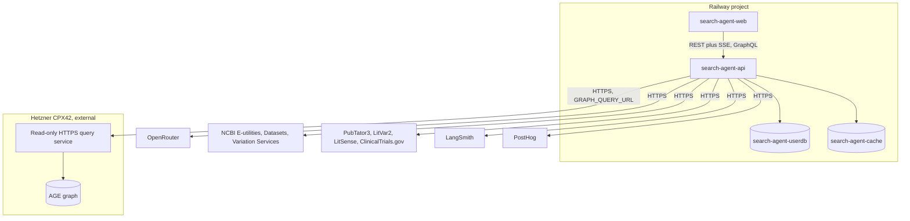

Two services in one project rather than one combined service: the frontend and the API scale and deploy independently, and `CORS_ORIGINS` in `env.example` already assumes a separate frontend origin. Railway's environment feature (production plus optionally a staging or preview environment) hosts a separate variable set per environment, so a dev credential never reaches production.

### Environment configuration

Every group in `env.example` maps to a Railway variable set on `search-agent-api`, except the two addon-injected URLs.

| Group | Vars | Deploy-time source | Notes |
|-------|------|---------------------|-------|
| Layer 1 graph | `GRAPH_PG_HOST`, `GRAPH_PG_PORT`, `GRAPH_PG_USER`, `GRAPH_PG_PASSWORD`, `GRAPH_PG_DBNAME`, `GRAPH_QUERY_URL`, `GRAPH_QUERY_TOKEN` | Railway service variable | Prototype (build phase 2.1) sets the `GRAPH_PG_*` block over an SSH tunnel or co-location. v1 clears `GRAPH_PG_*` and sets `GRAPH_QUERY_URL` plus `GRAPH_QUERY_TOKEN` (the bearer credential for the HTTPS query service) to the Hetzner HTTPS service, per Decision D's two-way door |
| LLM harness | `OPENROUTER_API_KEY`, `ANTHROPIC_API_KEY`, `OPENAI_API_KEY`, `GUARD_MODEL`, `PLAN_MODEL`, `SYNTH_MODEL` | Railway service variable | The three model-id vars stay empty until build phase 7.0 (model-bench) picks the tier winners, then become a config change, not a code change |
| Layer 2 | `NCBI_API_KEY`, `NCBI_EMAIL` | Railway service variable | Raises E-utilities from 3 to 10 requests per second on the free key tier; the admin-access 100 requests per second key (Decisions log, 2026-05-07) is the production value |
| Layer 3 | none | n/a | No credentials required for PubTator3, LitVar2, LitSense, or ClinicalTrials.gov v2 |
| User data | `USER_DB_URL` | Auto-injected by the `search-agent-userdb` addon's reference variable | Never the same credential or role as the graph connection; separate stores, separate least-privilege scopes |
| Cache | `REDIS_URL` | Auto-injected by the `search-agent-cache` addon's reference variable | |
| Auth | `AUTH_SECRET` | Railway service variable, generated per environment | Never shared between dev and production |
| Observability | `LANGSMITH_API_KEY`, `LANGSMITH_PROJECT`, `LANGCHAIN_TRACING_V2`, `POSTHOG_API_KEY`, `POSTHOG_HOST` | Railway service variable | |
| Cost control | `PER_QUERY_COST_CAP_USD`, `PER_USER_DAILY_QUERY_CAP`, `SYSTEM_DAILY_CAP_USD`, `PER_STEP_TIMEOUT_SECONDS` | Railway service variable | Production values start from the Step 1.11 starter caps (0.10 US dollars per query, 100 queries per user per day, 10 US dollars per day system-wide), tuned from real cost data per the playbook's model-selection cadence. `PER_USER_DAILY_QUERY_CAP` holds a query count, not a dollar figure, so the shipped code deliberately named it apart from the dollar-denominated caps beside it, corrected here at Step 6.2 |
| App config | `APP_ENV`, `PORT`, `CORS_ORIGINS`, `LOG_LEVEL` | Railway service variable, `PORT` auto-set by Railway | `APP_ENV=production`, `CORS_ORIGINS` set to the deployed `search-agent-web` URL or custom domain |

Secrets never appear in logs or exception strings, per `ai-security-standards.md`. This applies to every var above at the framework level: log the var name, never its value, if a startup check needs to report a missing credential.

### CI and CD

CI runs on every pull request. CD runs only on merge to `develop`. The two are separate concerns, and the security-scan milestone below is neither: it is a human ritual gate, not an automated CI step.

Merge-blocking gates, in order:

| Order | Gate | Tool | Blocking |
|-------|------|------|----------|
| 1 | Python compiles and imports cleanly | `python -m py_compile` or equivalent | Yes |
| 2 | Import order | `isort --check` | Yes |
| 3 | Lint | `ruff check` | Yes |
| 4 | Unit test suite | `pytest -m "not integration"` | Yes |
| 5 | Integration test suite | `pytest -m integration` (Section 23) | Yes, network-gated job |
| 6 | Python dependency audit | `pip-audit` | Yes, no Critical or High CVE |
| 7 | Frontend dependency audit | `npm audit --audit-level=high` | Yes |
| 8 | Frontend build and test | `npm run build`, `npm test` | Yes |
| 9 | Required-path tests | `test_cite_or_refuse_compliance`, `test_zero_retrieval_refusal` (Section 23) | Yes, part of gate 4, called out because they are never skippable |
| 10 | Accessibility check | WCAG 2.1 AA reasonable-effort check | Yes, on UI-touching PRs only |

CD: Railway's native GitHub integration watches `develop` only. A merge to `develop` triggers an automatic build and deploy of `search-agent-api` and `search-agent-web`. Phase branches (`phase/N.M-description`, per `git-workflow.md`) never auto-deploy, so a half-finished phase never reaches a live environment. Rollback is redeploying the previous Railway build from its deploy history.

The security-scan milestone: this is not an automated CI block. Decision 2026-07-23 explicitly rejected enforcing it as a CI gate, because `claude-security` delivers human-reviewed patch files, not a pass or fail signal, and an automated block would misrepresent a step that needs a human to approve each patch before it applies. Instead, it is `release-workflow` Step 3 and a checkbox in the pull request template, run before a release or before opening a pull request, documented in `docs/Claude_security_plugin_usage.md`. The always-on `security-guidance` plugin covers the per-change layer continuously; `claude-security` is the deep audit a milestone earns.

### The read-only HTTPS graph query service

This is the v1 Layer 1 transport named in Decision D. It replaces the prototype's SSH tunnel or co-location connection without changing the `cypher_query` tool's external interface, because the transport lives inside the tool.

- Location: co-located on the Hetzner CPX42 box itself, alongside the AGE Postgres instance. The hop from the service to Postgres stays on localhost; the only network hop is Railway to Hetzner over HTTPS.
- Surface: a single endpoint that accepts an already-validated, already-parameterized Cypher payload (the same payload the `cypher_query` tool's validate-then-execute pipeline produces), never free-form Cypher text over the wire.
- Defense in depth: the service re-runs the same forbidden-keyword and edge-label checks the tool already ran, on the server side, so a bug in the client-side validator is not the only thing standing between a request and the database.
- Credential: the existing `kg_reader` read-only role (already the connection-level enforcement per the 2026-05-05 decision), so a validator bug still cannot produce a write, because the role itself cannot write.
- Auth on the HTTPS hop: a bearer token or API key header, because Railway does not guarantee a static egress IP on every plan, so an IP allowlist alone is not sufficient. This credential is `GRAPH_QUERY_TOKEN`, declared in `env.example`'s Layer 1 block (Step 4.3); its real value is populated when the service is built, per the migration path below.
- Limits: a hard row limit and a per-call timeout matching the tool's own budget, plus a rate limit per caller, so a runaway query on either side is bounded twice.
- Transport: TLS via an automatic-HTTPS reverse proxy (for example Caddy) in front of the service; the database port itself never opens to the internet, closing the standing exposure Decision D explicitly rejected.
- Runtime: a systemd service or a small container on the Hetzner box, stateless, logging every call (what was queried, when, and the caller) per the audit-trail requirement in `ai-security-standards.md`.
- Migration path: build phase 2.1 (Section 25) ships against the prototype transport first; the HTTPS service is a build phase 3.x or 4.x item (Section 25) that swaps the tool's internal transport with no change to its schema or callers, proving Decision D's two-way door.

### Known gaps and open flags

| Gap | Where it surfaced | Disposition |
|-----|---------------------|-------------|
| `GRAPH_QUERY_TOKEN` (or equivalent bearer credential) is not yet in `env.example` | Designing the HTTPS query service's auth above | Resolved in Step 4.3: declared in `env.example`'s Layer 1 block. Its real value is populated when the service is built (Section 25 build order), per Section 24's migration path |
| No Railway config file (`railway.toml` or a Nixpacks config) exists yet | Repo inventory during this draft | A Phase 6 build task, stood up alongside build phase 1.0 |
| The current `.github/pull_request_template.md` still lists BioLink and KGX validation gates inherited from the System 1 and System 2 template repo | Repo inventory during this draft | Still open. Stale for System 3; `release-workflow.md`'s own footer already says it does not run BioLink or KGX checks. Replace the template's QA gate list with the Section 24 gate list above in Phase 5 Step 5.3 (root document updates) |
| The PRD locks five v1 delivery formats (web UI, GraphQL API, MCP server, KGX export, CLI); this tech spec's core-and-adapters framing previously named only four adapters | Cross-checking the PRD against the tech-spec outline while writing this section and Section 25 | Resolved in Step 4.3: Section 1.1 now names all six delivery surfaces (four streaming adapters plus GraphQL API and KGX export as two structured surfaces). This section's topology already treats GraphQL as a router mounted in the same FastAPI process and KGX export as a batch job against Layer 1, so no topology change was needed here, only the naming in Section 1.1 |

## 25. Build order

CLAUDE.md's four-week build order (FastAPI skeleton and streaming in week one, `cypher_query` and the LangGraph loop in week two, the four remaining tools plus guardrail and citations in week three, tracing and the eval harness in week four) still holds as the skeleton. It predates the Step 4.1 decisions, though: the typed event-stream contract (Decision A), the coordinator-worker harness (Decision C), transport-per-phase for Layer 1 (Decision D), the deterministic trust signal (Decision E), personalization and session memory (Decision F), and the feedback-loop data model (Decision G) all need a place in the sequence, along with the delivery surfaces beyond the web UI (MCP, CLI, GraphQL, KGX export) and the observability build steps that week four only named as headline items.

This section refines that table into `git-workflow.md`'s `phase/N.M-description` branch granularity. Three of `git-workflow.md`'s own examples anchor the numbering (`phase/1.0-fastapi-skeleton`, `phase/1.1-auth-service`, `phase/2.0-langgraph-agent-loop`, `phase/2.1-cypher-tool`, `phase/3.0-guardrail-node`); everything below extends those five fixed points to cover every remaining decision. Plan.md's Phase 6 wraps this whole section: Step 6.1 (the prototype) is build phases 1.0 through 2.2 below, Step 6.2 is the one reconciliation pause in between, and Step 6.3 (build v1) is everything from build phase 3.0 onward.

### The phased build order

| Phase | Branch | Delivers | Depends on | Scope |
|-------|--------|----------|------------|-------|
| 1.0 | `phase/1.0-fastapi-skeleton` | FastAPI app skeleton, health endpoint, the core `run(query, context)` contract stub with the v1 event taxonomy typed (Decision A), Pydantic boundary validation | none | v1 |
| 1.1 | `phase/1.1-auth-service` | Minimal v1 auth (Step 1.7), the PostgreSQL user-data schema stood up now (`interactions`, `cq_candidates`, users), even though the feedback loop does not populate it meaningfully until phase 4.6 | 1.0 | v1 |
| 1.2 | `phase/1.2-react-shell-sse` | React shell, SSE consumption of the event stream, an empty chat endpoint wired end to end, the stop button | 1.0 | v1 |
| 2.0 | `phase/2.0-langgraph-agent-loop` | LangGraph graph implementing Guardrail, Think, Plan, Act, Write with stub nodes; the three-tier harness wired to LiteLLM and OpenRouter (Decision C); the coordinator-worker split scaffold; cost caps and the cost event enforced from day one | 1.0 | v1 |
| 2.1 | `phase/2.1-cypher-tool` | `cypher_query` over Layer 1 using the prototype transport (SSH tunnel or co-location, Decision D phase one), schema slicing, the validate-then-execute Cypher generation pipeline, edge-label enforcement | 2.0 | v1 |
| 2.2 | `phase/2.2-write-step-grounding` | Deterministic cite-or-refuse, the provenance type wired for Layer 1 citations, a first version of the trust signal for the graph-only path, the two required tests from Section 23 | 2.1 | v1 |
| 3.0 | `phase/3.0-guardrail-node` | Full guardrail replacing the phase 2.0 passthrough stub: Pydantic validation, prompt-injection rejection, forbidden query types, rate and cost pre-checks | 2.0 | v1 |
| 3.1 | `phase/3.1-ncbi-efetch` | `ncbi_efetch` (E-utilities for PubMed, ClinVar, OMIM; Datasets API v2 for Gene, Genome, Orthologs, Taxonomy) | 2.0, 3.0 | v1 |
| 3.2 | `phase/3.2-ncbi-dbsnp` | `ncbi_dbsnp` over Variation Services and dbSNP ESummary. Corrected 2026-08-15: this line also listed the Q1 dbVar two-step coordinate-overlap sub-tool, which had already shipped in build phase 3.1 as `ncbi_coordinate_overlap.py`, the `coordinate_overlap` action of `ncbi_efetch` | 3.1 | v1 |
| 3.3 | `phase/3.3-enrichment-tools` | `pubtator_annotate` and `litvar2_lookup`, each with the untrusted-source-reader tier separation (read plus one API, no write, no other tools) | 3.1 | v1 |
| 3.5 | `phase/3.5-pathogen-clinicaltrials-tools` | `pathogen_detection` (Pathogen Detection FTP, Q5) and `clinicaltrials_search` (ClinicalTrials.gov v2, Q4), each with its own timeout and snapshot or cache semantics, completing the seven-tool roster | 3.1 | v1 |
| 3.4 | `phase/3.4-citation-trust-full` | Provenance extended to Layer 2 and 3 (the four added fields), the two-tier risk gate (standard cite-or-refuse versus the higher-stakes substantiation-and-triangulation gate), data freshness and conflict resolution | 2.2, 3.1, 3.2, 3.3, 3.5 | v1 |
| 4.0 | `phase/4.0-rest-sse-hardening` | The REST plus SSE adapter finalized as the public API surface | 2.2 | v1 |
| 4.1 | `phase/4.1-mcp-server` | Outbound-only MCP server wrapping the same tool functions (Decision 24, persona 11) | 3.4 | v1 |
| 4.2 | `phase/4.2-cli-adapter` | Thin CLI client over the REST API | 4.0 | v1 |
| 4.3 | `phase/4.3-graphql-api` | GraphQL surface via Strawberry, sharing auth and tools with the REST surface | 4.0 | v1 per the locked PRD and Section 1.1's six-surface framing |
| 4.4 | `phase/4.4-kgx-export` | Export utility scoped to the existing Hetzner graph, a batch job, not a live adapter | Layer 1 access already exists | v1 per the locked PRD and Section 1.1's six-surface framing |
| 4.5 | `phase/4.5-personalization-memory` | Bounded session memory (Decision F and G), audience-level depth control, the stable named scientist persona | 1.2, 2.2 | v1 |
| 4.6 | `phase/4.6-feedback-capture` | Real interaction capture into `interactions` (query, route, rubric outcome, citations, coverage tags, feedback, `trace_id`), the manual review ritual, hand-promotion into few-shot examples | 1.1, 3.4 | v1 |
| 4.7 | `phase/4.7-cq-routing` | Few-shot routing seeded with the seven must-pass competency questions; query-shape routing (single-hop, multi-hop, dynamic multi-source) | 3.4 | v1 |
| 4.8 | `phase/4.8-web-ui-visual-design` | Web UI visual design: MUI adoption, a real theme, restyling the existing screens (auth, chat/search, live streaming progress, citations) built in phase 1.2. Added 2026-08-11, product-owner directive, not part of the original locked build order (see the note below the table) | 1.2 | v1 |
| 5.0 | `phase/5.0-observability` | LangSmith per-run tracing linked by `trace_id`, PostHog analytics, the tool-call audit log | 2.0 | v1 |
| 5.1 | `phase/5.1-golden-dataset-eval` | The 50-query golden dataset (expanding the seven-question moat set per the playbook), eval-harness grading wired against LangSmith trace output, the cost tracking dashboard | 3.4, 5.0 | v1 |
| 6.0 | `phase/6.0-rate-limit-concurrency` | Per-layer throttling, the concurrency queue strategy, the at-most-20-calls-per-query budget | 3.1, 3.2, 3.3, 3.5 | v1 |
| 6.1 | `phase/6.1-hardening-release` | The full `dev-standards` six-lens pass, the CI and CD gates from Section 24 finalized, the security-scan milestone before first ship, the accessibility reasonable-effort pass | everything above | v1 |
| 7.0 | `phase/7.0-model-bench` | Benchmark the candidate models per tier against the golden dataset, pick the tier winners | 5.1 | v1, needed before a real ship, not before the prototype |
| 7.1 | `phase/7.1-ab-mechanism` | The online A and B randomized-routing mechanism across orchestrator-plus-planner combinations (Section 18) | 7.0, 5.0 | v1 mechanism design, but its live operation is the online complement that follows model-bench |

Phase 4.8, added after build phase 4.1 closed: this table was locked at Step 4.4 and edited only at the single Step 6.2 reconciliation per the 2026-07-24 build-phase doc-review-cadence decision (`DECISIONS.md`). That reconciliation already ran and closed on 2026-08-10. Adding 4.8 now is a deliberate exception to that cadence, made directly by the product owner rather than a routine mid-build edit, logged in `DECISIONS.md`. The build order's phase numbers were never strictly execution-sequential (phase 1.2 built after 2.0 in this project's real history, per `requirements/phase_6/Continuation_prompt.md`'s own build table), so 4.8 sits as the next open number in the delivery-surfaces group and runs immediately after 4.1, before 4.2 through 4.7, none of which depend on it.

### Fast-follow disposition

These are explicitly out of the build order above. Each has a named trigger for when it graduates.

| Capability | Why deferred | Trigger to build |
|------------|---------------|-------------------|
| Automated mining, stage 2 of the feedback loop | Decision G scopes v1 to capture plus manual review plus hand-promotion | Enough interaction data captured to cluster meaningfully |
| Persistent cross-session per-user memory | Decision F scopes v1 to bounded in-conversation session memory only | Interaction capture (phase 4.6) has run long enough to seed it |
| Compute tools: BLAST, sequence-similarity search, VCF ingestion (Q2, Q7, Q9) | PRD out-of-scope for v1; the seven must-pass questions already cover all three wedge types without them | The fast-follow set is added after the loop works, with pinned fixtures |
| UCSC segmental-duplication enrichment for Q1 | Not in the NCBI three-layer API set; PRD out-of-scope for v1 | A new non-NCBI source integration, scheduled with the fast-follow set |
| Model distillation (fine-tuning a student model) | PRD out-of-scope for v1, a v2 optimization | Query logs stabilize enough to distill from |
| Fusion and ensemble model panels | PRD out-of-scope for v1, a v2 escalation lever | Low-confidence or hardest deep-research queries need it, gated by cost caps |
| Sub-query decomposition for deep research | Single orchestrator holds for v1 | Failure rate above 20 percent on the deep-research query class |
| Full Section 508 and WCAG 2.1 AA audit, enterprise IAM | Track 1 prototype does reasonable-effort accessibility only; enterprise IAM is a production-track concern | Migration to the NCBI or OCCS production track |
| FedRAMP, FISMA, ATO federal authorization path | Binds the production path only, per Step 1.13 | Migration to the NCBI or OCCS production track |

### Dependency graph

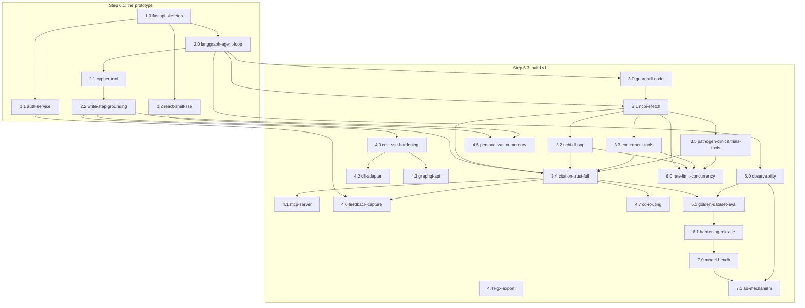

`4.4 kgx-export` has no in-repo dependency edge in the graph above: it reads only the Layer 1 graph that already exists on Hetzner, so it does not wait on any other v1 build phase, only on the flag noted below.

### Flags carried into this build order

| Flag | Detail | Where it resolves |
|------|--------|---------------------|
| GraphQL and KGX export versus the four-adapter framing | The PRD locks five v1 delivery formats; this tech spec's core-and-adapters framing previously named four and omitted GraphQL and KGX export | Resolved in Step 4.3: Section 1.1 now names all six delivery surfaces (four streaming adapters plus GraphQL API and KGX export as two structured surfaces). Build phases 4.3 and 4.4 proceed as scheduled |
| Tool roster: Pathogen Detection and ClinicalTrials.gov had no tool home | Section 6.2 flagged both as not fitting the `ncbi_efetch` action set | Resolved in Step 4.3: added as named tools `pathogen_detection` (6.6) and `clinicaltrials_search` (6.7), scheduled in build phase 3.5 above |
| Raw chain-of-thought: PRD versus Decision A | The PRD's show-full-reasoning expander describes raw chain-of-thought; Decision A (later, controlling) says never raw chain-of-thought | Resolved in Step 4.3: Decision A supersedes the PRD's wording (Sections 2.5, 12.8). The PRD's own text is updated at the Step 6.2 prototype reconciliation, not by this tech spec |
| `GRAPH_QUERY_TOKEN` credential gap | The read-only HTTPS query service (Section 24) needs a bearer credential | Resolved in Step 4.3: declared in `env.example`'s Layer 1 block. Its real value is populated when the service is built, staged inside build phases 3.x or 4.x per Section 24's migration path |
| Domain sign-off for the golden fixtures | The playbook flags this as a real gap on clinical and human-variation questions, tagged a Phase 4 process item | Still open. Needs a named owner before build phase 5.1 ships the 50-query golden dataset |
| Stale pull request template | `.github/pull_request_template.md` still lists BioLink and KGX validation gates from the System 1 and System 2 template repo | Still open. Phase 5 Step 5.3 (root document updates), out of this build order's scope |

Once this section locks, Plan.md's Phase 5 Step 5.1 (updating `bossman-mode`) and Step 5.3 (updating CLAUDE.md's build-order table) both read from this section as their source of truth, not from the original four-week table.

## Parked-thread resolution index

The four threads carried into Phase 4 are decided (confirmed 2026-07-25) in these sections:

| Parked thread | Resolved in |
|---------------|-------------|
| A/B model-combination mechanism | Section 18 |
| Acceptable-staleness threshold | Section 7 |
| Concurrency queue strategy | Section 21 |
| Provenance type's four added fields | Section 9 |

Last updated: 2026-07-25. The spec is locked (2026-07-25) and freezes through the build, edited only at the Step 6.2 reconciliation.
