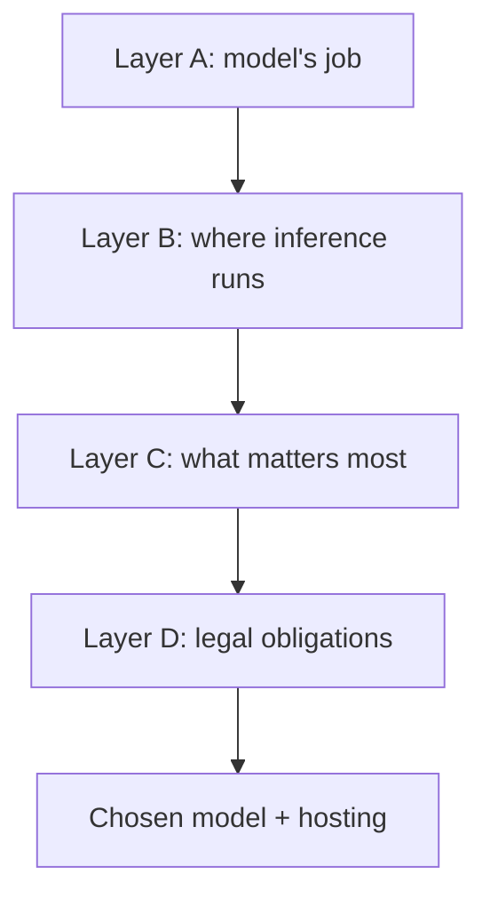

# Open-source models for NCBI: software building, user experience, control-first hosting, and legal obligations

This document consolidates the key ideas from the discussion so far into one place. It combines four related lenses for NCBI-style AI use cases: building software with open-source or open-weight models, generating user-facing outputs for UI, CLI, MCP, and other product experiences, a control-first view of hosted inference choices (especially Ollama Cloud, Groq, OpenRouter, and the role of self-hosted Ollama), and the legal and compliance obligations that apply when a US federal agency such as NCBI runs LLMs.

The goal is not to pick a single universally best model or platform. The goal is to choose the right model and hosting pattern for the job, while keeping data movement, determinism, operational control, and legal compliance aligned with NCBI-style constraints.

## Table of contents

- [1. Building software](#1-building-software)
- [2. UI experience, CLI, MCP, and user-facing outputs](#2-ui-experience-cli-mcp-and-user-facing-outputs)
- [3. Control-first hosting view](#3-control-first-hosting-view)
- [4. Legal and compliance obligations](#4-legal-and-compliance-obligations)
- [5. Combined guidance for NCBI use cases](#5-combined-guidance-for-ncbi-use-cases)
- [6. Practical bottom line](#6-practical-bottom-line)
- [7. Next decision framework](#7-next-decision-framework)
- [References for the legal and compliance section](#references-for-the-legal-and-compliance-section)

## 1. Building software

The software-building part of the earlier report focused on using open-source or open-weight models for code generation, repository navigation, debugging, refactoring, planning, tool use, and multi-step autonomous engineering workflows.

In that mode, the model is acting as an engineering copilot or coding agent. The strongest models are the ones that can read and write across files, reason over large contexts, call tools, and iteratively improve code.

A key conclusion from that report was that Chinese-origin open-weight models currently dominate much of the open agentic coding landscape, especially for long-horizon coding and repository-scale workflows. The strongest families discussed included:

- GLM-5.2,
- MiniMax M3,
- DeepSeek V4 Pro,
- Kimi K2.7 Code / K2.x,
- Qwen Coder / Qwen3 series,
- with Devstral 2 and Nemotron 3 as important non-Chinese alternatives.

The core software-building evaluation criteria were:

- agentic performance,
- coding quality,
- long context support,
- tool use,
- documentation and ecosystem,
- and openness / licensing clarity.

For software-building, some nondeterminism is acceptable. The output is usually an intermediate work product that can be reviewed, rerun, patched, or validated by an agent loop or an engineer before it reaches production.

Compliance caution: the strongest software-building families listed here (GLM, MiniMax, DeepSeek, Kimi, Qwen) are Chinese-origin open-weight models. US federal policy is actively restricting exactly these families on government systems, so a federal NCBI deployment cannot assume they are usable, even self-hosted. The non-Chinese alternatives (Devstral 2, Nemotron 3) and permissively licensed US or allied-origin models matter more once federal constraints apply. Section 4 covers the legal obligations in detail.

## 2. UI experience, CLI, MCP, and user-facing outputs

The second document extended the discussion beyond code generation into AI systems whose outputs are shown directly to users. This includes:

- UI assistant responses,
- CLI outputs,
- MCP-driven workflows,
- structured summaries,
- product explanations,
- and user-visible reasoning or decision support.

This is a different problem from software building. In software building, the model can be creative and exploratory. In user-facing systems, the model becomes part of the product interface itself.

That changes the model-selection criteria. For user-facing AI, the important properties become:

- predictable behavior,
- stable output format,
- deterministic or near-deterministic operation,
- tool-calling discipline,
- low latency,
- and consistency across repeated runs.

A useful framing from the earlier write-up is:

- a coding model used by developers is like a smart colleague in a design room,
- while a model used in a CLI or workflow is like a function in a public API.

The first can be messy and creative. The second should be boring, stable, and reliable.

### Why determinism matters more here

In user-facing systems, prompt quality alone is not enough. Production reliability comes more from the system around the model than from the model by itself. In practice, teams usually want operational determinism, meaning:

- the workflow follows a fixed graph or state machine,
- outputs are schema-constrained,
- the next action is chosen by code,
- and invalid states fail safely and visibly.

This matters especially for:

- CLI experiences,
- MCP servers,
- tool-calling agents,
- scientific summarization pipelines,
- and enterprise assistants where malformed outputs can break downstream workflows.

### Why reasoning models matter

Reasoning models become more important when the system has to do more than answer a simple question. They help when the AI must:

- decompose tasks,
- plan multi-step actions,
- decide which tools to call,
- produce structured intermediate states,
- and maintain coherence across longer workflows.

For NCBI-like user-facing systems, the best design is usually not a free-form chat assistant. It is more often a reasoning-capable model behind a deterministic response contract, with software-enforced structure around it.

### Why Mixture-of-Experts matters

Mixture-of-Experts (MoE) models matter because they can improve the tradeoff between capability and efficiency by activating only part of the network for each token. That makes them attractive for user-facing systems that need:

- high reasoning or coding quality,
- but also latency that feels responsive enough for a real product experience.

There is an important caveat: MoE does not automatically make a system more deterministic. MoE helps the engine, but deterministic UX still comes from schema enforcement, orchestration, retries, parsing, and controlled tool execution.

### Practical implication for NCBI-style product work

For user-facing scientific product behavior, the architecture should prioritize:

- deterministic orchestration,
- stable structured outputs,
- schema-safe tool use,
- reasoning quality for scientific and multi-step tasks,
- and sufficiently low latency to support a clean interface.

That means a top coding model is not automatically a top UX model unless it behaves well inside a constrained workflow.

## 3. Control-first hosting view

The ranking discussion about Ollama Cloud, Groq, and OpenRouter was based on a control-first view, not just a "US-hosted = safe" view.

### Why Ollama Cloud came first in that ranking

The logic was:

- Ollama Cloud is more like a single managed environment with a smaller, more constrained model catalog.
- Groq is also managed and can be very strong, but it is more of a high-performance inference platform than a tightly scoped environment.
- OpenRouter is a routing layer, so it has the most flexibility but also the most moving parts.

For NCBI-style work, fewer moving parts usually means fewer chances for unexpected data paths.

### The important correction

US infrastructure helps, but it does not automatically mean maximum privacy.

What matters more is:

- who controls the machines,
- whether prompts are logged,
- whether data is retained,
- whether requests can be routed to other providers,
- and whether the service offers zero-retention or similar controls.

So the ranking was really saying:

- Ollama Cloud: best among the three if you want a more constrained, simpler hosted setup.
- Groq: best if you want speed plus reasonable control, especially when Zero Data Retention is configured.
- OpenRouter: best if you want broad model choice, but it is the least controlled path because it is fundamentally a routing layer.

### The practical nuance

If you compare Ollama Cloud vs self-hosted Ollama, self-hosted is usually the more privacy-preserving option because you control the environment directly.

So the strongest statement is:

- Self-hosted Ollama on your own US infrastructure is the most controlled.
- Ollama Cloud is the most controlled among the three hosted options discussed here.
- Groq is a good balance of speed and control.
- OpenRouter is the most flexible, but also the least strict for residency and data-path simplicity.

### Simple analogy

Think of it like this:

- Self-hosted Ollama = your own locked office.
- Ollama Cloud = a private office in a managed building.
- Groq = a very fast shared lab with good rules.
- OpenRouter = a dispatcher who can send your work to different labs.

For NCBI, the less your data has to travel, the better.

### Other hosted options beyond these three

The original ranking covered self-hosted Ollama, Ollama Cloud, Groq, and OpenRouter. There is a fifth category the ranking did not name: the enterprise cloud AI platforms, which sit between self-hosting and a routing layer on the control spectrum. These matter for NCBI because they are the providers most likely to offer the contractual and authorization controls a federal deployment needs.

- Managed cloud model platforms (for example AWS Bedrock, Azure OpenAI, Google Vertex AI): run inside your own cloud account or subscription boundary, offer contractual data controls, and in several cases have government-region variants (GovCloud and equivalent) with federal authorization paths.
- Managed open-model hosts (for example Together AI, Fireworks AI): host open-weight models as a service with SOC 2 Type II and zero-data-retention options, sitting closer to OpenRouter on flexibility but with a single, named operator rather than a routing fabric.
- In-account self-hosting: running open weights on GPU infrastructure inside your own cloud account is the cloud equivalent of self-hosted Ollama. No inference data leaves the account boundary at any point in the request lifecycle.

The control-first logic still applies: fewer operators, fewer data paths, and contractual controls in writing. What these options add is the compliance surface (authorization, BAA, residency) that the original three do not foreground. Section 4 treats that surface as its own lens.

## 4. Legal and compliance obligations

### Why this is a separate lens

Control and privacy describe what a system can do. Legal obligations describe what an organization is permitted and required to do. They are related but not the same: a setup can be highly controlled and still non-compliant, or contractually compliant while routing data further than you would like. For a US federal agency such as NCBI, which sits inside the National Library of Medicine, within NIH, several obligations apply regardless of how technically controlled the hosting is.

This section summarizes those obligations at a planning altitude. It is not legal advice, and the frameworks, bills, and licenses named here move quickly. Confirm current status before any procurement or deployment decision.

### Federal authorization and security frameworks

- FedRAMP: cloud services that federal agencies use generally need FedRAMP authorization, at Moderate or High depending on data impact level. A hosted inference provider with no FedRAMP authorization is not straightforwardly usable for federal production workloads.
- FISMA: the Federal Information Security Modernization Act is the statutory framework for federal information security. AI systems that handle federal data fall within it, which means security controls, documentation, and continuous monitoring.
- Authority to Operate (ATO): federal systems need an ATO before production. An AI component inherits that process rather than sidestepping it.
- OMB M-25-21: requires each covered agency to designate a Chief AI Officer and to govern AI use, including agency AI inventories and risk practices.
- OMB M-26-04 (December 2025): sets procurement rules aimed at ideological or untruthful LLMs, requires agencies to revise procurement policies by March 2026, and imposes transparency, documentation, and disclosure obligations on AI vendors.

### Country-of-origin restrictions

This one bears directly on the model picks in section 1.

- DeepSeek is already blocked on federal devices and networks at multiple agencies, including NASA, the Pentagon, the Department of Commerce, the Navy, and the House.
- Proposed legislation (the No Adversarial AI Act and the No DeepSeek on Government Devices Act) would bar federal agencies from procuring or deploying AI developed in foreign adversary nations: China, Russia, Iran, and North Korea. As of early 2026 these are not yet law, but the direction of travel is clear.
- Implication: the strongest open agentic coding models today are Chinese-origin, and those are exactly the families federal policy is moving to restrict. A federal NCBI system cannot assume access to GLM, MiniMax, DeepSeek, Kimi, or Qwen. Self-hosting the open weights does not obviously resolve the origin and procurement concern, because the restriction is framed around the model's provenance, not only the hosting path.

### Model licensing obligations

Open weights are not uniformly free to deploy. Terms vary by model and even by variant of the same model.

- Permissive (MIT / Apache 2.0): several releases fall here, for example DeepSeek code and weights under MIT, many Qwen3 sizes under Apache 2.0, and GLM-5 under MIT. These grant broad commercial use with minimal restrictions.
- Use-based restrictions that carry forward: some otherwise-permissive releases add acceptable-use terms, such as a no-military-use clause, that any distributed derivative must legally carry forward.
- Custom or research-only licenses: not every size ships permissively. Some Qwen variants use a custom Tongyi Qianwen license or a non-commercial research license, and some sizes are proprietary with no open weights at all.
- Capped commercial licenses: Llama is free commercially below a 700 million monthly-active-user threshold, with separate EU restrictions above the line.

Obligation: verify the exact license of the exact model and version before deployment, and track the downstream obligations that flow into any fine-tune or derivative you distribute.

### Data-handling and contractual obligations

- HIPAA and Business Associate Agreements: if any workflow touches protected health information, the provider must be HIPAA-eligible and sign a BAA, and the deployment must be configured to the BAA-covered path. Provider eligibility alone does not make an implementation compliant. The agency must still implement encryption, access controls, and audit logging.
- Zero data retention: contractual zero-retention and no-training-on-inputs terms are a legal control, not only a privacy preference. Confirm them in writing, per provider and per region.
- SOC 2 Type II: most major managed providers hold it. It is table stakes for vendor due diligence, not a substitute for FedRAMP authorization or an ATO.
- Data residency and sovereignty: where inference physically runs, and under whose jurisdiction, is a compliance question as much as a control question.

### The Track 1 versus production distinction

Per the project plan, the near-term build is a personal Track 1 prototype (roughly two months, about $100), not the official NCBI production track. Federal procurement and authorization rules bind the production path, not necessarily a personal prototype that uses only public data. The obligation is to decide explicitly, and early, which constraints apply to the prototype and which defer to the production track, so the prototype does not build on a model or provider that the production system will be legally barred from using.

## 5. Combined guidance for NCBI use cases

Bringing the four lenses together, the decision should be split into separate layers.

### Layer A: what is the model doing?

There are at least two major categories:

- software-building workflows: coding, refactoring, debugging, autonomous engineering,
- user-facing workflows: CLI outputs, UI experiences, MCP orchestration, structured responses, and scientific explanation layers.

The first category optimizes more for coding power and long-horizon agentic behavior. The second optimizes more for structured outputs, determinism, stability, and latency.

### Layer B: where is inference running?

There are several meaningful hosting and control options:

- self-hosted Ollama on infrastructure you control,
- Ollama Cloud for a constrained managed setup,
- Groq for fast managed inference with optional stronger data controls,
- OpenRouter for maximum model-marketplace flexibility with more routing complexity,
- enterprise cloud AI platforms (Bedrock, Azure OpenAI, Vertex, Together, Fireworks) that run inside your account boundary and can offer government-region and federal-authorization paths.

### Layer C: what matters most for this specific NCBI workflow?

Different tasks will emphasize different things:

- strict privacy and residency,
- reproducibility,
- speed,
- model variety,
- structured outputs,
- or raw coding quality.

That is why there is no single best answer across every NCBI use case.

### Layer D: what is legally required?

This layer gates the other three. Before a model or hosting choice is final, clear it against:

- country-of-origin restrictions on the model,
- the exact license of the exact model and version,
- federal authorization status of the provider (FedRAMP, FISMA, ATO),
- and data-handling obligations (BAA where PHI is involved, zero-retention terms, residency).

A choice that wins on Layers A through C but fails Layer D is not usable for the federal production track.

## 6. Practical bottom line

The discussion so far leads to a simple operating model:

- Use the strongest open models when the task is building software and long-horizon coding quality dominates.
- Use reasoning-capable models inside deterministic orchestration when the task is user-facing product behavior.
- Prefer the most controlled hosting path that still meets the task requirements, especially for NCBI-style data sensitivity.
- Before committing a model or hosting path for a federal deployment, clear it against the legal obligations in section 4: country-of-origin restrictions, model license, federal authorization, and data-handling terms.

In that control-first view:

1. Self-hosted Ollama is the most controlled option.
2. Ollama Cloud is the most controlled among the hosted options discussed.
3. Groq is the best balance of speed and control.
4. OpenRouter is the most flexible but the least tightly bounded.

That does not mean Ollama Cloud is universally safest in every possible sense. It means that, among the hosted options discussed, it is the closest to a simpler and more constrained environment, which is often the better default for NCBI-style work. Legal obligations sit alongside this ranking, not inside it: the most controlled hosting path can still involve a model or provider that federal policy restricts, so the control ranking and the legal check are two separate gates.

## 7. Next decision framework

A useful next step would be to turn this into a decision tree with categories such as:

- sensitive data,
- internal data,
- public data,
- coding-only workflows,
- user-facing workflows,
- and mixed agentic systems.

The legal lens adds a second axis to that tree:

- model country of origin (adversary-nation origin versus US or allied origin),
- license class (permissive, use-restricted, research-only, capped commercial),
- provider authorization status (FedRAMP, FISMA, ATO),
- and data sensitivity class (PHI or PII versus public data).

Mapping model families and hosting options against both axes would make it easier to connect concrete NCBI scenarios to a compliant choice, rather than a merely capable one.

## References for the legal and compliance section

The legal and hosting-compliance points above draw on the following sources, current as of July 2026. Confirm status before any procurement or deployment decision.

- [AI for federal agencies, FedRAMP and ATO](https://ibl.ai/blog/ai-for-federal-agencies-fedramp-ato)
- [AI for federal government 2026, OMB M-25-21 and FedRAMP](https://precisionaiacademy.com/ai-for-government)
- [OMB guidance on procurement of LLMs](https://fedscoop.com/omb-requirements-woke-ai-federal-agencies/)
- [House bill to restrict DeepSeek on agency devices](https://fedscoop.com/deepseek-ban-government-devices-house-bill/)
- [Bipartisan bill to bar federal use of foreign-adversary AI tools](https://therecord.media/bipartisan-bill-ban-deepseek-federal)
- [Open-weight versus open-source model licensing guide](https://www.buildmvpfast.com/blog/open-weight-vs-open-source-ai-model-licensing-guide-2026)
- [LLM deployment in regulated industries, HIPAA, SOC 2, GDPR](https://www.truefoundry.com/blog/llm-deployment-in-regulated-industries-hipaa-soc2-and-gdpr-playbook-for-2026)
- [Business Associate Agreements with AI providers](https://www.tactionsoft.com/ai-healthcare/baa-with-ai-providers/)
