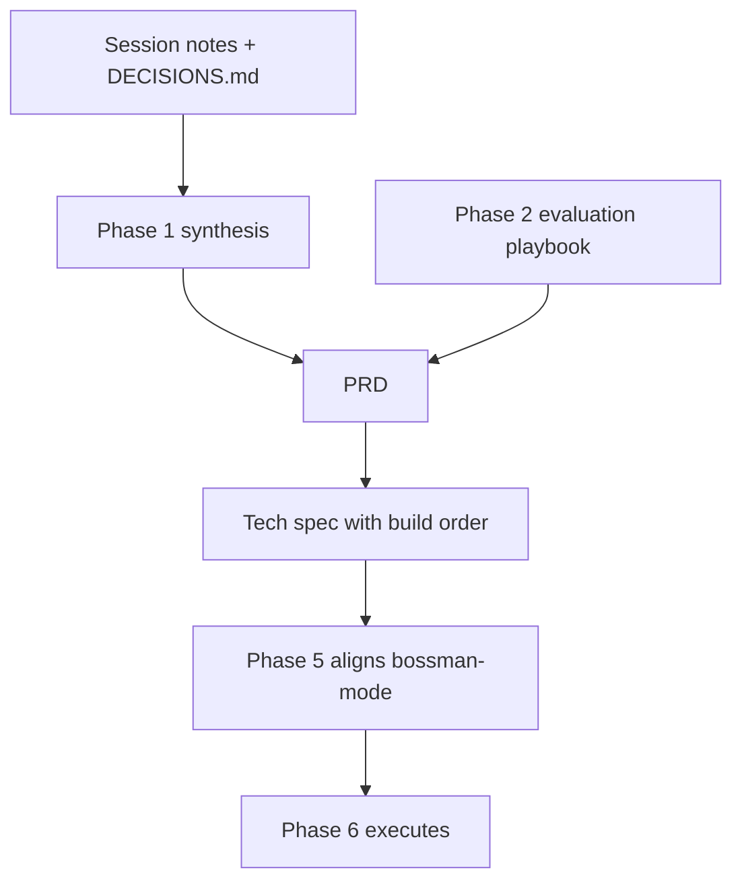
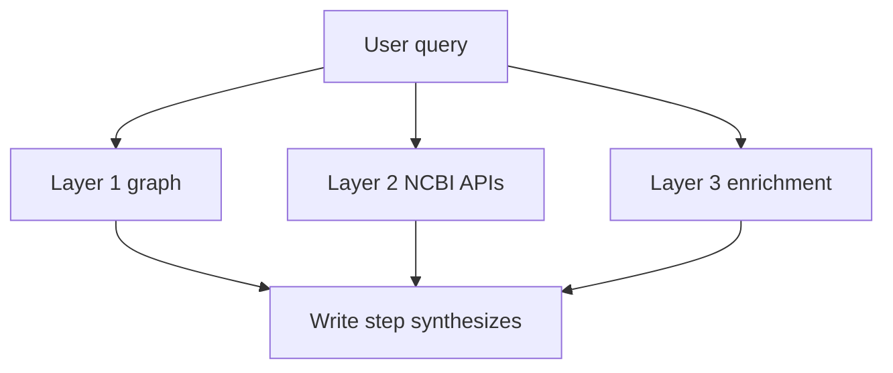

# Phase 1 synthesis

The topic-organized narrative of every Phase 1 decision. Session notes answer "what did we discuss and when." DECISIONS.md answers "what did we choose." This document answers "what does it all mean together, by topic, ready for the PRD."

This document folds in all of Phase 1, Steps 1.1 through 1.13. Phase 1 is complete. Point the PRD, tech spec, and strategic memo commands at this file, not at the individual session logs.

Status: covers all of Phase 1 (Steps 1.1 through 1.13), complete as of 2026-07-21.

## Table of contents

- [How this document is used](#how-this-document-is-used)
- [Scope, delivery formats, and alignment](#scope-delivery-formats-and-alignment)
- [Backend framework and API surface](#backend-framework-and-api-surface)
- [Model harness, inference, and cost](#model-harness-inference-and-cost)
- [Agent architecture and the five-step loop](#agent-architecture-and-the-five-step-loop)
- [Three-layer data access](#three-layer-data-access)
- [Query understanding and Cypher generation](#query-understanding-and-cypher-generation)
- [Citations, provenance, and verification](#citations-provenance-and-verification)
- [Tools, adapters, and behavioral directives](#tools-adapters-and-behavioral-directives)
- [NCBI and enrichment API strategy](#ncbi-and-enrichment-api-strategy)
- [Data and graph handoff](#data-and-graph-handoff)
- [User psychology and product design](#user-psychology-and-product-design)
- [Contractor package boundary and non-functional requirements](#contractor-package-boundary-and-non-functional-requirements)
- [Evaluation approach](#evaluation-approach)
- [SDLC, process, and build sequence](#sdlc-process-and-build-sequence)
- [Tools and infrastructure](#tools-and-infrastructure)
- [Cross-cutting concerns](#cross-cutting-concerns)
- [New-intake adopt batch](#new-intake-adopt-batch)
- [Conference learnings](#conference-learnings)
- [Legal and compliance (Track 1 versus production)](#legal-and-compliance-track-1-versus-production)
- [Threads carried into Phase 2 and Phase 3](#threads-carried-into-phase-2-and-phase-3)

## How this document is used

The document pipeline from discussion to a running build:

bossman-mode does not read this synthesis or the PRD at build time. It reads the tech spec's build order, which Phase 5 rewrites into bossman's phase definitions. This synthesis is the input to the PRD, and the PRD is the input to the tech spec.

## Scope, delivery formats, and alignment

The innovation proposal is the starting ground for v1, not an aspirational ceiling. All scope elements apply even though v1 is personally funded, because v1 must demonstrate the full system as evidence for the NCBI track.

Five delivery formats are in scope: web UI (primary), GraphQL API, MCP server, KGX export (scoped to the existing Hetzner graph, not a full Neo4j export), and a CLI agent.

NCBI strategic directives (FY26 guiding principles, Gold Standard Science, the AI Action Plan) are hard requirements, not positioning. They constrain system behavior: simplify discovery, reproducibility and transparency, AI-ready datasets.

What this means for the PRD: the problem statement and delivery-formats section inherit these as fixed constraints, not negotiable features.

## Backend framework and API surface

FastAPI over Django for v1. The agent loop needs native async for concurrent API calls, LLM streaming, and LangGraph integration. The core agent code is framework-agnostic, so porting to Django for the NCBI track is bounded work (HTTP layer only). Django's ORM adds no value because the system uses raw Cypher, not SQL models.

The API surface is hybrid: REST plus SSE for chat streaming, GraphQL via Strawberry for structured programmatic access to nested biomedical data. Both are served from the same FastAPI app with shared auth and shared tools.

Streaming uses typed SSE events (status, tool_result, token, citation, done) with hard latency budgets per query class (lookup 5s, single-hop 10s, multi-hop 30s, deep research 2min). On timeout, synthesize with partial results and explain what timed out. The user must never see a blank screen.

## Model harness, inference, and cost

A multi-model harness with three tiers routed by LiteLLM: guard (fast, cheap input validation), plan (mid-range query decomposition and tool selection), synth (strongest model for final synthesis and citation assembly). Hard cost caps at every tier.

Open-source models are preferred for the running system; commercial models are reserved for development debugging. The harness philosophy: a strong harness (guardrails, structured tool calls, deterministic citation assembly) lowers the capability required from each model, so cheaper models suffice for most steps.

OpenRouter is the inference provider (one API key, one billing, 100-plus models), accessed through LiteLLM in application code. LiteLLM controls which model gets called per tier; OpenRouter handles provider routing and fallbacks.

Specific model selection is deferred to the build phase (Phase 6) and decided by golden-dataset ablation. The harness pattern is locked now; swapping models is a config change.

Budget target: roughly $100 per month (a relative marker, not a hard cap). Hetzner is the main fixed cost; Railway and LangSmith free tiers cover the rest; inference on open-source models runs to single digits per month.

Step 1.9 (open question 4) confirmed the cost lever: tiered orchestration, where a strong model plans and thinks and cheaper or smaller models execute bounded subtasks, is the v1 mechanism for controlling cost at scale. Model distillation proper (fine-tuning a smaller student model to match a stronger one) is a v2 optimization, deferred until query logs stabilize. Which model fills each tier is decided in Step 1.11 (routing, model-bench) and gated by Step 1.13 (legal).

## Agent architecture and the five-step loop

A single orchestrator agent with three-tier model routing, not a multi-agent system. V1 competency questions need three to five tool calls per query, which one agent handles trivially. Sub-query decomposition (a LangGraph subgraph, not a separate agent) is the planned upgrade for deep-research queries needing many sequential tool calls; the trigger is a failure rate above 20 percent on that query class in the golden dataset.

LangGraph provides the orchestration: typed state, conditional edges, native streaming, and built-in persistence.

The agent follows a five-step loop, and each step has one job:

The contractor's eight-layer architecture was reviewed and not adopted. The five-step loop covers the same concerns with fewer abstraction boundaries: Guard maps to Entry plus governance, Think plus Plan map to Guarded Planning plus Context Retrieval, Act maps to Backend Compilation plus Knowledge Modules, Write maps to Provenance Response.

Step 1.9 (open question 7) decided agent naming: scientific names after great historical biomedical scientists, surfaced and streamed to the user to build connection. The single orchestrator carries the lead name and persona; sub-query decomposition later can carry named sub-steps. The persona stays subtle and serious to protect the provenance-forward positioning (a UI guardrail carried into Step 1.10).

## Three-layer data access

Three layers, each with different latency, cost, and freshness:

Layer 1 is the AGE knowledge graph on Hetzner (115M nodes, 693M edges from five databases), queried read-only via psycopg2. Read-only is enforced at the connection level (kg_reader role), not just by instruction. Sub-10ms for typed queries.

Layer 2 is live NCBI E-utilities and related APIs (100 to 500ms), always current. Layer 3 is enrichment (PubTator3, LitVar2, LitSense, ClinicalTrials.gov), 200ms to 2s.

Independent tool calls run in parallel via asyncio.gather. Tool results are compressed by the harness before re-injection into agent context, so a 500-row Cypher result never floods the context or induces hallucination of the remainder.

Layer 2 is the authoritative fallback when Layer 1 data is suspect (stale snapshot, corrupted fields, NamedThing stubs). The principle: Layer 1 for speed, Layer 2 for correction, Layer 3 for enrichment. Graceful degradation is mandatory: if a layer fails, synthesize from whatever responded and explain the gap. The user never sees nothing.

## Query understanding and Cypher generation

The Plan step produces simplified structured output (query class, target entities, tool list), not the contractor's full typed query-plan IR. Query class (lookup, single-hop, multi-hop, aggregate, exploratory) drives model-tier routing and latency budgets. The full IR is the upgrade path if query complexity outgrows the simplified output.

The natural-language-to-Cypher separation is a firm principle: the LLM never generates Cypher directly from natural language. The Plan step reasons about what to query (structured output); the cypher_query tool handles how to query it. This blocks prompt injection into queries, enables validation before execution, and lets tools apply domain rewrites.

Schema slicing sends only the relevant graph-schema portion to the LLM per query, not the full schema (14 edge types, dozens of properties). Hand-authored for v1.

Cypher generation happens inside the cypher_query tool via its own plan-tier LLM call, constrained by the schema slice, few-shot examples, and edge-label enforcement, then validated (syntax, forbidden keywords, edge labels required, row limit) before execution. One retry on validation failure, then graceful failure. Cypher queries always specify edge labels explicitly; untyped edges force AGE into a UNION over all edge tables and turn milliseconds into minutes.

Step 1.7 refined this into a confidence-layered hybrid and a backend-agnostic principle. The POC prototype leads with the schema-aware generation path above (the AI writes the query, the validator checks it), which proves the plain-language differentiator and harvests real questions. Verified query templates are then layered on for the roughly ten tier-1 must-pass competency questions while hardening to v1, so determinism lands exactly where the system is graded. Generated queries that keep proving correct are promoted into the verified-template library over time, which is the Phase 2.5 feedback loop. Underneath both paths, the query language is sealed inside the tool: the agent produces a database-neutral structured plan and never sees Cypher, so swapping the graph store (AGE, Neo4j, ArangoDB, or an RDF store) is a contained change to one tool. This reconciles the simplified-classification decision with the contractor's typed-IR recommendation and corrects the earlier "operate like rank 2" framing.

## Citations, provenance, and verification

The LLM is the narrative controller only. It writes natural-language narrative with placeholder markers; the harness maps markers to verified sources deterministically (source_url from graph nodes, NCBI record URLs, PubTator section refs) and strips any marker that does not match a real tool result. The user never sees a citation the harness cannot verify. This also lets the synth tier run a cheaper model, since it only writes narrative over pre-assembled cited data.

A verification loop runs between the Write step and the user: deterministic, in-memory, rules-based checks (every marker maps to a real result, CURIEs resolve, source_urls are valid, the answer addresses the query). No HTTP on the live path. LLM-as-judge is reserved for the offline eval harness, not the live query path.

Cite-or-refuse is the highest-leverage correctness gate: every answer is tied to a specific retrieved source, or the system returns "I could not find information on this" and stops. No answering from model priors when retrieval is empty.

## Tools, adapters, and behavioral directives

Tools are direct Python functions inside FastAPI for v1. The MCP delivery format wraps the same functions behind the MCP protocol separately, so MCP is a delivery format, not the internal tool architecture. Tools follow a narrow, strongly typed, validated contract surface; the model never sees raw API responses.

The data source adapter pattern: each source implements only the adapters that apply to its capabilities (Query required; Facet, Citation, Relationship, Streaming optional). The agent checks adapter availability before attempting an operation. No monolithic interface, no "not implemented" exceptions.

SOUL.md holds domain behavioral directives as natural-language rules the LLM follows (prioritize peer-reviewed sources, always state clinical significance, cite every claim), loaded into the prompt every session and versioned in git. USER.md and MEMORY.md were originally deferred to v1.1; the Step 1.6 investment-loop decision pulls the per-user personalization capability back into v1 (see below).

## NCBI and enrichment API strategy

The NCBI API rate limit is 100 requests per second (admin access), so throttling is no longer the binding constraint; planner budget enforcement still matters for cost and latency. The Variation Services API remains at 1 request per second, a separate IP-based pool.

A two-API strategy covers Layer 2: E-utilities (ClinVar, PubMed, OMIM), the Datasets API v2 (Gene, Genome, Orthologs, Taxonomy, richer gene records), and Variation Services (dbSNP individual lookups). Three APIs, three rate-limit pools, three tools.

PubTator3's REST API replaces all local NER and normalization (GNorm2, tmVar3, AIONER, BioREx behind one endpoint). This avoids a 60GB-plus local JVM stack.

The NCBI KG reference repo is used as an infrastructure template (React chat shell, LangSmith tracing wired to feedback, guardrail disclaimers, test organization, MCP patterns), not as an architecture blueprint. Its monolithic NL-to-Cypher pipeline is not adopted.

## Data and graph handoff

The graph is already loaded and running, so System 3 connects read-only and queries it as-is. The six v1 shoring-up recommendations are data-pipeline fixes for the next graph reload, not System 3 blockers: the NamedThing stubs are 0.07 percent of nodes and rarely appear in typed queries, and MedGen name corruption is a display issue with a Layer 2 fallback. All six are tagged "fix before next graph reload."

## User psychology and product design

Step 1.6 turned three product-psychology sources into requirements.

The adoption frame: habit is the goal, trust is the engine. System 3 aims to become the researcher's default first stop and bookmarked home. The mechanism that forms the habit is trust: every question returns a verifiably correct, cited answer faster than navigating five databases by hand. This reconciles the Hook model and the adoption-gap doc and grounds the Hook variable reward in the citations rule and the Phase 2 moat test.

The adoption metric: default first stop, measured by return-rate-per-question-occasion, not daily-active use. Researchers ask episodically, so a daily-active metric would punish the system for a cadence it does not control.

The experience model: research assistant, not a chatbot. The input stays chat-simple (one plain-language question, no forms, no query syntax, no database picking). "Not a chatbot" is carried by the answer format (a structured, provenance-forward research brief) and the surrounding surface (a workspace home with saved queries and suggested competency questions), not by the input box.

The investment loop is full in v1: per-user saved queries plus feedback-driven personalization. This revises the SOUL.md decision's deferral of learned personalization to v1.1; the capability is now v1, the file-versus-database mechanism a Phase 4 detail. It is the heaviest v1 item and the primary descope candidate if the build runs long.

The differentiation anchor: the moat is cited, deterministic, cross-database synthesis over the NCBI graph and APIs, which a general AI tool cannot reach or cite. Personalization compounds the moat because it is fused with that data and the user's own cited research history, but standalone personalization (generic memory) is copyable and is not the differentiator. The PRD problem statement anchors differentiation on data plus provenance, then presents personalization as the compounding, habit-forming layer.

Source routing: the NLM-lessons doc's unclaimed items (entity grounding as a ground_entities tool, few-shot from the golden dataset, structured query-intent logging, the overengineering rubric) route into the tool and architecture set (Steps 1.3 and 1.7); the board session notes route to Phase 2 user research.

## Contractor package boundary and non-functional requirements

Step 1.7 reviewed the seven contractor documents and set the boundary between our build and the official NLM track.

The lens: the whole contractor package (NFR baseline, NLQ approach, April 21 meeting decisions, July 07 K3 review package, Anne's playbook) describes Track 2, an RDF plus SPARQL system with a GraphQL public surface, four federated modular graphs, glucose-metabolism scope, still at design-review with no running graph. We mine it for patterns, NFRs, and evaluation criteria, but do not inherit its architecture. Two borrowable patterns: the competency question baked into the data as an auditable key, and the rule that zero result rows means unsupported-in-scope, not absent-in-biology. One place we are ahead: the identifier reconciliation that blocks the contractor is already solved in our normalized CURIE graph.

Non-functional requirements: the contractor's 10-category NFR baseline is filtered through three buckets rather than its own POC and MVP tags. Bucket A (graph construction and curation) is System 1/2, out of scope. Bucket B, the POC must-haves, is the query-and-answer surface: provenance and citation integrity (DATA-01A, REP-01A, AUD-03), query and answer UX (UX-01, UX-02, UX-04, PERF-03), performance and reliability (PERF-01, REL-01, REL-02), and evaluation and test gates (OPS-01, OPS-03, PERF-04, REP-01). Bucket C defers production hardening.

Security posture: trust is the product, so trust-guardrails stay in the POC (read-only enforcement, provenance integrity, cost caps, prompt-injection defense) while enterprise security defers (IAM roles, session expiry, access review). Basic user auth returns for v1 because the investment loop needs accounts.

Federation: v1 federation scope is exactly the three data layers (Layer 1 graph, Layer 2 NCBI APIs, Layer 3 enrichment), which already delivers the value of federation, synthesis across live sources. External non-NCBI knowledge-graph federation defers to v2. Natural language from day one is confirmed as the POC interface.

## Evaluation approach

Evaluation is sequenced and elevated into a living evaluation playbook (the Phase 2 output the tech spec references): the offline competency-question gate first for a baseline before any answer-generation feature ships, the online feedback loop second once live. The competency-question set is the offline eval set, scored with the eval-harness skill (pass@k, pass^k, pass/fail/abstain). model-bench sits alongside for model selection, a separate target from answer quality.

The v1 competency-question set is capped at a small, testable number, then expanded once the loop is proven. A sharper selection bar (the moat test) is discussed in Phase 2 Step 2.3: prioritize questions a user cannot answer well with a general search engine or AI tool, scored on cannot-just-Google, deterministic, provenance, learn-from-the-system, and loop-human-behavior.

Step 1.7 adopted Anne's milestone ladder as the structure of evaluation, at two altitudes. The framework is four climbing gates, each a go/no-go serving a named stakeholder: G1 (each tool works alone) and G2 (sources join across the three layers) are objective and machine-checkable and serve the build team; G3 (cited, SME-credible scientific answers) is human-judged and serves the researcher and SME reviewer; G4 (reuse-ready delivery formats) is external and serves external adopters and NCBI leadership. Bart's leadership-explainability test is a fifth success test served by the strategic memo, not a code gate.

The altitude split governs where the ladder lives. The framework (the four gates plus the stakeholder mapping) is a hard PRD requirement in the success-metrics and acceptance-criteria sections, because it is a stable success definition. The operational numbers (thresholds, per-competency-question gate mapping, SME scoring rubric) live in the Phase 2 evaluation playbook, so the locked PRD does not reopen to tune a metric. The eval harness runs the gates. Because evaluation is a process, PRD success metrics are stakeholder-segmented rather than one blended number. The logic model is not a separate artifact: the PRD outcomes-and-stakeholders section is our logic model.

## SDLC, process, and build sequence

Production-level SDLC standards apply from day one via the six-lens dev-standards skill, plus Tier 1 security hooks wired into settings.json (a Bash delete block, secret scans on Bash and on config writes, session-start context-injection scan) and Tier 2 rules and skills (ai-security-standards, production-standards, production-examples, eval-harness, verify).

The deliverable sequence: Plan.md discussions produce the PRD, then the tech spec, then a one-to-two-page strategic memo distilled from both. The prototype is built from the PRD and tech spec, then all three docs are reconciled from what the prototype teaches (the one planned mid-build spec update).

bossman-mode uses git worktree isolation for concurrent file-mutating builders, with phase-branch plus MR as the integration model layered on top; read-only agents (reviewers, researchers, judges) stay in the shared checkout. Applied when bossman-mode is updated in Phase 5.

## Tools and infrastructure

Step 1.8 locked the stack, building on infrastructure that already works.

Hosting strategy: build the Track 1 PoC on our own proven stack first, then migrate to NCBI/OCCS infrastructure after the PoC. Building on NCBI infrastructure from day one would make Track 2 migration free but couples the PoC to access approvals, ATO and FISMA constraints (Step 1.13), and slower iteration. Migration later is bounded work, the same logic as FastAPI-to-Django. Runtime hosting and collaboration and data tools are separated: host on our own stack, but use NCBI MCP access (Confluence, Jira, GitLab) now to pull real user-research data for Phase 2 Step 2.2.

The stack, taken from the NCBI KG reference repo that already runs it: Railway for runtime hosting, PostHog for product analytics, LangSmith for LLM tracing and eval (over Arize). The public API reaffirms the hybrid surface (REST plus SSE for chat, GraphQL via Strawberry for programmatic), which resolves the GraphQL-versus-REST open question.

Issue and task tracking: a self-maintained in-repo markdown tracker (a table, stood up when the build starts in Phase 6, migrated to NCBI Jira after the PoC). Linear is dropped because access ends 2026-07-29. During Phase 1 planning, Plan.md and the continuation prompt already track progress.

## Cross-cutting concerns

Step 1.10 settled five topics that cut across the system.

Security and threat model: the forbidden-output boundary is locked. The system reports cited evidence and clinical significance from source records and never gives personal medical advice, diagnosis, or treatment. Off-topic or non-biomedical queries are refused and redirected; jailbreak and prompt-injection attempts are rejected by the guardrail. The "Agents of Chaos" six failure categories map onto defenses already held (read-only connection, cost caps and timeouts, cite-or-refuse and the verification loop, least privilege and no-PHI-to-LLM, single orchestrator with schema-validated tool I/O). From the reference build we adopt the zero-cost pre-LLM guardrail (biomedical allowlist, medical-advice block, off-topic block) and read-only enforcement done twice independently (Cypher validator plus database-client layer).

Data freshness and conflict resolution: Layer 2 is the authoritative fallback when Layer 1 is suspect (Decision 21), with graceful degradation always (Decision 22). The acceptable-staleness threshold defers to the tech spec.

Rate limiting under concurrency: the 100 rps admin limit relaxed the binding constraint and cost caps hold the line; the queue-versus-prioritize-versus-fail-fast strategy defers to the tech spec.

UI patterns: one orchestrator plus parallel tools is the mechanism, with the named-scientist team as a presentation-and-streaming layer on top, not autonomous subagents; a bounded LangGraph sub-query subgraph is the deep-research upgrade path. The persona list is the top 100 biomedical scientists by contribution (curated in Phase 6). Streaming is the curated named-step narrative by default, with a stop button throughout and an optional show-full-reasoning expander. The reference frontend has no streaming, so this is net-new; its QueryPipeline stepper, ChatMode shell, results table, feedback buttons, and session-gated medical-disclaimer modal are the components to adapt.

Accessibility and Section 508: full 508 and WCAG 2.1 AA conformance moves to the production and v1 track; the PoC does reasonable-effort accessibility (semantic HTML, keyboard navigation) with no formal audit.

## New-intake adopt batch

Step 1.11 surveyed 45 new-intake documents (four parallel Sonnet 5 sub-agents) and turned the cutting-edge findings into requirements. Nothing forced a reversal.

Orchestration and caching: coordinator/worker is the cost mechanism, the strong tier plans and writes while the cheap tier does bounded reads and returns findings plus citations, never raw passages, which makes cite-or-refuse an architectural boundary (the Synth tier never sees a raw record). The Think step routes by query shape (single-hop to Layer 2, multi-hop to Layer 1, dynamic to the full loop) and defaults to exact ID/CURIE retrieval, with fuzzy matching only to resolve free text to a CURIE. Provider-side prompt caching is adopted now: every prompt is a stable prefix (system instructions, tool schemas, graph/BioLink schema) then a dynamic suffix, tools do not change mid-session, models do not switch mid-query, and cache efficiency is a first-class metric. KV-cache reuse stays reference-only unless a Guard-tier model is self-hosted later.

Model-bench and providers: a System-3-specific model-bench of frozen per-tier tasks, scored deterministically for correctness and GeneBench-Pro style for biomedical judgment, taste-weighted only for tone. The open-source candidate set (DeepSeek-V4, Kimi K2.6/K2.7, GLM-5.2, Qwen3-Max, Gemma 4) is benchmarked in Phase 6, with resilience and capacity as selection criteria alongside cost.

Tools, memory, and harness: opinionated narrow tool adapters with full descriptions (VirBench evidence: 16.9% to over 90% accuracy once a deterministic tool owns execution); the v1 investment-loop memory is provenance-tagged and promotion-gated; the harness is treated as production software (fail-fast, freeze-model-iterate-harness); safety and cost caps live in the runtime layer; tool execution is decoupled from orchestration so the NCBI migration is a re-point; and the Phase 4 eval checks query decomposition, not only citations.

Cost caps and open calls: cost-cap starter values are per-query $0.10, per-user 100/day, system-wide $10/day, timeouts inheriting the latency budgets (tunable in Phase 4). Fusion/ensemble panels are deferred to v2 as a triggered escalation lever, no separate router step is added (routing folds into Guard plus Think's classification), and the risk-tier classification pass is deferred to Phase 3.

## Conference learnings

Step 1.12 surveyed three conferences (ISMB, KGC, Nodes-AI, about 182,000 words) via three parallel Sonnet 5 sub-agents. The three converged independently, which is the strong signal.

Query understanding and NL-to-Cypher discipline (AbbVie, Bayer, Adobe converge): resolve free-text terms to CURIEs first and ask a targeted clarifying question on ambiguity before generating a query; inject only the query-relevant subgraph schema, never the full schema; restrict the model to the real schema so the validator catches nonexistent labels; add a human-readable glossary onto opaque BioLink terms; split validation from result-summarization; and cache the full sliced schema upfront rather than progressively.

Provenance and grounding: the provenance type gains four first-class fields (evidence-kind, assertion-confidence of asserted vs hedged vs contested, population and ancestry context, and license), plus a user-facing trust signal with an answer/flag/ask gate. Cite-or-refuse gains a citation-substantiation check (the cited passage must support the specific claim, since 39% of published citations do not) and a cross-source triangulation gate for higher-stakes mechanistic claims.

Evaluation, tools, and memory: the Phase 4 eval-harness is contamination-resistant, concept-scored with ontology-synonym expansion, human-baseline graded, with inductive held-out splits and a separate regression suite. Every tool documents its inputs, outputs, and failure modes (documentation alone drove BioNeMo from 57% to 100% task completion). A cheap non-LLM classifier pre-filters at the Guardrail. Every Layer 2/3 access is logged with authorization. The v1 investment-loop memory is a hydrate-reason-act-write-back loop, and temporal recency becomes a query shape.

Open calls: vector/semantic retrieval is supplied by Layer 3's existing LitSense combined with graph and NCBI keyword search (tri-modal, no bespoke index for the PoC); the single orchestrator holds for v1 with a written v2 graduation trigger; and the competency-question moat test is kept but paired with a separate coverage metric, because a 100% pass rate can hide 86% concept incompleteness.

Doc-hygiene: the upstream Innovation proposal 2026 and vision-of-success source docs still describe System 3 as 8 specialized agents, stale relative to the single-orchestrator decision; reconcile in a future docs-sync so it does not leak into the PRD.

## Legal and compliance (Track 1 versus production)

Step 1.13, the last Phase 1 step, split the legal obligations into two lanes, because legal obligations are a separate gate that binds the federal production path, not a personal Track 1 prototype on public data.

Track 1, the personal prototype, applies now: permissive model licenses (MIT, Apache 2.0) are the default and cover most candidates; use-restricted terms are allowed only with obligations tracked into any fine-tune; research-only and non-commercial licenses are barred for the running system. There is no PHI, so no BAA is a v1 must-have (user-account PII is handled per ai-security-standards, never sent to an external LLM); zero-retention and no-training-on-inputs inference terms are a should-have now. OpenRouter is a Track 1 hosting choice. Country-of-origin (Option A): Track 1 uses the strongest benched models now, including Chinese-origin (DeepSeek, Kimi, GLM, Qwen), because it is a personal prototype on public data, with compliant US or allied-origin alternatives (Devstral 2, Nemotron 3, Gemma 4, Llama) benched in parallel and model choice kept a config swap.

Production and Track 2, deferred but designed toward: US or allied-origin models only (foreign-adversary origin barred); federal authorization (FedRAMP, FISMA, ATO, OMB M-25-21 and M-26-04); BAA if PHI ever enters, SOC 2, and data residency or GovCloud. Promotion stays a config and provider swap because of the LiteLLM plus OpenRouter abstraction and the control-plane/data-plane decoupling.

## Threads carried into Phase 2 and Phase 3

- Phase 2: finalize the competency-question set (tiers, personas, and the v1 cap), apply the moat test and the added coverage metric, scrape real user data (Confluence, Jira, app logs), design the interaction-to-competency-question feedback loop, and produce the evaluation playbook.
- Phase 3 (PRD): run the risk-tier classification pass; fold in the Step 1.12 conference PRD requirements (NL-to-Cypher discipline, provenance schema expansion, grounding gates) and the milestone-ladder success framework.
- Doc-hygiene: reconcile the stale "8 agents" framing in the upstream Innovation proposal and vision-of-success source docs.

