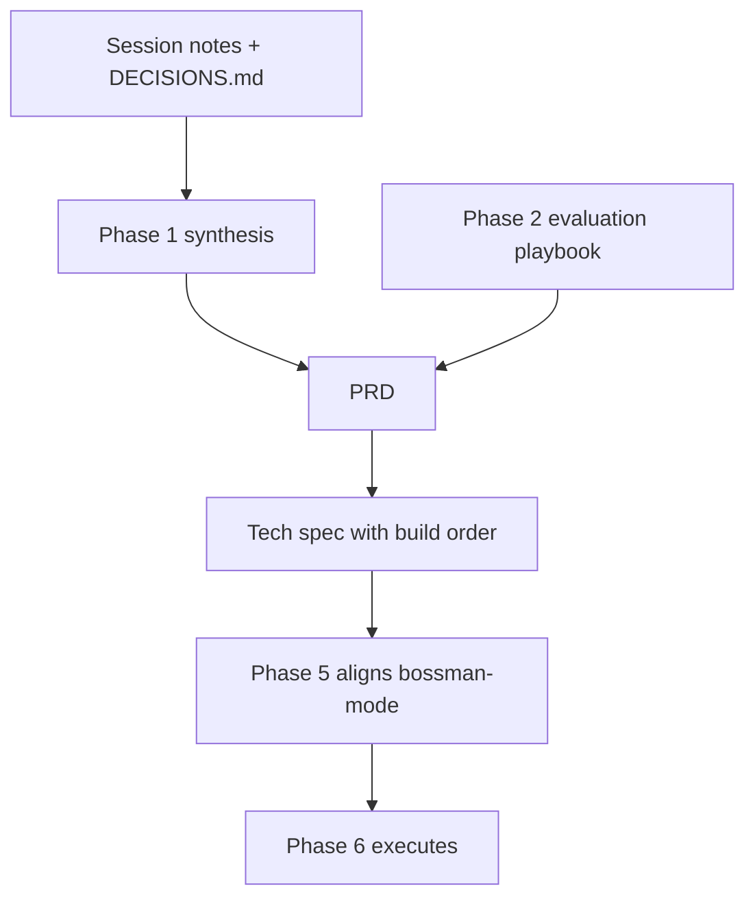
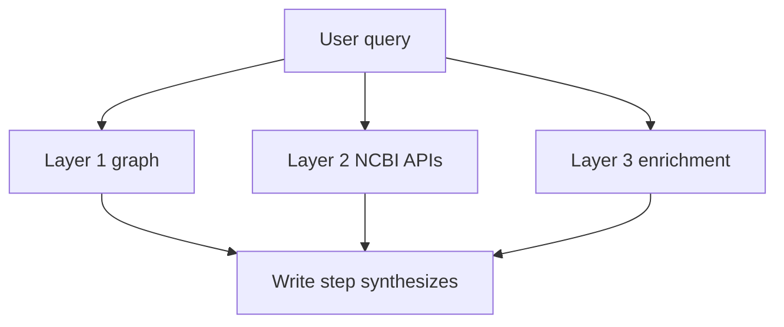

# Phase 1 synthesis

The topic-organized narrative of every Phase 1 decision. Session notes answer "what did we discuss and when." DECISIONS.md answers "what did we choose." This document answers "what does it all mean together, by topic, ready for the PRD."

This is a living document. It currently folds in Steps 1.1 through 1.6. Steps 1.7 through 1.13 are added as they complete. Point the PRD, tech spec, and strategic memo commands at this file, not at the individual session logs.

Status: covers Phase 1 Steps 1.1 through 1.6 (as of 2026-07-21). Steps 1.7 through 1.13 pending.

## Table of contents

- [How this document is used](#how-this-document-is-used)
- [Scope, delivery formats, and alignment](#scope-delivery-formats-and-alignment)
- [Backend framework and API surface](#backend-framework-and-api-surface)
- [Model harness, inference, and cost](#model-harness-inference-and-cost)
- [Agent architecture and the five-step loop](#agent-architecture-and-the-five-step-loop)
- [Three-layer data access](#three-layer-data-access)
- [Query understanding and Cypher generation](#query-understanding-and-cypher-generation)
- [Citations, provenance, and verification](#citations-provenance-and-verification)
- [Tools, adapters, and behavioral directives](#tools-adapters-and-behavioral-directives)
- [NCBI and enrichment API strategy](#ncbi-and-enrichment-api-strategy)
- [Data and graph handoff](#data-and-graph-handoff)
- [User psychology and product design](#user-psychology-and-product-design)
- [Evaluation approach](#evaluation-approach)
- [SDLC, process, and build sequence](#sdlc-process-and-build-sequence)
- [Open threads carried into later Phase 1 steps](#open-threads-carried-into-later-phase-1-steps)

## How this document is used

The document pipeline from discussion to a running build:

bossman-mode does not read this synthesis or the PRD at build time. It reads the tech spec's build order, which Phase 5 rewrites into bossman's phase definitions. This synthesis is the input to the PRD, and the PRD is the input to the tech spec.

## Scope, delivery formats, and alignment

The innovation proposal is the starting ground for v1, not an aspirational ceiling. All scope elements apply even though v1 is personally funded, because v1 must demonstrate the full system as evidence for the NCBI track.

Five delivery formats are in scope: web UI (primary), GraphQL API, MCP server, KGX export (scoped to the existing Hetzner graph, not a full Neo4j export), and a CLI agent.

NCBI strategic directives (FY26 guiding principles, Gold Standard Science, the AI Action Plan) are hard requirements, not positioning. They constrain system behavior: simplify discovery, reproducibility and transparency, AI-ready datasets.

What this means for the PRD: the problem statement and delivery-formats section inherit these as fixed constraints, not negotiable features.

## Backend framework and API surface

FastAPI over Django for v1. The agent loop needs native async for concurrent API calls, LLM streaming, and LangGraph integration. The core agent code is framework-agnostic, so porting to Django for the NCBI track is bounded work (HTTP layer only). Django's ORM adds no value because the system uses raw Cypher, not SQL models.

The API surface is hybrid: REST plus SSE for chat streaming, GraphQL via Strawberry for structured programmatic access to nested biomedical data. Both are served from the same FastAPI app with shared auth and shared tools.

Streaming uses typed SSE events (status, tool_result, token, citation, done) with hard latency budgets per query class (lookup 5s, single-hop 10s, multi-hop 30s, deep research 2min). On timeout, synthesize with partial results and explain what timed out. The user must never see a blank screen.

## Model harness, inference, and cost

A multi-model harness with three tiers routed by LiteLLM: guard (fast, cheap input validation), plan (mid-range query decomposition and tool selection), synth (strongest model for final synthesis and citation assembly). Hard cost caps at every tier.

Open-source models are preferred for the running system; commercial models are reserved for development debugging. The harness philosophy: a strong harness (guardrails, structured tool calls, deterministic citation assembly) lowers the capability required from each model, so cheaper models suffice for most steps.

OpenRouter is the inference provider (one API key, one billing, 100-plus models), accessed through LiteLLM in application code. LiteLLM controls which model gets called per tier; OpenRouter handles provider routing and fallbacks.

Specific model selection is deferred to the build phase (Phase 6) and decided by golden-dataset ablation. The harness pattern is locked now; swapping models is a config change.

Budget target: roughly $100 per month (a relative marker, not a hard cap). Hetzner is the main fixed cost; Railway and LangSmith free tiers cover the rest; inference on open-source models runs to single digits per month.

## Agent architecture and the five-step loop

A single orchestrator agent with three-tier model routing, not a multi-agent system. V1 competency questions need three to five tool calls per query, which one agent handles trivially. Sub-query decomposition (a LangGraph subgraph, not a separate agent) is the planned upgrade for deep-research queries needing many sequential tool calls; the trigger is a failure rate above 20 percent on that query class in the golden dataset.

LangGraph provides the orchestration: typed state, conditional edges, native streaming, and built-in persistence.

The agent follows a five-step loop, and each step has one job:

The contractor's eight-layer architecture was reviewed and not adopted. The five-step loop covers the same concerns with fewer abstraction boundaries: Guard maps to Entry plus governance, Think plus Plan map to Guarded Planning plus Context Retrieval, Act maps to Backend Compilation plus Knowledge Modules, Write maps to Provenance Response.

## Three-layer data access

Three layers, each with different latency, cost, and freshness:

Layer 1 is the AGE knowledge graph on Hetzner (115M nodes, 693M edges from five databases), queried read-only via psycopg2. Read-only is enforced at the connection level (kg_reader role), not just by instruction. Sub-10ms for typed queries.

Layer 2 is live NCBI E-utilities and related APIs (100 to 500ms), always current. Layer 3 is enrichment (PubTator3, LitVar2, LitSense, ClinicalTrials.gov), 200ms to 2s.

Independent tool calls run in parallel via asyncio.gather. Tool results are compressed by the harness before re-injection into agent context, so a 500-row Cypher result never floods the context or induces hallucination of the remainder.

Layer 2 is the authoritative fallback when Layer 1 data is suspect (stale snapshot, corrupted fields, NamedThing stubs). The principle: Layer 1 for speed, Layer 2 for correction, Layer 3 for enrichment. Graceful degradation is mandatory: if a layer fails, synthesize from whatever responded and explain the gap. The user never sees nothing.

## Query understanding and Cypher generation

The Plan step produces simplified structured output (query class, target entities, tool list), not the contractor's full typed query-plan IR. Query class (lookup, single-hop, multi-hop, aggregate, exploratory) drives model-tier routing and latency budgets. The full IR is the upgrade path if query complexity outgrows the simplified output.

The natural-language-to-Cypher separation is a firm principle: the LLM never generates Cypher directly from natural language. The Plan step reasons about what to query (structured output); the cypher_query tool handles how to query it. This blocks prompt injection into queries, enables validation before execution, and lets tools apply domain rewrites.

Schema slicing sends only the relevant graph-schema portion to the LLM per query, not the full schema (14 edge types, dozens of properties). Hand-authored for v1.

Cypher generation happens inside the cypher_query tool via its own plan-tier LLM call, constrained by the schema slice, few-shot examples, and edge-label enforcement, then validated (syntax, forbidden keywords, edge labels required, row limit) before execution. One retry on validation failure, then graceful failure. Cypher queries always specify edge labels explicitly; untyped edges force AGE into a UNION over all edge tables and turn milliseconds into minutes.

## Citations, provenance, and verification

The LLM is the narrative controller only. It writes natural-language narrative with placeholder markers; the harness maps markers to verified sources deterministically (source_url from graph nodes, NCBI record URLs, PubTator section refs) and strips any marker that does not match a real tool result. The user never sees a citation the harness cannot verify. This also lets the synth tier run a cheaper model, since it only writes narrative over pre-assembled cited data.

A verification loop runs between the Write step and the user: deterministic, in-memory, rules-based checks (every marker maps to a real result, CURIEs resolve, source_urls are valid, the answer addresses the query). No HTTP on the live path. LLM-as-judge is reserved for the offline eval harness, not the live query path.

Cite-or-refuse is the highest-leverage correctness gate: every answer is tied to a specific retrieved source, or the system returns "I could not find information on this" and stops. No answering from model priors when retrieval is empty.

## Tools, adapters, and behavioral directives

Tools are direct Python functions inside FastAPI for v1. The MCP delivery format wraps the same functions behind the MCP protocol separately, so MCP is a delivery format, not the internal tool architecture. Tools follow a narrow, strongly typed, validated contract surface; the model never sees raw API responses.

The data source adapter pattern: each source implements only the adapters that apply to its capabilities (Query required; Facet, Citation, Relationship, Streaming optional). The agent checks adapter availability before attempting an operation. No monolithic interface, no "not implemented" exceptions.

SOUL.md holds domain behavioral directives as natural-language rules the LLM follows (prioritize peer-reviewed sources, always state clinical significance, cite every claim), loaded into the prompt every session and versioned in git. USER.md and MEMORY.md were originally deferred to v1.1; the Step 1.6 investment-loop decision pulls the per-user personalization capability back into v1 (see below).

## NCBI and enrichment API strategy

The NCBI API rate limit is 100 requests per second (admin access), so throttling is no longer the binding constraint; planner budget enforcement still matters for cost and latency. The Variation Services API remains at 1 request per second, a separate IP-based pool.

A two-API strategy covers Layer 2: E-utilities (ClinVar, PubMed, OMIM), the Datasets API v2 (Gene, Genome, Orthologs, Taxonomy, richer gene records), and Variation Services (dbSNP individual lookups). Three APIs, three rate-limit pools, three tools.

PubTator3's REST API replaces all local NER and normalization (GNorm2, tmVar3, AIONER, BioREx behind one endpoint). This avoids a 60GB-plus local JVM stack.

The NCBI KG reference repo is used as an infrastructure template (React chat shell, LangSmith tracing wired to feedback, guardrail disclaimers, test organization, MCP patterns), not as an architecture blueprint. Its monolithic NL-to-Cypher pipeline is not adopted.

## Data and graph handoff

The graph is already loaded and running, so System 3 connects read-only and queries it as-is. The six v1 shoring-up recommendations are data-pipeline fixes for the next graph reload, not System 3 blockers: the NamedThing stubs are 0.07 percent of nodes and rarely appear in typed queries, and MedGen name corruption is a display issue with a Layer 2 fallback. All six are tagged "fix before next graph reload."

## User psychology and product design

Step 1.6 turned three product-psychology sources into requirements.

The adoption frame: habit is the goal, trust is the engine. System 3 aims to become the researcher's default first stop and bookmarked home. The mechanism that forms the habit is trust: every question returns a verifiably correct, cited answer faster than navigating five databases by hand. This reconciles the Hook model and the adoption-gap doc and grounds the Hook variable reward in the citations rule and the Phase 2 moat test.

The adoption metric: default first stop, measured by return-rate-per-question-occasion, not daily-active use. Researchers ask episodically, so a daily-active metric would punish the system for a cadence it does not control.

The experience model: research assistant, not a chatbot. The input stays chat-simple (one plain-language question, no forms, no query syntax, no database picking). "Not a chatbot" is carried by the answer format (a structured, provenance-forward research brief) and the surrounding surface (a workspace home with saved queries and suggested competency questions), not by the input box.

The investment loop is full in v1: per-user saved queries plus feedback-driven personalization. This revises the SOUL.md decision's deferral of learned personalization to v1.1; the capability is now v1, the file-versus-database mechanism a Phase 4 detail. It is the heaviest v1 item and the primary descope candidate if the build runs long.

The differentiation anchor: the moat is cited, deterministic, cross-database synthesis over the NCBI graph and APIs, which a general AI tool cannot reach or cite. Personalization compounds the moat because it is fused with that data and the user's own cited research history, but standalone personalization (generic memory) is copyable and is not the differentiator. The PRD problem statement anchors differentiation on data plus provenance, then presents personalization as the compounding, habit-forming layer.

Source routing: the NLM-lessons doc's unclaimed items (entity grounding as a ground_entities tool, few-shot from the golden dataset, structured query-intent logging, the overengineering rubric) route into the tool and architecture set (Steps 1.3 and 1.7); the board session notes route to Phase 2 user research.

## Evaluation approach

Evaluation is sequenced and elevated into a living evaluation playbook (the Phase 2 output the tech spec references): the offline competency-question gate first for a baseline before any answer-generation feature ships, the online feedback loop second once live. The competency-question set is the offline eval set, scored with the eval-harness skill (pass@k, pass^k, pass/fail/abstain). model-bench sits alongside for model selection, a separate target from answer quality.

The v1 competency-question set is capped at a small, testable number, then expanded once the loop is proven. A sharper selection bar (the moat test) is discussed in Phase 2 Step 2.3: prioritize questions a user cannot answer well with a general search engine or AI tool, scored on cannot-just-Google, deterministic, provenance, learn-from-the-system, and loop-human-behavior.

## SDLC, process, and build sequence

Production-level SDLC standards apply from day one via the six-lens dev-standards skill, plus Tier 1 security hooks wired into settings.json (a Bash delete block, secret scans on Bash and on config writes, session-start context-injection scan) and Tier 2 rules and skills (ai-security-standards, production-standards, production-examples, eval-harness, verify).

The deliverable sequence: Plan.md discussions produce the PRD, then the tech spec, then a one-to-two-page strategic memo distilled from both. The prototype is built from the PRD and tech spec, then all three docs are reconciled from what the prototype teaches (the one planned mid-build spec update).

bossman-mode uses git worktree isolation for concurrent file-mutating builders, with phase-branch plus MR as the integration model layered on top; read-only agents (reviewers, researchers, judges) stay in the shared checkout. Applied when bossman-mode is updated in Phase 5.

## Open threads carried into later Phase 1 steps

- Step 1.7: NFR baseline (which apply to the POC), the NLQ approach (build toward the typed IR while operating like CQ templates for the POC), federation scope for v1, Anne's evaluation outcomes as requirements.
- Step 1.8: tools and infrastructure (Railway, PostHog, Arize versus LangSmith, Linear, GraphQL versus REST).
- Step 1.9: the ten open questions, each to a decision or an explicit defer-to-tech-spec.
- Step 1.10: cross-cutting concerns (security and threat model, data freshness and conflict resolution, rate limiting under concurrency, UI patterns, accessibility and Section 508).
- Step 1.11: new intake research (model routing tiers, providers, model-bench, caching, wrapping investments).
- Step 1.12: conference learnings (ISMB, KGC, Nodes AI).
- Step 1.13: LLM legal and compliance obligations (country-of-origin restrictions, licensing, federal authorization, data-handling contracts, Track 1 versus production line).
