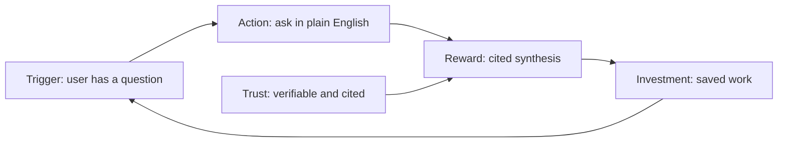

# Phase 1 session: July 21, 2026

Date: 2026-07-21
Attendees: Monideep, Claude (agent teammate)
Type: source review and architecture decisions
Context: resumed Phase 1 after a gap. Steps 1.1 through 1.5 were locked on 2026-05-07. This session covers Step 1.6.

## Steps covered

- Step 1.6: user psychology and product design - COMPLETE
- Step 1.7: contractor documents (7 sources) - COMPLETE
- Step 1.8: tools and infrastructure - COMPLETE
- Step 1.9: open questions (ten) - COMPLETE
- Step 1.10: cross-cutting concerns (five topics) - COMPLETE
- Step 1.11: new intake research (45 sources) - COMPLETE
- Step 1.12: conference learnings (3 conferences) - COMPLETE
- Step 1.13: LLM legal and compliance obligations - COMPLETE (Phase 1 complete)

## Sources reviewed

Step 1.6 ran on the three product-psychology sources:

1. Hook model and belief design (Nir Eyal): `Reference/user-side/Hook_model_and_belief_design_Nir_Eyal.md`
2. Bridging the AI adoption gap (enterprise): `Reference/user-side/Bridging_the_AI_adoption_gap_enterprise.md`
3. Build to learn vs. build to earn: `Reference/user-side/Build_to_learn_vs_build_to_earn.md`

Two sources listed against Step 1.6 in earlier planning were routed elsewhere (see "Source routing" below): the NLM-lessons doc (technical borrowings) and the board session notes (org and stakeholder dynamics).

## The frame: habit is the goal, trust is the engine

The opening question was whether System 3's adoption problem is a habit-formation problem (the Hook model applies) or a trust problem (adoption comes from being verifiably right, per the adoption-gap doc).

The answer resolved the two sources instead of choosing between them. Habit formation is the goal: we want the system to become the researcher's default first stop, the page they bookmark, the place they start any NCBI-type question instead of navigating across separate databases. Trust is the engine that forms that habit. For a research tool the variable reward is not a novelty trick. It is "every time I ask, I get a verifiably correct, cited answer faster than navigating five databases myself." Trust is what makes the loop repeat.

This grounds the Hook model's variable reward in the citations-non-negotiable rule we already hold, and it ties directly to the Phase 2 moat test (a competency question is worth including when the answer cannot just be Googled and must be synthesized across the graph and the APIs).

The Hook loop, mapped to System 3 and grounded in trust:

- Trigger (internal): the researcher has a question and wants evidence synthesis fast.
- Action: one plain-language question. No forms, no query syntax, no database picking.
- Variable reward: the unpredictable depth of correct cross-database connections, always cited. Rewards of the hunt.
- Investment: saved queries, feedback, and personalization that make the system better with use.

## The metric: default first stop, not daily-active

Nir's own bar for habit formation is weekly use. Most NCBI researchers do not have a genomics question every day. Writing "daily-active use" as the success metric would punish the system for a question cadence it does not control.

Decision: the adoption goal is to become the default first stop and the bookmarked home, measured by return-rate-per-question-occasion, not daily-active use. Frequency then follows from the user's real cadence rather than being the target itself.

## The tension: lowest-friction input versus "not a chatbot"

Two stated wants appear to fight. We want the lowest-friction input (a plain-language question) and we want the experience to feel like a research assistant, not a chatbot. Taken literally these conflict, because the lowest-friction input surface is a text box, which is exactly what a chatbot looks like.

They reconcile once "not a chatbot" is carried by two things other than the input box:

- The answer is a structured, provenance-forward research brief, not a chat bubble of prose.
- The home is a workspace (saved queries, suggested competency questions, entry points), not a blank thread. That workspace is also where the Hook investment phase becomes visible.

So the input stays chat-simple, and the answer format plus the surrounding surface are what make it feel like a research assistant.

## What Step 1.6 puts into the PRD

Six requirements carried forward as product-psychology principles for the PRD and the UI:

1. Trust is the primary adoption lever: verifiable correctness and citations are the habit-forming mechanism, not engagement mechanics. This elevates the existing citations rule to a stated adoption requirement.
2. Minimal-friction action: one plain-language question, no forms, no query syntax, no database picking.
3. Variable reward is the depth of correct cross-database synthesis, always cited. Ties directly to the Phase 2 moat test.
4. Research-assistant experience, not a chatbot: cited research-brief answers plus a workspace home, not a bare chat thread.
5. Default-first-stop as the adoption goal and success metric, not daily-active.
6. Investment loop: saved queries, feedback, and personalization that make the system better with use.

## The investment loop decision and its conflict with the SOUL.md decision

The investment loop (requirement 6) is what actually forms the habit, and it is the most expensive requirement: it needs user accounts, stored per-user state, and a data model. Three levels were considered:

- None in v1: anonymous, stateless, no saved queries. Investment loop entirely v1.1.
- Saved queries only in v1: accounts plus save and rerun a past query, no personalization or learned memory.
- Full loop in v1: saved queries plus feedback-driven personalization.

Decision: full loop in v1.

This revises part of a locked decision. The 2026-05-07 SOUL.md decision deferred USER.md (user context) and MEMORY.md (learned strategies) to v1.1, keeping v1 focused on a single behavioral directive file. Feedback-driven personalization pulls the learned-personalization capability back into v1. The new decision states: the personalization capability is now v1 scope; whether it is implemented as USER.md and MEMORY.md files or as database-backed per-user state is a tech-spec detail deferred to Phase 4. The SOUL.md behavioral directive file itself stays as decided.

Flag: this is the heaviest v1 scope item and the primary descope candidate if the build runs long. If the timeline compresses, drop from full loop to saved-queries-only before cutting anything in requirements 1 through 5.

## Clarification: what actually differentiates System 3

A follow-on question sharpened the investment-loop decision: is per-user personalization the thing that distinguishes System 3 from a general AI tool? The stated intuition was "if it is generic, people should just use a general AI tool."

Stress-tested, the intuition needed hardening. General AI tools already have memory and personalization, so standalone personalization is copyable and is not the defensible moat. What a general tool cannot do is return a deterministic, cited answer synthesized across the NCBI knowledge graph and live APIs, with every claim traceable to a source record. That is the moat, and it is exactly the Phase 2 moat test.

Two senses of personalization were separated. Domain personalization (SOUL.md: behaves as a biomedical research assistant, prioritizes peer-reviewed sources, states clinical significance) is already in v1 and is part of "not generic." Per-user personalization (the investment loop) is the habit and retention layer.

The resolution, confirmed: personalization becomes defensible the moment it is fused with the data layer. Generic memory of your chats is copyable; personalization grounded in the graph and in your own cited research history (your organisms, gene families, prior competency questions, accepted evidence standards) is not, because it requires proprietary data a general tool cannot reach. So the moat is data plus provenance, and personalization compounds it. The PRD problem statement anchors differentiation on cited cross-database synthesis, then presents personalization as the compounding, habit-forming layer. This changes framing, not build scope: the full investment loop stays in v1.

Logged as a decision (2026-07-21).

## Source routing

Earlier planning disagreed on the fourth source for Step 1.6. Plan.md listed "NLM lessons," the continuation prompt listed "board session notes." Both were reviewed and routed out of 1.6:

- NLM lessons (`Lessons_from_NLM_KG_contractor_for_System_3.md`): a technical-borrowings doc, not product psychology. Some of its six recommendations are already decided (schema slicing matches the Plan-step schema-slicing decision; the validation gate matches the Cypher validation pipeline decision). The unclaimed items are routed into the tool and architecture decision set for Steps 1.3 and 1.7: entity grounding as a `ground_entities` tool called before Cypher generation, few-shot examples drawn from the golden dataset, structured query-intent logging on the planner output, and the overengineering rubric as a periodic self-check.
- Board session notes (`thoughts/Board_session_*.md`): organizational and stakeholder dynamics (the Rana collaboration and the stakeholder-engagement split). These feed Phase 2 user research, not PRD psychology requirements. Parked for Phase 2.

## Decisions logged to DECISIONS.md

Five rows appended (2026-07-21):

1. Step 1.6 adoption frame: habit is the goal, trust is the engine.
2. Step 1.6 adoption metric: default first stop, not daily-active.
3. Step 1.6 experience model: research assistant, not a chatbot.
4. Step 1.6 investment loop full in v1, revising the SOUL.md personalization deferral.
5. Step 1.6 source routing: NLM lessons to the tool and architecture set, board notes to Phase 2.

## What is next

Step 1.7: review contractor documents (7 sources): the NFR baseline, the NLQ approach, meeting decisions D1 through D5, the contractor's latest documents, and Anne's evaluation playbook.

## Step 1.7: contractor documents (7 sources)

Date: 2026-07-21 (same session, continued)
Sources: NFR baseline (10 categories), NLQ approach (6 ranked options), April 21 KG-Tech WG meeting notes (D1 through D5), July 07 K3 US1/US2 review package (17 competency questions), Anne's evaluation playbook.

### The lens: the contractor package is Track 2

Every contractor document describes the official NLM track, not our build. The contractor (K3/BCC) is designing an RDF plus SPARQL system, GraphQL as the public surface, four federated modular graphs (GKN, CKN, RWDKN, HuPhysKN), scoped to glucose metabolism and GLP-1, and still at design-review (all 17 questions marked profile_required, no running graph). System 3 is a different animal: the property graph already exists (115M nodes, 693M edges on Hetzner), we query it with openCypher over psycopg2 across the whole NCBI corpus, and we build a search agent plus UI on top.

Decision: mine the package for patterns, NFRs, and evaluation criteria that serve both the Track 1 POC and Track 2, but do not inherit its RDF, SPARQL, GraphQL, and federation architecture. Extends the earlier infrastructure-template-not-blueprint decision to the whole package.

The July 07 package reinforced this rather than complicating it. It is still design-review only, so there is no working contractor system to build on. It handed us two patterns worth borrowing: the competency question baked into the data as an auditable key (every answer row carries a competency-question field, and validation fails any row missing it), and the edge case that zero rows means unsupported within this data boundary, not no evidence exists in biology (which maps to our graceful-degradation rule). It also showed one place we are ahead: the identifier reconciliation that blocks the contractor (GOA gene products are not NCBI Gene IDs) is already solved upstream in our graph, where entities are normalized to CURIEs.

### NFR baseline: three buckets, not the contractor's tags

The contractor's POC and MVP tags were written for their build. Most of their POC-tagged NFRs govern constructing and curating the graph, which is System 1/2 work we inherit as done. So we re-filtered all 10 categories through three buckets:

- Bucket A, out of scope: graph construction and curation (schema, mapping, loading, curation UI, NLM-KN export). System 1/2 owns it.
- Bucket B, POC must-have: the query, answer, guardrail, and provenance surface.
- Bucket C, defer past POC: production hardening (role separation, session expiry, backup and recovery, help text, closeout docs).

Bucket B, the POC must-haves, group into four things the POC has to prove:

1. Trust and provenance: DATA-01A (surface source, evidence, confidence), REP-01A (separate inferred from cited), AUD-03 (answer names its graph snapshot).
2. Query and answer UX: UX-01, UX-02, UX-04, PERF-03.
3. Performance and reliability: PERF-01 (latency budgets), REL-01 (runs for demos), REL-02 (graceful degradation).
4. Evaluation and test gates: OPS-01, OPS-03, PERF-04, REP-01.

Security posture (Monideep's steer: product-market fit before enterprise security). Security splits in two. Trust-guardrails stay in the POC because trust is the product: read-only enforcement at the connection, provenance integrity, cost caps, prompt-injection defense. Enterprise security defers (all of IAM category 7: role separation, session expiry, access review). One honesty flag: basic user auth is deferrable for the POC prototype but returns as a v1 must-have, because the Step 1.6 full-investment-loop decision (saved queries, personalization) needs user accounts.

### NLQ approach: a confidence-layered hybrid

The tension: Plan.md had imported the contractor's recommendation verbatim (build toward rank 1 typed IR, operate like rank 2 CQ templates), but our own Decisions 19, 20, and 27 already chose something different (simplified classification, not full IR; a dedicated LLM call generates Cypher, which is not rank-2 slot filling).

Why rank 1 and rank 2 fit the contractor but not us: their heavy typed IR exists to decouple mixed RDF and property-graph backends behind one contract, with GraphQL as the public surface and identifier bridges across four modules. We have one backend, an already-normalized CURIE graph (so the ontology-bridge brittleness that scares them off direct generation is mostly gone), and NL from day one as our differentiator (rigid templates fight it, which even the April 21 meeting D4 called a POC-only compromise).

The decision, in plain terms (the template-versus-generation question): it is not either/or. Layer both by confidence.

- The POC prototype leads with the AI writing the query, then a validate-and-repair pipeline checks it (read-only, schema conformance, row and time caps). This proves the plain-language magic and harvests what people really ask.
- Verified query templates are layered on for the roughly ten tier-1 must-pass competency questions while hardening to v1. Determinism lands exactly where we are graded.
- Generated queries that keep proving correct get promoted into the verified-template library. Today's flexible generation becomes tomorrow's deterministic template, which is the Phase 2.5 feedback loop made concrete.

Backend-agnostic principle (Monideep's ArangoDB concern). The agent produces a database-neutral structured plan; the query language lives only inside the query tool and never leaks up to the agent. Swapping the graph store (AGE, Neo4j, ArangoDB, or an RDF store) is a contained change to that one tool. The POC still queries the existing AGE graph over openCypher; agnostic means the design stays swappable, not that multiple backends ship on day one. openCypher is already portable across Neo4j, Memgraph, and AGE; ArangoDB (AQL) is the outlier.

This corrects the Plan.md Step 1.7 "operate like rank 2" language.

### Federation and NL from day one (meeting decisions D1 through D5)

D1 (infra planning early), D3 (6-month POC then MVP), and D5 (coordination) are Track 2 timeline and coordination items, noted and skipped. D4 (template for the POC, NL long-term) is already resolved by the NLQ hybrid: we go further than the contractor, NL from day one is our POC interface and templates are the determinism layer underneath.

D2, federation, is the real decision. The contractor's federation means querying external RDF knowledge graphs in place. We already deliver the value of federation through the three-layer data architecture (Layer 1 graph plus Layer 2 NCBI APIs plus Layer 3 enrichment, combined at query time), which is our moat. Decision: v1 federation scope is exactly the three data layers, all NCBI or NCBI-adjacent; external non-NCBI knowledge-graph federation defers to v2.

### Anne's evaluation playbook: the milestone ladder at two altitudes

The strongest thing to adopt is Anne's milestone ladder. She decomposes trustworthiness into a climb from mechanical to scientific to external, each gate a go/no-go with its own metric. Mapped to System 3, it also answers the stakeholder question:

| Gate | What it checks in System 3 | Test type | Stakeholder served |
|---|---|---|---|
| G1 | each tool works alone | objective, machine | build team |
| G2 | sources join across Layer 1, 2, 3 | objective, machine | build team |
| G3 | cited, SME-credible scientific answers | subjective, human or LLM-judge | researcher plus SME reviewer |
| G4 | reuse-ready delivery formats | external adoption | external adopters plus NCBI leadership |

Bart's leadership-explainability test (can Richard and Steve talk about it at the ICD meeting) is a fifth success test, served by the strategic memo, not a code gate.

Where does it live: the altitude split. The milestone ladder framework (the four gates plus the stakeholder mapping) becomes a hard PRD requirement in the success-metrics and acceptance-criteria sections (the constitution, stable). The operational numbers (thresholds, per-competency-question mapping, SME scoring rubric, feedback loop) live in the Phase 2 evaluation playbook (the laws, tuned as we learn), so the locked PRD does not reopen to change a metric. The eval harness is the courtroom that runs the gates. This is the same pattern the Plan already uses (the tech spec references the playbook rather than restating it) and Anne's own two-views-of-one-thing. Evaluation is a process, so PRD success metrics are stakeholder-segmented, not one blended number.

Reinforcements of existing decisions (noted, not new): the competency-question fixed eval set with the moat test (can a bare model or Google already answer it), and the derived-versus-cited provenance rule (REP-01A). Reference only: the logic model is not a separate artifact, because our PRD outcomes-and-stakeholders section is our logic model; and Anne's honest limit (AI got to the data but not the working graph) does not bite us the same way because our graph already exists.

### Decisions logged to DECISIONS.md (2026-07-21)

Six rows appended: the lens, the NFR three-bucket filter and security posture, the backend-agnostic principle, the generation-first query hybrid, the federation scope, and the evaluation milestone ladder at two altitudes.

## What is next (after Step 1.7)

Step 1.8: tools and infrastructure (Railway, PostHog, Arize versus LangSmith, Linear, GraphQL versus REST).

## Step 1.8: tools and infrastructure

Date: 2026-07-21 (same session, continued)
Framing (Monideep): keep it straightforward, build on infrastructure we already know works.

### Hosting strategy: build individually first, migrate to NCBI later

Build the Track 1 PoC on our own proven stack, then migrate to NCBI/OCCS infrastructure after the PoC. Building on NCBI infrastructure from day one would make Track 2 migration free, but it couples the PoC to access approvals, ATO and FISMA constraints (Step 1.13), and slower iteration, which kills the fast-learning PoC goal. Migration later is bounded work, the same logic as the FastAPI-to-Django decision.

One split matters: separate runtime hosting from collaboration and data tools. Runtime hosting stays on our stack now. But Monideep's NCBI MCP access to Confluence, Jira, and GitLab is used now, because Phase 2 Step 2.2 scrapes exactly those sources to learn what people actually search for. So we host on our own stack and pull real data through the NCBI MCP tools.

### The stack (proven, from the NCBI KG reference repo)

| Need | Pick | Note |
|---|---|---|
| Runtime hosting | Railway | reference repo runs on it, free 1-year plan |
| Product analytics | PostHog | reference repo: 7 custom events |
| LLM tracing and eval | LangSmith | proven in the reference repo, free tier, over Arize |
| Public API | REST plus SSE (chat), GraphQL via Strawberry (programmatic) | reaffirms Decision 4, resolves the GraphQL-versus-REST open question |

### Issue and task tracking: our own tracker

Linear is dropped (access ends 2026-07-29). Instead, a self-maintained in-repo markdown tracker (a table, e.g. TASKS.md at root next to DECISIONS.md), kept current, migrated to NCBI Jira after the PoC. It has no expiry, no external access dependency, and is version-controlled with the code. During Phase 1 planning, Plan.md and the continuation prompt already track progress, so the dedicated tracker file stands up when the build starts in Phase 6.

### Decisions logged to DECISIONS.md (2026-07-21)

Three rows: the hosting strategy (build individually first, migrate to NCBI after the PoC), the proven tool stack (Railway, PostHog, LangSmith, REST plus SSE plus GraphQL), and the self-maintained in-repo tracker.

## What is next (after Step 1.8)

Step 1.9: resolve the ten open questions from section 12 of `Background_requirements.md`, each to a decision or an explicit defer-to-tech-spec.

## Step 1.9: open questions (ten from Background section 13)

Date: 2026-07-21 (same session, continued)
Approach (Monideep): for each question, show whether it is confirmed and where it was decided, so we either reopen the thought or agree and move on.

### Disposition

Six confirmed by prior decisions, one defers, three were genuinely open:

| # | Question | Status | Where |
|---|---|---|---|
| 1 | GraphQL vs REST | confirmed | Decision 4 (hybrid), reaffirmed Step 1.8 |
| 2 | Single vs multi-agent | confirmed | 2026-05-07 (single orchestrator, 3-tier) |
| 3 | CQ routing upgrade | confirmed | 2026-05-07 (few-shot now, >20% failure trigger) |
| 4 | Model distillation | resolved (below) | pattern now; routing to 1.11, legal to 1.13 |
| 5 | Federation scope | confirmed | Step 1.7 (three layers, external KG to v2) |
| 6 | Login / user data | confirmed | Steps 1.6 and 1.8 (v1 accounts; specifics to Phase 4) |
| 7 | Agent naming | decided (below) | scientific names, streamed persona |
| 8 | Bossman-mode updates | defer | Phase 5 Step 5.1 |
| 9 | Cost-cap values | defer | Step 1.11 and tech spec |
| 10 | Deployment | confirmed | Step 1.8 (Railway) |

### Model distillation (4)

Keep two things separate. Tiered orchestration (a strong model plans and thinks, cheaper or smaller models do the bounded subtasks) is our 3-tier harness, decided 2026-05-07, and it is the main v1 cost lever. The Opus-plans / Sonnet-executes example maps onto it exactly. Model distillation proper (fine-tuning a smaller student model to match a stronger one) is a heavier v2 optimization, deferred until query logs stabilize. Which models fill each tier is a Step 1.11 decision (routing, model-bench), gated by Step 1.13 (legal: open Chinese-origin models restricted, commercial API models raise data-handling and BAA questions). The goal is open-source or smaller models to control cost at scale, which the tiered pattern already enables.

### Agent naming (7)

Decided: scientific names after great historical biomedical scientists (Mendel, McClintock, Franklin, Pasteur, and so on), surfaced to the user to build connection, in the spirit of Claude Code's curated verb list. The single orchestrator carries the lead name and persona; sub-query decomposition later can carry named sub-steps. The named persona's reasoning streams to the user, tying into the Step 1.10 streaming-thinking idea. Design guardrail carried into Step 1.10: keep the persona subtle and serious, not a gimmick, so it does not undercut the provenance-forward positioning. Curating the name list is a Phase 6 build task.

### Cost caps (9)

The caps exist and abort runaway loops (already locked). The specific per-query, per-user, and system-wide values are deferred to Step 1.11 (cost is first-class there) and finalized in the tech spec.

## What is next (after Step 1.9)

Step 1.10: cross-cutting concerns (security and threat model, data freshness and conflict resolution, rate limiting under concurrency, UI patterns, accessibility and Section 508). The parked streaming-thinking and named-persona ideas feed the UI-patterns discussion.

## Step 1.10: cross-cutting concerns (five topics)

Date: 2026-07-21 (same session, continued)
Approach: for each of the five topics, show what is confirmed and where, then decide the open ones. A read-only survey of the NCBI KG reference repo informed the security and UI decisions.

### Security and threat model

Forbidden outputs locked: the system reports cited evidence and clinical significance from source records and never gives personal medical advice, diagnosis, or treatment guidance. Two more forbidden classes: off-topic or non-biomedical queries (refuse and redirect, so it stays a research tool) and jailbreak or prompt-injection attempts (guardrail rejects). Each is a tested refusal path, like cite-or-refuse.

Threat model: the "Agents of Chaos" six failure categories map onto defenses we already hold. Destructive actions are blocked by the read-only connection, resource exhaustion by cost caps and timeouts, false completion by cite-or-refuse and the verification loop, sensitive-info disclosure by least privilege and no-PHI-to-LLM, unauthorized compliance by v1 auth plus read-only, identity spoofing by the single orchestrator and schema-validated tool I/O.

Adopt from the reference build: the zero-cost pre-LLM guardrail (a biomedical allowlist, a medical-advice-seeking regex block, and an off-topic block) and read-only enforcement done twice independently (at the Cypher validator and again at the database-client layer, so a direct raw-query call cannot bypass the write-keyword block). Swap the glucose-metabolism vocabulary for our genomics, dbSNP, ClinVar, and PubMed domain.

### Data freshness and conflict resolution

Confirmed. Layer 2 (live NCBI APIs) is the authoritative fallback when Layer 1 (the graph snapshot) is suspect (Decision 21); graceful degradation always (Decision 22). The specific acceptable-staleness threshold defers to the tech spec.

### Rate limiting under concurrency

Confirmed and deferred. The 100 rps admin limit relaxed the binding constraint; cost caps hold the line on runaway use. The queue-versus-prioritize-versus-fail-fast strategy for concurrent users defers to the tech spec, a low concern at PoC scale.

### UI patterns

Architecture: one orchestrator plus parallel tools is the mechanism (confirmed, consistent with the single-orchestrator decision), with the named-scientist team as a presentation-and-streaming layer on top, not autonomous subagents. A bounded LangGraph sub-query subgraph is the upgrade path for deep-research query classes (>20% failure trigger). The reference survey confirmed the foundation is single-agent, reinforcing this.

Naming: the persona list is the top 100 biomedical scientists by contribution (curated as a Phase 6 build task). The lead orchestrator and the named sub-steps all draw from that list.

Streaming-thinking depth: the curated named-step narrative streams by default ("Mendel is querying the knowledge graph, Franklin is checking dbSNP, synthesizing"), with a stop button throughout so the user can abort a query going the wrong way, plus an optional "show full reasoning" expander for the raw chain-of-thought. The reference frontend has no streaming at all, so this is net-new; its QueryPipeline stepper is the base to adapt for the named-step stream.

Reference components to adopt or adapt (Phase 6): the ChatMode chat shell, the results table, the feedback buttons, the session-gated medical-disclaimer modal, LangSmith tracing with a no-op fallback, the PostHog wrapper, the MCP-wraps-the-API-never-the-database least-privilege pattern, and the pipeline stepper. Skip: KGX export and the admin portal (System 1/2 or out of roadmap), and the Neo4j-specific deployment configs.

### Accessibility and Section 508

Deferred. Full Section 508 and WCAG 2.1 AA conformance moves to the production and v1 track. The PoC prototype does reasonable-effort accessibility (semantic HTML, keyboard navigation) but no formal audit, because it is a PoC.

## What is next (after Step 1.10)

Step 1.11: new intake research (orchestration style and model routing tiers, providers, model-bench as the model-selection method, caching, wrapping investments). This is where the cost-cap values and the model-per-tier choices land.

## Step 1.11: new intake research (45 sources)

Date: 2026-07-21 (same session, continued)
Approach: dispatched four Sonnet 5 sub-agents in parallel (harness and agent loops; model routing and cost; caching, memory, and retrieval; prototype-to-production), each surveying its slice of the 45 new-intake documents and returning adopt/adapt/reference picks mapped to the six decision areas, with instructions to flag anything that would revise a prior decision. Nothing forced a reversal; most findings sharpened or validated existing decisions.

### Adopt batch (logged to DECISIONS.md as three rows)

Orchestration and caching: coordinator/worker as the cost mechanism (strong tier plans and writes, cheap tier fetches and returns findings plus citations, never raw passages, making cite-or-refuse an architectural boundary); route by query shape (single-hop to Layer 2, multi-hop to Layer 1, dynamic to the full loop) with exact ID/CURIE retrieval as the default and fuzzy matching only to resolve free text to a CURIE; prompt caching now via OpenRouter (stable prefix, no mid-query model switch, cache efficiency tracked as a metric), with KV-cache reuse reference-only. Measured support: ~2.5x cheaper and 3x faster for coordinator/worker, up to 81% cost reduction from prompt caching.

Model-bench and providers: a System-3-specific bench of frozen per-tier tasks (Cypher generation, tool-schema adherence, citation synthesis, guardrail classification), deterministic scoring for correctness and GeneBench-Pro style for biomedical judgment, taste-weighted only for tone; the open-source candidate set to benchmark in Phase 6 (DeepSeek-V4, Kimi K2.6/K2.7, GLM-5.2, Qwen3-Max, Gemma 4); resilience and capacity as selection criteria. Sobering data point: the best model scored 28.7% on genomics-judgment GeneBench-Pro.

Tools, memory, and harness/production: opinionated narrow tools with full descriptions (VirBench: 16.9% to over 90% accuracy once a deterministic tool owns execution); provenance-gated, promotion-gated investment-loop memory; fail-fast harness and freeze-the-model-iterate-the-harness; safety and caps in the runtime layer not prompts; control-plane/data-plane decoupling for the NCBI migration; and extending the Phase 4 eval to check query decomposition, not only citations.

### Rejected or reference-only

Rejected: self-modifying and self-improving harnesses (conflicts with the human-approval rule), the two-primitive-tools philosophy (VirBench argues the opposite), and the ship-at-80%-evals-later posture (the cite-or-refuse gate stays non-negotiable). Reference-only for now: KV-cache reuse and self-hosted sandboxes (inference-infra level, revisit only if we self-host a Guard-tier model), Hermes' full identity-memory-self-evolution loop and enterprise org-wide multi-agent memory (out of v1 scope), native voice/video interaction, RL training, and the compute/geopolitics narrative.

### Open calls decided

1. Cost caps: per-query $0.10, per-user 100/day, system-wide $10/day, timeouts inherit the latency budgets. Tunable in Phase 4.
2. Fusion/ensemble panels: deferred to v2 as a triggered escalation lever; the PoC stays single-orchestrator.
3. Router: no separate router step; routing is folded into Guard plus Think's classification; a pre-Guard classifier is a future option only.
4. Risk-tier classification pass: deferred to Phase 3, run against the Phase 2 competency-question set, to right-size logging and catch over-building.

## What is next (after Step 1.11)

Step 1.12: conference learnings (ISMB-2026, KGC-2026, Nodes-AI). A "Claude reviews, Monideep confirms" step: I survey the conference notes and bring the must-feed-the-PRD learnings.

## Step 1.12: conference learnings (ISMB, KGC, Nodes-AI)

Date: 2026-07-21 (same session, continued)
Approach: three Sonnet 5 sub-agents surveyed the three conference folders in parallel (about 182,000 words), prioritizing the already-synthesized book chapters and key-principles and spot-checking the raw session notes, each returning must-feed-the-PRD versus reference-only picks mapped to System 3, with instructions to flag anything that would revise a decision. The three conferences converged, which is the strong signal.

### Must feed the PRD

Query understanding and NL-to-Cypher discipline (AbbVie, Bayer, Adobe, Verspoor converge): resolve free-text terms to CURIEs first and ask a targeted clarifying question on ambiguity before generating a query; inject only the query-relevant subgraph schema, never the full schema; restrict the model to the real schema so the validator catches nonexistent labels; add a human-readable glossary onto opaque BioLink terms; split validation from result-summarization; cache the full sliced schema upfront, not progressively.

Provenance schema expansion: add evidence-kind, assertion-confidence (asserted vs hedged vs contested), population/ancestry context, and license as first-class fields alongside source, source_id, source_url, layer; surface a trust signal to the user with an answer/flag/ask gate.

Grounding gates beyond presence: a citation-substantiation check (the cited passage supports the specific claim, 39% of published citations do not) plus a cross-source triangulation gate for higher-stakes mechanistic claims (DrugAgent reached 98.8% faithfulness requiring independent-layer agreement).

Eval-harness redesign (Phase 4): contamination-resistant, concept-scored with ontology-synonym expansion, human-baseline graded, with inductive held-out splits that exclude whole entities, plus a separate regression suite re-run on every model or prompt change.

Tools, memory, and access: document every tool's inputs, outputs, and failure modes as a first-class deliverable (BioNeMo 57% to 100% from documentation alone); a cheap non-LLM classifier as a Guardrail pre-filter; log every Layer 2/3 access with authorization; implement the investment-loop memory as a hydrate-reason-act-write-back loop; add temporal recency as a query shape.

### Three open calls decided

1. Vector/semantic retrieval: use Layer 3 LitSense as the semantic mode combined with graph and NCBI keyword search for tri-modal retrieval, no bespoke vector index for the PoC; revisit in v2.
2. Multi-agent graduation: single orchestrator for v1, written v2 graduation trigger (tool roster past ~10-15 or specialist metrics degrade).
3. Moat-test coverage caveat: keep the competency-question moat test, add a separate coverage metric; never read the pass rate as coverage proof.

### Doc-hygiene flag

The upstream Innovation proposal 2026 and vision-of-success source docs still describe System 3 as 8 specialized agents, stale relative to the single-orchestrator decision. Reconcile in a future docs-sync so it does not leak into the PRD.

### Reference-only (v2)

Shared graph memory across multiple agents, a graph-backed MCP tool registry (only past ~10-15 tools), world-model edge statistics, council-of-models cross-validation (cost tension with the caps), enterprise governance-as-graph, automated KG construction (System 1/2, out of scope here), graph-native prediction methods, DataLog/SHACL write-action gating (no write path), DPROD data products, spatial-web and holonic models, and multi-vendor agent-interoperability protocols.

## What is next (after Step 1.12)

Step 1.13: LLM legal and compliance obligations (country-of-origin restrictions, model licensing, federal authorization, data-handling contracts, Track 1 versus production line). The last Phase 1 step, and it gates the model choices from Step 1.11.

## Step 1.13: LLM legal and compliance obligations

Date: 2026-07-21 (same session, continued). The last Phase 1 step.
Source: `requirements/context/ncbi_ai_models_control_first_summary.md` (control-first hosting plus a legal and compliance section).

The frame: legal obligations are a separate gate from the control-first ranking, and they bind the federal production path, not necessarily a personal Track 1 prototype on public data. So Step 1.13 resolves into a two-lane split.

### Track 1, the personal prototype (applies now)

Public NCBI data, ~$100, 2 months. Model licensing allows permissive (MIT, Apache 2.0) as the default, which covers most candidates (DeepSeek MIT, Qwen3 Apache, GLM-5 MIT); use-restricted terms are allowed only with their obligations tracked into any fine-tune; research-only and non-commercial licenses are barred for the running system; Llama's capped-commercial license is fine at our scale. There is no PHI, so no BAA is a v1 must-have (user-account PII is handled per ai-security-standards, never sent to an external LLM). Zero-retention and no-training-on-inputs terms on the inference path are a should-have now. OpenRouter is a Track 1 hosting choice (least controlled, fine for public data). Model choice stays a config swap, and compliant US or allied-origin alternatives are benched in parallel.

### Country-of-origin, Option A (the one judgment call, Monideep decided)

Track 1 uses the strongest benched models now, including Chinese-origin (DeepSeek, Kimi, GLM, Qwen), because it is a personal prototype on public data and not a federal procurement, it de-risks whether the approach works, and the harness makes the production swap a config change. Compliant US or allied-origin alternatives (Devstral 2, Nemotron 3, Gemma 4, Llama) are benched in parallel so the production substitute's performance gap is always known, which makes the NCBI evidence story stronger.

### Production / Track 2 (deferred, designed toward)

Country-of-origin restricted to US or allied-origin (foreign-adversary origin barred: China, Russia, Iran, North Korea). Federal authorization (FedRAMP, FISMA, ATO, OMB M-25-21 and M-26-04) binds the production path. Data handling adds BAA if PHI ever enters, SOC 2, and data residency or GovCloud. Promotion stays a config and provider swap, not a rewrite, because of the LiteLLM plus OpenRouter abstraction and the control-plane/data-plane decoupling.

## Phase 1 complete

Step 1.13 was the last Phase 1 step. All thirteen source-review-and-decision steps are done, with 75 decisions logged. The Phase 1 synthesis (`Phase_1_synthesis.md`) is the primary input to Phase 2 (competency questions and the evaluation playbook) and Phase 3 (the PRD).

## What is next

Phase 2: competency questions and user research. Finalize the competency-question set with tiers and personas, cap the v1 set, apply the moat test, scrape real user data (Confluence, Jira, app logs), and design the interaction-to-competency-question feedback loop, producing the evaluation playbook.
