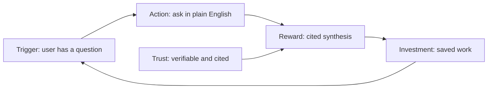

# Phase 1 session: July 21, 2026

Date: 2026-07-21
Attendees: Monideep, Claude (agent teammate)
Type: source review and architecture decisions
Context: resumed Phase 1 after a gap. Steps 1.1 through 1.5 were locked on 2026-05-07. This session covers Step 1.6.

## Steps covered

- Step 1.6: user psychology and product design - COMPLETE

## Sources reviewed

Step 1.6 ran on the three product-psychology sources:

1. Hook model and belief design (Nir Eyal): `Reference/user-side/Hook_model_and_belief_design_Nir_Eyal.md`
2. Bridging the AI adoption gap (enterprise): `Reference/user-side/Bridging_the_AI_adoption_gap_enterprise.md`
3. Build to learn vs. build to earn: `Reference/user-side/Build_to_learn_vs_build_to_earn.md`

Two sources listed against Step 1.6 in earlier planning were routed elsewhere (see "Source routing" below): the NLM-lessons doc (technical borrowings) and the board session notes (org and stakeholder dynamics).

## The frame: habit is the goal, trust is the engine

The opening question was whether System 3's adoption problem is a habit-formation problem (the Hook model applies) or a trust problem (adoption comes from being verifiably right, per the adoption-gap doc).

The answer resolved the two sources instead of choosing between them. Habit formation is the goal: we want the system to become the researcher's default first stop, the page they bookmark, the place they start any NCBI-type question instead of navigating across separate databases. Trust is the engine that forms that habit. For a research tool the variable reward is not a novelty trick. It is "every time I ask, I get a verifiably correct, cited answer faster than navigating five databases myself." Trust is what makes the loop repeat.

This grounds the Hook model's variable reward in the citations-non-negotiable rule we already hold, and it ties directly to the Phase 2 moat test (a competency question is worth including when the answer cannot just be Googled and must be synthesized across the graph and the APIs).

The Hook loop, mapped to System 3 and grounded in trust:

- Trigger (internal): the researcher has a question and wants evidence synthesis fast.
- Action: one plain-language question. No forms, no query syntax, no database picking.
- Variable reward: the unpredictable depth of correct cross-database connections, always cited. Rewards of the hunt.
- Investment: saved queries, feedback, and personalization that make the system better with use.

## The metric: default first stop, not daily-active

Nir's own bar for habit formation is weekly use. Most NCBI researchers do not have a genomics question every day. Writing "daily-active use" as the success metric would punish the system for a question cadence it does not control.

Decision: the adoption goal is to become the default first stop and the bookmarked home, measured by return-rate-per-question-occasion, not daily-active use. Frequency then follows from the user's real cadence rather than being the target itself.

## The tension: lowest-friction input versus "not a chatbot"

Two stated wants appear to fight. We want the lowest-friction input (a plain-language question) and we want the experience to feel like a research assistant, not a chatbot. Taken literally these conflict, because the lowest-friction input surface is a text box, which is exactly what a chatbot looks like.

They reconcile once "not a chatbot" is carried by two things other than the input box:

- The answer is a structured, provenance-forward research brief, not a chat bubble of prose.
- The home is a workspace (saved queries, suggested competency questions, entry points), not a blank thread. That workspace is also where the Hook investment phase becomes visible.

So the input stays chat-simple, and the answer format plus the surrounding surface are what make it feel like a research assistant.

## What Step 1.6 puts into the PRD

Six requirements carried forward as product-psychology principles for the PRD and the UI:

1. Trust is the primary adoption lever: verifiable correctness and citations are the habit-forming mechanism, not engagement mechanics. This elevates the existing citations rule to a stated adoption requirement.
2. Minimal-friction action: one plain-language question, no forms, no query syntax, no database picking.
3. Variable reward is the depth of correct cross-database synthesis, always cited. Ties directly to the Phase 2 moat test.
4. Research-assistant experience, not a chatbot: cited research-brief answers plus a workspace home, not a bare chat thread.
5. Default-first-stop as the adoption goal and success metric, not daily-active.
6. Investment loop: saved queries, feedback, and personalization that make the system better with use.

## The investment loop decision and its conflict with the SOUL.md decision

The investment loop (requirement 6) is what actually forms the habit, and it is the most expensive requirement: it needs user accounts, stored per-user state, and a data model. Three levels were considered:

- None in v1: anonymous, stateless, no saved queries. Investment loop entirely v1.1.
- Saved queries only in v1: accounts plus save and rerun a past query, no personalization or learned memory.
- Full loop in v1: saved queries plus feedback-driven personalization.

Decision: full loop in v1.

This revises part of a locked decision. The 2026-05-07 SOUL.md decision deferred USER.md (user context) and MEMORY.md (learned strategies) to v1.1, keeping v1 focused on a single behavioral directive file. Feedback-driven personalization pulls the learned-personalization capability back into v1. The new decision states: the personalization capability is now v1 scope; whether it is implemented as USER.md and MEMORY.md files or as database-backed per-user state is a tech-spec detail deferred to Phase 4. The SOUL.md behavioral directive file itself stays as decided.

Flag: this is the heaviest v1 scope item and the primary descope candidate if the build runs long. If the timeline compresses, drop from full loop to saved-queries-only before cutting anything in requirements 1 through 5.

## Clarification: what actually differentiates System 3

A follow-on question sharpened the investment-loop decision: is per-user personalization the thing that distinguishes System 3 from a general AI tool? The stated intuition was "if it is generic, people should just use a general AI tool."

Stress-tested, the intuition needed hardening. General AI tools already have memory and personalization, so standalone personalization is copyable and is not the defensible moat. What a general tool cannot do is return a deterministic, cited answer synthesized across the NCBI knowledge graph and live APIs, with every claim traceable to a source record. That is the moat, and it is exactly the Phase 2 moat test.

Two senses of personalization were separated. Domain personalization (SOUL.md: behaves as a biomedical research assistant, prioritizes peer-reviewed sources, states clinical significance) is already in v1 and is part of "not generic." Per-user personalization (the investment loop) is the habit and retention layer.

The resolution, confirmed: personalization becomes defensible the moment it is fused with the data layer. Generic memory of your chats is copyable; personalization grounded in the graph and in your own cited research history (your organisms, gene families, prior competency questions, accepted evidence standards) is not, because it requires proprietary data a general tool cannot reach. So the moat is data plus provenance, and personalization compounds it. The PRD problem statement anchors differentiation on cited cross-database synthesis, then presents personalization as the compounding, habit-forming layer. This changes framing, not build scope: the full investment loop stays in v1.

Logged as a decision (2026-07-21).

## Source routing

Earlier planning disagreed on the fourth source for Step 1.6. Plan.md listed "NLM lessons," the continuation prompt listed "board session notes." Both were reviewed and routed out of 1.6:

- NLM lessons (`Lessons_from_NLM_KG_contractor_for_System_3.md`): a technical-borrowings doc, not product psychology. Some of its six recommendations are already decided (schema slicing matches the Plan-step schema-slicing decision; the validation gate matches the Cypher validation pipeline decision). The unclaimed items are routed into the tool and architecture decision set for Steps 1.3 and 1.7: entity grounding as a `ground_entities` tool called before Cypher generation, few-shot examples drawn from the golden dataset, structured query-intent logging on the planner output, and the overengineering rubric as a periodic self-check.
- Board session notes (`thoughts/Board_session_*.md`): organizational and stakeholder dynamics (the Rana collaboration and the stakeholder-engagement split). These feed Phase 2 user research, not PRD psychology requirements. Parked for Phase 2.

## Decisions logged to DECISIONS.md

Five rows appended (2026-07-21):

1. Step 1.6 adoption frame: habit is the goal, trust is the engine.
2. Step 1.6 adoption metric: default first stop, not daily-active.
3. Step 1.6 experience model: research assistant, not a chatbot.
4. Step 1.6 investment loop full in v1, revising the SOUL.md personalization deferral.
5. Step 1.6 source routing: NLM lessons to the tool and architecture set, board notes to Phase 2.

## What is next

Step 1.7: review contractor documents (7 sources): the NFR baseline, the NLQ approach, meeting decisions D1 through D5, the contractor's latest documents, and Anne's evaluation playbook.
