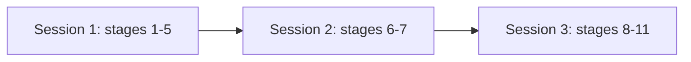

# Phase 6 continuation prompt

Phase 6 is the build. Read this file at the start of any session that continues build work. It is written to be sufficient on its own: reading it is the whole handoff, and no other instruction is needed to begin.

## Table of contents

- [Start here](#start-here)
- [State now](#state-now)
- [Which session to open, before anything else](#which-session-to-open-before-anything-else)
- [Finished phases](#finished-phases)
- [Open items](#open-items)
- [Handover](#handover)

## Start here

If you were handed this file and nothing else, this section is the instruction. Work it top to bottom, then stop reading and act.

### Step 1: know which session you are in

Run this first. It is one command and it decides what you are allowed to do:

```bash
echo "${ANTHROPIC_BASE_URL:-primary provider}"
```

- Prints `primary provider`: you are on the subscription. Every stage is available to you. Go to step 2.
- Prints a URL: you are on the alternate metered backend, and only some stages are yours to run. Read "Which session to open, before anything else" below for which, then come back. If the next action is one you may not run, stop and say so rather than running it anyway.

Do not skip this. The constraint is not recoverable once a session is running, and the failure is silent: a judge dispatched on the alternate backend runs on the builder's model and nothing reports the substitution.

### Step 2: do the next action

The next action is always one line, kept current at the top of "State now" below. Right now it is:

- BUILD PHASES 5.1 AND 5.2 BOTH CLOSED on 2026-08-30. 5.1, the 50-query golden dataset, is MERGED and sound. 5.2, the grading harness, is MERGED and PARKED: it does not work, its own suite is green with every defect live, and `replay()` refuses to run without `acknowledge_parked=True`. THE NEXT ACTION IS A PRODUCT-OWNER DECISION rather than a build step: settle whether the 50 questions are the right 50, because everything downstream depends on it. Full detail in "State now" below.
- Previously: BUILD PHASE 4.13, DURABLE CROSS-RELOAD SEARCH HISTORY, IS MERGED as PR #69 on 2026-08-27, with all four CI gates green on the pull request. Separately, the harness gained the WRITE-FIRST rule as PR #70 the same day, after four agents died in one session and one died mid-sentence holding this phase's blocking regression. A person's past questions now survive closing the browser: an owner-scoped read over the `interactions` rows build phase 4.6 writes, `GET /v1/history`, and the rail that renders them. Verified: backend 4126 passing with ZERO failed, frontend 235, browser suite 47 passed with the one documented pre-existing failure, and the reload path proven in a real browser AND proven red under mutation.
- BUILD PHASE 4.15, THE TWO-APP RELEASE FLOW, IS MERGED as PR #71 at the phase merge on 2026-08-28, all four CI gates green, then closed by the release-permission follow-up PR #74. There are now TWO independent apps: a develop app on the `develop` branch in Railway project `system3-search-agent-develop`, and a production app on the new `production` branch in `system3-search-agent`, each with its own Postgres, Redis and signing key. `develop` remains the DEFAULT branch. Merging to `develop` deploys the develop app; cutting `release/<version>` and merging it into `production` deploys the production app AND cuts a release: semantic version from the Conventional Commit subjects, a CHANGELOG.md section, an annotated tag, a GitHub Release, and a back-merge pull request into `develop`.
- THE FIRST THREE RELEASES ARE CUT, `v0.1.0`, `v0.1.1` and `v0.1.2`, on 2026-08-28. The last two ran FULLY UNATTENDED, every step, no manual intervention. P5 is closed and the live gate is 15 arms green. `CHANGELOG.md` is byte-identical on both branches, proven by diff rather than asserted.
- BUILD PHASE 5.0, OBSERVABILITY, IS MERGED as PR #83 on 2026-08-30, all four CI gates green on the pull request. It delivers tech spec Section 20 in full as THREE records with one job each: LangSmith per-run tracing joined on `trace_id`, PostHog behavioural analytics as aggregates only, and the append-only JSONL tool-call audit log.
- THE NEXT ACTION IS TO OPEN BUILD PHASE 5.1, the 50-query golden dataset and the eval harness, which is UNBLOCKED as of 2026-08-30: the product owner is the golden-dataset SIGN-OFF OWNER, a flag 5.1 had carried since it was refined. Read `requirements/Evaluation_playbook.md` and the `eval-harness` skill before opening it. STATE THE SIGN-OFF'S BOUND where the dataset's provenance is stated: the 50 expected answers are signed off by the product owner rather than by an external clinical or human-variation reviewer, so the sign-off's authority is bounded by that, and a wrong expected answer certifies a wrong agent forever, which is the exact failure the gate exists to catch.
- F-5.0-28 WAS THE PHASE'S LAST OPEN ITEM AND IT WAS ALREADY DONE when the closing session picked it up, which is worth carrying rather than deleting. The handoff, this file and commit `53be4cb`'s own message all said it was open, and that same commit contained its fix, its two arms, mutation case 22 and its `fixed` status. The previous session had genuinely re-probed and still concluded wrongly, because it varied the KEY rather than the control: the object really does survive under an ORDINARY key, which is A-5.0-14's separately declared gap, not the error-key branch F-5.0-28 named. Re-measuring the exact branch a finding names, before writing anything, is what caught it. Filed as F-5.0-29.
- WHAT LANDED IN THE LAST ROUND, all verified: the blocking F-5.0-27 is corrected (a test docstring and the mutation harness both claimed the whole-line reduction branch was unreachable through `record_tool_call`; it is reached at 7493 bytes, and there is now an arm proving it), plus F-5.0-25 and F-5.0-26's false sentences. A-5.0-24 gained the Findings-table row it was missing.
- STATE AT THE CUT: observability suite `213 passed, 1 skipped` as re-measured 2026-08-30; last full suite `4364 passed, 171 skipped, 1 xfailed, 0 failed`; `ruff check` clean over the whole repository.
- TWO GATES ARE KNOWN-RED AND DELIBERATELY DEFERRED, neither is a defect: `check_doc_drift.py` reports 11 stale counts (tests, decisions and learnings figures in CLAUDE.md, AGENTS.md and this file), which is `/phase-checkpoint`'s job; and the board's flag list for 5.0 still shows the four flags filed at phase open rather than the final open set.
- CARRIED FORWARD WITH OWNERS, not silently dropped: A-5.0-24, the analytics event is `await`ed INLINE on the query path so a slow PostHog slows a user's search. Diagnosed at `core/run.py:346` and `app.py:1851`, with the patch written out in the tracker. It was NOT applied because it necessarily breaks `test_analytics.py`, whose 14 arms assert on a recording spy immediately after the await. Recommended scope: `analytics.py` plus `test_analytics.py`, with a timing arm and a mutation reverting `create_task` to a bare `await`. Also roughly 20 minor adversary findings, recorded in `tracker/phase_5.0_adversary_report.md`.
- WHAT THIS PHASE COST AND WHY, because the number is startling and the reason is not the feature: FIVE fix-and-verify rounds on ONE control, three Rule 4 stops, and a design reversal authorized by the product owner. FOUR consecutive rounds each shipped a fix that was then defeated by an input of the SAME FAMILY, something upstream consuming the credential before the check saw it. The reversal that finally worked was to stop scanning text for credentials and BOUND what may enter the sink instead, which is `attack-the-constraint` applied to a check: when a check keeps losing to inputs of one shape, change what it is checking rather than hardening it again.
- THE SINGLE MOST TRANSFERABLE RESULT, and it is a critique of the lead's own decomposition rather than of any line of code: the phase spent four rounds hardening the LOCAL audit sink's error field because exception messages carry credentials, and shipped THE IDENTICAL STRING OFF-BOX TO LANGSMITH with no control at all. Four rounds on the best-defended field on the line. Both the judge and the adversary found it independently, and neither the lead nor any fix agent did, because every round was scoped from the file the previous round had been editing rather than from where credentials actually flow.
- THE SECOND, ON METHOD: the lead filed F-5.0-16 reporting nine characters that terminated a credential value, and it was ONE defect wearing nine costumes. Every probe carried the same `url=` prefix, which alone defeats the scan whatever character follows. Varying one thing teaches you about that thing only if everything else is genuinely inert. A fix agent DISPUTED that finding with evidence and was half right; the disagreement is what surfaced the real defect, F-5.0-19. Had the agent deferred to the lead, it would have shipped.
- READ BEFORE TOUCHING ANY OF THIS: `tracker/phase_5.0.md` for the goal contract, the ticket table and 28 findings; `tracker/phase_5.0_judge_report.md` (691 lines) and `tracker/phase_5.0_adversary_report.md` (1120 lines) for the two review rounds. The adversary's report is the exposure map and is the reason the last round was scoped correctly.
- THE DESIGN DECISION MOST LIKELY TO BE WRONGLY SIMPLIFIED BACK: the audit hook is at the three TRANSPORT chokepoints, never at `act_node`. Five production call sites reach a data layer without passing through `act_node`, and a live query proved it rather than a test: the first audit line written was `think_node`'s symbol resolution. The transport is also the ONLY place Section 20.3's required HTTP status and latency exist, since both are discarded before a tool returns. Two premise arms drive the real bypass callers by name.
- CREDENTIALS: LangSmith is live and correct, project `agentic-search-ui`, and PII absence was proven by reading traces back OUT of the service. PostHog now holds the correct `phc_` project token; the earlier `phx_` personal key was removed from `.env` and its local backup deleted. The product owner still intends to REVOKE that personal key in PostHog, which nothing depends on.
- Then 5.1, the 50-query golden dataset and the eval harness.
- WHAT THREE REAL RELEASES FOUND THAT NO TEST COULD, and it is the reason to cut one early rather than trusting a suite: a REPOSITORY SETTING no check inside a repository can observe (F-4.15-10, now pinned by arm P11); a changelog of 798 bullets and a 62,014-character release page; 173 of those bullets labelled Fixes for bugs that predate the first release, which no filter could fix and which became a hand-written entry; and two wording defects on a public page. None were reachable from the test suite. They existed only once something shipped.
- ONE PREDICTION THIS SESSION GOT WRONG, recorded rather than dropped: v0.1.2 was expected to exercise the no-user-facing-changes path and did not, because its own fix commit was typed `fix` and so earned a bullet. That path is proven in a throwaway repository and NOT in a real release.
- TWO PROJECTS RATHER THAN TWO ENVIRONMENTS, and this is the fact most likely to be "simplified" back by someone reading Section 24. A Railway service's git source, repository plus branch, is SERVICE-level. Two environments in one project CANNOT watch two branches: pointing one service at a branch for one environment moved BOTH, while an untouched service kept its own branch in both. Railway's own documentation says the opposite and the contradiction is recorded rather than resolved (F-4.15-03). The phase was designed the other way and reversed the same day.
- WHAT IT COST: FOUR review rounds against a two-round budget, every escalation authorised by the product owner, 44 findings, and the Rule 4 stop for "a defect inside an earlier fix" fired TWICE.
- THE MOST TRANSFERABLE RESULT IS NOT THE FEATURE, and it is not a bug either. FOUR defects were a CONFIDENT SENTENCE DESCRIBING A CHECK THAT WAS NOT THERE: P1's docstring claimed a comparison the body never performed; an arm claimed to prove the two apps hold different signing keys while only re-proving their databases differ; the mutation harness claimed to cover every arm TWICE, the second time inside the fix for the first and naming an uncovered arm as covered; and the board made the same claim a third time, written while fixing the second. Each survived because a confident sentence is where the next reader stops looking. THE FIX WAS DELETION, not a better sentence: the completeness claims are gone, replaced by a rule that cannot rot, "add the mutation case in the same edit as the arm".
- THE SIGNING-KEY ARM TOOK FOUR ATTEMPTS and the two middle ones both looked like fixes. Read P3c's docstring before writing any test that asserts a security property through an observable outcome. The shape: a cross-deployment 401 arrives on the MISSING USER ROW whether or not the key is shared, so the arm measured database separation and asserted key separation. Splitting it into "corrupt a signature" plus "compare the configured values" did NOT fix it, because one never reads a configured key and the other never sends a request. What works is making the user row EXIST: re-sign production's own token claims with the other key and require 401, with the same claims re-signed with production's own key accepted as the control.
- WHAT AN ADVERSARY ROUND FOUND THAT NOTHING ELSE COULD, a CRITICAL: the develop web app was live, answered 200, and could reach NO API. `VITE_API_BASE_URL` is compiled in at BUILD time and was set after the build, so the bundle shipped `http://127.0.0.1:8000`, which in a visitor's browser is the visitor's own machine. It satisfied every acceptance criterion including "all four surfaces answer 200". No arm caught it because none had ever fetched a web URL. P10 now downloads the bundle a browser would download and reads the hosts out of it.
- CI CAUGHT WHAT LOCAL RUNS DID NOT, one phase after the phase that added CI: gate 3 is `ruff check` with NO path, the whole repository, while every local check ran `ruff check src services`. Five errors passed locally and failed on the pull request. "Verified locally" is a claim about a COMMAND as much as about an environment.
- THREE THINGS MERGE OPEN, all named: CI is advisory rather than merge-blocking (F-4.14-A-04, unchanged); the back-merge pull request runs NO CI because `gh pr create` with the built-in token cannot raise workflow events, disclosed in the script, the pull request body and the release document rather than closed by putting a personal access token into the release path; and P5 is red until the FIRST RELEASE rather than until this merge, since it reads a field this branch adds and the two apps receive that code at different times.
- READ `docs/build/Release_flow.md` before cutting a release, and `tracker/phase_4.15.md` before touching the gate. The phase file carries all 44 findings, the coverage statement, and four review reports: judge, adversary, re-verify and gap-check.
- WHAT IT COST: THREE review rounds against a two-round budget, with the third authorised by the product owner, plus a fourth blocking finding from the final verifier. The review loop's STOP CONDITION FIRED FOR THE FIRST TIME since it was written, and on exactly the shape it was written for.
- THE MOST TRANSFERABLE RESULT, and it is not the feature: TWO separate defects shipped because a change made an UNSTATED INVARIANT false. F-4.13-RV-01: a re-ask fix replaced a reducer that never shrank the list with one that can, while the id generator on the line above still read `${current.length}`, so two rows took one id and clicking BRCA1 ran CFTR. F-4.13-FV-01: this phase added `mergeServerHistory` as a SECOND writer to the same list, keying on `traceId` and never on text, so the meta effect's match-by-question-text rewrote a restored row with today's numbers. Neither changed line was wrong when written.
- WHY BOTH SURVIVED REVIEW, which is the part worth carrying: in each case a comment asserted the invariant that SURVIVED. The re-ask fix's comment correctly says it preserves one-row-per-question-text, and it does. A comment asserting a NEIGHBOURING invariant is worse than no comment, because it tells the next reader identity was already thought about. Where a fix depends on a property, write the property down, including the ones you did not change.
- THE SECOND RECURRING FAILURE, twice in one phase: a reviewer's SEVERITY is trustworthy and its SCOPE is not, because a review is bounded to a diff and a defect class is bounded by nothing. F-4.13-A-01 was filed against one endpoint and was six routes wide. F-4.13-FV-01 was filed as out-of-phase because `git blame` dated the line to two weeks earlier, when this phase is what made it reachable. Before choosing a fix for any missing-check finding, grep the siblings and count the instances; that count decides whether you are fixing a bug or a class.
- THREE THINGS MERGE OPEN, all product-owner decisions taken 2026-08-27, none of them a surprise: a reload still signs an account out, so history appears only after signing in again, and "keep me signed in" is its own phase (F-4.13-02); on a shared browser one person's guest searches follow whoever signs up next, owned with build phase 4.10's migration rather than here (F-4.13-A-04); and three minor latent findings carry named owners (F-4.13-FV-03/04/05).
- READ `tracker/phase_4.13.md` before touching the rail or the history read path. It carries all 21 findings, four review reports, and the coverage statement naming what the gate does NOT cover, including the sharpest omission: the gate holds one bearer token in a Python variable across its two clients, which is exactly what no browser does.
- Previously: BUILD PHASE 4.14, CONTINUOUS INTEGRATION, MERGED as PR #68 on 2026-08-26, and CI IS LIVE AND GREEN on `develop`. Section 24's ten gates now run on every pull request. The deployed product was re-probed after the merge: web HTTP 200, api `/health` `{"status":"ok"}`.
- TWO THINGS MERGED OPEN, and the first needs a PRODUCT-OWNER DECISION rather than code. NOTHING MAKES THESE GATES MERGE-BLOCKING: branch protection needs GitHub Pro or a public repository, and `gh api .../branches/develop/protection` returns 403. A red check currently sits beside a working Merge button, which is a real improvement over nothing running and is NOT what Section 24 claims. Options: upgrade to Pro, make the repository public, or accept advisory CI and say so wherever the deliverable is described (F-4.14-A-04).
- The second: GATE 5's STRICT PATH HAS NEVER EXECUTED. Every green so far is its honest NOT RUN branch, because the graph credential is not available to CI. It is wired and asserted, just unexercised (F-4.14-RV-08).
- WHAT CI FOUND ON ITS OWN, four pre-existing defects invisible to every gate, premise test and review round in this repository: `pip install -e .` had been broken for the LIFE OF THE PROJECT, so `s3` and `s3-kgx-export` were uninstallable by anyone since build phase 4.2; the suite needs about thirty environment values a clean machine lacks, which means every earlier "verified locally" figure had been measured against a developer's own `.env`; a build phase 4.7 mutation arm called a HEALTHY assertion vacuous depending on core count; and 25 tests could never run in CI at all, hidden behind a green `4019 passed`.
- WHAT IT COST, and it is not the workflow: THREE review rounds and a RULE 4 STOP. The premise gate was defeated TWICE by text that read correctly and executed nothing. The second defeat is the one to remember: `run: ":;#ruff check"` runs NOTHING, because bash begins a comment at `#` whenever `#` starts a word and `;` ends a word, while the checker stripped comments only after WHITESPACE. Eight of ten gates were neutralised with all 97 tests green, including the mutation harness whose job was proving those arms could fail.
- THE FIX WAS A CHANGE OF APPROACH, MADE BY PRODUCT-OWNER DECISION, not a fifth patch: handling `;#` would have been the fifth instance of a class whose sixth was always going to be `&&#`, `(#`, or a YAML block scalar. THE SHELL LEFT THE WORKFLOW. Every gate's command is a checked-in script under `.github/gates/`, and every gate step's `run:` is exactly one token, that script's path. The check became a whole-string EQUALITY, which has no room for a comment or a second command, and ONE structural arm now catches all eight injection variants.
- THE TRANSFERABLE LESSON: a mutation harness proves only what it mutates. Harness 1 mutated structure and was beaten on content; harness 2 mutated content and was beaten on shell semantics. When a check keeps losing to inputs of the same shape, stop hardening the check and change what it is checking.
- READ `tracker/phase_4.14.md` before touching CI. It carries all 24 findings, the three review rounds, and the coverage statement naming what the gates do NOT cover.

- Full detail on what PR #23 (build phase 3.1's re-review debt) fixed, the two things deliberately left as open product decisions rather than fixed unilaterally (F-3.1-41, F-3.1-42), and three new minor follow-ups filed by the final reviewer (F-3.1-50, F-3.1-51, plus one already-tracked as F-3.1-46), is `tracker/phase_3.1.md`'s Findings table, current as of 2026-08-07.
- Full detail on the F-2.1-C15 fix, including the bypass a fresh-context review found in its own first version before merge and the second review that confirmed the fix, is `tracker/fix_c15_generation_bound.md`.

### Step 3: how a phase runs across sessions

`/bossman` runs stages 1 to 11 and stops only at the phase boundary. The provider split cuts across those stages and cannot change inside a running session. Those two facts collide, so a budget-split phase is three sessions, not one:

| Session | Launch | Stages | Tell it |
|---------|--------|--------|---------|
| 1 | `claude` | 1 to 5 | "open the phase, stop once the premise gate is written and failing" |
| 2 | `claude-build` | 6 to 7 | "work the tickets, stop at the judge" |
| 3 | `claude` | 8 to 11 | "judge, adversary, gates, open the pull request" |



Bossman does not stop at stage boundaries on its own, so each session needs its stop condition stated in the prompt.

The simpler default, and the right one while subscription budget is healthy: run the whole phase in one session on `claude`. The three-session split exists to rescue a week that would otherwise be lost, not as a daily routine. Reach for it when the limit is close, not before. In one line: use `claude` until it stops working, then use `claude-build`.

## State now

NEXT ACTION, the single line "Start here" step 2 refers to. Keep it current: whoever finishes a stage updates this line before ending their session.

- BUILD PHASE 5.1, THE 50-QUERY GOLDEN DATASET, IS MERGED as PR #85 on 2026-08-30, all four CI gates green. It is the evaluation set: 50 biomedical questions whose constraints were established from LIVE NCBI lookups on a path that deliberately touches none of the agent's own machinery, then independently re-verified by every review round. Three search categories, named by the product owner: KISS (one exact answer), KISSES (all known results), discovery (a thread of dependent turns), each graded against a different metric because each fails differently. Method: `docs/build/Golden_dataset_method.md`.
- BUILD PHASE 5.2, THE GRADING HARNESS, IS MERGED as PR #86 on 2026-08-30 AND IS PARKED. IT DOES NOT WORK. Four independent review rounds returned FAIL with roughly ninety findings, and its own suite is GREEN with every defect live, which is what makes it dangerous rather than merely unfinished. `replay()` raises `HarnessParkedError` unless the caller passes `acknowledge_parked=True`. Read `tracker/phase_5.2.md`'s banner before touching any of it.
- WHY IT WAS PARKED RATHER THAN FIXED, and this is the product-owner's reasoning rather than the reviewers': the 50 questions are a FIRST ATTEMPT, not a settled target. This is a prototype and the question set will change. A grader precise enough to catch an invented fact about the right gene is precision spent against a moving specification, and the instrument cannot be more settled than the thing it measures. By `attack-the-constraint`, the bottleneck is the question set.
- THE ROOT DEFECT, worth reading before any resumption: grounding compared the agent's prose against the agent's OWN citation payload, because a trace carries the agent's description of a record rather than the record. An answer about a gene that does not exist, citing a record that does not exist, scored 16 of 16 with no hard-fail. The identical circularity had been designed OUT of the dataset builder in the same phase, with a docstring explaining why, and was then designed back IN one file over.
- THE NEXT ACTION IS A PRODUCT-OWNER DECISION, not a build step: settle whether the 50 questions are the right 50. Everything downstream depends on it, including whether a grader is worth building precisely. `docs/build/Golden_dataset_method.md` documents how to change the set, and `eval/golden/build_dataset.py` re-verifies every constraint against live NCBI, so revising questions is cheap and safe. Deciding what to ask is the expensive part.
- AFTER THAT, Section 25's order resumes at build phase 6.0, rate limiting and concurrency. Build phase 7.0, model-bench, is where the parked grader would need to work, since it benchmarks candidate models per tier against the golden dataset.
- ALSO MERGED 2026-08-30, harness rather than product: PR #87 took the Write tool off review agents and grew `/standup` to seven lines; PR #88 states the branch steady state. `.claude/agents/phase-reviewer.md` is the agent to dispatch at cadence stages 8 and 9 from now on, and it has Read, Grep, Glob and Bash and NO Write, because a review round dispatched with full access deleted a tracked file outside its brief.
- WHAT FOUR FAILED ROUNDS COST AND TAUGHT, in one line each. A fabricated answer passed 34 of 50 rows while every arm was green. A hollow measurement was reported to the product owner as proof: "a fabricated answer now passes 0 of 50", produced by a probe using a judge under which nothing could pass at all. The durable repair is a PAIRED PROBE, grading a fabricated and a correct answer with the same judge and requiring the scores to differ, which no constant judge can satisfy. Both are in `LEARNINGS.md`.
- Build phase 4.16 is MERGED as PR #63 on 2026-08-25.
- Seven defects closed: the Act step now emits `tool_start` and `tool_result` AT DISPATCH via LangGraph's custom stream; a conversation thread keeps earlier turns on screen; client-side routing over `/`, `/integrations`, `/about`, `/docs` with no router dependency; the integrations page names the five surfaces that actually shipped; a citation chip no longer repeats its own source; the `ask` outcome no longer blames the reader for single-source evidence; and the feedback thumb no longer renders outside its own button.
- Then build phase 4.13 (durable cross-reload history).
- WHAT THIS PHASE COST AND TAUGHT, and it is not the features. SIX assertions that could not fail were found, FIVE of them written by the lead during this phase, every one caught by mutation or by a screenshot and NONE by reading:
  - A landed-signal that waited for the "New search" button, which BOTH the run screen and the answer screen render, so it passed the instant a question was dispatched. Two second-turn tests passed in under two seconds proving nothing. Caught by screenshotting the deployed demo and seeing a run screen with five pending pips.
  - An integrations guard whose fixture read the raw file and matched the old wrong values inside the COMMENT documenting them, where the tempting fix was deleting the comment.
  - That same guard's populate-check asserting page CONTENT rather than fixture health, so under mutation it fired first and masked all four real failures, reporting a broken harness for an intact page.
  - That same guard's surfaces arm using a substring, so "GraphQL" passed against "GraphQLXX".
- THE DEEPEST ONE IS NOT ON THAT LIST.
- Both of this phase's existing second-turn arms were CORRECT, honest, and blind: they asked "can a second turn be taken" and answered yes, on every path, in two environments, while the actual defect was that the previous turn vanished.
- A test can be right and measuring the wrong property, and that is why defect 2 survived two rounds of being looked for directly.
- THREE HARNESS GAPS FOUND, each recorded with an owner rather than worked around.
- The guest path had NEVER been exercisable in the browser suite, because the e2e mock omits `ANON_DAILY_RUN_CAP` and `_read_int_env` raises rather than defaulting, so every anonymous run 500'd; no spec had ever asked a question without signing up first, which is the only way the demo is used.
- The browser suite cannot reach a REAL tool dispatch at all, since the mock fakes only the model and `plan_node` needs a live NCBI lookup first, which is also why `query-stream-and-stop`'s `answer-cap` arm fails.
- And two live diagnostic specs were written claiming "skipped by default" with no skip, which would have fired at the public demo on every CI run.
- A DESIGN-SYSTEM GAP WORTH FIXING BEFORE THE NEXT UI PHASE: the follow-up field and the conversation thread exist ONLY in `prototype/app.html` and in NO component card, and `design-system/components/trust-pills.html` has no `ask` state.
- `Design_to_build_workflow.md` makes the cards the thing builders build against and gates assert on, so a surface absent from them is a surface nothing can grade.
- That is how a missing conversation thread shipped through build phases 4.8 and 4.9 with every gate green.

Separately from any build phase, the HARNESS itself changed on 2026-08-25 across three pull requests:

- PR #64: the `doc-readability` skill, a preservation script plus a `doc-auditor` agent that together enforce a no-information-lost guarantee on any restructured document.
- PR #65: a cost-model correction, replacing an estimated hosting figure with a measured one.
- PR #66: a phase checkpoint followed by a five-document readability pass over `Plan.md`, this file, `PROGRESS.md`, `CLAUDE.md` and `AGENTS.md`. It also carried the most serious gate fix so far, described below, and produced `tracker/locked_docs_readability_report.md`, a report-only analysis of the two LOCKED requirements documents that is ready to execute the moment the Step 6.2 reconciliation lifts the lock. Neither locked document was edited.

- Running the new gate against real documents found EIGHT defects in the gate itself, every one a FALSE POSITIVE, which is the direction that gets a gate switched off rather than trusted. Where each came from:
  - `docs/build/Build_workflow_cadence.md`, four: union candidates ranked by raw overlap so a diagram outranked the bullets a sentence split into; the candidate pool truncated away a bullet holding only an identifier; the negation check read a single anchor; the comma-chain arm counted across a whole line and required no coordinator.
  - `README.md`, three: a bare noun list flagged as a wall; a heading designator read as title case and reported twice; inline code DELETED before counting series items, which inflated the average and fired a false wall.
  - The five-document batch, one, and it is the worst: the gate was NON-DETERMINISTIC. String hashing is randomized per process and the candidate ranking followed set order, so byte-identical input produced different answers between runs. Fixed by sorting; proven by running a real pair under six hash seeds. A gate whose answer moves is worse than no gate, because a real finding becomes indistinguishable from noise.
- The determinism TEST was itself vacuous on its first two attempts, and that is recorded because it is the trap: with the fix reverted, the bundled fixture, a fixture built deliberately to force ties, and a real 355-line pair with zero findings ALL passed. Only a real pair carrying findings caught it. A green determinism result on a clean pair proves nothing.
- All six were FALSE POSITIVES, closed by calibrating the gate rather than by changing the documents.
- Full evidence, one row per run: `tracker/doc_readability_runs.md`.

- Build phase 3.1 merged as PR #22 (superseded by PR #23) on 2026-08-05 without the adversarial pass over its own fix round, which was the stated pre-merge condition.
- That gap closed across three re-review rounds, all 2026-08-07: a first re-review found the merged commit FAIL (11 of 26 findings closed clean, 15 reopened, 9 new defects including two critical), a fix round closed nearly all of it, a second re-review of THAT fix round found one more critical soundness gap (alias-matching in gene resolution could silently return a confidently WRONG gene, not just fail to resolve) plus a scattering of smaller issues, and a FOURTH reviewer, dispatched specifically because every fix so far had only been checked in the same session that wrote it, independently re-verified the whole branch fresh against live NCBI and returned APPROVE.
- Merged as PR #23.
- Full account: `tracker/phase_3.1.md`'s Findings table, including the "Final independent review" section at the bottom.

Two things were deliberately left open rather than fixed, both genuine product decisions, not bugs: whether the stopword list should exclude entries that are themselves real gene symbols (F-3.1-41), and what happens when a gene is mentioned in lowercase (F-3.1-42). Three more minor, non-blocking findings from the final review are carried to before `ncbi_efetch` gets wired into `act_node` (F-3.1-50, F-3.1-51, and F-3.1-46 already tracked).

- F-2.1-C15's generation half, the finding where a generated query took the graph server down for every user, closed on `fix/c15-generation-bound` the same day: `validate_cypher` now rejects any generated Cypher carrying a variable-length relationship pattern (`[:orthologous_to*]` or similar) before execution, the mechanism behind the original OOM.
- The existing `_MEMORY_GUARD_SQL` session-level mitigation is unchanged.
- This fix's own first version, sliced from the existing relationship-hop regex, was itself found bypassable by a fresh-context adversarial review before merge: a nested bracket (a list-valued property) alongside the variable-length spec defeated it, the same non-nesting-regex defect class already fixed once in this file for node patterns (F-2.1-A9) and never generalized to relationship hops.
- Rebuilt as a standalone, wildcard-free pattern matched directly against the quote-masked query string, independent of the hop regex entirely.
- A second independent review confirmed the bypass closed, found no new one, checked for ReDoS (none), and found one narrow, non-blocking gap against full Cypher grammar unreachable by this system's actual generation, documented rather than fixed.
- F-2.2-01 (a separate, lower-severity generation flake, roughly 1 run in 10) was deliberately left open rather than folded into the same branch, per the ticket's own allowed alternative.
- Full account: `tracker/fix_c15_generation_bound.md`.

- Twelve build phases are done, all twelve merged into `develop` (renamed from `main` at Step 6.2).
- The first six complete the Step 6.1 prototype group; 3.0 through 3.5 are all six of the Step 6.3 tool-and-trust v1 phases, and with 3.4's merge every one of them is now closed:

| Phase | Delivered | PR |
|-------|-----------|-----|
| 1.0 | FastAPI skeleton, the typed event contract, Pydantic boundary validation | #5 |
| 1.1 | Auth service, the PostgreSQL user-data schema | #6 |
| 2.0 | Real LangGraph agent loop, the three-tier harness | #9 |
| 1.2 | React shell, SSE streaming, chat UI wired end to end | #12 |
| 2.1 | cypher_query over Layer 1, first live graph access | #15 |
| 2.2 | Deterministic cite-or-refuse, Layer 1 provenance, the first trust signal | #18 |
| 3.0 | The full Section 10 guardrail, replacing the passthrough stub | #19 |
| 3.1 | ncbi_efetch, the first Layer 2 tool: seven actions across three API families, live gene-symbol resolution replacing the one-entry hardcoded table | Merged as PR #22 on 2026-08-05, PR #23 on 2026-08-07 |
| 3.2 | ncbi_dbsnp, the second Layer 2 tool: Variation Services normalization plus dbSNP ESummary clinical and population data, six review passes | #25 |
| 3.3 | pubtator_annotate and litvar2_lookup, the two Layer 3 enrichment tools, ten review rounds | #26 |
| 3.4 | Provenance extended to Layers 2 and 3 (the four added CitationPayload fields), the two-tier risk gate, data freshness and conflict resolution, T-3.1-28 (Act-step dispatch of a second layer) folded in. Two judge rounds, an adversary round (7 findings, 1 critical), a fix round, a final confirmation round | #28 |
| 3.5 | pathogen_detection and clinicaltrials_search, completing the seven-tool roster. A judge round and an adversary round that found the judge round's own fix had introduced two new critical regressions of the identical shape, both closed and live re-verified | Merged on `phase/3.5-pathogen-clinicaltrials-tools` |

Current counts, stated once here:

- Python tests: 4652 at the 2026-08-30 merge (4480 passing, 171 skipped, 1 xfailed, ZERO FAILED) on `develop` after build phases 5.1 and 5.2 merged as PR #85 and PR #86 on 2026-08-30
  - The figure at build phase 4.14's close was 4226 (4066 passing) on `phase/4.14-ci-gates`, measured 2026-08-25; build phase 4.13 adds 60, which are the premise gate's 11 arms plus the unit, endpoint, auth-liveness and boundary arms its three review rounds produced.
  - The figure at build phase 4.12's close was 4090 (3930 passing) on `phase/4.12-demo-deploy`; build phase 4.16 adds 12, being a 5-arm premise gate and a 7-case mutation harness.
  - THE STANDING SIX-FAILURE BASELINE IS GONE, and it was never six broken tests: all six were in `test_citation_trust_full_premise.py`, all six pass under `RUN_PREMISE_GATE=1`, and that file FAILED where it should have SKIPPED because its `live_only` mark gated on a model key existing rather than on outbound HTTP being permitted. Build phase 4.12 fixed it.
  - The figure before that was 4046 (3887 passing, 6 failed) on `develop` with both fix branches merged (PR #59, F-4.7-A-02, and PR #60, F-4.7-A-01), against a baseline RE-MEASURED in a throwaway worktree at `4d759da`: 3826 passing, 146 skipped, 6 failed. Neither branch's own figure is reproduced here, deliberately: each measured only its own branch, and the merged tree is neither of them, so carrying either number forward would record a total that was never true of this commit.
  - The figure recorded at build phase 4.7's close was 3979 total / 3826 passing, and the total was already 13 stale when that line was written, which is the exact failure the rest of this bullet warns about. The 6 are all PRE-EXISTING and none belong to build phase 4.7: all six are in `test_citation_trust_full_premise.py`, and they fail because that file's live Layer 2 and Layer 3 calls are blocked in the ordinary unit run.
  - RE-MEASURED AT THIS BRANCH POINT rather than carried forward, which is the practice this line exists to enforce: the figure recorded at build phase 4.4's close was 10, and the 3 `test_cypher_query_e2e.py` failures in it are simply gone, because build phase 4.11 moved Layer 1 behind an HTTPS service and those tests no longer depend on a hand-opened tunnel. The seventh `test_citation_trust_full_premise.py` failure recorded there is also gone. Neither disappearance was caused by build phase 4.7.
  - A stale baseline is how a genuine regression hides, since the next reader compares against a number that was never true, so re-measure at each phase close rather than carrying it forward, and say which commit you measured at.
- Frontend tests: 235
- Playwright end-to-end tests: 43 declarations, 50 executed cases, of which 2 are LIVE DIAGNOSTICS gated off by default behind `RUN_LIVE_DIAGNOSTICS=1` because they reach the deployed demo and spend real budget.
  - Re-run in full on 2026-08-25 during build phase 4.16.
  - The one failure is `query-stream-and-stop.spec.ts`'s "a signed-in query streams through the pipeline and produces an answer", waiting for `answer-cap`, and it is PROVEN PRE-EXISTING rather than asserted: the same spec was run at `e486310`, build phase 4.16's branch point, where it fails identically with none of that phase's changes present. Unowned as of this line.
  - The previous figure here, 29 declarations and 30 executed ALL PASSING, was measured at build phase 4.10's close on 2026-08-15 and had been carried forward through five merged phases without re-measurement, which is exactly what this file's own baseline rule forbids.
  - A webServer timeout seen during that run was an orphaned probe process squatting on the backend port, diagnosed rather than assumed, since this suite once carried an IPv6-binding defect as "environmental" for five phases. First green as of 2026-08-13, the first green run since build phase 3.0.
  - The previous note here said these were "unverifiable, a webServer-orchestration timeout unrelated to any file either phase touched, confirmed by starting the dev server directly, HTTP 200". That diagnosis was wrong and is corrected rather than deleted, because the way it was wrong is the lesson: the check started the server by hand and queried `localhost`, which resolves to `::1` on macOS, while Playwright probes `127.0.0.1`. Vite bound IPv6-only, so the evidence gathered proved a different address than the one failing.
  - Behind that timeout sat a second, older breakage: the e2e mock backend's Guard-tier response had not matched the classifier's schema since build phase 3.0, so the suite would have failed even had it started. Both are fixed
- Premise gate, cypher_query: 9 of 9
- Premise gate, write-step grounding: 11 passed, 1 xfailed by design
- Premise gate, guardrail: 20 of 20
- Premise gate, ncbi_efetch: 19 passed, 1 skipped (tunnel)
- Premise gate, ncbi_dbsnp: 8 of 8, live, no tunnel-gated skip
- Premise gate, pubtator_annotate + litvar2_lookup: 12 of 12, live, no tunnel-gated skip
- Premise gate, pathogen_detection: 5 of 5, live, no tunnel-gated skip
- Premise gate, clinicaltrials_search: 3 of 3, live, no tunnel-gated skip
- Premise gate, citation trust full (Layer 2/3 provenance, the two-tier risk gate, freshness, conflict detection): 10 of 10, live, no tunnel-gated skip, graded pass@8 on its one Synth-sampling-sensitive case (F-3.4-T05-05)
- Premise gate, build phase 4.0's own gate (a normal test file, not one of the seven live tool gates above): 26 of 26
- Premise gate, build phase 4.1's own gate (the MCP server, a normal test file, not one of the seven live tool gates above): 48 of 48
- Premise gate, build phase 4.10's own gate (the guest allowance, a normal test file, not one of the seven live tool gates above): 36 of 36, every clause mutation-proven, two-armed throughout since a control that refuses every guest passes every attack test and destroys the product
- Decisions logged: 458
- Learnings entries: 149, plus a retrospective. Restructured 2026-08-10 (PR #38): every entry from build phase 1.0 onward is now a short table row ending "Full account below," pointing to a verbatim detail section, since the table cells had grown into 100 to 500-plus word paragraphs. Nothing was reworded; only relocated. See LEARNINGS.md's own table of contents

- Build phase 3.4, citation trust extended to Layers 2 and 3, closed 2026-08-10 on `phase/3.4-citation-trust-full`, merged as PR #28 (see "Build phase 3.4, done" below).
- This was the last of the six Step 6.3 tool-and-trust phases (3.0 through 3.5) named in Section 25's dependency graph; all six are now merged, and nothing in that group is left to open.

- The build phase 3.1 tool surface is complete and its findings are settled: 40 of 42 numbered findings closed, F-3.1-04's answer-path half (Act-step wiring, Layer 2 citation, trust gate) closed by T-3.1-28, folded into build phase 3.4 as T-3.4-05, and exactly two left open on genuine product decisions, F-3.1-41 and F-3.1-42, detailed in `tracker/phase_3.1.md`.

- Step 6.2 moved on 2026-08-03 to run AFTER the 3.x tool phases rather than between 2.2 and 3.0, because its own written reasoning names 3.x as the code its security scan most exists for, and because reconciling the frozen documents after the tool phases is better input than reconciling before them.
- With build phase 3.4's merge, that condition was met, and Step 6.2 ran and closed the same day, 2026-08-10 (see "Step 6.2, done" below).
- Its security scan stays separately PAUSED INDEFINITELY on cost, with one condition that turns it back on: exposure.
- First contact with a real user, a deploy, or a public URL triggers it, whichever comes first.
- Step 6.3 continues at build phase 4.0.

Per-phase detail lives in `tracker/phase_N.M.md`. Phase narrative lives in `requirements/Plan.md`'s Revision history. Phase status and the flags that gate a phase live in `tracker/BOARD.md`.

- READ THE BOARD'S FLAG COUNT AS TWO NUMBERS, not one.
- Its flags table is a LEDGER, not a queue: a closed finding keeps its row so the trail survives, so the total only ever grows and is not a backlog.
- `render_board.py` reports the split, currently `flags: 57 open, 29 closed` (86 total), after the single number was read as 83 outstanding problems on 2026-08-23 when 26 of them were already closed.
- Of the open ones, most are CONDITIONAL, worded "whenever X is next touched": those are notes attached to code, not scheduled work, and they become work only if someone touches that code.
- The rows that are genuinely queued name a phase or a branch.

One exception to the one-owner convention, stated rather than left to be discovered.

- The Open items table below is NOT a copy of `tracker/BOARD.md`.
- Measured 2026-08-04: of its 28 tracked identifiers, 14 also appear on the board and 14 appear nowhere else in the repository.
- So the table is the full forward backlog by owner and is the sole record for half its rows, while the board carries the subset that blocks a specific phase from closing.
- Where an item appears in both, the board's "Resolve before" column is authoritative.

That split is a known wart rather than a design: the board is the incomplete one. Folding the 14 orphans into it would break the renderer's invariant that every phase's flag count matches the Open flags table, so it is a deliberate task and not a tidy-up. Until then, do not delete a row here on the assumption the board already has it.

## Which session to open, before anything else

Added 2026-08-04. The build harness has an alternate, metered model backend for when the primary provider's weekly budget runs out. It is scoped by ROLE, not by phase, and the choice is not recoverable after the fact, so make it before opening anything.

| Cadence stage | Launch with | Why |
|---------------|-------------|-----|
| 3, 5, 8, 9: decompose, premise gate, judge, adversary | `claude` | The only stages that genuinely need the primary provider. Everything spent elsewhere is taken from here |
| 1, 2, 4, 6, 7, 10, 11: open, learnings, dispatch, build, log, gates, close | `claude-build` | Cheap and metered. Every token spent here is a token those four stages keep |
| 8, 9 when the primary budget is gone | `claude-review` | Records findings, closes nothing, and stages 8 and 9 re-run on `claude` before anything merges |

Three rules that are not negotiable, each with a reason:

- Never open a phase on the alternate backend. Stages 3 and 5 are where a bad split or a weak gate cascades into every builder dispatched afterwards.
- A review produced on the alternate backend is non-binding. It records findings and closes no ticket.
- Do not spend the primary provider on builder volume. The scarce resource is not money, it is capacity for the four stages that cannot run anywhere else. Burn it on building and you reach the limit with those four unfinished, which stalls the phase completely.

Why this needs a separate session rather than a per-dispatch model argument: on the alternate backend a session-wide subagent model overrides both the per-invocation model parameter and any subagent's own frontmatter, so a judge dispatched at Depth silently runs on the builder's model. Role tiering there is done by launching a different command, full stop.

The capability bands and the alternate-backend column are in `docs/build/Build_workflow_cadence.md` under "Provider mapping". The three commands above are local wrappers; the model identifiers, prices and credential location behind them are deliberately not in any tracked file and live in a local, uncommitted note under `docs/build/multi-model-harness/`. If the wrappers are not on this machine, that folder will not be either, and plain `claude` is unaffected.

## Finished phases

The per-phase records that used to sit here were moved to `requirements/phase_6/Phase_6_history.md` on 2026-08-30, verbatim. Fourteen of them had accumulated, roughly half this file, describing phases that closed weeks ago.

For the full dated narrative of every phase, read `requirements/Plan.md`'s revision history, which is that fact's single owner.

## Open items

One decision below is still waiting on the product owner: whether `security/` stays gitignored. Still ignored today (`.gitignore:50`). This decides whether the Step 6.2 scan results are ever committed.

| Item | Description | Owner |
|------|-------------|-------|
| `GCK` resolves locally and is refused on the deployed API | Recorded as an unproven HYPOTHESIS rather than a finding, because its traceback could not be read: Railway's log stream returns container startup and `/health` lines and no request-level logs. The behaviour differs on IDENTICAL code, which is what makes it worth keeping. `tracker/phase_4.12.md` names what would settle it. Lifted here 2026-08-30 from the superseded "Read before opening the next phase" section before that section was archived | Whichever phase next touches entity resolution |
| F-3.1-41: stopword list vs. real gene symbols | Product decision, not a bug. Detailed in `tracker/phase_3.1.md` DECIDED 2026-08-15: folded into build phase 4.7's entity-resolution design, because the stopword list it turns on is the heuristic 4.7 replaces | Build phase 4.7 |
| F-3.1-42: lowercase gene mentions fall through silently | Product decision, not a bug. Detailed in `tracker/phase_3.1.md` DECIDED 2026-08-15 with F-3.1-41, same reason | Build phase 4.7 |
| F-3.1-50, F-3.1-51: RESOLVED, Step 6.2, 2026-08-10 | Re-checked live-exploitability now that `ncbi_efetch` is wired into `act_node` (T-3.4-05). F-3.1-50 confirmed live-reachable and real (`ncbi_datasets_actions`'s nested lists had no item-count bound); fixed, matching the sibling module's existing `_MAX_NESTED_ITEMS` pattern, regression test added. F-3.1-51 was a docstring overclaiming 429/503 coverage it never had; corrected | Closed |
| F-3.1-46: minor gap in code `act_node` cannot reach yet | Re-checked alongside F-3.1-50/51: `ncbi_coordinate_overlap`'s dict-recursion gap has no current caller that constructs a dict-valued field, so it stays latent, not live-reachable. No fix applied | Whenever the product owner decides, or before a future field addition nests a dict |
| F-2.2-T-01-residual | A declarative injected as a comma-spliced clause inside a single wh-question still licenses its own words. Needs clause-level rather than sentence-level filtering. Pinned by a strict xfail. Product-owner decision, Step 6.2, 2026-08-10: keep tracking rather than fix inline, real engineering work better scoped as its own task | Whenever picked up as a dedicated task |
| F-3.4-T06-01: staleness cannot fire | Section 7.4's staleness auto-cross-verify (build phase 3.4) is real, wired, and unit-tested, but every Layer 1 vertex this graph's current ingest returns carries only a generic BioLink property set, never a field named in the staleness field-class tables, so the check never fires against live data today. A System 1/2 ingest gap, not fixable from this repo. Confirmed still true at Step 6.2, 2026-08-10. Detailed in `tracker/phase_3.4.md` | Whenever System 1/2's ingest carries a richer per-domain property |
| F-3.4-A-04: premise gate coverage overclaim | `test_citation_trust_full_premise.py`'s own coverage statement claims a real concordant/discordant triangulation verdict is exercised; live-confirmed the flagship claim is structurally stuck at `insufficient` given the current single-second-origin wiring. Detailed in `tracker/phase_3.4.md` | Whenever a second live origin is wired, or the doc is corrected to state the real coverage |
| F-3.4-A-05: staleness-note precision gap | Dormant, depends on F-3.4-T06-01 firing first. When it does, the note "no live cross-check was dispatched" cannot distinguish "never dispatched" from "dispatched but timed out or errored". Detailed in `tracker/phase_3.4.md` | Whenever F-3.4-T06-01 is closed and this becomes live-reachable |
| F-3.4-A-06: source_url pattern end-anchor gap | `NCBI_SOURCE_URL_PATTERN`/`NCBI_EFETCH_RECORD_URL_PATTERN` are anchored at the start but carry no `$` end anchor, so a Pydantic `pattern=` only enforces a prefix match. Still not exploitable through any current call site (all seven verified URL-encode first, live-checked at Step 6.2, 2026-08-10). Product-owner decision, 2026-08-10: worth fixing properly, not urgent enough to rush. A naive `$` appended right after the host prefix would reject every real citation URL, since all of them carry a path or id after the host (`/gene/7157`); the real fix needs a character-class restriction on what may follow (e.g. `[A-Za-z0-9/_.\-]*$`), a scoped design decision, not a one-line edit. Detailed in `tracker/phase_3.4.md` | Scheduled as its own dedicated task, before build phase 6.1's hardening pass or before any new citation-building call site is added, whichever comes first |
| F-3.4-T03-01: guardrail step_error missing keys, RESOLVED Step 6.2, 2026-08-10 | `guardrail_node`'s `ClassificationUnavailableError` branch built a `step_error` dict missing the `fatal`/`scope` keys every other site supplies, crashing uncaught. Added both keys, matching every sibling `_step_error_kwargs`-shaped site. Detailed in `tracker/phase_3.4.md` | Closed |
| F-3.4-A-07's diagnostic gap, PARTIALLY RESOLVED Step 6.2, 2026-08-10 | The real provider error text (e.g. an OpenRouter 402) now reaches `HarnessCallError`'s internal message, so an "unexpected"-classed provider error is no longer root-causeable only by live manual reproduction. The end-user-facing message stays deliberately generic. The separate question, whether "unexpected" errors should auto-retry, is real harness-territory work, explicitly deferred rather than fixed here. Detailed in `tracker/phase_3.4.md` | A dedicated harness review round |
| Section 8.2 matching rule, RESOLVED Step 6.2, 2026-08-10 | The substring branch answered whether a clause MENTIONS the cited value, never whether it is TRUE about it. The prototype's two additions (`numbers_are_supported`, `claim_introduces_no_new_content`) are now written into the tech spec as Section 8.2 steps 5a and 5b | Closed |
| Section 23 offline gate, RESOLVED (as a decision) Step 6.2, 2026-08-10 | Now runnable for the first time (all seven tools merged). Product-owner decision: keep it scheduled for build phase 5.1 rather than run the smaller version early; running now would be setup work redone properly at 5.1, not saved work | Build phase 5.1 |
| `release-workflow` dispatch gap, RESOLVED Step 6.2, 2026-08-10 | Marked mandatory in `bossman-mode.md`, measured 0 of 6 real dispatches, an ownerless requirement by this repo's own `attack-the-constraint` standard. Rewrote the rule to name the judge round, adversary round, and stage-10 gates as the real phase-end requirement; `release-workflow` stays available as a direct invocation | Closed |
| Whole-repository security scan | No build-phase code has ever been scanned. One scan predates phase 1.0. Confirmed unchanged at Step 6.2, 2026-08-10: still PAUSED INDEFINITELY on cost | EXPOSURE (a deploy, a public URL, or first contact with a non-product-owner user), not a phase number |
| F-2.1-02, RESOLVED Step 6.2, 2026-08-10 | Section 6.1 documented a parameter mechanism that cannot work; corrected to describe the real shipped PREPARE/EXECUTE mechanism. `docs/ncbi/Tool_implementation_mechanics.md` and `.claude/rules/production-examples.md` were already correct before this reconciliation | Closed |
| F-2.1-01, RESOLVED Step 6.2, 2026-08-10 | The spec said 10 concept labels, the live graph has 11 (the eleventh is `NamedThing`). Corrected, five occurrences | Closed |
| F-2.1-16, RESOLVED Step 6.2, 2026-08-10 | `budget_for_step` diverges from Section 19.1's per-query-class shape by design (a separate per-tier budget for model-calling steps, deliberately chosen over the spec's single shape after the spec's own shape measurably failed). Section 19.1 corrected to describe the real two-shape budget | Closed |
| Env var name divergence, RESOLVED Step 6.2, 2026-08-10 | Section 24 named `PER_USER_DAILY_CAP_USD`; the code uses `PER_USER_DAILY_QUERY_CAP`, since it holds a query count, not dollars. Corrected | Closed |
| F-2.2-01 | Generation intermittently emits Cypher with no parentheses around node patterns, the graph rejects it, and nothing retries. Roughly 1 run in 10, last measured at build phase 2.2's open. Deliberately NOT fixed on `fix/c15-generation-bound`: the ticket's own acceptance criteria allowed either a retry or recording it as still open, and a retry would touch `cypher_query.py`'s error-handling path in the same review pass as a critical safety fix, which `tracker/fix_c15_generation_bound.md` argues against. Cannot be re-measured live from this environment (same tunnel constraint as T-3.0-07) | Whenever the live graph tunnel is reachable |
| F-2.1-J4-02, prompt injection | The guardrail now refuses the injected-instruction shape at admission, verified by 3.0's own premise gate. The `xfail` marker itself is NOT cleared: doing so needs 2.1's gate run five consecutive times against the live graph, and the SSH tunnel cannot be opened from this environment (the Layer-7 proxy cannot tunnel raw SSH, and `block-bash-delete.sh` blocks `ssh` as an execution wrapper). Roughly ten minutes of work whenever the tunnel is reachable | T-3.0-07, environment-gated, not phase-gated |
| F-3.0-01, RESOLVED Step 6.2, 2026-08-10 | Section 10.5 requires refusing a write-seeking request and named no `GuardPayload.category` for it; `off_topic` was reused and the real explanation lived only in the reason string. Added `write_seeking` as a new enum member (additive, v1-legal). Also found and fixed a second hand-maintained copy of the category set in the frontend's runtime type guard, which would have silently rejected a real `write_seeking` event at the UI layer | Closed |
| ADV-03, ADV-06, ADV-07 | Three guardrail defense-in-depth gaps where the Guard-tier classifier remains the covering layer: non-Latin-script injection phrases are invisible to the pre-filter's literal phrase list, the write-verb list has gaps, and `classifier.build_messages` does not escape a `</query>` in the payload. Re-homed 2026-08-04 from "the next round", which was never scheduled | 6.1 |
| ADV-02-residual | A non-English question written in pure ASCII with no cognate and no identifier is still refused as off-topic by the pre-filter. Measured: "Welche Krankheiten sind mit dem Gen assoziiert?" A keyword allowlist cannot do language detection, and per-language vocabulary is the infinite-blocklist trap. Mitigated: the classifier now judges off-topic, and the pre-filter abstains on any non-ASCII letter or on a query containing no English function word | 6.1, with the other guardrail hardening |
| F-2.1-07 | Gene symbol resolution beyond a one-entry seed table, needs the Layer 2 NCBI lookup. Also the real fix for build phase 2.2's symbol-versus-CURIE false reject | 3.1 |
| F-2.1-B10 | Same cause as F-2.1-07; an unresolvable symbol errors rather than refuses | 3.1 |
| PubTator3 relations endpoint | Path and fields still not live-verified as of build phase 3.3's close; `pubtator_annotate` has no `mode` for it. Confirmed still unverified at Step 6.2, 2026-08-10, deliberately not probed live this reconciliation (no build decision needed until someone spends the verification work) | A fast-follow ticket once verified |
| F-3.3-J-04: disclosure-policy asymmetry | `pubtator_annotate` withholds an over-cap field silently (`None`); `litvar2_lookup`, built the same phase, discloses every withholding via `fields_withheld`. Product decision, not a bug. Detailed in `tracker/phase_3.3.md` DECIDED 2026-08-15: one rule, if the system drops or shortens anything it discloses that it did. Also settles F-3.5-10 | Next backend ticket touching either tool |
| F-3.3-J-06: litvar2_lookup citation quality | RESOLVED, Step 6.2, 2026-08-10. Section 6.5 widened (additive) with two new fields: `variant_matches[].source_url`, this match's own dbSNP page, populated for every match with a real rsid regardless of match count (the output-level `source_url` stays correctly gated to the single-match case); and `pmid_source_urls`, one canonical PubMed URL per `pmids` entry. Two new regression tests | Closed |
| F-3.3-A-05: entity_lookup has no citation | RESOLVED, Step 6.2, 2026-08-10. Section 6.4's locked entity item schema widened (additive) with `source_url`, formalizing what build phase 3.3's code already shipped beyond the locked schema's `additionalProperties: false` (populated for the two live-verified db types, `ncbi_gene` and `ncbi_mesh`; `None` for `litvar`/`cvcl`, unverified record-page shapes, not attempted here) | Closed |
| F-3.3-RR-02: litvar2 empty-guard is count-based, not content-based | A row that parses as a dict but carries no identity (`_id`, `rsid` both absent) still ships as an all-`None` match under `status: "ok"`. Not reachable on live data today; deliberately not fixed a second time on a guard that already regressed once (F-3.3-RR-01) | Whenever live data actually produces this shape |
| F-3.3-A-10: non-rsid litvar_id source_url fallback | Cites a raw internal identifier as a human search term when the id doesn't match the `litvar@rs...##` shape; live-reachable (1 of 5 rows for `query="334"`) unlike most of this module's fallbacks | Whenever the product owner decides |
| F-3.3-A-11: cross-tool id-shape mismatch | `pubtator_annotate`'s `db_id` for a `litvar`-sourced entity and `litvar2_lookup`'s expected `litvar_id` are shaped differently; a plan-tier model could pass one tool's output into the other's input and get a 400. Still not reachable: build phase 3.4 (T-3.4-05, closing T-3.1-28) wired only `ncbi_efetch` into `act_node` as a second answer-bearing tool, neither `pubtator_annotate` nor `litvar2_lookup` | Whenever either tool is wired into `act_node` |
| F-3.3-A-12: undisclosed annotation/variant_matches truncation | `_MAX_ANNOTATIONS` and `_MAX_VARIANT_MATCHES` cap silently, with no companion total field, unlike `pmids`'s honest `total_pmids`. Not reachable on live data sampled this phase (max observed: 26 of 100, 5 of 10) | Whenever live data actually produces this shape |
| F-3.3-A-13: asymmetric batch-failure disposition | One malformed (non-numeric) PMID fails an `annotate_publications` batch closed with no partial result, while a numeric-but-nonexistent PMID in the same position preserves the rest of the batch (F-3.3-01's own disposition). Undocumented asymmetry, safe direction (refuses, does not fabricate) | Whenever the product owner decides |
| F-3.5-A-03: clinicaltrials_search query syntax risk | RESOLVED, Step 6.2, 2026-08-10, by disclosure. `query_cond` is parsed as an Essie expression, not a literal phrase, so a real clinical term containing `NOT` silently returns the exact inverse of what was asked, `status: "ok"`, confidently cited. Live-proven arithmetic (`Carcinoma` 27,619 minus `Carcinoma Otherwise Specified` 31 equals `Carcinoma NOT Otherwise Specified` 27,588). Product-owner decision: disclose the risk in the field's own schema description rather than escape caller text, since escaping would silently break a caller's intentional boolean search. The plan-tier model now sees the risk directly in the tool schema it is given | Closed |
| F-3.5-A-07: clinicaltrials_search weak-match shape, PARTIALLY RESOLVED Step 6.2, 2026-08-10 | The phase 3.3 weak-match shape (F-3.3-A-01/02/03) reproduces here undisclosed: `query_cond="5"`/`"the"`/`"a"` all return confident, wholly generic citations. The tool now sends `sort=@relevance`, the only concrete lever available, since ClinicalTrials.gov's `/studies` endpoint returns no per-result relevance score to disclose the way phase 3.3's fix did. Ordering improves; there is still no disclosable score | A future fix round, if the API ever exposes a disclosable relevance signal |
| F-3.5-A-09: pathogen_detection empty overloaded | RESOLVED, Step 6.2, 2026-08-10. Added `"timeout"` as a fourth `status` enum value (additive, Section 6.6 widened), and `_deadline_exceeded_output` now returns it instead of `"empty"`. `"empty"` now means only a genuine no-such-record; `"timeout"` means the wall-clock budget ran out before a qualifying row was found. No downstream consumer branched on the old 3-value set (pathogen_detection is not yet wired into `act_node`). Four tests updated | Closed |
| F-3.5-A-10: pathogen_detection dead cluster_list read | `_cluster_snp_neighbors`'s `cluster_list.tsv` membership check is unconditionally overwritten before use once the SNP scan's own results are known, so its only surviving effect is an existence check while consuming real time from the already budget-starved shared deadline | Whenever the product owner decides |
| F-3.5-A-11: pathogen_detection latent distance-column fallback | `_SNP_DISTANCES_DISTANCE_COLUMN_CANDIDATES`'s fallback to `delta_positions_unambiguous` is a genuinely different metric, not a synonym, and live sampling shows the two routinely disagree. Not observed firing on ~9,400 sampled rows; documented as a defense-in-depth-only risk | Whenever live data actually produces this shape |
| F-3.5-A-12: clinicaltrials_search overall_status enum gap | RESOLVED, Step 6.2, 2026-08-10. The locked 6-value input enum was narrower than the live API's real values, live-confirmed at 14 total (not the 12 estimated when this was filed) via `GET /api/v2/stats/field/values?fields=OverallStatus`. Widened (additive) to all 14 in Section 6.7 and the code schema. 8 new values added to the parametrized acceptance test | Closed |
| F-3.5-A-14: clinicaltrials_search punctuation error message | An unbalanced-punctuation `query_cond` (a stray closing paren) is correctly classified as a permanent HTTP 400 rejection, but the message gives no hint that punctuation is the likely cause | Whenever the product owner decides |
| F-2.2-06 | A truncated answer discloses the cut but not its scale on a listing query, since `total_available` is None for that shape. Upstream of the Write step | 3.x, whichever phase touches `cypher_query`'s totals |
| F-2.1-A5-05 | `mentioned_in` from BRCA1 costs 27 seconds forward plus the full budget reversed, despite being indexed, anchored, and LIMIT 25. Described, deliberately not reproduced | 3.x |
| F-06 | 2 of 6 model calls per query bypass the stable prompt prefix, a cost inefficiency, not a correctness defect. The Write step's own call is not one of them as of 2.2 | 4.0 |
| F-1.2-01 | The run registry never evicts a completed or abandoned run | 4.0 |
| F-1.2-02 | An abandoned client SSE connection does not halt the server-side task | 4.0 |
| F-1.2-03 | The per-run event queue is single-consumer | 4.0 |
| F-4.1-A-10: untrusted content relayed unlabelled to an agent consumer | Content originating in untrusted third-party sources (a PubMed abstract field, the narrative answer built from it) reaches an MCP caller byte-identical to the system's own words, with no field distinguishing the two. A product-level call, not a fix to invent mid-round. Detailed in `tracker/phase_4.1.md` | Whenever the product owner decides, or build phase 6.1's hardening pass, whichever comes first |
| F-4.1-A-15: caller-supplied session_id unbound to the caller | The MCP tool accepts a caller-supplied `session_id` with length validation only, no ownership check. Harmless today (nothing reads it yet); becomes a live authorization gap the moment a session-memory or interaction-capture consumer is wired. Detailed in `tracker/phase_4.1.md` | Build phase 4.5 or 4.6, whichever first wires a `Query.session_id` consumer, and before either ships |
| New-intake: design the MCP server stateless from the start, RESOLVED build phase 4.1, 2026-08-11 | An intake note on MCP's 2026-07-28 spec update (moved to a stateless request/response core, rich behavior pushed into versioned extensions, auth hardened to OAuth 2.0/OIDC) landed at Step 6.2, 2026-08-10. Followed: `adapters/mcp/server.py` mounts `streamable_http_app(stateless_http=True)`, no session state between calls. OAuth 2.0/OIDC alignment stays deliberately unbuilt in favor of reusing the existing bearer-JWT mechanism (see `tracker/phase_4.1.md`'s scope-boundary note); revisit if this ever faces real external auth rather than a custom token scheme. Full note: `personal-os-work/NIH/Agentic-Search/Reference/system-3-brainstorming/MCP_stateless_core_extensions_and_hardened_auth.md` | Closed |
| F-2.0-04 | Nothing writes `interactions` rows, so both daily cost caps read zero | 4.6 |
| F-2.0-10 | `trace_id` is client-supplied and never server-overwritten | 4.6 |
| New-intake: signal-based sampling for the manual feedback-loop review step | An intake note landed at Step 6.2, 2026-08-10: instead of random or longest-conversation sampling for which captured interactions a human reviews, score by signal (user had to correct the answer, a tool call looped, a refusal that should have answered) and review those first. One cited study reports 82 percent versus 54 percent informative-review yield from signal-based sampling. Applies to Decision G's manual-review stage. Full note: `personal-os-work/NIH/Agentic-Search/Reference/system/Serverless_on_prem_and_edge_designing_efficient_AI_systems.md` | 4.6, or 5.1 if the review step lands there instead |
| New-intake: OpenRouter Auto Router as a model-selection candidate | `openrouter/auto` classifies a prompt into one of about 30 task types and picks a model by the community's trailing 7-day spend share, reporting the model actually used in the response. It is explicitly non-deterministic and can pick a different model on every turn. DEFERRED 2026-08-30 by product-owner decision, because the eval harness being built at 5.1 and 5.2 cannot attribute a score when the model moves underneath it, and `prompt-cache-discipline` requires a tier's model to be held for a whole query. THREE distinct uses to evaluate separately: a benchmark candidate per tier at 7.0; an arm of the randomized routing at 7.1; and a FALLBACK when a pinned model is unavailable, which is resilience rather than selection and does not disturb determinism. Full reasoning in `DECISIONS.md`, 2026-08-30 | Build phase 7.0, with the 7.1 and fallback uses assessed separately |
| Golden fixture domain sign-off | Nobody is named to verify the clinical and human-variation expected answers | 5.1 |
| The golden 50 are a v1, and the settled set needs SME input | Product-owner decision, 2026-08-31: "this golden dataset is just a start based on the data that we found. Nothing else. Data + actually SME input will determine what should be the right answers." SUPERSEDES the 2026-08-30 resolution that named the product owner as the sign-off owner, which stands only for v1. WHAT IS SETTLED: every constraint in the 50 rows was read from a live NCBI lookup and independently re-verified, so the rows are factually sound. WHAT IS NOT: whether these are the right questions, and whether each expected answer is the one a domain expert would give. Neither is answerable from a lookup. THE PRACTICAL CONSEQUENCE, and the reason this is an open item rather than a note: no new golden questions get authored until SME review, because authoring against a set that review will move is what parked build phase 5.2. Build phase 5.3 therefore ships the schema that makes Layer 2 and Layer 3 requirements EXPRESSIBLE, and deliberately authors no rows that use it | An SME engagement, not a phase number. Blocks any golden-content work; blocks nothing mechanical |
| Curate LEARNINGS.md into the golden eval dataset | Product owner's idea, 2026-08-10, raised directly rather than via a new-intake note: several LEARNINGS.md findings (the bare-number and common-word weak-match cases from build phase 3.3, the third-person clinical questions from build phase 3.0, the two-gene dropped-answer case from build phase 3.4, the `NOT`-in-query risk from build phase 3.5) are concrete "a real user could ask this and get a confidently wrong answer" cases, currently pinned only as narrative plus scattered unit and regression tests, never as golden-set eval questions. Ideally LEARNINGS.md feeds the evaluation playbook, not just the codebase. Not an automatic import: most entries describe internal plumbing bugs rather than realistic user questions, and none carry a rubric score or expected citation yet, so this needs a real curation pass against the actual playbook rubric, not a bulk copy | 5.0, when the golden 50-query dataset is built |
| F-1.2-04 | Signup's 409 response undermines login's anti-enumeration guarantee. Pair with F-1.1-10, same defect class in the same endpoint | 6.1 |
| Python lockfile | Every backend dependency floats on `>=`, including security-critical ones | 6.1 |
| Stand up CI | No `.github/workflows/` exists; every gate every phase has passed was run by hand | 6.1 |
| Fix `pip install .` | Fails outright on a `package-dir` mapping error, pre-existing | 6.1 |

Unowned, needing an explicit decision rather than an assumed phase:

- F-1.1-10, F-1.1-11's `User-Agent` half, and F-1.1-18: deferred from build phase 1.1 to 1.2, and 1.2's own ticket list never touched any of the three.
- Auth-path logging: RFC 6819 family revocation still fires silently. Scheduled for build phase 1.2, did not happen, needs a new home.
- New-intake: a semantic guardrail layer, not just a shape one. An intake note landed at Step 6.2, 2026-08-10, arguing today's multi-agent schema gate only checks shape (valid JSON matching the schema), never meaning, and proposing a second layer between Act and Write that validates against MeSH, Gene Ontology, and NCBI taxonomy, catching a case like "this variant is linked to the wrong organism" that passes schema validation cleanly. A plausible enhancement to Section 10's guardrail design, not scoped anywhere yet and no trigger defined. Full note: `personal-os-work/NIH/Agentic-Search/Reference/system/Ontologies_as_guardrails_for_agentic_AI.md`

## Handover

- If a different agent takes over, read the "Running this project with a different agent" section in `CLAUDE.md`, which `AGENTS.md` mirrors.
- Short version: the file artifacts and the model tiering port cleanly, skills and rules port as content but not as invocation, and the four security hooks do not port at all.
- They are the only structural enforcement in this repo, so substituting them is the first handover step.

- One operational note that cost real time on 2026-08-03 and is not obvious from any other file: this machine's network dropped three times in one session, killing two premise-gate runs and three review agents, and every failure they produced looked like a code defect at first glance.
- Before diagnosing any model-dependent failure, check reachability with `curl -s -o /dev/null -w "%{http_code}" --max-time 15 https://openrouter.ai/api/v1/models`.
- An outage shows every premise-gate failure carrying `source='guardrail'`, the first model call in the loop, with an empty narrative and no citations, so nothing reaches synthesis at all.
- A genuine Write-step defect reaches synthesis and fails later.

Last updated: 2026-08-31.
