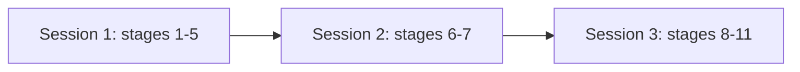

# Phase 6 continuation prompt

Phase 6 is the build. Read this file at the start of any session that continues build work. It is written to be sufficient on its own: reading it is the whole handoff, and no other instruction is needed to begin.

## Table of contents

- [Start here](#start-here)
- [State now](#state-now)
- [Which session to open, before anything else](#which-session-to-open-before-anything-else)
- [Finished phases](#finished-phases)
- [Open items](#open-items)
- [Handover](#handover)

## Start here

If you were handed this file and nothing else, this section is the instruction. Work it top to bottom, then stop reading and act.

### Step 1: know which session you are in

Run this first. It is one command and it decides what you are allowed to do:

```bash
echo "${ANTHROPIC_BASE_URL:-primary provider}"
```

- Prints `primary provider`: you are on the subscription. Every stage is available to you. Go to step 2.
- Prints a URL: you are on the alternate metered backend, and only some stages are yours to run. Read "Which session to open, before anything else" below for which, then come back. If the next action is one you may not run, stop and say so rather than running it anyway.

Do not skip this. The constraint is not recoverable once a session is running, and the failure is silent: a judge dispatched on the alternate backend runs on the builder's model and nothing reports the substitution.

### Step 2: do the next action

The next action is always one line, kept current here. Right now it is:

- WORK SET 11 FROM ITS CUTOFF. The next action, in order, is owned by `testing/UI_fix_plan.md`, section "Where we stopped", last updated at the close of 2026-09-20. Start there, with two corrections this file makes to its "Next, in order" list, because that list was written in the afternoon and the evening's work landed after it.
  - ITEM 1, confirm the broad search live, IS DONE. The product owner tested `2bb1925` on develop and their verdict was "Working", recorded in that same section's own approved table.
  - ITEM 4, settle 11.28, IS DONE. It landed as `50ed55b`, and the Set 11 table's 11.28 row carries the real cause and the fix.
  - So the first genuinely outstanding item on that list is ITEM 2, build 2a, cite every retrieved finding. Items 3, 5 and 6 follow it unchanged.
- READ THE DAY'S SUMMARY BEFORE TOUCHING ANYTHING. `testing/Shipped_2026-09-20.md` is new and is the authoritative account of what shipped on 2026-09-20 and what to retest, in the terms a person notices. The develop app a tester sees is materially different from the one every earlier cutoff describes, so a session that skips it will retest the wrong things.
- ONE ITEM IS NOT ON THE ORDERED LIST AT ALL AND NEEDS PLACING ON IT. Item 11.31, the two answer modes diverging, was decided on 2026-09-20 after "Next, in order" was written, so no document states where it sits in the order. It is DECIDED AND NOT BUILT. It carries two questions that whoever builds it must not answer on the product owner's behalf:

  - Whether a labelled explanatory sentence is ever permitted where no retrieved source supports it.
  - What replaces the removed word cap as an upper bound.

  Its constraints, including three failed directive versions it may not repeat, are in the Set 11 table's 11.31 row. Ask where it goes rather than assuming.
- CI IS GREEN ON DEVELOP, confirmed after the repair landed:

  - It had failed on two runs, both on one test-isolation defect.
  - The defect: an arm added with the MCP config fix entered the app's lifespan through `TestClient(app)`, and `StreamableHTTPSessionManager` refuses a second `.run()` in one process.
  - The repair is `c35b545`, which switches the arm to `httpx.ASGITransport`, the form the repository already documents in `adapters/mcp/test_phase_4_1_production_mount.py`'s module docstring.
  - The full ten-gate CI then ran green on the release pull request too.

  Check it yourself with `gh run list --branch develop --limit 3` rather than trusting this line in either direction.
- BOTH WORKTREES ARE GONE, removed on 2026-09-20 on the product owner's instruction that local carries only `develop`. Neither was still needed by then:
  - `breadth-wiring` was merged as `2bb1925`, and the live confirmation it was waiting on is done.
  - `agent-a8393711bb57d579b` held 11.27 and 11.28, and both are live on develop by other commits, `aedf53d` and `50ed55b`.

  Clearing a worktree is a deletion, so it was asked first, and the one uncommitted file in either was byte-compared against develop's copy before removal and was identical.
- PRODUCTION IS ON `v0.2.0`, released on the evening of 2026-09-20:

  | Fact | Value |
  |---|---|
  | First release since | v0.1.2 on 2026-08-28 |
  | Commits carried | 241 |
  | Tag points at | `cde4f59` |
  | Production health | `GET /health` on the production API returns `app_env: production` |
  | Back-merge | Already landed, so develop sits exactly one commit ahead of production |
  | How the version was chosen | THE VERSION WAS DERIVED, NOT CHOSEN: 46 `feat` commits and zero breaking changes, which `.github/release/derive_version.sh` reads as a minor bump |

  Settle any doubt with `git tag --sort=-creatordate | head` and `git log origin/production -1`, never from a document or a conversation.
- SET 11 IS NOW MOSTLY LIVE, which reverses this file's earlier warning that it was not. 11.17, 11.21, 11.27 and 11.28 all merged on 2026-09-20, so the built-but-not-live set named here before is empty. The per-item truth is the Set 11 table in `testing/UI_fix_plan.md`, which owns this fact. The other sets:

  | Sets | State |
  |---|---|
  | 1 to 7 | Approved |
  | 8 and 9 | Live on develop |
  | 10 | Untouched apart from item 10.1 |
- THE VERDICT THAT SHOULD SHAPE WHAT YOU PICK UP, given directly by the product owner on 2026-09-20: the answers look surface level, and general chatbots answer better. That is a judgement on the ANSWER PATH, not on presentation, and every remaining presentation fix leaves it untouched. It is the bar item 11.29 has to clear.
- EVIDENCE for the day is under `testing/Developer/reports/2026-09-20_*`. Start with `2026-09-20_breadth_merge/mcp_failure_explained.md`, for why the biggest feature in the queue sat unmerged for a week over a failure that was never its own, and `2026-09-20_tp53_findings/findings.md`, for the four defects one live answer exposed.
- When the product owner approves a release, follow `docs/build/Release_flow.md`. CI on the release pull request must be green, and whether develop and production use separate NCBI keys must be confirmed first. The production API already carries `MCP_ALLOWED_HOSTS`, `LANGSMITH_API_KEY`, `POSTHOG_API_KEY` and `POSTHOG_HOST`.
- The cutoff also lists what is local or kept in a worktree, the open decisions, and the known loose ends.
  Carry forward for any future parallel fix pass:

  - Split builders by the files they write
  - Pin any new wire contract first
  - Give each a goal contract
  - Never let two builders own one file region

  File fencing held across eight agents on 2026-09-20 with zero collisions. The one resource that cannot be fenced is this machine's CPU, and checking load before a run is a race rather than a queue.

THE UI FIX LOOP, product-owner decision of 2026-09-12. It replaces the build-phase cadence for UI fixes, and it overrides `.claude/rules/git-workflow.md`'s branch requirement and the judge and adversary rounds for this work only:

1. The product owner tests develop against `testing/Product/Product_workflows.md` and drops screenshots or notes into `testing/Product/feedback/inbox/`.
2. They say "check the inbox". Reply with a short triage per item: what it is, whether it is already known, and a one-line fix. Agree together what gets fixed.
3. Fix it immediately. No build phase, no multi-day plan, no judge or adversary agents. The product owner's testing is the verification.
4. Work directly on `develop`. No branch and no pull request.
5. Before pushing, run the quick checks for what changed: the affected tests and lint, in minutes rather than hours. A frontend change always runs `npm run build` before push, since Railway's own build is the thing that can fail silently otherwise. Each check gates the push on its own exit code, never through a pipe: a chained command that pipes a failing check through `tail` or `grep` can report success on a check that actually failed, which is exactly what happened on commit `ff80814` (see "Process lessons this session" below).
6. Commit with a Conventional Commit subject and push to `develop`. The develop app redeploys on its own.
7. Confirm the new code is live: the Railway deployment for that commit shows SUCCESS, and the served app actually contains the change, not just that the push succeeded. Then tell the product owner what changed and which tests to re-run.
8. Repeat from step 1 until the product owner approves develop.
9. Once they approve, run the release workflow in `docs/build/Release_flow.md`: cut `release/<version>` and merge it into `production`.

WHERE TO LOOK, in the order a fresh session should read them:

| Question | File |
|---|---|
| What shipped on 2026-09-20, and what to retest | `testing/Shipped_2026-09-20.md`, the day's summary |
| Where the last session stopped, and what is next | `testing/UI_fix_plan.md`, section "Where we stopped", read with the two corrections in Step 2 above |
| Per-item status: built, live, approved, what to retest | `testing/UI_fix_plan.md`, the single owner of this fact |
| What the product owner tests by hand | `testing/Product/Product_workflows.md`, 21 tests in plain steps |
| What must the product do, and what is broken | `testing/Developer/Developer_workflows.md`, 50 workflows in three tiers |
| How do I run any of it | `testing/Developer/Developer_workflows.md`, the three layers and the run commands |
| What did the product owner say | `testing/Product/feedback/inbox/`, any file in it |
| What is designed and what is not | `docs/build/design/README.md`, the coverage map |
| Why was that decided | `DECISIONS.md`, eight rows dated 2026-09-05, the UI-fix-loop rows dated 2026-09-12 to 2026-09-14, and seven rows dated 2026-09-20. The last three of those seven are the ones that change what gets built: widen the citation host rule so OMIM can be cited (which reverses an earlier row the same day), cite every retrieved finding, and the two answer modes diverge |
| What happened on 2026-09-20 | `testing/Shipped_2026-09-20.md` for the summary, then the evidence folders under `testing/Developer/reports/2026-09-20_*` |
| What happened overnight on 2026-09-19 | `testing/Developer/reports/2026-09-19_overnight/session_log.md`, then the three reports it points to |

### The session boundary, close of 2026-09-20

Work stopped here deliberately and resumes in a NEW session. This section replaces the one
written on the morning of 2026-09-20, which described a day that had not happened yet.

What is true on disk at the close:

- Develop is pushed and the working tree carries no source changes. One untracked folder remains, `testing/Developer/reports/2026-09-12_consistency_baseline/`, 96KB of evidence that has sat untracked for eight days. Commit it or bin it, but decide rather than leaving it.
- CI is green on develop, and the full ten-gate CI ran green on the release pull request.
- Both worktrees are gone, removed on the product owner's instruction that local carries only `develop`. The one uncommitted file in either was byte-compared against develop's copy first and was identical, so nothing was lost.
- Branch state is the agreed steady state: local `develop` only, remote `develop` and `production` only.
- Production is on `v0.2.0`, released 2026-09-20 and confirmed live, `app_env: production`.
- THE FOUR THINGS THAT WERE WAITING ON THE PRODUCT OWNER AT THE LAST CHECKPOINT ARE ALL SETTLED, and `testing/UI_fix_plan.md`'s "What is waiting on the product owner" now records each outcome so nobody re-asks. Item 11.31 is PLACED next, D-2 is decided as all four totals each labelled, the bossman deny rule is amended, and the eight-day-old evidence folder is committed. Two sub-questions inside 11.31 itself are the only things genuinely still open, and whoever builds it must not answer them on the product owner's behalf.
- The harness changed: `bossman-mode` is a router plus three reference files, merged as PR #94.
- TWO HARNESS FIXES MERGED LATE ON 2026-09-20. PR #97 fixes `/ship`'s stray-file sweep so it walks the filesystem as well as asking git, because `.gitignore` hides `* [0-9]` for eight extensions and the old git-status-only sweep was blind to 163 duplicate files including nine under `src/`. PR #98 amends `.claude/rules/bossman-mode.md`'s Deny list, which had forbidden pushing to develop while the UI fix loop did exactly that daily; there are now two named carve-outs, `/ship`'s release chain and `/bossman --ui`, and nothing else.
- BOTH THIS FILE AND `testing/UI_fix_plan.md` WERE RUN THROUGH `/doc-readability` with a fresh-context auditor. The transferable result is a warning about the gates rather than about either document: on the fix plan, bulleting was over-applied in six places and detached a governing qualifier or moved who was acting, while `check_preservation.py` read 0 lost and retention 1.000 and `check_style.py` read clean. A lexical no-loss check cannot see an attribution swap. Do not read a green pair of scripts as proof a restructure preserved meaning.
- `testing/UI_fix_plan.md` was restructured the same night. Set 11 is now an index table plus `#### Detail 11.N` subsections, because single cells had reached 4,344 characters. Add to a detail subsection rather than widening a cell.
- Item 11.32 is new: wrap the Layer 2 and Layer 3 API calls in internal MCP servers. Backlog only, nothing designed, and it is scoped against the locked technical specification's Section 6 before any work starts.

What the next session does first is `testing/UI_fix_plan.md`'s "Next, in order", read with
Step 2's corrections above: its items 1 and 4 are already done, so the work starts at
item 2, cite every retrieved finding.

THREE THINGS ARE WAITING ON THE PRODUCT OWNER and none should be decided by whoever builds
next:

- Where item 11.31 sits in the order, since it was decided after that list was written.
- The D-2 question, four totals in one answer each true of something different.
- The fact that `.claude/rules/bossman-mode.md` still denies pushing to develop directly
  while the UI fix loop does exactly that by design under the 2026-09-12 decision, which is
  a deny rule and so needs explicit sign-off rather than a quiet edit.

All three are in the fix plan's cutoff.

What is waiting on the product owner, and none of it is blocked by engineering:

- Where item 11.31 sits in the build order, since it was decided after the ordered list was written.
- The two open questions inside 11.31 itself, named in Step 2 above and in its Set 11 row.
- D-2, the four unexplained totals in one answer, and D-3, whether 100 is the right display bound for a 124-row result. Both need a product decision rather than a patch, with evidence in `testing/Developer/reports/2026-09-20_tp53_findings/findings.md`.
- The MCP redirect's scheme downgrade, which is a deployment decision rather than a code change. The mechanism is established and reproduced in `tests/system_03_search_agent/adapters/web_sse/test_mcp_mount_redirect_scheme.py`.
- Item 10.2, opening a past answer from history, which needs new persistence and therefore a data-retention decision.
- The longer standing list, unchanged:

  - The three `theme.ts` logo tokens.
  - The six undesigned surfaces.
  - Whether answers carry a medical-advice notice.
  - The 720px nav.
  - The 20-source citation cap.
  - The provenance note.
  - The mode toggle's placement.
  - The trust-line wording.

Three decisions this file listed as waiting on the morning of 2026-09-20 are now TAKEN and
must not be re-asked:

- Splitting the bold fix out and landing it alone (done, `aedf53d`).
- Whether OMIM can ever be cited (yes, as an exact additional host).
- Whether every retrieved source should be cited (yes).

The last two are recorded in `DECISIONS.md` dated 2026-09-20 and NEITHER IS BUILT.

### Process lessons from the fix-loop sessions, already applied

- Commit `ff80814` pushed with the web build failing on Railway: the pre-push type check skipped `e2e/`, and a chained command piped a failing check through `tail`, so the push went out on a false green. Fixed in `3e1ee64`: `npm run build` now runs before every frontend push, and each check gates the push on its own exit code.
- Commit `d72256b`'s message claims every frontend unit test passed (the suite had 252 at the time); that specific run had one load-related timeout (`railCollapsePremise`), which passed when run alone. Frontend tests can flake under machine load (see the "load-dependent test flakiness" row in "Open items" below): re-run a failing frontend spec alone before concluding it is a real regression.

WHAT SHIPPED IN PR #93, in the terms a person notices rather than by ticket:

- The sign-in screen is designed rather than raw browser defaults, and Enter submits it.
- The app bar no longer collides with itself on a phone, and the nav is reachable there through an overflow menu.
- The permanent disclaimer band is gone from every screen, roughly 90px back above the fold. The modal still gates once per session.
- Integrations has a copy button on every snippet and live links to the API reference and the OpenAPI schema.
- Four disclosures that were computed and rendered nowhere now render.
- A refusal looks like a refusal, whichever path produced it.
- Signing out no longer leaves the previous person's conversation on screen.

FOUR THINGS ARE WAITING ON THE PRODUCT OWNER, and none should be decided for them:

- Whether to add `layer1OnNavy`, `layer2OnNavy` and `layer3OnNavy` to `theme.ts`. `tracker/check_design_tokens.py` reports exactly three violations, all the logo's on-navy rungs. The check is correct; changing `theme.ts` is the Ask state in `.claude/rules/design-consistency.md`.
- Whether the six undesigned surfaces get designs, and in what order. `docs/build/design/README.md` names all six.
- Whether answers should carry any medical-advice notice, now that the permanent band is gone by their own instruction.
- Whether hiding the nav below 720px is right, given the design provides no menu and the overflow menu that now exists overrules it.

THE LARGEST UNFIXED THING IS THE TEST HARNESS, not the product.

- What broke: since build phase 4.7 every real run through `tests/e2e_support/mock_llm_backend.py` died at the THINK step, because 4.7 gave `think_node` a strict JSON contract and the double was never updated
- What is fixed: that is now fixed, and the run gets further
- What is still broken: it still cannot produce an answer, because the double fakes the MODEL and not Layer 1, so `act_node` reaches for a graph that is not there
- What it costs: until that is closed, no layer A test can assert on a real answer, and `query-stream-and-stop.spec.ts`'s answer case stays red

WHAT HID IT FOR SEVEN BUILD PHASES is the transferable part:

- The suite ran green because almost every spec asserts on something present whether or not a run produces an answer.
- `second-turn.spec.ts` checks that the follow-up field is visible, and the answer screen renders that field on a failed run too.
- So a green suite meant "the interface renders", never "the agent answers".
- The identical failure had already happened one node earlier at build phase 3.0, and the docstring recording that lesson was sitting in the file the whole time.

TWO PROCESS FAILURES FROM THIS SESSION, recorded because both will recur:

- A `git add -A` staged an older version of a file an agent was still writing, and the commit message then described three changes the commit did not contain. Caught only by reading the COMMITTED BLOB rather than the working tree. Check `git show HEAD:path` before trusting a commit message.
- Three agents each burned roughly a million tokens stuck in wait-for-background-run loops after their work was already complete. Verify their output yourself rather than waiting for their report.

THE LOOP CHANGED ON 2026-09-01, and this is the part most likely to be got wrong by a session that reads only the old instructions below. Product-owner decision, in `DECISIONS.md`:

- The assistant fixes the frontend and the backend.
- The assistant writes the test workflow into `docs/build/UI_feedback.md`.
- The PRODUCT OWNER runs it on develop and records what they saw.
- Feedback comes back, it gets discussed, and the cycle repeats.

Two consequences for whoever picks this up.

THE ASSISTANT DRIVES THE BROWSER WHEN ASKED, and on 2026-09-12 the product owner asked it to:

- Every push in the UI fix loop is checked on develop with Playwright screenshots and measurements at 1280px and 390px
- The eight journeys under `frontend/e2e/journeys/` still stay gated behind `RUN_LIVE_JOURNEYS=1`, since they spend real model calls, and run on request

And the judge round is no longer the gate before a merge to develop: the product owner testing on develop is the verification step, which is why build phase 6.2's tickets merged as `in-review` rather than `done`. They move to `done` on their verdict, not on the lead's.

Everything else on this page is context for that one line, and it describes the state at the close of 2026-09-20, with Set 11 of the UI fix loop mostly live and two of its items decided but unbuilt. Sections describing earlier states are replaced by pointers rather than left below, for the reason the next section gives.

### What the sections below used to say, and where that content lives now

REWRITTEN 2026-09-01, not appended to. This spot held three sections written on 2026-08-31:

- Why fixing the disease names was the next action
- What build phase 6.0 delivered
- Why build phase 6.1 should be split rather than opened

The first is DONE, so an instruction to go do it would send the next session to redo finished work. The other two are still true and are no longer this file's to carry.

Each fact now has exactly one owner:

- Why the disease names were the constraint, and what the fix turned out to be: `tracker/phase_6.2.md`, and `docs/build/UI_feedback.md`'s headline finding.
- What build phase 6.0 delivered and what merged open with it: CLAUDE.md's Build phase history table, and `tracker/phase_6.0.md`.
- Why build phase 6.1 should be split rather than opened, with the security scan and F-1.2-04 pulled out as their own small tickets: `requirements/Plan.md` Phase 7.

This deletion is the point rather than tidiness. After five build phases handled as appends instead of rewrites, this file once described build phase 2.1 in five contradictory sections at once and told the next agent not to open the phase that was actually next.


### Step 3: how a phase runs across sessions

`/bossman` runs stages 1 to 11 and stops only at the phase boundary. The provider split cuts across those stages and cannot change inside a running session. Those two facts collide, so a budget-split phase is three sessions, not one:

| Session | Launch | Stages | Tell it |
|---------|--------|--------|---------|
| 1 | `claude` | 1 to 5 | "open the phase, stop once the premise gate is written and failing" |
| 2 | `claude-build` | 6 to 7 | "work the tickets, stop at the judge" |
| 3 | `claude` | 8 to 11 | "judge, adversary, gates, open the pull request" |



Bossman does not stop at stage boundaries on its own, so each session needs its stop condition stated in the prompt.

The simpler default, and the right one while subscription budget is healthy: run the whole phase in one session on `claude`. The three-session split exists to rescue a week that would otherwise be lost, not as a daily routine. Reach for it when the limit is close, not before. In one line: use `claude` until it stops working, then use `claude-build`.

## State now

This section is DERIVED FROM `tracker/BOARD.md`. If the two disagree, the board wins and this section is stale. Open `tracker/board.html` in a browser for the same thing visually.

### The next action

"Start here", Step 2 is the single owner of the next action. Read it there.

### Earlier merged work, and where it is recorded

Build phase 6.2 (PR #92, 2026-09-01) and PR #93 (2026-09-05) are recorded in CLAUDE.md's Build phase history table, `tracker/phase_6.2.md` and `requirements/Plan.md`'s Revision history, including the six tickets that merged open with 6.2. The UI fix loop that followed is recorded item by item in `testing/UI_fix_plan.md`.

### The unit of work is no longer a build phase

Product-owner decision, 2026-08-31. This is the most important line on this page for whoever reads it next. WORK IS NOW PICKED FROM:

- Open flags
- Since 2026-09-12, `testing/UI_fix_plan.md`, the ordered fix sets built from the product owner's testing

Not from Section 25's build order.

Section 25 has run its course as a driver. Every numbered phase has merged or moved to `requirements/Plan.md` Phase 7, and `tracker/BOARD.md` carries NO open phase at all. What remains is of two kinds and neither is phase-shaped:

- Findings attached to code, which are conditional and become work only when someone touches that code.
- Defects a real person hit on the live site.

Build phase 6.0 is the argument for the change rather than an aside. It was opened because the board said it was next. It delivered contention protection that is invisible with one user, and measuring its own specification section first showed five of its eight requirements were already built. Meanwhile the defect that makes every disease answer unreadable sat in `docs/build/UI_feedback.md` the whole time. A phase number is a poor proxy for value once the specification is mostly built.

WHAT DOES NOT CHANGE, and do not let this be quietly lost:

- The premise gate written before the code and watched failing
- The judge round
- The write-first rule for findings
- A goal contract before any autonomous run

Those apply to a piece of work whatever it is called. `docs/build/Build_workflow_cadence.md` is scoped to a build phase and now needs a smaller sibling for flag-sized work. That sibling is NOT yet written, which is recorded here rather than assumed to exist.

WHAT WOULD REVERSE IT: a genuinely phase-sized deliverable, most likely whatever user feedback asks for that does not exist yet.

THE BOARD CARRIES NO OPEN PHASE AT ALL, as of later the same day: 6.1 left it too, joining 7.0 and 7.1. That is the honest state rather than a gap, because the thing standing between this product and a v1 real people can use is not a build phase.

6.1 needed handling the 7.x removals did not:

- The 7.x rows had EMPTY flag cells.
- 6.1 carried two live findings, so their mentions moved to the phases that FOUND them rather than being orphaned or deleted: F-1.2-04 to build phase 1.2, and ADV-03/06/07 to build phase 3.0.

What orders the work is this table.

### The evaluation track is CLOSED, and that is a decision rather than an oversight

Every phase in the evaluation track has merged, and the track is closed at that by product-owner decision on 2026-08-31. Do not open new evaluation work off the back of it.

What that leaves standing, stated plainly so a later reader does not mistake closed for finished:

- The 50-question golden dataset exists and its constraints were each read from a live NCBI lookup. The rows are factually sound.
- The grading harness merged and DOES NOT WORK. `replay()` refuses to run without `acknowledge_parked=True`. That is deliberate.
- Build phase 5.3's `must_reach` and `live_only` fields exist and NO golden row uses them.

Making the grader work, and authoring rows that use those fields, are post-v1 follow-up. They sit in `requirements/Plan.md` under Phase 7, not on the board, because putting them on the board would say they are queued work when they are not.

The one thing this affects downstream: build phase 7.0 benchmarks models against the golden dataset, and it will need a working grader. That dependency is real and is recorded in Phase 7 rather than being allowed to surprise whoever opens 7.0.

### Before you touch anything under `src/`

Read `docs/build/Debugging_guide.md`. It is a symptom index followed by one row for every Python file under `src/system_03_search_agent/`, and it is the fastest route from a failure to the file that owns it.

It also carries an obligation that CI enforces. Add, delete, rename or repurpose a file under `src/` and you update the guide in the SAME commit, then regenerate its manifest:

```bash
python tests/system_03_search_agent/test_debugging_guide_coverage.py
```

### Where the detail lives

Per-phase narrative is deliberately NOT repeated here, because a second copy drifts.

| What you want | Where it is |
|---|---|
| Current status, evidence, open flags | `tracker/BOARD.md`, or `tracker/board.html` in a browser |
| One file per phase, with tickets and findings | `tracker/phase_N.M.md` |
| The dated narrative of every phase | `requirements/Plan.md`, Revision history |
| What broke and what fixed it | `LEARNINGS.md` |
| Choices between alternatives | `DECISIONS.md` |
| Older Phase 6 state, kept for reference | `requirements/phase_6/Phase_6_history.md` |

## Which session to open, before anything else

Added 2026-08-04. The build harness has an alternate, metered model backend for when the primary provider's weekly budget runs out. It is scoped by ROLE, not by phase, and the choice is not recoverable after the fact, so make it before opening anything.

| Cadence stage | Launch with | Why |
|---------------|-------------|-----|
| 3, 5, 8, 9: decompose, premise gate, judge, adversary | `claude` | The only stages that genuinely need the primary provider. Everything spent elsewhere is taken from here |
| 1, 2, 4, 6, 7, 10, 11: open, learnings, dispatch, build, log, gates, close | `claude-build` | Cheap and metered. Every token spent here is a token those four stages keep |
| 8, 9 when the primary budget is gone | `claude-review` | Records findings, closes nothing, and stages 8 and 9 re-run on `claude` before anything merges |

Three rules that are not negotiable, each with a reason:

- Never open a phase on the alternate backend. Stages 3 and 5 are where a bad split or a weak gate cascades into every builder dispatched afterwards.
- A review produced on the alternate backend is non-binding. It records findings and closes no ticket.
- Do not spend the primary provider on builder volume. The scarce resource is not money, it is capacity for the four stages that cannot run anywhere else. Burn it on building and you reach the limit with those four unfinished, which stalls the phase completely.

Why this needs a separate session rather than a per-dispatch model argument: on the alternate backend a session-wide subagent model overrides both the per-invocation model parameter and any subagent's own frontmatter, so a judge dispatched at Depth silently runs on the builder's model. Role tiering there is done by launching a different command, full stop.

- The capability bands and the alternate-backend column are in `docs/build/Build_workflow_cadence.md` under "Provider mapping".
- The three commands above are local wrappers. The model identifiers, prices and credential location behind them are deliberately not in any tracked file and live in a local, uncommitted note under `docs/build/multi-model-harness/`.
- If the wrappers are not on this machine, that folder will not be either, and plain `claude` is unaffected.

## Finished phases

The per-phase records that used to sit here were moved to `requirements/phase_6/Phase_6_history.md` on 2026-08-30, verbatim. Fourteen of them had accumulated, roughly half this file, describing phases that closed weeks ago.

For the full dated narrative of every phase, read `requirements/Plan.md`'s revision history, which is that fact's single owner.

## Open items

One decision below is still waiting on the product owner: whether `security/` stays gitignored. Still ignored today (`.gitignore:50`). This decides whether the Step 6.2 scan results are ever committed.

| Item | Description | Owner |
|------|-------------|-------|
| NCBI design system stage 1 dependency | Installing the public `@uswds/uswds` package and reading colour values from it instead of hand-typed hex. Adds a dependency, changes nothing on screen. Needs a yes from the product owner. Detailed in `docs/build/design/NCBI_design_system_migration_assessment.md` | Product owner |
| Four type value mismatches, design card vs. `theme.ts` | h1 letter-spacing (card -2.8%, code -0.034em), h1 size (card 38px, code clamp 32 to 52px), h2 size (card 26px, code clamp 24 to 33px), body1 line-height (card 1.6, code 1.65). Both work; the product owner picks. Recorded in `docs/build/design/NCBI_design_system_migration_assessment.md` | Product owner |
| NCBI design system stages 2 and 3 blocked | `@ncbi-design-system/base` and `@ncbi-design-system/react` are internal to NCBI and 404 on public npm, so stages 2 and 3 cannot run from outside the NCBI network | Whoever next has NCBI-network access |
| Consistency baseline, paused | Run on 2026-09-12: 150 planned searches, only 85 really ran (65 refused by the signed-in daily limit of 100 because every run used one account). Of the 85: 13 answered (15%), 54 refused for no evidence (64%), 12 crashed mid-run (14%, likely the Think JSON failure item 2.11 has since fixed), 6 refused off-topic; 15 of 32 questions gave different outcomes across runs, only 2 answered every time, no Layer 3 call seen. Paused by the product owner so screen fixes come first. Results in `testing/Developer/reports/2026-09-12_consistency_baseline/` (untracked) | Rerun before fix set 6, across fresh test accounts |
| Account menu overclaims "no search limit" | The account menu says "no search limit in effect yet" while the signed-in daily limit of 100 does refuse searches (it counts now) | Whoever next touches the account menu copy |
| Only 2 of 7 tools run, no Layer 3 reached, SUPERSEDED | Written when live queries reached only `cypher_query` and `ncbi_efetch`. Fix set 8 wired the three-layer search on 2026-09-13, and items 11.17 and 11.21 merged the broad search on 2026-09-20 as `2bb1925`, so `core/graph.py` now dispatches six of the seven tools and `pathogen_detection` is the one it does not. WHAT IS STILL UNPROVEN is what a live question actually reaches run after run, which is what item 10.3's consistency run measures | Item 10.3, the consistency run |
| MCP rejects every request, "Invalid Host header", RESOLVED | Fix set 5's item 5.3 fixed it and the product owner approved it. Re-probed live on 2026-09-20 under item 11.30: `/mcp` responds. A SEPARATE defect was found in the same probe and is open, the redirect's scheme downgrade, which is a deployment decision rather than a code change | Closed, with the scheme downgrade tracked under item 11.30 |
| Load-dependent test flakiness (D4) | Frontend tests fail under machine load rather than from a real regression: `railCollapsePremise` timed out once in a full run on 2026-09-13 and passed 20 of 20 alone three times; rail-collapse and query-stream end-to-end specs failed 4 while a second agent's test run shared the machine, then passed 14 of 14 alone. Re-run a failing spec alone before concluding it is a real defect | Whoever next hits a flaky frontend run |
| Think step retry, and a remaining transient timeout | Item 2.11 (commit `e67323a`) makes the Think step retry once when the model's classification reply is not valid JSON. Measured live after deploy: 5 of 6 guest searches finished; the one failure was a different, transient timeout, not the JSON failure the retry fixes | Whoever next investigates Think-step reliability |
| `GCK` resolves locally and is refused on the deployed API | Recorded as an unproven HYPOTHESIS rather than a finding, because its traceback could not be read: Railway's log stream returns container startup and `/health` lines and no request-level logs. The behaviour differs on IDENTICAL code, which is what makes it worth keeping. `tracker/phase_4.12.md` names what would settle it. Lifted here 2026-08-30 from the superseded "Read before opening the next phase" section before that section was archived | Whichever phase next touches entity resolution |
| F-3.1-41: stopword list vs. real gene symbols | Product decision, not a bug. Detailed in `tracker/phase_3.1.md` DECIDED 2026-08-15: folded into build phase 4.7's entity-resolution design, because the stopword list it turns on is the heuristic 4.7 replaces | Build phase 4.7 |
| F-3.1-42: lowercase gene mentions fall through silently | Product decision, not a bug. Detailed in `tracker/phase_3.1.md` DECIDED 2026-08-15 with F-3.1-41, same reason | Build phase 4.7 |
| F-3.1-50, F-3.1-51: RESOLVED, Step 6.2, 2026-08-10 | Re-checked live-exploitability now that `ncbi_efetch` is wired into `act_node` (T-3.4-05). F-3.1-50 confirmed live-reachable and real (`ncbi_datasets_actions`'s nested lists had no item-count bound); fixed, matching the sibling module's existing `_MAX_NESTED_ITEMS` pattern, regression test added. F-3.1-51 was a docstring overclaiming 429/503 coverage it never had; corrected | Closed |
| F-3.1-46: minor gap in code `act_node` cannot reach yet | Re-checked alongside F-3.1-50/51: `ncbi_coordinate_overlap`'s dict-recursion gap has no current caller that constructs a dict-valued field, so it stays latent, not live-reachable. No fix applied | Whenever the product owner decides, or before a future field addition nests a dict |
| F-2.2-T-01-residual | A declarative injected as a comma-spliced clause inside a single wh-question still licenses its own words. Needs clause-level rather than sentence-level filtering. Pinned by a strict xfail. Product-owner decision, Step 6.2, 2026-08-10: keep tracking rather than fix inline, real engineering work better scoped as its own task | Whenever picked up as a dedicated task |
| F-3.4-T06-01: staleness cannot fire | Section 7.4's staleness auto-cross-verify (build phase 3.4) is real, wired, and unit-tested, but every Layer 1 vertex this graph's current ingest returns carries only a generic BioLink property set, never a field named in the staleness field-class tables, so the check never fires against live data today. A System 1/2 ingest gap, not fixable from this repo. Confirmed still true at Step 6.2, 2026-08-10. Detailed in `tracker/phase_3.4.md` | Whenever System 1/2's ingest carries a richer per-domain property |
| F-3.4-A-04: premise gate coverage overclaim | `test_citation_trust_full_premise.py`'s own coverage statement claims a real concordant/discordant triangulation verdict is exercised; live-confirmed the flagship claim is structurally stuck at `insufficient` given the current single-second-origin wiring. Detailed in `tracker/phase_3.4.md` | Whenever a second live origin is wired, or the doc is corrected to state the real coverage |
| F-3.4-A-05: staleness-note precision gap | Dormant, depends on F-3.4-T06-01 firing first. When it does, the note "no live cross-check was dispatched" cannot distinguish "never dispatched" from "dispatched but timed out or errored". Detailed in `tracker/phase_3.4.md` | Whenever F-3.4-T06-01 is closed and this becomes live-reachable |
| F-3.4-A-06: source_url pattern end-anchor gap | `NCBI_SOURCE_URL_PATTERN`/`NCBI_EFETCH_RECORD_URL_PATTERN` are anchored at the start but carry no `$` end anchor, so a Pydantic `pattern=` only enforces a prefix match. Still not exploitable through any current call site (all seven verified URL-encode first, live-checked at Step 6.2, 2026-08-10). Product-owner decision, 2026-08-10: worth fixing properly, not urgent enough to rush. A naive `$` appended right after the host prefix would reject every real citation URL, since all of them carry a path or id after the host (`/gene/7157`); the real fix needs a character-class restriction on what may follow (e.g. `[A-Za-z0-9/_.\-]*$`), a scoped design decision, not a one-line edit. Detailed in `tracker/phase_3.4.md` | Scheduled as its own dedicated task, before build phase 6.1's hardening pass or before any new citation-building call site is added, whichever comes first |
| F-3.4-T03-01: guardrail step_error missing keys, RESOLVED Step 6.2, 2026-08-10 | `guardrail_node`'s `ClassificationUnavailableError` branch built a `step_error` dict missing the `fatal`/`scope` keys every other site supplies, crashing uncaught. Added both keys, matching every sibling `_step_error_kwargs`-shaped site. Detailed in `tracker/phase_3.4.md` | Closed |
| F-3.4-A-07's diagnostic gap, PARTIALLY RESOLVED Step 6.2, 2026-08-10 | The real provider error text (e.g. an OpenRouter 402) now reaches `HarnessCallError`'s internal message, so an "unexpected"-classed provider error is no longer root-causeable only by live manual reproduction. The end-user-facing message stays deliberately generic. The separate question, whether "unexpected" errors should auto-retry, is real harness-territory work, explicitly deferred rather than fixed here. Detailed in `tracker/phase_3.4.md` | A dedicated harness review round |
| Section 8.2 matching rule, RESOLVED Step 6.2, 2026-08-10 | The substring branch answered whether a clause MENTIONS the cited value, never whether it is TRUE about it. The prototype's two additions (`numbers_are_supported`, `claim_introduces_no_new_content`) are now written into the tech spec as Section 8.2 steps 5a and 5b | Closed |
| Section 23 offline gate, RESOLVED (as a decision) Step 6.2, 2026-08-10 | Now runnable for the first time (all seven tools merged). Product-owner decision: keep it scheduled for build phase 5.1 rather than run the smaller version early; running now would be setup work redone properly at 5.1, not saved work | Build phase 5.1 |
| `release-workflow` dispatch gap, RESOLVED Step 6.2, 2026-08-10 | Marked mandatory in `bossman-mode.md`, measured 0 of 6 real dispatches, an ownerless requirement by this repo's own `attack-the-constraint` standard. Rewrote the rule to name the judge round, adversary round, and stage-10 gates as the real phase-end requirement; `release-workflow` stays available as a direct invocation | Closed |
| Whole-repository security scan | No build-phase code has ever been scanned. One scan predates phase 1.0. Confirmed unchanged at Step 6.2, 2026-08-10: still PAUSED INDEFINITELY on cost | EXPOSURE (a deploy, a public URL, or first contact with a non-product-owner user), not a phase number |
| F-2.1-02, RESOLVED Step 6.2, 2026-08-10 | Section 6.1 documented a parameter mechanism that cannot work; corrected to describe the real shipped PREPARE/EXECUTE mechanism. `docs/ncbi/Tool_implementation_mechanics.md` and `.claude/rules/production-examples.md` were already correct before this reconciliation | Closed |
| F-2.1-01, RESOLVED Step 6.2, 2026-08-10 | The spec said 10 concept labels, the live graph has 11 (the eleventh is `NamedThing`). Corrected, five occurrences | Closed |
| F-2.1-16, RESOLVED Step 6.2, 2026-08-10 | `budget_for_step` diverges from Section 19.1's per-query-class shape by design (a separate per-tier budget for model-calling steps, deliberately chosen over the spec's single shape after the spec's own shape measurably failed). Section 19.1 corrected to describe the real two-shape budget | Closed |
| Env var name divergence, RESOLVED Step 6.2, 2026-08-10 | Section 24 named `PER_USER_DAILY_CAP_USD`; the code uses `PER_USER_DAILY_QUERY_CAP`, since it holds a query count, not dollars. Corrected | Closed |
| F-2.2-01 | Generation intermittently emits Cypher with no parentheses around node patterns, the graph rejects it, and nothing retries. Roughly 1 run in 10, last measured at build phase 2.2's open. Deliberately NOT fixed on `fix/c15-generation-bound`: the ticket's own acceptance criteria allowed either a retry or recording it as still open, and a retry would touch `cypher_query.py`'s error-handling path in the same review pass as a critical safety fix, which `tracker/fix_c15_generation_bound.md` argues against. Cannot be re-measured live from this environment (same tunnel constraint as T-3.0-07) | Whenever the live graph tunnel is reachable |
| F-2.1-J4-02, prompt injection | The guardrail now refuses the injected-instruction shape at admission, verified by 3.0's own premise gate. The `xfail` marker itself is NOT cleared: doing so needs 2.1's gate run five consecutive times against the live graph, and the SSH tunnel cannot be opened from this environment (the Layer-7 proxy cannot tunnel raw SSH, and `block-bash-delete.sh` blocks `ssh` as an execution wrapper). Roughly ten minutes of work whenever the tunnel is reachable | T-3.0-07, environment-gated, not phase-gated |
| F-3.0-01, RESOLVED Step 6.2, 2026-08-10 | Section 10.5 requires refusing a write-seeking request and named no `GuardPayload.category` for it; `off_topic` was reused and the real explanation lived only in the reason string. Added `write_seeking` as a new enum member (additive, v1-legal). Also found and fixed a second hand-maintained copy of the category set in the frontend's runtime type guard, which would have silently rejected a real `write_seeking` event at the UI layer | Closed |
| ADV-03, ADV-06, ADV-07 | Three guardrail defense-in-depth gaps where the Guard-tier classifier remains the covering layer: non-Latin-script injection phrases are invisible to the pre-filter's literal phrase list, the write-verb list has gaps, and `classifier.build_messages` does not escape a `</query>` in the payload. Re-homed 2026-08-04 from "the next round", which was never scheduled | 6.1 |
| ADV-02-residual | A non-English question written in pure ASCII with no cognate and no identifier is still refused as off-topic by the pre-filter. Measured: "Welche Krankheiten sind mit dem Gen assoziiert?" A keyword allowlist cannot do language detection, and per-language vocabulary is the infinite-blocklist trap. Mitigated: the classifier now judges off-topic, and the pre-filter abstains on any non-ASCII letter or on a query containing no English function word | 6.1, with the other guardrail hardening |
| F-2.1-07 | Gene symbol resolution beyond a one-entry seed table, needs the Layer 2 NCBI lookup. Also the real fix for build phase 2.2's symbol-versus-CURIE false reject | 3.1 |
| F-2.1-B10 | Same cause as F-2.1-07; an unresolvable symbol errors rather than refuses | 3.1 |
| PubTator3 relations endpoint | Path and fields still not live-verified as of build phase 3.3's close; `pubtator_annotate` has no `mode` for it. Confirmed still unverified at Step 6.2, 2026-08-10, deliberately not probed live this reconciliation (no build decision needed until someone spends the verification work) | A fast-follow ticket once verified |
| F-3.3-J-04: disclosure-policy asymmetry | `pubtator_annotate` withholds an over-cap field silently (`None`); `litvar2_lookup`, built the same phase, discloses every withholding via `fields_withheld`. Product decision, not a bug. Detailed in `tracker/phase_3.3.md` DECIDED 2026-08-15: one rule, if the system drops or shortens anything it discloses that it did. Also settles F-3.5-10 | Next backend ticket touching either tool |
| F-3.3-J-06: litvar2_lookup citation quality | RESOLVED, Step 6.2, 2026-08-10. Section 6.5 widened (additive) with two new fields: `variant_matches[].source_url`, this match's own dbSNP page, populated for every match with a real rsid regardless of match count (the output-level `source_url` stays correctly gated to the single-match case); and `pmid_source_urls`, one canonical PubMed URL per `pmids` entry. Two new regression tests | Closed |
| F-3.3-A-05: entity_lookup has no citation | RESOLVED, Step 6.2, 2026-08-10. Section 6.4's locked entity item schema widened (additive) with `source_url`, formalizing what build phase 3.3's code already shipped beyond the locked schema's `additionalProperties: false` (populated for the two live-verified db types, `ncbi_gene` and `ncbi_mesh`; `None` for `litvar`/`cvcl`, unverified record-page shapes, not attempted here) | Closed |
| F-3.3-RR-02: litvar2 empty-guard is count-based, not content-based | A row that parses as a dict but carries no identity (`_id`, `rsid` both absent) still ships as an all-`None` match under `status: "ok"`. Not reachable on live data today; deliberately not fixed a second time on a guard that already regressed once (F-3.3-RR-01) | Whenever live data actually produces this shape |
| F-3.3-A-10: non-rsid litvar_id source_url fallback | Cites a raw internal identifier as a human search term when the id doesn't match the `litvar@rs...##` shape; live-reachable (1 of 5 rows for `query="334"`) unlike most of this module's fallbacks | Whenever the product owner decides |
| F-3.3-A-11: cross-tool id-shape mismatch | `pubtator_annotate`'s `db_id` for a `litvar`-sourced entity and `litvar2_lookup`'s expected `litvar_id` are shaped differently; a plan-tier model could pass one tool's output into the other's input and get a 400. Still not reachable: build phase 3.4 (T-3.4-05, closing T-3.1-28) wired only `ncbi_efetch` into `act_node` as a second answer-bearing tool, neither `pubtator_annotate` nor `litvar2_lookup` | Whenever either tool is wired into `act_node` |
| F-3.3-A-12: undisclosed annotation/variant_matches truncation | `_MAX_ANNOTATIONS` and `_MAX_VARIANT_MATCHES` cap silently, with no companion total field, unlike `pmids`'s honest `total_pmids`. Not reachable on live data sampled this phase (max observed: 26 of 100, 5 of 10) | Whenever live data actually produces this shape |
| F-3.3-A-13: asymmetric batch-failure disposition | One malformed (non-numeric) PMID fails an `annotate_publications` batch closed with no partial result, while a numeric-but-nonexistent PMID in the same position preserves the rest of the batch (F-3.3-01's own disposition). Undocumented asymmetry, safe direction (refuses, does not fabricate) | Whenever the product owner decides |
| F-3.5-A-03: clinicaltrials_search query syntax risk | RESOLVED, Step 6.2, 2026-08-10, by disclosure. `query_cond` is parsed as an Essie expression, not a literal phrase, so a real clinical term containing `NOT` silently returns the exact inverse of what was asked, `status: "ok"`, confidently cited. Live-proven arithmetic (`Carcinoma` 27,619 minus `Carcinoma Otherwise Specified` 31 equals `Carcinoma NOT Otherwise Specified` 27,588). Product-owner decision: disclose the risk in the field's own schema description rather than escape caller text, since escaping would silently break a caller's intentional boolean search. The plan-tier model now sees the risk directly in the tool schema it is given | Closed |
| F-3.5-A-07: clinicaltrials_search weak-match shape, PARTIALLY RESOLVED Step 6.2, 2026-08-10 | The phase 3.3 weak-match shape (F-3.3-A-01/02/03) reproduces here undisclosed: `query_cond="5"`/`"the"`/`"a"` all return confident, wholly generic citations. The tool now sends `sort=@relevance`, the only concrete lever available, since ClinicalTrials.gov's `/studies` endpoint returns no per-result relevance score to disclose the way phase 3.3's fix did. Ordering improves; there is still no disclosable score | A future fix round, if the API ever exposes a disclosable relevance signal |
| F-3.5-A-09: pathogen_detection empty overloaded | RESOLVED, Step 6.2, 2026-08-10. Added `"timeout"` as a fourth `status` enum value (additive, Section 6.6 widened), and `_deadline_exceeded_output` now returns it instead of `"empty"`. `"empty"` now means only a genuine no-such-record; `"timeout"` means the wall-clock budget ran out before a qualifying row was found. No downstream consumer branched on the old 3-value set (pathogen_detection is not yet wired into `act_node`). Four tests updated | Closed |
| F-3.5-A-10: pathogen_detection dead cluster_list read | `_cluster_snp_neighbors`'s `cluster_list.tsv` membership check is unconditionally overwritten before use once the SNP scan's own results are known, so its only surviving effect is an existence check while consuming real time from the already budget-starved shared deadline | Whenever the product owner decides |
| F-3.5-A-11: pathogen_detection latent distance-column fallback | `_SNP_DISTANCES_DISTANCE_COLUMN_CANDIDATES`'s fallback to `delta_positions_unambiguous` is a genuinely different metric, not a synonym, and live sampling shows the two routinely disagree. Not observed firing on ~9,400 sampled rows; documented as a defense-in-depth-only risk | Whenever live data actually produces this shape |
| F-3.5-A-12: clinicaltrials_search overall_status enum gap | RESOLVED, Step 6.2, 2026-08-10. The locked 6-value input enum was narrower than the live API's real values, live-confirmed at 14 total (not the 12 estimated when this was filed) via `GET /api/v2/stats/field/values?fields=OverallStatus`. Widened (additive) to all 14 in Section 6.7 and the code schema. 8 new values added to the parametrized acceptance test | Closed |
| F-3.5-A-14: clinicaltrials_search punctuation error message | An unbalanced-punctuation `query_cond` (a stray closing paren) is correctly classified as a permanent HTTP 400 rejection, but the message gives no hint that punctuation is the likely cause | Whenever the product owner decides |
| F-2.2-06 | A truncated answer discloses the cut but not its scale on a listing query, since `total_available` is None for that shape. Upstream of the Write step | 3.x, whichever phase touches `cypher_query`'s totals |
| F-2.1-A5-05 | `mentioned_in` from BRCA1 costs 27 seconds forward plus the full budget reversed, despite being indexed, anchored, and LIMIT 25. Described, deliberately not reproduced | 3.x |
| F-06 | 2 of 6 model calls per query bypass the stable prompt prefix, a cost inefficiency, not a correctness defect. The Write step's own call is not one of them as of 2.2 | 4.0 |
| F-1.2-01 | The run registry never evicts a completed or abandoned run | 4.0 |
| F-1.2-02 | An abandoned client SSE connection does not halt the server-side task | 4.0 |
| F-1.2-03 | The per-run event queue is single-consumer | 4.0 |
| F-4.1-A-10: untrusted content relayed unlabelled to an agent consumer | Content originating in untrusted third-party sources (a PubMed abstract field, the narrative answer built from it) reaches an MCP caller byte-identical to the system's own words, with no field distinguishing the two. A product-level call, not a fix to invent mid-round. Detailed in `tracker/phase_4.1.md` | Whenever the product owner decides, or build phase 6.1's hardening pass, whichever comes first |
| F-4.1-A-15: caller-supplied session_id unbound to the caller | The MCP tool accepts a caller-supplied `session_id` with length validation only, no ownership check. Harmless today (nothing reads it yet); becomes a live authorization gap the moment a session-memory or interaction-capture consumer is wired. Detailed in `tracker/phase_4.1.md` | Build phase 4.5 or 4.6, whichever first wires a `Query.session_id` consumer, and before either ships |
| New-intake: design the MCP server stateless from the start, RESOLVED build phase 4.1, 2026-08-11 | An intake note on MCP's 2026-07-28 spec update (moved to a stateless request/response core, rich behavior pushed into versioned extensions, auth hardened to OAuth 2.0/OIDC) landed at Step 6.2, 2026-08-10. Followed: `adapters/mcp/server.py` mounts `streamable_http_app(stateless_http=True)`, no session state between calls. OAuth 2.0/OIDC alignment stays deliberately unbuilt in favor of reusing the existing bearer-JWT mechanism (see `tracker/phase_4.1.md`'s scope-boundary note); revisit if this ever faces real external auth rather than a custom token scheme. Full note: `personal-os-work/NIH/Agentic-Search/Reference/system-3-brainstorming/MCP_stateless_core_extensions_and_hardened_auth.md` | Closed |
| F-2.0-04 | Nothing writes `interactions` rows, so both daily cost caps read zero | 4.6 |
| F-2.0-10 | `trace_id` is client-supplied and never server-overwritten | 4.6 |
| New-intake: signal-based sampling for the manual feedback-loop review step | An intake note landed at Step 6.2, 2026-08-10: instead of random or longest-conversation sampling for which captured interactions a human reviews, score by signal (user had to correct the answer, a tool call looped, a refusal that should have answered) and review those first. One cited study reports 82 percent versus 54 percent informative-review yield from signal-based sampling. Applies to Decision G's manual-review stage. Full note: `personal-os-work/NIH/Agentic-Search/Reference/system/Serverless_on_prem_and_edge_designing_efficient_AI_systems.md` | 4.6, or 5.1 if the review step lands there instead |
| New-intake: OpenRouter Auto Router as a model-selection candidate | `openrouter/auto` classifies a prompt into one of about 30 task types and picks a model by the community's trailing 7-day spend share, reporting the model actually used in the response. It is explicitly non-deterministic and can pick a different model on every turn. DEFERRED 2026-08-30 by product-owner decision, because the eval harness being built at 5.1 and 5.2 cannot attribute a score when the model moves underneath it, and `prompt-cache-discipline` requires a tier's model to be held for a whole query. THREE distinct uses to evaluate separately: a benchmark candidate per tier at 7.0; an arm of the randomized routing at 7.1; and a FALLBACK when a pinned model is unavailable, which is resilience rather than selection and does not disturb determinism. Full reasoning in `DECISIONS.md`, 2026-08-30 | Build phase 7.0, with the 7.1 and fallback uses assessed separately |
| Golden fixture domain sign-off | Nobody is named to verify the clinical and human-variation expected answers | 5.1 |
| The golden 50 are a v1, and the settled set needs SME input | Product-owner decision, 2026-08-31: "this golden dataset is just a start based on the data that we found. Nothing else. Data + actually SME input will determine what should be the right answers." SUPERSEDES the 2026-08-30 resolution that named the product owner as the sign-off owner, which stands only for v1. WHAT IS SETTLED: every constraint in the 50 rows was read from a live NCBI lookup and independently re-verified, so the rows are factually sound. WHAT IS NOT: whether these are the right questions, and whether each expected answer is the one a domain expert would give. Neither is answerable from a lookup. THE PRACTICAL CONSEQUENCE, and the reason this is an open item rather than a note: no new golden questions get authored until SME review, because authoring against a set that review will move is what parked build phase 5.2. Build phase 5.3 therefore ships the schema that makes Layer 2 and Layer 3 requirements EXPRESSIBLE, and deliberately authors no rows that use it | An SME engagement, not a phase number. Blocks any golden-content work; blocks nothing mechanical |
| Curate LEARNINGS.md into the golden eval dataset | Product owner's idea, 2026-08-10, raised directly rather than via a new-intake note: several LEARNINGS.md findings (the bare-number and common-word weak-match cases from build phase 3.3, the third-person clinical questions from build phase 3.0, the two-gene dropped-answer case from build phase 3.4, the `NOT`-in-query risk from build phase 3.5) are concrete "a real user could ask this and get a confidently wrong answer" cases, currently pinned only as narrative plus scattered unit and regression tests, never as golden-set eval questions. Ideally LEARNINGS.md feeds the evaluation playbook, not just the codebase. Not an automatic import: most entries describe internal plumbing bugs rather than realistic user questions, and none carry a rubric score or expected citation yet, so this needs a real curation pass against the actual playbook rubric, not a bulk copy | 5.0, when the golden 50-query dataset is built |
| F-1.2-04 | Signup's 409 response undermines login's anti-enumeration guarantee. Pair with F-1.1-10, same defect class in the same endpoint | 6.1 |
| Python lockfile | Every backend dependency floats on `>=`, including security-critical ones | 6.1 |
| Stand up CI | No `.github/workflows/` exists; every gate every phase has passed was run by hand | 6.1 |
| Fix `pip install .` | Fails outright on a `package-dir` mapping error, pre-existing | 6.1 |

Unowned, needing an explicit decision rather than an assumed phase:

- F-1.1-10, F-1.1-11's `User-Agent` half, and F-1.1-18: deferred from build phase 1.1 to 1.2, and 1.2's own ticket list never touched any of the three.
- Auth-path logging: RFC 6819 family revocation still fires silently. Scheduled for build phase 1.2, did not happen, needs a new home.
- New-intake: a semantic guardrail layer, not just a shape one. An intake note landed at Step 6.2, 2026-08-10, arguing today's multi-agent schema gate only checks shape (valid JSON matching the schema), never meaning, and proposing a second layer between Act and Write that validates against MeSH, Gene Ontology, and NCBI taxonomy, catching a case like "this variant is linked to the wrong organism" that passes schema validation cleanly. A plausible enhancement to Section 10's guardrail design, not scoped anywhere yet and no trigger defined. Full note: `personal-os-work/NIH/Agentic-Search/Reference/system/Ontologies_as_guardrails_for_agentic_AI.md`

## Handover

- If a different agent takes over, read the "Running this project with a different agent" section in `CLAUDE.md`, which `AGENTS.md` mirrors.
- Short version: the file artifacts and the model tiering port cleanly, skills and rules port as content but not as invocation, and the four security hooks do not port at all.
- They are the only structural enforcement in this repo, so substituting them is the first handover step.

- One operational note that cost real time on 2026-08-03 and is not obvious from any other file: this machine's network dropped three times in one session, killing two premise-gate runs and three review agents, and every failure they produced looked like a code defect at first glance.
- Before diagnosing any model-dependent failure, check reachability with `curl -s -o /dev/null -w "%{http_code}" --max-time 15 https://openrouter.ai/api/v1/models`.
- An outage shows every premise-gate failure carrying `source='guardrail'`, the first model call in the loop, with an empty narrative and no citations, so nothing reaches synthesis at all.
- A genuine Write-step defect reaches synthesis and fails later.

Last updated: 2026-09-20.
